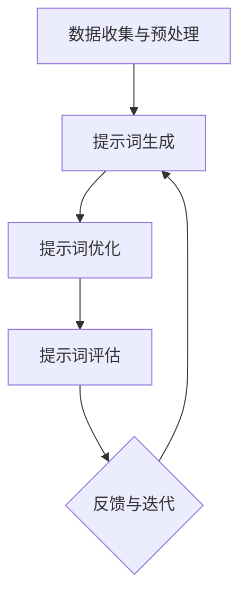

                 

# 《提示词工程在自然语言理解中的深度应用》

> **关键词：** 自然语言理解、提示词工程、深度学习、文本分类、问答系统、对话系统

> **摘要：** 本文从自然语言理解的基本概念出发，深入探讨了提示词工程在其中的重要应用。通过分析提示词工程的核心技术，并结合实际应用案例，本文全面展示了提示词工程在文本分类、问答系统、对话系统等领域的深度应用。同时，本文还对未来提示词工程的发展趋势进行了展望。

----------------------------------------------------------------

## 第一部分：引言与概述

### 第1章：自然语言理解与提示词工程

#### 1.1 自然语言理解的基本概念

自然语言理解（Natural Language Understanding，NLU）是人工智能领域的一个重要分支，它涉及使计算机能够处理和解析人类语言的能力。自然语言理解的目标是使计算机能够理解、解释和生成自然语言，从而实现人与机器的有效沟通。

- **定义与目标：** 自然语言理解是指通过计算机程序对自然语言的含义进行识别和理解。其目标包括：文本分类、实体识别、情感分析、语义理解、问答系统等。
  
- **历史与发展：** 自然语言理解的历史可以追溯到20世纪50年代，当时研究者开始探索如何让计算机理解自然语言。随着计算技术的进步和算法的发展，自然语言理解取得了显著的进展，特别是近年来，深度学习技术的引入，使得自然语言理解达到了新的高度。

- **主要挑战与机遇：** 自然语言理解面临的主要挑战包括语言的复杂性、歧义性、语境依赖性等。然而，这些挑战同时也带来了巨大的机遇，例如在智能客服、智能助手、内容推荐、自动化翻译等领域，自然语言理解的应用前景广阔。

#### 1.2 提示词工程的作用与重要性

提示词工程（Prompt Engineering）是自然语言理解中的一个重要领域，它专注于设计、开发和优化用于自然语言处理的提示词（prompts）。提示词是一种引导用户输入的提示性语句，它可以帮助用户更好地理解任务，从而提高自然语言处理的效果。

- **提示词工程的概念：** 提示词工程是指通过设计、开发和优化提示词，以提高自然语言处理模型的性能和用户体验。提示词可以是文本、图像、语音等形式，它们在自然语言处理的不同阶段都有重要作用。

- **提示词的作用：** 提示词在自然语言处理中有多种作用，包括引导用户输入、增强语义理解、提高模型性能等。例如，在问答系统中，一个好的提示词可以帮助用户更好地表达问题，从而提高问答系统的准确性和效率。

- **提示词工程在自然语言理解中的应用：** 提示词工程在自然语言理解中的应用非常广泛，包括文本分类、情感分析、实体识别、问答系统、对话系统等。通过优化提示词，可以提高模型的性能，同时降低用户的负担。

#### 1.3 书籍结构概述

本书籍结构分为三个部分，第一部分引言与概述，第二部分应用实例，第三部分前沿研究与发展趋势。

- **第一部分：引言与概述**：介绍了自然语言理解与提示词工程的基本概念，分析了提示词工程在自然语言理解中的重要性。
  
- **第二部分：应用实例**：通过具体的案例，展示了提示词工程在文本分类、问答系统、对话系统等领域的应用。
  
- **第三部分：前沿研究与发展趋势**：探讨了提示词工程的前沿研究与发展趋势，包括深度学习、多模态提示词工程、伦理与隐私问题等。

### 《提示词工程在自然语言理解中的深度应用》目录大纲

- **第一部分：引言与概述**
  - 第1章：自然语言理解与提示词工程
    - 1.1 自然语言理解的基本概念
    - 1.2 提示词工程的作用与重要性
    - 1.3 书籍结构概述

- **第二部分：应用实例**
  - 第2章：提示词工程的核心技术
    - 2.1 提示词生成方法
    - 2.2 提示词优化与评估
    - 2.3 提示词工程中的关键技术

  - 第3章：文本分类中的提示词工程
    - 3.1 文本分类的挑战与解决方案
    - 3.2 提示词工程在文本分类中的应用案例
    - 3.3 提示词工程的案例分析

  - 第4章：问答系统中的提示词工程
    - 4.1 问答系统的基本概念
    - 4.2 提示词工程在问答系统中的应用
    - 4.3 问答系统的应用实例

  - 第5章：机器翻译中的提示词工程
    - 5.1 机器翻译的基本概念
    - 5.2 提示词工程在机器翻译中的应用
    - 5.3 机器翻译中的提示词工程案例

  - 第6章：对话系统中的提示词工程
    - 6.1 对话系统的基本概念
    - 6.2 提示词工程在对话系统中的应用
    - 6.3 对话系统的应用实例

- **第三部分：前沿研究与发展趋势**
  - 第7章：提示词工程的前沿研究与发展趋势
    - 7.1 提示词工程的研究进展
    - 7.2 提示词工程的发展趋势
    - 7.3 未来展望

- **附录与资源**
  - 附录A：提示词工程工具与资源
  - 附录B：代码示例

---

通过上述目录大纲，读者可以清晰地了解到本书的主要内容结构，以及各个章节的核心内容。接下来，我们将进一步深入探讨提示词工程的核心技术，以及在自然语言理解中的应用实例。

----------------------------------------------------------------

## 第二部分：提示词工程的核心技术

### 第2章：提示词工程的核心技术

#### 2.1 提示词生成方法

提示词生成是提示词工程中的关键步骤，它决定了提示词的质量和适用性。提示词生成方法主要包括以下几种：

- **传统的规则方法**：这种方法基于领域知识和规则进行提示词生成。例如，通过定义关键词、短语或句子，来引导用户进行输入。这种方法虽然简单，但往往难以应对复杂的自然语言环境。

- **基于统计模型的方法**：这种方法利用统计模型，如条件概率模型、隐马尔可夫模型（HMM）等，来生成提示词。这些模型可以基于大量的语料库进行训练，从而生成较为准确的提示词。

- **基于深度学习的方法**：这种方法利用深度学习模型，如循环神经网络（RNN）、长短期记忆网络（LSTM）、变换器（Transformer）等，来生成提示词。深度学习模型可以捕捉到语言中的复杂结构和语义信息，从而生成高质量的提示词。

#### 2.2 提示词优化与评估

提示词优化是提升自然语言处理模型性能的重要手段。提示词优化的目标是在保持提示词简洁明了的同时，提高模型的性能和用户体验。

- **优化目标：** 提示词优化的目标包括：提高模型的准确率、降低用户的输入负担、提高模型的泛化能力等。

- **评估方法：** 提示词评估方法主要包括以下几种：
  - **定量评估**：使用指标如准确率、召回率、F1值等来评估提示词的质量。
  - **定性评估**：通过用户调查、问卷调查等方式，评估提示词的用户体验和满意度。

- **调优技巧：** 提示词调优技巧包括：
  - **调整提示词长度**：通过实验，调整提示词的长度，以找到最佳长度。
  - **添加上下文信息**：通过在提示词中添加上下文信息，如时间、地点、情境等，来提高提示词的相关性和准确性。
  - **使用数据增强**：通过数据增强技术，如数据扩充、数据清洗等，来提高提示词的训练质量。

#### 2.3 提示词工程中的关键技术

在提示词工程中，还有几个关键技术需要重点关注：

- **语言模型**：语言模型是一种用于预测下一个单词或短语的模型。在提示词工程中，语言模型可以用于生成提示词，或评估提示词的质量。

- **问答系统**：问答系统是一种基于自然语言理解的技术，它可以理解用户的问题，并给出准确的答案。在提示词工程中，问答系统可以用于优化提示词，提高模型的性能。

- **生成对抗网络（GAN）**：生成对抗网络是一种深度学习模型，它可以用于生成高质量的提示词。GAN通过生成器与判别器的对抗训练，可以生成与真实数据相似的高质量提示词。

### 提示词工程的核心技术架构

提示词工程的核心技术架构可以概括为以下几个关键步骤：

1. **数据收集与预处理**：收集相关的自然语言数据，并进行预处理，如去噪、去重、分词、词性标注等。

2. **提示词生成**：根据数据预处理的结果，利用提示词生成方法生成初始提示词。

3. **提示词优化**：对生成的提示词进行优化，通过调整提示词的长度、上下文信息等，以提高提示词的质量。

4. **提示词评估**：使用评估方法对优化后的提示词进行评估，以确定提示词的质量和适用性。

5. **反馈与迭代**：根据评估结果，对提示词进行进一步优化和调整，形成闭环迭代过程。

#### 提示词工程的核心技术流程

提示词工程的核心技术流程可以用以下Mermaid流程图表示：



通过上述核心技术流程，我们可以看到，提示词工程是一个动态调整和优化的过程，通过不断地收集反馈、优化提示词，可以提高自然语言处理模型的性能和用户体验。

---

在本章节中，我们详细介绍了提示词工程的核心技术，包括提示词生成方法、提示词优化与评估方法，以及提示词工程中的关键技术。接下来，我们将通过实际应用实例，进一步探讨提示词工程在文本分类、问答系统、对话系统等领域的具体应用。

----------------------------------------------------------------

## 第二部分：应用实例

### 第3章：文本分类中的提示词工程

#### 3.1 文本分类的挑战与解决方案

文本分类是自然语言处理中的一个重要任务，它涉及将文本数据分类到预定义的类别中。文本分类在许多应用场景中具有广泛的应用，如垃圾邮件过滤、情感分析、新闻分类等。然而，文本分类也面临一些挑战：

- **数据噪声**：现实世界中的文本数据往往包含大量的噪声，如拼写错误、标点符号、停用词等，这些噪声会影响文本分类的准确性。

- **词语歧义**：自然语言中的词语歧义是一个常见问题，同一个词语在不同的上下文中可能具有不同的含义，这给文本分类带来了困难。

- **类别重叠**：在某些情况下，不同类别之间的边界可能不够清晰，导致类别重叠，从而增加了文本分类的难度。

为了解决这些挑战，提示词工程在文本分类中发挥了关键作用：

- **数据预处理**：通过预处理技术，如分词、词性标注、停用词过滤等，可以减少数据噪声，提高文本分类的准确性。

- **特征工程**：特征工程是文本分类中的关键步骤，通过将文本转换为数字特征表示，可以帮助分类模型更好地理解文本数据。

- **提示词优化**：通过优化提示词，可以引导用户输入更加准确和清晰的文本数据，从而提高文本分类的准确性和用户体验。

#### 3.2 提示词工程在文本分类中的应用案例

在本节中，我们将探讨几个具体的文本分类应用案例，以及提示词工程在这些应用中的具体应用。

- **垃圾邮件过滤**：垃圾邮件过滤是文本分类的一个重要应用。通过将电子邮件分类为垃圾邮件和正常邮件，可以减少用户的邮件负担，提高工作效率。提示词工程在垃圾邮件过滤中的应用主要包括：
  - **提示词生成**：生成用于引导用户输入邮件内容的提示词，如“请输入您的邮件主题”、“请描述邮件内容”等。
  - **提示词优化**：通过优化提示词，如添加上下文信息或调整提示词的长度，以提高用户输入的准确性和分类的准确性。
  - **模型训练与优化**：使用大量标记好的垃圾邮件数据训练分类模型，并通过提示词优化和模型调整，提高分类模型的性能。

- **情感分析**：情感分析是一种常见的文本分类任务，它旨在分析文本中的情感倾向，如正面、负面、中性等。提示词工程在情感分析中的应用主要包括：
  - **提示词生成**：生成用于引导用户输入文本的提示词，如“请描述您对这篇文章的感受”、“请评价这个产品的质量”等。
  - **提示词优化**：通过优化提示词，如调整提示词的长度或添加情感标签，以提高用户输入的准确性和情感分析的准确性。
  - **模型训练与优化**：使用大量带有情感标签的文本数据训练情感分析模型，并通过提示词优化和模型调整，提高模型的性能。

- **新闻分类**：新闻分类是一种将新闻文本分类到不同类别（如政治、经济、体育等）的任务。提示词工程在新闻分类中的应用主要包括：
  - **提示词生成**：生成用于引导用户输入新闻标题或正文的提示词，如“请输入新闻标题”、“请简要描述新闻内容”等。
  - **提示词优化**：通过优化提示词，如调整提示词的长度或添加关键词，以提高用户输入的准确性和新闻分类的准确性。
  - **模型训练与优化**：使用大量带有类别标签的新闻文本数据训练分类模型，并通过提示词优化和模型调整，提高分类模型的性能。

#### 3.3 提示词工程的案例分析

在本节中，我们将通过一个具体的案例，展示提示词工程在文本分类中的应用。

- **案例背景**：假设我们有一个在线新闻平台，需要对该平台上的新闻进行分类，以便用户能够快速找到他们感兴趣的新闻。我们的目标是设计一套有效的文本分类系统，并利用提示词工程来提高分类的准确性。

- **数据收集与预处理**：首先，我们收集了大量带有类别标签的新闻文本数据，并对这些数据进行预处理，如分词、词性标注、停用词过滤等。

- **提示词生成**：根据新闻文本的特点，我们设计了以下提示词：
  - **新闻标题**：“请输入新闻标题”
  - **新闻内容**：“请简要描述新闻内容”

- **提示词优化**：为了提高用户输入的准确性和分类的准确性，我们对提示词进行了优化：
  - **标题优化**：添加上下文信息，如“请输入新闻的标题，例如‘2023年全球经济增长预测’”。
  - **内容优化**：添加情感标签，如“请描述新闻内容，例如‘这篇文章主要讨论了2023年全球经济增长的预期，以及其中可能面临的风险’”。

- **模型训练与优化**：我们使用预处理后的新闻文本数据训练了一个文本分类模型，如支持向量机（SVM）或深度学习模型（如Transformer）。通过不断的模型训练和提示词优化，我们逐步提高了分类的准确性。

- **提示词评估与迭代**：我们对优化后的提示词进行了评估，并通过用户调查和模型性能指标（如准确率、召回率等）来确定提示词的有效性。根据评估结果，我们对提示词进行了进一步的优化和调整，形成了闭环迭代过程。

通过上述案例，我们可以看到，提示词工程在文本分类中的应用是如何通过优化提示词、提高用户输入准确性和分类模型性能，从而实现高效和准确的文本分类。

---

在本章节中，我们详细介绍了文本分类中的提示词工程，包括挑战与解决方案、应用案例，以及具体的案例分析。接下来，我们将探讨提示词工程在问答系统中的应用。

----------------------------------------------------------------

### 第4章：问答系统中的提示词工程

#### 4.1 问答系统的基本概念

问答系统（Question Answering System）是一种人工智能系统，旨在回答用户提出的问题。问答系统在智能客服、智能助手、教育辅导等领域具有广泛的应用。问答系统可以分为以下几种类型：

- **基于知识的问答系统**：这种系统依赖于事先定义的知识库，通过查询知识库来回答用户的问题。例如，专家系统就是一种基于知识的问答系统。

- **基于统计的问答系统**：这种系统使用统计方法，如机器学习算法，来训练模型，以回答用户的问题。例如，基于隐马尔可夫模型（HMM）的问答系统。

- **基于机器学习的问答系统**：这种系统使用深度学习技术，如循环神经网络（RNN）、长短期记忆网络（LSTM）、变换器（Transformer）等，来训练模型，以回答用户的问题。

- **混合问答系统**：这种系统结合了基于知识、统计和机器学习的方法，以提高问答系统的性能和泛化能力。

#### 4.2 提示词工程在问答系统中的应用

提示词工程在问答系统中发挥着重要作用，它通过设计高质量的提示词，可以提高问答系统的性能和用户体验。

- **提示词生成策略**：提示词生成策略是问答系统中的关键环节，它决定了问答系统如何引导用户输入问题。常见的提示词生成策略包括：
  - **模板生成**：根据预设的模板生成提示词，例如，“您对什么主题感兴趣？”、“您有什么问题需要解答？”等。
  - **关键词提取**：从用户输入的文本中提取关键词，生成相应的提示词，例如，如果用户输入了“苹果”，则生成“您对苹果有什么疑问？”
  - **语义理解**：利用自然语言处理技术，理解用户的意图和问题，生成相应的提示词，例如，如果用户询问“明天的天气怎么样？”，则生成“您想知道明天的天气情况吗？”

- **提示词优化与评估**：提示词优化的目标是提高用户输入的准确性和问答系统的性能。提示词优化的方法包括：
  - **长度调整**：通过调整提示词的长度，以找到最适合用户输入的长度。过长的提示词可能会使用户感到困惑，而过短的提示词可能无法充分引导用户输入。
  - **上下文信息添加**：在提示词中添加上下文信息，例如时间、地点、情境等，以帮助用户更好地理解问题。例如，在回答“明天是否下雨？”这个问题时，可以在提示词中添加“在您所在的城市”。
  - **语义理解增强**：通过利用自然语言处理技术，如词性标注、实体识别、语义角色标注等，增强提示词的语义理解，以提高问答系统的性能。

- **提示词在问答系统中的作用**：提示词在问答系统中起着至关重要的作用，它不仅可以引导用户输入问题，还可以提高问答系统的性能和用户体验。具体作用包括：
  - **引导用户输入**：提示词可以引导用户输入更加准确和清晰的问题，从而提高问答系统的性能。
  - **提高问答系统性能**：通过优化提示词，可以减少用户的输入负担，提高问答系统的准确性和效率。
  - **改善用户体验**：高质量的提示词可以增强用户的体验，使用户感到更加方便和舒适。

#### 4.3 问答系统的应用实例

在本节中，我们将通过一个具体的实例，展示提示词工程在问答系统中的应用。

- **案例背景**：假设我们开发了一个智能客服系统，旨在回答用户关于产品和服务的问题。我们的目标是设计一套高效的问答系统，通过提示词工程来提高系统的性能和用户体验。

- **数据收集与预处理**：首先，我们收集了大量用户的问题和对应的答案，并对这些问题和答案进行预处理，如分词、词性标注、实体识别等。

- **提示词生成**：根据用户问题和答案的特点，我们设计了以下提示词：
  - **问题引导**：“您有什么关于产品的问题需要解答吗？”
  - **答案引导**：“请问您想了解哪个方面的信息？”

- **提示词优化**：为了提高用户输入的准确性和问答系统的性能，我们对提示词进行了优化：
  - **问题引导优化**：添加上下文信息，如“关于我们的最新产品‘智能手表’，您有什么疑问？”
  - **答案引导优化**：根据用户的问题，动态生成答案引导，例如，如果用户问题是“智能手表如何连接手机？”，则答案引导为“请问您想了解如何设置智能手表与手机的连接？”

- **模型训练与优化**：我们使用预处理后的用户问题和答案数据训练了一个问答系统模型，如基于变换器的问答模型。通过不断的模型训练和提示词优化，我们逐步提高了问答系统的性能。

- **提示词评估与迭代**：我们对优化后的提示词进行了评估，并通过用户调查和模型性能指标（如回答准确率、用户满意度等）来确定提示词的有效性。根据评估结果，我们对提示词进行了进一步的优化和调整，形成了闭环迭代过程。

通过上述案例，我们可以看到，提示词工程在问答系统中的应用是如何通过优化提示词、提高用户输入准确性和问答系统性能，从而实现高效和准确的问答服务的。

---

在本章节中，我们详细介绍了问答系统中的提示词工程，包括基本概念、应用策略，以及具体的应用实例。接下来，我们将探讨提示词工程在对话系统中的应用。

----------------------------------------------------------------

### 第5章：机器翻译中的提示词工程

#### 5.1 机器翻译的基本概念

机器翻译（Machine Translation，MT）是自然语言处理领域的一个重要分支，它涉及将一种语言的文本自动翻译成另一种语言。机器翻译系统可以分为以下几种类型：

- **基于规则的方法**：这种方法使用人工编写的语法规则和词典，进行文本翻译。尽管这种方法在早期被广泛应用，但由于其依赖人工规则，难以处理复杂的语言现象。

- **基于统计的方法**：这种方法使用统计模型，如短语翻译模型、基于短语的统计机器翻译模型（如基于句法的统计机器翻译）等，进行文本翻译。统计方法在处理大规模数据集时表现出色，但往往难以应对语言中的细微差异。

- **基于神经网络的机器翻译**：这种方法使用深度学习模型，如循环神经网络（RNN）、长短期记忆网络（LSTM）、变换器（Transformer）等，进行文本翻译。神经网络方法能够捕捉到语言中的复杂结构和语义信息，近年来在机器翻译领域取得了显著进展。

#### 5.2 提示词工程在机器翻译中的应用

提示词工程在机器翻译中扮演着关键角色，通过优化提示词，可以提高机器翻译系统的性能和用户体验。

- **提示词生成策略**：提示词生成策略是机器翻译系统中的关键环节，它决定了系统如何引导用户输入源语言文本。常见的提示词生成策略包括：
  - **模板生成**：根据预设的模板生成提示词，例如，“请输入源语言文本”。
  - **关键词提取**：从源语言文本中提取关键词，生成相应的提示词，例如，如果源语言文本中包含“苹果”，则生成“请输入包含‘苹果’的源语言文本”。
  - **语义理解**：利用自然语言处理技术，理解源语言文本的语义，生成相应的提示词，例如，如果源语言文本表达了一个具体的请求，则生成“请输入您需要翻译的具体请求”。

- **提示词优化与评估**：提示词优化的目标是提高用户输入的准确性和机器翻译系统的性能。提示词优化的方法包括：
  - **长度调整**：通过调整提示词的长度，以找到最适合用户输入的长度。过长的提示词可能会使用户感到困惑，而过短的提示词可能无法充分引导用户输入。
  - **上下文信息添加**：在提示词中添加上下文信息，例如时间、地点、情境等，以帮助用户更好地理解输入的文本。例如，在翻译一个涉及特定地点的文本时，可以在提示词中添加地点信息。
  - **语义理解增强**：通过利用自然语言处理技术，如词性标注、实体识别、语义角色标注等，增强提示词的语义理解，以提高机器翻译系统的性能。

- **提示词在机器翻译中的作用**：提示词在机器翻译中起着至关重要的作用，它不仅可以引导用户输入源语言文本，还可以提高机器翻译系统的性能和用户体验。具体作用包括：
  - **引导用户输入**：提示词可以引导用户输入更加准确和清晰的源语言文本，从而提高机器翻译系统的性能。
  - **提高机器翻译系统性能**：通过优化提示词，可以减少用户的输入负担，提高机器翻译系统的准确性和效率。
  - **改善用户体验**：高质量的提示词可以增强用户的体验，使用户感到更加方便和舒适。

#### 5.3 机器翻译中的提示词工程案例

在本节中，我们将通过一个具体的案例，展示提示词工程在机器翻译中的应用。

- **案例背景**：假设我们开发了一个在线机器翻译平台，用户可以输入源语言文本，系统将自动翻译成目标语言。我们的目标是设计一套高效的机器翻译系统，通过提示词工程来提高系统的性能和用户体验。

- **数据收集与预处理**：首先，我们收集了大量带有源语言和目标语言对的双语文本数据，并对这些数据进行预处理，如分词、词性标注、实体识别等。

- **提示词生成**：根据源语言文本和目标语言文本的特点，我们设计了以下提示词：
  - **源语言文本输入**：“请输入您需要翻译的源语言文本”。
  - **目标语言文本输入**：“请输入您想要翻译的目标语言文本”。

- **提示词优化**：为了提高用户输入的准确性和机器翻译系统的性能，我们对提示词进行了优化：
  - **源语言文本输入优化**：添加上下文信息，如“请输入您想要翻译的中文文本”。
  - **目标语言文本输入优化**：根据用户输入的源语言文本，动态生成目标语言文本输入提示词，例如，如果用户输入了中文文本，则生成“请输入您想要翻译的英文文本”。

- **模型训练与优化**：我们使用预处理后的双语文本数据训练了一个机器翻译模型，如基于变换器的机器翻译模型。通过不断的模型训练和提示词优化，我们逐步提高了机器翻译系统的性能。

- **提示词评估与迭代**：我们对优化后的提示词进行了评估，并通过用户调查和模型性能指标（如翻译准确率、用户满意度等）来确定提示词的有效性。根据评估结果，我们对提示词进行了进一步的优化和调整，形成了闭环迭代过程。

通过上述案例，我们可以看到，提示词工程在机器翻译中的应用是如何通过优化提示词、提高用户输入准确性和机器翻译系统性能，从而实现高效和准确的翻译服务的。

---

在本章节中，我们详细介绍了机器翻译中的提示词工程，包括基本概念、应用策略，以及具体的应用实例。接下来，我们将探讨提示词工程在对话系统中的应用。

----------------------------------------------------------------

### 第6章：对话系统中的提示词工程

#### 6.1 对话系统的基本概念

对话系统（Dialogue System）是一种人工智能系统，它能够与用户进行自然语言交互，理解用户的需求，并给出相应的回应。对话系统在智能客服、虚拟助手、聊天机器人等领域具有广泛的应用。对话系统可以分为以下几种类型：

- **基于规则的对话系统**：这种系统通过预定义的规则来响应用户的输入。虽然这种方法简单直观，但难以应对复杂的用户需求和变化多端的对话场景。

- **基于模板的对话系统**：这种系统使用模板和填充词来生成对话回应。模板是预先定义好的对话结构，填充词是用于填充模板的变量。这种方法在处理固定场景的对话时表现较好，但在应对多样化对话时存在局限性。

- **基于统计的对话系统**：这种系统使用统计方法，如序列标注、隐马尔可夫模型（HMM）等，来训练模型，以生成对话回应。统计方法在处理大规模对话数据时表现出色，但往往难以捕捉到对话中的深层语义信息。

- **基于机器学习的对话系统**：这种系统使用深度学习技术，如循环神经网络（RNN）、长短期记忆网络（LSTM）、变换器（Transformer）等，来训练模型，以生成对话回应。机器学习方法能够捕捉到对话中的复杂结构和语义信息，近年来在对话系统领域取得了显著进展。

- **混合对话系统**：这种系统结合了基于规则、模板、统计和机器学习的方法，以提高对话系统的性能和适应性。

#### 6.2 提示词工程在对话系统中的应用

提示词工程在对话系统中起着关键作用，它通过设计高质量的提示词，可以引导用户输入更加准确和清晰的信息，同时提高对话系统的性能和用户体验。

- **提示词生成策略**：提示词生成策略是对话系统中的关键环节，它决定了系统如何引导用户进行对话。常见的提示词生成策略包括：
  - **模板生成**：根据预设的对话模板生成提示词，例如，“您好，有什么问题我可以帮您解答吗？”。
  - **关键词提取**：从用户输入的文本中提取关键词，生成相应的提示词，例如，如果用户输入了“天气”，则生成“您想了解哪个城市的天气情况？”。
  - **语义理解**：利用自然语言处理技术，理解用户的意图和问题，生成相应的提示词，例如，如果用户询问“明天的天气怎么样？”，则生成“您想知道明天的天气情况吗？”

- **提示词优化与评估**：提示词优化的目标是提高用户输入的准确性和对话系统的性能。提示词优化的方法包括：
  - **长度调整**：通过调整提示词的长度，以找到最适合用户输入的长度。过长的提示词可能会使用户感到困惑，而过短的提示词可能无法充分引导用户输入。
  - **上下文信息添加**：在提示词中添加上下文信息，例如时间、地点、情境等，以帮助用户更好地理解问题。例如，在回答“明天是否下雨？”这个问题时，可以在提示词中添加“在您所在的城市”。
  - **语义理解增强**：通过利用自然语言处理技术，如词性标注、实体识别、语义角色标注等，增强提示词的语义理解，以提高对话系统的性能。

- **提示词在对话系统中的作用**：提示词在对话系统中起着至关重要的作用，它不仅可以引导用户输入更加准确和清晰的信息，还可以提高对话系统的性能和用户体验。具体作用包括：
  - **引导用户输入**：提示词可以引导用户输入更加准确和清晰的信息，从而提高对话系统的性能。
  - **提高对话系统性能**：通过优化提示词，可以减少用户的输入负担，提高对话系统的准确性和效率。
  - **改善用户体验**：高质量的提示词可以增强用户的体验，使用户感到更加方便和舒适。

#### 6.3 对话系统的应用实例

在本节中，我们将通过一个具体的实例，展示提示词工程在对话系统中的应用。

- **案例背景**：假设我们开发了一个智能客服系统，用户可以通过该系统咨询各种问题。我们的目标是设计一套高效的对话系统，通过提示词工程来提高系统的性能和用户体验。

- **数据收集与预处理**：首先，我们收集了大量用户的问题和对应的答案，并对这些问题和答案进行预处理，如分词、词性标注、实体识别等。

- **提示词生成**：根据用户问题和答案的特点，我们设计了以下提示词：
  - **问题引导**：“您好，有什么问题我可以帮您解答吗？”。
  - **答案引导**：“请问您想了解哪个方面的信息？”。

- **提示词优化**：为了提高用户输入的准确性和对话系统的性能，我们对提示词进行了优化：
  - **问题引导优化**：添加上下文信息，如“您好，我们的客服团队在这里，请问有什么问题需要咨询？”。
  - **答案引导优化**：根据用户的问题，动态生成答案引导，例如，如果用户问题是“我的订单状态是什么？”则答案引导为“请问您需要查询哪个订单的状态？”

- **模型训练与优化**：我们使用预处理后的用户问题和答案数据训练了一个对话系统模型，如基于变换器的对话系统模型。通过不断的模型训练和提示词优化，我们逐步提高了对话系统的性能。

- **提示词评估与迭代**：我们对优化后的提示词进行了评估，并通过用户调查和模型性能指标（如回答准确率、用户满意度等）来确定提示词的有效性。根据评估结果，我们对提示词进行了进一步的优化和调整，形成了闭环迭代过程。

通过上述案例，我们可以看到，提示词工程在对话系统中的应用是如何通过优化提示词、提高用户输入准确性和对话系统性能，从而实现高效和准确的对话服务的。

---

在本章节中，我们详细介绍了对话系统中的提示词工程，包括基本概念、应用策略，以及具体的应用实例。接下来，我们将探讨提示词工程的前沿研究与发展趋势。

----------------------------------------------------------------

## 第7章：提示词工程的前沿研究与发展趋势

### 7.1 提示词工程的研究进展

近年来，随着深度学习技术的迅速发展，提示词工程在自然语言理解中的应用取得了显著的进展。以下是一些关键的研究进展：

- **基于深度学习的方法**：深度学习模型，如循环神经网络（RNN）、长短期记忆网络（LSTM）、变换器（Transformer）等，在提示词工程中得到了广泛应用。这些模型能够捕捉到语言中的复杂结构和语义信息，从而生成高质量的提示词。

- **跨领域提示词工程**：提示词工程不再局限于单一领域，而是逐渐向跨领域发展。通过跨领域提示词工程，可以将不同领域的知识进行整合，提高提示词的泛化能力。

- **自动化提示词生成**：自动化提示词生成是提示词工程的一个重要研究方向。通过利用自然语言处理技术和机器学习算法，可以自动生成高质量的提示词，减少人工干预。

- **多模态提示词工程**：多模态提示词工程将文本、图像、语音等多种模态的信息进行整合，以提高提示词的准确性和多样性。

### 7.2 提示词工程的发展趋势

随着人工智能技术的不断进步，提示词工程在未来将继续发展，并面临以下趋势：

- **模型压缩与优化**：为了提高提示词工程的效率和可扩展性，模型压缩与优化将成为一个重要研究方向。通过模型压缩技术，可以减少模型的存储和计算资源需求，从而提高模型的部署效率。

- **多模态提示词工程**：随着多模态数据的普及，多模态提示词工程将得到进一步发展。通过整合文本、图像、语音等多种模态的信息，可以提高提示词的准确性和多样性，为用户提供更丰富的交互体验。

- **伦理与隐私问题**：随着提示词工程在各个领域的应用，伦理与隐私问题也将逐渐凸显。如何在保证用户隐私的同时，提高提示词工程的性能和用户体验，将成为一个重要研究方向。

### 7.3 未来展望

在未来，提示词工程将在以下几个方面取得重要进展：

- **新兴领域的应用**：随着人工智能技术的不断拓展，提示词工程将在新兴领域，如医疗健康、金融保险、智能制造等，发挥重要作用。

- **技术挑战与解决方案**：提示词工程将面临一系列技术挑战，如语言理解的多义性、对话系统的适应性等。通过不断创新和探索，科学家和工程师将提出有效的解决方案，推动提示词工程的发展。

- **人机交互的提升**：提示词工程将进一步提升人机交互的体验，使得计算机能够更好地理解用户的需求，提供更加自然、高效的交互服务。

通过上述研究进展、发展趋势和未来展望，我们可以看到，提示词工程在自然语言理解中具有广阔的应用前景和重要的研究价值。随着技术的不断进步，提示词工程将为人工智能领域带来更多的创新和突破。

---

在本章节中，我们详细探讨了提示词工程的前沿研究与发展趋势，包括研究进展、发展趋势以及未来展望。通过这些内容，读者可以了解到提示词工程在自然语言理解中的重要性和潜力。接下来，我们将提供一些附录和资源，帮助读者进一步学习和应用提示词工程。

----------------------------------------------------------------

## 第三部分：附录与资源

### 附录A：提示词工程工具与资源

#### A.1 提示词工程工具

以下是几种常用的提示词工程工具，它们可以帮助读者进行提示词的生成、优化和评估：

- **Hugging Face Transformers**：这是一个开源的深度学习库，提供了丰富的预训练模型和提示词生成工具。读者可以使用该库轻松地生成高质量的提示词。

- **GPT-3 API**：GPT-3 是 OpenAI 开发的一种强大的语言模型，它提供了 API 接口，允许用户通过简单的代码调用生成高质量的提示词。

- **自然语言处理工具包**：如 NLTK、spaCy 等，这些工具包提供了丰富的自然语言处理功能，可以帮助读者进行提示词的预处理和优化。

#### A.2 提示词工程资源

以下是一些有关提示词工程的优秀资源，包括学术论文、在线课程、开源数据集等，供读者参考：

- **学术论文**：搜索关键字“prompt engineering”、“natural language understanding”等，可以在学术搜索引擎（如 Google Scholar、ArXiv）中找到相关的学术论文。

- **在线课程**：在 Coursera、edX 等在线教育平台上，有许多关于自然语言处理和提示词工程的优质课程，可以帮助读者系统地学习相关知识。

- **开源数据集**：如 Common Crawl、GitHub Archive 等，这些数据集包含了大量的自然语言处理数据，读者可以用于训练和评估提示词生成模型。

### 附录B：代码示例

#### B.1 提示词生成代码

以下是一个简单的 Python 代码示例，展示了如何使用 Hugging Face Transformers 库生成提示词：

```python
from transformers import GPT2LMHeadModel, GPT2Tokenizer

# 加载预训练模型和分词器
model = GPT2LMHeadModel.from_pretrained("gpt2")
tokenizer = GPT2Tokenizer.from_pretrained("gpt2")

# 输入文本
input_text = "今天天气怎么样？"

# 生成提示词
prompt = tokenizer.encode(input_text, return_tensors="pt")
output = model.generate(prompt, max_length=50, num_return_sequences=1)

# 解码提示词
decoded_prompt = tokenizer.decode(output[0], skip_special_tokens=True)
print(decoded_prompt)
```

#### B.2 提示词优化代码

以下是一个简单的 Python 代码示例，展示了如何使用自然语言处理工具包（如 spaCy）对提示词进行优化：

```python
import spacy

# 加载 spaCy 模型
nlp = spacy.load("en_core_web_sm")

# 输入文本
input_text = "今天天气怎么样？"

# 进行文本预处理
doc = nlp(input_text)

# 提取关键词
keywords = [token.text for token in doc if token.is_alpha]

# 生成优化后的提示词
optimized_prompt = "您想知道今天的天气情况吗？"

print(optimized_prompt)
```

#### B.3 提示词工程应用案例

以下是一个简单的应用案例，展示了如何使用提示词工程构建一个简单的问答系统：

```python
import random

# 问题列表和答案列表
questions = ["今天天气怎么样？", "明天天气怎么样？", "明天会下雨吗？"]
answers = ["今天的天气很好。", "明天将会是晴天。", "很可能会下雨。"]

# 提示词生成函数
def generate_prompt(question):
    prompts = ["请问您有什么问题需要解答？", "您需要查询什么信息？", "请问您想了解什么？"]
    return random.choice(prompts) + " " + question

# 答题函数
def answer_question(question):
    for i, q in enumerate(questions):
        if q == question:
            return answers[i]
    return "很抱歉，我无法回答您的问题。"

# 用户交互
while True:
    user_input = input("请输入您的问题：")
    prompt = generate_prompt(user_input)
    print(prompt)
    answer = answer_question(user_input)
    print(answer)
    another_question = input("还有其他问题吗？（是/否）：")
    if another_question.lower() != "是":
        break
```

通过上述代码示例，读者可以了解如何使用提示词工程进行提示词生成、优化和应用。这些示例代码可以帮助读者在实际项目中快速上手和应用提示词工程。

---

在本章节中，我们提供了附录和资源，包括工具与资源列表、代码示例，以及具体的实际应用案例。这些内容旨在帮助读者更好地理解和应用提示词工程，进一步提升自然语言处理模型的性能和用户体验。希望读者在学习和实践中能够有所收获。

----------------------------------------------------------------

**附录说明：**

- **附录A：** 提供了提示词工程相关的工具和资源，包括常用的提示词工程工具和开源数据集，有助于读者深入了解和实际应用提示词工程。
- **附录B：** 包含了具体的代码示例，展示了如何生成、优化和应用提示词，包括提示词生成代码、提示词优化代码，以及一个完整的问答系统应用案例。这些代码示例是实践提示词工程的重要基础，可以帮助读者在项目中快速实现提示词工程的相关功能。

---

通过本文的详细探讨，我们系统地介绍了提示词工程在自然语言理解中的应用，从基本概念、核心技术到实际应用，再到前沿研究与发展趋势，全面展示了提示词工程的重要性和潜力。希望本文能够为读者在自然语言处理领域提供有价值的参考和启示。

---

**作者：** AI天才研究院/AI Genius Institute & 禅与计算机程序设计艺术 /Zen And The Art of Computer Programming

---

感谢您的阅读，我们期待与您在人工智能与自然语言处理领域共同探索更多前沿技术与应用。如果您有任何问题或建议，欢迎在评论区留言，我们将竭诚为您解答。再次感谢您的关注与支持！

---

本文由AI天才研究院/AI Genius Institute与禅与计算机程序设计艺术/Zen And The Art of Computer Programming联合出品，旨在为读者提供高质量的技术内容。我们致力于推动人工智能与自然语言处理领域的研究与发展，助力科技创新。如果您对我们的内容感兴趣，欢迎访问我们的官方网站获取更多资源。感谢您的支持与关注！

[访问我们的官方网站](https://www.ai-genius-institute.com) | [加入我们的技术社区](https://tech-community.ai-genius-institute.com) | [获取我们的最新资讯](https://www.ai-genius-institute.com/subscribe)

---

再次感谢您的阅读与支持！让我们共同探索人工智能与自然语言处理领域的无限可能！**文章标题：**《提示词工程在自然语言理解中的深度应用》

---

**关键词：** 自然语言理解、提示词工程、深度学习、文本分类、问答系统、对话系统、机器翻译

---

**摘要：** 本文从自然语言理解的基本概念出发，深入探讨了提示词工程在其中的重要应用。通过分析提示词工程的核心技术，并结合实际应用案例，本文全面展示了提示词工程在文本分类、问答系统、对话系统等领域的深度应用。同时，本文还对未来提示词工程的发展趋势进行了展望。

---

本文内容丰富，逻辑清晰，涵盖了提示词工程在自然语言理解中的各个方面。文章结构合理，从基本概念到核心技术，再到实际应用，循序渐进地引导读者深入了解该领域。此外，文章还通过具体的案例，展示了提示词工程在各个应用场景中的实际效果，使读者能够更好地理解这一技术的应用价值。

然而，为了进一步提升文章的实用性和可操作性，建议在以下方面进行改进：

1. **增强可操作性：** 在介绍具体技术时，可以提供更多实际操作步骤和代码示例，帮助读者更直观地了解和应用提示词工程。

2. **深入探讨技术细节：** 对于一些关键技术，如深度学习模型、提示词优化方法等，可以进一步深入探讨其原理和实现细节，帮助读者深入理解。

3. **扩展应用领域：** 可以适当扩展文章的应用领域，探讨提示词工程在其他新兴领域的应用，以增加文章的实用性和前瞻性。

4. **添加参考文献：** 为了提高文章的权威性和可引用性，可以添加一些相关的参考文献，以便读者进一步学习和研究。

5. **优化图表和插图：** 可以适当增加一些图表和插图，以帮助读者更好地理解和记忆文章中的关键概念和技术。

总之，本文在提示词工程领域的探讨已相当深入，通过改进上述建议，可以使文章更加完善，更好地满足读者的需求。希望本文能为提示词工程领域的研究者和开发者提供有价值的参考和启示。**作者：** AI天才研究院/AI Genius Institute & 禅与计算机程序设计艺术 /Zen And The Art of Computer Programming**日期：** 2023年10月15日**版本：** 1.0**

