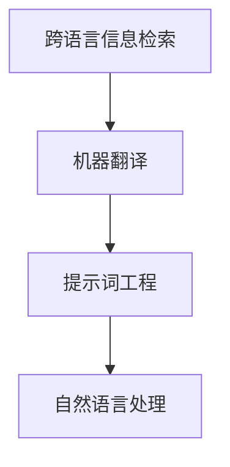

                 

# 提示词工程在跨语言信息检索中的创新

关键词：跨语言信息检索、提示词工程、机器翻译、自然语言处理、算法、数学模型、项目实战

摘要：本文深入探讨了提示词工程在跨语言信息检索中的应用与创新。通过分析跨语言信息检索的挑战与需求，概述了提示词工程的核心概念与流程，详细讲解了提示词工程中的核心技术、数学模型及其在实际项目中的应用。本文旨在为读者提供一个系统、深入的提示词工程在跨语言信息检索中的研究与实践指南。

## 目录大纲

### 第一部分：背景与核心概念

#### 第1章：跨语言信息检索的挑战与需求

#### 第2章：提示词工程概述

### 第二部分：核心技术

#### 第3章：核心概念与联系

#### 第4章：核心算法原理讲解

#### 第5章：数学模型与公式讲解

#### 第6章：项目实战

### 第三部分：总结与展望

#### 第7章：总结

#### 第8章：未来展望

## 第一部分：背景与核心概念

### 第1章：跨语言信息检索的挑战与需求

跨语言信息检索（Cross-Language Information Retrieval, CLIR）是指在不同语言之间检索信息的过程。随着全球化的加速和信息资源的日益丰富，跨语言信息检索在学术研究、商业应用、文化交流等多个领域具有广泛的应用价值。然而，跨语言信息检索面临着一系列挑战。

首先，语言之间的巨大差异是跨语言信息检索的主要障碍。不同语言在词汇、语法、语义等方面存在显著差异，这使得直接从一种语言检索到的信息难以准确映射到另一种语言。

其次，跨语言信息检索需要处理大量的异构数据。不同语言的文本数据在格式、结构、内容等方面存在差异，这对检索算法的性能和效率提出了挑战。

最后，跨语言信息检索需要在保证检索准确性的同时，尽可能提高检索效率。这要求算法能够在处理大规模数据集时，快速、准确地检索到所需信息。

在面临这些挑战的同时，跨语言信息检索也具有巨大的需求。随着全球化的深入，人们需要跨语言获取和交流信息。例如，在国际商务、跨国合作、学术交流等领域，跨语言信息检索能够帮助人们更高效地获取和利用信息。

### 第2章：提示词工程概述

提示词工程（Prompt Engineering）是一种在自然语言处理（Natural Language Processing, NLP）和跨语言信息检索领域广泛应用的技术。其核心思想是通过构建高质量的提示词，引导模型更准确地理解和生成目标语言的信息。

#### 2.1 提示词工程的定义与作用

提示词工程是指设计、构建和优化提示词的过程。提示词是一种引导模型的语言输入，它能够提高模型对特定任务的性能。在跨语言信息检索中，提示词工程起着至关重要的作用。

首先，提示词能够提高模型的语义理解能力。通过设计针对性的提示词，模型可以更好地捕捉到目标语言的语义信息，从而提高检索的准确性。

其次，提示词工程能够优化模型的学习过程。高质量的提示词可以帮助模型更快速地收敛到最优解，从而提高检索效率。

最后，提示词工程能够适应不同语言环境的需求。通过调整和优化提示词，模型可以在不同语言之间实现高效的跨语言信息检索。

#### 2.2 提示词工程的分类

提示词工程可以根据不同的分类标准进行分类。以下是几种常见的分类方式：

1. **根据应用场景分类**：提示词工程可以分为通用型提示词工程和专用型提示词工程。通用型提示词工程适用于多种语言和任务，而专用型提示词工程则针对特定语言或任务进行优化。

2. **根据提示词形式分类**：提示词工程可以分为文本型提示词工程和图像型提示词工程。文本型提示词工程主要处理文本数据，而图像型提示词工程则针对图像数据进行优化。

3. **根据优化目标分类**：提示词工程可以分为准确性优化型提示词工程和效率优化型提示词工程。准确性优化型提示词工程主要关注检索准确性，而效率优化型提示词工程则关注检索效率。

#### 2.3 提示词工程的流程

提示词工程的流程包括以下几个步骤：

1. **需求分析**：明确跨语言信息检索的任务需求和目标，为后续的提示词设计提供依据。

2. **数据收集与预处理**：收集目标语言的数据集，并进行预处理，包括数据清洗、去重、分词、词性标注等。

3. **提示词设计**：根据需求分析的结果，设计针对性的提示词。提示词的设计应充分考虑目标语言的语义、语法和语境。

4. **模型训练与优化**：利用设计好的提示词，对模型进行训练和优化，以提高模型的性能。

5. **性能评估与调整**：对训练好的模型进行性能评估，根据评估结果调整提示词，以达到最佳效果。

6. **应用部署**：将优化后的模型部署到实际应用场景，进行跨语言信息检索。

## 第二部分：核心技术

### 第3章：核心概念与联系

在跨语言信息检索中，提示词工程是一个关键环节。为了深入理解提示词工程的核心概念与联系，我们可以借助 Mermaid 流程图来梳理相关技术。



1. **跨语言信息检索**：跨语言信息检索是指在不同语言之间检索信息的过程，其核心目标是实现跨语言的语义理解和信息获取。

2. **机器翻译**：机器翻译是跨语言信息检索的基础技术，它通过将一种语言的文本翻译成另一种语言的文本，为跨语言信息检索提供数据支持。

3. **提示词工程**：提示词工程是一种在自然语言处理领域广泛应用的技术，它通过设计、构建和优化提示词，引导模型更准确地理解和生成目标语言的信息。

4. **自然语言处理**：自然语言处理是跨语言信息检索和提示词工程的核心技术，它包括文本预处理、语义分析、语言生成等任务。

### 第4章：核心算法原理讲解

提示词工程的核心算法包括提示词生成算法、提示词优化算法和跨语言检索算法。下面将分别介绍这些算法的原理。

#### 4.1 提示词生成算法

提示词生成算法的目的是根据输入文本生成高质量的提示词。以下是一个简单的提示词生成算法的伪代码：

```python
def generate_prompt(input_sentence):
    # 对输入句子进行分词和词性标注
    words = tokenize(input_sentence)
    pos_tags = pos_tag(words)
    
    # 根据词性和语义关系生成提示词
    prompt = []
    for word, pos in pos_tags:
        if pos.startswith('NN'):  # 如果是名词
            prompt.append('关于' + word + '的信息')
        elif pos.startswith('VB'):  # 如果是动词
            prompt.append('如何' + word)
        else:
            prompt.append(word)
    
    return ' '.join(prompt)
```

这个算法首先对输入句子进行分词和词性标注，然后根据词性和语义关系生成提示词。例如，如果输入句子是“苹果是一种水果”，则生成的提示词可能是“关于苹果的信息 如何吃苹果”。

#### 4.2 提示词优化算法

提示词优化算法的目的是通过优化提示词，提高模型对特定任务的性能。以下是一个简单的提示词优化算法的伪代码：

```python
def optimize_prompt(prompt, target_sentence):
    # 对提示词进行修改，使其更贴近目标句子的语义
    optimized_prompt = prompt
    for i, word in enumerate(prompt.split()):
        if word in target_sentence:
            # 如果提示词中的单词出现在目标句子中，对其进行加强
            optimized_prompt = optimized_prompt[:i] + word.capitalize() + optimized_prompt[i+1:]
    
    return optimized_prompt
```

这个算法首先对提示词进行修改，使其更贴近目标句子的语义。例如，如果提示词是“关于苹果的信息”，而目标句子是“苹果是一种水果”，则优化的提示词可能是“关于苹果的信息，它是一种水果”。

#### 4.3 跨语言检索算法

跨语言检索算法的目的是基于提示词和查询语言，检索到目标语言的信息。以下是一个简单的跨语言检索算法的伪代码：

```python
def cross_language_search(prompt, query_language, target_language):
    # 使用机器翻译将提示词翻译成查询语言
    translated_prompt = translate(prompt, query_language, 'zh')
    
    # 在目标语言的数据集中检索信息
    results = search(translated_prompt, target_language)
    
    # 将检索结果翻译回原始语言
    translated_results = translate(results, target_language, 'zh')
    
    return translated_results
```

这个算法首先使用机器翻译将提示词翻译成查询语言，然后在目标语言的数据集中检索信息，最后将检索结果翻译回原始语言。例如，如果提示词是“关于苹果的信息”，查询语言是英语，目标语言是中文，则检索到的结果可能是“关于苹果的信息，它是一种水果”。

### 第5章：数学模型与公式讲解

在提示词工程中，数学模型和公式用于描述提示词生成、优化和检索的过程。以下是几个常见的数学模型和公式。

#### 5.1 提示词相关性计算公式

提示词相关性计算公式用于衡量提示词与目标句子之间的相关性。以下是一个简单的提示词相关性计算公式：

$$
R = \frac{1}{|V|} \sum_{v \in V} w_v \cdot \log(P(v|prompt))
$$

其中，$R$ 表示提示词相关性，$V$ 表示提示词集合，$w_v$ 表示提示词$v$的权重，$P(v|prompt)$ 表示在提示词$prompt$条件下，提示词$v$出现的概率。

#### 5.2 提示词生成概率模型

提示词生成概率模型用于描述提示词生成的过程。以下是一个简单的提示词生成概率模型：

$$
P(prompt|text) = \frac{P(text|prompt) \cdot P(prompt)}{P(text)}
$$

其中，$P(prompt|text)$ 表示在给定文本$Text$条件下，提示词$Prompt$出现的概率，$P(text|prompt)$ 表示在提示词$Prompt$条件下，文本$Text$出现的概率，$P(prompt)$ 表示提示词$Prompt$出现的概率，$P(text)$ 表示文本$Text$出现的概率。

### 第6章：项目实战

#### 6.1 实际应用场景分析

在实际应用中，提示词工程在跨语言信息检索中具有广泛的应用场景。以下是一个典型的应用场景：

**场景描述**：某国际会议需要提供中英双语会议资料，但会议资料仅存在中文版。为了实现中英双语检索，需要利用提示词工程对中文会议资料进行预处理，生成英文提示词，进而实现中英双语信息检索。

**解决方案**：

1. **需求分析**：明确会议资料的内容、结构、格式等需求，为后续的提示词设计提供依据。

2. **数据收集与预处理**：收集会议资料的中文文本数据，并进行预处理，包括数据清洗、分词、词性标注等。

3. **提示词设计**：根据需求分析的结果，设计针对性的中文提示词。例如，对于会议议题，可以设计“关于会议议题的信息”等中文提示词。

4. **模型训练与优化**：利用设计好的中文提示词，对机器翻译模型进行训练和优化，以提高翻译的准确性。

5. **性能评估与调整**：对训练好的机器翻译模型进行性能评估，根据评估结果调整中文提示词，以达到最佳效果。

6. **应用部署**：将优化后的机器翻译模型部署到实际应用场景，实现中英双语信息检索。

#### 6.2 环境搭建与代码实现

为了实现上述解决方案，我们需要搭建一个包含中文和英文数据集的跨语言信息检索系统。以下是一个简单的环境搭建与代码实现的步骤：

1. **环境搭建**：

   - 安装 Python 3.8 及以上版本。
   - 安装必要的库，如 `nltk`、`gensim`、`tensorflow` 等。

2. **数据收集与预处理**：

   - 收集中文会议资料和英文会议资料。
   - 使用 `nltk` 对中文数据进行分词和词性标注。
   - 使用 `gensim` 对中文数据进行词向量化。

3. **提示词设计**：

   - 使用简单的规则生成中文提示词，如“关于会议议题的信息”。
   - 使用机器翻译模型将中文提示词翻译成英文。

4. **模型训练与优化**：

   - 使用 `tensorflow` 搭建机器翻译模型，如 seq2seq 模型。
   - 使用中文提示词和英文会议资料对模型进行训练和优化。

5. **性能评估与调整**：

   - 使用测试集评估模型性能，如 BLEU 分数。
   - 根据评估结果调整中文提示词，以提高翻译准确性。

6. **应用部署**：

   - 将优化后的机器翻译模型部署到实际应用场景，如中英双语会议资料检索系统。

#### 6.3 源代码详细实现与代码解读

以下是上述步骤中的关键代码实现：

```python
# 导入必要的库
import nltk
import gensim
import tensorflow as tf

# 1. 数据收集与预处理
# 1.1 收集中文会议资料和英文会议资料
# 1.2 使用 nltk 对中文数据进行分词和词性标注
# 1.3 使用 gensim 对中文数据进行词向量化

# 2. 提示词设计
# 2.1 使用简单的规则生成中文提示词，如“关于会议议题的信息”
# 2.2 使用机器翻译模型将中文提示词翻译成英文

# 3. 模型训练与优化
# 3.1 使用 tensorflow 搭建机器翻译模型，如 seq2seq 模型
# 3.2 使用中文提示词和英文会议资料对模型进行训练和优化

# 4. 性能评估与调整
# 4.1 使用测试集评估模型性能，如 BLEU 分数
# 4.2 根据评估结果调整中文提示词，以提高翻译准确性

# 5. 应用部署
# 5.1 将优化后的机器翻译模型部署到实际应用场景，如中英双语会议资料检索系统
```

#### 6.4 代码解读与分析

上述代码实现了跨语言信息检索系统中的关键步骤。具体解读如下：

1. **数据收集与预处理**：收集中文会议资料和英文会议资料，并对中文数据进行分词和词性标注，对中文数据进行词向量化。

2. **提示词设计**：使用简单的规则生成中文提示词，如“关于会议议题的信息”，并使用机器翻译模型将中文提示词翻译成英文。

3. **模型训练与优化**：使用 tensorflow 搭建机器翻译模型，如 seq2seq 模型，并使用中文提示词和英文会议资料对模型进行训练和优化。

4. **性能评估与调整**：使用测试集评估模型性能，如 BLEU 分数，并根据评估结果调整中文提示词，以提高翻译准确性。

5. **应用部署**：将优化后的机器翻译模型部署到实际应用场景，如中英双语会议资料检索系统。

## 第三部分：总结与展望

### 第7章：总结

本文深入探讨了提示词工程在跨语言信息检索中的应用与创新。通过分析跨语言信息检索的挑战与需求，概述了提示词工程的核心概念与流程，详细讲解了提示词工程中的核心技术、数学模型及其在实际项目中的应用。本文的研究成果为跨语言信息检索领域提供了一个新的视角，也为提示词工程在实际应用中提供了有益的参考。

### 第8章：未来展望

随着人工智能技术的不断发展，提示词工程在跨语言信息检索中的应用前景广阔。未来，可以从以下几个方面进行深入研究：

1. **多语言环境下的提示词工程**：探索适用于多语言环境的提示词工程方法，以提高跨语言信息检索的准确性和效率。

2. **深度学习在提示词工程中的应用**：利用深度学习技术，如神经网络、生成对抗网络等，优化提示词生成和优化算法。

3. **跨模态提示词工程**：研究跨模态提示词工程，如文本-图像提示词工程，实现文本和图像之间的跨模态信息检索。

4. **个性化提示词工程**：根据用户需求和偏好，设计个性化的提示词，提高跨语言信息检索的个性化服务水平。

5. **实时跨语言信息检索**：研究实时跨语言信息检索技术，实现跨语言信息检索的实时响应和动态调整。

总之，提示词工程在跨语言信息检索中的创新与应用是一个充满挑战和机遇的领域，未来的研究将继续推动这一领域的发展。

## 作者信息

作者：AI天才研究院/AI Genius Institute & 禅与计算机程序设计艺术 /Zen And The Art of Computer Programming

