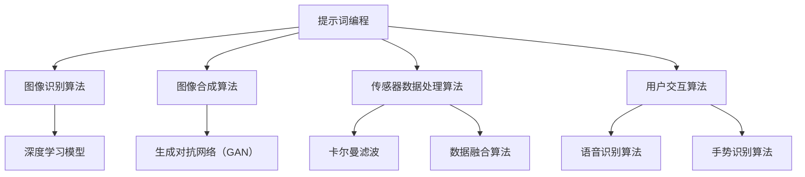

                 

# 《提示词编程在增强现实应用中的角色》

> **关键词：** 提示词编程、增强现实、图像识别、机器学习、用户体验

> **摘要：** 本文将深入探讨提示词编程在增强现实（AR）应用中的重要角色。通过介绍提示词编程的基础、其在增强现实中的基础技术、核心算法原理，以及实际案例，我们将展示提示词编程如何提升AR应用的开发效率和用户体验。

## 第一部分：提示词编程基础

### 第1章：提示词编程简介

#### 1.1 提示词编程的概念

提示词编程（Prompt Programming）是一种通过提示词（Prompt）引导计算机执行特定任务的编程方法。提示词可以被理解为一种触发机制，用于启动特定的数据处理流程、算法执行或用户交互。与传统的命令式编程相比，提示词编程具有更高的抽象层次和更强的灵活性。

#### 1.1.1 提示词编程的定义

提示词编程是一种利用提示词（Prompt）来引导计算机执行特定任务的编程方法。通过提示词，程序员可以指导计算机如何处理输入数据、生成输出结果，以及如何进行后续的操作。

#### 1.1.2 提示词编程的特点

- **高效性**：提示词编程可以简化编程过程，提高开发效率。
- **灵活性**：提示词编程允许程序员根据实际需求灵活调整代码逻辑。
- **易用性**：提示词编程对于新手程序员来说相对容易掌握。

#### 1.2 提示词编程的应用领域

提示词编程广泛应用于多个领域，以下是一些典型的应用场景：

- **数据处理**：提示词编程可以用于数据清洗、数据转换和数据聚合等数据处理任务。
- **数据分析**：通过提示词编程，可以实现数据探索、数据可视化和数据预测等数据分析任务。
- **机器学习**：提示词编程可以帮助程序员构建机器学习模型，进行特征工程、模型训练和模型评估等工作。

### 1.3 提示词编程的优势与挑战

#### 1.3.1 优势

- **简化编程**：提示词编程可以减少代码编写量，降低编程复杂度。
- **提高可维护性**：提示词编程使得代码逻辑更易于理解，便于后期维护。
- **跨平台适用性**：提示词编程可以在不同的编程语言和环境中使用。

#### 1.3.2 挑战

- **学习曲线**：提示词编程需要一定的学习成本，对于新手程序员来说可能较难掌握。
- **表达能力**：提示词编程的表达能力有限，对于一些复杂的编程任务可能无法胜任。

## 第2章：提示词编程在增强现实应用中的基础技术

### 2.1 增强现实技术简介

#### 2.1.1 增强现实的概念

增强现实（Augmented Reality，简称 AR）是一种将虚拟信息叠加到现实世界中的技术，通过计算机生成的虚拟图像、声音、触觉等感官信息，增强用户的感知体验。

#### 2.1.2 增强现实的关键技术

- **视觉处理技术**：包括图像识别、图像合成、图像增强等。
- **传感器技术**：包括摄像头、定位传感器、手势识别传感器等。
- **用户界面技术**：包括触摸屏、语音识别、手势控制等。

### 2.2 提示词编程在增强现实中的应用

#### 2.2.1 增强现实游戏

提示词编程可以用于开发增强现实游戏，实现实时交互、虚拟角色的动态行为等。

#### 2.2.2 增强现实教育

提示词编程可以应用于教育领域，通过增强现实技术提供更生动、直观的教学内容。

#### 2.2.3 增强现实医疗

提示词编程可以用于医疗领域，辅助医生进行手术指导、诊断分析等。

### 2.3 提示词编程在增强现实中的优势与挑战

#### 2.3.1 优势

- **提高开发效率**：提示词编程可以简化增强现实应用的开发流程，缩短开发周期。
- **提升用户体验**：通过提示词编程，可以实现更自然的用户交互，提高用户满意度。
- **拓展应用场景**：提示词编程可以应用于更多领域，推动增强现实技术的发展。

#### 2.3.2 挑战

- **性能优化**：增强现实应用需要实时处理大量数据，对性能要求较高。
- **系统集成**：提示词编程需要与其他增强现实技术相结合，实现系统的高效集成。

## 第3章：提示词编程在增强现实应用中的核心算法原理

### 3.1 视觉处理算法

#### 3.1.1 图像识别算法

- **介绍常用的图像识别算法**：例如卷积神经网络（CNN）等。
- **使用伪代码详细阐述图像识别算法的实现过程**。

```python
# 图像识别算法伪代码示例
def image_recognition(image):
    # 步骤1：预处理图像
    processed_image = preprocess_image(image)
    
    # 步骤2：使用卷积神经网络进行图像特征提取
    features = conv_neural_network(processed_image)
    
    # 步骤3：使用分类器对特征进行分类
    label = classifier.classify(features)
    
    # 步骤4：返回识别结果
    return label
```

#### 3.1.2 图像合成算法

- **介绍图像合成算法**：例如深度学习生成对抗网络（GAN）等。
- **使用伪代码详细阐述图像合成算法的实现过程**。

```python
# 图像合成算法伪代码示例
def image_synthesis(target_image, source_image):
    # 步骤1：预处理目标图像和源图像
    processed_target = preprocess_image(target_image)
    processed_source = preprocess_image(source_image)
    
    # 步骤2：使用生成对抗网络生成合成图像
    synthesized_image = gan.generate_image(processed_target, processed_source)
    
    # 步骤3：后处理合成图像
    final_image = postprocess_image(synthesized_image)
    
    # 步骤4：返回合成结果
    return final_image
```

### 3.2 传感器数据处理算法

#### 3.2.1 数据预处理算法

- **介绍传感器数据预处理算法**：例如滤波、插值等。
- **使用伪代码详细阐述数据预处理算法的实现过程**。

```python
# 数据预处理算法伪代码示例
def preprocess_sensor_data(data):
    # 步骤1：滤波去噪
    filtered_data = lowpass_filter(data)
    
    # 步骤2：插值补全缺失数据
    interpolated_data = interpolate_missing_data(filtered_data)
    
    # 步骤3：归一化数据
    normalized_data = normalize_data(interpolated_data)
    
    # 步骤4：返回预处理后的数据
    return normalized_data
```

#### 3.2.2 数据融合算法

- **介绍传感器数据融合算法**：例如卡尔曼滤波、粒子滤波等。
- **使用伪代码详细阐述数据融合算法的实现过程**。

```python
# 数据融合算法伪代码示例
def data_fusion(sensor_data_1, sensor_data_2):
    # 步骤1：初始化融合器
    fusion_filter = initialize_fusion_filter()
    
    # 步骤2：融合传感器数据
    fused_data = fusion_filter.update(sensor_data_1, sensor_data_2)
    
    # 步骤3：返回融合结果
    return fused_data
```

### 3.3 用户交互算法

#### 3.3.1 语音识别算法

- **介绍语音识别算法**：例如深度神经网络（DNN）、长短时记忆网络（LSTM）等。
- **使用伪代码详细阐述语音识别算法的实现过程**。

```python
# 语音识别算法伪代码示例
def voice_recognition(audio_signal):
    # 步骤1：预处理音频信号
    processed_signal = preprocess_audio_signal(audio_signal)
    
    # 步骤2：使用深度神经网络进行特征提取
    features = dnn.extract_features(processed_signal)
    
    # 步骤3：使用长短时记忆网络进行语音识别
    recognized_text = lstm.recognize_text(features)
    
    # 步骤4：返回识别结果
    return recognized_text
```

#### 3.3.2 手势识别算法

- **介绍手势识别算法**：例如基于深度学习的姿态估计等。
- **使用伪代码详细阐述手势识别算法的实现过程**。

```python
# 手势识别算法伪代码示例
def gesture_recognition(image_frame):
    # 步骤1：预处理图像帧
    processed_frame = preprocess_image_frame(image_frame)
    
    # 步骤2：使用深度学习模型进行姿态估计
    gesture_vector = deep_learning_model.estimate_gesture(processed_frame)
    
    # 步骤3：手势分类
    gesture_name = classifier.classify_gesture(gesture_vector)
    
    # 步骤4：返回识别结果
    return gesture_name
```

## 第4章：提示词编程在增强现实应用中的实际案例

### 4.1 案例一：增强现实游戏开发

#### 4.1.1 项目背景

本项目是一款以太空探险为主题的增强现实游戏，目标用户为喜欢冒险和科幻题材的玩家。游戏设计旨在通过增强现实技术为用户提供沉浸式的游戏体验。

#### 4.1.2 技术选型

- **开发环境**：Unity引擎
- **编程语言**：C#
- **增强现实框架**：Unity的ARFoundation套件

#### 4.1.3 开发过程

1. **游戏设计**：制定游戏规则、角色设定、故事情节等。
2. **界面设计**：设计用户界面，包括菜单、图标、角色形象等。
3. **编程实现**：
   - **场景构建**：使用Unity的ARFoundation创建虚拟场景，包括星球、太空飞船等。
   - **交互逻辑**：编写C#脚本实现玩家的移动、飞船的操作等。
   - **图像处理**：使用图像识别算法识别玩家手势，实现与虚拟场景的互动。

#### 4.1.4 测试与优化

1. **性能测试**：测试游戏在不同设备和操作系统上的运行情况，优化图像加载和渲染效率。
2. **用户体验测试**：收集用户反馈，优化游戏操作的流畅性和视觉效果的逼真度。

### 4.2 案例二：增强现实教育应用

#### 4.2.1 项目背景

本项目是一款以历史教育为主题的增强现实应用，旨在通过增强现实技术为学生提供更加生动、直观的历史学习体验。目标用户为中小学历史教师和学生。

#### 4.2.2 技术选型

- **开发环境**：ARKit（iOS）或ARCore（Android）
- **编程语言**：Swift（iOS）或Kotlin（Android）
- **增强现实框架**：ARKit或ARCore

#### 4.2.3 开发过程

1. **内容设计**：收集历史资料，制作虚拟历史场景、角色和对象。
2. **界面设计**：设计用户界面，包括菜单、图标、历史对象介绍等。
3. **编程实现**：
   - **场景构建**：使用ARKit或ARCore创建虚拟场景，包括历史事件发生的地点、角色和对象。
   - **交互逻辑**：编写Swift或Kotlin脚本实现学生的互动，如点击历史对象查看详细信息。
   - **图像处理**：使用图像识别算法识别学生手势，实现与虚拟场景的互动。

#### 4.2.4 测试与优化

1. **性能测试**：测试应用在不同设备和操作系统上的运行情况，优化图像加载和渲染效率。
2. **用户体验测试**：收集学生和教师的反馈，优化应用的交互设计和内容呈现。

## 第5章：提示词编程在增强现实应用中的挑战与未来发展趋势

### 5.1 挑战

#### 5.1.1 技术挑战

- **实时数据处理**：增强现实应用需要实时处理大量的图像、音频和传感器数据，对数据处理速度和实时性要求较高。
- **传感器融合**：多个传感器提供的数据需要进行融合处理，以提高精度和可靠性。

#### 5.1.2 应用挑战

- **用户体验**：增强现实应用需要提供高质量的交互体验，如响应速度、视觉效果等。
- **系统稳定性**：增强现实应用需要在各种环境中保持稳定运行，避免出现崩溃或性能下降。

### 5.2 未来发展趋势

#### 5.2.1 技术发展趋势

- **人工智能与机器学习**：人工智能和机器学习技术的发展将进一步提升增强现实应用的智能化水平。
- **虚拟现实（VR）与混合现实（MR）**：随着VR和MR技术的成熟，增强现实应用将进一步与这些技术融合，提供更加丰富的交互体验。

#### 5.2.2 应用发展趋势

- **教育领域**：增强现实技术将在教育领域得到广泛应用，为学生提供更加生动、直观的学习体验。
- **医疗领域**：增强现实技术将用于医疗诊断、手术指导等领域，提高医疗服务的质量和效率。
- **娱乐领域**：增强现实游戏和娱乐应用将不断推陈出新，为用户提供更加沉浸式的娱乐体验。

## 第6章：提示词编程在增强现实应用中的开发工具与资源

### 6.1 开发工具

#### 6.1.1 Unity

Unity是一款功能强大的游戏开发引擎，支持增强现实应用的开发。它提供了丰富的功能，如3D建模、动画、物理模拟和图像处理等。

#### 6.1.2 ARKit

ARKit是苹果公司开发的一套增强现实开发框架，用于iOS平台。它提供了强大的增强现实功能，如实时图像识别、场景重建和物体追踪等。

#### 6.1.3 ARCore

ARCore是谷歌开发的一套增强现实开发框架，用于Android平台。它提供了与ARKit类似的功能，支持多种设备和场景的增强现实应用开发。

### 6.2 开发资源

#### 6.2.1 学习资源

- **书籍**：《Unity 2020 ARGame Development》
- **在线课程**：Udacity的“增强现实应用开发”课程
- **开源项目**：GitHub上有关增强现实和提示词编程的开源项目，如ARKitExtensions和ARFoundationDemo等。

#### 6.2.2 开源项目

- **ARCore Unity插件**：适用于ARCore的Unity插件，提供ARCore功能与Unity的集成。
- **ARFoundation**：Unity官方提供的AR开发框架，支持多种平台的增强现实应用开发。

## 第7章：提示词编程在增强现实应用中的案例研究

### 7.1 案例一：AR游戏《Pokémon GO》

#### 7.1.1 案例介绍

《Pokémon GO》是一款由Niantic开发并发布的增强现实游戏，于2016年正式上线。游戏结合了现实世界中的地理位置信息，让玩家可以在真实环境中捕捉虚拟的宝可梦。

#### 7.1.2 技术实现

- **图像识别**：使用ARKit或ARCore进行实时图像识别，识别玩家周围的环境。
- **场景重建**：使用场景重建技术构建虚拟宝可梦的场景。
- **用户交互**：通过提示词编程实现玩家的移动、捕捉和训练等操作。

#### 7.1.3 案例评价

《Pokémon GO》的成功在于其创新的玩法和高度沉浸式的用户体验。然而，游戏在性能优化和用户隐私保护方面存在一定的问题。

### 7.2 案例二：AR教育应用《Google Expeditions》

#### 7.2.1 案例介绍

《Google Expeditions》是一款由Google开发的增强现实教育应用，旨在为学生提供虚拟现实和增强现实的课程内容。

#### 7.2.2 技术实现

- **虚拟现实内容**：使用3D建模和动画技术制作虚拟现实课程内容。
- **场景重建**：使用场景重建技术构建虚拟场景，提供沉浸式学习体验。
- **用户交互**：通过提示词编程实现学生的互动，如点击查看详细信息、提问等。

#### 7.2.3 案例评价

《Google Expeditions》在教育领域取得了显著的成功，为学生提供了生动的学习体验。然而，应用在内容更新和设备兼容性方面存在一定的问题。

## 附录

### 附录 A：提示词编程与增强现实开发常用工具与资源

- **工具**：Unity、ARKit、ARCore
- **资源**：《Unity 2020 ARGame Development》、Udacity的“增强现实应用开发”课程

### 附录 B：提示词编程在增强现实应用中的数学模型与公式

- **卡尔曼滤波**：
  \[
  \begin{aligned}
  x_{k|k-1} &= F_k x_{k-1|k-1} + u_k \\
  P_{k|k-1} &= F_k P_{k-1|k-1} F_k^T + Q_k \\
  K_k &= P_{k|k-1} H_k^T (H_k P_{k|k-1} H_k^T + R_k)^{-1} \\
  x_{k|k} &= x_{k|k-1} + K_k (z_k - H_k x_{k|k-1}) \\
  P_{k|k} &= (I - K_k H_k) P_{k|k-1}
  \end{aligned}
  \]

- **深度学习生成对抗网络（GAN）**：
  \[
  \begin{aligned}
  G(z) &= \text{Generator output} \\
  D(x) &= \text{Discriminator output for real data} \\
  D(G(z)) &= \text{Discriminator output for generated data} \\
  \end{aligned}
  \]

### 附录 C：提示词编程在增强现实应用中的常见问题和解决方案

- **问题1**：增强现实应用中图像识别的准确性不高。
  - **解决方案**：优化图像识别算法，提高图像预处理质量，使用更复杂的神经网络模型。
- **问题2**：增强现实应用的性能不稳定。
  - **解决方案**：优化算法实现，减少计算复杂度，使用硬件加速技术，如GPU。

### 附录 D：提示词编程与增强现实开发的核心概念与联系



## 作者信息

作者：AI天才研究院/AI Genius Institute & 禅与计算机程序设计艺术 /Zen And The Art of Computer Programming

文章标题：《提示词编程在增强现实应用中的角色》

文章关键词：提示词编程、增强现实、图像识别、机器学习、用户体验

文章摘要：本文深入探讨了提示词编程在增强现实应用中的重要作用，包括基础概念、核心技术、实际应用案例以及未来发展趋势。通过详细的算法原理讲解和实际案例研究，展示了提示词编程如何提升AR应用的开发效率和用户体验。

