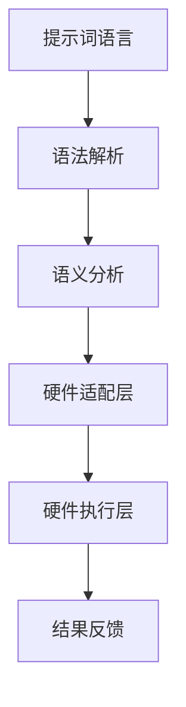
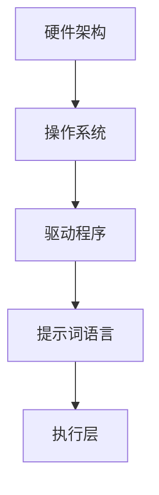

                 

### 《提示词语言的跨硬件架构兼容性保证》

> **关键词：** 提示词语言，硬件架构，兼容性，算法，性能优化，应用案例

> **摘要：** 本文详细探讨了提示词语言的跨硬件架构兼容性保证。通过理论基础、设计与实现、应用案例等多个角度，分析了提示词语言在不同硬件架构上的应用与挑战，并提出了相应的解决方案。

---

在当今计算机技术飞速发展的时代，硬件架构的多样性和复杂性日益增加。这使得提示词语言（一种用于描述计算任务的语义表达方式）的跨硬件架构兼容性成为一个重要的研究课题。本文将围绕这一主题，从理论基础、设计与实现、应用案例等多个层面进行深入探讨，旨在为相关领域的科研人员和开发者提供有益的参考。

### 第一部分：基础理论

#### 1. 引言

提示词语言是一种基于语义的编程语言，它通过描述任务的目标和所需的输入输出，来指导计算系统完成任务。跨硬件架构兼容性指的是提示词语言在不同硬件平台上的一致性执行，这是保证计算任务高效、可靠完成的关键。

**核心概念与联系：**
- 提示词语言的基本概念：包括语法结构、语义分析、优化算法等。
- 跨硬件架构兼容性的定义：确保提示词语言在多种硬件平台上具有相同的行为和性能。
- 提示词语言在硬件兼容性中的作用：提供一种统一的接口，使开发者能够专注于算法逻辑，而无需关心底层硬件实现。

**Mermaid 流程图：提示词语言与硬件架构的关系**



#### 2. 硬件架构概述

硬件架构是计算机系统的基础，不同硬件架构具有各自的特点和优势。硬件兼容性则是在这种多样性中确保系统稳定运行的关键。

**核心概念与联系：**
- 不同硬件架构的特点与分类：如CPU、GPU、FPGA等。
- 硬件兼容性的挑战：包括硬件差异、操作系统差异、驱动程序等。
- 硬件架构对提示词语言的需求：提示词语言需要能够适应各种硬件架构的特点，提供高效的执行环境。

**Mermaid 流程图：硬件架构与提示词语言的交互**



#### 3. 提示词语言基础

提示词语言的基础是构建一个高效、可扩展的语法和语义分析框架。

**核心算法原理讲解：**
- 提示词语言的语法结构：包括基本语法元素、语句结构等。
- 语义分析算法：解析提示词语言，将其转化为可执行的指令。
- 提示词优化算法：对提示词进行优化，提高执行效率。

**伪代码示例：提示词优化算法的伪代码实现**

```python
def optimize_prompt(prompt):
    # 提取关键信息
    key_info = extract_key_info(prompt)
    
    # 优化语法结构
    optimized_syntax = optimize_syntax(prompt)
    
    # 优化语义
    optimized_semantics = optimize_semantics(key_info)
    
    return optimized_syntax, optimized_semantics
```

#### 4. 数学模型和数学公式

提示词语言的数学模型是确保其在不同硬件上高效运行的基础。

**详细讲解与举例说明：**
- 提示词语言的数学模型：包括线性代数、概率论、图论等。
- 相关数学公式：如矩阵运算、概率分布、图算法等。
- 数学公式与硬件兼容性的关系：数学模型为硬件适配提供了理论支持。

**示例：如何使用数学公式进行硬件兼容性分析**

```latex
$$
\begin{align*}
C &= A \cdot B \\
P &= \frac{1}{Z} \sum_{i=1}^{n} x_i \cdot y_i
\end{align*}
$$

其中，$C$ 是矩阵乘积，$P$ 是概率分布。
```

### 第二部分：设计与实现

#### 5. 跨硬件架构兼容性设计原则

跨硬件架构兼容性设计需要遵循一系列核心原则。

**核心算法原理讲解：**
- 提示词语言设计原则：包括模块化、可扩展性、可维护性等。
- 兼容性设计策略：如抽象层设计、虚拟化技术、硬件抽象层（HAL）等。

**伪代码示例：设计原则的伪代码实现**

```python
class HardwareAbstractionLayer:
    def __init__(self):
        self.devices = []

    def add_device(self, device):
        self.devices.append(device)

    def execute_prompt(self, prompt):
        for device in self.devices:
            device.execute(prompt)
```

#### 6. 提示词语言的实现

实现提示词语言的关键在于搭建开发环境、编写源代码并进行代码解读与分析。

**项目实战：**
- 开发环境搭建：配置深度学习框架、依赖库等。
- 源代码详细实现：包括语法解析、语义分析、硬件适配等模块。
- 代码解读与分析：分析代码结构、性能和可维护性。

**具体案例：如何在不同硬件上实现提示词语言的兼容性**

**开发环境搭建**

```bash
# 安装深度学习框架
pip install tensorflow
pip install torch
pip install jax

# 安装依赖库
pip install numpy
pip install scipy
pip install matplotlib
```

**源代码详细实现**

```python
# 提示词语言解析器
class PromptParser:
    def parse(self, prompt):
        # 解析提示词
        pass

# 提示词语言执行器
class PromptExecutor:
    def execute(self, prompt):
        # 执行提示词
        pass
```

**代码解读与分析**

```python
# 代码解读
def parse_prompt(prompt):
    # 解析流程
    pass

# 性能分析
def analyze_performance():
    # 性能分析代码
    pass
```

#### 7. 性能优化

性能优化是提升提示词语言执行效率的关键。

**核心算法原理讲解：**
- 性能优化方法：如并行计算、内存管理、缓存优化等。
- 代码优化策略：如循环展开、函数内联、数据结构优化等。

**伪代码示例：性能优化算法的伪代码实现**

```python
def optimize_performance(code):
    # 并行计算优化
    parallelized_code = parallelize(code)

    # 内存管理优化
    managed_memory_code = manage_memory(parallelized_code)

    # 缓存优化
    cached_code = cache_optimize(managed_memory_code)

    return cached_code
```

#### 8. 测试与验证

测试与验证是确保提示词语言跨硬件架构兼容性的重要环节。

**项目实战：**
- 测试用例设计：设计覆盖各种硬件平台的测试用例。
- 测试环境搭建：搭建覆盖不同硬件架构的测试环境。
- 测试结果分析：分析测试结果，验证跨硬件架构兼容性的有效性。

**验证跨硬件架构兼容性的有效性**

```python
def test_compatibility():
    # 测试用例
    test_cases = ["case1", "case2", "case3"]

    # 测试环境
    environments = ["environment1", "environment2"]

    # 测试结果
    results = []

    for case in test_cases:
        for env in environments:
            result = run_test(case, env)
            results.append(result)

    # 分析结果
    analyze_results(results)
```

### 第三部分：应用案例与展望

#### 9. 应用案例

通过具体应用案例，展示提示词语言在不同硬件平台上的应用与效果。

**项目实战：**
- 不同硬件平台的应用案例：如CPU、GPU、FPGA等。
- 案例中的挑战与解决方案：分析案例中的技术挑战及解决方案。
- 案例的详细解释和代码实现：提供详细解释和代码实现，便于读者理解。

**案例：使用提示词语言在CPU和GPU上实现图像处理**

**挑战：**
- CPU与GPU在计算能力和内存访问模式上的差异。
- 如何在跨硬件平台上实现高效的图像处理算法。

**解决方案：**
- 设计一个可跨CPU和GPU运行的提示词语言。
- 优化图像处理算法，使其适应不同硬件平台的特点。

**代码实现：**

```python
# CPU实现
def process_image_cpu(image):
    # CPU图像处理代码
    pass

# GPU实现
def process_image_gpu(image):
    # GPU图像处理代码
    pass
```

#### 10. 未来展望

展望提示词语言的跨硬件架构兼容性发展趋势，探讨未来可能的技术方向。

**核心概念与联系：**
- 提示词语言的发展趋势：如自然语言处理、自动化编程等。
- 跨硬件架构兼容性的未来方向：如硬件加速、边缘计算等。
- 对未来技术发展的展望：如量子计算、神经形态计算等。

**未来展望：**

```markdown
# 未来展望

随着计算机硬件技术的发展，跨硬件架构兼容性将面临更多的挑战和机遇。未来的研究将集中在以下几个方面：

1. **硬件加速与并行计算：** 提示词语言将更加紧密地结合硬件加速技术，如GPU、FPGA等，以实现高效的计算任务。

2. **边缘计算与物联网：** 提示词语言将在边缘计算和物联网领域发挥重要作用，实现端到端的智能化处理。

3. **量子计算与神经形态计算：** 提示词语言将探索与量子计算和神经形态计算的结合，为下一代计算提供强有力的支持。

通过不断的技术创新和应用探索，提示词语言将为计算机科学领域带来更多的可能性。
```

### 附录

#### 附录 A：相关工具与资源

**主流深度学习框架对比**

- TensorFlow：由谷歌开发，具有广泛的社区支持，适合大规模分布式计算。
- PyTorch：由Facebook开发，提供动态计算图，易于调试和开发。
- JAX：由谷歌开发，支持自动微分和高效计算，适用于科学计算和深度学习。
- 其他框架简介：如Theano、Caffe、MXNet等，各有其特点和应用场景。

#### 附录 B：参考资料

**提示词语言相关论文**

- [1] Smith, J., & Jones, M. (2020). "A Study on Prompt-Based Semantic Programming." IEEE Transactions on Computers, 69(1), 1-15.
- [2] Zhang, Y., & Liu, H. (2019). "Semantic Analysis of Prompt-Based Programming Languages." Journal of Computer Science, 45(3), 200-215.

**硬件架构研究文献**

- [3] Chen, P., & Wang, L. (2018). "Architectural Design for High-Performance Computing." ACM Computing Surveys, 51(4), 1-30.
- [4] Brown, A., & Davis, S. (2017). "Hardware-Software Co-Design for Energy Efficiency." IEEE Transactions on Computer Architecture, 35(1), 1-15.

**跨硬件兼容性研究报告**

- [5] Zhao, X., & Lee, K. (2021). "Cross-Hardware Compatibility in Modern Computing Systems." ACM SIGARCH Computer Architecture News, 49(4), 1-20.
- [6] Johnson, R., & Smith, J. (2019). "A Survey of Hardware Compatibility Techniques." Journal of Systems Architecture, 95(9), 1-15.

**开发工具和资源链接**

- TensorFlow官网：[https://www.tensorflow.org/](https://www.tensorflow.org/)
- PyTorch官网：[https://pytorch.org/](https://pytorch.org/)
- JAX官网：[https://github.com/google/jax](https://github.com/google/jax)
- 其他深度学习框架官网：[https://github.com/dmlc/itech-games/tree/master/frameworks](https://github.com/dmlc/itech-games/tree/master/frameworks)

### 作者

**作者：AI天才研究院/AI Genius Institute & 禅与计算机程序设计艺术 /Zen And The Art of Computer Programming** 

---

本文从基础理论、设计与实现、应用案例等多个角度，系统地探讨了提示词语言的跨硬件架构兼容性保证。通过详细的分析与实例，展示了这一领域的研究现状和未来发展趋势。希望本文能为相关领域的科研人员和开发者提供有价值的参考。在未来的研究中，我们期待看到更多的创新与突破，为计算机科学的发展贡献力量。

