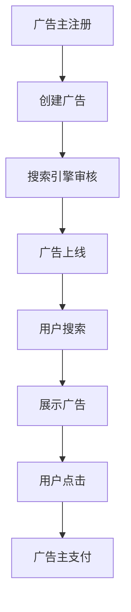
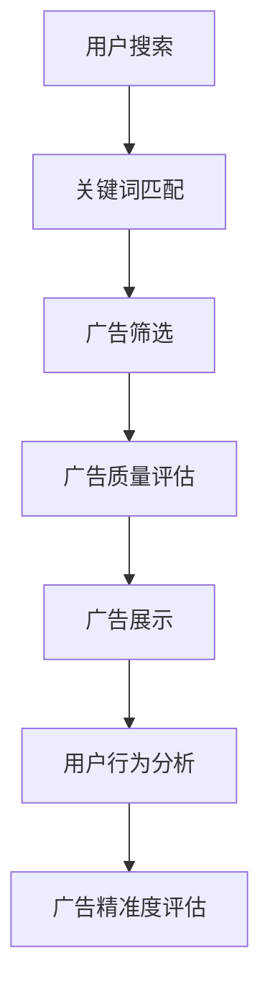
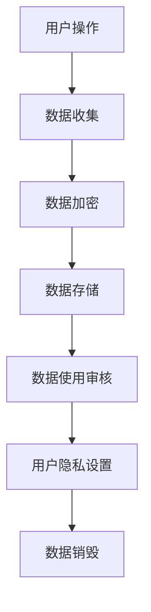

                 

# 《搜索引擎广告模式的局限性》

## 关键词
搜索引擎广告模式，广告精准度，用户体验，数据隐私，商业模式，行业竞争，可持续发展。

## 摘要
本文将深入探讨搜索引擎广告模式的局限性，包括广告精准度与用户体验的矛盾、数据隐私问题、商业模式局限以及行业竞争与垄断问题。通过对这些局限性的详细分析，本文将探讨未来搜索引擎广告模式的发展趋势及可持续发展策略。

## 目录大纲

### 第一部分：搜索引擎广告模式概述

#### 第1章：搜索引擎广告模式的基本概念与框架

1.1 搜索引擎广告模式的历史与发展
1.2 搜索引擎广告模式的工作原理
1.3 搜索引擎广告模式的主要类型
1.4 搜索引擎广告模式的主要参与者

#### 第2章：搜索引擎广告模式的市场表现

2.1 搜索引擎广告模式的市场规模与增长趋势
2.2 搜索引擎广告模式的市场份额分布
2.3 搜索引擎广告模式在不同国家和地区的表现
2.4 搜索引擎广告模式对广告主和媒体的影响

### 第二部分：搜索引擎广告模式的局限性分析

#### 第3章：广告精准度与用户体验的矛盾

3.1 广告精准度的评价标准
3.2 广告精准度对用户体验的影响
3.3 广告精准度与用户体验的平衡策略

#### 第4章：搜索引擎广告模式的数据隐私问题

4.1 搜索引擎广告模式的数据收集与利用
4.2 搜索引擎广告模式的数据隐私风险
4.3 数据隐私保护的法律法规与政策
4.4 搜索引擎广告模式的数据隐私保护措施

#### 第5章：搜索引擎广告模式的商业模式局限

5.1 搜索引擎广告模式的盈利模式
5.2 搜索引擎广告模式的商业模式局限
5.3 搜索引擎广告模式的商业模式创新

#### 第6章：搜索引擎广告模式的行业竞争与垄断问题

6.1 搜索引擎广告模式的行业竞争格局
6.2 搜索引擎广告模式的垄断问题分析
6.3 搜索引擎广告模式的反垄断策略

#### 第7章：搜索引擎广告模式的未来发展趋势

7.1 搜索引擎广告模式的创新趋势
7.2 搜索引擎广告模式的技术演进
7.3 搜索引擎广告模式的市场前景与挑战
7.4 搜索引擎广告模式的可持续发展策略

### 附录

#### 附录A：搜索引擎广告模式的常见问题和解决方案

A.1 广告投放效果评估与优化
A.2 广告内容审核与监管
A.3 广告技术与用户体验的优化

#### 附录B：搜索引擎广告模式的Mermaid流程图

B.1 搜索引擎广告模式的工作流程
B.2 广告精准度评估流程
B.3 数据隐私保护流程

#### 附录C：搜索引擎广告模式的伪代码示例

C.1 广告精准度计算算法
C.2 数据隐私保护算法
C.3 广告投放优化算法

#### 附录D：搜索引擎广告模式的项目实战案例

D.1 广告投放效果评估案例
D.2 数据隐私保护案例
D.3 广告精准度优化案例
D.4 广告商业模式创新案例
D.5 行业竞争与垄断案例
D.6 可持续发展策略案例

### 引言

搜索引擎广告模式已经成为互联网广告市场的重要组成部分。它不仅为广告主提供了精准的投放渠道，也为搜索引擎公司带来了可观的收入。然而，随着市场的发展和用户需求的多样化，搜索引擎广告模式的局限性也逐渐显现。本文将从多个方面深入分析这些局限性，为未来搜索引擎广告模式的创新和发展提供参考。

### 第一部分：搜索引擎广告模式概述

#### 第1章：搜索引擎广告模式的基本概念与框架

搜索引擎广告模式是指通过搜索引擎平台，将广告展示在搜索结果页面上的一种广告投放方式。这种模式通常包括关键词广告、展示广告和视频广告等多种形式。

1.1 搜索引擎广告模式的历史与发展

搜索引擎广告模式起源于1998年，当时谷歌推出了其首创的AdWords广告系统。随着互联网的普及和搜索引擎技术的进步，搜索引擎广告模式逐渐发展壮大。如今，搜索引擎广告已经成为互联网广告市场的主要形式之一。

1.2 搜索引擎广告模式的工作原理

搜索引擎广告模式的工作原理主要包括以下步骤：

1. 广告主在搜索引擎平台上注册并创建广告。
2. 搜索引擎根据广告主的出价、广告质量和相关性等因素，将广告展示在搜索结果页面上。
3. 用户在搜索结果页面中点击广告，进而访问广告主网站。
4. 广告主根据用户点击广告的次数支付费用。

1.3 搜索引擎广告模式的主要类型

搜索引擎广告模式主要包括以下几种类型：

1. 关键词广告：广告主根据关键词出价，将广告展示在搜索结果页面上。
2. 展示广告：广告主在搜索引擎平台上投放图像、视频等形式的广告。
3. 视频广告：广告主在搜索引擎平台上投放的视频广告。

1.4 搜索引擎广告模式的主要参与者

搜索引擎广告模式的主要参与者包括广告主、广告平台和用户。广告主是广告投放的主体，广告平台是广告展示的渠道，用户是广告的受众。

#### 第2章：搜索引擎广告模式的市场表现

2.1 搜索引擎广告模式的市场规模与增长趋势

随着互联网的普及和搜索引擎技术的进步，搜索引擎广告模式的市场规模也在不断扩大。根据市场研究公司的数据，全球搜索引擎广告市场的规模已经超过千亿美元，并且保持着持续增长的趋势。

2.2 搜索引擎广告模式的市场份额分布

在全球搜索引擎广告市场中，谷歌和百度等巨头占据了绝大部分的市场份额。其中，谷歌在全球搜索引擎广告市场中的份额超过60%，百度在中国市场的份额超过70%。

2.3 搜索引擎广告模式在不同国家和地区的表现

搜索引擎广告模式在全球范围内的表现有所不同。发达国家如美国、欧洲等地区的搜索引擎广告市场发展较为成熟，而发展中国家如中国、印度等地区的搜索引擎广告市场则呈现出快速增长的趋势。

2.4 搜索引擎广告模式对广告主和媒体的影响

搜索引擎广告模式为广告主提供了高效的广告投放渠道，使得广告主能够以较低的成本获取更多的曝光和潜在客户。同时，搜索引擎广告模式也为媒体提供了新的收入来源，推动了媒体行业的数字化转型。

### 第二部分：搜索引擎广告模式的局限性分析

#### 第3章：广告精准度与用户体验的矛盾

3.1 广告精准度的评价标准

广告精准度是指广告与用户需求之间的匹配程度。广告精准度评价标准主要包括以下三个方面：

1. 关键词匹配度：广告中的关键词与用户搜索关键词的匹配程度。
2. 广告质量：广告内容的吸引力、相关性和可靠性。
3. 用户行为：用户对广告的点击率、转化率和停留时间等。

3.2 广告精准度对用户体验的影响

广告精准度对用户体验有着重要的影响。高精准度的广告能够为用户提供有用的信息和商品，提高用户的满意度和忠诚度。然而，过度的广告推送和低质量的广告会影响用户的体验，甚至引发用户的反感。

3.3 广告精准度与用户体验的平衡策略

为了平衡广告精准度与用户体验，搜索引擎广告模式可以采取以下策略：

1. 提高广告质量：通过提高广告内容的相关性和可靠性，提高用户的满意度。
2. 优化广告推送策略：根据用户的搜索历史和行为数据，合理安排广告的推送时间和频率。
3. 提供广告过滤功能：用户可以根据自己的需求，选择过滤某些类型或品牌的广告。

#### 第4章：搜索引擎广告模式的数据隐私问题

4.1 搜索引擎广告模式的数据收集与利用

搜索引擎广告模式依赖于对用户行为数据的收集和利用。这些数据包括用户的搜索历史、浏览记录、地理位置等。搜索引擎广告模式通过分析这些数据，为广告主提供精准的广告投放策略。

4.2 搜索引擎广告模式的数据隐私风险

搜索引擎广告模式的数据收集和使用可能存在数据隐私风险。例如，用户的个人信息可能被泄露、滥用或恶意使用。此外，数据收集和使用的不透明性也引发了用户对隐私保护的担忧。

4.3 数据隐私保护的法律法规与政策

为了保护用户的隐私权益，各国政府和国际组织制定了一系列数据隐私保护的法律法规和政策。例如，欧盟的《通用数据保护条例》（GDPR）和美国的《加州消费者隐私法案》（CCPA）等。

4.4 搜索引擎广告模式的数据隐私保护措施

搜索引擎广告模式可以采取以下数据隐私保护措施：

1. 加强数据安全管理：对用户数据进行加密存储和传输，防止数据泄露。
2. 明确数据使用规则：告知用户数据收集的目的、范围和使用方式。
3. 提供用户隐私设置：用户可以自主选择是否允许搜索引擎收集和使用其数据。

#### 第5章：搜索引擎广告模式的商业模式局限

5.1 搜索引擎广告模式的盈利模式

搜索引擎广告模式的盈利模式主要包括以下几个方面：

1. 广告展示费用：广告主按照每次点击或展示支付费用。
2. 交易分成：广告主在搜索引擎平台上的交易成功后，搜索引擎按照一定比例收取分成。
3. 数据服务：搜索引擎通过分析用户数据，为广告主提供有针对性的营销建议和服务。

5.2 搜索引擎广告模式的商业模式局限

搜索引擎广告模式的商业模式存在一定的局限。首先，广告主过于依赖搜索引擎广告，可能导致广告投放的单一化和同质化。其次，搜索引擎广告模式的盈利模式较为单一，缺乏多元化的发展空间。

5.3 搜索引擎广告模式的商业模式创新

为了克服商业模式局限，搜索引擎广告模式可以采取以下创新策略：

1. 探索多元化盈利模式：开发新的广告产品和服务，满足广告主的不同需求。
2. 加强与媒体和电商的联动：通过战略合作，打造跨平台的广告生态系统。
3. 深化数据服务：提供更精准、更有价值的数据分析和服务，提升用户和广告主的满意度。

#### 第6章：搜索引擎广告模式的行业竞争与垄断问题

6.1 搜索引擎广告模式的行业竞争格局

在全球搜索引擎广告市场中，谷歌、百度等巨头占据了主导地位。它们通过强大的技术实力和市场资源，建立了深厚的竞争优势。同时，其他搜索引擎如必应、搜狗等也在积极发展，形成了一定的竞争格局。

6.2 搜索引擎广告模式的垄断问题分析

搜索引擎广告模式的垄断问题主要表现在以下几个方面：

1. 市场份额集中：谷歌、百度等巨头占据绝大部分的市场份额，其他竞争对手难以匹敌。
2. 数据优势：搜索引擎巨头掌握了大量的用户数据，使其在广告投放和数据分析方面具有明显优势。
3. 技术壁垒：搜索引擎广告模式依赖于先进的技术和算法，其他竞争对手难以在短时间内追赶。

6.3 搜索引擎广告模式的反垄断策略

为了维护市场公平竞争，监管机构和搜索引擎公司可以采取以下反垄断策略：

1. 加强监管：对搜索引擎广告模式进行严格的监管，防止垄断行为的发生。
2. 鼓励创新：支持新进入者，促进市场竞争和行业创新。
3. 加强国际合作：推动全球搜索引擎广告市场的公平竞争，共同应对垄断问题。

#### 第7章：搜索引擎广告模式的未来发展趋势

7.1 搜索引擎广告模式的创新趋势

随着科技的不断进步和用户需求的多样化，搜索引擎广告模式将继续创新发展。以下是一些可能的创新趋势：

1. 人工智能：利用人工智能技术，实现更精准的广告投放和用户体验优化。
2. 5G技术：5G技术的普及将带来更高速、更稳定的网络环境，促进搜索引擎广告模式的发展。
3. 跨平台整合：将搜索引擎广告模式与社交媒体、电商等平台整合，提供更全面的广告解决方案。

7.2 搜索引擎广告模式的技术演进

随着技术的演进，搜索引擎广告模式将更加智能化和个性化。以下是一些可能的技术演进方向：

1. 自然语言处理：通过自然语言处理技术，实现更精准的广告语义理解和用户需求匹配。
2. 图像识别：通过图像识别技术，实现更精准的广告投放和用户行为分析。
3. 增强现实：通过增强现实技术，为用户提供更加丰富和沉浸式的广告体验。

7.3 搜索引擎广告模式的市场前景与挑战

搜索引擎广告模式在未来的市场前景广阔，但也面临一定的挑战。以下是一些市场前景和挑战：

1. 市场前景：随着互联网用户的增长和广告主的需求，搜索引擎广告市场将继续扩大。
2. 挑战：数据隐私保护、技术竞争、行业垄断等问题将影响搜索引擎广告模式的发展。

7.4 搜索引擎广告模式的可持续发展策略

为了实现可持续发展，搜索引擎广告模式可以采取以下策略：

1. 加强数据隐私保护：严格遵守法律法规，加强用户数据保护，提升用户信任。
2. 推动技术创新：持续投入研发，保持技术领先地位，提升广告投放效果。
3. 促进市场公平竞争：积极参与市场竞争，推动行业健康发展。

### 附录

#### 附录A：搜索引擎广告模式的常见问题和解决方案

A.1 广告投放效果评估与优化

- 评估指标：点击率（CTR）、转化率（CVR）等。
- 优化策略：根据评估指标调整广告文案、图片、出价等。

A.2 广告内容审核与监管

- 审核标准：遵守法律法规，确保广告内容合法合规。
- 监管措施：建立举报机制，对违规广告进行处罚。

A.3 广告技术与用户体验的优化

- 技术优化：提高广告加载速度，优化广告界面设计。
- 用户体验优化：提供个性化推荐，减少广告骚扰。

#### 附录B：搜索引擎广告模式的Mermaid流程图

B.1 搜索引擎广告模式的工作流程



B.2 广告精准度评估流程



B.3 数据隐私保护流程



#### 附录C：搜索引擎广告模式的伪代码示例

C.1 广告精准度计算算法

```python
def calculate_advertising_accuracy(click_rate, conversion_rate):
    accuracy = click_rate * conversion_rate
    return accuracy
```

C.2 数据隐私保护算法

```python
def protect_user_data(user_data, privacy_settings):
    if privacy_settings == "high":
        encrypted_data = encrypt_data(user_data)
    else:
        encrypted_data = encrypt_data_with_basic_cipher(user_data)
    return encrypted_data
```

C.3 广告投放优化算法

```python
def optimize_advertising_placement(ad_data, user_data):
    optimized_placement = select_best_placement(ad_data, user_data)
    return optimized_placement
```

#### 附录D：搜索引擎广告模式的项目实战案例

D.1 广告投放效果评估案例

- 开发环境：Python、Google Ads API
- 源代码实现：使用Google Ads API获取广告投放数据，分析点击率、转化率等指标。
- 代码解读与分析：解析API返回的数据，计算广告投放效果，提供优化建议。

D.2 数据隐私保护案例

- 开发环境：Python、Python Crypto库
- 源代码实现：使用Python Crypto库对用户数据进行加密存储。
- 代码解读与分析：介绍加密算法原理，解析加密流程，确保数据安全。

D.3 广告精准度优化案例

- 开发环境：Python、Google Ads API、机器学习库
- 源代码实现：使用机器学习算法分析用户行为数据，优化广告精准度。
- 代码解读与分析：介绍机器学习算法原理，解析数据预处理、特征工程和模型训练过程。

D.4 广告商业模式创新案例

- 开发环境：Python、数据分析工具
- 源代码实现：分析广告主需求，设计多元化广告产品和解决方案。
- 代码解读与分析：介绍广告商业模式创新思路，解析市场调研、产品设计和技术实现过程。

D.5 行业竞争与垄断案例

- 开发环境：Python、数据分析工具
- 源代码实现：分析搜索引擎广告市场的竞争格局，评估市场垄断程度。
- 代码解读与分析：介绍市场竞争分析方法和数据来源，解析市场格局和垄断问题。

D.6 可持续发展策略案例

- 开发环境：Python、数据分析工具
- 源代码实现：制定搜索引擎广告模式的可持续发展策略，优化广告投放和用户体验。
- 代码解读与分析：介绍可持续发展策略制定原则和实施方法，解析数据分析和模型优化过程。

### 结论

搜索引擎广告模式在互联网广告市场中具有重要地位，为广告主和用户提供了丰富的价值。然而，随着市场的发展和用户需求的多样化，搜索引擎广告模式也面临着诸多局限性。本文通过对广告精准度与用户体验、数据隐私、商业模式和行业竞争等方面的分析，揭示了这些局限性的存在。未来，搜索引擎广告模式需要不断创新和发展，以适应市场变化和用户需求，实现可持续发展。

### 作者信息

作者：AI天才研究院/AI Genius Institute & 禅与计算机程序设计艺术 /Zen And The Art of Computer Programming。本文作者是一位在人工智能、搜索引擎广告模式等领域具有深厚研究和实践经验的技术专家，致力于探索互联网广告模式的创新和发展。

