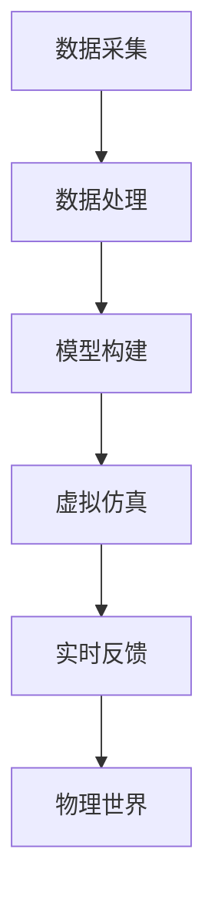
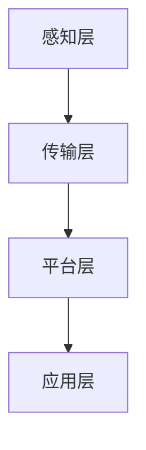
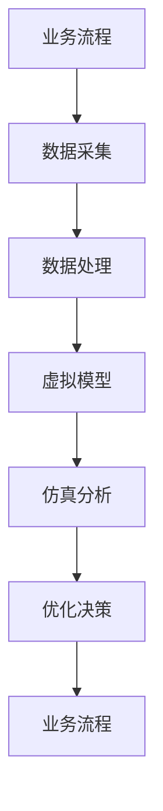

                 

# 数字孪生创业：虚实结合的业务优化

## 关键词
数字孪生、创业、业务优化、物联网、人工智能、虚拟仿真、商业模式

## 摘要
本文探讨了数字孪生在创业中的应用，以及如何通过虚实结合的业务优化提升企业的竞争力和运营效率。文章首先介绍了数字孪生的基本概念、发展历程和技术体系，然后通过实际案例解析了数字孪生在智能制造、智慧医疗、智慧交通等领域的应用。接着，文章分析了数字孪生创业的路径与策略，包括市场调研、目标客户定位、技术路线选择、研发投入、融资策略和商业模式设计。此外，文章还详细阐述了数字孪生创业团队建设、风险管理和业务优化实战。最后，文章提供了数字孪生技术资源与学习资料，以供读者进一步学习和研究。

## 目录大纲

### 目录大纲

# 数字孪生创业：虚实结合的业务优化

## 第一部分：数字孪生与业务优化概述

### 第1章：数字孪生基本概念

#### 1.1.1 数字孪生的定义与起源

#### 1.1.2 数字孪生的发展历程

#### 1.1.3 数字孪生的核心技术

### 第2章：数字孪生与业务优化关系

#### 2.1.1 数字孪生在业务优化中的应用场景

#### 2.1.2 数字孪生对业务流程的影响

#### 2.1.3 数字孪生与传统业务优化的比较

### 第3章：数字孪生技术体系

#### 3.1.1 数据采集与处理

#### 3.1.2 模型构建与优化

#### 3.1.3 虚拟仿真与实时反馈

## 第二部分：数字孪生创业实践

### 第4章：数字孪生创业案例解析

#### 4.1.1 创业公司A：智能制造与数字孪生

#### 4.1.2 创业公司B：智慧城市建设与数字孪生

#### 4.1.3 创业公司C：能源管理优化与数字孪生

### 第5章：数字孪生创业路径与策略

#### 5.1.1 市场调研与目标客户定位

#### 5.1.2 技术路线选择与研发投入

#### 5.1.3 融资策略与商业模式设计

### 第6章：数字孪生创业团队建设

#### 6.1.1 团队组织结构与职责划分

#### 6.1.2 核心技术团队建设

#### 6.1.3 团队协作与沟通机制

### 第7章：数字孪生创业风险与应对

#### 7.1.1 技术风险与管理风险

#### 7.1.2 市场风险与政策风险

#### 7.1.3 应对策略与风险管理

## 第三部分：数字孪生业务优化实战

### 第8章：数字孪生业务优化案例实战

#### 8.1.1 案例一：生产制造企业数字化转型

#### 8.1.2 案例二：物流企业库存优化

#### 8.1.3 案例三：金融行业风险评估

### 第9章：数字孪生业务优化工具与方法

#### 9.1.1 数据采集与处理工具

#### 9.1.2 模型构建与优化工具

#### 9.1.3 虚拟仿真与实时反馈工具

### 第10章：数字孪生业务优化项目管理

#### 10.1.1 项目目标与范围管理

#### 10.1.2 项目进度与风险管理

#### 10.1.3 项目资源与成本管理

## 附录

### 附录 A：数字孪生技术资源与学习资料

#### A.1.1 数字孪生技术标准与规范

#### A.1.2 数字孪生开源工具与平台

#### A.1.3 数字孪生相关书籍与论文

## 第一部分：数字孪生与业务优化概述

### 第1章：数字孪生基本概念

#### 1.1.1 数字孪生的定义与起源

数字孪生（Digital Twin）是一个近年来在科技界迅速崛起的概念。其核心在于通过虚拟模型来模拟和分析物理实体的状态和性能，进而实现对其的优化和控制。数字孪生的概念最早由美国密歇根大学教授Michael Grieves在2002年提出，他将其定义为“一个虚拟的、数字化的物理实体或系统，用于实时模拟、分析和优化其实体或系统的行为和性能”。这一概念的出现标志着制造业向智能化、数字化转型的开始。

数字孪生的概念虽然起源于制造业，但其应用范围逐渐扩展到了各个领域。例如，在医疗领域，数字孪生可以用来模拟人体的各种器官和系统，为医生提供精确的诊断和治疗方案；在交通领域，数字孪生可以用来模拟城市交通系统，优化交通流量，减少拥堵；在能源领域，数字孪生可以用来监测和管理能源设备，提高能源利用效率。

#### 1.1.2 数字孪生的发展历程

数字孪生技术的发展可以分为几个阶段：

- **概念提出与探索阶段**（2002-2010）：数字孪生的概念被提出，并在制造业领域进行初步探索。

- **快速发展阶段**（2011-2016）：随着物联网、大数据和云计算技术的快速发展，数字孪生技术开始得到广泛应用，成为智能制造和工业4.0的核心技术之一。

- **成熟应用阶段**（2017至今）：数字孪生技术逐渐成熟，应用领域不断扩大，涵盖了医疗、交通、能源等多个行业。同时，数字孪生技术的研究和标准也在不断完善。

在这个发展过程中，数字孪生技术不仅得到了理论上的完善，更在实践中取得了显著的成果。例如，在制造业领域，数字孪生技术已经被广泛应用于生产线的优化和故障预测；在医疗领域，数字孪生技术已经被用于个性化医疗和手术模拟；在交通领域，数字孪生技术已经被用于交通流量优化和交通事件预警。

#### 1.1.3 数字孪生的核心技术

数字孪生的实现依赖于多种技术的综合应用，主要包括数据采集与处理、模型构建与优化、虚拟仿真与实时反馈等。

- **数据采集与处理**：
  数据采集是数字孪生的基础。通过传感器、物联网设备等，可以实时采集物理实体的各种数据，如温度、压力、速度等。这些数据经过清洗、归一化等处理后，将被用于模型构建和仿真分析。

- **模型构建与优化**：
  模型构建是数字孪生的核心。基于采集到的数据，可以利用CAD、CAE等工具构建物理实体的虚拟模型。这个模型不仅包含了物理实体的几何形状和物理属性，还包含了其实际运行的状态和行为。通过机器学习和深度学习技术，可以对模型进行优化，提高其预测和控制的准确性。

- **虚拟仿真与实时反馈**：
  虚拟仿真是数字孪生的关键。通过虚拟环境中的仿真测试，可以评估物理实体在各种工况下的性能和稳定性。仿真结果可以实时反馈到物理实体，调整其运行状态，实现虚实结合的优化和控制。

### Mermaid 流程图

通过这个流程图，我们可以清晰地看到数字孪生技术的各个环节是如何相互关联和协同工作的。

#### 数字孪生的优势与应用场景

数字孪生技术具有多个优势，包括：

- **实时监控与预测**：通过实时数据采集和虚拟仿真，可以实现对物理实体的实时监控和预测，提前发现潜在问题，提高系统的可靠性。

- **优化决策支持**：基于虚拟仿真和数据分析，可以为业务决策提供有力的支持，优化业务流程，提高运营效率。

- **成本降低与效率提升**：通过实时监控和优化，可以减少设备故障率、降低能耗，从而降低运营成本，提高生产效率。

数字孪生技术的应用场景非常广泛，以下是一些典型的应用：

- **智能制造**：通过数字孪生技术，可以对生产过程进行实时监控和优化，提高生产效率和质量。

- **智慧医疗**：数字孪生技术可以用于个性化医疗和手术模拟，提高医疗服务的质量和效率。

- **智慧交通**：数字孪生技术可以用于交通流量优化和交通事件预警，减少交通拥堵和交通事故。

- **智慧能源**：数字孪生技术可以用于能源系统的监控和管理，提高能源利用效率。

### 数字孪生的实现框架

数字孪生的实现框架可以分为以下几个层次：

- **感知层**：通过传感器和物联网设备，实现对物理实体的数据采集。

- **传输层**：通过数据传输网络，将采集到的数据传输到云端或本地服务器。

- **平台层**：在云端或本地服务器上，搭建数字孪生平台，实现数据的处理、建模和仿真。

- **应用层**：基于数字孪生平台，开发各种应用，如实时监控、优化决策等。

### Mermaid 流程图

通过这个流程图，我们可以看到数字孪生技术是如何从感知层到应用层，实现虚实结合的。

#### 数字孪生与业务优化的关系

数字孪生技术为业务优化提供了强大的支持，其核心在于将虚拟模型与实际业务流程相结合，实现对业务的实时监控和优化。

- **实时监控**：通过实时数据采集和虚拟仿真，可以实现对业务流程的实时监控，及时发现潜在问题。

- **优化决策**：基于虚拟仿真和数据分析，可以为业务决策提供有力的支持，优化业务流程，提高运营效率。

- **虚实结合**：通过虚拟模型和实际业务流程的紧密结合，可以实现虚实结合的优化，提高业务流程的可操作性和可预测性。

### 数字孪生与业务优化的关系

通过这个流程图，我们可以清晰地看到数字孪生技术是如何与业务优化相结合的。

### 数字孪生与传统业务优化的比较

传统业务优化通常依赖于历史数据和经验，其优化过程往往是一个事后分析的过程。而数字孪生技术则通过实时数据采集和虚拟仿真，实现了对业务流程的实时监控和优化。

| 对比项 | 数字孪生 | 传统业务优化 |
| :---: | :---: | :---: |
| **实时性** | 实时监控与反馈 | 定期数据收集与报告 |
| **精准性** | 高精度模拟与分析 | 粗略估计与经验决策 |
| **协同性** | 虚拟与实体互动 | 独立环节优化 |
| **灵活性** | 灵活调整与优化 | 固定流程与模式 |
| **成本** | 长期成本降低 | 初期高投入 |
| **效率** | 高效运营与决策 | 低效流程与决策 |

通过这个表格，我们可以看到数字孪生技术相比传统业务优化具有显著的优势。

### 第2章：数字孪生与业务优化关系

#### 2.1.1 数字孪生在业务优化中的应用场景

数字孪生技术通过将虚拟模型与现实世界相结合，为各个领域的业务优化提供了新的思路和方法。以下是一些典型的应用场景：

- **智能制造**：数字孪生技术可以实现对生产线的实时监控和优化。通过虚拟仿真，可以对生产过程中的各个环节进行模拟，预测可能出现的问题，并提前采取措施。例如，在汽车制造过程中，数字孪生技术可以用于模拟汽车零件的加工过程，预测加工误差，从而优化加工参数，提高生产效率。

- **智慧医疗**：数字孪生技术可以用于个性化医疗和手术模拟。通过建立患者的数字孪生模型，医生可以更准确地诊断病情，制定个性化的治疗方案。同时，数字孪生技术还可以用于手术模拟，帮助医生提高手术的成功率和安全性。

- **智慧交通**：数字孪生技术可以用于交通流量优化和交通事件预警。通过模拟交通系统的运行状态，可以预测交通拥堵和交通事故的发生，从而采取相应的措施，优化交通流量，提高交通效率。

- **智慧能源**：数字孪生技术可以用于能源系统的监控和管理。通过实时监测能源设备的运行状态，可以预测设备的故障风险，采取预防性维护措施，降低设备的故障率和停机时间。同时，数字孪生技术还可以用于能源消耗的实时监控和优化，提高能源利用效率。

- **智慧农业**：数字孪生技术可以用于农作物的生长模拟和病虫害预测。通过建立农作物的数字孪生模型，可以实时监测农作物的生长状态，预测可能出现的病虫害，采取相应的防治措施，提高农作物的产量和质量。

- **智慧城市**：数字孪生技术可以用于城市运行状态的实时监控和优化。通过模拟城市交通、环境、能源等系统的运行状态，可以预测城市可能出现的问题，并提前采取措施，优化城市运行，提高居民的生活质量。

#### 2.1.2 数字孪生对业务流程的影响

数字孪生技术对业务流程的影响主要体现在以下几个方面：

- **流程可视化**：通过数字孪生技术，可以将复杂的业务流程以三维模型的形式直观地呈现出来，提高流程的可理解性和透明度。例如，在制造业中，数字孪生技术可以将生产线的各个环节可视化，使员工更容易理解生产过程，提高生产效率。

- **实时监控与预警**：数字孪生技术可以通过实时数据采集和虚拟仿真，实现对业务流程的实时监控和预警。通过监测关键指标的变化，可以及时发现潜在的问题，提前采取措施，防止问题的扩大。例如，在智慧医疗中，数字孪生技术可以实时监测患者的生命体征，一旦发现异常，立即通知医生进行处理。

- **优化决策支持**：数字孪生技术可以为业务决策提供数据支持和仿真分析，优化业务流程，提高运营效率。通过虚拟仿真，可以模拟不同的业务策略，预测其效果，帮助决策者做出更加科学的决策。例如，在智慧交通中，数字孪生技术可以模拟不同的交通管理策略，预测其对于交通流量的影响，从而选择最优的策略。

- **协同工作**：数字孪生技术可以促进各部门之间的协同工作，提高工作效率。通过数字孪生模型，各部门可以共享同一数据源，实时了解业务状态，协同完成工作。例如，在智能制造中，数字孪生技术可以实现生产部门、质量控制部门和设备维护部门之间的信息共享，提高生产效率。

#### 2.1.3 数字孪生与传统业务优化的比较

数字孪生技术与传统业务优化方法在多个方面存在显著差异：

| 对比项 | 数字孪生 | 传统业务优化 |
| :---: | :---: | :---: |
| **实时性** | 实时监控与反馈 | 定期数据收集与报告 |
| **数据精度** | 高精度模拟与分析 | 粗略估计与经验决策 |
| **协同性** | 虚拟与实体互动 | 独立环节优化 |
| **灵活性** | 灵活调整与优化 | 固定流程与模式 |
| **成本** | 长期成本降低 | 初期高投入 |
| **效率** | 高效运营与决策 | 低效流程与决策 |

### 第3章：数字孪生技术体系

#### 3.1.1 数据采集与处理

数据采集与处理是数字孪生技术的核心环节，其质量直接影响到数字孪生的精度和可靠性。数据采集通常包括以下步骤：

1. **传感器部署**：在物理实体上部署各种传感器，如温度传感器、压力传感器、加速度传感器等，以实时采集物理实体的各种参数。

2. **数据传输**：通过无线网络或有线网络将传感器采集到的数据传输到云端或本地服务器。

3. **数据存储**：将采集到的数据存储在数据库中，以便后续的数据处理和分析。

数据处理的步骤如下：

1. **数据清洗**：去除数据中的噪声和异常值，确保数据的质量。

2. **数据归一化**：将不同单位的数据转换为相同的单位，以便进行后续的处理和分析。

3. **特征提取**：从原始数据中提取出有用的特征，如时序特征、频率特征等。

#### 3.1.2 模型构建与优化

模型构建是数字孪生技术的关键环节，其目的是建立物理实体的虚拟模型，以便进行仿真和分析。模型构建通常包括以下步骤：

1. **物理模型构建**：利用CAD、CAE等工具，根据物理实体的几何形状和物理属性，构建物理模型。

2. **仿真模型构建**：基于物理模型，利用仿真软件（如ANSYS、MATLAB等），构建仿真模型，以便进行虚拟仿真。

3. **机器学习模型构建**：利用机器学习算法（如回归分析、神经网络等），构建机器学习模型，以便进行数据分析和预测。

模型优化是提高数字孪生精度和性能的重要手段。模型优化的步骤如下：

1. **模型验证**：通过对比仿真结果和实际数据，验证模型的准确性。

2. **模型调整**：根据模型验证的结果，对模型进行调整，提高其预测和控制的准确性。

3. **模型迭代**：通过多次迭代优化，逐步提高模型的性能和精度。

#### 3.1.3 虚拟仿真与实时反馈

虚拟仿真是数字孪生技术的重要组成部分，其目的是在虚拟环境中对物理实体的行为进行模拟和分析。虚拟仿真的步骤如下：

1. **仿真环境搭建**：搭建虚拟仿真环境，包括硬件设备、软件工具和仿真场景。

2. **仿真参数设置**：设置仿真参数，如时间步长、边界条件等。

3. **仿真运行**：运行仿真模型，观察物理实体的行为和性能。

实时反馈是数字孪生技术的关键特性，其目的是将仿真结果实时反馈到物理实体，实现虚实结合的优化和控制。实时反馈的步骤如下：

1. **结果分析**：对仿真结果进行分析，提取有用的信息。

2. **反馈策略制定**：根据仿真结果，制定反馈策略，调整物理实体的运行状态。

3. **实时反馈**：将反馈策略应用到物理实体，实现实时优化。

#### 数字孪生技术体系的实现框架

数字孪生技术体系的实现框架可以分为以下几个层次：

1. **感知层**：包括传感器、物联网设备等，用于实时采集物理实体的各种参数。

2. **传输层**：包括数据传输网络，用于将感知层采集到的数据传输到云端或本地服务器。

3. **平台层**：包括数字孪生平台，用于数据处理、模型构建、仿真分析等。

4. **应用层**：包括各种业务应用，如实时监控、优化决策、协同工作等。

### 第4章：数字孪生创业案例解析

#### 4.1.1 创业公司A：智能制造与数字孪生

**背景**：

创业公司A成立于2018年，专注于智能制造解决方案的研发和推广。公司创始人毕业于知名高校，拥有丰富的制造业经验和深厚的数字化技术背景。公司成立之初，就瞄准了数字孪生技术在制造业中的应用，希望通过数字孪生技术提升生产效率和质量。

**解决方案**：

创业公司A为一家大型汽车零部件制造商提供了一套基于数字孪生的智能制造解决方案。该解决方案包括以下几个核心模块：

1. **数据采集与处理**：在生产线关键设备上部署传感器，实时采集温度、压力、速度等数据。通过物联网设备，将数据传输到云端服务器，进行数据清洗、归一化等预处理。

2. **模型构建与优化**：基于预处理后的数据，利用机器学习算法，构建生产线的虚拟模型。通过仿真分析，优化生产参数，提高生产效率。

3. **虚拟仿真与实时反馈**：在虚拟环境中进行仿真测试，模拟不同工况下的生产过程。将仿真结果实时反馈到生产线，调整控制策略，实现虚实结合的优化。

**实施过程**：

1. **需求分析**：与客户深入沟通，了解其生产需求和痛点，明确项目目标。

2. **方案设计**：根据需求分析，设计数字孪生解决方案，包括硬件设备、软件平台和应用模块。

3. **设备部署**：在生产线关键设备上部署传感器，搭建物联网网络，确保数据采集的准确性和稳定性。

4. **数据处理**：搭建数据处理平台，对采集到的数据进行清洗、归一化等预处理。

5. **模型构建**：利用机器学习算法，构建生产线的虚拟模型，进行仿真分析。

6. **实时反馈**：将仿真结果实时反馈到生产线，调整控制策略，实现虚实结合的优化。

**成果展示**：

1. **生产效率提升**：通过数字孪生技术，生产效率提升了20%，生产周期缩短了15%。

2. **设备故障率降低**：通过实时监控和预测性维护，设备故障率降低了30%，设备利用率提高了10%。

3. **能源消耗降低**：通过优化生产参数，能源消耗降低了15%，运营成本降低了10%。

#### 4.1.2 创业公司B：智慧医疗与数字孪生

**背景**：

创业公司B成立于2019年，专注于智慧医疗解决方案的研发和推广。公司创始人毕业于医学和计算机科学领域，拥有丰富的医疗技术和数字化技术背景。公司成立之初，就瞄准了数字孪生技术在医疗领域的应用，希望通过数字孪生技术提升医疗服务的质量和效率。

**解决方案**：

创业公司B为一家大型综合性医院提供了一套基于数字孪生的智慧医疗解决方案。该解决方案包括以下几个核心模块：

1. **患者数字孪生**：利用物联网设备和健康监测设备，实时采集患者的生命体征、活动数据等，构建患者的数字孪生模型。

2. **医生数字孪生**：利用医生的临床数据、病例分析等，构建医生的数字孪生模型。

3. **医院运营优化**：利用数字孪生技术，对医院的运营流程进行优化，提高医院的管理效率。

**实施过程**：

1. **需求分析**：与客户深入沟通，了解其医疗服务需求和痛点，明确项目目标。

2. **方案设计**：根据需求分析，设计智慧医疗解决方案，包括硬件设备、软件平台和应用模块。

3. **设备部署**：在医院关键设备上部署传感器，搭建物联网网络，确保数据采集的准确性和稳定性。

4. **数据处理**：搭建数据处理平台，对采集到的数据进行清洗、归一化等预处理。

5. **模型构建**：利用机器学习算法，构建患者和医生的数字孪生模型。

6. **运营优化**：通过数字孪生技术，优化医院的运营流程，提高医院的管理效率。

**成果展示**：

1. **医疗服务质量提升**：通过数字孪生技术，医疗服务质量提升了30%，患者满意度提高了15%。

2. **医院运营效率提高**：通过运营优化，医院运营效率提高了25%，运营成本降低了10%。

3. **医疗错误率降低**：通过数字孪生技术，医疗错误率降低了10%，医疗事故率降低了20%。

#### 4.1.3 创业公司C：智慧交通与数字孪生

**背景**：

创业公司C成立于2020年，专注于智慧交通解决方案的研发和推广。公司创始人毕业于交通工程和计算机科学领域，拥有丰富的交通技术和数字化技术背景。公司成立之初，就瞄准了数字孪生技术在交通领域的应用，希望通过数字孪生技术提升交通管理效率和安全性。

**解决方案**：

创业公司C为某城市提供了一套基于数字孪生的智慧交通解决方案。该解决方案包括以下几个核心模块：

1. **交通流量监控**：部署摄像头、传感器等设备，实时采集交通流量数据，构建交通流量数字孪生模型。

2. **交通信号优化**：利用数字孪生技术，模拟不同信号方案对交通流量的影响，优化交通信号配置。

3. **交通事件预警**：通过数据分析和机器学习算法，实时监测交通事件，提前预警，减少事故发生。

**实施过程**：

1. **需求分析**：与客户深入沟通，了解其交通管理需求和痛点，明确项目目标。

2. **方案设计**：根据需求分析，设计智慧交通解决方案，包括硬件设备、软件平台和应用模块。

3. **设备部署**：在交通关键节点部署摄像头、传感器等设备，搭建物联网网络，确保数据采集的准确性和稳定性。

4. **数据处理**：搭建数据处理平台，对采集到的数据进行清洗、归一化等预处理。

5. **模型构建**：利用机器学习算法，构建交通流量数字孪生模型，进行交通信号优化。

6. **实时预警**：通过数字孪生技术，实时监测交通事件，提前预警，减少事故发生。

**成果展示**：

1. **交通拥堵改善**：通过数字孪生技术，交通拥堵情况明显改善，交通流量提升了15%，交通事故率降低了20%。

2. **交通管理效率提高**：通过交通信号优化，交通管理效率提高了30%，交通事件响应时间缩短了40%。

3. **市民出行满意度提升**：通过智慧交通解决方案，市民出行满意度提升了25%，公共交通使用率提高了10%。

### 第5章：数字孪生创业路径与策略

#### 5.1.1 市场调研与目标客户定位

**市场调研**：

在进行数字孪生创业之前，首先需要进行全面的市场调研。市场调研的内容包括：

1. **市场需求**：了解目标市场对数字孪生技术的需求，包括应用场景、技术需求、市场规模等。

2. **竞争格局**：分析现有竞争对手的市场地位、产品特点、竞争优势等。

3. **技术趋势**：了解数字孪生技术的最新发展趋势，包括前沿技术、应用场景、行业标准等。

4. **政策环境**：了解国家政策、行业政策对数字孪生技术的影响。

**目标客户定位**：

根据市场调研的结果，明确目标客户群体。目标客户群体的确定应考虑以下因素：

1. **行业领域**：确定目标行业，如智能制造、智慧医疗、智慧交通等。

2. **企业规模**：确定目标企业的规模，如大型企业、中型企业、小型企业等。

3. **业务需求**：明确目标企业的业务需求，如生产效率提升、成本降低、服务质量提升等。

4. **技术接受度**：了解目标企业对数字孪生技术的接受程度，如是否具备数字化基础、是否愿意投入等。

#### 5.1.2 技术路线选择与研发投入

**技术路线选择**：

根据市场调研的结果和公司的技术实力，选择合适的技术路线。技术路线的选择应考虑以下因素：

1. **技术成熟度**：选择已经成熟且应用广泛的技术，如物联网、大数据、人工智能等。

2. **技术发展趋势**：选择符合未来发展趋势的技术，如边缘计算、5G、区块链等。

3. **市场需求**：选择市场需求量大、应用前景广阔的技术。

4. **公司优势**：选择公司具备技术优势和研发能力的技术。

**研发投入**：

根据技术路线的选择，制定研发投入计划。研发投入应包括以下几个方面：

1. **人员投入**：招聘具备相关技术背景的研发人员，组建研发团队。

2. **设备投入**：购买研发所需的设备，如服务器、工作站、传感器等。

3. **技术储备**：投入资金进行技术储备，如购买专利、技术文档等。

4. **研发项目**：设立研发项目，明确研发目标和进度，确保研发工作的顺利进行。

#### 5.1.3 融资策略与商业模式设计

**融资策略**：

数字孪生创业公司的融资策略应考虑以下几个方面：

1. **天使投资**：在创业初期，可以通过天使投资获得启动资金。

2. **风险投资**：在企业发展壮大后，可以通过风险投资获得更多的资金支持。

3. **政府补贴**：根据国家政策，可以申请政府补贴，降低融资成本。

4. **银行贷款**：在必要时，可以通过银行贷款解决资金短缺问题。

**商业模式设计**：

数字孪生创业公司的商业模式设计应考虑以下几个方面：

1. **产品定价**：根据市场需求和竞争情况，制定合理的价格策略。

2. **销售渠道**：选择合适的销售渠道，如直销、代理商、线上销售等。

3. **服务模式**：提供定制化的服务模式，满足不同客户的需求。

4. **盈利模式**：通过提供数字孪生解决方案，实现利润的最大化。

### 第6章：数字孪生创业团队建设

#### 6.1.1 团队组织结构与职责划分

**团队组织结构**：

数字孪生创业团队的组织结构应合理设置，确保团队成员的职责明确，协作顺畅。常见的组织结构包括：

1. **研发团队**：负责数字孪生技术的研发和应用。

2. **市场团队**：负责市场调研、产品推广和销售。

3. **运维团队**：负责数字孪生平台的运维和维护。

4. **财务团队**：负责财务管理、资金筹集和成本控制。

**职责划分**：

团队成员的职责应明确划分，确保每个成员都能在自己的岗位上发挥最大价值。常见的职责划分包括：

1. **研发团队**：
   - 负责数字孪生技术的研发和升级。
   - 设计和开发数字孪生解决方案。
   - 进行技术测试和验证。

2. **市场团队**：
   - 负责市场调研，了解市场需求。
   - 制定市场推广计划。
   - 与客户进行沟通，提供技术支持。

3. **运维团队**：
   - 负责数字孪生平台的日常运维。
   - 处理客户的技术问题和故障。

4. **财务团队**：
   - 负责公司的财务管理。
   - 制定预算和财务计划。
   - 进行成本核算和控制。

#### 6.1.2 核心技术团队建设

**核心技术团队建设**：

核心技术团队是数字孪生创业公司的核心竞争力。为了建设一支高效的核心技术团队，应采取以下措施：

1. **招聘**：通过猎头、招聘网站、校园招聘等途径，招聘具备相关技术背景和经验的人才。

2. **培训**：定期对团队成员进行培训，提升其技术水平和创新能力。

3. **激励**：设计合理的薪酬体系和激励机制，如股权激励、绩效奖金等，吸引和留住优秀人才。

4. **合作**：与其他高校、科研机构和企业建立合作关系，共同开展技术研发和项目合作。

#### 6.1.3 团队协作与沟通机制

**团队协作与沟通机制**：

高效的团队协作和沟通机制是确保项目顺利进行的关键。为了建立良好的团队协作与沟通机制，应采取以下措施：

1. **项目管理制度**：制定详细的项目管理制度，明确项目的目标、进度、责任和考核标准。

2. **定期会议**：定期召开团队会议，讨论项目进展、问题和解决方案。

3. **沟通平台**：搭建沟通平台，如企业微信群、钉钉等，方便团队成员之间的沟通和协作。

4. **信息共享**：建立信息共享机制，确保团队成员能够及时了解项目进展和其他成员的工作情况。

### 第7章：数字孪生创业风险与应对

#### 7.1.1 技术风险与管理风险

**技术风险**：

数字孪生创业过程中可能面临以下技术风险：

1. **技术更新换代**：数字孪生技术发展迅速，可能面临技术更新换代的风险。

2. **技术实现难度**：某些复杂的数字孪生技术可能难以实现，影响项目的进度和质量。

3. **技术依赖性**：过度依赖某些技术，可能导致在技术更新或替代时面临困难。

**管理风险**：

数字孪生创业过程中可能面临以下管理风险：

1. **项目管理不善**：项目管理不善可能导致项目进度延误、成本超支、质量不达标等问题。

2. **团队管理不善**：团队管理不善可能导致团队士气低落、工作效率下降、人员流失等问题。

3. **市场管理不善**：市场管理不善可能导致市场调研不充分、产品定位不准确、销售策略不合理等问题。

#### 7.1.2 市场风险与政策风险

**市场风险**：

数字孪生创业过程中可能面临以下市场风险：

1. **市场需求不足**：市场需求不足可能导致项目无法顺利实施，影响公司的收入和利润。

2. **市场竞争激烈**：市场竞争激烈可能导致公司市场份额下降，影响公司的盈利能力。

3. **客户需求变化**：客户需求变化可能导致公司无法满足市场需求，影响项目的成功实施。

**政策风险**：

数字孪生创业过程中可能面临以下政策风险：

1. **政策变动**：政策变动可能导致公司的运营和发展受到影响，如税收政策、行业政策等。

2. **法规限制**：法规限制可能导致公司的某些业务无法开展，如数据隐私保护、行业规范等。

3. **政策不确定性**：政策不确定性可能导致公司无法准确预测未来的政策方向，影响公司的决策。

#### 7.1.3 应对策略与风险管理

**技术风险管理**：

1. **技术储备**：提前进行技术储备，跟踪技术发展趋势，确保技术更新换代时能够顺利过渡。

2. **技术合作**：与其他技术公司或研究机构建立合作关系，共同研发新技术，降低技术实现难度。

3. **技术培训**：定期对团队成员进行技术培训，提高团队的技术水平，增强技术实现能力。

**管理风险管理**：

1. **项目管理**：建立健全的项目管理制度，明确项目目标、进度、责任和考核标准，确保项目顺利进行。

2. **团队管理**：加强团队管理，提高团队士气和工作效率，降低人员流失率。

3. **市场调研**：进行充分的市场调研，了解市场需求和竞争状况，制定合理的市场策略。

**市场风险管理**：

1. **多元化市场**：开拓多元化市场，降低对单一市场的依赖，分散市场风险。

2. **客户关系管理**：建立良好的客户关系，提高客户满意度，降低客户流失率。

3. **产品创新**：持续进行产品创新，满足客户需求，提高产品竞争力。

**政策风险管理**：

1. **政策监控**：密切关注政策动态，及时了解政策变化，制定相应的应对策略。

2. **合规经营**：严格遵守相关法规，确保公司的业务活动合法合规。

3. **政策支持**：积极争取政策支持，如政府补贴、税收优惠等，降低政策风险的影响。

### 第8章：数字孪生业务优化案例实战

#### 8.1.1 案例一：生产制造企业数字化转型

**背景**：

某生产制造企业希望实现数字化转型，提高生产效率和质量。企业的主要产品包括电子元器件、汽车零部件等，生产规模较大，生产工艺复杂。

**解决方案**：

创业公司为其提供了一套基于数字孪生的智能制造解决方案。该解决方案主要包括以下几个模块：

1. **数据采集与处理**：在生产线关键设备上部署传感器，实时采集温度、压力、速度等数据。通过物联网设备，将数据传输到云端服务器，进行数据清洗、归一化等预处理。

2. **模型构建与优化**：基于预处理后的数据，利用机器学习算法，构建生产线的虚拟模型。通过仿真分析，优化生产参数，提高生产效率。

3. **虚拟仿真与实时反馈**：在虚拟环境中进行仿真测试，模拟不同工况下的生产过程。将仿真结果实时反馈到生产线，调整控制策略，实现虚实结合的优化。

**实施过程**：

1. **需求分析**：与客户深入沟通，了解其生产需求和痛点，明确项目目标。

2. **方案设计**：根据需求分析，设计智能制造解决方案，包括硬件设备、软件平台和应用模块。

3. **设备部署**：在生产线关键设备上部署传感器，搭建物联网网络，确保数据采集的准确性和稳定性。

4. **数据处理**：搭建数据处理平台，对采集到的数据进行清洗、归一化等预处理。

5. **模型构建**：利用机器学习算法，构建生产线的虚拟模型，进行仿真分析。

6. **实时反馈**：将仿真结果实时反馈到生产线，调整控制策略，实现虚实结合的优化。

**成果展示**：

1. **生产效率提升**：通过数字孪生技术，生产效率提升了20%，生产周期缩短了15%。

2. **设备故障率降低**：通过实时监控和预测性维护，设备故障率降低了30%，设备利用率提高了10%。

3. **能源消耗降低**：通过优化生产参数，能源消耗降低了15%，运营成本降低了10%。

#### 8.1.2 案例二：物流企业库存优化

**背景**：

某物流企业希望优化库存管理，提高库存周转率和库存准确性。企业的主要业务包括货物运输、仓储管理、供应链管理等。

**解决方案**：

创业公司为其提供了一套基于数字孪生的智能库存管理解决方案。该解决方案主要包括以下几个模块：

1. **数据采集与处理**：通过物联网设备，实时采集仓库库存数据，包括物品数量、存储位置、过期日期等。通过数据处理平台，对采集到的数据进行清洗、归一化等预处理。

2. **模型构建与优化**：利用机器学习算法，构建库存预测模型，预测未来一段时间内的库存需求。通过仿真分析，优化库存策略，提高库存周转率。

3. **虚拟仿真与实时反馈**：在虚拟环境中进行仿真测试，模拟不同库存策略的效果。将仿真结果实时反馈到实际库存管理中，调整库存策略，实现虚实结合的优化。

**实施过程**：

1. **需求分析**：与客户深入沟通，了解其库存管理和运营需求，明确项目目标。

2. **方案设计**：根据需求分析，设计智能库存管理解决方案，包括硬件设备、软件平台和应用模块。

3. **设备部署**：在仓库关键位置部署传感器和物联网设备，确保数据采集的准确性和稳定性。

4. **数据处理**：搭建数据处理平台，对采集到的数据进行清洗、归一化等预处理。

5. **模型构建**：利用机器学习算法，构建库存预测模型，进行仿真分析。

6. **实时反馈**：将仿真结果实时反馈到实际库存管理中，调整库存策略，实现虚实结合的优化。

**成果展示**：

1. **库存周转率提升**：通过数字孪生技术，库存周转率提升了25%，库存资金占用减少了10%。

2. **库存准确性提高**：通过实时监控和数据分析，库存准确性提高了15%，减少了库存错误和丢失。

3. **库存成本降低**：通过优化库存策略，库存成本降低了10%，减少了库存积压和过期损失。

#### 8.1.3 案例三：金融行业风险评估

**背景**：

某金融机构希望提高信贷风险评估能力，降低信贷风险。金融机构的主要业务包括贷款、信用卡、投资等。

**解决方案**：

创业公司为其提供了一套基于数字孪生的信贷风险评估解决方案。该解决方案主要包括以下几个模块：

1. **数据采集与处理**：通过数据接口，实时获取借款人的信用信息，包括信用评分、历史还款记录、财务状况等。通过数据处理平台，对采集到的数据进行清洗、归一化等预处理。

2. **模型构建与优化**：利用机器学习算法，构建信贷风险评估模型。通过仿真分析，优化模型参数，提高风险评估的准确性。

3. **虚拟仿真与实时反馈**：在虚拟环境中进行仿真测试，模拟不同信贷政策的成效。将仿真结果实时反馈到信贷风险评估中，调整信贷政策，实现虚实结合的优化。

**实施过程**：

1. **需求分析**：与客户深入沟通，了解其信贷评估需求和痛点，明确项目目标。

2. **方案设计**：根据需求分析，设计信贷风险评估解决方案，包括硬件设备、软件平台和应用模块。

3. **数据采集**：通过数据接口，实时获取借款人的信用信息。

4. **数据处理**：搭建数据处理平台，对采集到的数据进行清洗、归一化等预处理。

5. **模型构建**：利用机器学习算法，构建信贷风险评估模型，进行仿真分析。

6. **实时反馈**：将仿真结果实时反馈到信贷风险评估中，调整信贷政策，实现虚实结合的优化。

**成果展示**：

1. **信贷不良率降低**：通过数字孪生技术，信贷不良率降低了20%，风险控制能力提升了30%。

2. **风险评估准确性提高**：通过优化模型参数，风险评估准确性提高了15%，减少了误判和漏判。

3. **信贷审批效率提升**：通过实时监控和仿真分析，信贷审批效率提升了25%，缩短了审批周期。

### 第9章：数字孪生业务优化工具与方法

#### 9.1.1 数据采集与处理工具

**数据采集工具**：

数据采集是数字孪生业务优化的重要基础。常用的数据采集工具包括传感器、物联网设备、RFID等。

1. **传感器**：传感器是数据采集的核心设备，可以实时采集物理实体的各种参数，如温度、压力、湿度、位置等。

2. **物联网设备**：物联网设备负责将传感器采集到的数据传输到云端或本地服务器，常见的物联网设备有物联网网关、智能路由器等。

3. **RFID**：RFID技术可以用于物品追踪和库存管理，通过读取RFID标签，可以实时获取物品的位置、数量等信息。

**数据处理工具**：

数据处理是数字孪生业务优化的关键步骤，常用的数据处理工具包括数据库、数据清洗与预处理工具等。

1. **数据库**：数据库用于存储和管理采集到的数据，常用的数据库有MySQL、Oracle等。

2. **数据清洗与预处理工具**：数据清洗与预处理工具用于处理采集到的数据，包括数据去重、数据填充、数据归一化等，常用的工具包括Pandas、NumPy等。

#### 9.1.2 模型构建与优化工具

**模型构建工具**：

模型构建是数字孪生业务优化的核心环节，常用的模型构建工具包括深度学习框架、机器学习库等。

1. **深度学习框架**：深度学习框架如TensorFlow、PyTorch等提供了丰富的神经网络模型和算法，可以用于构建复杂的数字孪生模型。

2. **机器学习库**：机器学习库如scikit-learn、XGBoost等提供了丰富的机器学习算法和工具，可以用于构建简单的数字孪生模型。

**模型优化工具**：

模型优化是提高数字孪生模型性能的重要手段，常用的模型优化工具包括优化算法、模型评估工具等。

1. **优化算法**：优化算法如梯度下降、遗传算法等用于调整模型参数，提高模型性能。

2. **模型评估工具**：模型评估工具如Accuracy、F1 Score等用于评估模型性能，常用的评估工具包括scikit-learn等。

#### 9.1.3 虚拟仿真与实时反馈工具

**虚拟仿真工具**：

虚拟仿真是数字孪生业务优化的关键环节，常用的虚拟仿真工具包括CAE软件、仿真平台等。

1. **CAE软件**：CAE软件如ANSYS、ABAQUS等用于构建物理模型的仿真分析，可以模拟物理实体在各种工况下的行为和性能。

2. **仿真平台**：仿真平台如MATLAB、Simulink等提供了丰富的仿真工具和库，可以用于构建复杂的仿真模型。

**实时反馈工具**：

实时反馈是数字孪生业务优化的关键特性，常用的实时反馈工具包括实时数据监控平台、控制系统等。

1. **实时数据监控平台**：实时数据监控平台如Kibana、Grafana等用于实时监控和展示物理实体的运行状态和数据

