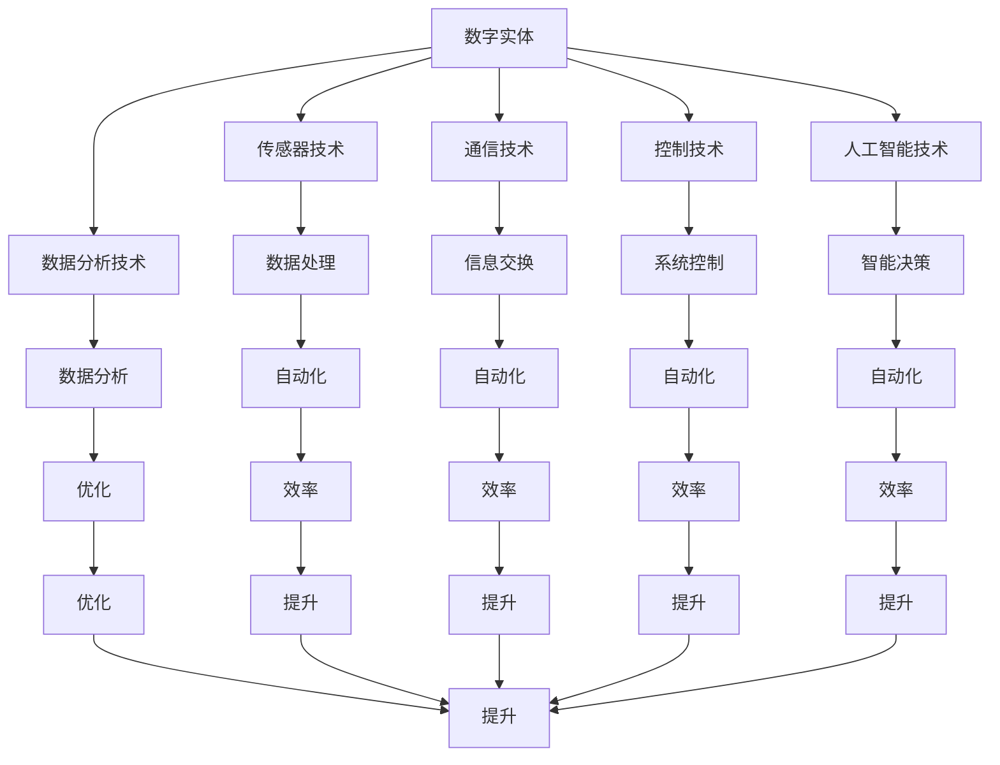

                 

# 数字实体的自动化应用与发展

关键词：数字实体、自动化、应用领域、技术挑战、未来趋势

摘要：
随着信息技术的飞速发展和人工智能技术的不断突破，数字实体的自动化应用正逐步成为各行业的核心竞争力。本文将从数字实体的概念出发，详细探讨其在自动化应用中的重要性、基础技术、应用领域、面临的挑战与解决方案、未来发展趋势以及相关政策和教育等方面，力求为读者提供一个全面、深入的视角，了解数字实体自动化在当前社会中的关键作用和广阔前景。

### 第一部分: 数字实体的自动化应用与发展概述

#### 第1章: 数字实体自动化应用的背景与意义

##### 1.1 数字实体的概念及其重要性

**1.1.1 数字实体的定义**

数字实体，通常指的是在数字世界中具有独立存在和操作能力的虚拟对象或系统。这些实体可以包括虚拟人、虚拟物品、虚拟场景等。随着虚拟现实、增强现实和区块链技术的发展，数字实体的定义和应用场景正在不断扩展。

**1.1.2 数字实体在现代社会中的应用**

数字实体在现代社会的应用已经深入到各个领域，如电子商务、社交媒体、游戏、智能城市和智能制造等。数字实体不仅提升了用户体验，还大大提高了业务效率和创新能力。

**1.1.3 数字实体自动化的必要性**

随着数据量的爆炸式增长和复杂性的提升，手工操作已无法满足高效、准确的要求。数字实体自动化成为必然趋势，可以大幅提高生产效率、降低成本、减少人为错误，并推动产业升级。

##### 1.2 数字实体自动化的背景

**1.2.1 信息技术的发展**

信息技术的飞速发展，特别是互联网、云计算和大数据技术的成熟，为数字实体自动化提供了坚实的基础。

**1.2.2 人工智能技术的进步**

人工智能技术的不断突破，使得数字实体能够具备更高的智能水平，实现更加复杂和智能化的自动化应用。

**1.2.3 自动化技术的广泛应用**

自动化技术的广泛应用，包括传感器技术、通信技术、控制技术等，为数字实体自动化提供了丰富的工具和手段。

##### 1.3 数字实体自动化的意义

**1.3.1 提高生产效率**

数字实体自动化能够通过智能化、自动化方式完成生产流程中的各个环节，大幅提高生产效率。

**1.3.2 优化资源配置**

通过数字实体自动化，可以更精确地管理和调度资源，降低浪费，提高资源利用效率。

**1.3.3 促进产业升级转型**

数字实体自动化能够推动传统产业向智能化、数字化方向转型，提升产业竞争力。

**1.3.4 增强企业竞争力**

通过数字实体自动化，企业能够更好地满足市场需求，提供个性化、定制化的服务，增强竞争力。

#### 第2章: 数字实体自动化的基础技术

##### 2.1 传感器技术

**2.1.1 传感器的基本原理**

传感器是数字实体感知外界环境的关键设备，其基本原理是通过将物理量转换为电信号进行处理。

**2.1.2 传感器的分类与应用**

传感器根据感知的物理量不同，可分为温度传感器、压力传感器、光传感器等，应用领域广泛。

##### 2.2 通信技术

**2.2.1 通信技术的基本原理**

通信技术是实现数字实体之间信息交换的关键，其基本原理包括信号传输、调制与解调等。

**2.2.2 通信技术的分类与应用**

通信技术根据传输介质和协议不同，可分为有线通信、无线通信等，广泛应用于物联网和智能城市等领域。

##### 2.3 控制技术

**2.3.1 控制技术的基本原理**

控制技术是通过算法和模型对系统进行控制和优化，实现数字实体的自动化操作。

**2.3.2 控制技术的分类与应用**

控制技术根据控制对象和策略不同，可分为线性控制、非线性控制等，广泛应用于工业制造、机器人等领域。

##### 2.4 人工智能技术

**2.4.1 人工智能的基本原理**

人工智能是通过模拟人类思维和行为来实现智能化的技术，其基本原理包括机器学习、深度学习等。

**2.4.2 人工智能的分类与应用**

人工智能根据应用领域和算法不同，可分为图像识别、自然语言处理等，广泛应用于智能制造、智能客服等领域。

##### 2.5 数据分析技术

**2.5.1 数据分析的基本原理**

数据分析是通过统计和算法方法对数据进行处理和分析，提取有价值的信息。

**2.5.2 数据分析的应用与实例**

数据分析在数字实体自动化中具有重要意义，如预测分析、聚类分析等，广泛应用于营销、供应链管理等领域。

#### 第3章: 数字实体自动化的应用领域

##### 3.1 工业制造领域

**3.1.1 工业制造自动化的现状**

工业制造自动化已经成为提高生产效率和降低成本的重要手段，各种自动化设备和系统在工业制造中广泛应用。

**3.1.2 工业制造自动化的关键技术**

工业制造自动化的关键技术包括自动化生产线、机器人技术、传感器技术等。

**3.1.3 工业制造自动化的案例分析**

以某汽车制造企业为例，分析其自动化生产线的设计和实施过程。

##### 3.2 农业领域

**3.2.1 农业自动化的现状**

农业自动化在提高农业生产效率、降低劳动强度和改善农产品质量方面发挥了重要作用。

**3.2.2 农业自动化的关键技术**

农业自动化的关键技术包括智能灌溉系统、无人机植保、自动化种植设备等。

**3.2.3 农业自动化的案例分析**

以某农业科技企业为例，分析其自动化农场的建设和管理。

##### 3.3 城市管理领域

**3.3.1 城市管理自动化的现状**

城市管理自动化在提高城市运行效率和居民生活质量方面具有重要意义。

**3.3.2 城市管理自动化的关键技术**

城市管理自动化的关键技术包括智能交通系统、智能安防系统、智能公共服务系统等。

**3.3.3 城市管理自动化的案例分析**

以某智慧城市为例，分析其自动化管理系统的设计和实施。

##### 3.4 医疗保健领域

**3.4.1 医疗保健自动化的现状**

医疗保健自动化在提高医疗效率、降低医疗成本和改善患者体验方面发挥了重要作用。

**3.4.2 医疗保健自动化的关键技术**

医疗保健自动化的关键技术包括智能诊断系统、智能药物配送系统、智能健康监测设备等。

**3.4.3 医疗保健自动化的案例分析**

以某医院为例，分析其智能化医疗系统的建设和应用。

#### 第4章: 数字实体自动化的挑战与解决方案

##### 4.1 技术挑战

**4.1.1 数据处理挑战**

随着数据量的增长，如何高效处理海量数据成为数字实体自动化的一个重要挑战。

**4.1.2 算法优化挑战**

复杂的自动化任务需要高效的算法支持，算法优化是提升自动化效率的关键。

**4.1.3 硬件性能挑战**

硬件性能的提升对数字实体自动化的实现至关重要，高性能硬件支持更加复杂的自动化应用。

##### 4.2 安全与隐私挑战

**4.2.1 数据安全挑战**

保护数字实体的数据安全是防止数据泄露和恶意攻击的关键。

**4.2.2 隐私保护挑战**

在自动化应用中，如何保护用户隐私是面临的一个重要问题。

**4.2.3 法律法规挑战**

法律法规对数字实体自动化的应用提出了规范要求，需要企业遵循相关法律法规。

##### 4.3 解决方案

**4.3.1 技术创新方案**

通过技术创新，如新型传感器技术、高效算法和新型硬件，可以解决自动化应用中的技术挑战。

**4.3.2 政策法规方案**

制定合理的政策法规，规范数字实体自动化的应用，保护企业和用户权益。

**4.3.3 社会协同方案**

社会各界的协同合作，如企业、政府、学术机构和行业协会等，共同推动数字实体自动化的发展。

#### 第5章: 数字实体自动化的未来发展趋势

##### 5.1 技术趋势

**5.1.1 人工智能与物联网的深度融合**

人工智能与物联网的深度融合将推动数字实体自动化向更智能化、更高效的方向发展。

**5.1.2 大数据和云计算的赋能**

大数据和云计算将为数字实体自动化提供强大的数据处理和分析能力。

**5.1.3 生物技术与数字实体的融合**

生物技术与数字实体的融合将开拓数字实体自动化在医疗、农业等领域的应用前景。

##### 5.2 应用趋势

**5.2.1 各行业应用深化**

数字实体自动化在各行业的应用将不断深化，提升行业效率和创新能力。

**5.2.2 新兴领域崛起**

随着技术的进步，数字实体自动化将在新兴领域如智能制造、智慧医疗等得到广泛应用。

**5.2.3 跨界融合创新**

不同领域的数字实体自动化应用将相互融合，形成新的商业模式和创新成果。

##### 5.3 未来展望

**5.3.1 数字实体自动化对社会的影响**

数字实体自动化将深刻改变社会生产方式、生活方式和商业形态。

**5.3.2 数字实体自动化面临的机遇与挑战**

在数字实体自动化的快速发展过程中，将面临诸多机遇和挑战，需要社会各界共同应对。

#### 第6章: 数字实体自动化的实践案例分析

##### 6.1 案例背景

**6.1.1 案例概述**

**6.1.2 案例目标**

##### 6.2 案例实施

**6.2.1 技术选型与方案设计**

**6.2.2 系统开发与部署**

**6.2.3 运营与维护**

##### 6.3 案例效果

**6.3.1 效果评估**

**6.3.2 经验总结**

#### 第7章: 数字实体自动化的产业政策与支持

##### 7.1 国家政策

**7.1.1 政策背景**

**7.1.2 政策内容与解读**

**7.1.3 政策对企业的影响**

##### 7.2 地方政策

**7.2.1 地方政策概述**

**7.2.2 地方政策案例**

**7.2.3 地方政策对企业的影响**

##### 7.3 政策支持措施

**7.3.1 资金支持**

**7.3.2 技术支持**

**7.3.3 市场支持**

#### 第8章: 数字实体自动化的教育与人才培养

##### 8.1 教育体系改革

**8.1.1 教育体系现状**

**8.1.2 教育体系改革方向**

**8.1.3 教育改革对人才培养的影响**

##### 8.2 人才培养策略

**8.2.1 人才培养模式**

**8.2.2 人才培养体系**

**8.2.3 人才培养案例分析**

##### 8.3 人才需求分析

**8.3.1 人才需求现状**

**8.3.2 人才需求预测**

**8.3.3 企业人才需求分析**

#### 第9章: 数字实体自动化的国际合作与竞争

##### 9.1 国际合作现状

**9.1.1 国际合作机制**

**9.1.2 国际合作案例**

**9.1.3 国际合作的影响**

##### 9.2 国际竞争态势

**9.2.1 竞争格局分析**

**9.2.2 竞争策略分析**

**9.2.3 企业应对策略**

##### 9.3 国际合作与竞争的展望

**9.3.1 未来发展趋势**

**9.3.2 国际合作机会**

**9.3.3 竞争形势展望**

#### 第10章: 数字实体自动化的伦理与社会责任

##### 10.1 伦理问题

**10.1.1 数字实体自动化伦理问题的表现**

**10.1.2 伦理问题对社会的潜在影响**

**10.1.3 伦理问题的解决方案**

##### 10.2 社会责任

**10.2.1 企业社会责任概述**

**10.2.2 社会责任实践案例**

**10.2.3 社会责任对企业的影响**

##### 10.3 伦理与社会责任的融合

**10.3.1 伦理与社会责任的融合趋势**

**10.3.2 伦理与社会责任在数字实体自动化中的应用**

**10.3.3 伦理与社会责任对数字实体自动化发展的影响**

## 附录

### 附录 A: 数字实体自动化相关技术与应用资源

**A.1 技术资源**

**A.2 应用案例**

**A.3 国际组织与平台**

### 附录 B: 数字实体自动化相关标准与规范

**B.1 标准化现状**

**B.2 标准制定与实施**

**B.3 标准化对数字实体自动化的影响**

### 作者

作者：AI天才研究院/AI Genius Institute & 禅与计算机程序设计艺术 /Zen And The Art of Computer Programming

---

**核心概念与联系**

为了更清晰地展示数字实体自动化的核心概念及其相互联系，我们使用Mermaid流程图来绘制如下：



**核心算法原理讲解**

以机器学习中的决策树算法为例，其基本原理如下：

```python
# 决策树算法伪代码

# 输入：特征集合F、训练数据集D
# 输出：决策树T

CreateTree(F, D):
    if D is a leaf node:
        return createLeafNode(D)
    else:
        # 计算信息增益
        bestFeature = BestFeature(F, D)
        node = createDecisionNode(bestFeature)
        for value in uniqueValues(bestFeature):
            subsetD = select(D, value)
            node = node.appendChild(CreateTree(F - {bestFeature}, subsetD))
        return node

BestFeature(F, D):
    bestGain = -1
    for feature in F:
        gain = InformationGain(F, D, feature)
        if gain > bestGain:
            bestGain = gain
            bestFeature = feature
    return bestFeature

InformationGain(F, D, feature):
    # 计算特征对数据的划分信息增益
    # ...
    return gain
```

**数学模型和公式**

在数字实体自动化中，常用的数学模型之一是线性回归模型。其公式如下：

$$
y = \beta_0 + \beta_1x_1 + \beta_2x_2 + ... + \beta_nx_n
$$

其中，$y$ 表示输出变量，$x_1, x_2, ..., x_n$ 表示输入变量，$\beta_0, \beta_1, \beta_2, ..., \beta_n$ 为模型参数。

**项目实战**

以下是一个基于Python的数字实体自动化的实际项目案例，用于实现一个智能家居系统。

**开发环境搭建**

1. 安装Python 3.8及以上版本。
2. 安装所需库，如`requests`、`paho-mqtt`、`numpy`等。

**源代码详细实现**

```python
import paho.mqtt.client as mqtt
import numpy as np
import time

# MQTT客户端设置
client = mqtt.Client()

# 连接MQTT服务器
client.connect("mqtt.broker.here", 1883, 60)

# 订阅主题
client.subscribe("home/sensor/temperature")

# 数据处理函数
def process_data(data):
    temp = float(data)
    if temp > 30:
        return "高温"
    elif temp > 20:
        return "适中"
    else:
        return "低温"

# 数据接收处理
def on_message(client, userdata, message):
    data = str(message.payload.decode("utf-8"))
    print("Received:", data)
    status = process_data(data)
    print("Processed status:", status)
    if status == "高温":
        client.publish("home/actuator/fan", "on")
    else:
        client.publish("home/actuator/fan", "off")

# 注册消息处理函数
client.on_message = on_message

# 启动MQTT客户端
client.loop_forever()
```

**代码解读与分析**

上述代码实现了一个智能家居系统，用于监测室内温度并根据温度高低控制风扇的开关。

1. 导入所需库。
2. 设置MQTT客户端。
3. 连接MQTT服务器。
4. 订阅温度传感器数据主题。
5. 定义数据处理函数，用于判断温度高低。
6. 注册消息处理函数，接收并处理数据。
7. 启动MQTT客户端，进入循环等待消息。

通过上述代码，我们可以实现对室内温度的实时监测和智能控制，提高了家居生活的便捷性和舒适度。

### 数字实体自动化的教育与人才培养

#### 教育体系改革

**8.1.1 教育体系现状**

目前，我国的教育体系在培养数字实体自动化相关人才方面存在一定局限性。传统教育模式侧重于理论知识传授，忽视了实践技能的培养。同时，课程设置和教学内容相对滞后，无法满足快速发展的市场需求。

**8.1.2 教育体系改革方向**

为了培养更多具备实际操作能力的数字实体自动化人才，教育体系改革应从以下几方面入手：

1. **课程设置**：增加数字实体自动化相关课程，如物联网技术、人工智能、大数据分析等，将理论与实践相结合。
2. **实践教学**：加强实验课和实践课的比重，提供更多的实践机会，让学生在实际操作中掌握技能。
3. **校企合作**：与企业共同制定培养方案，引入企业资源和案例，提升学生的实战能力。

**8.1.3 教育改革对人才培养的影响**

教育体系改革将有助于提升数字实体自动化人才的培养质量，使学生在毕业后具备较强的实践能力和创新能力，从而更好地适应市场需求，促进产业发展。

#### 人才培养策略

**8.2.1 人才培养模式**

1. **分层次培养**：针对不同层次的学生，制定差异化的培养方案，如本科、研究生和职业教育等。
2. **项目驱动培养**：通过参与实际项目，让学生在解决实际问题的过程中提高技能。
3. **跨学科培养**：打破学科界限，鼓励学生跨学科学习，培养具有综合能力的人才。

**8.2.2 人才培养体系**

1. **课程体系**：构建涵盖基础课程、专业课程和实践课程的课程体系。
2. **师资队伍**：引进高水平教师，提升教学水平，同时鼓励教师参与实际项目，提高实践教学能力。
3. **实习实训平台**：建立完善的实习实训平台，提供丰富的实践资源。

**8.2.3 人才培养案例分析**

以某高校为例，通过校企合作开展人才培养项目，学生在课程学习的基础上，参与了企业实际项目的开发，不仅提高了实践技能，还培养了团队协作和沟通能力，受到了企业的欢迎。

#### 人才需求分析

**8.3.1 人才需求现状**

随着数字实体自动化的快速发展，各行业对相关人才的需求日益旺盛。企业普遍反映，具备实践经验和创新能力的数字实体自动化人才短缺，成为制约产业发展的重要因素。

**8.3.2 人才需求预测**

随着技术的不断进步和应用领域的拓展，未来数字实体自动化人才的需求将继续保持增长。特别是在智能制造、智慧城市和医疗健康等领域，对数字实体自动化人才的需求将更为迫切。

**8.3.3 企业人才需求分析**

以某制造业企业为例，企业对数字实体自动化人才的需求主要集中在以下几方面：

1. **技术人才**：掌握传感器技术、通信技术、控制技术等基础技术，能够进行系统设计和优化。
2. **算法工程师**：具备机器学习、深度学习等相关技能，能够开发智能算法，提升自动化系统的性能。
3. **运维人才**：负责自动化系统的运行维护，确保系统的稳定性和可靠性。

### 数字实体自动化的国际合作与竞争

#### 国际合作现状

**9.1.1 国际合作机制**

国际合作在数字实体自动化领域已形成多层次、多形式的合作机制。例如，国际标准化组织（ISO）、国际电信联盟（ITU）等机构积极推动相关标准的制定和推广，促进全球技术交流与合作。

**9.1.2 国际合作案例**

1. **欧盟的“地平线2020”计划**：通过资金支持，推动数字实体自动化在智能制造、智慧城市等领域的应用。
2. **美国“工业互联网联盟”（IIC）**：汇聚全球企业、研究机构，共同推动工业互联网技术的标准化和推广。

**9.1.3 国际合作的影响**

国际合作促进了数字实体自动化技术的快速发展和创新，推动了全球产业协同发展，为各国企业提供了更多机遇。

#### 国际竞争态势

**9.2.1 竞争格局分析**

数字实体自动化领域的国际竞争格局呈现出多元化、多层次的特点。美国、欧盟、中国等国家在技术、市场、政策等方面具有较强的竞争力。

**9.2.2 竞争策略分析**

各国企业纷纷采取以下策略，提升竞争力：

1. **技术创新**：加大研发投入，突破关键技术，形成核心竞争力。
2. **市场拓展**：通过并购、合作等方式，拓展市场份额，提升品牌影响力。
3. **政策支持**：积极争取政府政策支持，营造良好的产业发展环境。

**9.2.3 企业应对策略**

1. **加强国际合作**：通过参与国际项目、合作研发等方式，提升技术水平。
2. **培养人才**：引进和培养高技能人才，提高创新能力。
3. **技术创新**：紧跟国际技术发展趋势，持续创新，保持竞争优势。

#### 国际合作与竞争的展望

**9.3.1 未来发展趋势**

随着数字实体自动化技术的不断进步，国际合作将向更深入、更广泛的方向发展。未来，人工智能、物联网等新兴技术与数字实体自动化的融合将进一步推动产业创新。

**9.3.2 国际合作机会**

1. **技术创新合作**：共同研发新技术、新产品，推动产业升级。
2. **市场拓展合作**：通过联合营销、合作推广等方式，拓展国际市场。
3. **人才培养合作**：共同培养高素质人才，提升全球竞争力。

**9.3.3 竞争形势展望**

未来，数字实体自动化领域的竞争将更加激烈。各国企业需不断创新、提升自身实力，以应对激烈的国际竞争，把握发展机遇。

### 数字实体自动化的伦理与社会责任

#### 伦理问题

**10.1.1 数字实体自动化伦理问题的表现**

1. **隐私泄露**：数字实体自动化在收集和处理用户数据时，可能涉及隐私泄露问题。
2. **数据滥用**：数据可能被不当使用，如用于不当的商业目的。
3. **算法偏见**：自动化系统中可能存在算法偏见，导致对某些群体不公平。

**10.1.2 伦理问题对社会的潜在影响**

1. **隐私权受损**：社会成员的隐私权可能受到侵害，导致信任危机。
2. **社会公平性受损**：算法偏见可能导致社会不公平现象加剧。
3. **道德困境**：在自动化决策中，可能面临道德困境，如无人驾驶汽车在事故中的责任判定。

**10.1.3 伦理问题的解决方案**

1. **数据保护法规**：制定和实施严格的数据保护法规，确保用户隐私。
2. **算法透明度和可解释性**：提高算法的透明度和可解释性，减少偏见。
3. **伦理审查机制**：建立伦理审查机制，对自动化系统的设计、开发和使用进行审查。

#### 社会责任

**10.2.1 企业社会责任概述**

企业社会责任（CSR）是指企业在追求经济利益的同时，承担对环境、社会和利益相关者的责任。在数字实体自动化领域，企业社会责任尤为重要，涉及到数据安全、隐私保护、环境保护等方面。

**10.2.2 社会责任实践案例**

1. **谷歌的AI伦理委员会**：谷歌设立了AI伦理委员会，负责评估和监督AI技术的应用，确保其符合伦理标准。
2. **亚马逊的气候承诺**：亚马逊承诺到2040年实现碳中和，通过使用可再生能源、减少碳排放等方式，履行社会责任。

**10.2.3 社会责任对企业的影响**

1. **提升企业形象**：积极履行社会责任，有助于提升企业在公众和利益相关者中的形象和声誉。
2. **降低风险**：通过合规和负责任的业务实践，降低法律风险和合规风险。
3. **促进可持续发展**：企业社会责任有助于推动企业实现可持续发展目标，为未来业务提供保障。

#### 伦理与社会责任的融合

**10.3.1 伦理与社会责任的融合趋势**

随着数字实体自动化的快速发展，伦理与社会责任正逐步融合，成为企业发展的关键因素。企业需要在技术设计、开发和使用过程中，充分考虑伦理和社会责任问题。

**10.3.2 伦理与社会责任在数字实体自动化中的应用**

1. **伦理设计**：在数字实体自动化的设计阶段，充分考虑伦理问题，确保系统的公平性、透明性和安全性。
2. **社会责任实践**：在数字实体自动化的应用过程中，积极履行社会责任，如保护用户隐私、减少碳排放等。
3. **伦理审查**：建立伦理审查机制，对数字实体自动化的应用进行持续审查，确保其符合伦理和社会责任标准。

**10.3.3 伦理与社会责任对数字实体自动化发展的影响**

1. **推动技术进步**：伦理和社会责任的融入，将促进数字实体自动化技术的不断进步，提高技术水平和应用价值。
2. **规范行业发展**：伦理和社会责任的规范作用，有助于建立健康的行业生态，促进可持续发展。
3. **增强公众信任**：通过积极履行伦理和社会责任，增强公众对数字实体自动化的信任，为技术普及和应用创造有利条件。

