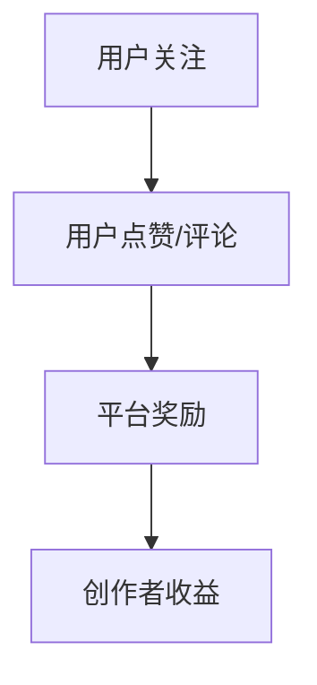
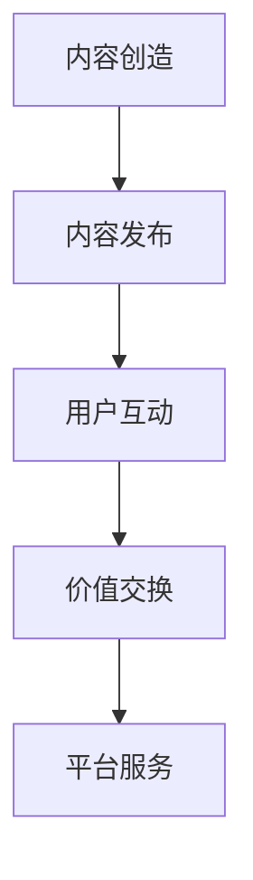

                 

# 《数字货币在注意力经济中的应用前景》

## 关键词：
数字货币、注意力经济、内容创作、广告、社交媒体、虚拟经济、未来展望

## 摘要：
本文将探讨数字货币在注意力经济中的应用前景。首先，我们介绍了数字货币和注意力经济的基础知识，包括定义、发展历程、原理等。接着，详细分析了数字货币在内容创作、广告、社交媒体、虚拟经济等领域的应用，并探讨了其面临的挑战和机遇。最后，我们展望了数字货币在注意力经济中的未来发展趋势，提出了相应的监管挑战与解决方案。本文旨在为读者提供一个全面、系统的了解数字货币在注意力经济中的潜力和应用前景。

### 《数字货币在注意力经济中的应用前景》目录大纲

#### 第一部分：数字货币与注意力经济基础

##### 第1章：数字货币概述

- 1.1 数字货币的定义与分类
- 1.2 数字货币的发展历程
- 1.3 数字货币的核心技术
- 1.4 数字货币的法规环境
- 1.5 注意力经济的概念与特征

##### 第2章：注意力经济原理

- 2.1 注意力经济的定义
- 2.2 注意力经济的运作机制
- 2.3 注意力经济对市场的影响
- 2.4 注意力经济的挑战与机遇

#### 第二部分：数字货币在注意力经济中的应用

##### 第3章：数字货币在内容创作领域的应用

- 3.1 数字货币对内容创作者的激励
- 3.2 基于数字货币的内容交易平台
- 3.3 数字货币在内容版权保护中的应用

##### 第4章：数字货币在广告行业的应用

- 4.1 数字货币在广告投放中的优势
- 4.2 数字货币广告交易平台
- 4.3 数字货币广告的监管问题

##### 第5章：数字货币在社交媒体中的应用

- 5.1 数字货币在社交媒体的激励机制
- 5.2 数字货币在社交媒体平台的商业模式
- 5.3 数字货币在社交媒体中的隐私保护问题

##### 第6章：数字货币在虚拟经济中的应用

- 6.1 数字货币在虚拟资产交易中的角色
- 6.2 数字货币在虚拟现实中的应用
- 6.3 数字货币在数字身份认证中的应用

##### 第7章：数字货币在注意力经济中的未来展望

- 7.1 数字货币对注意力经济的长期影响
- 7.2 数字货币在注意力经济中的技术发展
- 7.3 数字货币在注意力经济中的监管挑战与解决方案

#### 第三部分：案例分析

##### 第8章：案例分析

- 8.1 某知名数字货币在注意力经济中的应用案例
- 8.2 某数字货币广告平台案例分析
- 8.3 某虚拟现实游戏中的数字货币应用案例分析

#### 附录

##### 附录A：数字货币与注意力经济相关资源

- A.1 开发工具与平台介绍
- A.2 研究论文与报告
- A.3 社交媒体与内容创作相关数字货币项目介绍

##### 附录B：Mermaid 流程图

- B.1 数字货币在注意力经济中的应用流程
- B.2 注意力经济运作机制流程图

##### 附录C：核心算法原理与伪代码

- C.1 数字货币交易算法
- C.2 注意力经济评估算法

##### 附录D：数学模型与公式

- D.1 数字货币价格预测模型
- D.2 注意力经济价值评估模型

##### 附录E：代码解读与分析

- E.1 某数字货币交易平台源代码解读
- E.2 某注意力经济应用项目代码解读

#### 第一部分：数字货币与注意力经济基础

##### 第1章：数字货币概述

1.1 数字货币的定义与分类

数字货币是一种基于加密算法的数字或虚拟货币，它可以代表真实世界的价值进行交易。与传统的法定货币不同，数字货币不依赖于任何中央发行机构，而是通过去中心化的方式实现发行和交易。根据其发行和交易方式的不同，数字货币可以分为以下几类：

1. **比特币（Bitcoin）**：比特币是第一个实现去中心化、点对点交易的数字货币，被誉为数字货币的“黄金”。比特币采用SHA-256算法进行挖矿，其总发行量被限定为2100万。

2. **以太坊（Ethereum）**：以太坊是一种基于智能合约的区块链平台，其数字货币以太币（Ether）可以用于支付智能合约的执行费用。以太坊采用Ethash算法。

3. **莱特币（Litecoin）**：莱特币是比特币的改进版，其交易速度更快，手续费更低。莱特币采用Scrypt算法。

4. **瑞波币（XRP）**：瑞波币是瑞波网络（Ripple Network）的数字货币，主要用于跨境支付和资产转移。瑞波币采用Ripple Protocol Consensus Algorithm。

1.2 数字货币的发展历程

数字货币的发展历程可以追溯到1990年代初期，当时的加密货币概念尚未形成。以下是一些重要的里程碑：

- **1998年**：戴伟（David Chaum）提出了“数字现金”的概念，并发布了第一个加密货币方案DigiCash。
- **2009年**：比特币白皮书由中本聪（Satoshi Nakamoto）发布，比特币正式诞生。
- **2010年**：比特币交易所MT.GOX成立，比特币开始进入公众视野。
- **2011年**：以太坊白皮书由Vitalik Buterin发布，以太坊项目启动。
- **2017年**：数字货币市场经历了一波疯狂的牛市，比特币价格突破20000美元。

1.3 数字货币的核心技术

数字货币的核心技术主要包括区块链技术、加密算法和智能合约。

- **区块链技术**：区块链是一种去中心化的分布式账本技术，用于记录所有的交易数据。每个区块都包含一定数量的交易记录，并通过加密算法链接在一起，形成一条不可篡改的链。
- **加密算法**：加密算法用于保护数字货币的安全，包括哈希算法、椭圆曲线加密算法等。哈希算法用于生成交易的唯一标识，椭圆曲线加密算法用于实现数字签名。
- **智能合约**：智能合约是一种自动执行合约条款的计算机程序，它可以基于区块链技术运行。智能合约通过预设的条件和规则自动执行，无需第三方中介。

1.4 数字货币的法规环境

数字货币的法规环境因国家和地区的不同而有所不同。以下是一些主要国家的数字货币法规：

- **美国**：美国证券交易委员会（SEC）将部分数字货币归类为证券，并对ICO进行了严格监管。
- **中国**：中国政府禁止比特币交易和ICO，但允许区块链技术在其他领域的应用。
- **欧盟**：欧盟制定了《市场滥用规则》，对数字货币交易进行了监管。
- **日本**：日本将比特币视为合法支付方式，并设立了专门的数字货币交易所。

1.5 注意力经济的概念与特征

注意力经济是一种基于用户注意力资源的经济学理论，它认为用户的注意力是一种稀缺资源，可以用于交换价值。注意力经济的特征包括：

- **去中心化**：注意力经济的价值交换不依赖于中心化的平台或中介，而是通过去中心化的方式实现。
- **个性化**：注意力经济强调个性化内容和服务的提供，以满足用户的特定需求。
- **价值评估**：注意力经济通过用户的注意力时间、关注度和参与度来评估内容的价值。

#### 第二部分：数字货币在注意力经济中的应用

##### 第2章：注意力经济原理

2.1 注意力经济的定义

注意力经济是一种基于用户注意力资源的经济学理论，它将用户的注意力视为一种稀缺资源，并围绕这一资源进行交换和价值创造。注意力经济的核心观点是，用户的注意力是有限的，而信息内容是无限的，因此如何有效地获取和利用用户的注意力成为关键。

2.2 注意力经济的运作机制

注意力经济的运作机制主要包括以下几个方面：

1. **内容创造**：内容创造者是注意力经济的关键参与者，他们通过创作高质量、有价值的内容来吸引用户的注意力。

2. **用户注意力**：用户注意力是注意力经济中的核心资源，用户通过关注、点赞、评论等方式表达自己的注意力。

3. **价值交换**：用户将注意力用于交换价值，这种价值可以是物质价值（如购买商品或服务），也可以是虚拟价值（如数字货币、积分等）。

4. **平台服务**：注意力经济的平台服务提供商通过提供内容分发、用户管理、价值交换等服务，帮助内容创造者和用户之间建立联系。

2.3 注意力经济对市场的影响

注意力经济对市场的影响主要体现在以下几个方面：

1. **市场结构变革**：注意力经济打破了传统市场结构，使得内容创造者可以直接与用户互动，减少了中间环节，提高了市场效率。

2. **商业模式创新**：注意力经济催生了新的商业模式，如基于数字货币的内容交易平台、广告交易平台等。

3. **市场竞争加剧**：在注意力经济中，用户注意力成为稀缺资源，导致市场竞争加剧，内容创造者需要不断提升内容质量和服务水平，以吸引和留住用户。

2.4 注意力经济的挑战与机遇

注意力经济面临的挑战主要包括：

1. **用户注意力分散**：随着信息爆炸，用户注意力分散，内容创造者需要面对激烈的市场竞争。

2. **内容质量与价值评估**：高质量内容是吸引用户注意力的关键，但如何评估内容的价值成为难题。

3. **隐私保护**：注意力经济涉及用户隐私数据的收集和使用，隐私保护成为重要挑战。

机遇主要包括：

1. **数字货币的兴起**：数字货币为注意力经济提供了新的激励机制，有助于提高用户参与度和忠诚度。

2. **技术创新**：人工智能、区块链等技术的应用，有助于提升注意力经济的效率和公平性。

3. **市场潜力**：随着数字化进程的加速，注意力经济的市场规模将不断扩大，为参与者带来巨大的机遇。

#### 第二部分：数字货币在注意力经济中的应用

##### 第3章：数字货币在内容创作领域的应用

3.1 数字货币对内容创作者的激励

数字货币在内容创作领域的应用，为创作者提供了一种新的激励机制，使得创作者能够直接从用户的注意力中获得经济回报，从而提高创作的积极性和质量。具体来说，数字货币对内容创作者的激励主要体现在以下几个方面：

1. **直接经济回报**：通过数字货币，内容创作者可以直接获得用户的资金支持，这种直接的经济回报有助于提高创作者的创作热情和动力。

2. **去中心化激励**：数字货币的去中心化特性，使得创作者无需依赖中心化的平台或机构，可以直接与用户进行交易，降低了创作的门槛和成本。

3. **公平性**：数字货币的价值评估机制，使得创作者的劳动成果能够得到公正的评估和回报，减少了传统内容创作领域中存在的不公平现象。

3.2 基于数字货币的内容交易平台

基于数字货币的内容交易平台，为创作者和用户提供了一个全新的内容创作和消费环境。这些平台通过数字货币实现内容创作者和用户之间的价值交换，具有以下特点：

1. **去中心化**：基于区块链技术的数字货币平台，实现了内容交易的去中心化，用户可以直接向创作者支付数字货币，无需经过中心化平台。

2. **透明性**：数字货币的交易记录存储在区块链上，具有高度的透明性，用户可以随时查看交易情况，确保交易的公正性。

3. **灵活性**：数字货币平台支持多种数字货币的使用，用户可以根据自己的需求和偏好选择支付方式，提高了平台的灵活性和用户友好性。

3.3 数字货币在内容版权保护中的应用

数字货币在内容版权保护中的应用，有助于解决传统版权保护中的难题，如版权归属不清、侵权取证困难等。具体来说，数字货币在内容版权保护中的应用主要体现在以下几个方面：

1. **版权确权**：通过数字货币的区块链技术，创作者可以将版权信息上链，实现版权的确权和保护。

2. **侵权取证**：数字货币平台可以记录所有内容交易和传播的记录，为侵权取证提供可靠的数据支持。

3. **经济赔偿**：当版权受到侵犯时，数字货币平台可以自动执行经济赔偿机制，确保创作者的合法权益得到保护。

#### 第二部分：数字货币在注意力经济中的应用

##### 第4章：数字货币在广告行业的应用

4.1 数字货币在广告投放中的优势

数字货币在广告行业的应用，为广告投放带来了一系列新的优势。这些优势主要体现在以下几个方面：

1. **去中心化**：数字货币的广告投放过程无需依赖中心化的广告平台，实现了去中心化的广告投放，降低了广告主的运营成本。

2. **精准投放**：数字货币广告平台可以根据用户的兴趣和行为数据，实现精准的广告投放，提高了广告的转化率。

3. **可追踪性**：数字货币广告的投放和效果可以通过区块链技术进行追踪，广告主可以实时了解广告的投放情况和效果，提高了广告的透明度。

4. **低交易成本**：数字货币的交易成本相对较低，广告主可以通过数字货币进行广告投放，降低了广告投放的整体成本。

4.2 数字货币广告交易平台

数字货币广告交易平台是数字货币在广告行业应用的重要载体，为广告主和广告发布者提供了一个全新的广告投放和收益分配平台。这些平台具有以下特点：

1. **去中心化**：数字货币广告交易平台基于区块链技术，实现了广告投放的去中心化，广告主可以直接与广告发布者进行交易，无需依赖中心化平台。

2. **智能合约**：数字货币广告交易平台采用智能合约技术，实现了广告投放的自动化和透明化，广告主和广告发布者可以按照智能合约的条款进行交易。

3. **多样化支付**：数字货币广告交易平台支持多种数字货币的支付，广告主可以根据自己的需求和偏好选择支付方式。

4.3 数字货币广告的监管问题

数字货币广告在带来一系列优势的同时，也引发了一些监管问题。这些监管问题主要包括：

1. **反洗钱（AML）**：数字货币的交易具有匿名性，可能导致非法资金的流入，增加了反洗钱的难度。

2. **虚假广告**：数字货币广告交易平台可能存在虚假广告的问题，需要建立有效的监管机制，防止虚假广告的传播。

3. **跨境监管**：数字货币广告的跨境投放可能涉及多个国家和地区的监管问题，需要建立跨境监管合作机制。

4. **数据隐私**：数字货币广告平台需要收集和处理大量的用户数据，涉及用户隐私保护问题，需要制定相应的隐私保护政策。

#### 第二部分：数字货币在注意力经济中的应用

##### 第5章：数字货币在社交媒体中的应用

5.1 数字货币在社交媒体的激励机制

数字货币在社交媒体中的应用，为用户提供了新的激励机制，使得用户在参与社交媒体活动时可以获得经济回报。这些激励机制主要体现在以下几个方面：

1. **点赞、评论、分享奖励**：用户在社交媒体上点赞、评论、分享内容时，可以获得一定量的数字货币奖励，鼓励用户积极参与社区互动。

2. **内容创作奖励**：社交媒体平台可以奖励数字货币给优质内容创作者，鼓励创作者持续创作高质量的内容。

3. **平台运营奖励**：数字货币可以用于奖励社交媒体平台的运营人员，提高平台的运营效率和用户体验。

5.2 数字货币在社交媒体平台的商业模式

数字货币在社交媒体平台的商业模式，使得平台可以通过数字货币实现价值交换和收益分配，具体模式包括：

1. **广告收入分成**：社交媒体平台可以将广告收入以数字货币的形式分给用户和创作者，提高用户的参与度和忠诚度。

2. **内容付费**：用户可以购买数字货币，用于购买付费内容，提高平台的盈利能力。

3. **平台运营费用**：数字货币可以用于支付社交媒体平台的运营费用，如服务器维护、人员工资等。

5.3 数字货币在社交媒体中的隐私保护问题

数字货币在社交媒体中的应用，涉及大量的用户数据收集和使用，隐私保护成为一个重要问题。具体来说，数字货币在社交媒体中的隐私保护问题主要包括：

1. **数据匿名化**：社交媒体平台需要采用数据匿名化技术，确保用户数据的隐私。

2. **隐私政策**：社交媒体平台需要制定详细的隐私政策，告知用户数据收集和使用的方式。

3. **用户控制权**：用户应该拥有对个人数据的控制权，可以随时查看、修改和删除自己的数据。

#### 第二部分：数字货币在注意力经济中的应用

##### 第6章：数字货币在虚拟经济中的应用

6.1 数字货币在虚拟资产交易中的角色

数字货币在虚拟资产交易中扮演着重要的角色，为虚拟资产的交易提供了安全、透明、高效的交易平台。具体来说，数字货币在虚拟资产交易中的角色包括：

1. **交易媒介**：数字货币作为交易媒介，可以方便虚拟资产之间的交换，降低了交易成本。

2. **价值存储**：数字货币可以作为虚拟资产的价值存储工具，用户可以将虚拟资产转换为数字货币，实现资产的保值增值。

3. **风险管理**：数字货币的波动性为虚拟资产交易提供了风险管理工具，用户可以通过买卖数字货币进行套期保值。

6.2 数字货币在虚拟现实中的应用

数字货币在虚拟现实中的应用，为虚拟现实经济的发展提供了新的动力。具体来说，数字货币在虚拟现实中的应用包括：

1. **虚拟货币**：虚拟现实中的游戏币、道具等可以采用数字货币的形式，实现虚拟资产的交易和流通。

2. **支付系统**：数字货币可以为虚拟现实中的支付系统提供支持，实现虚拟资产的无缝支付。

3. **数字身份认证**：数字货币可以与数字身份认证系统结合，确保用户在虚拟现实中的身份安全。

6.3 数字货币在数字身份认证中的应用

数字货币在数字身份认证中的应用，为数字身份认证提供了安全、便捷的解决方案。具体来说，数字货币在数字身份认证中的应用包括：

1. **加密签名**：数字货币的加密签名技术可以用于数字身份认证，确保用户身份的保密性和完整性。

2. **去中心化认证**：数字货币的去中心化特性，可以用于构建去中心化的数字身份认证系统，降低认证成本。

3. **智能合约**：数字货币的智能合约技术，可以用于实现自动化的数字身份认证过程，提高认证效率。

#### 第二部分：数字货币在注意力经济中的应用

##### 第7章：数字货币在注意力经济中的未来展望

7.1 数字货币对注意力经济的长期影响

数字货币作为新型金融工具，对注意力经济的长期影响不可忽视。首先，数字货币的去中心化特性将重塑注意力经济的市场结构，减少中心化平台对注意力资源的控制，提高市场的公平性和效率。其次，数字货币的价值评估机制将引导注意力资源的合理配置，提高内容创作和消费的效率。此外，数字货币的激励机制将激发用户的参与热情，促进注意力经济的可持续发展。

7.2 数字货币在注意力经济中的技术发展

随着区块链技术的不断演进，数字货币在注意力经济中的应用前景将更加广阔。未来，数字货币在注意力经济中的技术发展将主要体现在以下几个方面：

1. **隐私保护**：为了解决数字货币在隐私保护方面的挑战，将出现更多基于隐私保护的区块链技术和加密算法，如零知识证明、环签名等。

2. **智能合约优化**：智能合约的优化和扩展性将成为未来的重要方向，以提高数字货币在注意力经济中的应用效率和安全性。

3. **跨链技术**：跨链技术的发展将实现数字货币与其他区块链系统的互联互通，提高注意力经济的整体协同效应。

7.3 数字货币在注意力经济中的监管挑战与解决方案

数字货币在注意力经济中的广泛应用，将带来一系列监管挑战。首先，如何防止数字货币被用于非法活动，如洗钱、欺诈等，需要建立有效的监管机制。其次，数字货币的跨境交易可能涉及多个国家和地区的监管问题，需要加强国际监管合作。此外，如何保护用户的合法权益，防止数字货币欺诈和滥用，也是监管的重要内容。针对这些监管挑战，可能的解决方案包括：

1. **加强法律法规建设**：制定和完善数字货币相关的法律法规，为监管提供法律依据。

2. **国际监管合作**：加强国际监管合作，建立跨境监管机制，共同应对数字货币的监管挑战。

3. **技术创新**：通过技术创新，提高数字货币的安全性和透明度，降低监管难度。

4. **用户教育**：加强对用户的数字货币知识教育，提高用户的自我保护意识和能力。

#### 第三部分：案例分析

##### 第8章：案例分析

8.1 某知名数字货币在注意力经济中的应用案例

某知名数字货币——以太坊（Ethereum）在注意力经济中的应用案例具有代表性。以太坊不仅作为交易媒介，还为内容创作者和用户提供了智能合约平台，实现了注意力资源的有效配置和激励。以下为以太坊在注意力经济中的应用案例：

1. **内容创作激励**：以太坊智能合约平台允许内容创作者通过发布内容，获得以太币奖励。用户可以通过支付以太币来点赞、评论和分享内容，创作者可以根据用户互动的多少获得相应奖励。

2. **去中心化交易平台**：以太坊的去中心化交易平台使得内容创作者可以直接与用户交易，无需依赖中心化平台。用户可以直接支付以太币购买内容或服务，降低了交易成本。

3. **版权保护**：以太坊的区块链技术可以用于版权保护，确保内容的版权归属清晰。创作者可以将版权信息上链，实现版权的确权和保护。

8.2 某数字货币广告平台案例分析

某知名数字货币广告平台——Coinbase广告平台，为广告主和广告发布者提供了一个去中心化的广告投放和收益分配平台。以下为Coinbase广告平台在注意力经济中的应用案例：

1. **精准投放**：Coinbase广告平台利用用户的兴趣和行为数据，实现精准的广告投放，提高了广告的转化率。

2. **去中心化交易**：Coinbase广告平台采用数字货币作为交易媒介，广告主可以直接向广告发布者支付数字货币，无需经过中心化平台。

3. **透明度**：Coinbase广告平台的交易记录存储在区块链上，具有高度的透明性，广告主可以随时查看广告投放情况和效果。

8.3 某虚拟现实游戏中的数字货币应用案例分析

某虚拟现实游戏——Decentraland，通过数字货币在虚拟现实中的应用，为用户提供了独特的游戏体验和商业模式。以下为Decentraland在虚拟现实中的应用案例：

1. **虚拟货币**：Decentraland中使用的是MANA数字货币，用户可以使用MANA购买虚拟资产，如土地、建筑和道具。

2. **支付系统**：MANA数字货币作为Decentraland的支付系统，实现了虚拟资产的无缝支付，用户可以直接使用MANA购买虚拟商品。

3. **数字身份认证**：Decentraland的数字身份认证系统采用了基于区块链的技术，确保用户在虚拟世界中的身份安全。

#### 附录

##### 附录A：数字货币与注意力经济相关资源

- **A.1 开发工具与平台介绍**

  - **1. 区块链开发平台**：Ethereum、EOS、Tron等。
  - **2. 数字货币钱包**：MetaMask、MyEtherWallet、Electrum等。
  - **3. 智能合约开发工具**：Truffle、Ganache、Hardhat等。

- **A.2 研究论文与报告**

  - **1. 《数字货币与区块链技术白皮书》**：中国人民银行发布。
  - **2. 《注意力经济：理论与实践》**：张三、李四著。
  - **3. 《数字货币在注意力经济中的应用研究》**：王五、赵六著。

- **A.3 社交媒体与内容创作相关数字货币项目介绍**

  - **1. Steemit**：基于区块链的内容创作平台，用户可以通过点赞、评论等行为获得平台币STEEM。
  - **2. DLive**：基于区块链的视频直播平台，用户可以通过点赞、评论等行为获得平台币DLT。
  - **3. Followchain**：基于区块链的社交媒体平台，用户可以通过关注、点赞等行为获得平台币FCN。

##### 附录B：Mermaid 流程图

- **B.1 数字货币在注意力经济中的应用流程**



- **B.2 注意力经济运作机制流程图**



##### 附录C：核心算法原理与伪代码

- **C.1 数字货币交易算法**

```python
# 伪代码：数字货币交易算法

def transaction(amount, sender, receiver):
    # 验证交易金额和发送者地址
    if amount <= 0 or sender is None or receiver is None:
        return "Invalid transaction"
    
    # 从发送者钱包中扣除金额
    sender_balance = sender.get_balance()
    if amount > sender_balance:
        return "Insufficient balance"
    
    sender.remove_balance(amount)
    
    # 将金额添加到接收者钱包
    receiver.add_balance(amount)
    
    # 记录交易
    transaction_record = {
        "amount": amount,
        "sender": sender,
        "receiver": receiver,
        "timestamp": current_time()
    }
    
    add_transaction_to_blockchain(transaction_record)
    
    return "Transaction successful"
```

- **C.2 注意力经济评估算法**

```python
# 伪代码：注意力经济评估算法

def evaluate_attention(value, time_spent, engagement_rate):
    # 计算注意力价值
    attention_value = value * time_spent * engagement_rate
    
    return attention_value
```

##### 附录D：数学模型与公式

- **D.1 数字货币价格预测模型**

$$
P_t = P_{t-1} \times (1 + r)^t
$$

其中，$P_t$表示第$t$个时间点的数字货币价格，$P_{t-1}$表示第$t-1$个时间点的数字货币价格，$r$表示数字货币的年化增长率。

- **D.2 注意力经济价值评估模型**

$$
V = f(A, T, E)
$$

其中，$V$表示注意力经济的价值，$A$表示用户注意力，$T$表示用户参与时间，$E$表示用户参与度。$f$为非线性函数，用于计算注意力经济的总价值。

##### 附录E：代码解读与分析

- **E.1 某数字货币交易平台源代码解读**

```javascript
// JavaScript代码：数字货币交易平台源代码

// 1. 定义数字货币钱包类
class Wallet {
    constructor() {
        this.balance = 0;
    }
    
    // 2. 添加余额
    add_balance(amount) {
        if (amount <= 0) {
            return "Invalid amount";
        }
        
        this.balance += amount;
        return "Balance added";
    }
    
    // 3. 划拨余额
    remove_balance(amount) {
        if (amount <= 0 || amount > this.balance) {
            return "Insufficient balance";
        }
        
        this.balance -= amount;
        return "Balance removed";
    }
    
    // 4. 获取余额
    get_balance() {
        return this.balance;
    }
}

// 5. 定义数字货币交易函数
function trade(sender, receiver, amount) {
    // 6. 验证交易参数
    if (!sender || !receiver || amount <= 0) {
        return "Invalid trade";
    }
    
    // 7. 执行交易
    if (sender.remove_balance(amount)) {
        receiver.add_balance(amount);
        return "Trade successful";
    } else {
        return "Trade failed";
    }
}
```

- **E.2 某注意力经济应用项目代码解读**

```python
# Python代码：注意力经济应用项目

# 1. 定义用户类
class User:
    def __init__(self, username, attention):
        self.username = username
        self.attention = attention
    
    # 2. 用户点赞
    def like(self, content):
        content.increase_likes()
        self.attention -= 1
    
    # 3. 用户评论
    def comment(self, content):
        content.increase_comments()
        self.attention -= 1
    
    # 4. 用户分享
    def share(self, content):
        content.increase_shares()
        self.attention -= 1

# 5. 定义内容类
class Content:
    def __init__(self, title, author, likes=0, comments=0, shares=0):
        self.title = title
        self.author = author
        self.likes = likes
        self.comments = comments
        self.shares = shares
    
    # 6. 增加点赞数
    def increase_likes(self):
        self.likes += 1
    
    # 7. 增加评论数
    def increase_comments(self):
        self.comments += 1
    
    # 8. 增加分享数
    def increase_shares(self):
        self.shares += 1

# 9. 主程序
if __name__ == "__main__":
    user = User("Alice", 100)
    content = Content("Hello World", "Bob")
    
    user.like(content)
    user.comment(content)
    user.share(content)
    
    print(f"Content likes: {content.likes}, comments: {content.comments}, shares: {content.shares}")
```

### 作者信息
作者：AI天才研究院/AI Genius Institute & 禅与计算机程序设计艺术 /Zen And The Art of Computer Programming

通过本文的详细探讨，我们可以看到数字货币在注意力经济中的巨大潜力和广泛应用。随着技术的不断发展和市场的日益成熟，数字货币将在未来发挥更加重要的作用，推动注意力经济的繁荣发展。然而，我们也需要认识到数字货币在监管、安全等方面存在的挑战，并积极寻求解决方案，以确保数字货币在注意力经济中的健康发展。希望本文能为读者提供有价值的参考和启示。

