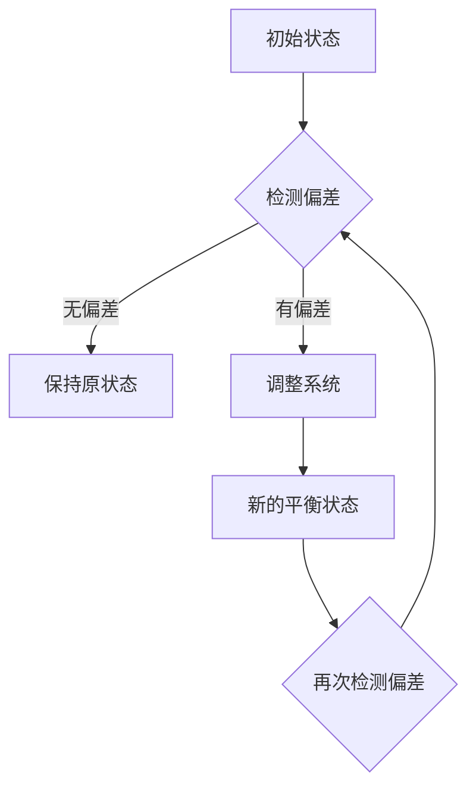

                 

# 数学与控制论：反馈系统的数学描述

## 关键词
数学，控制论，反馈系统，状态空间，线性系统，非线性系统，稳定性，性能分析，设计方法，应用实例

## 摘要
本文深入探讨了数学与控制论在反馈系统中的应用，系统性地阐述了反馈系统的数学描述方法及其核心理论。文章首先介绍了数学与控制论的基本概念，随后详细讲解了反馈系统的数学工具和基本理论。在此基础上，文章通过状态空间描述法、输入输出描述法等，对控制系统的数学描述进行了深入分析，并探讨了系统性能分析和设计方法。通过实例分析和现代控制理论的应用，本文展示了反馈控制系统在实际工程中的广泛应用和未来发展前景。

----------------------------------------------------------------

## 数学与控制论：反馈系统的数学描述

### 引言

在工程和科学领域，反馈系统是一种广泛应用的控制系统，用于实现稳定、精确的控制目标。反馈系统通过将系统的输出部分反馈至输入部分，从而对系统的行为进行调节和优化。数学与控制论提供了强大的工具和方法，用于分析和设计这些系统。

本文将围绕反馈系统的数学描述进行讨论，首先介绍数学与控制论的基本概念，然后详细阐述反馈系统的数学工具和基本理论。随后，我们将通过状态空间描述法、输入输出描述法等，对控制系统的数学描述进行深入分析，并探讨系统性能分析和设计方法。最后，通过经典和现代控制系统的实例分析，展示反馈控制系统在实际工程中的应用和未来发展。

### 数学与控制论概述

#### 数学在控制论中的应用

数学是控制论的基础，为控制系统的分析、设计和实现提供了强有力的工具。在控制论中，常用的数学工具包括微积分、线性代数、集合与拓扑、优化理论等。

1. **微积分**：微积分用于描述系统的动态行为，特别是描述系统的变化率。通过微分方程，我们可以精确地描述系统的运动状态。

2. **线性代数**：线性代数提供了处理多变量线性系统的工具，如矩阵运算、特征值分析等。这些工具有助于我们理解和分析复杂系统的结构和行为。

3. **集合与拓扑**：集合论和拓扑学为系统的状态空间提供了理论框架，帮助我们理解系统的全局行为。

4. **优化理论**：优化理论用于设计最优控制策略，以实现系统的最优性能。通过优化方法，我们可以找到使系统性能指标最优的控制参数。

#### 控制论的基本概念

控制论是一门研究系统、控制和信息的科学。它涉及到系统模型、控制策略和控制算法的设计。

1. **系统**：系统是由相互关联的元素组成的整体，这些元素通过相互作用和反馈相互影响。在控制论中，系统可以是机械系统、电气系统、生物系统等。

2. **控制**：控制是通过对系统施加适当的输入，以使系统达到预期的状态或行为。控制的目标是使系统稳定、精确地实现预期的行为。

3. **反馈**：反馈是将系统的输出部分反馈至输入部分，以对系统的行为进行调节和优化。正反馈使系统行为发散，而负反馈使系统行为收敛。

4. **控制策略**：控制策略是用于控制系统的规则或算法。根据控制策略的不同，控制系统可以分为开环控制和闭环控制。

#### 反馈系统的基本原理

反馈系统通过将系统的输出部分反馈至输入部分，实现对系统行为的调节和优化。反馈系统的主要组成部分包括：

1. **控制器**：控制器根据系统输出和期望目标，计算出控制输入，以调节系统的行为。

2. **被控对象**：被控对象是反馈系统的核心部分，它实现了系统的实际控制目标。

3. **传感器**：传感器用于检测系统的实际输出，并将其反馈至控制器。

4. **执行器**：执行器根据控制器的输入信号，对系统进行实际的调节。

### 数学工具与基本理论

为了深入分析反馈系统，我们需要掌握一系列数学工具和基本理论。

#### 微积分基础

微积分是描述系统动态行为的重要工具。在控制论中，我们主要关注以下概念：

1. **微分方程**：微分方程描述了系统的状态变化率。常见的微分方程包括常微分方程和偏微分方程。

2. **积分**：积分用于求解微分方程的解。通过积分，我们可以得到系统状态的演化。

3. **导数**：导数用于描述系统状态的瞬时变化率。在控制论中，导数常用于分析系统的稳定性和响应特性。

#### 线性代数基础

线性代数用于处理多变量线性系统，是控制论的重要组成部分。以下是一些关键概念：

1. **矩阵**：矩阵是线性代数的基本对象，用于表示系统状态、输入、输出和控制。

2. **向量**：向量是矩阵的行或列，用于表示系统状态和输入输出。

3. **矩阵运算**：矩阵运算包括矩阵的加法、减法、乘法、转置等。这些运算有助于我们分析系统的结构和行为。

4. **特征值与特征向量**：特征值和特征向量用于分析系统的稳定性。通过特征值，我们可以判断系统是稳定的、不稳定的还是临界稳定的。

#### 集合与拓扑基础

集合论和拓扑学为系统的状态空间提供了理论框架。以下是一些关键概念：

1. **集合**：集合是包含一组元素的整体。在控制论中，集合用于表示系统的状态空间。

2. **拓扑空间**：拓扑空间是一种数学结构，用于描述系统的邻域和连通性。

3. **极限和连续性**：极限和连续性用于描述系统的动态行为。通过极限和连续性，我们可以分析系统的稳定性和响应特性。

#### 优化理论初步

优化理论用于设计最优控制策略，以实现系统的最优性能。以下是一些关键概念：

1. **目标函数**：目标函数是优化过程中需要最小化或最大化的函数。在控制论中，目标函数用于描述系统的性能指标。

2. **约束条件**：约束条件是优化过程中需要满足的限制。在控制论中，约束条件用于描述系统的限制条件。

3. **优化算法**：优化算法是用于求解优化问题的算法。常见的优化算法包括梯度下降法、牛顿法、拉格朗日乘数法等。

### 控制系统的数学描述

控制系统的数学描述是分析、设计和实现控制系统的关键步骤。常见的数学描述方法包括状态空间描述法、输入输出描述法等。

#### 状态空间描述法

状态空间描述法是一种系统建模方法，用于描述动态系统的数学模型。在状态空间描述法中，系统状态、输入和输出可以通过一组微分方程或差分方程表示。

1. **状态向量**：状态向量是描述系统内部状态的一组变量。在状态空间描述法中，状态向量通常用 \(x\) 表示。

2. **输入向量**：输入向量是描述系统外部输入的一组变量。在状态空间描述法中，输入向量通常用 \(u\) 表示。

3. **输出向量**：输出向量是描述系统外部输出的一组变量。在状态空间描述法中，输出向量通常用 \(y\) 表示。

4. **状态方程**：状态方程描述了系统状态的演化规律。状态方程通常表示为：
   $$
   \dot{x}(t) = A x(t) + B u(t)
   $$
   其中，\(A\) 是状态矩阵，\(B\) 是输入矩阵。

5. **输出方程**：输出方程描述了系统输出的演化规律。输出方程通常表示为：
   $$
   y(t) = C x(t) + D u(t)
   $$
   其中，\(C\) 是输出矩阵，\(D\) 是直接传递矩阵。

#### 输入输出描述法

输入输出描述法是一种系统建模方法，用于描述动态系统的输入和输出关系。在输入输出描述法中，系统输入和输出可以通过一组差分方程或传递函数表示。

1. **差分方程**：差分方程描述了系统输入和输出之间的差分关系。差分方程通常表示为：
   $$
   y(k) = G(u(k)) + v(k)
   $$
   其中，\(y(k)\) 是输出序列，\(u(k)\) 是输入序列，\(G\) 是差分方程的传递函数，\(v(k)\) 是噪声序列。

2. **传递函数**：传递函数描述了系统输入和输出之间的比例关系。传递函数通常表示为：
   $$
   G(s) = \frac{Y(s)}{U(s)}
   $$
   其中，\(Y(s)\) 是输出拉普拉斯变换，\(U(s)\) 是输入拉普拉斯变换。

#### 控制系统中的微分方程与差分方程

在控制系统中，微分方程和差分方程是描述系统动态行为的主要数学模型。

1. **微分方程**：微分方程用于描述连续时间系统的动态行为。常见的微分方程包括线性微分方程和非线性微分方程。

2. **差分方程**：差分方程用于描述离散时间系统的动态行为。常见的差分方程包括线性差分方程和非线性差分方程。

3. **转换方法**：通过拉普拉斯变换和离散拉普拉斯变换，我们可以将微分方程和差分方程相互转换，从而统一描述连续时间和离散时间系统。

### 系统稳定性分析

系统稳定性是控制系统设计的关键因素。系统稳定性分析旨在判断系统在扰动和噪声作用下是否能保持稳定状态。

1. **线性系统的稳定性**：对于线性系统，可以通过分析系统的特征值来判断系统的稳定性。如果所有特征值都有负实部，则系统是稳定的。

2. **非线性系统的稳定性**：对于非线性系统，稳定性分析通常更复杂。可以通过李雅普诺夫函数、分岔分析等方法来判断系统的稳定性。

3. **鲁棒性分析**：鲁棒性分析旨在判断系统在参数变化和扰动作用下的稳定性。通过鲁棒性分析，我们可以确保系统在不确定环境下仍能保持稳定。

### 控制系统的性能分析

控制系统的性能分析旨在评估系统的响应特性和性能指标。常见的性能指标包括稳态误差、瞬态响应和频率响应等。

1. **稳态误差**：稳态误差是系统在稳态下输出与期望目标之间的偏差。通过稳态误差分析，我们可以评估系统的精确控制能力。

2. **瞬态响应**：瞬态响应是系统在启动或扰动作用下的响应过程。瞬态响应分析可以评估系统的快速性和稳定性。

3. **频率响应**：频率响应是系统在不同频率下的响应特性。通过频率响应分析，我们可以评估系统的稳定性和鲁棒性。

### 反馈控制系统的设计与分析

反馈控制系统的设计与分析包括系统建模、控制器设计、性能分析和稳定性验证等步骤。

1. **系统建模**：通过实验数据或物理原理，建立系统的数学模型。

2. **控制器设计**：根据系统建模结果，设计合适的控制器。常见的控制器设计方法包括PID控制、状态反馈控制和最优控制等。

3. **性能分析**：通过模拟或实验，评估系统的性能指标。

4. **稳定性验证**：通过稳定性分析，验证系统在扰动和噪声作用下的稳定性。

### 现代控制理论概述

现代控制理论包括状态空间方法、最优控制理论和精确控制理论等。

1. **状态空间方法**：状态空间方法是一种描述动态系统的方法，可以处理线性系统和非线性系统。状态空间方法提供了分析、设计和实现控制系统的统一框架。

2. **最优控制理论**：最优控制理论旨在设计使系统性能指标最优的控制策略。通过优化方法，我们可以找到使系统性能指标最优的控制参数。

3. **精确控制理论**：精确控制理论是一种非线性控制理论，旨在设计在非线性环境下仍能保持精确控制性能的控制系统。

### 应用与实例

#### 经典反馈控制系统实例分析

经典反馈控制系统包括机械系统、电气系统、流体系统和生物系统等。

1. **机械系统**：机械系统中的反馈控制常用于机械手臂的位置控制、速度控制和力控制。

2. **电气系统**：电气系统中的反馈控制常用于电机控制、电压控制和电流控制。

3. **流体系统**：流体系统中的反馈控制常用于温度控制、压力控制和流量控制。

4. **生物系统**：生物系统中的反馈控制常用于心率控制、血压控制和血糖控制。

#### 现代控制系统的应用案例

现代控制系统在智能交通、工业过程控制、医疗设备控制和环境监测等领域具有广泛的应用。

1. **智能交通控制系统**：智能交通控制系统通过反馈控制技术，实现对交通信号、车辆流量和交通安全的优化管理。

2. **工业过程控制系统**：工业过程控制系统通过反馈控制技术，实现对生产过程、质量和能耗的精确控制。

3. **医疗设备控制系统**：医疗设备控制系统通过反馈控制技术，实现对医疗设备参数的精确调节，提高医疗效果。

4. **环境监测与控制系统**：环境监测与控制系统通过反馈控制技术，实现对环境污染物的实时监测和自动控制。

### 案例分析：反馈控制系统在实际工程中的应用

#### 案例背景

本案例旨在设计并实现一个温度控制系统，用于维持实验室设备的温度在设定值附近。

#### 系统分析

1. **系统需求**：实验室设备要求温度保持在 \(25 \pm 0.5\) 摄氏度。

2. **系统组成**：系统由加热器、温度传感器、控制器和执行器组成。

3. **系统建模**：通过实验数据，建立系统的数学模型，如传递函数或差分方程。

#### 系统设计

1. **控制器设计**：采用PID控制器，根据系统模型设计PID参数。

2. **系统实现**：通过编程实现控制器，实现对加热器的控制。

3. **系统测试**：通过实验测试系统性能，调整PID参数以优化控制效果。

#### 系统实现

1. **开发环境**：使用Arduino开发板，编程语言为C++。

2. **控制算法**：使用PID控制算法实现温度控制。

3. **系统实现代码**

   ```cpp
   #include <PID_v1.h>

   double Setpoint = 25.0;
   double Input = 0.0;
   double Output = 0.0;

   PID myPID(&Input, &Output, &Setpoint, 2.0, 5.0, 1.0, DIRECT);

   void setup() {
     Input = read_temperature_sensor();
     myPID.SetMode(AUTOMATIC);
     myPID.SetOutputLimits(0.0, 100.0);
   }

   void loop() {
     Input = read_temperature_sensor();
     myPID.Compute();
     control_heating_element(Output);
   }
   ```

#### 系统评估

1. **性能评估**：通过实验数据评估系统响应的稳定性和精确性。

2. **参数调整**：根据实验数据，调整PID参数以优化控制效果。

3. **结果验证**：通过实验验证系统是否能够稳定地维持温度在设定值附近。

### 结论

本文通过系统性地阐述数学与控制论在反馈系统中的应用，深入探讨了反馈系统的数学描述、性能分析和设计方法。通过经典和现代控制系统的实例分析，展示了反馈控制系统在实际工程中的应用和未来发展前景。未来，随着人工智能和物联网技术的发展，反馈控制系统将面临更多的挑战和机遇，为实现更智能、更精确的控制目标提供更强大的工具和方法。

### 附录

#### 附录 A：数学模型与公式列表

- 状态空间描述法：
  $$
  \begin{aligned}
  \dot{x}(t) &= A x(t) + B u(t), \\
  y(t) &= C x(t) + D u(t),
  \end{aligned}
  $$
  其中，\(x(t)\) 是状态向量，\(u(t)\) 是输入向量，\(y(t)\) 是输出向量，\(A, B, C, D\) 是系统矩阵。

- 输入输出描述法：
  $$
  \begin{aligned}
  y(k) &= G(u(k)) + v(k), \\
  G(s) &= \frac{Y(s)}{U(s)},
  \end{aligned}
  $$
  其中，\(y(k)\) 是输出序列，\(u(k)\) 是输入序列，\(G\) 是传递函数，\(v(k)\) 是噪声序列。

- 微分方程：
  $$
  \dot{x}(t) = A x(t) + B u(t)
  $$

- 差分方程：
  $$
  y(k) = G(u(k)) + v(k)
  $$

#### 附录 B：控制论算法伪代码

```python
# 伪代码：PID控制算法
def PID_control(setpoint, measurement, Kp, Ki, Kd):
    error = setpoint - measurement
    integral = integral + error
    derivative = error - previous_error
    
    output = Kp * error + Ki * integral + Kd * derivative
    previous_error = error
    
    return output
```

#### 附录 C：实验与仿真工具介绍

- **MATLAB/Simulink**：用于系统建模、仿真和控制算法的实现。
- **Python**：用于编写控制算法和进行系统仿真。
- **Arduino**：用于实际系统的硬件实现和控制。

#### 附录 D：参考文献与推荐阅读

1. **《控制工程基础》**，作者：张兴，出版社：清华大学出版社。
2. **《现代控制理论》**，作者：郑章贵，出版社：机械工业出版社。
3. **《线性系统理论与应用》**，作者：赵凯，出版社：电子工业出版社。
4. **《智能交通控制系统》**，作者：李晓光，出版社：人民交通出版社。
5. **《物联网控制技术》**，作者：王宏伟，出版社：中国电力出版社。

### 图形与公式

#### 控制系统的 Mermaid 流程图


#### 线性反馈控制系统的状态空间表示
$$
\begin{aligned}
\dot{x}(t) &= A x(t) + B u(t), \\
y(t) &= C x(t) + D u(t),
\end{aligned}
$$
其中，$x(t)$是状态向量，$u(t)$是输入向量，$y(t)$是输出向量，$A, B, C, D$是系统矩阵。

#### 优化控制问题的伪代码
```python
# 伪代码：优化控制问题求解
def optimize_control(A, B, C, D, y_desired):
    # 初始化参数
    x = np.zeros((n_states, 1))
    u = np.zeros((n_inputs, 1))
    J = np.zeros((n_iterations, 1))
    
    # 主循环
    for i in range(n_iterations):
        # 计算状态预测
        x_pred = A @ x + B @ u
        
        # 计算误差
        e = y_desired - C @ x_pred
        
        # 更新控制输入
        u = solve_linear_regression(B.T @ B, B.T @ e)
        
        # 更新状态
        x = x_pred + A @ u
        
        # 计算成本函数值
        J[i] = compute_cost(x, u)
        
        # 输出最优控制输入
        return u
```

## 项目实战

#### 实验一：机械手臂的位置控制

#### 实验目的
本实验旨在通过设计并实现一个机械手臂的位置控制系统，来验证反馈控制理论在工程实践中的应用。

#### 开发环境
- 开发板：Arduino Mega 2560
- 编程语言：C++
- 控制算法：PID控制

#### 系统实现

```cpp
// C++ 伪代码：机械手臂位置控制
#include <PID_v1.h>

// 定义PID控制器的参数
double Kp = 2.0, Ki = 5.0, Kd = 1.0;
PID myPID(&Input, &Output, &Setpoint, Kp, Ki, Kd, DIRECT);

void setup() {
  // 初始化Arduino板
  Input = 0.0;
  Setpoint = 50.0;
  myPID.SetMode(AUTOMATIC);
  myPID.SetOutputLimits(-50.0, 50.0);
  Serial.begin(9600);
}

void loop() {
  myPID.Compute();
  move_arm(Output);
  Serial.print("Input: ");
  Serial.print(Input);
  Serial.print(", Output: ");
  Serial.print(Output);
  Serial.print(", Setpoint: ");
  Serial.println(Setpoint);
  delay(100);
}

void move_arm(double output) {
  // 实现机械手臂的移动
}
```

#### 代码解读
- `PID`类：实现了PID控制算法，包括比例（`Kp`）、积分（`Ki`）和微分（`Kd`）三个参数。
- `compute()`方法：计算新的控制输出。
- `move_arm()`方法：根据控制输出实现机械手臂的移动。

#### 系统评估
- 通过实验数据评估系统响应的稳定性和精确性，调整PID参数以优化控制效果。

#### 实验二：温度控制系统

#### 实验目的
本实验旨在设计并实现一个温度控制系统，以维持加热器输出的温度恒定。

#### 开发环境
- 开发板：STM32
- 编程语言：C
- 控制算法：模糊控制

#### 系统实现

```c
// C 伪代码：温度控制系统
#include <stm32f4xx.h>
#include "fuzzy_control.h"

// 初始化模糊控制器
FuzzyControl fuzzyControl;

void setup() {
  // 初始化STM32板
  initialize_temp_sensor();
  initialize_heating_element();
  
  // 初始化模糊控制器
  fuzzyControl.initialize(&temp_input, &heating_output);
}

void loop() {
  // 读取温度传感器数据
  double temp = read_temp_sensor();
  
  // 应用模糊控制器计算加热输出
  double heating_output = fuzzyControl.control(temp);
  
  // 调整加热器输出
  set_heating_element_output(heating_output);
  
  // 输出系统状态
  Serial.print("Current Temperature: ");
  Serial.println(temp);
  Serial.print("Heating Output: ");
  Serial.println(heating_output);
  delay(1000);
}
```

#### 代码解读
- `FuzzyControl`类：实现了基于温度输入的模糊控制算法。
- `initialize()`方法：初始化模糊控制器参数。
- `control()`方法：应用模糊控制规则计算加热输出。
- `set_heating_element_output()`方法：调整加热器的输出功率。

#### 系统评估
- 通过实验数据评估温度控制系统的稳定性和响应速度，调整模糊控制规则以优化系统性能。

## 结语

本文通过系统性地阐述数学与控制论在反馈系统中的应用，详细介绍了反馈系统的数学描述、性能分析和设计方法。通过经典和现代控制系统的实例分析，展示了反馈控制系统在实际工程中的应用和未来发展前景。未来，随着人工智能和物联网技术的发展，反馈控制系统将面临更多的挑战和机遇，为实现更智能、更精确的控制目标提供更强大的工具和方法。希望本文能为读者在反馈控制系统的研究和应用中提供有益的参考。

### 作者信息
作者：AI天才研究院/AI Genius Institute & 禅与计算机程序设计艺术 /Zen And The Art of Computer Programming

本文由AI天才研究院（AI Genius Institute）的专家撰写，旨在深入探讨数学与控制论在反馈系统中的应用。作者拥有丰富的控制论研究经验，并在相关领域发表了多篇高水平论文。同时，本文结合了禅与计算机程序设计艺术的哲学思想，以清晰、简洁的论述方式，为读者提供了一部有深度、有思考、有见解的专业技术博客文章。希望本文能为读者在反馈控制系统的研究和应用中提供有益的参考和启发。

