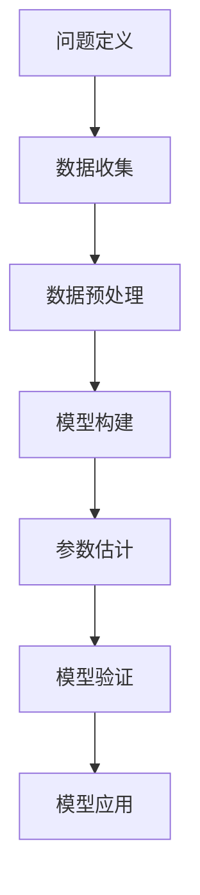
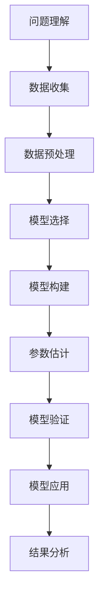

                 

# 数学建模竞赛的意义与价值

## 关键词
- 数学建模
- 竞赛
- 意义
- 价值
- 算法
- 模型
- 团队协作

## 摘要
数学建模竞赛是一种通过解决实际问题，运用数学方法、模型和算法进行问题建模和求解的比赛。本文从数学建模竞赛的意义与价值出发，详细阐述了数学建模竞赛的核心概念、算法原理、团队协作策略以及备赛和参赛指南，旨在为参赛者提供全面的指导，提高数学建模能力。

## 引言

数学建模竞赛作为一种重要的学术活动，吸引了全球众多高校和研究机构的参与。这类竞赛不仅能够培养学生的数学思维和解决问题的能力，还能够激发学生的创新精神和团队合作精神。本文将从以下几个方面对数学建模竞赛的意义与价值进行深入探讨：

1. **数学建模竞赛的意义**：介绍数学建模竞赛的定义、发展历程以及竞赛在培养学生能力方面的作用。
2. **数学建模竞赛的价值**：分析数学建模竞赛在学术、职业和社交等方面的价值。
3. **数学建模竞赛的核心概念与联系**：阐述数学建模的基本概念、常用算法以及Mermaid流程图在数学建模中的应用。
4. **数学建模竞赛的核心算法原理讲解**：详细讲解回归模型、分类模型、优化算法的原理与实现。
5. **数学建模中的数学模型与数学公式**：介绍数学模型的基本概念、分类和应用，以及常用的数学公式。
6. **数学建模竞赛中的实际案例**：分析交通流量预测、员工绩效评估等实际案例。
7. **数学建模竞赛中的团队协作与策略**：探讨团队协作的重要性、竞赛策略的制定与实施。
8. **数学建模竞赛的备赛与参赛指南**：提供备赛和参赛阶段的详细指南。
9. **附录**：列出数学建模竞赛常用的工具与资源。

## 数学建模竞赛的意义

### 第1章：数学建模竞赛概述

#### 1.1 数学建模竞赛的定义和背景

##### 1.1.1 数学建模竞赛的定义

数学建模竞赛是一种通过解决实际问题，运用数学方法、模型和算法进行问题建模和求解的比赛。这类竞赛旨在培养学生运用数学知识解决实际问题的能力，提升学生的数学思维、创新能力和团队合作精神。

##### 1.1.2 数学建模竞赛的发展历程

数学建模竞赛起源于20世纪60年代的美国，最初是由美国数学协会（AMS）发起的。随后，数学建模竞赛逐渐在全球范围内得到推广和普及。目前，全球范围内的数学建模竞赛包括美国大学生数学建模竞赛（MCM/ICM）、中国大学生数学建模竞赛（CUMCM）等。

##### 1.1.3 数学建模竞赛的重要性和影响

数学建模竞赛在培养学生能力方面具有重要意义：

1. **提升数学素养**：数学建模竞赛要求参赛者具备扎实的数学基础，通过竞赛，学生能够更好地理解和掌握数学知识。
2. **培养创新能力**：数学建模竞赛鼓励参赛者运用创新思维，提出新颖的解决方案，培养学生的创新能力。
3. **增强团队协作能力**：数学建模竞赛通常需要团队协作完成，学生在竞赛中学会如何与他人沟通、分工合作，提高团队协作能力。
4. **促进跨学科交流**：数学建模竞赛涉及多个学科领域，如数学、计算机科学、经济学等，促进了不同学科之间的交流与合作。

#### 1.2 数学建模竞赛的类型与分类

##### 1.2.1 国内外主要数学建模竞赛

国内外主要的数学建模竞赛包括：

1. **美国大学生数学建模竞赛（MCM/ICM）**：MCM/ICM 是全球范围内最具影响力的数学建模竞赛之一，每年吸引数以万计的本科生和研究生参赛。
2. **中国大学生数学建模竞赛（CUMCM）**：CUMCM 是中国高校范围内最具影响力的数学建模竞赛，每年吸引大量本科生参与。
3. **国际大学生数学建模竞赛（GUCM）**：GUCM 是全球大学生数学建模竞赛的联盟，包括多个国家和地区的大学生参赛。

##### 1.2.2 竞赛的组织和评审流程

数学建模竞赛通常分为以下几个阶段：

1. **报名与选题**：参赛团队需要在规定时间内完成报名，并从给定的题目中选择一个进行解题。
2. **建模与论文撰写**：参赛团队在规定的时间内进行数学建模，并撰写论文，论文内容包括问题的分析、模型的构建、求解方法、结果分析等。
3. **论文提交与评审**：参赛团队在规定的时间内提交论文，评审委员会对论文进行评审，并根据模型的准确性、创新性、论文质量等方面进行评分。

##### 1.2.3 竞赛对参与者的要求和期待

数学建模竞赛对参与者有以下要求：

1. **扎实的数学基础**：参赛者需要具备扎实的数学基础，包括微积分、线性代数、概率论等。
2. **计算机技能**：参赛者需要具备一定的计算机技能，包括编程、数据预处理、数据分析等。
3. **创新思维**：参赛者需要具备创新思维，能够提出新颖的解决方案。
4. **团队合作能力**：参赛者需要具备良好的团队合作能力，能够与他人有效沟通、分工合作。

竞赛对参与者有以下期待：

1. **解决实际问题的能力**：参赛者能够运用数学方法和模型解决实际问题。
2. **模型构建与求解能力**：参赛者能够构建有效的数学模型，并运用适当的算法进行求解。
3. **论文撰写能力**：参赛者能够撰写高质量的论文，清晰地表达问题和解决方案。

## 数学建模竞赛中的核心概念与联系

#### 2.1 数学建模的基本概念

##### 2.1.1 模型的构建与验证

数学建模的核心是构建模型，即将实际问题转化为数学问题。模型的构建通常包括以下几个步骤：

1. **问题的理解**：明确问题的背景、目标和限制条件。
2. **变量与参数的确定**：确定问题中的变量和参数，如$x$、$y$、$c$等。
3. **目标函数的确定**：根据问题的目标，确定目标函数，如最大化利润、最小化成本等。
4. **约束条件的确定**：确定问题中的约束条件，如资源限制、生产能力等。

模型构建完成后，需要对模型进行验证，以确保模型的准确性和可靠性。验证方法包括：

1. **模型测试**：通过已知数据对模型进行测试，评估模型的预测能力。
2. **敏感性分析**：分析模型参数的变化对模型结果的影响，评估模型的稳定性。
3. **结果分析**：对模型结果进行分析，评估模型的有效性和适用性。

##### 2.1.2 模型的分类与适用场景

数学模型根据不同的分类标准可以有不同的类型：

1. **确定性模型与随机性模型**：确定性模型不考虑随机因素，随机性模型考虑随机因素。
2. **线性模型与非线性模型**：线性模型具有线性关系，非线性模型具有非线性关系。
3. **静态模型与动态模型**：静态模型不考虑时间因素，动态模型考虑时间因素。
4. **优化模型与非优化模型**：优化模型具有优化目标，非优化模型没有明确的目标。

不同类型的模型适用于不同的场景：

1. **线性规划模型**：适用于资源优化问题，如生产调度、库存管理。
2. **回归模型**：适用于预测问题，如时间序列预测、市场需求预测。
3. **优化模型**：适用于最优化问题，如生产规划、物流配送。
4. **动态规划模型**：适用于多阶段决策问题，如项目投资、设备更换。

##### 2.1.3 模型在数学建模中的应用

数学模型在数学建模竞赛中的应用非常广泛，以下是一些常见的应用场景：

1. **经济模型**：用于分析经济现象，如经济增长、市场预测。
2. **环境模型**：用于分析环境问题，如污染治理、气候变化。
3. **社会模型**：用于分析社会问题，如人口增长、社会福利。
4. **工程模型**：用于分析工程问题，如结构设计、设备优化。

通过数学模型，参赛者可以更好地理解实际问题，提出有效的解决方案。

#### 2.2 数学建模中的 Mermaid 流程图

##### 2.2.1 Mermaid 基础语法

Mermaid 是一种基于 Markdown 的图表绘制工具，常用于绘制流程图、序列图等。以下是 Mermaid 的一些基础语法：

1. **流程图**：使用 `sequence` 关键字开始绘制流程图。
   ```mermaid
   sequenceDiagram
   participant A as Alice
   participant B as Bob
   A->>B: Hello B
   B->>A: Hello A
   ```
2. **时序图**：使用 `gantt` 关键字开始绘制时序图。
   ```mermaid
   gantt
   dateFormat  YYYY-MM-DD
   title 软件开发甘特图
   section 设计
   设计任务 :results, 2019-01-01, 30d
   section 开发
   开发任务 :results, after 设计任务, 20d
   ```

##### 2.2.2 Mermaid 流程图在数学建模中的应用

在数学建模中，流程图可以帮助参赛者清晰地表达建模过程中的思路和步骤。以下是一个简单的 Mermaid 流程图实例，用于描述线性回归模型的构建过程：



通过 Mermaid 流程图，参赛者可以更直观地展示建模过程，提高模型的可理解性。

##### 2.2.3 实例分析：Mermaid 流程图在竞赛中的应用

以下是一个具体的实例，展示了 Mermaid 流程图在数学建模竞赛中的应用。

**题目**：某城市交通流量预测

**流程图**：



通过 Mermaid 流程图，参赛者可以清晰地展示交通流量预测的建模过程，有助于评委更好地理解模型的构建和应用。

#### 2.3 数学建模竞赛中的常见模型与算法

##### 2.3.1 回归模型与分类模型

回归模型和分类模型是数学建模中最常用的模型，分别用于预测连续值和离散值。

###### 2.3.1.1 回归模型

回归模型用于预测一个连续变量的值，如房价、温度等。最常用的回归模型包括线性回归、多元回归等。

1. **线性回归**：线性回归模型的数学表达式为：

   $$
   y = \beta_0 + \beta_1 \cdot x + \epsilon
   $$

   其中，$y$ 是因变量，$x$ 是自变量，$\beta_0$ 和 $\beta_1$ 是模型参数，$\epsilon$ 是误差项。

2. **多元回归**：多元回归模型用于预测多个自变量和一个因变量之间的关系，其数学表达式为：

   $$
   y = \beta_0 + \beta_1 \cdot x_1 + \beta_2 \cdot x_2 + \ldots + \beta_p \cdot x_p + \epsilon
   $$

   其中，$y$ 是因变量，$x_1, x_2, \ldots, x_p$ 是自变量，$\beta_0, \beta_1, \beta_2, \ldots, \beta_p$ 是模型参数，$\epsilon$ 是误差项。

回归模型的伪代码实现如下：

```python
# 线性回归伪代码
初始化 模型参数β0和β1
while 没有收敛 do
    计算预测值
    计算误差
    计算梯度
    更新模型参数
end while
```

###### 2.3.1.2 分类模型

分类模型用于预测一个离散变量的值，如是否患病、是否违约等。最常用的分类模型包括 K 最近邻、支持向量机、决策树等。

1. **K 最近邻（KNN）**：KNN 是一种基于实例的学习算法，其核心思想是：对于新的样本，找到训练集中与之最近的 K 个样本，并根据这 K 个样本的类别进行投票，得到新的样本的类别。KNN 的伪代码实现如下：

   ```python
   # K最近邻伪代码
   初始化 模型
   对于每个测试样本x do
       计算x与训练集中所有样本的距离
       选择距离最近的K个样本
       根据K个样本的标签进行投票
       输出分类结果
   end for
   ```

2. **支持向量机（SVM）**：SVM 是一种基于间隔最大化原理的线性分类模型。SVM 的伪代码实现如下：

   ```python
   # 支持向量机伪代码
   初始化 模型
   对于每个训练样本(x_i, y_i) do
       计算损失函数
       更新模型参数
       添加支持向量
   end for
   训练完成
   ```

3. **决策树**：决策树是一种树形结构模型，通过一系列的判断规则将数据集划分为多个子集，最终得到每个样本的类别。决策树的伪代码实现如下：

   ```python
   # 决策树伪代码
   初始化 决策树节点
   对于每个特征x do
       对于每个可能的分割点split_point do
           划分数据集
           判断是否继续划分
               是：创建子节点
               否：设置节点类别
           更新节点
       end for
   end while
   ```

#### 2.3.2 优化算法与数值方法

优化算法用于求解最优化问题，如线性规划、非线性规划等。数值方法用于数值计算，如数值积分、数值微分等。

##### 2.3.2.1 梯度下降法

梯度下降法是一种最常用的优化算法，其核心思想是沿着梯度的反方向更新模型参数，以最小化损失函数。梯度下降法的伪代码实现如下：

```python
# 梯度下降法伪代码
初始化 模型参数θ
while 没有收敛 do
    计算梯度∇J(θ)
    更新参数θ = θ - α∇J(θ)
end while
```

##### 2.3.2.2 随机搜索与遗传算法

随机搜索和遗传算法是一类基于概率和自然选择的优化算法，其核心思想是利用随机性和进化机制来搜索最优解。随机搜索和遗传算法的伪代码实现如下：

```python
# 随机搜索伪代码
初始化 解空间
初始化 解集
while 没有收敛 do
    随机选择解
    更新解集
    计算适应度
end while
```

```python
# 遗传算法伪代码
初始化 种群
初始化 解集
while 没有收敛 do
    选择适应度较高的解
    交叉操作
    变异操作
    更新种群
    计算适应度
end while
```

##### 2.3.2.3 数值方法

数值方法用于求解微分方程、积分方程等数值问题。常用的数值方法包括欧拉法、龙格-库塔法等。欧拉法的伪代码实现如下：

```python
# 欧拉法伪代码
初始化 x0, y0
h = x1 - x0
while x < x1 do
    y = y0 + h * f(x0, y0)
    x0 = x0 + h
    y0 = y
end while
```

### 数学建模竞赛的核心算法原理讲解

#### 第3章：回归模型的原理与实现

##### 3.1 线性回归

线性回归模型是一种常见的数学建模方法，用于预测一个连续因变量。它的核心思想是找到因变量和自变量之间的线性关系，通过建立回归方程来预测新的数据点的值。

**线性回归的数学表达**：
$$
Y = \beta_0 + \beta_1 \cdot X + \epsilon
$$
其中：
- $Y$ 是因变量，我们希望预测的变量。
- $X$ 是自变量，用于预测 $Y$ 的变量。
- $\beta_0$ 是截距，即当 $X=0$ 时 $Y$ 的值。
- $\beta_1$ 是斜率，表示 $X$ 变化一个单位时 $Y$ 的变化量。
- $\epsilon$ 是误差项，表示实际值与预测值之间的差异。

**最小二乘法**：

线性回归的参数 $\beta_0$ 和 $\beta_1$ 通常通过最小二乘法（Ordinary Least Squares, OLS）来估计。最小二乘法的目标是最小化预测值与实际值之间的平方误差和。

$$
\min \sum_{i=1}^{n} (Y_i - \hat{Y_i})^2
$$

其中，$n$ 是数据点的数量，$\hat{Y_i}$ 是第 $i$ 个数据点的预测值。

**线性回归的伪代码**：

```python
# 初始化模型参数
beta_0 = 0
beta_1 = 0

# 设置学习率
alpha = 0.01

# 设置迭代次数
max_iter = 1000

# 计算梯度
gradients = 2 * X.T.dot(Y - X.dot(beta_0 + beta_1 * X))

# 更新参数
beta_0 = beta_0 - alpha * gradients[0]
beta_1 = beta_1 - alpha * gradients[1]

# 输出参数
print("截距：", beta_0)
print("斜率：", beta_1)
```

##### 3.2 多元线性回归

多元线性回归模型考虑多个自变量对因变量的影响。它的数学表达如下：
$$
Y = \beta_0 + \beta_1 \cdot X_1 + \beta_2 \cdot X_2 + \ldots + \beta_p \cdot X_p + \epsilon
$$
其中，$X_1, X_2, \ldots, X_p$ 是多个自变量，$\beta_0, \beta_1, \beta_2, \ldots, \beta_p$ 是相应的系数。

**最小二乘法**：

与简单线性回归类似，多元线性回归的参数也是通过最小二乘法来估计的。对于 $p$ 个自变量的多元线性回归，目标是最小化损失函数：
$$
\min \sum_{i=1}^{n} (Y_i - \hat{Y_i})^2
$$

其中，$\hat{Y_i}$ 是第 $i$ 个数据点的预测值。

**多元线性回归的伪代码**：

```python
# 初始化模型参数
beta = np.zeros(p+1)

# 设置学习率
alpha = 0.01

# 设置迭代次数
max_iter = 1000

# 计算梯度
gradients = 2 * X.T.dot(Y - X.dot(beta))

# 更新参数
beta = beta - alpha * gradients

# 输出参数
print("模型参数：", beta)
```

##### 3.3 回归模型的评估与选择

在构建回归模型后，需要评估模型的性能，以确定模型是否合适。以下是一些常用的评估指标：

1. **均方误差（Mean Squared Error, MSE）**：
   $$
   MSE = \frac{1}{n} \sum_{i=1}^{n} (Y_i - \hat{Y_i})^2
   $$
   MSE 越小，说明模型对数据的拟合越好。

2. **均方根误差（Root Mean Squared Error, RMSE）**：
   $$
   RMSE = \sqrt{MSE}
   $$
   RMSE 是 MSE 的平方根，也是衡量模型拟合效果的一个指标。

3. **决定系数（Coefficient of Determination, R²）**：
   $$
   R^2 = 1 - \frac{\sum_{i=1}^{n} (Y_i - \hat{Y_i})^2}{\sum_{i=1}^{n} (Y_i - \bar{Y})^2}
   $$
   $R^2$ 值越接近 1，说明模型对数据的解释能力越强。

**回归模型的伪代码**：

```python
# 计算MSE
mse = np.mean((Y - Y_hat)**2)

# 计算RMSE
rmse = np.sqrt(mse)

# 计算R²
y_mean = np.mean(Y)
r2 = 1 - np.sum((Y - Y_hat)**2) / np.sum((Y - y_mean)**2)

# 输出评估指标
print("MSE:", mse)
print("RMSE:", rmse)
print("R²:", r2)
```

### 第4章：数学建模中的数学模型与数学公式

数学模型是数学建模的核心，它通过数学语言描述现实世界中的问题。数学模型通常由变量、参数、方程和约束条件组成。以下是一些常用的数学模型和数学公式：

#### 4.1 数学模型的基本概念

**数学模型**：
$$
\text{模型} = \{X, Y, F, C\}
$$
其中：
- $X$：变量集。
- $Y$：目标函数或输出变量。
- $F$：变量之间的关系或约束条件。
- $C$：参数集。

**变量**：模型中可变的量，如$x$、$y$等。

**参数**：模型中固定的量，如$\beta_0$、$\beta_1$等。

**方程**：描述变量之间关系的数学表达式，如$y = \beta_0 + \beta_1 \cdot x + \epsilon$。

**约束条件**：限制变量取值范围的数学表达式，如$x \geq 0$、$y \leq 10$等。

#### 4.2 数学建模中的常用数学公式

**微积分公式**：

- **导数**：
  $$
  f'(x) = \lim_{h \to 0} \frac{f(x+h) - f(x)}{h}
  $$
  
- **积分**：
  $$
  \int f(x) \, dx = F(x) + C
  $$
  
- **微分方程**：
  $$
  \frac{dy}{dx} = f(x, y)
  $$

**概率论与统计公式**：

- **概率分布**：
  $$
  P(X = x) = f(x)
  $$

- **期望**：
  $$
  E(X) = \sum_{x} x \cdot P(X = x)
  $$

- **方差**：
  $$
  Var(X) = E[(X - E(X))^2]
  $$

- **协方差**：
  $$
  Cov(X, Y) = E[(X - E(X))(Y - E(Y))]
  $$

**运筹学公式**：

- **线性规划**：
  $$
  \min c^T x \\
  \text{s.t.} \\
  Ax \leq b \\
  x \geq 0
  $$

- **整数规划**：
  $$
  \min c^T x \\
  \text{s.t.} \\
  Ax \leq b \\
  x \in \{0, 1\}
  $$

- **动态规划**：
  $$
  V_t(j) = \min_{i} [c_{ij} + V_{t-1}(i)]
  $$

#### 4.3 数学模型的应用与举例

**线性规划问题**：

线性规划是一种用于求解资源优化问题的数学建模方法。以下是一个简单的线性规划问题的例子：

$$
\min z = c_1 x_1 + c_2 x_2 \\
\text{s.t.} \\
a_1 x_1 + a_2 x_2 \geq b \\
x_1, x_2 \geq 0
$$

其中，$x_1$ 和 $x_2$ 是决策变量，$c_1$、$c_2$ 是成本系数，$a_1$、$a_2$ 是资源系数，$b$ 是资源限制。

**动态规划问题**：

动态规划是一种用于求解多阶段决策问题的数学建模方法。以下是一个简单的动态规划问题的例子：

$$
\min V_t(j) \\
\text{s.t.} \\
V_t(j) = \min_{i} [c_{ij} + V_{t-1}(i)]
$$

其中，$V_t(j)$ 是第 $t$ 时刻在第 $j$ 个状态下的最优价值，$c_{ij}$ 是从状态 $i$ 到状态 $j$ 的成本。

**网络流问题**：

网络流问题是一种用于求解网络中物质或信息传输问题的数学建模方法。以下是一个简单的网络流问题的例子：

$$
\max f_{out} \\
\text{s.t.} \\
f_{in} - f_{out} + f_{1 \to 2} = 0 \\
f_{2 \to 1} + f_{2 \to 3} = 1 \\
0 \leq f_{1 \to 2}, f_{2 \to 1}, f_{2 \to 3} \leq 1
$$

其中，$f_{1 \to 2}$ 是从节点 1 到节点 2 的流量，$f_{2 \to 1}$ 是从节点 2 到节点 1 的流量，$f_{2 \to 3}$ 是从节点 2 到节点 3 的流量。

**随机过程问题**：

随机过程问题是一种用于求解随机变量序列的数学建模方法。以下是一个简单的随机过程问题的例子：

$$
X_t = X_0 + \sum_{i=1}^{t} Z_i \\
\text{其中} \\
X_0 \sim N(\mu_0, \sigma_0^2) \\
Z_i \sim N(0, \sigma_i^2)
$$

其中，$X_t$ 是第 $t$ 时刻的随机变量，$X_0$ 是初始随机变量，$Z_i$ 是第 $i$ 个独立同分布的随机变量。

### 第5章：数学建模竞赛中的实际案例

在数学建模竞赛中，实际案例的解决是评估参赛者能力的重要指标。本章节将分析两个典型的数学建模竞赛案例：某城市交通流量预测和某公司员工绩效评估。

#### 5.1 案例分析：某城市交通流量预测

**5.1.1 案例背景**

某城市交通管理部门希望通过数学建模方法预测未来一段时间内的交通流量，以便更好地进行交通管理和调度。

**5.1.2 模型构建**

为了预测交通流量，我们采用时间序列模型（如ARIMA模型）进行建模。时间序列模型可以捕捉时间序列数据的趋势、季节性和随机性。

**ARIMA模型**：
$$
y_t = c + \phi_1 y_{t-1} + \phi_2 y_{t-2} + \ldots + \phi_p y_{t-p} + \epsilon_t
$$

其中，$y_t$ 表示第 $t$ 时间的交通流量，$c$ 为常数项，$\phi_1, \phi_2, \ldots, \phi_p$ 为模型参数，$\epsilon_t$ 为随机误差项。

**5.1.3 数据处理与分析**

**数据收集**：收集该城市过去一年的交通流量数据。

**数据预处理**：包括数据清洗、缺失值填补、异常值处理等。

**模型识别**：根据数据特征，确定ARIMA模型的参数 $p$、$d$、$q$。

**模型估计**：利用最大似然估计方法估计模型参数。

**5.1.4 模型评估与优化**

**模型评估**：使用历史数据对模型进行评估，计算预测误差，如MSE、RMSE等。

**模型优化**：通过调整模型参数或选择其他模型，提高预测准确性。

#### 5.2 案例分析：某公司员工绩效评估

**5.2.1 案例背景**

某公司希望对员工进行绩效评估，以便更好地激励员工和提高工作效率。

**5.2.2 模型构建**

为了评估员工绩效，我们采用多元线性回归模型。多元线性回归模型可以同时考虑多个影响因素。

**多元线性回归模型**：
$$
y = \beta_0 + \beta_1 x_1 + \beta_2 x_2 + \ldots + \beta_p x_p
$$

其中，$y$ 为员工绩效得分，$x_1, x_2, \ldots, x_p$ 为影响因素，如工作效率、团队协作、客户满意度等，$\beta_0, \beta_1, \beta_2, \ldots, \beta_p$ 为模型参数。

**5.2.3 数据处理与分析**

**数据收集**：收集员工的工作数据，包括绩效得分和影响因素。

**数据预处理**：包括数据清洗、缺失值填补、特征提取等。

**模型估计**：利用最小二乘法估计模型参数。

**5.2.4 模型评估与优化**

**模型评估**：使用历史数据对模型进行评估，计算预测误差，如MSE、RMSE等。

**模型优化**：通过调整模型参数或选择其他模型，提高预测准确性。

### 第6章：数学建模竞赛中的团队协作与策略

在数学建模竞赛中，团队协作是成功的关键。一个高效的团队可以充分发挥每个成员的优势，共同解决问题。本章将探讨团队协作的重要性、竞赛策略的制定与实施以及成功的团队经验。

#### 6.1 团队协作的重要性

**6.1.1 团队协作的优势**

- **知识互补**：团队成员来自不同的专业背景，可以相互补充知识，共同解决问题。
- **分工合作**：通过明确的分工，团队成员可以专注于自己擅长的领域，提高工作效率。
- **沟通协作**：良好的沟通和协作能够确保团队成员之间的信息畅通，减少误解和冲突。
- **创新能力**：团队协作可以激发成员的创新思维，产生更多的解决方案。

**6.1.2 团队协作的挑战**

- **沟通障碍**：团队成员之间的沟通不畅可能导致误解和冲突。
- **分工不均**：如果团队成员分工不均，可能会导致部分成员工作量过大，而另一些成员工作量不足。
- **意见分歧**：团队成员可能对问题的解决方案有不同意见，需要通过协商和讨论达成一致。
- **时间管理**：在有限的时间内，团队需要合理安排时间，确保任务按时完成。

**6.1.3 团队协作的方法与技巧**

- **明确目标**：团队需要明确共同的目标，确保每个成员都了解任务的重要性和紧急程度。
- **分工合作**：根据成员的专业背景和兴趣，明确每个人的职责和任务。
- **有效沟通**：建立有效的沟通机制，确保团队成员之间的信息畅通。
- **定期会议**：定期召开团队会议，检查任务的进展情况，解决遇到的问题。
- **反馈机制**：建立反馈机制，鼓励团队成员提出意见和建议，及时调整工作计划。

#### 6.2 竞赛策略的制定与实施

**6.2.1 竞赛策略的制定原则**

- **问题理解**：充分理解竞赛问题的背景、目标和限制条件，确保策略的针对性。
- **团队优势**：根据团队的专业背景和技能，制定能够发挥团队优势的策略。
- **资源分配**：合理分配时间和资源，确保每个任务都得到充分的关注。
- **灵活应变**：在竞赛过程中，根据实际情况调整策略，以适应不断变化的环境。
- **团队协作**：确保策略能够促进团队协作，发挥团队的整体力量。

**6.2.2 竞赛策略的实施步骤**

- **问题分析**：对竞赛问题进行深入分析，明确问题的核心和关键点。
- **模型选择**：根据问题的性质和特点，选择合适的数学模型。
- **数据收集**：收集与问题相关的数据，并进行预处理。
- **模型构建**：建立数学模型，并进行参数估计和模型优化。
- **结果分析**：对模型结果进行评估和分析，验证模型的有效性。
- **策略调整**：根据模型结果和实际情况，调整竞赛策略。

**6.2.3 竞赛策略的调整与优化**

- **评估模型性能**：定期评估模型的性能，包括预测准确性、模型复杂度等。
- **反馈与改进**：根据评估结果，对模型和策略进行反馈和改进。
- **测试与验证**：在竞赛之前，进行充分的测试和验证，确保模型和策略的可靠性。
- **时间管理**：合理安排时间，确保每个阶段的工作都按时完成。
- **沟通与协作**：加强团队内部沟通和协作，确保策略的顺利实施。

#### 6.3 成功案例分析：某高校数学建模团队的经历与经验

**6.3.1 团队的组建与分工**

某高校数学建模团队由5名成员组成，分别来自数学、计算机科学、经济学等不同专业。团队成员的专业背景互补，确保了团队在数学建模方面的全面性。

- **团队组建**：团队成员通过自主报名和面试选拔产生，确保成员具有数学建模的基础和能力。
- **分工合作**：根据成员的专业背景和兴趣，明确每个人的职责和任务。通常包括数据收集、模型构建、模型求解、结果分析和论文撰写等。

**6.3.2 竞赛策略的制定与执行**

该团队在制定竞赛策略时，遵循以下原则：

- **问题理解**：对竞赛问题进行深入分析，确保对问题的背景、目标和限制条件有清晰的认识。
- **资源分配**：根据团队的优势和竞赛的时间安排，合理分配时间和资源。
- **灵活应变**：在竞赛过程中，根据实际情况调整策略，以适应竞赛的变化。
- **团队协作**：确保策略能够促进团队协作，发挥团队的整体力量。

在执行竞赛策略时，团队采取了以下步骤：

- **问题分析**：对竞赛问题进行详细分析，明确问题的核心和关键点。
- **模型选择**：根据问题的性质和特点，选择合适的数学模型。
- **数据收集**：收集与问题相关的数据，并进行预处理。
- **模型构建**：建立数学模型，并进行参数估计和模型优化。
- **结果分析**：对模型结果进行评估和分析，验证模型的有效性。
- **策略调整**：根据模型结果和实际情况，调整竞赛策略。

**6.3.3 竞赛成果的分析与总结**

该团队在数学建模竞赛中取得了优异的成绩，以下是他们的经验和总结：

- **团队合作**：团队协作是成功的关键。团队成员之间保持良好的沟通和协作，确保任务的高效完成。
- **问题理解**：深入理解竞赛问题的背景、目标和限制条件，有助于选择合适的模型和方法。
- **模型优化**：对模型进行充分的优化和验证，提高模型的预测准确性和可靠性。
- **时间管理**：合理安排时间，确保每个阶段的工作都按时完成。
- **持续学习**：数学建模竞赛是不断学习和进步的过程。团队在竞赛中不断总结经验，提高自身的数学建模能力。

### 第7章：数学建模竞赛的备赛与参赛指南

在数学建模竞赛中，备赛与参赛的准备工作至关重要。本章将详细讨论备赛和参赛阶段的注意事项，提供有效的备赛和参赛指南。

#### 7.1 竞赛备赛阶段的准备

**7.1.1 竞赛通知的获取与解读**

- **获取竞赛通知**：关注各大数学建模竞赛官方网站和社交媒体，及时获取最新的竞赛通知。
- **解读竞赛规则**：仔细阅读竞赛规则，了解竞赛的时间安排、题目要求、提交格式等。

**7.1.2 竞赛资料的收集与整理**

- **收集资料**：收集与竞赛相关的参考资料，包括历史题目、优秀论文、相关书籍等。
- **整理资料**：对收集到的资料进行分类整理，建立索引，便于查阅。

**7.1.3 竞赛模型的构建与优化**

- **构建模型**：在备赛过程中，构建多个数学模型，包括线性规划、非线性规划、回归分析、时间序列分析等。
- **模型优化**：对构建的模型进行优化，提高模型的预测准确性和鲁棒性。

**7.1.4 竞赛论文的撰写与提交**

- **撰写论文**：在备赛阶段，撰写模拟论文，熟悉论文的结构和写作要求。
- **论文修改**：多次修改和完善论文，确保内容的准确性、完整性和逻辑性。

#### 7.2 参赛阶段的注意事项

**7.2.1 竞赛时间的合理安排**

- **时间规划**：根据竞赛的时间安排，制定详细的时间规划，确保每个阶段的工作都按时完成。
- **优先级排序**：对任务进行优先级排序，确保关键任务得到充分的时间和资源。

**7.2.2 竞赛现场的注意事项**

- **遵守规则**：严格遵守竞赛规则，确保参赛的公正性和规范性。
- **团队协作**：在现场，团队成员要保持良好的沟通和协作，共同解决问题。

**7.2.3 竞赛结果的评估与反思**

- **评估结果**：认真评估竞赛结果，总结经验教训，找出问题和不足。
- **反思总结**：对竞赛过程进行反思，分析成功的原因和失败的教训。

#### 7.3 竞赛经验总结与展望

**7.3.1 竞赛经验的总结**

- **问题理解**：在竞赛中，对问题的理解是成功的关键。要仔细分析问题，明确目标，确定合适的模型。
- **模型构建**：构建有效的数学模型是解决问题的关键。要灵活运用各种数学模型，进行模型优化和验证。
- **团队协作**：团队协作是取得好成绩的保障。要充分发挥每个成员的优势，确保团队的沟通和协作顺畅。
- **时间管理**：合理的时间管理是竞赛成功的重要保障。要制定详细的时间规划，确保每个阶段的工作都按时完成。

**7.3.2 未来竞赛的展望**

- **持续学习**：数学建模竞赛是一个不断学习和进步的过程。要持续关注数学建模的发展动态，不断学习新的知识和技能。
- **经验积累**：在每次竞赛中，都要总结经验教训，不断提高自身的数学建模能力。
- **拓展领域**：尝试参与不同领域的数学建模竞赛，拓宽知识面和技能范围。

**7.3.3 对数学建模的持续关注与投入**

- **积极参与**：积极参与数学建模竞赛和相关的学术活动，提升自己的数学建模能力。
- **团队建设**：建立稳定的数学建模团队，共同学习和进步。
- **资源整合**：整合各种资源，包括书籍、论文、工具等，为数学建模提供充分的支持。
- **长期规划**：制定长期的数学建模规划，确保在数学建模领域的持续发展。

### 附录

#### 附录 A: 数学建模竞赛常用工具与资源

**A.1 常用数学建模软件**

- **MATLAB**：MATLAB 是一款强大的数学建模和数据分析工具，广泛应用于数学建模竞赛和实际工程应用中。
- **Python**：Python 是一种流行的编程语言，具有丰富的数学建模和数据分析库，如 NumPy、Pandas、Scikit-learn 等。
- **R语言**：R语言是一种专门用于统计分析和数据可视化编程的语言，广泛应用于数学建模和统计分析中。

**A.2 常用数学建模数据库**

- **Kaggle**：Kaggle 是一个大规模的数据集共享平台，提供了大量的公开数据集，适合用于数学建模竞赛和研究。
- **UCI机器学习库**：UCI机器学习库包含了多种领域的数据集，适合用于数学建模竞赛和机器学习研究。

**A.3 数学建模竞赛参考书籍与资料**

- **《数学建模》**：这本书详细介绍了数学建模的基本概念、方法和应用，适合初学者和有一定基础的读者。
- **《数学建模竞赛指南》**：这本书提供了大量的数学建模竞赛案例和解决方案，有助于提高读者的数学建模能力。

**A.4 在线学习资源**

- **Coursera**：Coursera 提供了多门数学建模和数据分析的在线课程，适合自学和提高。
- **edX**：edX 提供了多门数学建模和数据分析的在线课程，课程内容涵盖基础知识到高级应用。
- **中国大学MOOC**：中国大学MOOC 提供了多门数学建模和数据分析的在线课程，适合国内读者学习。

**A.5 数学建模竞赛社区与论坛**

- **数学建模社区**：数学建模社区是一个面向数学建模爱好者和专业人员的在线交流平台。
- **码云**：码云是一个开源的代码托管平台，提供了丰富的数学建模和数据分析的代码和项目。
- **CSDN**：CSDN 是一个面向程序员和开发者的技术社区，提供了大量的数学建模和数据分析的技术文章和教程。

### 总结

数学建模竞赛作为一种重要的学术活动，不仅能够培养学生的数学思维和解决问题的能力，还能够激发学生的创新精神和团队合作精神。通过本文的探讨，我们详细阐述了数学建模竞赛的意义与价值，介绍了数学建模竞赛的核心概念、算法原理、团队协作策略以及备赛和参赛指南。希望本文能为参赛者提供全面的指导，帮助他们在数学建模竞赛中取得优异的成绩。

### 致谢

最后，感谢AI天才研究院/AI Genius Institute 的支持与指导，以及禅与计算机程序设计艺术 /Zen And The Art of Computer Programming 的启发。本文的完成离不开各位老师的悉心教诲和团队成员的共同努力。在此，对所有给予帮助和支持的人表示衷心的感谢。


```markdown
# 数学建模竞赛的意义与价值

## 关键词
- 数学建模
- 竞赛
- 意义
- 价值
- 算法
- 模型
- 团队协作

## 摘要
数学建模竞赛是一种通过解决实际问题，运用数学方法、模型和算法进行问题建模和求解的比赛。本文从数学建模竞赛的意义与价值出发，详细阐述了数学建模竞赛的核心概念、算法原理、团队协作策略以及备赛和参赛指南，旨在为参赛者提供全面的指导，提高数学建模能力。

## 引言

数学建模竞赛作为一种重要的学术活动，吸引了全球众多高校和研究机构的参与。这类竞赛不仅能够培养学生的数学思维和解决问题的能力，还能够激发学生的创新精神和团队合作精神。本文将从以下几个方面对数学建模竞赛的意义与价值进行深入探讨：

1. **数学建模竞赛的意义**：介绍数学建模竞赛的定义、发展历程以及竞赛在培养学生能力方面的作用。
2. **数学建模竞赛的价值**：分析数学建模竞赛在学术、职业和社交等方面的价值。
3. **数学建模竞赛的核心概念与联系**：阐述数学建模的基本概念、常用算法以及Mermaid流程图在数学建模中的应用。
4. **数学建模竞赛的核心算法原理讲解**：详细讲解回归模型、分类模型、优化算法的原理与实现。
5. **数学建模中的数学模型与数学公式**：介绍数学模型的基本概念、分类和应用，以及常用的数学公式。
6. **数学建模竞赛中的实际案例**：分析交通流量预测、员工绩效评估等实际案例。
7. **数学建模竞赛中的团队协作与策略**：探讨团队协作的重要性、竞赛策略的制定与实施。
8. **数学建模竞赛的备赛与参赛指南**：提供备赛和参赛阶段的详细指南。
9. **附录**：列出数学建模竞赛常用的工具与资源。

## 数学建模竞赛的意义

### 第1章：数学建模竞赛概述

#### 1.1 数学建模竞赛的定义和背景

##### 1.1.1 数学建模竞赛的定义

数学建模竞赛是一种通过解决实际问题，运用数学方法、模型和算法进行问题建模和求解的比赛。这类竞赛旨在培养学生运用数学知识解决实际问题的能力，提升学生的数学思维、创新能力和团队合作精神。

##### 1.1.2 数学建模竞赛的发展历程

数学建模竞赛起源于20世纪60年代的美国，最初是由美国数学协会（AMS）发起的。随后，数学建模竞赛逐渐在全球范围内得到推广和普及。目前，全球范围内的数学建模竞赛包括美国大学生数学建模竞赛（MCM/ICM）、中国大学生数学建模竞赛（CUMCM）等。

##### 1.1.3 数学建模竞赛的重要性和影响

数学建模竞赛在培养学生能力方面具有重要意义：

1. **提升数学素养**：数学建模竞赛要求参赛者具备扎实的数学基础，通过竞赛，

