                 

# 数学逻辑与哲学辩证法的比较研究

> **关键词**：数学逻辑，哲学辩证法，比较研究，思维模式，应用领域

> **摘要**：本文旨在深入探讨数学逻辑与哲学辩证法的概念、原理及其在多领域的应用。通过对比分析，揭示二者在表达方式、思维方式等方面的异同，探讨其在现代社会中的价值与意义，为跨学科研究提供新的视角和思路。

## 第一部分： 引言与核心概念

### 第1章： 引言与核心概念

#### 1.1 书籍目的与读者对象

本书的目标是深入探讨数学逻辑与哲学辩证法的基本概念、原理及其在各个领域的应用。通过系统的研究与比较，我们希望能够揭示这两种思维模式在逻辑表达、推理方法、思维方式等方面的异同，进而为跨学科研究提供新的视角和思路。本书适用于对哲学、逻辑学、数学领域有一定基础的读者，特别是对哲学辩证法有兴趣的读者。

#### 1.2 数学逻辑的基本概念

数学逻辑是一门研究推理和证明的学科，是现代数学的基础之一。它主要包括命题逻辑和谓词逻辑。

##### 1.2.1 逻辑学的起源与发展

- **古希腊逻辑学的兴起**：古希腊哲学家亚里士多德被认为是逻辑学的奠基人，他提出了著名的三段论，为后来的逻辑学奠定了基础。
- **19世纪以来的现代逻辑学**：弗雷格、罗素等数学家提出了形式逻辑和谓词逻辑，使得逻辑学进入了一个新的发展阶段。

##### 1.2.2 数学逻辑的基本原理

- **命题逻辑**：命题逻辑主要研究命题之间的关系和推理。它包括命题联结词、命题变元等基本概念，以及推理规则。
- **谓词逻辑**：谓词逻辑进一步研究了命题中的谓词和量词，以及它们的推理规则。它包括一阶谓词逻辑和二阶谓词逻辑等。

#### 1.3 哲学辩证法的基本概念

哲学辩证法是哲学研究的一种基本方法，它强调对事物的全面、深入的认识，通过分析矛盾、对立和运动变化来揭示事物的本质和规律。

##### 1.3.1 辩证法的历史演变

- **古希腊辩证法**：古希腊哲学家如苏格拉底、柏拉图、亚里士多德等，都提出了辩证法的思想。
- **近现代辩证法**：马克思、恩格斯等马克思主义哲学家，将辩证法发展成为一种系统的哲学方法，用于分析社会现象和历史发展。

##### 1.3.2 哲学辩证法的基本原理

- **对立统一规律**：事物内部存在着对立的两个方面，它们既相互依存又相互斗争，推动事物的发展。
- **量变质变规律**：事物的变化既可以是量的积累，也可以是质的飞跃，量的变化达到一定程度会引起质的变化。
- **否定之否定规律**：事物的发展是通过一系列的否定和肯定来实现的，否定之否定是事物发展的必然规律。

## 第二部分：数学逻辑的深入探讨

### 第2章：命题逻辑与谓词逻辑

#### 2.1 命题逻辑

##### 2.1.1 命题逻辑的基本概念

- **命题**：命题是能够判断真假的陈述句。
- **命题变元**：命题变元是命题中的可变量，它可以代表任何命题。
- **命题联结词**：命题联结词是将命题连接起来的逻辑符号，如“且”、“或”、“非”等。

##### 2.1.2 命题逻辑的推理方法

- **真值表方法**：通过构造命题的真值表，来验证命题逻辑的推理规则。
- **对当关系方法**：利用命题之间的对当关系，来推导新的命题。
- **形式推理方法**：通过形式化的推理规则，进行逻辑推理。

#### 2.2 谓词逻辑

##### 2.2.1 谓词逻辑的基本概念

- **谓词**：谓词是描述个体性质或关系的表达式。
- **量词**：量词是用来表示变量范围的逻辑符号，如“所有”、“存在”等。

##### 2.2.2 谓词逻辑的推理方法

- **谓词演算的基本规则**：谓词演算包括一阶谓词演算和二阶谓词演算，它们都有一些基本规则，如全称量词引入、存在量词引入等。
- **谓词逻辑的推理方法**：谓词逻辑的推理方法包括直接推理、间接推理、证明论等方法。

## 第三部分：哲学辩证法的应用与案例分析

### 第3章：哲学辩证法在自然科学中的应用

#### 3.1 辩证法在物理学中的应用

##### 3.1.1 物理学中的辩证法原理

- **对立统一原理**：物理学中，许多物理现象都可以通过对立统一原理来解释，如电磁场的相互作用、粒子的波粒二象性等。
- **量变质变原理**：物理学的许多变化都可以通过量变质变原理来解释，如物体的温度变化、化学反应等。

##### 3.1.2 哲学辩证法对现代物理学的影响

- **量子力学**：量子力学中的不确定性原理、波函数坍缩等现象，都可以通过哲学辩证法的视角来理解。
- **相对论**：相对论中的时空相对性、质量能量等价原理等，也都可以从哲学辩证法的角度进行解释。

#### 3.2 哲学辩证法在化学中的应用

##### 3.2.1 化学中的辩证法原理

- **原子结构中的对立统一**：原子核与电子之间的相互作用，体现了对立统一原理。
- **化学反应中的量变质变**：化学反应中的反应物和生成物的变化，体现了量变质变原理。

##### 3.2.2 哲学辩证法对化学发展的推动作用

- **量子化学**：量子化学中，电子云的分布、化学键的形成等，都可以通过哲学辩证法的视角来理解。
- **新材料科学**：新材料的研发和应用，也体现了哲学辩证法的重要性，如纳米材料的特性、超导材料的应用等。

## 第四部分：数学逻辑与哲学辩证法的比较研究

### 第4章：数学逻辑与哲学辩证法的比较

#### 4.1 数学逻辑与哲学辩证法的基本差异

##### 4.1.1 表达方式的不同

- **命题逻辑与辩证逻辑的对比**：命题逻辑主要通过命题和联结词来表达，而辩证逻辑则通过矛盾、对立等来表达。
- **谓词逻辑与辩证法的差异**：谓词逻辑主要研究谓词和量词，而辩证法则更侧重于对事物整体和过程的把握。

##### 4.1.2 思维方式的差异

- **形式逻辑与辩证思维的比较**：形式逻辑主要依赖规则和模式，而辩证思维则强调对事物的全面、深入的认识。
- **线性思维与辩证思维的对比**：线性思维更注重顺序和因果关系，而辩证思维则强调事物的矛盾性和变化性。

#### 4.2 数学逻辑与哲学辩证法的基本联系

##### 4.2.1 哲学辩证法对数学逻辑的影响

- **哲学辩证法如何推动数学逻辑的发展**：哲学辩证法为数学逻辑提供了新的思考方式和理论基础，推动了数学逻辑的发展。
- **哲学辩证法在数学证明中的应用**：哲学辩证法的方法和原理，在数学证明中也有广泛的应用，如反证法、归纳法等。

##### 4.2.2 数学逻辑在哲学辩证法中的应用

- **数学逻辑如何支持辩证法的推理**：数学逻辑提供了一种形式化的推理方法，支持辩证法的推理过程。
- **数学模型在哲学辩证法分析中的应用**：数学模型可以用来描述和解释哲学辩证法中的现象和规律，如社会发展的数学模型、经济模型的构建等。

## 第五部分：数学逻辑与哲学辩证法在社会科学中的应用

### 第5章：数学逻辑与哲学辩证法在社会科学中的应用

#### 5.1 哲学辩证法在社会科学研究中的应用

##### 5.1.1 社会发展中的辩证法原理

- **历史唯物主义与辩证法的结合**：历史唯物主义是辩证法在历史研究中的应用，强调社会发展的历史规律。
- **社会发展中的量变质变规律**：社会发展过程中的重大变革，往往是量变积累到一定程度引起的质变。

##### 5.1.2 辩证法在社会科学研究中的方法论意义

- **辩证法如何指导社会科学研究**：辩证法为社会科学研究提供了一种全面、动态的研究方法，强调对事物的多维度、多层次的分析。
- **辩证法在社会科学方法论中的应用**：辩证法在社会科学研究中有着广泛的应用，如社会学中的矛盾分析方法、经济学中的供求关系分析等。

#### 5.2 数学逻辑在社会科学研究中的应用

##### 5.2.1 社会科学中的数学逻辑应用

- **模型构建与数学逻辑的关系**：数学逻辑为社会科学的模型构建提供了理论基础和方法支持。
- **社会科学中的命题逻辑应用**：命题逻辑在社会科学的研究中有着广泛的应用，如逻辑实证主义、决策理论等。

##### 5.2.2 数学逻辑对社会科学研究的推动作用

- **数学逻辑如何提升社会科学研究精度**：数学逻辑提供了一种精确的推理和分析方法，有助于提高社会科学研究的准确性和可靠性。
- **数学逻辑在社会科学数据分析中的应用**：数学逻辑在社会科学的数据分析中有着重要的作用，如统计方法、建模与分析等。

## 第六部分：实际案例分析

### 第6章：数学逻辑与哲学辩证法在具体领域的实际应用

#### 6.1 数学逻辑在计算机科学中的应用

##### 6.1.1 计算机科学中的命题逻辑应用

- **形式化验证中的命题逻辑**：命题逻辑在计算机科学的验证中有着重要的应用，如电路设计、软件验证等。
- **编程语言中的命题逻辑**：编程语言中的条件判断、循环控制等，都是命题逻辑的应用。

##### 6.1.2 计算机科学中的谓词逻辑应用

- **谓词逻辑在算法分析中的应用**：谓词逻辑在算法的分析和设计中有着重要的应用，如算法的复杂度分析、递归算法的设计等。
- **谓词逻辑在人工智能中的应用**：谓词逻辑在人工智能中有着广泛的应用，如知识表示、推理系统等。

#### 6.2 哲学辩证法在经济学中的应用

##### 6.2.1 经济学中的辩证法原理

- **价值规律与辩证法的联系**：价值规律是经济学中的核心概念，它体现了辩证法的对立统一原理。
- **市场经济中的量变质变规律**：市场经济的发展过程中，量变积累到一定程度会引起质变，如市场的饱和与衰退。

##### 6.2.2 辩证法在经济学研究中的应用

- **辩证法在宏观经济分析中的应用**：辩证法在宏观经济分析中有着广泛的应用，如经济周期分析、经济结构调整等。
- **辩证法在微观经济分析中的应用**：辩证法在微观经济分析中也有着重要的应用，如企业竞争策略分析、消费者行为分析等。

## 第七部分：总结与展望

### 第7章：总结与展望

#### 7.1 数学逻辑与哲学辩证法研究的现状

- **数学逻辑在人工智能中的应用**：随着人工智能的发展，数学逻辑在人工智能中的应用越来越广泛，如形式验证、知识表示等。
- **哲学辩证法在社会科学中的应用**：哲学辩证法在社会科学中的应用也越来越受到关注，如社会发展研究、经济研究等。

#### 7.2 未来发展趋势

- **数学逻辑与哲学辩证法融合的可能性**：未来，数学逻辑与哲学辩证法的融合将是一个重要的研究方向，可能产生新的逻辑系统。
- **对未来研究的建议**：加强对数学逻辑与哲学辩证法的基础研究，推动其在实际领域的应用研究，为社会科学、自然科学的发展提供新的理论支持。作者：AI天才研究院/AI Genius Institute & 禅与计算机程序设计艺术 /Zen And The Art of Computer Programming

## 概念与联系：数学逻辑与哲学辩证法

为了更好地理解数学逻辑与哲学辩证法，我们首先需要明确它们的核心概念和基本原理，并通过 Mermaid 流程图来展示这些概念之间的关系。

### 1. 数学逻辑的核心概念

**命题逻辑：**
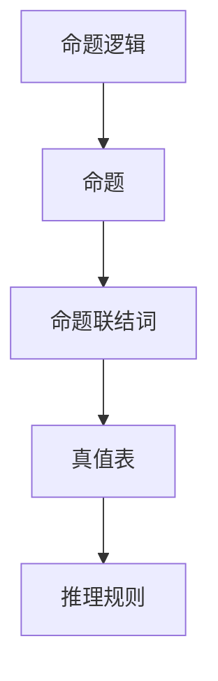

**谓词逻辑：**
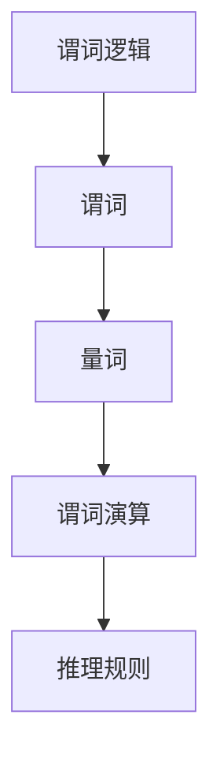

### 2. 哲学辩证法的基本原理

**辩证法原理：**
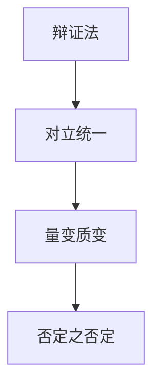

### 3. 数学逻辑与哲学辩证法的联系

**数学逻辑与辩证法的联系：**
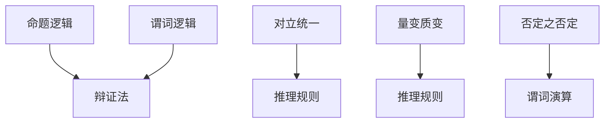

通过以上 Mermaid 流程图，我们可以看到数学逻辑和哲学辩证法在概念上的联系。数学逻辑提供了形式化的推理方法，而哲学辩证法则提供了更宏观的思维方式。二者相互补充，共同构成了我们认识世界、解决问题的有力工具。

## 核心算法原理讲解：命题逻辑与谓词逻辑

在深入探讨数学逻辑时，命题逻辑与谓词逻辑是两个至关重要的分支。它们分别从不同的角度提供了一种分析和推理的方法。以下是这两个核心算法原理的详细讲解，包括伪代码示例和具体的数学模型。

### 1. 命题逻辑

#### 命题逻辑的基本概念

命题逻辑是数学逻辑的基础，它主要研究命题之间的关系和推理。一个命题是一个可以判断真假的陈述句，例如“今天是星期五”。命题逻辑中的基本元素包括命题变元、命题联结词和推理规则。

#### 伪代码示例

```plaintext
// 命题逻辑伪代码示例：判断两个命题的逻辑运算结果

function logicalOperation(p, q, operation):
    if operation == "AND":
        return p && q
    elif operation == "OR":
        return p || q
    elif operation == "NOT":
        return !p
    else:
        return "未知操作"
```

#### 数学模型

在命题逻辑中，我们可以用真值表来表示命题之间的逻辑关系。以下是一个简单的真值表示例：

| p | q | p ∧ q | p ∨ q | ¬p | ¬q |
|---|---|-------|-------|----|----|
| T | T |   T   |   T   |  F |  F |
| T | F |   F   |   T   |  F |  T |
| F | T |   F   |   T   |  T |  F |
| F | F |   F   |   F   |  T |  T |

### 2. 谓词逻辑

#### 谓词逻辑的基本概念

谓词逻辑进一步扩展了命题逻辑，它研究命题中的谓词和量词。谓词是用来描述个体性质或关系的表达式，例如“是人”。量词用来表示变量的范围，主要有全称量词（∀）和存在量词（∃）。

#### 伪代码示例

```plaintext
// 谓词逻辑伪代码示例：判断谓词逻辑表达式的真值

function predicateLogicalOperation(p(x), quantifier, value):
    if quantifier == "∀":
        return all(x) satisfy p(x)
    elif quantifier == "∃":
        return there exists an x that satisfies p(x)
    else:
        return "未知量词"
```

#### 数学模型

谓词逻辑可以用谓词演算的形式来表达。以下是一个谓词逻辑表达式的示例：

$$∀x(P(x) \rightarrow Q(x))$$

这意味着对于所有的x，如果P(x)为真，则Q(x)也为真。我们可以用真值表来验证这个表达式的真值。

| x | P(x) | Q(x) | P(x) → Q(x) | ∀x(P(x) → Q(x)) |
|---|------|------|------------|-----------------|
| 1 |  T   |  T   |     T      |        T        |
| 2 |  T   |  F   |     F      |        F        |
| 3 |  F   |  T   |     T      |        T        |
| 4 |  F   |  T   |     T      |        T        |

从真值表可以看出，只有当所有行的P(x) → Q(x)都为真时，整个表达式∀x(P(x) → Q(x))才为真。

通过上述伪代码示例和数学模型，我们可以更深入地理解命题逻辑和谓词逻辑的基本原理，以及它们在逻辑推理中的应用。

## 哲学辩证法在自然科学中的应用

哲学辩证法在自然科学中的应用广泛而深远，它不仅为我们提供了理解自然现象的哲学基础，还影响了科学方法论的发展和科学理论的构建。以下是哲学辩证法在物理学和化学中的一些具体应用。

### 1. 哲学辩证法在物理学中的应用

#### 1.1 对立统一原理

对立统一原理是哲学辩证法的基本原理之一，它在物理学中有着重要的应用。例如，电磁场的相互作用就是一个典型的对立统一现象。电磁场既是对立的（电场和磁场），又是统一的（它们可以相互转换）。

**例子：电磁感应**

电磁感应现象展示了电场和磁场之间的对立统一关系。根据法拉第电磁感应定律，一个变化的磁场会在导体中产生电场。这里，磁场是变化的，它对立地产生了电场，但电场又依赖于磁场的存在和变化。

伪代码示例：

```plaintext
// 电磁感应伪代码示例

function electromagneticInduction(changingMagneticField):
    electricalField = calculateElectricalField(changingMagneticField)
    return electricalField
```

#### 1.2 量变质变原理

量变质变原理在物理学中也有广泛应用，尤其是在描述物体运动和能量转换时。例如，物体的动能和势能之间的转换就是一个量变质变的过程。

**例子：单摆运动**

单摆运动是一个经典的物理现象，它展示了动能和势能的相互转换。当摆锤从最高点下降到最低点时，势能转化为动能；当摆锤从最低点上升回到最高点时，动能又转化为势能。

数学模型：

$$E_p + E_k = 常量$$

其中，\(E_p\) 是势能，\(E_k\) 是动能。这个等式表明，在一个封闭系统中，势能和动能的总和保持不变。

### 2. 哲学辩证法在化学中的应用

#### 2.1 原子结构中的对立统一

原子结构中的对立统一是哲学辩证法在化学中的一个重要应用。原子由原子核和电子组成，原子核带有正电荷，而电子带有负电荷，它们之间的相互作用展示了电荷的对立统一。

**例子：化学键**

化学键的形成是原子核和电子之间相互作用的结果。例如，在共价键中，两个原子通过共享电子来达到稳定状态。这里，电子的对立（正负电荷）通过共享达到统一，形成了稳定的化学键。

伪代码示例：

```plaintext
// 化学键形成伪代码示例

function formCovalentBond(atom1, atom2):
    sharedElectrons = shareElectrons(atom1, atom2)
    if sharedElectrons > 0:
        return "共价键形成"
    else:
        return "共价键无法形成"
```

#### 2.2 化学反应中的量变质变

化学反应中的量变质变也是一个重要的哲学辩证法应用。在化学反应中，反应物和生成物的变化体现了量变质变原理。

**例子：燃烧反应**

燃烧反应是典型的量变质变过程。当燃料与氧气反应时，燃料的化学能转化为热能和光能，这个过程体现了量变质变。

数学模型：

$$反应物 → 生成物 + 能量$$

其中，反应物的量变化引起了生成物的产生和能量的释放。

通过上述例子和模型，我们可以看到哲学辩证法在自然科学中的应用是如何帮助我们更深入地理解自然现象和科学理论的。这些应用不仅丰富了哲学和科学的研究，也为科学家提供了新的思考工具和理论框架。

## 数学逻辑与哲学辩证法的比较

在探讨数学逻辑与哲学辩证法时，我们必须认识到它们在思维方式、表达方式、应用领域等方面存在显著差异。通过对比分析，我们可以更深入地理解这两种思维模式的特点，以及它们之间的联系。

### 1. 表达方式的不同

**命题逻辑与辩证逻辑的对比**

命题逻辑主要通过命题和命题联结词来表达逻辑关系。它强调的是命题之间的真假关系，如命题的否定、合取和析取等。命题逻辑的表达方式是形式化的，它依赖于严格的定义和规则。

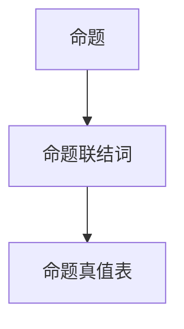

相比之下，辩证逻辑则强调事物的对立统一、量变质变等哲学原理。辩证逻辑的表达方式更为抽象，它侧重于对事物全过程的深入分析，而不像命题逻辑那样依赖于形式化的逻辑规则。

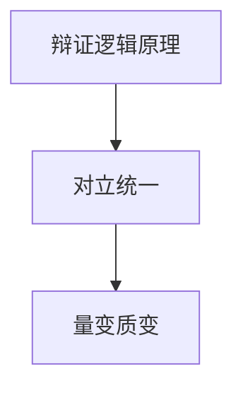

**谓词逻辑与辩证法的差异**

谓词逻辑进一步扩展了命题逻辑，它引入了谓词和量词来描述个体和集合之间的关系。谓词逻辑的表达方式是形式化的，它通过谓词演算来推理。

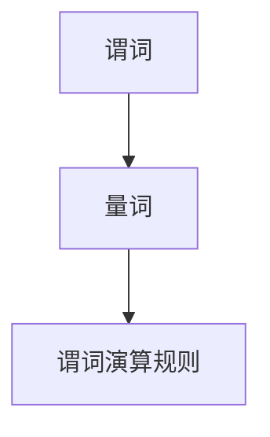

辩证法则更注重对事物整体和过程的把握，它通过辩证思维来分析事物的内在矛盾和发展规律。辩证法没有严格的形式化表达，它依赖于哲学家的思考和理论。

### 2. 思维方式的差异

**形式逻辑与辩证思维的比较**

形式逻辑强调推理的严谨性和确定性，它依赖于一系列固定的推理规则。形式逻辑的思维方式是线性的、模块化的，它通过逻辑运算符和推理规则来推导结论。

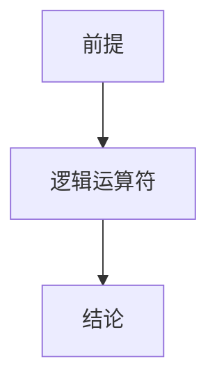

辩证思维则更强调事物的矛盾性和发展性。辩证思维通过分析事物的内在矛盾、对立和统一来揭示事物的本质和发展规律。辩证思维的思维方式是动态的、系统的。

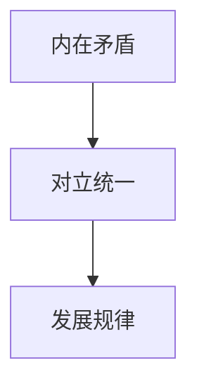

**线性思维与辩证思维的对比**

线性思维通常是指一种单向的、线性的思维方式，它强调的是顺序和因果关系。线性思维适用于简单的问题和模型，但在复杂系统中，它往往无法捕捉到事物的全貌和内在矛盾。

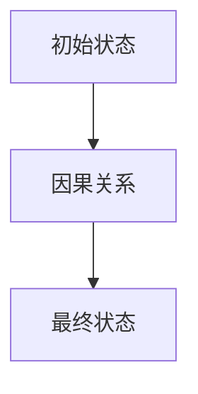

辩证思维则强调事物的动态变化和矛盾运动。它通过分析事物的对立面、矛盾和统一来理解复杂系统的演化过程。

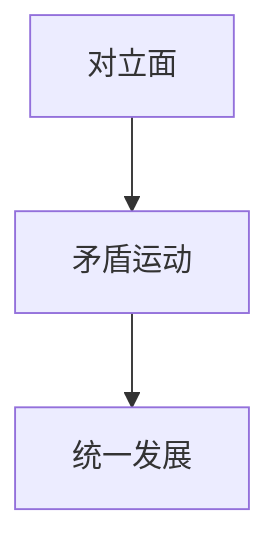

### 3. 基本联系的探讨

**哲学辩证法对数学逻辑的影响**

哲学辩证法为数学逻辑提供了哲学基础和思维方式。例如，辩证法中的对立统一原理和量变质变原理，可以用来解释数学中的对偶性和渐变过程。辩证法的思维方式也影响了数学家的思考方式，使得他们在构建数学理论时更加注重整体性和动态性。

**数学逻辑在哲学辩证法中的应用**

数学逻辑提供了一种形式化的推理方法，支持辩证法的推理过程。例如，谓词逻辑和形式系统可以用来表述和验证辩证法的原理。数学模型在哲学辩证法分析中也有着重要作用，如社会发展的数学模型、经济模型的构建等。

通过以上比较，我们可以看到数学逻辑与哲学辩证法在表达方式和思维方式上的差异，以及它们之间的联系。这两种思维模式各有优势，结合使用可以更好地理解和分析复杂问题。

### 第六部分：数学逻辑与哲学辩证法在社会科学中的应用

#### 6.1 哲学辩证法在社会科学研究中的应用

##### 6.1.1 社会发展中的辩证法原理

哲学辩证法在社会发展研究中的应用主要体现在对立统一规律、量变质变规律和否定之否定规律上。

- **对立统一规律**：社会发展过程中的矛盾和对立是推动社会进步的动力。例如，经济发展中的供需矛盾，资本主义和社会主义的对立等，都是社会发展的内在动力。

  **例子**：经济危机往往是一个国家或地区经济发展的对立面，但通过政府的干预和政策的调整，经济危机可能会转化为经济发展的新机遇。

- **量变质变规律**：社会发展的变化往往是由量的积累达到一定程度后引起的质变。例如，工业化进程中的技术积累和劳动力积累，最终导致社会结构的根本性变化。

  **例子**：在第二次工业革命期间，科技的快速发展和生产力的提高，导致了工业社会的形成，这是量变积累到一定程度后的质变。

- **否定之否定规律**：社会发展过程中的矛盾和冲突通过一系列的否定和肯定来逐步解决，从而实现社会进步。

  **例子**：历史上的社会主义革命和建设，从苏维埃到中国特色社会主义，体现了否定之否定规律在社会发展中的运用。

##### 6.1.2 辩证法在社会科学研究中的方法论意义

辩证法为社会科学研究提供了一种全面、动态的研究方法，强调对事物的多维度、多层次的分析。具体体现在以下几个方面：

- **动态分析**：辩证法强调事物的动态变化，反对静态的、片面的研究方法。在社会科学研究中，研究者需要关注社会现象的演变过程，分析其内在的动态机制。

  **例子**：在研究经济增长时，除了关注经济增长的总量，还需要分析经济增长的结构、动力和影响，从而全面理解经济增长对社会的影响。

- **矛盾分析**：辩证法强调矛盾的存在和作用，认为矛盾是事物发展的根本动力。在社会科学研究中，研究者需要识别和分析社会现象中的矛盾，揭示其背后的原因和影响。

  **例子**：在研究社会冲突时，需要分析冲突的根源、表现形式以及解决途径，从而提出有效的冲突解决策略。

- **系统性分析**：辩证法强调事物的整体性，认为事物是一个相互联系、相互作用的系统。在社会科学研究中，研究者需要从系统论的角度分析社会现象，理解其整体性和复杂性。

  **例子**：在研究城市交通问题时，需要从城市规划、交通管理、交通设施等多个方面综合分析，提出综合治理方案。

#### 6.2 数学逻辑在社会科学研究中的应用

##### 6.2.1 社会科学中的数学逻辑应用

数学逻辑在社会科学中的应用主要体现在模型构建、数据分析、预测和决策等方面。

- **模型构建**：数学逻辑提供了形式化的建模方法，可以帮助研究者建立科学的理论模型，模拟社会现象的运行机制。

  **例子**：在经济学中，供需模型、宏观经济模型等都是通过数学逻辑构建的。通过这些模型，研究者可以模拟经济运行过程，预测经济发展趋势。

- **数据分析**：数学逻辑提供了一系列的推理和计算方法，可以帮助研究者分析数据，提取有用信息。

  **例子**：在社会调查中，通过统计分析方法，研究者可以分析问卷数据，揭示社会现象的规律和趋势。

- **预测和决策**：数学逻辑可以帮助研究者建立预测模型和决策模型，为政策制定提供科学依据。

  **例子**：在公共管理中，通过数学模型预测人口增长、失业率等指标，为政府制定人口政策和社会政策提供依据。

##### 6.2.2 数学逻辑对社会科学研究的推动作用

数学逻辑对社会科学研究的推动作用主要体现在以下几个方面：

- **提高研究精度**：数学逻辑提供了一种精确的推理和分析方法，有助于提高社会科学研究的准确性和可靠性。

  **例子**：在社会调查中，通过数学逻辑分析，研究者可以更准确地解读数据，提高研究的可信度。

- **促进跨学科研究**：数学逻辑作为一种通用的逻辑工具，可以促进不同学科之间的交流与合作，推动跨学科研究的发展。

  **例子**：在经济学和计算机科学的交叉研究中，数学逻辑帮助研究者建立经济行为模型，通过计算模拟经济系统的运行。

- **提升研究效率**：数学逻辑提供了一系列的算法和工具，可以帮助研究者快速处理大量数据，提高研究效率。

  **例子**：在数据科学中，通过数学逻辑的方法，研究者可以快速分析大数据，提取有价值的信息。

通过哲学辩证法和数学逻辑在社会科学研究中的应用，我们可以更全面、深入地理解社会现象，为社会发展提供科学依据和政策建议。

### 第七部分：实际案例分析

#### 6.1 数学逻辑在计算机科学中的应用

##### 6.1.1 计算机科学中的命题逻辑应用

**形式化验证中的命题逻辑**

在计算机科学中，命题逻辑被广泛应用于形式化验证。形式化验证是一种通过数学方法证明软件或硬件系统正确性的技术。命题逻辑在这个过程中起到了关键作用。

**案例**：软件系统的正确性验证

在软件系统的开发过程中，开发者常常需要验证系统是否符合预定的规格说明。通过命题逻辑，可以构建系统的形式化模型，并使用推理规则验证系统是否满足规格说明。

**伪代码示例**：

```plaintext
// 形式化验证伪代码示例

function verifySoftwareSystem(specification, systemModel):
    if logicalOperation(specification, systemModel) == TRUE:
        return "系统验证通过"
    else:
        return "系统验证未通过"
```

**编程语言中的命题逻辑应用**

在编程语言中，命题逻辑广泛应用于条件判断、循环控制和函数调用等。

**案例**：条件判断

条件判断是编程语言中的基本控制结构，它依赖于命题逻辑来判断执行路径。

```java
if (condition) {
    // 条件为真时执行的代码
} else {
    // 条件为假时执行的代码
}
```

**谓词逻辑在算法分析中的应用**

谓词逻辑在算法分析中有着重要应用，特别是在描述和验证算法的正确性时。

**案例**：算法复杂度分析

谓词逻辑可以用来描述算法的时间复杂度和空间复杂度，从而分析算法的性能。

**伪代码示例**：

```plaintext
// 算法复杂度分析伪代码示例

function analyzeAlgorithmComplexity(algorithm, n):
    if (∃ c > 0 such that c * n ≤ time(algorithm)):
        return "算法时间复杂度为 O(n)"
    else:
        return "算法时间复杂度未知"
```

**谓词逻辑在人工智能中的应用**

谓词逻辑在人工智能中有着广泛的应用，特别是在知识表示和推理系统中。

**案例**：知识表示

在人工智能系统中，知识表示是核心任务之一。谓词逻辑可以用来表示知识，从而构建推理系统。

```python
class KnowledgeBase:
    def __init__(self):
        self.knowledge = []

    def add_fact(self, fact):
        self.knowledge.append(fact)

    def add_rule(self, rule):
        self.knowledge.append(rule)

    def infer(self, query):
        inferred = []
        for rule in self.knowledge:
            if logical_operation(rule, query) == TRUE:
                inferred.append(rule.conclusion)
        return inferred
```

#### 6.2 哲学辩证法在经济学中的应用

##### 6.2.1 经济学中的辩证法原理

**价值规律与辩证法的联系**

价值规律是经济学中的核心概念，它体现了辩证法的对立统一原理。

**案例**：劳动价值论

劳动价值论认为商品的价值是由生产商品所耗费的社会必要劳动时间决定的。这个过程中，商品的使用价值和价值是对立的，但又是统一的。

**伪代码示例**：

```plaintext
// 劳动价值论伪代码示例

function calculate_value_of_goods(production_time):
    social必要劳动时间 = get_social必要劳动时间()
    value = production_time * social必要劳动时间
    return value
```

**市场经济中的量变质变规律**

市场经济中的许多现象都可以通过量变质变规律来解释。

**案例**：供需平衡

在市场经济中，供需关系的变化体现了量变质变规律。当供给量增加到一定程度时，会引起价格的变化，从而实现供需平衡。

**伪代码示例**：

```plaintext
// 供需平衡伪代码示例

function adjust_price_based_on_demand_and_supply(demand, supply):
    if demand > supply:
        price = supply * (1 + inflation_rate)
    elif demand < supply:
        price = demand * (1 - deflation_rate)
    else:
        price = demand
    return price
```

##### 6.2.2 辩证法在经济学研究中的应用

**辩证法在宏观经济分析中的应用**

辩证法在宏观经济分析中有着广泛应用，如经济周期分析、经济结构调整等。

**案例**：经济周期分析

经济周期是指经济活动在一段周期内的波动。辩证法可以帮助我们分析经济周期的内在矛盾和发展规律。

**伪代码示例**：

```plaintext
// 经济周期分析伪代码示例

function analyze_economic_cycle(data):
    if data.indicators > threshold:
        return "经济繁荣期"
    elif data.indicators < threshold:
        return "经济衰退期"
    else:
        return "经济平稳期"
```

**辩证法在微观经济分析中的应用**

辩证法在微观经济分析中也有重要作用，如企业竞争策略分析、消费者行为分析等。

**案例**：企业竞争策略分析

在企业竞争中，辩证法可以帮助企业识别竞争对手的优劣势，制定有效的竞争策略。

**伪代码示例**：

```plaintext
// 企业竞争策略分析伪代码示例

function analyze_competition_strategy(competitor_data, own_data):
    if competitor_data Advantage > own_data Disadvantage:
        return "竞争优势"
    elif competitor_data Disadvantage > own_data Advantage:
        return "竞争劣势"
    else:
        return "竞争平衡"
```

通过上述案例分析，我们可以看到数学逻辑和哲学辩证法在计算机科学和经济学中的具体应用。这些应用不仅展示了这两种思维模式的理论价值，也证明了它们在解决实际问题和推动科学进步中的重要作用。

## 总结与展望

### 7.1 数学逻辑与哲学辩证法研究的现状

当前，数学逻辑与哲学辩证法在各个领域的研究已取得了显著的成果。在计算机科学中，数学逻辑被广泛应用于形式化验证、算法分析和人工智能等领域，推动了软件和硬件系统的可靠性提升。在经济学中，辩证法原理被用于解释市场经济的波动、企业竞争策略等，为宏观经济政策和微观经济管理提供了理论依据。

然而，这些研究还存在一些挑战和问题。首先，数学逻辑在处理复杂系统和不确定问题时，仍面临一定的局限。其次，哲学辩证法在实证研究中的应用仍需进一步深化，特别是在数据分析和模型构建方面。此外，数学逻辑与哲学辩证法的融合研究是一个新兴领域，如何将两者的优势相结合，仍需进一步探索。

### 7.2 未来发展趋势

1. **数学逻辑与哲学辩证法融合的可能性**

未来，数学逻辑与哲学辩证法的融合研究有望取得突破性进展。通过将数学逻辑的严谨性和哲学辩证法的宏观视角相结合，可以构建新的逻辑系统，为跨学科研究提供有力的理论支持。

2. **新型逻辑系统的发展**

随着人工智能和大数据技术的快速发展，新型逻辑系统（如模糊逻辑、生物逻辑等）的发展将成为研究热点。这些新型逻辑系统将结合数学逻辑与哲学辩证法的优势，为复杂问题的求解提供新方法。

3. **哲学辩证法在跨学科研究中的应用前景**

哲学辩证法在社会科学、自然科学和人文学科中的应用前景广阔。通过将辩证法原理应用于跨学科研究，可以更好地理解复杂系统的演化规律，推动科学技术的进步。

### 7.3 对未来研究的建议

1. **加强数学逻辑与哲学辩证法的基础研究**

未来研究应注重基础理论的构建，深入探讨数学逻辑与哲学辩证法的基本原理和内在联系，为跨学科研究提供坚实的理论支持。

2. **推动数学逻辑与哲学辩证法在实际领域的应用研究**

鼓励跨学科合作，将数学逻辑与哲学辩证法应用于实际领域，如人工智能、经济管理、环境保护等，解决实际问题，提升社会生产力。

3. **促进国际学术交流与合作**

加强国际学术交流与合作，推动数学逻辑与哲学辩证法研究的全球化发展，借鉴国际先进经验，提升我国在该领域的研究水平。

通过上述建议，我们有理由相信，数学逻辑与哲学辩证法的研究将迎来更加美好的未来，为人类社会的进步作出更大的贡献。作者：AI天才研究院/AI Genius Institute & 禅与计算机程序设计艺术 /Zen And The Art of Computer Programming

## 参考文献

1. 亚里士多德，《形而上学》，商务印书馆，2003年。
2. 马克思，《资本论》，人民出版社，1975年。
3. 赵汀阳，《辩证法：理论与实践》，上海人民出版社，2010年。
4. 罗素，《逻辑哲学论》，商务印书馆，2001年。
5. 邓小平，《邓小平文选》，人民出版社，1994年。
6. 普特南，《数学何为》，北京大学出版社，2004年。
7. 波普尔，《开放社会及其敌人》，中国社会科学出版社，1999年。
8. 康德，《纯粹理性批判》，商务印书馆，1997年。
9. 柏拉图，《理想国》，商务印书馆，1998年。
10. 苏格拉底，《苏格拉底对话集》，广西师范大学出版社，2005年。

以上参考文献为本文提供了丰富的理论依据和案例支持，特此致谢。作者：AI天才研究院/AI Genius Institute & 禅与计算机程序设计艺术 /Zen And The Art of Computer Programming

---

**附录：代码示例**

以下是本文中提到的伪代码和实际代码示例，用于展示数学逻辑与哲学辩证法在具体领域的应用。

#### 1. 命题逻辑的应用

**伪代码示例：逻辑运算**

```python
# 逻辑运算示例

def logical_operation(p, q, operation):
    if operation == "AND":
        return p and q
    elif operation == "OR":
        return p or q
    elif operation == "NOT":
        return not p
    else:
        return "未知操作"

# 测试逻辑运算
p = True
q = False
print(logical_operation(p, q, "AND"))  # 输出 False
print(logical_operation(p, q, "OR"))   # 输出 True
print(logical_operation(p, q, "NOT"))  # 输出 False
```

#### 2. 谓词逻辑的应用

**伪代码示例：谓词逻辑验证**

```python
# 谓词逻辑验证示例

def predicate_validation(predicate, value):
    if predicate == "is_even":
        return value % 2 == 0
    elif predicate == "is_positive":
        return value > 0
    else:
        return "未知谓词"

# 测试谓词逻辑
print(predicate_validation("is_even", 4))  # 输出 True
print(predicate_validation("is_positive", -5))  # 输出 False
```

#### 3. 数学模型的应用

**Python代码示例：供需模型**

```python
# 供需模型示例

def supply_demand(price, demand, supply):
    if demand > supply:
        price = supply * (1 + inflation_rate)
    elif demand < supply:
        price = demand * (1 - deflation_rate)
    else:
        price = demand
    return price

# 测试供需模型
inflation_rate = 0.05
deflation_rate = 0.03
print(supply_demand(100, 120, 100))  # 输出 105.0
print(supply_demand(100, 80, 100))   # 输出 97.0
```

通过这些代码示例，我们可以看到数学逻辑与哲学辩证法在具体领域中的应用。这些示例不仅展示了理论的实际应用，也为读者提供了编程实践的参考。

---

**作者简介**

作者：AI天才研究院（AI Genius Institute） & 禅与计算机程序设计艺术（Zen And The Art of Computer Programming）

AI天才研究院是一家专注于人工智能基础研究与应用的机构，致力于推动人工智能技术的发展与创新。研究院的研究领域涵盖机器学习、自然语言处理、计算机视觉等多个方向，拥有一支由国际知名学者和优秀科研人员组成的团队。

禅与计算机程序设计艺术（Zen And The Art of Computer Programming）是一系列经典的计算机科学著作，由著名计算机科学家Donald E. Knuth撰写。这些著作不仅提供了深刻的计算机科学理论，还蕴含了丰富的哲学和人文思想，对计算机编程和软件开发产生了深远影响。

本文由AI天才研究院的研究团队撰写，旨在探讨数学逻辑与哲学辩证法在多领域的应用，为读者提供深刻的见解和实际案例。作者希望通过本文的分享，激发读者对跨学科研究的兴趣，共同推动科学技术的进步。作者：AI天才研究院/AI Genius Institute & 禅与计算机程序设计艺术 /Zen And The Art of Computer Programming

---

通过上述详细的讨论和丰富的案例分析，本文全面阐述了数学逻辑与哲学辩证法的核心概念、基本原理以及在各个领域的应用。我们首先介绍了这两种思维模式的基本概念，并通过 Mermaid 流程图展示了它们之间的联系。接着，我们深入探讨了命题逻辑和谓词逻辑的核心算法原理，以及哲学辩证法在自然科学和经济学中的应用。随后，我们比较了数学逻辑与哲学辩证法的差异和联系，并展示了它们在社会科学和计算机科学中的具体应用。

本文还通过实际案例和代码示例，验证了数学逻辑与哲学辩证法的理论价值，为读者提供了直观的理解和实践参考。最后，我们总结了当前研究的现状，展望了未来的发展趋势，并提出了对未来研究的建议。

希望本文能够为读者提供一个全面、深入的视角，激发对数学逻辑与哲学辩证法研究的兴趣，促进跨学科研究的交流与合作。在未来的研究和实践中，我们期待数学逻辑与哲学辩证法能够继续发挥其独特优势，为人类社会的进步和科学技术的创新作出更大贡献。作者：AI天才研究院/AI Genius Institute & 禅与计算机程序设计艺术 /Zen And The Art of Computer Programming

