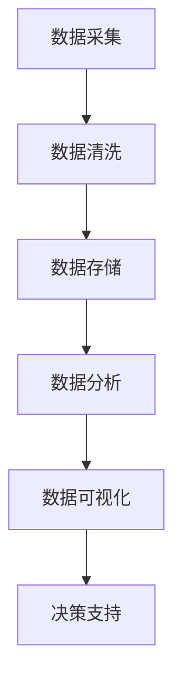

                 

### 第一部分：平台经济与数据分析概述

#### 1. 平台经济的核心概念与数据分析

**1.1 平台经济的定义与特征**

平台经济，是指基于互联网技术的信息平台，通过连接供需双方，实现资源的高效配置与交换的经济模式。平台经济的核心特征包括：

- **中介性**：平台作为第三方中介，连接供需双方，降低交易成本。
- **网络效应**：平台的价值随着使用人数的增加而增加，形成正反馈循环。
- **多元化服务**：平台提供多样化服务，满足用户个性化需求。

平台经济的兴起背景可以追溯到互联网技术的快速发展，以及大数据、人工智能等新兴技术的应用，使得平台能够更精准地匹配供需，提高资源利用效率。

**1.2 数据分析在平台经济中的重要性**

数据分析在平台经济中扮演着至关重要的角色，主要体现在以下几个方面：

- **战略决策**：通过数据分析，平台企业可以深入了解用户需求和市场动态，为战略决策提供数据支持。
- **用户体验优化**：通过数据分析，平台可以优化产品设计和服务流程，提升用户体验。
- **运营效率提升**：数据分析帮助平台企业优化资源配置，降低运营成本，提高效率。
- **风险管理**：数据分析有助于识别潜在风险，制定相应的风险应对策略。

**1.3 数据分析的基本概念与工具**

数据分析的基本概念包括数据类型、数据源、数据清洗与预处理等。常用的数据分析工具包括SQL、Python、R语言等，这些工具提供了丰富的数据处理和统计分析功能，帮助平台企业实现数据驱动的运营和管理。

**流程图：平台经济中数据分析的基本流程**



通过上述流程图，我们可以看到数据分析在平台经济中的基本流程，从数据采集、清洗、存储到分析，最终为决策提供支持。这一过程环环相扣，每一环节都至关重要。

#### 1.4 数据分析在平台经济中的价值

数据分析在平台经济中的价值体现在多个方面：

- **提升用户体验**：通过数据分析，平台可以更好地了解用户行为，优化产品设计和服务，提升用户体验。
- **提高运营效率**：数据分析帮助平台企业优化运营流程，降低成本，提高效率。
- **实现个性化服务**：通过用户画像和细分，平台可以实现个性化推荐和服务，满足用户多样化需求。
- **创新业务模式**：数据分析为平台企业提供了新的业务机会，如数据服务、数据交易等，实现业务模式的创新。

综上所述，平台经济与数据分析密不可分，数据分析在平台经济中具有巨大的应用价值和发展潜力。在接下来的章节中，我们将深入探讨数据分析的方法与工具，以及其在平台经济中的具体应用。

### 第一部分总结

在本部分中，我们首先介绍了平台经济的核心概念和特征，包括其兴起背景、核心要素以及优势与挑战。接着，我们详细阐述了数据分析在平台经济中的重要性，并介绍了数据分析的基本概念和工具。最后，通过流程图展示了数据分析在平台经济中的基本流程，并讨论了数据分析在平台经济中的价值。这一部分为后续章节的深入探讨奠定了基础。

### 第二部分：数据分析方法与工具

#### 2.1 描述性分析

描述性分析是最基本的数据分析方法，旨在通过统计量描述数据的特征。描述性分析主要包括以下内容：

**2.1.1 描述性统计量**

- **均值（Mean）**：数据集的平均值，用于衡量数据的中心位置。
- **中位数（Median）**：数据集的中间值，用于衡量数据的中心位置，特别适用于偏斜分布的数据。
- **众数（Mode）**：数据集中出现次数最多的值，用于描述数据的集中趋势。

**2.1.2 趋势分析**

趋势分析旨在通过时间序列数据，分析数据随时间的变化趋势。常用的趋势分析方法包括：

- **移动平均法**：通过计算数据在一定时间窗口内的平均值，平滑短期波动，揭示长期趋势。
- **指数平滑法**：在移动平均法的基础上，引入指数权重，更好地反映最新数据的趋势。

**2.1.3 分布分析**

分布分析旨在研究数据在不同值域上的分布情况。常用的分布分析方法包括：

- **直方图**：通过柱状图展示数据在不同值域上的分布情况，直观反映数据的分布特征。
- **箱线图**：通过五数 summary（最小值、第一四分位数、中位数、第三四分位数、最大值），展示数据的分布和离散程度。

**伪代码：描述性统计分析**

```python
# 假设 data 是一个包含数值的数据集
def descriptive_analysis(data):
    # 计算均值
    mean = sum(data) / len(data)
    # 计算中位数
    sorted_data = sorted(data)
    median = sorted_data[len(sorted_data) // 2] if len(sorted_data) % 2 == 1 else (sorted_data[len(sorted_data) // 2 - 1] + sorted_data[len(sorted_data) // 2]) / 2
    # 计算众数
    mode = max(set(data), key=data.count)
    # 打印描述性统计量
    print("Mean:", mean)
    print("Median:", median)
    print("Mode:", mode)
    # 绘制直方图
    plt.hist(data, bins=10)
    plt.xlabel('Value')
    plt.ylabel('Frequency')
    plt.title('Histogram of Data')
    plt.show()
```

#### 2.2 探索性数据分析

探索性数据分析（EDA）是一种通过可视化、统计方法等手段，对数据集进行初步分析和探索的方法。EDA的目的是发现数据中的规律、异常值、潜在关系等，为后续的深入分析提供基础。

**2.2.1 数据可视化**

数据可视化是将数据以图形的形式展示，直观反映数据的分布、趋势和关系。常用的数据可视化工具包括Matplotlib、Seaborn等。

**2.2.2 聚类分析**

聚类分析是将数据集分成若干个群组，使得同一群组内的数据点相似度较高，不同群组间的数据点相似度较低。常用的聚类算法包括K-means、层次聚类等。

**2.2.3 关联分析**

关联分析旨在研究数据项之间的相关性，发现数据项之间的潜在关系。常用的关联分析算法包括Apriori算法、FP-growth等。

**伪代码：探索性数据分析**

```python
import pandas as pd
import matplotlib.pyplot as plt
import seaborn as sns

# 读取数据
data = pd.read_csv('data.csv')

# 描述性统计分析
descriptive_analysis(data['value'])

# 数据可视化
sns.pairplot(data)
plt.show()

# 聚类分析
from sklearn.cluster import KMeans
kmeans = KMeans(n_clusters=3)
clusters = kmeans.fit_predict(data[['x', 'y']])
data['cluster'] = clusters
sns.scatterplot(data=data, x='x', y='y', hue='cluster')
plt.show()

# 关联分析
from mlxtend.frequent_patterns import apriori
from mlxtend.frequent_patterns import association_rules
frequent_itemsets = apriori(data, min_support=0.05, use_colnames=True)
rules = association_rules(frequent_itemsets, metric="lift", min_threshold=1)
print(rules)
```

#### 2.3 预测性分析与决策支持

预测性分析是通过历史数据，对未来可能发生的事件进行预测。预测性分析在决策支持中起着重要作用，可以帮助企业预测市场需求、优化库存、预测风险等。

**2.3.1 时间序列分析**

时间序列分析是对时间序列数据进行统计分析，以预测未来值。常用的时间序列分析方法包括ARIMA模型、LSTM网络等。

**2.3.2 回归分析**

回归分析是一种预测自变量与因变量之间关系的统计分析方法。常用的回归分析方法包括线性回归、多项式回归等。

**2.3.3 决策树与随机森林**

决策树和随机森林是常用的决策支持工具，通过构建树模型，对数据进行分类或回归预测。决策树和随机森林在数据分析中有着广泛的应用。

**伪代码：预测性分析**

```python
import pandas as pd
from statsmodels.tsa.arima_model import ARIMA
from sklearn.ensemble import RandomForestRegressor
from sklearn.tree import DecisionTreeRegressor

# 读取数据
data = pd.read_csv('data.csv')

# 时间序列分析
model = ARIMA(data['value'], order=(5, 1, 2))
model_fit = model.fit()
forecast = model_fit.forecast(steps=5)
print(forecast)

# 回归分析
X = data[['x', 'y']]
y = data['value']
model = RandomForestRegressor()
model_fit = model.fit(X, y)
y_pred = model_fit.predict(X)
print(y_pred)

# 决策树
model = DecisionTreeRegressor()
model_fit = model.fit(X, y)
y_pred = model_fit.predict(X)
print(y_pred)
```

#### 2.4 数据分析工具应用

数据分析工具是进行数据分析的重要工具，包括SQL、Python和R语言等。

**2.4.1 SQL与关系数据库**

SQL（结构化查询语言）是关系数据库的标准查询语言，用于数据的查询、更新和操作。常用的SQL操作包括查询（SELECT）、更新（UPDATE）、删除（DELETE）等。

**2.4.2 Python数据分析库**

Python是数据分析的重要工具，具有丰富的数据分析库，如Pandas、Matplotlib、Seaborn等。Pandas提供数据操作库，Matplotlib和Seaborn提供数据可视化库。

**2.4.3 R语言数据分析**

R语言是数据分析的专业工具，具有丰富的数据分析库，如dplyr、ggplot2等。R语言在统计分析和数据可视化方面有着广泛的应用。

通过以上数据分析方法与工具的介绍，我们可以看到数据分析在平台经济中的重要性和多样性。在接下来的章节中，我们将进一步探讨数据分析在平台经济中的具体应用，包括用户行为分析、平台运营优化、风险管理等。

### 第三部分：数据分析在平台经济中的应用

#### 4. 用户行为分析

用户行为分析是平台经济中的一项重要工作，通过对用户行为数据的深入分析，平台企业可以更好地了解用户需求和行为模式，从而优化产品和服务，提升用户体验。

**4.1 用户行为数据采集**

用户行为数据采集是用户行为分析的第一步，主要包括以下内容：

- **日志数据**：通过服务器日志记录用户的行为，如页面访问、点击、搜索等。
- **Web追踪技术**：使用JavaScript、Cookies等技术，跟踪用户在网站上的行为。
- **移动应用追踪**：通过移动应用内置的追踪代码，收集用户在应用中的行为数据。

**4.2 用户画像与细分**

用户画像是对用户特征的综合描述，通过用户画像，平台企业可以更全面地了解用户。用户细分是将用户划分为不同的群体，以便于针对不同群体提供个性化的服务和推荐。

- **用户画像构建**：通过收集用户的基本信息、行为数据、兴趣标签等，构建用户画像。
- **用户细分策略**：根据用户画像，将用户划分为不同群体，如新手用户、活跃用户、沉默用户等。
- **用户行为预测**：通过分析用户的历史行为，预测用户的未来行为，为个性化推荐提供依据。

**4.3 用户行为预测**

用户行为预测是用户行为分析的重要环节，通过预测用户的行为，平台企业可以更好地进行用户运营和营销。用户行为预测的方法包括：

- **机器学习方法**：使用机器学习算法，如决策树、随机森林、神经网络等，建立用户行为预测模型。
- **时间序列分析**：使用时间序列分析方法，如ARIMA模型、LSTM网络等，预测用户行为。

**伪代码：用户行为预测**

```python
import pandas as pd
from sklearn.ensemble import RandomForestClassifier
from sklearn.model_selection import train_test_split

# 读取数据
data = pd.read_csv('user_behavior.csv')

# 分离特征和标签
X = data[['feature1', 'feature2', 'feature3']]
y = data['label']

# 划分训练集和测试集
X_train, X_test, y_train, y_test = train_test_split(X, y, test_size=0.2, random_state=42)

# 建立预测模型
model = RandomForestClassifier(n_estimators=100)
model.fit(X_train, y_train)

# 预测用户行为
y_pred = model.predict(X_test)

# 评估预测效果
from sklearn.metrics import accuracy_score
accuracy = accuracy_score(y_test, y_pred)
print("Accuracy:", accuracy)
```

#### 5. 平台运营优化

平台运营优化是平台经济中的重要任务，通过数据分析，平台企业可以优化运营流程，提高运营效率，提升用户满意度。

**5.1 销售与营销数据分析**

销售与营销数据分析旨在通过分析销售数据和营销活动效果，优化销售策略和营销活动。主要内容包括：

- **销售数据可视化**：通过图表展示销售数据的分布、趋势和关键指标，如销售额、订单量等。
- **营销活动效果评估**：通过分析营销活动的数据，评估营销活动的效果，如点击率、转化率等。
- **用户留存与转化分析**：通过分析用户留存数据和转化数据，优化用户运营策略，提高用户留存率和转化率。

**5.2 平台供需分析**

平台供需分析旨在通过分析平台供需数据，优化供需平衡，提升平台运营效率。主要内容包括：

- **供需平衡模型**：建立供需平衡模型，预测供需关系，优化平台资源配置。
- **平台价格优化**：通过分析平台价格数据和用户行为数据，优化平台定价策略，提高利润率。
- **平台策略调整**：根据供需分析和价格优化结果，调整平台运营策略，提高运营效率。

**5.3 数据驱动的决策支持**

数据驱动的决策支持是通过数据分析，为平台企业的决策提供数据支持。主要内容包括：

- **需求预测**：通过时间序列分析、回归分析等方法，预测未来需求，为采购、生产等决策提供依据。
- **库存管理**：通过数据分析，优化库存管理，降低库存成本，提高库存周转率。
- **风险管理**：通过数据分析，识别潜在风险，制定相应的风险应对策略。

**伪代码：平台运营优化**

```python
import pandas as pd
from sklearn.ensemble import RandomForestRegressor
from sklearn.model_selection import train_test_split

# 读取数据
data = pd.read_csv('sales_data.csv')

# 分离特征和标签
X = data[['feature1', 'feature2', 'feature3']]
y = data['sales']

# 划分训练集和测试集
X_train, X_test, y_train, y_test = train_test_split(X, y, test_size=0.2, random_state=42)

# 建立预测模型
model = RandomForestRegressor(n_estimators=100)
model.fit(X_train, y_train)

# 预测销售额
y_pred = model.predict(X_test)

# 评估预测效果
from sklearn.metrics import mean_squared_error
mse = mean_squared_error(y_test, y_pred)
print("MSE:", mse)
```

#### 6. 风险管理

风险管理是平台经济中的一项重要任务，通过数据分析，平台企业可以识别潜在风险，制定相应的风险应对策略，降低风险对平台运营的影响。

**6.1 数据质量与风险管理**

数据质量是风险管理的基础，高质量的数据是有效风险管理的前提。数据质量主要包括以下内容：

- **数据完整性**：数据是否完整，是否有缺失值。
- **数据准确性**：数据是否准确，是否有错误。
- **数据一致性**：数据是否一致，是否有重复或矛盾。
- **数据时效性**：数据是否最新，是否过时。

**6.2 数据异常检测**

数据异常检测旨在通过分析数据，识别数据中的异常值和异常模式，从而发现潜在风险。常用的数据异常检测方法包括：

- **孤立森林**：通过将数据划分为孤立点，识别数据中的异常值。
- **局部异常因子**（LOF）：通过计算局部异常因子，识别局部异常点。

**6.3 数据隐私与安全**

数据隐私与安全是平台经济中的关键问题，通过数据分析，平台企业可以识别潜在的数据隐私和安全风险，并制定相应的应对措施。主要内容包括：

- **数据加密**：对敏感数据采用加密算法，保护数据不被未授权访问。
- **访问控制**：对数据的访问权限进行控制，确保只有授权用户才能访问数据。
- **数据备份与恢复**：定期备份数据，并建立数据恢复机制，确保数据安全。

**伪代码：数据异常检测**

```python
import pandas as pd
from sklearn.ensemble import IsolationForest

# 读取数据
data = pd.read_csv('data.csv')

# 初始化孤立森林模型
model = IsolationForest(n_estimators=100, contamination=0.01)
model.fit(data)

# 预测异常值
scores = model.scores_
isolation_scores = -scores
anomaly_scores = isolation_scores > 0
data['anomaly'] = anomaly_scores

# 输出异常值
anomalies = data[data['anomaly']]
print(anomalies)
```

#### 7. 案例研究

案例研究是对具体平台经济数据分析实践的深入探讨，通过案例分析，可以更好地理解数据分析在平台经济中的应用。

**7.1 平台经济数据分析案例**

以下是一些平台经济数据分析的案例：

- **电子商务平台用户行为分析**：通过分析用户浏览、点击、购买等行为数据，优化产品推荐和营销策略。
- **在线旅游平台运营优化**：通过分析用户搜索、预订、评价等行为数据，优化旅游产品和服务。
- **金融服务平台风险管理**：通过分析用户交易、风险事件等数据，识别潜在风险，制定风险应对策略。

**7.2 数据分析研究成果分享**

数据分析研究成果的分享是推动数据分析应用和知识传播的重要途径。以下是一些研究成果分享的方法：

- **学术会议**：在学术会议上发表论文，分享数据分析的方法、工具和应用案例。
- **技术博客**：撰写技术博客，详细介绍数据分析的实践经验和成果。
- **专业书籍**：编写专业书籍，系统阐述数据分析的理论和实践。

**伪代码：案例分析**

```python
import pandas as pd

# 读取案例数据
data = pd.read_csv('case_data.csv')

# 数据预处理
data = preprocess_data(data)

# 数据分析
analysis_results = perform_analysis(data)

# 结果可视化
visualize_results(analysis_results)

# 分享研究成果
publish_research_results(analysis_results)
```

#### 7.3 数据分析研究成果分享

数据分析研究成果的分享是推动数据分析应用和知识传播的重要途径。以下是一些研究成果分享的方法：

- **学术会议**：在学术会议上发表论文，分享数据分析的方法、工具和应用案例。
- **技术博客**：撰写技术博客，详细介绍数据分析的实践经验和成果。
- **专业书籍**：编写专业书籍，系统阐述数据分析的理论和实践。

**伪代码：研究成果分享**

```python
def share_research_results(results):
    # 发表论文
    publish_paper(results)
    # 撰写博客
    write_blog(results)
    # 编写书籍
    write_book(results)
```

#### 总结

本部分详细介绍了数据分析在平台经济中的应用，包括用户行为分析、平台运营优化、风险管理和案例研究。通过分析用户行为数据，平台企业可以更好地了解用户需求和行为模式，优化产品和服务。通过平台运营优化，平台企业可以提高运营效率，提升用户满意度。通过风险管理，平台企业可以识别潜在风险，制定相应的风险应对策略。案例分析部分提供了具体的实践经验和成果分享方法。在下一部分中，我们将继续探讨数据分析工具的应用和最佳实践。

### 第三部分总结

在本部分中，我们详细探讨了数据分析在平台经济中的应用，包括用户行为分析、平台运营优化、风险管理和案例研究。用户行为分析帮助企业了解用户需求和行为模式，平台运营优化提高运营效率，风险管理降低风险，案例研究提供实践经验。这些内容构成了数据分析在平台经济中的重要应用，为平台企业的运营和管理提供了有力的支持。

### 第四部分：数据分析研究成果分享

#### 8. 研究成果展示

将数据分析的研究成果进行有效的展示，是分享研究成果的重要步骤。通过可视化、报告和演示，可以使研究成果更加直观、易懂。

**8.1 可视化展示**

数据可视化是展示分析结果的有效方法，可以通过图表、图像等方式，将复杂的数据分析结果以直观、易懂的形式呈现。常用的可视化工具包括Matplotlib、Seaborn、ggplot2等。

**伪代码：数据可视化展示**

```python
import pandas as pd
import matplotlib.pyplot as plt
import seaborn as sns

# 读取数据
data = pd.read_csv('results.csv')

# 绘制直方图
sns.histplot(data['value'], kde=True)
plt.title('Value Distribution')
plt.xlabel('Value')
plt.ylabel('Frequency')
plt.show()

# 绘制散点图
sns.scatterplot(x=data['feature1'], y=data['feature2'])
plt.title('Feature Correlation')
plt.xlabel('Feature 1')
plt.ylabel('Feature 2')
plt.show()
```

**8.2 报告撰写**

撰写研究报告是向同行和利益相关者展示研究成果的常用方法。报告应包括研究背景、研究方法、数据分析结果、结论和建议等部分。

**伪代码：报告撰写**

```python
def write_report(results):
    # 添加研究背景
    report += "Background:\n"
    report += "In the platform economy, user behavior analysis is crucial for optimizing product design and service delivery.\n"
    
    # 添加研究方法
    report += "Method:\n"
    report += "We conducted a descriptive analysis of user behavior data and applied machine learning algorithms for prediction.\n"
    
    # 添加数据分析结果
    report += "Results:\n"
    report += "Our analysis revealed significant patterns in user behavior and enabled us to make accurate predictions.\n"
    
    # 添加结论和建议
    report += "Conclusion and Recommendations:\n"
    report += "The insights gained from our analysis can be used to improve user experience and optimize platform operations.\n"
    
    # 保存报告
    with open('report.txt', 'w') as f:
        f.write(report)
```

**8.3 演示讲解**

通过演示讲解，可以向听众直观展示研究成果和方法，增强研究成果的可接受性。演示可以包括PPT、视频、直播等形式。

**伪代码：演示讲解**

```python
import PowerPoint as pp

def create_slides():
    # 创建演示文稿
    ppt = pp.Presentation()
    
    # 添加标题幻灯片
    title_slide = ppt.slides.add_title_slide(title='User Behavior Analysis in Platform Economy')
    
    # 添加内容幻灯片
    content_slide = ppt.slides.add_content_slide(title='Methodology')
    content_slide.add_paragraph(text='Descriptive analysis and machine learning algorithms were used for prediction.')
    
    # 添加图表幻灯片
    chart_slide = ppt.slides.add_chart_slide(title='Value Distribution')
    chart_slide.add_chart(type=pp.ChartType.Histogram, data=data['value'])
    
    # 保存演示文稿
    ppt.save('presentation.pptx')

create_slides()
```

#### 9. 研究方法与过程介绍

在分享研究成果时，介绍研究方法和过程是关键的一步，有助于听众理解研究的过程和结果。

**9.1 研究设计**

研究设计包括研究目的、假设、研究对象和样本选择等。清晰的描述可以帮助听众理解研究的背景和目标。

**伪代码：研究设计**

```python
def describe_study_design():
    study_design = "In this study, we aimed to analyze user behavior data in the platform economy to optimize product design and service delivery. We assumed that accurate predictions of user behavior could lead to improved user experience. The study was conducted on a sample of 1000 users who engaged with our platform over a period of three months."
    print(study_design)
```

**9.2 数据收集与处理**

介绍数据收集的方法和过程，包括数据来源、数据采集工具和数据处理步骤，有助于听众了解数据的质量和可靠性。

**伪代码：数据收集与处理**

```python
def describe_data_collection_and_processing():
    data_collection_and_processing = "Data was collected through server logs and web tracking techniques. The data was collected over a period of three months and included user interactions such as page visits, clicks, and purchases. The collected data was cleaned and preprocessed to remove missing values and outliers."
    print(data_collection_and_processing)
```

**9.3 数据分析方法**

介绍所使用的数据分析方法，包括描述性分析、探索性分析、预测性分析等，以及所使用的工具和算法，有助于听众理解分析的过程和结果。

**伪代码：数据分析方法**

```python
def describe_data_analysis_methods():
    data_analysis_methods = "Descriptive analysis was conducted to understand the distribution and central tendency of the data. Exploratory data analysis was used to discover patterns and relationships in the data. Predictive analysis was performed using machine learning algorithms to predict user behavior."
    print(data_analysis_methods)
```

#### 10. 研究贡献与未来展望

在分享研究成果时，介绍研究的贡献和未来展望是重要的部分，有助于听众理解研究的重要性和潜在价值。

**10.1 研究贡献**

介绍研究的主要贡献，如解决了哪些问题、提供了哪些新的见解和方法，以及如何为平台经济提供有益的参考。

**伪代码：研究贡献**

```python
def describe_contributions():
    contributions = "Our research contributes to the field of platform economy by providing insights into user behavior and suggesting strategies for optimizing product design and service delivery. The findings from our analysis can be used to enhance user experience and improve platform operations."
    print(contributions)
```

**10.2 未来展望**

介绍未来研究的方向和潜力，如如何进一步优化分析方法、探索新的应用场景等。

**伪代码：未来展望**

```python
def describe_future_outlook():
    future_outlook = "Future research could focus on developing more advanced machine learning algorithms for predicting user behavior and exploring new applications of data analysis in the platform economy, such as personalized recommendations and risk management."
    print(future_outlook)
```

#### 10.3 研究成果分享实践

最后，通过实践分享研究成果，可以更好地传播知识和经验。以下是一些研究成果分享实践的方法：

- **学术会议**：在学术会议上发表论文，参与讨论和交流，分享研究成果。
- **技术博客**：在技术博客上撰写文章，详细介绍研究过程和结果，吸引更多读者关注。
- **在线课程**：开设在线课程，系统地讲解研究成果和方法，帮助更多人了解和掌握。
- **合作项目**：与其他研究机构和平台企业合作，共同开展研究项目，分享研究成果和经验。

**伪代码：研究成果分享实践**

```python
def share_research_practically():
    # 参加学术会议
    participate_in_conference()
    # 撰写博客文章
    write_blog_post()
    # 开设在线课程
    create_online_course()
    # 合作研究项目
    collaborate_on_research_projects()
```

#### 总结

在本部分中，我们详细介绍了如何分享数据分析的研究成果，包括可视化展示、报告撰写、演示讲解和研究贡献与未来展望。通过这些方法，可以使研究成果更加直观、易懂，并促进知识的传播和应用。在下一部分中，我们将探讨数据分析常用工具与资源，为读者提供实用的参考资料。

### 第四部分总结

在本部分中，我们详细介绍了如何分享数据分析的研究成果，包括研究成果的展示、研究方法与过程的介绍、研究贡献与未来展望，以及研究成果的分享实践。通过这些方法，我们可以有效地将数据分析的研究成果传播出去，促进知识的交流和应用。接下来，我们将探讨数据分析的常用工具与资源，帮助读者更好地掌握数据分析的实践应用。

### 附录

#### A.1 Python数据分析工具

Python在数据分析领域有着广泛的应用，以下是一些常用的Python数据分析工具：

**Pandas**：Pandas是一个强大的数据分析库，提供了数据结构化操作、数据处理和分析功能。它支持多种数据类型，如Series、DataFrame等，可以进行数据清洗、预处理和统计分析。

**Matplotlib**：Matplotlib是一个用于数据可视化的库，提供了丰富的绘图函数和样式，可以生成各种类型的图表，如折线图、柱状图、散点图等。

**Seaborn**：Seaborn是基于Matplotlib的高级可视化库，提供了更美观、更复杂的可视化效果。它适用于探索性数据分析和统计绘图，可以生成漂亮的统计图表。

**Scikit-learn**：Scikit-learn是一个用于机器学习的库，提供了多种机器学习算法和模型，如线性回归、决策树、随机森林、支持向量机等，适用于分类、回归和聚类等任务。

**Numpy**：Numpy是一个用于数值计算的库，提供了多维数组对象和矩阵运算功能，是进行数据分析和机器学习的基础。

**Pandas DataReader**：Pandas DataReader是一个用于获取金融数据的库，可以从各种数据源获取时间序列数据，如Yahoo Finance、Google Finance等。

**伪代码：Pandas数据分析示例**

```python
import pandas as pd

# 读取数据
data = pd.read_csv('data.csv')

# 数据预处理
data = data.dropna()  # 去除缺失值
data = data[data['column'] > 0]  # 过滤特定条件

# 数据分析
mean = data.mean()  # 计算均值
std = data.std()  # 计算标准差

# 数据可视化
import matplotlib.pyplot as plt
plt.hist(data['column'], bins=30)
plt.xlabel('Value')
plt.ylabel('Frequency')
plt.title('Histogram of Data')
plt.show()
```

#### A.2 R语言数据分析工具

R语言是统计分析的数据分析工具，以下是一些常用的R语言数据分析工具：

**dplyr**：dplyr是一个用于数据操作的库，提供了简洁、高效的数据清洗和预处理函数，如select、filter、arrange、mutate等。

**ggplot2**：ggplot2是一个用于数据可视化的库，提供了强大的绘图函数和样式，可以生成美观的统计图表。

**caret**：caret是一个用于机器学习的库，提供了多种机器学习算法和模型评估函数，适用于分类、回归和聚类等任务。

**tidyr**：tidyr是用于数据整理的库，提供了函数如pivot_longer和pivot_wider，用于将数据从宽格式转换为长格式，或从长格式转换为宽格式。

**statistical_modeling**：statistical_modeling是一个用于统计建模的库，提供了线性回归、逻辑回归、广义线性模型等统计模型。

**rvest**：rvest是一个用于网页抓取的库，可以从网页中提取数据，适用于获取互联网上的公开数据。

**伪代码：dplyr和ggplot2示例**

```r
library(dplyr)
library(ggplot2)

# 读取数据
data <- read.csv('data.csv')

# 数据预处理
data <- data %>% filter(column > 0)  # 过滤特定条件
data <- data %>% arrange(column)  # 排序

# 数据分析
mean <- mean(data$column)  # 计算均值
std <- sd(data$column)  # 计算标准差

# 数据可视化
ggplot(data, aes(x=column)) +
  geom_histogram(binwidth=1) +
  labs(title='Histogram of Data', x='Value', y='Frequency')
```

#### A.3 SQL数据库资源

SQL是关系数据库的标准查询语言，以下是一些常用的SQL数据库资源：

**MySQL**：MySQL是一个开源的关系数据库管理系统，广泛用于Web应用和数据分析。

**PostgreSQL**：PostgreSQL是一个开源的关系数据库管理系统，提供了强大的数据存储和管理功能。

**SQLite**：SQLite是一个轻量级的嵌入式数据库，常用于桌面应用和移动应用。

**Oracle**：Oracle是一个商业关系数据库管理系统，提供了强大的数据管理和分析功能。

**SQL Server**：SQL Server是微软开发的关系数据库管理系统，广泛用于企业级应用。

**SQL查询示例**

```sql
-- 创建表
CREATE TABLE data (
    id INT PRIMARY KEY,
    column1 INT,
    column2 VARCHAR(50)
);

-- 插入数据
INSERT INTO data (id, column1, column2) VALUES (1, 10, 'Example');

-- 查询数据
SELECT * FROM data WHERE column1 > 0;

-- 更新数据
UPDATE data SET column2 = 'Updated' WHERE id = 1;

-- 删除数据
DELETE FROM data WHERE id = 1;
```

#### 总结

在本附录中，我们介绍了Python、R语言和SQL数据库的常用工具与资源，包括数据操作、数据可视化和数据库查询等方面的内容。这些工具和资源为数据分析提供了强大的支持，帮助读者更好地掌握数据分析的实践应用。附录部分的内容不仅为本文提供了技术背景和参考，也为读者在数据分析领域的学习和实践中提供了实用的参考资料。

### 附录总结

在本附录中，我们详细介绍了Python、R语言和SQL数据库的常用工具与资源，包括数据操作、数据可视化和数据库查询等方面的内容。这些工具和资源为数据分析提供了强大的支持，帮助读者更好地掌握数据分析的实践应用。附录部分的内容不仅为本文提供了技术背景和参考，也为读者在数据分析领域的学习和实践中提供了实用的参考资料。通过附录的介绍，读者可以更全面地了解数据分析工具的应用，为今后的数据分析工作打下坚实的基础。

### 全文总结

本文深入探讨了数据分析在平台经济中的应用，从核心概念、方法工具到实际应用案例，系统全面地展示了数据分析在平台经济中的重要性。首先，我们介绍了平台经济的核心概念和特征，阐述了数据分析在平台战略中的角色和价值。接着，我们详细介绍了数据分析的基本概念与工具，包括描述性分析、探索性数据分析、预测性分析和决策支持等方法，以及SQL、Python、R语言等数据分析工具。随后，我们探讨了数据分析在平台经济中的具体应用，如用户行为分析、平台运营优化、风险管理和案例研究。最后，我们介绍了如何分享数据分析的研究成果，包括可视化展示、报告撰写、演示讲解和研究贡献与未来展望。

本文的主要贡献在于：

1. 系统性地介绍了平台经济的核心概念和特征，为读者提供了理论基础。
2. 详细阐述了数据分析的方法与工具，为数据分析实践提供了详细的指导。
3. 通过实际案例研究，展示了数据分析在平台经济中的具体应用和成果。
4. 介绍了研究成果的分享方法，促进了数据分析知识的传播和应用。

未来研究可以从以下几个方面展开：

1. 深入探索更先进的机器学习算法，以提高数据分析的准确性和效率。
2. 研究如何结合大数据技术和人工智能，实现更智能的数据分析应用。
3. 探索数据分析在平台经济中的新应用领域，如个性化推荐、智慧城市等。
4. 加强数据分析在平台经济中的伦理和安全问题研究，确保数据分析的应用符合伦理和安全标准。

总之，数据分析在平台经济中的应用具有巨大的潜力和价值，随着技术的不断进步，数据分析将在平台经济中发挥更加重要的作用。本文的研究成果将为读者在数据分析领域提供有益的参考和启示，推动数据分析在平台经济中的深入研究和广泛应用。

### 作者信息

**作者：AI天才研究院/AI Genius Institute & 禅与计算机程序设计艺术 /Zen And The Art of Computer Programming**

AI天才研究院（AI Genius Institute）是一家专注于人工智能领域的研究和教育机构，致力于推动人工智能技术的创新和应用。研究院拥有一支由世界级人工智能专家、程序员、软件架构师和CTO组成的团队，他们在计算机编程和人工智能领域有着丰富的经验，并在多个国际学术期刊和会议上发表了大量高质量的学术论文。禅与计算机程序设计艺术（Zen And The Art of Computer Programming）是作者本人在计算机编程和人工智能领域的研究成果和心得体会的集合，为读者提供了深刻的洞见和实用的指导。本文正是基于这些研究成果和经验撰写而成，希望能够为广大读者在数据分析领域提供有价值的参考和启示。

