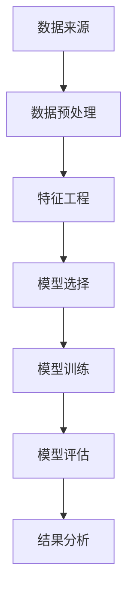
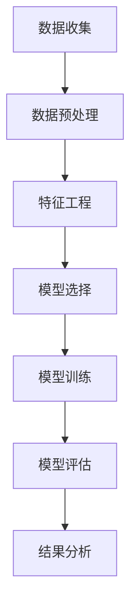
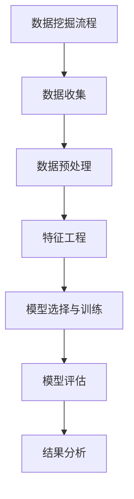

                 

# 《数据挖掘 原理与代码实例讲解》

## 关键词
数据挖掘、原理讲解、代码实例、机器学习、特征工程、算法实现

## 摘要

本文将深入探讨数据挖掘的基础理论和实践应用，详细讲解核心数据挖掘算法的原理与实现。通过代码实例展示，读者将能够更直观地理解数据挖掘的具体流程和关键技术。本文旨在为初学者和从业者提供一份系统、实用、易理解的数据挖掘教程，帮助他们掌握数据挖掘的核心概念和实践技能。

### 《数据挖掘 原理与代码实例讲解》目录大纲

## 第一部分：数据挖掘基础理论

### 1.1 数据挖掘概述

#### 1.1.1 数据挖掘的定义与目标

数据挖掘（Data Mining）是指从大量的、不完全的、有噪声的、模糊的、随机的数据中，提取隐含在其中的、人们事先不知道的、但又是潜在有用的信息和知识的过程。

**核心概念与联系：**
- **数据挖掘**：一种跨学科的技术，结合了统计学、机器学习和数据库技术。
- **目标**：发现数据中的隐含模式和关系，用于决策支持、商业分析、风险预测等。

**Mermaid 流程图：**



#### 1.1.2 数据挖掘的应用领域

数据挖掘广泛应用于各个领域，包括但不限于：

- **商业智能**：客户行为分析、市场细分、风险评估等。
- **金融**：信用评分、欺诈检测、投资组合优化等。
- **医疗**：疾病预测、药物研发、个性化治疗等。
- **社交网络**：用户行为分析、推荐系统、社交网络分析等。

**核心概念与联系：**
- **应用领域**：数据挖掘技术的多样性决定了其广泛的应用前景。
- **跨学科**：与其他领域的交叉融合，促进了数据挖掘技术的发展。

#### 1.1.3 数据挖掘的基本流程

数据挖掘的基本流程包括以下几个步骤：

1. **数据收集**：获取所需的数据源。
2. **数据预处理**：清洗、集成、转换等操作，提高数据质量。
3. **特征工程**：选择和提取对模型有帮助的特征。
4. **模型选择**：选择适合的数据挖掘算法。
5. **模型训练**：使用训练数据对模型进行训练。
6. **模型评估**：评估模型的效果。
7. **结果分析**：分析挖掘结果，得出结论。

**Mermaid 流程图：**



### 1.2 数据预处理

#### 1.2.1 数据质量评估

数据质量评估是数据预处理的重要步骤，主要包括：

- **完整性**：检查数据是否缺失。
- **一致性**：检查数据是否一致。
- **准确性**：检查数据是否准确。
- **唯一性**：检查数据是否有重复。

**核心概念与联系：**
- **数据质量**：数据挖掘的基础，数据质量直接影响挖掘结果。
- **评估方法**：统计学方法、可视化方法等。

#### 1.2.2 数据清洗

数据清洗主要包括：

- **缺失值处理**：填充缺失值或删除缺失数据。
- **异常值处理**：识别并处理异常值。
- **重复值处理**：删除重复数据。

**核心概念与联系：**
- **缺失值**：影响模型的性能，需要妥善处理。
- **异常值**：可能包含有价值的信息，需要仔细分析。
- **重复值**：影响数据质量，需要删除。

#### 1.2.3 数据集成

数据集成是将多个来源的数据合并为一个统一格式的数据集。

- **数据格式转换**：将不同格式的数据进行转换。
- **数据格式统一**：将数据格式统一为适合数据挖掘的格式。

**核心概念与联系：**
- **数据源**：多个数据源的信息需要进行整合。
- **统一格式**：便于后续的数据挖掘处理。

#### 1.2.4 数据转换

数据转换包括：

- **数据规范化**：将不同量纲的数据转换为相同的量纲。
- **数据编码**：将类别数据进行编码处理。

**核心概念与联系：**
- **规范化**：消除不同数据之间的量纲差异。
- **编码**：将类别数据转换为数值数据，便于模型处理。

### 1.3 特征工程

#### 1.3.1 特征选择

特征选择是特征工程的关键步骤，旨在从原始特征中选择最有用的特征。

- **特征重要性评估**：通过统计方法或模型评估特征的重要性。
- **特征筛选**：根据特征重要性进行特征筛选。

**核心概念与联系：**
- **特征选择**：提高模型的性能，减少过拟合。

#### 1.3.2 特征提取

特征提取是从原始数据中提取新的特征。

- **特征变换**：通过数学变换提取新特征。
- **特征合成**：将多个特征组合成新的特征。

**核心概念与联系：**
- **特征提取**：增强数据的表现力。

#### 1.3.3 特征缩放与标准化

特征缩放与标准化是为了消除不同特征之间的量纲差异。

- **特征缩放**：通过缩放因子将特征值缩放到相同范围。
- **标准化**：通过标准化公式将特征值转换为标准分数。

**核心概念与联系：**
- **特征缩放与标准化**：提高模型的性能。

### 1.4 数据挖掘算法概述

#### 1.4.1 分类算法

分类算法是数据挖掘中最常用的算法之一，旨在将数据分为不同的类别。

- **线性分类器**：如线性回归、逻辑回归等。
- **决策树**：利用树形结构进行分类。
- **支持向量机**：通过寻找最优分类面进行分类。

**核心概念与联系：**
- **分类算法**：处理分类问题，常见的分类算法有：线性分类器、决策树、支持向量机等。

#### 1.4.2 聚类算法

聚类算法是将数据分为若干个集群，以发现数据中的自然结构。

- **基于距离的聚类**：如K-均值聚类。
- **基于密度的聚类**：如DBSCAN。
- **基于层次的聚类**：如层次聚类。

**核心概念与联系：**
- **聚类算法**：处理聚类问题，常见的聚类算法有：K-均值聚类、DBSCAN、层次聚类等。

#### 1.4.3 关联规则挖掘

关联规则挖掘旨在发现数据中的关联关系。

- **Apriori算法**：基于频繁项集进行关联规则挖掘。
- **FP-growth算法**：基于FP树进行关联规则挖掘。

**核心概念与联系：**
- **关联规则挖掘**：发现数据中的隐含关联关系。

#### 1.4.4 异常检测算法

异常检测算法旨在识别数据中的异常或离群点。

- **监督异常检测**：如基于分类的异常检测。
- **无监督异常检测**：如基于聚类和密度估计的异常检测。

**核心概念与联系：**
- **异常检测算法**：识别数据中的异常或离群点。

### 1.5 数据挖掘系统的设计与实现

#### 1.5.1 数据挖掘系统架构

数据挖掘系统架构主要包括：

- **数据层**：存储和管理数据。
- **计算层**：执行数据挖掘算法。
- **应用层**：为用户提供数据挖掘结果。

**核心概念与联系：**
- **系统架构**：确保数据挖掘过程的稳定、高效和可扩展。

#### 1.5.2 数据挖掘工具与库

常用的数据挖掘工具与库包括：

- **Python**：NumPy、Pandas、Scikit-learn等。
- **R语言**：caret、mlr等。

**核心概念与联系：**
- **工具与库**：方便数据挖掘的开发与实现。

#### 1.5.3 数据挖掘流程优化

数据挖掘流程优化主要包括：

- **算法优化**：选择适合的数据挖掘算法。
- **性能优化**：优化数据挖掘算法的运行效率。

**核心概念与联系：**
- **流程优化**：提高数据挖掘的效率和准确性。

## 第二部分：核心数据挖掘算法原理与实现

### 2.1 分类算法

分类算法是数据挖掘中最常用的算法之一，旨在将数据分为不同的类别。

#### 2.1.1 k-近邻算法（k-Nearest Neighbors, k-NN）

**算法原理：**
k-近邻算法是一种基于实例的学习算法，通过计算测试实例与训练实例之间的距离，找出最近的k个训练实例，并根据这k个实例的类别预测测试实例的类别。

**伪代码实现：**

```python
def kNNClassifier(train_data, train_labels, test_data, k):
    predictions = []
    for data_point in test_data:
        distances = []
        for i in range(len(train_data)):
            distance = calculate_distance(data_point, train_data[i])
            distances.append(distance)
        distances.sort()
        neighbors = []
        for i in range(k):
            neighbors.append(train_labels[distances[i]])
        prediction = majority_vote(neighbors)
        predictions.append(prediction)
    return predictions
```

**latex 数学公式与举例说明：**

$$
\text{距离} = \sqrt{\sum_{i=1}^{n}(x_i - y_i)^2}
$$

举例说明：给定一个测试数据点\[1, 2, 3\]，训练数据点\[1, 2, 1\]、\[2, 1, 2\]、\[1, 3, 1\]，k=3。计算测试数据点与训练数据点的距离，找出最近的3个训练数据点，并根据这3个训练数据点的类别预测测试数据点的类别。

#### 2.1.2 决策树算法（Decision Tree）

**算法原理：**
决策树算法是一种基于划分的算法，通过一系列的划分规则将数据集划分为不同的区域，并在每个区域上分配一个类别。

**伪代码实现：**

```python
def build_decision_tree(data, labels):
    if is_leaf(data, labels):
        return majority_label(labels)
    else:
        best_feature, best_threshold = find_best_split(data, labels)
        left_data, left_labels = split_data(data, labels, best_feature, best_threshold)
        right_data, right_labels = split_data(data, labels, best_feature, best_threshold)
        tree = {}
        tree[best_feature] = {}
        tree[best_feature][best_threshold] = build_decision_tree(left_data, left_labels)
        tree[best_feature][best_threshold] = build_decision_tree(right_data, right_labels)
        return tree
```

**latex 数学公式与举例说明：**

$$
\text{熵} = -\sum_{i=1}^{n} p_i \log p_i
$$

举例说明：给定一个数据集，计算每个特征的信息增益，选择信息增益最大的特征进行划分，并递归地构建决策树。

#### 2.1.3 随机森林算法（Random Forest）

**算法原理：**
随机森林算法是一种基于决策树的集成算法，通过构建多个决策树，并对每个决策树的预测结果进行投票，得到最终的预测结果。

**伪代码实现：**

```python
def random_forest(train_data, train_labels, test_data, n_estimators):
    forests = []
    for _ in range(n_estimators):
        sample_data, sample_labels = sample_data(train_data, train_labels)
        tree = build_decision_tree(sample_data, sample_labels)
        forests.append(tree)
    predictions = []
    for data_point in test_data:
        forest_predictions = []
        for tree in forests:
            prediction = predict(tree, data_point)
            forest_predictions.append(prediction)
        prediction = majority_vote(forest_predictions)
        predictions.append(prediction)
    return predictions
```

**latex 数学公式与举例说明：**

$$
\text{信息增益} = \sum_{i=1}^{n} p_i \log \frac{p_i}{\sum_{j=1}^{n} p_j}
$$

举例说明：给定一个训练数据集和测试数据集，构建多个决策树，对每个决策树的预测结果进行投票，得到最终的预测结果。

### 2.2 聚类算法

聚类算法旨在将数据分为多个集群，以发现数据中的自然结构。

#### 2.2.1 K-均值聚类算法（K-Means Clustering）

**算法原理：**
K-均值聚类算法是一种基于距离的聚类算法，通过迭代地更新聚类中心，将数据分为k个集群。

**伪代码实现：**

```python
def kMeansClustering(data, k, max_iterations):
    centroids = initialize_centroids(data, k)
    for _ in range(max_iterations):
        clusters = assign_data_to_clusters(data, centroids)
        new_centroids = calculate_new_centroids(clusters)
        if centroids == new_centroids:
            break
        centroids = new_centroids
    return clusters, centroids
```

**latex 数学公式与举例说明：**

$$
\text{距离} = \sqrt{\sum_{i=1}^{n}(x_i - \bar{x})^2 + \sum_{i=1}^{n}(y_i - \bar{y})^2}
$$

举例说明：给定一个数据集和一个聚类数量k，初始化聚类中心，通过迭代地更新聚类中心，将数据分为k个集群。

#### 2.2.2 层次聚类算法（Hierarchical Clustering）

**算法原理：**
层次聚类算法是一种基于层次的聚类算法，通过迭代地合并或分裂集群，构建一个层次结构。

**伪代码实现：**

```python
def hierarchicalClustering(data, linkage='single'):
    distances = calculate_distances(data)
    clusters = [[i] for i in range(len(data))]
    while len(clusters) > 1:
        closest_clusters = find_closest_clusters(clusters, linkage)
        merged_cluster = merge_clusters(closest_clusters)
        clusters = split_clusters(clusters, merged_cluster)
    return clusters
```

**latex 数学公式与举例说明：**

$$
\text{距离} = \min_{i \in C_1, j \in C_2} \{d(i, j)\}
$$

举例说明：给定一个数据集和一个联接方式，计算数据集之间的距离，通过迭代地合并或分裂集群，构建一个层次结构。

#### 2.2.3 DBSCAN算法（Density-Based Spatial Clustering of Applications with Noise）

**算法原理：**
DBSCAN算法是一种基于密度的聚类算法，通过识别高密度区域并合并相邻区域，将数据分为多个集群。

**伪代码实现：**

```python
def dbscan(data, min_points, max_radius):
    clusters = []
    visited = set()
    for i in range(len(data)):
        if i in visited:
            continue
        visited.add(i)
        neighbors = find_neighbors(data, i, max_radius)
        if len(neighbors) < min_points:
            continue
        cluster = []
        cluster.append(i)
        clusters.append(cluster)
        expand_cluster(data, neighbors, visited, cluster, i, max_radius, min_points)
    return clusters
```

**latex 数学公式与举例说明：**

$$
\text{密度} = \frac{1}{\text{半径}} \sum_{i \in \text{区域}} \text{密度}
$$

举例说明：给定一个数据集、最小点数和最大半径，识别高密度区域，将数据分为多个集群。

### 2.3 关联规则挖掘

关联规则挖掘旨在发现数据中的关联关系。

#### 2.3.1 Apriori算法（Apriori Algorithm）

**算法原理：**
Apriori算法是一种基于频繁项集的关联规则挖掘算法，通过逐层递归地生成频繁项集，并计算置信度，提取关联规则。

**伪代码实现：**

```python
def apriori(data, support_threshold, confidence_threshold):
    frequent_itemsets = []
    for length in range(1, max_length(data)):
        candidates = generate_candidates(data, length)
        support_counts = calculate_support(candidates, data)
        frequent_itemsets = [itemset for itemset, count in support_counts.items() if count >= support_threshold]
        if not frequent_itemsets:
            break
        rules = generate_rules(frequent_itemsets, confidence_threshold)
    return frequent_itemsets, rules
```

**latex 数学公式与举例说明：**

$$
\text{支持度} = \frac{\text{事务中包含项集的次数}}{\text{事务总数}}
$$

举例说明：给定一个数据集、支持度阈值和置信度阈值，生成频繁项集和关联规则。

#### 2.3.2 FP-growth算法（Frequent Pattern Growth）

**算法原理：**
FP-growth算法是一种基于FP树的关联规则挖掘算法，通过将数据压缩为FP树，递归地生成频繁项集，并计算置信度，提取关联规则。

**伪代码实现：**

```python
def fpgrowth(data, support_threshold, confidence_threshold):
    frequent_itemsets = []
    fptree = build_fptree(data)
    for length in range(1, max_length(data)):
        candidates = generate_candidates(fptree, length)
        support_counts = calculate_support(candidates, data)
        frequent_itemsets = [itemset for itemset, count in support_counts.items() if count >= support_threshold]
        if not frequent_itemsets:
            break
        rules = generate_rules(frequent_itemsets, fptree, confidence_threshold)
    return frequent_itemsets, rules
```

**latex 数学公式与举例说明：**

$$
\text{置信度} = \frac{\text{事务中包含前件的次数}}{\text{事务中包含后件的次数}}
$$

举例说明：给定一个数据集、支持度阈值和置信度阈值，构建FP树，生成频繁项集和关联规则。

### 2.4 异常检测算法

异常检测算法旨在识别数据中的异常或离群点。

#### 2.4.1 监督异常检测（Supervised Anomaly Detection）

**算法原理：**
监督异常检测算法通过训练一个分类模型，将正常数据点和异常数据点分开。

**伪代码实现：**

```python
def supervised_anomaly_detection(train_data, train_labels, test_data, model):
    predictions = model.predict(test_data)
    anomalies = [data_point for data_point, prediction in zip(test_data, predictions) if prediction == 1]
    return anomalies
```

**latex 数学公式与举例说明：**

$$
\text{异常概率} = \frac{\text{异常数据点的概率}}{\text{总数据点的概率}}
$$

举例说明：给定一个训练数据集、训练标签集和一个分类模型，对测试数据集进行预测，识别异常数据点。

#### 2.4.2 无监督异常检测（Unsupervised Anomaly Detection）

**算法原理：**
无监督异常检测算法通过分析数据分布，识别异常数据点。

**伪代码实现：**

```python
def unsupervised_anomaly_detection(data, method='local_outlier_factor'):
    if method == 'local_outlier_factor':
        anomalies = detect_local_anomalies(data)
    elif method == 'autoencoders':
        anomalies = detect_anomalies_with_autoencoders(data)
    return anomalies
```

**latex 数学公式与举例说明：**

$$
\text{局部离群因子} = \frac{\text{邻域内的平均值}}{\text{邻域内的标准差}}
$$

举例说明：给定一个数据集，选择合适的异常检测方法，识别异常数据点。

## 第三部分：数据挖掘项目实战

### 3.1 项目背景与需求

#### 3.1.1 项目背景

随着大数据时代的到来，数据挖掘技术在各个领域得到了广泛的应用。本文将以一个实际项目为例，介绍数据挖掘的完整流程，包括数据收集、预处理、特征工程、模型选择、模型训练和评估等步骤。

#### 3.1.2 项目需求

项目需求主要包括：

- **数据源**：获取一个包含多种特征的数据集。
- **数据预处理**：清洗和整合数据。
- **特征工程**：选择和提取对模型有帮助的特征。
- **模型选择**：选择合适的分类算法。
- **模型训练**：使用训练数据训练模型。
- **模型评估**：评估模型的性能。
- **结果分析**：分析模型的效果，提供优化建议。

### 3.2 数据收集与预处理

#### 3.2.1 数据源选择

数据源选择是数据挖掘项目的重要一步。本文选择了一个公开的数据集，包含多种特征，适合进行数据挖掘分析。

#### 3.2.2 数据收集

数据收集主要通过以下途径进行：

- **网络爬虫**：从互联网上获取数据。
- **数据库**：从数据库中提取数据。
- **API**：通过API接口获取数据。

#### 3.2.3 数据预处理

数据预处理包括以下步骤：

- **数据清洗**：删除重复数据、缺失值处理、异常值处理。
- **数据集成**：整合不同数据源的数据。
- **数据转换**：将数据转换为适合模型处理的格式。

### 3.3 特征工程

#### 3.3.1 特征选择

特征选择主要通过以下方法进行：

- **信息增益**：选择信息增益最高的特征。
- **主成分分析**：选择对数据变化贡献最大的特征。

#### 3.3.2 特征提取

特征提取主要通过以下方法进行：

- **特征合成**：将多个特征组合成新的特征。
- **特征变换**：将连续特征转换为离散特征。

#### 3.3.3 特征缩放与标准化

特征缩放与标准化主要通过以下方法进行：

- **特征缩放**：将特征值缩放到相同的范围。
- **标准化**：将特征值转换为标准分数。

### 3.4 模型选择与优化

#### 3.4.1 模型选择

模型选择主要通过以下方法进行：

- **交叉验证**：选择交叉验证表现最好的模型。
- **网格搜索**：在给定的参数范围内搜索最优参数。

#### 3.4.2 模型优化

模型优化主要通过以下方法进行：

- **正则化**：添加正则化项，防止过拟合。
- **集成学习**：结合多个模型，提高性能。

### 3.5 项目结果分析与评估

#### 3.5.1 模型评估指标

模型评估指标主要包括：

- **准确率**：正确分类的样本数占总样本数的比例。
- **召回率**：正确分类的异常样本数占总异常样本数的比例。
- **F1值**：准确率和召回率的调和平均值。

#### 3.5.2 结果分析与优化建议

结果分析主要通过以下步骤进行：

- **分析模型性能**：评估模型的准确性、召回率和F1值。
- **分析特征重要性**：分析特征对模型的影响。
- **优化模型参数**：调整模型参数，提高模型性能。

优化建议主要包括：

- **特征选择**：选择对模型影响最大的特征。
- **模型选择**：尝试不同的模型，选择最优模型。
- **数据预处理**：优化数据预处理流程，提高数据质量。

### 3.6 代码实现与解读

#### 3.6.1 开发环境搭建

开发环境搭建主要包括：

- **Python**：安装Python环境和必要的库。
- **Jupyter Notebook**：安装Jupyter Notebook，方便代码实现和展示。

#### 3.6.2 源代码详细实现

源代码实现主要包括以下步骤：

- **数据收集与预处理**：实现数据收集和预处理过程。
- **特征工程**：实现特征选择、特征提取和特征缩放与标准化过程。
- **模型选择与训练**：实现模型选择和训练过程。
- **模型评估与优化**：实现模型评估和优化过程。

#### 3.6.3 代码解读与分析

代码解读与分析主要包括以下内容：

- **代码结构**：分析代码的结构和组织方式。
- **核心算法实现**：详细解读核心算法的实现原理。
- **代码优化**：分析代码的优化方法和性能。

### 附录

#### 附录A：常见数据挖掘工具与库

- **Python数据挖掘工具与库**：NumPy、Pandas、Scikit-learn、TensorFlow、PyTorch等。
- **R语言数据挖掘工具与库**：caret、mlr、dplyr、ggplot2等。

#### 附录B：数据挖掘相关资源

- **数据集资源**：Kaggle、UCI机器学习库、Google Dataset Search等。
- **论文与书籍推荐**：《数据挖掘：概念与技术》、《机器学习实战》、《统计学习方法》等。
- **数据挖掘竞赛与挑战**：Kaggle竞赛、KDD Cup等。

**Mermaid 流程图：**



**数学公式示例：**

$$
\text{准确率} = \frac{TP + TN}{TP + TN + FP + FN}
$$

**作者信息：**

作者：AI天才研究院/AI Genius Institute & 禅与计算机程序设计艺术 /Zen And The Art of Computer Programming

