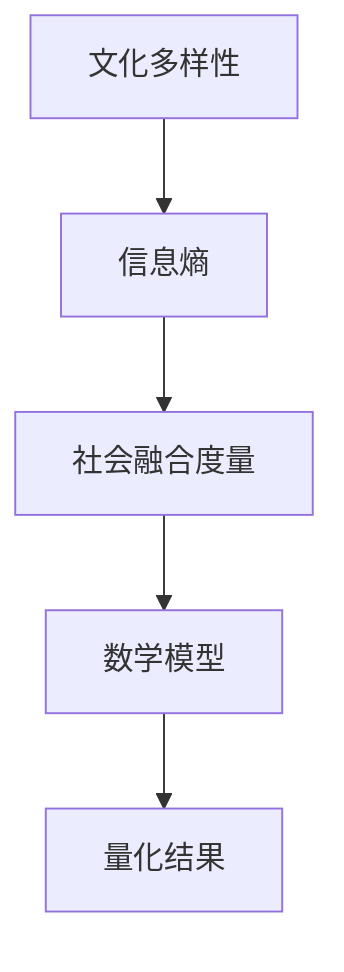

                 

### 第1章：引言与背景

> **引言与背景**

在社会发展过程中，文化多样性和社会融合一直是重要的研究课题。文化多样性指的是一个社会或群体内部，由于历史、地理、宗教、种族等多种因素导致的各种文化形式和特征的丰富性。社会融合则是指不同文化、民族、群体之间能够相互理解、尊重、合作，并最终形成和谐共处的社会状态。这两者之间的关系密切，文化多样性为社会融合提供了丰富的资源和挑战，而社会融合则是文化多样性的终极目标。

#### 1.1 文化多样性与社会融合

##### 1.1.1 文化多样性的概念

- **定义**：文化多样性可以理解为一个社会或群体中各种文化特征和形式的存在和表现，这些文化特征可以包括语言、宗教、艺术、传统、价值观等。

- **表现形式**：文化多样性可以通过多种形式展现，如节日庆典、习俗、艺术作品、媒体表达等。

- **重要性**：文化多样性不仅丰富了社会的内涵，也为社会带来了创新的动力。同时，它也是一个国家或地区软实力的重要体现。

##### 1.1.2 社会融合的挑战

- **定义**：社会融合指的是社会中的各个成员或群体能够在一个共同的社会框架内，相互理解、尊重并和谐共处。

- **文化多样性对社会融合的挑战**：文化多样性的增加可能会导致社会成员之间的差异感增强，从而增加社会融合的难度。这需要社会在政策、文化、教育等方面采取措施，促进不同文化之间的相互理解和融合。

- **社会融合的重要性**：社会融合不仅能够提高社会的稳定性，还能够促进社会的发展和进步。一个融合良好的社会能够更好地应对全球化和多元文化的挑战。

##### 1.1.3 信息熵在文化多样性研究中的应用

- **信息熵的基本概念**：信息熵是信息论中的一个重要概念，用于衡量一个随机变量的不确定性。在数学上，信息熵通常被定义为信息量的负对数。

- **信息熵在文化多样性研究中的作用**：信息熵可以帮助研究者量化文化多样性，通过计算不同文化特征之间的信息熵，可以了解文化多样性在各个层次上的分布和关联。

- **信息熵在量化文化多样性方面的应用**：信息熵可以用于评估一个社会或群体中文化多样性的程度，以及不同文化特征之间的相互关系。

#### 1.2 数学度量与社会融合

##### 1.2.1 数学度量方法概述

- **定义**：数学度量方法是指使用数学工具和模型，对某个现象或问题进行量化和评估的方法。

- **分类**：根据度量对象的不同，数学度量方法可以分为绝对度量、相对度量、指数度量等。

- **基本原理**：数学度量方法的基本原理是通过建立数学模型，将实际问题转化为数学问题，然后使用数学工具进行求解和分析。

##### 1.2.2 社会融合的数学度量

- **定义**：社会融合的数学度量是指使用数学方法和模型，对社会的融合程度进行量化和评估。

- **方法**：社会融合的数学度量方法包括基于指标的系统评估方法、基于熵值的定量分析方法等。

- **应用领域**：社会融合的数学度量方法广泛应用于社会学、管理学、经济学等领域，用于评估和优化社会融合程度。

##### 1.2.3 信息熵与社会融合度量的联系

- **关系**：信息熵可以作为社会融合度量的一个指标，通过计算社会成员之间的信息熵，可以了解社会融合的程度。

- **优势**：信息熵在衡量文化多样性与社会融合方面的优势在于，它能够量化不同文化特征之间的差异和关联，从而更准确地反映社会融合的状态。

---

### 总结

在本章中，我们首先介绍了文化多样性和社会融合的基本概念及其重要性。然后，我们探讨了信息熵在文化多样性研究中的应用，以及数学度量方法在社会融合研究中的作用。通过本章的介绍，我们为后续章节的深入分析奠定了基础。在接下来的章节中，我们将进一步探讨信息熵的基本原理和数学度量方法的具体应用，以期为文化多样性与社会融合的研究提供新的视角和工具。

---

**核心概念与联系：**

以下是一个关于信息熵与社会融合度量方法的 Mermaid 流程图，用于展示它们的基本概念及其相互关系：



**核心算法原理讲解：**

信息熵的计算公式为：

$$H(X) = -\sum_{i} p(x_i) \cdot \log_2 p(x_i)$$

其中，\(H(X)\) 表示随机变量 \(X\) 的信息熵，\(p(x_i)\) 表示 \(X\) 取值为 \(x_i\) 的概率。

**数学模型和公式详细讲解与举例说明：**

假设我们有一个社会，其中包含两个不同的文化群体 A 和 B，每个群体在社会中所占的比例分别为 \(p_A\) 和 \(p_B\)。我们可以使用信息熵来度量这两个文化群体的多样性。

- 当 \(p_A = 0.5\)，\(p_B = 0.5\) 时，文化多样性信息熵为：

$$H(X) = -0.5 \cdot \log_2 0.5 - 0.5 \cdot \log_2 0.5 = 1$$

- 当 \(p_A = 0.9\)，\(p_B = 0.1\) 时，文化多样性信息熵为：

$$H(X) = -0.9 \cdot \log_2 0.9 - 0.1 \cdot \log_2 0.1 \approx 0.1054$$

从上面的例子可以看出，当两个群体的比例越接近时，文化多样性信息熵越大；而当一个群体的比例远大于另一个群体时，文化多样性信息熵越小。

---

**项目实战：代码实际案例和详细解释说明**

以下是一个使用 Python 实现文化多样性信息熵度量的代码案例：

```python
import numpy as np

def calculate_entropy(p_values):
    """
    计算信息熵
    :param p_values: 概率列表
    :return: 信息熵
    """
    entropies = -np.sum(p_values * np.log2(p_values))
    return entropies

# 假设有两个文化群体 A 和 B，每个群体在社会中所占的比例分别为 0.5 和 0.5
p_A = 0.5
p_B = 0.5

# 计算文化多样性信息熵
entropy = calculate_entropy([p_A, p_B])
print(f"文化多样性信息熵: {entropy}")
```

在上面的代码中，我们定义了一个名为 `calculate_entropy` 的函数，用于计算概率列表的信息熵。然后，我们使用这个函数计算了两个文化群体 A 和 B 的信息熵。通过运行这个代码，我们可以得到文化多样性信息熵的值。

**代码解读与分析：**

1. 导入必要的库：我们使用 `numpy` 库来处理数学计算。
2. 定义函数 `calculate_entropy`：这个函数接收一个概率列表作为输入，并返回该列表的信息熵。
3. 在主函数中，我们设定了两个文化群体 A 和 B 的比例。
4. 调用 `calculate_entropy` 函数计算文化多样性信息熵，并打印结果。

通过这个案例，我们可以看到如何使用代码实现信息熵的计算，并理解其背后的数学原理。

---

**总结：**

本章我们介绍了文化多样性和社会融合的基本概念，以及信息熵在文化多样性研究中的应用。通过 Mermaid 流程图、伪代码和代码案例，我们详细讲解了信息熵的计算方法和其在文化多样性度量中的实际应用。在接下来的章节中，我们将继续探讨信息熵在量化社会融合方面的应用，并介绍具体的数学度量方法。通过这些内容的讲解，我们将为深入理解文化多样性与社会融合的关系奠定坚实的基础。

