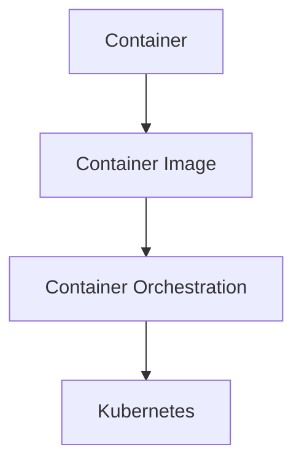
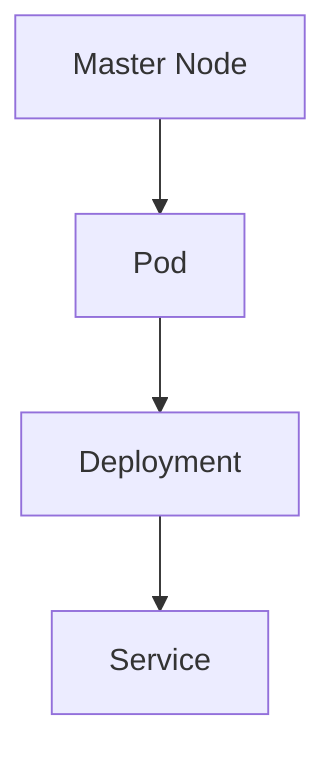
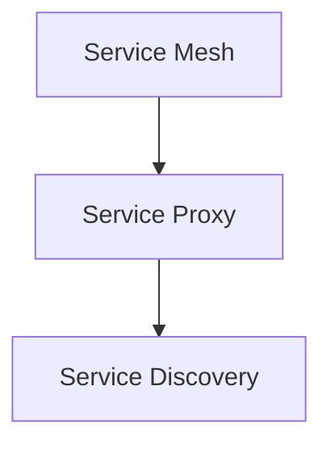
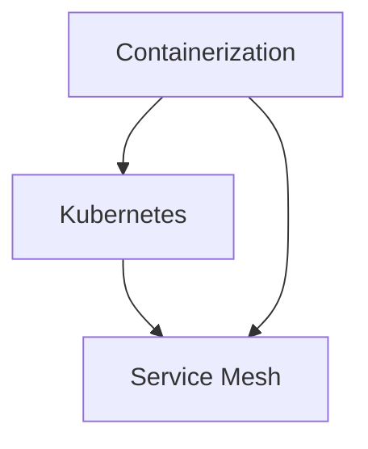

                 

### 第1章：无服务器架构介绍

> **关键词**：无服务器架构、Serverless、云计算、容器化、Kubernetes、服务网格、弹性伸缩、成本效益

**摘要**：本章将介绍无服务器架构的基本概念、优势以及与传统架构的比较。我们将探讨无服务器架构的应用场景和未来发展趋势，为读者提供一个全面的了解。

### 第1章：无服务器架构介绍

#### 1.1 无服务器架构的概念与优势

无服务器架构（Serverless Architecture）是一种云计算模型，它允许开发人员构建和运行应用程序而无需管理底层基础设施。在这种架构中，云服务提供商负责管理服务器、虚拟机、存储和网络等基础设施资源，开发人员则专注于编写应用程序的业务逻辑代码。

**概念**：
无服务器架构的核心思想是将基础设施的管理抽象化，使得开发者无需关注底层硬件和网络等基础设施的管理，从而可以更加专注于应用程序的开发和部署。

**优势**：

- **成本效益**：无服务器架构根据实际使用量进行收费，无需支付固定的服务器费用，降低了运营成本。
- **弹性伸缩**：无服务器架构可以根据负载需求自动调整资源，确保应用程序在高峰期能够快速响应。
- **易于部署与管理**：开发人员无需关注底层基础设施的管理和维护，可以专注于业务逻辑的开发。

#### 1.2 无服务器架构与传统架构的比较

传统架构：
在传统的云计算模型中，开发人员需要管理服务器、虚拟机、操作系统、网络等基础设施资源。这包括硬件采购、配置、监控、维护等任务，导致开发人员需要花费大量时间和精力在基础设施管理上，而不是专注于业务逻辑的开发。

无服务器架构：
无服务器架构简化了基础设施管理，开发人员无需关注底层基础设施的维护。云服务提供商负责基础设施的管理和运维，确保系统的高可用性和性能。开发人员只需编写应用程序的业务逻辑代码，并使用云服务提供商提供的无服务器服务进行部署和运行。

**比较**：

- **基础设施管理**：传统架构中，开发人员需要管理基础设施；无服务器架构中，基础设施由云服务提供商管理。
- **资源利用率**：传统架构中，服务器资源可能被部分利用；无服务器架构中，资源可以根据负载需求动态分配。
- **成本**：传统架构中，开发人员需要支付固定的服务器费用；无服务器架构中，按需付费，降低了运营成本。

#### 1.3 无服务器架构的应用场景

无服务器架构适用于多种应用场景，以下是一些常见的应用场景：

- **Web应用**：无服务器架构可以用于部署Web应用的后端服务，如API网关、身份验证和授权、数据处理等。
- **移动应用**：无服务器架构可以用于处理移动应用的后台任务，如用户数据同步、实时数据处理、推送通知等。
- **物联网**：无服务器架构可以用于处理物联网设备的远程监控、数据处理、事件触发等。
- **大数据处理**：无服务器架构可以用于大规模数据处理任务，如数据清洗、转换、加载等。
- **实时分析**：无服务器架构可以用于实时数据分析，如股票市场监控、社交媒体分析等。

#### 1.4 无服务器架构的发展趋势

无服务器架构在近年来取得了显著的发展，以下是一些未来的发展趋势：

- **容器化与无服务器架构的融合**：随着容器化技术的发展，如Kubernetes等容器编排工具与无服务器架构的结合，将进一步提高应用程序的可移植性和可扩展性。
- **无服务器数据库**：云服务提供商正在推出无服务器数据库服务，如Amazon Aurora Serverless、Google Cloud SQL Serverless等，为开发者提供更高效、灵活的数据存储和管理解决方案。
- **无服务器安全**：随着无服务器架构的普及，安全成为了一个重要议题。开发者需要关注无服务器架构的安全性和隐私保护，如使用加密技术、安全策略和访问控制等。
- **无服务器监控与日志分析**：开发者需要实现对无服务器架构的全面监控和日志分析，以便快速发现和解决问题。

### 第2章：无服务器架构的核心组件

无服务器架构的核心组件包括容器化技术、Kubernetes和service mesh。这些组件协同工作，使得无服务器架构能够提供高效的部署、管理和扩展能力。以下是核心组件的详细介绍。

#### 2.1 容器化技术

容器化技术是现代无服务器架构的基础。它通过将应用程序及其依赖打包到一个容器中，实现了环境一致性的部署。

**核心概念与联系**

无服务器架构中的容器化技术主要包括以下核心概念：

- **容器（Container）**：容器是一种轻量级、可执行的独立软件包，包含了应用程序、库和工具等，使得应用程序可以在不同的环境中运行而无需修改。
- **容器镜像（Container Image）**：容器镜像是一个静态的、只读的文件系统，包含应用程序及其依赖。通过容器镜像，可以快速构建和部署应用程序。
- **容器编排（Container Orchestration）**：容器编排是指自动化管理容器的过程，包括部署、扩展、更新和监控。Kubernetes等工具可以自动化容器编排，确保应用程序的高可用性和性能。

**Mermaid 流程图**



**核心算法原理讲解**

容器化技术的核心算法主要包括以下方面：

1. **容器镜像构建**：通过Dockerfile定义应用程序的构建过程，将应用程序及其依赖打包成一个容器镜像。Dockerfile的基本语法如下：

   ```dockerfile
   # 使用特定的基础镜像
   FROM <base-image>
   
   # 设置工作目录
   WORKDIR /app
   
   # 安装依赖
   RUN pip install <dependencies>
   
   # 复制应用程序代码
   COPY . .
   
   # 暴露应用程序端口
   EXPOSE <port>
   
   # 运行应用程序
   CMD ["<executable>", "<arguments>"]
   ```

2. **容器镜像管理**：容器镜像仓库（如Docker Hub）用于存储和管理容器镜像。通过以下命令，可以拉取和推送容器镜像：

   ```sh
   # 拉取容器镜像
   docker pull <image-name>
   
   # 推送容器镜像
   docker push <image-name>
   ```

3. **容器网络配置**：容器可以通过不同的网络模式进行通信，如桥接网络、主机网络和自定义网络。以下是一个简单的容器网络配置示例：

   ```yaml
   apiVersion: v1
   kind: Pod
   metadata:
     name: my-pod
   spec:
     containers:
     - name: my-container
       image: <image-name>
       ports:
       - containerPort: 80
   ```
   
**数学模型和公式**

容器化技术的核心数学模型是容器镜像的构建和分发。容器镜像的构建过程可以使用以下公式表示：

$$
\text{Container Image} = \text{Base Image} + \text{Application Code} + \text{Dependencies}
$$

**举例说明**

假设我们构建一个简单的Web应用程序，应用程序的Dockerfile如下：

```dockerfile
FROM python:3.8

WORKDIR /app

COPY requirements.txt .

RUN pip install -r requirements.txt

COPY . .

EXPOSE 8080

CMD ["python", "app.py"]
```

这个Dockerfile将创建一个基于Python 3.8的容器镜像，安装必要的依赖，并将应用程序代码复制到容器中。应用程序启动时，将监听8080端口。

#### 2.2 Kubernetes概述

Kubernetes是一个开源的容器编排工具，用于自动化容器的部署、扩展和管理。它提供了一个强大的平台，使得开发者可以轻松地管理大规模的容器化应用。

**核心概念与联系**

Kubernetes的核心概念包括：

- **Kubernetes集群（Kubernetes Cluster）**：Kubernetes集群由一组节点（Node）组成，包括一个主节点（Master）和多个工作节点（Worker）。主节点负责集群的控制和管理，工作节点负责运行应用程序的容器。
- **Kubernetes对象（Kubernetes Objects）**：Kubernetes中的各种资源对象，如Pod、Deployment、Service等，用于描述和管理容器化应用。Pod是Kubernetes中的基本部署单元，包含一个或多个容器。Deployment用于管理Pod的副本数量和更新。Service用于暴露Pod的IP和端口，提供负载均衡功能。
- **Kubernetes控制器（Kubernetes Controllers）**：Kubernetes控制器负责管理集群中的各种对象。例如，Deployment控制器负责管理Pod的副本数量和更新，而StatefulSet控制器负责管理有状态服务的部署。

**Mermaid 流程图**



**核心算法原理讲解**

Kubernetes的核心算法主要包括以下方面：

1. **Kubernetes集群架构**：Kubernetes集群由以下组件组成：

   - **etcd**：一个分布式键值存储，用于存储Kubernetes集群的状态信息。
   - **kube-apiserver**：Kubernetes的API服务器，提供Kubernetes的RESTful API接口。
   - **kube-scheduler**：Kubernetes的调度器，负责分配Pod到合适的节点。
   - **kube-controller-manager**：Kubernetes的控制器管理器，包含多个控制器，如副本控制器、节点控制器和命名空间控制器。

2. **Kubernetes对象管理**：Kubernetes对象的管理涉及到以下方面：

   - **Pod管理**：Pod是Kubernetes中的基本部署单元，包含一个或多个容器。副本控制器（ReplicaController）负责确保Pod的副本数量满足预期。
   - **Deployment管理**：Deployment是一种用于管理Pod副本数量和更新的控制器。通过Deployment，可以定义应用程序的部署策略，如副本数量、更新策略和回滚策略。
   - **Service管理**：Service是一种用于暴露Pod的IP和端口的抽象，提供负载均衡功能。Service将流量分配到不同的Pod实例，实现服务的横向扩展和故障转移。

3. **Kubernetes控制器管理**：Kubernetes控制器通过以下方式管理对象：

   - **控制器循环**：控制器通过监视集群状态，识别需要更新的对象，并执行相应的操作，如创建、更新和删除对象。
   - **工作队列**：控制器使用工作队列处理事件和任务，确保控制器的操作是有序和可靠的。

**数学模型和公式**

Kubernetes的核心数学模型可以表示为：

$$
\text{Kubernetes Cluster} = \text{Master Node} + \text{Worker Node} + \text{Kubernetes Objects}
$$

**举例说明**

假设我们部署一个简单的Web应用程序，应用程序的YAML配置如下：

```yaml
apiVersion: apps/v1
kind: Deployment
metadata:
  name: my-app
spec:
  replicas: 3
  selector:
    matchLabels:
      app: my-app
  template:
    metadata:
      labels:
        app: my-app
    spec:
      containers:
      - name: my-container
        image: my-app:latest
        ports:
        - containerPort: 80
```

这个配置创建了一个名为`my-app`的Deployment，它将部署3个副本的Pod，每个Pod包含一个名为`my-container`的容器，容器使用镜像`my-app:latest`，并暴露80端口。

#### 2.3 服务网格

服务网格是一种用于管理微服务通信的架构模式。它提供了一种独立的、可插拔的通信基础设施，使得服务之间的通信更加可靠、安全和管理。

**核心概念与联系**

服务网格的核心概念包括：

- **服务网格（Service Mesh）**：服务网格是一个独立的、分布式的基础设施层，用于管理服务之间的通信。服务网格通过代理（如Istio代理）提供服务发现、流量管理和安全性等功能。
- **服务代理（Service Proxy）**：服务代理（如Istio代理）是服务网格的核心组件，负责处理服务之间的通信。服务代理实现了服务间的可靠连接、流量管理和安全性。
- **服务发现（Service Discovery）**：服务发现是指如何在集群中找到服务的IP地址和端口。服务网格通过服务注册中心和DNS实现服务发现。

**Mermaid 流程图**



**核心算法原理讲解**

服务网格的核心算法主要包括以下方面：

1. **服务代理**：服务代理负责处理服务之间的通信，包括请求路由、负载均衡、断路器和健康检查等。服务代理通常是基于代理服务器（如Envoy）实现的。

2. **流量管理**：流量管理是指如何控制服务之间的流量路由和负载均衡。服务网格提供了流量管理规则，如路由策略、故障转移和健康检查。

3. **安全性**：服务网格提供了安全功能，如访问控制、认证和授权。服务网格确保服务之间的通信是安全的，通过加密、认证和访问控制等机制保护服务。

**数学模型和公式**

服务网格的核心数学模型可以表示为：

$$
\text{Service Mesh} = \text{Service Proxy} + \text{Traffic Management} + \text{Security}
$$

**举例说明**

假设我们使用Istio部署一个简单的服务网格，服务网格的YAML配置如下：

```yaml
apiVersion: istio.io/v1alpha3
kind: ServiceEntry
metadata:
  name: my-service-entry
spec:
  hosts:
  - "*"
  ports:
  - number: 80
    name: http
    protocol: HTTP
  location: INTERNET
  addresses:
  - "192.168.1.1"

---
apiVersion: istio.io/v1alpha3
kind: VirtualService
metadata:
  name: my-virtual-service
spec:
  hosts:
  - "*"
  http:
  - match:
    - uri:
        prefix: "/"
    route:
    - destination:
        host: my-service-entry
        port:
          number: 80
```

这个配置创建了一个名为`my-service-entry`的服务入口，将所有流量路由到地址为`192.168.1.1`的服务。`my-virtual-service`定义了一个虚拟服务，将所有匹配路径的流量路由到`my-service-entry`。

#### 2.4 容器化技术、Kubernetes与服务网格的集成

容器化技术、Kubernetes和服务网格的集成是实现无服务器架构的关键步骤。以下是它们之间的集成方式：

1. **容器化技术与Kubernetes集成**：使用Kubernetes进行容器化应用程序的部署和管理。容器化技术（如Docker）用于构建容器镜像，Kubernetes用于部署和管理这些容器镜像。

2. **Kubernetes与Service Mesh集成**：使用Service Mesh（如Istio）进行服务之间的通信管理。Kubernetes集群中的服务通过Service Mesh代理进行通信，实现了服务发现、流量管理和安全性。

3. **容器化技术、Kubernetes与Service Mesh集成**：容器化技术用于构建应用程序的容器镜像，Kubernetes用于部署和管理这些容器镜像，Service Mesh用于管理服务之间的通信。

**Mermaid 流程图**



**核心算法原理讲解**

集成过程中的核心算法包括：

1. **容器镜像构建**：使用Dockerfile构建应用程序的容器镜像。

2. **容器镜像部署**：使用Kubernetes Deployment部署容器镜像，并管理Pod的副本数量。

3. **服务网格配置**：使用Service Mesh配置服务之间的流量管理、安全和监控。

**数学模型和公式**

集成过程中的核心数学模型可以表示为：

$$
\text{Integration} = \text{Containerization} + \text{Kubernetes} + \text{Service Mesh}
$$

**举例说明**

假设我们构建一个简单的Web应用程序，应用程序的Dockerfile、Kubernetes Deployment和Istio配置如下：

```dockerfile
# Dockerfile
FROM python:3.8
WORKDIR /app
COPY . .
EXPOSE 8080
CMD ["python", "app.py"]
```

```yaml
# Kubernetes Deployment
apiVersion: apps/v1
kind: Deployment
metadata:
  name: my-app
spec:
  replicas: 3
  selector:
    matchLabels:
      app: my-app
  template:
    metadata:
      labels:
        app: my-app
    spec:
      containers:
      - name: my-container
        image: my-app:latest
        ports:
        - containerPort: 8080
```

```yaml
# Istio VirtualService
apiVersion: istio.io/v1alpha3
kind: VirtualService
metadata:
  name: my-virtual-service
spec:
  hosts:
  - "*"
  http:
  - match:
    - uri:
        prefix: "/"
    route:
    - destination:
        host: my-app
```

这个例子中

