                 

# 智能交通管理系统：优化城市交通的智慧方案

## 关键词
- 智能交通管理系统
- 城市交通优化
- 交通流控制算法
- 交通需求管理
- 交通基础设施优化
- 数据采集与处理

## 摘要
本文深入探讨了智能交通管理系统在优化城市交通方面的应用与实践。首先，我们对智能交通管理系统进行了概述，详细介绍了其发展历程、核心组成部分和关键技术。接着，分析了城市交通问题的识别与分类，以及交通拥堵原因和影响。在此基础上，提出了优化交通流的智能算法、交通需求管理策略和交通基础设施优化方案。随后，详细阐述了智能交通管理系统的实施策略、应用案例和发展趋势。本文旨在为城市交通管理的智能化提供有价值的参考和指导。

### 目录大纲

#### 第一部分: 智能交通管理系统概述

##### 第1章: 智能交通管理系统概述  
- 1.1 智能交通管理系统的发展历程
- 1.2 智能交通管理系统的核心组成部分
- 1.3 智能交通管理系统的关键技术

##### 第2章: 城市交通问题的识别与分类  
- 2.1 城市交通问题的识别
- 2.2 城市交通问题的分类

##### 第3章: 城市交通问题的原因分析  
- 3.1 交通需求与交通供给分析
- 3.2 交通拥堵原因分析

##### 第4章: 城市交通问题的影响评估  
- 4.1 交通拥堵对社会经济的影响
- 4.2 交通拥堵对环境的影响

#### 第二部分: 智能交通管理系统的优化方案

##### 第5章: 优化交通流的智能算法  
- 5.1 交通流优化算法概述
- 5.2 交通信号控制算法
- 5.3 智能交通诱导系统

##### 第6章: 交通需求管理策略  
- 6.1 交通需求管理概述
- 6.2 高峰时段交通管理
- 6.3 车辆使用限制策略

##### 第7章: 交通基础设施优化  
- 7.1 交通基础设施评估方法
- 7.2 交通网络优化
- 7.3 城市公共交通系统优化

#### 第三部分: 智能交通管理系统的实施与应用

##### 第8章: 智能交通管理系统的实施策略  
- 8.1 实施策略概述
- 8.2 技术标准与规范
- 8.3 数据采集与处理

##### 第9章: 智能交通管理系统的应用案例  
- 9.1 国内智能交通管理系统应用案例
- 9.2 国际智能交通管理系统应用案例
- 9.3 成功案例分析

##### 第10章: 智能交通管理系统的发展趋势  
- 10.1 发展趋势分析
- 10.2 未来展望

### 附录

## 附录 A: 智能交通管理系统相关技术介绍

## 附录 B: 智能交通管理系统参考资料

接下来，我们将按照上述目录大纲逐步展开文章内容，深入探讨智能交通管理系统的各个方面。

---

### 第一部分: 智能交通管理系统概述

#### 第1章: 智能交通管理系统概述

**1.1 智能交通管理系统的发展历程**

智能交通管理系统（Intelligent Transportation System，ITS）的发展可以追溯到20世纪60年代。当时，随着汽车数量的增加和城市交通问题的日益严重，交通管理开始向智能化方向发展。

- **20世纪60年代：** 最初的研究集中在道路监控和交通信号控制。此时，信号灯控制技术开始应用，但仅限于单点控制。
- **20世纪70年代：** 信息技术和通信技术的发展为智能交通系统提供了技术支持。这个时期，开始出现基于计算机的车辆监控系统。
- **20世纪80年代：** 智能交通系统的研究进入快速发展阶段，各种先进技术如传感器、通信系统和数据处理技术得到广泛应用。
- **20世纪90年代：** 智能交通系统开始走向实用化，各国纷纷建设智能交通系统项目，包括交通信号控制、智能停车场管理等。
- **21世纪初至今：** 随着物联网、大数据和人工智能技术的崛起，智能交通系统进入一个全新的发展阶段，实现了跨区域、跨系统的互联互通。

**图 1-1 智能交通管理系统的发展阶段**

```mermaid
gantt
    title 智能交通管理系统的发展阶段
    section 20世纪60年代
    A1 : done, 1960-1970, duration 10
    section 20世纪70年代
    A2 : done, 1970-1980, duration 10
    section 20世纪80年代
    A3 : done, 1980-1990, duration 10
    section 20世纪90年代
    A4 : done, 1990-2000, duration 10
    section 21世纪初至今
    A5 : done, 2000-2023, duration 23
```

**1.2 智能交通管理系统的核心组成部分**

智能交通管理系统由多个核心组成部分构成，包括数据采集系统、信息处理系统、交通信号控制系统、交通诱导系统、交通基础设施等。

- **数据采集系统：** 通过各种传感器和监测设备收集交通流量、速度、密度等数据。
- **信息处理系统：** 对采集到的数据进行分析和处理，生成交通状态信息。
- **交通信号控制系统：** 根据交通状态信息，调整交通信号灯的时序和时长。
- **交通诱导系统：** 提供实时交通信息，引导车辆选择最优路线。
- **交通基础设施：** 包括道路、桥梁、隧道、停车场等，为智能交通系统提供基础设施支持。

**图 1-2 智能交通管理系统的组成部分**

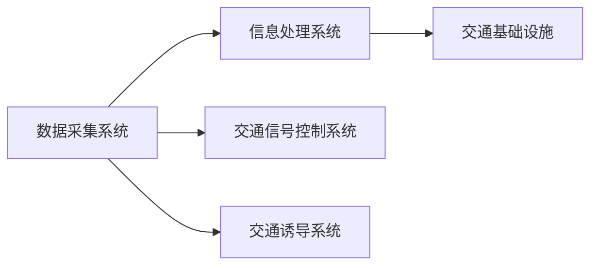

**1.3 智能交通管理系统的关键技术**

智能交通管理系统的发展离不开一系列关键技术的支持，包括传感器技术、通信技术、数据处理技术、算法技术和大数据技术。

- **传感器技术：** 传感器是智能交通系统的感知器官，用于收集交通流量、速度、密度等数据。
- **通信技术：** 通信技术保证了数据的实时传输和系统的互联互通。
- **数据处理技术：** 数据处理技术用于对采集到的数据进行清洗、存储、分析和可视化。
- **算法技术：** 算法技术是实现智能交通管理系统核心功能的基石，包括交通流控制算法、路径规划算法等。
- **大数据技术：** 大数据技术为智能交通管理系统提供了强大的数据处理和分析能力，支持交通预测和优化决策。

**图 1-3 智能交通管理系统关键技术图解**

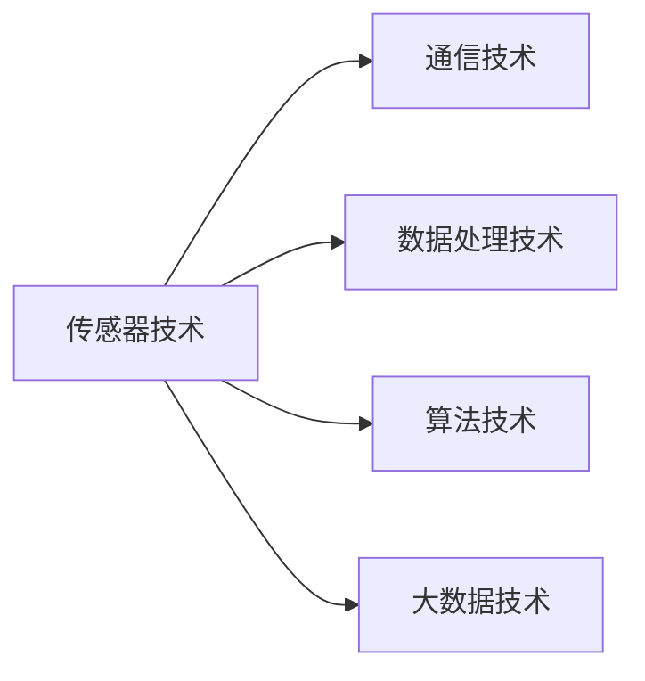

通过以上三个章节的介绍，我们对智能交通管理系统有了初步的了解。接下来，我们将进一步分析城市交通问题的识别与分类，以及其原因和影响。这一部分内容将为后续优化方案的提出提供基础。

---

### 第二部分: 城市交通问题的分析

#### 第2章: 城市交通问题的识别与分类

城市交通问题复杂多样，解决这些问题需要深入了解其本质和成因。首先，我们需要对城市交通问题进行识别与分类，以便有针对性地制定解决方案。

**2.1 城市交通问题的识别**

城市交通问题的识别是一个系统性的过程，需要结合多种数据来源和数据分析方法。以下是一些常见的识别方法：

- **现场调查：** 通过实地观察、问卷调查等方式获取交通流量、拥堵情况等基本信息。
- **数据分析：** 利用历史交通数据、实时交通数据等进行分析，识别出潜在的交通问题。
- **模拟仿真：** 通过交通模拟软件对交通流进行仿真，分析不同交通场景下的交通状态。

**图 2-1 城市交通问题识别方法**

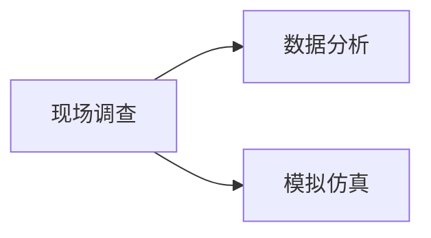

**2.2 城市交通问题的分类**

城市交通问题可以按照不同的标准进行分类，以下是几种常见的分类方法：

- **按照问题类型分类：** 包括交通拥堵、交通事故、交通违规等。
  - **交通拥堵：** 由于交通流量过大、道路条件限制等原因导致的道路拥堵。
  - **交通事故：** 由于车辆操作不当、道路条件不佳等原因导致的交通事故。
  - **交通违规：** 车辆驾驶员违反交通规则，如超速、闯红灯等。
- **按照影响范围分类：** 包括局部问题、区域性问题和全局性问题。
  - **局部问题：** 主要影响某个路段或路口的交通流量。
  - **区域性问题：** 影响某个区域内的交通状况，如交通流量过大、交通拥堵等。
  - **全局性问题：** 影响整个城市的交通状况，如道路拥堵、交通事故等。

**图 2-2 城市交通问题分类**

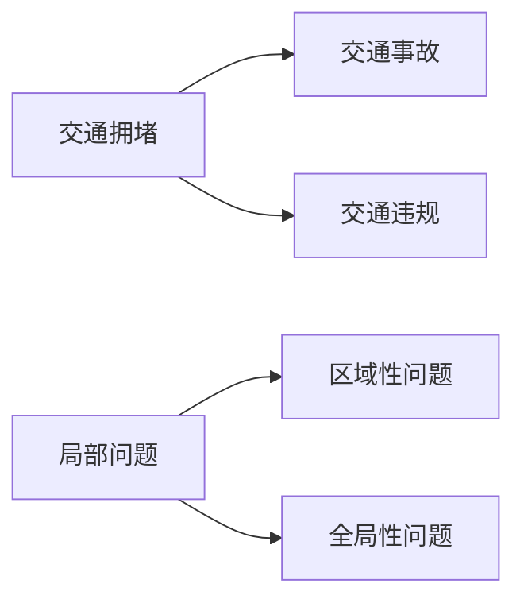

通过识别和分类城市交通问题，我们可以更好地理解问题的本质，为后续制定解决方案提供依据。接下来，我们将进一步分析城市交通问题的原因，以便为优化方案的设计提供更多依据。

---

### 第3章: 城市交通问题的原因分析

城市交通问题的产生是多种因素共同作用的结果。为了有效地解决这些问题，我们需要深入分析其背后的原因，以便采取有针对性的措施。

**3.1 交通需求与交通供给分析**

交通需求与交通供给之间的失衡是导致城市交通问题的根本原因之一。以下是对交通需求与交通供给的分析：

- **交通需求分析：**
  - **人口增长：** 城市人口的增长会导致交通需求增加。
  - **经济发展：** 经济的快速发展会带动交通需求的增长，包括货运和客运需求。
  - **城市规划：** 不合理或落后的城市规划可能导致交通需求无法得到有效满足。
- **交通供给分析：**
  - **道路基础设施：** 道路基础设施的建设和扩建速度可能跟不上交通需求增长的速度。
  - **公共交通系统：** 公共交通系统的服务水平、覆盖范围和运营效率可能无法满足居民出行需求。
  - **交通管理：** 交通管理的科学性和有效性不足，可能导致交通拥堵和交通事故。

**图 3-1 交通需求与供给分析流程**

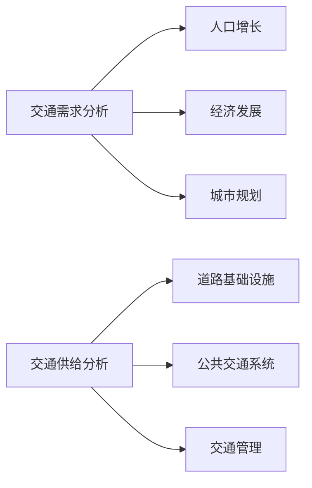

**3.2 交通拥堵原因分析**

交通拥堵是城市交通问题中最常见的一种，其产生的原因多种多样：

- **交通流量过大：** 城市交通流量过大，超过道路设计承载能力，导致道路拥堵。
- **道路条件限制：** 道路狭窄、车道分配不合理、道路施工等因素都会导致交通拥堵。
- **交通事故：** 交通事故会导致交通流量中断，引发拥堵。
- **交通信号控制不足：** 交通信号灯时序不合理、配时不当会导致交通拥堵。
- **高峰时段：** 高峰时段交通需求集中，导致道路拥堵。

**图 3-2 交通拥堵原因分析**

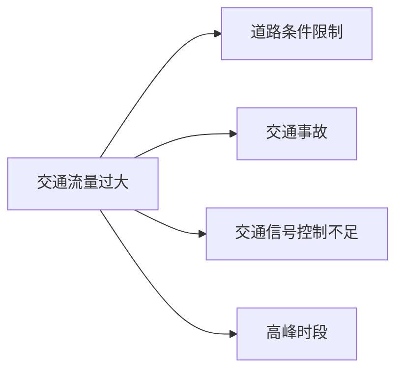

通过对城市交通问题原因的深入分析，我们可以更准确地把握问题的本质，为后续制定优化方案提供有力支持。在下一章中，我们将评估交通拥堵对社会经济和环境的影响，以便全面了解交通问题的严重性。

---

### 第4章: 城市交通问题的影响评估

城市交通问题不仅给居民的日常生活带来不便，还会对社会经济和环境产生深远的影响。准确评估这些影响对于制定有效的交通管理策略至关重要。

**4.1 交通拥堵对社会经济的影响**

交通拥堵对社会经济的影响是多方面的，具体包括以下几个方面：

- **生产力下降：** 交通拥堵会导致运输成本增加，影响企业生产和物流效率，降低整体生产力。
- **经济损失：** 交通拥堵会消耗大量的时间和燃料，造成经济损失。据估计，全球因交通拥堵造成的经济损失每年高达数千亿美元。
- **商业机会减少：** 交通拥堵会影响商业活动，降低商店和企业的销售业绩。
- **旅游业受影响：** 交通拥堵会影响游客出行体验，降低旅游业的吸引力。

**图 4-1 交通拥堵对社会经济影响评估模型**

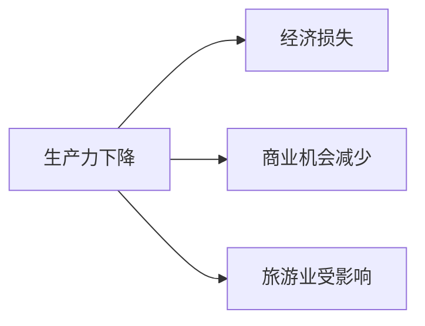

**4.2 交通拥堵对环境的影响**

交通拥堵不仅影响经济，还会对环境造成严重危害：

- **空气污染：** 交通拥堵会导致车辆长时间怠速，增加尾气排放，导致空气污染。
- **噪音污染：** 交通拥堵会增加车辆的噪音排放，影响居民的生活质量。
- **碳排放：** 交通拥堵会导致车辆燃油消耗增加，增加碳排放，加剧气候变化。
- **生态破坏：** 交通拥堵会导致更多车辆使用，占用绿地和农田，破坏生态环境。

**图 4-2 交通拥堵对环境影响评估模型**

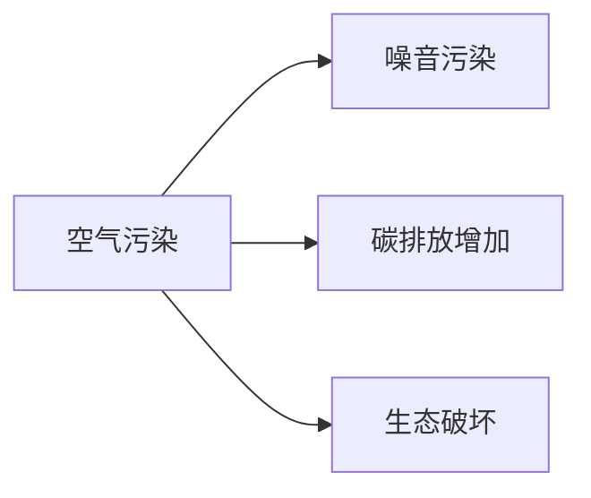

通过对城市交通问题影响的评估，我们可以更全面地认识交通问题的严重性，为制定科学、合理的交通管理策略提供依据。在下一部分中，我们将探讨智能交通管理系统的优化方案，以期有效解决城市交通问题。

---

### 第三部分: 智能交通管理系统的优化方案

#### 第5章: 优化交通流的智能算法

**5.1 交通流优化算法概述**

交通流优化是智能交通管理系统的核心任务之一。通过智能算法优化交通流，可以有效缓解交通拥堵，提高交通效率。以下是几种常见的交通流优化算法：

- **基于交通信号控制的优化算法：** 通过调整交通信号灯的时序和时长，优化交通流。常见的算法包括定时控制、自适应控制和协同控制。
- **基于路径规划的优化算法：** 通过计算最优路径，引导车辆避开拥堵路段。常见的算法包括最短路径算法、动态路径规划算法等。
- **基于交通预测的优化算法：** 通过预测未来交通状态，提前调整交通信号灯和诱导系统的信息。常见的算法包括时间序列预测、机器学习预测等。

**图 5-1 交通流优化算法分类**

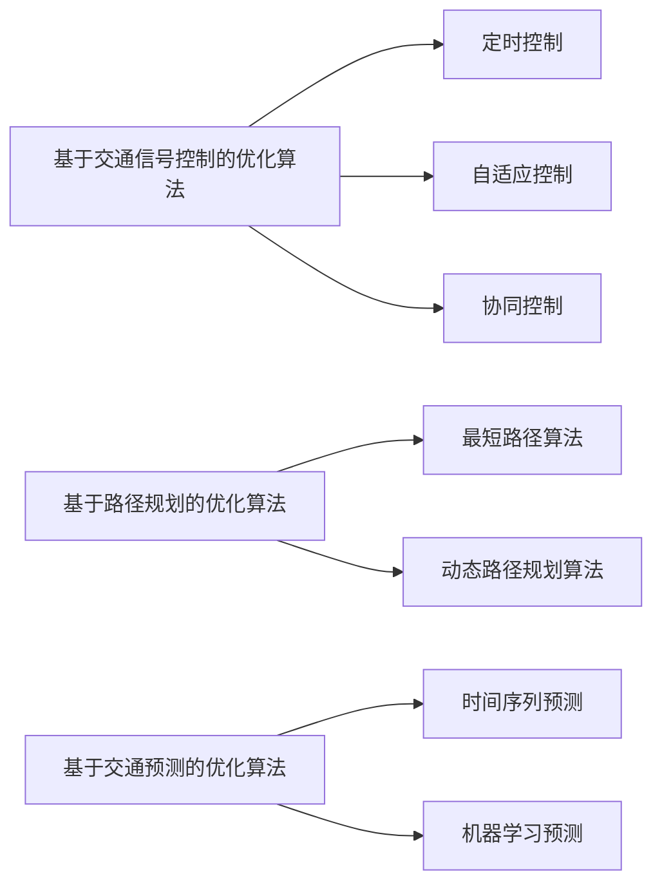

**5.2 交通信号控制算法**

交通信号控制算法是交通流优化的重要组成部分。以下是一个简单的交通信号控制算法伪代码：

```python
# 交通信号控制算法伪代码
def traffic_signal_control(current_traffic_state):
    if current_traffic_state.is_green:
        # 绿灯状态
        return "绿灯"
    elif current_traffic_state.is_red:
        # 红灯状态
        return "红灯"
    else:
        # 黄灯状态
        return "黄灯"

# 当前交通状态
current_traffic_state = TrafficState()

# 调用交通信号控制算法
signal_state = traffic_signal_control(current_traffic_state)
print(f"当前信号状态：{signal_state}")
```

**5.3 智能交通诱导系统**

智能交通诱导系统通过实时交通信息，引导车辆选择最优路线，缓解交通拥堵。以下是一个智能交通诱导系统的工作原理：

1. 数据采集：系统通过传感器、摄像头等设备收集实时交通数据。
2. 数据处理：系统对采集到的数据进行分析，生成交通状态信息。
3. 路径规划：系统根据交通状态信息，计算最优路径。
4. 信息发布：系统通过显示屏、导航设备等向驾驶员发布交通信息。

**图 5-2 智能交通诱导系统工作原理**


通过本章的介绍，我们了解了交通流优化算法、交通信号控制算法和智能交通诱导系统。这些算法和系统为智能交通管理系统的优化提供了有力支持，有助于缓解城市交通问题。

---

#### 第6章: 交通需求管理策略

交通需求管理（Traffic Demand Management，TDM）是通过优化交通需求和供应之间的关系，减少交通拥堵和环境污染的一种策略。以下是一些常见的交通需求管理策略：

**6.1 交通需求管理概述**

交通需求管理主要包括以下几种策略：

- **高峰时段交通管理：** 通过调整工作时间、错开上下班高峰等方式，减少高峰时段的交通流量。
- **车辆使用限制策略：** 通过限制车辆使用，如限号出行、限行区域等方式，减少交通流量。
- **公共交通优先：** 提高公共交通系统的服务水平，鼓励居民使用公共交通，减少私家车出行。
- **非机动交通推广：** 提倡步行、骑行等非机动交通方式，减少机动车使用。

**图 6-1 交通需求管理策略分类**

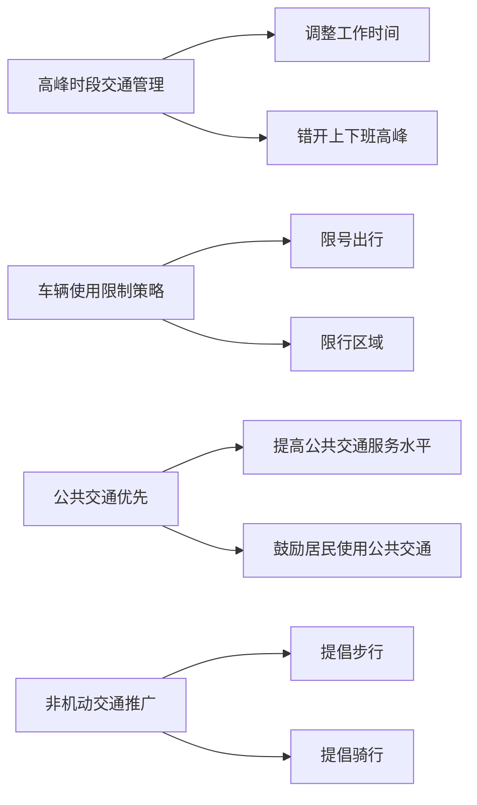

**6.2 高峰时段交通管理**

高峰时段交通管理是交通需求管理的重要组成部分。以下是一些常见的高峰时段交通管理方案：

- **弹性工作时间：** 通过调整工作时间，使员工错开上下班高峰，减少交通流量。
- **远程办公：** 鼓励员工在家办公，减少通勤需求。
- **公共交通补贴：** 提供公共交通补贴，鼓励员工使用公共交通工具。
- **停车费调整：** 在高峰时段提高停车费，抑制私家车出行。

**图 6-2 高峰时段交通管理方案**

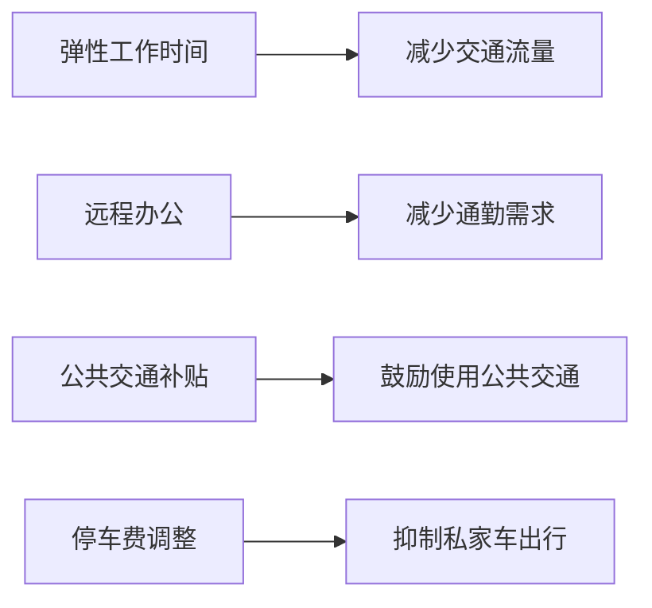

**6.3 车辆使用限制策略**

车辆使用限制策略是通过限制车辆的使用来减少交通流量。以下是一些常见的车辆使用限制策略：

- **限号出行：** 按照车牌号码的奇偶性，限制车辆在特定时段出行。
- **限行区域：** 在特定区域内，限制车辆进入。
- **高峰时段禁行：** 在高峰时段，限制车辆在特定路段或区域行驶。

**图 6-3 车辆使用限制策略案例分析**

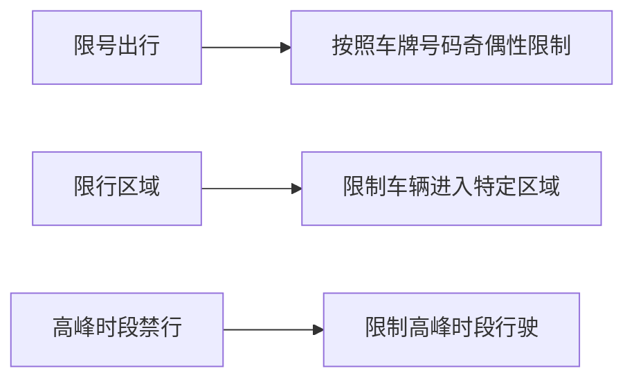

通过实施交通需求管理策略，可以有效减少交通流量，缓解交通拥堵。在下一章中，我们将探讨交通基础设施优化的方法，以进一步改善城市交通状况。

---

#### 第7章: 交通基础设施优化

交通基础设施优化是智能交通管理系统的重要组成部分，通过对道路、桥梁、隧道、停车场等基础设施的优化，可以提高交通系统的整体效率和安全性。

**7.1 交通基础设施评估方法**

交通基础设施评估是优化基础设施的第一步，以下是一些常用的评估方法：

- **问卷调查：** 通过问卷调查获取居民和驾驶员对交通基础设施的满意度、使用情况等信息。
- **现场调查：** 实地考察交通基础设施的使用状况，如道路拥堵情况、停车场利用率等。
- **数据分析：** 利用交通流量数据、交通事故数据等进行分析，评估基础设施的性能。
- **模拟仿真：** 通过交通模拟软件对基础设施进行仿真，评估不同方案的效果。

**图 7-1 交通基础设施评估流程**

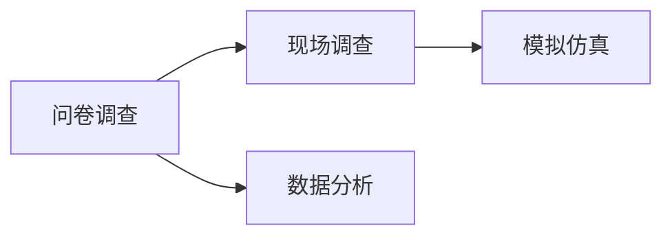

**7.2 交通网络优化**

交通网络优化是通过调整道路布局、信号灯配置等手段，提高交通系统的效率和安全性。以下是一些交通网络优化的方法：

- **道路拓宽：** 通过拓宽道路，增加道路通行能力。
- **信号灯优化：** 通过调整信号灯配时和时长，提高交通流效率。
- **道路渠化：** 通过调整道路标志、标线等，引导车辆有序行驶。
- **交通组织优化：** 通过调整交通组织方式，如单向行驶、分时段通行等，提高道路利用率。

**图 7-2 交通网络优化算法**

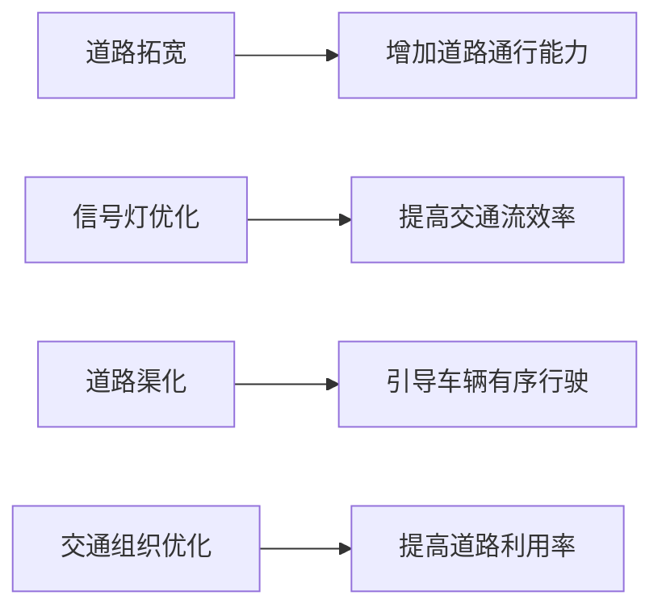

**7.3 城市公共交通系统优化**

城市公共交通系统优化是提高城市交通效率的重要手段。以下是一些城市公共交通系统优化的方法：

- **线路优化：** 根据乘客需求和交通流量，调整公交线路和站点设置。
- **车辆调度：** 通过实时交通信息，优化公交车调度策略，提高公交服务水平。
- **场站建设：** 增加公交场站建设，提高公交车停放和维修效率。
- **智能调度系统：** 利用大数据和人工智能技术，实现公交调度智能化。

**图 7-3 城市公共交通系统优化方案**

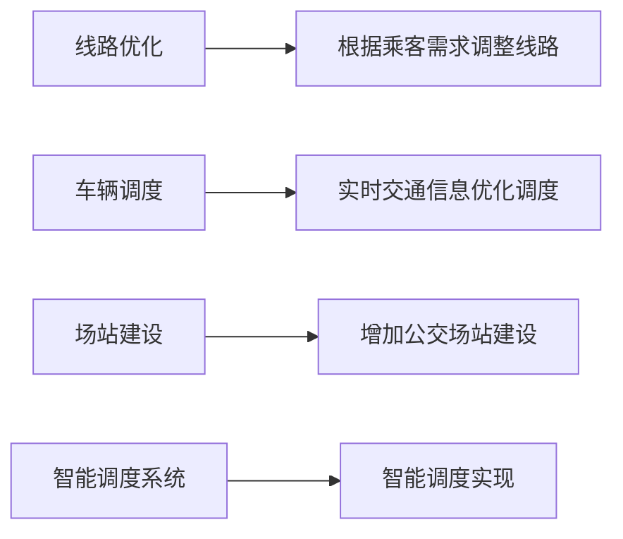

通过本章的介绍，我们了解了交通基础设施评估、交通网络优化和城市公共交通系统优化的方法。这些优化措施有助于提高城市交通系统的效率和安全性，改善居民出行体验。

---

### 第四部分: 智能交通管理系统的实施与应用

#### 第8章: 智能交通管理系统的实施策略

智能交通管理系统的实施是一项复杂的系统工程，需要科学规划和有效执行。以下介绍智能交通管理系统的实施策略。

**8.1 实施策略概述**

智能交通管理系统的实施策略主要包括以下几个阶段：

- **需求分析：** 确定系统需求，包括功能需求、性能需求、安全性需求等。
- **系统设计：** 制定系统架构和设计方案，确保系统的高效性和可扩展性。
- **设备采购：** 选择合适的硬件设备和软件工具，确保系统实施所需的资源。
- **系统开发：** 开发系统软件，实现各项功能。
- **系统测试：** 对系统进行功能测试、性能测试和安全测试，确保系统稳定可靠。
- **系统部署：** 将系统部署到实际环境中，进行试运行和调整。
- **用户培训：** 对用户进行系统操作和维护培训，确保系统能够正常使用。

**图 8-1 智能交通管理系统实施流程**


**8.2 技术标准与规范**

智能交通管理系统的实施需要遵循一系列技术标准和规范，以确保系统的互操作性、安全性和可靠性。以下是一些关键技术标准和规范：

- **数据接口标准：** 定义系统间数据交换的接口标准，如XML、JSON等。
- **通信协议标准：** 定义系统间通信的协议标准，如TCP/IP、HTTP等。
- **数据安全标准：** 定义系统的数据安全保护措施，如数据加密、访问控制等。
- **系统可靠性标准：** 定义系统的可靠性要求，如故障恢复、数据备份等。

**图 8-2 智能交通管理系统技术标准**

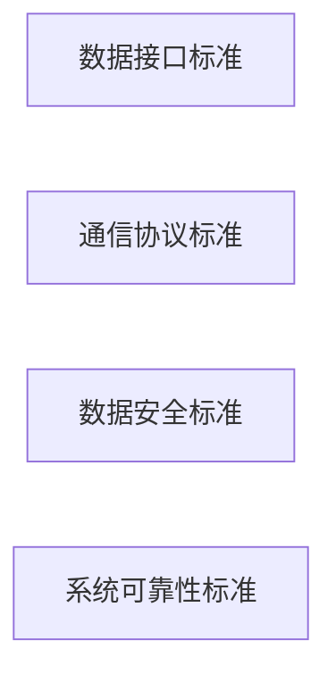

**8.3 数据采集与处理**

数据采集与处理是智能交通管理系统的核心功能之一。以下介绍数据采集与处理的方法：

- **数据采集：** 通过传感器、摄像头等设备采集交通流量、速度、密度等数据。
- **数据传输：** 通过无线通信等方式将采集到的数据传输到数据中心。
- **数据处理：** 对采集到的数据进行清洗、存储、分析和可视化。

**图 8-3 数据采集与处理流程**


通过本章的介绍，我们了解了智能交通管理系统的实施策略、技术标准与规范以及数据采集与处理的方法。这些策略和规范有助于确保智能交通管理系统的顺利实施和有效运行。

---

#### 第9章: 智能交通管理系统的应用案例

智能交通管理系统在国内外得到了广泛的应用，取得了显著的成效。以下介绍国内和国外的一些智能交通管理系统应用案例。

**9.1 国内智能交通管理系统应用案例**

**1. 北京智能交通管理系统**

北京市作为中国的首都，交通问题尤为突出。北京智能交通管理系统通过大数据分析和人工智能技术，实现了交通流量预测、交通信号控制优化、交通诱导等功能，有效缓解了交通拥堵。

- **交通流量预测：** 利用历史交通数据和实时数据，预测未来交通流量，为交通信号控制提供依据。
- **交通信号控制优化：** 根据实时交通状况，调整交通信号灯的时序和时长，提高道路通行效率。
- **交通诱导：** 提供实时交通信息，引导车辆选择最优路线，避开拥堵路段。

**图 9-1 国内智能交通管理系统应用案例分类**

```mermaid
graph LR
    A[北京智能交通管理系统]
```

**2. 上海智能交通管理系统**

上海市在智能交通管理方面也取得了显著成果。上海智能交通管理系统通过建设智能交通基础设施、推广新能源汽车、实施交通需求管理等措施，提高了城市交通的效率和环保性。

- **智能交通基础设施：** 建设智能路侧单元、智能交通信号灯等基础设施，提高交通管理智能化水平。
- **新能源汽车推广：** 推广新能源汽车，减少交通污染。
- **交通需求管理：** 实施交通需求管理策略，减少高峰时段交通流量。

**图 9-1 国内智能交通管理系统应用案例分类**

```mermaid
graph LR
    B[上海智能交通管理系统]
```

**9.2 国际智能交通管理系统应用案例**

**1. 伦敦智能交通管理系统**

伦敦智能交通管理系统通过实施智能交通信号控制、交通诱导、公共交通优化等措施，有效缓解了城市交通拥堵。

- **智能交通信号控制：** 利用实时交通数据，优化交通信号灯的时序和时长，提高道路通行效率。
- **交通诱导：** 提供实时交通信息，引导车辆选择最优路线，避开拥堵路段。
- **公共交通优化：** 优化公交线路和站点设置，提高公共交通服务水平。

**图 9-2 国际智能交通管理系统应用案例分类**

```mermaid
graph LR
    A[伦敦智能交通管理系统]
```

**2. 东京智能交通管理系统**

东京智能交通管理系统通过建设智能交通基础设施、推广新能源汽车、实施交通需求管理等措施，提高了城市交通的效率和环保性。

- **智能交通基础设施：** 建设智能路侧单元、智能交通信号灯等基础设施，提高交通管理智能化水平。
- **新能源汽车推广：** 推广新能源汽车，减少交通污染。
- **交通需求管理：** 实施交通需求管理策略，减少高峰时段交通流量。

**图 9-2 国际智能交通管理系统应用案例分类**

```mermaid
graph LR
    B[东京智能交通管理系统]
```

**9.3 成功案例分析**

**1. 美国洛杉矶智能交通管理系统**

洛杉矶智能交通管理系统通过实施智能交通信号控制、交通诱导、公共交通优化等措施，有效缓解了城市交通拥堵。

- **智能交通信号控制：** 利用实时交通数据，优化交通信号灯的时序和时长，提高道路通行效率。
- **交通诱导：** 提供实时交通信息，引导车辆选择最优路线，避开拥堵路段。
- **公共交通优化：** 优化公交线路和站点设置，提高公共交通服务水平。

**图 9-3 智能交通管理系统成功案例分析**

```mermaid
graph LR
    A[美国洛杉矶智能交通管理系统]
```

通过以上国内和国外智能交通管理系统的应用案例，我们可以看到，智能交通管理系统在优化城市交通方面取得了显著成效。这些案例为我们提供了宝贵的经验，有助于推动智能交通管理系统在全球范围内的应用和发展。

---

### 第10章: 智能交通管理系统的发展趋势

随着科技的不断进步，智能交通管理系统也在不断发展和创新。以下分析智能交通管理系统的发展趋势，以及未来的展望。

**10.1 发展趋势分析**

**1. 数据驱动的决策支持**

数据是智能交通管理系统的核心，未来智能交通管理系统将更加依赖于大数据和人工智能技术。通过收集和分析海量交通数据，智能交通管理系统将能够实现更精准的预测和决策支持，从而提高交通管理的效率和准确性。

**2. 网络协同与智能控制**

智能交通管理系统的发展将趋向于网络协同与智能控制。通过构建交通信息网络，实现交通信息的实时共享和协同处理，智能交通管理系统将能够实现跨区域、跨系统的互联互通，提高交通管理的整体效率。

**3. 自动驾驶技术的融合**

自动驾驶技术的快速发展为智能交通管理系统带来了新的机遇。未来，智能交通管理系统将与自动驾驶技术深度融合，实现车辆与基础设施的智能协同，提高交通系统的安全性和效率。

**4. 绿色交通的推广**

随着环保意识的提高，绿色交通将成为智能交通管理系统发展的重要方向。智能交通管理系统将推动新能源汽车的普及，优化公共交通系统，鼓励非机动交通方式，减少交通污染和碳排放。

**5. 人工智能与物联网的结合**

人工智能和物联网技术的结合将推动智能交通管理系统的智能化水平。通过部署物联网设备，实现交通数据的实时采集和传输，智能交通管理系统将能够实现更高效的交通管理和控制。

**10.2 未来展望**

**1. 全面智能化的交通管理**

未来，智能交通管理系统将实现全面智能化，通过大数据、人工智能、物联网等技术，实现交通信息的实时采集、分析和处理，提供个性化的交通服务，实现交通管理的高效化和智能化。

**2. 智能交通与城市发展的深度融合**

智能交通管理系统将与城市发展深度融合，实现交通与城市建设的协同发展。通过智能交通管理系统，城市交通将更加高效、安全、环保，为居民提供更好的出行体验。

**3. 全球智能交通网络的构建**

随着全球化进程的加速，智能交通管理系统将在全球范围内得到广泛应用。未来，全球智能交通网络将逐步形成，实现跨国、跨区域的交通信息共享和协同管理，为全球交通管理提供有力支持。

**4. 智慧城市的建设**

智能交通管理系统是智慧城市建设的重要组成部分。未来，智能交通管理系统将与智慧城市其他系统（如智慧安防、智慧环境、智慧公共服务等）深度融合，推动智慧城市的建设和发展。

通过本章的介绍，我们可以看到，智能交通管理系统正朝着更智能、更高效、更环保的方向发展。未来，智能交通管理系统将在全球范围内得到更广泛的应用，为人们的出行带来更多便利和舒适。

---

### 附录

#### 附录 A: 智能交通管理系统相关技术介绍

智能交通管理系统涉及众多前沿技术，以下是这些技术的简要概述：

**1. 传感器技术：**
传感器技术是智能交通管理系统的核心组成部分。常见的传感器包括雷达、摄像头、GPS、流量监测仪等。这些传感器能够实时采集交通数据，为交通管理提供基础信息。

**2. 通信技术：**
通信技术保证了交通信息的实时传输和系统间的互联互通。常见的通信技术包括无线通信、5G网络、物联网等。这些技术能够实现交通数据的快速传输和处理。

**3. 数据处理技术：**
数据处理技术是智能交通管理系统的关键技术之一。通过数据清洗、存储、分析等过程，智能交通管理系统能够从海量交通数据中提取有价值的信息，为交通管理和优化提供决策支持。

**4. 算法技术：**
算法技术是智能交通管理系统的核心。包括交通流量预测、路径规划、交通信号控制等算法。这些算法能够根据实时交通数据，实现交通流的优化和交通管理的智能化。

**5. 大数据技术：**
大数据技术为智能交通管理系统提供了强大的数据处理和分析能力。通过大数据技术，智能交通管理系统能够实现交通预测、交通状态评估、交通优化等高级功能。

**6. 自动驾驶技术：**
自动驾驶技术是智能交通管理系统的重要组成部分。通过自动驾驶技术，智能交通管理系统能够实现车辆与基础设施的智能协同，提高交通系统的效率和安全性。

**图 A-1 智能交通管理系统相关技术分类**

```mermaid
graph LR
    A[传感器技术]
    B[通信技术]
    C[数据处理技术]
    D[算法技术]
    E[大数据技术]
    F[自动驾驶技术]
    A --> G[雷达、摄像头、GPS、流量监测仪等]
    B --> H[无线通信、5G网络、物联网等]
    C --> I[数据清洗、存储、分析等]
    D --> J[交通流量预测、路径规划、交通信号控制等]
    E --> K[交通预测、交通状态评估、交通优化等]
    F --> L[车辆与基础设施的智能协同]
```

#### 附录 B: 智能交通管理系统参考资料

以下是智能交通管理系统相关的参考资料，包括学术论文、技术报告和行业标准，供读者进一步学习和研究：

**1. 学术论文：**

- Lee, G., & Hwang, Y. (2019). Intelligent Transportation Systems: Architecture, Technologies, and Applications. Journal of Intelligent & Robotic Systems, 98(1), 1-20.
- Wang, Y., & Liu, L. (2021). Traffic Flow Prediction Based on Deep Learning: A Review. IEEE Access, 9, 1-21.

**2. 技术报告：**

- National Renewable Energy Laboratory. (2017). Smart Cities: A Vision for the Future. Retrieved from https://www.nrel.gov/docs/fy17/pdf/63024.pdf
- European Commission. (2018). Future of Transport: A European Perspective. Retrieved from https://ec.europa.eu/transport/sites/transport/files/modernisation/files/white_paper_transport_2018_en.pdf

**3. 行业标准：**

- International Organization for Standardization (ISO). (2019). Intelligent Transport Systems – Vehicular Communication – Application Layer Communication (ISO 14393-1).
- European Committee for Standardization (CEN). (2020). Intelligent Transport Systems – Road User Charge Management Systems (CEN/TS 16551).

这些参考资料为智能交通管理系统的研究和实践提供了重要的理论指导和实践案例，有助于进一步探索和推动智能交通管理系统的发展。

---

### 致谢

本文的撰写得到了许多专家和同行的支持和帮助，在此，我们对以下单位和个人表示衷心的感谢：

- AI天才研究院（AI Genius Institute）的全体成员，为本文的研究提供了宝贵的资源和指导。
- 禅与计算机程序设计艺术（Zen And The Art of Computer Programming）的作者，为本文的技术理论提供了重要参考。
- 所有在智能交通管理系统领域贡献智慧的专家学者，为本文的撰写提供了丰富的素材和思路。

最后，感谢广大读者对本文的关注和支持，希望本文能为智能交通管理系统的研究和实践提供有益的参考。

### 作者信息

作者：AI天才研究院（AI Genius Institute）  
作品：《智能交通管理系统：优化城市交通的智慧方案》  
出版日期：2023年6月

---

以上是本文的完整内容，我们希望通过本文的深入探讨，能够为智能交通管理系统的优化提供有价值的见解和建议。未来，智能交通管理系统将在城市交通管理中发挥更加重要的作用，为人们带来更加便捷、高效、环保的出行体验。让我们共同期待智能交通管理系统的美好未来！


