                 

### 《智能厨房创业：烹饪革命的技术支持》

在当今科技飞速发展的时代，智能家居已经成为人们生活中不可或缺的一部分。而智能厨房，作为智能家居中的重要组成部分，正在引领着烹饪领域的革命。智能厨房的兴起，不仅改变了人们的烹饪方式，还为创业者提供了丰富的商机。本文将围绕智能厨房的技术支持，探讨智能厨房创业的机遇与挑战。

> **关键词**：智能厨房、智能家居、烹饪革命、创业、技术支持

**摘要**：本文旨在分析智能厨房的现状与未来趋势，探讨智能厨房技术的基础及其在烹饪革命中的重要作用。通过对智能厨房核心技术的详细介绍，如智能家电、烹饪软件平台、人工智能应用等，本文将为创业者提供智能厨房创业的技术支持，并分析创业过程中可能面临的市场机会、竞争对手以及创业者应具备的素质与能力。此外，本文还将探讨智能厨房创业的实战案例，提供创业策略、融资管理以及未来展望。

**目录**：

### 第一部分：智能厨房概述与创业准备

#### 1. 智能厨房的定义与趋势

##### 1.1 智能厨房的概念

##### 1.2 智能厨房的发展历程

##### 1.3 智能厨房在烹饪革命中的角色

#### 2. 智能厨房技术基础

##### 2.1 智能家电的工作原理

##### 2.2 物联网技术在智能厨房中的应用

##### 2.3 人工智能与大数据在烹饪中的运用

#### 3. 智能厨房创业环境分析

##### 3.1 市场机会与挑战

##### 3.2 竞争对手分析

##### 3.3 创业者应具备的素质与能力

### 第二部分：智能厨房核心技术与实现

#### 4. 智能烹饪设备与技术

##### 4.1 智能烤箱

###### 4.1.1 工作原理与功能

###### 4.1.2 技术参数与选购指南

##### 4.2 智能冰箱

###### 4.2.1 工作原理与功能

###### 4.2.2 智能化升级路径

#### 5. 智能烹饪软件平台

##### 5.1 软件平台架构与功能

##### 5.2 智能菜谱推荐系统

###### 5.2.1 基本原理与算法

###### 5.2.2 实际应用案例分析

##### 5.3 烹饪模拟与虚拟现实

#### 6. 人工智能在智能厨房的应用

##### 6.1 语音识别与交互

###### 6.1.1 基本原理与实现

###### 6.1.2 语音助手案例分析

##### 6.2 智能推荐算法

###### 6.2.1 基本原理与算法

###### 6.2.2 应用案例与实践

#### 7. 智能厨房安全与隐私保护

##### 7.1 数据安全与隐私保护

##### 7.2 智能家电的安全漏洞与防范

##### 7.3 法律法规与行业规范

### 第三部分：智能厨房创业实战案例

#### 8. 智能厨房创业案例分析

##### 8.1 创业项目背景与目标

##### 8.2 核心技术与解决方案

##### 8.3 创业过程与挑战

#### 9. 智能厨房创业策略

##### 9.1 市场定位与目标客户

##### 9.2 产品设计与创新

##### 9.3 营销与推广策略

#### 10. 智能厨房创业融资与资金管理

##### 10.1 融资渠道与策略

##### 10.2 资金管理方法与风险控制

##### 10.3 成功融资案例解析

#### 11. 智能厨房创业未来展望

##### 11.1 智能厨房发展趋势

##### 11.2 创业者应关注的科技前沿

##### 11.3 智能厨房行业未来发展方向

### 附录

#### 附录 A: 智能厨房创业资源与工具

##### A.1 开发环境与工具

##### A.2 智能家电品牌与供应商

##### A.3 开源软件与框架

#### 附录 B: 智能厨房创业指南

##### B.1 创业流程与步骤

##### B.2 创业风险评估与应对

##### B.3 创业成功案例分析

### Mermaid 流程图

```mermaid
graph TB
    A[智能厨房概念] --> B[技术基础]
    A --> C[创业环境]
    B --> D[烹饪设备]
    B --> E[软件平台]
    B --> F[人工智能应用]
    B --> G[安全与隐私保护]
    C --> H[市场分析]
    C --> I[创业者素质]
    D --> J[智能烤箱]
    D --> K[智能冰箱]
    E --> L[软件平台架构]
    E --> M[菜谱推荐系统]
    E --> N[烹饪模拟与虚拟现实]
    F --> O[语音识别与交互]
    F --> P[智能推荐算法]
    G --> Q[数据安全与隐私保护]
    G --> R[智能家电安全漏洞与防范]
    G --> S[法律法规与行业规范]
    H --> T[市场机会分析]
    H --> U[竞争对手分析]
    I --> V[创业者素质与能力]
    J --> X[工作原理与功能]
    J --> Y[技术参数与选购指南]
    K --> Z[工作原理与功能]
    K --> AA[智能化升级路径]
    L --> AB[软件平台架构与功能]
    L --> AC[菜谱推荐系统]
    L --> AD[烹饪模拟与虚拟现实]
    M --> AE[基本原理与算法]
    M --> AF[实际应用案例分析]
    N --> AG[基本原理与算法]
    N --> AH[实际应用案例分析]
    O --> AI[基本原理与实现]
    O --> AJ[案例分析]
    P --> AK[基本原理与算法]
    P --> AL[应用案例与实践]
    Q --> AM[数据安全与隐私保护]
    Q --> AN[法律法规与行业规范]
    R --> AO[安全漏洞与防范]
    R --> AP[案例分析]
    S --> AQ[法律法规与行业规范]
    T --> AT[市场机会分析]
    T --> AU[竞争对手分析]
    U --> AV[竞争对手分析]
    V --> AW[创业者素质与能力]
    W --> AX[创业能力培养]
    X --> AY[工作原理与功能]
    Y --> AZ[技术参数与选购指南]
    Z --> BA[工作原理与功能]
    BA --> BB[智能化升级路径]
    L --> BC[软件平台架构与功能]
    L --> BD[菜谱推荐系统]
    L --> BE[烹饪模拟与虚拟现实]
    F --> BF[语音识别与交互]
    F --> BG[智能推荐算法]
    G --> BH[数据安全与隐私保护]
    G --> BI[智能家电安全漏洞与防范]
    G --> BJ[法律法规与行业规范]
    H --> BK[市场分析]
    H --> BL[创业者素质与能力]
    I --> BM[创业环境分析]
    I --> BN[创业者素质与能力]
    A --> C[概述与创业准备]
    A --> D[核心技术]
    A --> E[创业实战]
    C --> H[创业环境分析]
    D --> J[智能烹饪设备]
    D --> K[智能烹饪软件]
    D --> L[人工智能应用]
    D --> M[安全与隐私保护]
    E --> N[案例研究]
    E --> O[创业策略]
    E --> P[融资管理]
    E --> Q[未来展望]
```



### 伪代码

```python
# 智能菜谱推荐系统伪代码

# 输入：用户喜好数据、菜谱库、推荐算法参数
# 输出：个性化菜谱推荐列表

# 1. 加载用户喜好数据
user_preferences = load_user_preferences()

# 2. 加载菜谱库
recipe_library = load_recipe_library()

# 3. 初始化推荐算法参数
algorithm_params = initialize_params()

# 4. 计算用户与菜谱的相关性得分
user_recipe_scores = calculate_similarity_scores(user_preferences, recipe_library)

# 5. 对菜谱进行排序，选择最高分的前N个菜谱
top_recipes = select_top_n_recipes(user_recipe_scores, N)

# 6. 输出推荐列表
print("个性化菜谱推荐：", top_recipes)
```

### 数学模型和数学公式

在智能推荐算法中，常用的协同过滤（Collaborative Filtering）是一种基于用户行为数据的推荐方法。其基本公式如下：

$$
R_{ij} = \mu + b_i + b_j + \langle q_i, r_j \rangle
$$

- \( R_{ij} \)：用户\( i \)对项目\( j \)的评分预测。
- \( \mu \)：所有评分的平均值。
- \( b_i \)：用户\( i \)的偏置。
- \( b_j \)：项目\( j \)的偏置。
- \( \langle q_i, r_j \rangle \)：用户\( i \)和项目\( j \)之间的隐式交互。

在语音识别中，常用的隐马尔可夫模型（Hidden Markov Model, HMM）是一种统计模型，用于描述连续观测序列的概率分布。其基本公式如下：

$$
P(O_t | H_t) = \prod_{i=1}^{T} a_{ij} b_{o_i}^{(j)}
$$

- \( P(O_t | H_t) \)：在给定状态\( H_t \)下，观测序列\( O_t \)的概率。
- \( a_{ij} \)：状态\( i \)转移到状态\( j \)的转移概率。
- \( b_{o_i}^{(j)} \)：在状态\( j \)下发出观测\( o_i \)的概率。

### 项目实战：智能烤箱温度控制代码示例

```python
# 智能烤箱温度控制伪代码

# 输入：目标温度、当前温度、加热功率
# 输出：控制策略（加热、保温或关闭）

# 1. 初始化烤箱状态
current_temperature = read_current_temperature()
target_temperature = set_target_temperature()

# 2. 设定控制参数
power_levels = {0: '关闭', 1: '保温', 2: '加热'}

# 3. 检查当前温度与目标温度的差值
temp_difference = abs(current_temperature - target_temperature)

# 4. 根据温度差值调整加热功率
if temp_difference > tolerance:
    set_heating_power(2)  # 加热
elif temp_difference <= tolerance:
    set_heating_power(1)  # 保温
else:
    set_heating_power(0)  # 关闭

# 5. 监控烤箱温度并调整功率
while current_temperature != target_temperature:
    current_temperature = read_current_temperature()
    temp_difference = abs(current_temperature - target_temperature)
    adjust_power_level(temp_difference)

# 6. 温度达到目标值，关闭加热
if current_temperature == target_temperature:
    set_heating_power(0)
    print("烤箱温度已达到目标值，关闭加热。")
```

### 代码解读与分析

```python
# 智能烤箱温度控制源代码

# 导入所需库
import time
import random

# 函数：读取当前温度
def read_current_temperature():
    # 读取真实温度值
    return random.randint(100, 300)

# 函数：设置目标温度
def set_target_temperature():
    # 设置目标温度值
    return random.randint(150, 250)

# 函数：设置加热功率
def set_heating_power(level):
    # 设置加热功率级别
    if level == 0:
        print("加热功率：关闭")
    elif level == 1:
        print("加热功率：保温")
    elif level == 2:
        print("加热功率：加热")

# 函数：调整加热功率
def adjust_power_level(temp_difference):
    # 根据温度差调整加热功率
    if temp_difference > 20:
        set_heating_power(2)
    elif temp_difference > 5:
        set_heating_power(1)
    else:
        set_heating_power(0)

# 初始化烤箱状态
current_temperature = read_current_temperature()
target_temperature = set_target_temperature()

# 设定控制参数
power_levels = {0: '关闭', 1: '保温', 2: '加热'}

# 检查当前温度与目标温度的差值
temp_difference = abs(current_temperature - target_temperature)

# 根据温度差值调整加热功率
if temp_difference > tolerance:
    set_heating_power(2)  # 加热
elif temp_difference <= tolerance:
    set_heating_power(1)  # 保温
else:
    set_heating_power(0)  # 关闭

# 监控烤箱温度并调整功率
while current_temperature != target_temperature:
    current_temperature = read_current_temperature()
    temp_difference = abs(current_temperature - target_temperature)
    adjust_power_level(temp_difference)

# 温度达到目标值，关闭加热
if current_temperature == target_temperature:
    set_heating_power(0)
    print("烤箱温度已达到目标值，关闭加热。")

# 测试代码
set_heating_power(2)
time.sleep(5)
set_heating_power(1)
time.sleep(5)
set_heating_power(0)
```

### 代码解读

1. **库导入**：导入`time`和`random`库，用于控制时间和模拟随机温度。

2. **函数定义**：定义了`read_current_temperature()`、`set_target_temperature()`、`set_heating_power(level)`和`adjust_power_level(temp_difference)`四个函数。

   - `read_current_temperature()`：读取模拟的当前温度值。
   - `set_target_temperature()`：设置模拟的目标温度值。
   - `set_heating_power(level)`：根据加热功率级别设置相应的打印信息。
   - `adjust_power_level(temp_difference)`：根据温度差值调整加热功率。

3. **初始化烤箱状态**：读取当前温度和目标温度，设置控制参数。

4. **温度差值计算**：计算当前温度与目标温度的差值，以确定是否需要调整加热功率。

5. **加热功率调整**：根据温度差值，调用`set_heating_power()`函数调整加热功率。

6. **温度监控与调整**：在温度未达到目标值时，持续监控温度并调整加热功率。

7. **温度达到目标值**：当温度达到目标值时，关闭加热，并打印相应信息。

### 代码分析

1. **模拟实现**：使用`random.randint()`函数模拟当前温度和目标温度，模拟加热功率调整的过程。

2. **实时控制**：通过循环不断监控和调整温度，实现实时控制。

3. **简单实现**：代码较为简单，适用于教学演示或初步实现。

4. **可扩展性**：代码结构清晰，易于扩展和修改，可以添加更多功能，如温度传感器接口、反馈机制等。

### 作者信息

**作者**：AI天才研究院/AI Genius Institute & 禅与计算机程序设计艺术 /Zen And The Art of Computer Programming

### 结语

智能厨房作为智能家居的重要分支，正在改变着人们的烹饪方式。通过本文的详细分析，我们了解了智能厨房的定义、发展历程、技术基础、创业环境以及核心技术与实现。智能厨房的兴起不仅为创业者提供了丰富的商机，也为人们的生活带来了便利。在未来，随着科技的不断进步，智能厨房将继续发展，为人们创造更加美好的烹饪体验。希望本文能为智能厨房创业者提供有力的技术支持，助力他们在智能厨房领域取得成功。

