                 

### 1.1 智慧农业的定义与发展

#### 1.1.1 智慧农业的概念

智慧农业是指利用现代信息技术，如物联网、大数据、人工智能等，实现农业生产、管理和服务智能化，提高农业生产效率和质量，降低生产成本和环境污染。它不仅是对传统农业的一种升级，更是农业现代化的重要途径。

智慧农业的核心理念是“用数据说话，用智能决策”。通过传感器、无人机、遥感卫星等技术，实时收集农田环境、农作物生长状态、土壤养分等数据，利用大数据技术和人工智能算法进行分析和处理，为农业生产提供科学依据和智能决策支持。

#### 1.1.2 智慧农业的发展历程

智慧农业的发展可以分为以下几个阶段：

1. **传统农业阶段**：主要依靠人力和简单机械，生产效率低下，管理方式粗放。
2. **精准农业阶段**：引入卫星遥感、GPS、传感器等先进技术，实现了对农田环境的实时监测和精准管理。
3. **智慧农业阶段**：将物联网、大数据、人工智能等技术与农业生产深度融合，实现了农业生产的智能化和精准化。

#### 1.1.3 智慧农业的重要性

智慧农业对于农业现代化和可持续发展具有重要意义：

1. **提高生产效率**：通过智能化管理，可以大大提高农业生产效率，降低生产成本。
2. **保障农产品质量**：通过实时监测和智能决策，可以确保农产品质量，减少农药残留。
3. **节约资源**：通过精准施肥、灌溉等，可以节约水资源、减少化肥农药的使用。
4. **促进农业可持续发展**：智慧农业可以更好地应对气候变化、土地退化等挑战，促进农业可持续发展。

### 1.2 智慧农业的核心技术

智慧农业的实现依赖于一系列先进技术的支持，主要包括物联网技术、大数据技术、人工智能技术和区块链技术。以下将对这些核心技术进行详细介绍。

#### 1.2.1 物联网技术

物联网技术是智慧农业的基础，通过传感器、网络和计算机技术，实现了对农田环境的实时监测和农作物生长状态的精准管理。具体包括：

1. **传感器技术**：用于采集农田环境、土壤、气象等数据。
2. **网络通信技术**：实现传感器数据的实时传输和共享。
3. **数据处理技术**：对采集到的数据进行处理和分析。

#### 1.2.2 大数据技术

大数据技术是智慧农业的关键工具，通过对农业生产过程中产生的海量数据进行收集、存储、分析和挖掘，为农业生产提供科学依据。具体包括：

1. **数据采集**：通过传感器、无人机等设备，实时采集农业生产数据。
2. **数据存储**：使用数据库和数据仓库技术，存储和管理农业数据。
3. **数据分析**：运用大数据技术，对农业数据进行分析和挖掘，提取有价值的信息。

#### 1.2.3 人工智能技术

人工智能技术是智慧农业的智能决策支持系统，通过对大数据的分析和处理，实现农业生产的自动化和智能化。具体包括：

1. **机器学习**：用于预测农作物生长趋势、病虫害发生等。
2. **计算机视觉**：用于识别农作物病害、监测农田环境等。
3. **自然语言处理**：用于分析农业生产中的文本数据。

#### 1.2.4 区块链技术

区块链技术是智慧农业的信任保障，通过确保农产品供应链的透明性和可追溯性，增强消费者对农产品的信任。具体包括：

1. **数据存储**：使用区块链技术存储农产品生产、加工、运输等环节的数据。
2. **数据加密**：确保数据的安全性和隐私性。
3. **智能合约**：实现农产品供应链的自动化管理。

### 1.3 全球智慧农业的发展趋势

智慧农业在全球范围内的发展呈现出以下几个趋势：

#### 1.3.1 技术融合与创新

随着物联网、大数据、人工智能等技术的不断成熟，这些技术在智慧农业中的应用将实现更深层次的融合与创新。例如，物联网与大数据的结合，可以实现更加精准的农田环境监测和农作物生长状态预测；大数据与人工智能的结合，可以实现更加智能的农业生产管理和决策支持。

#### 1.3.2 政策支持与推广

各国政府纷纷出台支持智慧农业发展的政策，鼓励企业研发和推广应用智慧农业技术。例如，中国政府在“十三五”规划中提出了大力发展智慧农业的目标；欧盟也制定了《数字农业战略》，支持智慧农业的发展。

#### 1.3.3 市场需求与增长

随着人们对食品安全和品质的要求不断提高，智慧农业市场需求不断增长。尤其是在一些发达国家和地区，智慧农业已经成为现代农业发展的主流方向。例如，美国的智慧农业市场已经形成了完整的产业链，涵盖了传感器、无人机、大数据平台等各个方面。

#### 1.3.4 农业数字化转型

智慧农业的发展将推动农业向数字化、智能化方向转型，提高农业生产效率。例如，通过物联网技术，可以实现农事活动的自动化和精准化；通过大数据技术，可以实现对农业生产全过程的监控和管理；通过人工智能技术，可以实现农业生产的智能化决策。

综上所述，智慧农业的发展前景十分广阔，随着技术的不断进步和政策的支持，智慧农业将在全球范围内得到更广泛的应用，为农业的可持续发展提供强大动力。

### 1.2 2050年的农业机器人

在2050年，农业机器人将成为智慧农业中不可或缺的一部分。这些机器人将具备高度的智能化和自动化，能够独立完成从种植到收获的整个农业生产过程。以下将详细介绍农业机器人的分类、核心技术以及未来发展方向。

#### 1.2.1 农业机器人的分类与应用场景

农业机器人可以按照功能进行分类，具体包括以下几类：

1. **种植机器人**：主要用于播种、栽植和移栽等环节，能够精确地完成种植任务，减少人力投入。
   
2. **收割机器人**：能够自动完成农作物的收割工作，提高收割效率，降低收割成本。

3. **喷洒机器人**：能够根据农田环境自动调整喷洒量，提高农药利用效率，减少农药残留。

4. **监测机器人**：能够实时监测农田环境，如土壤湿度、温度、光照等，为农业生产提供科学依据。

5. **采摘机器人**：主要用于采摘水果、蔬菜等，能够根据农作物的成熟度自动进行采摘。

#### 1.2.2 农业机器人的核心技术

农业机器人的核心技术包括以下几个方面：

1. **传感器技术**：传感器技术是农业机器人的核心，主要用于感知农田环境、农作物生长状态等。

2. **人工智能技术**：人工智能技术是实现农业机器人智能化的重要手段，主要用于路径规划、决策支持等。

3. **机器人控制技术**：机器人控制技术是农业机器人的关键，主要用于控制机器人的运动、姿态等。

4. **通信技术**：通信技术是实现农业机器人之间以及与远程操作中心之间数据传输的关键。

#### 1.2.3 未来农业机器人的发展方向

未来农业机器人将向智能化、多功能化、集成化方向发展，具体包括以下几个方面：

1. **智能化**：随着人工智能技术的不断进步，未来农业机器人将具备更高的自主决策能力，能够根据环境变化和农作物生长状态自动调整工作模式。

2. **多功能化**：未来农业机器人将具备多种功能，如同时具备播种、施肥、收割等功能，提高机器人的通用性和效率。

3. **集成化**：未来农业机器人将实现与物联网、大数据、人工智能等技术的深度融合，形成一体化的智慧农业解决方案。

4. **绿色环保**：未来农业机器人将更加注重环保，如采用可再生能源、减少农药和化肥的使用等，实现农业生产的可持续发展。

总之，2050年的农业机器人将极大地改变农业生产方式，提高农业生产效率，降低生产成本，同时确保农产品质量和环境保护。通过智能化和自动化的农业机器人，智慧农业将实现真正的“无人农场”，为未来农业的发展提供强有力的技术支持。

### 1.3 智慧农场的构建

智慧农场是未来农业发展的一个重要方向，通过利用现代信息技术实现农业生产的全面智能化和精准化。构建智慧农场需要从概念、核心技术以及实现方法等方面进行深入探讨。以下将详细分析智慧农场的概念与构成、核心技术、实现方法以及优势与挑战。

#### 1.3.1 智慧农场的概念与构成

智慧农场是指利用物联网、大数据、人工智能等技术，实现对农业生产、管理和服务的高度智能化和精准化。智慧农场的构成主要包括以下五大系统：

1. **决策支持系统**：决策支持系统主要用于收集、分析和处理农业生产数据，为农场主提供科学的决策依据。通过大数据分析和人工智能算法，决策支持系统可以预测农作物生长趋势、病虫害发生情况、最佳施肥时间和收割时机等。

2. **生产管理系统**：生产管理系统主要用于管理农场的日常生产活动，如种植、灌溉、施肥、收割等。通过物联网设备和自动化系统，生产管理系统可以实现农事活动的自动化和精准化。

3. **质量检测系统**：质量检测系统主要用于检测农产品的质量，包括农产品的营养成分、农药残留、有害物质等。通过传感器和检测设备，质量检测系统可以实时监测农产品的质量，确保农产品的安全性和品质。

4. **环境监控系统**：环境监控系统主要用于实时监测农田环境，如土壤湿度、温度、光照等。通过传感器和数据采集设备，环境监控系统可以收集环境数据，为农业生产提供科学依据。

5. **物流配送系统**：物流配送系统主要用于农产品的物流配送，确保农产品及时到达消费者手中。通过物联网技术和自动化设备，物流配送系统可以实现农产品的全程跟踪和智能调度。

#### 1.3.2 智慧农场的核心技术

智慧农场的实现依赖于一系列先进技术的支持，主要包括物联网技术、大数据技术、人工智能技术、区块链技术等。以下将对这些核心技术进行详细介绍：

1. **物联网技术**：物联网技术是智慧农场的基础，通过传感器、无线网络和计算机技术，实现对农田环境、农作物生长状态、农产品质量等数据的实时监测和传输。物联网技术主要包括传感器技术、网络通信技术和数据处理技术。

2. **大数据技术**：大数据技术是智慧农场的关键工具，通过对农业生产过程中产生的海量数据进行收集、存储、分析和挖掘，为农业生产提供科学依据和智能决策支持。大数据技术主要包括数据采集、数据存储、数据分析和数据挖掘等。

3. **人工智能技术**：人工智能技术是智慧农场的智能决策支持系统，通过对大数据的分析和处理，实现农业生产的自动化和智能化。人工智能技术主要包括机器学习、计算机视觉、自然语言处理等。

4. **区块链技术**：区块链技术是智慧农场的信任保障，通过确保农产品供应链的透明性和可追溯性，增强消费者对农产品的信任。区块链技术主要包括数据存储、数据加密和数据传输等。

#### 1.3.3 智慧农场的实现方法

构建智慧农场需要从数据采集、数据处理、智能决策和执行等环节进行详细规划和实施。以下将介绍智慧农场的实现方法：

1. **数据采集**：通过传感器、无人机、遥感卫星等设备，实时采集农田环境、农作物生长状态、农产品质量等数据。传感器技术主要包括土壤湿度传感器、温度传感器、光照传感器等；无人机和遥感卫星技术可以提供大范围、高精度的农田监测数据。

2. **数据处理**：通过物联网技术和云计算平台，将采集到的数据传输到数据中心进行存储和处理。数据处理技术主要包括数据清洗、数据存储、数据分析和数据挖掘等。大数据技术可以为农业生产提供科学依据和智能决策支持。

3. **智能决策**：利用人工智能技术和大数据分析结果，生成智能决策模型，为农业生产提供实时指导。智能决策技术主要包括机器学习、预测模型和优化算法等。通过智能决策，可以实现精准施肥、精准灌溉、精准收割等。

4. **执行与控制**：通过自动化设备和机器人，将智能决策转化为实际操作，实现农业生产的自动化和智能化。自动化设备主要包括喷雾器、灌溉系统、收割机等；机器人可以实现播种、移栽、采摘等。

5. **监控与反馈**：通过物联网技术和云计算平台，对农业生产过程进行实时监控和反馈。监控与反馈技术可以实现生产数据的实时监控、异常检测和预警，确保农业生产的高效和安全。

#### 1.3.4 智慧农场的优势与挑战

智慧农场具有以下优势：

1. **提高生产效率**：通过自动化、智能化生产，智慧农场可以大大提高农业生产效率，降低生产成本。
2. **保障农产品质量**：通过实时监测和智能决策，智慧农场可以确保农产品质量，减少农药残留和有害物质。
3. **节约资源**：通过精准施肥、灌溉等，智慧农场可以节约水资源、减少化肥农药的使用。
4. **促进农业可持续发展**：智慧农场可以更好地应对气候变化、土地退化等挑战，实现农业的可持续发展。

然而，智慧农场的实现也面临一些挑战：

1. **投资成本**：智慧农场的建设需要大量的资金投入，对于一些中小企业来说，可能难以承担。
2. **技术成熟度**：智慧农场的核心技术，如物联网、大数据、人工智能等，还存在一定的不成熟性。
3. **数据安全与隐私**：智慧农场涉及大量的数据采集、传输和处理，数据安全与隐私保护是重要挑战。

总之，智慧农场是未来农业发展的必然趋势。通过构建智慧农场，可以推动农业现代化，提高农业生产效率和质量，促进农业的可持续发展。尽管面临一定的挑战，但只要积极应对，智慧农场必将为农业带来巨大的变革。

### 第4章: 农业大数据

农业大数据是指通过对农业生产过程中产生的海量数据进行采集、存储、处理和分析，以实现农业生产的智能化和精准化。农业大数据在智慧农业中扮演着至关重要的角色，能够为农业生产提供科学依据和智能决策支持。本章将详细介绍农业大数据的概念与特点、应用场景、处理与分析技术以及实际应用实例。

#### 4.1 农业大数据的概念与特点

农业大数据是大数据技术在农业领域的应用，其核心在于通过海量数据的采集、存储、处理和分析，实现对农业生产、管理、服务和市场等环节的全面感知和深度挖掘。农业大数据具有以下特点：

1. **数据量大**：农业大数据来源于农业生产各个环节，包括土壤、气候、农作物生长状态、农产品质量等，数据量庞大。
2. **类型多样**：农业大数据包括结构化数据、非结构化数据、半结构化数据等，数据类型多样。
3. **时效性强**：农业生产过程中，环境变化、农作物生长状态等数据需要实时采集和处理，数据时效性强。
4. **来源广泛**：农业大数据来源于农田、气象站、传感器、无人机等设备，数据来源广泛。

#### 4.2 农业大数据的应用场景

农业大数据在农业生产中有着广泛的应用，主要包括以下几个方面：

1. **农作物种植管理**：通过大数据分析，可以预测农作物生长趋势、病虫害发生情况，为农作物种植提供科学依据。
2. **农田环境监测**：通过大数据分析，可以实时监测农田环境，如土壤湿度、温度、光照等，为农业生产提供科学指导。
3. **农产品供应链管理**：通过大数据分析，可以优化农产品供应链，提高物流效率，降低成本。
4. **农业灾害预警**：通过大数据分析，可以预测自然灾害的发生，为农业灾害预警提供支持。

#### 4.3 农业大数据的处理与分析技术

农业大数据的处理与分析技术主要包括以下几个方面：

1. **数据采集与传输**：通过传感器、无人机、物联网等技术，实时采集农业生产数据，并将数据传输到数据中心。
2. **数据存储与管理**：通过数据库、数据仓库等技术，对农业数据进行存储和管理，确保数据安全、可靠。
3. **数据预处理**：通过数据清洗、数据去重、数据格式转换等技术，对原始数据进行预处理，提高数据分析质量。
4. **数据挖掘与分析**：通过数据挖掘、机器学习、人工智能等技术，对农业大数据进行分析，提取有价值的信息。

#### 4.4 农业大数据的应用实例

以下是一些农业大数据的实际应用实例：

1. **农作物精准灌溉**：通过大数据分析，实时监测土壤湿度，根据土壤湿度自动调整灌溉量，实现精准灌溉，提高水资源利用效率。
2. **农药精准施用**：通过大数据分析，预测病虫害发生情况，根据病虫害发生情况自动调整农药施用量，实现农药精准施用，降低农药残留。
3. **农产品质量监控**：通过大数据分析，实时监测农产品质量，从田间到市场，全过程监控，确保农产品质量。
4. **农业生产预测**：通过大数据分析，预测农作物产量、价格等，为农业生产提供决策支持。

总之，农业大数据是智慧农业的核心组成部分，通过大数据技术，可以实现农业生产的智能化和精准化，提高农业生产效率和质量。随着技术的不断进步和应用的深入，农业大数据将在未来农业发展中发挥越来越重要的作用。

### 第5章: 农业物联网

农业物联网（Agricultural Internet of Things，简称Ag-IoT）是指将物联网技术应用于农业生产，通过传感器、网络和计算机技术实现农业生产的智能化和自动化。农业物联网是智慧农业的重要组成部分，能够实时监测农田环境、农作物生长状态等数据，为农业生产提供科学依据和智能决策支持。本章将详细介绍农业物联网的概述、核心技术、解决方案以及优势与挑战。

#### 5.1 农业物联网的概述

农业物联网是指利用物联网技术，将农业生产中的各种设备和系统连接起来，实现信息的实时传输和共享，从而提高农业生产的效率和质量。农业物联网的主要目标是实现农业生产的自动化、智能化和精准化。

1. **基本概念**：农业物联网主要包括传感器、网络通信、数据处理和智能决策等组成部分。
2. **发展历程**：农业物联网的发展经历了从简单的传感器应用，到复杂的系统集成的过程。随着物联网技术的不断进步，农业物联网的应用范围和深度也在不断扩大。
3. **重要性**：农业物联网能够实时监测农田环境、农作物生长状态等数据，为农业生产提供科学依据和智能决策支持，是实现智慧农业的重要手段。

#### 5.2 农业物联网的关键技术

农业物联网的实现依赖于一系列关键技术的支持，主要包括以下几个方面：

1. **传感器技术**：传感器技术是农业物联网的核心，主要用于采集农田环境、农作物生长状态等数据。常见的传感器包括土壤湿度传感器、温度传感器、光照传感器等。
2. **网络通信技术**：网络通信技术是实现传感器数据传输的关键，主要包括无线通信和有线通信。无线通信技术如无线传感器网络（WSN）和无线通信协议（如Zigbee、LoRa等）；有线通信技术如以太网、光纤通信等。
3. **数据处理技术**：数据处理技术是对传感器数据进行存储、处理和分析的关键，主要包括云计算、大数据等技术。通过数据处理技术，可以实现农业数据的实时处理和智能分析。
4. **智能决策技术**：智能决策技术是基于数据处理结果，为农业生产提供智能决策支持。常见的智能决策技术包括机器学习、人工智能等。

#### 5.3 农业物联网的解决方案

农业物联网的解决方案主要包括以下几个方面：

1. **农田环境监测系统**：农田环境监测系统主要用于实时监测农田环境，如土壤湿度、温度、光照等。通过传感器采集数据，并通过网络传输到数据处理中心，为农业生产提供科学依据。
2. **农作物生长监控系统**：农作物生长监控系统主要用于监测农作物生长状态，如植株高度、叶片颜色等。通过传感器采集数据，并通过网络传输到数据处理中心，为农业生产提供实时数据支持。
3. **农药施用系统**：农药施用系统主要用于根据农作物生长状态和病虫害预测，自动调整农药施用量。通过传感器采集数据，并通过网络传输到数据处理中心，实现农药精准施用。
4. **农产品质量监控系统**：农产品质量监控系统主要用于实时监测农产品质量，确保农产品质量。通过传感器采集数据，并通过网络传输到数据处理中心，从田间到市场全过程监控。
5. **农业生产管理系统**：农业生产管理系统主要用于管理农事活动，如种植、灌溉、施肥、收割等。通过物联网技术和自动化设备，实现农业生产的自动化和智能化。

#### 5.4 农业物联网的优势与挑战

农业物联网的优势主要包括：

1. **提高生产效率**：通过自动化、智能化生产，农业物联网可以大大提高农业生产效率，降低生产成本。
2. **降低生产成本**：农业物联网通过减少人力投入、提高资源利用效率，降低了生产成本。
3. **提高农产品质量**：农业物联网通过实时监测、数据分析，确保农产品的质量和安全。

然而，农业物联网的实现也面临一些挑战：

1. **投资成本**：农业物联网的建设需要大量的资金投入，对于一些中小企业来说，可能难以承担。
2. **技术成熟度**：农业物联网的核心技术，如传感器、网络通信、数据处理等，还存在一定的不成熟性。
3. **数据安全与隐私**：农业物联网涉及大量的数据采集、传输和处理，数据安全与隐私保护是重要挑战。

总之，农业物联网是智慧农业的重要组成部分，具有巨大的发展潜力。通过不断优化关键技术、解决面临的挑战，农业物联网将为农业的可持续发展提供强大支持。

### 第6章: 农业智能系统

农业智能系统是智慧农业的核心，通过将物联网、大数据和人工智能等技术与农业生产相结合，实现对农业生产过程的高度智能化和精准化。本章将详细介绍农业智能系统的定义与结构、核心技术、应用实例以及优势与挑战。

#### 6.1 农业智能系统的定义与结构

农业智能系统是指利用物联网、大数据和人工智能等先进技术，对农业生产过程中的各种数据进行采集、处理、分析和利用，以实现对农业生产的智能化管理和决策支持。农业智能系统主要由感知层、传输层、数据处理层和决策执行层组成。

1. **感知层**：感知层是农业智能系统的最底层，主要用于感知农田环境和农作物生长状态，如土壤湿度、温度、光照、病虫害等。感知层通过传感器设备进行数据采集。
2. **传输层**：传输层是农业智能系统的桥梁，主要用于将感知层采集到的数据传输到数据处理层。传输层通常采用无线通信技术，如无线传感器网络（WSN）。
3. **数据处理层**：数据处理层是农业智能系统的核心，主要用于对传输层的数据进行存储、处理和分析。数据处理层通常采用大数据技术和云计算平台。
4. **决策执行层**：决策执行层是农业智能系统的最终执行层，主要用于根据数据处理层的结果，自动调整农业生产的各项参数，实现智能决策。决策执行层通常采用自动化设备和机器人。

#### 6.2 农业智能系统的核心技术

农业智能系统的实现依赖于一系列核心技术的支持，主要包括以下几个方面：

1. **物联网技术**：物联网技术是农业智能系统的基石，主要用于实时监测农田环境和农作物生长状态。物联网技术包括传感器技术、网络通信技术和数据处理技术。
2. **大数据技术**：大数据技术是农业智能系统的关键工具，主要用于对农业生产过程中产生的海量数据进行收集、存储、处理和分析。大数据技术包括数据采集、数据存储、数据分析和数据挖掘。
3. **人工智能技术**：人工智能技术是农业智能系统的智能决策支持系统，主要用于对农业数据进行智能分析和预测。人工智能技术包括机器学习、计算机视觉、自然语言处理等。
4. **机器人技术**：机器人技术是农业智能系统的执行层，主要用于实现农业生产的自动化和智能化。机器人技术包括机器人控制、路径规划和任务执行。

#### 6.3 农业智能系统的应用实例

农业智能系统在农业生产中有着广泛的应用，以下是一些应用实例：

1. **农田环境监测**：通过农业智能系统，可以实时监测农田环境，如土壤湿度、温度、光照等，为农业生产提供科学依据。
2. **农作物生长状态监测**：通过农业智能系统，可以实时监测农作物生长状态，如植株高度、叶片颜色等，为农业生产提供实时数据支持。
3. **病虫害监测与防治**：通过农业智能系统，可以实时监测病虫害发生情况，并根据数据分析结果，自动调整农药施用量，实现病虫害的精准防治。
4. **农产品质量监测**：通过农业智能系统，可以实时监测农产品质量，从田间到市场全过程监控，确保农产品质量。
5. **农业生产预测**：通过农业智能系统，可以基于历史数据和当前环境条件，预测农作物产量、价格等，为农业生产提供决策支持。

#### 6.4 农业智能系统的优势与挑战

农业智能系统的优势主要包括：

1. **提高生产效率**：农业智能系统通过自动化、智能化生产，可以大大提高农业生产效率，降低生产成本。
2. **保障农产品质量**：农业智能系统通过实时监测和数据分析，可以确保农产品的质量和安全。
3. **节约资源**：农业智能系统通过精准施肥、灌溉等，可以节约水资源、减少化肥农药的使用。

然而，农业智能系统的实现也面临一些挑战：

1. **投资成本**：农业智能系统的建设需要大量的资金投入，对于一些中小企业来说，可能难以承担。
2. **技术成熟度**：农业智能系统的核心技术，如物联网、大数据、人工智能等，还存在一定的不成熟性。
3. **数据安全与隐私**：农业智能系统涉及大量的数据采集、传输和处理，数据安全与隐私保护是重要挑战。

总之，农业智能系统是智慧农业的重要组成部分，具有巨大的发展潜力。通过不断优化核心技术、解决面临的挑战，农业智能系统将为农业的可持续发展提供强大支持。

### 第7章: 智慧农业项目的实施与案例

智慧农业项目的实施是推动农业现代化、提高农业生产效率和产品质量的关键步骤。本章将详细介绍智慧农业项目的实施流程、案例分析以及项目的前景与挑战。

#### 7.1 智慧农业项目的实施流程

智慧农业项目的实施可以分为以下几个阶段：

1. **需求分析**：在项目启动阶段，需要明确智慧农业项目的目标、范围、预期效果等。通过调研和访谈，了解农场的实际情况和需求，确定智慧农业项目的内容和目标。

2. **规划设计**：根据需求分析的结果，设计智慧农业项目的总体规划和详细设计方案。包括技术选型、设备采购、人员配置等，确保项目能够按照预期效果实施。

3. **系统建设**：在规划设计阶段完成后，开始进行系统建设。包括设备的安装、调试和系统集成，确保系统正常运行。

4. **试运行与优化**：系统建设完成后，进行试运行，发现并解决潜在的问题。通过数据分析和实际运行情况，对系统进行优化，提高系统的稳定性和可靠性。

5. **运营维护**：在系统正式运行后，进行持续的运营维护。包括数据采集、处理、分析、决策执行等，确保系统长期稳定运行。

#### 7.2 智慧农业项目的案例分析

以下是一些智慧农业项目的成功案例：

1. **某智慧农业园区**
   - **项目背景**：该园区位于中国南方，面积较大，传统农业生产效率低，管理困难。
   - **解决方案**：引入了物联网技术，搭建了农田环境监测系统和农作物生长监控系统。通过传感器实时监测土壤湿度、温度、光照等数据，并根据数据分析结果，自动调整灌溉和施肥量。
   - **项目成果**：项目实施后，灌溉效率提高了30%，农药和化肥的使用量减少了20%，农产品的质量显著提升，农场的运营成本降低了15%。

2. **某智慧果园**
   - **项目背景**：该果园位于中国北方，种植品种多样，病虫害多发，管理复杂。
   - **解决方案**：利用无人机和物联网技术，建立了果园环境监测系统和病虫害监测系统。通过无人机实时监测果园环境，结合数据分析，提前预测病虫害的发生，及时采取措施。
   - **项目成果**：项目实施后，病虫害发生率降低了40%，农产品的质量稳定提升，果农的收入增加了20%。

3. **某智慧农场**
   - **项目背景**：该农场位于中国西部，土地资源丰富，但生产方式落后，资源利用率低。
   - **解决方案**：引入了智能灌溉系统、智能施肥系统和智能收割系统。通过物联网技术和自动化设备，实现农事活动的自动化和精准化。
   - **项目成果**：项目实施后，灌溉和施肥的精准度提高了50%，农作物的产量增加了20%，农场的运营成本降低了30%。

#### 7.3 智慧农业项目的前景与挑战

智慧农业项目的前景非常广阔，随着物联网、大数据、人工智能等技术的不断发展，智慧农业项目将实现更广泛的应用，推动农业现代化进程。以下是智慧农业项目的前景与挑战：

**前景：**

1. **提高生产效率**：智慧农业项目通过自动化、智能化生产，可以大大提高农业生产效率，降低生产成本。
2. **保障农产品质量**：智慧农业项目通过实时监测和数据分析，可以确保农产品的质量和安全。
3. **节约资源**：智慧农业项目通过精准施肥、灌溉等，可以节约水资源、减少化肥农药的使用。
4. **促进农业可持续发展**：智慧农业项目可以更好地应对气候变化、土地退化等挑战，实现农业的可持续发展。

**挑战：**

1. **投资成本**：智慧农业项目的建设需要大量的资金投入，对于一些中小企业来说，可能难以承担。
2. **技术成熟度**：智慧农业项目的核心技术，如物联网、大数据、人工智能等，还存在一定的不成熟性。
3. **数据安全与隐私**：智慧农业项目涉及大量的数据采集、传输和处理，数据安全与隐私保护是重要挑战。
4. **人才短缺**：智慧农业项目的实施需要大量的专业人才，但目前农业领域的人才储备不足。

总之，智慧农业项目具有巨大的发展潜力，通过不断优化技术和解决面临的挑战，智慧农业项目将为农业的可持续发展提供强大支持。

### 第8章: 智慧农业的未来展望

智慧农业作为现代农业发展的重要方向，正随着物联网、大数据、人工智能等技术的不断进步而迅速发展。本章将探讨智慧农业的未来发展机遇、挑战以及发展趋势。

#### 8.1 智慧农业的发展机遇

智慧农业的发展面临着前所未有的机遇：

1. **技术进步**：物联网、大数据、人工智能等技术的不断进步，为智慧农业提供了强大的技术支撑。传感器技术的进步使得农田环境监测更加精准，大数据技术能够处理和分析大量的农业数据，人工智能技术能够实现更加智能的农业生产管理。

2. **政策支持**：各国政府纷纷出台支持智慧农业发展的政策，鼓励企业研发和推广应用智慧农业技术。例如，中国政府在“十四五”规划中提出了大力发展智慧农业的目标，并提供财政补贴、税收优惠等政策支持。

3. **市场需求**：随着人们对食品安全和品质的要求不断提高，智慧农业市场需求不断增长。消费者对绿色、有机、无污染的农产品需求增加，推动了智慧农业的发展。

4. **国际化趋势**：智慧农业的发展呈现国际化趋势，各国农业将实现互联互通，共享智慧农业技术。例如，通过物联网技术，可以实现跨国农田的实时监测和管理。

#### 8.2 智慧农业的挑战与应对

尽管智慧农业的发展机遇巨大，但也面临一些挑战：

1. **投资成本**：智慧农业项目的建设需要大量的资金投入，对于一些中小企业来说，可能难以承担。这需要政府和企业共同努力，提供资金支持和融资渠道。

2. **技术成熟度**：智慧农业项目的核心技术，如物联网、大数据、人工智能等，还存在一定的不成熟性。这需要持续的研发投入和技术创新。

3. **数据安全与隐私**：智慧农业项目涉及大量的数据采集、传输和处理，数据安全与隐私保护是重要挑战。这需要建立完善的数据安全管理体系和隐私保护机制。

4. **人才短缺**：智慧农业项目的实施需要大量的专业人才，但目前农业领域的人才储备不足。这需要加强农业人才的培养和引进。

应对策略：

1. **政策支持**：政府应加大对智慧农业的政策支持，提供资金、税收等优惠政策，鼓励企业投入智慧农业领域。

2. **技术研发**：企业应加大研发投入，推动物联网、大数据、人工智能等技术的创新和应用。

3. **数据安全**：建立完善的数据安全管理体系，确保数据的安全性和隐私性。

4. **人才培养**：加强农业人才的培养，建立完善的人才引进机制，吸引更多专业人才投身智慧农业。

#### 8.3 智慧农业的未来发展趋势

智慧农业的未来发展趋势主要包括以下几个方面：

1. **技术融合与创新**：物联网、大数据、人工智能等技术的深度融合，将推动智慧农业的创新和发展。例如，通过物联网技术，可以实现农田环境的实时监测和智能调控；通过大数据技术，可以实现农业数据的深度分析和应用；通过人工智能技术，可以实现农业生产的智能决策。

2. **农业数字化转型**：智慧农业的发展将推动农业向数字化、智能化方向转型。通过物联网技术，可以实现农业生产的自动化和精准化；通过大数据技术，可以实现农业数据的实时分析和应用；通过人工智能技术，可以实现农业生产的智能决策。

3. **全球化发展**：智慧农业的发展将呈现全球化趋势。随着全球农业合作的加深，智慧农业技术将实现跨国界、跨区域的共享和应用。

4. **政策支持与推广**：各国政府将加大对智慧农业的政策支持与推广力度，推动智慧农业技术的普及和应用。

总之，智慧农业具有广阔的发展前景和巨大的市场潜力。通过技术创新、政策支持、数据安全等手段，智慧农业将实现更大的发展，为农业的可持续发展提供强大动力。

### 附录A: 智慧农业相关术语解释

在深入探讨智慧农业时，理解相关术语是非常重要的。以下是一些智慧农业中常用的术语及其解释：

1. **智慧农业（Smart Agriculture）**：指利用物联网、大数据、人工智能等现代信息技术，实现农业生产的智能化和精准化。
2. **物联网（Internet of Things，IoT）**：通过传感器、网络和计算机技术，将各种设备连接起来，实现信息的实时传输和共享。
3. **大数据（Big Data）**：指无法用常规软件工具在合理时间内捕捉、管理和处理的数据集合。
4. **人工智能（Artificial Intelligence，AI）**：模拟、延伸和扩展人类智能的理论、方法、技术及应用。
5. **农业物联网（Agricultural Internet of Things，Ag-IoT）**：将物联网技术应用于农业生产，实现农业生产的智能化和自动化。
6. **精准农业（Precision Agriculture）**：通过引入卫星遥感、GPS、传感器等先进技术，实现农业生产的精准管理和决策。
7. **区块链（Blockchain）**：一种分布式数据库技术，通过加密算法确保数据的安全性和不可篡改性。
8. **传感器（Sensor）**：能够检测和响应外部环境或内部状态变化的装置，并将这些信息转化为电信号或其他形式。
9. **大数据平台（Big Data Platform）**：用于存储、处理和分析大数据的系统，通常包括分布式数据库、数据仓库、数据挖掘工具等。
10. **数据挖掘（Data Mining）**：从大量数据中提取有用信息和知识的过程，通常涉及统计分析和机器学习技术。
11. **机器学习（Machine Learning）**：使计算机系统能够从数据中学习，并做出决策或预测的技术。
12. **自然语言处理（Natural Language Processing，NLP）**：使计算机能够理解和处理人类语言的技术。
13. **遥感技术（Remote Sensing）**：通过从远程位置获取地球表面信息的技术，如卫星遥感。
14. **GPS（Global Positioning System）**：一种全球卫星定位系统，能够提供精确的位置和时间信息。
15. **智能合约（Smart Contract）**：一种自动执行、控制和文档化的合约，其条款和条件以计算机代码的形式书写。

通过理解这些术语，我们可以更好地把握智慧农业的技术框架和应用场景。

### 附录B: 智慧农业技术图谱

为了更直观地展示智慧农业中涉及的各项技术及其相互关系，我们可以使用Mermaid绘图语言绘制一张技术图谱。以下是一个简单的智慧农业技术图谱示例：

```mermaid
graph TD
    A[智慧农业] --> B[物联网技术]
    A --> C[大数据技术]
    A --> D[人工智能技术]
    A --> E[区块链技术]
    B --> F[传感器技术]
    B --> G[无线通信技术]
    B --> H[数据传输技术]
    C --> I[数据存储技术]
    C --> J[数据分析技术]
    C --> K[数据挖掘技术]
    D --> L[机器学习技术]
    D --> M[计算机视觉技术]
    D --> N[自然语言处理技术]
    E --> O[分布式数据库技术]
    E --> P[加密算法技术]
    E --> Q[智能合约技术]
    F --> R[土壤湿度传感器]
    F --> S[温度传感器]
    F --> T[光照传感器]
    G --> U[无线传感器网络]
    G --> V[Zigbee协议]
    G --> W[LoRa协议]
    H --> X[4G网络]
    H --> Y[5G网络]
    I --> Z[分布式数据库]
    I --> AA[数据仓库]
    J --> BB[统计分析]
    J --> CC[机器学习算法]
    K --> DD[预测模型]
    K --> EE[决策支持系统]
    L --> FF[深度学习]
    L --> GG[强化学习]
    M --> HH[图像识别]
    M --> II[目标跟踪]
    N --> JJ[语言理解]
    N --> KK[文本生成]
    O --> LL[区块链网络]
    O --> MM[加密模块]
    O --> NN[共识算法]
    R --> PP[土壤湿度监测]
    R --> QQ[作物需水预测]
    S --> RR[气候监测]
    S --> SS[作物生长监测]
    T --> TT[光照强度监测]
    T --> UU[作物发育预测]
    U --> VW[无线传感器网络部署]
    V --> XX[网络节点管理]
    W --> YY[通信协议配置]
    X --> ZZ[数据传输效率]
    X --> AAA[网络延迟监测]
    Y --> BBB[低延迟通信]
    Y --> CCC[高带宽传输]
    Z --> DDD[数据安全]
    Z --> EEE[数据备份与恢复]
    AA --> FFF[数据查询与分析]
    BB --> GGG[数据可视化]
    CC --> HHH[预测准确性]
    DD --> IIII[决策执行]
    EE --> JJ[执行结果评估]
    FF --> KKK[精准农业管理]
    GG --> LLL[生产效率提升]
    HH --> MMM[质量监控]
    II --> PPP[病虫害监测]
    JJ --> QQ[智能决策]
    KK --> RRR[文本数据挖掘]
    LL --> SSS[供应链追踪]
    MM --> TTT[智能合约执行]
    NN --> UUU[数据隐私保护]
    RR --> VVV[智能灌溉系统]
    SS --> WWW[智能施肥系统]
    TT --> XXX[智能收割系统]
    UU --> YYY[智能监测系统]
    VW --> ZZZ[无线传感器网络优化]
```

此技术图谱展示了智慧农业中的关键技术和它们之间的关系，包括物联网、大数据、人工智能和区块链技术，以及这些技术在不同应用场景中的具体实现。通过此图谱，可以更好地理解智慧农业的架构和运行机制。

