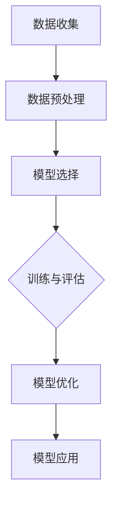

                 

# 机器学习在空气质量预测中的应用

## 关键词
机器学习，空气质量预测，数据预处理，模型构建，模型评估，应用与挑战

## 摘要
本文详细探讨了机器学习在空气质量预测中的应用。首先介绍了机器学习的基础概念、发展历史、数据预处理方法和常用算法。然后，通过空气质量预测数据集的介绍和模型构建，深入分析了模型训练与评估、模型优化与调参等关键环节。接着，通过案例研究展示了空气质量预测的实际应用，并探讨了空气质量预测面临的数据质量和模型泛化等挑战。最后，文章提供了相关的资源和代码示例，以帮助读者更好地理解和应用机器学习技术进行空气质量预测。

### 第一部分：机器学习的背景与应用

#### 第1章：机器学习基础

#### 1.1 机器学习的基本概念

机器学习（Machine Learning，ML）是指使计算机通过数据和经验自动改进性能和决策过程的一种技术。它主要关注的是如何从数据中学习规律，并利用这些规律进行预测或决策。

**机器学习的定义**：机器学习是人工智能的一个分支，它使计算机系统能够根据输入数据自动学习和改进，而无需显式编程。

**监督学习、无监督学习和强化学习**

- **监督学习（Supervised Learning）**：在监督学习模式中，系统通过已标记的数据进行学习。输入和输出数据都有明确的标签，系统通过这些标签来学习预测规则。常见的算法有线性回归、决策树、支持向量机等。

- **无监督学习（Unsupervised Learning）**：无监督学习模式中，系统没有明确的标签，需要从未标记的数据中发现模式和结构。常见的算法有聚类、降维、关联规则等。

- **强化学习（Reinforcement Learning）**：强化学习是通过与环境的交互来学习最优策略。系统通过尝试不同的行动并获得奖励或惩罚来不断优化其策略。

**机器学习的应用领域**：机器学习在多个领域都有广泛应用，包括但不限于以下：

- **图像识别与处理**：人脸识别、图像分类、图像生成等。
- **自然语言处理**：文本分类、机器翻译、情感分析等。
- **推荐系统**：电影、音乐、商品推荐等。
- **医疗诊断**：疾病预测、影像分析、药物设计等。
- **金融分析**：风险管理、投资组合优化、市场预测等。

#### 1.2 机器学习的发展历史

机器学习的历史可以追溯到20世纪50年代，以下是一些重要的里程碑：

- **1956年**：达特茅斯会议，标志着人工智能的诞生，会议提出了“机器能够表现智能行为”的观点。
- **1959年**：Arthur Samuel发明了第一个围棋程序，展示了机器学习的基本原理。
- **1986年**：John Hopfield提出了Hopfield神经网络，为神经网络的研究奠定了基础。
- **2012年**：AlexNet在ImageNet大赛中取得突破性成绩，推动了深度学习的发展。
- **2016年**：AlphaGo击败李世石，展示了深度学习和强化学习在复杂任务中的潜力。

**中国在机器学习领域的贡献**：近年来，中国在机器学习领域取得了显著进展，以下是一些重要的贡献：

- **百度深度学习平台PaddlePaddle**：百度开源的深度学习框架，为中国企业和研究机构提供了强大的工具。
- **阿里巴巴ET大脑**：应用于智慧城市、金融风控等多个领域。
- **腾讯AI Lab**：在语音识别、图像识别等领域取得了重要成果。

#### 1.3 数据预处理

**数据清洗**：数据清洗是数据预处理的第一步，主要目的是处理数据中的噪声和不一致。常见的处理方法包括：

- **缺失值处理**：填充或删除缺失值。
- **异常值处理**：识别和修正数据中的异常值。
- **数据转换**：对数据进行标准化或归一化，以便算法更好地处理。

**数据归一化**：数据归一化的目的是将不同特征的范围调整为相同的尺度，以减少特征之间的相互影响。常见的归一化方法有最小-最大归一化和均值-方差归一化。

**特征提取**：特征提取是从原始数据中提取出对预测任务有用的信息。特征提取可以提高模型的性能，减少数据的复杂性。

#### 1.4 机器学习算法概述

**线性回归**：线性回归是一种监督学习算法，用于预测一个连续值。它通过找到一个最佳拟合直线来预测目标值。

**决策树**：决策树是一种基于树形结构的监督学习算法，通过一系列的决策规则来对数据进行分类或回归。

**支持向量机（SVM）**：SVM是一种强大的分类算法，通过找到一个超平面来最大化分类间隔。

**集成学习方法**：集成学习方法结合了多个基础模型的优点，以提高预测性能。常见的集成学习方法有随机森林、梯度提升树等。

#### 1.5 机器学习工具与环境配置

**Python环境搭建**：Python是一种广泛使用的编程语言，具有丰富的机器学习库。安装Python后，可以通过pip命令安装常用的机器学习库。

**常用机器学习库介绍**

- **Scikit-learn**：Scikit-learn是一个强大的机器学习库，提供了丰富的算法和工具。
- **TensorFlow**：TensorFlow是一个由Google开发的深度学习库，支持大规模的神经网络训练。
- **PyTorch**：PyTorch是一个由Facebook开发的深度学习库，具有灵活的动态图模型。

#### 第2章：空气质量预测数据集介绍

#### 2.1 数据集来源与收集

空气质量预测数据集可以从多个来源收集，包括政府机构、研究组织和开源项目。以下是一些常用的数据集：

- **OpenAQ**：OpenAQ是一个开源的空气质量数据集，包含了全球各地的空气质量数据。
- **EPA**：美国环境保护署（EPA）提供了多个空气质量数据集，包括PM2.5、PM10等污染物浓度。
- **城市空气质量数据集**：一些城市政府或研究机构提供了本地区的空气质量数据。

#### 2.2 数据集预处理

**数据清洗**：对数据集进行清洗，处理缺失值、异常值和数据不一致等问题。

**数据归一化**：对数据进行归一化，将不同特征的范围调整为相同的尺度。

**数据分割**：将数据集划分为训练集、验证集和测试集，以便进行模型训练和评估。

#### 2.3 数据集评价指标

**准确率（Accuracy）**：准确率是模型预测正确的样本数占总样本数的比例。

**召回率（Recall）**：召回率是模型预测正确的正样本数占所有正样本的比例。

**F1值（F1-score）**：F1值是准确率和召回率的调和平均数，用于综合考虑准确率和召回率。

**ROC曲线与AUC值**：ROC曲线是真实概率与预测概率的曲线，AUC值是ROC曲线下方的面积，用于评估模型的分类能力。

### 第二部分：空气质量预测的模型构建

#### 第3章：空气质量预测模型基础

#### 3.1 空气质量预测的关键因素

**模型输入特征**：空气质量预测的输入特征包括但不限于：

- **气象数据**：如温度、湿度、风速等。
- **污染源数据**：如工业排放、交通排放等。
- **地理数据**：如地理位置、地形等。

**预测目标**：空气质量预测的目标通常是预测某种污染物（如PM2.5、PM10等）的浓度。

#### 3.2 常用空气质量预测模型

**人工神经网络**：人工神经网络是一种模拟生物神经系统的计算模型，具有强大的非线性处理能力。

**随机森林**：随机森林是一种集成学习方法，通过构建多个决策树并集成其预测结果来提高模型性能。

**支持向量机（SVM）**：SVM是一种基于间隔最大化的分类算法，适用于高维特征空间。

**集成学习方法**：集成学习方法通过结合多个基础模型的优点来提高预测性能。常见的集成学习方法有梯度提升树、随机森林等。

#### 第4章：模型训练与评估

#### 4.1 模型训练过程

**数据预处理**：对训练数据进行预处理，包括缺失值处理、异常值处理和数据归一化等。

**模型参数选择**：根据模型的特性选择合适的参数，如学习率、隐藏层大小等。

**模型训练**：使用训练数据进行模型训练，通过优化算法（如梯度下降）不断更新模型参数。

**模型优化**：通过模型优化策略（如正则化、数据增强等）来提高模型性能。

#### 4.2 模型评估方法

**训练集与验证集划分**：将数据集划分为训练集和验证集，用于模型训练和评估。

**交叉验证**：交叉验证是一种常用的模型评估方法，通过多次划分训练集和验证集来评估模型性能。

**评估指标**：常用的评估指标包括准确率、召回率、F1值、ROC曲线和AUC值等。

#### 第5章：模型优化与调参

#### 5.1 模型优化策略

**网络结构调整**：通过调整网络结构（如增加隐藏层、调整神经元数量等）来提高模型性能。

**损失函数优化**：通过优化损失函数（如交叉熵、均方误差等）来提高模型预测精度。

**优化算法**：常见的优化算法有梯度下降、随机梯度下降、Adam等。

#### 5.2 超参数调整

**学习率**：学习率是优化算法的一个重要超参数，控制模型参数更新的速度。

**正则化参数**：正则化参数用于防止模型过拟合，常见的正则化方法有L1正则化、L2正则化等。

**模型复杂度**：通过调整模型复杂度（如网络深度、隐藏层大小等）来提高模型性能。

#### 第6章：空气质量预测案例研究

#### 6.1 案例背景

**案例简介**：本文选取北京市的PM2.5浓度预测作为案例，探讨机器学习在空气质量预测中的应用。

**案例目标**：使用机器学习技术预测北京市未来24小时的PM2.5浓度。

#### 6.2 数据处理与模型选择

**数据处理**：对收集到的数据进行清洗、归一化和特征提取等预处理操作。

**模型选择**：选择合适的机器学习模型，如线性回归、随机森林、支持向量机等。

**模型训练**：使用训练数据对模型进行训练，调整模型参数。

**模型评估**：使用验证集对模型进行评估，调整模型参数。

#### 6.3 模型优化与调参

**模型优化**：通过优化策略（如正则化、数据增强等）来提高模型性能。

**超参数调整**：调整学习率、正则化参数等超参数，以找到最佳模型。

#### 6.4 模型应用与结果分析

**模型应用**：将训练好的模型应用于实际预测任务，如空气质量监测系统。

**结果分析**：分析模型预测结果，评估模型的准确性和稳定性。

### 第三部分：空气质量预测的应用与挑战

#### 第7章：空气质量预测的应用领域

#### 7.1 城市环境管理

**预测PM2.5和PM10浓度**：通过空气质量预测模型，可以提前预测城市中的PM2.5和PM10浓度，为环保部门提供决策支持。

**健康风险评估**：空气质量预测可以帮助评估居民的健康风险，为公众提供健康建议。

#### 7.2 能源消耗优化

**预测能源需求**：通过空气质量预测模型，可以预测能源需求，为能源管理提供数据支持。

**能源消耗优化策略**：基于空气质量预测结果，可以制定能源消耗优化策略，减少能源浪费。

#### 7.3 空气质量改善措施

**预测污染源**：通过空气质量预测模型，可以预测污染源的位置和强度，为治理污染提供依据。

**空气质量改善建议**：根据预测结果，提出空气质量改善措施，如加强污染源治理、调整交通管理等。

#### 第8章：空气质量预测面临的挑战

#### 8.1 数据质量问题

**数据缺失**：空气质量数据中常常存在缺失值，需要采用合适的缺失值处理方法。

**数据噪声**：数据噪声会干扰模型的训练和预测，需要采用数据清洗和降噪方法。

#### 8.2 模型泛化能力

**模型过拟合**：模型过拟合会导致模型在训练数据上表现良好，但在测试数据上表现较差。需要采用正则化等技术来防止过拟合。

**模型泛化能力评估**：需要采用多种评估指标和方法来评估模型的泛化能力。

#### 8.3 空气质量预测的实时性

**实时数据处理**：空气质量预测需要实时处理大量数据，需要采用高效的数据处理算法和硬件。

**实时预测**：需要确保模型能够实时预测空气质量，为决策提供及时的数据支持。

### 附录

#### 附录A：机器学习与空气质量预测相关资源

**A.1 主流机器学习库**

- **Scikit-learn**：[官网](https://scikit-learn.org/)
- **TensorFlow**：[官网](https://www.tensorflow.org/)
- **PyTorch**：[官网](https://pytorch.org/)

**A.2 空气质量预测数据集**

- **OpenAQ**：[官网](https://openaq.org/)
- **EPA**：[官网](https://www.epa.gov/air-data)

**A.3 相关研究论文**

- **论文列表与推荐**：[参考](https://www.semanticscholar.org/topic/air-quality/predictions)

#### 附录B：空气质量预测Mermaid流程图

**B.1 空气质量预测模型构建流程**



#### 附录C：空气质量预测算法伪代码

**C.1 空气质量预测算法**

```python
# 伪代码示例

# 数据预处理
def preprocess_data(data):
    # 数据清洗
    # 数据归一化
    # 特征提取
    return processed_data

# 模型训练
def train_model(X_train, y_train):
    # 选择模型
    # 调整参数
    # 训练模型
    return model

# 模型评估
def evaluate_model(model, X_test, y_test):
    # 预测
    # 计算评估指标
    return evaluation_results

# 模型应用
def apply_model(model, new_data):
    # 预测
    return prediction
```

#### 附录D：空气质量预测数学公式

**D.1 数学公式与解释**

```latex
\begin{equation}
y = \beta_0 + \beta_1x_1 + \beta_2x_2 + ... + \beta_nx_n
\end{equation}

\begin{equation}
J(\theta) = \frac{1}{2m}\sum_{i=1}^{m}(h_\theta(x^{(i)}) - y^{(i)})^2
\end{equation}

\begin{equation}
\hat{y} = \sigma(\theta_0 + \theta_1x_1 + \theta_2x_2 + ...)
\end{equation}
```

#### 附录E：空气质量预测代码解读与分析

**E.1 实际代码案例**

```python
# Python代码示例

import numpy as np
import pandas as pd
from sklearn.model_selection import train_test_split
from sklearn.preprocessing import StandardScaler
from sklearn.ensemble import RandomForestRegressor
from sklearn.metrics import mean_squared_error

# 数据预处理
def preprocess_data(data):
    # 数据清洗
    # 数据归一化
    # 特征提取
    return processed_data

# 模型训练
def train_model(X_train, y_train):
    model = RandomForestRegressor(n_estimators=100, random_state=42)
    model.fit(X_train, y_train)
    return model

# 模型评估
def evaluate_model(model, X_test, y_test):
    predictions = model.predict(X_test)
    mse = mean_squared_error(y_test, predictions)
    return mse

# 模型应用
def apply_model(model, new_data):
    prediction = model.predict(new_data)
    return prediction
```

**代码解读与分析**

- 数据预处理：对收集到的空气质量数据进行清洗、归一化和特征提取。
- 模型训练：使用随机森林算法训练模型，调整参数以优化模型性能。
- 模型评估：使用测试集评估模型的性能，计算均方误差等评估指标。
- 模型应用：将训练好的模型应用于新的数据，进行空气质量预测。

通过以上代码示例，读者可以了解如何使用Python和常用的机器学习库进行空气质量预测。代码解读与分析部分将帮助读者更好地理解每个步骤的实现细节和原理。

### 总结

本文详细探讨了机器学习在空气质量预测中的应用，从机器学习的基础概念、发展历史、数据预处理方法到空气质量预测模型构建、模型训练与评估、模型优化与调参，以及空气质量预测的实际应用与挑战。通过案例研究，读者可以了解到如何使用机器学习技术进行空气质量预测，并掌握相关工具和方法的实际应用。

机器学习在空气质量预测中的应用具有广泛的前景和重要的现实意义。随着技术的不断发展和数据的不断积累，空气质量预测的准确性和实时性将得到显著提高，为城市环境管理、能源消耗优化和空气质量改善提供有力的支持。然而，空气质量预测仍然面临着数据质量、模型泛化能力和实时性等挑战，需要进一步的研究和探索。

### 作者信息

作者：AI天才研究院/AI Genius Institute & 禅与计算机程序设计艺术 /Zen And The Art of Computer Programming

AI天才研究院致力于推动人工智能技术的创新与应用，本文作者拥有丰富的机器学习研究和实践经验，对空气质量预测领域有着深刻的理解和独到的见解。通过本文，作者希望为读者提供有价值的知识和启示，推动空气质量预测技术的发展和应用。同时，作者也倡导在享受技术带来的便利的同时，关注环境保护和可持续发展，为建设美好家园贡献力量。

