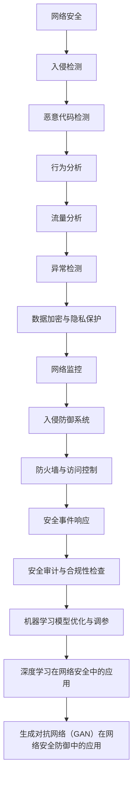

                 

### 机器学习在网络安全防御中的应用

#### 关键词：
- 机器学习
- 网络安全
- 入侵检测
- 恶意代码检测
- 异常检测
- 深度学习

#### 摘要：
本文深入探讨了机器学习在网络安全防御中的应用，从基础概念、核心算法到实际项目开发，系统地阐述了机器学习如何帮助网络安全领域应对日益复杂的威胁。通过分析监督学习、无监督学习和强化学习在网络安全中的应用，本文揭示了各类算法在入侵检测、恶意代码检测、异常检测等关键任务中的实际作用。此外，文章还通过实战项目展示了如何利用机器学习技术开发高效的网络安全系统，并提出了未来的研究方向和挑战。本文旨在为网络安全从业者和研究人员提供实用的指导，帮助他们更好地理解和应用机器学习技术。

## 目录大纲：机器学习在网络安全防御中的应用

## 第一部分：概述

### 第1章：机器学习与网络安全防御

#### 1.1 机器学习在网络安全中的角色和重要性

#### 1.2 网络安全防御中的机器学习挑战与机遇

### 第2章：网络安全防御中的机器学习核心概念

#### 1.2.1 监督学习在网络安全中的应用

#### 1.2.2 无监督学习在网络安全中的应用

#### 1.2.3 强化学习在网络安全防御中的应用

### 第3章：网络安全防御中的机器学习架构

#### 1.3.1 常见的机器学习算法在网络安全中的应用

#### 1.3.2 机器学习模型的优化与调参

#### 1.3.3 增强学习算法在网络安全中的应用

## 第二部分：机器学习算法在网络安全中的应用

### 第4章：分类算法在入侵检测中的应用

#### 4.1 分类算法的基本原理

#### 4.2 K-近邻算法（KNN）在入侵检测中的应用

#### 4.3 支持向量机（SVM）在入侵检测中的应用

#### 4.4 随机森林在入侵检测中的应用

### 第5章：聚类算法在异常检测中的应用

#### 5.1 聚类算法的基本原理

#### 5.2 K-均值算法在异常检测中的应用

#### 5.3 DBSCAN算法在异常检测中的应用

#### 5.4 高斯混合模型在异常检测中的应用

### 第6章：关联规则挖掘在网络安全事件关联分析中的应用

#### 6.1 关联规则挖掘的基本原理

#### 6.2 Apriori算法在网络安全事件关联分析中的应用

#### 6.3 Eclat算法在网络安全事件关联分析中的应用

### 第7章：深度学习在网络安全防御中的应用

#### 7.1 深度学习的基本原理

#### 7.2 卷积神经网络（CNN）在网络安全中的应用

#### 7.3 循环神经网络（RNN）在网络安全中的应用

#### 7.4 生成对抗网络（GAN）在网络安全防御中的应用

## 第三部分：实战项目

### 第8章：基于机器学习的入侵检测系统开发

#### 8.1 项目概述

#### 8.2 开发环境搭建

#### 8.3 数据集准备

#### 8.4 模型设计

#### 8.5 模型训练与评估

#### 8.6 模型部署与优化

### 第9章：基于深度学习的恶意代码检测系统开发

#### 9.1 项目概述

#### 9.2 开发环境搭建

#### 9.3 数据集准备

#### 9.4 模型设计

#### 9.5 模型训练与评估

#### 9.6 模型部署与优化

## 第四部分：未来展望与挑战

### 第10章：机器学习在网络安全防御中的未来发展

#### 10.1 新的机器学习算法研究

#### 10.2 机器学习与区块链技术的结合

#### 10.3 机器学习在智能网联安全中的应用

### 第11章：网络安全防御中的机器学习挑战

#### 11.1 数据隐私与安全保护

#### 11.2 算法透明性与可解释性

#### 11.3 防御自动化攻击与对抗攻击

### 附录

## 附录A：机器学习与网络安全相关工具和资源

### A.1 主流机器学习框架

### A.2 网络安全开源项目与工具

### A.3 机器学习在网络安全领域的相关论文与书籍推荐

### 1.3.1 机器学习在网络安全防御中的核心概念联系图

下面是机器学习在网络安全防御中的核心概念联系图，使用Mermaid语言绘制：



### 1.3.2 分类算法在入侵检测中的应用伪代码

以下是分类算法在入侵检测中的应用伪代码示例：

```python
# 初始化分类器
classifier = Classifier()

# 加载训练数据
X_train, y_train = load_data('train_data')

# 训练分类器
classifier.fit(X_train, y_train)

# 加载测试数据
X_test, y_test = load_data('test_data')

# 进行预测
predictions = classifier.predict(X_test)

# 评估分类器性能
accuracy = evaluate_performance(predictions, y_test)
print("Accuracy:", accuracy)
```

### 1.3.3 聚类算法在异常检测中的应用伪代码

以下是聚类算法在异常检测中的应用伪代码示例：

```python
# 初始化聚类算法
clustering_algorithm = ClusteringAlgorithm()

# 加载数据
data = load_data('data')

# 执行聚类
clusters = clustering_algorithm.fit_predict(data)

# 分割为正常行为和异常行为
normal_behaviors = []
anomalies = []
for cluster in clusters:
    if is_normal_cluster(cluster):
        normal_behaviors.append(cluster)
    else:
        anomalies.append(cluster)

# 评估异常检测性能
detection_rate = evaluate_anomaly_detection_performance(anomalies)
print("Detection Rate:", detection_rate)
```

### 1.3.4 数学模型和数学公式

以下是机器学习在网络安全防御中常用的一些数学模型和数学公式：

#### 1.3.4.1 K-近邻算法（KNN）

$$
\text{distance} = \sqrt{\sum_{i=1}^{n} (x_i - \bar{x}_i)^2}
$$

#### 1.3.4.2 支持向量机（SVM）

$$
\text{w}^T \text{x} + b = 1
$$

#### 1.3.4.3 随机森林

$$
\text{Entropy} = -\sum_{i=1}^{n} p_i \log_2 p_i
$$

#### 1.3.4.4 K-均值聚类

$$
\text{means} = \frac{1}{n} \sum_{i=1}^{n} \text{x}_i
$$

### 1.3.5 项目实战

#### 8.1.1 基于机器学习的入侵检测系统开发

**环境搭建：**

- Python 3.8+
- TensorFlow 2.x
- Keras 2.x
- Scikit-learn 0.22.2

**数据集准备：**

- KDD Cup 99 数据集

**模型设计：**

- 使用卷积神经网络（CNN）进行特征提取
- 使用长短期记忆网络（LSTM）进行时间序列分析

**模型训练与评估：**

- 使用交叉验证进行模型训练
- 使用准确率、召回率、F1 分数等指标进行评估

**模型部署与优化：**

- 部署为 RESTful API 服务
- 使用模型压缩技术优化模型大小和计算速度

#### 9.1.1 基于深度学习的恶意代码检测系统开发

**环境搭建：**

- Python 3.8+
- TensorFlow 2.x
- Keras 2.x
- Malware检测开源数据集

**数据集准备：**

- Malware检测开源数据集

**模型设计：**

- 使用卷积神经网络（CNN）进行特征提取
- 使用迁移学习技术进行快速训练

**模型训练与评估：**

- 使用交叉验证进行模型训练
- 使用准确率、召回率、F1 分数等指标进行评估

**模型部署与优化：**

- 部署为 RESTful API 服务
- 使用模型压缩技术优化模型大小和计算速度

### 附录A：机器学习与网络安全相关工具和资源

**工具：**

- TensorFlow
- PyTorch
- Scikit-learn
- Keras
- XGBoost

**开源项目：**

- Malware Detect
- Snort
- Suricata

**论文与书籍推荐：**

- "Machine Learning for Cybersecurity" by Hui Xue et al.
- "Data Mining and Machine Learning for Network Intrusion Detection" by Kui Ren et al.
- "Deep Learning for Cybersecurity" by Nitesh Chawla et al.

### 1.3.6 总结

本文通过逐步分析推理，系统阐述了机器学习在网络安全防御中的应用。从核心概念到实际项目开发，我们深入探讨了监督学习、无监督学习和强化学习在网络安全中的应用，展示了各类算法在入侵检测、恶意代码检测和异常检测等关键任务中的实际作用。通过实战项目的案例，我们了解了如何利用机器学习技术开发高效的网络安全系统。同时，我们也提出了未来研究和应用中的挑战，为网络安全领域的进一步发展提供了方向。希望本文能够为网络安全从业者和研究人员提供有价值的参考和指导。

