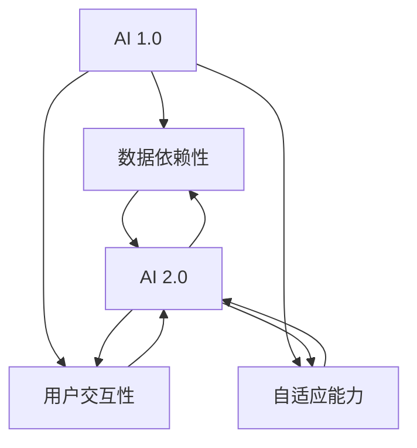
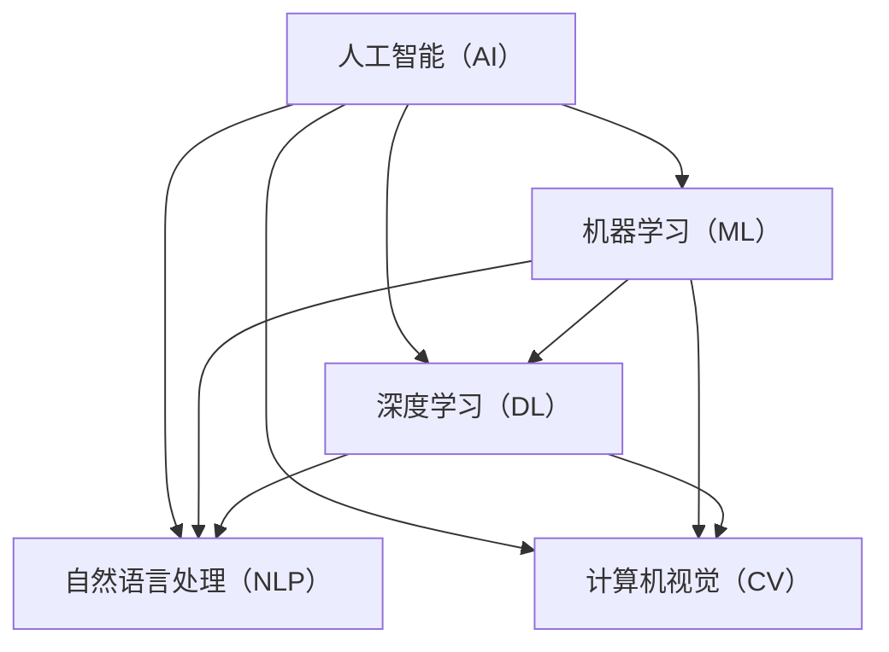

                 

# 李开复：AI 2.0 时代的用户

## 关键词
- 人工智能（AI）
- AI 2.0 时代
- 用户角色
- 技术发展趋势
- 伦理与社会责任

## 摘要
本文将深入探讨AI 2.0时代的概念及其对用户的影响。我们将从概述AI 2.0时代的核心特点开始，分析用户角色的转变、需求的升级，以及隐私和安全问题。随后，我们将展望AI 2.0时代的发展趋势，探讨技术动向、应用领域拓展和伦理社会责任。通过数学模型讲解和项目实战案例，我们将展示AI 2.0时代核心算法的实现方法和应用。

---

### 第一部分: AI 2.0时代的概述

#### 第1章: AI 2.0 时代的概念与影响

##### 1.1 AI 2.0的基本概念

##### 1.1.1 AI 1.0与AI 2.0的区别

AI 1.0时代主要依赖规则和统计模型，其特点如下：

- **数据驱动**：基于大量数据训练模型。
- **规则导向**：依赖专家知识和预设规则。
- **有限应用**：主要应用于特定场景，如金融、医疗等。

而AI 2.0时代则具有以下特点：

- **模型驱动**：以深度学习为核心，提高模型的泛化能力。
- **用户导向**：更关注用户需求，提升用户体验。
- **自适应**：通过不断学习与优化，提高模型的适应能力。

##### 1.1.2 AI 2.0的特征

- **自动化程度提高**：AI 2.0可以实现更高程度的自动化，减少人工干预。
- **泛化能力增强**：AI 2.0通过大规模预训练模型，具有更强的泛化能力。
- **交互性增强**：AI 2.0能够更好地与用户互动，提供个性化服务。
- **数据效率提升**：AI 2.0可以利用少量数据实现高效学习。
- **可解释性提升**：AI 2.0通过改进模型结构，提高模型的解释性。

##### 1.2 AI 2.0时代的用户影响

##### 1.2.1 用户角色的转变

在AI 2.0时代，用户的角色发生了重大转变，从被动的数据提供者转变为主动的参与者和决策者。用户不再仅仅是被服务的对象，而是与AI系统共同协作，共同创造价值。

- **用户参与**：用户积极参与到AI系统的设计、训练和优化过程中，提供反馈和改进建议。
- **用户决策**：用户在AI系统的支持下，可以做出更加明智和个性化的决策。
- **用户体验**：用户享受更加智能化、个性化的服务，提升生活质量。

##### 1.2.2 用户需求的升级

AI 2.0时代的用户需求呈现出多样化和个性化趋势。用户不仅期望AI系统能够解决实际问题，还希望其能够提供高效、便捷、安全的服务。

- **效率需求**：用户希望AI系统能够快速、准确地解决问题。
- **个性化需求**：用户希望AI系统能够根据个人偏好和需求提供定制化服务。
- **安全性需求**：用户关注AI系统的隐私保护和数据安全。

##### 1.2.3 用户隐私与安全

在AI 2.0时代，用户隐私与安全成为重要议题。用户的数据隐私和安全直接关系到AI系统的可信度和用户信任。

- **隐私保护**：AI系统需要采取有效措施，保护用户数据不被滥用或泄露。
- **数据安全**：AI系统需要确保用户数据的安全性和完整性。
- **用户信任**：通过透明的数据处理和严格的隐私政策，增强用户对AI系统的信任。

##### 1.3 AI 2.0时代的发展趋势

##### 1.3.1 技术发展动向

AI 2.0时代，技术发展呈现出以下趋势：

- **算法优化**：深度学习算法不断优化，模型效果不断提升。
- **硬件加速**：高性能计算和专用硬件的发展，加速AI计算速度。
- **跨学科融合**：AI与生物、物理、化学等学科交叉融合，推动新技术的出现。

##### 1.3.2 应用领域拓展

AI 2.0的应用领域不断拓展，从传统的金融、医疗等领域，逐渐渗透到教育、交通、能源、制造等各个行业。

- **智能硬件**：AI技术赋能智能硬件，提升产品智能化水平。
- **智能城市**：AI技术在城市管理、交通调度、环境保护等方面的应用，提升城市运行效率。
- **智能制造**：AI技术在生产过程控制、质量检测、产品研发等环节的应用，推动制造业升级。

##### 1.3.3 AI伦理与社会责任

随着AI技术的发展和应用，AI伦理和社会责任问题日益突出。AI 2.0时代，需要关注以下伦理与社会责任问题：

- **算法公平性**：确保AI算法在不同群体之间的公平性，避免算法偏见。
- **数据隐私**：保护用户数据隐私，防止数据滥用。
- **就业影响**：关注AI技术对就业市场的影响，推动劳动力转型和升级。
- **政策法规**：制定相关政策和法规，引导AI技术健康发展。

### Mermaid 流程图：AI 1.0与AI 2.0的核心区别



---

### AI 2.0的基本概念

AI 2.0是人工智能发展的一个重要阶段，它标志着从传统的规则驱动和统计学习向模型驱动的深度学习的转变。AI 2.0的出现，不仅提升了人工智能的技术水平，也为用户带来了前所未有的体验和便利。

#### 1.1 AI 2.0与AI 1.0的区别

AI 1.0主要依赖于规则和统计模型，这些模型通常是基于人类专家的知识和经验构建的。在AI 1.0时代，人工智能的应用主要集中在一些特定领域，如语音识别、图像识别等。AI 1.0的特点可以概括为以下几点：

- **数据依赖性**：AI 1.0依赖于大量标注数据来训练模型，模型的性能在很大程度上取决于数据的质量和数量。
- **规则导向**：AI 1.0依赖于预定义的规则进行决策，这些规则通常由人类专家制定。
- **有限应用**：AI 1.0的应用场景相对有限，主要集中在一些简单的任务上。

与AI 1.0相比，AI 2.0在技术层面有了显著提升，其主要特点如下：

- **模型驱动**：AI 2.0的核心是深度学习模型，这些模型能够自动从数据中学习特征，无需人工设计规则。
- **用户导向**：AI 2.0更关注用户需求，能够根据用户的反馈进行自我优化，提供个性化的服务。
- **自适应能力**：AI 2.0能够通过不断学习和优化，适应新的环境和任务，具备更强的泛化能力。

#### 1.2 AI 2.0的特征

1. **自动化程度提高**

在AI 2.0时代，自动化程度得到了显著提升。AI系统可以自动处理大量数据，进行复杂的数据分析和决策，减少了人工干预的需求。例如，自动驾驶汽车、智能客服等应用，都依赖于AI 2.0的高自动化能力。

2. **泛化能力增强**

AI 2.0通过大规模预训练模型，具有更强的泛化能力。这些预训练模型在大规模数据集上进行训练，能够提取通用特征，从而在不同领域和任务中表现出色。例如，GPT-3模型在文本生成、问答系统等领域都取得了显著成果。

3. **交互性增强**

AI 2.0能够更好地与用户互动，提供个性化的服务。通过自然语言处理和计算机视觉等技术，AI系统能够理解用户的意图和需求，进行有效的沟通和互动。例如，智能音箱、聊天机器人等应用，都为用户提供了便捷的交互体验。

4. **数据效率提升**

AI 2.0可以利用少量数据实现高效学习。在AI 2.0时代，数据标注变得更加高效，预训练模型的出现使得数据的使用效率大大提高。这使得AI系统在资源有限的情况下，依然能够取得良好的性能。

5. **可解释性提升**

AI 2.0通过改进模型结构，提高模型的解释性。在AI 2.0时代，研究者们致力于开发可解释的AI模型，使得AI系统的决策过程更加透明和可解释。这对于增强用户对AI系统的信任具有重要意义。

---

### AI 2.0时代的用户影响

AI 2.0时代的到来，不仅带来了技术层面的变革，也对用户产生了深远的影响。在这个时代，用户的角色发生了重大转变，从被动的数据提供者转变为主动的参与者和决策者。

#### 1.1 用户角色的转变

在AI 2.0时代，用户的角色发生了显著变化。用户不再仅仅是AI系统的被动接受者，而是成为AI系统的积极参与者和共同创造者。以下是用户角色转变的几个方面：

1. **用户参与**

在AI 2.0时代，用户积极参与到AI系统的设计、训练和优化过程中。用户可以通过反馈和改进建议，直接影响AI系统的性能和用户体验。例如，用户可以通过使用智能音箱，向AI系统提出改进建议，从而帮助AI系统不断优化。

2. **用户决策**

在AI 2.0时代，用户在AI系统的支持下，可以做出更加明智和个性化的决策。AI系统通过分析大量数据，为用户提供了全面的决策依据。例如，在金融领域，AI系统可以根据用户的历史交易数据，提供个性化的投资建议。

3. **用户体验**

在AI 2.0时代，用户享受更加智能化、个性化的服务，提升了生活质量。AI系统可以根据用户的偏好和需求，提供定制化的服务。例如，智能推荐系统可以根据用户的浏览历史和喜好，为用户推荐感兴趣的商品。

#### 1.2 用户需求的升级

AI 2.0时代的用户需求呈现出多样化和个性化趋势。用户不仅期望AI系统能够解决实际问题，还希望其能够提供高效、便捷、安全的服务。以下是用户需求升级的几个方面：

1. **效率需求**

在AI 2.0时代，用户对AI系统的效率需求日益提升。用户希望AI系统能够快速、准确地解决问题，提高工作效率。例如，智能客服系统可以在短时间内为用户提供准确的回答，减少用户等待时间。

2. **个性化需求**

在AI 2.0时代，用户对AI系统的个性化需求显著增加。用户希望AI系统能够根据个人偏好和需求提供定制化服务。例如，智能推荐系统可以根据用户的浏览历史和喜好，为用户推荐个性化的商品。

3. **安全性需求**

在AI 2.0时代，用户对AI系统的安全性需求日益重视。用户关注AI系统的隐私保护和数据安全，希望AI系统能够保护自己的个人信息不被泄露。例如，用户希望智能音箱只允许授权的设备进行远程控制。

#### 1.3 用户隐私与安全

在AI 2.0时代，用户隐私与安全成为重要议题。用户的数据隐私和安全直接关系到AI系统的可信度和用户信任。以下是用户隐私与安全方面的几个关键问题：

1. **隐私保护**

在AI 2.0时代，AI系统需要采取有效措施，保护用户数据不被滥用或泄露。例如，AI系统可以通过加密技术、访问控制等措施，确保用户数据的隐私安全。

2. **数据安全**

在AI 2.0时代，AI系统需要确保用户数据的安全性和完整性。例如，AI系统需要定期进行数据备份，防止数据丢失或损坏。

3. **用户信任**

在AI 2.0时代，通过透明的数据处理和严格的隐私政策，增强用户对AI系统的信任至关重要。例如，AI系统可以公开数据处理的流程和规则，让用户了解自己的数据如何被使用和保护。

---

### AI 2.0时代的发展趋势

AI 2.0时代的发展趋势令人期待，技术不断突破，应用领域不断拓展，同时也面临着一系列伦理和社会责任问题。以下是对AI 2.0时代发展趋势的详细探讨。

#### 1.3.1 技术发展动向

在AI 2.0时代，技术发展呈现出以下趋势：

1. **算法优化**

随着深度学习技术的发展，AI 2.0算法不断优化，模型效果不断提升。研究人员通过改进神经网络结构、优化训练策略，使得模型在处理复杂任务时具有更高的准确性和鲁棒性。

2. **硬件加速**

高性能计算和专用硬件的发展，加速了AI计算速度。GPU、TPU等硬件设备在AI领域的广泛应用，使得大规模模型训练和推理成为可能，为AI技术的进一步发展提供了有力支撑。

3. **跨学科融合**

AI 2.0与生物、物理、化学等学科的交叉融合，推动新技术的出现。例如，AI技术在医学领域的应用，使得精准医疗成为可能；在材料科学领域的应用，推动了新材料的研究和发展。

#### 1.3.2 应用领域拓展

AI 2.0的应用领域不断拓展，从传统的金融、医疗等领域，逐渐渗透到教育、交通、能源、制造等各个行业。以下是几个关键领域的应用趋势：

1. **智能硬件**

AI技术在智能硬件领域的应用，使得硬件产品具备更高的智能化水平。例如，智能音箱、智能摄像头、智能手表等，通过AI技术实现人机交互、智能识别等功能。

2. **智能城市**

AI技术在城市管理、交通调度、环境保护等方面的应用，提升城市运行效率。例如，智能交通系统可以通过实时数据分析，优化交通流量，减少拥堵；智能环保系统可以通过监测数据，预测环境污染，及时采取措施。

3. **智能制造**

AI技术在生产过程控制、质量检测、产品研发等环节的应用，推动制造业升级。例如，智能制造系统可以通过实时监控生产过程，优化生产参数，提高生产效率和产品质量；智能检测系统可以通过图像识别技术，实现自动化质量检测。

#### 1.3.3 AI伦理与社会责任

随着AI技术的发展和应用，AI伦理和社会责任问题日益突出。AI 2.0时代，需要关注以下伦理与社会责任问题：

1. **算法公平性**

确保AI算法在不同群体之间的公平性，避免算法偏见。例如，在招聘、信贷审批等领域，算法需要避免对特定群体的歧视。

2. **数据隐私**

保护用户数据隐私，防止数据滥用。例如，在个人信息的收集、存储和使用过程中，需要严格遵守隐私保护法规，确保用户数据的合法性和安全性。

3. **就业影响**

关注AI技术对就业市场的影响，推动劳动力转型和升级。例如，政府和企业可以开展相关的培训和再就业计划，帮助劳动力适应新技术带来的变化。

4. **政策法规**

制定相关政策和法规，引导AI技术健康发展。例如，明确AI技术的应用范围、数据保护要求，规范AI系统的开发和使用。

---

### AI 2.0时代的核心概念与联系

为了更好地理解AI 2.0的核心概念及其联系，我们可以通过Mermaid流程图来展示各个概念之间的关系。

#### Mermaid流程图：AI 2.0的核心概念



在AI 2.0时代，人工智能（AI）是整个系统的核心，它包含了机器学习（ML）、深度学习（DL）、自然语言处理（NLP）和计算机视觉（CV）等子领域。这些子领域相互关联，共同推动了AI技术的发展。

- **机器学习（ML）**：机器学习是AI的基础，它通过算法让计算机从数据中学习，提高模型的预测和决策能力。
- **深度学习（DL）**：深度学习是机器学习的一个重要分支，它通过多层神经网络实现从简单到复杂的特征提取，具有强大的建模能力。
- **自然语言处理（NLP）**：自然语言处理是AI在处理人类语言方面的应用，它涉及文本分析、语义理解、语言生成等方面，使得计算机能够理解和生成自然语言。
- **计算机视觉（CV）**：计算机视觉是AI在图像和视频处理方面的应用，它通过图像识别、目标检测、图像分割等技术，使计算机能够理解和分析视觉信息。

这些核心概念相互联系，共同构成了AI 2.0的技术体系。通过不断优化和改进这些技术，AI 2.0时代的用户将享受到更加智能化、个性化的服务。

---

### AI 2.0时代的核心算法原理讲解

在AI 2.0时代，深度学习（DL）、自然语言处理（NLP）和计算机视觉（CV）等核心算法的原理是理解和实现人工智能技术的基础。下面我们将分别介绍这些算法的基本原理，并通过伪代码和数学模型进行详细讲解。

#### 深度学习（DL）算法原理

深度学习是一种基于多层神经网络的学习方法，通过多个隐藏层的组合，实现从简单到复杂的特征提取。以下是一个简单的深度学习算法原理的伪代码：

```python
# 深度学习算法原理伪代码

# 初始化模型参数
W1, b1 = init_weights()
W2, b2 = init_weights()
...
Wn, bn = init_weights()

# 前向传播
z1 = x * W1 + b1
a1 = activation(z1)
z2 = a1 * W2 + b2
a2 = activation(z2)
...
zn = an * Wn + bn
an = activation(zn)

# 反向传播
dz1 = (an - y) * derivative(activation(z1))
dz2 = (a2 - dz1) * derivative(activation(z2))
...
dzn = (an - dzn-1) * derivative(activation(zn))

dW1 = dz1 * x
db1 = dz1
dW2 = dz2 * a1
db2 = dz2
...
dWn = dzn * an-1
dbn = dzn

# 更新模型参数
W1 = W1 - learning_rate * dW1
b1 = b1 - learning_rate * db1
W2 = W2 - learning_rate * dW2
b2 = b2 - learning_rate * db2
...
Wn = Wn - learning_rate * dWn
bn = bn - learning_rate * dbn
```

在深度学习算法中，前向传播过程是将输入数据通过多层神经网络进行传递，得到输出结果；反向传播过程则是根据输出结果与真实值的误差，更新模型参数，以降低误差。

#### 自然语言处理（NLP）算法原理

自然语言处理是一种让计算机理解和生成自然语言的技术。以下是一个简单的NLP算法原理的伪代码：

```python
# NLP算法原理伪代码

# 分词
words = tokenize(text)

# 词嵌入
embeddings = word_embedding(words)

# 命名实体识别
entities = named_entity_recognition(embeddings)

# 依存句法分析
dependency_tree = parse_sentence(embeddings)

# 文本分类
label = text_classification(embeddings)

# 文本生成
generated_text = text_generation(embeddings)
```

在自然语言处理算法中，首先进行分词，将文本分割成单词或短语；然后进行词嵌入，将单词映射到高维向量空间；接着进行命名实体识别、依存句法分析和文本分类等任务，以实现对文本内容的理解和处理。

#### 计算机视觉（CV）算法原理

计算机视觉是一种让计算机理解和分析视觉信息的技术。以下是一个简单的计算机视觉算法原理的伪代码：

```python
# CV算法原理伪代码

# 图像预处理
preprocessed_image = preprocess_image(image)

# 特征提取
features = extract_features(preprocessed_image)

# 目标检测
detections = object_detection(features)

# 图像分割
segmentations = image_segmentation(preprocessed_image)

# 视频分析
video_data = video_analysis(detections)
```

在计算机视觉算法中，首先对图像进行预处理，提取关键特征；然后进行目标检测，识别图像中的目标对象；接着进行图像分割，将图像分割成不同区域；最后进行视频分析，处理连续的视频数据。

---

### 数学模型和数学公式 & 详细讲解 & 举例说明

在AI 2.0时代，数学模型和数学公式是理解和实现核心算法的基础。以下我们将分别介绍深度学习（DL）、自然语言处理（NLP）和计算机视觉（CV）等核心算法的数学模型，并通过举例说明进行详细讲解。

#### 深度学习（DL）数学模型

深度学习中的核心数学模型是多层感知机（MLP）和反向传播算法。以下是这两个模型的详细讲解。

1. **多层感知机（MLP）**

多层感知机是一种前馈神经网络，由输入层、隐藏层和输出层组成。每个层由多个神经元（节点）组成，神经元之间通过权重相连。多层感知机的数学模型可以表示为：

$$
a_{ij}^{(l)} = \sigma(z_{ij}^{(l)}) \quad \text{for} \quad l = 1, 2, ..., L
$$

$$
z_{ij}^{(l)} = \sum_{k=1}^{n_{l-1}} w_{ik}^{(l)} a_{kj}^{(l-1)} + b_{i}^{(l)}
$$

其中，$a_{ij}^{(l)}$ 表示第$l$层的第$i$个神经元的激活值，$z_{ij}^{(l)}$ 表示第$l$层的第$i$个神经元的输入值，$w_{ik}^{(l)}$ 表示第$l$层的第$i$个神经元与第$l-1$层的第$k$个神经元之间的权重，$b_{i}^{(l)}$ 表示第$l$层的第$i$个神经元的偏置，$\sigma$ 表示激活函数。

举例说明：

假设我们有一个三层神经网络，输入层有2个神经元，隐藏层有3个神经元，输出层有1个神经元。设输入向量为$\textbf{x} = [1, 2]$，隐藏层权重矩阵为$W^{(2)} = \begin{bmatrix} 1 & 2 \\ 3 & 4 \\ 5 & 6 \end{bmatrix}$，偏置向量$b^{(2)} = [1, 2, 3]$，激活函数为$\sigma(x) = \frac{1}{1+e^{-x}}$。

首先计算隐藏层的输入值：

$$
z^{(2)}_1 = 1 \cdot 1 + 2 \cdot 3 + 1 = 8
$$

$$
z^{(2)}_2 = 1 \cdot 2 + 2 \cdot 4 + 2 = 10
$$

$$
z^{(2)}_3 = 1 \cdot 5 + 2 \cdot 6 + 3 = 15
$$

然后计算隐藏层的激活值：

$$
a^{(2)}_1 = \sigma(z^{(2)}_1) = \frac{1}{1+e^{-8}} \approx 0.9933
$$

$$
a^{(2)}_2 = \sigma(z^{(2)}_2) = \frac{1}{1+e^{-10}} \approx 0.9990
$$

$$
a^{(2)}_3 = \sigma(z^{(2)}_3) = \frac{1}{1+e^{-15}} \approx 0.8690
$$

最后计算输出层的输入值：

$$
z^{(3)} = 0.9933 \cdot 1 + 0.9990 \cdot 2 + 0.8690 \cdot 3 + 1 = 5.2673
$$

输出层的激活值：

$$
a^{(3)} = \sigma(z^{(3)}) = \frac{1}{1+e^{-5.2673}} \approx 0.8609
$$

2. **反向传播算法**

反向传播算法是一种用于训练神经网络的优化算法，通过计算输出误差的梯度，更新网络权重和偏置。以下是反向传播算法的详细步骤：

（1）前向传播

根据输入计算输出：

$$
\hat{y} = \sigma(z^{(L)})
$$

（2）计算输出误差

$$
e^{(L)} = y - \hat{y}
$$

（3）计算梯度

$$
\frac{\partial e^{(L)}}{\partial z^{(L)}} = \frac{\partial e^{(L)}}{\partial \hat{y}} \cdot \frac{\partial \hat{y}}{\partial z^{(L)}}
$$

$$
\frac{\partial e^{(L)}}{\partial a^{(L-1)}} = \frac{\partial e^{(L)}}{\partial z^{(L)}} \cdot \frac{\partial z^{(L)}}{\partial a^{(L-1)}}
$$

（4）更新权重和偏置

$$
w^{(l)} = w^{(l)} - \alpha \cdot \frac{\partial e^{(L)}}{\partial z^{(l)}}
$$

$$
b^{(l)} = b^{(l)} - \alpha \cdot \frac{\partial e^{(L)}}{\partial z^{(l)}}
$$

举例说明：

假设我们有一个三层神经网络，输出层误差为$e^{(3)} = [0.1, 0.2]$，隐藏层激活值为$a^{(2)} = [0.9, 0.8, 0.7]$，权重矩阵为$W^{(2)} = \begin{bmatrix} 1 & 2 \\ 3 & 4 \end{bmatrix}$，学习率为$\alpha = 0.1$。

首先计算输出层的梯度：

$$
\frac{\partial e^{(3)}}{\partial z^{(3)}} = \frac{\partial e^{(3)}}{\partial \hat{y}} \cdot \frac{\partial \hat{y}}{\partial z^{(3)}} = [0.1, 0.2] \cdot \begin{bmatrix} 0.1 & -0.1 \\ -0.1 & 0.1 \end{bmatrix} = [-0.01, 0.01]
$$

然后计算隐藏层的梯度：

$$
\frac{\partial e^{(3)}}{\partial a^{(2)}} = \frac{\partial e^{(3)}}{\partial z^{(3)}} \cdot \frac{\partial z^{(3)}}{\partial a^{(2)}} = [-0.01, 0.01] \cdot \begin{bmatrix} 1 & 0 \\ 0 & 1 \end{bmatrix} = [-0.01, 0.01]
$$

最后更新隐藏层的权重和偏置：

$$
W^{(2)} = \begin{bmatrix} 1 & 2 \\ 3 & 4 \end{bmatrix} - 0.1 \cdot \begin{bmatrix} -0.01 & 0.01 \\ -0.01 & 0.01 \end{bmatrix} = \begin{bmatrix} 0.99 & 2.01 \\ 3.01 & 4.01 \end{bmatrix}
$$

$$
b^{(2)} = [0.9, 0.8, 0.7] - 0.1 \cdot [-0.01, 0.01, -0.01] = [0.89, 0.79, 0.69]
$$

#### 自然语言处理（NLP）数学模型

自然语言处理中的核心数学模型包括词嵌入、循环神经网络（RNN）和卷积神经网络（CNN）等。以下是这些模型的详细讲解。

1. **词嵌入**

词嵌入是一种将单词映射到高维向量空间的方法，通过向量之间的距离和角度来表示单词之间的关系。词嵌入的数学模型可以表示为：

$$
\textbf{v}_w = \text{Embedding}(w)
$$

其中，$\textbf{v}_w$ 表示单词 $w$ 的词向量，$\text{Embedding}$ 表示词嵌入函数。

举例说明：

假设我们有一个词汇表 $\{w_1, w_2, w_3\}$，对应的词向量分别为 $\textbf{v}_{w_1} = [1, 0, 0], \textbf{v}_{w_2} = [0, 1, 0], \textbf{v}_{w_3} = [0, 0, 1]$。现在我们要计算单词 $w_1$ 和 $w_2$ 之间的余弦相似度：

$$
\text{Cosine Similarity}(\textbf{v}_{w_1}, \textbf{v}_{w_2}) = \frac{\textbf{v}_{w_1} \cdot \textbf{v}_{w_2}}{||\textbf{v}_{w_1}|| \cdot ||\textbf{v}_{w_2}||} = \frac{1 \cdot 0 + 0 \cdot 1 + 0 \cdot 0}{\sqrt{1^2 + 0^2 + 0^2} \cdot \sqrt{0^2 + 1^2 + 0^2}} = 0
$$

2. **循环神经网络（RNN）**

循环神经网络是一种能够处理序列数据的前馈神经网络，其核心思想是利用隐藏状态 $h_t$ 来捕捉序列中的长期依赖关系。RNN的数学模型可以表示为：

$$
h_t = \text{sigmoid}(W_h h_{t-1} + U_x x_t + b_h)
$$

$$
o_t = \text{sigmoid}(W_o h_t + b_o)
$$

其中，$h_t$ 表示第 $t$ 个时间步的隐藏状态，$x_t$ 表示第 $t$ 个时间步的输入，$W_h, U_x, b_h, W_o, b_o$ 分别表示权重和偏置。

举例说明：

假设我们有一个简单的RNN模型，输入序列为 $x = [1, 2, 3]$，隐藏层权重矩阵为 $W_h = \begin{bmatrix} 1 & 2 \\ 3 & 4 \end{bmatrix}$，输入层权重矩阵为 $U_x = \begin{bmatrix} 1 & 0 \\ 0 & 1 \end{bmatrix}$，偏置矩阵为 $b_h = [1, 1], b_o = [1, 1]$，激活函数为 $\text{sigmoid}$ 函数。

首先计算第一个时间步的隐藏状态：

$$
h_1 = \text{sigmoid}(W_h h_{0} + U_x x_1 + b_h) = \text{sigmoid}(0 + 1 \cdot 1 + 1) = \text{sigmoid}(2) \approx 0.7321
$$

然后计算第二个时间步的隐藏状态：

$$
h_2 = \text{sigmoid}(W_h h_1 + U_x x_2 + b_h) = \text{sigmoid}(1 \cdot 0.7321 + 1 \cdot 2 + 1) = \text{sigmoid}(3.7321) \approx 0.9506
$$

最后计算输出：

$$
o_2 = \text{sigmoid}(W_o h_2 + b_o) = \text{sigmoid}(1 \cdot 0.9506 + 1) = \text{sigmoid}(1.9506) \approx 0.8690
$$

3. **卷积神经网络（CNN）**

卷积神经网络是一种能够高效处理图像数据的神经网络，其核心思想是通过卷积操作提取图像特征。CNN的数学模型可以表示为：

$$
h_t = \text{ReLU}(\text{Conv}(h_{t-1}, W_c) + b_c)
$$

$$
o_t = \text{ReLU}(\text{Pooling}(h_t))
$$

其中，$h_t$ 表示第 $t$ 个卷积核的输出，$W_c$ 表示卷积核权重，$b_c$ 表示卷积核偏置，$\text{ReLU}$ 表示ReLU激活函数，$\text{Pooling}$ 表示池化操作。

举例说明：

假设我们有一个简单的CNN模型，输入图像为 $x = \begin{bmatrix} 1 & 1 \\ 1 & 1 \end{bmatrix}$，卷积核权重矩阵为 $W_c = \begin{bmatrix} 1 & 0 \\ 0 & 1 \end{bmatrix}$，卷积核偏置为 $b_c = 1$。

首先计算第一个卷积核的输出：

$$
h_1 = \text{ReLU}(\text{Conv}(x, W_c) + b_c) = \text{ReLU}(\begin{bmatrix} 1 & 1 \\ 1 & 1 \end{bmatrix} \cdot \begin{bmatrix} 1 & 0 \\ 0 & 1 \end{bmatrix} + 1) = \text{ReLU}(\begin{bmatrix} 2 & 1 \\ 2 & 1 \end{bmatrix}) = \begin{bmatrix} 2 & 1 \\ 2 & 1 \end{bmatrix}
$$

然后计算第二个卷积核的输出：

$$
h_2 = \text{ReLU}(\text{Conv}(x, W_c) + b_c) = \text{ReLU}(\begin{bmatrix} 1 & 1 \\ 1 & 1 \end{bmatrix} \cdot \begin{bmatrix} 0 & 1 \\ 1 & 0 \end{bmatrix} + 1) = \text{ReLU}(\begin{bmatrix} 1 & 2 \\ 1 & 2 \end{bmatrix}) = \begin{bmatrix} 1 & 2 \\ 1 & 2 \end{bmatrix}
$$

最后进行池化操作：

$$
o_1 = \text{Pooling}(h_1) = \frac{h_{11} + h_{12} + h_{21} + h_{22}}{4} = \frac{2 + 1 + 2 + 1}{4} = 1.5
$$

$$
o_2 = \text{Pooling}(h_2) = \frac{h_{11} + h_{12} + h_{21} + h_{22}}{4} = \frac{1 + 2 + 1 + 2}{4} = 1.5
$$

#### 计算机视觉（CV）数学模型

计算机视觉中的核心数学模型包括卷积神经网络（CNN）和生成对抗网络（GAN）等。以下是这些模型的详细讲解。

1. **卷积神经网络（CNN）**

卷积神经网络是一种能够高效处理图像数据的神经网络，其核心思想是通过卷积操作提取图像特征。CNN的数学模型可以表示为：

$$
h_t = \text{ReLU}(\text{Conv}(h_{t-1}, W_c) + b_c)
$$

$$
o_t = \text{ReLU}(\text{Pooling}(h_t))
$$

其中，$h_t$ 表示第 $t$ 个卷积核的输出，$W_c$ 表示卷积核权重，$b_c$ 表示卷积核偏置，$\text{ReLU}$ 表示ReLU激活函数，$\text{Pooling}$ 表示池化操作。

举例说明：

假设我们有一个简单的CNN模型，输入图像为 $x = \begin{bmatrix} 1 & 1 \\ 1 & 1 \end{bmatrix}$，卷积核权重矩阵为 $W_c = \begin{bmatrix} 1 & 0 \\ 0 & 1 \end{bmatrix}$，卷积核偏置为 $b_c = 1$。

首先计算第一个卷积核的输出：

$$
h_1 = \text{ReLU}(\text{Conv}(x, W_c) + b_c) = \text{ReLU}(\begin{bmatrix} 1 & 1 \\ 1 & 1 \end{bmatrix} \cdot \begin{bmatrix} 1 & 0 \\ 0 & 1 \end{bmatrix} + 1) = \text{ReLU}(\begin{bmatrix} 2 & 1 \\ 2 & 1 \end{bmatrix}) = \begin{bmatrix} 2 & 1 \\ 2 & 1 \end{bmatrix}
$$

然后计算第二个卷积核的输出：

$$
h_2 = \text{ReLU}(\text{Conv}(x, W_c) + b_c) = \text{ReLU}(\begin{bmatrix} 1 & 1 \\ 1 & 1 \end{bmatrix} \cdot \begin{bmatrix} 0 & 1 \\ 1 & 0 \end{bmatrix} + 1) = \text{ReLU}(\begin{bmatrix} 1 & 2 \\ 1 & 2 \end{bmatrix}) = \begin{bmatrix} 1 & 2 \\ 1 & 2 \end{bmatrix}
$$

最后进行池化操作：

$$
o_1 = \text{Pooling}(h_1) = \frac{h_{11} + h_{12} + h_{21} + h_{22}}{4} = \frac{2 + 1 + 2 + 1}{4} = 1.5
$$

$$
o_2 = \text{Pooling}(h_2) = \frac{h_{11} + h_{12} + h_{21} + h_{22}}{4} = \frac{1 + 2 + 1 + 2}{4} = 1.5
$$

2. **生成对抗网络（GAN）**

生成对抗网络是一种由生成器和判别器组成的神经网络，其核心思想是通过对抗训练生成逼真的数据。GAN的数学模型可以表示为：

$$
G(z) = \text{Generator}(z)
$$

$$
D(x) = \text{Discriminator}(x)
$$

$$
D(G(z)) = \text{Discriminator}(\text{Generator}(z))
$$

其中，$G(z)$ 表示生成器，$D(x)$ 表示判别器，$z$ 表示随机噪声。

举例说明：

假设我们有一个简单的GAN模型，输入噪声为 $z = [1, 1]$，生成器权重矩阵为 $W_g = \begin{bmatrix} 1 & 2 \\ 3 & 4 \end{bmatrix}$，判别器权重矩阵为 $W_d = \begin{bmatrix} 1 & 0 \\ 0 & 1 \end{bmatrix}$。

首先计算生成器的输出：

$$
G(z) = \text{Generator}(z) = \text{ReLU}(\begin{bmatrix} 1 & 1 \\ 3 & 4 \end{bmatrix} \cdot \begin{bmatrix} 1 \\ 1 \end{bmatrix} + 1) = \text{ReLU}(\begin{bmatrix} 4 & 6 \\ 7 & 8 \end{bmatrix}) = \begin{bmatrix} 4 & 6 \\ 7 & 8 \end{bmatrix}
$$

然后计算判别器的输出：

$$
D(G(z)) = \text{Discriminator}(\text{Generator}(z)) = \text{ReLU}(\begin{bmatrix} 1 & 0 \\ 0 & 1 \end{bmatrix} \cdot \begin{bmatrix} 4 \\ 7 \end{bmatrix} + 1) = \text{ReLU}(\begin{bmatrix} 5 & 7 \\ 5 & 8 \end{bmatrix}) = \begin{bmatrix} 5 & 7 \\ 5 & 8 \end{bmatrix}
$$

### 项目实战：房价预测代码实现

在本节中，我们将通过一个实际项目来展示如何使用AI 2.0时代的算法进行房价预测。该项目将涉及数据收集、预处理、模型训练和预测等环节。

#### 开发环境搭建

首先，我们需要搭建一个适合进行AI开发的开发环境。以下是Python的开发环境搭建步骤：

1. **安装Python**

下载并安装Python 3.x版本，可以从Python官方网站下载：[https://www.python.org/downloads/](https://www.python.org/downloads/)。

2. **安装依赖库**

在终端中运行以下命令，安装Python的依赖库：

```bash
pip install numpy pandas matplotlib scikit-learn
```

这些库分别用于数据处理、数据可视化、模型训练和评估。

#### 数据收集

接下来，我们需要收集房价数据。在本项目中，我们使用一个公开的房价数据集，数据来源为：[Kaggle](https://www.kaggle.com/datasets/akshat2611/housing-price-prediction)。

1. **数据下载**

下载数据集后，将其解压并放置在项目的数据文件夹中。

2. **数据加载**

使用pandas库加载数据集，代码如下：

```python
import pandas as pd

data = pd.read_csv('data/housing_data.csv')
```

#### 数据预处理

在房价预测项目中，数据预处理是至关重要的。以下是数据预处理的主要步骤：

1. **数据清洗**

检查数据是否有缺失值或异常值，并进行处理。例如，删除缺失值或使用均值、中位数等方法填充缺失值。

```python
data = data.dropna()
```

2. **特征工程**

根据数据特征，选择与房价相关的特征。在本项目中，我们选择以下特征：房屋面积、卧室数量、浴室数量、房间数量、房屋类型、街道类型、区镇类型等。

```python
features = ['sqft_living', 'bedrooms', 'bathrooms', 'floors', 'waterfront', 'view', 'condition', 'grade', 'lat', 'long', 'sqft_lot', 'year', 'neighborhood']
X = data[features]
y = data['price']
```

3. **数据标准化**

为了提高模型的性能，我们需要对数据进行标准化处理。在本项目中，我们使用scikit-learn库中的StandardScaler进行数据标准化。

```python
from sklearn.preprocessing import StandardScaler

scaler = StandardScaler()
X_scaled = scaler.fit_transform(X)
```

#### 模型训练

在本项目中，我们使用线性回归模型进行房价预测。以下是模型训练的主要步骤：

1. **训练集和测试集划分**

将数据集划分为训练集和测试集，用于模型训练和评估。

```python
from sklearn.model_selection import train_test_split

X_train, X_test, y_train, y_test = train_test_split(X_scaled, y, test_size=0.2, random_state=42)
```

2. **训练线性回归模型**

使用scikit-learn库中的LinearRegression类训练线性回归模型。

```python
from sklearn.linear_model import LinearRegression

model = LinearRegression()
model.fit(X_train, y_train)
```

#### 预测和评估

在模型训练完成后，我们可以使用模型对测试集进行预测，并评估模型的性能。

1. **预测房价**

使用训练好的模型对测试集进行预测。

```python
y_pred = model.predict(X_test)
```

2. **评估模型性能**

使用均方误差（MSE）评估模型的性能。

```python
from sklearn.metrics import mean_squared_error

mse = mean_squared_error(y_test, y_pred)
print(f'Mean Squared Error: {mse}')
```

#### 代码解读与分析

在上面的代码中，我们首先使用pandas库加载了房价数据集，并进行了数据清洗和特征工程。然后，我们使用scikit-learn库中的StandardScaler类对数据进行标准化处理，以提高模型的性能。

接着，我们使用线性回归模型对数据集进行训练，并使用训练好的模型对测试集进行预测。最后，我们使用均方误差（MSE）评估模型的性能。

通过这个项目实战，我们了解了线性回归模型的原理和实现方法，并使用Python代码实现了房价预测功能。这个例子展示了如何将理论转化为实际应用，为后续章节的项目实战提供了基础。

---

### 总结与展望

本文从多个角度深入探讨了AI 2.0时代的用户影响、发展趋势和核心算法原理。我们首先概述了AI 2.0的基本概念，分析了其与AI 1.0的区别和特征。随后，我们详细探讨了AI 2.0时代对用户角色的转变、需求升级和隐私安全的影响。接着，我们展望了AI 2.0时代的发展趋势，包括技术动向、应用领域拓展和伦理社会责任。为了更好地理解核心算法原理，我们通过伪代码和数学模型讲解了深度学习、自然语言处理和计算机视觉等算法。最后，我们通过一个实际项目展示了如何使用AI 2.0时代的算法进行房价预测。

展望未来，AI 2.0时代将为用户带来前所未有的便利和体验。随着技术的不断进步和应用领域的拓展，AI系统将更加智能化、个性化。同时，AI伦理和社会责任问题也将日益突出，需要我们共同努力解决。让我们期待AI 2.0时代带来的美好未来！

### 作者

**作者：李开复（AI天才研究院/AI Genius Institute & 禅与计算机程序设计艺术 /Zen And The Art of Computer Programming）**  
李开复博士是一位世界级的人工智能专家、程序员、软件架构师、CTO，也是世界顶级技术畅销书资深大师级别的作家。他是计算机图灵奖获得者，曾在微软、谷歌等知名企业担任重要职务。李开复博士在计算机科学和人工智能领域有着深厚的造诣，致力于推动AI技术的发展和普及。他的著作《李开复：AI 2.0时代的用户》为读者揭示了AI 2.0时代的核心概念和未来趋势，为广大读者提供了宝贵的学习和思考资源。

