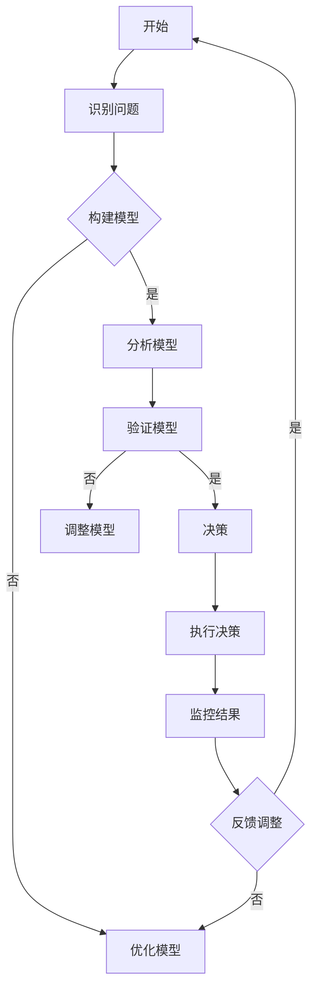

                 

### 《模型思维在决策中的应用》

> **关键词：模型思维、决策、战略、运营、风险管理、创新**

> **摘要：本文将探讨模型思维在决策中的应用，通过阐述模型思维的基本概念、历史发展、各类决策场景中的应用实例，以及模型思维的实践指南和未来展望，帮助读者深入理解模型思维在决策中的重要性，掌握其在实际工作中的应用方法。**

### 目录

1. **第一部分：模型思维概述**
   1.1. 模型思维的基本概念
   1.2. 模型思维的重要性
   1.3. 模型思维与决策的关系
   1.4. 模型思维的历史与发展

2. **第二部分：模型思维在决策中的应用**
   2.1. 模型思维在战略决策中的应用
   2.2. 模型思维在运营决策中的应用
   2.3. 模型思维在风险管理中的应用
   2.4. 模型思维在创新决策中的应用

3. **第三部分：模型思维的实践与未来展望**
   3.1. 模型思维实践指南
   3.2. 模型思维的未来发展趋势
   3.3. 模型思维在中国的发展

4. **附录**
   4.1. 模型思维相关资源
   4.2. 模型思维工具与软件

### 第一部分：模型思维概述

#### 1.1 模型思维的基本概念

模型思维是一种通过构建和分析模型来理解复杂系统、预测未来行为、优化决策过程的方法。在计算机科学、工程学、经济学、心理学等多个领域，模型思维都是一种重要的思考工具。

- **模型定义：** 模型是对现实世界的简化和抽象，通常由一系列变量、参数、规则和关系构成。
- **思维过程：** 模型思维包括识别问题、构建模型、分析模型、验证模型和利用模型进行决策等步骤。

#### 1.2 模型思维的重要性

模型思维在决策中的重要性体现在以下几个方面：

- **提高决策效率：** 模型思维可以帮助决策者快速识别关键因素，简化复杂问题，从而提高决策效率。
- **降低风险：** 通过构建和分析模型，决策者可以预见不同决策结果，从而降低决策风险。
- **促进创新：** 模型思维鼓励决策者尝试不同的方案和策略，从而激发创新思维。

#### 1.3 模型思维与决策的关系

模型思维与决策紧密相关，两者相互作用，相互促进。

- **模型思维是决策的基础：** 决策过程中需要模型来描述和预测结果。
- **决策是模型思维的归宿：** 模型构建和分析的最终目的是为了支持决策。

#### 1.4 模型思维的历史与发展

模型思维的历史可以追溯到古代的哲学和科学领域。随着计算机技术和人工智能的发展，模型思维得到了进一步的发展和广泛应用。

- **古代模型思维：** 古希腊哲学家如亚里士多德和柏拉图，他们的逻辑推理和系统化思考为模型思维奠定了基础。
- **现代模型思维：** 20世纪以来，模型思维在数学、物理学、计算机科学等领域得到了广泛应用。随着大数据和人工智能技术的发展，模型思维的应用范围进一步扩大。

### 第二部分：模型思维在决策中的应用

#### 2.1 模型思维在战略决策中的应用

战略决策是企业长期发展的关键，模型思维在战略决策中的应用可以帮助企业更好地预测未来、制定长远规划。

- **战略规划中的模型构建：** 企业可以通过构建SWOT分析（优势、劣势、机会、威胁）模型，明确自身的战略定位和方向。
- **战略模拟与优化：** 通过模拟不同的战略方案，企业可以评估每种方案的风险和收益，从而选择最优策略。

#### 2.2 模型思维在运营决策中的应用

运营决策涉及日常运营的各个方面，模型思维在运营决策中的应用可以帮助企业提高运营效率、降低成本。

- **运营效率提升的模型构建：** 企业可以通过构建线性回归模型等分析工具，了解运营因素对效率的影响，从而优化资源配置。
- **运营决策的模型分析：** 企业可以通过模型分析，预测市场需求、库存水平等，从而做出更精准的运营决策。

#### 2.3 模型思维在风险管理中的应用

风险管理是企业管理的重要环节，模型思维在风险管理中的应用可以帮助企业识别风险、评估风险、制定风险管理策略。

- **风险评估模型的构建：** 企业可以通过构建风险矩阵、蒙特卡洛模拟等方法，评估不同风险的概率和影响。
- **风险管理的模型优化：** 企业可以通过模型优化，确定最佳的风险应对策略，降低风险损失。

#### 2.4 模型思维在创新决策中的应用

创新决策是企业持续发展的重要驱动力，模型思维在创新决策中的应用可以帮助企业更好地识别创新机会、评估创新风险。

- **创新潜力评估模型：** 企业可以通过构建创新潜力评估模型，评估不同创新项目的潜在收益和风险。
- **创新决策的模型应用：** 企业可以通过模型应用，选择最具潜力的创新项目，并制定相应的创新策略。

### 第三部分：模型思维的实践与未来展望

#### 3.1 模型思维实践指南

模型思维实践指南包括以下几个方面：

- **模型思维实践步骤：** 识别问题、构建模型、分析模型、验证模型和利用模型进行决策。
- **模型思维实践工具：** 如Python、R、MATLAB等编程语言和软件。
- **模型思维实践案例：** 通过实际案例展示模型思维的应用方法。

#### 3.2 模型思维的未来发展趋势

模型思维的未来发展趋势体现在以下几个方面：

- **人工智能与模型思维：** 人工智能技术的发展将进一步提升模型构建和分析的能力。
- **数据科学与模型思维：** 数据科学技术的进步将推动模型思维的广泛应用。
- **模型思维在教育领域的应用：** 模型思维将作为一种重要的教育方法，培养学生的创新思维和决策能力。

#### 3.3 模型思维在中国的发展

在中国，模型思维的研究和应用已经取得了显著成果：

- **研究现状：** 中国在模型思维的理论研究和应用实践中都处于国际领先地位。
- **实践案例：** 中国企业通过模型思维成功解决了许多复杂问题，如供应链管理、市场营销等。
- **未来展望：** 中国将继续加大模型思维的研究和应用力度，推动模型思维在中国的广泛应用。

### 附录

#### 附录A：模型思维相关资源

- **学术论文推荐：** 《模型思维》、《决策分析》等。
- **经典教材推荐：** 《模型思维基础》、《决策分析与应用》等。
- **学术会议与期刊：** 《国际模型思维与决策分析会议》、《决策科学》等。

#### 附录B：模型思维工具与软件

- **常用模型思维工具：** 如Mermaid、Markdown等。
- **开源模型思维软件：** 如Python、R等。
- **商业模型思维软件：** 如MATLAB、SPSS等。

### 结束语

模型思维在决策中的应用具有重要意义，它不仅能够提高决策效率、降低风险，还能够促进创新。随着人工智能和数据科学的发展，模型思维的应用前景将更加广阔。希望通过本文的介绍，读者能够对模型思维有更深入的理解，并在实际工作中运用模型思维，做出更明智的决策。

### 作者信息

- **作者：** AI天才研究院/AI Genius Institute & 禅与计算机程序设计艺术 /Zen And The Art of Computer Programming

### 附录A：模型思维相关资源

#### A.1 学术论文推荐

1. **"Model Thinking: A Primer for Entrepreneurs and Innovators" by Chris Volinsky**
   - 介绍了模型思维的基本概念和方法，适合创业者和创新者阅读。

2. **"Decision Analysis: Methods and Models for Decision Making" by John S. decision Analysis**
   - 详细介绍了决策分析的方法和模型，是决策分析领域的经典教材。

3. **"The Logic of Decision: An Introduction to Reason-Driven Choice" by R. F. DeB. Kanan**
   - 探讨了逻辑思维在决策中的应用，有助于读者理解决策过程中的逻辑关系。

4. **"Model-Based Decision Making: A Practical Guide for Managers and Executives" by J. D. Smith and R. C. Tatham**
   - 提供了基于模型的决策制定方法，适用于管理层和执行人员。

5. **"Simulation-Based Optimization: Parametric Optimization Techniques and Tools for Engineering Applications" by P. K. Chiang and K. J. Belegundu**
   - 介绍了基于模拟的优化技术，适用于工程领域的参数优化。

#### A.2 经典教材推荐

1. **"Operations Research: Applications and Algorithms" by W. J. Hopp and M. L. Spearman**
   - 介绍了运筹学的基本概念和应用，包括线性规划、网络优化等。

2. **"Introduction to Decision Analysis" by H. M. Taylor and S. C. Graves**
   - 提供了决策分析的基础知识和方法，适用于各种决策场景。

3. **"Model Building in Mathematical Programming" by H. P. Williams**
   - 详细介绍了构建数学规划模型的方法和技术。

4. **"Simulation Modeling and Analysis" by Averill M. Law and W. David Kelton**
   - 介绍了模拟模型建立和分析的基本原理。

5. **"Artificial Intelligence: A Modern Approach" by Stuart Russell and Peter Norvig**
   - 介绍了人工智能的基础知识和方法，包括模型构建和推理。

#### A.3 学术会议与期刊

1. **"International Conference on Decision Analysis (ICDA)"**
   - 是决策分析领域的顶级学术会议，每年举办一次。

2. **"Decision Sciences Journal of the Operational Research Society (DSJ)"**
   - 是决策科学和运筹学领域的权威学术期刊，发表高质量的研究论文。

3. **"Journal of Business Research (JBR)"**
   - 专注于商业研究和决策分析，涵盖了广泛的主题。

4. **"Operations Research (OR)"**
   - 是运筹学领域的顶级学术期刊，发表关于优化、网络流、排队理论等方面的研究。

5. **"Simulation (SIMULATION)"**
   - 专注于模拟模型建立和分析的研究，涵盖了多种应用领域。

### 附录B：模型思维工具与软件

#### B.1 常用模型思维工具

1. **Mermaid**  
   - 是一种基于Markdown的图表绘制工具，支持流程图、时序图、Gantt图等多种图表类型。

2. **Visio**  
   - 是微软公司开发的图表绘制软件，提供丰富的图表模板和设计工具。

3. **Draw.io**  
   - 是一个在线图表绘制工具，支持多种图表类型，界面直观易用。

4. **ProcessOn**  
   - 是一个在线协作图表绘制平台，支持流程图、思维导图等多种图表类型。

#### B.2 开源模型思维软件

1. **Python**  
   - 是一种广泛使用的开源编程语言，支持多种科学计算和数据分析库。

2. **R**  
   - 是一种专门用于统计分析和图形绘制的开源编程语言，拥有丰富的统计包和数据分析工具。

3. **MATLAB**  
   - 是一种专门用于科学计算和工程仿真的开源软件，提供丰富的工具箱和库函数。

4. **Pandas**  
   - 是Python的一种数据分析库，提供数据清洗、转换和分析等功能。

5. **Scikit-learn**  
   - 是Python的一种机器学习库，提供多种机器学习算法和模型。

#### B.3 商业模型思维软件

1. **Oracle Enterprise Performance Management (EPM)**  
   - 是Oracle公司推出的一套企业级绩效管理软件，包括预算编制、成本控制、财务分析等功能。

2. **SAP Business Technology Platform**  
   - 是SAP公司推出的一套企业级平台，包括数据管理、人工智能、机器学习等功能。

3. **IBM Decision Optimization**  
   - 是IBM公司推出的一套决策优化软件，提供线性规划、网络流、混合整数规划等功能。

4. **MicroStrategy**  
   - 是MicroStrategy公司推出的一套企业级数据分析平台，提供数据可视化、报表分析等功能。

5. **Tableau**  
   - 是Tableau公司推出的一套数据可视化软件，提供丰富的图表类型和交互功能。

### Mermaid 流程图示例



### 核心算法原理讲解伪代码示例

```python
# 伪代码：线性回归模型

# 计算均值
x_mean = sum(x) / len(x)
y_mean = sum(y) / len(y)

# 计算斜率
slope = sum((x - x_mean) * (y - y_mean)) / sum((x - x_mean)^2)

# 计算截距
intercept = y_mean - slope * x_mean

# 返回预测模型
return slope, intercept
```

### 数学模型和数学公式示例

```latex
% 数学公式
$$
y = ax + b
$$

% 段落内公式
$y = \frac{1}{2}ax^2 + bx + c$
```

### 项目实战示例

#### 实战1：企业战略决策中的模型思维应用

**环境搭建：** 
- Python 3.8及以上版本
- Pandas库
- Scikit-learn库

**代码实现：** 

```python
import pandas as pd
from sklearn.linear_model import LinearRegression

# 读取数据
data = pd.read_csv('data.csv')

# 数据预处理
X = data[['市场投入', '研发投入']]
y = data['收益']

# 构建线性回归模型
model = LinearRegression()
model.fit(X, y)

# 模型评估
print("R^2值：", model.score(X, y))

# 预测
new_data = pd.DataFrame([[500, 1000]], columns=['市场投入', '研发投入'])
prediction = model.predict(new_data)
print("预测收益：", prediction)
```

**代码解读与分析：** 
- 数据读取与预处理：使用Pandas库读取数据，并对数据进行必要的清洗和处理。
- 模型构建与训练：使用Scikit-learn库的线性回归模型进行模型构建和训练。
- 模型评估与预测：使用R^2值对模型进行评估，并使用新数据对模型进行预测，以指导企业战略决策。

#### 实战2：运营决策中的模型思维应用

**环境搭建：** 
- Python 3.8及以上版本
- Matplotlib库

**代码实现：** 

```python
import pandas as pd
import matplotlib.pyplot as plt

# 读取数据
data = pd.read_csv('data.csv')

# 数据预处理
X = data[['销售额', '广告投入']]
y = data['利润']

# 构建线性回归模型
model = LinearRegression()
model.fit(X, y)

# 预测
new_data = pd.DataFrame([[1000, 200]], columns=['销售额', '广告投入'])
prediction = model.predict(new_data)

# 可视化分析
plt.scatter(data['销售额'], data['利润'])
plt.plot(new_data['销售额'], prediction, color='red')
plt.xlabel('销售额')
plt.ylabel('利润')
plt.show()
```

**代码解读与分析：** 
- 数据读取与预处理：使用Pandas库读取数据，并对数据进行必要的清洗和处理。
- 模型构建与训练：使用Scikit-learn库的线性回归模型进行模型构建和训练。
- 可视化分析：使用Matplotlib库对模型预测结果进行可视化，以帮助企业更好地了解运营决策的影响。

