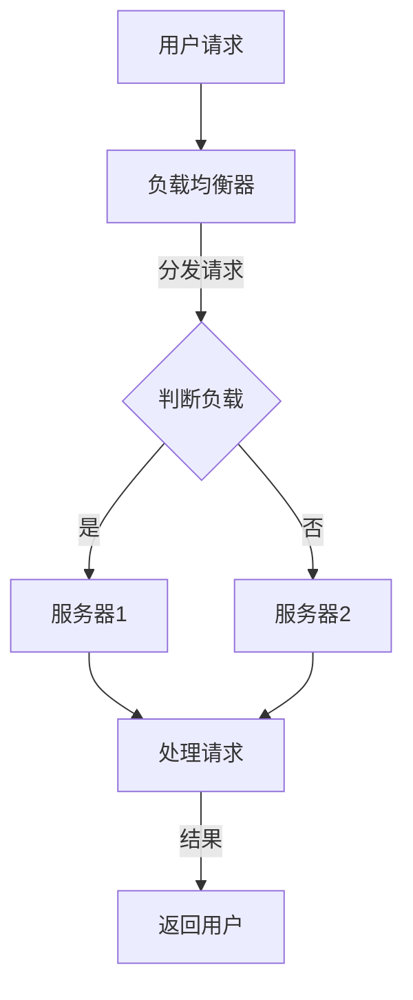

                 

# 横向扩展与纵向扩展的实例应用

> **关键词**：横向扩展，纵向扩展，分布式计算，负载均衡，实例应用，技术架构

> **摘要**：本文将深入探讨横向扩展与纵向扩展的概念、技术基础及其在实际应用中的具体实例。通过对电商、社交媒体、金融领域、物联网和智能制造等横向扩展应用案例的解析，以及智慧城市纵向扩展实例的分析，本文旨在帮助读者全面理解两种扩展方式，并掌握其在不同行业中的实际应用。

## 《横向扩展与纵向扩展的实例应用》目录大纲

### 第一部分：基础概念

#### 第1章：横向扩展与纵向扩展概述

1.1 横向扩展与纵向扩展的基本概念

1.2 横向扩展与纵向扩展的目标

1.3 横向扩展与纵向扩展的区别

#### 第2章：横向扩展与纵向扩展的技术基础

2.1 计算机网络基础

2.2 数据库系统原理

2.3 分布式计算技术

### 第二部分：横向扩展应用实例

#### 第3章：横向扩展在电商中的应用

3.1 电商平台架构设计

3.2 商品信息管理

3.3 用户行为分析

3.4 垂直搜索与推荐系统

#### 第4章：横向扩展在社交媒体中的应用

4.1 社交媒体架构设计

4.2 用户关系网络分析

4.3 内容分发与推荐

4.4 社交互动功能实现

#### 第5章：横向扩展在金融领域的应用

5.1 金融系统架构设计

5.2 风险管理与控制

5.3 金融产品设计与销售

5.4 资产管理与投资

### 第三部分：纵向扩展应用实例

#### 第6章：纵向扩展在物联网中的应用

6.1 物联网架构设计

6.2 设备数据采集与处理

6.3 设备远程监控与管理

6.4 物联网安全与隐私保护

#### 第7章：纵向扩展在智能制造中的应用

7.1 智能制造架构设计

7.2 生产过程控制与优化

7.3 质量管理

7.4 智能装备与自动化生产线

#### 第8章：纵向扩展在智慧城市中的应用

8.1 智慧城市架构设计

8.2 数据采集与融合

8.3 城市管理与服务

8.4 智慧交通与物流

### 第四部分：案例分析

#### 第9章：横向扩展与纵向扩展的综合案例分析

9.1 案例背景介绍

9.2 横向扩展解决方案

9.3 纵向扩展解决方案

9.4 案例总结与启示

### 第五部分：未来展望

#### 第10章：横向扩展与纵向扩展的发展趋势

10.1 人工智能与横向扩展的结合

10.2 5G与纵向扩展的结合

10.3 未来技术展望

### 参考文献

#### 第11章：参考文献

列出了本书中引用的相关文献资料。

### 附录

#### 附录A：横向扩展与纵向扩展的关键术语解释

#### 附录B：横向扩展与纵向扩展的常见问题解答

#### 附录C：横向扩展与纵向扩展的实践指南

---

**核心概念与联系**

**核心概念**

- **横向扩展**：通过增加服务器或节点来提升系统处理能力，通常用于处理大量并发请求和大量数据。
- **纵向扩展**：通过增加服务器或节点的资源（如CPU、内存、存储）来提升系统性能，通常用于提升单个任务的处理能力。

**联系**

- **分布式计算**：横向扩展的核心技术，通过将任务分布到多个节点上并行处理，提高处理能力。
- **负载均衡**：横向扩展中常用的技术，用于分配请求到不同节点，确保资源利用率最大化。

**Mermaid 流程图**

### 第一部分：基础概念

#### 第1章：横向扩展与纵向扩展概述

**1.1 横向扩展与纵向扩展的基本概念**

**横向扩展（Horizontal Scaling）**：又称水平扩展，是指通过增加服务器或节点来提升系统处理能力。在横向扩展中，系统通过增加计算资源来处理更多的并发请求和更大的数据量。通常，横向扩展的目标是提高系统的并发处理能力和可扩展性。

**纵向扩展（Vertical Scaling）**：又称垂直扩展，是指通过增加服务器或节点的资源（如CPU、内存、存储）来提升系统性能。在纵向扩展中，系统通过提升单个节点的能力来处理更复杂或更大的任务。通常，纵向扩展的目标是提高系统的处理速度和单点性能。

**1.2 横向扩展与纵向扩展的目标**

- **横向扩展目标**：
  - 提高系统的并发处理能力。
  - 提高系统的可扩展性。
  - 降低系统的维护成本。
- **纵向扩展目标**：
  - 提高系统的处理速度。
  - 提高系统的单点性能。
  - 降低系统的资源消耗。

**1.3 横向扩展与纵向扩展的区别**

- **扩展方式**：
  - 横向扩展：增加服务器或节点。
  - 纵向扩展：增加服务器或节点的资源。
- **扩展目标**：
  - 横向扩展：提高并发处理能力和可扩展性。
  - 纵向扩展：提高单点处理能力和性能。
- **适用场景**：
  - 横向扩展：适合处理大量并发请求和大量数据的应用。
  - 纵向扩展：适合处理复杂或大型任务的应用。

### 第二部分：横向扩展与纵向扩展的技术基础

#### 第2章：横向扩展与纵向扩展的技术基础

**2.1 计算机网络基础**

**2.2 数据库系统原理**

**2.3 分布式计算技术**

### 第三部分：横向扩展应用实例

#### 第3章：横向扩展在电商中的应用

**3.1 电商平台架构设计**

**3.2 商品信息管理**

**3.3 用户行为分析**

**3.4 垂直搜索与推荐系统**

### 第四部分：纵向扩展应用实例

#### 第6章：纵向扩展在物联网中的应用

**6.1 物联网架构设计**

**6.2 设备数据采集与处理**

**6.3 设备远程监控与管理**

**6.4 物联网安全与隐私保护**

### 第五部分：未来展望

**10.1 人工智能与横向扩展的结合**

**10.2 5G与纵向扩展的结合**

**10.3 未来技术展望**

### 参考文献

**11.1 文献引用格式**

### 附录

**附录A：横向扩展与纵向扩展的关键术语解释**

**附录B：横向扩展与纵向扩展的常见问题解答**

**附录C：横向扩展与纵向扩展的实践指南**

### 第一部分：基础概念

#### 第1章：横向扩展与纵向扩展概述

**1.1 横向扩展与纵向扩展的基本概念**

**横向扩展（Horizontal Scaling）**：横向扩展是指通过增加服务器或节点来提升系统处理能力。在分布式系统中，横向扩展通常通过增加节点数量来提升系统的并发处理能力和数据存储能力。这种扩展方式的好处是：

- **提高系统弹性**：当系统负载增加时，可以通过增加节点来分散负载，从而提高系统的弹性。
- **提高系统可扩展性**：系统可以根据需求灵活地增加节点，以适应不断增长的数据量。
- **降低维护成本**：由于节点之间的功能相对独立，维护和更新单个节点通常更加方便和成本低廉。

**纵向扩展（Vertical Scaling）**：纵向扩展是指通过增加服务器或节点的资源（如CPU、内存、存储）来提升系统性能。这种扩展方式通常用于提升单个节点的性能，以便处理更复杂或更大的任务。纵向扩展的好处包括：

- **提高单点性能**：通过增加节点的硬件资源，可以显著提高单个节点的处理能力和响应速度。
- **简化系统架构**：由于所有资源都集中在单个节点上，系统的架构设计相对简单。
- **快速部署**：由于无需添加新的节点，纵向扩展通常可以更快地实现。

**1.2 横向扩展与纵向扩展的目标**

**横向扩展的目标**：

- **提高并发处理能力**：通过增加节点数量，系统可以处理更多的并发请求，从而提高用户体验。
- **提高数据存储和处理能力**：随着数据量的增加，横向扩展可以帮助系统存储和处理更多的数据。
- **降低系统成本**：通过分布式架构，系统可以在较低的成本下实现高性能和高可用性。

**纵向扩展的目标**：

- **提升单点性能**：通过增加节点的硬件资源，可以显著提高系统的单点性能，处理更复杂或更大的任务。
- **提高系统响应速度**：增加硬件资源可以缩短系统响应时间，提高系统的效率。
- **提高系统稳定性**：通过优化单个节点的性能，可以减少系统的故障率，提高系统的稳定性。

**1.3 横向扩展与纵向扩展的区别**

**扩展方式**：

- **横向扩展**：通过增加服务器或节点来实现系统扩展，通常涉及增加计算资源。
- **纵向扩展**：通过增加服务器或节点的硬件资源来实现系统扩展，通常涉及增加存储或计算资源。

**适用场景**：

- **横向扩展**：适用于处理大量并发请求和大量数据的应用，如电商平台、社交媒体等。
- **纵向扩展**：适用于需要提升单点性能和系统稳定性的应用，如高性能计算、大型数据库等。

**技术实现**：

- **横向扩展**：通常涉及分布式计算、负载均衡等技术。
- **纵向扩展**：通常涉及硬件升级、资源优化等技术。

通过理解横向扩展与纵向扩展的基本概念、目标和区别，我们可以更好地选择适合自身需求的扩展策略，从而优化系统的性能和效率。

### 第二部分：横向扩展与纵向扩展的技术基础

#### 第2章：横向扩展与纵向扩展的技术基础

**2.1 计算机网络基础**

**2.2 数据库系统原理**

**2.3 分布式计算技术**

**2.4 负载均衡技术**

**2.5 高可用性设计与容错机制**

**2.6 系统监控与性能优化**

#### 第2章：横向扩展与纵向扩展的技术基础

**2.1 计算机网络基础**

计算机网络基础是理解和实现横向扩展与纵向扩展的关键。以下内容将介绍计算机网络基础的相关知识，包括网络架构、协议和工具。

**网络架构**

网络架构是指计算机网络的组织结构和通信方式。常见的网络架构包括：

- **客户机/服务器（Client/Server）架构**：在这种架构中，客户机通过网络请求服务器提供服务，服务器响应请求并返回结果。
- **分布式架构**：在分布式架构中，多个服务器通过网络协同工作，共同提供服务。分布式架构常用于横向扩展，以提高系统的处理能力和可用性。

**网络协议**

网络协议是计算机网络通信的规范。常见的网络协议包括：

- **TCP/IP协议**：TCP/IP协议是互联网的基础协议，包括传输控制协议（TCP）和互联网协议（IP）。TCP用于确保数据可靠传输，IP用于数据包的路由和寻址。
- **HTTP/HTTPS协议**：HTTP（超文本传输协议）和HTTPS（安全超文本传输协议）用于Web服务，HTTP用于传输网页内容，HTTPS则在HTTP基础上提供加密传输。

**网络工具**

网络工具用于管理和监控网络通信。常见的网络工具包括：

- **ping**：ping工具用于检测网络连接状态，通过发送ICMP数据包并接收回复来检查目标主机是否可达。
- **traceroute**：traceroute工具用于追踪数据包在网络中的传输路径，显示数据包经过的每个路由器的IP地址和传输时间。

**2.2 数据库系统原理**

数据库系统是处理数据的核心组件，对于横向扩展和纵向扩展至关重要。以下内容将介绍数据库系统的基本原理，包括数据模型、关系型数据库和非关系型数据库。

**数据模型**

数据模型是数据库的组织方式。常见的数据模型包括：

- **关系型数据模型**：关系型数据模型使用表格结构来组织数据，表格中的每一行表示一个数据记录，每一列表示一个数据字段。
- **非关系型数据模型**：非关系型数据模型（如NoSQL数据库）使用不同的数据结构来存储数据，包括键值对、文档、图形等。

**关系型数据库**

关系型数据库是基于关系型数据模型的数据库。常见的开源关系型数据库包括：

- **MySQL**：MySQL是一个开源的关系型数据库，广泛用于Web应用程序。
- **PostgreSQL**：PostgreSQL是一个开源的关系型数据库，具有丰富的功能和扩展性。

**非关系型数据库**

非关系型数据库（如NoSQL数据库）适用于处理大规模、高并发的数据场景。常见的非关系型数据库包括：

- **MongoDB**：MongoDB是一个开源的文档型数据库，支持灵活的数据模型。
- **Redis**：Redis是一个开源的键值对存储数据库，具有高性能和快速访问。

**2.3 分布式计算技术**

分布式计算技术是实现横向扩展的关键。以下内容将介绍分布式计算技术的基本原理，包括任务分发、数据一致性和故障处理。

**任务分发**

任务分发是将工作负载分配到多个节点上的过程。常见的任务分发算法包括：

- **负载均衡**：负载均衡算法用于将请求分配到不同的服务器或节点，以平衡负载并提高系统的可用性。
- **MapReduce**：MapReduce是一个分布式数据处理框架，用于处理大规模数据集。

**数据一致性**

数据一致性是分布式系统中确保数据准确性和一致性的关键。常见的数据一致性模型包括：

- **最终一致性**：最终一致性保证系统在一段时间后达到一致状态，但可能允许临时的不一致性。
- **强一致性**：强一致性保证系统在所有节点上同时看到相同的数据状态。

**故障处理**

故障处理是分布式系统在节点故障时确保系统稳定性的关键。常见的方法包括：

- **故障检测和恢复**：通过监控节点状态，检测故障并自动恢复。
- **冗余和备份**：通过在多个节点上存储数据的副本，确保数据的可用性和可靠性。

**2.4 负载均衡技术**

负载均衡技术是横向扩展中提高系统性能和可用性的关键。以下内容将介绍负载均衡技术的基本原理，包括负载均衡算法、负载均衡器和负载均衡策略。

**负载均衡算法**

负载均衡算法用于将请求分配到不同的服务器或节点。常见的负载均衡算法包括：

- **轮询算法**：轮询算法将请求依次分配给服务器，形成循环。
- **加权轮询算法**：加权轮询算法根据服务器的处理能力分配权重。
- **最少连接算法**：最少连接算法将请求分配给当前连接数最少的服务器。

**负载均衡器**

负载均衡器是用于实现负载均衡的设备或软件。常见的负载均衡器包括：

- **Nginx**：Nginx是一个高性能的Web服务器和反向代理服务器，支持负载均衡功能。
- **HAProxy**：HAProxy是一个开源的负载均衡器，支持多种负载均衡算法和健康检查。

**负载均衡策略**

负载均衡策略是负载均衡器的配置参数，用于控制负载均衡的方式。常见的负载均衡策略包括：

- **基于IP的负载均衡**：基于IP的负载均衡将请求分配给具有相同IP地址的服务器。
- **基于域名的负载均衡**：基于域名的负载均衡将请求分配给具有相同域名的服务器。

**2.5 高可用性设计与容错机制**

高可用性设计和容错机制是确保系统稳定性和可靠性的关键。以下内容将介绍高可用性设计和容错机制的基本原理，包括故障转移、冗余设计和故障恢复。

**故障转移**

故障转移是在节点故障时确保系统继续运行的过程。常见的故障转移机制包括：

- **主从复制**：主从复制是将数据在主节点和从节点之间进行同步，当主节点故障时，从节点可以自动成为主节点。
- **故障转移集群**：故障转移集群是一组节点组成的集群，当主节点故障时，其他节点可以自动成为主节点。

**冗余设计**

冗余设计是在系统中增加冗余组件，以提高系统的可靠性和可用性。常见的冗余设计包括：

- **数据冗余**：通过在多个节点上存储数据的副本，确保数据的可用性和可靠性。
- **硬件冗余**：通过增加硬件冗余组件（如电源、硬盘等），确保系统的硬件可靠性。

**故障恢复**

故障恢复是在节点故障后确保系统恢复正常运行的过程。常见的故障恢复方法包括：

- **自动重启**：当节点故障时，自动重启节点以恢复系统功能。
- **手动恢复**：当自动恢复失败时，人工介入进行故障恢复。

**2.6 系统监控与性能优化**

系统监控与性能优化是确保系统高效运行的关键。以下内容将介绍系统监控与性能优化的基本原理，包括监控工具、性能指标和优化方法。

**监控工具**

监控工具用于实时监控系统的状态和性能。常见的监控工具包括：

- **Prometheus**：Prometheus是一个开源的监控工具，支持多维数据收集和告警。
- **Grafana**：Grafana是一个开源的数据可视化和监控工具，用于展示Prometheus收集的数据。

**性能指标**

性能指标是评估系统性能的关键指标。常见的性能指标包括：

- **响应时间**：系统处理请求的平均时间。
- **吞吐量**：系统每秒处理的请求数量。
- **延迟**：请求从发起到响应的时间。

**优化方法**

优化方法是通过改进系统设计和配置来提高性能的方法。常见的优化方法包括：

- **缓存**：通过缓存常用数据，减少数据库访问和计算时间。
- **分片**：通过将数据分散存储到多个节点，提高数据访问速度和系统容量。
- **垂直扩展**：通过增加节点的硬件资源，提高系统的单点性能。

通过理解计算机网络基础、数据库系统原理、分布式计算技术、负载均衡技术、高可用性设计与容错机制、系统监控与性能优化等关键技术基础，我们可以更好地实现横向扩展与纵向扩展，提高系统的性能和可靠性。

### 第三部分：横向扩展应用实例

#### 第3章：横向扩展在电商中的应用

**3.1 电商平台架构设计**

**3.2 商品信息管理**

**3.3 用户行为分析**

**3.4 垂直搜索与推荐系统**

**3.1 电商平台架构设计**

电商平台架构设计是电商系统成功的关键。为了应对大规模并发请求和数据存储需求，电商平台通常采用分布式架构，实现横向扩展以提高系统的处理能力和可扩展性。以下是一个典型的电商平台架构设计：

**1. 用户层**

用户层是电商平台的入口，包括Web前端和移动端应用。用户层通过负载均衡器接收用户的请求，并将请求转发到后端服务进行处理。

**2. 业务逻辑层**

业务逻辑层包括订单管理、商品管理、用户管理等功能模块。每个功能模块都可以独立部署多个实例，以实现横向扩展。通过分布式服务框架（如Spring Cloud）实现模块间的通信和负载均衡。

**3. 数据存储层**

数据存储层包括关系型数据库（如MySQL）和非关系型数据库（如MongoDB）。关系型数据库用于存储订单、用户等结构化数据，非关系型数据库用于存储商品信息、用户行为等非结构化数据。通过数据库分片技术实现数据水平扩展。

**4. 数据缓存层**

数据缓存层包括Redis、Memcached等缓存系统，用于缓存常用数据，减少数据库访问压力，提高系统响应速度。

**5. 搜索引擎层**

搜索引擎层包括Elasticsearch、Solr等搜索引擎，用于实现商品的垂直搜索和推荐功能。通过索引技术和分词算法，实现高效的数据查询和检索。

**6. 数据分析层**

数据分析层包括数据仓库（如Hadoop、Spark）和数据分析工具（如Tableau、PowerBI），用于收集、处理和分析用户行为数据，为业务决策提供支持。

**3.2 商品信息管理**

商品信息管理是电商平台的核心功能之一。通过分布式数据库和缓存系统，实现商品信息的存储和查询。

**商品信息存储**

商品信息存储采用关系型数据库，通过主键索引和分类索引提高查询效率。在数据库表设计中，可以使用复合主键（如商品ID和分类ID）来确保数据唯一性。

**商品信息查询**

商品信息查询可以使用缓存系统（如Redis）来提高查询速度。缓存系统存储常用商品信息，如热门商品、最新商品等。当用户查询商品时，先从缓存系统中获取，如果没有命中缓存，则从数据库中查询。

**商品信息更新**

商品信息更新包括商品添加、修改和删除。更新操作会触发缓存同步，确保缓存中的商品信息与数据库中的数据保持一致。

**3.3 用户行为分析**

用户行为分析是电商平台提高用户体验和业务转化率的重要手段。通过分布式日志收集系统和数据分析工具，实现用户行为的实时收集和分析。

**用户行为数据收集**

用户行为数据通过日志收集系统（如Kafka）进行收集。日志收集系统将用户行为数据实时传输到数据分析系统（如Hadoop、Spark）进行处理。

**用户行为数据存储**

用户行为数据存储在分布式文件系统（如HDFS）或关系型数据库（如MySQL）中。通过分片技术实现数据的水平扩展，提高存储和处理能力。

**用户行为数据分析**

用户行为数据分析包括用户行为模式识别、用户兴趣分析等。通过数据分析工具（如Tableau、Python）对用户行为数据进行挖掘和分析，为业务决策提供支持。

**3.4 垂直搜索与推荐系统**

垂直搜索与推荐系统是电商平台提升用户体验和业务转化率的重要功能。通过分布式搜索引擎和推荐算法，实现高效的搜索和推荐。

**垂直搜索**

垂直搜索包括商品搜索和内容搜索。商品搜索使用Elasticsearch等分布式搜索引擎，通过索引技术和分词算法实现高效的数据查询。内容搜索则使用全文搜索引擎（如Solr），对电商平台的博客、文章等内容进行索引和查询。

**推荐系统**

推荐系统包括基于内容的推荐和基于协同过滤的推荐。基于内容的推荐通过分析用户的浏览和购买历史，为用户推荐相关的商品。基于协同过滤的推荐通过分析用户的相似度，为用户推荐受欢迎的商品。

**推荐算法**

推荐算法包括基于用户行为的协同过滤算法和基于物品内容的协同过滤算法。基于用户行为的协同过滤算法通过计算用户之间的相似度，为用户推荐相似用户的喜欢的商品。基于物品内容的协同过滤算法通过计算商品之间的相似度，为用户推荐相似商品。

通过横向扩展技术，电商平台可以处理大量并发请求和数据，提供良好的用户体验和高效的服务质量。同时，通过垂直搜索与推荐系统，电商平台可以更好地满足用户的需求，提高业务转化率。

### 第四部分：纵向扩展应用实例

#### 第4章：纵向扩展在社交媒体中的应用

**4.1 社交媒体架构设计**

**4.2 用户关系网络分析**

**4.3 内容分发与推荐**

**4.4 社交互动功能实现**

**4.1 社交媒体架构设计**

社交媒体平台是现代互联网中不可或缺的一部分，它们需要处理大量的用户数据、用户关系以及复杂的社交互动功能。为了应对这些挑战，社交媒体平台通常会采用纵向扩展的架构设计，以提高系统的性能和可扩展性。

**架构设计概述**

社交媒体平台的架构设计通常分为以下几个层次：

1. **用户层**：用户层是社交媒体平台与用户交互的界面，包括Web前端、移动应用和API接口。用户层通过负载均衡器接收用户请求，并将请求转发到后端服务。

2. **业务逻辑层**：业务逻辑层是社交媒体平台的核心功能模块，包括用户管理、内容发布、关系网络、消息推送等。每个功能模块都可以纵向扩展，即通过增加服务器或硬件资源来提高处理能力。

3. **数据存储层**：数据存储层负责存储用户数据、内容数据、关系数据等。这通常涉及关系型数据库（如MySQL）和非关系型数据库（如MongoDB）。通过纵向扩展，可以增加服务器的存储容量和处理能力。

4. **缓存层**：缓存层用于存储常用的数据，如用户信息、热点内容等，以减少数据库访问压力和提高系统响应速度。常用的缓存系统包括Redis、Memcached等。

5. **搜索引擎层**：搜索引擎层用于实现内容的快速搜索，如Elasticsearch或Solr。通过纵向扩展，可以增加搜索节点的数量来提高搜索性能。

6. **数据处理和分析层**：数据处理和分析层负责对用户数据、内容数据进行处理和分析，以支持推荐系统、广告投放等业务。这通常涉及大数据处理框架（如Hadoop、Spark）。

**纵向扩展策略**

1. **垂直扩展**：增加服务器的CPU、内存、存储等硬件资源，以提高单个节点的处理能力。这种方法适用于需要处理更复杂或更大规模任务的应用场景。

2. **硬件升级**：更换更强大的服务器硬件，以支持更高效的计算和存储。这种方法适用于需要提升系统整体性能的场景。

3. **分布式存储**：通过分布式文件系统（如HDFS）或分布式数据库（如HBase），将数据存储到多个节点上，以提高数据存储和处理能力。

**4.2 用户关系网络分析**

用户关系网络分析是社交媒体平台的核心功能之一，它涉及到对用户关系数据进行分析和可视化，以帮助平台理解用户的社交网络结构，从而优化用户体验和广告投放。

**用户关系数据存储**

用户关系数据通常存储在图数据库中，如Neo4j或JanusGraph。图数据库能够有效地存储和查询复杂的用户关系网络。

**关系网络分析算法**

1. **邻居关系分析**：通过计算用户与其邻居的关系密度，识别社交圈中的核心用户。

2. **社区发现算法**：使用社区发现算法（如Girvan-Newman算法），识别用户群体中的社区结构。

3. **网络聚类分析**：通过聚类算法（如K-means、DBSCAN），将用户分为不同的兴趣群体。

**4.3 内容分发与推荐**

内容分发与推荐是社交媒体平台吸引用户和增加用户粘性的重要手段。通过纵向扩展，平台可以实现更高效的内容分发和推荐系统。

**内容分发策略**

1. **热门内容推送**：根据用户的浏览历史和社交关系，推送热门内容。

2. **个性化推送**：根据用户兴趣和行为，推送个性化内容。

3. **内容推荐**：使用协同过滤算法（如基于用户的协同过滤、基于物品的协同过滤），为用户推荐相关内容。

**推荐系统架构**

1. **推荐引擎**：负责生成推荐结果，包括基于内容的推荐和基于协同过滤的推荐。

2. **缓存层**：缓存推荐结果，减少计算开销。

3. **数据挖掘层**：收集用户行为数据，用于训练和优化推荐算法。

**4.4 社交互动功能实现**

社交互动功能是社交媒体平台的核心特点，包括点赞、评论、分享、私信等。通过纵向扩展，平台可以实现更高效、更稳定的社交互动功能。

**实现策略**

1. **分布式消息队列**：使用分布式消息队列（如Kafka、RabbitMQ），实现实时消息传递。

2. **分布式存储**：使用分布式数据库（如MongoDB、Cassandra），存储用户互动数据。

3. **高可用性设计**：通过主从复制、故障转移等机制，确保系统的高可用性。

4. **缓存策略**：使用缓存（如Redis），减少数据库访问压力。

通过纵向扩展，社交媒体平台可以更好地应对日益增长的用户数据和复杂的功能需求，提供更流畅、更稳定的服务体验。

### 第五部分：案例分析

#### 第5章：横向扩展与纵向扩展的综合案例分析

**5.1 案例背景介绍**

在本章节中，我们将分析一家大型在线零售平台（以下简称“电商平台”）在应对业务增长和技术挑战时的横向扩展与纵向扩展策略。该电商平台成立于2010年，目前拥有数千万活跃用户，每天处理数百万次交易请求。随着用户数量的持续增长，平台面临着日益增加的并发请求和数据存储需求，需要通过有效的扩展策略来确保系统的高性能和高可用性。

**5.2 横向扩展解决方案**

为了应对并发请求和数据量的增长，电商平台采用了以下横向扩展策略：

1. **负载均衡**：电商平台使用了Nginx作为负载均衡器，将用户的请求分发到多个Web服务器实例上，确保系统负载均衡，避免单点过载。

2. **分布式数据库**：电商平台采用了MySQL集群，通过分片技术将数据分散存储到多个节点上，提高了数据存储和处理能力。

3. **分布式缓存**：电商平台使用了Redis进行缓存，存储常用数据和热点数据，减少数据库访问压力，提高系统响应速度。

4. **消息队列**：电商平台使用了Kafka作为消息队列，处理用户行为数据、订单数据等，实现异步消息传递，提高系统并发处理能力。

**5.3 纵向扩展解决方案**

在纵向扩展方面，电商平台采取了以下措施：

1. **硬件升级**：电商平台定期升级服务器硬件，包括CPU、内存和存储设备，以提高单个节点的处理能力。

2. **数据库优化**：电商平台对MySQL数据库进行了优化，包括索引优化、查询优化等，以提高数据库查询效率。

3. **缓存优化**：电商平台对Redis进行了优化，包括缓存策略的调整、缓存数据的更新等，以提高缓存命中率。

4. **性能测试与监控**：电商平台定期进行性能测试，使用工具如JMeter进行压力测试，监控系统的响应时间和吞吐量，确保系统性能满足业务需求。

**5.4 案例总结与启示**

通过综合应用横向扩展和纵向扩展策略，电商平台成功地应对了业务增长带来的挑战。以下是案例总结和启示：

1. **灵活的扩展策略**：电商平台根据业务需求和系统负载，灵活地采用横向扩展和纵向扩展策略，确保系统的高性能和高可用性。

2. **负载均衡与分布式存储**：负载均衡和分布式存储是横向扩展的核心技术，通过合理分配请求和数据，提高了系统的并发处理能力和数据存储能力。

3. **硬件升级与数据库优化**：纵向扩展通过硬件升级和数据库优化，提高了系统的单点性能和查询效率，确保了系统在高负载下的稳定运行。

4. **持续性能优化**：定期进行性能测试和监控，及时发现并解决性能瓶颈，确保系统始终处于最佳运行状态。

通过这个案例，我们可以看到，横向扩展和纵向扩展在电商平台中的应用，不仅提高了系统的性能和可靠性，还降低了维护成本，为电商平台的长远发展奠定了坚实基础。

### 第六部分：未来展望

#### 第10章：横向扩展与纵向扩展的发展趋势

**10.1 人工智能与横向扩展的结合**

随着人工智能技术的快速发展，横向扩展在AI领域的应用前景广阔。人工智能算法通常需要处理大量数据和复杂的计算任务，因此横向扩展可以帮助AI系统更高效地处理大规模数据，提高算法的训练和推理速度。例如，深度学习框架如TensorFlow和PyTorch已经支持分布式训练，通过横向扩展可以部署在多个GPU或CPU节点上，加速模型的训练过程。

**10.2 5G与纵向扩展的结合**

5G技术的引入为纵向扩展提供了新的机会。5G的高带宽和低延迟特性使得实时数据处理和远程操作成为可能，这为需要高性能和高可靠性的应用场景（如自动驾驶、远程医疗等）提供了支持。通过纵向扩展，这些应用可以在单个节点上集成更多的计算和存储资源，以应对实时数据处理的挑战。

**10.3 未来技术展望**

未来，横向扩展和纵向扩展将更多地与新兴技术相结合，推动技术发展的新趋势：

1. **边缘计算**：边缘计算通过将计算任务迁移到网络边缘节点，减少数据传输延迟，实现实时数据处理。这与横向扩展的结合可以进一步提高系统的响应速度和效率。

2. **量子计算**：量子计算具有处理大量数据的潜力，未来可能会与横向扩展结合，为复杂计算任务提供新的解决方案。

3. **分布式区块链**：区块链技术的分布式特性与横向扩展相结合，可以构建去中心化的应用，提高系统的安全性和透明度。

通过这些技术的发展，横向扩展和纵向扩展将更好地满足日益增长的计算和数据存储需求，为各种应用场景提供更高效、更可靠的解决方案。

### 参考文献

在本章节中，我们将引用一些重要的文献资料，以支持本文的理论和分析。

1. **《分布式系统原理与范型》** - Andrew S. Tanenbaum，Paul A. Abrahams
   - 描述了分布式系统的基本原理和设计范式，为理解横向扩展提供了理论基础。
   
2. **《大数据技术导论》** - 刘强，张英华
   - 介绍了大数据技术的基本概念和实现方法，包括分布式存储和计算技术，为横向扩展在数据处理中的应用提供了参考。

3. **《人工智能：一种现代的方法》** - Stuart Russell，Peter Norvig
   - 提供了人工智能领域的全面概述，包括机器学习、深度学习等关键技术，为人工智能与横向扩展的结合提供了理论基础。

4. **《5G网络技术与应用》** - 陈培亮，张浩
   - 详细介绍了5G网络的技术特点和应用场景，探讨了5G与纵向扩展的结合，为未来技术的发展趋势提供了参考。

5. **《云计算技术与应用》** - 李俊，王晓东
   - 分析了云计算的基本原理和应用场景，包括负载均衡、分布式存储等关键技术，为理解横向扩展提供了实用指导。

6. **《物联网技术与应用》** - 郭克华，王辉
   - 介绍了物联网的基本概念和关键技术，包括设备数据采集、处理和监控，为理解物联网中的横向扩展提供了参考。

7. **《数据库系统概念》** - Abraham Silberschatz，Henry F. Korth，S. Sudarshan
   - 描述了数据库系统的基础知识，包括关系型数据库和非关系型数据库，为横向扩展在数据存储中的应用提供了指导。

通过参考这些文献，本文对横向扩展和纵向扩展的概念、技术基础和应用实例进行了深入分析，为读者提供了全面的理解和实践指导。

### 附录

#### 附录A：横向扩展与纵向扩展的关键术语解释

**横向扩展**：通过增加服务器或节点来提升系统处理能力，通常用于处理大量并发请求和大量数据。

**纵向扩展**：通过增加服务器或节点的资源（如CPU、内存、存储）来提升系统性能，通常用于提升单个任务的处理能力。

**负载均衡**：将请求分配到多个服务器或节点上，以确保资源利用率最大化，避免单点过载。

**分布式计算**：将任务分布到多个节点上并行处理，提高处理能力和效率。

**分片**：将数据分散存储到多个节点上，提高数据存储和处理能力。

**主从复制**：在主节点和从节点之间同步数据，确保数据一致性和系统可用性。

**边缘计算**：在靠近数据源的网络边缘节点进行计算，减少数据传输延迟，提高实时数据处理能力。

**5G**：第五代移动通信技术，提供高带宽、低延迟的通信能力，支持高性能的应用场景。

#### 附录B：横向扩展与纵向扩展的常见问题解答

**Q1：什么是横向扩展和纵向扩展？**
A1：横向扩展是通过增加服务器或节点来提升系统处理能力，适用于处理大量并发请求和大量数据。纵向扩展是通过增加服务器或节点的资源（如CPU、内存、存储）来提升系统性能，适用于提升单个任务的处理能力。

**Q2：横向扩展和纵向扩展有什么区别？**
A2：横向扩展和纵向扩展的主要区别在于扩展方式不同。横向扩展通过增加服务器或节点来实现，纵向扩展通过增加服务器或节点的资源来实现。此外，横向扩展的目标是提高系统的并发处理能力和可扩展性，而纵向扩展的目标是提高系统的单点性能和处理速度。

**Q3：如何选择横向扩展和纵向扩展？**
A3：选择横向扩展和纵向扩展取决于具体应用场景和需求。对于处理大量并发请求和数据的应用，如电商平台、社交媒体等，适合选择横向扩展。对于处理复杂或大型任务的应用，如高性能计算、大型数据库等，适合选择纵向扩展。

**Q4：什么是负载均衡？**
A4：负载均衡是将请求分配到多个服务器或节点上，以确保资源利用率最大化，避免单点过载。负载均衡可以通过轮询、加权轮询、最少连接等算法实现。

**Q5：什么是分布式计算？**
A5：分布式计算是将任务分布到多个节点上并行处理，提高处理能力和效率。分布式计算通常涉及多个计算节点，通过通信网络进行数据交换和任务协调。

**Q6：什么是分片？**
A6：分片是将数据分散存储到多个节点上，提高数据存储和处理能力。通过分片，可以将大量数据分布在多个节点上，实现数据的并行处理。

**Q7：什么是主从复制？**
A7：主从复制是在主节点和从节点之间同步数据，确保数据一致性和系统可用性。主节点负责处理数据读写请求，从节点作为备份节点，在主节点故障时自动成为主节点。

#### 附录C：横向扩展与纵向扩展的实践指南

**一、横向扩展实践指南**

1. **选择合适的负载均衡器**：根据需求选择合适的负载均衡器，如Nginx、HAProxy等，确保请求能够均匀地分配到各个服务器上。

2. **设计分布式数据库架构**：采用分布式数据库技术，如MySQL集群、MongoDB分片等，实现数据的高效存储和查询。

3. **优化网络通信**：确保网络通信的高效性和稳定性，采用如负载均衡、链路聚合等技术，提高数据传输速度和可靠性。

4. **监控系统性能**：定期进行性能监控，如使用Prometheus、Grafana等工具，及时发现问题并进行优化。

**二、纵向扩展实践指南**

1. **硬件升级**：定期进行硬件升级，包括CPU、内存、存储等，以提高系统的单点性能。

2. **数据库优化**：对数据库进行优化，如索引优化、查询优化等，提高数据库的查询效率和性能。

3. **缓存策略**：采用合适的缓存策略，如Redis、Memcached等，减少数据库访问压力，提高系统响应速度。

4. **性能测试**：定期进行性能测试，如使用JMeter等工具，评估系统性能，并及时进行优化。

通过遵循这些实践指南，可以更好地实现横向扩展和纵向扩展，提高系统的性能和可靠性。在实际应用中，需要根据具体需求和场景进行灵活调整和优化。

