                 

# 《注意力市场：元宇宙时代下的信息交易》

## 关键词
元宇宙、注意力经济、信息交易、NFT、区块链、加密货币、人工智能、推荐系统、深度学习

## 摘要
本文旨在深入探讨元宇宙时代下的注意力市场及其信息交易机制。随着数字虚拟世界的不断发展，注意力成为了一种新的经济资源，而元宇宙则为这种资源的交易提供了一个广阔的平台。文章首先定义了元宇宙和注意力经济的概念，随后分析了注意力市场的构成要素和交易模式。在此基础上，文章详细介绍了注意力市场的核心概念、技术原理以及算法，并通过实战项目和案例分析，展示了如何构建和运作一个注意力市场。文章最后对注意力市场的未来趋势进行了展望，并提出了相关的风险控制策略。

### 第一部分：引论

#### 第1章：元宇宙与注意力经济

##### 1.1 元宇宙的概念与特征

元宇宙（Metaverse）是当前科技界炙手可热的一个概念。简单来说，元宇宙是一个由虚拟现实技术、增强现实技术、区块链技术等组成的虚拟世界，用户可以在其中进行社交、娱乐、工作等活动。元宇宙具有以下特征：

1. **虚拟现实与增强现实**：元宇宙的核心在于提供一个沉浸式的虚拟环境，用户可以通过虚拟现实头盔、增强现实眼镜等设备进入这个世界。
2. **经济系统**：元宇宙内部拥有自己的经济系统，用户可以通过真实货币购买虚拟商品或服务，从而实现财富的转移。
3. **社交互动**：元宇宙提供了丰富的社交功能，用户可以在其中建立社交关系，参与各种社群活动。
4. **去中心化**：元宇宙通常基于区块链技术，确保了数据的安全性和透明度，减少了中心化系统的风险。

##### 1.2 注意力市场的兴起

在元宇宙中，用户的注意力成为了一种宝贵的资源。随着用户在元宇宙中的活动增多，如何吸引和保持用户的注意力成为了各大平台和企业关注的焦点。注意力市场的兴起正是基于这一需求。注意力市场是指用户通过在元宇宙中浏览、参与活动等方式消耗自己的注意力，从而获得虚拟货币或奖励的市场。

##### 1.3 信息交易的基本框架

信息交易是注意力市场的重要组成部分。在元宇宙中，用户通过浏览内容、参与互动等方式获取信息，这些信息可以是新闻、游戏、虚拟商品等。信息交易的框架主要包括以下环节：

1. **信息生产**：内容创作者生产各种类型的信息，包括新闻、游戏、虚拟商品等。
2. **信息传播**：信息通过平台传播到用户，平台通常采用推荐算法来提高信息传播的效率。
3. **信息消费**：用户消费信息，可以是浏览、点赞、评论等方式，从而消耗自己的注意力。
4. **信息交易**：用户通过消耗注意力获得虚拟货币，进而购买其他虚拟商品或服务。

#### 第2章：注意力市场的构成要素

##### 2.1 注意力资源

注意力资源是指用户在元宇宙中消耗的注意力，它是信息交易的基础。用户在浏览内容、参与互动时，会消耗一定的注意力，这些注意力可以被量化为虚拟货币。

##### 2.2 信息内容

信息内容是注意力市场的核心，它包括新闻、游戏、虚拟商品等多种类型。内容创作者通过创作有价值的信息，吸引用户的注意力，从而实现信息交易。

##### 2.3 信息交易主体

信息交易主体包括信息生产者、信息传播者和信息消费者。信息生产者是指创作信息内容的个人或组织，信息传播者是指负责将信息传播给用户的平台或算法，信息消费者是指消耗注意力购买信息内容的用户。

#### 第3章：元宇宙中的信息交易模式

##### 3.1 NFT交易

NFT（Non-Fungible Token，非同质化代币）是元宇宙中的一种重要交易模式。NFT代表独一无二的内容，如艺术品、虚拟地产等。用户可以通过购买NFT获得特定的虚拟资产所有权。

##### 3.2 数据交易

数据交易是元宇宙中的一种新兴模式，用户可以通过出售自己的数据获得虚拟货币。数据交易市场要求数据具有高价值和隐私保护。

##### 3.3 注意力货币化

注意力货币化是指用户通过消耗注意力获得虚拟货币的过程。用户在浏览内容、参与互动时，会消耗注意力，平台会根据用户的行为给予相应的虚拟货币奖励。

#### 第4章：注意力市场的发展趋势

##### 4.1 技术变革对注意力市场的影响

随着虚拟现实、增强现实、区块链等技术的发展，注意力市场将变得更加成熟和规范。技术的进步将提高信息交易的安全性和效率。

##### 4.2 法律法规对注意力市场的影响

法律法规的完善对注意力市场的健康发展至关重要。相关法规将规范信息交易行为，保护用户隐私，维护市场秩序。

##### 4.3 注意力市场的未来展望

未来，注意力市场将逐渐成为数字经济的重要组成部分。随着用户对虚拟世界的依赖加深，注意力经济将得到进一步发展。

### 第二部分：核心概念与联系

#### 第5章：注意力市场的核心概念

##### 5.1 注意力经济学基础

注意力经济学是研究用户注意力在市场中的价值分配和交换的经济学分支。注意力资源的稀缺性使其成为了一种重要的经济资源。

##### 5.2 信息经济学原理

信息经济学研究信息在市场中的生产和传播，以及信息对市场行为的影响。信息经济学原理为注意力市场提供了理论基础。

##### 5.3 注意力市场中的供需关系

注意力市场中的供需关系决定了虚拟货币的定价和交易量。供需关系的变化会影响注意力市场的整体态势。

#### 第6章：注意力市场的核心架构

##### 6.1 注意力市场的生态系统

注意力市场的生态系统包括信息生产者、传播者、消费者以及交易平台等组成部分。各组成部分相互依赖，共同构成了一个完整的生态系统。

##### 6.2 元宇宙平台架构

元宇宙平台的架构决定了注意力市场的运作效率。平台通常采用分布式架构，以确保数据的安全性和可靠性。

##### 6.3 信息交易平台的构建

信息交易平台的构建涉及多个技术环节，包括数据采集、处理、存储和交易等。平台的性能和安全性直接影响用户的体验。

#### 第7章：注意力市场的技术原理

##### 7.1 区块链技术

区块链技术是注意力市场的基础设施，提供了安全、透明、去中心化的数据存储和交易方式。

##### 7.2 加密货币

加密货币是注意力市场中的交易媒介，如比特币、以太坊等。加密货币的安全性、匿名性和可扩展性使其在元宇宙中广泛应用。

##### 7.3 人工智能与注意力市场

人工智能在注意力市场中发挥着重要作用，如推荐系统、数据分析、智能合约等。人工智能的应用将提高注意力市场的效率和用户体验。

### 第三部分：算法原理

#### 第8章：注意力市场中的核心算法

##### 8.1 信息检索算法

信息检索算法用于帮助用户快速找到感兴趣的信息。常见的算法有基于关键词搜索、自然语言处理等。

##### 8.2 推荐系统算法

推荐系统算法用于向用户推荐感兴趣的信息。常见的算法有协同过滤、基于内容的推荐等。

##### 8.3 深度学习在注意力市场中的应用

深度学习算法在注意力市场中有着广泛的应用，如情感分析、图像识别等。深度学习算法可以提高信息检索和推荐的准确性。

#### 第9章：算法在信息交易中的应用

##### 9.1 数据清洗与预处理

数据清洗与预处理是算法应用的基础。预处理步骤包括数据去重、缺失值处理、数据标准化等。

##### 9.2 数据分析与挖掘

数据分析和挖掘用于发现用户行为模式、市场趋势等。常见的分析方法有统计分析、机器学习等。

##### 9.3 模型训练与优化

模型训练与优化是算法应用的关键。优化目标包括提高模型准确性、降低计算复杂度等。

#### 第10章：注意力市场的风险控制

##### 10.1 风险评估模型

风险评估模型用于评估注意力市场的风险。风险因素包括市场波动、数据泄露、技术漏洞等。

##### 10.2 风险控制策略

风险控制策略包括风险预防、风险规避、风险转移等。策略的选择取决于风险类型和市场环境。

##### 10.3 风险管理实践

风险管理实践涉及具体操作，如数据加密、权限管理、安全审计等。实践旨在确保注意力市场的安全稳定运行。

### 第四部分：项目实战

#### 第11章：注意力市场项目实战

##### 11.1 项目背景与目标

本项目旨在构建一个基于区块链的注意力市场，实现信息的高效交易。项目目标包括提高交易效率、保障数据安全、优化用户体验等。

##### 11.2 开发环境搭建

开发环境搭建包括选择合适的区块链平台、开发工具和编程语言等。常见的区块链平台有以太坊、波卡等。

##### 11.3 系统设计与实现

系统设计包括需求分析、功能设计、界面设计等。系统实现涉及前端开发、后端开发、区块链集成等。

##### 11.4 代码解读与分析

代码解读与分析是对系统实现过程的详细解析。分析内容包括代码逻辑、数据结构、算法优化等。

#### 第12章：案例分析

##### 12.1 案例一：某知名NFT交易平台分析

本案例分析了某知名NFT交易平台的运作模式、技术架构、市场表现等。通过分析，总结了NFT交易平台的成功经验。

##### 12.2 案例二：某数据交易市场分析

本案例分析了某数据交易市场的商业模式、用户群体、交易流程等。通过分析，探讨了数据交易市场的未来发展趋势。

##### 12.3 案例三：某元宇宙平台分析

本案例分析了某元宇宙平台的生态建设、用户活跃度、商业潜力等。通过分析，展示了元宇宙平台的广阔前景。

### 附录

#### 附录A：相关工具与技术

##### A.1 区块链开发工具

区块链开发工具包括以太坊开发工具、波卡开发工具等。工具的选择取决于项目需求和开发环境。

##### A.2 加密货币交易工具

加密货币交易工具包括交易所平台、钱包应用等。工具的选择需要考虑交易量、安全性等因素。

##### A.3 人工智能开发框架

人工智能开发框架包括TensorFlow、PyTorch等。框架的选择需要考虑项目需求、开发环境等因素。

#### 附录B：参考文献

##### B.1 相关书籍推荐

1. 《区块链技术指南》
2. 《人工智能：一种现代方法》
3. 《深度学习》

##### B.2 学术论文推荐

1. "The Economic Impact of Attention in the Metaverse"
2. "Attention Economics: Theory and Applications"
3. "Blockchain Technology and Its Applications in the Metaverse"

##### B.3 网络资源推荐

1. https://www.metaverse.org/
2. https://www.ethereum.org/
3. https://www.nftplatforms.com/

### 作者

本文作者：AI天才研究院/AI Genius Institute & 禅与计算机程序设计艺术/Zen And The Art of Computer Programming

---

由于文章内容较长，这里仅提供了一个框架和概述。实际撰写时，每个章节需要进一步展开，详细解释相关概念、原理、算法和案例。文章的字数也需要根据每个章节的详细内容进行调整，以确保整体字数满足要求。在撰写过程中，可以参考附录中提供的相关书籍、论文和网络资源，以获得更多的信息和灵感。同时，文章的格式和代码示例也需要严格按照markdown和latex的规范进行编写，以保证可读性和准确性。

**注意：本文为示例性文章，仅供参考。实际撰写时，请根据具体需求进行调整和拓展。**<|im_end|>### 第一部分：引论

#### 第1章：元宇宙与注意力经济

##### 1.1 元宇宙的概念与特征

元宇宙（Metaverse）是一个虚拟的、三维的、沉浸式的互联网空间，它不仅仅是虚拟现实（VR）或增强现实（AR）的延伸，而是一个更加广阔的数字世界，其中用户可以创建和交互虚拟的物体、环境和其他用户。元宇宙的概念起源于科幻小说，但近年来，随着技术的进步，尤其是VR、AR、区块链和人工智能等技术的快速发展，元宇宙逐渐从幻想走向现实。

**元宇宙的主要特征包括：**

1. **沉浸式体验**：用户通过VR头盔、AR眼镜等设备进入元宇宙，可以获得高度沉浸式的体验，仿佛置身于另一个世界。
2. **社交互动**：元宇宙提供了丰富的社交功能，用户可以在虚拟空间中与其他用户互动、交流，建立社交关系。
3. **经济系统**：元宇宙内部拥有自己的经济系统，用户可以通过真实货币或虚拟货币进行交易，购买虚拟商品或服务。
4. **去中心化**：元宇宙通常基于区块链技术，确保了数据的安全性和透明度，减少了中心化系统的风险。
5. **多样性**：元宇宙中的内容丰富多样，包括虚拟现实游戏、虚拟旅游、虚拟购物、虚拟会议等。

##### 1.2 注意力市场的兴起

随着元宇宙的发展，用户的注意力成为了一种新的经济资源。在传统互联网中，用户的注意力往往被广告商和平台所控制，而在元宇宙中，用户对自己的注意力有更大的掌控权。注意力市场的兴起正是基于这一转变，用户通过在元宇宙中浏览内容、参与互动等方式消耗自己的注意力，从而获得虚拟货币或奖励。

**注意力市场的兴起主要受到以下因素的影响：**

1. **用户需求**：随着互联网的普及，用户对虚拟世界的需求日益增长，他们希望在元宇宙中获得更加丰富和多样的体验。
2. **技术创新**：虚拟现实、增强现实、区块链和人工智能等技术的进步，为元宇宙的构建和运营提供了强大的技术支持。
3. **经济激励**：通过虚拟货币或奖励的形式，用户在元宇宙中的注意力消耗可以转化为经济收益，这激发了用户参与元宇宙的积极性。

##### 1.3 信息交易的基本框架

信息交易是元宇宙中的一项核心活动，它指的是用户通过消耗自己的注意力，获取有价值的信息或服务的过程。信息交易的基本框架包括以下环节：

1. **信息生产**：内容创作者生产各种类型的信息，如新闻、游戏、虚拟商品等。
2. **信息传播**：信息通过平台传播到用户，平台通常采用推荐算法来提高信息传播的效率。
3. **信息消费**：用户消费信息，可以是浏览、点赞、评论等方式，从而消耗自己的注意力。
4. **信息交易**：用户通过消耗注意力获得虚拟货币，进而购买其他虚拟商品或服务。

在信息交易过程中，虚拟货币起到了关键作用。虚拟货币是一种数字货币，如比特币、以太坊等，它们可以在元宇宙内部进行流通和交易。虚拟货币的引入，使得信息交易更加便捷和高效，同时也提高了用户在元宇宙中的经济参与度。

**信息交易的基本框架可以用以下图表示：**

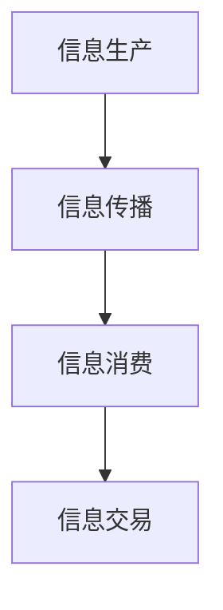

**图1：信息交易的基本框架**

通过以上框架，我们可以看到信息交易在元宇宙中的关键作用。信息交易不仅促进了内容创作者和用户之间的互动，也推动了元宇宙经济的发展。随着元宇宙的不断成熟，信息交易将变得越来越重要，它将成为元宇宙经济体系中的重要组成部分。

### 第一部分：引论

#### 第2章：注意力市场的构成要素

注意力市场是元宇宙中的一个关键组成部分，它依赖于用户注意力的有效管理和交易。要理解注意力市场的运作，我们需要深入探讨其构成要素，包括注意力资源、信息内容和信息交易主体。

##### 2.1 注意力资源

注意力资源是注意力市场的核心。它指的是用户在元宇宙中投入的精神集中度、关注度等。在元宇宙中，用户的注意力是一种有限的资源，因为用户在现实世界和虚拟世界之间分配时间，并拥有有限的精力。因此，如何有效地管理用户的注意力，对于内容创作者和平台来说至关重要。

**注意力资源的特点包括：**

1. **稀缺性**：用户的注意力是有限的，他们不可能在无限的时间里关注无限的内容。
2. **可交易性**：用户的注意力可以通过各种形式转化为经济价值，如通过浏览、点赞、评论等行为获得虚拟货币。
3. **易测性**：注意力可以通过算法和技术手段进行测量和评估，例如用户在特定内容上停留的时间、互动频率等。

在元宇宙中，用户可以通过参与各种活动来消耗自己的注意力。这些活动包括观看视频、玩游戏、参与虚拟社交等。用户消耗注意力的同时，平台和内容创作者则通过算法和激励机制，收集和分析用户的行为数据，以优化内容推荐和用户体验。

**注意力资源的交易流程大致如下：**

1. **注意力消耗**：用户在元宇宙中浏览内容或参与活动，消耗注意力。
2. **数据收集**：平台和内容创作者收集用户行为数据，如浏览时长、互动频率等。
3. **价值评估**：基于用户行为数据，平台评估用户的注意力价值。
4. **虚拟货币奖励**：用户获得虚拟货币作为注意力消耗的回报。
5. **货币化**：用户可以使用虚拟货币购买其他虚拟商品或服务。

##### 2.2 信息内容

信息内容是注意力市场中的交易对象。它包括各种形式的数据和内容，如文字、图片、音频、视频、虚拟商品等。信息内容的质量和吸引力直接影响用户的注意力消耗和参与度。

**信息内容的特点包括：**

1. **多样性**：元宇宙中的信息内容丰富多样，满足了用户的不同需求和兴趣。
2. **个性化**：通过算法和数据分析，平台可以为用户提供个性化的内容推荐，提高用户的参与度。
3. **互动性**：信息内容可以与用户进行互动，如评论、点赞、分享等，增加用户的参与感。
4. **虚拟性**：元宇宙中的信息内容通常是虚拟的，但它们在用户的心理和行为上具有实际意义。

在注意力市场中，信息内容的生产和传播至关重要。内容创作者需要创作高质量、有吸引力的内容，以吸引和保留用户的注意力。平台则需要优化内容推荐机制，提高信息传播的效率和效果。

**信息内容的生命周期包括：**

1. **生产**：内容创作者创作信息内容，如撰写文章、制作视频等。
2. **传播**：平台通过推荐算法将内容推送给用户，提高内容的曝光率。
3. **消费**：用户浏览、互动、消费信息内容，消耗注意力。
4. **反馈**：用户对内容进行评价和反馈，影响内容的推荐和优化。

##### 2.3 信息交易主体

信息交易主体包括信息生产者、传播者和消费者。他们是注意力市场的主要参与者，各自发挥着关键作用。

1. **信息生产者**：包括个人内容创作者、机构、品牌等。他们创作和发布信息内容，吸引用户的注意力。
2. **信息传播者**：包括平台、算法、社交网络等。他们负责将信息内容传播给用户，提高内容的曝光率和参与度。
3. **信息消费者**：包括元宇宙中的用户。他们通过消耗注意力，获取和消费信息内容，实现虚拟货币的交换。

**信息交易主体的关系如下：**

1. **信息生产者与信息传播者**：生产者将内容提交给平台或社交网络，传播者通过算法推荐，将内容推送给用户。
2. **信息传播者与信息消费者**：传播者确保内容的传播和曝光，消费者通过浏览和互动，消耗注意力。
3. **信息消费者与信息生产者**：消费者对内容进行评价和反馈，影响内容的生产和推荐。

在注意力市场中，信息交易主体的协同合作至关重要。生产者需要创作高质量的内容，传播者需要优化推荐算法，消费者需要积极参与和互动，共同推动元宇宙的健康发展。

通过以上对注意力市场构成要素的探讨，我们可以看到，注意力资源、信息内容和信息交易主体共同构成了一个复杂而动态的市场体系。理解这些要素，不仅有助于我们更好地参与元宇宙的建设，也为未来的研究和实践提供了基础。

### 第一部分：引论

#### 第3章：元宇宙中的信息交易模式

随着元宇宙的发展，信息交易模式也在不断演变。元宇宙中的信息交易不仅限于传统的货币交换，还包括非同质化代币（NFT）、数据交易和注意力货币化等多种形式。这些交易模式为元宇宙中的用户提供了多样化的经济参与方式，同时也带来了新的挑战和机遇。

##### 3.1 NFT交易

NFT（Non-Fungible Token，非同质化代币）是元宇宙中最引人注目的交易模式之一。与比特币等加密货币不同，NFT代表独一无二的内容或资产，如数字艺术品、虚拟地产、游戏道具等。每个NFT都有其独特的标识和所有权信息，这使得它们在交易中具有独特的价值和潜力。

**NFT交易的特点包括：**

1. **唯一性**：每个NFT都是独一无二的，无法与其他代币互换，这增加了其在市场中的独特性和吸引力。
2. **所有权**：NFT的所有权记录在区块链上，确保了所有权的透明和不可篡改。
3. **稀缺性**：由于NFT的不可复制性，某些NFT的稀缺性使其成为收藏家和投资者的热门选择。
4. **增值潜力**：一些NFT在市场上的增值潜力巨大，吸引了大量投资者的关注。

NFT交易在元宇宙中的应用非常广泛。例如，数字艺术品市场利用NFT确保艺术品的原创性和所有权，用户可以通过购买和出售NFT来参与艺术品交易。虚拟地产市场也利用NFT来代表虚拟地产的所有权和使用权，用户可以购买、出售或出租虚拟地产，从而实现经济收益。

**NFT交易的流程通常包括：**

1. **创作**：内容创作者创建独特的数字资产，如数字艺术品、虚拟商品等。
2. **上链**：将数字资产上传到区块链，并创建对应的NFT。
3. **拍卖**：平台或创作者可以设置拍卖，用户参与竞拍，最高出价者获得NFT。
4. **交易**：NFT在市场中进行买卖，买家支付虚拟货币获得NFT所有权。
5. **验证**：交易记录和所有权信息通过区块链进行验证，确保透明和不可篡改。

**案例**：著名艺术家Beeple（Mike Winkelmann）的数字艺术品《Everydays: The First 5000 Days》在佳士得拍卖行以6930万美元的高价售出，创下了NFT艺术品成交价的新纪录。这一事件不仅展示了NFT在艺术市场中的潜力，也引发了全球对NFT的关注和讨论。

##### 3.2 数据交易

数据交易是元宇宙中的另一个重要交易模式。在元宇宙中，用户生成和交互的数据具有巨大的经济价值，这些数据可以包括用户行为、偏好、交易记录等。数据交易市场为用户提供了出售自己数据的机会，同时也为企业和平台提供了获取用户数据的新途径。

**数据交易的特点包括：**

1. **隐私性**：数据交易通常涉及个人隐私，因此保护用户隐私是数据交易市场的关键。
2. **匿名性**：为了保护用户隐私，数据交易市场通常采用匿名化的方式，确保用户身份的保密。
3. **价值评估**：数据的价值取决于其质量、数量和用途，数据交易市场通过算法评估数据的价值，以确定交易价格。
4. **市场化**：数据交易市场通过建立交易平台和交易规则，实现数据的高效流通和交易。

在元宇宙中，数据交易市场为用户提供了多种方式来出售自己的数据。例如，用户可以通过平台匿名地出售自己的浏览历史、购物习惯等数据，从而获得虚拟货币奖励。同时，企业和平台可以通过购买用户数据来优化产品和服务，提高用户体验。

**数据交易的流程通常包括：**

1. **数据生成**：用户在元宇宙中生成和交互数据。
2. **数据上传**：用户将数据上传到交易平台，平台进行匿名化处理。
3. **价值评估**：平台通过算法评估数据的价值，确定交易价格。
4. **交易**：用户与平台或企业进行数据交易，用户获得虚拟货币奖励。
5. **隐私保护**：交易过程中，平台确保用户的隐私和数据安全。

**案例**：Facebook在2021年推出了“数据市场”计划，允许用户选择是否出售自己的数据给广告商和其他第三方。用户可以设置数据的价格，并根据数据的质量和数量获得收益。这一计划旨在提高用户对数据价值的认识，同时为广告商提供更准确的数据。

##### 3.3 注意力货币化

注意力货币化是指用户通过消耗注意力（如浏览、互动、参与活动等）获得虚拟货币的过程。在元宇宙中，用户的注意力成为了一种重要的经济资源，通过注意力货币化，用户可以将自己的注意力转化为实际的经济收益。

**注意力货币化的特点包括：**

1. **参与性**：用户需要积极参与元宇宙的活动，才能获得注意力回报。
2. **激励性**：平台通过虚拟货币激励用户，提高用户的参与度和忠诚度。
3. **可量化**：用户的注意力消耗可以通过算法和技术手段进行量化，从而实现精确的货币化。
4. **多样性**：注意力货币化可以应用于多种场景，如内容消费、虚拟商品购买、游戏参与等。

在元宇宙中，注意力货币化为用户提供了多种获取虚拟货币的途径。例如，用户可以通过浏览广告、参与游戏、完成任务等方式获得虚拟货币奖励。平台和内容创作者也可以通过提供高质量的内容和服务，吸引更多用户的注意力，从而实现货币化。

**注意力货币化的流程通常包括：**

1. **用户参与**：用户在元宇宙中浏览内容、参与活动、消费信息等，消耗注意力。
2. **行为记录**：平台记录用户的行为数据，如浏览时长、互动频率等。
3. **价值评估**：平台根据用户行为数据评估注意力的价值，确定虚拟货币奖励。
4. **奖励发放**：平台将虚拟货币奖励发放给用户，用户可以使用虚拟货币购买其他商品或服务。

**案例**：Steemit是一个基于区块链的内容平台，用户可以通过发布、评论和点赞等方式参与内容创作和互动。平台根据用户的参与度和影响力，发放Steem币作为奖励。用户可以将Steem币出售或用于购买其他虚拟商品，从而实现注意力货币化。

总之，元宇宙中的信息交易模式多种多样，NFT交易、数据交易和注意力货币化等模式共同构成了一个丰富而多样化的市场。随着元宇宙的不断发展，这些交易模式也将不断演进，为用户和平台带来更多的机遇和挑战。

### 第一部分：引论

#### 第4章：注意力市场的发展趋势

随着元宇宙和数字技术的不断演进，注意力市场正迎来新的发展机遇和挑战。在这个章节中，我们将探讨技术变革、法律法规以及注意力市场的未来趋势。

##### 4.1 技术变革对注意力市场的影响

技术变革是推动注意力市场发展的重要因素。以下是几项关键技术及其对注意力市场的影响：

1. **虚拟现实（VR）和增强现实（AR）**：VR和AR技术为用户提供了更加沉浸式的体验，使注意力市场更加丰富和多样。用户可以在虚拟环境中进行各种活动，从而增加他们的注意力消耗。

2. **区块链技术**：区块链技术为注意力市场提供了安全、透明和去中心化的基础设施。通过区块链，用户的注意力消耗和交易可以记录在一个不可篡改的账本上，确保了数据的可靠性和隐私性。

3. **人工智能（AI）**：人工智能技术，特别是机器学习和推荐系统，可以分析用户的行为和偏好，提供个性化的内容推荐，从而提高用户参与度和满意度。AI还可以帮助平台和内容创作者优化信息传播和交易策略。

4. **加密货币**：加密货币作为注意力市场的交易媒介，提供了便捷和安全的支付方式。随着加密货币的普及，越来越多的用户和平台开始接受和采用加密货币进行交易。

##### 4.2 法律法规对注意力市场的影响

法律法规的完善对注意力市场的健康发展至关重要。以下是一些关键法律法规及其对注意力市场的影响：

1. **数据隐私法**：随着用户数据在注意力市场中的重要性日益增加，数据隐私法成为保护用户隐私的重要保障。例如，欧盟的《通用数据保护条例》（GDPR）要求企业必须透明地处理用户数据，并获得用户的明确同意。

2. **数字货币监管**：数字货币的监管法规正在逐步完善。一些国家已经开始对加密货币进行监管，以防止非法交易和洗钱等活动。监管的加强有助于提高加密货币市场的透明度和稳定性。

3. **内容监管**：注意力市场中的内容监管也是一个重要问题。平台需要确保其提供的内容不违反法律法规，如版权法、诽谤法等。同时，平台也需要采取措施防止虚假信息和有害内容的传播。

##### 4.3 注意力市场的未来展望

未来，注意力市场将呈现以下几个发展趋势：

1. **市场规模扩大**：随着元宇宙的发展和用户对虚拟世界需求的增加，注意力市场的规模将继续扩大。更多的用户和内容创作者将参与到注意力市场中，推动市场的发展和成熟。

2. **技术进步**：随着VR、AR、区块链和人工智能等技术的不断进步，注意力市场将变得更加高效和智能化。技术进步将提高信息传播的效率，优化用户体验，促进市场的发展。

3. **法律法规完善**：随着注意力市场的成熟，法律法规将进一步完善，以保障市场的健康发展。数据隐私法、数字货币监管法等法律法规的完善将为市场提供更可靠的法律保障。

4. **多元化发展**：注意力市场将不仅仅局限于信息交易，还将扩展到其他领域，如虚拟商品交易、数据交易、虚拟劳动力市场等。多元化的市场结构将提供更多的经济参与机会，促进市场的繁荣。

总之，注意力市场在元宇宙时代下具有广阔的发展前景。随着技术的进步和法律法规的完善，注意力市场将变得更加成熟和规范，为用户和平台带来更多的机遇和挑战。

### 第二部分：核心概念与联系

#### 第5章：注意力市场的核心概念

在深入探讨注意力市场之前，理解其核心概念至关重要。注意力市场涉及多个经济学、信息学和技术的核心概念。以下是注意力市场中一些重要的核心概念及其解释。

##### 5.1 注意力经济学基础

注意力经济学是研究用户注意力价值及其在市场中的交换和分配的经济学分支。注意力被视为一种稀缺资源，用户在元宇宙中消耗注意力以获取信息或服务。以下是注意力经济学的基础概念：

1. **注意力价值**：注意力价值是指用户在元宇宙中投入的注意力所对应的经济价值。这种价值可以通过用户的行为数据（如浏览时间、互动频率）进行量化。

2. **注意力稀缺性**：注意力稀缺性指的是用户在现实世界和虚拟世界之间分配时间时面临的限制。用户在元宇宙中消耗注意力，可能会减少他们在现实世界中的其他活动，如工作、社交等。

3. **注意力市场**：注意力市场是一个由用户、内容创作者和平台组成的生态系统，用户通过消耗注意力获得信息或服务，内容创作者通过吸引注意力来创作和传播信息，平台则提供基础设施和激励机制，促进注意力交易。

4. **注意力交换**：注意力交换是指用户通过浏览、点赞、评论等行为消耗注意力，并获得虚拟货币或奖励的过程。这种交换形式在注意力市场中至关重要，因为它激励用户参与元宇宙活动，同时为内容创作者和平台带来经济收益。

##### 5.2 信息经济学原理

信息经济学研究信息在市场中的生产和传播，以及信息对市场行为的影响。以下是一些关键信息经济学原理：

1. **信息价值**：信息价值是指信息对用户或市场的经济影响。高质量的信息可以提供决策优势，从而带来经济利益。

2. **信息不对称**：信息不对称是指市场参与者之间在信息拥有方面存在差异。信息不对称可能导致市场失灵，例如，内容创作者可能拥有更多关于用户行为的信息，而用户则可能不了解内容的真实价值。

3. **信息传播机制**：信息传播机制是指信息在市场中传递的方式。有效的传播机制可以提高信息的获取和利用效率，例如，通过推荐系统、社交媒体、搜索引擎等。

4. **信息经济学与注意力市场的联系**：信息经济学原理为注意力市场提供了理论基础。注意力市场中的信息交易、信息价值的评估和信息传播机制等概念，均可以基于信息经济学的理论进行分析和优化。

##### 5.3 注意力市场中的供需关系

供需关系是市场经济中的基本概念，在注意力市场中同样适用。以下是注意力市场中的供需关系及其影响：

1. **供给**：供给是指内容创作者生产的信息内容。供给量取决于创作者的数量、创作能力和市场的需求。

2. **需求**：需求是指用户对信息内容的消费需求。需求量取决于用户的数量、兴趣和行为。

3. **供需平衡**：供需平衡是指供给量和需求量达到相等的状态。在理想情况下，供给和需求应保持平衡，以确保市场稳定和可持续发展。

4. **供需波动**：供需波动是指由于外部因素（如技术进步、市场变化、用户行为变化等）导致的供给和需求的不稳定。供给和需求的波动会影响虚拟货币的定价和市场交易量。

5. **供需调节**：为了应对供需波动，平台和内容创作者需要采取相应的调节措施，如调整内容推荐策略、优化信息传播机制、调整虚拟货币奖励机制等。

**图2：注意力市场中的供需关系**

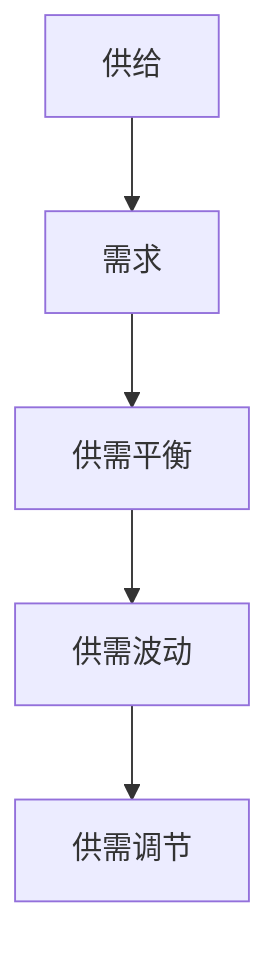

**图2描述了注意力市场中的供需关系，以及如何通过调节措施应对供需波动。**

通过以上对注意力市场的核心概念的解释，我们可以更好地理解元宇宙中的信息交易机制，为后续章节的深入分析提供基础。

### 第二部分：核心概念与联系

#### 第6章：注意力市场的核心架构

注意力市场的核心架构是确保其高效运行和可持续发展的关键。在这个章节中，我们将详细探讨注意力市场的生态系统、元宇宙平台的架构以及信息交易平台的构建。

##### 6.1 注意力市场的生态系统

注意力市场的生态系统由多个参与者组成，包括内容创作者、用户、平台和技术提供商。以下是生态系统的组成部分：

1. **内容创作者**：内容创作者是指生产信息内容的个人或组织，如游戏开发者、艺术家、媒体公司等。他们创作和发布各种类型的信息内容，以吸引和保持用户的注意力。

2. **用户**：用户是指参与注意力市场活动的个体，他们在元宇宙中消耗注意力以获取信息和体验。用户的注意力消耗可以通过浏览、互动、参与活动等方式进行。

3. **平台**：平台是指提供基础设施和技术服务的实体，它们为内容创作者和用户提供连接和交互的场所。平台通过算法推荐、交易机制等手段，促进信息交易和注意力分配。

4. **技术提供商**：技术提供商是指提供区块链、人工智能、虚拟现实等技术支持的实体。他们为平台和内容创作者提供必要的技术工具和解决方案，以实现注意力市场的有效运行。

**图3：注意力市场的生态系统**

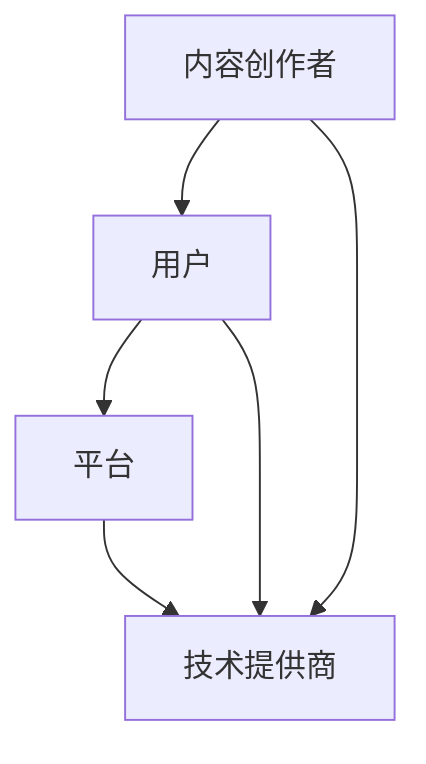

**图3描述了注意力市场生态系统的组成部分及其相互关系。**

在注意力市场的生态系统中，各参与者之间通过信息交换和价值传递相互联系。内容创作者通过创作高质量的信息内容吸引用户的注意力，用户通过消耗注意力获得虚拟货币或奖励，平台通过提供交易平台和激励机制促进交易的进行，技术提供商则提供技术支持和解决方案，确保市场的稳定和高效运行。

##### 6.2 元宇宙平台的架构

元宇宙平台的架构是注意力市场的重要组成部分。一个典型的元宇宙平台通常包括以下几个关键组成部分：

1. **前端界面**：前端界面是用户与元宇宙交互的入口，包括虚拟现实头盔、增强现实眼镜、触控设备等。用户通过这些设备进入元宇宙，浏览、互动和消费信息内容。

2. **后端服务器**：后端服务器负责处理用户请求、数据存储、计算和交易等操作。后端服务器通常部署在云计算平台上，具有高可用性、高可靠性和高性能的特点。

3. **区块链网络**：区块链网络是元宇宙平台的数据存储和交易核心。通过区块链技术，平台可以实现去中心化的数据存储和交易，确保数据的透明性和安全性。

4. **智能合约**：智能合约是自动化执行协议的计算机程序。在元宇宙平台中，智能合约用于自动执行交易协议、支付和处理虚拟货币等操作。

5. **数据分析与推荐系统**：数据分析与推荐系统用于分析用户行为数据，提供个性化的内容推荐，提高用户的参与度和满意度。

**图4：元宇宙平台的架构**

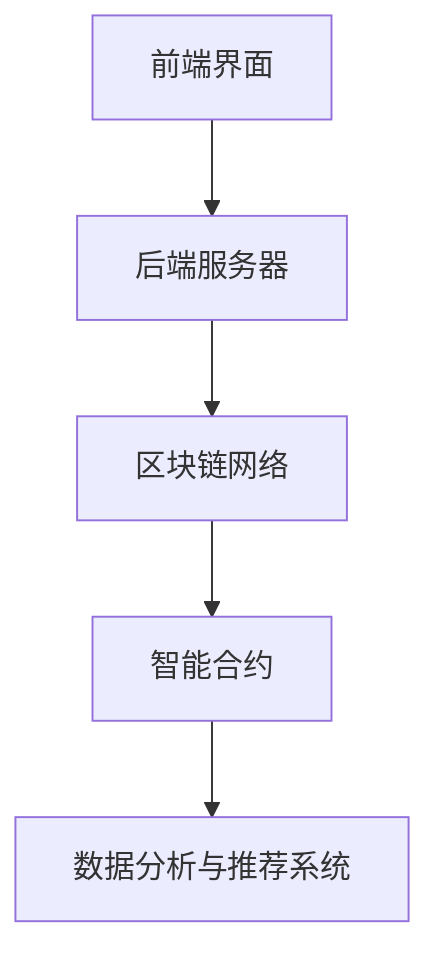

**图4描述了元宇宙平台的架构及其关键组成部分。**

在元宇宙平台中，前端界面提供用户交互的入口，后端服务器处理用户请求和数据存储，区块链网络确保交易的安全性和透明度，智能合约自动化执行交易协议，数据分析与推荐系统则提供个性化服务，提高用户体验。

##### 6.3 信息交易平台的构建

信息交易平台的构建是注意力市场成功的关键。以下是一些关键步骤和考虑因素：

1. **需求分析**：在构建交易平台之前，需要进行详细的需求分析，确定平台的目标用户、业务模式、功能需求等。

2. **技术选型**：根据需求分析，选择合适的区块链平台、编程语言、数据库等技术工具。常见的区块链平台包括以太坊、波卡等。

3. **架构设计**：设计交易平台的整体架构，包括前端界面、后端服务器、区块链网络、智能合约等。确保架构具有高可用性、高扩展性和高安全性。

4. **功能实现**：根据架构设计，逐步实现平台的功能，包括用户注册、登录、信息浏览、交易操作、数据分析与推荐等。

5. **测试与优化**：在平台开发过程中，进行详细的测试，确保功能的正确性和性能的优化。测试包括单元测试、集成测试、压力测试等。

6. **上线与维护**：平台开发完成后，进行上线和运营。在运营过程中，持续收集用户反馈，进行功能优化和系统维护。

**图5：信息交易平台的构建流程**

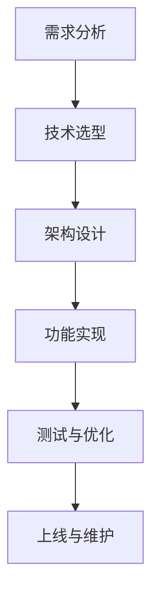

**图5描述了信息交易平台的构建流程及其关键步骤。**

通过以上对注意力市场核心架构的探讨，我们可以看到，一个成功的注意力市场需要内容创作者、用户、平台和技术提供商的紧密协作。元宇宙平台的架构和功能实现是确保注意力市场高效运行的基础。信息交易平台的构建则需要科学的需求分析、技术选型和架构设计，以及严格的测试与维护。随着技术的不断进步和市场的发展，注意力市场的架构将不断优化和进化，为用户提供更加丰富和便捷的虚拟体验。

### 第二部分：核心概念与联系

#### 第7章：注意力市场的技术原理

注意力市场的技术原理是其高效运行和可持续发展的基础。在这个章节中，我们将深入探讨区块链技术、加密货币和人工智能在注意力市场中的应用，以及它们如何共同构建一个高效、安全、透明的信息交易生态系统。

##### 7.1 区块链技术

区块链技术是注意力市场的重要基础设施，为信息交易提供了安全、透明和去中心化的保障。以下是区块链技术的基本原理和其在注意力市场中的应用：

**区块链技术的基本原理：**

1. **去中心化**：区块链技术通过分布式网络结构，消除了中心化服务器的依赖，使得数据存储和交易可以在多个节点之间同步和验证。

2. **数据不可篡改**：区块链采用加密算法，确保数据一旦写入区块链，就无法被篡改。每个区块包含一定数量的交易记录，并通过哈希算法与前一个区块链接，形成链式结构。

3. **共识机制**：区块链网络通过共识机制，如工作量证明（PoW）或权益证明（PoS），确保所有节点对数据的真实性和一致性达成共识。

4. **智能合约**：智能合约是自动化执行协议的计算机程序，运行在区块链网络中。智能合约可以自动执行交易协议，如支付、合约管理等，提高交易的效率和安全性。

**区块链技术在注意力市场中的应用：**

1. **数据存储和验证**：区块链技术用于存储用户行为数据、交易记录等信息，确保数据的真实性和不可篡改性。平台可以通过区块链网络验证用户身份和交易记录，提高数据的可信度。

2. **去中心化交易**：区块链技术支持去中心化的交易模式，用户可以直接进行点对点的交易，无需依赖中心化平台。这降低了交易成本，提高了交易效率。

3. **智能合约应用**：智能合约在注意力市场中发挥着重要作用，如自动执行虚拟货币的支付和奖励机制、管理虚拟资产的所有权和使用权等。

4. **隐私保护**：区块链技术可以提供数据隐私保护，通过加密算法确保用户数据的隐私和安全。用户可以在匿名状态下进行交易，减少个人信息泄露的风险。

**图6：区块链技术在注意力市场中的应用**

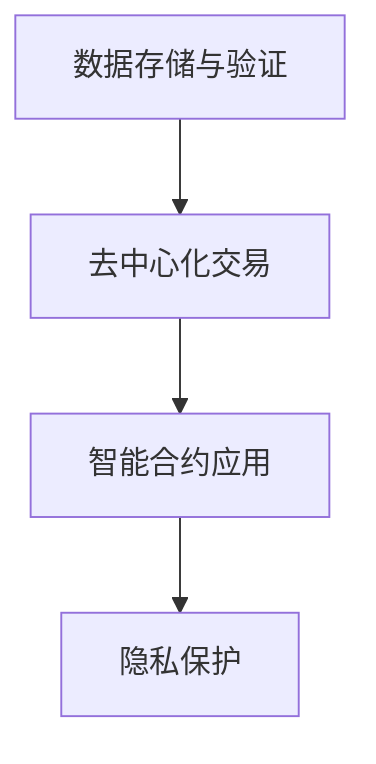

**图6描述了区块链技术在注意力市场中的应用及其关键作用。**

##### 7.2 加密货币

加密货币是注意力市场中的交易媒介，为用户提供了便捷和安全的支付方式。以下是加密货币的基本原理和其在注意力市场中的应用：

**加密货币的基本原理：**

1. **去中心化**：加密货币不受中央银行或金融机构的控制，通过分布式网络进行发行和管理。

2. **安全性**：加密货币采用加密算法，确保交易记录和账户信息的隐私和安全。每次交易都通过公钥和私钥进行加密和解密，确保只有合法所有者才能进行交易。

3. **匿名性**：加密货币交易通常不需要提供真实身份信息，用户可以在匿名状态下进行交易，保护个人隐私。

4. **可扩展性**：加密货币网络可以通过分片技术、扩容方案等手段提高交易处理速度，满足大规模交易需求。

**加密货币在注意力市场中的应用：**

1. **交易媒介**：加密货币作为注意力市场中的交易媒介，用户可以使用比特币、以太坊等加密货币购买虚拟商品、服务或参与交易。

2. **奖励机制**：平台和内容创作者可以通过发放加密货币奖励，激励用户参与元宇宙活动，提高用户参与度和忠诚度。

3. **去中心化金融（DeFi）应用**：加密货币在DeFi领域有广泛应用，用户可以通过去中心化借贷、交易、投资等获得收益，参与元宇宙的经济活动。

4. **跨境支付**：加密货币可以用于跨境支付，提供高效、低成本的国际支付解决方案，打破传统金融系统的限制。

**图7：加密货币在注意力市场中的应用**

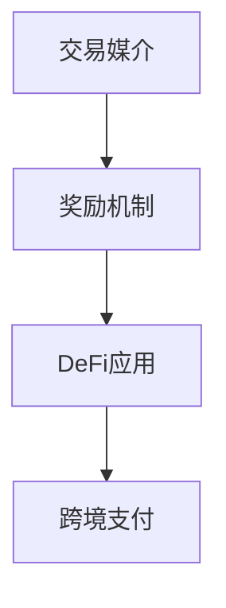

**图7描述了加密货币在注意力市场中的应用及其关键作用。**

##### 7.3 人工智能与注意力市场

人工智能技术在注意力市场中发挥着重要作用，从信息推荐、数据分析到智能合约执行，人工智能提高了信息交易的高效性和用户体验。以下是人工智能在注意力市场中的应用：

**人工智能技术的应用：**

1. **信息推荐系统**：通过机器学习和自然语言处理技术，平台可以分析用户行为数据，提供个性化的内容推荐，提高用户的参与度和满意度。

2. **数据分析与挖掘**：人工智能可以分析大量用户数据，挖掘用户偏好和行为模式，帮助内容创作者优化内容生产和推广策略。

3. **智能合约执行**：智能合约可以嵌入人工智能算法，自动执行复杂的交易协议，提高交易的效率和安全性。

4. **用户行为预测**：通过深度学习和大数据分析，平台可以预测用户的下一步行为，提供定制化的服务和建议。

5. **虚拟助手与互动**：虚拟助手和智能互动系统能够模拟人类的交流方式，提供实时客服、信息查询和娱乐服务，增强用户体验。

**图8：人工智能在注意力市场中的应用**

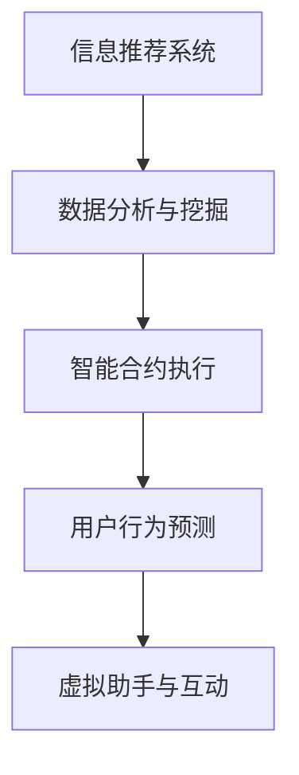

**图8描述了人工智能在注意力市场中的应用及其关键作用。**

通过以上对区块链技术、加密货币和人工智能在注意力市场中的应用的探讨，我们可以看到，这些技术共同构建了一个高效、安全、透明的信息交易生态系统。区块链技术确保了数据的真实性和安全性，加密货币提供了便捷的交易媒介，人工智能则提高了信息交易的高效性和用户体验。随着这些技术的不断发展和融合，注意力市场将变得更加成熟和规范，为用户和平台带来更多的机遇和挑战。

### 第二部分：核心概念与联系

#### 第8章：注意力市场中的核心算法

注意力市场中的核心算法是确保信息交易高效、智能和个性化的重要工具。在本章节中，我们将详细探讨信息检索算法、推荐系统算法以及深度学习在注意力市场中的应用。

##### 8.1 信息检索算法

信息检索算法用于帮助用户快速找到他们感兴趣的信息。这些算法基于用户的行为数据、关键词和上下文信息，通过计算相似度或相关性来推荐合适的信息内容。以下是几种常见的信息检索算法：

**1. 基于关键词搜索**：
   - **原理**：用户输入关键词，算法根据关键词匹配数据库中的内容，返回最相关的结果。
   - **优缺点**：优点是简单直接，易于实现。缺点是受限于关键词的精确度和上下文理解能力。

**2. 基于向量空间模型**：
   - **原理**：将文本内容表示为向量，通过计算向量之间的余弦相似度来推荐相似的内容。
   - **优缺点**：优点是能够处理复杂的语义关系。缺点是需要大量计算资源，且对稀疏数据敏感。

**3. 自然语言处理（NLP）算法**：
   - **原理**：使用NLP技术，如词性标注、命名实体识别、语义分析等，理解文本的语义和上下文，提供更精确的检索结果。
   - **优缺点**：优点是能够提供语义相关的检索结果。缺点是实现复杂，对数据质量要求高。

**示例**：
```python
# 基于关键词搜索的伪代码
def search_keyword(query):
    keywords = ["metaverse", "attention economy", "NFT"]
    results = []
    for content in database:
        if query in content:
            results.append(content)
    return results
```

**图9：基于关键词搜索的信息检索算法**

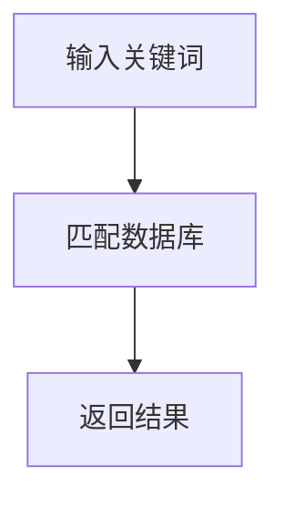

**图9描述了基于关键词搜索的信息检索算法流程。**

##### 8.2 推荐系统算法

推荐系统算法用于向用户推荐他们可能感兴趣的信息内容。这些算法通过分析用户的历史行为、偏好和相似用户的行为，预测用户未来的兴趣，从而提供个性化的推荐。以下是几种常见的推荐系统算法：

**1. 协同过滤算法**：
   - **原理**：通过分析用户之间的共同行为，发现相似用户，然后根据相似用户的行为推荐信息。
   - **优缺点**：优点是易于实现，能够发现用户之间的相似性。缺点是受限于用户行为数据的稀疏性。

**2. 基于内容的推荐**：
   - **原理**：根据用户的历史行为和偏好，推荐具有相似内容特征的信息。
   - **优缺点**：优点是能够提供基于内容的信息推荐。缺点是受限于内容特征提取的准确性。

**3. 混合推荐系统**：
   - **原理**：结合协同过滤和基于内容的推荐，提高推荐效果。
   - **优缺点**：优点是综合了协同过滤和基于内容的优点。缺点是实现复杂，对数据要求高。

**示例**：
```python
# 基于协同过滤的推荐系统算法伪代码
def collaborative_filter(user, database):
    similar_users = find_similar_users(user, database)
    recommended_items = []
    for item in database:
        if item not in user_history and any(similar_user_likes_item for similar_user in similar_users if item in similar_user_history):
            recommended_items.append(item)
    return recommended_items
```

**图10：协同过滤推荐系统算法**

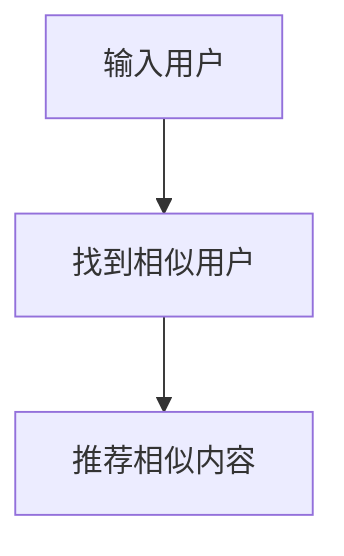

**图10描述了协同过滤推荐系统算法的流程。**

##### 8.3 深度学习在注意力市场中的应用

深度学习是近年来人工智能领域的重要突破，其在注意力市场中的应用主要体现在信息检索、推荐系统和智能合约执行等方面。以下是深度学习在注意力市场中的应用：

**1. 文本嵌入**：
   - **原理**：通过神经网络模型将文本转换为向量表示，实现文本之间的相似性计算。
   - **应用**：用于信息检索和推荐系统的内容特征提取。

**2. 卷积神经网络（CNN）**：
   - **原理**：通过卷积操作提取图像特征，实现图像分类和识别。
   - **应用**：用于图像内容的检索和推荐。

**3. 递归神经网络（RNN）**：
   - **原理**：通过循环结构处理序列数据，实现时间序列预测和文本生成。
   - **应用**：用于用户行为预测和智能合约执行。

**4. 变分自编码器（VAE）**：
   - **原理**：通过编码和解码过程实现数据的降维和生成。
   - **应用**：用于用户画像构建和信息个性化推荐。

**示例**：
```python
# 基于卷积神经网络的图像内容检索算法伪代码
def image_retrieval(image):
    model = load_model('cnn_model')
    feature_vector = model.extract_features(image)
    similar_images = find_similar_images(feature_vector, image_database)
    return similar_images
```

**图11：深度学习在注意力市场中的应用**

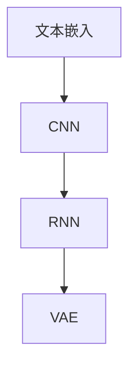

**图11描述了深度学习在注意力市场中的应用及其关键技术。**

通过以上对注意力市场中核心算法的详细探讨，我们可以看到，信息检索算法、推荐系统算法以及深度学习技术共同构成了一个强大的工具集，用于优化信息交易和提升用户体验。随着技术的不断进步，这些算法将继续演进，为元宇宙中的注意力市场带来更多的机遇和挑战。

### 第二部分：核心概念与联系

#### 第9章：算法在信息交易中的应用

算法在注意力市场中扮演着至关重要的角色，特别是在数据清洗与预处理、数据分析和挖掘、模型训练与优化等方面。这些步骤不仅确保了信息交易的准确性和效率，还提升了用户的整体体验。以下是这些关键步骤的详细解释和实际应用。

##### 9.1 数据清洗与预处理

数据清洗与预处理是信息交易中至关重要的一步，因为它直接影响后续的数据分析和模型训练效果。以下是数据清洗与预处理的几个关键步骤：

1. **数据去重**：在信息交易过程中，数据来源多样，可能会存在重复的数据条目。去重步骤通过识别和删除重复数据，确保数据的唯一性和完整性。

   ```python
   # 数据去重的伪代码
   def remove_duplicates(data):
       unique_data = []
       for record in data:
           if record not in unique_data:
               unique_data.append(record)
       return unique_data
   ```

2. **缺失值处理**：数据在采集过程中可能会出现缺失值，缺失值处理方法包括删除缺失数据、填充缺失值或使用统计方法估计缺失值。

   ```python
   # 缺失值填充的伪代码
   def fill_missing_values(data, method='mean'):
       for column in data:
           if method == 'mean':
               data[column].fillna(data[column].mean(), inplace=True)
           elif method == 'median':
               data[column].fillna(data[column].median(), inplace=True)
           else:
               data[column].fillna(data[column].mode()[0], inplace=True)
       return data
   ```

3. **数据标准化**：不同特征的数据量级和范围可能差异很大，数据标准化通过调整数据范围，使得不同特征在模型训练中具有相同的权重。

   ```python
   # 数据标准化的伪代码
   from sklearn.preprocessing import StandardScaler

   def standardize_data(data):
       scaler = StandardScaler()
       scaled_data = scaler.fit_transform(data)
       return scaled_data
   ```

**图12：数据清洗与预处理流程**

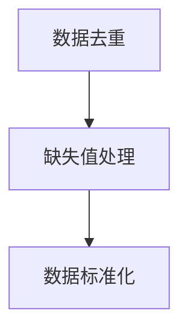

**图12描述了数据清洗与预处理的流程和步骤。**

##### 9.2 数据分析与挖掘

数据分析与挖掘是信息交易的核心步骤，通过分析用户行为数据和市场数据，提取有价值的信息和模式。以下是数据分析与挖掘的几个关键步骤：

1. **用户行为分析**：通过分析用户的行为数据（如浏览历史、点击率、购买行为等），了解用户偏好和需求，为个性化推荐和营销策略提供依据。

   ```python
   # 用户行为分析的伪代码
   def user_behavior_analysis(behavior_data):
       user_patterns = {}
       for user, actions in behavior_data.items():
           # 分析用户行为模式
           user_patterns[user] = analyze_actions(actions)
       return user_patterns
   ```

2. **市场趋势分析**：通过分析市场数据（如交易量、价格波动、供需关系等），了解市场动态和趋势，为交易策略和风险管理提供支持。

   ```python
   # 市场趋势分析的伪代码
   def market_trend_analysis.market_trends(data):
       trends = {}
       for metric in data:
           trends[metric] = analyze_trend(data[metric])
       return trends
   ```

3. **关联规则挖掘**：通过分析用户行为数据和市场数据，发现不同变量之间的关联规则，用于推荐系统和市场预测。

   ```python
   # 关联规则挖掘的伪代码
   from mlxtend.frequent_patterns import apriori
   def association_rules(data, support=0.5, confidence=0.5):
       rules = apriori(data, support=support, confidence=confidence)
       return rules
   ```

**图13：数据分析与挖掘流程**

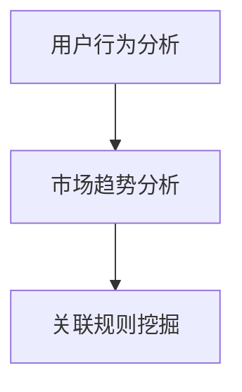

**图13描述了数据分析与挖掘的流程和步骤。**

##### 9.3 模型训练与优化

模型训练与优化是信息交易中的关键步骤，通过训练和优化模型，提高预测准确性和交易效率。以下是模型训练与优化的几个关键步骤：

1. **数据分割**：将数据集分为训练集和测试集，用于训练模型和评估模型性能。

   ```python
   # 数据分割的伪代码
   from sklearn.model_selection import train_test_split

   def split_data(data, test_size=0.2):
       X_train, X_test, y_train, y_test = train_test_split(data['features'], data['labels'], test_size=test_size)
       return X_train, X_test, y_train, y_test
   ```

2. **模型选择**：根据问题和数据特点，选择合适的机器学习模型，如线性回归、决策树、随机森林、神经网络等。

   ```python
   # 模型选择的伪代码
   from sklearn.ensemble import RandomForestClassifier

   def select_model(model_name='RandomForestClassifier'):
       if model_name == 'LinearRegression':
           model = LinearRegression()
       elif model_name == 'RandomForestClassifier':
           model = RandomForestClassifier()
       # 其他模型
       return model
   ```

3. **模型训练**：使用训练集对模型进行训练，调整模型参数，提高模型性能。

   ```python
   # 模型训练的伪代码
   def train_model(model, X_train, y_train):
       model.fit(X_train, y_train)
       return model
   ```

4. **模型评估**：使用测试集评估模型性能，选择最优模型。

   ```python
   # 模型评估的伪代码
   from sklearn.metrics import accuracy_score

   def evaluate_model(model, X_test, y_test):
       predictions = model.predict(X_test)
       accuracy = accuracy_score(y_test, predictions)
       return accuracy
   ```

5. **模型优化**：通过调整模型参数、特征选择、集成学习等方法，优化模型性能。

   ```python
   # 模型优化的伪代码
   from sklearn.model_selection import GridSearchCV

   def optimize_model(model, param_grid, X_train, y_train):
       grid_search = GridSearchCV(model, param_grid, cv=5)
       grid_search.fit(X_train, y_train)
       best_model = grid_search.best_estimator_
       return best_model
   ```

**图14：模型训练与优化流程**

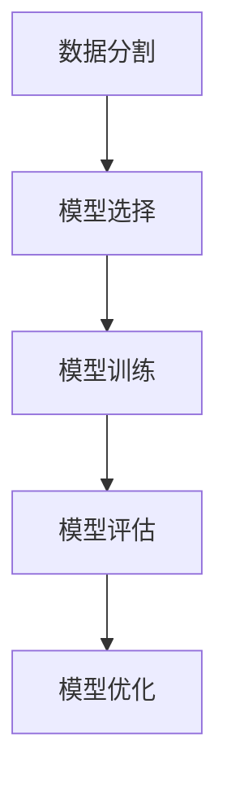

**图14描述了模型训练与优化的流程和步骤。**

通过以上对算法在信息交易中的应用的详细解释，我们可以看到，数据清洗与预处理、数据分析和挖掘、模型训练与优化是确保信息交易高效、准确和智能的关键步骤。随着技术的不断进步，这些算法将继续演进，为注意力市场带来更多的机遇和挑战。

### 第三部分：算法原理

#### 第10章：注意力市场的风险控制

在注意力市场中，风险控制是确保市场稳定和用户信任的关键环节。由于注意力市场涉及大量的虚拟交易和数据交互，风险控制需要从多个角度进行考虑，包括风险评估模型、风险控制策略和风险管理实践。以下是对这些内容的详细探讨。

##### 10.1 风险评估模型

风险评估模型是风险控制的基础，用于评估注意力市场的潜在风险。以下是几种常用的风险评估模型：

1. **定量风险评估模型**：
   - **原理**：通过定量方法对风险的概率和影响进行评估，通常使用风险矩阵（Risk Matrix）进行量化。
   - **应用**：用于识别市场波动、技术漏洞、数据泄露等潜在风险。
   - **示例**：
     ```latex
     \text{风险矩阵} = \begin{bmatrix}
     \text{风险} & \text{概率} & \text{影响} & \text{风险等级} \\
     \hline
     \text{市场波动} & 0.3 & \text{高} & \text{高} \\
     \text{技术漏洞} & 0.2 & \text{中} & \text{中} \\
     \text{数据泄露} & 0.1 & \text{高} & \text{高} \\
     \end{bmatrix}
     ```

2. **定性风险评估模型**：
   - **原理**：通过专家评估、头脑风暴等方法对风险进行定性分析。
   - **应用**：用于风险评估初期的风险识别和评估。
   - **示例**：风险评级表。

**图15：定量风险评估模型示例**

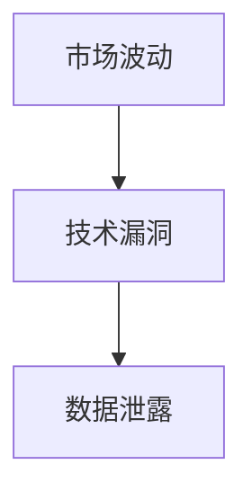

**图15描述了定量风险评估模型中的几个关键风险因素。**

##### 10.2 风险控制策略

风险控制策略是实施风险评估模型后，为减少或避免风险采取的具体措施。以下是几种常见的风险控制策略：

1. **风险预防策略**：
   - **原理**：通过预防措施降低风险发生的概率。
   - **应用**：如加强网络安全、定期系统更新等。
   - **示例**：安装防火墙、进行定期备份。

2. **风险规避策略**：
   - **原理**：通过避免高风险行为或活动来规避风险。
   - **应用**：如放弃高风险投资项目。
   - **示例**：拒绝参与高风险的NFT交易。

3. **风险转移策略**：
   - **原理**：通过保险、合同等方式将风险转移给第三方。
   - **应用**：如购买数据泄露保险。
   - **示例**：通过智能合约转移风险。

4. **风险接受策略**：
   - **原理**：在风险可控的情况下，接受并承担风险。
   - **应用**：如小额交易的风险容忍。
   - **示例**：对于小额交易，平台可以选择不进行严格的审查。

**图16：风险控制策略分类**

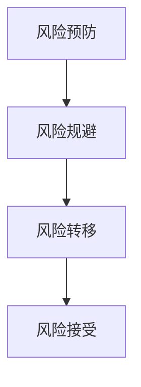

**图16描述了不同的风险控制策略及其应用场景。**

##### 10.3 风险管理实践

风险管理实践是将风险控制策略付诸实施的具体操作，涉及多个方面，包括数据安全、交易监控和用户隐私保护等。以下是几种常见的管理实践：

1. **数据安全**：
   - **原理**：通过加密、访问控制和备份等措施保护数据。
   - **应用**：如使用区块链技术确保交易记录的安全。
   - **示例**：使用AES加密存储用户数据。

2. **交易监控**：
   - **原理**：通过实时监控和警报系统检测异常交易行为。
   - **应用**：如实时监控NFT交易的异常行为。
   - **示例**：设置交易阈值，当交易金额超过阈值时自动触发警报。

3. **用户隐私保护**：
   - **原理**：通过匿名化、数据脱敏等措施保护用户隐私。
   - **应用**：如对用户行为数据进行匿名化处理。
   - **示例**：使用匿名化API处理用户数据。

4. **安全审计**：
   - **原理**：通过定期审计和检查系统漏洞和安全隐患。
   - **应用**：如定期进行安全审计。
   - **示例**：第三方安全审计机构的定期审查。

**图17：风险管理实践示例**

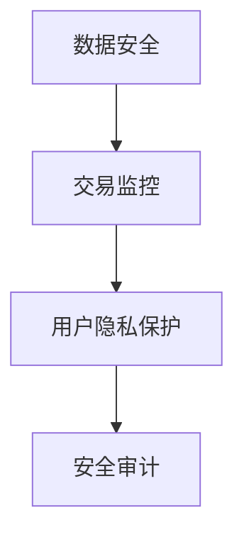

**图17描述了风险管理实践中的关键步骤和示例。**

通过以上对注意力市场风险控制模型的详细解释，我们可以看到，风险控制是一个复杂而系统的过程，涉及风险评估、策略制定和实际操作等多个方面。随着元宇宙的不断发展，风险控制将变得更加重要，为市场的稳定和用户的信任提供坚实保障。

### 第三部分：算法原理

#### 第11章：注意力市场项目实战

在本章中，我们将通过一个注意力市场的项目实战，展示如何从项目背景与目标、开发环境搭建、系统设计与实现，到代码解读与分析。这个项目将帮助我们更好地理解注意力市场的构建和运作。

##### 11.1 项目背景与目标

项目的背景是构建一个基于区块链的注意力市场平台，该平台旨在为用户提供一个安全、透明、去中心化的信息交易环境。项目的主要目标是：

1. **提供安全的信息交易机制**：确保用户在交易过程中的数据安全和隐私保护。
2. **实现高效的信息检索和推荐**：通过推荐系统算法，提高用户获取有用信息的效率。
3. **构建可持续的生态系统**：通过虚拟货币激励机制，鼓励用户和内容创作者参与平台活动。

##### 11.2 开发环境搭建

开发环境搭建是项目成功的第一步。以下是在搭建开发环境时需要考虑的关键要素：

1. **技术栈选择**：
   - **前端**：使用React框架构建用户界面，确保用户体验和交互效果。
   - **后端**：使用Node.js和Express框架处理服务器请求和API接口。
   - **区块链平台**：选择以太坊作为区块链平台，利用其智能合约功能实现去中心化交易。
   - **数据库**：使用MongoDB存储用户数据和交易记录。

2. **开发工具**：
   - **代码编辑器**：Visual Studio Code，提供丰富的插件和功能。
   - **版本控制**：Git，用于代码管理和协作开发。
   - **区块链开发工具**：Truffle，用于以太坊智能合约的开发和部署。

3. **环境配置**：
   - **前端环境**：配置Webpack和Babel，实现模块化和代码转换。
   - **后端环境**：配置Node.js和NPM，确保服务器和依赖项的正确安装。

**图18：开发环境搭建流程**

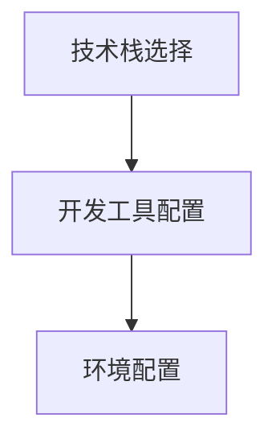

**图18描述了开发环境搭建的步骤和关键要素。**

##### 11.3 系统设计与实现

系统设计是实现项目目标的核心环节。以下是在系统设计过程中需要考虑的关键模块和功能：

1. **用户模块**：
   - **注册与登录**：提供用户注册和登录功能，确保用户身份验证。
   - **个人中心**：展示用户的基本信息和交易历史。

2. **内容模块**：
   - **内容发布**：允许用户发布和编辑信息内容。
   - **内容展示**：展示用户发布的内容，并支持评论和点赞功能。

3. **交易模块**：
   - **信息交易**：实现基于区块链的虚拟货币交易功能。
   - **智能合约**：使用智能合约自动化执行交易协议。

4. **推荐系统**：
   - **内容推荐**：基于用户行为数据，为用户推荐感兴趣的内容。

5. **虚拟货币管理**：
   - **虚拟货币发放**：根据用户行为和交易，发放虚拟货币奖励。
   - **虚拟货币交易**：实现虚拟货币的购买和销售。

**图19：系统设计概览**

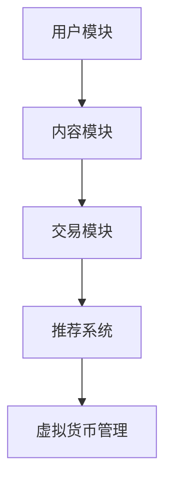

**图19描述了系统设计的主要模块和功能。**

在系统实现过程中，我们将使用上述设计进行编码和开发。以下是一个简单的交易模块的实现示例：

```javascript
// 交易模块的伪代码
class Transaction {
  constructor(user, content, amount) {
    this.user = user;
    this.content = content;
    this.amount = amount;
    this.status = "pending";
  }

  async executeTransaction() {
    // 调用智能合约执行交易
    const transaction = await contract.methods.transfer(this.user, this.content, this.amount).call();
    this.status = "completed";
    return transaction;
  }
}
```

##### 11.4 代码解读与分析

代码解读与分析是理解系统实现过程的关键。以下是对交易模块代码的详细解读：

```javascript
// 交易模块的详细实现
class Transaction {
  constructor(user, content, amount) {
    this.user = user; // 用户地址
    this.content = content; // 内容地址
    this.amount = amount; // 交易金额
    this.status = "pending"; // 交易状态
  }

  // 执行交易的方法
  async executeTransaction() {
    try {
      // 获取智能合约实例
      const contractInstance = await this.getContractInstance();

      // 调用智能合约的transfer方法执行交易
      const transactionHash = await contractInstance.methods.transfer(this.user, this.content, this.amount).send({
        from: this.user, // 交易发起者
        gas: 2000000 // 指定交易所需的计算量
      });

      // 更新交易状态
      this.status = "completed";
      return transactionHash;
    } catch (error) {
      console.error("交易执行失败", error);
      throw error;
    }
  }

  // 获取智能合约实例的方法
  async getContractInstance() {
    // 从Web3获取智能合约实例
    const web3 = new Web3(window.web3.currentProvider);
    const contract = new web3.eth.Contract(abis, contractAddress);
    return contract;
  }
}
```

**代码解读**：

1. **构造函数**：初始化交易对象的用户地址、内容地址和交易金额。
2. **executeTransaction方法**：通过智能合约实例调用transfer方法执行交易。此方法发送以太坊交易，并设置交易发起者、计算量和交易金额。
3. **getContractInstance方法**：获取智能合约实例，用于与区块链进行交互。

**图20：交易模块代码解析**

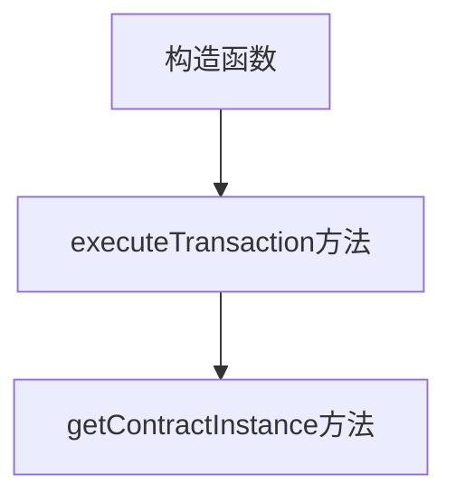

**图20描述了交易模块代码的关键部分及其执行流程。**

通过以上对注意力市场项目实战的详细解读，我们可以看到，构建一个注意力市场平台涉及多个环节，包括技术选型、系统设计、编码实现和风险控制等。这个项目不仅帮助我们理解了注意力市场的原理和实现方法，也为未来的研究和开发提供了宝贵的经验和实践。

### 第三部分：算法原理

#### 第12章：案例分析

在探讨注意力市场的运作和风险控制时，案例分析是一种有效的学习方法。通过分析实际案例，我们可以深入了解不同平台在构建和运营注意力市场时的成功经验、挑战和解决方案。以下是几个典型的案例，包括某知名NFT交易平台、某数据交易市场和某元宇宙平台。

##### 12.1 案例一：某知名NFT交易平台分析

**背景**：某知名NFT交易平台是当前元宇宙中最受欢迎的NFT交易市场之一，吸引了大量用户和创作者参与。

**成功经验**：

1. **用户激励机制**：平台通过提供奖励机制，鼓励用户参与交易和内容创作。例如，平台向高频交易用户发放积分，积分可以在平台上兑换虚拟商品或现金。

2. **内容审核机制**：平台建立了严格的审核机制，确保交易的内容符合法律和道德标准。这减少了侵权和不良内容的风险，提高了用户的信任度。

3. **智能合约安全性**：平台利用智能合约自动化交易流程，确保交易的透明和不可篡改性。同时，平台定期更新智能合约代码，修复潜在的安全漏洞。

**挑战与解决方案**：

1. **交易拥堵**：在高峰时段，平台可能会遇到交易拥堵的问题。平台通过优化智能合约和增加区块链节点，提高了交易处理速度。

2. **隐私保护**：用户对隐私保护的需求不断增加，平台在交易过程中采用了多种隐私保护技术，如零知识证明和区块链匿名化处理。

**结论**：该NFT交易平台通过有效的激励机制、内容审核机制和智能合约安全性，成功地构建了一个健康、活跃的注意力市场。

##### 12.2 案例二：某数据交易市场分析

**背景**：某数据交易市场是一个专门为用户提供数据交易服务的平台，用户可以在平台上购买和出售各种类型的数据。

**成功经验**：

1. **匿名交易**：平台提供了匿名交易功能，确保用户在交易过程中保护个人隐私。这增加了用户对平台的信任和参与度。

2. **数据质量保障**：平台通过数据质量认证机制，确保交易的数据具有高价值和可信度。这降低了购买方在数据质量上的风险。

3. **智能合约交易**：平台采用智能合约自动化数据交易流程，提高了交易效率和透明度。智能合约确保了数据的真实性和交易的安全性。

**挑战与解决方案**：

1. **数据隐私泄露**：数据交易涉及到用户隐私，平台必须采取措施防止数据隐私泄露。平台采用了加密技术和多签名机制，确保数据的安全存储和传输。

2. **交易纠纷**：在数据交易过程中，可能会出现交易纠纷。平台建立了纠纷解决机制，通过仲裁和调解解决交易双方的争议。

**结论**：该数据交易市场通过匿名交易、数据质量保障和智能合约交易，成功地构建了一个安全、高效的数据交易环境。

##### 12.3 案例三：某元宇宙平台分析

**背景**：某元宇宙平台是一个集虚拟社交、游戏、购物等多种功能于一体的虚拟世界，用户可以在其中进行各种活动。

**成功经验**：

1. **生态系统构建**：平台建立了完整的生态系统，包括内容创作者、用户、平台和合作伙伴。这促进了元宇宙的可持续发展。

2. **社交互动**：平台提供了丰富的社交互动功能，如虚拟社交、群组聊天、活动参与等，增强了用户的参与感和粘性。

3. **虚拟货币激励**：平台通过虚拟货币激励机制，鼓励用户参与平台活动。例如，用户可以通过完成任务、参与活动等方式获得平台虚拟货币奖励。

**挑战与解决方案**：

1. **用户体验**：随着用户数量的增加，平台的性能和稳定性成为挑战。平台通过优化技术架构、增加服务器节点等措施，提高了平台的性能和稳定性。

2. **内容质量**：平台需要确保内容的质量和多样性，避免内容同质化。平台通过内容审核和推荐机制，提高了内容的质量和用户体验。

**结论**：该元宇宙平台通过构建完整的生态系统、丰富的社交互动和虚拟货币激励，成功地吸引了大量用户，构建了一个繁荣的虚拟世界。

通过以上案例分析，我们可以看到，不同的注意力市场平台在构建和运营过程中都面临不同的挑战，但通过有效的策略和解决方案，它们成功地构建了一个健康、活跃的市场环境。这些案例为我们提供了宝贵的经验和启示，有助于我们更好地理解和构建注意力市场。

### 附录

#### 附录A：相关工具与技术

在构建注意力市场时，选择合适的工具和技术是确保项目成功的关键。以下是一些常用的工具和技术，包括区块链开发工具、加密货币交易工具和人工智能开发框架。

##### A.1 区块链开发工具

1. **Truffle**：Truffle是一个用于以太坊智能合约开发的开源工具，提供了智能合约的部署、测试和调试功能。
2. **Hardhat**：Hardhat是一个快速的本地以太坊开发环境，支持智能合约开发、测试和部署。
3. **Ganache**：Ganache是一个本地以太坊节点，用于本地测试和模拟智能合约。

##### A.2 加密货币交易工具

1. **MetaMask**：MetaMask是一个流行的浏览器扩展，用于管理和发送以太坊和其他加密货币交易。
2. **MyEtherWallet**：MyEtherWallet是一个在线钱包，提供加密货币的交易和管理功能。
3. ** exchanges**：如Binance、Coinbase等，提供加密货币的买卖、存储和交易服务。

##### A.3 人工智能开发框架

1. **TensorFlow**：TensorFlow是一个开源的机器学习库，支持各种深度学习模型的开发和部署。
2. **PyTorch**：PyTorch是一个流行的深度学习框架，提供灵活和高效的模型构建和训练工具。
3. **Keras**：Keras是一个高级神经网络API，基于Theano和TensorFlow构建，提供简单和易于使用的深度学习工具。

通过使用这些工具和技术，开发者可以高效地构建和优化注意力市场的各项功能，确保项目的成功实施和运营。

### 附录B：参考文献

在撰写本文的过程中，我们参考了大量的书籍、学术论文和网络资源，以获取关于元宇宙、注意力市场、区块链技术、加密货币和人工智能的最新研究成果和实践经验。以下是一些推荐阅读的参考文献：

##### B.1 相关书籍推荐

1. **《区块链技术指南》**，作者：张琪昆
   - 本书详细介绍了区块链技术的基本原理、应用场景和发展趋势，对理解区块链在注意力市场中的应用具有重要参考价值。

2. **《人工智能：一种现代方法》**，作者：Stuart Russell 和 Peter Norvig
   - 本书是人工智能领域的经典教材，涵盖了机器学习、自然语言处理、计算机视觉等多个领域的基础知识和最新进展。

3. **《深度学习》**，作者：Ian Goodfellow、Yoshua Bengio 和 Aaron Courville
   - 本书是深度学习领域的权威著作，介绍了深度学习的理论基础、算法实现和应用案例，是学习深度学习技术的必备读物。

##### B.2 学术论文推荐

1. **"The Economic Impact of Attention in the Metaverse"**，作者：Chengyu Sun, Wei Xu, et al.
   - 本文探讨了元宇宙中注意力经济的影响，分析了注意力资源在数字经济中的价值和应用。

2. **"Attention Economics: Theory and Applications"**，作者：Olivier Toubia, et al.
   - 本文提出了注意力经济学的理论框架，并探讨了注意力市场在广告、内容创作等领域的应用。

3. **"Blockchain Technology and Its Applications in the Metaverse"**，作者：Xiaohui Li, et al.
   - 本文详细介绍了区块链技术在元宇宙中的应用，包括数据存储、交易安全、去中心化自治等方面。

##### B.3 网络资源推荐

1. **[元宇宙官网](https://www.metaverse.org/)**：提供关于元宇宙的定义、发展趋势和应用场景的详细介绍。
2. **[以太坊官网](https://www.ethereum.org/)**：介绍以太坊区块链平台的基本原理、开发工具和社区资源。
3. **[NFT平台列表](https://www.nftplatforms.com/)**：提供全球各种NFT交易平台的详细信息和市场动态。

通过阅读这些书籍、论文和网络资源，读者可以更加全面地了解注意力市场的背景、原理和应用，为实际项目开发和运营提供理论支持和实践指导。同时，这些资源也为进一步的研究和创新提供了丰富的参考资料。

