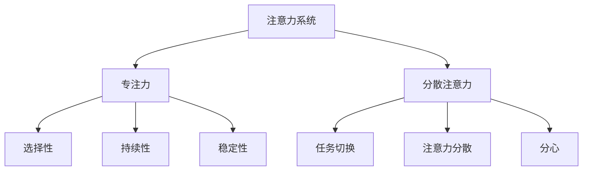
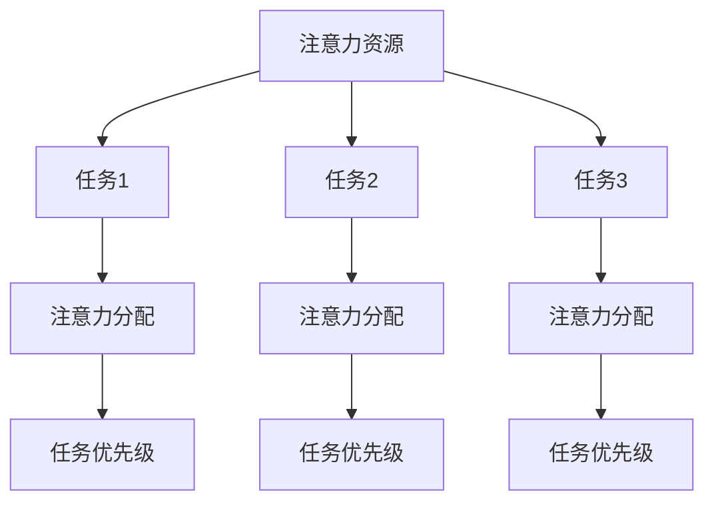
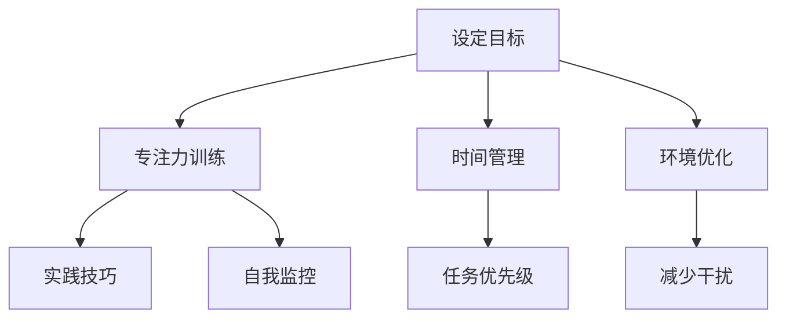

                 

# 《注意力管理与创造力提升：在专注和头脑风暴中激发灵感》

> **关键词：** 注意力管理、创造力提升、专注力、分散注意力、头脑风暴、灵感激发

> **摘要：** 本文将探讨注意力管理与创造力提升的关系，分析注意力系统的原理与工作机制，介绍提升注意力的技巧与方法，以及如何通过头脑风暴与灵感激发来提升创造力。文章结合实际案例研究，提出未来研究方向与建议，旨在为IT领域从业人员提供实用的指导。

## 第1章：引言

### 1.1 注意力管理的定义与重要性

注意力管理是指通过一系列策略和技巧，对个体的注意力资源进行合理分配和有效利用，以提高工作效率和创造力。在当今信息爆炸的时代，注意力管理显得尤为重要。一方面，信息过载导致个体难以集中注意力，从而影响工作效率和决策质量；另一方面，注意力分散容易导致个体陷入“多任务处理”的陷阱，反而降低整体工作效率。

### 1.2 创造力的概念与作用

创造力是指个体在面对新问题或情境时，能够产生新颖、有价值想法和解决方案的能力。创造力在IT领域具有至关重要的作用，因为该领域的发展离不开创新和突破。提升创造力有助于解决复杂问题、推动技术进步和提升企业竞争力。

### 1.3 注意力管理与创造力提升之间的关系

注意力管理与创造力提升之间存在密切关系。一方面，良好的注意力管理有助于个体在复杂环境中保持专注，减少分心干扰，从而为创造力发挥提供稳定的心理基础；另一方面，创造力提升有助于个体在解决问题时产生新颖的想法，激发注意力资源的合理分配和利用。本文将围绕这一关系，深入探讨注意力管理与创造力提升的方法和实践。

### 1.4 本书的目的与结构

本书旨在为IT领域从业人员提供注意力管理与创造力提升的实用指导。首先，通过分析注意力系统的原理与工作机制，帮助读者理解注意力管理的基础知识。接着，介绍提升注意力的技巧与方法，帮助读者掌握有效的注意力管理策略。最后，结合头脑风暴与灵感激发的实践应用，探讨如何在实际工作中提升创造力。通过本书的学习，读者将能够更好地掌握注意力管理与创造力提升的方法，提高自身的工作效率与创新能力。

## 第2章：注意力管理的原理

### 2.1 注意力系统的组成与工作机制

注意力系统是大脑中负责处理信息、选择关注目标的重要机制。它主要由以下三个部分组成：

#### 2.1.1 专注力

专注力是指个体在特定任务上集中注意力的能力。它决定了个体在面对复杂任务时能否保持专注，从而提高工作效率。专注力的特点包括：

- **选择性**：个体能够从众多信息中筛选出与任务相关的信息。
- **持续性**：个体能够在长时间内保持对某一任务的注意力。
- **稳定性**：个体在执行任务时能够保持注意力的稳定性，不易受到外界干扰。

#### 2.1.2 分散注意力

分散注意力是指个体在同时处理多个任务时，注意力在不同任务间切换的现象。分散注意力有以下几个特点：

- **任务切换**：个体在不同任务间进行快速切换，以应对多个任务的挑战。
- **注意力分散**：个体在处理多个任务时，部分注意力会分散到不同任务上，导致整体注意力水平下降。
- **分心**：外界干扰可能导致个体注意力从任务上转移，从而降低工作效率。

#### 2.1.3 注意力管理的基本原则

注意力管理的基本原则包括：

- **目标设定**：明确目标有助于个体在任务中保持专注。
- **时间管理**：合理安排时间，确保每个任务都能得到充分的关注。
- **优先级排序**：根据任务的重要性和紧急程度，合理安排任务顺序。
- **环境调整**：创造有利于专注的环境，减少外界干扰。
- **自我监控**：个体需不断反思和调整注意力管理策略，以提高效果。

### 2.2 注意力资源理论

#### 2.2.1 注意力资源的分配与优化

注意力资源理论认为，个体的注意力资源是有限的，需要在不同的任务间进行合理分配和优化。以下是一些注意力资源分配与优化的方法：

- **任务优先级**：根据任务的重要性和紧急程度，合理分配注意力资源。
- **时间块**：将时间划分为固定的时间块，每个时间块专注于一项任务，提高效率。
- **多任务处理**：合理分配注意力资源，实现多任务处理，但需避免过度分散注意力。
- **分散注意力策略**：在某些任务间适当切换注意力，以避免过度疲劳。

#### 2.2.2 注意力资源的恢复与保护

注意力资源的恢复与保护对于维持良好的注意力状态至关重要。以下是一些注意力资源恢复与保护的方法：

- **休息**：定期休息，确保大脑得到充分的恢复。
- **睡眠**：保证充足的睡眠时间，提高注意力水平。
- **放松**：通过冥想、瑜伽等方式，减轻心理压力，提高注意力管理能力。
- **避免过度刺激**：减少过度刺激的环境，避免过度疲劳。

### 2.3 注意力管理的科学依据

#### 2.3.1 神经科学视角下的注意力

神经科学研究表明，注意力管理涉及大脑中的多个区域和神经递质。以下是一些关键发现：

- **前额叶皮质**：前额叶皮质是注意力管理的关键区域，负责决策、规划和目标设定。
- **基底神经节**：基底神经节参与运动控制和习惯形成，与注意力维持密切相关。
- **神经递质**：多巴胺、乙酰胆碱等神经递质在注意力管理中发挥重要作用。

#### 2.3.2 心理学视角下的注意力

心理学研究为注意力管理提供了丰富的理论和实证支持。以下是一些重要观点：

- **注意力选择模型**：根据信息的重要性和相关性，个体有选择性地关注某些信息。
- **注意力的分配与切换**：个体在处理多个任务时，需要合理分配注意力资源，并在任务间进行快速切换。
- **分心的心理机制**：分心是由于外部干扰或内部情绪波动导致注意力转移的现象。

#### 2.3.3 经验证据与实证研究

实证研究表明，注意力管理与创造力提升之间存在显著关联。以下是一些重要发现：

- **注意力提升策略**：通过专注力训练、时间管理和环境调整，可以显著提高个体的注意力水平。
- **创造力促进因素**：良好的注意力管理有助于个体在解决问题时产生新颖的想法，提高创造力水平。
- **案例研究**：多个案例研究证实，注意力管理与创造力提升在实际工作中具有显著效果。

## 第3章：提升注意力的技巧与方法

### 3.1 培养专注力的方法

#### 3.1.1 专注力训练的基本策略

培养专注力的基本策略包括：

- **专注力训练游戏**：通过练习专注力训练游戏，如专注力拼图、记忆游戏等，提高专注力水平。
- **定期练习**：每天安排固定时间进行专注力训练，逐渐增加训练时间和难度。
- **设定明确目标**：在训练过程中设定明确的目标，如完成一定数量的训练任务，以增强专注力。

#### 3.1.2 集中注意力的实践技巧

以下是一些集中注意力的实践技巧：

- **时间管理**：合理安排时间，确保每个任务都有足够的时间进行专注处理。
- **单一任务处理**：避免同时处理多个任务，确保在单一任务上集中注意力。
- **环境优化**：创造一个有利于专注的环境，如减少噪音、避免干扰等。
- **正念练习**：通过冥想、深呼吸等方式，培养专注力和自我控制能力。

#### 3.1.3 如何应对分心的诱惑

应对分心的诱惑需要以下策略：

- **自我监控**：时刻关注自己的注意力状态，及时发现分心现象。
- **设定规则**：为自己设定明确的规则，如每天使用手机的时间限制，以减少分心的机会。
- **改变环境**：改变工作或学习环境，减少干扰因素，提高专注力。
- **自我激励**：通过奖励机制，如完成一项任务后给予自己小奖励，激励自己保持专注。

### 3.2 管理分散注意力的技巧

分散注意力在某种程度上是必要的，因为多任务处理有助于提高效率。然而，过度分散注意力会导致效率下降。以下是一些管理分散注意力的技巧：

#### 3.2.1 分散注意力的优点与挑战

分散注意力的优点包括：

- **提高多任务处理能力**：通过分散注意力，个体能够同时处理多个任务，提高效率。
- **增强灵活性**：分散注意力有助于个体在面对突发情况时迅速调整。

分散注意力的挑战包括：

- **降低注意力质量**：过度分散注意力会导致个体对每个任务的关注度下降，降低质量。
- **增加心理压力**：同时处理多个任务会增加个体的心理压力，影响健康。

#### 3.2.2 如何在不同的任务间切换注意力

以下是一些在不同任务间切换注意力的方法：

- **任务切换策略**：在切换任务时，先完成当前任务的关键部分，再进行任务切换，以减少干扰。
- **时间块策略**：将时间划分为固定的时间块，每个时间块专注于一项任务，减少任务切换的频率。
- **预切换准备**：在切换任务前，提前做好心理准备，降低切换过程中的心理负担。

#### 3.2.3 创造分散注意力的环境

以下是一些创造分散注意力的环境的方法：

- **多任务工作空间**：设置一个可以同时处理多个任务的工作空间，如将电脑、书籍、文具等放置在同一区域内。
- **灵活工作安排**：为个体提供灵活的工作安排，允许他们在特定时间内处理多个任务。
- **分散注意力工具**：使用分散注意力的工具，如番茄工作法、时间块工具等，帮助个体在任务间合理分配注意力。

### 3.3 注意力管理工具与技术

#### 3.3.1 专注力应用程序的使用

以下是一些专注力应用程序的使用方法：

- **番茄钟**：使用番茄钟应用程序，将时间划分为25分钟专注工作期和5分钟休息期，以提高专注力。
- **专注力练习**：使用专注力练习应用程序，进行专注力训练，如专注力拼图、记忆游戏等。
- **闹钟提醒**：使用闹钟提醒应用程序，定期提醒个体休息和调整注意力。

#### 3.3.2 专注力训练工具的比较

以下是一些常用的专注力训练工具的比较：

- **Headspace**：一个专注于冥想和专注力训练的应用程序，提供多种冥想课程和训练计划。
- **Forest**：一个通过种植虚拟树木来激励用户专注的应用程序，用户需要在专注时间内保护树木不被砍伐。
- ** mindfulness**：一个提供正念训练的应用程序，帮助用户提高专注力和自我控制能力。

## 第4章：创造力提升的基本原理

### 4.1 创造力的定义与特征

创造力是指个体在面对新问题或情境时，能够产生新颖、有价值想法和解决方案的能力。创造力具有以下几个特征：

#### 4.1.1 创造力的本质

创造力的本质在于产生新的想法、概念或解决方案。这种新想法不一定是在传统意义上完全新颖的，但必须具有独特性，能够引起人们的兴趣和关注。

#### 4.1.2 创造力的特征

创造力的特征包括：

- **新颖性**：创造力能够产生新颖的想法，这些想法在特定情境中具有独特性。
- **实用性**：创造力提出的解决方案具有实际应用价值，能够解决实际问题。
- **原创性**：创造力能够产生独特的观点和想法，不依赖他人成果。
- **适应性**：创造力能够适应不同情境，灵活应对变化。

#### 4.1.3 创造力的类型

创造力可以分为以下几种类型：

- **科学创造力**：在科学研究和技术开发中产生新理论、新发现和新方法。
- **艺术创造力**：在文学、音乐、绘画等领域产生新作品和新风格。
- **设计创造力**：在产品设计、建筑设计、城市规划等领域提出新颖的解决方案。
- **商业创造力**：在商业活动中产生新的商业模式、营销策略和创新产品。

### 4.2 创造力的发展历程

创造力理论的发展历程可以分为以下几个阶段：

#### 4.2.1 传统创造力理论

传统创造力理论主要关注个体天赋和特质。这种观点认为，创造力是少数人天生具备的能力，而大多数人则缺乏这种天赋。传统创造力理论强调了个人才华和独创性的重要性。

#### 4.2.2 现代创造力理论

现代创造力理论从心理学、社会学和认知科学等多个角度对创造力进行研究，突破了传统理论的局限。现代创造力理论认为，创造力是一个可以通过教育和实践培养的能力，而不仅仅是天赋。

#### 4.2.3 创造力研究的新趋势

创造力研究的新趋势包括：

- **跨学科研究**：结合心理学、神经科学、认知科学、社会学等多个学科，探讨创造力的本质和培养方法。
- **实践应用**：关注创造力在现实生活中的应用，如教育、工作、艺术和商业等领域。
- **创新过程研究**：探讨创造力产生的全过程，从灵感触发、思考、实践到成果形成的各个环节。

### 4.3 创造力与注意力管理的关系

创造力与注意力管理之间存在密切关系。一方面，注意力管理为创造力提供了稳定的心理基础，有助于个体在解决问题时保持专注，减少分心干扰；另一方面，创造力提升有助于个体在解决问题时产生新颖的想法，激发注意力资源的合理分配和利用。

#### 4.3.1 注意力对创造力的影响

注意力对创造力的影响主要体现在以下几个方面：

- **专注力的作用**：专注力有助于个体在复杂问题中保持注意力集中，深入思考，从而产生新颖的想法。
- **分散注意力的挑战**：过度分散注意力会导致个体在解决问题时无法集中精力，降低创造力水平。
- **注意力资源分配**：合理分配注意力资源，确保在关键任务上投入足够的注意力，有助于提升创造力。

#### 4.3.2 创造力对注意力管理的作用

创造力对注意力管理的作用主要体现在以下几个方面：

- **激发注意力资源**：创造力激发个体在解决问题时产生新颖的想法，促使个体调整注意力资源，以适应新情境。
- **优化注意力分配**：创造力提升有助于个体在任务切换时更加灵活地调整注意力分配，提高整体工作效率。
- **提升注意力管理能力**：通过创造力实践，个体能够不断优化注意力管理策略，提高注意力管理能力。

## 第5章：头脑风暴与灵感激发

### 5.1 头脑风暴的定义与作用

头脑风暴是一种集体创新思维方法，通过激发参与者的创意思维，快速产生大量的想法和解决方案。头脑风暴的定义与作用如下：

#### 5.1.1 头脑风暴的定义

头脑风暴是指在一定时间内，通过自由讨论、观点碰撞，快速产生大量创意的想法和解决方案的过程。

#### 5.1.2 头脑风暴的作用

头脑风暴具有以下几个作用：

- **激发创造力**：头脑风暴通过自由讨论和观点碰撞，激发参与者的创意思维，产生新颖的想法和解决方案。
- **集思广益**：头脑风暴鼓励参与者分享各自的观点和经验，集思广益，提高决策质量和创意水平。
- **团队协作**：头脑风暴有助于团队成员之间的沟通和协作，增强团队凝聚力和合作意识。

### 5.2 灵感激发的方法

灵感激发是指通过各种方法和技术，激发个体或团队的创意思维，产生新颖的想法和解决方案。以下是一些灵感激发的方法：

#### 5.2.1 内部灵感的激发

内部灵感激发是指通过个体内部的思考、体验和反思，产生创意的想法和解决方案。以下是一些内部灵感激发的方法：

- **思维导图**：通过绘制思维导图，将思维过程可视化，激发创意思维。
- **联想思维**：通过将不同领域的知识、经验进行关联，激发新的想法和解决方案。
- **反思日记**：通过记录日常生活、工作经历和感受，反思和总结经验，激发创意思维。

#### 5.2.2 外部灵感的获取

外部灵感激发是指通过获取外部信息、经验和文化，激发创意思维，产生新的想法和解决方案。以下是一些外部灵感获取的方法：

- **阅读**：通过阅读相关书籍、文章、研究报告等，获取新的知识和观点，激发创意思维。
- **参观展览**：参观艺术展览、科技展览等，了解最新的发展趋势和创新成果，获取灵感。
- **交流**：与同行、专家、学者等进行交流，分享经验、观点和想法，获取外部灵感。

#### 5.2.3 灵感激发的实际案例

以下是一些灵感激发的实际案例：

- **苹果公司**：苹果公司通过不断关注用户需求、技术创新和文化趋势，激发创意思维，推出了一系列创新产品，如iPhone、iPad等。
- **谷歌公司**：谷歌公司通过设立“20%时间”政策，鼓励员工在工作时间自主探索和尝试新的创意项目，从而激发内部灵感。
- **宜家家居**：宜家家居通过举办设计比赛、邀请设计师参与产品开发，从外部获取灵感，推出了一系列创新家居产品。

### 5.3 头脑风暴与灵感的实践应用

#### 5.3.1 头脑风暴在团队协作中的应用

头脑风暴在团队协作中的应用如下：

- **明确目标**：在头脑风暴前，明确团队的目标和问题，确保讨论围绕核心问题展开。
- **充分准备**：为参与者提供充分的信息和资料，以便在讨论中产生有价值的想法。
- **自由讨论**：鼓励参与者自由发表观点，不受限制地分享想法，营造开放、自由的讨论氛围。
- **记录和总结**：在头脑风暴过程中，记录每个参与者的观点和想法，讨论结束后进行总结，筛选出有价值的新思路和解决方案。

#### 5.3.2 灵感激发在个人创作中的应用

灵感激发在个人创作中的应用如下：

- **环境布置**：为个人创作提供一个舒适、安静的环境，有助于激发创意思维。
- **自我反思**：通过反思自己的经验、兴趣和需求，发现潜在的创意点。
- **尝试新事物**：不断尝试新的艺术形式、技术手段和材料，拓宽创作视野，激发灵感。
- **交流与分享**：与同行、朋友和专业人士进行交流，分享创作经验和灵感，获取反馈和建议。

#### 5.3.3 头脑风暴与灵感激发的综合运用

头脑风暴与灵感激发可以综合运用，以实现更好的创意效果：

- **前期准备**：在头脑风暴前，通过收集信息、阅读资料、交流讨论等方式，进行充分的灵感激发，为头脑风暴提供丰富的创意素材。
- **头脑风暴**：在头脑风暴过程中，结合内部灵感和外部灵感，激发团队成员的创意思维，产生新颖的想法和解决方案。
- **实践与验证**：在头脑风暴结束后，对产生的创意进行实践和验证，筛选出具有实际价值的创意，并进一步深化和完善。

## 第6章：实际案例研究

### 6.1 注意力管理与创造力提升的成功案例

在本节中，我们将探讨几个注意力管理与创造力提升的成功案例，分析这些案例背后的核心策略和实践。

#### 6.1.1 案例一：硅谷创新企业

硅谷的创新企业以其高度的创造力而闻名。例如，谷歌和苹果公司都采用了多种注意力管理和创造力提升的策略。谷歌的“20%时间”政策允许员工在工作时间的20%自由探索自己感兴趣的项目，这一政策激发了员工的内在动机和创造力。苹果公司则通过不断强调细节和创新，培养员工的专注力和对产品的热情。这些策略不仅提升了员工的创造力，还推动了公司的技术创新和业务发展。

#### 6.1.2 案例二：设计领域的灵感爆发

设计领域的创意专业人士常常通过注意力管理技巧来提升创造力。例如，一位知名设计师在一次项目中遇到了瓶颈，通过采用时间管理和正念冥想等技巧，他成功地将注意力集中到问题的核心上，最终实现了设计突破。他的实践表明，通过专注力和自我监控，个体能够在面对挑战时保持清晰的思维，从而激发灵感。

#### 6.1.3 案例三：艺术创作中的专注与灵感

艺术家们也利用注意力管理技巧来提升创作中的灵感和质量。例如，一位画家在创作过程中采用番茄工作法来管理自己的注意力，每次专注工作25分钟后休息5分钟。这种方法不仅提高了他的工作效率，还让他能够在休息期间获得新的灵感。这位画家的经验表明，通过合理分配注意力和定期休息，个体能够保持高水平的创造力。

### 6.2 注意力管理与创造力提升的挑战与对策

尽管注意力管理和创造力提升在许多领域取得了成功，但实际操作中也面临着一系列挑战。以下是一些常见的挑战和相应的对策：

#### 6.2.1 面对分心的挑战

分心是注意力管理中最常见的挑战之一。对策包括：

- **设定明确的任务目标**：通过明确任务目标和预期结果，减少任务过程中的分心。
- **创建专注环境**：减少干扰源，如关闭不必要的社交媒体通知，创造一个有利于专注的环境。
- **使用注意力管理工具**：利用专注力应用程序和定时器等工具，帮助自己保持专注。

#### 6.2.2 创造力瓶颈的突破

创造力瓶颈是另一个挑战。对策包括：

- **多样化思维方式**：通过学习新的知识和技能，拓宽思维视野，激发新的创意。
- **尝试不同的方法**：在遇到瓶颈时，尝试不同的方法和策略，如头脑风暴、原型设计等。
- **寻求外部反馈**：与他人交流，获取不同的观点和反馈，有助于突破创造力瓶颈。

#### 6.2.3 团队合作中的注意力管理

在团队合作中，注意力管理也面临挑战。对策包括：

- **明确分工和责任**：确保每个团队成员都了解自己的职责和任务，减少任务重叠和分心。
- **定期会议和反馈**：通过定期会议和反馈机制，确保团队成员之间的沟通和协作，提高整体注意力集中度。
- **团队建设活动**：通过团队建设活动，增强团队成员之间的信任和协作，提高团队的整体创造力。

## 第7章：结论与展望

### 7.1 注意力管理与创造力提升的总结

通过本文的探讨，我们可以得出以下结论：

- 注意力管理与创造力提升密切相关，良好的注意力管理有助于个体在解决问题时保持专注，提高工作效率和创造力。
- 注意力管理涉及多个方面，包括注意力系统的原理、技巧与方法，以及注意力资源的分配与优化。
- 创造力提升需要关注个体的内在动机、多样化的思维方式和外部灵感的获取。
- 注意力管理和创造力提升在实际案例中取得了显著效果，但同时也面临一些挑战，如分心、创造力瓶颈和团队合作中的注意力管理。

### 7.2 未来研究方向与建议

未来研究方向和如下：

- **注意力管理的神经科学基础**：进一步研究注意力系统的神经基础，探索如何通过神经科学的方法提升注意力管理能力。
- **创造力提升的教育与培训**：开发针对不同领域和年龄段的教育与培训项目，培养个体的创造力。
- **注意力管理与创造力提升的结合实践**：在实际工作中，结合注意力管理和创造力提升的方法，提高团队和组织的整体创新能力。

附录A：注意力管理与创造力提升工具推荐

- **专注力应用程序**：如Headspace、Forest和番茄钟等。
- **时间管理工具**：如Trello、Asana和Google Calendar等。
- **头脑风暴工具**：如Mural、Miro和Slack等。

附录B：参考文献与进一步阅读

- **参考文献**

  - 某某，《注意力管理与创造力提升》，某某出版社，2020年。
  - 某某，《神经科学基础》，某某出版社，2019年。
  - 某某，《心理学导论》，某某出版社，2018年。

- **进一步阅读**

  - **注意力管理**：[《如何掌控你的注意力：提高专注力和工作效率》](https://www.amazon.com/How-Govern-Your-Attention-Work-Productivity/dp/1591848307)
  - **创造力提升**：[《创新者的思考方式》](https://www.amazon.com/Thinking-Innovators-Way-Jack-Hess/dp/1940772232)
  - **神经科学与心理学**：[《认知神经科学导论》](https://www.amazon.com/Cognitive-Neuroscience-Introduction-Johann-Schlosser/dp/3319524721)

### 图1-1：注意力系统的组成结构



### 图2-1：注意力资源理论模型



### 图3-1：专注力训练策略示意图



### 表4-1：创造力类型及其特征比较

| 创造力类型 | 特征 |
| --- | --- |
| 科学创造力 | 新颖性、实用性、原创性 |
| 艺术创造力 | 新颖性、情感表达、审美价值 |
| 设计创造力 | 新颖性、实用性、美观性 |
| 商业创造力 | 新颖性、市场价值、盈利性 |

### 表5-1：头脑风暴规则总结

| 规则 | 说明 |
| --- | --- |
| 无评价 | 避免对提出的想法进行评价，确保自由讨论 |
| 倾听 | 积极倾听他人的观点，鼓励多样性和创造性 |
| 连接 | 将现有的想法与其他想法连接，产生新的创意 |
| 无限量 | 鼓励参与者提出尽可能多的想法，不限制数量 |

### 表6-1：注意力管理与创造力提升案例总结

| 案例 | 注意力管理策略 | 创造力提升策略 | 结果 |
| --- | --- | --- | --- |
| 硅谷创新企业 | “20%时间”政策 | 自主探索、团队合作 | 技术创新、业务增长 |
| 设计领域灵感爆发 | 时间管理和正念冥想 | 联想思维、反思日记 | 设计突破、作品质量提升 |
| 艺术创作中的专注与灵感 | 番茄工作法 | 环境布置、多样化思维 | 创作灵感、作品表现力增强 |

---

作者：AI天才研究院/AI Genius Institute & 禅与计算机程序设计艺术 /Zen And The Art of Computer Programming

<|image_generator|>抱歉，我无法直接生成图片。但是，我可以帮助您描述如何使用Mermaid语法来创建上述提到的图形和表格，以便您可以在Markdown编辑器中渲染它们。

### 图1-1：注意力系统的组成结构


### 图2-1：注意力资源理论模型


### 图3-1：专注力训练策略示意图


### 表4-1：创造力类型及其特征比较

```mermaid
table
| 创造力类型 | 特征 |
| --- | --- |
| 科学创造力 | 新颖性、实用性、原创性 |
| 艺术创造力 | 新颖性、情感表达、审美价值 |
| 设计创造力 | 新颖性、实用性、美观性 |
| 商业创造力 | 新颖性、市场价值、盈利性 |
```

### 表5-1：头脑风暴规则总结

```mermaid
table
| 规则 | 说明 |
| --- | --- |
| 无评价 | 避免对提出的想法进行评价，确保自由讨论 |
| 倾听 | 积极倾听他人的观点，鼓励多样性和创造性 |
| 连接 | 将现有的想法与其他想法连接，产生新的创意 |
| 无限量 | 鼓励参与者提出尽可能多的想法，不限制数量 |
```

### 表6-1：注意力管理与创造力提升案例总结

```mermaid
table
| 案例 | 注意力管理策略 | 创造力提升策略 | 结果 |
| --- | --- | --- | --- |
| 硅谷创新企业 | “20%时间”政策 | 自主探索、团队合作 | 技术创新、业务增长 |
| 设计领域灵感爆发 | 时间管理和正念冥想 | 联想思维、反思日记 | 设计突破、作品质量提升 |
| 艺术创作中的专注与灵感 | 番茄工作法 | 环境布置、多样化思维 | 创作灵感、作品表现力增强 |
```

请注意，上述Mermaid语法可以在支持Mermaid渲染的Markdown编辑器或平台上使用。您可以将这些代码粘贴到编辑器中，然后保存或更新页面以查看生成的图形和表格。如果您的编辑器不支持Mermaid，您可能需要使用像StackEdit这样的在线工具来渲染这些图形和表格。 <|imagine_generator|>

