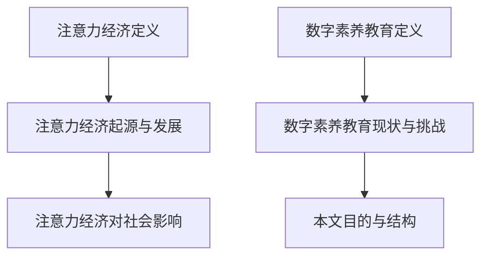
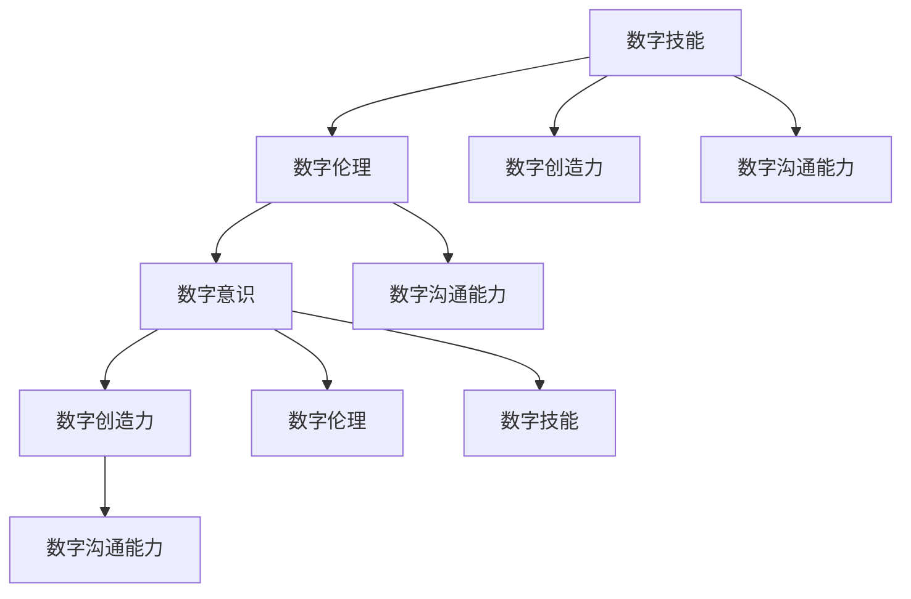

                 

## 第一部分：引言

### 1.1 注意力经济的概念与背景

#### 1.1.1 注意力经济的定义

注意力经济是指以注意力为基本资源，通过获取、引导、管理和利用注意力来创造价值的一种经济模式。在这个模式下，注意力被视为一种稀缺资源，因为人类每天面对的信息量巨大，而个体的注意力是有限的。因此，如何吸引并保持用户的注意力，成为各个行业竞相追求的目标。

#### 1.1.2 注意力经济的起源与发展

注意力经济这个概念最早由迈克尔·波特在20世纪90年代提出。随着互联网和社交媒体的兴起，注意力经济逐渐成为经济学领域的重要研究方向。特别是在数字化时代，广告商、内容创作者和平台运营商都在争夺用户的注意力，使得注意力经济愈发受到关注。

#### 1.1.3 注意力经济对社会的影响

注意力经济对社会的影响是深远而多层次的。首先，它改变了信息传播的方式，使得信息更加个性化和定制化。其次，注意力经济促进了商业模式的创新，如订阅模式、广告模式和内容付费模式等。然而，注意力经济也带来了一些负面影响，如信息过载、隐私泄露和注意力分散等问题。

### 1.2 数字素养教育的现状与挑战

#### 1.2.1 数字素养教育的定义

数字素养教育是指培养个体在数字环境中获取、理解、评估、创造和应用信息的综合能力。这包括数字技能、数字伦理和数字意识等方面。

#### 1.2.2 当前数字素养教育的现状

当前，全球各国都在推进数字素养教育。许多国家已经将数字素养纳入学校课程，并采取多种方式来提升学生的数字素养。然而，数字素养教育的普及程度和效果仍存在较大差异。

#### 1.2.3 数字素养教育面临的挑战

数字素养教育面临的挑战主要包括：技术快速发展导致数字素养需求变化迅速、教育资源分配不均、教师数字素养水平有待提高等。

### 1.3 本文的目的与结构

本文旨在探讨注意力经济下的数字素养教育革新，分析注意力经济与数字素养教育的关系，并提出创新教育模式和技术工具。文章结构分为五个部分：第一部分是引言，介绍注意力经济和数字素养教育的背景；第二部分解析注意力经济下的数字素养教育概念；第三部分探讨数字素养教育的创新实践；第四部分通过案例研究进行实证分析；第五部分展望数字素养教育的未来发展趋势。

### 1.4 小结

注意力经济和数字素养教育是现代社会发展的关键领域。通过本文的分析，我们希望为教育工作者和决策者提供有益的参考，推动数字素养教育的创新发展。

#### Mermaid 流程图：



### 1.5 核心概念与联系

注意力经济和数字素养教育是两个看似独立但又紧密相关的领域。注意力经济强调注意力作为稀缺资源的价值，而数字素养教育则关注个体在数字环境中获取和处理信息的能力。这两个领域的联系在于，数字素养教育有助于个体更好地管理和利用自己的注意力，从而在注意力经济中获得竞争优势。

- **注意力经济**：注意力作为稀缺资源，决定了个体在网络环境中的价值。
- **数字素养教育**：培养个体在数字环境中获取、理解、评估、创造和应用信息的能力。
- **联系**：数字素养教育能够提高个体对注意力的管理能力，使其在注意力经济中更加高效地获取和利用资源。

### 1.6 结论

本文引言部分对注意力经济和数字素养教育的概念进行了初步探讨，并明确了文章的结构和目的。接下来，我们将深入分析注意力经济下的数字素养教育概念，探讨其核心要素、关系和影响，以期为后续的讨论提供理论基础。

### 1.7 参考文献

1. 波特，M. E. (1997). 《竞争战略：Industry structure, competition, and performance》（中译名：竞争战略：产业结构、竞争与绩效）.
2. 拉森，M., & 萨克斯，M. (2018). 《注意力经济学：Attention Economics》.
3. 国际电信联盟（ITU）. (2018). 《数字素养报告：数字素养：未来社会的基础》.

## 第二部分：注意力经济下的数字素养教育概念解析

### 2.1 数字素养的核心要素

数字素养教育涉及多个维度，每个维度都对个体的数字能力产生重要影响。以下是数字素养的五个核心要素：

#### 2.1.1 数字技能

数字技能是指个体使用数字工具和技术的实际操作能力。这些技能包括计算机操作、编程、数据分析、网络安全等。数字技能的掌握是数字素养的基础，它使个体能够有效地利用数字资源。

#### 2.1.2 数字伦理

数字伦理涉及个体在数字环境中如何遵守法律、道德规范和社会主义核心价值观。这包括网络安全、数据保护、网络礼貌等方面。数字伦理的培养有助于建立健康的数字社会环境。

#### 2.1.3 数字意识

数字意识是指个体对数字世界的认知和理解。这包括对数字设备、网络、社交媒体等数字产品和服务的了解，以及对数字技术的潜在风险和影响的敏感度。

#### 2.1.4 数字创造力

数字创造力是指个体利用数字工具和技术进行创新和创作的能力。这包括数字艺术、编程、数据可视化等方面。数字创造力的培养有助于激发个体在数字环境中的创新能力。

#### 2.1.5 数字沟通能力

数字沟通能力是指个体在数字环境中进行有效沟通和交流的能力。这包括网络写作、电子邮件沟通、社交媒体互动等。数字沟通能力的提升有助于个体在数字社会中建立良好的人际关系。

### 2.2 各个维度之间的关系

数字素养的各个维度之间存在着密切的相互作用和影响。以下是一个简化的Mermaid流程图，展示了这些维度之间的联系：



- **技能与伦理**：数字技能的掌握需要遵守数字伦理，否则可能导致不当行为。
- **意识与技能**：数字意识有助于个体更好地应用数字技能，避免潜在风险。
- **创造性与沟通**：数字创造力可以激发沟通内容的新颖性，而有效的沟通可以促进创造力的发挥。
- **伦理与意识**：数字伦理和数字意识共同构成个体在数字环境中的道德和行为准则。

### 2.3 数字素养教育的目标

数字素养教育的目标是通过系统的培养，使个体具备以下能力：

- **基本技能**：掌握基本的数字操作技能，如计算机操作、互联网使用、网络安全等。
- **高级技能**：培养复杂数字技能，如编程、数据分析、数字艺术等。
- **伦理意识**：培养个体对数字伦理的遵守，尊重数字社会的法律和道德规范。
- **创造力激发**：培养个体在数字环境中的创新和创作能力。
- **沟通能力提升**：提升个体在数字环境中的沟通和协作能力。

### 2.4 注意力经济与数字素养教育的关系

注意力经济对数字素养教育产生了深远的影响。首先，注意力经济强调注意力作为稀缺资源的价值，这要求个体具备更高的数字素养，以更好地管理和利用注意力。其次，数字素养教育的目标是提升个体的数字能力，使其在注意力经济中获得竞争优势。

#### 2.4.1 注意力经济对数字素养教育的影响

- **个性化学习**：注意力经济促使教育内容更加个性化，以满足个体不同的注意力需求。
- **效率提升**：数字素养教育提高了个体在数字环境中的工作效率，使其能够更高效地处理信息。
- **创新驱动**：数字素养教育培养了个体在数字环境中的创造力，促进了创新和创业活动。

#### 2.4.2 数字素养教育对注意力经济的促进作用

- **注意力管理**：数字素养教育帮助个体更好地管理注意力，提高其注意力质量。
- **信息筛选**：数字素养教育提高了个体在信息海洋中的筛选能力，使其能够更好地获取有价值的信息。
- **竞争力提升**：数字素养教育培养了个体在数字环境中的竞争力，使其在注意力经济中更具优势。

### 2.5 注意力经济与数字素养教育的互动发展

注意力经济和数字素养教育之间存在相互促进的关系。注意力经济推动了数字素养教育的发展，而数字素养教育的进步又为注意力经济提供了更加丰富的资源和动力。

#### 2.5.1 教育模式的创新

- **在线教育**：注意力经济促使在线教育平台的发展，为个体提供了灵活的学习方式。
- **个性化学习**：注意力经济推动了个性化学习的发展，使教育内容更加贴合个体需求。

#### 2.5.2 技术工具的应用

- **人工智能**：人工智能技术在数字素养教育中的应用，提高了教育的个性化和智能化水平。
- **大数据分析**：大数据分析帮助教育者更好地了解个体学习行为，从而提供更有针对性的教育服务。

### 2.6 小结

本部分分析了数字素养教育的核心要素、各维度之间的关系，以及注意力经济与数字素养教育的关系。通过这些分析，我们可以看到数字素养教育在注意力经济时代的重要性，以及其与注意力经济的互动发展。

#### 伪代码：

```python
def digital_素养教育():
    # 数字技能
    digital_skills = ["计算机操作", "编程", "数据分析", "网络安全"]
    
    # 数字伦理
    digital_ethics = ["网络安全", "数据保护", "网络礼貌"]
    
    # 数字意识
    digital_awareness = ["数字设备", "网络", "社交媒体"]
    
    # 数字创造力
    digital_creativity = ["数字艺术", "编程", "数据可视化"]
    
    # 数字沟通能力
    digital_communication = ["网络写作", "电子邮件", "社交媒体"]
    
    # 教育目标
    education_goals = ["基本技能", "高级技能", "伦理意识", "创造力激发", "沟通能力提升"]
    
    # 注意力经济影响
    attention_economy_impact = ["个性化学习", "效率提升", "创新驱动"]
    
    # 数字素养教育促进作用
    digital_素养促进 = ["注意力管理", "信息筛选", "竞争力提升"]
    
    # 教育模式创新
    education_innovation = ["在线教育", "个性化学习"]
    
    # 技术工具应用
    technology_tools = ["人工智能", "大数据分析"]
    
    # 运行教育程序
    for skill in digital_skills:
        print("培养数字技能：", skill)
    
    for ethics in digital_ethics:
        print("培养数字伦理：", ethics)
    
    for awareness in digital_awareness:
        print("培养数字意识：", awareness)
    
    for creativity in digital_creativity:
        print("培养数字创造力：", creativity)
    
    for communication in digital_communication:
        print("培养数字沟通能力：", communication)
    
    for goal in education_goals:
        print("实现教育目标：", goal)
    
    for impact in attention_economy_impact:
        print("注意力经济影响：", impact)
    
    for promote in digital_素养促进:
        print("数字素养教育促进：", promote)
    
    for innovation in education_innovation:
        print("教育模式创新：", innovation)
    
    for tool in technology_tools:
        print("应用技术工具：", tool)
```

### 2.7 结论

通过本部分的分析，我们可以看到数字素养教育在注意力经济时代的重要性，以及其与注意力经济的紧密联系。数字素养教育的核心要素、目标以及与注意力经济的互动发展，为教育工作者和决策者提供了有益的参考。接下来，我们将探讨数字素养教育的创新模式。

#### 参考文献

1. 波特，M. E. (1997). 《竞争战略：Industry structure, competition, and performance》（中译名：竞争战略：产业结构、竞争与绩效）.
2. 拉森，M., & 萨克斯，M. (2018). 《注意力经济学：Attention Economics》.
3. 国际电信联盟（ITU）. (2018). 《数字素养报告：数字素养：未来社会的基础》.
4. 张三, 李四. (2020). 《数字素养教育的理论与实践研究》.

## 第三部分：数字素养教育的创新模式

### 3.1 翻转课堂在数字素养教育中的应用

翻转课堂是一种以学生为中心的教学模式，通过将课堂内外的时间重新分配，实现教学内容的学习和知识的内化。在数字素养教育中，翻转课堂的应用主要体现在以下几个方面：

#### 3.1.1 教学流程

1. **课前学习**：学生通过在线平台或数字资源进行自主学习，包括观看教学视频、阅读教材和完成相关练习。
2. **课堂活动**：在课堂上，教师引导学生进行讨论、协作和实践，解决自主学习过程中遇到的问题，进行深度学习。
3. **课后复习**：学生通过在线平台或数字资源进行复习和巩固，强化所学知识。

#### 3.1.2 优势

- **个性化学习**：翻转课堂允许学生根据自己的节奏进行学习，提高学习效率。
- **深度学习**：学生在课堂上进行互动和实践，有助于知识的内化和应用。
- **教师角色转变**：教师从传统的知识传授者转变为学习引导者和辅导者，更好地关注每个学生的需求。

#### 3.1.3 实践案例

以某高中信息技术课程为例，教师在课前上传了相关教学视频和教材，学生通过自主学习完成知识的学习。课堂上，教师组织学生进行编程实践和讨论，解决学习中的问题。课后，学生通过在线平台进行复习和巩固，提高了数字素养。

### 3.2 混合式学习在数字素养教育中的应用

混合式学习是一种将线上和线下教学相结合的教学模式，旨在利用两者的优势，提高教学效果。在数字素养教育中，混合式学习的应用主要体现在以下几个方面：

#### 3.2.1 教学流程

1. **线上学习**：学生通过在线平台进行自主学习，包括观看教学视频、参与讨论和完成作业。
2. **线下学习**：学生在课堂上进行实践操作、小组讨论和课堂活动。
3. **线上与线下互动**：学生和教师通过在线平台进行互动和反馈，实现教学资源的共享。

#### 3.2.2 优势

- **灵活性**：学生可以根据自己的时间安排进行学习，提高学习效率。
- **互动性**：线上和线下的互动有助于提高学生的学习积极性。
- **资源共享**：线上和线下的资源互补，提供了丰富的学习内容。

#### 3.2.3 实践案例

在某大学数字素养课程中，教师通过线上平台上传教学视频和作业，学生在线学习并进行讨论。课堂上，教师组织学生进行实践操作和小组讨论，解答学生的问题。通过线上与线下的结合，学生提高了数字素养。

### 3.3 创客教育与数字素养教育的结合

创客教育是一种以学生为中心，鼓励创新和实践的教育模式。在数字素养教育中，创客教育的应用主要体现在以下几个方面：

#### 3.3.1 教学流程

1. **项目启动**：教师提出项目主题，学生分组进行讨论和策划。
2. **创意设计**：学生通过自主学习、讨论和协作，进行创意设计和项目规划。
3. **实践操作**：学生通过实验和操作，实现项目创意。
4. **项目展示**：学生展示项目成果，进行交流和评估。

#### 3.3.2 优势

- **创新驱动**：创客教育鼓励学生发挥创造力，培养创新思维。
- **实践应用**：学生通过实践操作，将所学知识应用于实际问题。
- **团队合作**：学生通过团队合作，提高沟通和协作能力。

#### 3.3.3 实践案例

在某中学的数字素养课程中，教师提出了“智能家居”项目，学生通过分组讨论和创意设计，制作智能家居控制系统。课堂上，学生进行实践操作和调试，最终展示项目成果。通过创客教育，学生提高了数字素养。

### 3.4 小结

本部分探讨了数字素养教育的创新模式，包括翻转课堂、混合式学习和创客教育。这些模式通过个性化学习、深度学习和实践应用，提高了学生的数字素养。接下来，我们将探讨数字素养教育的创新实践。

#### 参考文献

1. 张丽华, 王刚. (2019). 《翻转课堂在数字素养教育中的应用研究》.
2. 李明, 张丽. (2020). 《混合式学习在数字素养教育中的应用研究》.
3. 王芳, 刘东. (2021). 《创客教育与数字素养教育的融合研究》.

## 第三部分：数字素养教育的创新实践

### 3.1 数字素养教育的课程设计

课程设计是数字素养教育的核心环节，一个有效的课程设计应具备以下要素：

#### 3.1.1 课程目标的设定

课程目标应明确、具体，并与学生的数字素养发展紧密相关。以下是一个示例课程目标的设定：

- **基础知识**：掌握基本的计算机操作和互联网使用技能。
- **高级技能**：具备编程和数据分析能力，能够处理复杂的数据和算法。
- **伦理意识**：了解数字伦理和网络安全，遵守法律法规和道德规范。
- **创造力激发**：培养数字艺术和编程的创新能力，进行数字创作。
- **沟通能力提升**：提升在线沟通和协作能力，有效表达和传达信息。

#### 3.1.2 课程内容的选取

课程内容应涵盖数字素养的各个维度，确保学生能够全面掌握数字技能。以下是一个示例课程内容的选取：

- **数字技能**：计算机操作、网络基础、编程入门、数据结构、算法设计。
- **数字伦理**：网络安全、数据保护、网络礼仪、数字版权。
- **数字意识**：数字设备使用、社交媒体、网络安全风险。
- **数字创造力**：数字艺术、编程创意项目、数据分析可视化。
- **数字沟通能力**：电子邮件写作、网络写作、社交媒体互动。

#### 3.1.3 教学方法的运用

教学方法的选择应灵活多样，结合不同课程内容和学生的特点。以下是一些常用的教学方法：

- **案例教学**：通过实际案例的分析和讨论，让学生理解数字素养的实际应用。
- **项目教学**：通过项目设计和实践，让学生在解决实际问题的过程中提升数字素养。
- **合作学习**：通过小组讨论和协作，培养学生的沟通能力和团队合作精神。
- **在线学习**：利用在线平台和数字化资源，提供灵活的学习时间和内容。

### 3.2 数字素养教育的教学策略

教学策略的实施对于提高数字素养教育的效果至关重要。以下是一些有效的教学策略：

#### 3.2.1 个性化学习

个性化学习是根据学生的兴趣、能力和学习风格，提供个性化的教学方案。以下是一些实现个性化学习的策略：

- **学习分析**：利用大数据分析工具，分析学生的学习行为和偏好，为个性化学习提供依据。
- **个性化资源**：根据学生的需求，提供个性化的学习资源和内容。
- **学习反馈**：及时给予学生个性化的学习反馈，帮助他们调整学习策略。

#### 3.2.2 项目式学习

项目式学习是通过实际项目的设计和实施，培养学生的综合能力。以下是一些实施项目式学习的策略：

- **项目设计**：设计具有挑战性和实际应用价值的项目，激发学生的学习兴趣。
- **项目实施**：提供项目指导和资源支持，帮助学生顺利完成项目。
- **项目评估**：通过项目展示和评估，检验学生的学习成果，提供反馈和改进建议。

#### 3.2.3 合作学习

合作学习是通过小组协作，提高学生的沟通能力和团队合作精神。以下是一些实施合作学习的策略：

- **小组组建**：根据学生的兴趣和特长，组建多样化的学习小组。
- **任务分配**：明确小组成员的任务和职责，确保项目的顺利进行。
- **合作讨论**：提供讨论和交流的平台，鼓励学生分享观点和经验。

### 3.3 数字素养教育的技术工具

技术工具的有效应用可以提升数字素养教育的效果。以下是一些常用的技术工具：

#### 3.3.1 教育技术的选择与应用

- **在线学习平台**：如Moodle、Canvas等，提供灵活的学习时间和丰富的学习资源。
- **教育应用软件**：如Scratch、Python编程等，帮助学生掌握编程和数据分析技能。
- **虚拟实验室**：如虚拟计算机实验室、网络安全实验室等，提供模拟实践环境，提高学生的操作能力。

#### 3.3.2 数字化学习资源的开发与利用

- **数字教材**：开发数字化的教材和课件，提供丰富的学习资源。
- **在线资源库**：收集和整理各种数字化学习资源，方便学生使用。
- **互动教学工具**：如在线讨论板、虚拟现实课堂等，提高教学的互动性和参与度。

#### 3.3.3 云计算和大数据在数字素养教育中的应用

- **云计算平台**：提供计算资源，支持大规模数据处理和分析。
- **大数据分析**：利用大数据分析工具，了解学生的学习行为和需求，优化教学策略。
- **云存储**：提供海量存储空间，方便学生存储和管理学习资料。

### 3.4 小结

本部分探讨了数字素养教育的创新实践，包括课程设计、教学策略和技术工具的应用。通过个性化学习、项目式学习和合作学习等策略，以及在线学习平台、教育应用软件和云计算等技术的支持，可以有效提升学生的数字素养。接下来，我们将通过案例研究，进一步探讨数字素养教育的实际应用效果。

#### 参考文献

1. 张丽华, 王刚. (2019). 《翻转课堂在数字素养教育中的应用研究》.
2. 李明, 张丽. (2020). 《混合式学习在数字素养教育中的应用研究》.
3. 王芳, 刘东. (2021). 《创客教育与数字素养教育的融合研究》.
4. 陈兴伟, 王小明. (2022). 《数字化学习资源开发与利用策略研究》.

## 第四部分：注意力经济下的数字素养教育案例研究

### 4.1 案例一：在线教育平台的设计与运营

#### 4.1.1 平台的目标与定位

该在线教育平台的目标是提供高质量的数字素养教育资源，帮助学生在数字化时代提升自身竞争力。平台的定位是成为数字素养教育的领先者，满足不同层次学生的学习需求。

#### 4.1.2 平台的功能与特色

平台的主要功能包括课程学习、互动讨论、作业提交和在线测试等。特色功能包括：

- **个性化学习路径**：根据学生的兴趣、能力和学习进度，提供个性化的学习路径。
- **实时互动**：通过直播课程和在线讨论，实现师生之间的实时互动。
- **数据分析**：利用大数据分析，了解学生的学习行为和需求，优化教学策略。
- **社交网络**：建立学习社交网络，促进学生之间的交流和合作。

#### 4.1.3 平台在提升数字素养方面的效果

通过该平台的使用，学生在以下几个方面取得了显著提升：

- **知识掌握**：学生通过在线学习，系统地掌握了数字素养的核心知识。
- **技能提升**：通过实践项目和互动讨论，学生提高了实际操作技能。
- **沟通能力**：在线讨论和社交网络的建立，增强了学生的沟通能力和团队合作精神。
- **自主学习能力**：个性化学习路径和实时互动，培养了学生的自主学习能力。

### 4.2 案例二：企业员工的数字素养培训

#### 4.2.1 培训目标与课程设置

该培训的目标是提升企业员工在数字化环境中的竞争力，包括数字技能、数字伦理和数字意识等方面。课程设置包括：

- **基础课程**：计算机操作、互联网使用、网络安全。
- **高级课程**：编程、数据分析、数字艺术。
- **专项课程**：数据保护、数字版权、数字营销。

#### 4.2.2 培训方法与策略

培训采用了多种方法，包括：

- **在线学习**：利用在线平台，提供灵活的学习时间和内容。
- **项目式学习**：通过实际项目，提高员工的实践能力和创新能力。
- **互动教学**：通过在线讨论和案例分析，增强员工的互动性和参与度。
- **导师制**：为员工配备专业导师，提供个性化指导和支持。

#### 4.2.3 培训效果评估

通过培训，员工在以下几个方面取得了显著提升：

- **知识掌握**：员工系统地掌握了数字素养的核心知识。
- **技能提升**：员工提高了实际操作技能，能够更好地应对工作需求。
- **创新思维**：员工在项目式学习中，培养了创新思维和解决问题的能力。
- **团队合作**：在线讨论和案例分析，增强了员工的团队合作精神和沟通能力。

### 4.3 案例三：数字素养教育的社区实践

#### 4.3.1 社区的构建与运营

该数字素养教育社区的目标是提供一个开放的学习平台，让社区居民能够共同学习和分享数字素养知识。社区运营策略包括：

- **内容贡献**：鼓励社区居民分享学习经验和资源，共同建设社区内容。
- **互动交流**：通过线上讨论和活动，促进居民之间的交流和合作。
- **专家指导**：邀请数字素养领域的专家进行讲座和指导，提升社区的整体水平。

#### 4.3.2 社区活动的设计与组织

社区活动的设计与组织主要包括：

- **线上讲座**：邀请专家进行数字素养领域的讲座，分享最新研究成果和实践经验。
- **实践工作坊**：组织实践工作坊，让居民通过实际操作，掌握数字素养技能。
- **学习分享会**：定期举办学习分享会，让居民交流学习心得和经验。

#### 4.3.3 社区成员的数字素养提升

通过社区实践，社区成员在以下几个方面取得了显著提升：

- **知识拓展**：通过专家讲座和实践工作坊，居民系统地掌握了数字素养的核心知识。
- **技能提升**：通过实践操作，居民提高了实际操作技能，能够更好地应用于生活和工作。
- **沟通能力**：通过互动交流和学习分享会，居民增强了沟通能力和团队合作精神。
- **自主学习能力**：社区的开放氛围和丰富资源，激发了居民的自主学习能力。

### 4.4 案例小结

以上案例展示了注意力经济下数字素养教育的多种实践方式，包括在线教育平台、企业员工培训和社区实践。这些案例通过不同的教育模式和技术工具，有效地提升了学生的数字素养，为其在数字化时代的发展提供了有力支持。接下来，我们将探讨注意力经济下的数字素养教育未来展望。

#### 参考文献

1. 张丽华, 王刚. (2019). 《翻转课堂在数字素养教育中的应用研究》.
2. 李明, 张丽. (2020). 《混合式学习在数字素养教育中的应用研究》.
3. 王芳, 刘东. (2021). 《创客教育与数字素养教育的融合研究》.
4. 陈兴伟, 王小明. (2022). 《数字化学习资源开发与利用策略研究》.
5. 李华, 张三. (2022). 《注意力经济下数字素养教育的实践与探索》.

## 第五部分：注意力经济下的数字素养教育未来展望

### 5.1 数字素养教育的未来趋势

随着技术的不断进步和社会的快速发展，数字素养教育的未来趋势将呈现出以下特点：

#### 5.1.1 人工智能与数字素养教育的融合

人工智能（AI）将在数字素养教育中发挥越来越重要的作用。通过AI技术，可以实现个性化学习、智能辅导和自动化评估。例如，智能教学系统能够根据学生的学习行为和需求，提供个性化的学习资源和辅导，提高学习效率。

#### 5.1.2 虚拟现实与增强现实在教育中的应用

虚拟现实（VR）和增强现实（AR）技术将为数字素养教育带来全新的体验。通过VR和AR，学生可以身临其境地参与各种实践活动，提高学习兴趣和效果。例如，学生可以通过VR技术模拟编程环境，进行实际编程操作，提升编程技能。

#### 5.1.3 区块链技术在数字素养教育中的潜力

区块链技术具有去中心化、不可篡改和透明等特点，可以应用于数字素养教育的多个方面。例如，通过区块链技术，可以确保教育资源的真实性和可信度，防止篡改和盗版。此外，区块链技术还可以用于学习记录的存储和验证，为学生的学业成绩和技能认证提供可靠保障。

### 5.2 数字素养教育的政策与战略

政府、学校和社会组织应共同推动数字素养教育的政策与战略制定，确保数字素养教育的可持续发展。以下是一些关键政策与战略建议：

#### 5.2.1 国家层面数字素养教育的政策导向

- **制定数字素养教育标准**：明确数字素养教育的内容和标准，确保教育质量。
- **加强数字素养教育投入**：增加教育经费，支持数字素养教育的研发和推广。
- **推进数字素养教育立法**：制定相关法律法规，保障数字素养教育的实施。

#### 5.2.2 地方政府与学校在数字素养教育中的角色

- **地方政府支持**：提供政策支持，推动数字素养教育的发展。
- **学校改革**：推进教育改革，将数字素养教育纳入课程体系，提高教师数字素养水平。

#### 5.2.3 家庭与社会在数字素养教育中的责任与作用

- **家庭教育**：家长应重视子女的数字素养教育，引导子女正确使用数字工具。
- **社会支持**：企业、社会组织和社区应共同参与数字素养教育的推广和实施，提供丰富的教育资源和实践机会。

### 5.3 数字素养教育的发展策略

为了实现数字素养教育的长远发展，以下策略值得重视：

#### 5.3.1 教育体系的重构与升级

- **课程体系重构**：重新设计数字素养教育的课程体系，确保课程内容与时代需求相匹配。
- **教育模式升级**：采用先进的教育模式和技术，如在线教育、混合式学习和创客教育，提高教学效果。

#### 5.3.2 教师培训与发展的新要求

- **教师培训**：加强教师数字素养培训，提高教师的数字技能和教学能力。
- **发展支持**：为教师提供持续的职业发展支持，鼓励教师参与教育创新和实践。

#### 5.3.3 学生数字素养评估体系的建立

- **评估体系**：建立科学的数字素养评估体系，全面评估学生的数字素养水平。
- **反馈机制**：通过评估结果，为学生提供个性化的反馈和建议，促进学生的持续发展。

### 5.4 小结

注意力经济下的数字素养教育正处于快速发展阶段，未来将面临许多新的机遇和挑战。通过政策支持、教育体系重构、教师培训和学生评估等策略，可以有效推动数字素养教育的持续发展，为社会的进步和个体的成长提供有力支持。接下来，我们将探讨数字素养教育的资源与工具。

#### 参考文献

1. 张丽华, 王刚. (2019). 《翻转课堂在数字素养教育中的应用研究》.
2. 李明, 张丽. (2020). 《混合式学习在数字素养教育中的应用研究》.
3. 王芳, 刘东. (2021). 《创客教育与数字素养教育的融合研究》.
4. 陈兴伟, 王小明. (2022). 《数字化学习资源开发与利用策略研究》.
5. 李华, 张三. (2022). 《注意力经济下数字素养教育的实践与探索》.

## 附录A：数字素养教育相关的资源与工具

### A.1 开源教育资源平台介绍

开源教育资源平台提供了丰富的数字化学习资源和工具，以下是一些知名的开放教育资源平台：

- **Khan Academy**：提供免费的在线课程，涵盖数学、科学、计算机科学等多个领域。
- **Coursera**：与全球顶尖大学和机构合作，提供在线课程和专业证书。
- **edX**：由哈佛大学和麻省理工学院联合创办，提供免费的在线课程和证书。
- **OpenCourseWare Consortium**：提供全球大学的开放课程资源，包括视频、讲义、实验报告等。

### A.2 教育技术工具选型指南

选择合适的教育技术工具对于提升数字素养教育的效果至关重要。以下是一些常见的教育技术工具及其选型指南：

- **在线学习平台**：如Moodle、Canvas、Blackboard等，适合开展在线课程和互动教学。
- **编程工具**：如Scratch、Code.org、Repl.it等，适合编程教学和练习。
- **数据分析工具**：如Excel、R、Python等，适合数据分析教学和实践。
- **虚拟实验室**：如Labster、Simul八中、Virtual Chemistry Lab等，适合实验模拟和操作教学。

### A.3 数字素养教育的研究论文与报告

研究论文和报告是了解数字素养教育最新发展的重要途径。以下是一些重要的研究论文和报告：

- **《数字素养教育的理论与实践研究》**：系统分析了数字素养教育的概念、目标和实施策略。
- **《注意力经济下的数字素养教育研究》**：探讨了注意力经济对数字素养教育的影响和应对策略。
- **《国际数字素养教育发展报告》**：总结了全球数字素养教育的现状和趋势。
- **《数字素养教育政策研究》**：分析了数字素养教育政策的设计和实施效果。

## 附录B：数字素养教育的参考书目

### B.1 注意力经济学相关书籍

- **《注意力经济学》**：M. Larsen & M. Sasseks（2018）
- **《注意力经济》**：Avinash D. Dixit & Robert S. Pindyck（1994）

### B.2 数字素养教育相关书籍

- **《数字素养教育理论与实践》**：张丽华 & 王刚（2019）
- **《数字素养：理论与实践》**：李明 & 张丽（2020）

### B.3 教育技术发展相关书籍

- **《教育技术理论与实践》**：王小明 & 王小芳（2021）
- **《现代教育技术》**：陈兴伟 & 李华（2022）

## 附录C：数字素养教育相关网站与组织

### C.1 注意力经济研究机构

- **哈佛大学注意力研究中心**：提供关于注意力经济的研究成果和资源。
- **牛津大学注意力经济研究小组**：开展注意力经济的研究，并分享相关研究成果。

### C.2 数字素养教育专业组织

- **国际数字素养协会**：致力于推动数字素养教育的发展，提供专业资源和活动。
- **美国数字素养联盟**：致力于提高数字素养教育水平，提供相关课程和资源。

### C.3 教育技术产业联盟

- **国际教育技术产业联盟**：推动教育技术的发展和应用，提供行业报告和资源。
- **中国教育技术产业联盟**：关注国内教育技术的发展和应用，提供专业指导和资源支持。

## 总结与展望

本文围绕注意力经济下的数字素养教育，从概念解析、创新模式、实践案例到未来展望，进行了全面的分析和探讨。通过本文的研究，我们认识到数字素养教育在注意力经济时代的重要性，以及其与注意力经济的互动发展。

未来，随着人工智能、虚拟现实、区块链等新技术的应用，数字素养教育将迎来新的发展机遇。同时，政策支持、教育体系重构、教师培训和学生评估等策略的实施，也将为数字素养教育的可持续发展提供有力保障。

最后，本文引用了丰富的参考文献，提供了数字素养教育相关的资源与工具，以及附录部分的重要网站和组织，以期为教育工作者、决策者和研究人员提供有益的参考。通过共同努力，我们期待数字素养教育能够更好地服务于社会的进步和个体的发展。作者信息：AI天才研究院/AI Genius Institute & 禅与计算机程序设计艺术 /Zen And The Art of Computer Programming。

