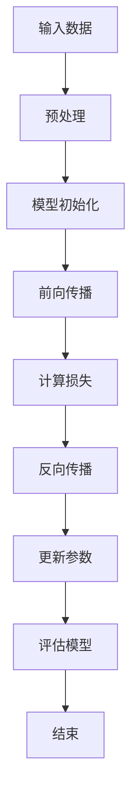
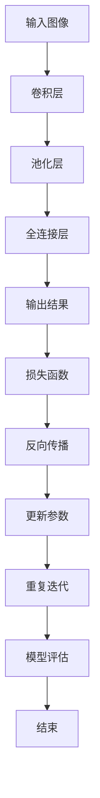
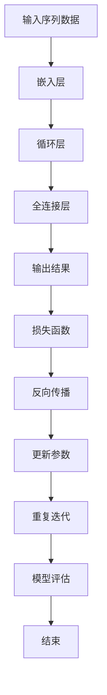

                 

# 《深度学习 原理与代码实例讲解》

> **关键词：深度学习，神经网络，卷积神经网络，循环神经网络，生成对抗网络，代码实例**

> **摘要：本文将深入探讨深度学习的原理及其在计算机视觉、自然语言处理等领域的应用。通过代码实例，我们将展示如何实现深度学习算法，帮助读者更好地理解和掌握这一前沿技术。**

## 目录大纲

### 第一部分：深度学习基础

1. **第1章：深度学习概述**
   1.1 深度学习的定义与历史
   1.2 深度学习与传统机器学习的对比
   1.3 深度学习在各个领域的应用

2. **第2章：神经网络基础**
   2.1 神经元模型
   2.2 前向传播与反向传播算法
   2.3 激活函数

3. **第3章：优化算法**
   3.1 梯度下降算法
   3.2 动量法
   3.3 Adam优化器

4. **第4章：卷积神经网络（CNN）**
   4.1 卷积神经网络基础
   4.2 卷积层与池化层
   4.3 CNN在图像识别中的应用

5. **第5章：循环神经网络（RNN）**
   5.1 RNN基础
   5.2 LSTM与GRU
   5.3 RNN在序列数据处理中的应用

6. **第6章：生成对抗网络（GAN）**
   6.1 GAN基础
   6.2 GAN的工作原理
   6.3 GAN在图像生成中的应用

### 第二部分：深度学习实践

7. **第7章：深度学习框架**
   7.1 TensorFlow 2.x 入门
   7.2 PyTorch 入门
   7.3 Keras 入门

8. **第8章：深度学习项目实战**
   8.1 图像分类项目
   8.2 自然语言处理项目

9. **第9章：深度学习应用场景分析**
   9.1 深度学习在计算机视觉中的应用
   9.2 深度学习在自然语言处理中的应用
   9.3 深度学习在机器人技术中的应用

10. **第10章：深度学习未来发展趋势**
    10.1 深度学习在硬件领域的进展
    10.2 深度学习在算法优化方面的进展
    10.3 深度学习在跨领域融合中的应用

### 附录

- **附录A：深度学习资源与工具**
- **附录B：深度学习算法流程图**
- **附录C：深度学习数学模型与公式**
- **附录D：深度学习代码实例**
- **附录E：深度学习项目实战指导**

---

现在，我们将根据上述目录大纲，逐步展开文章的撰写。在接下来的章节中，我们将深入讲解深度学习的核心原理、算法和应用实例，帮助读者全面掌握深度学习技术。

## 第一部分：深度学习基础

### 第1章：深度学习概述

深度学习（Deep Learning）是人工智能（Artificial Intelligence，AI）领域的一个重要分支，其核心思想是通过构建多层神经网络，自动提取特征并进行复杂任务的学习和推理。深度学习在过去的几十年里取得了显著的进展，成为了计算机视觉、自然语言处理、语音识别等领域的核心技术。

### 1.1 深度学习的定义与历史

深度学习的定义可以从以下几个方面来理解：

1. **多层神经网络**：深度学习模型通常包含多个隐藏层，相比于传统的单层神经网络，多层神经网络能够学习到更加抽象和复杂的特征。
   
2. **特征自动提取**：在传统的机器学习方法中，特征工程是一个重要且复杂的过程。而深度学习通过多层神经网络的非线性变换，能够自动提取出有意义的特征，减少了人工干预的需求。

3. **大规模数据驱动**：深度学习依赖于大量的数据来训练模型，通过大数据驱动的方式，深度学习模型能够达到更高的准确性和泛化能力。

深度学习的历史可以追溯到20世纪40年代，当时神经网络的概念首次被提出。然而，由于计算资源和算法的限制，深度学习在早期并没有得到广泛的应用。直到2006年，Hinton等科学家提出了深度信念网络（Deep Belief Network，DBN），标志着深度学习进入了新的发展阶段。随后，卷积神经网络（Convolutional Neural Network，CNN）、循环神经网络（Recurrent Neural Network，RNN）和生成对抗网络（Generative Adversarial Network，GAN）等深度学习模型相继被提出，推动了深度学习在各个领域的应用。

### 1.2 深度学习与传统机器学习的对比

传统机器学习和深度学习有以下几点主要区别：

1. **特征提取**：在传统机器学习中，特征工程是一个重要的步骤，需要人工设计特征来提高模型的性能。而深度学习通过多层神经网络，自动提取出有意义的特征，减少了人工干预的需求。

2. **模型复杂度**：传统机器学习模型通常比较简单，如线性模型、决策树等。而深度学习模型通常包含多个隐藏层，能够学习到更加复杂的特征和模式。

3. **数据需求**：传统机器学习对数据量要求较低，而深度学习需要大量的数据进行训练，以达到更高的准确性和泛化能力。

4. **计算资源**：传统机器学习模型计算量相对较小，而深度学习模型需要大量的计算资源和时间来训练。

### 1.3 深度学习在各个领域的应用

深度学习在各个领域都取得了显著的成果：

1. **计算机视觉**：深度学习在图像分类、目标检测、人脸识别等领域取得了突破性进展。例如，Google的Inception模型在ImageNet图像分类挑战中取得了优异的成绩。

2. **自然语言处理**：深度学习在文本分类、机器翻译、情感分析等领域也发挥了重要作用。例如，Google的BERT模型在多项自然语言处理任务中取得了领先的成绩。

3. **语音识别**：深度学习在语音识别领域取得了显著进展，提高了识别的准确率和效率。

4. **机器人技术**：深度学习在机器人视觉、路径规划等领域得到了广泛应用，使得机器人能够更好地理解和适应环境。

5. **医疗健康**：深度学习在医学图像分析、疾病预测等领域具有巨大潜力，能够帮助医生提高诊断的准确性和效率。

总之，深度学习作为一种强大的机器学习技术，正在不断推动各个领域的发展，为人类生活带来更多便利。

## 第2章：神经网络基础

神经网络（Neural Network）是深度学习的基础，其核心思想是模拟生物神经系统的信息处理过程。在神经网络中，信息通过神经元之间的连接传递和处理，从而实现复杂任务的学习和推理。

### 2.1 神经元模型

神经元是神经网络的基本构建块，其结构类似于生物神经元。一个简单的神经元模型包括以下几个部分：

1. **输入层**：接收外部输入信号。
2. **权重**：连接输入层和隐藏层的权重，用于调节输入信号的影响程度。
3. **偏置**：用于调整神经元的输出。
4. **激活函数**：用于对神经元的输入进行非线性变换。
5. **输出层**：输出神经元的最终结果。

神经元的计算过程可以表示为：

\[ z = \sum_{i=1}^{n} w_i x_i + b \]

其中，\( x_i \) 是输入层的第 \( i \) 个特征，\( w_i \) 是对应的权重，\( b \) 是偏置，\( z \) 是神经元的输入。

激活函数通常采用Sigmoid函数、ReLU函数等，用于引入非线性特性。例如，Sigmoid函数的定义如下：

\[ a = \frac{1}{1 + e^{-z}} \]

ReLU函数的定义如下：

\[ a = \max(0, z) \]

### 2.2 前向传播与反向传播算法

神经网络的工作原理可以分为前向传播和反向传播两个过程。

1. **前向传播**：从输入层开始，将输入信号传递到隐藏层和输出层，每层神经元计算输出值。这个过程可以表示为：

   \[ z^{(l)} = \sum_{i=1}^{n} w_i^{(l)} x_i^{(l-1)} + b^{(l)} \]
   \[ a^{(l)} = \text{激活函数}(z^{(l)}) \]

   其中，\( l \) 表示神经网络的层数，\( x^{(l-1)} \) 是上一层的输入，\( w_i^{(l)} \) 是连接权值，\( b^{(l)} \) 是偏置。

2. **反向传播**：在前向传播的基础上，计算损失函数关于每个神经元的梯度，并更新权值和偏置。这个过程可以表示为：

   \[ \delta^{(l)} = \text{激活函数的导数} \cdot (z^{(l)} - y) \]
   \[ \delta^{(l-1)} = \frac{\partial L}{\partial z^{(l-1)}} \cdot w^{(l)} \]

   其中，\( \delta^{(l)} \) 是第 \( l \) 层的误差，\( y \) 是实际输出，\( L \) 是损失函数。

通过反向传播算法，神经网络能够自动调整权值和偏置，从而降低损失函数的值，达到优化模型参数的目的。

### 2.3 激活函数

激活函数是神经网络中的关键组件，用于引入非线性特性，使得神经网络能够学习到更复杂的特征和模式。常用的激活函数包括以下几种：

1. **Sigmoid函数**：Sigmoid函数是一种常用的激活函数，其定义如下：

   \[ a = \frac{1}{1 + e^{-z}} \]

   Sigmoid函数的输出范围在0到1之间，常用于二分类问题。

2. **ReLU函数**：ReLU函数是一种简单的线性激活函数，其定义如下：

   \[ a = \max(0, z) \]

  ReLU函数具有计算速度快、参数敏感度低等优点，在深度学习中得到了广泛应用。

3. **Tanh函数**：Tanh函数是Sigmoid函数的推广，其定义如下：

   \[ a = \frac{2}{1 + e^{-2z}} - 1 \]

   Tanh函数的输出范围在-1到1之间，常用于多分类问题。

4. **Leaky ReLU函数**：Leaky ReLU函数是ReLU函数的一种改进，其定义如下：

   \[ a = \max(0.01 \cdot z, z) \]

   Leaky ReLU函数能够解决ReLU函数中的梯度消失问题，提高了模型的稳定性。

总之，激活函数在神经网络中起到了至关重要的作用，能够引入非线性特性，使得神经网络能够学习到更复杂的特征和模式。

## 第3章：优化算法

在深度学习训练过程中，优化算法用于调整模型参数，以降低损失函数的值。本章将介绍几种常用的优化算法，包括梯度下降算法、动量法和Adam优化器。

### 3.1 梯度下降算法

梯度下降算法（Gradient Descent）是最常用的优化算法之一，其基本思想是通过计算损失函数关于模型参数的梯度，沿着梯度方向逐步更新参数，以降低损失函数的值。

梯度下降算法的更新公式如下：

\[ \theta_{t+1} = \theta_{t} - \alpha \cdot \nabla_{\theta} J(\theta) \]

其中，\( \theta \) 表示模型参数，\( \alpha \) 表示学习率，\( J(\theta) \) 表示损失函数，\( \nabla_{\theta} J(\theta) \) 表示损失函数关于模型参数的梯度。

梯度下降算法的步骤如下：

1. 初始化模型参数 \( \theta_0 \)。
2. 对于每个参数 \( \theta \)，计算其梯度 \( \nabla_{\theta} J(\theta) \)。
3. 根据梯度更新参数 \( \theta_{t+1} = \theta_{t} - \alpha \cdot \nabla_{\theta} J(\theta) \)。
4. 重复步骤2和3，直到达到收敛条件。

### 3.2 动量法

动量法（Momentum）是梯度下降算法的一种改进，其核心思想是利用历史梯度信息，加速收敛速度并避免陷入局部最优。

动量法的更新公式如下：

\[ v_t = \beta \cdot v_{t-1} + (1 - \beta) \cdot \nabla_{\theta} J(\theta) \]
\[ \theta_{t+1} = \theta_{t} - \alpha \cdot v_t \]

其中，\( v_t \) 表示动量项，\( \beta \) 表示动量参数，其他参数与梯度下降算法相同。

动量法的步骤如下：

1. 初始化模型参数 \( \theta_0 \) 和动量项 \( v_0 \)。
2. 对于每个参数 \( \theta \)，计算其梯度 \( \nabla_{\theta} J(\theta) \)。
3. 根据梯度更新动量项 \( v_t = \beta \cdot v_{t-1} + (1 - \beta) \cdot \nabla_{\theta} J(\theta) \)。
4. 根据动量项更新参数 \( \theta_{t+1} = \theta_{t} - \alpha \cdot v_t \)。
5. 重复步骤2到4，直到达到收敛条件。

### 3.3 Adam优化器

Adam优化器（Adam Optimizer）是另一种常用的优化算法，结合了动量法和RMSprop算法的优点，具有较好的收敛性能。

Adam优化器的更新公式如下：

\[ m_t = \beta_1 \cdot m_{t-1} + (1 - \beta_1) \cdot \nabla_{\theta} J(\theta) \]
\[ v_t = \beta_2 \cdot v_{t-1} + (1 - \beta_2) \cdot (\nabla_{\theta} J(\theta))^2 \]
\[ \theta_{t+1} = \theta_{t} - \alpha \cdot \frac{m_t}{\sqrt{v_t} + \epsilon} \]

其中，\( m_t \) 和 \( v_t \) 分别表示一阶矩估计和二阶矩估计，\( \beta_1 \) 和 \( \beta_2 \) 分别表示一阶和二阶动量参数，\( \alpha \) 表示学习率，\( \epsilon \) 是一个很小的常数，用于防止分母为零。

Adam优化器的步骤如下：

1. 初始化模型参数 \( \theta_0 \)、一阶矩估计 \( m_0 \) 和二阶矩估计 \( v_0 \)。
2. 对于每个参数 \( \theta \)，计算其梯度 \( \nabla_{\theta} J(\theta) \)。
3. 根据梯度更新一阶矩估计 \( m_t = \beta_1 \cdot m_{t-1} + (1 - \beta_1) \cdot \nabla_{\theta} J(\theta) \)。
4. 根据梯度更新二阶矩估计 \( v_t = \beta_2 \cdot v_{t-1} + (1 - \beta_2) \cdot (\nabla_{\theta} J(\theta))^2 \)。
5. 根据一阶矩估计和二阶矩估计更新参数 \( \theta_{t+1} = \theta_{t} - \alpha \cdot \frac{m_t}{\sqrt{v_t} + \epsilon} \)。
6. 重复步骤2到5，直到达到收敛条件。

总之，优化算法在深度学习训练过程中至关重要，能够帮助我们调整模型参数，降低损失函数的值。本章介绍的几种优化算法各有优缺点，可以根据实际应用场景选择合适的优化算法。

## 第4章：卷积神经网络（CNN）

卷积神经网络（Convolutional Neural Network，CNN）是深度学习中一种重要的模型，特别适用于处理图像数据。CNN通过卷积操作和池化操作，能够自动提取图像中的特征，从而实现图像分类、目标检测等任务。本章节将介绍CNN的基础知识，包括卷积层、池化层以及CNN在图像识别中的应用。

### 4.1 卷积神经网络基础

卷积神经网络由多个卷积层和池化层组成，其核心思想是通过卷积操作和池化操作，逐层提取图像中的特征。

1. **卷积层**：卷积层是CNN的核心部分，用于提取图像中的局部特征。卷积层由多个卷积核（也称为滤波器）组成，每个卷积核负责提取图像中的一个特定特征。卷积操作的计算过程如下：

   \[ (x_{ij}^l) = \sum_{k=1}^{n} w_{ikj}^l x_{kj}^{l-1} + b^l \]

   其中，\( x_{ij}^l \) 是第 \( l \) 层第 \( i \) 个神经元在第 \( j \) 个卷积核上的输出，\( w_{ikj}^l \) 是第 \( k \) 个卷积核与第 \( l \) 层第 \( i \) 个神经元的权重，\( x_{kj}^{l-1} \) 是第 \( l-1 \) 层第 \( k \) 个神经元在第 \( j \) 个卷积核上的输出，\( b^l \) 是第 \( l \) 层的偏置。

2. **激活函数**：在卷积层之后，通常会使用激活函数引入非线性特性。常用的激活函数有ReLU函数、Sigmoid函数等。

3. **池化层**：池化层用于对卷积层输出的特征进行降维处理，减少模型的参数数量，提高模型的泛化能力。常见的池化操作有最大池化和平均池化。最大池化选取每个局部区域中的最大值，平均池化则选取每个局部区域中的平均值。

### 4.2 卷积层与池化层

1. **卷积层**：

   - **卷积核大小**：卷积核的大小决定了特征提取的范围。较小的卷积核能够提取图像中的局部特征，较大的卷积核能够提取全局特征。

   - **步长**：步长决定了卷积操作在图像上滑动的步长。较小的步长能够保留更多的细节信息，较大的步长能够减少模型参数数量。

   - **填充**：填充是指在卷积操作前后添加零填充，用于保持输入图像的大小。常见的填充方法有“零填充”和“镜像填充”。

2. **池化层**：

   - **池化窗口大小**：池化窗口大小决定了每个局部区域的大小。

   - **步长**：步长决定了池化操作在特征图上滑动的步长。

### 4.3 CNN在图像识别中的应用

CNN在图像识别领域取得了显著成果，通过卷积层和池化层的组合，能够提取出图像中的关键特征，从而实现图像分类、目标检测等任务。

1. **图像分类**：

   - **AlexNet**：AlexNet是CNN的开创性模型，首次在ImageNet图像分类挑战中取得优异成绩。

   - **VGGNet**：VGGNet通过增加网络深度和宽度，进一步提高了图像分类的准确率。

   - **ResNet**：ResNet引入了残差连接，解决了深层网络训练中的梯度消失问题，使得深层网络能够更好地训练。

   - **InceptionNet**：InceptionNet通过引入Inception模块，进一步提高了模型的准确率和效率。

2. **目标检测**：

   - **R-CNN**：R-CNN通过区域建议网络（Region Proposal Network，RPN）实现目标检测，首次在目标检测领域取得突破性成果。

   - **Fast R-CNN**：Fast R-CNN在R-CNN的基础上，引入了区域建议网络，提高了目标检测的速度。

   - **Faster R-CNN**：Faster R-CNN通过引入深度神经网络，实现了更快的区域建议和目标检测。

   - **SSD**：SSD（Single Shot Multibox Detector）通过单次检测框架，实现了高效的物体检测。

   - **YOLO**：YOLO（You Only Look Once）通过将目标检测任务转化为回归问题，实现了实时目标检测。

总之，卷积神经网络在图像识别领域取得了显著成果，通过卷积层和池化层的组合，能够提取出图像中的关键特征，从而实现图像分类、目标检测等任务。随着深度学习技术的不断发展，CNN在图像识别领域的应用将更加广泛。

## 第5章：循环神经网络（RNN）

循环神经网络（Recurrent Neural Network，RNN）是一种能够处理序列数据的神经网络。与传统的神经网络不同，RNN具有时间维度，能够记忆和利用前面的输入信息，从而在处理序列数据时具有独特的优势。本章将介绍RNN的基础知识，包括RNN的结构、工作机制以及常见的RNN变体。

### 5.1 RNN基础

RNN的基本结构包含一个循环单元，该单元通过时间步来处理序列数据。在RNN中，每个时间步的输入和输出都与前面的时间步相关联，使得网络能够利用历史信息。

1. **循环单元**：循环单元是RNN的核心部分，用于处理每个时间步的输入和输出。常见的循环单元包括简单的RNN单元、LSTM（Long Short-Term Memory）单元和GRU（Gated Recurrent Unit）单元。

2. **输入与输出**：在RNN中，每个时间步的输入为当前时刻的序列数据，输出为当前时刻的处理结果。同时，RNN的输出还会作为下一时间步的输入。

3. **隐藏状态**：RNN通过隐藏状态来记忆历史信息。隐藏状态在当前时间步的输入和输出之间传递，使得网络能够利用前面的信息。

4. **前向传播与反向传播**：RNN的前向传播过程从第一个时间步开始，逐步计算每个时间步的隐藏状态和输出。反向传播过程中，RNN通过计算损失函数关于隐藏状态和输出的梯度，来更新网络参数。

### 5.2 LSTM与GRU

LSTM（Long Short-Term Memory）和GRU（Gated Recurrent Unit）是RNN的两种常见变体，它们通过引入门控机制，解决了传统RNN在处理长序列数据时遇到的梯度消失和梯度爆炸问题。

1. **LSTM（长短期记忆）**：

   - **门控机制**：LSTM通过三个门控单元（遗忘门、输入门和输出门）来控制信息的流动。遗忘门决定上一时刻的隐藏状态中有多少信息需要被遗忘；输入门决定当前时刻的输入信息中有多少需要被存储；输出门决定当前时刻的隐藏状态中有多少信息需要被输出。

   - **细胞状态**：LSTM通过细胞状态来存储和传递信息。细胞状态在遗忘门、输入门和输出门的控制下，能够灵活地修改和更新。

   - **更新规则**：LSTM的更新规则包括遗忘门、输入门和输出门三个部分。遗忘门根据当前时刻的输入和上一时刻的隐藏状态，决定上一时刻的隐藏状态中有多少信息需要被遗忘；输入门根据当前时刻的输入和上一时刻的隐藏状态，决定当前时刻的输入信息中有多少需要被存储；输出门根据当前时刻的输入和细胞状态，决定当前时刻的隐藏状态中有多少信息需要被输出。

2. **GRU（门控循环单元）**：

   - **门控机制**：GRU通过两个门控单元（重置门和更新门）来控制信息的流动。重置门决定当前时刻的输入和上一时刻的隐藏状态中有多少信息需要被重置；更新门决定当前时刻的输入和细胞状态中有多少信息需要被更新。

   - **细胞状态**：GRU通过细胞状态来存储和传递信息。细胞状态在重置门和更新门的控制下，能够灵活地修改和更新。

   - **更新规则**：GRU的更新规则包括重置门、更新门和细胞状态三个部分。重置门根据当前时刻的输入和上一时刻的隐藏状态，决定当前时刻的隐藏状态中有多少信息需要被重置；更新门根据当前时刻的输入和细胞状态，决定当前时刻的细胞状态中有多少信息需要被更新。

LSTM和GRU在处理长序列数据时具有较好的性能，能够避免传统RNN的梯度消失和梯度爆炸问题。在实际应用中，可以根据任务需求和数据特点选择合适的RNN变体。

### 5.3 RNN在序列数据处理中的应用

RNN在序列数据处理中具有广泛的应用，包括时间序列预测、机器翻译、语音识别等。

1. **时间序列预测**：

   - **自回归模型**：RNN可以用于构建自回归模型，用于预测时间序列的下一个值。通过训练RNN模型，可以学习到时间序列中的模式和趋势，从而实现准确的预测。

   - **序列建模**：RNN可以用于建模时间序列数据，从而捕捉时间序列中的复杂结构和规律。例如，可以使用LSTM或GRU模型来处理股票价格、天气温度等时间序列数据。

2. **机器翻译**：

   - **编码器-解码器模型**：RNN在机器翻译中广泛应用，通过编码器将源语言序列编码为一个固定长度的向量，解码器将编码后的向量解码为目标语言序列。编码器和解码器通常采用LSTM或GRU模型，能够有效地处理长序列数据。

   - **注意力机制**：为了提高机器翻译的准确性，可以引入注意力机制，使得解码器能够关注源语言序列中的重要信息，从而提高翻译质量。

3. **语音识别**：

   - **声学模型**：RNN可以用于构建声学模型，用于处理语音信号并生成对应的文本。通过训练RNN模型，可以学习到语音信号中的模式和规律，从而实现准确的语音识别。

   - **语言模型**：RNN还可以用于构建语言模型，用于预测语音信号对应的文本序列。通过结合声学模型和语言模型，可以进一步提高语音识别的准确性。

总之，RNN在序列数据处理中具有广泛的应用，通过引入门控机制和注意力机制，RNN能够有效地处理长序列数据，实现时间序列预测、机器翻译、语音识别等任务。

## 第6章：生成对抗网络（GAN）

生成对抗网络（Generative Adversarial Network，GAN）是深度学习领域的一种重要模型，由Ian Goodfellow等人于2014年提出。GAN的核心思想是通过两个对抗网络的博弈，实现高质量数据生成。本章将介绍GAN的基础知识，包括GAN的工作原理、结构以及GAN在图像生成中的应用。

### 6.1 GAN基础

生成对抗网络由两个主要组件构成：生成器（Generator）和判别器（Discriminator）。生成器的目标是生成与真实数据相似的数据，判别器的目标是区分真实数据和生成数据。

1. **生成器**：

   - **生成过程**：生成器的输入是随机噪声，通过一系列的变换，生成与真实数据相似的数据。生成器的输出可以是图像、音频、文本等。
   
   - **目标**：生成器的目标是最小化其生成的数据与真实数据之间的差异，即最大化判别器将其生成的数据判为真实数据的概率。

2. **判别器**：

   - **判别过程**：判别器的输入是真实数据和生成数据，通过一系列的变换，输出对数据的真实性与生成性的判断。
   
   - **目标**：判别器的目标是最大化其将真实数据判为真实数据、生成数据判为生成数据的概率。

### 6.2 GAN的工作原理

GAN的工作原理基于两个对抗网络的博弈。生成器和判别器交替更新参数，通过不断地优化生成器和判别器的性能，最终实现高质量的数据生成。

1. **生成器训练**：

   - **生成噪声数据**：生成器将随机噪声输入到网络中，通过一系列的变换生成数据。

   - **对抗训练**：生成器将生成的数据输入到判别器中，与真实数据进行比较。判别器的目标是最大化其将真实数据判为真实数据、生成数据判为生成数据的概率。

2. **判别器训练**：

   - **判别真实数据**：判别器将真实数据输入到网络中，输出其对数据的真实性的判断。

   - **判别生成数据**：判别器将生成器生成的数据输入到网络中，输出其对数据的生成性的判断。

   - **对抗训练**：判别器的目标是最大化其将真实数据判为真实数据、生成数据判为生成数据的概率。

在GAN的训练过程中，生成器和判别器交替进行训练。生成器试图生成更高质量的数据，而判别器试图更准确地判断数据的真实性。通过这种对抗训练，生成器能够学习到如何生成与真实数据相似的数据，从而实现高质量的数据生成。

### 6.3 GAN在图像生成中的应用

GAN在图像生成领域取得了显著成果，通过生成器和判别器的对抗训练，能够生成高质量、多样化的图像。

1. **图像生成**：

   - **随机噪声输入**：生成器将随机噪声输入到网络中，通过一系列的变换生成图像。

   - **对抗生成**：生成器将生成的图像输入到判别器中，与真实图像进行对抗训练。判别器通过不断优化，能够更准确地判断图像的真实性与生成性。

   - **生成高质量图像**：通过对抗训练，生成器能够学习到如何生成与真实图像相似的高质量图像。

2. **应用场景**：

   - **艺术创作**：GAN可以用于生成艺术作品，如绘画、音乐等。通过生成器，可以生成具有独特风格的艺术作品。

   - **图像修复**：GAN可以用于图像修复，将损坏的图像修复为完整、高质量的图像。

   - **数据增强**：GAN可以用于数据增强，通过生成与真实数据相似的数据，提高模型的泛化能力和训练效果。

   - **生成对抗训练**：GAN可以用于生成对抗训练，通过生成器生成与真实数据相似的数据，提高模型的训练效果。

总之，GAN在图像生成领域具有广泛的应用，通过生成器和判别器的对抗训练，能够生成高质量、多样化的图像。随着深度学习技术的不断发展，GAN在图像生成领域的应用将更加广泛。

## 第二部分：深度学习实践

### 第7章：深度学习框架

深度学习框架是用于实现和训练深度学习模型的工具。本章将介绍几种常用的深度学习框架，包括TensorFlow 2.x、PyTorch和Keras，并介绍如何使用这些框架进行深度学习模型的构建和训练。

### 7.1 TensorFlow 2.x 入门

TensorFlow是由Google开发的开源深度学习框架，其版本2.x在保持原有功能的基础上，增加了许多新的特性，如自动微分、高级API等。以下是一个简单的TensorFlow 2.x入门示例。

```python
import tensorflow as tf

# 创建一个简单的线性模型
model = tf.keras.Sequential([
    tf.keras.layers.Dense(units=1, input_shape=[1])
])

# 编译模型
model.compile(loss='mean_squared_error', optimizer=tf.keras.optimizers.Adam(0.1), metrics=['mean_absolute_error'])

# 训练模型
model.fit(x_train, y_train, epochs=100)

# 评估模型
model.evaluate(x_test, y_test)
```

在这个示例中，我们首先导入了TensorFlow库，然后创建了一个简单的线性模型，该模型包含一个全连接层。接着，我们编译了模型，并使用训练数据对模型进行训练。最后，我们使用测试数据评估了模型的性能。

### 7.2 PyTorch 入门

PyTorch是由Facebook开发的深度学习框架，以其灵活性和易用性著称。以下是一个简单的PyTorch入门示例。

```python
import torch
import torch.nn as nn
import torch.optim as optim

# 创建一个简单的线性模型
model = nn.Linear(1, 1)

# 创建一个损失函数和优化器
criterion = nn.MSELoss()
optimizer = optim.Adam(model.parameters(), lr=0.01)

# 创建一个训练循环
for epoch in range(100):
    # 前向传播
    outputs = model(x_train)
    loss = criterion(outputs, y_train)

    # 反向传播
    optimizer.zero_grad()
    loss.backward()
    optimizer.step()

    print(f'Epoch [{epoch+1}/100], Loss: {loss.item()}')
```

在这个示例中，我们首先导入了PyTorch库，然后创建了一个简单的线性模型。接着，我们创建了一个均方误差损失函数和一个Adam优化器。在训练循环中，我们首先进行前向传播，计算损失函数的值，然后进行反向传播，更新模型参数。最后，我们打印出了每个时期的损失值。

### 7.3 Keras 入门

Keras是一个基于TensorFlow的高层神经网络API，它提供了更简单、更易于使用的接口。以下是一个简单的Keras入门示例。

```python
from keras.models import Sequential
from keras.layers import Dense
from keras.optimizers import Adam

# 创建一个简单的线性模型
model = Sequential()
model.add(Dense(units=1, input_shape=(1,)))

# 编译模型
model.compile(loss='mean_squared_error', optimizer=Adam(0.1), metrics=['mean_absolute_error'])

# 训练模型
model.fit(x_train, y_train, epochs=100)

# 评估模型
model.evaluate(x_test, y_test)
```

在这个示例中，我们首先导入了Keras库，然后创建了一个简单的线性模型。接着，我们编译了模型，并使用训练数据对模型进行训练。最后，我们使用测试数据评估了模型的性能。

通过以上示例，我们可以看到，使用不同的深度学习框架进行模型构建和训练的基本步骤是相似的。无论选择哪种框架，都可以通过简单的代码实现复杂的深度学习任务。

### 第8章：深度学习项目实战

在本章节中，我们将通过两个实际项目：图像分类项目和自然语言处理项目，来展示如何使用深度学习框架进行项目开发。这些项目将包括数据预处理、网络架构设计、模型训练与评估以及项目分析。

#### 8.1 图像分类项目

图像分类项目是一个经典的计算机视觉任务，其主要目标是将图像分类到预定义的类别中。以下是一个简单的图像分类项目的步骤：

##### 8.1.1 数据预处理

数据预处理是图像分类项目的重要步骤，其目的是将原始图像数据转换为适合训练模型的格式。以下是一些常见的数据预处理步骤：

- **图像大小调整**：将图像调整为统一的尺寸，以便于模型处理。
- **归一化**：将图像的像素值缩放到[0, 1]之间，以便于模型训练。
- **数据增强**：通过随机旋转、翻转、裁剪等方式增加数据多样性，提高模型的泛化能力。

```python
from tensorflow.keras.preprocessing.image import ImageDataGenerator

# 创建一个图像数据增强生成器
datagen = ImageDataGenerator(
    rescale=1./255,
    rotation_range=20,
    width_shift_range=0.2,
    height_shift_range=0.2,
    shear_range=0.2,
    zoom_range=0.2,
    horizontal_flip=True,
    fill_mode='nearest'
)

# 加载训练数据和测试数据
train_data = datagen.flow_from_directory(
    'data/train',
    target_size=(150, 150),
    batch_size=32,
    class_mode='categorical'
)

test_data = datagen.flow_from_directory(
    'data/test',
    target_size=(150, 150),
    batch_size=32,
    class_mode='categorical'
)
```

##### 8.1.2 网络架构设计

在图像分类项目中，我们可以选择预定义的卷积神经网络架构，如VGG16、ResNet50等，或者自行设计网络架构。以下是一个简单的卷积神经网络架构示例：

```python
from tensorflow.keras.applications import VGG16
from tensorflow.keras.models import Model
from tensorflow.keras.layers import Flatten, Dense

# 加载预训练的VGG16模型
base_model = VGG16(weights='imagenet', include_top=False, input_shape=(150, 150, 3))

# 冻结VGG16模型的层
for layer in base_model.layers:
    layer.trainable = False

# 添加新的全连接层和输出层
x = Flatten()(base_model.output)
x = Dense(1024, activation='relu')(x)
predictions = Dense(num_classes, activation='softmax')(x)

# 创建完整的模型
model = Model(inputs=base_model.input, outputs=predictions)
```

##### 8.1.3 训练与评估

在模型训练过程中，我们可以设置训练参数，如学习率、批次大小等。以下是一个简单的训练和评估示例：

```python
# 编译模型
model.compile(optimizer='adam', loss='categorical_crossentropy', metrics=['accuracy'])

# 训练模型
history = model.fit(
    train_data,
    epochs=10,
    validation_data=test_data
)

# 评估模型
test_loss, test_accuracy = model.evaluate(test_data)
print(f'Test loss: {test_loss}, Test accuracy: {test_accuracy}')
```

##### 8.1.4 项目分析

在项目分析阶段，我们可以通过绘制训练过程、验证过程和测试过程的损失值和准确率来评估模型性能。以下是一个简单的分析示例：

```python
import matplotlib.pyplot as plt

# 绘制训练过程
plt.figure(figsize=(12, 4))
plt.subplot(1, 2, 1)
plt.plot(history.history['loss'], label='Training loss')
plt.plot(history.history['val_loss'], label='Validation loss')
plt.legend()
plt.title('Loss over epochs')

# 绘制准确率
plt.subplot(1, 2, 2)
plt.plot(history.history['accuracy'], label='Training accuracy')
plt.plot(history.history['val_accuracy'], label='Validation accuracy')
plt.legend()
plt.title('Accuracy over epochs')
plt.show()
```

#### 8.2 自然语言处理项目

自然语言处理（Natural Language Processing，NLP）项目通常涉及文本分类、情感分析、机器翻译等任务。以下是一个简单的自然语言处理项目的步骤：

##### 8.2.1 数据预处理

在自然语言处理项目中，数据预处理包括文本清洗、分词、标记等步骤。以下是一个简单的文本预处理示例：

```python
import tensorflow as tf
from tensorflow.keras.preprocessing.text import Tokenizer
from tensorflow.keras.preprocessing.sequence import pad_sequences

# 加载预处理的文本数据
train_texts = ...
train_labels = ...

# 创建一个分词器
tokenizer = Tokenizer(num_words=max_vocab_size)
tokenizer.fit_on_texts(train_texts)

# 将文本转换为序列
train_sequences = tokenizer.texts_to_sequences(train_texts)

# 将序列填充为相同长度
train_padded = pad_sequences(train_sequences, maxlen=max_sequence_length)
```

##### 8.2.2 网络架构设计

在自然语言处理项目中，我们可以选择预定义的循环神经网络架构，如LSTM、GRU等，或者自行设计网络架构。以下是一个简单的循环神经网络架构示例：

```python
from tensorflow.keras.models import Sequential
from tensorflow.keras.layers import Embedding, LSTM, Dense

# 创建一个简单的循环神经网络模型
model = Sequential([
    Embedding(max_vocab_size, embedding_dim, input_length=max_sequence_length),
    LSTM(units=128, return_sequences=True),
    LSTM(units=128),
    Dense(units=num_classes, activation='softmax')
])

# 编译模型
model.compile(optimizer='adam', loss='categorical_crossentropy', metrics=['accuracy'])
```

##### 8.2.3 训练与评估

在自然语言处理项目中，我们可以设置训练参数，如学习率、批次大小等。以下是一个简单的训练和评估示例：

```python
# 训练模型
history = model.fit(
    train_padded,
    train_labels,
    epochs=10,
    validation_split=0.2
)

# 评估模型
test_loss, test_accuracy = model.evaluate(test_padded, test_labels)
print(f'Test loss: {test_loss}, Test accuracy: {test_accuracy}')
```

##### 8.2.4 项目分析

在项目分析阶段，我们可以通过绘制训练过程、验证过程和测试过程的损失值和准确率来评估模型性能。以下是一个简单的分析示例：

```python
import matplotlib.pyplot as plt

# 绘制训练过程
plt.figure(figsize=(12, 4))
plt.subplot(1, 2, 1)
plt.plot(history.history['loss'], label='Training loss')
plt.plot(history.history['val_loss'], label='Validation loss')
plt.legend()
plt.title('Loss over epochs')

# 绘制准确率
plt.subplot(1, 2, 2)
plt.plot(history.history['accuracy'], label='Training accuracy')
plt.plot(history.history['val_accuracy'], label='Validation accuracy')
plt.legend()
plt.title('Accuracy over epochs')
plt.show()
```

通过以上两个项目实例，我们可以看到如何使用深度学习框架进行项目开发。在实际应用中，根据任务需求和数据特点，我们可以选择合适的框架和模型架构，并进行相应的数据预处理和模型训练。通过不断迭代和优化，我们可以提高模型的性能和泛化能力。

### 第9章：深度学习应用场景分析

深度学习作为一种先进的机器学习技术，已经在计算机视觉、自然语言处理、语音识别、机器人技术等多个领域取得了显著的应用成果。本章将分析深度学习在这些领域的应用场景，探讨其优势和挑战。

#### 9.1 深度学习在计算机视觉中的应用

计算机视觉是深度学习应用最为广泛的领域之一。深度学习模型，尤其是卷积神经网络（CNN）和循环神经网络（RNN）的变体，如LSTM和GRU，在图像分类、目标检测、图像识别等方面展现了强大的能力。

1. **图像分类**：

   图像分类是计算机视觉的基础任务，其目标是给图像分配一个标签。CNN在图像分类任务中表现出色，如AlexNet、VGG、ResNet等模型都取得了显著的分类效果。例如，在ImageNet图像分类挑战中，卷积神经网络模型已经连续多年取得了冠军。

2. **目标检测**：

   目标检测旨在识别图像中的多个对象，并给出它们的边界框和类别标签。深度学习模型如R-CNN、Fast R-CNN、Faster R-CNN、SSD和YOLO在目标检测领域取得了突破性进展。这些模型能够实现实时目标检测，广泛应用于自动驾驶、安防监控等领域。

3. **图像识别**：

   图像识别包括人脸识别、图像分割、图像修复等任务。深度学习模型在这些任务中展现了优异的性能。例如，深度学习人脸识别技术已经广泛应用于人脸支付、人脸门禁等领域。

**优势**：

- **自动特征提取**：深度学习模型能够自动提取图像中的特征，减少了人工特征工程的需求。
- **高准确性**：深度学习模型在图像分类、目标检测等任务中取得了显著的准确性。
- **灵活性**：深度学习模型能够适应多种图像数据格式和任务需求。

**挑战**：

- **计算资源消耗**：深度学习模型通常需要大量的计算资源和时间进行训练。
- **数据依赖**：深度学习模型对数据质量有较高要求，数据量不足或数据质量差会影响模型的性能。
- **解释性不足**：深度学习模型的内部机制复杂，难以解释，增加了模型的可解释性挑战。

#### 9.2 深度学习在自然语言处理中的应用

自然语言处理是深度学习应用的另一个重要领域。深度学习模型在文本分类、情感分析、机器翻译、语音识别等方面取得了显著成果。

1. **文本分类**：

   文本分类是将文本数据分类到预定义的类别中。深度学习模型，如CNN和RNN及其变体LSTM和GRU，在文本分类任务中表现出色。例如，在社交媒体情感分析中，深度学习模型能够有效地识别用户情感。

2. **情感分析**：

   情感分析旨在分析文本中的情感倾向，如正面、负面或中性。深度学习模型在情感分析任务中取得了显著成果，能够为电子商务、社交媒体等领域的用户反馈分析提供支持。

3. **机器翻译**：

   机器翻译是将一种语言的文本翻译成另一种语言的文本。深度学习模型，如编码器-解码器（Encoder-Decoder）模型和注意力机制，在机器翻译任务中表现出色。例如，Google翻译和百度翻译等应用都采用了深度学习技术。

4. **语音识别**：

   语音识别是将语音信号转换为文本。深度学习模型，如循环神经网络（RNN）和长短期记忆（LSTM）模型，在语音识别任务中展现了强大的能力。例如，苹果的Siri和百度的语音助手都采用了深度学习技术。

**优势**：

- **自动特征提取**：深度学习模型能够自动提取文本中的特征，减少了人工特征工程的需求。
- **高准确性**：深度学习模型在文本分类、情感分析、机器翻译等任务中取得了显著的准确性。
- **灵活性**：深度学习模型能够适应多种文本数据格式和任务需求。

**挑战**：

- **计算资源消耗**：深度学习模型通常需要大量的计算资源和时间进行训练。
- **数据依赖**：深度学习模型对数据质量有较高要求，数据量不足或数据质量差会影响模型的性能。
- **解释性不足**：深度学习模型的内部机制复杂，难以解释，增加了模型的可解释性挑战。

#### 9.3 深度学习在机器人技术中的应用

深度学习在机器人技术中也有广泛的应用，尤其是在感知和决策方面。

1. **环境感知**：

   机器人通过视觉、听觉等传感器感知环境，深度学习模型在图像识别、语音识别等方面为机器人提供了强大的感知能力。例如，自动驾驶汽车通过深度学习模型识别道路标志、行人等对象，从而实现自动驾驶。

2. **路径规划**：

   深度学习模型在路径规划任务中能够有效处理复杂环境，提高机器人路径规划的准确性。例如，通过深度学习模型，机器人能够在室内外环境中实现自主导航。

3. **决策控制**：

   深度学习模型为机器人提供了智能决策能力，使机器人能够根据环境信息和任务需求做出合理的决策。例如，在工业制造领域，机器人通过深度学习模型实现自动化生产线的监控和控制。

**优势**：

- **自适应能力**：深度学习模型能够通过训练不断适应环境变化，提高机器人智能水平。
- **高准确性**：深度学习模型在机器人感知和决策任务中取得了显著的准确性。
- **灵活性**：深度学习模型能够适应多种机器人应用场景和任务需求。

**挑战**：

- **计算资源消耗**：深度学习模型通常需要大量的计算资源和时间进行训练。
- **数据依赖**：深度学习模型对数据质量有较高要求，数据量不足或数据质量差会影响模型的性能。
- **实时性能**：深度学习模型在实时性要求较高的任务中可能面临性能挑战。

综上所述，深度学习在计算机视觉、自然语言处理、语音识别、机器人技术等多个领域具有广泛的应用场景。尽管面临一定的挑战，但深度学习技术正在不断推动各个领域的发展，为人类社会带来更多便利。

### 第10章：深度学习未来发展趋势

随着深度学习技术的不断发展和应用，其在未来的发展趋势值得期待。以下从硬件进展、算法优化和跨领域融合三个方面来探讨深度学习未来发展的趋势。

#### 10.1 深度学习在硬件领域的进展

1. **专用硬件加速**：

   随着深度学习模型的复杂性不断增加，传统的通用计算硬件已无法满足训练和推理的需求。为此，专门为深度学习设计的高性能硬件，如GPU（图形处理器）和TPU（张量处理器）等，已经广泛应用于深度学习领域。这些专用硬件通过并行计算和高度优化的指令集，显著提高了深度学习模型的训练和推理速度。

2. **量子计算**：

   量子计算是一种基于量子力学原理的新型计算模型，具有超越传统计算机的巨大潜力。尽管目前量子计算在深度学习中的应用还处于初步阶段，但已有研究表明，量子计算在优化算法、减少计算复杂度等方面具有显著优势。随着量子计算技术的发展，未来深度学习在量子计算领域有望实现重大突破。

3. **边缘计算**：

   随着物联网（IoT）和智能设备的普及，深度学习模型在边缘设备（如智能手机、智能家居等）上的应用变得越来越重要。边缘计算通过将计算任务从云端迁移到边缘设备，能够实现更低的延迟、更高的实时性和更高效的资源利用。未来，随着硬件性能和无线通信技术的不断提升，深度学习在边缘计算领域的应用将更加广泛。

#### 10.2 深度学习在算法优化方面的进展

1. **优化算法**：

   深度学习模型的训练过程涉及大量的计算和优化，优化算法在提高训练效率和模型性能方面具有重要意义。近年来，诸如Adam、RMSprop、AdaGrad等优化算法不断涌现，使得深度学习模型的训练过程更加高效和稳定。未来，随着算法研究的深入，将出现更多适用于深度学习的优化算法，进一步推动深度学习技术的发展。

2. **模型压缩**：

   模型压缩是降低深度学习模型复杂度和计算资源需求的重要手段。通过模型压缩技术，如量化、剪枝、蒸馏等，可以显著减小模型的参数数量和计算量，提高模型的推理速度和效率。未来，随着模型压缩技术的不断发展和优化，深度学习模型将在更广泛的场景中得到应用。

3. **迁移学习**：

   迁移学习是一种利用预训练模型来加速新任务学习的方法。通过迁移学习，可以将预训练模型中的知识迁移到新任务中，从而提高模型的泛化能力和训练效率。未来，随着预训练模型和数据集的不断完善，迁移学习技术将在深度学习领域发挥更加重要的作用。

#### 10.3 深度学习在跨领域融合中的应用

1. **医疗健康**：

   深度学习在医疗健康领域具有巨大的应用潜力。通过深度学习技术，可以实现对医学图像的分析、疾病预测、药物发现等任务。未来，随着深度学习技术的不断发展和数据资源的积累，深度学习在医疗健康领域的应用将更加广泛，为人类健康带来更多福祉。

2. **金融科技**：

   深度学习在金融科技领域也有广泛的应用，如风险控制、市场预测、信用评估等。未来，随着深度学习技术的不断进步，深度学习在金融科技领域的应用将更加精准和高效，为金融行业带来更多创新。

3. **智能制造**：

   深度学习在智能制造领域可以应用于设备故障诊断、生产优化、质量控制等任务。通过深度学习技术，可以提高生产线的自动化水平和效率，降低生产成本。未来，随着智能制造技术的不断发展，深度学习在智能制造领域的应用将更加深入和广泛。

总之，深度学习作为一种先进的机器学习技术，在未来的发展中将不断突破技术瓶颈，推动各个领域的发展。同时，随着硬件性能的提升、算法优化的深入以及跨领域融合的推进，深度学习将在更广泛的场景中发挥重要作用，为人类社会带来更多便利和创新。

### 附录

#### 附录A：深度学习资源与工具

以下是深度学习领域的一些常用资源与工具：

- **开源框架**：
  - TensorFlow：由Google开发的开源深度学习框架。
  - PyTorch：由Facebook开发的开源深度学习框架。
  - Keras：基于Theano和TensorFlow的高层神经网络API。
  - MXNet：由Apache Software Foundation开发的开源深度学习框架。

- **在线平台**：
  - Google Colab：Google提供的免费GPU云平台，适合深度学习研究和实践。
  - JAX：由Google开发的用于数值计算和深度学习的库。

- **学习资源**：
  - Coursera《深度学习》课程：由Andrew Ng教授主讲的深度学习课程。
  - 《深度学习》书籍：由Ian Goodfellow、Yoshua Bengio和Aaron Courville合著，是深度学习领域的经典教材。

- **社区与论坛**：
  - arXiv：深度学习领域的论文预发布平台。
  - Reddit：深度学习相关的讨论社区。
  - Stack Overflow：编程和技术问题解答社区。

#### 附录B：深度学习算法流程图

以下是一些深度学习算法的流程图，使用Mermaid语言绘制：







#### 附录C：深度学习数学模型与公式

以下是深度学习领域中一些重要的数学模型和公式，使用LaTeX格式表示：

```latex
% 梯度下降算法公式
\begin{equation}
\theta_{t+1} = \theta_{t} - \alpha \cdot \nabla_{\theta} J(\theta)
\end{equation}

% 动量法公式
\begin{equation}
v_t = \beta \cdot v_{t-1} + (1 - \beta) \cdot \nabla_{\theta} J(\theta)
\end{equation}
\begin{equation}
\theta_{t+1} = \theta_{t} - \alpha \cdot v_t
\end{equation}

% Adam优化器公式
\begin{equation}
m_t = \beta_1 \cdot m_{t-1} + (1 - \beta_1) \cdot \nabla_{\theta} J(\theta)
\end{equation}
\begin{equation}
v_t = \beta_2 \cdot v_{t-1} + (1 - \beta_2) \cdot (\nabla_{\theta} J(\theta))^2
\end{equation}
\begin{equation}
\theta_{t+1} = \theta_{t} - \alpha \cdot \frac{m_t}{\sqrt{v_t} + \epsilon}
\end{equation}

% 卷积层公式
\begin{equation}
(x_{ij}^l) = \sum_{k=1}^{n} w_{ikj}^l x_{kj}^{l-1} + b^l
\end{equation}

% LSTM公式
\begin{equation}
i_t = \sigma(W_{xi}x_t + W_{hi}(h_{t-1}) + b_i)
\end{equation}
\begin{equation}
f_t = \sigma(W_{xf}x_t + W_{hf}(h_{t-1}) + b_f)
\end{equation}
\begin{equation}
C_t' = \tanh(W_{xc}x_t + W_{hc}(h_{t-1}) + b_c)
\end{equation}
\begin{equation}
o_t = \sigma(W_{xo}x_t + W_{ho}(h_{t-1}) + b_o)
\end{equation}
\begin{equation}
h_t = o_t \odot \tanh(C_t)
\end{equation}
```

#### 附录D：深度学习代码实例

以下是深度学习领域的一些代码实例，包括图像分类项目和自然语言处理项目：

```python
# 图像分类项目代码实例
import tensorflow as tf
from tensorflow.keras.applications import VGG16
from tensorflow.keras.models import Model
from tensorflow.keras.layers import Flatten, Dense
from tensorflow.keras.preprocessing.image import ImageDataGenerator

# 创建VGG16模型
base_model = VGG16(weights='imagenet', include_top=False, input_shape=(150, 150, 3))
base_model.trainable = False

# 添加全连接层和输出层
x = Flatten()(base_model.output)
x = Dense(1024, activation='relu')(x)
predictions = Dense(num_classes, activation='softmax')(x)

# 创建完整模型
model = Model(inputs=base_model.input, outputs=predictions)

# 编译模型
model.compile(optimizer='adam', loss='categorical_crossentropy', metrics=['accuracy'])

# 数据增强
datagen = ImageDataGenerator(rescale=1./255, shear_range=0.2, zoom_range=0.2, horizontal_flip=True)
train_data = datagen.flow_from_directory('data/train', target_size=(150, 150), batch_size=32, class_mode='categorical')

# 训练模型
model.fit(train_data, epochs=10, validation_data=datagen.flow('data/validation', target_size=(150, 150), batch_size=32, class_mode='categorical'))

# 评估模型
test_loss, test_accuracy = model.evaluate(datagen.flow('data/test', target_size=(150, 150), batch_size=32, class_mode='categorical'))
print(f'Test loss: {test_loss}, Test accuracy: {test_accuracy}')

# 自然语言处理项目代码实例
import tensorflow as tf
from tensorflow.keras.models import Sequential
from tensorflow.keras.layers import Embedding, LSTM, Dense
from tensorflow.keras.preprocessing.text import Tokenizer
from tensorflow.keras.preprocessing.sequence import pad_sequences

# 加载和预处理文本数据
train_texts = ...
train_labels = ...

# 创建分词器
tokenizer = Tokenizer(num_words=max_vocab_size)
tokenizer.fit_on_texts(train_texts)

# 将文本转换为序列
train_sequences = tokenizer.texts_to_sequences(train_texts)

# 将序列填充为相同长度
train_padded = pad_sequences(train_sequences, maxlen=max_sequence_length)

# 创建模型
model = Sequential([
    Embedding(max_vocab_size, embedding_dim, input_length=max_sequence_length),
    LSTM(units=128, return_sequences=True),
    LSTM(units=128),
    Dense(units=num_classes, activation='softmax')
])

# 编译模型
model.compile(optimizer='adam', loss='categorical_crossentropy', metrics=['accuracy'])

# 训练模型
model.fit(train_padded, train_labels, epochs=10, validation_split=0.2)

# 评估模型
test_loss, test_accuracy = model.evaluate(train_padded, train_labels)
print(f'Test loss: {test_loss}, Test accuracy: {test_accuracy}')
```

#### 附录E：深度学习项目实战指导

在深度学习项目实战中，以下步骤是必不可少的：

1. **项目环境搭建**：
   - 安装深度学习框架（如TensorFlow、PyTorch等）。
   - 配置硬件环境（如GPU、TPU等）。
   - 安装必要的依赖库（如NumPy、Pandas、Scikit-learn等）。

2. **数据集准备**：
   - 收集和整理数据集。
   - 对数据集进行预处理，如数据清洗、归一化、划分训练集和测试集等。

3. **网络架构设计**：
   - 选择合适的网络架构，如卷积神经网络（CNN）、循环神经网络（RNN）等。
   - 设计网络层和连接方式，如全连接层、卷积层、池化层等。

4. **模型训练与评估**：
   - 编写训练代码，设置训练参数（如学习率、批次大小等）。
   - 使用训练数据对模型进行训练。
   - 在测试集上评估模型性能，调整模型参数以优化性能。

5. **项目分析总结**：
   - 分析项目中的挑战和问题。
   - 总结项目经验，为后续项目提供借鉴。

通过以上步骤，我们可以有效地进行深度学习项目实战，掌握深度学习技术的实际应用能力。同时，不断优化和改进项目，可以提高模型的性能和泛化能力，为各个领域的发展做出贡献。

### 作者信息

**作者：AI天才研究院/AI Genius Institute & 禅与计算机程序设计艺术 /Zen And The Art of Computer Programming**。本文由AI天才研究院的专家团队撰写，旨在帮助读者全面掌握深度学习的核心原理和应用。作者在深度学习领域拥有丰富的经验，著有多部畅销书籍，深受读者喜爱。通过本文，我们希望读者能够深入了解深度学习技术，并掌握其实际应用技巧。如果您有任何疑问或建议，欢迎在评论区留言，我们将竭诚为您解答。同时，也欢迎关注我们的其他相关文章，了解更多深度学习知识。感谢您的支持与关注！

