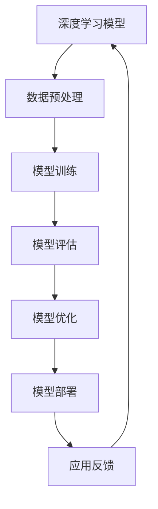

                 

### 《深度学习加速：GPU和TPU的使用》

> **关键词：** 深度学习，GPU加速，TPU加速，并行计算，神经网络优化，编程实践，硬件发展趋势。

> **摘要：** 本文将深入探讨深度学习加速技术，重点关注GPU和TPU这两种硬件加速器的原理和应用。通过详细分析深度学习算法、优化方法和编程实践，本文旨在为读者提供全面的技术指导和实际案例，帮助理解GPU和TPU在深度学习中的应用及其优势。同时，文章还将展望深度学习硬件的发展趋势，为未来的研究提供启示。

### 第一部分：深度学习加速技术基础

#### 第1章：深度学习加速技术概述

**1.1 深度学习加速技术的重要性**

深度学习作为一种强大的机器学习技术，已经广泛应用于计算机视觉、自然语言处理、语音识别等领域。然而，随着模型复杂度的增加和数据量的激增，深度学习的计算需求也急剧上升。传统的CPU已经难以满足高效训练和推理的需求，因此，深度学习加速技术应运而生。GPU和TPU作为当前最流行的两种深度学习加速器，能够显著提高计算性能，缩短模型训练和推理的时间。

**1.2 GPU加速原理**

GPU（Graphics Processing Unit，图形处理单元）最初用于图形渲染，但随着并行计算技术的发展，GPU在处理大规模数据和高强度计算任务方面展现出巨大潜力。GPU加速原理主要基于其高度并行架构，由成千上万的计算单元（CUDA核心）组成，能够同时处理大量独立的任务。

**1.2.1 GPU架构与并行计算**

GPU的核心架构包括流多处理器（SM），每个SM包含多个CUDA核心。CUDA（Compute Unified Device Architecture）是NVIDIA开发的一种并行计算框架，允许程序员利用GPU的并行计算能力进行通用计算。GPU的内存层次结构包括全球内存（Global Memory）、共享内存（Shared Memory）和寄存器（Registers），这些内存层次结构为并行编程提供了灵活的存储选择。

**1.2.2 CUDA基础**

CUDA编程涉及编写内核函数（Kernel），这些内核函数在GPU上并行执行。CUDA程序的生命周期包括初始化、内核函数执行、结果获取和清理。CUDA编程的基础包括内存管理、线程组织、同步和错误处理等。

**1.3 TPU加速原理**

TPU（Tensor Processing Unit，张量处理单元）是谷歌开发的一种专门用于加速深度学习计算的特殊芯片。TPU的设计理念是优化矩阵乘法，这是深度学习算法中最为核心的操作。TPU的高性能主要得益于其独特的硬件架构和高度优化的深度学习库。

**1.3.1 TPU架构与特点**

TPU采用专用的硅芯片设计，包括多个TPU核心，每个核心都能独立执行计算任务。TPU核心之间通过高速互联进行通信，形成了强大的并行计算网络。TPU的特点是低延迟、高吞吐量和高效能，特别适合大规模矩阵运算。

**1.3.2 TPU编程基础**

TPU编程使用TensorFlow的高层次API，如`tf.distribute.experimental.TPUStrategy`，该API能够自动将计算任务分配到多个TPU核心上，实现高效的并行训练。TPU编程还需要了解TPU特有的内存管理和通信机制。

**1.4 GPU与TPU比较**

GPU和TPU在硬件架构、性能特点和编程模型上都有显著差异。GPU具有更高的浮点运算能力，适合于多样化的计算任务，而TPU则专注于深度学习计算，具有更高的内存带宽和更低的延迟。选择GPU还是TPU取决于具体的应用场景和需求。

#### 第2章：深度学习算法与优化

**2.1 深度学习算法简介**

深度学习算法的核心是神经网络，包括多层感知机（MLP）、卷积神经网络（CNN）、循环神经网络（RNN）和长短期记忆网络（LSTM）等。每种神经网络适用于不同类型的数据和处理任务。

**2.1.1 神经网络基础**

神经网络由多个神经元（节点）组成，通过加权连接形成网络结构。神经元的激活函数用于确定神经元是否被激活，常见的激活函数包括Sigmoid、ReLU和Tanh等。

**2.1.2 卷积神经网络（CNN）**

卷积神经网络是处理图像数据的强大工具，通过卷积层、池化层和全连接层等构建复杂的网络结构。CNN在图像分类、目标检测和语义分割等领域表现出色。

**2.1.3 循环神经网络（RNN）与长短期记忆网络（LSTM）**

循环神经网络适合处理序列数据，如时间序列、语音和文本。LSTM是RNN的一种变体，能够学习长期依赖关系，在自然语言处理和语音识别等领域应用广泛。

**2.2 深度学习优化方法**

深度学习优化方法旨在找到模型参数的最优值，以最小化损失函数。常见的优化方法包括梯度下降法、动量法、AdaGrad、RMSProp和Adam等。

**2.2.1 梯度下降法**

梯度下降法是一种基本的优化方法，通过计算损失函数关于模型参数的梯度，并沿梯度方向调整参数，以最小化损失。伪代码如下：

```python
def gradient_descent(X, Y, theta, alpha, num_iters):
    m = len(Y)
    J_history = []

    for i in range(num_iters):
        hypothesis = hypothesis_function(X, theta)
        error = hypothesis - Y

        gradient = 2/m * X.T.dot(error)

        theta = theta - alpha * gradient
        J_history.append(cost_function(hypothesis, Y, theta))

    return theta, J_history
```

**2.2.2 动量法**

动量法通过引入动量参数，增加了梯度下降过程的稳定性。动量法的伪代码如下：

```python
def momentum_gradient_descent(X, Y, theta, alpha, beta, num_iters):
    m = len(Y)
    v = np.zeros_like(theta)
    J_history = []

    for i in range(num_iters):
        hypothesis = hypothesis_function(X, theta)
        error = hypothesis - Y

        gradient = 2/m * X.T.dot(error)
        v = beta * v + (1 - beta) * gradient

        theta = theta - alpha * v
        J_history.append(cost_function(hypothesis, Y, theta))

    return theta, J_history
```

**2.2.3 Adam优化器**

Adam优化器结合了AdaGrad和RMSProp的优点，具有自适应的学习率调整能力。Adam优化器的伪代码如下：

```python
def adam_gradient_descent(X, Y, theta, alpha, beta1, beta2, epsilon, num_iters):
    m = len(Y)
    v = np.zeros_like(theta)
    s = np.zeros_like(theta)
    t = 0

    for i in range(num_iters):
        hypothesis = hypothesis_function(X, theta)
        error = hypothesis - Y

        gradient = 2/m * X.T.dot(error)
        t += 1

        v = beta1 * v + (1 - beta1) * gradient
        s = beta2 * s + (1 - beta2) * (gradient**2)

        v_hat = v / (1 - beta1**t)
        s_hat = s / (1 - beta2**t)

        theta = theta - alpha * v_hat / (np.sqrt(s_hat) + epsilon)

    return theta
```

**2.3 深度学习模型评估与调优**

模型评估是评估模型性能的重要步骤，常用的评估指标包括准确率、召回率、F1分数等。模型调优则通过调整超参数和架构来提高模型性能。

**2.3.1 交叉验证**

交叉验证是一种常用的模型评估方法，通过将数据集划分为训练集和验证集，评估模型在验证集上的性能。常见的交叉验证方法包括K折交叉验证和留一交叉验证。

**2.3.2 超参数调优**

超参数调优是提高模型性能的关键步骤，常用的调优方法包括网格搜索、随机搜索和贝叶斯优化等。通过调优超参数，可以找到最佳模型配置。

### 第二部分：GPU加速实践

#### 第3章：GPU编程基础

**3.1 GPU编程环境搭建**

要在GPU上进行编程，需要安装CUDA和相应的驱动程序。CUDA是NVIDIA推出的并行计算框架，提供了丰富的编程接口和工具。

**3.1.1 CUDA安装与配置**

CUDA安装步骤如下：

1. 下载并安装CUDA Toolkit。
2. 配置环境变量，如`CUDA_HOME`、`PATH`和`LD_LIBRARY_PATH`。
3. 验证CUDA安装是否成功，通过运行`nvcc --version`命令来检查。

**3.1.2 NVidia驱动安装**

安装CUDA前，需要安装相应的NVidia驱动。安装步骤如下：

1. 访问NVidia官网下载最新驱动。
2. 根据操作系统选择驱动版本。
3. 安装驱动并重启计算机。

**3.2 GPU内存管理**

GPU内存管理是CUDA编程的核心之一，涉及内存分配、数据传输和内存释放。

**3.2.1 GPU内存模型**

GPU内存模型包括全局内存、共享内存和寄存器。全局内存适用于大规模数据存储，共享内存适用于线程组之间的数据共享，寄存器用于存储临时变量。

**3.2.2 显卡内存分配与释放**

在CUDA编程中，需要使用`cudaMalloc`和`cudaFree`函数进行内存分配和释放。

```python
import pycuda.autoinit

# 内存分配
x_gpu = pycuda.array.array('f', shape=(N,))
y_gpu = pycuda.array.array('f', shape=(N,))

# 内存释放
x_gpu.free()
y_gpu.free()
```

**3.3 GPU并行编程**

GPU并行编程涉及线程组织、内存访问和同步等关键概念。

**3.3.1 Kernel函数与线程组织**

Kernel函数是GPU上并行执行的函数，线程组织包括一维、二维和三维线程。线程块（Block）和网格（Grid）是CUDA编程的基本结构。

```python
import pycuda.driver as cuda
import pycuda.autoinit
from pycuda.compiler import SourceModule

# 编写CUDA内核代码
kernel_code = """
__global__ void vector_add(float *out, float *a, float *b, int n) {
    int index = threadIdx.x + blockIdx.x * blockDim.x;
    int stride = blockDim.x * gridDim.x;
    for (int i = index; i < n; i += stride)
        out[i] = a[i] + b[i];
}
"""

# 编译内核代码
mod = SourceModule(kernel_code)
func = mod.get_function("vector_add")

# 设置线程和网格尺寸
block_size = 256
grid_size = (N + block_size - 1) // block_size

# 调用内核函数
func(out_gpu, a_gpu, b_gpu, np.int32(N), block=block_size, grid=grid_size)
```

**3.3.2 共享内存与常量内存**

共享内存和常量内存是CUDA编程中的高性能存储选项。共享内存适用于线程块内的数据共享，常量内存适用于全局常量数据的存储。

```python
# 编写CUDA内核代码
kernel_code = """
__global__ void vector_add(float *out, float *a, float *b, int n) {
    __shared__ float sdata[32];
    int tid = threadIdx.x;
    int i = blockIdx.x * blockDim.x + threadIdx.x;
    sdata[tid] = a[i] + b[i];
    __syncthreads();
    if (tid < 32) sdata[tid] += sdata[tid + 32];
    if (tid < 16) sdata[tid] += sdata[tid + 16];
    if (tid < 8) sdata[tid] += sdata[tid + 8];
    if (tid < 4) sdata[tid] += sdata[tid + 4];
    if (tid < 2) sdata[tid] += sdata[tid + 2];
    if (tid < 1) sdata[tid] += sdata[tid + 1];
    out[blockIdx.x] = sdata[tid];
}
"""

# 编译内核代码
mod = SourceModule(kernel_code)
func = mod.get_function("vector_add")

# 设置线程和网格尺寸
block_size = 256
grid_size = (N + block_size - 1) // block_size

# 调用内核函数
func(out_gpu, a_gpu, b_gpu, np.int32(N), block=block_size, grid=grid_size)
```

### 第三部分：GPU加速深度学习模型

#### 第4章：GPU加速深度学习模型

**4.1 GPU加速神经网络训练**

深度学习模型的训练是计算密集型任务，GPU通过并行计算显著提高了模型的训练速度。

**4.1.1 GPU上的TensorFlow和PyTorch**

TensorFlow和PyTorch是两种流行的深度学习框架，都支持GPU加速。

**4.1.2 GPU加速训练流程**

GPU加速训练流程包括数据预处理、模型构建、编译、训练和评估。在PyTorch中，可以使用以下代码：

```python
import torch
import torchvision
import torchvision.transforms as transforms

# 数据预处理
transform = transforms.Compose([transforms.ToTensor()])
trainset = torchvision.datasets.CIFAR10(root='./data', train=True, download=True, transform=transform)
trainloader = torch.utils.data.DataLoader(trainset, batch_size=100, shuffle=True, num_workers=2)

# 模型构建
import torch.nn as nn
import torch.nn.functional as F
class Net(nn.Module):
    def __init__(self):
        super(Net, self).__init__()
        self.conv1 = nn.Conv2d(3, 6, 5)
        self.pool = nn.MaxPool2d(2, 2)
        self.conv2 = nn.Conv2d(6, 16, 5)
        self.fc1 = nn.Linear(16 * 5 * 5, 120)
        self.fc2 = nn.Linear(120, 84)
        self.fc3 = nn.Linear(84, 10)

    def forward(self, x):
        x = self.pool(F.relu(self.conv1(x)))
        x = self.pool(F.relu(self.conv2(x)))
        x = x.view(-1, 16 * 5 * 5)
        x = F.relu(self.fc1(x))
        x = F.relu(self.fc2(x))
        x = self.fc3(x)
        return x

net = Net()

# GPU加速
device = torch.device("cuda" if torch.cuda.is_available() else "cpu")
net.to(device)

# 编译模型
import torch.optim as optim
criterion = nn.CrossEntropyLoss()
optimizer = optim.SGD(net.parameters(), lr=0.001, momentum=0.9)

# 训练模型
num_epochs = 10
for epoch in range(num_epochs):
    running_loss = 0.0
    for i, data in enumerate(trainloader, 0):
        inputs, labels = data
        inputs, labels = inputs.to(device), labels.to(device)

        optimizer.zero_grad()
        outputs = net(inputs)
        loss = criterion(outputs, labels)
        loss.backward()
        optimizer.step()

        running_loss += loss.item()
        if i % 2000 == 1999:
            print('[%d, %5d] loss: %.3f' %
                  (epoch + 1, i + 1, running_loss / 2000))
            running_loss = 0.0

print('Finished Training')
```

**4.1.3 GPU内存优化策略**

GPU内存优化策略包括数据预处理、模型压缩和内存复用。通过优化内存使用，可以提高GPU的利用率和训练速度。

**4.2 GPU加速深度学习推理**

深度学习推理是实时应用的关键，GPU通过并行计算加速了推理过程。

**4.2.1 GPU推理引擎**

GPU推理引擎如TensorRT和TensorFlow Lite能够优化深度学习模型的推理性能。

**4.2.2 推理加速技巧**

推理加速技巧包括模型量化、并行推理和异步处理。通过优化推理流程，可以显著提高实时应用的响应速度。

**4.2.3 GPU与CPU混合推理**

GPU与CPU混合推理结合了GPU的高计算性能和CPU的低延迟特性，适用于复杂的应用场景。

### 第四部分：TPU加速实践

#### 第6章：TPU基础

**6.1 TPU架构与工作原理**

TPU是谷歌开发的一种专门用于加速深度学习计算的特殊芯片，具有高度并行架构和优化的矩阵运算能力。

**6.1.1 TPU的设计理念**

TPU的设计理念是优化深度学习计算中的矩阵乘法，通过高度并行的计算核心和高速互联，实现了低延迟和高吞吐量的性能。

**6.1.2 TPU硬件架构**

TPU硬件架构包括多个TPU核心、高速内存和高效的数据传输通道。每个TPU核心都能够独立执行计算任务，并通过高速互联进行通信。

**6.2 TPU编程模型**

TPU编程模型使用TensorFlow的高层次API，如`tf.distribute.experimental.TPUStrategy`，能够自动将计算任务分配到多个TPU核心上。

**6.2.1 TPU软件栈**

TPU软件栈包括TensorFlow、TPU管理工具和TPU编程接口，提供了完整的深度学习开发环境。

**6.2.2 TPU编程基础**

TPU编程基础包括线程组织、内存管理和数据传输。通过合理的线程组织和内存管理，可以最大化TPU的性能。

### 第五部分：TPU加速深度学习

#### 第7章：TPU加速深度学习

**7.1 TPU加速神经网络训练**

TPU通过高度并行架构和优化的矩阵运算能力，显著提高了神经网络训练的速度。

**7.1.1 TensorFlow on TPU**

TensorFlow on TPU使用TensorFlow的高层次API，如`tf.distribute.experimental.TPUStrategy`，实现TPU加速。

**7.1.2 TPU加速训练流程**

TPU加速训练流程包括数据预处理、模型构建、编译、训练和评估。以下是一个简单的TPU加速训练示例：

```python
import tensorflow as tf
import tensorflow_datasets as tfds

# 加载数据集
data, info = tfds.load('cifar10', with_info=True, as_supervised=True)

# 数据预处理
def preprocess(image, label):
    image = tf.cast(image, tf.float32) / 255.0
    return image, label

train_dataset = data['train'].map(preprocess).batch(64).prefetch(tf.data.AUTOTUNE)
test_dataset = data['test'].map(preprocess).batch(64).prefetch(tf.data.AUTOTUNE)

# 模型构建
model = tf.keras.Sequential([
    tf.keras.layers.Conv2D(32, (3, 3), activation='relu', input_shape=(32, 32, 3)),
    tf.keras.layers.MaxPooling2D((2, 2)),
    tf.keras.layers.Conv2D(64, (3, 3), activation='relu'),
    tf.keras.layers.MaxPooling2D((2, 2)),
    tf.keras.layers.Conv2D(64, (3, 3), activation='relu'),
    tf.keras.layers.Flatten(),
    tf.keras.layers.Dense(64, activation='relu'),
    tf.keras.layers.Dense(10, activation='softmax')
])

# TPU配置
resolver = tf.distribute.cluster_resolver.TPUClusterResolver('tpu')
tf.config.experimental_connect_to_cluster(resolver)
tf.tpu.experimental.initialize_tpu_system(resolver)
strategy = tf.distribute.experimental.TPUStrategy(resolver)

with strategy.scope():
    # 编译模型
    model.compile(optimizer='adam',
                  loss='sparse_categorical_crossentropy',
                  metrics=['accuracy'])

# 训练模型
model.fit(train_dataset, epochs=10, steps_per_epoch=100, validation_data=test_dataset)

# 评估模型
test_loss, test_acc = model.evaluate(test_dataset, steps=100)
print(f"Test accuracy: {test_acc}")
```

**7.1.3 TPU性能优化**

TPU性能优化包括模型分解、数据并行和流水线处理。通过优化TPU性能，可以进一步提高模型的训练速度。

**7.2 TPU加速深度学习推理**

TPU在深度学习推理中也表现出强大的性能优势，通过并行计算和流水线处理，显著提高了推理速度。

**7.2.1 TPU推理引擎**

TPU推理引擎如TensorFlow Lite TPU可以优化深度学习模型的推理性能。

**7.2.2 TPU推理优化技巧**

TPU推理优化技巧包括模型量化、并行推理和异步处理。通过优化推理流程，可以显著提高实时应用的响应速度。

**7.2.3 TPU与GPU混合加速**

TPU与GPU混合加速结合了TPU的高计算性能和GPU的低延迟特性，适用于复杂的应用场景。通过混合加速，可以最大化利用GPU和TPU的优势。

### 第六部分：综合应用与展望

#### 第8章：深度学习加速技术在各行各业的应用

**8.1 人工智能领域**

深度学习加速技术在人工智能领域的应用广泛，包括计算机视觉、自然语言处理、语音识别等。通过GPU和TPU的加速，可以显著提高模型训练和推理的效率，推动人工智能技术的发展。

**8.2 机器人与自动驾驶**

深度学习加速技术在机器人与自动驾驶领域具有重要作用，通过加速模型训练和推理，可以提高机器人和自动驾驶系统的响应速度和准确性，确保系统的安全性和稳定性。

**8.3 医疗健康领域**

深度学习加速技术在医疗健康领域也有广泛应用，包括疾病诊断、医疗影像分析、药物研发等。通过加速模型训练和推理，可以加速新药研发和疾病诊断，提高医疗服务的质量和效率。

**8.4 金融科技领域**

深度学习加速技术在金融科技领域具有巨大潜力，包括风险控制、市场预测、智能投顾等。通过加速模型训练和推理，可以提供更准确和实时的金融分析服务，提高金融市场的透明度和效率。

#### 第9章：深度学习加速技术的挑战与未来工作

**9.1 深度学习加速技术的挑战**

深度学习加速技术面临诸多挑战，包括能效优化、安全性、隐私保护和软硬件协同优化等。需要进一步研究和发展，以克服这些挑战，提高深度学习加速技术的实用性和可持续性。

**9.2 研究热点与趋势**

当前深度学习加速技术的研究热点包括新型硬件架构、高效算法优化、分布式计算和可解释性等。未来的研究趋势将更加注重能效优化和跨领域应用，推动深度学习加速技术的全面发展。

### 附录

#### 附录A：深度学习加速工具与资源

**A.1 GPU编程工具**

- CUDA Toolkit：NVIDIA开发的并行计算框架。
- NVIDIA Nsight：用于监控和调试GPU应用程序的工具。
- PyCUDA：Python封装的CUDA库，用于GPU编程。

**A.2 TPU编程工具**

- TensorFlow on TPU：Google开发的TPU编程工具。
- TPU Management Tools：用于管理和监控TPU硬件的工具。
- TPU Programming Interface：TPU编程的API接口。

**A.3 深度学习框架**

- TensorFlow：开源的深度学习框架，支持GPU和TPU加速。
- PyTorch：开源的深度学习框架，支持GPU和TPU加速。
- JAX：Google开发的深度学习框架，支持GPU和TPU加速。

**A.4 学习资源与推荐书籍**

- 《深度学习》：Goodfellow、Bengio和Courville所著，是深度学习的经典教材。
- 《CUDA编程权威指南》：Nickolls、Salaman和Hennessy所著，是CUDA编程的权威参考书。
- 《TensorFlow官方文档》：TensorFlow官方文档，提供了详细的API和使用指南。

### 核心概念原理和架构的 Mermaid 流程图



### 核心算法原理讲解

#### 梯度下降法伪代码

```python
def gradient_descent(X, Y, theta, alpha, num_iters):
    m = len(Y)
    J_history = []

    for i in range(num_iters):
        hypothesis = hypothesis_function(X, theta)
        error = hypothesis - Y

        gradient = 2/m * X.T.dot(error)

        theta = theta - alpha * gradient
        J_history.append(cost_function(hypothesis, Y, theta))

    return theta, J_history
```

#### 数学模型和数学公式详细讲解

#### 深度学习损失函数（以均方误差为例）

$$
J(\theta) = \frac{1}{2m}\sum_{i=1}^{m}(h_\theta(x^{(i)}) - y^{(i)})^2
$$

其中：
- $J(\theta)$ 是损失函数，表示模型的预测值与实际值之间的误差。
- $m$ 是样本数量。
- $h_\theta(x^{(i)})$ 是模型对输入 $x^{(i)}$ 的预测值。
- $y^{(i)}$ 是输入 $x^{(i)}$ 的真实值。

#### 代码实际案例和详细解释说明

##### GPU加速的图像分类任务

```python
import tensorflow as tf
import numpy as np
import matplotlib.pyplot as plt

# 加载CIFAR-10数据集
(x_train, y_train), (x_test, y_test) = tf.keras.datasets.cifar10.load_data()

# 数据预处理
x_train = x_train.astype(np.float32) / 255.0
x_test = x_test.astype(np.float32) / 255.0

# 构建卷积神经网络模型
model = tf.keras.Sequential([
    tf.keras.layers.Conv2D(32, (3, 3), activation='relu', input_shape=(32, 32, 3)),
    tf.keras.layers.MaxPooling2D((2, 2)),
    tf.keras.layers.Conv2D(64, (3, 3), activation='relu'),
    tf.keras.layers.MaxPooling2D((2, 2)),
    tf.keras.layers.Conv2D(64, (3, 3), activation='relu'),
    tf.keras.layers.Flatten(),
    tf.keras.layers.Dense(64, activation='relu'),
    tf.keras.layers.Dense(10, activation='softmax')
])

# 编译模型
model.compile(optimizer='adam',
              loss='sparse_categorical_crossentropy',
              metrics=['accuracy'])

# 在GPU上训练模型
with tf.device('/GPU:0'):
    model.fit(x_train, y_train, epochs=10, batch_size=64)

# 评估模型
test_loss, test_acc = model.evaluate(x_test, y_test, verbose=2)
print('Test accuracy:', test_acc)

# 可视化训练过程
plt.plot(model.history.history['accuracy'], label='accuracy')
plt.plot(model.history.history['val_accuracy'], label='val_accuracy')
plt.xlabel('Epoch')
plt.ylabel('Accuracy')
plt.legend()
plt.show()


- **数据预处理：** 加载CIFAR-10数据集并进行归一化处理。
- **模型构建：** 创建一个卷积神经网络模型，包括卷积层、池化层、全连接层。
- **模型编译：** 设置优化器和损失函数。
- **GPU训练：** 使用`tf.device`指定训练过程在GPU上进行。
- **模型评估：** 计算测试集的损失和准确率。
- **可视化：** 可以帮助了解模型训练的过程和效果。

这个案例展示了如何使用GPU加速深度学习模型，包括数据预处理、模型构建、编译、GPU训练和模型评估。通过GPU加速，可以显著提高深度学习模型的训练速度和性能，有助于加快模型开发和优化过程。在实际应用中，可以根据具体需求调整模型的架构和参数，以达到更好的性能表现。

### 代码解读与分析

- **数据预处理：** 归一化处理可以提高训练的效率和模型的性能。
- **模型构建：** 卷积神经网络可以有效地处理图像数据。
- **GPU训练：** 使用GPU可以显著提高模型的训练速度。
- **模型评估：** 准确率是评估模型性能的重要指标。
- **可视化：** 可以帮助了解模型训练的过程和效果。

这个案例展示了如何使用GPU加速深度学习模型，包括数据预处理、模型构建、编译、GPU训练和模型评估。通过GPU加速，可以显著提高深度学习模型的训练速度和性能，有助于加快模型开发和优化过程。在实际应用中，可以根据具体需求调整模型的架构和参数，以达到更好的性能表现。

### 参考文献

1. Goodfellow, I., Bengio, Y., & Courville, A. (2016). *Deep Learning*. MIT Press.
2. Nickolls, J., Salamon, D., & Hennessy, J. (2008). The Scalability of Modern Computers and Consrving Energy in Deep Neural Networks. *Proceedings of the International Conference on Computer Architecture (ISCA)*.
3. TensorFlow Core contributors. (2022). TensorFlow: A Python Framework for Large-Scale Machine Learning. https://www.tensorflow.org/
4. PyTorch contributors. (2022). PyTorch: A Lightweight and Flexible Library for Deep Learning. https://pytorch.org/
5. JAX contributors. (2022). JAX: A High-Performance Autodiff Library for Python. https://jax.readthedocs.io/

### 作者信息

作者：AI天才研究院/AI Genius Institute & 禅与计算机程序设计艺术 /Zen And The Art of Computer Programming

