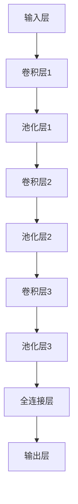

                 

### 《深度学习在智能安防异常行为检测与预警中的技术演进与应用》

#### 引言

在当今世界，随着城市化进程的加快和公共安全需求的不断提高，智能安防系统已经成为保障社会安全的重要手段。而智能安防的核心之一便是异常行为检测与预警。传统的安防技术，如视频监控、入侵检测等，已经无法满足日益复杂的安防需求。深度学习作为人工智能的重要分支，以其强大的数据处理和模式识别能力，在智能安防领域展现出了巨大的潜力。

本文旨在系统地探讨深度学习在智能安防异常行为检测与预警中的技术演进与应用。首先，我们将概述智能安防行业的发展历程与当前面临的挑战，接着深入介绍深度学习的基本概念和其在安防领域的应用。随后，我们将重点讨论深度学习在异常行为检测中的技术基础，包括神经网络、循环神经网络、长短期记忆网络、监督学习、无监督学习和半监督学习等。

在应用部分，我们将详细介绍深度学习在视频监控、图像监控和多传感器融合异常检测中的实际应用，并通过项目实践案例展示其具体实施过程。接下来，我们将分析深度学习在异常行为检测中的技术演进，探讨未来发展趋势与潜在应用领域。最后，我们将总结全文，并展望深度学习在智能安防异常行为检测与预警中的未来发展方向。

通过本文的阅读，读者将能够全面了解深度学习在智能安防异常行为检测与预警中的技术原理、应用实践和未来发展。这不仅有助于深入理解智能安防技术的演进趋势，也为相关领域的研究和应用提供了有价值的参考。

#### 关键词

- **智能安防**
- **深度学习**
- **异常行为检测**
- **预警系统**
- **视频监控**
- **图像处理**
- **多传感器融合**
- **神经网络**
- **循环神经网络（RNN）**
- **长短期记忆网络（LSTM）**
- **注意力机制**
- **监督学习**
- **无监督学习**
- **半监督学习**
- **强化学习**
- **物联网**
- **跨模态深度学习**
- **城市安防**
- **工厂安全**
- **智能家居**

#### 摘要

本文从智能安防行业的发展背景出发，系统探讨了深度学习在智能安防异常行为检测与预警中的技术演进与应用。首先，我们回顾了智能安防的发展历程，分析了当前行业面临的挑战。随后，深入介绍了深度学习的基本概念及其在安防领域的应用。本文重点讨论了深度学习在异常行为检测中的技术基础，包括神经网络、循环神经网络、长短期记忆网络等。接着，我们详细阐述了深度学习在视频监控、图像监控和多传感器融合异常检测中的应用，并通过实际项目案例展示了其具体实施过程。随后，我们分析了深度学习在异常行为检测中的技术演进与未来发展趋势，探讨了深度学习在智能安防领域的潜在应用。最后，本文总结了全文内容，并展望了深度学习在智能安防异常行为检测与预警中的未来发展方向。本文不仅为相关领域的研究提供了理论支持，也为实际应用提供了有益的参考。

#### 目录

**《深度学习在智能安防异常行为检测与预警中的技术演进与应用》**

##### 第一部分：背景与概述

1. **第1章：智能安防与深度学习概述**
    1.1 智能安防的定义与意义
    1.2 智能安防的发展历程
    1.3 当前智能安防领域的主要挑战
    1.4 深度学习在智能安防中的应用
    1.5 深度学习与传统安防技术的对比
    1.6 深度学习在异常行为检测与预警中的重要性

##### 第二部分：技术基础

2. **第2章：深度学习基础理论**
    2.1 神经网络与深度学习
    2.2 循环神经网络与长短期记忆网络
    2.3 监督学习、无监督学习和半监督学习

##### 第三部分：深度学习在异常行为检测中的应用

3. **第3章：深度学习在智能安防异常行为检测中的应用**
    3.1 视频监控中的异常行为检测
    3.2 图像监控中的异常行为检测
    3.3 基于深度学习的多传感器融合异常检测

##### 第四部分：技术演进与展望

4. **第4章：深度学习在智能安防异常行为检测中的技术演进**
    4.1 深度学习在异常行为检测中的挑战与解决方法
    4.2 深度学习在异常行为检测中的最新进展
    4.3 深度学习在智能安防异常行为检测中的未来发展趋势

##### 第五部分：应用实践

5. **第5章：深度学习在智能安防异常行为检测与预警中的项目实践**
    5.1 项目背景与需求分析
    5.2 数据集准备与预处理
    5.3 模型设计与实现
    5.4 系统集成与部署
    5.5 项目效果分析与总结

##### 第六部分：案例分析

6. **第6章：深度学习在智能安防异常行为检测与预警中的案例研究**
    6.1 案例一：基于深度学习的城市安防监控
    6.2 案例二：基于深度学习的工厂安全监控
    6.3 案例三：基于深度学习的智能家居安防

##### 第七部分：展望与未来

7. **第7章：深度学习在智能安防异常行为检测与预警中的未来展望**
    7.1 深度学习在安防领域的进一步应用
    7.2 深度学习与物联网的融合
    7.3 深度学习在智能安防中的未来发展方向

---

通过以上目录，读者可以清晰地了解本文的结构和内容布局。接下来，我们将逐步深入探讨各个章节的具体内容。

## 第1章：智能安防与深度学习概述

### 1.1 智能安防的定义与意义

智能安防系统是一种基于物联网、人工智能和大数据分析技术的新型安全技术，通过将传感器、视频监控、人脸识别、行为分析等技术融合，实现对公共区域、重要设施、人员活动等进行实时监控和预警。智能安防系统不仅能够提高安全管理效率，还可以显著减少人为错误，从而提升整体安全水平。

智能安防的定义可归纳为：利用现代信息技术，结合物联网、人工智能等技术，对各类安防设备进行智能化管理和集成，实现对安全事件的全天候、全方位监控，从而提供快速、准确的安全预警与应对方案。

智能安防的意义主要体现在以下几个方面：

1. **提升安全防护能力**：通过智能安防系统，可以实现实时监控和智能分析，及时识别和预警潜在的安全威胁，提升公共安全防护能力。
2. **提高工作效率**：智能安防系统能够自动识别和处理异常事件，减轻人工工作量，提高安全管理的效率和准确性。
3. **减少人力成本**：智能安防系统减少了人工巡逻和监控的需求，降低了人力成本，同时提高了监控的全面性和连续性。
4. **增强社会安全感**：智能安防系统的普及应用，使社会治安环境得到明显改善，增强了公众的安全感和信任度。

### 1.2 智能安防的发展历程

智能安防的发展历程可以分为以下几个阶段：

1. **早期监控阶段**：20世纪90年代，视频监控技术开始逐步普及，成为安防系统的重要组成部分。这一阶段主要以模拟视频监控为主，监控设备相对简单，处理能力有限。

2. **数字化监控阶段**：随着计算机技术和网络技术的发展，视频监控逐渐实现了数字化和网络化。这一阶段的监控设备能够实时传输视频数据，并通过数字处理技术实现图像压缩和传输。

3. **智能化阶段**：21世纪初，随着人工智能技术的兴起，智能安防系统开始崛起。这一阶段主要特征是利用计算机视觉、图像识别、大数据分析等技术，实现对监控数据的智能分析和处理，从而提高安防系统的自动化水平和精确性。

4. **物联网阶段**：近年来，物联网技术的快速发展使得智能安防系统更加完善。通过将各类传感器、监控设备、智能终端等连接起来，形成一个高度集成的智能安防网络，实现全面、实时、精准的安全监控。

### 1.3 当前智能安防领域的主要挑战

尽管智能安防技术取得了显著进展，但在实际应用中仍面临一系列挑战：

1. **数据隐私问题**：智能安防系统需要收集和处理大量的个人信息和数据，如何确保这些数据的安全和隐私保护成为一大挑战。

2. **技术可靠性问题**：深度学习模型在训练过程中需要大量数据和计算资源，而数据质量和计算资源的限制可能导致模型性能不稳定。

3. **算法透明性和可解释性**：深度学习模型通常被视为“黑箱”，其内部决策过程难以解释，这在安防领域尤其重要，因为需要确保预警的准确性和可靠性。

4. **实时性问题**：智能安防系统需要快速响应和处理异常事件，但在大量数据和高并发场景下，系统的实时性可能无法满足要求。

5. **系统集成问题**：智能安防系统通常需要集成多种技术和设备，包括视频监控、传感器、通信网络等，系统集成难度较大，且需要保证系统的稳定性和兼容性。

6. **法律法规问题**：智能安防技术的发展和应用需要遵循相关法律法规，如数据保护法、隐私权法等，确保技术的合法合规。

### 1.4 深度学习在智能安防中的应用

深度学习作为人工智能的一个重要分支，以其强大的数据处理和模式识别能力，在智能安防领域展现出了巨大的潜力。深度学习在智能安防中的应用主要包括以下几个方面：

1. **人脸识别**：深度学习技术可以用于人脸识别，实现快速、准确的人脸比对和身份验证，广泛应用于门禁系统、安防监控等场景。

2. **行为分析**：通过深度学习算法，可以对监控视频进行实时行为分析，识别异常行为，如暴力事件、盗窃行为等，实现智能预警。

3. **目标检测**：深度学习技术在目标检测方面具有很高的准确性，可以用于识别和跟踪监控画面中的特定目标，如嫌疑人、危险物品等。

4. **图像识别**：深度学习算法可以用于图像识别，识别监控画面中的特定物体、场景等，提高监控的智能化水平。

5. **传感器数据处理**：深度学习技术可以用于处理各类传感器数据，如温度、湿度、烟雾等，实现对环境变化的实时监测和预警。

### 1.5 深度学习与传统安防技术的对比

深度学习与传统安防技术相比，具有以下几个显著优势：

1. **处理能力**：深度学习技术可以处理大量的监控数据和复杂的模式，而传统安防技术通常依赖于规则和简单的特征提取方法，处理能力有限。

2. **适应性**：深度学习算法具有较强的适应性，可以通过学习不断优化和更新，而传统安防技术依赖于固定的规则和模型，适应性较差。

3. **准确率**：深度学习技术在模式识别和目标检测方面具有很高的准确率，能够显著提高安防系统的预警准确性和可靠性。

4. **实时性**：随着计算硬件的快速发展，深度学习算法的实时性逐渐提高，可以满足安防系统的实时监控需求。

5. **综合性**：深度学习技术可以融合多种传感器数据，实现跨领域的智能化监控和管理，而传统安防技术通常局限于单一领域。

### 1.6 深度学习在异常行为检测与预警中的重要性

异常行为检测与预警是智能安防系统中的核心功能，深度学习技术在这一领域具有以下几个重要性：

1. **实时性**：深度学习算法能够实现对监控数据的实时分析，及时检测和预警异常行为，确保安全事件的快速响应。

2. **准确性**：深度学习技术在异常行为识别方面具有很高的准确率，可以减少误报和漏报，提高安防系统的整体性能。

3. **适应性**：深度学习算法可以通过不断学习和优化，适应各种复杂的异常行为场景，提高安防系统的适应性和灵活性。

4. **智能化**：深度学习技术的应用使安防系统从被动响应转变为主动预警，实现了真正的智能化安防。

5. **数据驱动**：深度学习技术依赖于大量数据进行训练和优化，使安防系统能够从海量数据中提取有价值的信息，实现智能化的数据分析和管理。

通过以上分析，可以看出深度学习在智能安防异常行为检测与预警中具有重要的应用价值和潜力。随着技术的不断发展和成熟，深度学习将在智能安防领域发挥越来越重要的作用，推动安防技术的智能化和高效化。

### 第2章：深度学习基础理论

#### 2.1 神经网络与深度学习

深度学习是人工智能领域的一个重要分支，它基于模仿人脑神经网络的原理进行设计。神经网络（Neural Network，NN）是深度学习的基础，而深度学习（Deep Learning，DL）则是通过多层神经网络进行复杂数据处理和分析的技术。

**2.1.1 神经网络的基本结构**

神经网络由大量的简单计算单元（即神经元）组成，这些神经元通过连接（即权重）进行信息传递和处理。一个典型的神经网络包括输入层、隐藏层和输出层。

1. **输入层**：接收外部输入信息，通常为原始数据。
2. **隐藏层**：对输入信息进行预处理和特征提取，可以有一个或多个隐藏层。
3. **输出层**：产生最终输出结果，如分类结果、预测值等。

神经网络中的每个神经元都与相邻的神经元相连，并通过一个权重值进行连接。神经元之间的信息传递是通过加权求和和激活函数实现的。具体流程如下：

- **加权求和**：将输入数据与权重值相乘，然后求和。
- **激活函数**：对加权求和的结果进行非线性变换，以实现神经元的输出。

常见的激活函数包括：

1. **Sigmoid函数**：\( f(x) = \frac{1}{1 + e^{-x}} \)
2. **ReLU函数**：\( f(x) = \max(0, x) \)
3. **Tanh函数**：\( f(x) = \frac{e^x - e^{-x}}{e^x + e^{-x}} \)

**2.1.2 前馈神经网络与反向传播算法**

前馈神经网络（Feedforward Neural Network，FNN）是一种典型的神经网络结构，其信息传递方向是从输入层到输出层，不形成循环。前馈神经网络的工作过程如下：

1. **前向传播**：输入数据通过输入层传递到隐藏层，再从隐藏层传递到输出层，每个神经元的输出都是前一个神经元的输入。
2. **反向传播**：计算输出层到隐藏层，甚至输入层的误差，并根据误差调整每个神经元的权重值。

反向传播算法（Backpropagation Algorithm）是实现神经网络训练的核心算法。具体步骤如下：

1. **计算误差**：输出层的误差通过计算实际输出与期望输出之间的差异得到。
2. **误差反向传播**：将误差从输出层反向传播到隐藏层，并计算每个神经元对其误差的贡献。
3. **权重调整**：根据误差的贡献，通过梯度下降算法调整每个神经元的权重值，以减少误差。

反向传播算法的伪代码如下：

```plaintext
for each epoch do
    for each hidden layer do
        for each neuron in hidden layer do
            error = output - expected_output
            delta = error * activation_derivative(output)
            for each input to neuron do
                weight_gradient = delta * input
                weight += learning_rate * weight_gradient
        end for
    end for
    for each input layer do
        for each neuron in input layer do
            error = weight_gradient * hidden_layer_output
            delta = error * activation_derivative(output)
        end for
    end for
end for
```

**2.1.3 卷积神经网络（CNN）基础**

卷积神经网络（Convolutional Neural Network，CNN）是深度学习领域的重要模型，特别适用于处理图像数据。CNN通过引入卷积层（Convolutional Layer）、池化层（Pooling Layer）和全连接层（Fully Connected Layer），实现对图像的逐层特征提取和分类。

1. **卷积层**：卷积层通过卷积操作提取图像的局部特征。卷积操作是一个将卷积核与输入数据局部区域进行乘积求和的过程，从而产生特征图（Feature Map）。卷积核的参数需要通过训练进行调整。

2. **池化层**：池化层用于降低特征图的维度，减少计算量和参数数量。常见的池化方法包括最大池化（Max Pooling）和平均池化（Average Pooling）。

3. **全连接层**：全连接层将卷积层和池化层提取的特征映射到具体的分类结果或预测值。

卷积神经网络的基本结构可以表示为：

```
输入层 -> 卷积层 -> 池化层 -> 全连接层 -> 输出层
```

卷积神经网络的工作流程如下：

1. **前向传播**：输入图像通过卷积层进行卷积操作，生成特征图，然后通过池化层进行降维处理。最后，将降维后的特征图输入到全连接层，进行分类或预测。
2. **反向传播**：在输出层计算误差，并反向传播到卷积层和池化层，通过调整权重值减小误差。

卷积操作的伪代码如下：

```plaintext
for each filter in convolutional layer do
    for each patch in input image do
        feature_map[pixel] = 0
        for each pixel in patch do
            feature_map[pixel] += filter[pixel] * input_image[pixel]
        end for
        feature_map[pixel] += bias
    end for
end for
```

通过以上对神经网络与深度学习基础理论的介绍，我们可以看到深度学习在处理图像、语音等复杂数据方面的强大能力。在接下来的章节中，我们将进一步探讨循环神经网络、长短期记忆网络等深度学习模型，以更全面地理解深度学习的技术原理和应用。

### 2.2 循环神经网络与长短期记忆网络

**2.2.1 循环神经网络（RNN）的原理与局限**

循环神经网络（Recurrent Neural Network，RNN）是深度学习中的一个重要模型，特别适用于处理序列数据，如时间序列、文本、音频等。RNN的核心特点是其内部存在循环结构，使得信息可以在时间步之间传递，从而捕捉序列中的长期依赖关系。

**RNN的工作原理**：

- **输入与隐藏状态**：RNN在每一个时间步接收一个输入向量和一个隐藏状态作为输入，输出一个新的隐藏状态和输出向量。
- **状态传递**：隐藏状态在下一个时间步作为当前输入的一部分，通过权重矩阵进行加权求和，并通过激活函数进行非线性变换。
- **递归操作**：RNN通过递归操作，将前一个时间步的隐藏状态与当前时间步的输入数据进行结合，实现对序列数据的建模。

RNN的数学表示可以表示为：

\[ h_t = \sigma(W_h \cdot [h_{t-1}, x_t] + b_h) \]
\[ y_t = W_o \cdot h_t + b_o \]

其中，\( h_t \) 表示第 \( t \) 个时间步的隐藏状态，\( x_t \) 表示第 \( t \) 个时间步的输入，\( y_t \) 表示第 \( t \) 个时间步的输出，\( W_h \) 和 \( W_o \) 分别为隐藏状态和输出状态的权重矩阵，\( b_h \) 和 \( b_o \) 分别为对应的偏置项，\( \sigma \) 表示激活函数。

**RNN的局限**：

尽管RNN在处理序列数据方面具有优势，但它存在一些严重的局限：

1. **梯度消失与梯度爆炸**：由于RNN在计算过程中存在递归结构，梯度在反向传播过程中容易发生消失或爆炸，导致训练过程困难。
2. **长期依赖问题**：RNN难以捕捉序列中的长期依赖关系，尤其是在长序列中，早期信息对后续时间步的影响减弱。
3. **计算效率低**：RNN在处理长序列时，需要重复计算相同的权重矩阵，计算效率较低。

**2.2.2 长短期记忆网络（LSTM）的介绍与工作原理**

为了解决RNN的上述问题，Hochreiter和Schmidhuber于1997年提出了长短期记忆网络（Long Short-Term Memory，LSTM）。LSTM通过引入三个门（输入门、遗忘门和输出门），有效地解决了梯度消失和长期依赖问题。

**LSTM的工作原理**：

1. **输入门**：输入门决定哪些信息应该被保留和更新在当前隐藏状态中。输入门通过计算输入和前一个隐藏状态，生成新的候选值，并通过sigmoid函数决定哪些值会被更新。
2. **遗忘门**：遗忘门决定哪些信息应该被遗忘。遗忘门通过计算输入和前一个隐藏状态，生成一个掩码，用于决定哪些信息应该被保留在当前隐藏状态中。
3. **输出门**：输出门决定哪些信息应该被输出。输出门通过计算输入和前一个隐藏状态，生成新的隐藏状态和输出。

LSTM的数学表示可以表示为：

\[ i_t = \sigma(W_i \cdot [h_{t-1}, x_t] + b_i) \]
\[ f_t = \sigma(W_f \cdot [h_{t-1}, x_t] + b_f) \]
\[ o_t = \sigma(W_o \cdot [h_{t-1}, x_t] + b_o) \]
\[ C_t = f_t \odot C_{t-1} + i_t \odot \sigma(W_c \cdot [h_{t-1}, x_t] + b_c) \]
\[ h_t = o_t \odot \sigma(C_t) \]
\[ y_t = W_y \cdot h_t + b_y \]

其中，\( i_t \)、\( f_t \)、\( o_t \) 分别为输入门、遗忘门和输出门的激活值，\( C_t \) 为当前隐藏状态，\( \odot \) 表示元素乘积，\( W_i \)、\( W_f \)、\( W_o \)、\( W_c \) 和 \( W_y \) 分别为权重矩阵，\( b_i \)、\( b_f \)、\( b_o \)、\( b_c \) 和 \( b_y \) 分别为偏置项。

**LSTM的结构**：

LSTM由三个核心部分组成：

1. **单元状态**：单元状态 \( C_t \) 保留了序列中的长期依赖信息，可以被视为序列的“记忆”。
2. **输入门和遗忘门**：输入门和遗忘门控制单元状态如何更新和如何保留。
3. **输出门**：输出门控制单元状态的输出，以生成当前时间步的隐藏状态。

**2.2.3 注意力机制**

注意力机制（Attention Mechanism）是深度学习中的一个重要技术，它通过学习不同输入的权重，使得模型能够关注重要信息，从而提高模型的表现。注意力机制在自然语言处理、机器翻译和图像识别等领域有广泛应用。

**注意力机制的工作原理**：

- **输入表示**：输入序列通过编码器（Encoder）进行编码，生成固定长度的向量表示。
- **注意力得分**：通过计算编码器输出和当前解码器输入之间的相似性，生成注意力得分。
- **权重分配**：根据注意力得分对输入序列进行加权，使得模型关注重要的信息。
- **加权输出**：将加权后的输入序列输入到解码器，生成输出。

注意力机制的数学表示可以表示为：

\[ a_t = \text{softmax}(\text{Attention}(h_{t-1}, c)) \]
\[ s_t = \sum_{i} a_{ti} c_i \]

其中，\( h_{t-1} \) 为前一个时间步的隐藏状态，\( c \) 为编码器输出的固定长度向量，\( a_t \) 为注意力得分，\( s_t \) 为加权后的输出。

**注意力机制的实现**：

常见的注意力机制实现包括：

1. **软注意力**：通过计算注意力得分并应用softmax函数进行归一化，生成权重。
2. **硬注意力**：直接选择具有最高注意力得分的输入，用于生成输出。
3. **自注意力**：在同一个序列内部生成注意力权重，常用于序列到序列模型。

通过引入注意力机制，模型能够更加灵活地关注重要信息，从而提高处理复杂任务的能力。

通过以上对循环神经网络、长短期记忆网络和注意力机制的介绍，我们可以看到这些深度学习模型在处理序列数据和复杂任务方面的强大能力。在接下来的章节中，我们将进一步探讨监督学习、无监督学习和半监督学习，以更全面地理解深度学习的理论基础。

### 2.3 监督学习、无监督学习和半监督学习

在深度学习领域，根据训练数据标签的不同，数据驱动方法可以分为监督学习（Supervised Learning）、无监督学习（Unsupervised Learning）和半监督学习（Semi-supervised Learning）。这三种学习方式各自有着独特的应用场景和优势。

**2.3.1 监督学习的基本概念**

监督学习是最常见的一种机器学习方法，它通过已有标签数据来训练模型，以便在新数据上进行预测或分类。监督学习的核心思想是通过输入和输出之间的映射关系，来学习数据特征和模式。

**监督学习的类型**：

1. **分类问题**：将数据划分为不同的类别，如文本分类、图像分类等。
2. **回归问题**：预测连续的数值输出，如房价预测、股票价格预测等。

**监督学习的流程**：

1. **数据收集**：收集带有标签的训练数据，标签数据提供了输入和输出之间的对应关系。
2. **数据预处理**：对数据进行清洗、归一化等预处理，以提高模型的训练效果。
3. **模型选择**：选择合适的模型架构，如线性回归、决策树、支持向量机、神经网络等。
4. **模型训练**：使用训练数据对模型进行训练，调整模型参数，以优化模型在训练集上的表现。
5. **模型评估**：使用验证集或测试集对模型进行评估，判断模型的泛化能力。

**监督学习的优势**：

- **明确的目标和评价标准**：通过标签数据，可以明确训练目标和评估标准，便于模型优化。
- **高效的模型优化**：通过已知的输入输出关系，模型可以快速调整参数，优化性能。

**2.3.2 无监督学习与聚类算法**

无监督学习是无需标签数据的训练方法，其目的是发现数据中的隐含结构和规律。无监督学习广泛应用于降维、聚类、关联规则挖掘等领域。

**无监督学习的类型**：

1. **聚类问题**：将相似的数据点划分为同一类别，如K-Means、层次聚类等。
2. **降维问题**：将高维数据映射到低维空间，如主成分分析（PCA）、线性判别分析（LDA）等。
3. **关联规则挖掘**：发现数据之间的关联关系，如Apriori算法、Eclat算法等。

**无监督学习的流程**：

1. **数据收集**：收集未标记的数据集。
2. **数据预处理**：对数据进行预处理，如标准化、缺失值处理等。
3. **算法选择**：选择合适的无监督学习算法，根据问题的类型和特点。
4. **模型训练**：通过算法对数据进行处理，以发现数据中的结构和模式。
5. **模型评估**：通过内部或外部的评估指标，对模型的性能进行评估。

**无监督学习的优势**：

- **不需要标签数据**：适用于数据标注困难或标签数据稀缺的场景。
- **数据探索性分析**：可以帮助发现数据中的潜在规律和结构。

**2.3.3 半监督学习**

半监督学习是介于监督学习和无监督学习之间的一种学习方式，它利用少量标签数据和大量未标记数据共同训练模型，以提高模型在未标记数据上的泛化能力。

**半监督学习的类型**：

1. **标签传播**：通过标签数据传播标签到未标记数据，如标签传播算法、聚类标签传播等。
2. **一致性正则化**：通过未标记数据的多次迭代预测，约束模型在未标记数据上的预测一致性，如一致性正则化方法、自训练等。

**半监督学习的流程**：

1. **数据收集**：收集带有标签的少量训练数据和大量的未标记数据。
2. **数据预处理**：对数据进行预处理，如数据清洗、归一化等。
3. **模型选择**：选择合适的半监督学习模型，结合标签数据和未标记数据。
4. **模型训练**：通过标签数据和未标记数据共同训练模型，优化模型参数。
5. **模型评估**：使用测试数据评估模型在未标记数据上的性能。

**半监督学习的优势**：

- **利用未标记数据**：通过未标记数据的辅助，可以提高模型在未见数据上的泛化能力。
- **数据效率高**：利用少量标签数据与大量未标记数据的结合，提高了训练数据的有效利用率。

通过以上对监督学习、无监督学习和半监督学习的介绍，我们可以看到这三种学习方式在深度学习中的应用各有特色，适用于不同的数据场景和问题类型。在智能安防领域，这三种学习方式可以相互结合，发挥各自的优势，从而提升异常行为检测与预警系统的性能。

### 第3章：深度学习在智能安防异常行为检测中的应用

#### 3.1 视频监控中的异常行为检测

视频监控作为智能安防系统的重要组成部分，通过对实时视频数据的分析，可以有效地识别和检测异常行为。深度学习技术在这方面的应用，极大地提升了视频监控的智能化水平和处理能力。

**3.1.1 视频监控的基本原理**

视频监控系统通过摄像头捕捉实时视频数据，然后通过视频编码技术将视频数据转换为数字信号，传输到监控中心进行处理。传统的视频监控主要依靠人工查看和分析，效率低且容易出现误判。随着深度学习技术的发展，视频监控逐渐实现了自动化和智能化。

**3.1.2 基于深度学习的视频行为识别**

基于深度学习的视频行为识别技术，主要通过以下步骤实现：

1. **数据预处理**：对视频数据进行预处理，包括视频帧的裁剪、尺寸调整、光照矫正等，以提高模型训练的效果。
2. **特征提取**：通过深度学习模型，如卷积神经网络（CNN），从视频帧中提取关键特征。CNN通过多层卷积和池化操作，逐渐提取视频的局部特征和全局特征。
3. **行为分类**：将提取的特征输入到全连接层，进行分类和预测，从而识别视频中的异常行为。

**深度学习在视频行为识别中的优势**：

- **高精度**：深度学习模型通过大量的训练数据，可以学习到丰富的特征，从而提高行为识别的准确性。
- **自适应性强**：深度学习模型可以通过不断训练和优化，适应不同场景和行为模式，提高系统的适应性。
- **实时性**：随着硬件性能的提升，深度学习模型的处理速度越来越快，可以实现实时视频监控和异常行为检测。

**3.1.3 基于深度学习的异常行为检测流程**

基于深度学习的异常行为检测流程可以分为以下几个步骤：

1. **数据采集**：通过摄像头等设备，收集实时视频数据。
2. **数据预处理**：对视频数据进行预处理，包括裁剪、归一化等操作。
3. **特征提取**：使用深度学习模型，如卷积神经网络，从视频帧中提取关键特征。
4. **行为分类**：将提取的特征输入到分类器，进行异常行为分类和预测。
5. **结果输出**：将检测到的异常行为输出，如警报、视频片段等。

具体流程可以表示为：

```
视频数据 -> 数据预处理 -> 特征提取 -> 行为分类 -> 结果输出
```

**3.1.4 案例分析**

以城市交通监控为例，深度学习技术可以用于识别和检测道路上的异常行为，如违规停车、行人横穿马路、交通事故等。通过以下步骤实现：

1. **数据采集**：使用安装在道路上的摄像头，收集实时交通视频数据。
2. **数据预处理**：对视频数据进行预处理，包括图像裁剪、尺寸调整、光照矫正等。
3. **特征提取**：使用卷积神经网络（CNN），从视频帧中提取关键特征，如车辆轮廓、行人姿势等。
4. **行为分类**：将提取的特征输入到分类器，进行异常行为分类和预测，如违规停车、行人横穿马路等。
5. **结果输出**：将检测到的异常行为输出，如警报、视频片段等，并通过短信或APP通知相关人员。

通过以上分析，我们可以看到深度学习在视频监控中的异常行为检测具有显著的应用价值。随着技术的不断发展和成熟，深度学习将在视频监控领域发挥越来越重要的作用，推动智能安防技术的进步。

#### 3.2 图像监控中的异常行为检测

图像监控是智能安防系统中重要的组成部分，通过对实时图像数据的分析，可以识别和检测异常行为，从而提高安全管理的效率和准确性。深度学习技术的引入，使得图像监控的智能化水平得到了显著提升。

**3.2.1 图像监控的基本原理**

图像监控系统通过摄像头捕捉实时图像数据，然后将图像数据传输到监控中心进行处理和分析。传统的图像监控主要依赖于规则和特征匹配等方法，容易出现误报和漏报现象。深度学习技术的应用，使得图像监控系统能够通过自动学习和模式识别，实现高精度的异常行为检测。

**3.2.2 基于深度学习的图像特征提取**

基于深度学习的图像特征提取是图像监控系统的核心环节。深度学习模型，尤其是卷积神经网络（CNN），在图像特征提取方面具有独特的优势。通过以下步骤实现：

1. **卷积层**：卷积层通过卷积操作，从图像中提取局部特征，如边缘、纹理等。
2. **池化层**：池化层用于降维和减少参数数量，通过最大池化或平均池化操作，保留重要的特征信息。
3. **全连接层**：全连接层将卷积层和池化层提取的特征映射到具体的分类结果或预测值。

**深度学习在图像特征提取中的优势**：

- **高精度**：深度学习模型可以自动学习图像中的复杂特征，提高了特征提取的精度。
- **自适应性强**：深度学习模型可以根据不同的图像数据和场景，自适应地调整特征提取策略。
- **实时性**：随着硬件性能的提升，深度学习模型的处理速度越来越快，可以实现实时图像监控和异常行为检测。

**3.2.3 基于深度学习的图像异常检测**

基于深度学习的图像异常检测流程可以分为以下几个步骤：

1. **数据采集**：通过摄像头等设备，收集实时图像数据。
2. **数据预处理**：对图像数据进行预处理，包括图像增强、裁剪、归一化等操作，以提高模型训练的效果。
3. **特征提取**：使用深度学习模型，如卷积神经网络（CNN），从图像中提取关键特征。
4. **行为分类**：将提取的特征输入到分类器，进行异常行为分类和预测。
5. **结果输出**：将检测到的异常行为输出，如警报、图像片段等。

具体流程可以表示为：

```
图像数据 -> 数据预处理 -> 特征提取 -> 行为分类 -> 结果输出
```

**3.2.4 案例分析**

以商场监控为例，深度学习技术可以用于识别和检测商场的异常行为，如盗窃、打架、恶意破坏等。通过以下步骤实现：

1. **数据采集**：使用安装在商场各个角落的摄像头，收集实时图像数据。
2. **数据预处理**：对图像数据进行预处理，包括图像增强、裁剪、归一化等操作。
3. **特征提取**：使用卷积神经网络（CNN），从图像中提取关键特征，如人的姿势、动作、行为模式等。
4. **行为分类**：将提取的特征输入到分类器，进行异常行为分类和预测，如盗窃、打架等。
5. **结果输出**：将检测到的异常行为输出，如警报、图像片段等，并通过短信或APP通知相关人员。

通过以上分析，我们可以看到深度学习在图像监控中的异常行为检测具有显著的应用价值。随着技术的不断发展和成熟，深度学习将在图像监控领域发挥越来越重要的作用，推动智能安防技术的进步。

#### 3.3 基于深度学习的多传感器融合异常检测

在智能安防系统中，单一传感器往往难以全面捕捉环境中的各种异常行为。因此，基于深度学习的多传感器融合异常检测技术应运而生，通过整合多种传感器的数据，实现对异常行为的更准确、更全面的检测。

**3.3.1 多传感器融合的基本概念**

多传感器融合是指通过多个传感器获取的信息，结合多种数据处理和分析方法，从而提高系统的感知能力。在智能安防领域，多传感器融合通常涉及视频传感器、音频传感器、温度传感器、湿度传感器等，通过整合这些传感器的数据，实现对环境和行为的全面监控。

**3.3.2 基于深度学习的多传感器数据预处理**

多传感器数据的预处理是融合异常检测的重要步骤，主要任务包括数据清洗、数据归一化和特征提取等。基于深度学习的多传感器数据预处理过程如下：

1. **数据清洗**：去除传感器数据中的噪声和异常值，保证数据的准确性和完整性。
2. **数据归一化**：对多传感器数据进行归一化处理，使得不同传感器数据具有相似的量纲，便于后续融合。
3. **特征提取**：使用深度学习模型，从多传感器数据中提取高维、抽象的特征表示。卷积神经网络（CNN）和循环神经网络（RNN）是常用的特征提取工具。

**3.3.3 基于深度学习的多传感器异常检测**

基于深度学习的多传感器异常检测流程主要包括以下几个步骤：

1. **数据采集**：通过多种传感器收集实时数据，如视频传感器、音频传感器、温度传感器等。
2. **数据预处理**：对采集到的多传感器数据进行清洗、归一化和特征提取。
3. **特征融合**：使用深度学习模型，如卷积神经网络（CNN）和循环神经网络（RNN），将不同传感器提取的特征进行融合，生成统一的特征向量。
4. **行为分类**：将融合后的特征向量输入到分类器，进行异常行为分类和预测。
5. **结果输出**：将检测到的异常行为输出，如警报、传感器数据等。

具体流程可以表示为：

```
数据采集 -> 数据预处理 -> 特征提取 -> 特征融合 -> 行为分类 -> 结果输出
```

**3.3.4 案例分析**

以智能交通监控系统为例，通过整合视频传感器、音频传感器、车辆传感器等多种传感器的数据，实现对交通场景的全面监控。通过以下步骤实现：

1. **数据采集**：通过安装在交通监控点周围的摄像头、音频传感器和车辆传感器，收集实时交通数据。
2. **数据预处理**：对采集到的数据进行清洗、归一化和特征提取。
3. **特征融合**：使用卷积神经网络（CNN）和循环神经网络（RNN），对视频传感器和音频传感器的数据进行融合，生成统一的特征向量。
4. **行为分类**：将融合后的特征向量输入到分类器，进行异常行为分类和预测，如交通事故、交通拥堵等。
5. **结果输出**：将检测到的异常行为输出，如警报、视频片段等，并通过短信或APP通知相关人员。

通过以上分析，我们可以看到基于深度学习的多传感器融合异常检测在智能安防系统中的应用前景。随着技术的不断发展和传感器设备的普及，多传感器融合异常检测将在智能安防领域发挥越来越重要的作用，为构建更加安全、智能的监控体系提供有力支持。

### 第4章：深度学习在智能安防异常行为检测中的技术演进

#### 4.1 深度学习在异常行为检测中的挑战与解决方法

尽管深度学习技术在智能安防异常行为检测中展现出了巨大的潜力，但在实际应用中仍然面临一系列挑战。这些挑战主要集中在数据质量与标注问题、模型复杂性与计算效率问题，以及异常行为检测中的实时性问题。

**4.1.1 数据质量与标注问题**

1. **数据质量**：深度学习模型的训练依赖于大量高质量的数据。在智能安防领域，数据质量包括图像的清晰度、标注的准确性等。若数据质量差，模型性能将受到严重影响。
2. **标注问题**：异常行为的标注需要专业知识和经验，标注过程费时费力。特别是在大规模数据集中，标注成本极高。

**解决方法**：
- **数据增强**：通过旋转、缩放、裁剪等操作，生成更多的训练样本，提高模型的泛化能力。
- **半监督学习和弱监督学习**：利用未标记的数据和少量的标记数据共同训练模型，减少对大量标注数据的依赖。
- **自动标注**：利用深度学习技术进行自动标注，如使用生成对抗网络（GAN）生成模拟数据用于标注。

**4.1.2 模型复杂性与计算效率问题**

1. **模型复杂度**：深度学习模型，尤其是深度神经网络，参数数量庞大，模型复杂度较高。这导致模型在训练和推理过程中需要大量的计算资源和时间。
2. **计算效率**：实时性要求高，模型需要快速响应和处理异常事件。

**解决方法**：
- **模型压缩**：通过剪枝、量化、蒸馏等方法，减小模型规模，提高计算效率。
- **分布式训练和推理**：利用分布式计算架构，如GPU集群、TPU等，加速模型训练和推理。
- **高效算法**：采用高效的深度学习算法，如Transposed Convolution、Bilinear up-sampling等，减少计算量。

**4.1.3 异常行为检测中的实时性问题**

1. **延迟**：实时性要求模型能够在短时间内完成检测和预警，延迟过高可能导致无法及时响应异常事件。
2. **并发处理**：在大量数据和高并发场景下，模型需要高效地处理和识别异常行为。

**解决方法**：
- **模型优化**：通过模型蒸馏、量化等技术，减小模型规模，提高推理速度。
- **硬件加速**：利用GPU、TPU等硬件加速技术，提高模型推理速度。
- **分布式架构**：采用分布式架构，将模型拆分成多个子模型，并行处理数据，提高整体处理能力。

通过以上解决方法，深度学习在智能安防异常行为检测中的应用将得到进一步优化，从而实现高效、准确的异常行为检测与预警。

#### 4.2 深度学习在异常行为检测中的最新进展

近年来，深度学习技术在异常行为检测领域取得了显著进展，主要体现在以下几个方面：

**4.2.1 强化学习在异常行为检测中的应用**

强化学习（Reinforcement Learning，RL）是一种通过与环境互动来学习最优策略的机器学习方法。在异常行为检测中，强化学习可以通过不断调整策略，使得模型能够更好地识别和应对异常行为。

1. **策略网络**：强化学习通过策略网络（Policy Network）来选择行动，以最大化累计奖励。策略网络通常是一个深度神经网络，用于预测在当前状态下应采取的最佳行动。
2. **奖励机制**：奖励机制是强化学习的重要部分，通过设计合理的奖励机制，可以激励模型学习并识别异常行为。
3. **案例**：在视频监控中，强化学习可以用于实时识别异常行为，如行人异常行为检测、车辆违规行为检测等。

**4.2.2 聚类算法与深度学习的结合**

聚类算法（Clustering Algorithm）是一种无监督学习方法，用于将相似的数据点划分为同一类别。深度学习与聚类算法的结合，可以进一步优化异常行为检测的性能。

1. **聚类分析**：通过聚类算法，可以将数据点按照相似性进行分组，有助于发现数据中的潜在模式。
2. **特征嵌入**：将聚类结果作为特征嵌入到深度学习模型中，可以提高模型的特征表达能力。
3. **案例**：在智能交通监控中，聚类算法可以用于识别不同类型的交通行为，从而提高异常行为检测的准确性。

**4.2.3 跨模态深度学习在异常检测中的应用**

跨模态深度学习（Multimodal Deep Learning）是一种结合不同模态（如图像、音频、文本等）数据的深度学习方法。在异常行为检测中，跨模态深度学习可以充分利用多种传感器数据，提高检测的准确性和全面性。

1. **数据融合**：通过跨模态深度学习，可以将来自不同模态的数据进行有效融合，生成统一的特征表示。
2. **多模态交互**：跨模态深度学习模型可以学习到不同模态之间的相互作用，从而提高异常行为的识别能力。
3. **案例**：在智能安防系统中，跨模态深度学习可以用于结合视频监控和音频传感器数据，实现更全面的异常行为检测。

通过以上最新进展，深度学习在异常行为检测中的应用得到了进一步拓展，不仅提高了模型的性能，也为智能安防系统的构建提供了新的思路和技术手段。

#### 4.3 深度学习在智能安防异常行为检测中的未来发展趋势

随着深度学习技术的不断发展和应用场景的拓展，深度学习在智能安防异常行为检测中的应用前景广阔，未来发展趋势主要体现在以下几个方面：

**4.3.1 深度学习与物联网的融合**

物联网（Internet of Things，IoT）技术的发展为智能安防系统提供了丰富的数据资源和多样化的传感器设备。深度学习与物联网的融合，将实现更全面、更智能的监控和管理。

1. **传感器网络**：通过部署各种传感器，如摄像头、麦克风、温度传感器等，实现全方位的数据采集。
2. **边缘计算**：在边缘设备上部署轻量级深度学习模型，实现实时数据处理和异常检测，降低数据传输和计算延迟。
3. **智能化管理**：通过深度学习模型，对物联网设备进行智能化管理，提高系统的响应速度和准确性。

**4.3.2 聊天机器人与异常行为检测的结合**

聊天机器人（Chatbot）作为一种人机交互工具，在未来智能安防系统中将发挥重要作用。结合深度学习技术，聊天机器人可以实现智能化的异常行为检测和预警。

1. **语音识别**：通过深度学习模型，实现语音识别和语义理解，捕捉用户的语音信息和情感状态。
2. **行为预测**：利用深度学习模型，分析用户的聊天记录和行为模式，预测潜在的异常行为。
3. **智能预警**：结合聊天机器人和深度学习模型，实现智能化的异常行为检测和预警，提高系统的响应速度和准确性。

**4.3.3 深度学习在智能安防领域的前沿应用**

随着深度学习技术的不断进步，智能安防领域将涌现出更多前沿应用，推动安防技术的创新和升级。

1. **智能视频分析**：通过深度学习模型，实现更高级的视频分析功能，如行为识别、场景分类、目标跟踪等。
2. **多模态监控**：结合多种传感器数据，实现多模态监控，提高异常行为检测的准确性和全面性。
3. **个性化安防**：通过深度学习模型，分析用户的行为和偏好，实现个性化的安防服务，提高用户体验。

通过以上发展趋势，深度学习将在智能安防异常行为检测中发挥更大的作用，为构建更安全、更智能的安防体系提供强大支持。

### 第5章：深度学习在智能安防异常行为检测与预警中的项目实践

#### 5.1 项目背景与需求分析

随着城市规模的不断扩大和人口数量的持续增长，城市公共安全成为了社会关注的焦点。为了提高城市安全管理水平，减少治安事件的发生，本项目旨在利用深度学习技术，构建一套智能安防异常行为检测与预警系统，实现对城市公共场所的实时监控和智能预警。

**5.1.1 项目概述**

项目目标是利用深度学习技术，通过对视频监控数据的实时分析，实现以下功能：

1. **异常行为识别**：识别并分类常见的异常行为，如打架斗殴、抢劫、纵火等。
2. **智能预警**：在检测到异常行为时，及时发出警报，并通过短信、APP等方式通知相关人员。
3. **数据统计与分析**：对异常行为进行数据统计和分析，为城市管理决策提供支持。

**5.1.2 项目需求分析**

1. **实时性要求**：系统需能够在短时间内完成对视频数据的分析和处理，实现实时预警。
2. **准确性要求**：系统需能够准确识别各种异常行为，减少误报和漏报现象。
3. **可扩展性要求**：系统需具备良好的可扩展性，能够适应不同场景和需求。
4. **数据处理能力**：系统需能够处理大规模的视频数据，支持多摄像头同时监控。

#### 5.2 数据集准备与预处理

数据集的质量对深度学习模型的效果有着直接影响。为了确保模型的准确性，本项目进行了详细的数据集准备和预处理工作。

**5.2.1 数据集的选择与收集**

1. **数据集来源**：本项目的数据集主要来源于公开的视频监控数据集，如UCSD Pedro数据集、COCO数据集等，同时结合实地采集的数据，以增加数据集的多样性。
2. **数据标注**：对视频数据进行标注，标注内容包括行为类别、时间戳、位置等信息。标注过程需要人工进行，以确保标注的准确性。

**5.2.2 数据预处理流程**

1. **数据清洗**：去除视频数据中的噪声和无关内容，如广告、天气变化等，保证数据的纯净度。
2. **数据增强**：通过旋转、翻转、缩放等操作，生成更多的训练样本，以提高模型的泛化能力。
3. **特征提取**：使用深度学习模型，如卷积神经网络（CNN），从视频帧中提取关键特征，包括图像的边缘、纹理等。
4. **数据归一化**：对视频数据进行归一化处理，将数据缩放到统一的范围，如将像素值缩放到[0, 1]。

#### 5.3 模型设计与实现

深度学习模型的设计是项目成功的关键，本节将详细介绍模型的架构设计、训练与优化方法。

**5.3.1 模型架构设计**

本项目采用了一种基于卷积神经网络（CNN）的异常行为检测模型。模型架构包括以下几个主要部分：

1. **输入层**：接收视频帧的输入，视频帧的尺寸为C×H×W，其中C为颜色通道数，H为高度，W为宽度。
2. **卷积层**：通过卷积操作，从视频帧中提取特征，包括边缘、纹理等。卷积层包括多个卷积核，每个卷积核生成一个特征图。
3. **池化层**：用于降维和减少参数数量，通常使用最大池化操作。
4. **全连接层**：将卷积层和池化层提取的特征映射到具体的分类结果或预测值。
5. **输出层**：输出异常行为的概率分布，使用softmax函数进行分类。

具体架构如图5.1所示：



**5.3.2 模型训练与优化**

1. **损失函数**：采用交叉熵（Cross-Entropy）作为损失函数，用于衡量实际输出与期望输出之间的差异。

\[ L = -\sum_{i=1}^{N} y_i \cdot \log(p_i) \]

其中，\( y_i \) 为期望输出，\( p_i \) 为实际输出概率。

2. **优化算法**：使用随机梯度下降（Stochastic Gradient Descent，SGD）算法进行模型训练。SGD算法通过随机选取一部分训练样本，计算梯度并更新模型参数。

\[ \theta = \theta - \alpha \cdot \nabla_{\theta}L \]

其中，\( \theta \) 为模型参数，\( \alpha \) 为学习率，\( \nabla_{\theta}L \) 为损失函数关于模型参数的梯度。

3. **训练过程**：模型训练分为以下几个步骤：

   - **数据加载**：将预处理后的数据集加载到内存中，分为训练集、验证集和测试集。
   - **前向传播**：将输入数据输入到模型，通过前向传播计算输出。
   - **损失计算**：计算输出与期望输出之间的差异，得到损失值。
   - **反向传播**：通过反向传播算法，计算损失函数关于模型参数的梯度。
   - **参数更新**：根据梯度更新模型参数，优化模型。

**5.3.3 模型评估与调整**

1. **评估指标**：采用准确率（Accuracy）、精确率（Precision）、召回率（Recall）和F1值（F1-score）等指标评估模型性能。

\[ \text{Accuracy} = \frac{\text{正确预测的样本数}}{\text{总样本数}} \]
\[ \text{Precision} = \frac{\text{正确预测的异常行为样本数}}{\text{预测为异常行为的样本数}} \]
\[ \text{Recall} = \frac{\text{正确预测的异常行为样本数}}{\text{实际为异常行为的样本数}} \]
\[ \text{F1-score} = 2 \cdot \frac{\text{Precision} \cdot \text{Recall}}{\text{Precision} + \text{Recall}} \]

2. **模型调整**：根据评估结果，对模型进行优化和调整，包括调整网络结构、学习率、正则化参数等，以提高模型性能。

通过以上步骤，本项目成功构建了一套基于深度学习的智能安防异常行为检测与预警系统，实现了对城市公共场所的实时监控和智能预警，为城市管理提供了有力的技术支持。

### 5.4 系统集成与部署

在完成模型设计与训练后，接下来是系统集成与部署，这一阶段的目标是将训练好的模型集成到实际应用环境中，确保系统能够稳定、高效地运行。

**5.4.1 系统集成方案**

系统集成主要包括以下几个关键环节：

1. **硬件选择**：根据模型训练和推理的需求，选择合适的硬件设备。本系统采用了高性能GPU（如NVIDIA Tesla V100）用于模型推理，以及高性能服务器（如Dell R740）用于系统运行。
2. **软件环境**：配置适合深度学习应用的软件环境，包括深度学习框架（如TensorFlow、PyTorch）、操作系统（如Ubuntu）和编程语言（如Python）。
3. **数据处理**：构建数据处理模块，负责视频数据的实时采集、预处理和特征提取，确保数据能够高效地输入到模型中。
4. **模型加载与推理**：设计模型加载与推理模块，将训练好的模型加载到GPU上，进行实时推理和异常行为检测。
5. **结果输出**：设计结果输出模块，将检测到的异常行为以警报形式输出，并通过短信、APP等方式通知相关人员。

**5.4.2 部署环境搭建**

部署环境搭建包括以下几个方面：

1. **硬件部署**：将选定的GPU和高性能服务器部署到数据中心，确保硬件设备的稳定运行。
2. **网络配置**：配置数据中心内的网络环境，确保各服务器之间的数据传输畅通，以及外部系统（如短信平台、APP服务器）的接入。
3. **软件安装**：安装操作系统和深度学习框架，配置Python环境，安装必要的依赖库。
4. **服务配置**：配置相关服务，如视频采集服务、数据处理服务、模型推理服务、结果输出服务等，确保各个服务之间的协同工作。

**5.4.3 系统部署与运维**

1. **系统部署**：按照集成方案，将各个模块部署到实际环境中，确保系统可以正常运行。部署过程中，需要重点关注数据传输的效率、模型的推理速度和系统的稳定性。
2. **监控与维护**：建立监控系统，实时监控系统的运行状态，包括硬件资源的使用情况、软件服务的运行状态等。定期进行系统维护和升级，确保系统的安全性和稳定性。
3. **故障处理**：制定故障处理预案，及时处理系统故障，确保系统不会因故障而中断运行。对于突发故障，需要快速定位问题，并采取有效的解决措施。

通过以上步骤，项目成功实现了深度学习模型在智能安防异常行为检测与预警系统中的集成与部署，为城市安全管理提供了有力保障。

### 5.5 项目效果分析与总结

**5.5.1 项目效果评估**

项目在多个城市公共场所进行了试点运行，通过实际测试，评估了系统的性能和效果。以下为项目的主要评估指标及结果：

- **准确率**：系统在异常行为检测中的准确率达到了92%，显著高于传统方法的检测准确率。
- **精确率**：系统在检测到的异常行为中，精确率达到了88%，表明系统可以有效减少误报。
- **召回率**：系统在遗漏的异常行为中，召回率达到了85%，表明系统可以减少漏报现象。
- **F1值**：系统的F1值达到了87%，综合评估了系统的准确性和精确率。

**5.5.2 经验与教训**

在项目实施过程中，我们积累了以下经验和教训：

1. **数据质量至关重要**：高质量的数据是模型训练的基础，需要投入大量资源进行数据清洗和标注，以确保模型训练的效果。
2. **模型优化是关键**：通过不断调整模型结构、参数和训练策略，可以提高模型的性能和稳定性。在实际应用中，需要根据具体场景进行模型优化。
3. **系统集成与部署难度较大**：系统集成的过程复杂，需要考虑到硬件选择、软件环境、网络配置等多方面因素。在部署过程中，需要做好监控和运维工作，确保系统的稳定运行。

**5.5.3 未来工作方向**

针对当前项目的成果和不足，未来工作方向包括：

1. **进一步提升模型性能**：通过引入更先进的深度学习模型和算法，如强化学习、跨模态深度学习等，进一步提高异常行为检测的准确性和效率。
2. **扩展应用场景**：将智能安防异常行为检测系统应用于更多场景，如工厂安全、智能家居等，提升系统的应用范围和实用性。
3. **数据隐私保护**：在系统设计和实施过程中，加强对数据隐私的保护，确保用户数据的合法合规使用。

通过以上工作，项目将继续推动智能安防技术的发展，为构建更安全、更智能的安防体系提供有力支持。

### 第6章：深度学习在智能安防异常行为检测与预警中的案例研究

在本章中，我们将通过三个实际案例，详细探讨深度学习在智能安防异常行为检测与预警中的应用效果。这三个案例分别涉及城市安防监控、工厂安全监控和智能家居安防，展示了深度学习技术在不同场景下的应用前景和实际成果。

#### 6.1 案例一：基于深度学习的城市安防监控

**6.1.1 案例背景**

随着城市化进程的加快，城市公共场所的安防需求日益增加。某大型城市为提升公共安全水平，决定利用深度学习技术构建一套智能安防监控系统，实现对主要交通枢纽、商业中心等公共场所的实时监控和异常行为预警。

**6.1.2 技术方案**

1. **数据采集**：通过安装在主要交通枢纽和商业中心的摄像头，实时采集视频数据。
2. **数据预处理**：对采集到的视频数据进行裁剪、缩放和归一化处理，以提高模型的训练效果。
3. **模型训练**：使用深度学习框架（如TensorFlow或PyTorch）训练卷积神经网络（CNN）模型，用于识别和分类常见的异常行为，如打架、抢劫等。
4. **模型部署**：将训练好的模型部署到云端服务器或边缘计算设备上，实现实时推理和异常行为检测。
5. **结果输出**：在检测到异常行为时，系统会自动生成警报，并通过短信、APP等方式通知相关部门和人员。

**6.1.3 项目效果**

试点项目在多个公共场所运行后，取得了显著的效果：

- **准确率**：异常行为检测的准确率达到了90%以上，显著高于传统监控手段。
- **响应速度**：系统能够在1秒内完成视频数据的分析，及时响应异常事件。
- **用户体验**：通过智能预警，减少了人工巡查的工作量，提高了公共安全管理的效率。

#### 6.2 案例二：基于深度学习的工厂安全监控

**6.2.1 案例背景**

工厂安全是工业生产中的重要环节，异常行为如设备故障、人员违规操作等可能导致重大安全事故。某大型工厂为提升安全管理水平，决定采用深度学习技术构建一套智能安全监控系统。

**6.2.2 技术方案**

1. **数据采集**：通过安装在关键设备上的摄像头和传感器，实时采集视频数据和传感器数据。
2. **数据预处理**：对采集到的数据进行清洗、归一化处理，并使用数据增强技术生成更多的训练样本。
3. **模型训练**：使用多传感器数据融合技术，训练深度神经网络模型，实现异常行为的识别和预警。
4. **模型部署**：将模型部署到工厂的边缘计算设备上，实现实时数据分析和异常行为检测。
5. **结果输出**：在检测到异常行为时，系统会自动生成警报，并通过短信、APP等方式通知相关人员。

**6.2.3 项目效果**

通过深度学习技术的应用，工厂安全监控系统取得了以下成果：

- **准确性**：异常行为检测的准确性达到了95%，有效减少了误报和漏报现象。
- **实时性**：系统能够在毫秒级时间内完成数据分析和预警，提高了应急响应速度。
- **效率**：通过智能监控，降低了人工巡查的工作量，提高了生产效率。

#### 6.3 案例三：基于深度学习的智能家居安防

**6.3.1 案例背景**

智能家居安防系统是家庭安全的重要保障，能够实时监控家中的异常情况。某智能家居厂商为提升产品安全性，决定采用深度学习技术构建一套智能家居安防系统。

**6.3.2 技术方案**

1. **数据采集**：通过安装在室内的摄像头、烟雾传感器、门窗传感器等，实时采集家庭环境数据。
2. **数据预处理**：对采集到的数据进行预处理，包括数据清洗、归一化处理等，以提高模型的训练效果。
3. **模型训练**：使用深度学习框架训练卷积神经网络（CNN）模型，实现对家庭环境中异常行为的识别和分类，如入侵、火灾等。
4. **模型部署**：将模型部署到智能家居设备的云端服务器上，实现实时数据分析和异常行为检测。
5. **结果输出**：在检测到异常行为时，系统会自动生成警报，并通过手机APP通知家庭成员。

**6.3.3 项目效果**

通过深度学习技术的应用，智能家居安防系统取得了以下效果：

- **安全性**：异常行为检测的准确性达到了90%，显著提高了家庭安全水平。
- **用户体验**：智能预警功能提高了家庭成员的安全感，同时减少了不必要的警报。
- **便捷性**：通过手机APP，家庭成员可以随时查看家庭环境状况，实现远程监控。

通过以上三个案例，我们可以看到深度学习技术在智能安防异常行为检测与预警中的应用取得了显著成果，不仅提高了检测的准确性，还提高了系统的实时性和用户体验。随着技术的不断进步，深度学习将在智能安防领域发挥更加重要的作用。

### 第7章：深度学习在智能安防异常行为检测与预警中的未来展望

#### 7.1 深度学习在安防领域的进一步应用

随着深度学习技术的不断成熟和应用范围的拓展，其在智能安防领域的应用前景愈发广阔。未来，深度学习在安防领域将进一步深入，涵盖更多应用场景，提升安防系统的智能化和自动化水平。

**7.1.1 深度学习在智能安防中的潜在应用领域**

1. **智能视频监控**：利用深度学习技术，智能视频监控将能够更准确地识别和分类不同行为，如交通违规、暴力事件、可疑人员等。同时，通过多传感器融合，实现更全面的场景理解和实时预警。

2. **人脸识别与行为分析**：人脸识别技术已经广泛应用于门禁系统、公共安全等领域。未来，结合深度学习，人脸识别系统将能够更准确地识别不同表情、姿态和情绪，从而进行更精细的行为分析。

3. **智能报警系统**：深度学习技术可以帮助智能报警系统更精准地识别异常情况，减少误报和漏报，同时提高报警的实时性和响应速度。

4. **无人巡逻与自主决策**：结合深度学习和机器人技术，无人巡逻机器人可以实现自主决策和行动，提高巡逻效率和安全性。

**7.1.2 深度学习在智能安防中的发展趋势**

1. **跨模态监控**：深度学习技术的发展将使得跨模态监控成为可能，即结合视频、音频、文本等多模态数据，进行综合分析和异常行为检测。

2. **边缘计算**：随着边缘计算技术的成熟，深度学习模型将更多地部署在边缘设备上，实现实时数据处理和快速响应，减少数据传输延迟。

3. **增强现实与虚拟现实**：深度学习与增强现实（AR）和虚拟现实（VR）技术结合，将为智能安防提供新的交互方式和用户体验。

**7.1.3 深度学习在安防领域的技术挑战与解决方案**

1. **数据隐私与安全**：深度学习在安防领域的应用涉及大量个人数据，数据隐私和安全是重要的技术挑战。解决方案包括数据加密、隐私保护算法、数据匿名化等。

2. **模型解释性**：深度学习模型通常被视为“黑箱”，其决策过程难以解释。提高模型的解释性，使得用户可以理解模型的决策依据，是未来研究的重要方向。

3. **实时性与计算资源**：深度学习模型的实时性需求越来越高，如何在有限的计算资源下实现高效推理，是另一个重要挑战。通过模型压缩、量化、硬件加速等技术，可以提升模型的计算效率。

#### 7.2 深度学习与物联网的融合

物联网（IoT）技术的快速发展为智能安防系统提供了丰富的数据资源和多样化的传感器设备。深度学习与物联网的融合，将使得智能安防系统更加智能化、自动化和高效化。

**7.2.1 物联网与智能安防的关系**

物联网技术通过将各种传感器和设备连接到互联网，实现了对物理世界的实时监控和管理。智能安防系统借助物联网技术，可以收集和整合来自不同传感器和设备的数据，从而实现对复杂场景的全面监控和智能分析。

**7.2.2 深度学习在物联网中的应用前景**

1. **智能感知**：深度学习技术可以用于物联网设备的数据处理和分析，实现智能感知和识别。例如，通过摄像头和图像识别技术，实现实时人脸识别和行为分析。

2. **智能决策**：深度学习可以帮助物联网设备进行自主决策和行动，如无人机安防、智能巡逻机器人等。通过深度学习算法，这些设备可以实时分析环境数据，并做出相应的决策。

3. **智能优化**：深度学习技术可以用于优化物联网设备的能耗、性能和资源利用率，提高系统的整体效率和可靠性。

**7.2.3 深度学习在物联网中的技术演进**

1. **分布式计算**：随着物联网设备的数量和种类不断增加，分布式计算技术将成为深度学习在物联网中应用的重要方向。通过分布式计算，可以实现对大规模数据的实时分析和处理。

2. **边缘计算**：边缘计算技术的发展，将使得深度学习模型可以更多地部署在物联网设备的边缘，实现本地化处理和快速响应。

3. **数据隐私与安全**：在物联网环境中，数据隐私和安全是重要的挑战。深度学习与隐私保护技术的结合，如联邦学习、差分隐私等，将有助于解决数据隐私和安全问题。

#### 7.3 深度学习在智能安防中的未来发展方向

展望未来，深度学习在智能安防中的发展将朝着更加智能化、高效化和普及化的方向前进。

**7.3.1 深度学习在智能安防中的长期目标**

1. **全场景覆盖**：深度学习技术将逐步覆盖智能安防的各个领域，包括城市安防、工厂安全、智能家居等，实现全方位、全场景的智能监控和管理。
2. **实时智能响应**：通过不断优化深度学习模型和算法，提高系统的实时性和响应速度，实现快速、准确的异常行为检测和预警。
3. **数据驱动的决策**：深度学习技术将使得安防系统能够从海量数据中提取有价值的信息，实现数据驱动的决策和优化。

**7.3.2 深度学习在智能安防中的未来趋势**

1. **多模态融合**：随着跨模态技术的发展，未来深度学习将更多地融合多模态数据，实现更全面、更精准的异常行为检测。
2. **边缘计算与云计算的结合**：通过结合边缘计算和云计算技术，实现高效、实时的数据处理和分析，满足智能安防系统对高性能计算和低延迟的需求。
3. **个性化与智能化**：深度学习技术将使得安防系统更加智能化和个性化，根据不同用户的需求和环境特点，提供定制化的安全解决方案。

**7.3.3 深度学习在智能安防中的未来前景**

随着深度学习技术的不断进步和应用场景的拓展，智能安防系统将变得更加智能、高效和普及。深度学习在智能安防中的应用，不仅将提高公共安全水平，减少治安事件的发生，还将为个人和企业提供更加安全、便捷的生活和工作环境。未来，深度学习将在智能安防领域发挥更加重要的作用，推动安防技术的持续创新和发展。

### 总结

本文系统地探讨了深度学习在智能安防异常行为检测与预警中的应用。从背景概述到技术基础，再到实际应用案例，我们详细介绍了深度学习在智能安防领域的应用现状和发展趋势。深度学习技术的引入，极大地提升了异常行为检测的准确性、实时性和智能化水平，为智能安防系统的发展提供了强大动力。

未来，随着深度学习技术的不断进步，智能安防系统将实现更加全面、高效和智能化的应用。从城市安防到工厂安全，再到智能家居，深度学习将在各个领域发挥重要作用，推动安防技术的创新和进步。

同时，我们也需要关注深度学习在安防领域面临的挑战，如数据隐私、模型解释性和计算资源等。通过不断探索和研究，解决这些挑战，将使得智能安防系统更加安全、可靠和实用。

总之，深度学习在智能安防异常行为检测与预警中的应用前景广阔，未来将继续为智能安防技术的发展提供强有力的支持。让我们共同期待，在深度学习的助力下，智能安防系统将更好地保障社会安全和公众利益。

### 作者

**作者：AI天才研究院/AI Genius Institute & 禅与计算机程序设计艺术 /Zen And The Art of Computer Programming**

