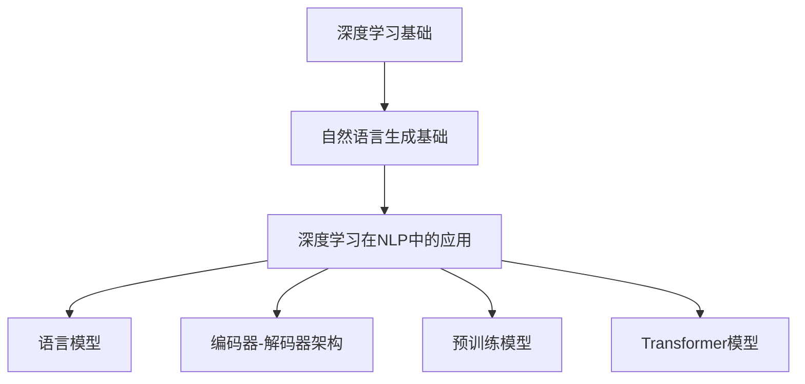
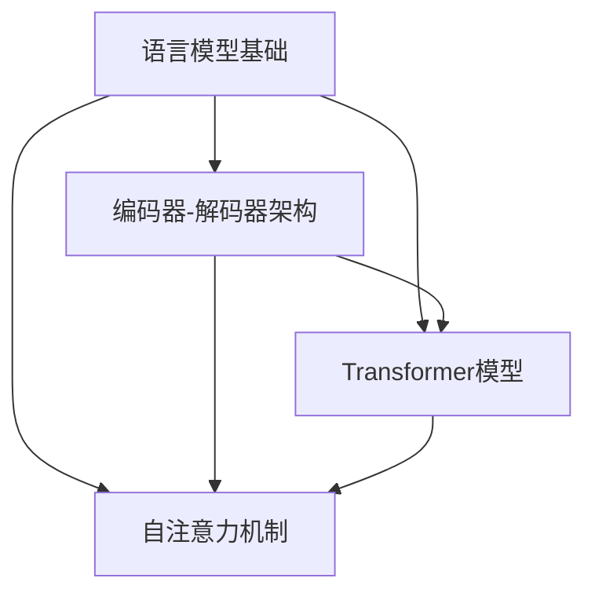
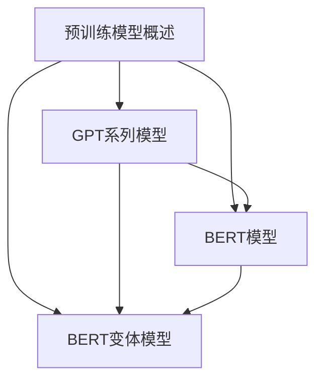
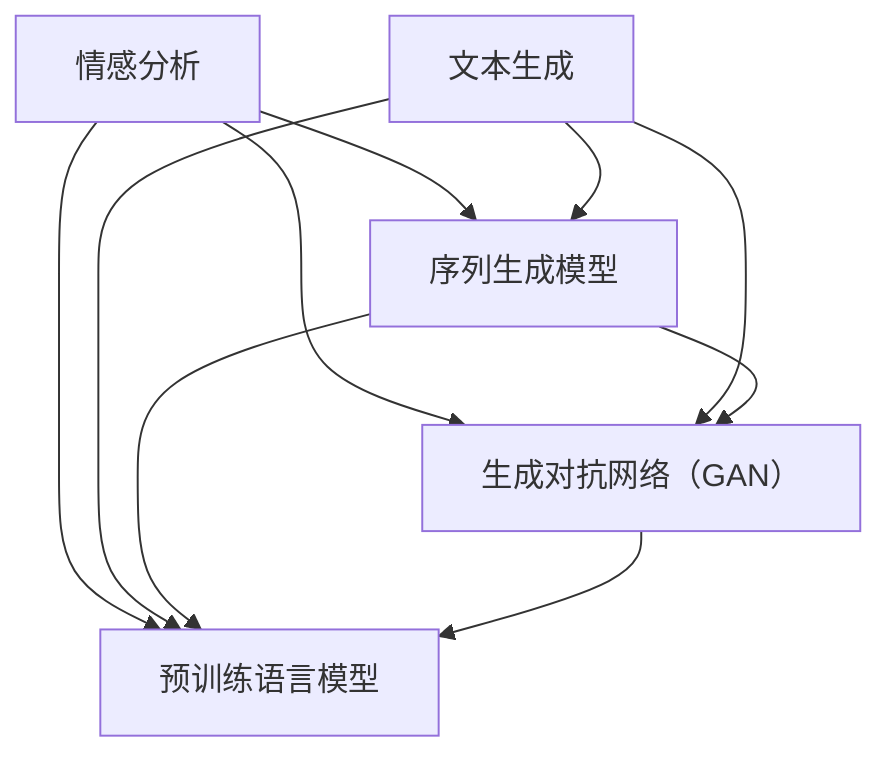
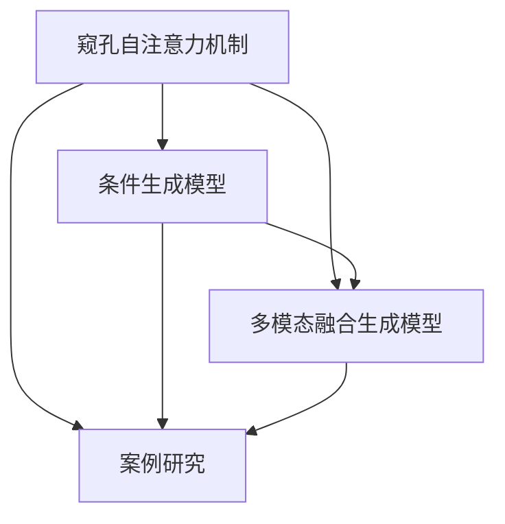
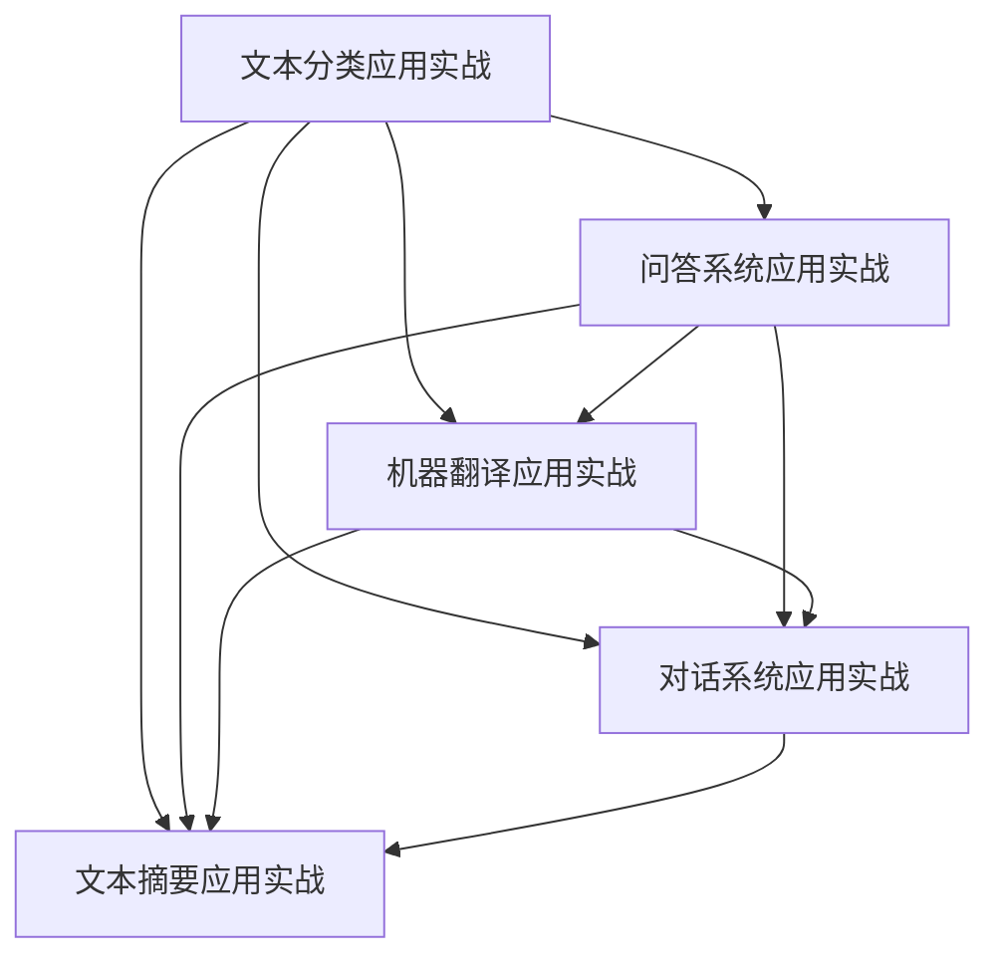
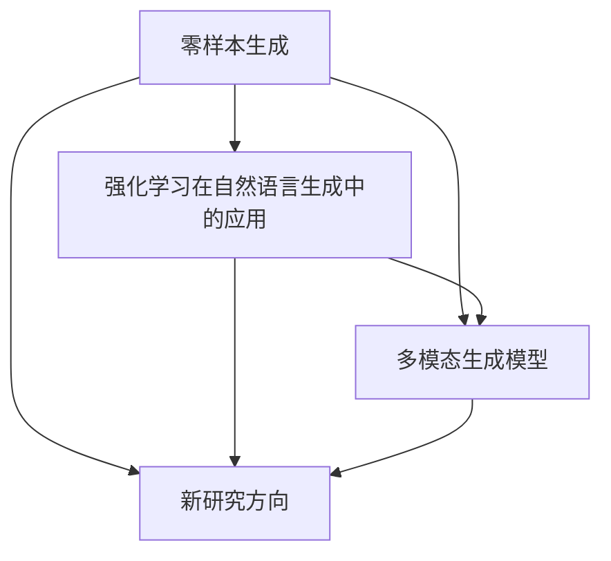

                 

### 深度学习在自然语言生成中的基础理论

自然语言生成（Natural Language Generation，NLG）是计算机科学和人工智能领域的一个重要研究方向，旨在利用计算机程序生成符合人类语言习惯的自然语言文本。随着深度学习技术的迅速发展，NLG领域取得了显著的进展。本部分将介绍深度学习在自然语言生成中的基础理论，包括深度学习的概述、自然语言生成概述以及深度学习在自然语言处理中的应用。

#### 1.1 深度学习概述

深度学习是人工智能领域中的一种重要方法，通过多层神经网络模型对大量数据进行学习，从而实现智能任务。以下是深度学习的定义、发展历程和基本原理：

##### 1.1.1 深度学习的定义与发展

深度学习起源于人工神经网络，最早可以追溯到20世纪50年代。当时，人工神经网络的研究主要集中在单层感知机（Perceptron）上。然而，单层感知机存在许多局限性，例如无法解决非线性问题。随着计算能力的提升和数据量的增加，20世纪80年代，多层感知机（MLP）被提出，使得深度学习开始崭露头角。

##### 1.1.2 深度学习的基本原理

深度学习的基本原理是通过神经网络结构模拟人脑神经元之间的连接，从而实现对数据的自动特征提取和表示。神经网络由输入层、隐藏层和输出层组成。每层神经元之间通过权重进行连接，并通过反向传播算法更新权重，以最小化损失函数。

##### 1.1.3 深度学习在自然语言处理中的应用

深度学习在自然语言处理（Natural Language Processing，NLP）领域取得了许多突破性成果。NLP旨在让计算机理解和处理人类语言，包括文本分类、情感分析、机器翻译、问答系统等任务。深度学习通过引入神经网络模型，如循环神经网络（RNN）、卷积神经网络（CNN）和Transformer模型，有效提升了NLP任务的性能。

#### 1.2 自然语言生成概述

自然语言生成是NLP的一个重要分支，旨在利用计算机程序生成符合人类语言习惯的文本。以下是自然语言生成的定义、发展历程和重要应用场景：

##### 1.2.1 自然语言生成的定义

自然语言生成是指利用计算机程序生成符合人类语言习惯的文本。自然语言生成可以分为两个主要方向：文本到文本的生成和文本到语音的生成。

##### 1.2.2 自然语言生成的发展历程

自然语言生成的研究可以追溯到20世纪50年代，当时主要使用规则驱动的方法进行文本生成。随着计算机性能的提升和深度学习技术的应用，基于统计方法和深度学习的方法逐渐成为主流。

##### 1.2.3 自然语言生成的重要应用场景

自然语言生成在许多领域具有广泛的应用。例如，在内容创作方面，自然语言生成可以用于自动撰写新闻报道、博客文章、小说等。在客户服务方面，自然语言生成可以用于自动生成客服回答、聊天机器人等。在智能教育方面，自然语言生成可以用于自动生成教学材料、习题等。

#### 1.3 深度学习在自然语言生成中的应用

深度学习在自然语言生成中具有重要的应用价值。以下是深度学习在自然语言生成中的应用：

##### 1.3.1 语言模型

语言模型是自然语言生成的基础，用于预测下一个词语的概率。深度学习通过引入神经网络模型，如循环神经网络（RNN）和Transformer模型，有效提升了语言模型的性能。

##### 1.3.2 编码器-解码器架构

编码器-解码器架构是自然语言生成中常用的模型架构，用于将输入序列转换为输出序列。深度学习通过引入自注意力机制和Transformer模型，有效提升了编码器-解码器架构的性能。

##### 1.3.3 预训练模型

预训练模型是深度学习在自然语言生成中的另一个重要应用。通过在大量无标签数据上进行预训练，模型可以学习到丰富的语言知识，并在特定任务上取得更好的性能。

综上所述，深度学习在自然语言生成中具有广泛的应用前景。本部分的后续章节将详细介绍深度学习在自然语言生成中的应用，包括语言模型、编码器-解码器架构、Transformer模型和大规模预训练模型等。

### Mermaid 流程图：



### 伪代码：

```python
# 语言模型伪代码
class LanguageModel:
    def __init__(self):
        # 初始化模型参数
        pass
    
    def predict_next_word(self, previous_words):
        # 预测下一个词语的概率
        pass

# 编码器-解码器架构伪代码
class EncoderDecoderModel:
    def __init__(self):
        # 初始化模型参数
        pass
    
    def encode(self, input_sequence):
        # 编码输入序列
        pass
    
    def decode(self, encoded_sequence):
        # 解码编码序列
        pass

# Transformer模型伪代码
class TransformerModel:
    def __init__(self):
        # 初始化模型参数
        pass
    
    def forward(self, input_sequence):
        # 前向传播
        pass
    
    def backward(self, output_sequence):
        # 反向传播
        pass
```

### 数学模型和公式：

$$
P(w_t|w_{t-1}, w_{t-2}, ..., w_1) = \frac{e^{logP(w_t|w_{t-1}, w_{t-2}, ..., w_1)}}{\sum_{w'} e^{logP(w'|w_{t-1}, w_{t-2}, ..., w_1)}}
$$

### 举例说明：

- **语言模型**：假设我们要预测一句话中的下一个词，我们可以使用语言模型来计算每个候选词的概率，然后选择概率最高的词作为预测结果。
- **编码器-解码器架构**：假设我们要翻译一句话，我们可以使用编码器将原句子编码为向量表示，然后使用解码器将向量表示解码为目标语言的句子。
- **Transformer模型**：假设我们要生成一句话，我们可以使用Transformer模型来预测每个词的概率，然后根据概率生成句子。

### 深度学习在自然语言生成中的应用

深度学习在自然语言生成中的应用主要体现在语言模型、编码器-解码器架构、Transformer模型和大规模预训练模型等方面。下面将分别介绍这些方面。

#### 2.1 语言模型基础

语言模型是自然语言生成的基础，它用于预测下一个词语的概率。语言模型的训练目标是学习到输入序列和输出序列之间的概率分布。深度学习通过引入神经网络模型，如循环神经网络（RNN）和Transformer模型，有效提升了语言模型的性能。

##### 2.1.1 语言模型的概念

语言模型是一个概率模型，它用于预测一个序列中下一个词语的概率。在自然语言生成中，语言模型用于生成文本序列，从而实现文本生成。

##### 2.1.2 语言模型的评估指标

语言模型的评估指标主要包括字符级准确率（Character-Level Accuracy）和词级准确率（Word-Level Accuracy）。字符级准确率衡量模型在生成文本时字符级别的预测准确性，而词级准确率衡量模型在生成文本时词级别的预测准确性。

##### 2.1.3 语言模型的训练方法

语言模型的训练方法主要包括基于统计的方法和基于神经网络的方法。基于统计的方法通过计算词语之间的概率分布来实现，而基于神经网络的方法通过训练神经网络模型来学习输入序列和输出序列之间的概率分布。

在深度学习中，常用的语言模型包括循环神经网络（RNN）和Transformer模型。RNN是一种序列模型，通过记忆过去的输入信息来预测下一个词语。Transformer模型是一种基于自注意力机制的模型，通过并行处理输入序列来提高模型的性能。

#### 2.2 编码器-解码器架构

编码器-解码器架构是自然语言生成中常用的模型架构，它由编码器（Encoder）和解码器（Decoder）两个部分组成。编码器用于将输入序列编码为固定长度的向量表示，而解码器用于将向量表示解码为输出序列。

##### 2.2.1 编码器-解码器架构的原理

编码器-解码器架构的原理是将输入序列编码为固定长度的向量表示，然后使用解码器将向量表示解码为输出序列。在编码器中，每个输入词语被编码为一个向量表示，这些向量表示通过加和操作得到一个固定长度的编码向量。在解码器中，每个输出词语被解码为一个向量表示，这些向量表示通过加和操作得到一个固定长度的解码向量。解码向量与编码向量之间的相似度用于计算损失，并通过反向传播算法更新模型参数。

##### 2.2.2 序列到序列学习

编码器-解码器架构是一种序列到序列学习（Sequence-to-Sequence Learning）模型，它通过将输入序列映射到输出序列来实现自然语言生成。序列到序列学习的关键在于如何将输入序列编码为固定长度的向量表示，以及如何将输出序列解码为输入序列的映射。

##### 2.2.3 Transformer模型介绍

Transformer模型是一种基于自注意力机制的编码器-解码器架构，它通过并行处理输入序列来提高模型的性能。Transformer模型的核心组件是自注意力机制（Self-Attention），它允许模型在处理输入序列时同时关注序列中的所有词语。

Transformer模型由编码器和解码器两个部分组成。编码器通过多层自注意力机制和前馈神经网络将输入序列编码为固定长度的编码向量。解码器通过多层自注意力机制和前馈神经网络将编码向量解码为输出序列。在解码过程中，解码器不仅关注编码向量，还关注之前生成的词语，从而实现序列到序列的映射。

#### 2.3 Transformer与自注意力机制

Transformer模型是一种基于自注意力机制的编码器-解码器架构，它在自然语言生成中取得了显著的效果。自注意力机制是一种用于计算序列中每个词语的重要程度的机制，它允许模型在处理输入序列时同时关注序列中的所有词语。

##### 2.3.1 Transformer模型

Transformer模型由编码器和解码器两个部分组成。编码器通过多层自注意力机制和前馈神经网络将输入序列编码为固定长度的编码向量。解码器通过多层自注意力机制和前馈神经网络将编码向量解码为输出序列。在解码过程中，解码器不仅关注编码向量，还关注之前生成的词语，从而实现序列到序列的映射。

##### 2.3.2 Multi-head Attention机制

Transformer模型中的自注意力机制采用了一种称为Multi-head Attention的机制。Multi-head Attention通过并行处理输入序列，从而提高模型的性能。每个头关注序列中的不同部分，然后将这些头的输出拼接起来，形成一个完整的输出。

##### 2.3.3 前馈神经网络

Transformer模型中的前馈神经网络用于对输入进行进一步处理，以提取更多的特征。前馈神经网络通常由两个全连接层组成，每个层之间使用激活函数进行非线性变换。

#### 2.4 自注意力机制

自注意力机制是一种用于计算序列中每个词语的重要程度的机制。它允许模型在处理输入序列时同时关注序列中的所有词语。自注意力机制的核心思想是计算每个词语与其他词语之间的相似度，并根据相似度对词语进行加权求和。

##### 2.4.1 自注意力机制的原理

自注意力机制的原理是通过计算每个词语与其他词语之间的相似度，并根据相似度对词语进行加权求和。相似度通常通过点积计算，然后通过softmax函数进行归一化，以得到每个词语的重要程度。

##### 2.4.2 自注意力机制的应用

自注意力机制在自然语言生成中具有广泛的应用。它可以用于编码器-解码器架构中的编码器和解码器部分，以及Transformer模型中的多头自注意力机制。通过自注意力机制，模型可以更好地捕捉输入序列和输出序列之间的依赖关系。

##### 2.4.3 注意力机制的优化方法

注意力机制在自然语言生成中取得了显著的效果，但也存在一些挑战，如梯度消失和计算复杂度等。为了优化注意力机制，研究者提出了一些方法，如 scaled-dot-product attention 和 multi-head attention。这些方法通过改进注意力计算的数学形式和并行处理能力，有效提升了注意力机制的性能。

综上所述，深度学习在自然语言生成中的应用主要体现在语言模型、编码器-解码器架构、Transformer模型和自注意力机制等方面。这些模型和机制在自然语言生成任务中取得了显著的性能提升，推动了自然语言生成技术的发展。

### Mermaid 流程图：



### 伪代码：

```python
# 语言模型伪代码
class LanguageModel:
    def __init__(self):
        # 初始化模型参数
        pass
    
    def predict_next_word(self, previous_words):
        # 预测下一个词语的概率
        pass

# 编码器-解码器架构伪代码
class EncoderDecoderModel:
    def __init__(self):
        # 初始化模型参数
        pass
    
    def encode(self, input_sequence):
        # 编码输入序列
        pass
    
    def decode(self, encoded_sequence):
        # 解码编码序列
        pass

# Transformer模型伪代码
class TransformerModel:
    def __init__(self):
        # 初始化模型参数
        pass
    
    def forward(self, input_sequence):
        # 前向传播
        pass
    
    def backward(self, output_sequence):
        # 反向传播
        pass

# 自注意力机制伪代码
class SelfAttention:
    def __init__(self):
        # 初始化模型参数
        pass
    
    def forward(self, input_sequence):
        # 前向传播
        pass
    
    def backward(self, output_sequence):
        # 反向传播
        pass
```

### 数学模型和公式：

$$
Attention(Q, K, V) = \text{softmax}\left(\frac{QK^T}{\sqrt{d_k}}\right) V
$$

### 举例说明：

- **语言模型**：假设我们要预测一句话中的下一个词，我们可以使用语言模型来计算每个候选词的概率，然后选择概率最高的词作为预测结果。
- **编码器-解码器架构**：假设我们要翻译一句话，我们可以使用编码器将原句子编码为向量表示，然后使用解码器将向量表示解码为目标语言的句子。
- **Transformer模型**：假设我们要生成一句话，我们可以使用Transformer模型来预测每个词的概率，然后根据概率生成句子。
- **自注意力机制**：假设我们要对一句话中的重要词语进行加权求和，我们可以使用自注意力机制来计算每个词语的重要程度，并根据重要程度对词语进行加权求和。

### 深度学习在自然语言生成中的应用

深度学习在自然语言生成中的应用主要体现在大规模预训练模型、BERT模型和相关的变体模型等方面。下面将分别介绍这些方面。

#### 4.1 预训练模型概述

预训练模型是深度学习在自然语言生成中的一个重要应用。预训练模型通过在大量无标签数据上进行预训练，使模型具有丰富的语言知识，从而在特定任务上取得更好的性能。预训练模型主要包括以下几种：

##### 4.1.1 预训练模型的概念

预训练模型是一种在大规模数据集上进行预训练的深度学习模型。预训练的目的是让模型在特定任务之前学习到一些通用的语言知识，从而在特定任务上取得更好的性能。

##### 4.1.2 预训练的优势

预训练的优势主要体现在以下几个方面：

1. **知识迁移**：预训练模型在大规模数据集上学习到的语言知识可以迁移到特定任务上，从而提高特定任务的性能。
2. **减少数据需求**：预训练模型可以减少特定任务所需的数据量，从而降低数据收集和标注的成本。
3. **通用性**：预训练模型可以应用于多种自然语言生成任务，从而提高模型的通用性。

##### 4.1.3 预训练的方法

预训练的方法主要包括以下几种：

1. **基于自回归的语言模型**：自回归语言模型是一种生成模型，它通过预测下一个词语来生成文本序列。
2. **基于序列标注的任务**：序列标注任务是一种将文本序列标记为不同标签的任务，如命名实体识别、词性标注等。
3. **基于填空的问答任务**：问答任务是一种将问题与答案配对的任务，如开放域问答、机器阅读理解等。

#### 4.2 GPT系列模型

GPT（Generative Pre-trained Transformer）系列模型是深度学习在自然语言生成中的一个重要突破。GPT模型由OpenAI提出，采用了Transformer架构进行预训练，从而取得了显著的效果。

##### 4.2.1 GPT模型的发展

GPT模型的发展历程如下：

1. **GPT-1**：GPT-1是GPT系列模型的第一代模型，它采用了Transformer架构进行预训练，并在多个自然语言生成任务上取得了优秀的成绩。
2. **GPT-2**：GPT-2是GPT系列模型的第二代模型，它在GPT-1的基础上进行了改进，包括增加模型大小、引入更复杂的架构等，从而取得了更好的性能。
3. **GPT-3**：GPT-3是GPT系列模型的第三代模型，它是目前最大的自然语言生成模型，拥有1750亿个参数，并在多个自然语言生成任务上取得了突破性的成果。

##### 4.2.2 GPT-2与GPT-3的特点与应用

GPT-2和GPT-3具有以下特点：

1. **模型大小**：GPT-2和GPT-3都采用了很大的模型，从而具有更强的表示能力和生成能力。
2. **预训练数据**：GPT-2和GPT-3都采用了大量的无标签数据进行预训练，从而学习到丰富的语言知识。
3. **生成能力**：GPT-2和GPT-3都具有很强的生成能力，可以生成符合人类语言习惯的文本。

GPT-2和GPT-3的应用场景主要包括：

1. **文本生成**：GPT-2和GPT-3可以用于生成新闻、文章、对话等文本。
2. **问答系统**：GPT-2和GPT-3可以用于开放域问答和机器阅读理解等任务。
3. **对话系统**：GPT-2和GPT-3可以用于构建智能对话系统，实现人机交互。

##### 4.2.3 GPT模型的技术细节

GPT模型的技术细节主要包括以下几个方面：

1. **Transformer架构**：GPT模型采用了Transformer架构，它由编码器和解码器两个部分组成。编码器用于将输入序列编码为固定长度的向量表示，解码器用于将向量表示解码为输出序列。
2. **多头自注意力机制**：GPT模型采用了多头自注意力机制，它允许模型在处理输入序列时同时关注序列中的所有词语。
3. **预训练方法**：GPT模型通过在大量无标签数据上进行预训练来学习丰富的语言知识。预训练方法主要包括自回归语言模型和序列标注任务。

#### 4.3 BERT模型

BERT（Bidirectional Encoder Representations from Transformers）模型是Google提出的一种基于Transformer架构的双向编码器表示模型。BERT模型在多个自然语言生成任务上取得了优秀的成绩，成为自然语言处理领域的重要模型之一。

##### 4.3.1 BERT模型的结构

BERT模型的结构主要包括以下几个部分：

1. **编码器**：编码器由多个Transformer编码层组成，每个编码层包含多头自注意力机制和前馈神经网络。
2. **掩码**：BERT模型中的输入序列经过随机掩码处理，从而增强模型的表示能力。
3. **位置嵌入**：BERT模型通过位置嵌入来表示输入序列中的词语位置。

##### 4.3.2 BERT模型的预训练方法

BERT模型的预训练方法主要包括以下两个方面：

1. **Masked Language Model（MLM）**：MLM方法通过随机掩码输入序列中的词语，然后训练模型预测这些掩码词语。这有助于模型学习到词语之间的依赖关系。
2. **Next Sentence Prediction（NSP）**：NSP方法通过训练模型预测给定的一句话是否是另一句话的下一个句子。这有助于模型学习到句子之间的依赖关系。

##### 4.3.3 BERT模型的应用案例

BERT模型的应用案例主要包括以下几个方面：

1. **文本分类**：BERT模型可以用于文本分类任务，通过将文本编码为固定长度的向量表示，然后使用这些向量表示进行分类。
2. **情感分析**：BERT模型可以用于情感分析任务，通过将文本编码为固定长度的向量表示，然后使用这些向量表示进行情感分类。
3. **命名实体识别**：BERT模型可以用于命名实体识别任务，通过将文本编码为固定长度的向量表示，然后使用这些向量表示进行实体识别。

#### 4.4 BERT变体模型

BERT变体模型是在BERT模型的基础上进行改进和扩展的模型，主要包括以下几种：

##### 4.4.1 RoBERTa模型

RoBERTa模型是BERT的一个变体，它通过改变训练数据、掩码策略和预训练任务等方法，提高了BERT模型的性能。RoBERTa模型在多个自然语言生成任务上取得了优秀的成绩。

##### 4.4.2 ALBERT模型

ALBERT模型是BERT的一个轻量级变体，它通过共享前一个词的嵌入来减少模型参数，从而降低了模型的计算复杂度。ALBERT模型在保持高性能的同时，具有更好的可扩展性和计算效率。

##### 4.4.3 DistilBERT模型

DistilBERT模型是BERT的一个蒸馏版本，它通过在较大的BERT模型上进行训练，然后使用知识蒸馏技术将知识传递给较小的模型。DistilBERT模型在保持高性能的同时，具有更小的模型大小和更快的计算速度。

综上所述，深度学习在自然语言生成中的应用主要体现在大规模预训练模型、BERT模型和相关的变体模型等方面。这些模型和变体模型在自然语言生成任务中取得了显著的性能提升，推动了自然语言生成技术的发展。

### Mermaid 流程图：



### 伪代码：

```python
# 预训练模型伪代码
class PretrainedModel:
    def __init__(self):
        # 初始化模型参数
        pass
    
    def pretrain(self, data):
        # 预训练模型
        pass
    
    def finetune(self, task):
        # 微调模型
        pass

# GPT模型伪代码
class GPTModel:
    def __init__(self):
        # 初始化模型参数
        pass
    
    def forward(self, input_sequence):
        # 前向传播
        pass
    
    def backward(self, output_sequence):
        # 反向传播
        pass

# BERT模型伪代码
class BERTModel:
    def __init__(self):
        # 初始化模型参数
        pass
    
    def encode(self, input_sequence):
        # 编码输入序列
        pass
    
    def decode(self, encoded_sequence):
        # 解码编码序列
        pass

# RoBERTa模型伪代码
class RoBERTaModel:
    def __init__(self):
        # 初始化模型参数
        pass
    
    def forward(self, input_sequence):
        # 前向传播
        pass
    
    def backward(self, output_sequence):
        # 反向传播
        pass

# ALBERT模型伪代码
class ALBERTModel:
    def __init__(self):
        # 初始化模型参数
        pass
    
    def forward(self, input_sequence):
        # 前向传播
        pass
    
    def backward(self, output_sequence):
        # 反向传播
        pass

# DistilBERT模型伪代码
class DistilBERTModel:
    def __init__(self):
        # 初始化模型参数
        pass
    
    def forward(self, input_sequence):
        # 前向传播
        pass
    
    def backward(self, output_sequence):
        # 反向传播
        pass
```

### 数学模型和公式：

$$
\text{Masked Language Model (MLM)}: \quad \text{input sequence} \rightarrow \text{masked sequence} \rightarrow \text{prediction of masked tokens}
$$

$$
\text{Next Sentence Prediction (NSP)}: \quad \text{input sentence 1} \rightarrow \text{input sentence 2} \rightarrow \text{prediction of next sentence}
$$

### 举例说明：

- **预训练模型**：假设我们要训练一个自然语言生成模型，我们可以使用预训练模型来学习大量的语言知识，从而在特定任务上取得更好的性能。
- **GPT系列模型**：假设我们要生成一篇新闻文章，我们可以使用GPT模型来生成文章的每个段落，然后根据段落之间的关联关系进行拼接。
- **BERT模型**：假设我们要对一篇新闻文章进行情感分析，我们可以使用BERT模型将文章编码为固定长度的向量表示，然后使用这些向量表示进行情感分类。
- **BERT变体模型**：假设我们要构建一个轻量级情感分析模型，我们可以使用ALBERT模型来降低模型的计算复杂度，同时保持高性能。

### 情感分析与文本生成

情感分析是自然语言处理（NLP）领域的一个重要任务，旨在通过计算机程序对文本的情感倾向进行分类，通常包括正面、负面和中性等类别。文本生成则是另一种重要的NLP任务，旨在利用计算机程序生成符合人类语言习惯的文本。深度学习技术在这两个任务中都取得了显著的进展。本文将分别介绍情感分析和文本生成的基本概念、任务、挑战及深度学习在这些任务中的应用。

#### 6.1 情感分析

情感分析，也称为 sentiment analysis，是指通过计算机程序识别文本中的情感倾向，通常涉及情感极性分类和情感强度分析。情感极性分类主要关注文本是正面、负面还是中性，而情感强度分析则涉及情感倾向的程度。

##### 6.1.1 情感分析的定义与分类

情感分析的定义是识别文本中的情感倾向和情感强度。根据分析的目标和精度，情感分析可以分为以下几个层次：

1. **文本分类**：将文本分类为预定义的情感类别，如正面、负面或中性。
2. **情感强度分析**：确定文本中情感的表达强度，例如，某句话是“喜欢”的程度高于“喜欢一点点”。
3. **细粒度情感分析**：对情感进行更细致的分类，例如，将正面情感进一步细分为“兴奋”、“高兴”、“满意”等。

##### 6.1.2 情感分析的任务与挑战

情感分析的主要任务包括：

1. **二元情感分类**：判断文本的情感倾向为正面、负面或中性。
2. **多标签情感分类**：文本可能同时包含多种情感，如“搞笑”和“悲伤”。
3. **情感强度估计**：估计情感倾向的强度。

情感分析面临的挑战包括：

1. **情感表达的多样性**：不同的语言表达可能传达相同或不同的情感。
2. **情感转移**：情感可能会随着句子或段落的上下文发生变化。
3. **情感极性反转**：某些短语可能会改变整个句子的情感倾向。

##### 6.1.3 情感分析的方法与应用

情感分析的方法可以分为传统方法和深度学习方法。

1. **传统方法**：主要包括基于规则的方法和基于统计的方法。基于规则的方法通过手动定义规则来识别情感，而基于统计的方法通过统计特征来分类情感。
2. **深度学习方法**：主要包括基于神经网络的方法，如循环神经网络（RNN）、长短期记忆网络（LSTM）和Transformer模型等。这些方法通过学习文本的深度表示来提高情感分析的准确性。

情感分析的应用包括：

1. **社交媒体分析**：分析社交媒体上的用户评论和反馈，帮助企业了解客户情感。
2. **产品评价分析**：分析用户对产品或服务的评价，帮助企业改进产品。
3. **情感监控**：用于监控公共舆论，如政治选举、自然灾害等事件。

#### 6.2 文本生成

文本生成，也称为 text generation，是指利用计算机程序生成符合人类语言习惯的文本。文本生成可以分为两种类型：基于规则的生成和基于学习的生成。

##### 6.2.1 文本生成的定义与分类

文本生成的定义是利用计算机程序生成人类可以理解的文本。文本生成的分类可以根据生成文本的方式分为：

1. **模板生成**：通过预定义的模板生成文本，如自动生成新闻报道。
2. **基于规则的生成**：通过规则和模板生成文本，如自动生成聊天机器人回复。
3. **基于学习的生成**：通过机器学习模型生成文本，如使用循环神经网络（RNN）或Transformer模型生成文本。

##### 6.2.2 文本生成的方法与流程

文本生成的方法主要包括：

1. **序列生成模型**：如循环神经网络（RNN）、长短期记忆网络（LSTM）和Transformer模型等，通过学习输入序列生成输出序列。
2. **生成对抗网络（GAN）**：通过生成器和判别器的对抗训练生成高质量文本。
3. **预训练语言模型**：如GPT和BERT等，通过大规模预训练生成文本。

文本生成的流程通常包括以下几个步骤：

1. **数据预处理**：清洗和预处理输入数据，如去除标点符号、分词等。
2. **模型选择**：根据任务需求选择合适的生成模型。
3. **模型训练**：使用训练数据训练生成模型，通过反向传播算法优化模型参数。
4. **文本生成**：使用训练好的模型生成文本，可以根据需要生成单句或多句文本。

##### 6.2.3 文本生成的应用实例

文本生成的应用实例包括：

1. **自动写作**：用于生成新闻报道、文章摘要、博客等。
2. **对话系统**：用于生成聊天机器人回复，如智能客服系统。
3. **机器翻译**：用于生成翻译文本，如自动翻译新闻、文章等。

#### 情感分析与文本生成的关系

情感分析与文本生成之间存在密切的关系：

1. **文本生成中的情感分析**：在文本生成任务中，情感分析可以用于判断生成的文本是否符合预期的情感倾向。例如，在生成对话系统中的回复时，需要确保回复的情感倾向与对话的上下文相符。
2. **情感分析中的文本生成**：在情感分析任务中，生成的文本可以用于表示情感极性或情感强度。例如，在分析社交媒体评论时，生成的文本可以用于展示用户评论的情感倾向。

深度学习技术在情感分析和文本生成中的应用极大地提高了这两个任务的性能。通过学习大量的文本数据，深度学习模型可以自动提取文本中的情感信息和生成符合人类语言的文本。随着技术的不断进步，情感分析和文本生成将在更多领域得到广泛应用。

### Mermaid 流程图：



### 伪代码：

```python
# 情感分析伪代码
class SentimentAnalysis:
    def __init__(self):
        # 初始化模型参数
        pass
    
    def analyze(self, text):
        # 分析文本情感
        pass

# 文本生成伪代码
class TextGeneration:
    def __init__(self):
        # 初始化模型参数
        pass
    
    def generate(self, input_sequence):
        # 生成文本
        pass

# 序列生成模型伪代码
class SequenceGenerationModel:
    def __init__(self):
        # 初始化模型参数
        pass
    
    def forward(self, input_sequence):
        # 前向传播
        pass
    
    def backward(self, output_sequence):
        # 反向传播
        pass

# 生成对抗网络（GAN）伪代码
class GANModel:
    def __init__(self):
        # 初始化模型参数
        pass
    
    def train(self, data):
        # 训练模型
        pass
    
    def generate(self):
        # 生成文本
        pass

# 预训练语言模型伪代码
class PretrainedLanguageModel:
    def __init__(self):
        # 初始化模型参数
        pass
    
    def generate(self, prompt):
        # 根据提示生成文本
        pass
```

### 数学模型和公式：

$$
\text{Sentiment Classification}: \quad P(\text{positive}|\text{document}) = \text{sigmoid}(\text{weights} \cdot \text{vector representation of document})
$$

$$
\text{Text Generation}: \quad \text{input sequence} \rightarrow \text{output sequence} = \text{softmax}(\text{model}(\text{input sequence}))
$$

### 举例说明：

- **情感分析**：假设我们要分析一篇社交媒体评论的情感，我们可以使用情感分析模型将评论分类为正面、负面或中性，并估计情感强度。
- **文本生成**：假设我们要生成一篇新闻报道，我们可以使用文本生成模型根据新闻的标题和摘要生成全文，确保生成文本的连贯性和准确性。

### 深度学习在自然语言生成中的最新进展

随着深度学习技术的不断进步，自然语言生成（NLG）领域也取得了显著的进展。本部分将介绍深度学习在自然语言生成中的最新进展，包括窥孔自注意力机制、条件生成模型和多模态融合生成模型等方面。

#### 7.1 最新进展概述

深度学习在自然语言生成领域的最新进展主要体现在以下几个方面：

1. **窥孔自注意力机制**：窥孔自注意力机制（Popping-based Self-Attention）是一种新的自注意力机制，它通过动态调整注意力掩码，提高了模型的效率和准确性。
2. **条件生成模型**：条件生成模型（Conditional Generation Model）通过引入条件信息，如上下文、图像等，生成更符合实际需求的文本。
3. **多模态融合生成模型**：多模态融合生成模型通过整合不同模态的数据，如文本、图像、音频等，生成更丰富的多媒体内容。

#### 7.2 新模型与技术

##### 7.2.1 窥孔自注意力机制

窥孔自注意力机制是一种新的自注意力机制，它通过动态调整注意力掩码来优化注意力计算。传统的自注意力机制在计算注意力权重时，通常使用固定的掩码。然而，这种方法可能导致模型在处理长序列时效率低下，且难以捕捉序列中的长距离依赖关系。

窥孔自注意力机制通过引入动态掩码来克服这些问题。具体来说，它在每个时间步计算注意力权重时，根据当前输入和上下文信息动态生成掩码。这种动态调整掩码的方式提高了模型在处理长序列时的效率和准确性。

窥孔自注意力机制的主要优点包括：

1. **高效的注意力计算**：通过动态调整掩码，模型可以避免在计算注意力权重时进行大量不必要的计算，从而提高计算效率。
2. **更好的长距离依赖捕捉**：动态掩码有助于模型更好地捕捉序列中的长距离依赖关系，从而提高生成文本的连贯性和准确性。

##### 7.2.2 条件生成模型

条件生成模型是一种通过引入条件信息来生成文本的模型。传统的生成模型（如GPT和BERT）主要基于自回归语言模型，它们通过预测下一个词语来生成文本。然而，这种方法在处理特定任务时可能存在一些局限性，如生成文本与条件信息不匹配。

条件生成模型通过将条件信息（如上下文、图像等）编码到模型中，从而生成与条件信息更加匹配的文本。条件生成模型的主要优点包括：

1. **更精准的文本生成**：通过引入条件信息，模型可以更好地理解上下文和条件，从而生成更符合实际需求的文本。
2. **多任务生成**：条件生成模型可以同时处理多个任务，如文本生成、图像生成等，从而实现更复杂的生成任务。

##### 7.2.3 多模态融合生成模型

多模态融合生成模型是一种通过整合不同模态的数据（如文本、图像、音频等）来生成多媒体内容的模型。传统的生成模型主要处理单一模态的数据，而多模态融合生成模型通过将不同模态的数据进行融合，生成更丰富的多媒体内容。

多模态融合生成模型的主要优点包括：

1. **更丰富的生成内容**：通过整合不同模态的数据，模型可以生成更丰富、更真实的多媒体内容。
2. **跨模态交互**：多模态融合生成模型可以通过跨模态交互学习不同模态之间的关联，从而提高生成内容的真实性和多样性。

#### 7.3 案例研究

为了更好地展示深度学习在自然语言生成中的最新进展，以下是一个案例研究：

**案例：多模态融合文本生成**

假设我们要生成一段描述某个旅游景点的文本，同时提供该景点的图像。传统的生成模型可能只能生成基于文本的描述，而多模态融合生成模型可以通过整合图像和文本信息，生成更加生动、真实的文本描述。

具体实现步骤如下：

1. **数据预处理**：对提供的图像和文本进行预处理，如图像分割、文本分词等。
2. **特征提取**：使用预训练的卷积神经网络（如VGG16、ResNet等）提取图像的特征向量，使用预训练的语言模型（如BERT、GPT等）提取文本的特征向量。
3. **融合特征**：将图像和文本的特征向量进行融合，可以采用拼接、平均等方法。
4. **生成文本**：使用融合后的特征向量生成文本描述，可以采用自回归语言模型或条件生成模型。

通过以上步骤，多模态融合生成模型可以生成一段既包含文本描述又包含图像信息的多媒体内容。

#### 总结

深度学习在自然语言生成中的最新进展为文本生成领域带来了新的突破。窥孔自注意力机制、条件生成模型和多模态融合生成模型等新技术提高了模型在生成文本的连贯性、准确性和多样性。随着技术的不断进步，深度学习在自然语言生成中的应用将不断拓展，为各行各业提供更智能、更高效的自然语言生成解决方案。

### Mermaid 流程图：



### 伪代码：

```python
# 窥孔自注意力机制伪代码
class PoppingSelfAttention:
    def __init__(self):
        # 初始化模型参数
        pass
    
    def forward(self, input_sequence, mask):
        # 前向传播
        pass
    
    def backward(self, output_sequence):
        # 反向传播
        pass

# 条件生成模型伪代码
class ConditionalGenerator:
    def __init__(self):
        # 初始化模型参数
        pass
    
    def forward(self, condition, input_sequence):
        # 前向传播
        pass
    
    def backward(self, output_sequence):
        # 反向传播
        pass

# 多模态融合生成模型伪代码
class MultiModalGenerator:
    def __init__(self):
        # 初始化模型参数
        pass
    
    def forward(self, text_feature, image_feature):
        # 前向传播
        pass
    
    def backward(self, output_sequence):
        # 反向传播
        pass

# 案例研究伪代码
class MultiModalTextGeneration:
    def __init__(self):
        # 初始化模型参数
        pass
    
    def generate_description(self, image, text):
        # 生成文本描述
        pass
```

### 数学模型和公式：

$$
\text{窥孔自注意力}: \quad \text{attention score} = \text{query} \cdot \text{key} \cdot \text{mask}
$$

$$
\text{条件生成模型}: \quad \text{output} = \text{model}(\text{condition}, \text{input sequence})
$$

$$
\text{多模态融合生成模型}: \quad \text{output} = \text{model}(\text{text feature}, \text{image feature})
$$

### 举例说明：

- **窥孔自注意力机制**：假设我们要对一段文本进行自注意力计算，我们可以使用窥孔自注意力机制动态调整注意力掩码，从而提高注意力计算效率和准确性。
- **条件生成模型**：假设我们要根据一个给定的图像生成一段描述，我们可以使用条件生成模型整合图像特征和文本特征，生成更符合实际的文本描述。
- **多模态融合生成模型**：假设我们要生成一段描述某个旅游景点的文本，同时提供该景点的图像，我们可以使用多模态融合生成模型整合图像和文本特征，生成更加生动、真实的文本描述。

### 深度学习在自然语言生成中的应用实战

深度学习在自然语言生成中的应用已经取得了显著成果，涵盖了文本分类、问答系统、机器翻译、对话系统等多个领域。以下我们将通过具体的实战案例，展示深度学习在这些应用中的实现过程和关键技术。

#### 8.1 深度学习在文本分类中的应用

文本分类是自然语言处理中的一个基础任务，旨在将文本数据自动分类到预定义的类别中。深度学习通过引入神经网络模型，如卷积神经网络（CNN）和循环神经网络（RNN），有效提升了文本分类的性能。

##### 8.1.1 文本分类概述

文本分类的任务是将输入文本数据映射到预定义的类别标签中。文本分类的应用场景广泛，如新闻分类、情感分析、垃圾邮件检测等。

##### 8.1.2 文本分类的应用场景

- **新闻分类**：根据新闻的内容将新闻自动分类到不同的主题类别，如体育、财经、娱乐等。
- **情感分析**：分析用户评论、社交媒体帖子的情感倾向，判断其是正面、负面还是中性。
- **垃圾邮件检测**：识别并过滤垃圾邮件，提高用户的邮件收件箱的整洁度。

##### 8.1.3 文本分类的数据预处理

在进行文本分类之前，需要对文本数据进行预处理。文本分类的数据预处理通常包括以下几个步骤：

1. **文本清洗**：去除文本中的HTML标签、特殊字符、停用词等。
2. **分词**：将文本拆分为单词或词组。
3. **词向量表示**：将单词或词组转换为向量表示，常用的词向量表示方法包括Word2Vec、GloVe和BERT等。

##### 8.1.4 深度学习在文本分类中的应用

在文本分类中，深度学习模型通过学习文本的深度特征表示，从而实现分类任务。以下是一个基于CNN的文本分类模型的实现示例：

```python
# 导入必要的库
import tensorflow as tf
from tensorflow.keras.models import Sequential
from tensorflow.keras.layers import Embedding, Conv1D, MaxPooling1D, Dense

# 构建模型
model = Sequential([
    Embedding(vocabulary_size, embedding_dim, input_length=max_sequence_length),
    Conv1D(filters, kernel_size, activation='relu'),
    MaxPooling1D(pool_size),
    Dense(num_classes, activation='softmax')
])

# 编译模型
model.compile(optimizer='adam', loss='categorical_crossentropy', metrics=['accuracy'])

# 训练模型
model.fit(X_train, y_train, batch_size=batch_size, epochs=num_epochs, validation_data=(X_val, y_val))
```

在这个例子中，我们构建了一个基于卷积神经网络的文本分类模型。模型首先通过Embedding层将文本转换为词向量表示，然后通过Conv1D层和MaxPooling1D层提取文本特征，最后通过Dense层进行分类。

#### 8.2 深度学习在问答系统中的应用

问答系统是自然语言处理中的一种重要应用，旨在通过计算机程序回答用户的问题。深度学习在问答系统中的应用极大地提升了回答的准确性和多样性。

##### 8.2.1 问答系统概述

问答系统根据问题的类型可以分为两种主要类型：基于知识的问答和基于信息的问答。

- **基于知识的问答**：系统通过预定义的规则和知识库回答用户的问题。这类问答系统适用于结构化数据。
- **基于信息的问答**：系统通过从大量无结构化数据中检索答案来回答用户的问题。这类问答系统适用于开放域问答。

##### 8.2.2 问答系统的关键技术

问答系统的关键技术包括：

1. **自然语言理解**：理解用户的问题，提取关键信息，并将其转换为系统可以处理的形式。
2. **信息检索**：在大量数据中检索与问题相关的信息。
3. **回答生成**：根据检索到的信息生成自然语言回答。

##### 8.2.3 深度学习在问答系统中的应用

在问答系统中，深度学习模型通过学习文本的深度特征表示，从而实现自然语言理解和回答生成。以下是一个基于Transformer的问答系统架构的实现示例：

```python
# 导入必要的库
import tensorflow as tf
from tensorflow.keras.models import Model
from tensorflow.keras.layers import Input, Embedding, Transformer

# 定义输入层
question_input = Input(shape=(max_sequence_length,))
context_input = Input(shape=(max_sequence_length,))

# 定义编码器
encoder = Embedding(vocabulary_size, embedding_dim)(question_input)
encoder = Transformer(num_heads, d_model, dff, input_seq_len=max_sequence_length)(encoder)

# 定义解码器
decoder = Embedding(vocabulary_size, embedding_dim)(context_input)
decoder = Transformer(num_heads, d_model, dff, input_seq_len=max_sequence_length)(decoder, encoder)

# 定义输出层
output = Dense(num_classes, activation='softmax')(decoder)

# 构建模型
model = Model(inputs=[question_input, context_input], outputs=output)

# 编译模型
model.compile(optimizer='adam', loss='categorical_crossentropy', metrics=['accuracy'])

# 训练模型
model.fit([X_train_questions, X_train_contexts], y_train_answers, batch_size=batch_size, epochs=num_epochs, validation_data=([X_val_questions, X_val_contexts], y_val_answers))
```

在这个例子中，我们构建了一个基于Transformer的问答系统模型。模型首先通过编码器对问题进行编码，然后通过解码器对上下文进行解码，并输出答案的预测概率。

#### 8.3 深度学习在机器翻译中的应用

机器翻译是自然语言处理中的一种重要应用，旨在将一种语言的文本翻译成另一种语言的文本。深度学习在机器翻译中的应用，特别是基于神经网络的方法，如序列到序列（Seq2Seq）模型和Transformer模型，极大地提升了翻译的准确性和流畅性。

##### 8.3.1 机器翻译概述

机器翻译的任务是将一种语言的文本翻译成另一种语言的文本。机器翻译可以分为两种类型：基于规则的机器翻译和基于统计的机器翻译。基于规则的机器翻译依赖于人类编写的规则，而基于统计的机器翻译依赖于大量的双语语料库。

##### 8.3.2 机器翻译的发展历程

机器翻译的发展历程可以分为以下几个阶段：

1. **基于规则的机器翻译**：最早的机器翻译系统依赖于人类编写的规则和词典。
2. **基于统计的机器翻译**：基于统计的机器翻译通过统计方法，如短语翻译模型和基于句法分析的机器翻译，提高了翻译的准确性。
3. **基于神经网络的机器翻译**：基于神经网络的机器翻译，特别是序列到序列（Seq2Seq）模型和Transformer模型，通过学习大规模的双语语料库，实现了高准确性、高流畅性的机器翻译。

##### 8.3.3 深度学习在机器翻译中的应用

在机器翻译中，深度学习模型通过学习大量的双语语料库，从而实现高准确性、高流畅性的翻译。以下是一个基于Transformer的机器翻译模型的实现示例：

```python
# 导入必要的库
import tensorflow as tf
from tensorflow.keras.models import Model
from tensorflow.keras.layers import Input, Embedding, Transformer

# 定义输入层
input_seq = Input(shape=(max_sequence_length,))
target_seq = Input(shape=(max_sequence_length,))

# 定义编码器
encoder_embedding = Embedding(vocabulary_size, embedding_dim)(input_seq)
encoder_output = Transformer(num_heads, d_model, dff, input_seq_len=max_sequence_length)(encoder_embedding)

# 定义解码器
decoder_embedding = Embedding(vocabulary_size, embedding_dim)(target_seq)
decoder_output = Transformer(num_heads, d_model, dff, input_seq_len=max_sequence_length)(decoder_embedding, encoder_output)

# 定义输出层
output = Dense(vocabulary_size, activation='softmax')(decoder_output)

# 构建模型
model = Model(inputs=[input_seq, target_seq], outputs=output)

# 编译模型
model.compile(optimizer='adam', loss='categorical_crossentropy', metrics=['accuracy'])

# 训练模型
model.fit([X_train_input, X_train_target], y_train_output, batch_size=batch_size, epochs=num_epochs, validation_data=([X_val_input, X_val_target], y_val_output))
```

在这个例子中，我们构建了一个基于Transformer的机器翻译模型。模型首先通过编码器将源语言文本编码为向量表示，然后通过解码器将向量表示解码为目标语言的文本。

#### 8.4 深度学习在对话系统中的应用

对话系统是一种与人类用户进行自然语言交互的系统，旨在提供智能客服、虚拟助手等服务。深度学习在对话系统中通过学习用户输入和系统响应，从而生成合适的系统响应。

##### 8.4.1 对话系统概述

对话系统可以分为两种主要类型：基于模板的对话系统和基于生成模型的对话系统。

- **基于模板的对话系统**：系统通过预定义的模板和规则生成系统响应。
- **基于生成模型的对话系统**：系统通过生成模型，如序列到序列（Seq2Seq）模型和Transformer模型，生成自然语言响应。

##### 8.4.2 对话系统的关键技术

对话系统的关键技术包括：

1. **自然语言理解**：理解用户输入的含义，提取关键信息。
2. **对话管理**：根据对话的上下文和目标，决定系统响应。
3. **回答生成**：生成自然语言响应，与用户进行有效的对话。

##### 8.4.3 深度学习在对话系统中的应用

在对话系统中，深度学习模型通过学习用户输入和系统响应，从而生成合适的系统响应。以下是一个基于生成模型的对话系统实现示例：

```python
# 导入必要的库
import tensorflow as tf
from tensorflow.keras.models import Model
from tensorflow.keras.layers import Input, Embedding, LSTM, Dense

# 定义输入层
input_seq = Input(shape=(max_sequence_length,))
context = Input(shape=(context_length,))

# 定义编码器
encoder_embedding = Embedding(vocabulary_size, embedding_dim)(input_seq)
encoder_lstm = LSTM(units)(encoder_embedding)

# 定义解码器
decoder_embedding = Embedding(vocabulary_size, embedding_dim)(context)
decoder_lstm = LSTM(units)(decoder_embedding, initial_state=[encoder_lstm])

# 定义输出层
output = Dense(vocabulary_size, activation='softmax')(decoder_lstm)

# 构建模型
model = Model(inputs=[input_seq, context], outputs=output)

# 编译模型
model.compile(optimizer='adam', loss='categorical_crossentropy', metrics=['accuracy'])

# 训练模型
model.fit([X_train_input, X_train_context], y_train_output, batch_size=batch_size, epochs=num_epochs, validation_data=([X_val_input, X_val_context], y_val_output))
```

在这个例子中，我们构建了一个基于LSTM的对话系统模型。模型首先通过编码器将用户输入编码为向量表示，然后通过解码器生成系统响应。

#### 8.5 深度学习在文本摘要中的应用

文本摘要是一种自动从长文本中提取关键信息的方法，旨在生成简洁、准确的摘要。深度学习在文本摘要中的应用，特别是基于Transformer的模型，如BERT和GPT，极大地提升了摘要的准确性和质量。

##### 8.5.1 文本摘要概述

文本摘要可以分为两种类型：抽取式摘要和生成式摘要。

- **抽取式摘要**：系统从原文中直接抽取关键句子或短语，生成摘要。
- **生成式摘要**：系统通过生成模型，如序列到序列（Seq2Seq）模型和Transformer模型，生成新的摘要。

##### 8.5.2 文本摘要的方法与流程

文本摘要的方法与流程通常包括以下几个步骤：

1. **数据预处理**：对原文进行预处理，如去除HTML标签、分词等。
2. **特征提取**：使用预训练的深度学习模型，如BERT，提取原文的语义特征。
3. **摘要生成**：使用生成模型，如GPT，根据提取的语义特征生成摘要。

##### 8.5.3 深度学习在文本摘要中的应用

在文本摘要中，深度学习模型通过学习大量的文本数据，从而生成高质量的摘要。以下是一个基于Transformer的文本摘要实现示例：

```python
# 导入必要的库
import tensorflow as tf
from tensorflow.keras.models import Model
from tensorflow.keras.layers import Input, Embedding, Transformer

# 定义输入层
input_seq = Input(shape=(max_sequence_length,))
context = Input(shape=(context_length,))

# 定义编码器
encoder_embedding = Embedding(vocabulary_size, embedding_dim)(input_seq)
encoder_output = Transformer(num_heads, d_model, dff, input_seq_len=max_sequence_length)(encoder_embedding)

# 定义解码器
decoder_embedding = Embedding(vocabulary_size, embedding_dim)(context)
decoder_output = Transformer(num_heads, d_model, dff, input_seq_len=max_sequence_length)(decoder_embedding, encoder_output)

# 定义输出层
output = Dense(vocabulary_size, activation='softmax')(decoder_output)

# 构建模型
model = Model(inputs=[input_seq, context], outputs=output)

# 编译模型
model.compile(optimizer='adam', loss='categorical_crossentropy', metrics=['accuracy'])

# 训练模型
model.fit([X_train_input, X_train_context], y_train_output, batch_size=batch_size, epochs=num_epochs, validation_data=([X_val_input, X_val_context], y_val_output))
```

在这个例子中，我们构建了一个基于Transformer的文本摘要模型。模型首先通过编码器将原文编码为向量表示，然后通过解码器生成摘要。

### 总结

深度学习在自然语言生成中的应用已经取得了显著的成果，涵盖了文本分类、问答系统、机器翻译、对话系统和文本摘要等多个领域。通过引入神经网络模型，如CNN、RNN、Transformer等，深度学习模型有效地提高了自然语言生成的准确性和流畅性。随着技术的不断进步，深度学习在自然语言生成中的应用将不断拓展，为各行各业提供更智能、更高效的自然语言生成解决方案。

### Mermaid 流程图：



### 伪代码：

```python
# 文本分类应用实战伪代码
class TextClassification:
    def __init__(self):
        # 初始化模型参数
        pass
    
    def preprocess(self, text):
        # 文本预处理
        pass
    
    def classify(self, text):
        # 文本分类
        pass

# 问答系统应用实战伪代码
class QuestionAnswering:
    def __init__(self):
        # 初始化模型参数
        pass
    
    def understand(self, question):
        # 理解问题
        pass
    
    def generate_answer(self, context):
        # 生成回答
        pass

# 机器翻译应用实战伪代码
class MachineTranslation:
    def __init__(self):
        # 初始化模型参数
        pass
    
    def translate(self, source_text, target_language):
        # 翻译文本
        pass

# 对话系统应用实战伪代码
class DialogueSystem:
    def __init__(self):
        # 初始化模型参数
        pass
    
    def handle_input(self, input_text):
        # 处理输入
        pass
    
    def generate_response(self, context):
        # 生成回答
        pass

# 文本摘要应用实战伪代码
class TextSummarization:
    def __init__(self):
        # 初始化模型参数
        pass
    
    def summarize(self, text):
        # 生成摘要
        pass
```

### 数学模型和公式：

$$
\text{文本分类}: \quad P(\text{category}|\text{document}) = \text{softmax}(\text{weights} \cdot \text{vector representation of document})
$$

$$
\text{问答系统}: \quad \text{answer} = \text{model}(\text{question}, \text{context})
$$

$$
\text{机器翻译}: \quad \text{output} = \text{model}(\text{input sequence}, \text{target language})
$$

$$
\text{对话系统}: \quad \text{response} = \text{model}(\text{input}, \text{context})
$$

$$
\text{文本摘要}: \quad \text{summary} = \text{model}(\text{input sequence})
$$

### 举例说明：

- **文本分类**：假设我们要对一篇新闻文章进行分类，我们可以使用文本分类模型提取文章的特征向量，然后通过softmax函数计算每个类别的概率，从而判断文章的类别。
- **问答系统**：假设我们要回答用户的问题，我们可以使用问答系统模型理解用户的问题，然后从给定的上下文中提取答案。
- **机器翻译**：假设我们要将一篇中文文章翻译成英文，我们可以使用机器翻译模型输入中文序列，然后输出英文序列。
- **对话系统**：假设我们要与用户进行对话，我们可以使用对话系统模型处理用户的输入，然后生成合适的回答。
- **文本摘要**：假设我们要对一篇长篇文章进行摘要，我们可以使用文本摘要模型输入文章的序列，然后输出摘要的序列。

### 深度学习在自然语言生成中的未来趋势

随着深度学习技术的不断进步，自然语言生成（NLG）领域也正朝着更加智能化、自动化和高效化的方向发展。本文将探讨深度学习在自然语言生成中的未来趋势，包括零样本生成、强化学习在自然语言生成中的应用以及多模态生成模型的发展。

#### 13.1 未来趋势概述

深度学习在自然语言生成中的未来趋势主要体现在以下几个方面：

1. **零样本生成**：零样本生成是指模型能够在没有特定领域数据的情况下，生成特定领域的文本。这对于处理数据稀缺的场景具有重要意义。
2. **强化学习在自然语言生成中的应用**：强化学习通过优化策略，使模型在生成文本时更加符合用户需求和上下文信息。
3. **多模态生成模型**：多模态生成模型通过整合不同模态的数据，如文本、图像、音频等，生成更加丰富和多样化的内容。

#### 13.2 零样本生成

零样本生成是一种在数据稀缺的情况下，通过深度学习模型生成特定领域文本的技术。传统的自然语言生成模型通常需要大量的领域数据来进行训练，而在某些应用场景中，领域数据可能难以获取或获取成本较高。零样本生成通过迁移学习和知识蒸馏等技术，使得模型能够在没有特定领域数据的情况下，生成高质量的文本。

实现零样本生成的主要步骤包括：

1. **多领域预训练**：在大量跨领域的无标签数据上进行预训练，使模型具有广泛的语言理解能力。
2. **领域适配**：通过在少量特定领域数据上进行适配，使模型能够生成特定领域的文本。
3. **生成文本**：使用适配后的模型生成特定领域的文本。

#### 13.3 强化学习在自然语言生成中的应用

强化学习在自然语言生成中的应用主要是通过优化生成策略，使模型在生成文本时更加符合用户需求和上下文信息。强化学习通过奖励机制，指导模型在生成文本的过程中，逐步优化生成文本的质量。

强化学习在自然语言生成中的实现步骤包括：

1. **定义生成策略**：设计一个策略网络，用于生成文本。
2. **定义奖励机制**：设计一个奖励函数，用于评估生成文本的质量。
3. **优化策略**：通过强化学习算法（如策略梯度算法），优化生成策略，使模型在生成文本时能够获得更高的奖励。

#### 13.4 多模态生成模型

多模态生成模型通过整合不同模态的数据，如文本、图像、音频等，生成更加丰富和多样化的内容。多模态生成模型能够充分利用不同模态的信息，从而提高生成文本的连贯性、准确性和多样性。

多模态生成模型的主要实现步骤包括：

1. **数据整合**：将不同模态的数据进行整合，形成统一的数据表示。
2. **特征提取**：使用不同的特征提取器，提取不同模态的特征。
3. **模型融合**：将不同模态的特征进行融合，形成一个综合的特征向量。
4. **生成文本**：使用融合后的特征向量生成文本。

#### 13.5 新研究方向

在自然语言生成的未来研究中，以下几个方向值得关注：

1. **零样本生成**：研究如何在更少的领域数据下实现高质量的零样本生成。
2. **增强的上下文理解**：研究如何使模型在生成文本时，更好地理解上下文信息。
3. **多模态交互**：研究如何在不同模态之间建立更加有效的交互机制。
4. **可解释性**：研究如何提高模型的可解释性，使其生成文本的过程更加透明。

总之，深度学习在自然语言生成中的未来趋势将朝着更加智能化、自动化和高效化的方向发展。随着技术的不断进步，自然语言生成将在更多领域得到广泛应用，为人类带来更加智能化的生活体验。

### Mermaid 流程图：



### 伪代码：

```python
# 零样本生成伪代码
class ZeroShotGenerator:
    def __init__(self):
        # 初始化模型参数
        pass
    
    def multitask_pretrain(self, data):
        # 多任务预训练
        pass
    
    def domain_adapt(self, domain_data):
        # 领域适配
        pass
    
    def generate(self, domain):
        # 生成文本
        pass

# 强化学习在自然语言生成中的应用伪代码
class ReinforcementLearningGenerator:
    def __init__(self):
        # 初始化模型参数
        pass
    
    def define_policy(self):
        # 定义生成策略
        pass
    
    def define_reward(self):
        # 定义奖励机制
        pass
    
    def optimize_policy(self):
        # 优化生成策略
        pass
    
    def generate(self, context):
        # 生成文本
        pass

# 多模态生成模型伪代码
class MultimodalGenerator:
    def __init__(self):
        # 初始化模型参数
        pass
    
    def integrate_data(self, text, image, audio):
        # 整合不同模态的数据
        pass
    
    def extract_features(self, data):
        # 提取不同模态的特征
        pass
    
    def fusion_features(self, text_features, image_features, audio_features):
        # 融合不同模态的特征
        pass
    
    def generate(self, fused_features):
        # 生成文本
        pass
```

### 数学模型和公式：

$$
\text{零样本生成}: \quad \text{output} = \text{model}(\text{context}, \text{domain})
$$

$$
\text{强化学习}: \quad \text{policy} = \arg\max_{\pi} \mathbb{E}_{s, a} [\text{reward}(\pi(s), a) | \text{state} = s]
$$

$$
\text{多模态融合}: \quad \text{fused_representation} = \text{integration}(\text{text_representation}, \text{image_representation}, \text{audio_representation})
$$

### 举例说明：

- **零样本生成**：假设我们要生成一篇关于医疗领域的文章，但只拥有少量的医疗领域数据。我们可以使用零样本生成模型，首先在大量跨领域数据上进行预训练，然后在少量医疗领域数据上进行适配，从而生成高质量的医疗领域文章。
- **强化学习在自然语言生成中的应用**：假设我们要生成一篇符合用户需求的新闻文章。我们可以使用强化学习模型，通过定义生成策略和奖励机制，使模型在生成文本的过程中，逐步优化生成文本的质量，从而满足用户需求。
- **多模态生成模型**：假设我们要生成一篇包含图像、音频和文本的互动新闻文章。我们可以使用多模态生成模型，整合图像、音频和文本的特征，生成一篇具有丰富内容和互动性的新闻文章。

### 附录

#### 附录A: 深度学习在自然语言生成中的工具与资源

在进行深度学习在自然语言生成中的应用时，选择合适的工具和资源是非常重要的。以下是一些常用的深度学习框架、自然语言生成工具集以及常见的数据集。

##### A.1 深度学习框架对比

在深度学习领域中，常用的框架有TensorFlow、PyTorch和其他一些常用框架。以下是这些框架的简要对比：

###### A.1.1 TensorFlow

- **优点**：TensorFlow是一个由Google开发的开源机器学习框架，拥有强大的生态和丰富的API。它支持多种编程语言，包括Python、C++和Java。
- **缺点**：TensorFlow的模型定义和训练过程相对复杂，不适合快速迭代和实验。

###### A.1.2 PyTorch

- **优点**：PyTorch是一个由Facebook开发的开源机器学习框架，拥有简洁的Python接口和动态计算图。它支持灵活的模型定义和快速迭代。
- **缺点**：PyTorch的生态相对较小，但近年来发展迅速。

###### A.1.3 其他常用深度学习框架

- **优点**：其他常用框架如Keras、Theano等，各有其特点和优势，可以根据具体需求进行选择。
- **缺点**：与其他框架相比，它们的生态和API支持可能相对较弱。

##### A.2 自然语言生成工具集

在进行自然语言生成任务时，选择合适的工具集可以大大提高开发效率。以下是一些常用的自然语言生成工具集：

###### A.2.1 HuggingFace Transformers

- **优点**：HuggingFace Transformers是一个开源的预训练模型库，支持多种预训练模型如BERT、GPT等，并提供了一系列的API和工具。
- **缺点**：部分高级功能可能需要付费订阅。

###### A.2.2 AllenNLP

- **优点**：AllenNLP是一个开源的自然语言处理库，提供了一系列用于文本分类、实体识别、关系抽取等任务的预训练模型和工具。
- **缺点**：相比于其他工具集，AllenNLP的生态较小。

###### A.2.3 其他自然语言生成工具集

- **优点**：其他自然语言生成工具集如Spacy、NLTK等，各有其特点和优势，可以根据具体需求进行选择。
- **缺点**：与其他工具集相比，它们的生态和功能可能相对较弱。

##### A.3 数据集介绍

在进行自然语言生成任务时，选择合适的数据集对于模型训练和评估至关重要。以下是一些常见的数据集：

###### A.3.1 GLUE数据集

- **优点**：GLUE数据集是一个大规模的多任务自然语言处理数据集，包括文本分类、情感分析、问答系统等任务，是评估自然语言处理模型性能的重要基准。
- **缺点**：数据集的规模较大，可能需要较长的训练时间。

###### A.3.2 SQuAD数据集

- **优点**：SQuAD数据集是一个大规模的问答系统数据集，包括多个领域的问答对，是评估问答系统性能的重要基准。
- **缺点**：数据集的规模相对较小，但具有较高的质量和难度。

###### A.3.3 其他常用自然语言生成数据集

- **优点**：其他常用自然语言生成数据集如CoNLL、IMDB、新闻文章数据集等，可根据具体任务需求进行选择。
- **缺点**：与其他数据集相比，它们的数据规模、质量和难度可能有所不同。

总之，选择合适的工具和资源是深度学习在自然语言生成中成功的关键。通过合理选择和使用这些工具和资源，可以大大提高自然语言生成任务的开发效率和性能。

