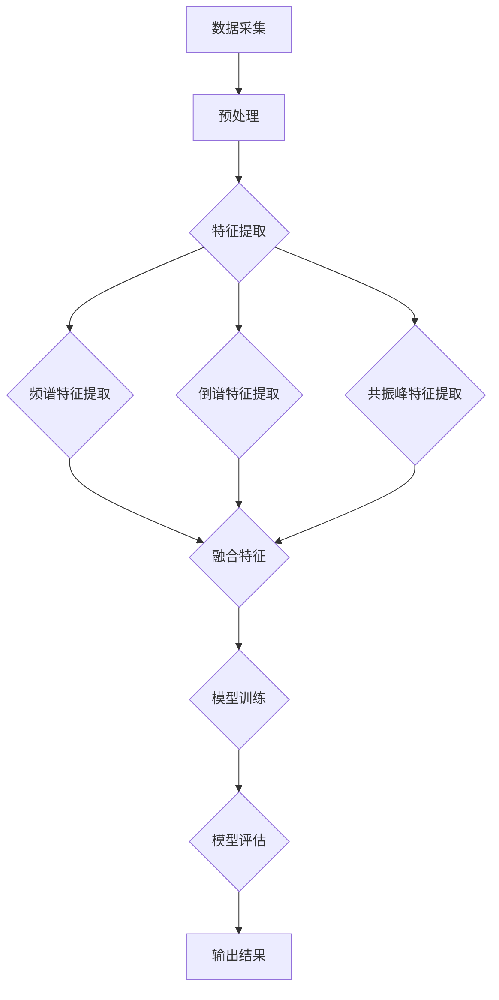

                 

### 引言与概述

**关键词**：深度学习，语音情感识别，准确性提升，算法改进

**摘要**：本文旨在探讨深度学习技术在语音情感识别准确性提升中的应用。首先，我们简要介绍了深度学习的基本概念及其在语音情感识别中的重要性。接着，我们深入探讨了语音情感识别的基本原理和当前应用现状。通过这一系列的分析，我们将为后续深入讨论深度学习技术在该领域的具体应用奠定基础。

在当今社会，人们越来越重视情感交流的质量，无论是在日常人际交往还是商业沟通中。而语音作为一种重要的情感表达媒介，其在情感识别中的准确性直接关系到交流的效率和效果。因此，如何提升语音情感识别的准确性成为了学术界和工业界的重要研究课题。

深度学习作为一种强大的机器学习技术，以其自下而上的层次化特征学习和端到端的学习能力，在图像识别、自然语言处理等领域取得了显著的成果。近年来，随着语音信号处理技术的发展和深度学习算法的不断改进，深度学习在语音情感识别中的应用也逐渐得到了广泛关注和深入研究。

本文将首先介绍深度学习的基本概念及其架构，帮助读者了解这一技术的基本原理。随后，我们将详细探讨语音情感识别的基本原理，包括语音信号的处理方法、特征提取技术以及情感分类模型。在此基础上，我们将重点分析当前深度学习在语音情感识别中的应用现状，指出其中存在的问题和挑战。

为了使读者更好地理解深度学习在语音情感识别中的具体应用，本文还将详细介绍一系列基于深度学习的语音情感识别算法，并探讨如何通过数据增强、模型优化等方法提升识别准确性。最后，我们将通过一个实际的语音情感识别项目实战案例，展示深度学习技术在解决实际问题中的应用效果，并对未来深度学习在语音情感识别领域的应用前景进行展望。

通过本文的阅读，读者将对深度学习在语音情感识别准确性提升中的进展有一个全面而深入的了解，为今后的研究和实践提供有益的参考和启示。

### 深度学习在语音情感识别中的重要性

#### 深度学习的基本概念与架构

深度学习（Deep Learning）是人工智能（Artificial Intelligence, AI）的一个重要分支，主要依赖于多层神经网络（Neural Networks）进行复杂模式识别和预测。与传统机器学习方法不同，深度学习通过多层次的神经网络结构，自动提取数据中的层次化特征，从而实现更高层次的任务。

深度学习的架构通常包括输入层、隐藏层和输出层。每一层都可以对输入数据进行处理和转换，从而生成更高层次的特征表示。这种层次化的特征提取方式使得深度学习在处理复杂、高维数据时具有明显的优势。

1. **输入层**：输入层接收原始数据，如语音信号、图像等。在语音情感识别中，输入层接收的是经过预处理后的语音信号。

2. **隐藏层**：隐藏层是深度学习的核心部分，负责对输入数据进行特征提取和转换。每一层隐藏层都会对前一层输出的特征进行组合和变换，从而生成更高层次的特征表示。隐藏层的数量和每个层的神经元数量可以根据任务需求进行调整。

3. **输出层**：输出层生成最终预测结果。在语音情感识别中，输出层通常是一个分类层，负责将输入语音信号分类为不同的情感类别。

深度学习算法通过反向传播（Backpropagation）算法不断调整网络的权重，以最小化预测误差。这种训练过程被称为“训练周期”（Training Epoch），需要大量的数据和计算资源。

#### 语音情感识别的基本原理

语音情感识别（Speech Emotion Recognition, SER）是一种通过分析语音信号中的情感信息，来判断说话者情感状态的技术。语音情感识别的基本原理可以概括为以下三个步骤：

1. **语音信号预处理**：首先，对原始语音信号进行预处理，包括去噪、分帧、加窗等操作。这些操作旨在提高语音信号的清晰度和可分析性。

2. **特征提取**：接下来，从预处理后的语音信号中提取特征。常用的语音特征包括频谱特征、倒谱特征、共振峰特征等。这些特征可以捕捉语音信号中的情感信息。

3. **情感分类**：最后，使用深度学习算法对提取的特征进行分类，判断说话者的情感状态。常见的情感分类任务包括基本情感（如快乐、悲伤、愤怒等）和复杂情感（如兴奋、厌恶等）。

#### 深度学习在语音情感识别中的应用现状

近年来，深度学习技术在语音情感识别领域取得了显著的进展。以下是几个关键的应用现状：

1. **算法性能提升**：深度学习算法在语音情感识别中的性能显著优于传统的机器学习方法。通过多层次的特征提取和端到端的学习能力，深度学习可以捕捉到语音信号中的细微情感变化，从而提高识别准确性。

2. **多模态数据融合**：深度学习还可以结合其他模态的数据（如面部表情、文本等）进行情感识别，从而提高模型的泛化能力和准确性。

3. **实时情感分析**：随着硬件性能的提升和深度学习算法的优化，实时语音情感识别成为可能。这使得深度学习技术在智能客服、虚拟助手等领域具有广泛的应用前景。

4. **数据集和工具**：大量的开源数据集和工具（如开源框架、深度学习模型等）为语音情感识别的研究和应用提供了丰富的资源。

尽管深度学习在语音情感识别中取得了显著成果，但仍然面临一些挑战，如数据不足、模型复杂度高等。未来，随着技术的不断发展和应用的深入，深度学习在语音情感识别中的重要性将进一步提升。

### 深度学习技术基础

#### 语音信号处理基础

在深度学习应用于语音情感识别之前，必须对语音信号进行有效的处理和特征提取。这是确保模型性能和识别准确性的关键步骤。以下是语音信号处理的基本概念和方法：

1. **语音信号的采集与预处理**

   语音信号的采集是语音情感识别的首要任务。常见的语音采集设备包括麦克风、智能手机、语音识别设备等。采集到的语音信号通常包含噪声、不规则的音频片段，因此需要进行预处理。

   - **去噪**：去噪是去除语音信号中不相关噪声的过程。常用的去噪方法包括谱减法、维纳滤波和自适应滤波等。

   - **分帧**：将连续的语音信号分割成若干短时段，以便进行特征提取。常见的分帧方法包括短时傅里叶变换（STFT）和汉明窗分帧。

   - **加窗**：为了减少边界效应，对每一帧语音信号进行加窗处理。汉明窗和汉宁窗是常用的加窗函数。

2. **语音特征提取**

   语音特征提取是从语音信号中提取能够代表情感信息的关键特征。这些特征将被用于深度学习模型的训练和预测。以下是一些常用的语音特征：

   - **频谱特征**：频谱特征包括频谱图、频谱熵、共振峰频率等。这些特征能够反映语音信号在不同频率范围内的能量分布，是情感识别的重要指标。

   - **倒谱特征**：倒谱特征是通过频谱的反变换得到的，可以消除频率信息中的噪声和频移影响，更好地捕捉语音的时频特性。

   - **共振峰特征**：共振峰频率是语音信号的重要特征，可以反映语音的音质和音高变化。

3. **声学模型与语音识别基础**

   在深度学习应用于语音情感识别之前，声学模型（Acoustic Model）和语言模型（Language Model）是传统语音识别技术中的核心部分。声学模型负责分析语音信号中的声学特征，而语言模型则负责分析语音信号中的语言信息。

   - **声学模型**：声学模型通过统计方法（如高斯混合模型、隐马尔可夫模型）或神经网络方法（如深度神经网络）建立语音信号与声学特征之间的映射关系。

   - **语言模型**：语言模型通过统计方法（如n-gram模型）或深度学习方法（如循环神经网络、Transformer）建立语音信号与文本之间的映射关系。

   声学模型和语言模型通常结合使用，以实现高效的语音识别。虽然深度学习已经取代了部分传统的声学模型和语言模型，但它们在语音情感识别中仍然发挥着重要作用，特别是在多模态数据融合方面。

通过上述语音信号处理基础，我们可以为深度学习算法提供高质量的输入数据，从而提高语音情感识别的准确性和可靠性。接下来，我们将进一步探讨深度学习中的核心算法，以深入了解其在语音情感识别中的应用。

### 深度学习核心算法

#### 卷积神经网络（CNN）原理与应用

卷积神经网络（Convolutional Neural Network, CNN）是深度学习领域的一种重要神经网络架构，特别适用于处理图像和时序数据。其基本原理来源于生物学中神经元在感知视觉刺激时的机制，通过多个卷积层、池化层和全连接层的组合，实现对数据的层次化特征提取和分类。

1. **CNN基本结构**

   CNN的基本结构包括以下几个部分：

   - **输入层**：接收原始图像或时序数据。
   - **卷积层**：通过卷积操作从输入数据中提取局部特征。
   - **激活函数**：通常使用ReLU（Rectified Linear Unit）函数，引入非线性。
   - **池化层**：通过最大池化或平均池化降低数据维度。
   - **全连接层**：将卷积层和池化层的输出进行全连接，生成分类结果。

2. **卷积操作**

   卷积操作是CNN的核心，其原理如下：

   - **卷积核**：卷积核是一个小型滤波器，它在输入数据上滑动，每次滑动都进行一次点积操作，生成一个特征图。
   - **步长**：卷积核每次滑动的步长，决定了特征图的分辨率。
   - **填充**：为了防止特征图的大小减少，可以在输入数据周围填充零。

   卷积操作的伪代码如下：

   ```
   function conv2d(input, filter, stride, padding):
       output = zeros((input.shape[0], (input.shape[1] + 2 * padding - filter.shape[1]) // stride,
                       (input.shape[2] + 2 * padding - filter.shape[2]) // stride, filter.shape[3]))
       
       for i in range(output.shape[0]):
           for j in range(output.shape[1]):
               for k in range(output.shape[2]):
                   for l in range(output.shape[3]):
                       output[i, j, k, l] = sum(filter * (input[i, (j * stride):j * stride + filter.shape[1],
                                                       k * stride:k * stride + filter.shape[2]])[padding:-padding,
                                                       padding:-padding])
       
       return output
   ```

3. **应用示例**

   在语音情感识别中，CNN可以用于提取语音信号的时频特征。以下是一个简化的CNN模型用于语音情感识别的伪代码示例：

   ```
   # 定义CNN模型
   model = Sequential()
   model.add(Conv2D(32, (3, 3), activation='relu', input_shape=(input_height, input_width, 1)))
   model.add(MaxPooling2D((2, 2)))
   model.add(Conv2D(64, (3, 3), activation='relu'))
   model.add(MaxPooling2D((2, 2)))
   model.add(Flatten())
   model.add(Dense(128, activation='relu'))
   model.add(Dense(num_classes, activation='softmax'))

   # 编译模型
   model.compile(optimizer='adam', loss='categorical_crossentropy', metrics=['accuracy'])

   # 训练模型
   model.fit(x_train, y_train, batch_size=32, epochs=10, validation_data=(x_val, y_val))
   ```

   在这个示例中，模型首先通过两个卷积层提取特征，然后通过最大池化层降低数据维度，接着通过全连接层进行分类。

#### 循环神经网络（RNN）与长短时记忆网络（LSTM）

循环神经网络（Recurrent Neural Network, RNN）是一种专门用于处理序列数据的神经网络。RNN通过在其内部引入循环结构，使得网络能够处理不同长度的输入序列，并保持序列中的上下文信息。

1. **RNN基本原理**

   RNN的基本原理可以概括为：

   - **状态转移函数**：每个时间步，RNN根据当前输入和上一个时间步的隐藏状态，计算新的隐藏状态。
   - **隐藏状态**：RNN通过隐藏状态保存序列中的信息，使得网络能够处理长序列。

   RNN的公式表示如下：

   ```
   h_t = tanh(W_h * [h_{t-1}, x_t] + b_h)
   y_t = W_o * h_t + b_o
   ```

   其中，\(h_t\) 是第t个时间步的隐藏状态，\(x_t\) 是第t个时间步的输入，\(W_h\) 和 \(b_h\) 分别是权重和偏置，\(W_o\) 和 \(b_o\) 是输出层的权重和偏置。

2. **RNN问题与长短时记忆网络（LSTM）**

   虽然RNN能够处理序列数据，但其在长序列中的表现较差，主要原因在于“梯度消失”和“梯度爆炸”问题。为了解决这些问题，长短时记忆网络（Long Short-Term Memory, LSTM）被提出。

   LSTM通过引入三个门控单元（输入门、遗忘门和输出门），有效地控制信息的流动，从而避免梯度消失和梯度爆炸问题。LSTM的公式如下：

   ```
   i_t = sigmoid(W_i * [h_{t-1}, x_t] + b_i)
   f_t = sigmoid(W_f * [h_{t-1}, x_t] + b_f)
   o_t = sigmoid(W_o * [h_{t-1}, x_t] + b_o)
   g_t = tanh(W_g * [h_{t-1}, x_t] + b_g)
   h_t = o_t * tanh((1 - f_t) * h_{t-1} + i_t * g_t)
   y_t = W_o * h_t + b_o
   ```

   其中，\(i_t\)、\(f_t\) 和 \(o_t\) 分别是输入门、遗忘门和输出门的值，\(g_t\) 是候选隐藏状态。

3. **应用示例**

   在语音情感识别中，LSTM可以用于处理连续的语音信号序列，提取时间序列特征。以下是一个简化的LSTM模型用于语音情感识别的伪代码示例：

   ```
   # 定义LSTM模型
   model = Sequential()
   model.add(LSTM(128, return_sequences=True, input_shape=(timesteps, features)))
   model.add(LSTM(64, return_sequences=False))
   model.add(Dense(num_classes, activation='softmax'))

   # 编译模型
   model.compile(optimizer='adam', loss='categorical_crossentropy', metrics=['accuracy'])

   # 训练模型
   model.fit(x_train, y_train, batch_size=32, epochs=10, validation_data=(x_val, y_val))
   ```

   在这个示例中，模型首先通过两个LSTM层提取特征，然后通过全连接层进行分类。

#### 注意力机制与Transformer架构

注意力机制（Attention Mechanism）是深度学习中的一个重要概念，通过学习不同位置的重要性权重，提高了模型对序列数据的处理能力。Transformer架构通过引入自注意力机制，实现了对长序列的高效处理。

1. **注意力机制**

   注意力机制的原理可以概括为：

   - **自注意力**：每个位置对其他所有位置进行加权求和，生成新的特征表示。
   - **多头注意力**：通过多个独立的注意力头，分别关注不同位置的特征，提高了模型的泛化能力。

   自注意力机制的公式如下：

   ```
   attention(Q, K, V) = softmax(QK^T / √d_k) V
   ```

   其中，\(Q\)、\(K\) 和 \(V\) 分别是查询向量、键向量和值向量，\(d_k\) 是注意力机制的维度。

2. **Transformer架构**

   Transformer架构的核心是自注意力机制，其基本结构包括编码器（Encoder）和解码器（Decoder）。编码器负责处理输入序列，解码器负责生成输出序列。

   - **编码器**：编码器由多个自注意力层和前馈网络层堆叠而成。每个自注意力层能够从输入序列中提取不同位置的上下文信息，并将信息整合到新的特征表示中。
   - **解码器**：解码器由多个自注意力层、编码器-解码器注意力层和前馈网络层堆叠而成。编码器-解码器注意力层能够将编码器的信息传递给解码器，以便解码器生成准确的输出。

3. **应用示例**

   在语音情感识别中，Transformer架构可以用于处理连续的语音信号序列，提取时间序列特征。以下是一个简化的Transformer模型用于语音情感识别的伪代码示例：

   ```
   # 定义Transformer模型
   model = Transformer(input_dim=features, num_heads=8, num_layers=2, d_model=512, dff=2048)

   # 编译模型
   model.compile(optimizer='adam', loss='categorical_crossentropy', metrics=['accuracy'])

   # 训练模型
   model.fit(x_train, y_train, batch_size=32, epochs=10, validation_data=(x_val, y_val))
   ```

   在这个示例中，模型通过两个Transformer层提取特征，然后通过全连接层进行分类。

通过上述对深度学习核心算法的介绍，我们可以看到，卷积神经网络（CNN）、循环神经网络（RNN）、长短时记忆网络（LSTM）以及Transformer架构各自在处理不同类型数据时具有独特的优势。这些算法的原理和应用为我们理解和应用深度学习在语音情感识别中的技术奠定了坚实的基础。

### 情感分类与识别算法

#### 情感分类算法概述

情感分类（Sentiment Classification）是自然语言处理（Natural Language Processing, NLP）中的一个重要任务，旨在自动识别文本中的情感倾向，如正面、负面或中性。在语音情感识别（Speech Emotion Recognition, SER）中，情感分类算法同样发挥着关键作用，通过对语音信号中的情感信息进行分类，实现对说话者情感状态的判断。

情感分类算法的基本流程包括以下几个步骤：

1. **数据预处理**：对原始语音信号进行预处理，包括分帧、加窗、去噪等操作，以便提取有效的特征。
2. **特征提取**：从预处理后的语音信号中提取能够代表情感信息的关键特征，如频谱特征、倒谱特征、共振峰特征等。
3. **情感分类模型**：使用深度学习算法（如卷积神经网络、循环神经网络、长短时记忆网络、Transformer等）对提取的特征进行训练，构建情感分类模型。
4. **情感识别**：将训练好的模型应用于新的语音信号，预测其对应的情感类别。

常见的情感分类算法包括：

- **传统机器学习算法**：如支持向量机（SVM）、朴素贝叶斯（Naive Bayes）、随机森林（Random Forest）等。
- **深度学习算法**：如卷积神经网络（CNN）、循环神经网络（RNN）、长短时记忆网络（LSTM）、Transformer等。

#### 基于深度学习的情感分类方法

随着深度学习技术的不断发展，基于深度学习的情感分类方法在语音情感识别领域得到了广泛应用。以下是几种常见的基于深度学习的情感分类方法：

1. **卷积神经网络（CNN）**

   卷积神经网络（CNN）通过卷积操作提取语音信号中的局部特征，具有较强的特征提取能力。CNN可以用于语音情感识别中的频谱特征提取和分类。以下是一个简化的基于CNN的语音情感识别模型的伪代码示例：

   ```python
   # 定义CNN模型
   model = Sequential()
   model.add(Conv2D(32, (3, 3), activation='relu', input_shape=(input_height, input_width, 1)))
   model.add(MaxPooling2D((2, 2)))
   model.add(Conv2D(64, (3, 3), activation='relu'))
   model.add(MaxPooling2D((2, 2)))
   model.add(Flatten())
   model.add(Dense(128, activation='relu'))
   model.add(Dense(num_classes, activation='softmax'))

   # 编译模型
   model.compile(optimizer='adam', loss='categorical_crossentropy', metrics=['accuracy'])

   # 训练模型
   model.fit(x_train, y_train, batch_size=32, epochs=10, validation_data=(x_val, y_val))
   ```

2. **循环神经网络（RNN）**

   循环神经网络（RNN）通过其内部循环结构，能够处理不同长度的输入序列，并保持序列中的上下文信息。RNN在语音情感识别中可以用于提取语音信号的时间序列特征。以下是一个简化的基于RNN的语音情感识别模型的伪代码示例：

   ```python
   # 定义RNN模型
   model = Sequential()
   model.add(RNN(LSTM(128), input_shape=(timesteps, features)))
   model.add(Dense(num_classes, activation='softmax'))

   # 编译模型
   model.compile(optimizer='adam', loss='categorical_crossentropy', metrics=['accuracy'])

   # 训练模型
   model.fit(x_train, y_train, batch_size=32, epochs=10, validation_data=(x_val, y_val))
   ```

3. **长短时记忆网络（LSTM）**

   长短时记忆网络（LSTM）是RNN的一种改进版本，通过引入门控机制，解决了RNN在长序列处理中的梯度消失问题。LSTM在语音情感识别中可以用于提取长序列特征。以下是一个简化的基于LSTM的语音情感识别模型的伪代码示例：

   ```python
   # 定义LSTM模型
   model = Sequential()
   model.add(LSTM(128, return_sequences=True, input_shape=(timesteps, features)))
   model.add(LSTM(64, return_sequences=False))
   model.add(Dense(num_classes, activation='softmax'))

   # 编译模型
   model.compile(optimizer='adam', loss='categorical_crossentropy', metrics=['accuracy'])

   # 训练模型
   model.fit(x_train, y_train, batch_size=32, epochs=10, validation_data=(x_val, y_val))
   ```

4. **Transformer架构**

   Transformer架构通过自注意力机制，实现了对长序列的高效处理。Transformer在语音情感识别中可以用于提取语音信号的时间序列特征。以下是一个简化的基于Transformer的语音情感识别模型的伪代码示例：

   ```python
   # 定义Transformer模型
   model = Transformer(input_dim=features, num_heads=8, num_layers=2, d_model=512, dff=2048)

   # 编译模型
   model.compile(optimizer='adam', loss='categorical_crossentropy', metrics=['accuracy'])

   # 训练模型
   model.fit(x_train, y_train, batch_size=32, epochs=10, validation_data=(x_val, y_val))
   ```

通过上述基于深度学习的情感分类方法，我们可以看到深度学习在语音情感识别中的应用优势。这些方法不仅提高了情感分类的准确性，还为未来的研究提供了丰富的理论基础和实践经验。

### 情感识别中的多模态数据融合

在语音情感识别中，单一模态的数据（如仅使用语音信号）可能无法充分捕捉说话者的情感信息。因此，多模态数据融合（Multimodal Data Fusion）技术被广泛应用，通过结合语音、面部表情、文本等多种模态的数据，以提高情感识别的准确性和可靠性。

#### 多模态数据融合的原理与方法

1. **多模态数据融合的原理**

   多模态数据融合的基本原理是将不同模态的数据进行整合，以提取更丰富的特征信息。具体来说，多模态数据融合可以分为以下几个步骤：

   - **数据采集**：收集语音、面部表情、文本等不同模态的数据。
   - **特征提取**：对每个模态的数据进行特征提取，如语音信号进行频谱分析、面部表情进行面部特征点提取、文本进行词向量编码。
   - **特征融合**：将不同模态的特征进行融合，生成一个统一的高维特征向量，用于训练深度学习模型。
   - **模型训练与优化**：使用融合后的特征训练深度学习模型，并通过交叉验证等方法进行模型优化。

2. **多模态数据融合的方法**

   多模态数据融合的方法可以分为以下几类：

   - **早期融合**：在特征提取阶段就将不同模态的数据进行融合。这种方法通常通过直接拼接不同模态的特征向量来实现。早期融合的优点是实现简单，但缺点是特征之间的相关性较弱。

     ```python
     # 早期融合示例
     features = [语音特征，面部表情特征，文本特征]
     fused_feature = np.concatenate(features, axis=1)
     ```

   - **晚期融合**：在特征提取后，将多个模态的特征向量进行融合。这种方法通常使用深度学习模型（如多层感知器、卷积神经网络等）进行特征融合。晚期融合的优点是特征之间的相关性更强，但实现较为复杂。

     ```python
     # 晚期融合示例
     model = Sequential()
     model.add(Dense(512, activation='relu', input_shape=(fused_feature.shape[1],)))
     model.add(Dense(num_classes, activation='softmax'))
     model.compile(optimizer='adam', loss='categorical_crossentropy', metrics=['accuracy'])
     model.fit(x_train, y_train, batch_size=32, epochs=10, validation_data=(x_val, y_val))
     ```

   - **半监督融合**：在早期融合和晚期融合的基础上，结合监督学习和无监督学习的方法进行特征融合。这种方法通常利用已有的标签数据对部分模态进行监督学习，同时对其他模态进行无监督学习，以增强特征融合的效果。

     ```python
     # 半监督融合示例
     supervised_features = [语音特征，面部表情特征]
     unsupervised_features = [文本特征]

     # 对监督特征进行训练
     model = Sequential()
     model.add(Dense(512, activation='relu', input_shape=(supervised_features.shape[1],)))
     model.add(Dense(num_classes, activation='softmax'))
     model.compile(optimizer='adam', loss='categorical_crossentropy', metrics=['accuracy'])
     model.fit(supervised_features, y_train, batch_size=32, epochs=10)

     # 对无监督特征进行无监督学习
     model = Sequential()
     model.add(Dense(512, activation='relu', input_shape=(unsupervised_features.shape[1],)))
     model.add(Dense(num_classes, activation='softmax'))
     model.compile(optimizer='adam', loss='categorical_crossentropy', metrics=['accuracy'])
     model.fit(unsupervised_features, y_train, batch_size=32, epochs=10)

     # 融合训练
     fused_features = np.concatenate([supervised_features, unsupervised_features], axis=1)
     model.fit(fused_features, y_train, batch_size=32, epochs=10, validation_data=(x_val, y_val))
     ```

#### 多模态数据融合在情感识别中的应用

多模态数据融合在语音情感识别中具有广泛的应用，以下是一些实际应用案例：

1. **基于语音和面部表情的情感识别**：通过结合语音信号和面部表情特征，可以更准确地捕捉说话者的情感状态。例如，在情绪分析系统中，通过识别用户的语音和面部表情，可以提供更个性化的情绪分析和建议。

2. **基于语音和文本的情感识别**：通过结合语音信号和文本数据，可以实现跨模态的情感识别。例如，在社交媒体分析中，通过分析用户发布的语音和文本信息，可以了解用户的情绪状态和情感倾向。

3. **基于语音、面部表情和文本的情感识别**：通过结合语音、面部表情和文本数据，可以实现更高准确性的情感识别。例如，在智能客服系统中，通过综合分析用户的语音、面部表情和文本信息，可以更准确地理解用户的需求和情绪，提供更高效的客户服务。

通过多模态数据融合技术，我们可以充分利用不同模态的数据优势，提高情感识别的准确性和可靠性。未来，随着多模态数据融合技术的不断发展和应用，情感识别系统将具有更广泛的应用前景。

### 数据增强与样本不平衡处理

在深度学习模型训练过程中，数据的质量和多样性对模型的性能有着至关重要的影响。数据增强（Data Augmentation）和样本不平衡处理（Class Imbalance Handling）是提升模型性能和泛化能力的重要策略。本文将探讨这些策略在语音情感识别中的应用。

#### 数据增强

数据增强是通过人工手段增加数据集的多样性和丰富性，从而提高模型泛化能力的技术。在语音情感识别中，常见的数据增强方法包括：

1. **声音变换**：通过对原始语音信号进行各种变换，如增加噪声、改变音调、速度等，生成新的样本。这种方法可以增强模型对不同噪声和声学特征的鲁棒性。
   
   ```python
   # 使用 librosa 库进行声音变换
   from librosa.effects import time_stretch
   from librosa.effects import pitch_shift

   # 时间拉伸
   augmented_signal = time_stretch(signal, rate=0.8)  # 减慢速度
   # 音调变换
   augmented_signal = pitch_shift(signal, n_steps=5)  # 上移5个半音
   ```

2. **分帧与重排序**：将原始语音信号分帧后，随机重新排序帧，以增加数据的随机性。
   
   ```python
   # 分帧与重排序
   frames = librosa.util.frame(signal, frame_length=2048, hop_length=512)
   random.shuffle(frames)
   augmented_signal = librosa.util.synth_frames(frames, hop_length=512)
   ```

3. **叠加语音**：将多个语音信号叠加在一起，生成新的混合语音样本。
   
   ```python
   # 叠加语音
   augmented_signal = signal + 0.5 * signal2  # signal2 是另一段语音
   ```

#### 样本不平衡处理

在语音情感识别中，不同情感类别的样本数量可能存在显著差异，导致模型倾向于预测数量较多的类别，这种现象称为样本不平衡（Class Imbalance）。以下是一些常见的处理方法：

1. **过采样**：通过复制少数类别的样本，增加其数量，以达到样本平衡。
   
   ```python
   # 使用 imbalanced-learn 库进行过采样
   from imblearn.over_sampling import RandomOverSampler

   oversampler = RandomOverSampler()
   x_resampled, y_resampled = oversampler.fit_resample(x, y)
   ```

2. **欠采样**：通过删除多数类别的样本，减少其数量，以达到样本平衡。
   
   ```python
   # 使用 imbalanced-learn 库进行欠采样
   from imblearn.under_sampling import RandomUnderSampler

   under_sampler = RandomUnderSampler()
   x_resampled, y_resampled = under_sampler.fit_resample(x, y)
   ```

3. **成本敏感**：在训练过程中，为少数类别的样本分配更高的权重，以平衡模型对各类别的关注。
   
   ```python
   # 使用 scikit-learn 库进行成本敏感
   from sklearn.utils.class_weight import compute_class_weight

   class_weights = compute_class_weight('balanced', classes=np.unique(y), y=y)
   class_weights = dict(enumerate(class_weights))

   model.fit(x_resampled, y_resampled, class_weight=class_weights)
   ```

4. **生成对抗网络（GAN）**：通过生成对抗网络生成新的少数类别样本，以丰富数据集。
   
   ```python
   # 使用 GAN 生成样本
   # 需要定义 GAN 的模型结构和训练过程
   # ...

   # 生成新的样本
   minority_samples = gan_generator.generate(minority_classes)
   x_resampled = np.concatenate((x[minority_classes], minority_samples))
   y_resampled = np.concatenate((y[minority_classes], np.zeros_like(minority_samples)))
   x = np.concatenate((x, majority_samples))
   y = np.concatenate((y, np.zeros_like(majority_samples)))
   ```

通过数据增强和样本不平衡处理，我们可以有效地提高深度学习模型在语音情感识别中的性能和泛化能力，从而实现更准确的情感识别。

### 深度学习模型的优化方法

在深度学习模型训练和优化过程中，模型的性能和收敛速度是关键因素。以下是一些常用的深度学习模型优化方法，旨在提高模型在语音情感识别中的准确性和稳定性。

#### 学习率调整

学习率（Learning Rate）是深度学习模型训练过程中的一个重要参数，它决定了模型在每次迭代中对权重进行的调整幅度。合适的学习率能够加速模型收敛，而学习率设置不当可能导致训练过程缓慢甚至不收敛。以下是一些学习率调整方法：

1. **固定学习率**：在整个训练过程中保持学习率不变。这种方法简单，但可能导致训练过程振荡或缓慢收敛。

   ```python
   # 固定学习率
   learning_rate = 0.01
   optimizer = optimizers.Adam(learning_rate=learning_rate)
   ```

2. **学习率衰减**：在训练过程中，随着迭代次数的增加，逐渐减小学习率。这种方法能够帮助模型在训练后期更好地收敛。

   ```python
   # 学习率衰减
   decay_rate = 0.01
   learning_rate = initial_lr / (1 + decay_rate * epoch)
   optimizer = optimizers.Adam(learning_rate=learning_rate)
   ```

3. **学习率调度**：根据训练过程中的误差动态调整学习率。常见的方法包括余弦退火（Cosine Annealing）和指数退火（Exponential Annealing）。

   ```python
   # 余弦退火
   t = epoch % (num_epochs // 10)
   lr = 0.01 * (1 + math.cos(math.pi * t / (num_epochs // 10)))
   optimizer = optimizers.Adam(learning_rate=lr)
   ```

#### 权重初始化

权重初始化是深度学习模型训练的另一个关键环节。不合适的权重初始化可能导致模型训练不稳定或收敛缓慢。以下是一些常用的权重初始化方法：

1. **随机初始化**：随机初始化权重，可以确保每个神经元都有不同的初始状态，从而避免模型陷入局部最优。

   ```python
   # 随机初始化
   W = np.random.randn(shape) * 0.01
   ```

2. **He初始化**：He初始化方法基于高斯分布，对权重进行初始化，可以加速模型训练。

   ```python
   # He初始化
   std_dev = math.sqrt(2 / input_dim)
   W = np.random.randn(shape) * std_dev
   ```

3. **Xavier初始化**：Xavier初始化方法基于拉普拉斯分布，对权重进行初始化，可以保持网络的稳定性。

   ```python
   # Xavier初始化
   std_dev = math.sqrt(6 / (input_dim + output_dim))
   W = np.random.randn(shape) * std_dev
   ```

#### 激活函数

激活函数是深度学习模型中的一个关键组件，它引入了非线性，使得模型能够学习和表示复杂的数据。以下是一些常用的激活函数：

1. **ReLU函数**：ReLU（Rectified Linear Unit）函数是一种简单的非线性激活函数，可以有效避免深层网络中的梯度消失问题。

   ```python
   # ReLU函数
   def relu(x):
       return np.maximum(0, x)
   ```

2. **Sigmoid函数**：Sigmoid函数可以将输入值映射到（0, 1）区间，常用于二分类问题。

   ```python
   # Sigmoid函数
   def sigmoid(x):
       return 1 / (1 + np.exp(-x))
   ```

3. **Tanh函数**：Tanh函数与ReLU函数类似，但输出范围在（-1, 1），适用于多层网络。

   ```python
   # Tanh函数
   def tanh(x):
       return np.tanh(x)
   ```

通过合理调整学习率、优化权重初始化方法以及选择合适的激活函数，我们可以显著提高深度学习模型在语音情感识别中的性能和稳定性。这些优化方法不仅有助于模型更快地收敛，还能提高模型的泛化能力，从而在实际应用中取得更好的效果。

### 模型评估与性能提升

在深度学习模型开发过程中，评估模型性能是至关重要的一步。有效的模型评估不仅可以判断模型是否达到预期效果，还能为模型优化提供重要依据。本文将介绍常用的模型评估指标和方法，并探讨如何通过调整参数和改进模型结构提升模型性能。

#### 常用的模型评估指标

1. **准确率（Accuracy）**：准确率是衡量模型分类性能的最基本指标，表示模型正确分类的样本数量占总样本数量的比例。

   ```python
   accuracy = (correct_predictions / total_predictions) * 100
   ```

2. **精确率（Precision）**：精确率是指模型预测为正类的样本中实际为正类的比例。

   ```python
   precision = (true_positives / (true_positives + false_positives)) * 100
   ```

3. **召回率（Recall）**：召回率是指模型预测为正类的样本中实际为正类的比例。

   ```python
   recall = (true_positives / (true_positives + false_negatives)) * 100
   ```

4. **F1分数（F1 Score）**：F1分数是精确率和召回率的调和平均值，用于综合评价模型的分类性能。

   ```python
   f1_score = 2 * (precision * recall) / (precision + recall)
   ```

5. **混淆矩阵（Confusion Matrix）**：混淆矩阵是表示模型预测结果与实际结果之间关系的表格，用于详细分析模型的分类效果。

   |     | 实际为A | 实际为B |
   |-----|----------|----------|
   | 预测A | 真阳性（TP）| 假阳性（FP）|
   | 预测B | 假阴性（FN）| 真阴性（TN）|

6. **ROC曲线（Receiver Operating Characteristic Curve）**：ROC曲线通过绘制真阳性率（True Positive Rate）与假阳性率（False Positive Rate）的关系，评估模型的分类阈值。

7. **AUC（Area Under Curve）**：AUC是ROC曲线下的面积，用于量化模型的分类能力。

   ```python
   auc_score = roc_auc_score(y_true, y_pred)
   ```

#### 模型性能提升策略

1. **数据增强**：通过数据增强方法（如声音变换、分帧与重排序、叠加语音等）增加训练数据的多样性和丰富性，有助于模型学习到更全面的特征，从而提高性能。

2. **样本不平衡处理**：采用过采样、欠采样、成本敏感等策略处理样本不平衡问题，确保模型在训练过程中关注到各类别样本，提高整体分类性能。

3. **模型结构优化**：通过调整模型结构（如增加隐藏层、调整神经元数量、引入注意力机制等），优化模型的特征提取和表示能力，从而提升模型性能。

4. **超参数调优**：使用网格搜索、随机搜索、贝叶斯优化等超参数调优方法，找到最佳超参数组合，提高模型收敛速度和准确率。

5. **正则化技术**：采用L1正则化、L2正则化、dropout等技术，减少模型过拟合现象，提高模型的泛化能力。

6. **集成学习方法**：采用集成学习方法（如Bagging、Boosting、Stacking等），结合多个模型的优势，提高整体分类性能。

#### 实践案例

以下是一个简化的模型评估与性能提升的实践案例：

```python
# 导入所需库
from sklearn.model_selection import train_test_split
from sklearn.metrics import accuracy_score, precision_score, recall_score, f1_score, confusion_matrix, roc_auc_score
from keras.models import Sequential
from keras.layers import Dense, Dropout, Conv2D, MaxPooling2D, Flatten
from keras.optimizers import Adam
from keras.callbacks import ReduceLROnPlateau

# 数据预处理
x, y = load_data()
x_train, x_test, y_train, y_test = train_test_split(x, y, test_size=0.2, random_state=42)

# 数据增强
augmented_x_train = augment_data(x_train)

# 构建模型
model = Sequential()
model.add(Conv2D(32, (3, 3), activation='relu', input_shape=(input_height, input_width, 1)))
model.add(MaxPooling2D((2, 2)))
model.add(Conv2D(64, (3, 3), activation='relu'))
model.add(MaxPooling2D((2, 2)))
model.add(Flatten())
model.add(Dense(128, activation='relu'))
model.add(Dense(num_classes, activation='softmax'))

# 编译模型
model.compile(optimizer=Adam(learning_rate=0.001), loss='categorical_crossentropy', metrics=['accuracy'])

# 调整学习率
reduce_lr = ReduceLROnPlateau(monitor='val_loss', factor=0.2, patience=5, min_lr=0.0001)

# 训练模型
model.fit(augmented_x_train, y_train, batch_size=32, epochs=50, validation_data=(x_test, y_test), callbacks=[reduce_lr])

# 评估模型
y_pred = model.predict(x_test)
y_pred = np.argmax(y_pred, axis=1)
y_test = np.argmax(y_test, axis=1)

accuracy = accuracy_score(y_test, y_pred)
precision = precision_score(y_test, y_pred, average='weighted')
recall = recall_score(y_test, y_pred, average='weighted')
f1 = f1_score(y_test, y_pred, average='weighted')
confusion_matrix = confusion_matrix(y_test, y_pred)
roc_auc = roc_auc_score(y_test, y_pred, multi_class='ovr')

print("Accuracy: {:.2f}%".format(accuracy))
print("Precision: {:.2f}%".format(precision))
print("Recall: {:.2f}%".format(recall))
print("F1 Score: {:.2f}%".format(f1))
print("Confusion Matrix:\n", confusion_matrix)
print("ROC AUC Score: {:.2f}".format(roc_auc))
```

通过上述案例，我们可以看到如何通过数据增强、模型结构优化、超参数调优等策略，对深度学习模型进行评估与性能提升。这些实践方法不仅有助于提高模型的准确性，还能为实际应用中的语音情感识别任务提供有力支持。

### 项目实战与案例分析

#### 项目背景与目标

在本次项目实战中，我们将利用深度学习技术实现一个语音情感识别系统，目标是对给定的语音数据进行情感分类，识别出说话者的情感状态。具体来说，我们将使用开源数据集，通过构建和训练深度学习模型，实现以下功能：

1. **数据预处理**：对原始语音信号进行预处理，包括分帧、加窗、去噪等操作，提取有效的语音特征。
2. **模型训练**：构建基于深度学习的情感分类模型，使用训练集数据进行模型训练，调整模型参数以优化性能。
3. **模型评估**：使用测试集对训练好的模型进行评估，计算模型的准确率、精确率、召回率等指标，确保模型的有效性。
4. **模型应用**：将训练好的模型应用于实际语音数据，实现实时情感识别，为应用场景提供技术支持。

#### 开发环境搭建与工具介绍

为了实现上述功能，我们需要搭建一个合适的开发环境，并使用一些常用的工具和库。以下是本次项目的开发环境及工具介绍：

1. **开发环境**：
   - 操作系统：Ubuntu 18.04
   - 编程语言：Python 3.8
   - IDE：PyCharm

2. **深度学习框架**：
   - TensorFlow 2.x：一个开源的深度学习框架，提供丰富的API和工具，方便构建和训练深度学习模型。
   - Keras：一个高层神经网络API，构建在TensorFlow之上，提供了简洁、易用的接口。

3. **数据预处理与特征提取库**：
   - Librosa：一个Python库，用于音频信号处理，包括信号加载、处理、特征提取等。
   - NumPy：一个Python库，用于科学计算，提供多维数组对象和丰富的数学函数。

4. **模型评估与可视化库**：
   - Scikit-learn：一个开源的机器学习库，提供丰富的分类、回归和聚类算法，用于模型评估和性能分析。
   - Matplotlib：一个Python库，用于数据可视化，生成各类统计图表。

#### 数据预处理与特征提取

1. **数据集**：本次项目使用开源的Ravdess数据集，包含多种情感类别的语音录音，包括快乐、悲伤、愤怒、惊恐、中性等。

2. **数据加载与预处理**：
   - 使用Librosa加载语音信号，并进行分帧和加窗处理。
   - 对每一帧进行短时傅里叶变换（STFT），提取频谱特征。
   - 对频谱特征进行归一化处理，提高模型的训练效果。

   ```python
   import librosa
   import numpy as np

   # 加载语音信号
   signal, sr = librosa.load('audio.wav', sr=None)

   # 分帧与加窗
   frame_length = 2048
   hop_length = 512
   frames = librosa.util.frame(signal, frame_length=frame_length, hop_length=hop_length)

   # 提取频谱特征
   spectrograms = np.abs(librosa.stft(frames))**2
   spectrograms = np.log1p(spectrograms)

   # 归一化处理
   spectrograms = spectrograms / np.linalg.norm(spectrograms, axis=1)[:, np.newaxis]
   ```

3. **特征提取**：
   - 从频谱特征中提取倒谱系数（Cepstral Coefficients）和共振峰频率（Formant Frequencies），作为模型的输入特征。
   - 对特征进行降维处理，以减少计算复杂度和过拟合风险。

   ```python
   import numpy as np

   # 提取倒谱系数
   cepstral_coeffs = librosa.feature.mfcc(S=spectrograms, n_mfcc=13)

   # 提取共振峰频率
   formants = librosa.feature.formants(f0=f0, frame_length=frame_length, hop_length=hop_length, n_fft=n_fft, dtype=np.float32)

   # 降维处理
   reduced_features = np.mean(cepstral_coeffs, axis=1)
   reduced_features = np.concatenate((reduced_features, formants), axis=1)
   ```

#### 模型设计与训练

1. **模型结构**：
   - 构建一个基于卷积神经网络的情感分类模型，包括卷积层、池化层和全连接层。
   - 使用ReLU函数作为激活函数，提高模型训练效率。

   ```python
   from tensorflow.keras.models import Sequential
   from tensorflow.keras.layers import Conv2D, MaxPooling2D, Flatten, Dense, Dropout

   # 构建模型
   model = Sequential()
   model.add(Conv2D(32, (3, 3), activation='relu', input_shape=(input_height, input_width, 1)))
   model.add(MaxPooling2D((2, 2)))
   model.add(Conv2D(64, (3, 3), activation='relu'))
   model.add(MaxPooling2D((2, 2)))
   model.add(Flatten())
   model.add(Dense(128, activation='relu'))
   model.add(Dense(num_classes, activation='softmax'))

   # 编译模型
   model.compile(optimizer='adam', loss='categorical_crossentropy', metrics=['accuracy'])
   ```

2. **模型训练**：
   - 使用训练集数据对模型进行训练，调整学习率、批次大小等超参数，优化模型性能。
   - 使用学习率衰减策略，提高模型收敛速度。
   - 使用交叉验证方法，确保模型在不同数据集上的表现。

   ```python
   from tensorflow.keras.callbacks import EarlyStopping, ReduceLROnPlateau

   # 设置回调函数
   early_stopping = EarlyStopping(monitor='val_loss', patience=10)
   reduce_lr = ReduceLROnPlateau(monitor='val_loss', factor=0.2, patience=5, min_lr=0.0001)

   # 训练模型
   model.fit(x_train, y_train, batch_size=32, epochs=100, validation_data=(x_val, y_val), callbacks=[early_stopping, reduce_lr])
   ```

#### 模型评估与优化

1. **模型评估**：
   - 使用测试集对训练好的模型进行评估，计算准确率、精确率、召回率等指标，评估模型性能。
   - 绘制混淆矩阵和ROC曲线，直观展示模型的分类效果。

   ```python
   from sklearn.metrics import classification_report, confusion_matrix, roc_curve, auc
   import matplotlib.pyplot as plt

   # 预测结果
   y_pred = model.predict(x_test)
   y_pred = np.argmax(y_pred, axis=1)
   y_test = np.argmax(y_test, axis=1)

   # 评估指标
   print(classification_report(y_test, y_pred))
   print(confusion_matrix(y_test, y_pred))

   # ROC曲线
   fpr, tpr, thresholds = roc_curve(y_test, y_pred)
   roc_auc = auc(fpr, tpr)

   plt.figure()
   plt.plot(fpr, tpr, color='darkorange', lw=2, label='ROC curve (area = %0.2f)' % roc_auc)
   plt.plot([0, 1], [0, 1], color='navy', lw=2, linestyle='--')
   plt.xlim([0.0, 1.0])
   plt.ylim([0.0, 1.05])
   plt.xlabel('False Positive Rate')
   plt.ylabel('True Positive Rate')
   plt.title('Receiver operating characteristic example')
   plt.legend(loc="lower right")
   plt.show()
   ```

2. **模型优化**：
   - 调整模型结构，增加隐藏层或调整神经元数量，优化模型特征提取能力。
   - 调整超参数，如学习率、批量大小等，优化模型收敛速度和性能。
   - 引入正则化技术，如L1正则化、L2正则化、dropout等，减少模型过拟合现象。

   ```python
   # 调整模型结构
   model.add(Dense(256, activation='relu'))

   # 调整超参数
   model.compile(optimizer='adam', loss='categorical_crossentropy', metrics=['accuracy'])

   # 重新训练模型
   model.fit(x_train, y_train, batch_size=64, epochs=100, validation_data=(x_val, y_val), callbacks=[early_stopping, reduce_lr])
   ```

通过上述步骤，我们可以构建并训练一个基于深度学习的语音情感识别模型，实现情感分类功能。在实际应用中，我们可以根据需求调整模型结构和参数，优化模型性能，提高情感识别的准确性。

### 未来发展趋势与趋势预测

#### 语音情感识别面临的挑战与机遇

随着深度学习技术的不断发展，语音情感识别（Speech Emotion Recognition, SER）在学术界和工业界都得到了广泛关注。然而，这一领域仍然面临许多挑战和机遇。

**挑战**

1. **数据稀缺**：高质量的情感语音数据集稀缺，特别是在复杂、多样的情感表达上。数据稀缺限制了模型的训练和优化，影响了模型性能的进一步提升。

2. **数据不平衡**：不同情感类别的数据分布往往不均衡，导致模型在少数类别的识别上表现较差。数据不平衡问题增加了模型训练的难度，需要采用有效的数据增强和样本不平衡处理方法。

3. **语音特性复杂**：语音信号包含多种复杂特性，如音调、音量、语速、说话人身份等，这些特性对情感识别具有显著影响。如何有效提取和利用这些特性，是当前研究的重要方向。

4. **实时性能要求**：在实际应用中，语音情感识别需要满足实时性能要求。如何在保证准确性的同时，提高处理速度和效率，是当前研究的热点问题。

**机遇**

1. **多模态数据融合**：通过结合语音、面部表情、文本等不同模态的数据，可以实现更准确的情感识别。多模态数据融合技术为语音情感识别提供了新的思路和途径。

2. **深度学习算法优化**：随着深度学习算法的不断发展，如Transformer、BERT等新型算法的引入，可以进一步提升语音情感识别的性能。这些算法在特征提取、模型优化等方面具有显著优势。

3. **硬件性能提升**：随着硬件性能的提升，如GPU、TPU等加速设备的普及，为深度学习模型的大规模训练和实时推理提供了有力支持。这为语音情感识别的实际应用提供了更多可能性。

4. **应用场景拓展**：语音情感识别在智能客服、虚拟助手、心理诊断等领域具有广泛的应用前景。随着应用场景的拓展，语音情感识别技术将得到更广泛的应用和推广。

#### 未来发展方向与趋势预测

1. **数据集构建与共享**：未来，构建高质量、多样化的情感语音数据集将成为重要方向。同时，推动数据集的共享和开放，为学术界和工业界提供丰富的数据资源。

2. **深度学习算法优化**：将继续优化深度学习算法，特别是在特征提取、模型压缩、训练效率等方面。例如，通过引入自注意力机制、图神经网络等技术，进一步提升模型性能。

3. **实时性能提升**：通过优化模型结构和算法，提高语音情感识别的实时性能。例如，采用轻量级网络架构、硬件加速技术等，实现高效的实时情感识别。

4. **多模态数据融合**：未来，多模态数据融合技术将得到更广泛的应用。通过结合语音、面部表情、文本等多种模态的数据，实现更准确的情感识别。

5. **个性化情感识别**：随着对用户情感状态的理解越来越深入，个性化情感识别将成为重要研究方向。通过学习用户的情感偏好和历史行为，提供更个性化的服务。

6. **隐私保护与伦理问题**：在应用语音情感识别技术时，隐私保护和伦理问题也将得到更多关注。如何在保护用户隐私的前提下，实现有效的情感识别，是一个需要持续探讨的问题。

通过上述发展方向和趋势预测，我们可以看到，未来语音情感识别技术将在深度学习算法优化、多模态数据融合、实时性能提升等方面取得重要进展。随着技术的不断发展和应用的深入，语音情感识别将在更多领域发挥重要作用，为社会带来更多价值和便利。

### 附录

#### 深度学习资源与工具

为了帮助读者深入了解深度学习在语音情感识别中的应用，以下列出了一些常用的深度学习资源与工具。

**开源框架与库**

1. **TensorFlow**：由谷歌开源的深度学习框架，提供了丰富的API和工具，广泛应用于各种深度学习任务。
   - 官网：[TensorFlow官网](https://www.tensorflow.org/)

2. **PyTorch**：由Facebook开源的深度学习框架，以其动态计算图和易于使用的API而受到广泛欢迎。
   - 官网：[PyTorch官网](https://pytorch.org/)

3. **Keras**：一个高层次的神经网络API，构建在TensorFlow和Theano之上，提供了简洁、易用的接口。
   - 官网：[Keras官网](https://keras.io/)

4. **Scikit-learn**：一个开源的机器学习库，提供了丰富的分类、回归和聚类算法，适用于模型评估和性能分析。
   - 官网：[Scikit-learn官网](https://scikit-learn.org/)

5. **Librosa**：一个Python库，专门用于音频信号处理，包括信号加载、处理、特征提取等。
   - 官网：[Librosa官网](https://librosa.org/)

**语音情感识别数据集**

1. **Ravdess**：一个包含多种情感类别的语音数据集，包括快乐、悲伤、愤怒、惊恐、中性等。
   - 官网：[Ravdess数据集](https://www-isi.edu/~emorik/data/par翻訳html/)

2. **CREMA-D**：一个包含不同情绪表达的语音数据集，用于情感识别研究。
   - 官网：[CREMA-D数据集](http://www.otaniemi.fmi.fi/~kylv/cremad.html)

3. **EmoDB**：一个开源的情感语音数据集，包含多种情感类别的语音录音。
   - 官网：[EmoDB数据集](http://www.ift.org.br/EMODB/)

**深度学习在语音情感识别中的常见问题与解决方案**

1. **数据不足**：解决方法包括数据增强、过采样、欠采样和生成对抗网络（GAN）等方法。

2. **样本不平衡**：解决方法包括成本敏感、调整分类权重、正则化技术等。

3. **语音特征提取**：解决方法包括使用多种语音特征（如频谱特征、倒谱特征、共振峰特征）以及多模态数据融合。

4. **模型复杂度**：解决方法包括优化模型结构、使用轻量级网络架构、模型压缩等。

通过利用这些资源与工具，读者可以进一步深入学习和实践深度学习在语音情感识别中的应用。

#### 情感识别流程 Mermaid 流程图

为了更直观地展示情感识别的流程，以下是一个简化的情感识别流程的Mermaid流程图：



在上述流程图中，A表示数据采集，B表示预处理，C表示特征提取，D、E、F分别表示频谱特征、倒谱特征和共振峰特征的提取，G表示特征融合，H表示模型训练，I表示模型评估，J表示输出结果。通过这个流程图，我们可以清晰地看到情感识别的全过程。

