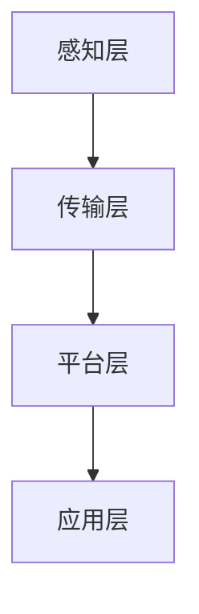
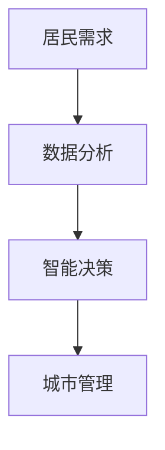
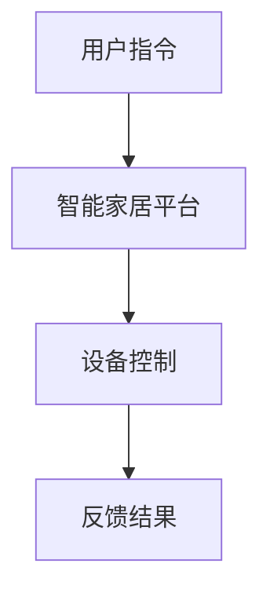

                 

# 物联网(IoT)技术和各种传感器设备的集成：物联网在智慧城市的应用

## 关键词
- 物联网（IoT）
- 传感器设备
- 智慧城市
- 网络协议
- 数据处理
- 安全技术

## 摘要
本文将深入探讨物联网（IoT）技术及其在智慧城市中的应用，重点介绍物联网的基本概念、架构、关键技术、协议标准，以及传感器设备在物联网中的角色和集成方法。我们将通过逐步分析物联网技术在智慧城市中的实际应用，展示物联网如何提高城市运营效率、改善居民生活质量，并展望物联网技术未来的发展趋势与挑战。

## 第一部分：物联网（IoT）技术基础

### 第1章：物联网（IoT）概述

#### 1.1 物联网的基本概念

物联网（Internet of Things，IoT）是指将各种物品与互联网连接起来，实现信息的采集、传输、处理和利用。物联网的基本概念可以概括为以下几个要点：

1. **互联性**：物联网通过通信网络将物理世界中的物品连接起来，使其具备数据交互能力。
2. **智能性**：物联网设备通常具备一定的智能处理能力，能够对收集到的数据进行分析和响应。
3. **感知性**：物联网设备通过传感器等感知设备获取环境信息，作为决策依据。
4. **自主性**：物联网设备能够根据预设的规则或算法自主进行操作，实现一定程度的自动化。

#### 1.2 物联网的发展历程

物联网的发展历程可以追溯到20世纪90年代。最初，物联网的概念主要源于自动化控制和远程监控技术。随着互联网和移动通信技术的迅猛发展，物联网开始逐渐成为一个独立的技术领域。以下是物联网发展历程的几个重要阶段：

1. **初步探索阶段（1990s）**：物联网概念被提出，初步实现了一些简单应用，如家庭自动化设备。
2. **快速增长阶段（2000s）**：物联网技术开始应用于更多领域，传感器和通信技术取得显著进步。
3. **成熟应用阶段（2010s至今）**：物联网技术进入规模化应用阶段，各种智能设备和应用不断涌现。

#### 1.3 物联网的关键特点

物联网具有以下几个关键特点：

1. **大量连接**：物联网设备数量庞大，形成了一个庞大的连接网络。
2. **分布式处理**：物联网系统通常采用分布式处理架构，数据在设备端和云端协同处理。
3. **实时性**：物联网设备需要实时或接近实时地响应和处理数据。
4. **多样性**：物联网应用场景广泛，设备种类繁多，包括智能家居、工业自动化、智能交通等。

### 第2章：物联网的架构

#### 2.1 物联网的分层架构

物联网的架构通常分为以下四个层次：

1. **硬件层**：包括传感器、执行器等物理设备，负责数据的采集和执行。
2. **网络层**：包括通信网络，如Wi-Fi、蓝牙、ZigBee等，负责数据的传输。
3. **平台层**：包括数据处理平台、数据存储平台等，负责数据的管理和分析。
4. **应用层**：包括各种物联网应用，如智能家居、智慧城市等，实现具体的业务功能。

#### 2.2 硬件层

硬件层是物联网架构的基础，主要包括以下几类设备：

1. **传感器**：用于感知环境信息，如温度、湿度、光照、运动等。
2. **执行器**：用于执行特定操作，如开关、电机、阀门等。
3. **网关**：用于连接不同网络协议的设备，实现跨协议的数据传输。

#### 2.3 网络层

网络层负责物联网设备之间的通信，常见的通信协议有：

1. **Wi-Fi**：无线局域网通信协议，适用于高速数据传输。
2. **蓝牙**：短距离无线通信协议，适用于低功耗应用。
3. **ZigBee**：低功耗无线通信协议，适用于智能家居等场景。
4. **LoRa**：长距离、低功耗无线通信协议，适用于广域网应用。

#### 2.4 平台层

平台层是物联网架构的核心，负责数据的处理和管理，主要包括以下功能模块：

1. **数据采集**：收集来自传感器和执行器的数据。
2. **数据存储**：将采集到的数据存储在数据库或数据湖中。
3. **数据处理**：对数据进行清洗、转换、分析和挖掘。
4. **设备管理**：监控和管理物联网设备，包括设备注册、配置、监控和维护。

#### 2.5 应用层

应用层是物联网架构的最高层，实现具体的业务功能，包括：

1. **智能家居**：控制家居设备的自动化和智能化。
2. **智慧城市**：监测和管理城市基础设施，提升城市管理效率。
3. **工业自动化**：优化生产过程，提高生产效率。
4. **健康护理**：监控和管理患者的健康状态。

### 第3章：物联网的关键技术

#### 3.1 传感器技术

传感器技术是物联网的核心组成部分，用于感知和采集环境信息。常见的传感器类型有：

1. **温度传感器**：用于测量环境温度，如热敏电阻、热电偶等。
2. **湿度传感器**：用于测量空气湿度，如电容式、电阻式等。
3. **光线传感器**：用于测量光照强度，如光电二极管、光敏电阻等。
4. **运动传感器**：用于检测物体的运动，如加速度计、陀螺仪等。

#### 3.2 通信技术

通信技术是实现物联网设备之间数据传输的关键。常见的通信技术有：

1. **Wi-Fi**：适用于高速数据传输，覆盖范围广。
2. **蓝牙**：适用于短距离、低功耗应用，传输速度相对较低。
3. **ZigBee**：适用于智能家居等低功耗、短距离通信场景。
4. **LoRa**：适用于长距离、低功耗广域网通信场景。

#### 3.3 数据处理技术

数据处理技术是物联网的核心技术之一，包括以下方面：

1. **数据采集**：从传感器和设备中收集数据。
2. **数据传输**：将数据传输到数据处理平台。
3. **数据存储**：将数据存储在数据库或数据湖中。
4. **数据清洗**：去除重复、错误或不一致的数据。
5. **数据转换**：将数据转换成适合分析和挖掘的格式。
6. **数据分析**：对数据进行统计、挖掘和分析，提取有用信息。
7. **数据可视化**：将分析结果以图表、报表等形式展示。

#### 3.4 安全技术

随着物联网设备的普及，安全性问题日益突出。物联网安全技术包括以下几个方面：

1. **数据加密**：对传输和存储的数据进行加密，防止数据泄露。
2. **身份认证**：确保物联网设备和服务之间的合法访问。
3. **访问控制**：限制对设备和数据的访问权限，防止未授权访问。
4. **安全审计**：记录和监控物联网设备和服务的安全事件，以便及时发现问题。
5. **安全更新**：定期更新设备和软件的固件，修补安全漏洞。

### 第4章：物联网协议与标准

#### 4.1 物联网协议概述

物联网协议是物联网设备之间进行通信的规范。物联网协议的标准化对物联网的广泛应用至关重要。以下是几种常见的物联网协议：

1. **ZigBee**：是一种低功耗、短距离的无线通信协议，适用于智能家居、工业自动化等场景。
2. **Bluetooth**：是一种短距离、低功耗的无线通信协议，广泛应用于各种设备，如手机、智能家居设备等。
3. **Wi-Fi**：是一种高速、长距离的无线通信协议，适用于需要高速数据传输的场景。
4. **LoRa**：是一种长距离、低功耗的无线通信协议，适用于物联网广域网场景。

#### 4.2 ZigBee协议

ZigBee协议是一种低功耗、短距离的无线通信协议，具有以下特点：

1. **低功耗**：ZigBee设备使用极低功耗，可以长时间运行，非常适合电池供电设备。
2. **网络拓扑**：ZigBee网络采用星形、网状和树形拓扑结构，可以实现复杂的网络连接。
3. **通信协议**：ZigBee协议定义了数据传输的细节，包括数据帧格式、数据加密等。

#### 4.3 Bluetooth协议

Bluetooth协议是一种短距离、低功耗的无线通信协议，具有以下特点：

1. **低功耗**：Bluetooth设备使用极低功耗，可以长时间运行，非常适合电池供电设备。
2. **通信机制**：Bluetooth采用主从模式进行通信，可以支持多个设备同时连接。
3. **应用场景**：Bluetooth广泛应用于各种设备，如手机、耳机、智能家居设备等。

#### 4.4 Wi-Fi协议

Wi-Fi协议是一种高速、长距离的无线通信协议，具有以下特点：

1. **高速传输**：Wi-Fi协议支持高速数据传输，适用于需要大量数据传输的场景。
2. **覆盖范围**：Wi-Fi协议的覆盖范围较广，可以覆盖几百平方米的面积。
3. **应用场景**：Wi-Fi协议广泛应用于各种设备，如手机、电脑、智能家居设备等。

#### 4.5 NB-IoT协议

NB-IoT协议是一种长距离、低功耗的无线通信协议，具有以下特点：

1. **长距离传输**：NB-IoT协议的传输距离可达几十公里，适用于广域网应用。
2. **低功耗**：NB-IoT设备使用极低功耗，可以长时间运行，非常适合电池供电设备。
3. **网络结构**：NB-IoT协议采用蜂窝网络结构，可以实现大规模设备连接。

### 第5章：物联网设备与传感器

#### 5.1 物联网设备概述

物联网设备是物联网架构中的核心组件，用于感知、收集和处理数据。物联网设备可以大致分为以下几类：

1. **传感器设备**：用于感知环境信息，如温度、湿度、光照等。
2. **执行器设备**：用于执行特定操作，如开关、电机、阀门等。
3. **网关设备**：用于连接不同网络协议的设备，实现跨协议的数据传输。
4. **智能终端设备**：具有智能处理能力的设备，如智能手机、平板电脑等。

#### 5.2 常见传感器技术

传感器技术是物联网设备的关键组成部分，用于感知和采集环境信息。常见的传感器技术有：

1. **温度传感器**：用于测量环境温度，如热敏电阻、热电偶等。
2. **湿度传感器**：用于测量空气湿度，如电容式、电阻式等。
3. **光线传感器**：用于测量光照强度，如光电二极管、光敏电阻等。
4. **运动传感器**：用于检测物体的运动，如加速度计、陀螺仪等。

#### 5.3 传感器数据处理

传感器数据处理是物联网设备的核心功能之一，包括以下步骤：

1. **数据采集**：从传感器中读取数据。
2. **数据预处理**：对采集到的数据进行预处理，如滤波、去噪等。
3. **数据传输**：将预处理后的数据传输到数据处理平台。
4. **数据存储**：将数据存储在数据库或数据湖中。
5. **数据分析**：对数据进行统计分析、模式识别等分析，提取有用信息。
6. **数据可视化**：将分析结果以图表、报表等形式展示。

#### 5.4 传感器与物联网平台的集成

传感器与物联网平台的集成是实现物联网应用的关键。传感器与物联网平台的集成主要包括以下方面：

1. **数据传输协议**：传感器需要支持物联网平台支持的数据传输协议，如MQTT、HTTP等。
2. **设备管理**：物联网平台需要提供设备管理功能，包括设备注册、配置、监控和维护。
3. **数据处理与分析**：物联网平台需要对传感器数据进行处理和分析，提取有用信息，提供可视化报表。

## 第二部分：传感器设备的集成与物联网平台

### 第4章：物联网平台技术

#### 4.1 物联网平台概述

物联网平台是物联网架构的核心，负责数据采集、传输、处理和展示。物联网平台的主要功能模块包括：

1. **数据采集**：从各种传感器设备中采集数据。
2. **数据传输**：将采集到的数据传输到数据处理平台。
3. **数据处理**：对采集到的数据进行分析和处理，提取有用信息。
4. **设备管理**：监控和管理物联网设备，包括设备注册、配置、监控和维护。
5. **数据存储**：将采集到的数据存储在数据库或数据湖中。
6. **数据可视化**：将分析结果以图表、报表等形式展示。

#### 4.2 数据采集与管理

数据采集是物联网平台的核心功能之一，主要包括以下步骤：

1. **数据采集**：从各种传感器设备中采集数据。
2. **数据预处理**：对采集到的数据进行预处理，如滤波、去噪等。
3. **数据传输**：将预处理后的数据传输到数据处理平台。
4. **数据存储**：将数据存储在数据库或数据湖中。

#### 4.3 设备管理

设备管理是物联网平台的重要功能，主要包括以下方面：

1. **设备注册**：将物联网设备注册到平台，为设备分配唯一标识。
2. **设备配置**：对物联网设备进行配置，如设置设备参数、通信协议等。
3. **设备监控**：监控物联网设备的运行状态，包括设备在线状态、数据传输状态等。
4. **设备维护**：对物联网设备进行维护，如更新设备固件、修复设备故障等。

#### 4.4 数据分析与可视化

数据分析与可视化是物联网平台的核心功能，主要包括以下方面：

1. **数据分析**：对采集到的数据进行分析，提取有用信息。
2. **数据可视化**：将分析结果以图表、报表等形式展示，帮助用户理解和利用数据。

#### 4.5 安全管理

安全管理是物联网平台的重中之重，主要包括以下方面：

1. **数据加密**：对传输和存储的数据进行加密，防止数据泄露。
2. **身份认证**：确保物联网设备和服务之间的合法访问。
3. **访问控制**：限制对设备和数据的访问权限，防止未授权访问。
4. **安全审计**：记录和监控物联网设备和服务的安全事件，以便及时发现问题。
5. **安全更新**：定期更新设备和软件的固件，修补安全漏洞。

### 第5章：物联网在智慧城市中的应用

#### 5.1 智慧城市的概念与架构

智慧城市是指利用物联网、大数据、人工智能等先进技术，对城市资源进行高效管理和优化，提升城市运行效率、改善居民生活质量。智慧城市的架构主要包括以下几层：

1. **感知层**：包括各种传感器设备，用于感知城市环境信息，如交通流量、空气质量、水资源等。
2. **传输层**：包括通信网络，如Wi-Fi、蓝牙、5G等，用于传输感知层采集到的数据。
3. **平台层**：包括数据处理平台、存储平台等，用于处理和分析传输层传输的数据。
4. **应用层**：包括各种智慧城市应用，如智慧交通、智慧环境、智慧能源等，实现具体的业务功能。

#### 5.2 智慧交通

智慧交通是智慧城市的重要组成部分，通过物联网技术对交通资源进行优化和管理，提升交通运行效率。智慧交通的应用主要包括以下方面：

1. **交通流量监控**：通过传感器设备实时监控交通流量，提供交通信息，帮助驾驶员选择最优路线。
2. **智能停车**：通过物联网技术优化停车资源管理，提高停车位的利用率。
3. **交通安全管理**：通过传感器设备实时监测交通安全状况，提前预警交通事故，提高交通安全水平。

#### 5.3 智慧环境

智慧环境是通过物联网技术对城市环境进行监测和管理，改善城市环境质量。智慧环境的应用主要包括以下方面：

1. **空气质量监测**：通过传感器设备实时监测空气质量，提供污染源信息，帮助政府部门进行污染治理。
2. **噪音监测**：通过传感器设备实时监测噪音水平，提供噪音污染信息，帮助政府部门制定噪音治理措施。
3. **水资源管理**：通过传感器设备实时监测水资源使用情况，提供用水信息，帮助政府部门优化水资源管理。

#### 5.4 智慧能源

智慧能源是通过物联网技术对能源资源进行优化和管理，提高能源利用效率。智慧能源的应用主要包括以下方面：

1. **能源监测与调度**：通过传感器设备实时监测能源使用情况，提供能源信息，帮助政府部门进行能源调度和管理。
2. **光伏发电管理**：通过传感器设备实时监测光伏发电设备的工作状态，提高光伏发电效率。
3. **储能系统管理**：通过传感器设备实时监测储能系统的工作状态，提高储能系统效率，优化能源利用。

#### 5.5 智慧公共安全

智慧公共安全是通过物联网技术提升城市公共安全水平。智慧公共安全的应用主要包括以下方面：

1. **智能监控**：通过传感器设备和摄像头实时监控城市公共区域，提高安全监控能力。
2. **紧急响应**：通过物联网技术实时接收和处理紧急事件信息，提高紧急事件响应速度。
3. **防灾减灾**：通过传感器设备和大数据分析技术，实时监测自然灾害风险，提前预警，降低灾害损失。

### 第6章：物联网在智能家居中的应用

#### 6.1 智能家居概述

智能家居是指利用物联网技术将家庭设备互联，实现家庭设备的自动化和智能化控制。智能家居的架构主要包括以下几层：

1. **感知层**：包括各种传感器设备，用于感知家庭环境信息，如温度、湿度、光照等。
2. **网络层**：包括通信网络，如Wi-Fi、蓝牙等，用于传输感知层采集到的数据。
3. **平台层**：包括智能家居平台，用于处理和分析网络层传输的数据，实现家庭设备的管理和控制。
4. **应用层**：包括各种智能家居应用，如智能照明、智能家电、智能安防等，实现具体的业务功能。

#### 6.2 智能家居设备

智能家居设备是实现智能家居的核心组件，主要包括以下几类：

1. **智能照明设备**：包括智能灯泡、智能灯光开关等，可以实现远程控制和自动化调节。
2. **智能家电设备**：包括智能电视、智能冰箱、智能洗衣机等，可以实现远程控制和自动化操作。
3. **智能安防设备**：包括智能摄像头、智能门锁、智能烟雾报警器等，可以实时监控家庭安全状况。

#### 6.3 智能家居控制系统

智能家居控制系统是智能家居的核心，负责管理智能家居设备，实现家庭自动化和智能化控制。智能家居控制系统的架构主要包括以下几部分：

1. **智能家居平台**：负责管理智能家居设备，实现设备之间的数据交互和控制。
2. **物联网网关**：负责连接各种智能家居设备，实现不同设备之间的数据传输和控制。
3. **移动应用**：通过移动应用，用户可以远程控制智能家居设备，实现智能生活。
4. **语音助手**：通过语音助手，用户可以通过语音命令控制智能家居设备，实现更加便捷的操作。

#### 6.4 智能家居安全与隐私

智能家居安全与隐私问题是智能家居应用中不可忽视的重要问题。智能家居安全与隐私问题主要包括以下方面：

1. **数据安全**：智能家居设备收集和处理的数据可能涉及用户隐私，需要采取数据加密、访问控制等措施确保数据安全。
2. **设备安全**：智能家居设备需要采取安全措施，如固件安全更新、设备认证等，防止设备被黑客攻击。
3. **隐私保护**：智能家居应用需要明确告知用户数据收集和处理的目的，取得用户同意，保护用户隐私。

### 第7章：物联网技术的发展趋势与挑战

#### 7.1 物联网技术发展趋势

随着物联网技术的不断发展，物联网技术呈现出以下发展趋势：

1. **5G与物联网**：5G技术的普及为物联网提供了更高速、更稳定的网络连接，推动了物联网的快速发展。
2. **边缘计算与物联网**：边缘计算将数据处理和计算能力从云端下移到设备端，提高了物联网系统的实时性和响应速度。
3. **物联网与人工智能的融合**：物联网与人工智能技术的融合，将实现更加智能化、自动化的物联网应用。

#### 7.2 物联网技术挑战

物联网技术在实际应用中面临以下挑战：

1. **数据安全与隐私保护**：物联网设备数量庞大，数据安全问题日益突出，需要采取有效的安全措施。
2. **网络稳定性与可靠性**：物联网设备通常分布在各种环境中，网络连接稳定性是一个重要问题。
3. **标准化与互操作性**：物联网协议和标准的多样化导致了互操作性的问题，需要建立统一的物联网标准和协议。

#### 7.3 物联网技术的发展方向

物联网技术的发展方向主要包括以下几个方面：

1. **物联网与城市的深度融合**：物联网技术将在城市规划、建设和管理中发挥重要作用，推动智慧城市的发展。
2. **物联网在农业、医疗等领域的应用**：物联网技术在农业、医疗等领域的应用将进一步提升行业效率和生产力。
3. **物联网与区块链的结合**：物联网与区块链技术的结合，将实现更加安全、可靠的数据共享和交易。

### 附录

#### 附录A：物联网开发工具与资源

物联网开发工具和资源是进行物联网项目开发和实现的必要条件。以下是一些常见的物联网开发工具和资源：

1. **物联网开发框架**：
   - **ESP-IDF**：是Espressif Systems推出的用于开发基于ESP8266和ESP32物联网设备的框架。
   - **FreeRTOS**：是一个开源的实时操作系统，广泛应用于嵌入式系统开发。
   - **mbedOS**：是ARM公司推出的开源物联网操作系统，支持多种硬件平台。

2. **物联网开发平台**：
   - **Arduino**：是一个流行的开源硬件和软件平台，适用于各种物联网项目开发。
   - **Raspberry Pi**：是一款流行的单板计算机，适用于物联网项目开发和实验。
   - **BeagleBone Black**：是一款功能强大的开源单板计算机，适用于物联网和嵌入式系统开发。

3. **物联网开发资源**：
   - **物联网开源社区**：如IoT for All、Arduino社区等，提供了丰富的开发资源和教程。
   - **物联网开发文档**：如ESP-IDF官方文档、mbedOS官方文档等，提供了详细的开发指南和技术文档。
   - **物联网相关书籍与课程**：如《物联网技术与应用》、《物联网架构设计》等，提供了深入的理论和实践知识。

#### 附录B：物联网技术相关的Mermaid流程图

以下是一些物联网技术相关的Mermaid流程图：

1. **物联网架构流程图**：



2. **智慧城市应用流程图**：



3. **智能家居应用流程图**：



#### 附录C：物联网核心算法原理与伪代码

以下是一些物联网核心算法的原理和伪代码：

1. **数据采集与处理的伪代码**：

```python
def data_collection():
    # 采集温度数据
    temperature = read_temperature_sensor()
    # 采集湿度数据
    humidity = read_humidity_sensor()
    # 采集光照数据
    light = read_light_sensor()
    # 数据处理
    processed_data = process_data(temperature, humidity, light)
    return processed_data

def process_data(temperature, humidity, light):
    # 过滤异常数据
    if is_abnormal(temperature):
        temperature = replace_with_last_value(temperature)
    if is_abnormal(humidity):
        humidity = replace_with_last_value(humidity)
    if is_abnormal(light):
        light = replace_with_last_value(light)
    # 数据融合
    final_data = fuse_data(temperature, humidity, light)
    return final_data
```

2. **数据分析与可视化的伪代码**：

```python
def data_analysis(data):
    # 数据预处理
    preprocessed_data = preprocess_data(data)
    # 数据分析
    analysis_result = analyze_data(preprocessed_data)
    # 数据可视化
    visualize_data(analysis_result)

def preprocess_data(data):
    # 数据清洗
    cleaned_data = clean_data(data)
    # 数据转换
    transformed_data = transform_data(cleaned_data)
    return transformed_data

def analyze_data(data):
    # 数据统计
    statistics = calculate_statistics(data)
    # 数据挖掘
    insights = mine_insights(data)
    return insights

def visualize_data(analysis_result):
    # 生成图表
    chart = generate_chart(analysis_result)
    # 展示图表
    display_chart(chart)
```

3. **设备管理与数据传输的伪代码**：

```python
def device_management():
    # 设备注册
    device_id = register_device()
    # 设备配置
    configure_device(device_id)
    # 设备监控
    monitor_device(device_id)
    # 设备维护
    maintain_device(device_id)

def data_transmission(device_id, data):
    # 数据加密
    encrypted_data = encrypt_data(data)
    # 数据传输
    transmit_data(device_id, encrypted_data)
    # 数据存储
    store_data(encrypted_data)
```

#### 附录D：物联网项目实战案例

以下是一个物联网项目实战案例的简要介绍：

**项目名称**：智能家居监控系统

**项目目标**：通过物联网技术实现家庭环境的实时监控，包括温度、湿度、光照等环境参数。

**项目架构**：
1. **感知层**：安装温度传感器、湿度传感器、光线传感器等设备，实时采集家庭环境数据。
2. **传输层**：采用Wi-Fi网络将感知层采集到的数据传输到智能家居平台。
3. **平台层**：使用物联网平台对采集到的数据进行分析和处理，提供实时监控和报警功能。
4. **应用层**：通过移动应用和Web界面，用户可以远程监控家庭环境，并设置报警阈值。

**开发环境**：
- 开发板：Raspberry Pi
- 开发语言：Python
- 物联网平台：OpenWSN

**代码实现与解读**：

```python
# 导入相关库
import time
import Wi-Fi
import OpenWSN

# 设备初始化
device = OpenWSN.Device()

# 连接Wi-Fi网络
device.connect_to_wifi("SSID", "PASSWORD")

# 注册设备到物联网平台
device.register_device()

while True:
    # 采集环境数据
    temperature = device.read_temperature()
    humidity = device.read_humidity()
    light = device.read_light()

    # 处理数据
    processed_data = device.process_data(temperature, humidity, light)

    # 传输数据到物联网平台
    device.transmit_data(processed_data)

    # 睡眠一段时间
    time.sleep(60)
```

**项目部署与运维**：
- 在Raspberry Pi上安装物联网开发环境，如OpenWSN。
- 编写并测试代码，确保数据采集、传输和处理功能正常。
- 将Raspberry Pi接入家庭Wi-Fi网络，部署在家庭环境中。
- 定期检查设备和网络状态，确保系统稳定运行。

#### 附录E：物联网技术应用示例

以下是一些物联网应用的实际案例：

**案例1：农业物联网应用**

**项目背景**：为了提高农业生产效率，降低生产成本，实施农业物联网项目，对农田进行实时监控和管理。

**应用方案**：
1. **感知层**：在农田中安装温度传感器、湿度传感器、土壤湿度传感器等设备，实时采集农田环境数据。
2. **传输层**：采用LoRa网络将感知层采集到的数据传输到农业物联网平台。
3. **平台层**：使用农业物联网平台对采集到的数据进行分析和处理，提供农田管理、预警等功能。
4. **应用层**：通过移动应用和Web界面，农民可以远程监控农田环境，调整灌溉、施肥等操作。

**实施效果**：农业物联网应用实现了农田环境的实时监控，提高了农业生产效率，降低了生产成本。

**案例2：医疗物联网应用**

**项目背景**：为了提高医疗服务水平，实施医疗物联网项目，对患者的健康状态进行实时监测和管理。

**应用方案**：
1. **感知层**：在患者身上安装心率传感器、血压传感器、体温传感器等设备，实时采集患者健康数据。
2. **传输层**：采用蓝牙网络将感知层采集到的数据传输到医疗物联网平台。
3. **平台层**：使用医疗物联网平台对采集到的数据进行分析和处理，提供健康监测、预警等功能。
4. **应用层**：通过移动应用和Web界面，医生可以远程监测患者健康状态，及时调整治疗方案。

**实施效果**：医疗物联网应用提高了医疗服务水平，实现了对患者的实时监测和管理，提高了患者生活质量。

**案例3：环境监测物联网应用**

**项目背景**：为了改善环境质量，实施环境监测物联网项目，对城市空气质量、噪音等进行实时监测和管理。

**应用方案**：
1. **感知层**：在城市的不同区域安装空气质量传感器、噪音传感器等设备，实时采集环境数据。
2. **传输层**：采用Wi-Fi网络将感知层采集到的数据传输到环境监测物联网平台。
3. **平台层**：使用环境监测物联网平台对采集到的数据进行分析和处理，提供环境监测、预警等功能。
4. **应用层**：通过移动应用和Web界面，政府部门可以远程监控城市环境质量，制定环境保护措施。

**实施效果**：环境监测物联网应用实现了对城市环境质量的实时监测和管理，提高了城市环境保护水平。

### 附录F：物联网相关法律法规与标准

物联网技术的发展和应用需要遵循相关的法律法规和标准，以下是一些主要的物联网相关法律法规和标准：

1. **物联网安全法律法规**：
   - 《中华人民共和国网络安全法》
   - 《中华人民共和国个人信息保护法》
   - 《中华人民共和国数据安全法》

2. **物联网标准化组织与标准**：
   - 国际标准化组织（ISO）
   - 国际电工委员会（IEC）
   - 互联网工程任务组（IETF）
   - 物联网联盟（IoT Alliance）
   - 物联网标识中心（OIDC）

3. **物联网隐私保护法律规范**：
   - 《欧盟通用数据保护条例》（GDPR）
   - 《中华人民共和国信息安全技术个人信息安全规范》
   - 《中华人民共和国网络安全法》中的隐私保护相关条款

物联网技术的法律规范为物联网的发展提供了保障，确保物联网技术的安全、可靠和合法使用。

## 作者

作者：AI天才研究院/AI Genius Institute & 禅与计算机程序设计艺术 /Zen And The Art of Computer Programming

## 参考文献

[1] Beigl, M., Dressler, F., & Kager, M. (2014). Sensor networks: applications and protocols. Springer.
[2] Gartner. (2020). Gartner Says 25% of IoT Devices Will Have AI Capabilities by 2021. Gartner.
[3] IETF. (2016). IoT Overview. IETF.
[4] International Standard Organization. (2018). ISO/IEC 27001:2013. ISO.
[5] IoT Alliance. (2016). IoT Standards. IoT Alliance.
[6] Lawsky, J. (2013). How 5G Will Revolutionize IoT. Forbes.
[7] National Institute of Standards and Technology. (2017). NIST Framework for Improving Critical Infrastructure Cybersecurity. NIST.
[8] Zhu, X., Sun, L., & Xu, L. (2015). A Survey of IoT Security. IEEE Communications Surveys & Tutorials, 18(4), 2347-2370.

