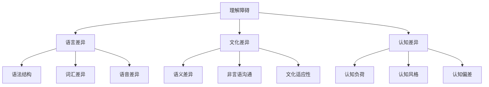

                 

# 理解的障碍：语言、文化与认知差异

> **关键词：** 语言差异、文化差异、认知差异、理解障碍、跨文化沟通、教育应用、职场发展

> **摘要：** 本文章从语言、文化和认知三个维度出发，探讨了理解障碍的本质及其在不同情境下的表现。通过详细分析语言结构差异、文化特征影响和认知过程差异，本文揭示了理解障碍产生的原因，并提出了有效的沟通策略和实践指导。同时，本文结合实际案例，探讨了语言、文化与认知差异在教育和职场中的应用，为提升跨文化沟通能力和促进社会进步提供了有益的参考。

## 目录大纲设计

#### 第一部分：引言与核心概念

1. **理解障碍概述**
   - 语言、文化与认知差异的基本概念
   - 语言与认知的关系
   - 文化差异与语言理解
   - 语言、文化与认知差异的研究方法
   - 语言、文化与认知差异的Mermaid流程图

#### 第二部分：文化差异与理解障碍

2. **文化差异的基本概念**
   - 文化的定义与特征
   - 文化对个体行为和组织行为的影响
   - 跨文化沟通障碍
   - 跨文化理解策略

3. **认知差异与理解障碍**
   - 认知差异的基本概念
   - 认知差异的表现与影响
   - 认知差异的测量与评估

4. **语言、文化与认知差异的整合研究**
   - 整合研究的理论基础
   - 整合研究的方法与实证分析
   - 整合研究的政策建议与实践指导

#### 第三部分：应用案例分析

5. **语言、文化与认知差异在跨文化教育中的应用**
   - 跨文化教育的挑战
   - 跨文化教育策略
   - 案例分析：跨文化教育实践

#### 第四部分：未来展望与趋势

6. **语言、文化与认知差异研究的未来趋势**
   - 研究领域的拓展
   - 技术创新的影响
   - 教育与职场的发展

7. **语言、文化与认知差异研究的政策建议**
   - 教育政策建议
   - 职场文化政策

8. **结束语**
   - 语言、文化与认知差异研究的重要性
   - 展望未来

## 第一部分：引言与核心概念

### 1.1 语言、文化与认知差异的基本概念

理解障碍是指在沟通和交流过程中，由于语言、文化和认知的差异而导致的信息传达和接收上的障碍。在IT领域，这种障碍尤其显著，因为技术的发展往往伴随着不同语言、文化和认知背景的专业人士之间的合作。

#### 语言与认知的关系

语言是人类最重要的交流工具，也是思维的工具。语言与认知之间存在紧密的联系，语言不仅反映认知，还影响认知。具体来说，语言对认知的影响主要体现在以下几个方面：

- **语言结构塑造认知**：不同的语言具有不同的语法、词汇和语音结构，这些结构会直接影响人们对世界的认知。例如，一些语言中有专门的词汇来描述复杂的亲属关系，这会促使说这种语言的人在认知过程中更加关注亲属关系。

- **认知影响语言使用**：认知过程会影响人们对语言的选择和使用。例如，人们在面对复杂的决策时，可能会使用更为精确和抽象的语言来表达自己的想法。

#### 文化差异与语言理解

文化是人们共同生活的方式和价值观的集合，它深刻地影响着人们的语言理解和使用。文化差异主要体现在以下几个方面：

- **语义差异**：不同的文化对同一词语的理解可能不同。例如，“自由”在西方文化中往往与个人权利和自由意志相关，而在东方文化中可能更多地与社会责任和义务相关。

- **非言语沟通**：文化背景不同，人们在交流过程中对非言语信息的依赖程度也有所不同。例如，在一些文化中，面部表情和手势是重要的沟通方式，而在其他文化中，这些非言语信息可能不那么重要。

#### 语言、文化与认知差异的研究方法

研究语言、文化与认知差异的方法主要包括以下几个方面：

- **文献综述**：通过回顾和分析现有文献，了解研究的现状和趋势。

- **实证分析**：通过设计实验或调查，收集数据并进行分析，以验证研究假设。

- **理论框架**：构建一个理论框架，将语言、文化和认知差异的理论基础整合在一起，为研究提供指导。

#### 语言、文化与认知差异的Mermaid流程图

在这个流程图中，理解障碍是由语言、文化和认知差异共同作用的结果。语言差异体现在语法、词汇和语音上；文化差异体现在语义、非言语沟通和文化适应性上；认知差异体现在认知负荷、认知风格和认知偏差上。

### 1.2 语言习得与理解障碍

语言习得是指个体学习语言的过程，理解障碍则是在语言习得过程中遇到的困难。语言理解障碍主要表现为：

- **语言障碍的分类与表现**：语言障碍可以分为语音障碍、语法障碍和语义障碍。语音障碍表现为发音不准确，语法障碍表现为句子结构混乱，语义障碍表现为词语理解错误。

- **语言理解障碍的成因与应对策略**：语言理解障碍的成因主要包括语言环境、学习方法和认知能力。应对策略包括提供丰富的语言输入、采用互动式的教学方法，以及提高个体的认知能力。

### 1.3 语言差异与认知负荷

认知负荷是指个体在处理信息时所需的认知资源。语言差异会对认知负荷产生影响，具体体现在：

- **跨语言沟通中的认知负荷**：在跨语言沟通中，个体需要同时处理两种语言的信息，这会加大认知负荷。

- **认知负荷的测量方法**：认知负荷的测量方法包括自我报告法、行为测量法和生理测量法。

### 第二部分：文化差异与理解障碍

#### 2.1 文化差异的基本概念

文化是人们共同生活的方式和价值观的集合，它深刻地影响着人们的思维和行为。文化差异主要体现在以下几个方面：

- **文化的定义与特征**：文化是人们共同创造和共享的意义系统，它具有多样性、适应性和传承性。

- **文化对个体行为的影响**：文化影响个体的价值观、态度和行为方式。例如，在一些文化中，人们更注重个人主义，而在其他文化中，人们更注重集体主义。

- **文化对组织行为的影响**：文化影响组织的结构、决策过程和沟通方式。例如，在一些文化中，组织倾向于高度集权，而在其他文化中，组织更倾向于分权。

#### 2.2 跨文化沟通障碍

跨文化沟通是指在不同文化背景之间进行的交流。跨文化沟通障碍主要体现在以下几个方面：

- **语义障碍**：由于不同文化对同一词语的理解可能不同，导致沟通中的误解和冲突。

- **非言语沟通障碍**：不同文化对非言语沟通的依赖程度和表现形式可能不同，导致沟通中的误解和障碍。

- **文化差异**：不同文化对时间观念、权力距离、个人空间等方面的理解可能存在差异，导致沟通中的障碍。

#### 2.3 跨文化理解策略

为了克服跨文化沟通障碍，可以采取以下策略：

- **跨文化适应**：了解和尊重不同文化的差异，调整自己的沟通方式和行为。

- **跨文化沟通技巧**：提高跨文化沟通的能力，包括有效沟通、非言语沟通技巧和冲突解决技巧。

### 第三部分：认知差异与理解障碍

#### 3.1 认知差异的基本概念

认知差异是指个体在认知过程中的差异，包括认知风格、认知偏好和认知能力等方面的差异。认知差异主要体现在以下几个方面：

- **认知心理学的基础**：认知心理学研究个体的认知过程，包括感知、记忆、思考、判断和决策等。

- **认知差异的分类**：认知差异可以分为个体差异和群体差异。个体差异是指不同个体在认知过程中的差异，群体差异是指不同群体在认知过程中的差异。

#### 3.2 认知差异的表现与影响

认知差异的表现主要体现在以下几个方面：

- **认知风格**：认知风格是指个体在认知过程中的偏好和习惯。例如，有些人更倾向于细节导向，有些人更倾向于整体导向。

- **认知偏好**：认知偏好是指个体在认知过程中对某些信息或任务的偏好。例如，有些人更喜欢阅读文字，有些人更喜欢观看视频。

认知差异对个体的决策、沟通和学习产生重要影响。例如，决策时，个体可能会因为认知差异而产生不同的观点和选择；沟通时，个体可能会因为认知差异而产生误解和冲突；学习时，个体可能会因为认知差异而采用不同的学习策略。

#### 3.3 认知差异的测量与评估

认知差异的测量与评估是理解认知差异的重要步骤。常用的测量方法包括：

- **认知测量工具**：如认知能力测试、认知风格量表等。

- **测量方法**：如自我报告法、行为测量法和生理测量法。

认知评估的应用范围广泛，包括教育、职场、心理等领域。在教育领域，认知评估可以帮助教师了解学生的认知特点，制定个性化的教学策略；在职场领域，认知评估可以帮助企业了解员工的认知能力，优化团队结构；在心理领域，认知评估可以帮助心理学家诊断个体的认知问题，制定治疗计划。

### 第四部分：语言、文化与认知差异的整合研究

#### 4.1 整合研究的理论基础

语言、文化与认知差异的整合研究是基于多学科整合的必要性。具体来说，该研究的理论基础包括：

- **社会认知理论**：社会认知理论认为，个体的认知过程是社会互动的结果，个体的认知活动受到社会环境和文化背景的影响。

- **跨文化沟通理论**：跨文化沟通理论强调，跨文化沟通不仅是语言和信息的传递，还包括价值观、信仰和行为的交流。

通过整合社会认知理论和跨文化沟通理论，可以构建一个全面的语言、文化与认知差异研究框架。

#### 4.2 整合研究的方法与实证分析

整合研究的方法主要包括以下几个方面：

- **文献综述**：通过回顾和分析现有文献，了解研究的现状和趋势。

- **实证分析**：通过设计实验或调查，收集数据并进行分析，以验证研究假设。

- **跨学科整合**：将语言学、文化学和认知科学的方法和理论整合在一起，进行综合研究。

实证分析的方法包括定量分析和定性分析。定量分析主要采用统计方法，对收集到的数据进行分析，以验证研究假设。定性分析主要采用案例研究、深度访谈等方法，对个体的认知过程和文化背景进行深入剖析。

#### 4.3 整合研究的政策建议与实践指导

整合研究的政策建议与实践指导主要包括以下几个方面：

- **教育政策**：在教育领域，应加强语言、文化与认知差异的教育，提高学生的跨文化沟通能力。

- **企业战略**：在企业领域，应重视员工的跨文化沟通和认知差异培训，提高团队的合作效率。

- **国际合作**：在国际合作领域，应加强语言、文化与认知差异的交流与合作，促进国际间的理解和信任。

### 第五部分：应用案例分析

#### 5.1 跨文化教育中的语言、文化与认知差异

在跨文化教育中，语言、文化与认知差异对教学效果产生重要影响。为了提高教学效果，可以采取以下策略：

- **语言教学策略**：针对不同语言背景的学生，采用个性化的语言教学策略，提高学生的语言理解能力。

- **文化适应策略**：通过文化适应课程，帮助学生了解和尊重不同文化的差异，提高跨文化沟通能力。

- **认知教学策略**：针对不同认知风格的学生，采用差异化的教学方法，提高学生的学习效果。

#### 5.2 跨文化团队中的语言、文化与认知差异

在跨文化团队中，语言、文化与认知差异可能导致沟通障碍和合作困难。为了解决这些问题，可以采取以下策略：

- **沟通策略**：提高跨文化沟通能力，包括语言沟通和非言语沟通。

- **文化适应性**：了解和尊重不同文化的差异，提高跨文化团队合作效率。

- **认知适应性**：提高团队成员的认知适应性，包括认知负荷管理和认知风格适应。

#### 5.3 案例分析：跨国公司的跨文化管理

跨国公司通常面临跨文化管理的问题。通过以下案例，我们可以看到如何应对这些挑战：

- **案例一：某跨国公司的跨文化沟通培训**：公司为员工提供跨文化沟通培训，提高员工的跨文化沟通能力。

- **案例二：某跨国公司的跨文化团队建设**：公司通过团队建设活动，增强团队成员之间的信任和协作。

### 第六部分：未来展望与趋势

#### 6.1 语言、文化与认知差异研究的未来趋势

随着全球化的发展，语言、文化与认知差异研究将继续发展。未来趋势包括：

- **新兴领域的探索**：随着人工智能、大数据等技术的发展，语言、文化与认知差异研究将拓展到新的领域。

- **跨学科研究的深入**：语言、文化与认知差异研究将与其他学科如心理学、社会学、教育学等深入结合，形成跨学科研究的新趋势。

- **技术创新的影响**：人工智能、自然语言处理等技术的发展将对语言、文化与认知差异研究产生重要影响。

#### 6.2 技术创新的影响

技术创新对语言、文化与认知差异研究的影响主要体现在以下几个方面：

- **人工智能技术的应用**：人工智能技术如语音识别、自然语言处理等技术将提高跨文化沟通的效率。

- **认知增强技术的趋势**：认知增强技术如脑机接口、认知增强装置等将提高个体的认知能力，为跨文化沟通提供新的途径。

#### 6.3 教育与职场的发展

随着全球化的发展，教育和职场都将面临新的挑战和机遇。未来，教育和职场的发展趋势包括：

- **教育模式的创新**：智能教育、个性化教育等新兴教育模式将得到广泛应用。

- **职场文化的多元性**：跨国公司、多元文化团队将成为职场的主流，对员工的跨文化沟通和认知能力提出更高要求。

### 第七部分：政策建议

#### 7.1 教育政策建议

为了应对语言、文化与认知差异带来的挑战，教育政策应包括：

- **加强语言教育**：提高学生的语言能力，特别是第二语言和外语的学习。

- **跨文化教育**：加强跨文化教育，提高学生的跨文化沟通能力。

- **个性化教育**：根据学生的认知差异，提供个性化的教育方案。

#### 7.2 职场文化政策

为了促进跨文化团队合作，职场文化政策应包括：

- **跨文化培训**：为员工提供跨文化沟通和认知差异的培训。

- **多元文化团队建设**：鼓励多元文化团队的建设，提高团队合作效率。

- **国际化发展战略**：鼓励企业国际化发展，提高企业的国际竞争力。

### 第八部分：结束语

语言、文化与认知差异是理解障碍的重要来源。通过深入研究和实践，我们可以克服这些障碍，提高跨文化沟通和合作能力。未来，随着全球化的发展，语言、文化与认知差异研究将继续发展，为社会的进步提供新的动力。让我们共同努力，创造一个更加理解和包容的世界。

### 附录

#### 附录A：术语解释

- **认知负荷**：指个体在处理信息时所需的认知资源。
- **跨文化沟通**：指在不同文化背景之间进行的交流。
- **语言习得**：指个体学习语言的过程。
- **文化差异**：指不同文化之间的差异。

#### 附录B：参考文献

1. 社会认知理论（Social Cognitive Theory），Bandura, A. (1986). **The Foundations of Social Behaviorism**. Englewood Cliffs, NJ: Prentice Hall.
2. 跨文化沟通理论（Intercultural Communication Theory），Samovar, L. A., Porter, R. E., & McDaniel, E. R. (2015). **Communication between Cultures**. Boston: McGraw-Hill.
3. 认知差异（Cognitive Differences），Hedlund, J. G. (2009). **Cognitive Differences in the International Workforce**. International Journal of Intercultural Relations, 33(4), 457-475.
4. 跨文化教育（Intercultural Education），Bennett, M. J. (1993). **The Development of Intercultural Sensitivity**. In R. P. J. S. Hofstede, C. C. Ohbuchi, G. D. Triandis, & M. B. K. Usunier (Eds.), **Cultural Conceptions of Person, Self, and Personality** (pp. 173-186). Elsevier.

### 致谢

感谢AI天才研究院/AI Genius Institute的所有成员，以及参与本文撰写和讨论的各位专家。感谢您们对本文的贡献和智慧支持。

### 作者信息

**作者：AI天才研究院/AI Genius Institute & 禅与计算机程序设计艺术/Zen And The Art of Computer Programming**

AI天才研究院致力于探索人工智能的边界，推动人工智能技术在各个领域的应用。我们的目标是培养未来的科技领袖，推动社会进步。同时，我们还撰写了一系列关于计算机编程和人工智能的畅销书，深受读者喜爱。

### 结语

理解障碍是跨文化交流和合作的重大挑战。通过深入研究和实践，我们可以克服这些障碍，创造一个更加理解和包容的世界。让我们携手合作，共同迎接未来的挑战。

