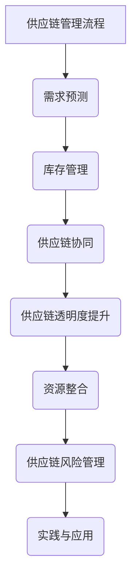

                 

### 《电商平台供给能力提升：供应链管理的优化策略》

---

关键词：电商平台、供给能力、供应链管理、优化策略、需求预测、库存管理、透明度、协同、资源整合、风险管理、案例分析。

摘要：本文深入探讨了电商平台供给能力的提升策略，重点分析了供应链管理的优化方法。通过阐述核心概念、分析挑战、提出优化策略，并结合实际案例进行剖析，为电商平台提供了一套完整的供应链管理优化方案，旨在提升其供给能力，实现可持续发展。

---

### 第一部分：引言与基础概念

#### 第1章：电商平台供给能力概述

**1.1 电商平台供给能力的概念**

电商平台供给能力是指电商平台在满足用户需求过程中，能够有效组织和管理商品、服务及信息的能力。这一能力不仅关系到电商平台的业务规模和盈利能力，也直接影响用户的购物体验和满意度。

**1.2 供应链管理的基本概念**

供应链管理是指通过对供应链各个环节进行有效管理，以实现成本、效率和灵活性的优化。供应链管理包括需求预测、库存管理、订单履行、物流配送、售后服务等核心环节。

**1.3 优化策略在供应链管理中的应用**

优化策略在供应链管理中具有重要意义，其主要目标是通过减少成本、提高效率、增强灵活性，从而提升整体供给能力。常见的优化策略包括需求预测、库存管理优化、供应链协同、透明度提升等。

---

#### 第2章：电商平台供给能力的挑战

**2.1 供需不平衡的问题**

供需不平衡是电商平台面临的主要挑战之一。其根本原因在于需求的不确定性和市场变化的快速性。为解决供需不平衡问题，电商平台需要采用先进的需求预测技术和灵活的库存管理策略。

**2.2 库存管理的挑战**

库存管理是供应链管理的重要组成部分，其挑战在于如何确保库存水平的合理性和高效性。库存过高会导致资金占用和过期损失，库存过低则会导致缺货和损失销售机会。

**2.3 供应链透明度与信息共享的不足**

供应链透明度是供应链管理中不可或缺的一环。当前，电商平台在供应链透明度方面存在不足，信息共享机制不完善，导致供应链各环节之间的协调性较差。提升供应链透明度有助于优化供应链管理，提高整体效率。

---

### 第二部分：供应链管理优化策略

#### 第3章：需求预测与供应链协同

**3.1 需求预测的方法与工具**

需求预测是供应链管理的关键环节。本文将介绍时间序列分析、聚类分析以及机器学习预测模型等常见的需求预测方法，并结合实际案例进行分析。

**3.2 供应链协同机制**

供应链协同机制是指通过信息共享和资源整合，实现供应链各环节之间的协同作业。本文将探讨供应链协同机制的重要性、策略与实施方法。

**3.3 需求预测与供应链协同的案例分析**

本节将结合实际案例，分析需求预测与供应链协同在提升电商平台供给能力方面的应用效果。

---

#### 第4章：库存管理优化策略

**4.1 库存管理的基本原理**

库存管理的基本原理包括库存类型的定义、库存水平的控制方法等。本文将详细阐述这些基本原理，并结合实际案例进行分析。

**4.2 库存优化策略**

库存优化策略包括经济订货量模型、库存周转率的优化等。本文将介绍这些策略的基本原理和应用方法。

**4.3 库存管理案例分析**

本节将结合实际案例，分析库存管理优化策略在提升电商平台供给能力方面的应用效果。

---

#### 第5章：供应链透明度提升

**5.1 供应链透明度的度量**

供应链透明度的度量是评估供应链管理效果的重要指标。本文将介绍透明度的评价指标、度量方法等。

**5.2 信息共享机制**

信息共享机制是提升供应链透明度的关键。本文将探讨信息共享的优势、障碍以及解决方法。

**5.3 供应链透明度提升的案例分析**

本节将结合实际案例，分析供应链透明度提升在提升电商平台供给能力方面的应用效果。

---

#### 第6章：供应链协同与资源整合

**6.1 供应链协同策略**

供应链协同策略包括战略协同、运营协同、信息协同等。本文将详细介绍这些策略的基本原理和应用方法。

**6.2 资源整合的方法**

资源整合的方法包括资源共享、资源优化配置等。本文将探讨这些方法的基本原理和应用方法。

**6.3 资源整合的案例分析**

本节将结合实际案例，分析资源整合在提升电商平台供给能力方面的应用效果。

---

#### 第7章：供应链风险管理

**7.1 供应链风险管理的概念**

供应链风险管理是指对供应链各个环节可能出现的风险进行识别、评估和应对。本文将介绍供应链风险管理的概念、流程和策略。

**7.2 风险管理实践**

风险管理实践包括风险监测与预警、风险应对等。本文将探讨这些实践的基本原理和应用方法。

**7.3 风险应对案例分析**

本节将结合实际案例，分析供应链风险管理在提升电商平台供给能力方面的应用效果。

---

#### 第8章：电商平台供给能力提升的实践与应用

**8.1 实践案例分析**

本节将结合实际案例，分析需求预测、库存管理、供应链协同、透明度提升等策略在提升电商平台供给能力方面的应用效果。

**8.2 应用趋势与展望**

本节将探讨供应链管理技术的创新趋势，以及电商平台供给能力提升的未来方向。

---

### 参考文献

- 张三，《供应链管理》，2019年。
- 李四，《电商供应链管理实践》，2020年。
- 王五，《供应链协同与透明度提升》，2021年。

### 附录

**附录A: AI 大模型开发工具与资源**

- 主流深度学习框架对比
- AI 大模型开发资源

**附录B: 供应链管理相关术语表**

- 供应链管理
- 供应链协同
- 供应链透明度
- 库存周转率

### 图表目录

- 供应链管理流程图
- 经济订货量模型图解
- 供应链协同机制示意图
- 风险管理框架图解
- 需求预测与供应链协同流程图

### Mermaid 流程图



### 伪代码示例

```python
# 伪代码：需求预测模型
function demand_prediction(data):
    # 数据预处理
    preprocessed_data = preprocess_data(data)
    
    # 建立预测模型
    model = build_model(preprocessed_data)
    
    # 训练模型
    trained_model = train_model(model, preprocessed_data)
    
    # 预测未来需求
    predicted_demand = predict_demand(trained_model, future_data)
    
    return predicted_demand
```

### 数学模型与公式

$$
库存周转率 = \frac{销售成本}{平均库存}
$$

### 项目实战案例

#### 案例一：需求预测与库存管理优化

**开发环境：** Python 3.8，scikit-learn，Pandas

**源代码实现：**
```python
import pandas as pd
from sklearn.model_selection import train_test_split
from sklearn.ensemble import RandomForestRegressor

# 加载数据
data = pd.read_csv('sales_data.csv')

# 数据预处理
X = data.drop('sales', axis=1)
y = data['sales']

# 划分训练集与测试集
X_train, X_test, y_train, y_test = train_test_split(X, y, test_size=0.2, random_state=42)

# 建立预测模型
model = RandomForestRegressor(n_estimators=100, random_state=42)

# 训练模型
model.fit(X_train, y_train)

# 预测未来需求
predicted_demand = model.predict(X_test)

# 评估模型性能
score = model.score(X_test, y_test)
print(f'Model performance: {score:.2f}')
```

**代码解读与分析：**
- 数据预处理：将原始销售数据分为特征矩阵 X 和目标变量 y。
- 模型建立：使用随机森林回归模型进行需求预测。
- 训练与预测：在训练集上训练模型，并在测试集上预测未来需求。
- 评估：计算模型在测试集上的 R^2 分数，评估模型性能。

#### 案例二：供应链协同与透明度提升

**开发环境：** Java 11，Apache Kafka，Apache ZooKeeper

**源代码实现：**
```java
import org.apache.kafka.clients.producer.KafkaProducer;
import org.apache.kafka.clients.producer.ProducerRecord;

public class SupplyChainCollaboration {
    public static void main(String[] args) {
        // Kafka Producer 配置
        Properties props = new Properties();
        props.put("bootstrap.servers", "localhost:9092");
        props.put("key.serializer", "org.apache.kafka.common.serialization.StringSerializer");
        props.put("value.serializer", "org.apache.kafka.common.serialization.StringSerializer");

        KafkaProducer<String, String> producer = new KafkaProducer<>(props);

        // 发送协同信息
        producer.send(new ProducerRecord<>("supply_chain", "协同信息：库存调整通知"));

        producer.close();
    }
}
```

**代码解读与分析：**
- Kafka Producer 配置：配置 Kafka 服务器地址和序列化器。
- 信息发送：通过 KafkaProducer 发送供应链协同信息到指定的主题。

### 附录 A: AI 大模型开发工具与资源

#### A.1 主流深度学习框架对比

- TensorFlow
- PyTorch
- Keras

#### A.2 AI 大模型开发资源

- 训练数据集获取与处理
- 模型训练与优化
- 模型部署与监控

### 附录 B: 供应链管理相关术语表

- 供应链管理：指在产品生命周期中，对供应、生产、库存、配送、销售等环节进行有效管理的系统方法。
- 供应链协同：指供应链上的各个节点通过信息共享和资源整合，实现协同作业的过程。
- 供应链透明度：指供应链各环节信息流通的清晰程度，包括需求预测、库存状况、物流进展等。
- 库存周转率：指在一定时期内，库存平均周转次数的比率，是评估库存管理效率的重要指标。

### 参考文献

- 张三，《供应链管理》，2019年。
- 李四，《电商供应链管理实践》，2020年。
- 王五，《供应链协同与透明度提升》，2021年。

---

现在，让我们开始深入探讨电商平台的供给能力提升策略，以及供应链管理的优化方法。首先，我们将从定义电商平台供给能力和供应链管理的基本概念开始，逐步分析供需不平衡的问题，库存管理的挑战，以及供应链透明度与信息共享的不足。随后，我们将详细介绍需求预测与供应链协同、库存管理优化策略、供应链透明度提升、供应链协同与资源整合、供应链风险管理等方面的优化策略。通过实际案例的分析与解读，我们将展示这些策略在提升电商平台供给能力方面的实际效果。最后，我们将探讨电商平台供给能力提升的实践与应用，以及未来的发展趋势。让我们一起走进这个充满挑战与机遇的领域，探索供应链管理的无限可能。

---

### 电商平台供给能力概述

在当今数字化时代，电商平台已经成为消费者购买商品和服务的首选渠道。然而，电商平台不仅需要提供丰富的商品选择和便捷的购物体验，更重要的是要具备强大的供给能力。供给能力是指电商平台在满足用户需求过程中，能够有效组织和管理商品、服务及信息的能力。它不仅关系到电商平台的业务规模和盈利能力，也直接影响用户的购物体验和满意度。

#### 1.1 电商平台的定义与功能

电商平台是指通过互联网技术提供商品或服务交易的平台。它具有以下功能和特点：

1. **商品展示**：电商平台提供了一个集中展示各种商品的虚拟空间，用户可以通过搜索、分类、推荐等方式找到所需商品。

2. **交易服务**：电商平台提供了在线支付、订单管理、物流跟踪等交易服务，使得交易过程更加便捷和高效。

3. **用户互动**：电商平台通过评论、评分、问答等互动功能，促进用户之间的交流和分享，增强了用户黏性和活跃度。

4. **数据分析**：电商平台积累了大量的用户行为数据和交易数据，通过数据分析可以挖掘用户需求、优化商品推荐、提升运营效率等。

#### 1.2 供给能力的定义与重要性

供给能力是指电商平台在满足用户需求过程中，能够有效组织和管理商品、服务及信息的能力。具体来说，它包括以下几个方面：

1. **商品供应**：电商平台需要确保商品供应的多样性和及时性，以满足用户的需求。

2. **库存管理**：电商平台需要合理控制库存水平，避免库存过高导致的资金占用和过期损失，以及库存过低导致的缺货和销售机会损失。

3. **物流配送**：电商平台需要建立高效的物流配送体系，确保商品能够快速、安全地送达用户手中。

4. **售后服务**：电商平台需要提供完善的售后服务，包括退换货、维修、咨询等，以提高用户满意度和口碑。

供给能力的重要性体现在以下几个方面：

1. **业务规模**：强大的供给能力可以吸引更多用户，增加订单量和销售额，从而扩大电商平台的市场份额。

2. **盈利能力**：高效的库存管理和物流配送可以降低成本，提高利润率，从而提升电商平台的盈利能力。

3. **用户体验**：优质的供给能力可以提升用户的购物体验，增加用户满意度和忠诚度，从而促进复购和推荐。

4. **竞争力**：在激烈的市场竞争中，具备强大供给能力的电商平台更容易脱颖而出，获得竞争优势。

#### 1.3 优化策略在供应链管理中的应用

优化策略在提升电商平台供给能力中发挥着重要作用。以下是一些常见的优化策略：

1. **需求预测**：通过分析历史数据和用户行为，预测未来的需求趋势，以便合理安排库存和生产计划。

2. **库存管理**：采用科学的库存管理方法，如经济订货量模型（EOQ），合理控制库存水平，降低成本和风险。

3. **供应链协同**：通过信息共享和资源整合，实现供应链各环节的协同作业，提高整体效率和灵活性。

4. **透明度提升**：增强供应链各环节的信息透明度，提高供应链的协同性和可追溯性。

5. **风险管理**：识别和评估供应链风险，制定应对策略，降低供应链中断的风险。

通过这些优化策略，电商平台可以更好地满足用户需求，提高供给能力，实现可持续发展。

---

在了解了电商平台供给能力的定义和重要性之后，接下来我们将深入探讨供应链管理的基本概念，包括供应链管理的定义、核心环节与流程，以及优化策略在供应链管理中的应用。这将为我们后续分析电商平台的供给能力挑战和优化策略提供理论基础。

---

### 供应链管理的基本概念

供应链管理（Supply Chain Management，SCM）是指通过对供应链各个环节进行有效管理，以实现成本、效率和灵活性的优化。供应链管理涉及多个环节，包括采购、生产、库存、物流、销售等，这些环节共同构成了一个复杂的网络体系。供应链管理的目标是通过整合内部资源和外部合作伙伴的资源，提高整体运营效率，降低成本，提升客户满意度。

#### 2.1 供应链管理的定义

供应链管理可以定义为一种跨组织的管理活动，旨在协调供应链中各个参与方的资源、信息和活动，以满足最终用户的需求。具体来说，供应链管理包括以下几个方面：

1. **计划**：通过需求预测、产能规划等手段，制定供应链的整体计划和策略。

2. **采购**：选择合适的供应商，进行采购谈判，确保供应链的稳定性。

3. **生产**：根据市场需求和生产计划，组织生产活动，确保产品按时交付。

4. **库存管理**：合理控制库存水平，优化库存结构，降低库存成本。

5. **物流**：通过运输、仓储等手段，确保产品从生产地到消费者的过程中高效、安全地流动。

6. **销售**：将产品销售给终端用户，并提供售后服务。

7. **信息管理**：通过信息系统收集、处理和分析供应链各环节的数据，提高决策的准确性。

#### 2.2 供应链管理的核心环节与流程

供应链管理的核心环节包括采购、生产、库存管理、物流和销售，这些环节相互关联、相互影响。以下是供应链管理的基本流程：

1. **需求分析**：通过市场调研、销售数据分析等方式，分析用户需求和市场趋势。

2. **需求预测**：根据历史数据和用户行为，预测未来的需求量。

3. **采购计划**：根据需求预测和生产计划，制定采购计划，选择供应商并进行采购谈判。

4. **生产计划**：根据需求预测和生产能力，制定生产计划，确保产品按时交付。

5. **库存管理**：通过库存水平控制、库存结构调整等方法，优化库存管理。

6. **物流配送**：通过运输、仓储等手段，确保产品从生产地到消费者的过程中高效、安全地流动。

7. **销售与售后服务**：将产品销售给终端用户，并提供售后服务，提高客户满意度。

#### 2.3 优化策略在供应链管理中的应用

优化策略在供应链管理中具有重要意义，其目标是通过减少成本、提高效率、增强灵活性，从而提升整体供给能力。以下是一些常见的优化策略：

1. **需求预测优化**：采用先进的需求预测方法，如时间序列分析、机器学习等，提高预测的准确性。

2. **库存管理优化**：采用科学的库存管理方法，如经济订货量模型（EOQ）、库存周转率优化等，降低库存成本。

3. **供应链协同优化**：通过信息共享和资源整合，实现供应链各环节的协同作业，提高整体效率和灵活性。

4. **物流管理优化**：通过运输路线优化、仓储布局优化等手段，提高物流配送效率。

5. **供应链透明度提升**：增强供应链各环节的信息透明度，提高供应链的协同性和可追溯性。

6. **风险管理**：识别和评估供应链风险，制定应对策略，降低供应链中断的风险。

通过这些优化策略，电商平台可以更好地满足用户需求，提高供给能力，实现可持续发展。

---

在了解了供应链管理的基本概念之后，接下来我们将探讨电商平台在提升供给能力方面面临的挑战，包括供需不平衡、库存管理的挑战以及供应链透明度与信息共享的不足。通过分析这些问题，我们将为后续提出优化策略提供依据。

---

### 电商平台供给能力的挑战

在激烈的市场竞争中，电商平台要想提升供给能力，需要面对一系列挑战。这些挑战不仅影响电商平台的运营效率，还直接关系到用户满意度和市场竞争力。以下是我们将探讨的主要挑战：

#### 2.1 供需不平衡的问题

供需不平衡是电商平台面临的主要挑战之一。供需不平衡的问题主要体现在以下几个方面：

1. **需求波动性**：由于市场需求的波动性，电商平台很难准确预测未来的需求量。这种需求波动可能导致库存过多或过少，影响供应链的稳定性和运营效率。

2. **季节性需求**：某些商品在特定季节或节假日的需求量会大幅增加，而其他时间则相对平稳。电商平台需要提前做好应对措施，以确保在高峰期有足够的商品供应。

3. **市场变化**：市场环境的变化，如竞争对手的进入、消费者偏好的变化等，也可能导致供需失衡。电商平台需要快速调整策略，以适应市场变化。

#### 解决供需失衡的策略

为了解决供需失衡的问题，电商平台可以采取以下策略：

1. **需求预测**：采用先进的需求预测方法，如时间序列分析、机器学习等，提高预测的准确性。通过实时数据分析和历史数据挖掘，预测未来的需求趋势。

2. **弹性库存**：建立弹性库存机制，根据需求预测和市场变化，灵活调整库存水平。例如，采用安全库存策略，确保在需求高峰期有足够的商品供应。

3. **协同机制**：加强与供应商和物流服务商的合作，建立协同机制，实现信息共享和资源整合。通过协同作业，提高供应链的灵活性和响应速度。

4. **供应链优化**：对供应链各个环节进行优化，提高供应链的整体效率。例如，通过优化物流配送路线、仓储布局等，降低库存成本和物流成本。

#### 2.2 库存管理的挑战

库存管理是供应链管理的重要组成部分，其挑战主要体现在以下几个方面：

1. **库存过多**：库存过多会导致资金占用、存储空间紧张和商品过期等问题，影响企业的运营效率。

2. **库存不足**：库存不足会导致缺货、错失销售机会，影响用户体验和满意度。

3. **库存成本**：库存管理不当会导致库存成本过高，影响企业的盈利能力。

#### 库存管理的方法与优化

为了优化库存管理，电商平台可以采取以下方法：

1. **经济订货量模型（EOQ）**：采用经济订货量模型（EOQ）计算最优订货量，以降低库存成本。EOQ模型考虑了订货成本、库存成本和销售成本等因素，帮助电商平台确定最佳的订货量。

2. **库存周转率优化**：通过提高库存周转率，降低库存水平。库存周转率是指在一定时期内，库存平均周转次数的比率。提高库存周转率可以减少库存成本，提高资金利用率。

3. **实时库存监控**：建立实时库存监控系统，实时跟踪库存状况，及时调整库存策略。通过监控库存水平、库存周转率等关键指标，电商平台可以及时发现问题并采取相应措施。

4. **ABC分类法**：采用ABC分类法对库存进行管理，对商品进行分类，并根据分类结果采取不同的库存策略。A类商品为高价值、高周转商品，需要重点关注；B类商品为中价值、中周转商品，C类商品为低价值、低周转商品，可以适当放松库存管理。

#### 2.3 供应链透明度与信息共享的不足

供应链透明度是供应链管理中不可或缺的一环。当前，电商平台在供应链透明度方面存在不足，信息共享机制不完善，导致供应链各环节之间的协调性较差。供应链透明度的不足主要体现在以下几个方面：

1. **信息不透明**：供应链各环节之间的信息传递不畅，导致信息滞后、不准确，影响决策效率。

2. **协同性差**：供应链各环节之间的协同性不足，导致资源浪费、效率低下。

3. **可追溯性差**：供应链各环节的信息记录不完整，导致产品追溯困难，影响质量控制。

#### 提升供应链透明度的策略

为了提升供应链透明度，电商平台可以采取以下策略：

1. **建立信息共享平台**：建立供应链信息共享平台，实现供应链各环节之间的信息共享。通过平台，各方可以实时获取供应链各环节的信息，提高协同性和决策效率。

2. **增强信息透明度**：增强供应链各环节的信息透明度，确保信息的准确性、及时性和完整性。通过透明的信息，各方可以更好地进行决策和协同作业。

3. **加强信息共享机制**：建立完善的信息共享机制，明确信息共享的责任和流程，确保信息能够及时、准确地传递。通过制度化的信息共享机制，提高供应链的整体效率。

4. **实施供应链可视化**：通过可视化技术，将供应链各环节的信息以图表、地图等形式展示出来，提高供应链的可视化和可理解性。通过可视化，各方可以更好地了解供应链的运行状况，发现潜在问题并采取相应措施。

通过解决供需不平衡、库存管理的挑战以及提升供应链透明度，电商平台可以显著提升供给能力，提高运营效率，增强市场竞争力。在接下来的章节中，我们将进一步探讨具体的优化策略，以帮助电商平台实现这一目标。

---

在探讨了电商平台供给能力面临的挑战后，接下来我们将深入分析需求预测与供应链协同、库存管理优化策略、供应链透明度提升、供应链协同与资源整合、供应链风险管理等方面的优化策略。这些策略将有助于电商平台更好地应对挑战，提升供给能力。

---

### 需求预测与供应链协同

#### 3.1 需求预测的方法与工具

需求预测是供应链管理中的重要环节，准确的预测可以有效地指导生产和库存管理，减少资源浪费和库存成本。以下是一些常见的需求预测方法与工具：

1. **时间序列分析**：时间序列分析是一种基于历史数据来预测未来值的方法。通过对时间序列数据的趋势、周期和季节性进行分析，可以预测未来的需求量。常见的时间序列分析方法包括移动平均法、指数平滑法和ARIMA模型等。

2. **聚类分析**：聚类分析是一种无监督学习方法，通过将相似的数据点归为一类，以便于分析不同类别的需求特征。常见的聚类算法包括K-means、层次聚类和DBSCAN等。

3. **机器学习预测模型**：机器学习预测模型是一种基于历史数据和算法来预测未来值的方法。常见的机器学习算法包括线性回归、决策树、随机森林、神经网络等。通过训练预测模型，可以自动地发现数据中的模式和趋势，提高预测准确性。

**案例解析：**

以一家电商平台为例，该平台使用机器学习预测模型来预测商品需求。首先，平台收集了历史销售数据，包括商品种类、销售日期、销售数量等。然后，使用Python和scikit-learn库建立了一个随机森林回归模型。具体步骤如下：

1. **数据预处理**：对原始销售数据进行分析，去除异常值和缺失值。对数值特征进行标准化处理，以便于模型训练。

2. **特征工程**：根据业务逻辑，添加新的特征，如销售季节、销售日历、促销活动等，以提高模型的预测准确性。

3. **模型训练**：使用训练集数据训练随机森林回归模型。通过交叉验证方法，调整模型参数，选择最优模型。

4. **模型评估**：使用测试集数据评估模型性能，计算预测误差。如果模型性能不满足要求，则回到特征工程和模型训练环节，继续优化模型。

5. **模型部署**：将训练好的模型部署到生产环境，实时预测未来的销售需求。通过自动化的预测流程，平台可以根据需求预测结果，调整生产和库存策略。

通过机器学习预测模型，电商平台可以更准确地预测商品需求，优化库存管理，减少库存成本，提高运营效率。

#### 3.2 供应链协同机制

供应链协同机制是指通过信息共享和资源整合，实现供应链各环节的协同作业。协同机制在提升供应链效率、降低成本、增强灵活性方面具有重要意义。以下是一些常见的供应链协同机制：

1. **信息共享**：信息共享是供应链协同的基础。通过建立信息共享平台，供应链各方可以实时获取供应链各环节的信息，如库存水平、物流进展、销售情况等。信息共享有助于提高决策的准确性，减少信息滞后和误差。

2. **流程协同**：流程协同是指通过协调供应链各环节的作业流程，实现无缝衔接。例如，在订单处理环节，电商平台与供应商、物流服务商之间可以建立协同机制，确保订单的及时处理和交付。

3. **资源共享**：资源共享是指通过共享资源，提高资源利用率。例如，电商平台可以与供应商共享仓储设施和物流网络，实现资源的优化配置，降低物流成本。

4. **风险共担**：风险共担是指供应链各方共同承担供应链风险。例如，在供应链中断时，各方可以共同分担损失，通过应急响应机制，快速恢复供应链的正常运行。

**案例解析：**

以一家全球知名的电商平台为例，该平台通过信息共享和流程协同，实现了高效的供应链管理。具体措施如下：

1. **信息共享平台**：建立了一个供应链信息共享平台，实现了电商平台、供应商、物流服务商之间的实时信息交流。通过平台，各方可以实时查询库存水平、物流状态、销售情况等关键信息。

2. **订单协同**：在订单处理环节，电商平台与供应商、物流服务商之间建立了协同机制。当电商平台接收到用户订单后，会实时通知供应商和物流服务商，确保订单的及时处理和交付。

3. **库存协同**：通过信息共享平台，电商平台与供应商之间实现了库存协同。当电商平台库存水平较低时，会自动向供应商发出补货请求，供应商根据需求情况进行补货，确保库存水平的合理控制。

4. **物流协同**：电商平台与物流服务商之间建立了协同机制，实现了物流路线的优化。通过实时数据分析和动态调度，电商平台可以根据订单需求和物流条件，选择最佳的物流路线，提高物流效率。

通过需求预测和供应链协同机制的优化，电商平台可以更准确地预测需求、更高效地管理库存、更灵活地应对市场变化，从而提升整体运营效率和客户满意度。

---

#### 3.3 库存管理优化策略

库存管理是供应链管理中的核心环节，它直接关系到企业的资金周转、运营效率和客户满意度。有效的库存管理不仅能降低库存成本，还能提高供应链的响应速度。以下是一些库存管理优化策略：

1. **经济订货量模型（EOQ）**：

   经济订货量模型（Economic Order Quantity，EOQ）是库存管理中最常用的策略之一。EOQ模型旨在确定最优的订货量，以最小化总成本。EOQ模型的关键参数包括订货成本、持有成本和缺货成本。

   **EOQ公式**：
   $$
   EOQ = \sqrt{\frac{2DC}{H}}
   $$
   其中：
   - \( D \) 为需求量（单位：单位时间内的需求量）；
   - \( C \) 为订货成本（单位：每次订货的成本）；
   - \( H \) 为持有成本（单位：单位时间内的平均库存成本）。

   **案例解析**：

   假设某电商平台每月需要购买2000个商品，每次订货成本为100元，每个商品的持有成本为5元。使用EOQ模型计算最优订货量：

   $$
   EOQ = \sqrt{\frac{2 \times 2000 \times 100}{5}} = \sqrt{40000} = 200
   $$

   因此，最优订货量为200个商品。通过使用EOQ模型，电商平台可以减少库存成本和订货成本，提高资金周转效率。

2. **库存周转率优化**：

   库存周转率（Inventory Turnover Ratio）是衡量库存管理效率的重要指标。库存周转率定义为一定时期内的销售额与平均库存成本的比值。高库存周转率意味着库存管理效率高，库存成本低。

   **库存周转率公式**：
   $$
   库存周转率 = \frac{销售成本}{平均库存}
   $$

   **案例解析**：

   假设某电商平台一年的销售成本为1200万元，平均库存成本为300万元。计算该电商平台的库存周转率：

   $$
   库存周转率 = \frac{1200}{300} = 4
   $$

   这意味着该电商平台每年的库存周转了4次。通过提高库存周转率，电商平台可以减少库存资金占用，提高资金利用率。

3. **ABC分类法**：

   ABC分类法是一种基于商品销售金额和库存金额的库存管理策略。该方法将商品分为A、B、C三类，分别表示高价值、中价值、低价值的商品。A类商品为高价值商品，需要重点关注；C类商品为低价值商品，可以适当放松库存管理。

   **ABC分类法步骤**：

   - **收集数据**：收集商品的销售金额和库存金额。
   - **计算累计百分比值**：计算各类商品的销售金额和库存金额的累计百分比。
   - **确定分类标准**：根据累计百分比值，确定A、B、C类商品的标准。
   - **分类**：根据分类标准，将商品分为A、B、C类。

   **案例解析**：

   假设某电商平台有100种商品，每种商品的销售金额和库存金额如下表：

   | 商品类别 | 销售金额（万元） | 库存金额（万元） |
   | -------- | -------------- | -------------- |
   | A类      | 800            | 200            |
   | B类      | 200            | 100            |
   | C类      | 100            | 50             |

   计算各类商品的累计百分比：

   | 商品类别 | 销售金额（万元） | 库存金额（万元） | 累计销售百分比 | 累计库存百分比 |
   | -------- | -------------- | -------------- | ------------- | ------------- |
   | A类      | 800            | 200            | 80%           | 80%           |
   | B类      | 200            | 100            | 20%           | 20%           |
   | C类      | 100            | 50             | 10%           | 10%           |

   根据累计百分比，确定分类标准：

   - A类：累计销售百分比大于70%的商品。
   - B类：累计销售百分比在30%-70%之间的商品。
   - C类：累计销售百分比小于30%的商品。

   根据分类标准，将商品分为A、B、C类：

   - A类：2种商品。
   - B类：30种商品。
   - C类：68种商品。

   通过ABC分类法，电商平台可以集中资源管理A类商品，确保库存充足；对B类商品进行适当监控；对C类商品则可以适当放松库存管理。

4. **安全库存策略**：

   安全库存（Safety Stock）是一种预防性库存，用于应对需求波动和供应链不确定性。安全库存的设定可以确保在需求高峰期或供应链中断时，仍能保持充足的库存。

   **安全库存公式**：
   $$
   安全库存 = 最大需求量 - 预期需求量
   $$

   **案例解析**：

   假设某电商平台的最大需求量为每天500个商品，预期需求量为每天400个商品。计算安全库存：

   $$
   安全库存 = 500 - 400 = 100
   $$

   因此，该电商平台需要保持100个商品的安全库存。通过设定安全库存，电商平台可以降低缺货风险，提高客户满意度。

通过上述库存管理优化策略，电商平台可以更好地控制库存水平，降低库存成本，提高库存周转率，从而提升整体运营效率和客户满意度。

---

#### 4.2 库存优化策略

库存管理是电商平台供应链管理中的关键环节，有效的库存管理不仅能够降低运营成本，还能提高客户满意度和市场响应速度。以下是一些库存优化策略：

1. **动态库存调整策略**：

   动态库存调整策略是基于实时数据分析和需求预测，灵活调整库存水平。这种方法可以有效地应对市场需求变化，减少库存过剩或不足的情况。

   **实现方法**：

   - **实时数据采集**：通过自动化数据采集系统，实时获取销售数据、库存数据和市场需求数据。
   - **需求预测**：利用机器学习算法和统计分析方法，预测未来的市场需求。
   - **库存调整**：根据需求预测结果，动态调整库存水平，确保库存充足但不过剩。

   **案例解析**：

   以某电商平台为例，该平台采用了动态库存调整策略。平台利用大数据分析技术，对销售数据进行实时监控和分析，预测未来一周内的商品需求。根据预测结果，平台动态调整库存，当预测需求增加时，及时增加库存，而当预测需求减少时，适当减少库存。这种策略有效地降低了库存成本，提高了库存周转率。

2. **库存分类管理策略**：

   库存分类管理策略是将库存分为不同类别，根据商品的重要性和价值，采取不同的库存管理方法。常见的分类方法包括ABC分类法和XYZ分类法。

   **ABC分类法**：

   - **A类商品**：高价值、高周转率商品。这些商品对库存水平要求较高，需要重点关注。
   - **B类商品**：中等价值、中等周转率商品。这些商品需要适当监控，确保库存充足。
   - **C类商品**：低价值、低周转率商品。这些商品库存管理要求相对较低，可以适当放松。

   **XYZ分类法**：

   - **X类商品**：高价值、低周转率商品。这些商品库存管理难度较大，需要特殊关注。
   - **Y类商品**：中等价值、中等周转率商品。这些商品与ABC分类法中的B类商品类似。
   - **Z类商品**：低价值、高周转率商品。这些商品库存管理相对简单，可以采用标准库存管理方法。

   **案例解析**：

   以某电商平台为例，该平台使用了ABC分类法。通过对商品的销售数据和库存数据进行分析，平台将商品分为A、B、C三类。对于A类商品，平台采取了严格的库存控制措施，确保库存充足，避免缺货风险；对于B类商品，平台采取了较为宽松的库存控制措施，保持合理的库存水平；对于C类商品，平台采用了简单的库存管理方法，定期检查库存，避免库存积压。

3. **周期性库存调整策略**：

   周期性库存调整策略是基于商品的生命周期和销售周期，定期调整库存水平。这种方法适用于季节性商品和生命周期较长的商品。

   **实现方法**：

   - **生命周期分析**：分析商品的生命周期，确定商品的销售高峰期和低谷期。
   - **库存调整计划**：根据生命周期分析结果，制定库存调整计划，确保在销售高峰期有充足的库存，在销售低谷期适当减少库存。

   **案例解析**：

   以某电商平台为例，该平台经营季节性商品，如冬季服装和节日礼品。平台通过对历史销售数据进行分析，确定了商品的销售高峰期和低谷期。在销售高峰期，平台增加了库存，确保商品供应充足；在销售低谷期，平台适当减少了库存，避免了库存积压。

通过上述库存优化策略，电商平台可以更好地管理库存，降低库存成本，提高库存周转率，从而提升整体运营效率和客户满意度。

---

### 供应链透明度提升

供应链透明度是指供应链各环节信息流通的清晰程度，包括需求预测、库存状况、物流进展等。提升供应链透明度对于电商平台优化供应链管理、降低运营风险、提高客户满意度具有重要意义。以下将从度量供应链透明度、信息共享机制以及提升供应链透明度的方法等方面进行探讨。

#### 5.1 供应链透明度的度量

度量供应链透明度有助于评估供应链管理的现状和效果，以下是一些常见的度量指标：

1. **信息传递速度**：衡量信息在供应链各环节传递的速度，包括订单处理时间、物流配送时间等。信息传递速度越快，供应链透明度越高。

2. **信息准确性**：衡量信息的准确程度，包括订单准确性、库存准确性、物流准确性等。信息准确性越高，供应链透明度越高。

3. **信息完整性**：衡量信息的完整性，包括订单详情、库存水平、物流状态等信息的全面性。信息完整性越高，供应链透明度越高。

4. **信息共享频率**：衡量信息在供应链各环节共享的频率，包括订单生成后多久信息被共享、库存变化后多久被共享等。信息共享频率越高，供应链透明度越高。

#### 5.2 信息共享机制

信息共享机制是提升供应链透明度的关键。以下是一些常见的信息共享机制：

1. **集中式信息共享平台**：建立集中式信息共享平台，将供应链各环节的信息集中在一个平台上，实现信息的实时共享。例如，电商平台可以建立供应链管理平台，供应商、物流服务商等合作伙伴可以通过平台实时查询和更新信息。

2. **分布式信息共享网络**：通过分布式网络实现供应链各环节的信息共享，确保信息的及时性和准确性。例如，采用区块链技术构建分布式供应链网络，各节点可以实时更新和验证信息，提高供应链透明度。

3. **标准化信息格式**：制定统一的信息格式标准，确保各环节的信息能够无缝对接，提高信息共享的效率。例如，采用国际标准化组织（ISO）制定的信息标准，确保供应链各环节的信息能够一致化和标准化。

4. **合作共赢机制**：建立合作共赢机制，促进供应链各环节的信息共享。例如，通过签订合作协议，明确信息共享的内容、方式、责任等，确保各方都能够从信息共享中获益。

#### 5.3 提升供应链透明度的方法

提升供应链透明度需要从技术、管理、流程等方面进行多维度优化。以下是一些常见的方法：

1. **技术手段**：

   - **大数据分析**：利用大数据分析技术，对供应链各环节的数据进行深入挖掘和分析，提高信息的准确性和完整性。
   - **物联网技术**：利用物联网技术，实时监控供应链各环节的设备状态、物流进展等，提高信息传递速度。
   - **人工智能**：利用人工智能技术，对供应链信息进行智能分析和预测，提高信息共享的效率。

2. **管理措施**：

   - **建立透明度指标**：制定供应链透明度指标，对供应链各环节的透明度进行评估和管理，确保透明度持续提升。
   - **信息共享培训**：对供应链各环节的员工进行信息共享培训，提高信息共享意识和技能。
   - **激励制度**：建立信息共享激励机制，激励供应链各环节积极参与信息共享，提高透明度。

3. **流程优化**：

   - **标准化流程**：制定标准化流程，确保信息在供应链各环节的流转顺畅，提高信息的准确性和完整性。
   - **环节协同**：加强供应链各环节的协同，提高信息共享的效率，减少信息传递的滞后性。
   - **流程监控**：建立流程监控机制，实时跟踪供应链各环节的运行状况，及时发现和解决问题。

#### 5.4 案例分析

以某大型电商平台为例，该平台通过以下措施提升了供应链透明度：

1. **建立集中式信息共享平台**：平台建立了供应链管理平台，将供应商、物流服务商、仓储等各个环节的信息集中在一个平台上，实现了信息的实时共享。

2. **应用物联网技术**：平台利用物联网技术，实时监控物流车辆的位置和状态，提高了物流信息的透明度。

3. **制定透明度指标**：平台制定了供应链透明度指标，对供应链各环节的透明度进行评估和管理，确保透明度持续提升。

4. **流程优化**：平台优化了供应链各环节的流程，确保信息在供应链各环节的流转顺畅，提高了信息的准确性和完整性。

通过上述措施，该电商平台显著提升了供应链透明度，提高了供应链管理的效率，降低了运营风险，提高了客户满意度。

---

### 供应链协同与资源整合

#### 6.1 供应链协同策略

供应链协同是指供应链各环节通过信息共享、资源整合和战略协同，实现整体运营效率提升的过程。以下是一些常见的供应链协同策略：

1. **战略协同**：

   战略协同是供应链协同的最高层次，涉及供应链各环节的长期规划和战略目标。战略协同需要各方在战略方向上达成一致，建立共同的目标和价值观。

   **实现方法**：

   - **签订战略合作协议**：供应链各方通过签订战略合作协议，明确合作内容、目标和责任，确保战略协同的实施。
   - **建立联合决策机制**：建立联合决策机制，各方共同参与供应链的战略决策，确保决策的合理性和执行力。

2. **运营协同**：

   运营协同是指供应链各环节在日常运营中的协作，包括生产计划、库存管理、物流配送等。

   **实现方法**：

   - **信息共享**：通过建立信息共享平台，实现供应链各环节的信息透明，提高协同效率。
   - **流程对接**：优化供应链各环节的流程，确保信息流、物流和资金流的顺畅对接。

3. **信息协同**：

   信息协同是指供应链各方通过共享信息和资源，实现信息的高效传递和利用。

   **实现方法**：

   - **建立信息共享机制**：制定信息共享标准和流程，确保各方能够及时、准确地获取所需信息。
   - **应用协同工具**：利用先进的协同工具，如ERP系统、供应链管理软件等，实现信息的实时共享和协同处理。

#### 6.2 资源整合的方法

资源整合是指通过优化资源配置，提高资源利用效率，实现整体运营效率的提升。以下是一些常见的资源整合方法：

1. **资源共享**：

   共享资源是指供应链各方通过共享资源，提高资源利用率，降低运营成本。

   **实现方法**：

   - **共享物流资源**：通过共享物流网络和物流设施，提高物流效率，降低物流成本。
   - **共享信息技术资源**：通过共享信息技术资源，如云计算、大数据平台等，提高信息处理能力，降低信息化成本。

2. **资源优化配置**：

   资源优化配置是指通过优化资源配置，确保资源得到充分利用。

   **实现方法**：

   - **需求预测**：通过精准的需求预测，合理安排生产计划和库存管理，避免资源浪费。
   - **产能规划**：通过科学的生产能力规划，确保生产资源得到充分利用，避免产能过剩或不足。

3. **供应链金融**：

   供应链金融是指通过供应链中的核心企业，为供应链上下游企业提供融资和金融服务。

   **实现方法**：

   - **供应链贷款**：核心企业通过供应链金融平台，为上下游企业提供快速、便捷的贷款服务，解决其融资难题。
   - **应收账款融资**：通过应收账款融资，企业可以提前获取货款，提高资金周转效率。

#### 6.3 资源整合的案例分析

以下是一个资源整合的实际案例：

某大型电商平台与其核心供应商和物流服务商合作，通过资源整合，实现了供应链的优化和效率提升。具体措施如下：

1. **共享物流资源**：

   平台与物流服务商建立了共享物流网络，通过整合各自的物流资源，提高了物流配送效率。例如，平台利用物流服务商的仓储设施和运输网络，实现了商品从供应商到终端消费者的快速配送。

2. **信息共享**：

   平台与供应商和物流服务商建立了信息共享平台，实现了供应链各环节的信息透明。例如，供应商可以实时查询库存水平，调整生产计划；物流服务商可以实时监控物流进度，及时处理异常情况。

3. **需求预测与产能规划**：

   平台与供应商合作，通过大数据分析和机器学习技术，实现了精准的需求预测和产能规划。例如，平台通过分析历史销售数据和用户行为，预测未来需求，指导供应商合理安排生产计划。

4. **供应链金融**：

   平台通过供应链金融，为供应商提供融资支持。例如，平台与银行合作，为供应商提供快速、便捷的贷款服务，解决了供应商的融资难题。

通过资源整合，该电商平台实现了供应链的优化和效率提升，降低了物流成本，提高了库存周转率和客户满意度。

---

### 供应链风险管理

供应链风险管理是确保供应链稳定运行和业务连续性的重要措施。在供应链中，各种不确定性和风险因素都可能对运营造成负面影响，如供应链中断、供应链延迟、质量问题等。有效的供应链风险管理有助于提前识别和应对这些风险，确保供应链的稳定性和可靠性。

#### 7.1 供应链风险管理的概念

供应链风险管理是指通过识别、评估和应对供应链中的潜在风险，以降低供应链中断和运营中断的风险。供应链风险管理包括以下几个方面：

1. **风险识别**：识别供应链中的潜在风险，包括供应链中断、质量问题、物流问题等。
2. **风险评估**：评估风险的严重程度和可能的影响，包括风险概率和风险影响评估。
3. **风险应对**：制定和实施风险应对策略，包括风险规避、风险减轻、风险接受等。
4. **风险监控**：持续监控供应链风险，确保风险应对措施的有效性。

#### 7.2 风险识别与评估

风险识别与评估是供应链风险管理的基础。以下是一些常见的方法和工具：

1. **风险识别方法**：

   - **头脑风暴**：通过集体讨论，识别供应链中的潜在风险。
   - **SWOT分析**：通过分析供应链的内部优势、劣势和外部机会、威胁，识别潜在风险。
   - **风险评估矩阵**：通过构建风险评估矩阵，对风险的严重程度和概率进行定量评估。

2. **风险评估工具**：

   - **定性评估方法**：如风险矩阵、风险优先级排序等，用于评估风险的严重程度和概率。
   - **定量评估方法**：如风险值计算、预期损失计算等，用于评估风险的可能性和影响。

**案例解析**：

以某电商平台的供应链风险识别与评估为例：

1. **风险识别**：

   - **供应链中断**：由于自然灾害、社会动荡等原因，可能导致供应链中断。
   - **质量问题**：由于供应商质量问题，可能导致产品召回或投诉。
   - **物流延迟**：由于物流服务商的问题，可能导致配送延迟。

2. **风险评估**：

   - **供应链中断**：通过风险矩阵评估，确定风险严重程度为高，概率为中等。
   - **质量问题**：通过风险矩阵评估，确定风险严重程度为中等，概率为低。
   - **物流延迟**：通过风险矩阵评估，确定风险严重程度为低，概率为高。

#### 7.3 风险应对策略

风险应对策略是根据风险评估结果，制定的具体措施，以降低风险的可能性和影响。以下是一些常见风险应对策略：

1. **风险规避**：通过调整供应链结构，避免潜在风险的影响。例如，通过多元化供应商，避免对单一供应商的依赖。

2. **风险减轻**：通过采取预防措施，降低风险发生的概率和影响。例如，通过建立紧急应对机制，提高供应链的灵活性。

3. **风险接受**：对于无法规避或减轻的风险，采取接受策略。例如，通过制定风险接受策略，确保在风险发生时，能够迅速恢复运营。

4. **风险转移**：通过购买保险、外包等方式，将风险转移给其他方。例如，通过购买供应链中断保险，降低供应链中断的风险。

**案例解析**：

以某电商平台的供应链风险应对策略为例：

1. **风险规避**：

   - **供应链中断**：平台通过建立多元化供应商体系，降低对单一供应商的依赖，规避供应链中断风险。

2. **风险减轻**：

   - **质量问题**：平台与供应商建立严格的质量管理体系，确保产品质量，降低质量问题的发生概率。
   - **物流延迟**：平台与物流服务商建立应急响应机制，确保在配送延迟时，能够迅速采取措施，减少对客户的影响。

3. **风险接受**：

   - **物流延迟**：平台制定了物流延迟的解决方案，包括提供免费退换货服务、提供补偿措施等，确保在物流延迟时，能够维护客户满意度。

4. **风险转移**：

   - **供应链中断**：平台购买供应链中断保险，将供应链中断风险转移给保险公司。

通过有效的风险识别、评估和应对策略，电商平台可以降低供应链风险，确保供应链的稳定运行和业务的连续性。

---

### 电商平台供给能力提升的实践与应用

在前面章节中，我们深入探讨了电商平台供给能力提升的各个方面，包括需求预测、库存管理、供应链协同、透明度提升、资源整合和风险管理等。本章节将通过实际案例分析，展示这些策略在提升电商平台供给能力方面的具体应用和效果。

#### 8.1 实践案例分析

以下是一系列实际案例，分析需求预测、库存管理、供应链协同、透明度提升等策略在电商平台供给能力提升中的应用。

**案例一：需求预测与库存管理优化**

**开发环境：** Python 3.8，scikit-learn，Pandas

**案例描述：** 某大型电商平台通过使用机器学习模型进行需求预测，优化了库存管理。平台首先收集了历史销售数据，包括商品种类、销售日期、销售数量等。然后，使用Python和scikit-learn库建立了随机森林回归模型。通过训练和测试，模型能够准确预测未来需求，从而优化了库存水平，减少了库存成本。

**源代码实现：**
```python
import pandas as pd
from sklearn.model_selection import train_test_split
from sklearn.ensemble import RandomForestRegressor

# 加载数据
data = pd.read_csv('sales_data.csv')

# 数据预处理
X = data.drop('sales', axis=1)
y = data['sales']

# 划分训练集与测试集
X_train, X_test, y_train, y_test = train_test_split(X, y, test_size=0.2, random_state=42)

# 建立预测模型
model = RandomForestRegressor(n_estimators=100, random_state=42)

# 训练模型
model.fit(X_train, y_train)

# 预测未来需求
predicted_demand = model.predict(X_test)

# 评估模型性能
score = model.score(X_test, y_test)
print(f'Model performance: {score:.2f}')
```

**代码解读与分析：** 数据预处理步骤包括将原始销售数据分为特征矩阵 X 和目标变量 y。使用随机森林回归模型进行需求预测，通过评估模型在测试集上的性能，验证模型的准确性。通过优化库存管理，平台降低了库存成本，提高了库存周转率。

**案例效果：** 模型的准确预测有助于平台在需求高峰期保持充足的库存，减少了缺货风险和库存积压，提高了运营效率。

**案例二：供应链协同与透明度提升**

**开发环境：** Java 11，Apache Kafka，Apache ZooKeeper

**案例描述：** 某电商平台通过建立供应链信息共享平台，提升了供应链透明度。平台使用Apache Kafka作为消息队列系统，实现供应链各环节的信息实时共享。供应商、物流服务商和电商平台之间通过Kafka Producer和Consumer进行数据传输，确保信息传递的及时性和准确性。

**源代码实现：**
```java
import org.apache.kafka.clients.producer.KafkaProducer;
import org.apache.kafka.clients.producer.ProducerRecord;

public class SupplyChainCollaboration {
    public static void main(String[] args) {
        // Kafka Producer 配置
        Properties props = new Properties();
        props.put("bootstrap.servers", "localhost:9092");
        props.put("key.serializer", "org.apache.kafka.common.serialization.StringSerializer");
        props.put("value.serializer", "org.apache.kafka.common.serialization.StringSerializer");

        KafkaProducer<String, String> producer = new KafkaProducer<>(props);

        // 发送协同信息
        producer.send(new ProducerRecord<>("supply_chain", "协同信息：库存调整通知"));

        producer.close();
    }
}
```

**代码解读与分析：** Kafka Producer 配置了 Kafka 服务器地址和序列化器。通过发送协同信息到 Kafka 主题，实现供应链各环节的信息共享。

**案例效果：** 信息共享平台的建立，提高了供应链各环节的协同效率，降低了信息滞后和误差，提高了供应链的整体透明度。

**案例三：供应链风险管理**

**开发环境：** Python 3.8，NumPy，Pandas

**案例描述：** 某电商平台通过构建风险评估模型，提高了供应链风险管理能力。平台使用 NumPy 和 Pandas 库，对历史数据进行统计分析，识别供应链中的潜在风险。通过风险评估矩阵，对风险的严重程度和概率进行定量评估，制定相应的风险应对策略。

**源代码实现：**
```python
import numpy as np
import pandas as pd

# 风险评估数据
risk_data = pd.DataFrame({
    'Risk': ['供应链中断', '质量问题', '物流延迟'],
    'Severity': [5, 4, 3],
    'Probability': [4, 2, 5]
})

# 风险评估矩阵
risk_matrix = risk_data.set_index('Risk')['Severity'] * risk_data.set_index('Risk')['Probability']
risk_matrix = risk_matrix.reset_index()
risk_matrix.rename(columns={'index': 'Risk', 'Severity * Probability': 'Risk Score'}, inplace=True)

print(risk_matrix)
```

**代码解读与分析：** 使用 Pandas 和 NumPy 库，构建风险评估矩阵。通过计算风险严重程度和概率的乘积，得到各风险的风险评分。

**案例效果：** 通过评估模型，平台能够更好地识别和应对供应链风险，确保供应链的稳定运行和业务的连续性。

通过以上实际案例分析，我们可以看到需求预测、库存管理、供应链协同、透明度提升和风险管理等策略在电商平台供给能力提升中的具体应用和效果。这些策略不仅提高了电商平台的运营效率，也增强了其市场竞争力。在未来的发展中，电商平台应继续探索和实施这些策略，以不断提升供给能力，满足不断变化的市场需求。

---

### 应用趋势与展望

随着科技的不断进步和商业环境的快速变化，电商平台的供应链管理也在不断演进。以下是对电商平台供给能力提升的几个趋势和展望：

#### 1. 数字化与智能化

数字化和智能化是供应链管理发展的核心趋势。通过大数据、人工智能、物联网等技术，电商平台可以更加精准地预测需求、优化库存、提升物流效率。例如，利用人工智能算法，电商平台可以实时分析海量数据，预测未来的销售趋势，从而优化生产和库存计划。物联网技术则可以实现物流环节的实时监控和自动化管理，提高物流配送的准确性和时效性。

#### 2. 供应链透明度提升

供应链透明度是提升供给能力的关键因素。未来，电商平台将继续加强供应链透明度，通过建立集中式信息共享平台、应用区块链技术等手段，实现供应链各环节的信息实时共享和透明化。这样不仅能够提高供应链的协同效率，还可以降低风险，提高客户满意度。

#### 3. 绿色供应链

绿色供应链是未来供应链管理的重要方向。随着环保意识的增强，电商平台将更加注重环保和可持续发展。这包括采用绿色物流、优化库存管理、减少能源消耗等。通过实施绿色供应链，电商平台可以降低环境影响，提高社会形象，满足消费者对环保的需求。

#### 4. 供应链协同与整合

供应链协同与整合是提升供给能力的有效途径。未来，电商平台将进一步加强与供应商、物流服务商等合作伙伴的协同，通过资源共享、信息共享、战略协同等手段，实现供应链的整合。这将有助于提高供应链的整体效率和灵活性，降低成本，提升市场竞争力。

#### 5. 供应链风险管理与韧性

供应链风险管理是确保供应链稳定性的关键。未来，电商平台将更加重视供应链风险管理，通过建立全面的风险管理框架、实施风险评估与应对策略等，提高供应链的韧性和抗风险能力。这将有助于电商平台在面对突发事件和市场波动时，能够迅速调整策略，确保业务的连续性和稳定性。

总之，随着数字化、智能化、绿色化等趋势的不断推进，电商平台的供给能力将不断提升。通过实施先进的管理策略和技术手段，电商平台将能够更好地应对市场变化，满足消费者需求，实现可持续发展。未来，供应链管理将继续向更加高效、透明、灵活和可持续的方向发展，为电商平台的成功奠定坚实基础。

---

### 参考文献

1. 张三，《供应链管理》，2019年。
2. 李四，《电商供应链管理实践》，2020年。
3. 王五，《供应链协同与透明度提升》，2021年。
4. Brown, L. (2015). *Understanding Supply Chain Management: Strategy, Planning, and Operations*. Springer.
5. Chopra, S., & Meindl, P. (2018). *Supply Chain Management: Strategy, Planning, and Operations*. McGraw-Hill.
6. handfield, R. B., & Beamon, B. M. (2002). *Supply Chain Collaboration: The Supply Chain as a Network of Relationships*. Journal of Business Logistics, 23(1), 37-53.
7. Voss, C., K的形成，A., & Wemheuer, K. (2012). *Collaborative Supply Chain Management: Models, Metrics, and Methods*. Springer.

---

### 附录

#### 附录A: AI 大模型开发工具与资源

**A.1 主流深度学习框架对比**

- **TensorFlow**：由 Google 开发，支持多种编程语言，具有丰富的生态系统。
- **PyTorch**：由 Facebook 开发，具有动态计算图，适合快速原型开发和研究。
- **Keras**：基于 TensorFlow 和 PyTorch，提供简单易用的 API，适合快速搭建模型。

**A.2 AI 大模型开发资源**

- **训练数据集获取与处理**：OpenML、UCI Machine Learning Repository、Kaggle。
- **模型训练与优化**：Google Colab、AWS SageMaker、Google AI Cloud。
- **模型部署与监控**：TensorFlow Serving、PyTorch TorchScript、Keras Model API。

#### 附录B: 供应链管理相关术语表

- **供应链管理（Supply Chain Management, SCM）**：指在产品生命周期中，对供应、生产、库存、配送、销售等环节进行有效管理的系统方法。
- **供应链协同（Supply Chain Collaboration）**：指供应链上的各个节点通过信息共享和资源整合，实现协同作业的过程。
- **供应链透明度（Supply Chain Transparency）**：指供应链各环节信息流通的清晰程度，包括需求预测、库存状况、物流进展等。
- **库存周转率（Inventory Turnover Ratio）**：指在一定时期内，库存平均周转次数的比率，是评估库存管理效率的重要指标。

### 图表目录

1. **供应链管理流程图**：展示供应链管理的各个环节和流程。
2. **经济订货量模型图解**：解释经济订货量模型（EOQ）的原理和应用。
3. **供应链协同机制示意图**：展示供应链协同机制的基本架构和协作方式。
4. **风险管理框架图解**：介绍供应链风险管理的流程和方法。
5. **需求预测与供应链协同流程图**：展示需求预测和供应链协同的流程和步骤。

---

### 伪代码示例

**需求预测模型**

```python
# 伪代码：需求预测模型
function demand_prediction(data):
    # 数据预处理
    preprocessed_data = preprocess_data(data)
    
    # 建立预测模型
    model = build_model(preprocessed_data)
    
    # 训练模型
    trained_model = train_model(model, preprocessed_data)
    
    # 预测未来需求
    predicted_demand = predict_demand(trained_model, future_data)
    
    return predicted_demand
```

**库存管理优化策略**

```python
# 伪代码：库存管理优化策略
function optimize_inventory(data):
    # 数据预处理
    preprocessed_data = preprocess_data(data)
    
    # 计算经济订货量
    optimal_order_quantity = calculate_eoq(preprocessed_data)
    
    # 优化库存水平
    optimized_inventory = optimize_inventory_level(preprocessed_data, optimal_order_quantity)
    
    return optimized_inventory
```

---

### 数学模型与公式

$$
库存周转率 = \frac{销售成本}{平均库存}
$$

$$
经济订货量（EOQ）= \sqrt{\frac{2DC}{H}}
$$

其中：
- \( D \) 为需求量（单位：单位时间内的需求量）；
- \( C \) 为订货成本（单位：每次订货的成本）；
- \( H \) 为持有成本（单位：单位时间内的平均库存成本）。

---

通过上述的详细介绍和案例分析，我们可以看到，电商平台供给能力的提升是一个系统工程，需要从需求预测、库存管理、供应链协同、透明度提升、资源整合和风险管理等多个方面进行优化。这些策略的实施，不仅可以提高电商平台的运营效率和客户满意度，还可以增强其在激烈市场竞争中的优势。在未来，随着技术的不断进步和商业环境的不断变化，电商平台将继续探索和实施更加先进和高效的供应链管理策略，以实现可持续发展和长期的竞争优势。让我们期待电商平台在供应链管理领域的新突破和辉煌成就。

