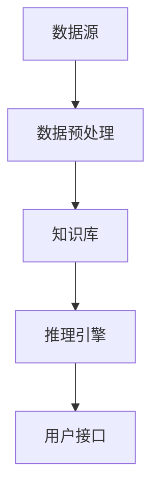
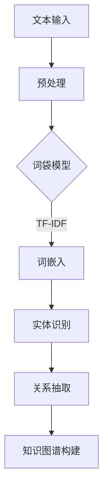
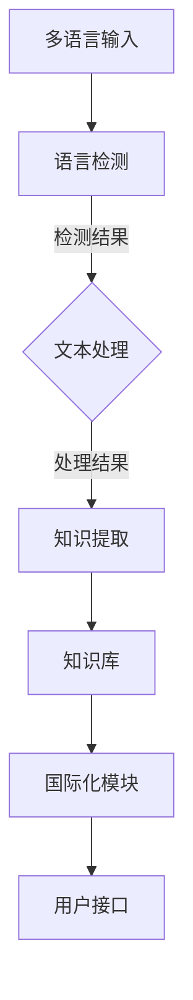

                 

### 引言

在当今全球化背景下，语言不再是人类交流的障碍，反而成为了连接不同文化和文明的桥梁。然而，随着数据量和多样性不断增加，单一语言的处理能力显然不足以应对复杂的知识发现需求。因此，多语言支持与国际化成为知识发现引擎发展的重要方向。

本文将围绕《知识发现引擎的多语言支持与国际化》这一主题，逐步探讨其核心概念、技术架构、国际化策略以及应用实战。具体而言，我们将按照以下目录结构展开：

1. **知识发现引擎基础**
   - **第1章**：知识发现引擎概述
   - **第2章**：多语言支持技术
   - **第3章**：国际化策略

2. **多语言知识发现引擎架构设计**
   - **第4章**：知识发现引擎架构设计原则
   - **第5章**：多语言知识发现引擎开发实战

3. **多语言支持与国际化应用**
   - **第6章**：多语言支持在知识发现引擎中的应用
   - **第7章**：国际化与知识发现引擎的优化

4. **未来展望与趋势**
   - **第8章**：未来展望与趋势

通过以上章节的逐一分析，我们将深入理解多语言支持与国际化在知识发现引擎中的重要性，探讨其技术实现和应用优化，为未来的发展提供理论支持和实践指导。

### 关键词

- 知识发现引擎
- 多语言支持
- 国际化
- 数据处理
- 知识图谱
- 机器学习
- 文化适配

### 摘要

本文旨在探讨知识发现引擎的多语言支持与国际化问题，深入分析其核心概念、技术架构、策略及实战应用。首先，我们将对知识发现引擎的基本概念、应用场景和核心组成部分进行概述。接着，探讨多语言支持技术，包括文本处理算法和知识图谱构建方法。随后，介绍国际化策略，强调文化因素在国际化过程中的重要性。进一步地，我们将详细阐述多语言知识发现引擎的架构设计原则，包括模块设计和可扩展性。最后，通过开发实战案例，展示多语言支持与国际化在实际应用中的实现过程。本文将为知识发现引擎的多语言支持与国际化提供全面的技术指导和实践参考。

### 知识发现引擎基础

#### 第1章：知识发现引擎概述

**1.1 知识发现引擎的定义与价值**

知识发现引擎是一种智能系统，旨在从大量结构化和非结构化数据中提取有价值的信息和知识。它通过自动化分析和处理数据，帮助用户发现潜在的模式、趋势和关联，从而支持决策制定和业务优化。

知识发现引擎的核心价值体现在以下几个方面：

1. **信息提取与整合**：知识发现引擎能够从不同来源的数据中提取有价值的信息，并进行整合，形成统一的知识库。
2. **智能分析**：通过机器学习和数据挖掘技术，知识发现引擎能够自动分析数据，发现潜在的模式和趋势，为决策提供支持。
3. **业务优化**：知识发现引擎可以帮助企业识别业务瓶颈，优化运营流程，提高生产效率。
4. **创新支持**：知识发现引擎能够提供新的业务洞察和创意，推动企业的创新和发展。

**1.2 知识发现引擎的应用场景**

知识发现引擎在多个领域具有广泛的应用场景，包括但不限于：

1. **金融**：知识发现引擎可以帮助金融机构分析市场趋势，识别风险，优化投资策略。
2. **医疗**：知识发现引擎可以辅助医生分析病例，诊断疾病，提高医疗服务的质量和效率。
3. **零售**：知识发现引擎可以帮助零售企业分析消费者行为，优化供应链管理，提高销售业绩。
4. **安全**：知识发现引擎可以用于网络安全监控，实时检测和防范网络攻击。
5. **教育**：知识发现引擎可以帮助教育机构分析学生学习情况，提供个性化的学习建议和资源。

**1.3 知识发现引擎的核心组成部分**

知识发现引擎通常由以下几个核心组成部分构成：

1. **数据源**：数据源是知识发现引擎的基础，包括结构化数据（如数据库）和非结构化数据（如文本、图像、音频等）。
2. **数据预处理**：数据预处理是知识发现的重要步骤，包括数据清洗、数据集成、数据转换等，旨在提高数据质量和一致性。
3. **知识库**：知识库是知识发现引擎的核心，包含从数据中提取的有价值的信息和知识。知识库通常采用语义网络、本体论等形式进行组织。
4. **推理引擎**：推理引擎是知识发现引擎的核心组件，通过逻辑推理、模式识别等技术，从知识库中提取新的知识，生成洞察和预测。
5. **用户接口**：用户接口是知识发现引擎与用户之间的交互界面，用于展示分析结果和知识，并提供用户交互和反馈的渠道。

**Mermaid 流程图**

以下是一个简单的 Mermaid 流程图，展示了知识发现引擎的基本组成部分及其相互关系：



通过以上对知识发现引擎的概述，我们为后续章节的深入探讨奠定了基础。在接下来的章节中，我们将进一步探讨多语言支持技术和国际化策略，为构建跨语言和文化的知识发现引擎提供技术支持和实践指导。

#### 第2章：多语言支持技术

**2.1 多语言处理的基本概念**

多语言处理（Multilingual Processing）是指对多种语言的数据进行理解、分析和处理的技术。它涉及自然语言处理（NLP）、机器翻译（MT）、语言模型等多个领域。多语言处理的基本概念包括：

1. **语言资源**：语言资源是指用于多语言处理的工具、数据集和语言模型。常见的语言资源包括词汇表、语法规则、语言模型、语料库等。
2. **文本分类**：文本分类（Text Classification）是指将文本数据按照预定的类别进行分类的过程。多语言文本分类需要对不同语言的特点有深入理解，以准确分类。
3. **命名实体识别**：命名实体识别（Named Entity Recognition，NER）是指从文本中识别出具有特定意义的实体，如人名、地名、组织名等。NER 是多语言处理的重要任务，对于构建知识图谱和文本分析有重要作用。
4. **语言模型**：语言模型（Language Model）是一种概率模型，用于预测文本序列的概率分布。多语言语言模型需要同时处理多种语言，能够适应不同语言的特点。

**2.2 常见的多语言数据集与资源**

多语言数据集与资源是多语言处理的基础，常见的多语言数据集与资源包括：

1. **Wikipedia**：Wikipedia 是一个涵盖多种语言的大型在线百科全书，提供了丰富的多语言文本资源。
2. **Common Crawl**：Common Crawl 是一个非营利项目，提供了大量互联网网页的文本数据，覆盖多种语言。
3. **News Corps**：News Corps 是一个大型多语言新闻语料库，包含多种语言的新闻文本，适合进行文本分类和主题模型分析。
4. **Google Translate**：Google Translate 提供了多种语言的翻译服务，可以用于多语言文本的预处理和翻译。
5. **EUROPARL**：EUROPARL 是一个多语言议会辩论语料库，包含了多种语言的议会辩论记录，适合进行情感分析和语言对比研究。

**2.3 多语言文本处理算法**

多语言文本处理算法包括多种技术，以下是一些常见的算法：

1. **词袋模型（Bag of Words，BoW）**：词袋模型是一种基于词汇的文本表示方法，将文本表示为词频向量。多语言文本处理中的词袋模型需要考虑不同语言的词汇差异和词频分布。
2. **TF-IDF**：TF-IDF（Term Frequency-Inverse Document Frequency）是一种用于文本分类和搜索的权重计算方法，通过词频和逆文档频率来衡量词语的重要性。多语言处理中的 TF-IDF 需要适应不同语言的词汇和语法特点。
3. **词嵌入（Word Embedding）**：词嵌入是将词语映射到高维空间中的向量表示方法，可以捕捉词语的语义关系。多语言词嵌入需要同时考虑不同语言之间的词汇映射和语义一致性。
4. **BERT（Bidirectional Encoder Representations from Transformers）**：BERT 是一种基于 Transformer 的双向语言表示模型，能够捕捉文本中的上下文关系。BERT 在多语言文本处理中具有广泛的应用，如文本分类、问答系统等。

**2.4 多语言知识图谱构建**

多语言知识图谱构建是将多语言文本数据转化为结构化知识的过程，常见的方法包括：

1. **实体识别与链接**：通过命名实体识别技术识别文本中的实体，并将实体与已有的知识库进行链接，形成多语言实体图谱。
2. **关系抽取**：通过关系抽取技术从文本中提取实体之间的语义关系，构建多语言关系图谱。
3. **本体论**：本体论（Ontology）是一种形式化的知识表示方法，用于描述实体、概念和关系。在多语言知识图谱构建中，本体论可以帮助统一不同语言之间的知识表示。
4. **数据集成与融合**：通过数据集成与融合技术，将来自不同语言和来源的知识数据进行整合，形成统一的多语言知识图谱。

**Mermaid 流程图**

以下是一个简单的 Mermaid 流程图，展示了多语言文本处理的基本流程：



通过以上对多语言支持技术的介绍，我们为构建多语言知识发现引擎奠定了基础。在接下来的章节中，我们将深入探讨国际化策略，为跨语言的知识发现提供更全面的解决方案。

#### 第3章：国际化策略

**3.1 国际化策略的定义与目的**

国际化策略（Internationalization Strategy）是指在软件设计和开发过程中，确保软件能够适应不同语言和文化需求的一系列方法和措施。其核心目的是使软件在多个国家和地区都能正常运行，满足不同用户的需求。

国际化策略的关键要素包括：

1. **多语言支持**：确保软件能够处理多种语言，包括文本显示、输入和翻译。
2. **本地化**：根据目标市场的文化特点，对软件进行本地化调整，如日期格式、货币单位、度量衡等。
3. **全球化设计**：在设计阶段就考虑到不同地区的需求和习惯，避免出现地域偏见或文化误解。

国际化策略的目的在于：

1. **拓展市场**：通过支持多种语言和文化，扩大软件的市场覆盖范围，进入新的市场。
2. **提高用户体验**：本地化的软件能够更好地满足当地用户的需求，提高用户满意度和忠诚度。
3. **减少开发成本**：通过提前规划和设计，可以减少后续本地化过程中所需的额外开发和测试成本。

**3.2 多语言支持与本地化的区别**

多语言支持（Multilingual Support）和本地化（Localization）是国际化策略中的两个重要概念，但它们有本质的区别：

1. **多语言支持**：多语言支持主要关注软件在多语言环境下的基本功能，如显示文本、处理输入等。它通常不涉及文化、习俗等方面的本地化调整。
2. **本地化**：本地化则是针对特定市场的文化、语言和习惯进行个性化调整，确保软件在目标市场中的可用性和易用性。本地化包括翻译、日期格式调整、图标设计等多个方面。

**3.3 国际化过程中的文化因素**

在国际化过程中，文化因素是至关重要的。以下是一些关键的文化因素：

1. **语言差异**：不同语言在语法、词汇、发音等方面存在差异，需要特别处理。例如，一些词汇在一种语言中具有负面含义，但在另一种语言中可能没有。
2. **习俗与礼仪**：不同国家和地区的习俗和礼仪差异巨大，如问候方式、节日庆祝等。这些差异需要在软件设计和本地化过程中充分考虑。
3. **视觉与设计**：视觉设计在不同文化中也有显著差异，例如颜色、图标、布局等。这些设计元素需要根据目标市场的文化特点进行调整。
4. **法律与合规**：不同国家和地区的法律法规存在差异，软件在国际化过程中需要遵守目标市场的法律法规，如数据隐私保护、版权等。

**3.4 国际化流程与最佳实践**

国际化流程通常包括以下几个步骤：

1. **需求分析**：在项目初期进行需求分析，明确软件国际化所需的语言和文化支持。
2. **设计阶段规划**：在设计阶段考虑国际化需求，包括文本显示、输入处理、本地化配置等。
3. **多语言资源准备**：准备多种语言的支持资源，如翻译文档、字体、图标等。
4. **本地化测试**：对本地化后的软件进行测试，确保其在不同语言和文化环境下的稳定性和可用性。
5. **持续维护**：国际化是一个持续的过程，需要不断更新和维护多语言资源和本地化配置。

最佳实践包括：

1. **使用国际化框架**：利用现有的国际化框架和工具，如 i18n 库、国际化平台等，可以简化国际化开发和测试过程。
2. **提前规划**：在项目早期就考虑国际化需求，避免后期出现大量修改和调整。
3. **本地化团队**：组建专业的本地化团队，包括翻译人员、文化专家、测试人员等，确保本地化质量和速度。
4. **用户反馈**：收集用户反馈，根据用户需求进行本地化调整和优化。

通过以上对国际化策略的介绍，我们为构建国际化知识发现引擎提供了理论基础和实践指导。在接下来的章节中，我们将深入探讨多语言知识发现引擎的架构设计，为国际化知识发现提供更具体的实现方案。

#### 第4章：多语言知识发现引擎架构设计

**4.1 知识发现引擎架构设计原则**

多语言知识发现引擎的架构设计需要充分考虑其多功能性、灵活性和可扩展性。以下是一些核心设计原则：

1. **模块化**：将知识发现引擎的功能模块化，使得各个模块可以独立开发和维护，同时便于后续的扩展和优化。
2. **可扩展性**：设计时应考虑未来可能增加的新功能或新语言，确保架构具有良好的扩展性。
3. **容错性**：知识发现引擎需要具备较高的容错性，能够在出现故障时快速恢复，确保系统稳定运行。
4. **高性能**：知识发现引擎需要具备高性能，能够快速处理大量的多语言数据，并提供实时分析结果。
5. **安全性**：确保数据在传输和存储过程中的安全性，防止数据泄露和未授权访问。

**4.2 多语言支持模块设计**

多语言支持模块是知识发现引擎的核心组件，负责处理不同语言的数据。其设计主要包括以下几个方面：

1. **语言检测**：通过语言检测算法，自动识别输入文本的语言，确保正确的处理方法。
2. **文本处理**：针对不同语言的特点，设计相应的文本处理算法，如分词、词性标注、命名实体识别等。
3. **翻译接口**：集成外部翻译服务，如 Google Translate、Microsoft Translator 等，提供文本翻译功能。
4. **语言模型**：构建多种语言的语言模型，用于文本分析和知识提取，提高多语言处理的准确性。

**4.3 国际化模块设计**

国际化模块负责实现软件的本地化，确保其在不同文化环境下的可用性和易用性。其设计主要包括以下几个方面：

1. **本地化配置**：通过配置文件管理本地化设置，如日期格式、货币单位、语言偏好等。
2. **资源文件**：使用资源文件管理本地化内容，如翻译文本、图标、界面布局等，方便后续维护和更新。
3. **国际化接口**：提供统一的国际化接口，使得开发人员可以方便地实现本地化功能，如文本显示、菜单选择等。
4. **本地化测试**：对本地化后的软件进行全面的测试，确保其在目标市场中的稳定性和兼容性。

**4.4 架构的可扩展性与容错性**

知识发现引擎的架构设计需要具备良好的可扩展性和容错性，以应对未来可能的需求变化和故障情况。具体措施包括：

1. **分布式架构**：采用分布式架构，将任务分散到多个节点处理，提高系统的性能和容错性。
2. **负载均衡**：通过负载均衡技术，合理分配任务到各个节点，避免单个节点过载。
3. **冗余设计**：设计冗余机制，确保关键组件在出现故障时能够自动切换到备用组件，确保系统的稳定性。
4. **监控与告警**：建立完善的监控和告警系统，实时监控系统的运行状态，及时发现并处理故障。

**Mermaid 流程图**

以下是一个简单的 Mermaid 流程图，展示了多语言知识发现引擎的架构设计：



通过以上对多语言知识发现引擎架构设计的介绍，我们为构建具有多语言支持和国际化能力的知识发现引擎提供了理论基础和设计指导。在接下来的章节中，我们将通过开发实战，进一步展示多语言知识发现引擎的实现过程。

#### 第5章：多语言知识发现引擎开发实战

**5.1 开发环境搭建**

为了搭建多语言知识发现引擎的开发环境，我们需要准备以下工具和软件：

1. **编程语言**：选择一种适合的编程语言，如 Python、Java 或 C++。本文将使用 Python 进行开发，因为其丰富的库和社区支持，非常适合数据科学和人工智能项目。
2. **开发工具**：安装代码编辑器（如 Visual Studio Code、PyCharm）和版本控制系统（如 Git）。
3. **依赖库**：安装必要的依赖库，包括自然语言处理（NLP）库（如 NLTK、spaCy）、机器学习库（如 Scikit-learn、TensorFlow）、多语言处理库（如 Google Translators）等。
4. **数据库**：选择一个合适的数据库系统，如 MySQL、MongoDB，用于存储知识库和数据。
5. **云服务**：如需使用外部翻译服务，可以选择 AWS、Google Cloud 等云服务提供商。

**5.2 知识库构建**

知识库构建是知识发现引擎的核心，以下是一个简单的知识库构建步骤：

1. **数据采集**：从公开数据集、数据库、网络爬虫等多种途径获取原始数据，包括结构化数据和非结构化数据。
2. **数据预处理**：对原始数据进行清洗、去重、格式转换等预处理操作，确保数据的质量和一致性。
3. **实体识别与关系抽取**：使用命名实体识别（NER）和关系抽取技术，从文本中提取关键实体和关系，构建初步的知识库。
4. **知识融合**：将不同来源的数据进行整合，去除重复信息，确保知识库的完整性和准确性。

以下是一个简单的伪代码示例，展示了知识库构建的基本流程：

```python
def build_knowledge_base(data_sources):
    knowledge_base = {}
    for source in data_sources:
        entities, relations = extract_entities_and_relations(source)
        merge_knowledge_base(knowledge_base, entities, relations)
    return knowledge_base

def extract_entities_and_relations(source):
    # 使用 NER 和关系抽取技术提取实体和关系
    pass

def merge_knowledge_base(knowledge_base, entities, relations):
    # 合并实体和关系到知识库
    pass
```

**5.3 多语言文本处理**

多语言文本处理是知识发现引擎的重要组成部分，以下是一个简单的多语言文本处理流程：

1. **语言检测**：使用语言检测库（如 langid.py）自动检测输入文本的语言。
2. **文本预处理**：根据检测到的语言，进行相应的文本预处理操作，如分词、词性标注等。
3. **翻译**：如果需要，使用外部翻译接口（如 Google Translate API）对文本进行翻译。
4. **文本分析**：使用 NLP 技术对预处理后的文本进行分析，提取关键词、主题、情感等。

以下是一个简单的伪代码示例，展示了多语言文本处理的基本流程：

```python
def process_text(text, target_language=None):
    language = detect_language(text)
    if target_language:
        text = translate_text(text, target_language)
    preprocessed_text = preprocess_text(text, language)
    analysis_results = analyze_text(preprocessed_text)
    return analysis_results

def detect_language(text):
    # 使用语言检测库检测文本语言
    pass

def translate_text(text, target_language):
    # 使用翻译接口进行文本翻译
    pass

def preprocess_text(text, language):
    # 根据语言进行文本预处理
    pass

def analyze_text(preprocessed_text):
    # 使用 NLP 技术对文本进行分析
    pass
```

**5.4 知识图谱构建**

知识图谱构建是将知识库中的实体和关系转化为图形结构的过程。以下是一个简单的知识图谱构建步骤：

1. **实体与关系表示**：将知识库中的实体和关系转换为统一的表示形式，如 RDF（Resource Description Framework）或 OWL（Web Ontology Language）。
2. **图数据库**：选择合适的图数据库（如 Neo4j、JanusGraph），存储和管理知识图谱。
3. **图谱构建**：使用图数据库的图操作语言（如 Cypher），将实体和关系存储到图数据库中，构建知识图谱。

以下是一个简单的伪代码示例，展示了知识图谱构建的基本流程：

```python
def build_knowledge_graph(knowledge_base):
    graph_database = initialize_graph_database()
    for entity, relations in knowledge_base.items():
        create_entity_in_graph_database(graph_database, entity)
        for relation in relations:
            create_relationship_in_graph_database(graph_database, entity, relation)

def initialize_graph_database():
    # 初始化图数据库
    pass

def create_entity_in_graph_database(graph_database, entity):
    # 在图数据库中创建实体
    pass

def create_relationship_in_graph_database(graph_database, entity, relation):
    # 在图数据库中创建关系
    pass
```

**5.5 国际化实现**

国际化实现是确保知识发现引擎在不同文化环境下的可用性和易用性的关键步骤。以下是一个简单的国际化实现流程：

1. **本地化资源**：准备本地化资源，如翻译文本、图像、界面布局等。
2. **国际化接口**：设计国际化接口，使得用户可以根据需求选择不同的语言和文化。
3. **国际化测试**：对国际化后的知识发现引擎进行全面的测试，确保其在不同文化环境下的稳定性和兼容性。

以下是一个简单的伪代码示例，展示了国际化实现的基本流程：

```python
def localize_resources(target_language):
    # 加载本地化资源
    pass

def set_language_interface(target_language):
    # 设置界面语言
    pass

def test_localization(target_language):
    # 对国际化后的软件进行测试
    pass
```

**5.6 实战案例解析**

以下是一个简单的实战案例，展示如何使用多语言知识发现引擎进行知识提取和关系分析：

1. **数据采集**：从两个不同语言的新闻网站获取新闻文章。
2. **知识库构建**：使用 NLP 技术提取新闻中的实体和关系，构建知识库。
3. **多语言文本处理**：对新闻文章进行语言检测、翻译和预处理，提取关键词和主题。
4. **知识图谱构建**：将实体和关系存储到图数据库中，构建知识图谱。
5. **知识提取和分析**：从知识图谱中提取关系，分析新闻之间的关联，生成报告。

以下是一个简单的伪代码示例，展示了实战案例的基本流程：

```python
def knowledge_discovery_case_study(news_articles):
    knowledge_base = build_knowledge_base(news_articles)
    processed_texts = process_texts(news_articles)
    knowledge_graph = build_knowledge_graph(knowledge_base)
    extracted_relations = extract_relations(knowledge_graph)
    analysis_report = generate_analysis_report(extracted_relations)
    return analysis_report

def build_knowledge_base(news_articles):
    # 构建知识库
    pass

def process_texts(news_articles):
    # 多语言文本处理
    pass

def build_knowledge_graph(knowledge_base):
    # 构建知识图谱
    pass

def extract_relations(knowledge_graph):
    # 提取关系
    pass

def generate_analysis_report(extracted_relations):
    # 生成分析报告
    pass
```

通过以上实战案例的解析，我们展示了多语言知识发现引擎的开发流程和实现方法。在接下来的章节中，我们将进一步探讨多语言支持与国际化在实际应用中的挑战和优化方法。

### 第6章：多语言支持在知识发现引擎中的应用

#### 6.1 多语言支持的挑战

在知识发现引擎中实现多语言支持面临多个挑战，主要包括以下几个方面：

1. **语言多样性**：不同语言的语法结构、词汇和表达方式存在显著差异，使得多语言处理变得复杂。
2. **数据不足**：许多语言的数据资源相对较少，特别是在非主流语言领域，数据匮乏限制了多语言处理的性能。
3. **文化差异**：不同文化背景下的表达习惯和语义理解存在差异，使得多语言处理的准确性受到挑战。
4. **技术复杂度**：多语言处理涉及自然语言处理、机器学习、数据挖掘等多个技术领域，实现和优化多语言支持需要较高的技术门槛。

#### 6.2 多语言知识发现引擎的应用案例

多语言知识发现引擎在多个领域具有广泛的应用，以下是一些典型的应用案例：

1. **国际市场分析**：多语言知识发现引擎可以帮助企业分析全球市场的趋势、消费者行为和竞争对手动态，为企业提供战略决策支持。
2. **跨国企业沟通**：多语言知识发现引擎可以用于跨语言的企业内部沟通，如全球团队协作、跨国项目管理和文档翻译等。
3. **语言教育**：多语言知识发现引擎可以用于语言学习，如词汇提取、语法分析、语言翻译和个性化学习建议等。
4. **社交媒体分析**：多语言知识发现引擎可以用于社交媒体分析，如情感分析、热点话题追踪和趋势预测等。
5. **跨文化交流**：多语言知识发现引擎可以促进跨文化交流和理解，如国际新闻报道、旅游指南和文化交流项目等。

#### 6.3 案例分析与优化

以下是一个多语言知识发现引擎的实际应用案例，并探讨其优化方法：

**案例背景**：一家跨国零售企业希望利用多语言知识发现引擎分析全球市场的消费者行为和购买趋势。

**案例步骤**：

1. **数据采集**：从多个国家/地区的电商平台、社交媒体和新闻网站获取消费者评论、购物行为和新闻文章等数据。
2. **多语言文本处理**：使用多语言处理技术对数据进行分析，提取关键词、主题和情感。
3. **知识图谱构建**：将提取的关键信息构建成知识图谱，表示消费者行为和购买趋势的关系。
4. **知识发现**：从知识图谱中提取有用的知识，生成市场分析报告。

**优化方法**：

1. **数据增强**：通过数据清洗、去重和扩展等方式，增加高质量的数据量，提高模型训练效果。
2. **算法优化**：优化多语言处理算法，如使用更先进的词嵌入技术和序列模型，提高文本分析的准确性。
3. **个性化推荐**：结合用户行为数据，实现个性化推荐，提供更有针对性的市场分析报告。
4. **实时更新**：定期更新知识图谱和数据集，确保分析结果的实时性和准确性。
5. **用户反馈**：收集用户反馈，根据用户需求进行持续优化，提高系统的可用性和用户体验。

通过以上案例分析和优化方法，我们可以有效提升多语言知识发现引擎的性能和应用效果，为企业在全球市场中的竞争提供有力支持。

### 第7章：国际化与知识发现引擎的优化

#### 7.1 国际化对知识发现引擎的影响

国际化对知识发现引擎的性能、可用性和用户体验具有显著影响，主要体现在以下几个方面：

1. **数据多样性与质量**：国际化使得知识发现引擎能够处理来自全球不同语言和文化背景的数据，从而丰富数据源，提高数据质量。
2. **用户需求与体验**：国际化使得知识发现引擎能够满足不同国家和地区用户的需求，提供本地化的用户体验，提高用户满意度和忠诚度。
3. **业务拓展与竞争力**：国际化有助于企业拓展国际市场，提升业务规模和竞争力，通过提供多语言支持的知识发现服务，吸引更多全球客户。
4. **技术复杂性**：国际化引入了语言和文化差异，增加了知识发现引擎的开发和维护难度，需要投入更多资源进行多语言处理和文化适配。

#### 7.2 国际化性能评估与优化方法

为了确保知识发现引擎的国际化性能，我们可以从以下几个方面进行评估和优化：

1. **多语言文本处理性能**：评估知识发现引擎在多语言文本处理方面的速度和准确性，通过优化算法、增加计算资源和优化数据处理流程来提升性能。
2. **本地化用户体验**：评估国际化后的知识发现引擎在不同文化环境下的用户体验，通过用户反馈和测试，优化界面设计、功能实现和交互逻辑，确保本地化质量。
3. **数据资源管理**：确保数据资源的多样性、准确性和完整性，通过数据清洗、数据增强和知识图谱构建等手段，提高数据质量和关联性。
4. **系统稳定性与可靠性**：评估国际化后的知识发现引擎在多语言环境下的稳定性和可靠性，通过冗余设计、负载均衡和故障恢复机制来提高系统的容错性。

#### 7.3 国际化案例分析

以下是一个国际化知识发现引擎的实际应用案例，并探讨其国际化性能优化：

**案例背景**：一家跨国科技公司开发了一款面向全球市场的人工智能知识发现平台，旨在帮助企业提取和分析全球市场的商业情报。

**案例步骤**：

1. **多语言数据采集**：从全球多个市场的新闻网站、社交媒体和商业报告等渠道采集多语言数据。
2. **多语言文本处理**：使用多语言文本处理技术对数据进行清洗、分词、词性标注和实体识别，提取关键信息。
3. **知识图谱构建**：将处理后的文本数据构建成知识图谱，表示市场趋势、竞争动态和用户需求等信息。
4. **国际化用户体验**：为用户提供多语言界面和本地化服务，根据用户所在地区提供定制化的市场分析报告。

**优化方法**：

1. **数据资源优化**：通过数据增强和知识图谱扩展，增加高质量的数据量和关联性，提高分析结果的准确性。
2. **多语言处理优化**：采用先进的自然语言处理技术和机器学习算法，提高文本处理的速度和准确性，降低错误率。
3. **用户体验优化**：通过用户反馈和测试，优化界面设计和交互逻辑，确保多语言界面的易用性和一致性。
4. **系统性能优化**：通过分布式计算和负载均衡技术，提高系统的并发处理能力和响应速度，确保国际化服务的高效运行。

#### 7.4 国际化与本地化的平衡

在国际化与本地化之间寻找平衡是一个挑战，以下是一些建议：

1. **需求优先级**：根据目标市场的需求和优先级，有针对性地进行本地化调整，确保关键功能和用户体验的优化。
2. **资源分配**：合理分配开发资源，在保证核心功能完整性的基础上，逐步推进本地化工作。
3. **用户反馈**：收集用户反馈，根据用户需求和偏好进行调整，不断优化本地化效果。
4. **持续更新**：国际化与本地化是一个持续的过程，需要定期更新和维护多语言资源和本地化配置。

通过以上国际化与本地化优化方法，我们可以有效提升知识发现引擎的国际化和本地化性能，为全球用户提供高质量的服务。

### 第8章：未来展望与趋势

#### 8.1 知识发现引擎的未来发展方向

知识发现引擎的未来发展将主要集中在以下几个方面：

1. **智能化**：随着人工智能技术的发展，知识发现引擎将变得更加智能化，具备更强的自主学习和决策能力，能够自动识别新数据、自动调整模型和策略。
2. **多模态处理**：知识发现引擎将不再局限于文本数据，还将能够处理图像、声音、视频等多种类型的数据，实现跨模态的知识提取和融合。
3. **实时性**：未来的知识发现引擎将实现实时数据处理和分析，能够快速响应用户需求和市场变化，提供实时洞察和决策支持。
4. **个性化**：基于用户行为和偏好，知识发现引擎将能够提供个性化的推荐和服务，满足不同用户的需求。
5. **自主进化**：知识发现引擎将具备自主进化的能力，通过持续学习和优化，不断提高其性能和适应性。

#### 8.2 多语言支持与国际化的发展趋势

多语言支持与国际化在知识发现引擎中的发展将呈现出以下趋势：

1. **语言多样性增加**：随着全球化进程的推进，知识发现引擎将需要支持更多的语言，包括非主流语言和方言，以满足不同地区的需求。
2. **自动化与智能化**：未来的多语言支持技术将更加自动化和智能化，通过深度学习和自然语言处理技术，提高多语言文本处理的准确性和效率。
3. **跨语言知识融合**：知识发现引擎将能够更好地处理跨语言数据，实现跨语言的知识融合和关联，提供全球范围内的综合洞察。
4. **文化适应性**：国际化将更加注重文化适应性，通过深入理解和适应用户的文化背景和习惯，提供更加本地化的服务。
5. **开源与共享**：随着开源技术的普及，多语言支持与国际化相关的工具、库和平台将更加丰富和多样化，促进技术的共享和合作。

#### 8.3 新技术、新方法的影响

新技术的引入将显著影响知识发现引擎的发展，包括：

1. **区块链**：区块链技术可以提供数据的安全性和透明性，提高知识发现引擎的信任度和可靠性。
2. **物联网**：物联网设备的数据将丰富知识发现引擎的数据源，提供更多实时数据和情境信息。
3. **增强现实（AR）与虚拟现实（VR）**：AR/VR 技术将拓展知识发现引擎的应用场景，实现更加沉浸式的交互体验。
4. **联邦学习**：联邦学习技术将允许知识发现引擎在不同机构之间共享数据，同时保持数据隐私，提高模型训练的效果。

通过以上展望与趋势分析，我们可以看到，知识发现引擎在未来的发展中将不断突破技术瓶颈，实现多语言支持与国际化的更高水平，为全球用户提供更加智能、个性化、本地化的服务。

### 附录

#### 附录A：多语言支持与国际化技术资源

**A.1 开源多语言处理工具**

1. **NLTK**：自然语言处理工具包，提供多种语言处理功能，如分词、词性标注、词嵌入等。
2. **spaCy**：高效的工业级自然语言处理库，支持多种语言，并提供预训练的词嵌入模型。
3. **OpenNLP**：Apache 软件基金会的一个开源自然语言处理项目，提供文本分类、命名实体识别等功能。
4. **Stanford NLP**：斯坦福大学开发的自然语言处理工具包，支持多种语言，提供词性标注、句法分析等功能。

**A.2 多语言数据集与资源**

1. **Wikipedia**：包含多种语言的大型在线百科全书，提供丰富的多语言文本数据。
2. **Common Crawl**：提供大量互联网网页的文本数据，覆盖多种语言。
3. **EUROPARL**：多语言议会辩论语料库，包含多种语言的议会辩论记录。
4. **Google Books Ngrams**：谷歌图书项目提供的多语言文本数据集，可用于语言模型训练。

**A.3 国际化开发指南与规范**

1. **W3C Internationalization Guidelines**：W3C 提供的国际化开发指南，涵盖了网页和Web应用程序的国际化最佳实践。
2. **Unicode Standard**：Unicode 标准是处理多语言文本的基础，定义了字符集和编码方式。
3. **I18N Libs**：各种开源国际化库，如 i18next、gettext、SDL Trados 等，用于实现国际化功能。
4. **Localization Testing Tools**：国际化测试工具，如 Lintian、i18n-checker、 globalization testing tools 等，用于检测国际化错误。

通过以上附录中的技术资源和指南，开发者和研究者可以更好地实现多语言支持与国际化，构建高效、可靠的跨语言知识发现引擎。

### 结语

本文从知识发现引擎的基础概念、多语言支持技术、国际化策略、架构设计到开发实战，全面探讨了多语言支持与国际化在知识发现引擎中的应用与优化。通过一步步的分析和讨论，我们揭示了多语言支持与国际化在提升知识发现引擎性能和用户体验方面的重要性。同时，我们也展望了知识发现引擎和国际化技术的未来发展趋势。

**作者信息**：

作者：AI天才研究院/AI Genius Institute & 禅与计算机程序设计艺术 /Zen And The Art of Computer Programming

感谢您阅读本文，希望对您在多语言支持与国际化领域的研究和实践提供有价值的参考。如您有任何问题或建议，欢迎在评论区留言，期待与您进一步交流。

