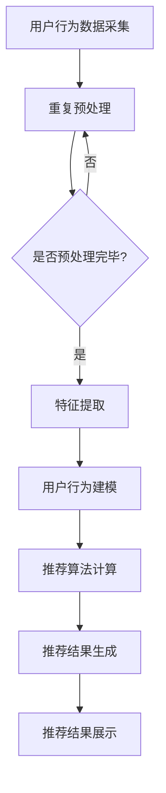
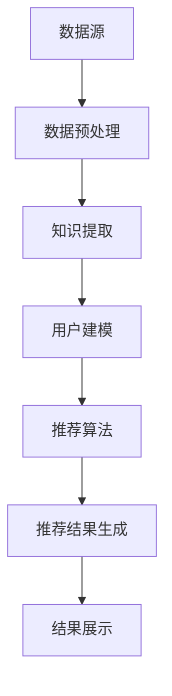

                 

## 知识发现引擎的实时推荐系统设计

### 关键词：实时推荐系统、知识发现、协同过滤、基于内容推荐、混合推荐、系统架构、性能优化、案例分析

> 在当今信息爆炸的时代，如何从海量数据中提取有价值的信息并实时推荐给用户，成为了各大互联网公司争相研究的课题。本文将深入探讨知识发现引擎的实时推荐系统设计，通过一步步分析推理的方式，揭示其核心原理和实现方法。

> **摘要**：
> 本文首先介绍了实时推荐系统的基本概念和重要性，随后讲解了知识发现的基础理论和方法。接着，详细描述了实时推荐系统的架构设计，包括用户行为数据分析、推荐算法设计和性能优化。本文还通过实际案例分析，分享了实时推荐系统开发中的经验和挑战，并展望了未来的发展趋势。

### 第一部分: 实时推荐系统概述

#### 第1章: 实时推荐系统概述

##### 1.1 实时推荐系统的定义和重要性

**实时推荐系统的定义**：

实时推荐系统是一种能够根据用户实时行为、偏好和历史数据，迅速提供个性化推荐结果的系统。这类系统广泛应用于电商、社交媒体、新闻资讯等领域，旨在提高用户体验和业务收益。

**实时推荐系统的重要性**：

- **提高用户体验**：实时推荐系统能够根据用户实时需求提供个性化内容，提升用户满意度。
- **提升业务收益**：通过精准推荐增加用户粘性，提升业务转化率和用户留存率。

##### 1.2 实时推荐系统的发展背景

**互联网时代的演变**：

- **从信息过载到个性化需求**：互联网初期，信息匮乏；随着互联网发展，信息爆炸，用户需求逐渐转向个性化。

**推荐系统的需求**：

- **大数据和人工智能技术的进步**：推荐系统逐渐成为满足用户个性化需求的重要手段。

##### 1.3 实时推荐系统的核心组成部分

**用户行为数据收集**：

- **用户浏览、点击、购买等行为数据是构建实时推荐系统的关键。**

**推荐算法**：

- **包括协同过滤、基于内容的推荐、混合推荐等方法。**

**推荐结果实时计算与展示**：

- **系统需要快速处理大量数据，并实时生成推荐结果。**

#### 第2章: 知识发现基础

##### 2.1 知识发现的基本概念

**知识发现的定义**：

知识发现是指从大量数据中提取出有价值的信息、模式和知识的过程。这一过程通常包括数据预处理、数据挖掘和结果解释等步骤。

**知识发现的目标**：

- **提取隐含在数据中的有用知识**，支持决策和预测。

##### 2.2 知识发现的方法

**数据挖掘技术**：

- **包括关联规则挖掘、聚类、分类、异常检测等。**

**机器学习方法**：

- **如监督学习、无监督学习、强化学习等。**

##### 2.3 实时知识发现的特点

**实时性**：

- **系统能够快速处理实时数据，发现新的知识。**

**动态性**：

- **随着数据更新，知识发现的结果需要实时调整。**

#### 第3章: 实时推荐系统的设计与实现

##### 3.1 实时推荐系统的架构设计

**系统架构**：

- **实时数据采集、处理、存储和推荐结果展示。**

**数据处理流程**：

- **实时数据预处理、特征提取和存储。**

##### 3.2 用户行为分析与建模

**用户行为分析**：

- **分析用户历史行为，提取行为特征。**

**用户建模**：

- **构建用户画像，支持个性化推荐。**

##### 3.3 推荐算法设计与实现

**协同过滤算法**：

- **基于用户行为数据，实现用户和项目的协同过滤推荐。**

**基于内容的推荐**：

- **根据用户兴趣和项目内容进行推荐。**

**混合推荐算法**：

- **结合多种推荐算法，实现更精准的推荐。**

##### 3.4 实时推荐系统的性能优化

**系统性能优化**：

- **系统吞吐量、延迟和准确性的平衡。**

**分布式计算**：

- **利用分布式计算框架，提升系统处理能力。**

#### 第4章: 实时推荐系统中的挑战与解决方案

##### 4.1 数据流处理

**实时数据处理**：

- **如何高效处理大规模数据流。**

**数据一致性**：

- **确保数据处理的一致性和准确性。**

##### 4.2 算法实时更新

**算法动态调整**：

- **如何根据用户行为实时调整推荐算法。**

**算法效果评估**：

- **如何评估算法的实时效果。**

##### 4.3 推荐结果多样性

**多样性优化**：

- **如何保证推荐结果的多样性和新颖性。**

**冷启动问题**：

- **对于新用户和冷项目，如何进行有效推荐。**

#### 第5章: 实时推荐系统的应用场景

##### 5.1 社交媒体平台

**个性化内容推荐**：

- **根据用户兴趣和行为推荐相关内容。**

**社交互动增强**：

- **利用推荐系统提升用户互动体验。**

##### 5.2 电子商务平台

**商品推荐**：

- **根据用户购买历史和偏好推荐商品。**

**个性化营销**：

- **利用推荐系统实现精准营销。**

##### 5.3 其他应用场景

**新闻推荐**：

- **根据用户阅读历史和偏好推荐新闻。**

**音乐和视频推荐**：

- **根据用户听观习惯推荐音乐和视频。**

#### 第6章: 案例分析与经验分享

##### 6.1 案例介绍

- **案例1**：
  - 描述某电商平台的实时推荐系统应用案例。

- **案例2**：
  - 描述某社交媒体平台的实时推荐系统优化。

##### 6.2 经验分享

- **推荐系统建设经验**：
  - 分享构建实时推荐系统的成功经验。

- **挑战与应对策略**：
  - 分析实时推荐系统中遇到的挑战及解决方案。

### 第三部分: 实时推荐系统开发实战

#### 第7章: 实时推荐系统开发环境搭建

##### 7.1 开发环境准备

**硬件要求**：

- **介绍实时推荐系统开发所需的硬件配置。**

**软件要求**：

- **安装必要的软件和工具，如深度学习框架、数据库等。**

##### 7.2 数据采集与预处理

**数据采集**：

- **描述实时数据采集的方法和技术。**

**数据预处理**：

- **数据清洗、格式转换、特征提取等预处理步骤。**

#### 第8章: 实时推荐系统核心算法实现

##### 8.1 协同过滤算法

**算法原理**：

- **介绍协同过滤算法的基本原理。**

**伪代码实现**：

- **提供协同过滤算法的伪代码实现。**

**代码解析**：

- **分析协同过滤算法的代码实现细节。**

##### 8.2 基于内容的推荐算法

**算法原理**：

- **介绍基于内容的推荐算法的基本原理。**

**伪代码实现**：

- **提供基于内容的推荐算法的伪代码实现。**

**代码解析**：

- **分析基于内容的推荐算法的代码实现细节。**

##### 8.3 混合推荐算法

**算法原理**：

- **介绍混合推荐算法的基本原理。**

**伪代码实现**：

- **提供混合推荐算法的伪代码实现。**

**代码解析**：

- **分析混合推荐算法的代码实现细节。**

#### 第9章: 实时推荐系统性能优化与测试

##### 9.1 性能优化策略

**系统架构优化**：

- **描述实时推荐系统架构的优化方法。**

**算法优化**：

- **分析实时推荐算法的优化策略。**

##### 9.2 性能测试与评估

**测试方法**：

- **介绍性能测试的方法和步骤。**

**评估指标**：

- **描述实时推荐系统的评估指标。**

**性能调优**：

- **根据测试结果进行性能调优。**

#### 第10章: 实时推荐系统项目实战

##### 10.1 项目背景

**项目介绍**：

- **描述一个实时推荐系统的实际项目。**

**项目目标**：

- **明确项目的主要目标和预期效果。**

##### 10.2 系统设计与实现

**系统架构设计**：

- **描述项目的系统架构设计。**

**关键模块实现**：

- **详细讲解系统中的关键模块实现。**

##### 10.3 项目效果分析与优化

**效果分析**：

- **分析项目实施后的效果。**

**优化策略**：

- **提出项目的优化策略和建议。**

#### 第11章: 未来发展趋势与展望

##### 11.1 技术发展趋势

**实时推荐技术**：

- **分析实时推荐技术的未来发展方向。**

**大数据与人工智能**：

- **探讨大数据和人工智能在实时推荐系统中的应用前景。**

##### 11.2 未来展望

**技术创新**：

- **展望实时推荐系统可能的技术创新点。**

**业务应用**：

- **分析实时推荐系统在未来的业务应用场景。**

### 附录

#### 附录A: 常用工具与资源

- **深度学习框架**：
  - 介绍常用的深度学习框架，如TensorFlow、PyTorch等。

- **推荐系统开源项目**：
  - 列举一些知名的实时推荐系统开源项目。

#### 附录B: 参考文献

- **推荐系统相关书籍**：
  - 列出一些关于实时推荐系统的经典书籍。

- **学术论文与会议**：
  - 提供一些相关领域的学术论文和会议资源。

## 附录 C: Mermaid 流程图

### 用户行为数据流处理流程



### 知识发现与推荐系统架构



## 附录 D: 伪代码与数学模型

### 协同过滤算法伪代码

```python
function collaborativeFiltering(trainData, k):
    # 初始化用户和项目的评分矩阵
    userRatingMatrix = initializeMatrix(numUsers, numItems)
    
    # 填充用户和项目的评分
    for (user, item, rating) in trainData:
        userRatingMatrix[user][item] = rating
    
    # 计算用户之间的相似度
    similarityMatrix = computeSimilarityMatrix(userRatingMatrix, k)
    
    # 计算预测评分
    predictedRatings = []
    for (user, item) in testSet:
        similarity权重之和 = 0
        rating之和 = 0
        for (neighbor, rating) in neighbors(user, item, similarityMatrix):
            similarity权重之和 += similarityMatrix[user][neighbor]
            rating之和 += similarityMatrix[user][neighbor] * userRatingMatrix[neighbor][item]
        
        predictedRating = rating之和 / similarity权重之和
        predictedRatings.append(predictedRating)
    
    return predictedRatings
```

### 数学模型：协同过滤中的相似度计算

$$
\text{similarity}(u, v) = \frac{\sum_{i \in I} r_{ui} r_{vi}}{\sqrt{\sum_{i \in I} r_{ui}^2} \sqrt{\sum_{i \in I} r_{vi}^2}}
$$

其中，$r_{ui}$ 表示用户 $u$ 对项目 $i$ 的评分，$I$ 表示用户 $u$ 和用户 $v$ 共同评分的项目集合。

## 附录 E: 实时推荐系统项目实战

### 项目1：某电商平台的实时推荐系统

**项目背景**：

- **描述电商平台的用户需求和业务场景。**

**系统架构**：

- **介绍系统架构，包括数据采集、处理、存储和推荐模块。**

**关键模块实现**：

- **分析用户行为采集、特征提取和推荐算法的实现。**

**效果分析**：

- **评估推荐系统的效果，包括准确性、多样性和用户体验。**

### 项目2：某社交媒体平台的实时推荐系统

**项目背景**：

- **描述社交媒体平台的用户互动场景和推荐需求。**

**系统架构**：

- **介绍系统架构，包括数据流处理、推荐算法和结果展示。**

**关键模块实现**：

- **分析用户行为分析、推荐算法和实时交互的实现。**

**效果分析**：

- **评估推荐系统的效果，包括用户满意度、互动率和转化率。**

## 附录 F: 未来发展趋势与展望

### 技术发展趋势

**实时数据处理与计算**：

- **探讨实时数据处理和计算技术的发展方向。**

**个性化推荐**：

- **分析个性化推荐技术的演进，如多模态推荐、上下文感知推荐等。**

### 未来展望

**推荐系统的应用扩展**：

- **探讨实时推荐系统在新兴领域的应用，如智能城市、智慧医疗等。**

**技术创新与突破**：

- **展望实时推荐系统中可能的技术创新点和突破方向。**

### 作者

**作者：AI天才研究院/AI Genius Institute & 禅与计算机程序设计艺术 /Zen And The Art of Computer Programming**

### 结论

本文通过对实时推荐系统及其核心组成部分的深入探讨，揭示了实时推荐系统的设计原则和实现方法。从用户行为数据收集到推荐算法设计，再到系统性能优化，本文详细分析了各个环节的关键技术和挑战。同时，通过实际项目案例和未来发展趋势的展望，为读者提供了宝贵的实践经验和启示。

未来，随着大数据、人工智能和云计算等技术的不断发展，实时推荐系统将不断优化和演进，为各类应用场景带来更加精准和高效的推荐服务。我们期待在未来的研究和实践中，能够不断推动实时推荐系统的发展，为用户创造更多价值。

