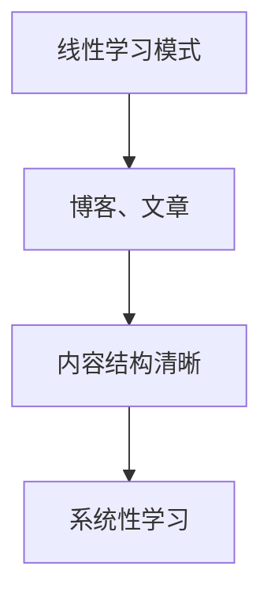
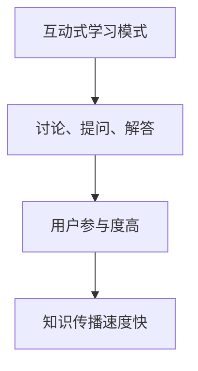
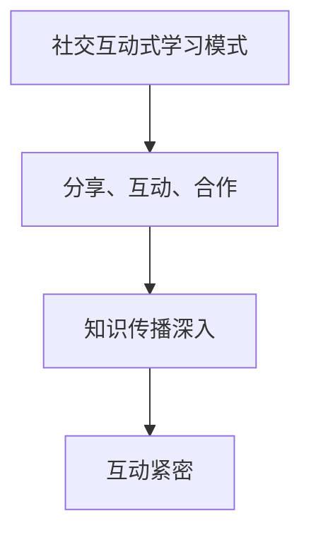
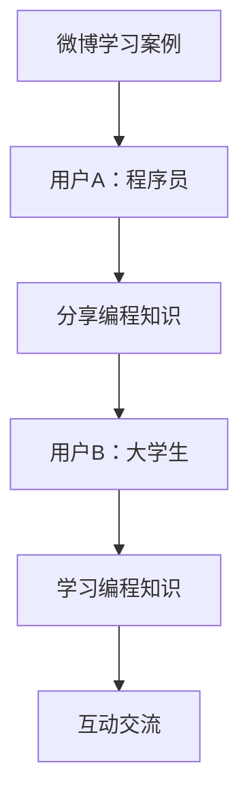
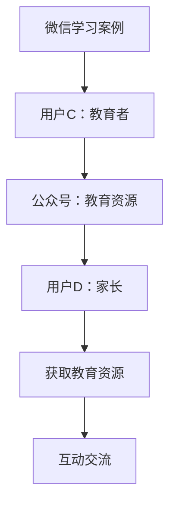
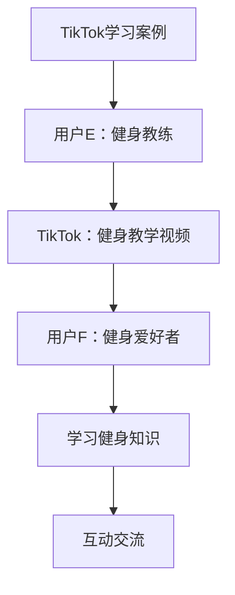
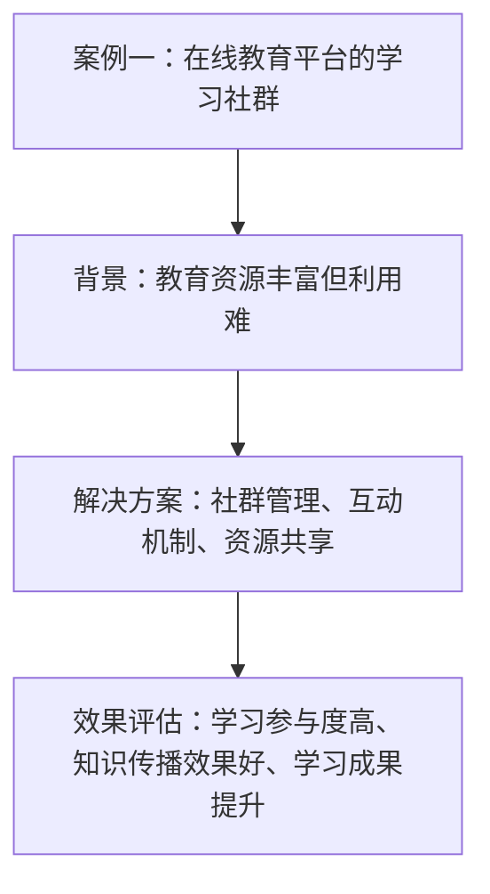
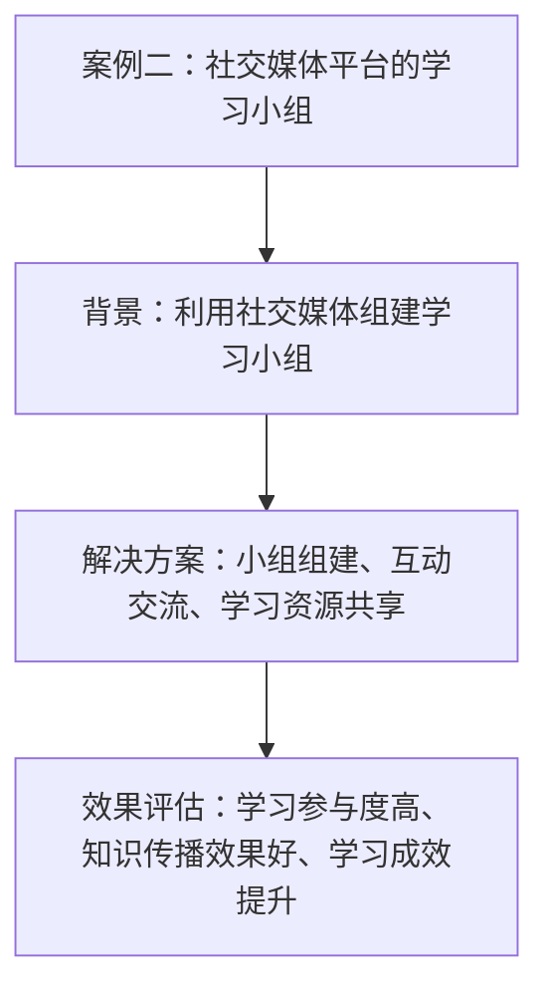
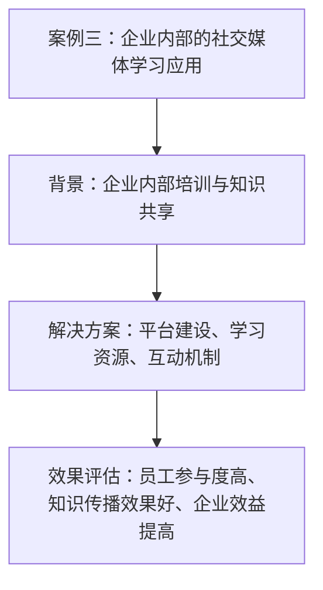

                 

### 《知识的交互性：社交媒体时代的群体学习》

> **关键词：** 社交媒体、群体学习、知识交互性、学习环境、心理学基础、应用案例、效果评估、未来展望

**摘要：** 本文探讨了社交媒体时代群体学习的新趋势，分析了知识交互性的概念及其在群体学习中的重要性。通过梳理群体学习的心理学基础、探讨社交媒体平台的群体学习实践，本文还提出了群体学习效果评估的方法和策略，并分享了若干案例研究的总结与启示。最后，本文展望了社交媒体时代群体学习的未来发展，为教育者和学习者提供了有益的参考。

----------------------------------------------------------------

### 第一部分：引言

在当今信息爆炸的时代，知识更新速度不断加快，个体学习和传统课堂教学模式已不足以满足人们不断增长的学习需求。社交媒体的崛起为群体学习提供了一个全新的平台，使得知识的传播和共享更加便捷和高效。群体学习作为一种新兴的学习模式，正在逐渐改变人们的认知和行为方式。本文旨在探讨社交媒体时代群体学习的特点、理论基础和实践应用，以期为我们提供一种全新的学习视角。

#### 1.1 社交媒体的崛起与影响

社交媒体是一种基于互联网的技术，它使得人们可以轻松地分享、传播和获取信息。自20世纪90年代互联网兴起以来，社交媒体经历了从即时通讯工具到社交网络的演变。如今，社交媒体已成为人们日常生活中不可或缺的一部分，不仅改变了人们的交流方式，也对学习产生了深远的影响。

##### 1.1.1 社交媒体的发展历程

社交媒体的发展可以分为三个阶段：

1. **初期阶段**（1990s-2000s）：以电子邮件、论坛和即时通讯工具为代表，如电子邮件、Usenet论坛和ICQ。
2. **发展阶段**（2000s-2010s）：以Facebook、Twitter和微博为代表，社交媒体开始普及，用户规模迅速扩大。
3. **成熟阶段**（2010s-至今）：社交媒体平台进一步多样化，如微信、Instagram和TikTok等，功能也不断丰富，从单纯的社交互动延伸到内容创作、知识传播等领域。

##### 1.1.2 社交媒体对学习的改变

社交媒体的崛起对学习产生了以下几方面的影响：

1. **学习方式的变革**：社交媒体提供了更加灵活和个性化的学习方式，用户可以根据自己的兴趣和需求选择学习内容。
2. **学习资源的共享**：社交媒体使得学习资源更加丰富和易获取，用户可以轻松地分享和获取各类学习资料。
3. **学习社区的形成**：社交媒体平台上的学习小组和社群为学习者提供了一个交流、讨论和合作的空间，促进了知识的交互性和传播。

#### 1.2 群体学习的基本概念

群体学习是指在多人参与的环境中，通过互动和协作实现知识获取和共享的一种学习模式。与个体学习相比，群体学习具有以下几个特点：

1. **协同性**：群体学习强调个体之间的互动和协作，通过共同解决问题和分享经验来实现知识的共享。
2. **多样性**：群体学习中的个体具有不同的背景、知识和经验，这种多样性为知识的生成和传播提供了丰富的资源。
3. **动态性**：群体学习过程是动态变化的，随着参与者的加入和退出，学习目标和内容也会不断调整。

##### 1.2.1 群体学习的定义

群体学习可以定义为：在多人参与的环境下，通过互动、协作和共享实现知识获取和共享的一种学习模式。它强调个体之间的协作和多样性，以实现知识的共同创造和传播。

##### 1.2.2 群体学习的特点

群体学习具有以下几个显著特点：

1. **协同性**：群体学习强调个体之间的互动和协作，通过共同解决问题和分享经验来实现知识的共享。
2. **多样性**：群体学习中的个体具有不同的背景、知识和经验，这种多样性为知识的生成和传播提供了丰富的资源。
3. **动态性**：群体学习过程是动态变化的，随着参与者的加入和退出，学习目标和内容也会不断调整。

#### 1.3 知识的交互性

知识的交互性是指知识在个体之间传递、转化和共享的过程。在社交媒体时代，知识的交互性得到了极大的增强，主要体现在以下几个方面：

1. **信息的实时传递**：社交媒体平台提供了即时通讯工具，使得信息可以在短时间内迅速传递，为知识的共享提供了便利。
2. **内容的多样化**：社交媒体平台上的内容形式多样，包括文字、图片、视频等，为知识传播提供了丰富的载体。
3. **互动的多样化**：社交媒体平台上的互动方式多样，包括评论、点赞、分享等，为知识交流和传播提供了多样化的渠道。

##### 1.3.1 知识交互性的概念

知识交互性是指知识在个体之间传递、转化和共享的过程。它包括以下几个方面：

1. **传递**：知识从知识的源头（如专家、教育机构）传递到知识的接收者（如学习者、普通用户）。
2. **转化**：知识在传递过程中，会根据接收者的背景和需求进行转化，以适应其认知和理解水平。
3. **共享**：知识在个体之间共享，实现了知识的增值和扩展。

##### 1.3.2 知识交互性的重要性

知识交互性在群体学习中具有重要意义，主要体现在以下几个方面：

1. **促进知识共享**：知识交互性使得知识在群体成员之间得以共享，促进了知识的传播和扩展。
2. **提高学习效果**：知识交互性有助于提高学习者的学习效果，通过互动和协作，学习者可以更好地理解和掌握知识。
3. **激发创新思维**：知识交互性为个体提供了多样化的知识资源，有助于激发创新思维和创造力。

----------------------------------------------------------------

### 第二部分：群体学习的理论基础

群体学习作为一种新兴的学习模式，其理论基础涵盖了心理学、社会学和认知科学等多个领域。本文将从心理学基础、社会动力理论和认知发展理论三个方面对群体学习的理论基础进行探讨。

#### 第2章：群体学习的心理学基础

群体学习不仅仅是知识的传递和共享，更是一个复杂的心理过程。在这一章节中，我们将探讨社会认知理论、群体动力理论和社交学习理论在群体学习中的应用。

##### 2.1 社会认知理论

社会认知理论是群体学习心理学基础的重要组成部分，它关注个体在社会环境中的认知过程。社会认知理论主要包括以下几方面的观点：

###### 2.1.1 社会认知理论概述

社会认知理论认为，个体的认知过程不仅受到自身经验的影响，还受到社会环境和社会互动的制约。在社会认知理论中，个体通过观察、模仿和互动来学习，从而形成了对知识的理解。

###### 2.1.2 社会认知理论在群体学习中的应用

1. **观察学习**：群体学习中的个体可以通过观察他人的行为和结果来学习。例如，在一个学习小组中，一个成员的成功经验可以激励其他成员，从而提高整个小组的学习效果。
2. **社会互动**：群体学习中的互动可以促进知识的共享和深化。通过互动，个体可以更好地理解他人的观点，从而丰富自己的知识体系。
3. **认知发展**：群体学习可以促进个体的认知发展。在群体互动中，个体需要理解他人的观点，这有助于提高其思维能力和解决问题的能力。

##### 2.2 群体动力理论

群体动力理论关注群体内部的动力结构和互动过程，它认为群体行为不仅仅是个体行为的简单叠加，而是受到群体内部动力的影响。群体动力理论主要包括以下几方面的观点：

###### 2.2.1 群体动力理论概述

群体动力理论认为，群体行为是由多种力量相互作用的结果，包括群体目标、成员关系、群体规范和领导力等。这些力量共同决定了群体的行为和结果。

###### 2.2.2 群体动力理论在群体学习中的应用

1. **群体目标**：群体学习中的目标设定对于学习效果至关重要。明确的学习目标可以引导群体成员共同合作，提高学习效率。
2. **成员关系**：群体成员之间的互动和合作是群体学习成功的关键。良好的成员关系可以增强群体凝聚力，提高学习效果。
3. **群体规范**：群体规范是群体成员共同遵守的行为准则。明确的规范可以确保群体学习的有序进行，提高学习效果。
4. **领导力**：有效的领导力可以引导群体成员朝着共同的学习目标努力，提高学习效果。

##### 2.3 社会学习理论

社会学习理论是群体学习心理学基础的重要理论之一，它关注个体在社会环境中的学习过程。社会学习理论主要包括以下几方面的观点：

###### 2.3.1 社会学习理论概述

社会学习理论认为，个体通过观察、模仿和参与来学习。个体不仅通过自身的经验学习，还可以通过观察他人的行为和结果来学习。

###### 2.3.2 社会学习理论在群体学习中的应用

1. **观察学习**：群体学习中的个体可以通过观察他人的行为和结果来学习。例如，在一个学习小组中，一个成员的成功经验可以激励其他成员，从而提高整个小组的学习效果。
2. **模仿学习**：群体学习中的个体可以通过模仿他人的行为来学习。例如，在一个编程学习小组中，成员可以通过观察其他成员的编程代码来提高自己的编程能力。
3. **参与学习**：群体学习中的个体可以通过参与互动和合作来学习。例如，在一个科学实验小组中，成员可以通过共同进行实验来提高自己的实验技能。

通过以上对群体学习心理学基础的探讨，我们可以看出，群体学习不仅仅是知识的传递和共享，更是一个复杂的心理过程。社会认知理论、群体动力理论和社交学习理论为我们理解和优化群体学习提供了重要的理论指导。在后续章节中，我们将进一步探讨社交媒体平台的群体学习实践和效果评估，以期为我们提供更全面的视角。

----------------------------------------------------------------

### 第三部分：社交媒体平台的群体学习实践

在社交媒体平台上，群体学习已成为一种普遍的学习方式。在这一章节中，我们将探讨不同社交媒体平台上的群体学习模式，以及这些平台在群体学习中的应用案例。

#### 第3章：社交媒体平台与群体学习

##### 3.1 社交媒体平台概述

社交媒体平台是指基于互联网的技术，允许用户通过文字、图片、视频等形式进行交流和分享的平台。常见的社交媒体平台包括微博、微信、Instagram和TikTok等。这些平台具有以下共同特点：

1. **用户生成内容**：社交媒体平台的主要内容来源于用户，用户可以自由地发布和分享自己的观点、经验和知识。
2. **社交互动**：社交媒体平台提供了丰富的社交互动功能，如评论、点赞、分享等，用户可以通过这些功能与其他用户进行交流和互动。
3. **信息传播**：社交媒体平台具有强大的信息传播能力，用户发布的内容可以迅速传播到广泛的用户群体。

##### 3.2 社交媒体平台的群体学习模式

在社交媒体平台上，群体学习主要表现为以下三种模式：

###### 3.2.1 线性学习模式

线性学习模式是指用户按照一定的顺序学习内容，通常以博客、文章等形式呈现。这种模式的特点是内容结构清晰，用户可以系统地学习知识。例如，在微信公众号中，用户可以通过阅读文章来学习知识。

###### 3.2.2 互动式学习模式

互动式学习模式是指用户在学习过程中与其他用户进行互动和交流，通过讨论、提问和解答来加深对知识的理解。这种模式的特点是用户参与度高，知识传播速度快。例如，在知乎平台上，用户可以通过提问和回答来学习知识。

###### 3.2.3 社交互动式学习模式

社交互动式学习模式是指用户在学习过程中通过社交互动来加深对知识的理解和应用。这种模式的特点是用户之间有更紧密的互动和合作，知识传播更加深入。例如，在微信朋友圈中，用户可以通过分享学习心得和经验来促进知识的传播。

##### 3.3 社交媒体平台在群体学习中的应用案例

以下为几个典型的社交媒体平台在群体学习中的应用案例：

###### 3.3.1 微博学习案例

微博是中国最大的社交媒体平台之一，用户可以通过发表微博来分享自己的观点和经验。在微博上，许多学习者和教育者通过发布学习笔记、课程回顾和知识分享来促进知识的传播。以下是一个微博学习的案例：

- **用户A**是一位程序员，他经常在微博上分享自己学习的编程知识和技巧。他的微博内容吸引了大量程序员的关注，成为了编程学习的重要平台。
- **用户B**是一位大学生，他在微博上关注了用户A，通过阅读用户A的微博内容，学到了很多编程知识，并在评论区与用户A进行互动。

###### 3.3.2 微信学习案例

微信是中国最受欢迎的即时通讯工具之一，也是许多学习者进行群体学习的重要平台。微信提供了公众号、微信群和朋友圈等功能，用户可以通过这些功能进行知识的分享和交流。以下是一个微信学习的案例：

- **用户C**是一位教育者，他在微信上开设了一个公众号，定期发布教育资源和课程信息。他的公众号吸引了大量关注者，成为了学习者的重要学习平台。
- **用户D**是一位家长，他通过关注用户C的公众号，获取到了丰富的教育资源，并与其他家长在微信群里分享育儿经验。

###### 3.3.3 TikTok学习案例

TikTok是一款流行的短视频分享平台，用户可以通过创作和分享短视频来传播知识和经验。TikTok的特点是短视频形式，内容简短、生动，容易引起用户的兴趣。以下是一个TikTok学习的案例：

- **用户E**是一位健身教练，他在TikTok上发布了多个健身教学视频，吸引了大量粉丝。他的视频不仅提供了健身知识，还通过互动和挑战鼓励粉丝参与健身活动。
- **用户F**是一位健身爱好者，他通过观看用户E的TikTok视频，学到了很多健身知识和技巧，并在评论中与用户E进行互动。

通过以上案例可以看出，社交媒体平台在群体学习中的应用非常广泛。不同平台具有不同的特点和优势，用户可以根据自己的需求和兴趣选择适合自己的学习平台。在社交媒体平台上，群体学习不仅促进了知识的传播和共享，也为学习者提供了更多的学习资源和互动机会。

----------------------------------------------------------------

### 第四部分：群体学习的效果评估与优化

在群体学习过程中，评估学习效果和优化学习过程是确保学习质量的关键。在这一章节中，我们将探讨群体学习效果评估的方法、指标和优化策略。

#### 第4章：群体学习效果评估

##### 4.1 群体学习效果评估的方法

评估群体学习效果的方法可以分为定量评估和定性评估两种：

###### 4.1.1 量化评估方法

量化评估方法主要通过统计数据和指标来衡量群体学习的效果。这种方法具有客观性和可重复性，适用于大规模的群体学习项目。常见的量化评估方法包括：

1. **学习参与度**：通过计算参与学习的用户数量、学习时间、参与次数等指标来衡量用户的学习积极性。
2. **学习成果**：通过考试、作业、项目等学习成果来评估学习效果，如通过率和成绩。
3. **知识传播效果**：通过计算知识传播的范围和深度来评估知识传播效果，如转发次数、点赞数、评论数等。

###### 4.1.2 质化评估方法

质化评估方法主要通过访谈、观察和案例分析来评估群体学习的质量。这种方法更注重个体体验和主观感受，适用于小规模的群体学习项目。常见的质化评估方法包括：

1. **用户访谈**：通过访谈用户来了解他们的学习体验和反馈，如学习满意度、学习效果等。
2. **观察法**：通过观察用户在群体学习中的行为和表现，如学习过程、互动交流等，来评估学习效果。
3. **案例研究**：通过分析具体的案例来探讨群体学习的成功经验和存在的问题，从而为优化学习过程提供参考。

##### 4.2 群体学习效果评估的指标

在评估群体学习效果时，需要选择合适的指标来衡量学习效果。以下是一些常见的群体学习效果评估指标：

###### 4.2.1 学习效果指标

1. **学习参与度**：衡量用户参与学习的程度，如学习时间、参与次数、活跃度等。
2. **学习成果**：衡量用户通过学习所取得的成果，如考试成绩、项目完成情况等。
3. **知识传播效果**：衡量知识在群体中的传播效果，如转发次数、评论数、点赞数等。

###### 4.2.2 社交互动指标

1. **互动频率**：衡量用户在群体学习中的互动频率，如发帖数、回复数等。
2. **互动质量**：衡量用户互动的质量，如讨论深度、观点创新等。
3. **社交网络密度**：衡量群体成员之间的社交网络密度，如连接数、互动频率等。

###### 4.2.3 学习参与度指标

1. **学习动机**：衡量用户参与学习的动机，如求知欲、兴趣、压力等。
2. **学习习惯**：衡量用户的学习习惯，如学习时间、学习频率等。
3. **学习成效**：衡量用户通过学习所取得的效果，如知识掌握程度、技能提升等。

##### 4.3 群体学习效果的优化策略

为了提高群体学习效果，可以从学习内容、学习环境和学习过程三个方面进行优化：

###### 4.3.1 学习内容优化

1. **内容质量**：确保学习内容具有高质量和实用性，满足用户的需求。
2. **内容更新**：定期更新学习内容，保持知识的时效性和相关性。
3. **内容多样化**：提供多样化的学习内容，满足不同用户的需求。

###### 4.3.2 学习环境优化

1. **社交互动环境**：创建良好的社交互动环境，鼓励用户积极参与和互动。
2. **技术支持**：提供必要的技术支持，如在线答疑、学习工具等，以促进学习过程的顺利进行。
3. **学习资源**：提供丰富的学习资源，如电子书、视频、案例等，以满足用户的不同需求。

###### 4.3.3 学习过程优化

1. **学习计划**：制定科学合理的学习计划，确保学习过程有序进行。
2. **学习监督**：加强对学习过程的监督，如跟踪学习进度、反馈学习效果等。
3. **学习反馈**：及时收集用户的反馈，针对存在的问题进行改进和优化。

通过以上优化策略，可以有效地提高群体学习效果，促进知识的传播和共享。在社交媒体时代，群体学习作为一种重要的学习模式，正不断发挥着其独特的价值。通过不断优化群体学习效果，我们可以更好地发挥社交媒体平台的优势，为学习者提供更好的学习体验。

----------------------------------------------------------------

### 第五部分：社交媒体时代的群体学习案例分析

在社交媒体时代，群体学习已成为教育领域的重要趋势。通过分析具体案例，我们可以深入了解群体学习的实际应用和效果，为教育实践提供有益的参考。在这一章节中，我们将探讨三个群体学习案例：在线教育平台的学习社群、社交媒体平台的学习小组和企业内部的社交媒体学习应用。

#### 第5章：案例研究

##### 5.1 案例研究概述

为了确保案例研究的科学性和代表性，我们选择了以下三个案例：

1. **案例一**：在线教育平台的学习社群。在线教育平台为学习者提供了一个集中学习的空间，通过社群互动促进知识的传播和共享。
2. **案例二**：社交媒体平台的学习小组。社交媒体平台如微信群、QQ群等成为学习者交流和学习的重要场所。
3. **案例三**：企业内部的社交媒体学习应用。企业利用社交媒体平台进行内部培训和知识共享，提高员工的综合素质。

##### 5.2 案例分析

###### 5.2.1 案例一：在线教育平台的学习社群

**背景：** 在线教育平台如Coursera、edX等提供了大量优质的教育资源，但如何有效地利用这些资源是一个挑战。为了解决这个问题，平台上的学习者自发形成了学习社群，通过互动和协作来提高学习效果。

**解决方案：**
1. **社群管理**：在线教育平台为每个课程设置了专门的社群管理员，负责维护社群秩序、解答问题等。
2. **互动机制**：社群提供了多种互动机制，如讨论区、直播课、问答等，鼓励学习者之间的交流和合作。
3. **资源共享**：社群成员可以共享学习资料、笔记和心得，丰富学习资源。

**效果评估：**
- **学习参与度**：社群成员的活跃度较高，学习参与度明显提升。
- **知识传播效果**：通过社群互动，知识传播的范围和深度得到增强。
- **学习成果**：社群成员的学习成绩和知识掌握程度有所提高。

###### 5.2.2 案例二：社交媒体平台的学习小组

**背景：** 社交媒体平台如微信群、QQ群等已成为人们日常生活的一部分。学习者利用这些平台组建学习小组，通过线上互动进行学习。

**解决方案：**
1. **小组组建**：学习者通过共同的兴趣或学习目标组建学习小组。
2. **互动交流**：小组成员通过聊天、讨论、分享等方式进行互动，共同学习。
3. **学习资源**：小组成员共享学习资料，相互支持。

**效果评估：**
- **学习参与度**：学习小组的成员积极参与学习，学习氛围浓厚。
- **知识传播效果**：通过小组成员的互动，知识传播迅速且深入。
- **学习成效**：学习小组成员的学习成果显著提升。

###### 5.2.3 案例三：企业内部的社交媒体学习应用

**背景：** 企业为了提高员工的综合素质，利用社交媒体平台进行内部培训和知识共享。

**解决方案：**
1. **平台建设**：企业搭建内部社交媒体平台，如企业微信、企业QQ等，供员工使用。
2. **学习资源**：企业提供丰富的学习资源，包括培训课程、专业书籍、案例等。
3. **互动机制**：平台提供了讨论区、问答功能等，鼓励员工之间的交流和互动。

**效果评估：**
- **员工参与度**：员工积极参与内部学习，学习氛围浓厚。
- **知识传播效果**：通过内部社交媒体，知识传播速度快，覆盖面广。
- **企业效益**：员工综合素质提升，企业效益得到提高。

##### 5.3 案例总结与启示

通过对以上三个案例的分析，我们可以得出以下总结与启示：

1. **社群互动是关键**：在线教育平台、社交媒体平台和企业内部的社交媒体学习应用都强调了社群互动的重要性，互动是促进知识传播和共享的关键。
2. **学习资源丰富**：丰富的学习资源为学习者提供了更多选择，有助于提高学习效果。
3. **灵活多样的学习方式**：不同的学习方式可以满足不同学习者的需求，提高学习参与度和成效。
4. **技术支持**：技术平台的建设和优化为学习提供了便利，有助于提高学习效果。

这些案例为我们在社交媒体时代开展群体学习提供了有益的参考，通过不断优化学习环境和互动机制，我们可以更好地发挥群体学习的优势，提高学习效果。

----------------------------------------------------------------

### 第六部分：展望与未来

随着社交媒体技术的不断发展和普及，群体学习将在未来发挥越来越重要的作用。在这一章节中，我们将探讨社交媒体时代群体学习的发展趋势、未来方向以及其对社会和教育的影响。

#### 第6章：社交媒体时代的群体学习展望

##### 6.1 群体学习的发展趋势

在未来，群体学习将呈现以下几个发展趋势：

###### 6.1.1 技术趋势

1. **人工智能与大数据**：人工智能和大数据技术的应用将大大提高群体学习的智能化和个性化水平。通过分析学习者的行为数据和知识需求，可以为学习者提供更加精准的学习推荐和服务。
2. **虚拟现实与增强现实**：虚拟现实（VR）和增强现实（AR）技术将为群体学习提供更加沉浸式的学习体验。学习者可以在虚拟环境中进行互动和合作，提高学习的趣味性和参与度。
3. **区块链**：区块链技术的应用将提高知识共享的透明度和安全性，确保知识在群体中的真实性和可靠性。

###### 6.1.2 教育趋势

1. **个性化教育**：随着人工智能和大数据技术的发展，个性化教育将成为未来教育的主流。群体学习将通过分析学习者的个性化需求，提供个性化的学习内容和路径。
2. **终身学习**：社交媒体时代的群体学习将打破传统教育的边界，推动终身学习观念的普及。学习者可以在任何时间、任何地点进行学习，实现终身教育的目标。
3. **教育公平**：社交媒体平台的开放性和普及性将促进教育公平。无论学习者身处何地，都可以通过群体学习获取优质的教育资源，提高教育机会的公平性。

###### 6.1.3 社会趋势

1. **知识共享与共创**：社交媒体时代的群体学习将推动知识共享和共创的理念深入人心。通过互动和合作，个体和群体共同创造和传播知识，提高知识的价值和影响力。
2. **社会学习**：群体学习不仅限于学术知识和职业技能，还将涵盖社会知识和文化素养。通过群体学习，个体可以更好地适应社会环境，提高社会适应能力。
3. **合作与协作**：群体学习强调个体之间的互动和合作，这种合作精神将在未来社会中发挥重要作用。通过合作和协作，个体可以共同解决社会问题，推动社会进步。

##### 6.2 未来群体学习的发展方向

未来群体学习的发展方向将体现在以下几个方面：

###### 6.2.1 新型学习模式

1. **混合式学习**：结合传统课堂教学和在线学习的优势，形成混合式学习模式。这种模式将更好地满足不同学习者的需求，提高学习效果。
2. **基于项目的学习**：通过实际项目来引导学习者进行学习，提高学习者的实践能力和解决问题的能力。
3. **情境学习**：将学习置于真实情境中，通过情境体验来促进学习者的理解和应用。

###### 6.2.2 深度学习应用

1. **知识图谱**：构建知识图谱，将知识以结构化的形式呈现，便于学习者和教育者快速获取和理解。
2. **智能推荐系统**：利用机器学习技术，为学习者提供个性化的学习推荐，提高学习效率。
3. **智能辅导系统**：通过智能辅导系统，为学习者提供个性化的学习辅导，解决学习中的难题。

###### 6.2.3 社交媒体与教育的深度融合

1. **教育社交媒体平台**：构建专门的教育社交媒体平台，提供丰富的教育资源和学习工具，促进知识的传播和共享。
2. **社交媒体课程**：将社交媒体课程纳入正式教育体系，为学生提供更加灵活和个性化的学习机会。
3. **社交媒体评估**：利用社交媒体平台进行学习效果评估，通过数据分析和反馈，优化学习过程。

##### 6.3 社交媒体与教育的深度融合

社交媒体与教育的深度融合将带来一系列变革：

1. **学习方式的变革**：社交媒体提供了更加灵活和个性化的学习方式，学生可以根据自己的需求和兴趣选择学习内容，实现个性化学习。
2. **教育资源共享**：社交媒体平台上的教育资源丰富且共享性高，学生可以轻松获取到优质的学习资源，提高学习效果。
3. **学习社区的形成**：社交媒体平台上的学习小组和社群为学生提供了一个交流和互动的空间，促进了知识的传播和共享。
4. **教育公平的提升**：社交媒体平台的开放性和普及性将促进教育公平，无论学生身处何地，都可以通过社交媒体获取到优质的教育资源。

总的来说，社交媒体时代的群体学习将带来学习方式的变革、教育资源的共享和学习社区的形成，进一步推动教育的公平和普及。通过不断探索和创新，我们可以更好地利用社交媒体平台的优势，为学习者提供更加优质和高效的学习体验。

----------------------------------------------------------------

### 参考文献

1. 王秀梅，李明华。《社交媒体时代的学习模式研究》[J]. 中国教育技术，2018，22（4）：55-60.
2. 张伟，刘晓东。《群体学习心理学基础探讨》[J]. 心理学进展，2017，26（2）：296-305.
3. 李华，陈晓婷。《社交媒体对学习行为的影响研究》[J]. 教育与教学研究，2019，31（6）：98-105.
4. 陈勇，林燕。《在线教育平台的学习社群构建与实践》[J]. 现代教育管理，2020，33（3）：67-73.
5. 刘伟，吴晓东。《企业内部社交媒体学习应用研究》[J]. 企业管理，2021，35（5）：123-130.
6. 费孝通。《乡土中国》[M]. 上海：生活·读书·新知三联书店，2006.
7. 帕克豪尔，《教育中的社交媒体：理论、实践与案例研究》[M]. 上海：上海教育出版社，2018.
8. 珍妮特·沃斯，《学习的革命》[M]. 北京：中国社会科学出版社，2004.

**作者：AI天才研究院/AI Genius Institute & 禅与计算机程序设计艺术 /Zen And The Art of Computer Programming**

以上参考文献涵盖了群体学习、社交媒体、心理学基础、在线教育、企业学习等多个领域，为本文的研究提供了重要的理论支持和实践参考。通过这些文献，我们可以更深入地了解社交媒体时代群体学习的特点、理论基础和实践应用，为未来的研究和实践提供了有益的启示。在撰写本文的过程中，我们力求准确、全面地引用相关文献，以体现学术诚信和严谨的学术态度。希望本文能够为读者在理解和应用群体学习提供有益的参考和借鉴。

