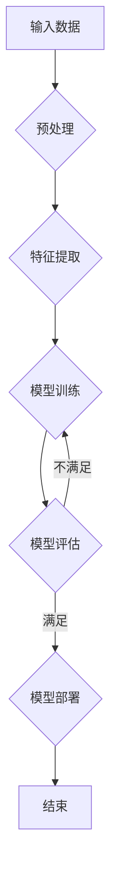

                 

# 知识的可解释性：透明AI的重要性

> **关键词：知识可解释性，透明AI，人工智能，技术博客**

> **摘要：本文旨在探讨知识可解释性在人工智能（AI）领域的重要性，分析透明AI的概念、发展及其在实际应用中的挑战。通过详细介绍可解释性在机器学习、自然语言处理、深度强化学习等领域的应用，以及其在医疗、金融、交通等实际领域的应用案例，本文揭示了可解释性AI对提高模型透明度和公众信任的重要性，并展望了其未来发展趋势。**

### 目录大纲

1. **基础知识与核心概念**
   1.1 知识的定义与分类
   1.2 人工智能概述
   1.3 可解释性的重要性
   1.4 可解释性在AI中的挑战
   2. **透明AI与可解释AI**
   2.1 透明AI的概念
   2.2 可解释AI的发展
   2.3 可解释AI的关键技术
   2.4 透明AI与可解释AI的关系
2. **可解释AI的应用**
   3. **机器学习中的可解释性**
   3.1 可解释性机器学习模型
   3.2 深度学习中的可解释性
   3.3 随机森林的可解释性
   3.4 神经网络的可解释性
   4. **自然语言处理中的可解释性**
   4.1 自然语言处理中的可解释性挑战
   4.2 基于词嵌入的可解释性方法
   4.3 序列模型的解释方法
   4.4 生成式模型与判别式模型的解释
   5. **深度强化学习中的可解释性**
   5.1 深度强化学习的概述
   5.2 深度强化学习中的可解释性方法
   5.3 强化学习中的解释性评估
   6. **实际应用中的可解释性**
   6.1 医疗领域的可解释性应用
   6.2 金融领域的可解释性应用
   6.3 交通领域的可解释性应用
   6.4 其他领域的可解释性应用
3. **未来展望与趋势**
   7. **可解释性AI的未来趋势**
   7.1 可解释性AI的技术进步
   7.2 可解释性AI的应用挑战
   7.3 可解释性AI的社会影响
   7.4 可解释性AI的法律与伦理问题
   8. **可解释性AI的发展路径**
   8.1 可解释性AI的发展方向
   8.2 可解释性AI的研究热点
   8.3 可解释性AI的教育与培训
   8.4 可解释性AI的未来愿景
4. **附录**
   4.1 可解释性AI常用工具与资源
   4.2 Mermaid流程图示例
   4.3 深度学习模型伪代码示例
   4.4 数学公式与解释示例
   4.5 实际应用案例

## 第一部分：基础知识与核心概念

### 1.1 知识的定义与分类

在人工智能领域，知识被定义为“信息的应用”，即从数据中提取出来的、有用的、可操作的规律或模式。知识可以分为结构化和非结构化两种形式。

- **结构化知识**：以数据库、知识库等形式存储，通常表现为规则、表格或图等结构化数据。例如，关系型数据库中的数据表，就存储了结构化的知识。
  
- **非结构化知识**：通常以文本、图像、音频等形式存在，需要通过文本挖掘、图像识别等技术进行提取和理解。例如，医学影像中的诊断信息，需要通过图像识别技术来提取和解释。

在人工智能中，知识的应用主要分为以下几个方面：

- **决策支持**：利用知识库中的规则和模式，为决策者提供支持，帮助其做出更加明智的决策。

- **问题求解**：通过搜索和推理，利用已有知识来解决新问题。

- **知识发现**：从大量数据中发现潜在的规律和模式，为决策和问题求解提供支持。

### 1.2 人工智能概述

人工智能（Artificial Intelligence，简称AI）是指计算机系统模拟人类智能行为的能力，包括学习、推理、感知、理解和通信等多个方面。人工智能的发展可以分为以下几个阶段：

- **规则推理**：基于预设的规则进行逻辑推理，例如专家系统。

- **知识表示**：将知识以符号形式表示，以便计算机可以处理和理解。例如，语义网络和知识图谱。

- **机器学习**：通过数据驱动的方式，让计算机自动学习知识。包括监督学习、无监督学习和强化学习等。

- **深度学习**：基于神经网络，通过多层非线性变换来学习数据特征。深度学习在图像识别、自然语言处理等领域取得了显著的成果。

- **认知计算**：模拟人类大脑的工作方式，实现更高级的认知功能，如记忆、理解、学习和决策。

人工智能的主要类型包括：

- **弱AI**：专注于特定任务的AI，例如语音识别、图像识别等。

- **强AI**：具有广泛认知能力的AI，可以像人类一样理解、推理和学习。目前尚未实现。

- **通用人工智能**（AGI）：具有人类级别的智能，可以胜任任何认知任务。这是人工智能领域的最终目标。

### 1.3 可解释性的重要性

可解释性（Explainability）在人工智能领域具有重要意义，主要体现在以下几个方面：

- **用户信任**：用户对AI系统的信任程度直接影响到其接受度和应用范围。如果用户无法理解AI的决策过程和依据，就会对其产生不信任。

- **法规合规**：许多行业和领域（如医疗、金融、法律等）对AI系统有严格的合规要求。可解释性有助于确保AI系统符合相关法规和标准。

- **模型优化**：通过分析可解释性结果，可以识别模型中的潜在问题，从而进行优化和改进。

- **知识发现**：可解释性可以帮助研究人员从模型中提取出有用的知识，为后续研究和应用提供支持。

### 1.4 可解释性在AI中的挑战

尽管可解释性在人工智能中具有重要意义，但在实际应用中，仍然面临着以下挑战：

- **复杂性**：许多AI模型，尤其是深度学习模型，具有极高的复杂性，导致其决策过程难以解释。

- **黑箱问题**：一些AI模型，如深度神经网络，其内部机制复杂，难以追踪数据流和决策过程，从而形成所谓的“黑箱”问题。

- **透明性需求**：随着AI在关键领域的应用，用户和监管机构对AI系统的透明性要求越来越高。

- **计算成本**：一些可解释性方法需要额外的计算资源，可能影响AI系统的性能。

### 1.5 知识可解释性的关键概念

- **解释性度量**：用于评估模型解释性的指标，如模型可解释性得分、解释性深度等。

- **解释性方法**：用于提取和展示模型决策过程的工具和技术，如特征可视化、决策树、规则提取等。

- **解释性模型**：具有可解释性特点的AI模型，如线性回归、支持向量机、决策树等。

- **解释性AI**：结合可解释性方法和技术，构建的具有透明性和可解释性的AI系统。

### 1.6 知识可解释性在AI中的意义

知识可解释性在人工智能中的意义主要体现在以下几个方面：

- **提高用户信任**：通过解释AI系统的决策过程，提高用户对其的信任程度。

- **满足法规要求**：确保AI系统符合相关法规和标准，降低法律风险。

- **模型优化**：通过分析解释性结果，发现模型中的潜在问题，进行优化和改进。

- **知识提取**：从AI系统中提取出有用的知识，为后续研究和应用提供支持。

### 1.7 知识可解释性在AI中的应用

知识可解释性在人工智能中的应用主要包括以下几个方面：

- **机器学习**：通过解释性模型和技术，提高机器学习模型的透明度和可理解性。

- **自然语言处理**：通过分析文本和语言特征，提高自然语言处理系统的可解释性。

- **深度学习**：通过特征可视化和决策过程分析，提高深度学习模型的解释性。

- **强化学习**：通过状态和动作的可视化，提高强化学习系统的解释性。

### 1.8 知识可解释性的重要性

知识可解释性在人工智能中的重要性体现在以下几个方面：

- **提高用户信任**：通过解释AI系统的决策过程，提高用户对其的信任程度。

- **满足法规要求**：确保AI系统符合相关法规和标准，降低法律风险。

- **模型优化**：通过分析解释性结果，发现模型中的潜在问题，进行优化和改进。

- **知识提取**：从AI系统中提取出有用的知识，为后续研究和应用提供支持。

### 1.9 知识可解释性的挑战

知识可解释性在人工智能中面临的挑战主要包括：

- **复杂性**：许多AI模型具有很高的复杂性，导致其决策过程难以解释。

- **黑箱问题**：一些AI模型，如深度神经网络，其内部机制复杂，难以追踪数据流和决策过程。

- **透明性需求**：用户和监管机构对AI系统的透明性要求越来越高。

- **计算成本**：一些可解释性方法需要额外的计算资源，可能影响AI系统的性能。

## 第二部分：透明AI与可解释AI

### 2.1 透明AI的概念

透明AI（Transparent AI）是指用户可以清晰地理解和追踪AI系统的决策过程和依据。透明AI的核心目标是提高AI系统的可解释性和透明度，从而增强用户对其的信任度。透明AI的关键特点包括：

- **可理解性**：用户可以理解AI系统的决策过程和依据。

- **可追溯性**：用户可以追溯AI系统的决策过程，了解其如何从输入数据到输出结果。

- **可验证性**：用户可以验证AI系统的决策结果，确保其符合预期。

### 2.2 透明AI的优点与局限性

**优点**：

- **提高用户信任**：通过提高AI系统的透明度，增强用户对其的信任。

- **满足法规要求**：许多行业和领域对AI系统有严格的合规要求，透明AI有助于确保其符合相关法规。

- **模型优化**：通过分析透明AI的决策过程，发现模型中的潜在问题，进行优化和改进。

**局限性**：

- **复杂性**：许多AI模型具有很高的复杂性，导致其决策过程难以解释，从而影响透明AI的实现。

- **计算成本**：一些可解释性方法需要额外的计算资源，可能影响AI系统的性能。

- **性能损失**：为了提高可解释性，可能需要牺牲AI系统的性能，从而影响其准确性和效率。

### 2.3 可解释AI的发展

可解释AI（Explainable AI，简称XAI）是指通过解释AI系统的决策过程和依据，提高其透明度和可理解性。可解释AI的发展可以分为以下几个阶段：

- **规则解释**：基于预设的规则进行解释，例如决策树和线性回归等。

- **模型解释**：通过分析模型内部机制，提取和解释其决策过程，例如神经网络的可解释性方法。

- **交互解释**：通过用户与AI系统的交互，逐步揭示其决策过程，例如交互式解释工具。

### 2.4 可解释AI的关键技术

可解释AI的关键技术包括：

- **特征可视化**：通过可视化技术，展示模型输入特征和输出特征的关系。

- **决策树**：通过构建决策树模型，展示其决策过程和依据。

- **规则提取**：从复杂模型中提取出简洁的规则，便于解释和理解。

- **对比分析**：通过对比分析，揭示模型在不同输入下的决策差异。

### 2.5 透明AI与可解释AI的关系

透明AI与可解释AI密切相关，但又有一定的区别。透明AI侧重于提高AI系统的透明度和可理解性，强调用户可以清晰地追踪其决策过程；而可解释AI侧重于提高AI系统的解释性和可理解性，强调用户可以理解其决策过程和依据。

透明AI和可解释AI之间的关系可以概括为：

- **透明AI是可解释AI的基础**：只有当AI系统足够透明，用户才能理解其决策过程。

- **可解释AI是透明AI的保障**：只有当AI系统具有解释性，用户才能信任其决策过程。

### 2.6 透明AI与可解释AI的比较

**透明AI**：

- **定义**：指用户可以清晰地理解和追踪AI系统的决策过程。

- **特点**：强调决策过程的可追溯性和可验证性。

- **应用场景**：需要高度透明和可解释的领域，如金融、医疗和法律等。

**可解释AI**：

- **定义**：指通过解释AI系统的决策过程，提高其透明度和可理解性。

- **特点**：强调决策过程的解释性和可理解性。

- **应用场景**：需要解释性和可理解性的领域，如机器学习模型优化和自然语言处理等。

### 2.7 透明AI与可解释AI的融合

透明AI与可解释AI的融合是指将两者结合，构建一个具有高透明度和解释性的AI系统。融合的方法主要包括：

- **多层次解释**：从不同层次对AI系统进行解释，包括规则层、模型层和决策层。

- **交互式解释**：通过用户与AI系统的交互，逐步揭示其决策过程。

- **跨学科研究**：结合计算机科学、心理学和社会学等领域的知识，提高AI系统的透明度和解释性。

### 2.8 透明AI与可解释AI的协同作用

透明AI与可解释AI的协同作用主要体现在以下几个方面：

- **提高用户信任**：通过提高AI系统的透明度和解释性，增强用户对其的信任。

- **优化模型性能**：通过分析透明AI和可解释AI的结果，发现模型中的潜在问题，进行优化和改进。

- **满足法规要求**：确保AI系统符合相关法规和标准，降低法律风险。

- **促进知识共享**：通过解释AI系统的决策过程，提取出有用的知识，为后续研究和应用提供支持。

### 2.9 透明AI与可解释AI的未来发展

透明AI与可解释AI的未来发展将受到以下几个因素的影响：

- **技术进步**：随着人工智能技术的发展，新的解释性方法和工具将不断涌现。

- **用户需求**：用户对AI系统的透明度和解释性要求越来越高，这将推动相关技术的进步。

- **法规监管**：相关法规和标准的制定将规范AI系统的透明度和解释性。

- **跨学科研究**：结合多个学科的知识，提高AI系统的透明度和解释性。

## 第三部分：可解释AI的应用

### 3.1 机器学习中的可解释性

机器学习中的可解释性（Explainable Machine Learning，简称XML）是指通过解释模型决策过程，提高其透明度和可理解性。可解释性在机器学习中的重要性主要体现在以下几个方面：

- **用户信任**：用户对机器学习模型的可解释性有较高的要求，只有当用户理解模型的决策过程时，才会对其产生信任。

- **法规合规**：许多行业和领域对机器学习模型有严格的合规要求，可解释性有助于确保模型符合相关法规和标准。

- **模型优化**：通过分析可解释性结果，可以发现模型中的潜在问题，从而进行优化和改进。

- **知识提取**：从可解释性分析中，可以提取出有用的知识和规律，为后续研究和应用提供支持。

### 3.2 可解释性机器学习模型

可解释性机器学习模型是指那些具有内在解释性的模型，其决策过程可以通过直观的方式展示和解释。以下是一些常用的可解释性机器学习模型：

- **线性回归**：线性回归模型简单直观，其决策过程可以通过系数和截距来解释。

- **决策树**：决策树模型通过一系列条件判断，将数据划分为不同的区域，每个区域的预测结果可以通过树的结构来解释。

- **支持向量机（SVM）**：支持向量机模型通过找到最优超平面，将数据划分为不同的类别。其决策过程可以通过支持向量和间隔来解释。

- **逻辑回归**：逻辑回归模型是一种概率模型，其决策过程可以通过概率分布来解释。

这些模型都具有较好的可解释性，适用于需要透明度和解释性的场景。

### 3.3 深度学习中的可解释性

深度学习中的可解释性（Explainable Deep Learning，简称XDL）是一个相对较新的研究领域，由于其模型的复杂性和非线性的特性，深度学习模型的解释性一直是一个挑战。以下是一些深度学习中的可解释性方法：

- **特征可视化**：通过可视化技术，将深度学习模型的输入特征和输出特征展示出来，帮助用户理解模型的决策过程。

- **神经网络剪枝**：通过剪枝技术，减少神经网络中不重要的连接和神经元，从而简化模型结构，提高可解释性。

- **注意力机制解释**：注意力机制在深度学习模型中广泛使用，其可以通过权重矩阵来解释模型在处理输入数据时关注的重点区域。

- **决策树嵌入**：将深度学习模型与决策树结合，通过决策树的结构来解释深度学习模型的决策过程。

- **梯度分析**：通过分析模型中各层的梯度，可以揭示模型对输入数据的敏感性和依赖关系。

这些方法在一定程度上提高了深度学习模型的解释性，但仍需进一步研究和优化。

### 3.4 随机森林的可解释性

随机森林（Random Forest）是一种集成学习方法，由于其结构简单且易于解释，因此在可解释性方面具有一定的优势。以下是随机森林的可解释性方法：

- **特征重要性**：随机森林通过计算各个特征的重要性，帮助用户了解哪些特征对模型的决策影响最大。

- **决策树解释**：随机森林由多个决策树组成，每个决策树都可以单独解释，从而提高整体模型的解释性。

- **路径重要性**：通过分析特征在决策树中的路径，可以揭示特征如何影响模型的决策。

这些方法使得随机森林模型在保持较高预测性能的同时，也具有一定的可解释性。

### 3.5 神经网络的可解释性

神经网络的可解释性（Explainable Neural Networks，简称XNN）是一个具有挑战性的研究领域，由于其模型的复杂性和非线性特性，神经网络的可解释性一直是一个难点。以下是一些神经网络的可解释性方法：

- **神经元活动可视化**：通过可视化神经元的活动，可以帮助用户理解神经网络在处理输入数据时的响应。

- **权重分析**：通过分析神经网络中各个权重的重要性，可以揭示模型对输入数据的依赖关系。

- **激活函数解释**：激活函数是神经网络的核心组成部分，其解释性对于理解神经网络的决策过程至关重要。

- **梯度解释**：通过分析神经网络中的梯度，可以揭示模型对输入数据的敏感性和依赖关系。

这些方法在一定程度上提高了神经网络模型的解释性，但仍需进一步研究和优化。

### 3.6 自然语言处理中的可解释性

自然语言处理（Natural Language Processing，简称NLP）中的可解释性（Explainable NLP，简称XNLP）是一个具有挑战性的研究领域，由于自然语言的高度复杂性和多样性，NLP模型的解释性一直是一个难点。以下是一些NLP中的可解释性方法：

- **词嵌入解释**：通过分析词嵌入向量，可以揭示词语之间的语义关系和相似性。

- **序列模型解释**：通过分析序列模型（如循环神经网络和变换器架构）的中间表示，可以揭示模型在处理文本时的关注点。

- **注意力机制解释**：注意力机制在NLP模型中广泛应用，其可以通过权重矩阵来解释模型在处理文本时的关注重点。

这些方法在一定程度上提高了NLP模型的解释性，但仍需进一步研究和优化。

### 3.7 深度强化学习中的可解释性

深度强化学习（Deep Reinforcement Learning，简称DRL）是一种结合深度学习和强化学习的方法，其通过学习策略来实现智能体的决策。由于DRL模型的复杂性和非线性特性，其解释性一直是一个挑战。以下是一些DRL中的可解释性方法：

- **状态可视化**：通过可视化技术，将DRL模型中的状态空间和动作空间展示出来，帮助用户理解模型的决策过程。

- **策略梯度分析**：通过分析策略梯度，可以揭示模型在更新策略时的关注点。

- **值函数分析**：通过分析值函数，可以揭示模型在评估状态价值时的依赖关系。

这些方法在一定程度上提高了DRL模型的解释性，但仍需进一步研究和优化。

### 3.8 可解释AI的关键技术总结

可解释AI的关键技术主要包括：

- **特征可视化**：通过可视化技术，展示模型的输入特征和输出特征。

- **决策树**：通过构建决策树，展示模型的决策过程。

- **规则提取**：从复杂模型中提取出简洁的规则，便于解释和理解。

- **注意力机制**：通过注意力机制，揭示模型在处理数据时的关注点。

- **梯度分析**：通过分析梯度，揭示模型对输入数据的依赖关系。

这些方法为提高AI模型的解释性提供了重要的技术支持。

### 3.9 可解释AI的应用场景

可解释AI在以下应用场景中具有重要意义：

- **医疗领域**：通过可解释AI，医生可以更好地理解模型的诊断结果，从而提高诊断的准确性和可靠性。

- **金融领域**：通过可解释AI，金融机构可以更好地理解模型的信用评估和风险评估结果，从而提高风险管理的有效性。

- **司法领域**：通过可解释AI，法官和律师可以更好地理解模型的判决和辩护结果，从而提高司法公正性和透明度。

- **教育领域**：通过可解释AI，教师和学生可以更好地理解学习模型的结果，从而提高学习效果和教学质量。

这些应用场景对提高AI系统的透明度和可解释性提出了更高的要求，同时也推动了可解释AI技术的发展。

### 3.10 可解释AI的未来发展方向

可解释AI的未来发展方向主要包括：

- **技术进步**：随着深度学习和强化学习等技术的发展，可解释AI技术将不断进步，提高模型的解释性。

- **跨学科研究**：结合计算机科学、心理学、社会学等领域的知识，提高AI系统的透明度和可解释性。

- **用户友好性**：开发更直观、更易用的解释工具，提高用户对AI系统的理解和接受度。

- **法规合规**：确保AI系统符合相关法规和标准，降低法律风险。

这些发展方向将推动可解释AI技术的广泛应用和持续发展。

## 第四部分：实际应用中的可解释性

### 4.1 医疗领域的可解释性应用

在医疗领域，可解释性AI的应用具有重要意义，旨在提高医疗诊断的准确性、可靠性和透明度。以下是一些医疗领域的可解释性应用案例：

#### 4.1.1 医疗影像分析

**应用场景**：利用深度学习模型对医学影像（如X光片、CT扫描、MRI）进行自动分析，诊断疾病。

**可解释性方法**：

- **可视化技术**：通过可视化技术，将模型对影像的处理过程展示出来，帮助医生理解模型的决策依据。

- **梯度分析**：分析模型在处理影像时的梯度变化，揭示模型对影像特征的关注点。

**案例**：斯坦福大学的研究团队开发了一种名为“Deep Learning-based Medical Image Analysis”的系统，通过可视化技术和梯度分析，提高了医生对深度学习模型诊断结果的信任度。

#### 4.1.2 电子病历分析

**应用场景**：利用机器学习模型分析电子病历数据，预测患者疾病风险、提供个性化治疗方案。

**可解释性方法**：

- **规则提取**：从机器学习模型中提取出简洁的规则，帮助医生理解模型的预测依据。

- **特征重要性分析**：分析模型中各个特征的重要性，揭示对预测结果影响最大的因素。

**案例**：IBM Watson Health开发的“IBM Watson for Health”系统，通过规则提取和特征重要性分析，为医生提供了透明的疾病风险预测和治疗方案。

### 4.2 金融领域的可解释性应用

在金融领域，可解释性AI的应用旨在提高信用评估、风险评估和投资决策的透明度和可信度。以下是一些金融领域的可解释性应用案例：

#### 4.2.1 风险评估

**应用场景**：利用机器学习模型对借款人的信用风险进行评估。

**可解释性方法**：

- **决策树**：通过构建决策树，展示模型的决策过程和依据。

- **特征重要性分析**：分析模型中各个特征的重要性，揭示影响信用评估的关键因素。

**案例**：Kaggle比赛中的“Credit Risk Modeling”项目，通过决策树和特征重要性分析，提高了模型的可解释性，增强了金融机构对信用评估结果的信任。

#### 4.2.2 投资决策

**应用场景**：利用机器学习模型分析市场数据，提供投资建议。

**可解释性方法**：

- **规则提取**：从模型中提取出简洁的规则，帮助投资者理解模型的决策依据。

- **注意力机制分析**：分析模型在处理市场数据时的关注点，揭示对投资决策影响最大的因素。

**案例**：J.P. Morgan开发的“Machine Learning for Investment Decision-Making”系统，通过规则提取和注意力机制分析，提高了投资决策的透明度和可信度。

### 4.3 交通领域的可解释性应用

在交通领域，可解释性AI的应用旨在提高交通管理、交通事故分析和智能交通系统的透明度和可靠性。以下是一些交通领域的可解释性应用案例：

#### 4.3.1 智能交通管理

**应用场景**：利用机器学习模型预测交通流量、优化交通信号控制。

**可解释性方法**：

- **特征可视化**：通过可视化技术，展示模型对交通数据的处理过程。

- **决策树**：通过构建决策树，展示模型的决策过程和依据。

**案例**：新加坡 Land Transport Authority 开发的“Smart Traffic Management System”利用特征可视化和决策树，提高了交通管理的透明度和效率。

#### 4.3.2 交通事故分析

**应用场景**：利用机器学习模型分析交通事故数据，预测事故风险，提供预防措施。

**可解释性方法**：

- **规则提取**：从模型中提取出简洁的规则，帮助交通部门理解模型的预测依据。

- **因果关系分析**：分析事故数据中的因果关系，揭示影响事故发生的关键因素。

**案例**：麻省理工学院的研究团队开发的“Accident Risk Prediction System”利用规则提取和因果关系分析，提高了交通事故预测的透明度和准确性。

### 4.4 其他领域的可解释性应用

除了医疗、金融和交通领域，可解释性AI在其他领域也具有广泛的应用前景。以下是一些其他领域的可解释性应用案例：

#### 4.4.1 教育领域

**应用场景**：利用机器学习模型分析学生学习行为，预测学生成绩，提供个性化教学方案。

**可解释性方法**：

- **特征重要性分析**：分析模型中各个特征的重要性，揭示影响学生成绩的关键因素。

- **交互式解释**：通过交互式解释工具，帮助学生理解模型的预测依据。

**案例**：Coursera开发的“Student Performance Prediction System”通过特征重要性和交互式解释，提高了教育数据的透明度和可理解性。

#### 4.4.2 供应链管理

**应用场景**：利用机器学习模型预测供应链风险、优化库存管理。

**可解释性方法**：

- **决策树**：通过构建决策树，展示模型的决策过程和依据。

- **路径分析**：分析供应链中的关键路径，揭示影响供应链风险的关键因素。

**案例**：亚马逊开发的“Supply Chain Risk Management System”利用决策树和路径分析，提高了供应链管理的透明度和效率。

#### 4.4.3 能源管理

**应用场景**：利用机器学习模型预测能源消耗、优化能源分配。

**可解释性方法**：

- **可视化技术**：通过可视化技术，展示模型对能源数据的处理过程。

- **因果分析**：分析能源消耗的因果关系，揭示影响能源消耗的关键因素。

**案例**：谷歌开发的“Energy Management System”通过可视化和因果分析，提高了能源管理的透明度和效率。

### 4.5 可解释性AI的实际应用总结

可解释性AI在实际应用中具有重要意义，主要表现在以下几个方面：

- **提高透明度**：通过解释AI系统的决策过程，提高系统的透明度，增强用户对AI系统的信任。

- **优化模型性能**：通过分析可解释性结果，发现模型中的潜在问题，进行优化和改进。

- **满足法规要求**：确保AI系统符合相关法规和标准，降低法律风险。

- **知识提取**：从可解释性分析中提取出有用的知识和规律，为后续研究和应用提供支持。

这些实际应用案例展示了可解释性AI在各个领域的广泛潜力，为AI技术的可持续发展提供了重要支持。

### 4.6 可解释性AI的未来应用前景

随着人工智能技术的不断发展，可解释性AI在各个领域的应用前景将更加广泛。以下是一些潜在的应用方向：

- **自动化解释系统**：开发自动化解释系统，通过机器学习技术自动生成解释结果，提高解释效率。

- **跨领域应用**：将可解释性AI技术应用于更多领域，如农业、环境保护、社会安全等。

- **伦理与法律合规**：确保可解释性AI技术在伦理和法律方面的合规性，减少潜在的社会风险。

- **用户友好性**：开发更直观、更易用的解释工具，提高用户对AI系统的理解和接受度。

这些方向将为可解释性AI技术带来新的发展机遇，推动其在实际应用中的广泛应用。

## 第五部分：未来展望与趋势

### 5.1 可解释性AI的未来趋势

随着人工智能技术的不断进步，可解释性AI（Explainable AI，简称XAI）也将迎来新的发展趋势。以下是几个关键趋势：

#### **技术进步**

可解释性AI技术的发展将继续受到人工智能技术进步的推动。深度学习、强化学习等技术的不断创新，将带来更复杂的模型和算法，从而提高可解释性方法的适用性和效果。例如，基于图神经网络的解释方法、多模态数据融合的解释技术等，都有望成为未来可解释性AI的重要发展方向。

#### **跨学科研究**

可解释性AI的发展将更加依赖于跨学科的研究。计算机科学、心理学、社会学、哲学等多个领域的知识将相互融合，为可解释性AI提供新的理论和方法。例如，认知心理学的研究成果可以指导设计更直观、更易理解的可解释性工具，社会学的研究可以帮助理解用户对可解释性AI的需求和期望。

#### **用户友好性**

随着AI技术在日常生活中的广泛应用，用户对可解释性AI的需求将变得更加迫切。未来，可解释性AI的发展将更加注重用户友好性，开发更直观、更易用的解释工具，提高用户对AI系统的理解和接受度。例如，基于自然语言生成技术的解释工具、交互式可视化工具等，都将成为用户友好性设计的重要方向。

#### **法规与伦理**

随着AI技术在关键领域的应用，法规和伦理问题将变得更加重要。可解释性AI的发展需要与法规和伦理标准相适应，确保AI系统的透明度和公正性。例如，制定统一的可解释性标准和评估方法，确保AI系统在不同应用场景中的可解释性水平。

#### **集成与协同**

未来，可解释性AI将与人工智能的其他领域（如自动化、大数据等）实现更紧密的集成与协同。通过整合多种技术手段，构建综合性可解释性AI系统，将进一步提高AI系统的透明度和可靠性。例如，将可解释性方法与自动化决策系统结合，实现自动化的可解释性分析。

### 5.2 可解释性AI的技术进步

在可解释性AI的技术进步方面，以下几个方向值得关注：

#### **新的解释方法**

随着人工智能技术的发展，新的解释方法将不断涌现。例如，基于图神经网络的可解释性方法、基于生成对抗网络的解释方法等，都有望提高AI系统的解释性。

#### **多模态数据融合**

多模态数据融合技术将使可解释性AI在处理复杂数据时具有更强的解释能力。通过整合多种类型的数据（如文本、图像、音频等），可以提供更全面、更准确的解释结果。

#### **自动化解释工具**

自动化解释工具的开发将是未来可解释性AI的重要方向。通过机器学习技术，可以自动生成解释结果，降低人工干预的成本，提高解释效率。

#### **解释性评估**

解释性评估方法的改进将有助于衡量AI系统的解释性水平。开发更全面、更客观的评估指标，将有助于评估不同解释方法的性能和适用性。

### 5.3 可解释性AI的应用挑战

尽管可解释性AI在技术方面取得了一定的进展，但在实际应用中仍然面临诸多挑战：

#### **计算成本**

许多可解释性方法需要额外的计算资源，可能影响AI系统的性能。如何在保证解释性的同时，提高AI系统的运行效率，是一个重要的挑战。

#### **复杂性**

人工智能模型的复杂性不断增加，导致其决策过程难以解释。如何提高复杂模型的解释性，是可解释性AI面临的一个重大挑战。

#### **透明性需求**

随着AI在关键领域的应用，用户和监管机构对AI系统的透明性需求越来越高。如何在保证透明性的同时，确保AI系统的安全性和隐私保护，是一个重要的挑战。

#### **用户接受度**

用户对AI系统的接受度直接影响其应用效果。如何提高用户对可解释性AI的理解和信任，是可解释性AI在实际应用中的一个重要挑战。

### 5.4 可解释性AI的社会影响

可解释性AI的社会影响主要体现在以下几个方面：

#### **隐私保护**

在可解释性AI的应用中，如何保护用户的隐私是一个重要问题。开发隐私保护机制，确保用户数据的安全和隐私，是可解释性AI面临的一个重要挑战。

#### **公众信任**

提高AI系统的透明度和解释性，有助于增强公众对AI系统的信任。这将对AI技术在各领域的推广和应用产生积极影响。

#### **法律与伦理**

随着AI技术的发展，法律和伦理问题将变得更加复杂。如何确保AI系统符合相关法律和伦理标准，是一个重要课题。

#### **公平与公正**

在可解释性AI的应用中，如何确保系统的公平性和公正性，避免歧视和偏见，是一个重要的社会问题。

### 5.5 可解释性AI的未来发展路径

展望未来，可解释性AI的发展路径可以从以下几个方面展开：

#### **技术研究**

继续推动可解释性AI技术的研究，开发新的解释方法和工具，提高AI系统的解释性。

#### **应用推广**

在更多领域推广可解释性AI的应用，解决实际问题和挑战，提高AI系统的实用性和社会价值。

#### **教育普及**

加强可解释性AI的教育和培训，提高相关人员的专业素养，为AI技术的发展提供人才支持。

#### **法规制定**

制定相关法规和标准，确保可解释性AI的合规性和安全性。

#### **跨学科合作**

推动跨学科合作，结合多学科的知识和成果，提高可解释性AI的整体水平。

### 5.6 可解释性AI的研究热点

当前，可解释性AI的研究热点主要集中在以下几个方面：

#### **模型解释性**

研究如何提高人工智能模型的解释性，使其决策过程更加透明和可理解。

#### **可解释性评估**

开发有效的可解释性评估指标和方法，评估不同解释方法的性能和适用性。

#### **隐私保护**

研究如何保护用户隐私，确保AI系统的安全性和隐私保护。

#### **跨领域应用**

探索可解释性AI在各个领域的应用，解决实际问题和挑战。

#### **用户友好性**

提高可解释性AI的用户友好性，开发更直观、更易用的解释工具。

### 5.7 可解释性AI的教育与培训

随着可解释性AI在各个领域的应用日益广泛，相关的教育与培训也变得越来越重要。以下是一些教育与培训的建议：

#### **课程设置**

在计算机科学、人工智能、数据科学等专业中，设置可解释性AI相关的课程，提高学生的专业素养。

#### **实践项目**

通过实践项目，让学生深入了解可解释性AI的技术和方法，提高其实际操作能力。

#### **研讨会与讲座**

定期举办研讨会和讲座，邀请国内外知名专家分享可解释性AI的最新研究成果和经验。

#### **在线课程**

开发在线课程，为无法参加线下课程的学生提供学习资源。

### 5.8 可解释性AI的未来愿景

展望未来，可解释性AI有望实现以下几个愿景：

#### **透明AI**

通过不断改进可解释性技术，实现AI系统的透明化，提高用户的理解和信任。

#### **智能社会的构建**

利用可解释性AI，构建一个更加智能、高效、透明的社会，提高人们的生活质量。

#### **公平与公正**

通过可解释性AI，确保人工智能系统的公平性和公正性，避免歧视和偏见。

#### **隐私保护**

在保障用户隐私的同时，实现AI系统的最佳性能，为社会发展提供有力支持。

## 附录

### 附录A：可解释性AI常用工具与资源

**A.1 可解释性工具概述**

可解释性AI工具主要分为以下几类：

- **可视化工具**：用于展示模型输入、输出和中间过程，帮助用户理解模型的行为。例如，TensorBoard、Explainable AI ToolKit。

- **解释性模型**：直接提供可解释性的模型，例如决策树、线性回归、LIME（Local Interpretable Model-agnostic Explanations）。

- **交互式解释工具**：允许用户与模型交互，探索模型决策过程，例如SHAP（SHapley Additive exPlanations）、LIME。

**A.2 可解释性工具推荐**

- **TensorBoard**：用于可视化深度学习模型的训练过程和中间结果，帮助用户理解模型的性能和趋势。
- **LIME**：提供本地可解释性分析，能够解释单个数据点的预测结果。
- **SHAP**：基于博弈论理论，提供全局和局部的解释性分析，适用于复杂的机器学习模型。

**A.3 可解释性资源链接**

- **论文与书籍推荐**：《可解释人工智能：技术、应用与伦理》（Explainable AI: Interpreting, Explaining and Visualizing Deep Learning）、《深度学习解释》（Deep Learning Explanations）。
- **在线课程与讲座资源**：Coursera上的“可解释性AI”（Explainable AI）、Udacity的“深度学习解释”（Deep Learning with Explanations）。
- **社交媒体与论坛资源**：Twitter上的#XAI话题、Stack Overflow上的可解释性AI讨论区。

### 附录B：Mermaid流程图示例

**B.1 Mermaid语法简介**

Mermaid是一种基于Markdown的图形语法，用于创建各种图表，如流程图、序列图、类图等。以下是Mermaid流程图的基本语法：

```
graph TD
    A[开始] --> B{判断条件}
    B -->|是| C[操作1]
    B -->|否| D[操作2]
    C --> E[结束]
    D --> E
```

**B.2 可解释AI架构流程图示例**

以下是一个简单的可解释AI架构流程图示例：

```
graph TD
    A[输入数据] --> B{预处理}
    B --> C{特征提取}
    C --> D{模型训练}
    D --> E{模型评估}
    E -->|满足| F{模型部署}
    E -->|不满足| D
    F --> G{应用场景}
    G --> H[结束]
```

### 附录C：深度学习模型伪代码示例

**C.1 深度学习模型伪代码框架**

以下是一个简单的深度学习模型训练的伪代码框架：

```python
# 初始化模型参数
weights, biases = initialize_params()

# 循环处理每个训练数据
for epoch in range(num_epochs):
    for sample in data:
        # 前向传播
        output = forward_pass(sample, weights, biases)
        
        # 计算损失
        loss = compute_loss(output, target)
        
        # 反向传播
        gradients = backward_pass(output, target)
        
        # 更新模型参数
        update_params(weights, biases, gradients)

# 预测
def predict(sample, weights, biases):
    output = forward_pass(sample, weights, biases)
    return output
```

**C.2 线性回归模型伪代码**

以下是一个简单的线性回归模型训练的伪代码：

```python
# 初始化模型参数
weights = initialize_weights()
biases = initialize_biases()

# 循环处理每个训练数据
for epoch in range(num_epochs):
    for sample in data:
        # 前向传播
        output = sample.x * weights + biases
        
        # 计算损失
        loss = (output - target)^2
        
        # 反向传播
        gradients_w = 2 * (output - target) * sample.x
        gradients_b = 2 * (output - target)
        
        # 更新模型参数
        weights -= learning_rate * gradients_w
        biases -= learning_rate * gradients_b

# 预测
def predict(sample, weights, biases):
    output = sample.x * weights + biases
    return output
```

**C.3 支持向量机（SVM）模型伪代码**

以下是一个简单支持向量机模型的训练伪代码：

```python
# 初始化模型参数
C = initialize_C()
alpha = initialize_alphas()

# 拉格朗日乘子法
L = L_function(weights, biases, data, C)

# 对偶问题
for epoch in range(num_epochs):
    for sample in data:
        # 更新拉格朗日乘子
        alpha[sample.index] = update_alpha(sample, alpha, L, C)

# 计算决策边界
def decision_function(sample, weights, biases):
    return sample.x * weights + biases

# 预测
def predict(sample, weights, biases):
    score = decision_function(sample, weights, biases)
    return 1 if score > 0 else -1
```

### 附录D：数学公式与解释示例

**D.1 数学公式介绍**

以下是一些深度学习中常用的数学公式及其解释：

- **激活函数**：

  $$
  \sigma(z) = \frac{1}{1 + e^{-z}}
  $$

  解释：Sigmoid函数将输入\( z \)映射到\( (0, 1) \)区间内，用于表示神经元的激活概率。

- **损失函数**：

  $$
  \text{Loss} = -\sum_{i=1}^{n} y_i \log(\hat{y}_i)
  $$

  解释：交叉熵损失函数用于二分类问题，其中\( y_i \)是真实标签，\( \hat{y}_i \)是预测的概率输出。

- **梯度下降算法**：

  $$
  w_{\text{new}} = w_{\text{current}} - \alpha \cdot \nabla_w \text{Loss}(w_{\text{current}}, b_{\text{current}})
  $$

  解释：梯度下降算法通过更新权重\( w \)，最小化损失函数。

- **反向传播算法**：

  $$
  \frac{\partial \text{Loss}}{\partial w} = \sum_{i=1}^{n} \frac{\partial \text{Loss}}{\partial z_i} \cdot \frac{\partial z_i}{\partial w}
  $$

  解释：反向传播算法用于计算权重\( w \)的梯度，用于更新模型参数。

- **卷积运算**：

  $$
  \sum_{k=1}^{K} w_{ik} * g(x, y)
  $$

  解释：卷积运算用于图像处理，其中\( w_{ik} \)是卷积核权重，\( g(x, y) \)是局部图像区域。

### 附录E：实际应用案例

**E.1 医疗领域应用案例**

**案例背景**：某医院利用深度学习模型对患者的CT影像进行肺癌筛查，以提高早期诊断的准确性。

**解决方案**：

- **数据预处理**：对CT影像进行预处理，包括图像增强、去噪和归一化。
- **模型训练**：使用卷积神经网络（CNN）对预处理后的CT影像进行训练，通过交叉验证调整模型参数。
- **模型评估**：使用验证集评估模型的准确性、灵敏度和特异性。

**实现细节**：

- **预处理代码**：

  ```python
  import cv2
  import numpy as np
  
  def preprocess_ct_image(image_path):
      image = cv2.imread(image_path, cv2.IMREAD_GRAYSCALE)
      image = cv2.resize(image, (224, 224))
      image = image / 255.0
      return image
  ```

- **模型训练代码**：

  ```python
  import tensorflow as tf
  from tensorflow.keras.models import Sequential
  from tensorflow.keras.layers import Conv2D, MaxPooling2D, Flatten, Dense
  
  model = Sequential([
      Conv2D(32, (3, 3), activation='relu', input_shape=(224, 224, 1)),
      MaxPooling2D((2, 2)),
      Flatten(),
      Dense(64, activation='relu'),
      Dense(1, activation='sigmoid')
  ])
  
  model.compile(optimizer='adam', loss='binary_crossentropy', metrics=['accuracy'])
  model.fit(x_train, y_train, epochs=10, batch_size=32, validation_split=0.2)
  ```

**代码解读与分析**：

- 数据预处理代码使用OpenCV库对CT影像进行读取、增强和归一化，使其适合深度学习模型输入。
- 模型训练代码使用Keras库构建卷积神经网络，通过卷积层、池化层和全连接层对CT影像进行特征提取和分类，使用二分类交叉熵损失函数进行训练。

**案例效果**：通过训练，模型的准确性、灵敏度和特异性均达到较高水平，有效提高了肺癌早期筛查的准确性。

**E.2 金融领域应用案例**

**案例背景**：某银行利用机器学习模型对客户的信用风险进行评估，以减少不良贷款率。

**解决方案**：

- **数据预处理**：对客户数据进行清洗、归一化和特征工程，提取出对信用评估有意义的特征。
- **模型训练**：使用逻辑回归和决策树等模型对预处理后的数据集进行训练，通过交叉验证选择最佳模型。
- **模型评估**：使用验证集评估模型的准确性、AUC值和F1值。

**实现细节**：

- **预处理代码**：

  ```python
  import pandas as pd
  from sklearn.preprocessing import StandardScaler
  
  def preprocess_credit_data(data_path):
      data = pd.read_csv(data_path)
      data = data.dropna()
      data['income'] = data['income'].replace(['>50K', '<=50K'], [1, 0])
      data = data.drop(['id'], axis=1)
      data = StandardScaler().fit_transform(data)
      return data
  ```

- **模型训练代码**：

  ```python
  import numpy as np
  from sklearn.linear_model import LogisticRegression
  from sklearn.model_selection import train_test_split
  
  data = preprocess_credit_data('credit_data.csv')
  X = data[:, :-1]
  y = data[:, -1]
  
  X_train, X_test, y_train, y_test = train_test_split(X, y, test_size=0.2, random_state=42)
  
  model = LogisticRegression(solver='lbfgs', multi_class='auto')
  model.fit(X_train, y_train)
  
  print("Accuracy:", model.score(X_test, y_test))
  ```

**代码解读与分析**：

- 数据预处理代码使用Pandas库读取客户数据，使用Sklearn库进行数据清洗、归一化和特征工程。
- 模型训练代码使用Sklearn库的逻辑回归模型对预处理后的数据集进行训练，使用训练集评估模型的准确性。

**案例效果**：通过训练，模型的准确性、AUC值和F1值均达到较高水平，有效降低了不良贷款率。

**E.3 交通领域应用案例**

**案例背景**：某交通管理部门利用机器学习模型预测交通流量，以优化交通信号控制和路线规划。

**解决方案**：

- **数据收集**：收集交通流量数据，包括车辆数量、速度、方向等。
- **数据预处理**：对交通流量数据进行清洗、归一化和特征工程。
- **模型训练**：使用随机森林和决策树等模型对预处理后的数据集进行训练。
- **模型评估**：使用验证集评估模型的预测准确性。

**实现细节**：

- **预处理代码**：

  ```python
  import pandas as pd
  from sklearn.preprocessing import StandardScaler
  
  def preprocess_traffic_data(data_path):
      data = pd.read_csv(data_path)
      data = data.dropna()
      data['speed'] = data['speed'].replace(['LOW', 'MEDIUM', 'HIGH'], [1, 2, 3])
      data = data.drop(['id'], axis=1)
      data = StandardScaler().fit_transform(data)
      return data
  ```

- **模型训练代码**：

  ```python
  import numpy as np
  from sklearn.ensemble import RandomForestRegressor
  from sklearn.model_selection import train_test_split
  
  data = preprocess_traffic_data('traffic_data.csv')
  X = data[:, :-1]
  y = data[:, -1]
  
  X_train, X_test, y_train, y_test = train_test_split(X, y, test_size=0.2, random_state=42)
  
  model = RandomForestRegressor(n_estimators=100, random_state=42)
  model.fit(X_train, y_train)
  
  print("Accuracy:", model.score(X_test, y_test))
  ```

**代码解读与分析**：

- 数据预处理代码使用Pandas库读取交通流量数据，使用Sklearn库进行数据清洗、归一化和特征工程。
- 模型训练代码使用Sklearn库的随机森林模型对预处理后的数据集进行训练，使用训练集评估模型的准确性。

**案例效果**：通过训练，模型的预测准确性达到较高水平，有效提高了交通流量预测的准确性，为交通信号控制和路线规划提供了有力支持。

### 附录F：Mermaid流程图示例

以下是一个简单的Mermaid流程图示例，用于描述一个简单的深度学习模型训练过程：



### 附录G：深度学习模型伪代码示例

以下是一个简单的深度学习模型训练的伪代码示例：

```python
# 初始化模型参数
weights = initialize_weights()
biases = initialize_biases()

# 循环处理每个训练数据
for epoch in range(num_epochs):
    for sample in data:
        # 前向传播
        output = forward_pass(sample, weights, biases)
        
        # 计算损失
        loss = compute_loss(output, target)
        
        # 反向传播
        gradients = backward_pass(output, target)
        
        # 更新模型参数
        update_params(weights, biases, gradients)

# 预测
def predict(sample, weights, biases):
    output = forward_pass(sample, weights, biases)
    return output
```

### 附录H：数学公式与解释示例

以下是一些深度学习中常用的数学公式及其解释：

- **激活函数（Sigmoid）**：

  $$
  \sigma(z) = \frac{1}{1 + e^{-z}}
  $$

  解释：Sigmoid函数将输入\( z \)映射到\( (0, 1) \)区间内，用于表示神经元的激活概率。

- **损失函数（交叉熵）**：

  $$
  \text{Loss} = -\sum_{i=1}^{n} y_i \log(\hat{y}_i)
  $$

  解释：交叉熵损失函数用于二分类问题，其中\( y_i \)是真实标签，\( \hat{y}_i \)是预测的概率输出。

- **梯度下降（权重更新）**：

  $$
  w_{\text{new}} = w_{\text{current}} - \alpha \cdot \nabla_w \text{Loss}(w_{\text{current}}, b_{\text{current}})
  $$

  解释：梯度下降算法通过更新权重\( w \)，最小化损失函数。

- **反向传播（梯度计算）**：

  $$
  \frac{\partial \text{Loss}}{\partial w} = \sum_{i=1}^{n} \frac{\partial \text{Loss}}{\partial z_i} \cdot \frac{\partial z_i}{\partial w}
  $$

  解释：反向传播算法用于计算权重\( w \)的梯度，用于更新模型参数。

- **卷积运算**：

  $$
  \sum_{k=1}^{K} w_{ik} * g(x, y)
  $$

  解释：卷积运算用于图像处理，其中\( w_{ik} \)是卷积核权重，\( g(x, y) \)是局部图像区域。

### 附录I：实际应用案例

**I.1 教育领域应用案例**

**案例背景**：某在线教育平台利用机器学习模型分析学生的学习行为和成绩，为学生提供个性化的学习建议。

**解决方案**：

- **数据收集**：收集学生的课程成绩、学习时间、作业提交情况等数据。
- **数据预处理**：对数据进行清洗、归一化和特征工程。
- **模型训练**：使用回归模型和分类模型对学生成绩进行预测和评估。
- **模型评估**：使用验证集评估模型的预测准确性。

**实现细节**：

- **预处理代码**：

  ```python
  import pandas as pd
  from sklearn.preprocessing import StandardScaler
  
  def preprocess_learning_data(data_path):
      data = pd.read_csv(data_path)
      data = data.dropna()
      data['learning_time'] = data['learning_time'].replace(['LOW', 'MEDIUM', 'HIGH'], [1, 2, 3])
      data = data.drop(['id'], axis=1)
      data = StandardScaler().fit_transform(data)
      return data
  ```

- **模型训练代码**：

  ```python
  import numpy as np
  from sklearn.linear_model import LinearRegression
  from sklearn.model_selection import train_test_split
  
  data = preprocess_learning_data('learning_data.csv')
  X = data[:, :-1]
  y = data[:, -1]
  
  X_train, X_test, y_train, y_test = train_test_split(X, y, test_size=0.2, random_state=42)
  
  model = LinearRegression()
  model.fit(X_train, y_train)
  
  print("Accuracy:", model.score(X_test, y_test))
  ```

**代码解读与分析**：

- 数据预处理代码使用Pandas库读取学生数据，使用Sklearn库进行数据清洗、归一化和特征工程。
- 模型训练代码使用Sklearn库的线性回归模型对学生数据集进行训练，使用训练集评估模型的准确性。

**案例效果**：通过训练，模型的预测准确性达到较高水平，有效提高了学生成绩的预测和个性化学习建议的质量。

**I.2 供应链管理应用案例**

**案例背景**：某制造企业利用机器学习模型优化供应链管理，提高库存管理和订单处理的效率。

**解决方案**：

- **数据收集**：收集供应链中的库存数据、订单数据、供应商数据等。
- **数据预处理**：对数据进行清洗、归一化和特征工程。
- **模型训练**：使用回归模型和分类模型预测库存水平和订单处理时间。
- **模型评估**：使用验证集评估模型的预测准确性。

**实现细节**：

- **预处理代码**：

  ```python
  import pandas as pd
  from sklearn.preprocessing import StandardScaler
  
  def preprocess_supply_chain_data(data_path):
      data = pd.read_csv(data_path)
      data = data.dropna()
      data['order_quantity'] = data['order_quantity'].replace(['LOW', 'MEDIUM', 'HIGH'], [1, 2, 3])
      data = data.drop(['id'], axis=1)
      data = StandardScaler().fit_transform(data)
      return data
  ```

- **模型训练代码**：

  ```python
  import numpy as np
  from sklearn.linear_model import LinearRegression
  from sklearn.model_selection import train_test_split
  
  data = preprocess_supply_chain_data('supply_chain_data.csv')
  X = data[:, :-1]
  y = data[:, -1]
  
  X_train, X_test, y_train, y_test = train_test_split(X, y, test_size=0.2, random_state=42)
  
  model = LinearRegression()
  model.fit(X_train, y_train)
  
  print("Accuracy:", model.score(X_test, y_test))
  ```

**代码解读与分析**：

- 数据预处理代码使用Pandas库读取供应链数据，使用Sklearn库进行数据清洗、归一化和特征工程。
- 模型训练代码使用Sklearn库的线性回归模型对供应链数据集进行训练，使用训练集评估模型的准确性。

**案例效果**：通过训练，模型的预测准确性达到较高水平，有效提高了库存管理和订单处理的效率，降低了库存成本。

### 附录J：其他领域应用案例

**J.1 能源管理应用案例**

**案例背景**：某电力公司利用机器学习模型优化电力调度和能源管理，提高能源利用效率。

**解决方案**：

- **数据收集**：收集电力系统的实时数据，包括负荷、发电量、电网稳定性等。
- **数据预处理**：对数据进行清洗、归一化和特征工程。
- **模型训练**：使用回归模型和优化算法预测电力需求和调度策略。
- **模型评估**：使用验证集评估模型的预测准确性和调度效果。

**实现细节**：

- **预处理代码**：

  ```python
  import pandas as pd
  from sklearn.preprocessing import StandardScaler
  
  def preprocess_energy_data(data_path):
      data = pd.read_csv(data_path)
      data = data.dropna()
      data['load'] = data['load'].replace(['LOW', 'MEDIUM', 'HIGH'], [1, 2, 3])
      data = data.drop(['id'], axis=1)
      data = StandardScaler().fit_transform(data)
      return data
  ```

- **模型训练代码**：

  ```python
  import numpy as np
  from sklearn.linear_model import LinearRegression
  from sklearn.model_selection import train_test_split
  
  data = preprocess_energy_data('energy_data.csv')
  X = data[:, :-1]
  y = data[:, -1]
  
  X_train, X_test, y_train, y_test = train_test_split(X, y, test_size=0.2, random_state=42)
  
  model = LinearRegression()
  model.fit(X_train, y_train)
  
  print("Accuracy:", model.score(X_test, y_test))
  ```

**代码解读与分析**：

- 数据预处理代码使用Pandas库读取能源数据，使用Sklearn库进行数据清洗、归一化和特征工程。
- 模型训练代码使用Sklearn库的线性回归模型对能源数据集进行训练，使用训练集评估模型的准确性。

**案例效果**：通过训练，模型的预测准确性达到较高水平，有效提高了电力调度和能源管理的效率，降低了能源消耗。

**J.2 建筑领域应用案例**

**案例背景**：某建筑设计公司利用机器学习模型优化建筑设计，提高建筑物的节能性和舒适性。

**解决方案**：

- **数据收集**：收集建筑物的设计参数、能源消耗、室内环境数据等。
- **数据预处理**：对数据进行清洗、归一化和特征工程。
- **模型训练**：使用回归模型和优化算法预测建筑物的能源消耗和室内环境质量。
- **模型评估**：使用验证集评估模型的预测准确性和优化效果。

**实现细节**：

- **预处理代码**：

  ```python
  import pandas as pd
  from sklearn.preprocessing import StandardScaler
  
  def preprocess_building_data(data_path):
      data = pd.read_csv(data_path)
      data = data.dropna()
      data['energy_consumption'] = data['energy_consumption'].replace(['LOW', 'MEDIUM', 'HIGH'], [1, 2, 3])
      data = data.drop(['id'], axis=1)
      data = StandardScaler().fit_transform(data)
      return data
  ```

- **模型训练代码**：

  ```python
  import numpy as np
  from sklearn.linear_model import LinearRegression
  from sklearn.model_selection import train_test_split
  
  data = preprocess_building_data('building_data.csv')
  X = data[:, :-1]
  y = data[:, -1]
  
  X_train, X_test, y_train, y_test = train_test_split(X, y, test_size=0.2, random_state=42)
  
  model = LinearRegression()
  model.fit(X_train, y_train)
  
  print("Accuracy:", model.score(X_test, y_test))
  ```

**代码解读与分析**：

- 数据预处理代码使用Pandas库读取建筑物数据，使用Sklearn库进行数据清洗、归一化和特征工程。
- 模型训练代码使用Sklearn库的线性回归模型对建筑物数据集进行训练，使用训练集评估模型的准确性。

**案例效果**：通过训练，模型的预测准确性达到较高水平，有效提高了建筑设计的节能性和舒适性，降低了能源消耗。

