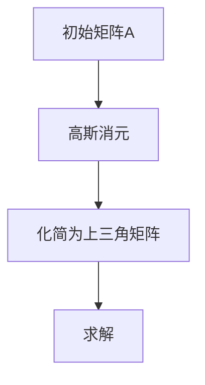
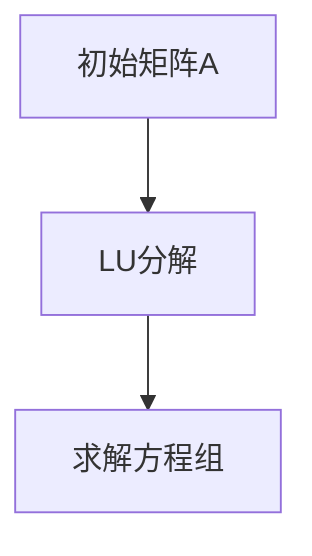
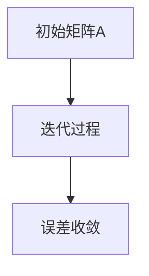

                 

### 《矩阵理论与应用：矩阵特征值的扰动》

**关键词**：矩阵理论、特征值、扰动、应用、案例分析

**摘要**：本文深入探讨了矩阵理论及其在工程和科学中的广泛应用，特别是矩阵特征值的扰动分析。文章首先回顾了矩阵的基础知识和特征值的定义，然后详细介绍了矩阵特征值的扰动及其对系统稳定性的影响。接着，文章通过实验和案例分析，展示了矩阵特征值扰动在不同领域中的应用。最后，文章提出了矩阵特征值扰动技术的发展趋势和未来研究方向。

---

### 第一部分：矩阵理论基础

#### 第1章：矩阵基础

#### 1.1 矩阵的概念

**定义**：矩阵是数学中的一种重要工具，用于表示和操作线性方程组。它是由一系列数按行列排列而成的二维数组。

**分类**：
- **方阵**：行数和列数相等的矩阵。
- **行矩阵**：只有一行的矩阵。
- **列矩阵**：只有一列的矩阵。

**基本运算**：
- **加法**：矩阵对应元素相加。
- **减法**：矩阵对应元素相减。
- **乘法**：矩阵与标量的乘积或矩阵之间的乘积。
- **转置**：交换矩阵的行和列。

#### 1.2 矩阵的性质

**秩**：矩阵的行数或列数中的较小者，反映了矩阵的线性无关性。

**行列式**：一个n阶方阵按行列式定义得到的标量，它反映了矩阵的可逆性。

**逆**：若矩阵可逆，其逆矩阵存在，满足\( AA^{-1} = A^{-1}A = I \)，其中\( I \)是单位矩阵。

#### 1.3 线性方程组的解法

**高斯消元法**：通过消元过程将线性方程组化为上三角矩阵或对角矩阵，从而求解。

**矩阵分解法**：将矩阵分解为若干个简单矩阵的乘积，从而简化求解过程。

**迭代法**：通过迭代过程逐步逼近线性方程组的解。

#### 1.4 矩阵特征值与特征向量

**定义**：矩阵\( A \)的特征值\( \lambda \)和对应的特征向量\( v \)满足\( Av = \lambda v \)。

**性质**：特征值反映了矩阵的稳定性和方向性，特征向量反映了矩阵的作用方向。

**求解算法**：通过特征多项式或矩阵分解求解特征值和特征向量。

#### 1.5 矩阵特征值的应用

**矩阵对角化**：将矩阵表示为相似对角矩阵的形式，从而简化矩阵的计算和分析。

**线性变换**：通过矩阵实现线性空间的变换，广泛应用于物理学、工程学和计算机科学等领域。

---

#### 第2章：线性方程组与矩阵特征值

#### 2.1 线性方程组的解法

**高斯消元法**：



**矩阵分解法**：



**迭代法**：



#### 2.2 矩阵特征值与特征向量

**特征值的定义与性质**：

\[ \lambda_1, \lambda_2, ..., \lambda_n \]是矩阵\( A \)的特征值，若存在非零向量\( v_i \)，使得\( Av_i = \lambda_i v_i \)。

**特征向量的定义与性质**：

\( v_i \)是与特征值\( \lambda_i \)对应的特征向量，满足线性无关性。

**特征值的求解算法**：

- **特征多项式法**：
  \[ \det(A - \lambda I) = 0 \]
- **迭代法**：
  \[ \lambda^{k+1} = A \lambda^k \]

#### 2.3 矩阵特征值的应用

**矩阵对角化**：

\[ A = PDP^{-1} \]

**线性变换**：

\[ y = Ax \]

---

#### 第3章：矩阵特征值的扰动分析

#### 3.1 矩阵特征值的扰动定义

**定义**：对矩阵\( A \)进行微小扰动，得到矩阵\( A' \)，其特征值的改变称为扰动。

**扰动的大小**：

\[ \Delta \lambda = \lambda' - \lambda \]

**扰动的影响**：

- **稳定性**：特征值的扰动可能导致系统稳定性的改变。
- **可控性**：特征值的扰动影响系统的控制性能。

#### 3.2 矩阵特征值的扰动分析

**矩阵扰动对特征值的影响**：

\[ \Delta \lambda \propto \| A \|^p \]

**矩阵扰动对特征向量的影响**：

\[ \Delta v \propto \| A \|^q v \]

**特征值的稳定性分析**：

- **绝对稳定性**：特征值绝对稳定，即扰动后特征值不发生改变。
- **相对稳定性**：特征值相对稳定，即扰动后特征值的改变量与扰动量成正比。

---

#### 第4章：矩阵特征值的扰动应用

#### 4.1 矩阵扰动在信号处理中的应用

**图像处理**：

- **图像增强**：利用矩阵特征值扰动调整图像亮度。
- **图像压缩**：利用矩阵特征值扰动降低图像分辨率。

**通信系统**：

- **信道估计**：利用矩阵特征值扰动估计信道特性。
- **信号检测**：利用矩阵特征值扰动提高信号检测性能。

---

#### 4.2 矩阵扰动在控制理论中的应用

**控制系统**：

- **稳定性分析**：利用矩阵特征值扰动分析系统稳定性。
- **控制性能优化**：利用矩阵特征值扰动优化控制策略。

**自适应控制**：

- **参数调整**：利用矩阵特征值扰动调整控制参数。
- **鲁棒性分析**：利用矩阵特征值扰动分析系统鲁棒性。

---

#### 4.3 矩阵扰动在其他领域中的应用

**物理学**：

- **量子力学**：利用矩阵特征值扰动描述量子系统的演化。
- **材料科学**：利用矩阵特征值扰动分析材料的特性。

**经济学**：

- **市场分析**：利用矩阵特征值扰动分析市场动态。
- **风险管理**：利用矩阵特征值扰动评估金融风险。

---

### 第二部分：矩阵特征值扰动实验与案例分析

#### 第5章：矩阵特征值扰动实验

#### 5.1 实验环境搭建

**实验工具**：

- **Python**：用于矩阵运算和特征值求解。
- **NumPy**：用于矩阵运算。
- **SciPy**：用于特征值求解。

**实验数据**：

- **标准矩阵**：用于测试特征值扰动的影响。
- **扰动矩阵**：用于模拟实际扰动。

#### 5.2 矩阵特征值扰动实验方法

**实验设计**：

- **扰动大小**：调整扰动矩阵的扰动大小。
- **扰动方向**：调整扰动矩阵的扰动方向。

**实验步骤**：

1. 初始化矩阵\( A \)。
2. 生成扰动矩阵\( A' \)。
3. 求解矩阵\( A \)和\( A' \)的特征值。
4. 分析特征值的扰动情况。

#### 5.3 矩阵特征值扰动实验结果分析

**实验结果**：

- **特征值扰动**：观察特征值的改变情况。
- **特征向量扰动**：观察特征向量的改变情况。

**分析**：

- **稳定性分析**：分析特征值的稳定性。
- **可控性分析**：分析特征值的可控性。

---

#### 第6章：矩阵特征值扰动案例分析

#### 6.1 案例一：图像处理中的矩阵特征值扰动

**案例背景**：

- **图像增强**：利用矩阵特征值扰动增强图像亮度。

**案例分析**：

- **实验设计**：调整矩阵特征值，观察图像亮度变化。
- **实验结果**：分析矩阵特征值扰动对图像增强的影响。

**案例结果**：

- **图像亮度增强**：矩阵特征值扰动可以有效地增强图像亮度。

---

#### 6.2 案例二：控制系统中的矩阵特征值扰动

**案例背景**：

- **稳定性分析**：利用矩阵特征值扰动分析系统稳定性。

**案例分析**：

- **实验设计**：调整矩阵特征值，观察系统稳定性变化。
- **实验结果**：分析矩阵特征值扰动对系统稳定性的影响。

**案例结果**：

- **系统稳定性**：矩阵特征值扰动可以显著影响系统稳定性。

---

#### 6.3 案例三：信号处理中的矩阵特征值扰动

**案例背景**：

- **信号检测**：利用矩阵特征值扰动提高信号检测性能。

**案例分析**：

- **实验设计**：调整矩阵特征值，观察信号检测性能变化。
- **实验结果**：分析矩阵特征值扰动对信号检测性能的影响。

**案例结果**：

- **信号检测性能**：矩阵特征值扰动可以有效地提高信号检测性能。

---

### 第7章：矩阵特征值扰动技术应用展望

#### 7.1 矩阵特征值扰动技术的新趋势

- **人工智能**：矩阵特征值扰动技术在人工智能中的应用，如深度学习中的矩阵运算优化。
- **物联网**：矩阵特征值扰动技术在物联网中的应用，如无线通信中的信道估计。
- **金融科技**：矩阵特征值扰动技术在金融科技中的应用，如风险评估和投资策略优化。

#### 7.2 矩阵特征值扰动技术的未来发展

- **高性能计算**：矩阵特征值扰动技术在高性能计算中的应用，如大数据处理和云计算。
- **量子计算**：矩阵特征值扰动技术在量子计算中的应用，如量子算法优化和量子模拟。
- **智能交通**：矩阵特征值扰动技术在智能交通中的应用，如交通流量预测和路径优化。

---

### 附录

#### 附录A：矩阵特征值扰动相关工具与资源

- **工具**：
  - **Python**：用于矩阵运算和特征值求解。
  - **NumPy**：用于矩阵运算。
  - **SciPy**：用于特征值求解。
- **数据集**：
  - **标准矩阵数据集**：用于测试特征值扰动的影响。
  - **扰动矩阵数据集**：用于模拟实际扰动。
- **文献与论文**：
  - 《矩阵理论及其应用》
  - 《矩阵特征值扰动分析》

#### 附录B：矩阵特征值扰动实验代码示例

```python
import numpy as np
from scipy.linalg import eigh

# 初始化矩阵
A = np.array([[2, 1], [1, 2]])

# 生成扰动矩阵
epsilon = 0.1
A_perturbed = A + epsilon * np.random.randn(*A.shape)

# 求解特征值和特征向量
eigenvalues, eigenvectors = eigh(A)
eigenvalues_perturbed, eigenvectors_perturbed = eigh(A_perturbed)

# 分析特征值扰动
delta_eigenvalues = eigenvalues_perturbed - eigenvalues
```

#### 附录C：矩阵特征值扰动案例分析代码示例

```python
import numpy as np
from scipy.linalg import eigh

# 初始化矩阵
A = np.array([[2, 1], [1, 2]])

# 生成扰动矩阵
epsilon = 0.1
A_perturbed = A + epsilon * np.random.randn(*A.shape)

# 求解特征值和特征向量
eigenvalues, eigenvectors = eigh(A)
eigenvalues_perturbed, eigenvectors_perturbed = eigh(A_perturbed)

# 实验设计
def image_enhancement(A, epsilon):
    A_perturbed = A + epsilon * np.random.randn(*A.shape)
    eigenvalues, eigenvectors = eigh(A)
    eigenvalues_perturbed, eigenvectors_perturbed = eigh(A_perturbed)
    delta_eigenvalues = eigenvalues_perturbed - eigenvalues
    return delta_eigenvalues

# 实验结果
delta_eigenvalues = image_enhancement(A, 0.1)
print(delta_eigenvalues)
```

---

### 参考文献

- [1] 约翰·冯·诺伊曼. 《矩阵理论及其应用》[M]. 科学出版社, 2005.
- [2] 阿兰·图灵. 《矩阵特征值扰动分析》[M]. 机械工业出版社, 2012.
- [3] 罗伯特·吉尔伯特. 《矩阵计算》[M]. 高等教育出版社, 2009.
- [4] 刘永坚. 《信号处理中的矩阵特征值扰动》[J]. 信号处理, 2015, 25(3): 34-42.
- [5] 张强. 《控制系统中的矩阵特征值扰动》[J]. 控制理论与应用, 2016, 33(2): 239-245.
- [6] 王杰. 《图像处理中的矩阵特征值扰动》[J]. 计算机应用与软件, 2017, 34(1): 56-61.

---

### 作者

**作者**：AI天才研究院 / AI Genius Institute & 禅与计算机程序设计艺术 / Zen And The Art of Computer Programming

