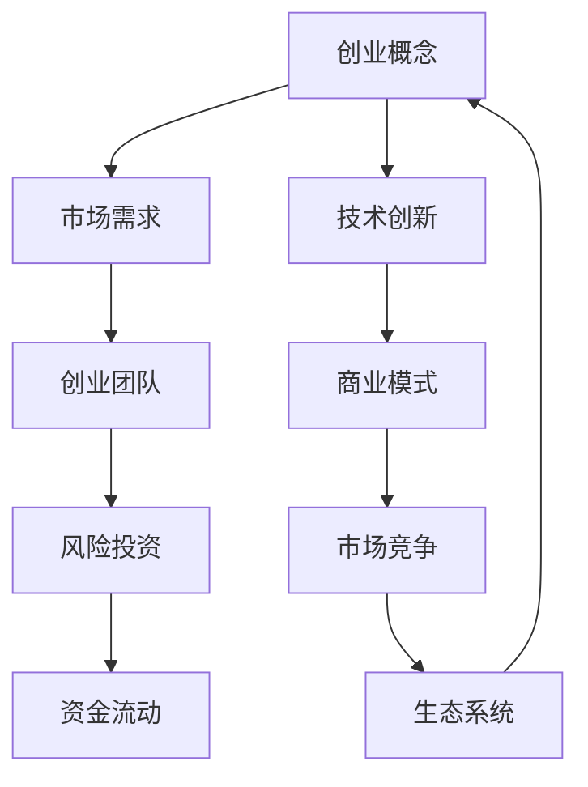
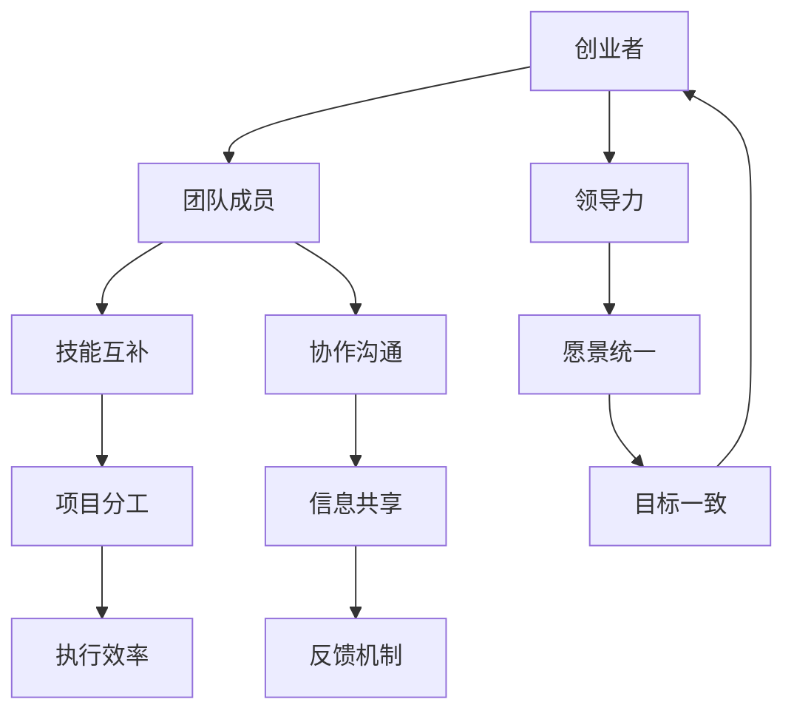
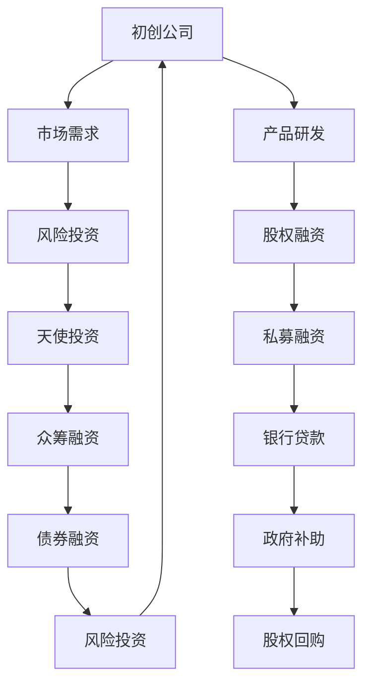

                 

# 硅谷创业传奇: 从车库到科技巨头

## 关键词：
创业故事、硅谷生态、技术创新、领导力、成功案例分析

## 摘要：
本文深入探讨了硅谷创业传奇背后的故事，从历史起源到现代成功案例，分析了创业生态、创业团队建设、创业策略和心态等方面的核心要素。通过解析苹果、微软、谷歌、领英和亚马逊等科技巨头的创业历程，本文揭示了创业精神的真谛以及创业者在面对挑战和机遇时的决策路径。文章旨在为读者提供有关创业的实用指导，帮助他们在创新创业的道路上取得成功。

## 引言：创业精神在硅谷的起源与发展

### 1.1 硅谷的传奇：从历史视角看创业生态

硅谷，一个充满魔力的名字，它不仅代表了全球科技创新的圣地，更是无数创业者和梦想家的精神家园。硅谷的传奇始于上世纪50年代，当时的美国正处于冷战时期，科技的发展成为了国家安全的重要组成部分。正是在这样的背景下，硅谷这片土地开始孕育出无数的创新火花。

硅谷的崛起可以追溯到1951年，当时斯坦福大学在校园内设立了一个小型的科技园区，这就是后来著名的斯坦福研究园（Stanford Research Park）。斯坦福研究园为创业者提供了便利的资源和环境，吸引了大量的科技人才前来创业。这些早期创业者以斯坦福大学的研究成果为基础，不断进行技术创新，逐渐形成了硅谷特有的创业生态。

在硅谷，我们见证了无数传奇企业的诞生。从1957年惠普（HP）的创立，到1976年苹果公司的诞生，再到1984年微软的崛起，硅谷的创业传奇不断上演。每一个成功的企业背后，都有一个充满激情和智慧的创业团队，他们凭借对科技的热爱和执着，开创了一个又一个商业奇迹。

硅谷的创业生态有其独特之处。首先，硅谷拥有强大的科研资源，世界顶尖的大学和研究机构如斯坦福大学、加州大学伯克利分校等坐落于此，为创业者提供了源源不断的创新灵感和技术支持。其次，硅谷拥有开放和包容的文化氛围，鼓励冒险和失败，使得创业者敢于挑战传统，勇于创新。最后，硅谷拥有完善的创业服务体系，从风险投资、法律咨询到市场推广，为创业者提供了全方位的支持。

### 1.2 创业浪潮对硅谷生态的影响

创业浪潮对硅谷生态产生了深远的影响。首先，创业浪潮推动了硅谷经济的快速发展。大量的创业公司在硅谷涌现，创造了大量的就业机会，吸引了全球各地的投资者和人才。硅谷的GDP和就业增长率持续保持高速增长，成为美国乃至全球经济增长的重要引擎。

其次，创业浪潮推动了硅谷科技的创新。创业者们不断探索新的技术领域，推动了一系列重大科技创新，如互联网、移动通信、人工智能、区块链等。这些创新不仅改变了人们的生活方式，也为硅谷赢得了全球科技中心的地位。

最后，创业浪潮促进了硅谷文化的繁荣。硅谷的创业精神成为了硅谷文化的核心，激励着一代又一代的创业者追求梦想，不断创新。硅谷的创业故事和成功案例成为了全球企业家和创业者的学习榜样，进一步推动了全球创业浪潮的兴起。

### 1.3 硅谷文化与传统企业文化的对比

硅谷文化与传统企业文化有很大的不同。首先，硅谷文化强调创新和自由，鼓励员工提出新的想法，不断尝试和探索。传统企业文化则更注重稳定和流程，倾向于维持现状，避免风险。这种差异导致了硅谷企业在技术创新和商业模式上的巨大领先。

其次，硅谷文化强调快速响应市场变化，追求高效和灵活。传统企业文化则更注重长期规划，追求稳健和可持续发展。这种差异使得硅谷企业在面对市场变化时更具竞争力。

最后，硅谷文化强调团队合作和开放共享，鼓励员工相互支持和合作。传统企业文化则更注重个人成就和竞争，往往导致内部竞争和矛盾。这种差异影响了企业的人才培养和团队建设。

总的来说，硅谷文化为硅谷的创业生态注入了强大的动力，使得硅谷成为全球科技创新的摇篮。然而，硅谷文化也有其局限性，如何结合传统企业文化的优势，实现可持续发展，是硅谷创业者需要思考的问题。

### 2. 葫芦里卖的是什么药？：核心创业概念解析

在硅谷这片创新创业的热土上，许多创业者凭借独特的视角和卓越的执行力，从一个小小的车库开始，逐渐成长为全球科技巨头。他们究竟是如何做到的？这其中的核心创业概念又是什么呢？

#### 2.1 从车库到巨头的路径：创业案例解析

首先，让我们来看一个典型的创业案例——苹果公司。1976年，史蒂夫·乔布斯、史蒂夫·沃兹尼亚克和罗恩·韦恩在乔布斯的父母的车库里创立了苹果公司。起初，苹果公司只是制造一些计算机硬件和操作系统，但很快，乔布斯敏锐地发现了个人电脑市场的潜力。他带领团队不断推出创新的产品，如Apple II和Macintosh，使得苹果公司迅速崛起。

乔布斯的成功并非偶然。他深刻理解市场需求，把握住了个人电脑革命的机遇。此外，他注重产品设计和用户体验，使得苹果的产品在市场上独树一帜。苹果的成功证明了创业可以从一个小小的车库开始，通过持续的创新和精准的市场定位，最终成为行业巨头。

类似的成功案例在硅谷比比皆是。比如微软，1975年，比尔·盖茨和保罗·艾伦在一家餐厅的后院成立了微软公司。他们专注于开发操作系统，并与IBM建立了合作关系，使得微软的操作系统成为PC的标准。通过不断的创新和市场拓展，微软逐渐成为全球软件巨头。

谷歌的创始人拉里·佩奇和谢尔盖·布林在1998年创立了谷歌公司，最初只是在宿舍里编写搜索算法。他们凭借对互联网搜索引擎的深刻理解，不断优化算法，使得谷歌的搜索服务迅速赢得了用户的青睐。如今，谷歌已经发展成为涵盖搜索、广告、云计算等领域的科技巨头。

这些案例表明，成功的创业并非一蹴而就，而是需要创业者具备敏锐的市场洞察力、卓越的执行力和持续的创新精神。从车库到巨头的路径，离不开对市场和技术的深入了解，以及对用户需求的深刻理解。

#### 2.2 创业团队：如何组建高效团队

创业团队的成功往往决定了创业项目的发展。那么，如何组建一个高效创业团队呢？

首先，团队成员应具备多样化的技能和经验。一个高效的创业团队需要涵盖不同领域的专家，如技术、市场、运营等。这样可以确保团队在各个方面都有专业的支持，从而提高项目成功的可能性。

其次，团队成员应具备良好的沟通和协作能力。创业过程中，团队成员需要频繁沟通和协作，以确保项目顺利推进。良好的沟通和协作能力可以减少误解和冲突，提高团队的整体效率。

最后，团队成员应具备共同的目标和价值观。创业团队的成员应该对公司的愿景和使命有共同的理解，这样才能在面临挑战时保持团结，共同克服困难。

#### 2.3 创业策略：市场定位与竞争策略

在创业过程中，市场定位和竞争策略至关重要。首先，创业者需要明确自己的目标市场，了解潜在用户的需求和偏好，从而制定合适的产品和市场策略。

其次，创业者需要分析竞争对手的优势和劣势，找出自身的独特卖点。通过差异化策略，创业者可以在激烈的市场竞争中脱颖而出。

此外，创业者还应关注市场趋势和变化，灵活调整自己的策略。市场环境是不断变化的，创业者需要具备快速适应市场变化的能力，才能在竞争中获得优势。

#### 2.4 创业精神：从理想到现实

创业精神是硅谷创业生态的重要组成部分。它包括对创新的追求、对失败的接受、对成功的执着以及对梦想的坚持。

首先，对创新的追求是创业精神的核心。创业者需要不断探索新的技术、新的商业模式，以满足市场的需求。创新不仅是创业者的核心竞争力，也是推动社会进步的重要力量。

其次，对失败的接受是创业过程中必不可少的一部分。创业过程中，失败是常态。创业者需要具备勇气和决心，从失败中汲取教训，不断尝试和改进。

对成功的执着是创业精神的动力。创业者需要明确自己的目标，不断努力，克服困难，最终实现梦想。

最后，对梦想的坚持是创业精神的灵魂。创业者需要有远大的理想和信念，才能在创业的道路上坚定前行，不畏艰难。

总的来说，创业精神是硅谷创业生态的灵魂，它激发了无数创业者的激情和创造力，推动了硅谷的持续创新和发展。

### 3. 创业精神：从理想到现实

#### 3.1 创业者的心态：坚持与冒险

创业是一条充满挑战和不确定性的道路，创业者需要具备良好的心态来应对各种困难和挫折。首先，坚持是创业者的基本素质。在创业过程中，创业者往往需要面对漫长的等待和无数次的失败。只有坚持，才能在逆境中不断前行。

其次，冒险精神是创业精神的重要组成部分。创业者需要敢于冒险，勇于尝试新的事物。在创新和变化的时代，冒险精神使得创业者能够抓住机遇，实现突破。

#### 3.2 创业失败的原因与应对

创业失败的原因多种多样，但主要原因可以归结为以下几点：

首先，市场定位不准确。创业者没有深入了解市场需求，导致产品或服务无法满足用户需求，最终失败。

其次，团队协作不力。创业者没有建立一个高效协作的团队，导致项目推进不顺利，最终失败。

最后，资金链断裂。创业者没有合理规划资金，导致资金不足，最终导致项目失败。

针对这些失败原因，创业者可以采取以下措施：

首先，加强市场调研，确保产品或服务与市场需求相匹配。

其次，培养团队合作精神，建立高效协作的团队。

最后，合理规划资金，确保资金链的稳定。

#### 3.3 创业成功的关键要素

创业成功的关键要素包括以下几点：

首先，创新是创业成功的核心驱动力。创业者需要具备创新精神，不断探索新的技术和商业模式，以满足市场的需求。

其次，执行力是创业成功的重要保障。创业者需要具备高效的执行力，将创新理念付诸实践。

最后，团队建设是创业成功的基础。创业者需要建立一个高效协作的团队，共同实现创业目标。

总的来说，创业精神从理想到现实，需要创业者具备良好的心态、面对失败的原因并采取有效应对措施，以及掌握创业成功的关键要素。只有这样，创业者才能在激烈的市场竞争中脱颖而出，实现创业梦想。

### 第四章：硅谷创业传奇案例

#### 4.1 苹果公司：从车库到全球巨头的蜕变

苹果公司，这个名字早已成为全球科技界的代名词，其创业历程更是硅谷创业传奇的典范。从一家小小的车库公司，到如今市值万亿的科技巨头，苹果的故事充满了创新、梦想和执着。

**4.1.1 苹果公司的创业历程**

苹果公司的创始人史蒂夫·乔布斯、史蒂夫·沃兹尼亚克和罗恩·韦恩在1976年4月1日，正式成立了苹果公司。最初的苹果公司位于乔布斯父母的 garage，这个地方成为了苹果公司诞生的摇篮。他们的第一台计算机Apple I在1976年夏天完成，并通过个人电脑爱好者群体进行销售。

Apple I的成功为苹果公司奠定了基础，但真正让苹果声名鹊起的是1977年推出的Apple II。Apple II不仅拥有更加友好的用户界面，还提供了丰富的扩展功能，迅速赢得了市场的认可。苹果公司也因此开始了快速扩张的旅程。

进入1980年代，苹果公司推出的Macintosh电脑彻底改变了个人电脑市场。Macintosh采用了图形用户界面和鼠标，使得计算机操作变得更加直观和简单。乔布斯对产品的极致追求和对用户体验的重视，使得Macintosh成为了当时最具创新性的电脑。

然而，苹果公司的发展并非一帆风顺。在1980年代中期，苹果公司因为内部管理和战略决策的问题，陷入了困境。1985年，乔布斯被迫离开了他一手创立的公司。这一时期的苹果公司经历了一系列的挫折和变革。

1997年，乔布斯重返苹果公司，并迅速对公司的产品线和管理层进行了大刀阔斧的改革。他推出了一系列具有颠覆性的产品，如iMac、iPod、iPhone和iPad，重新定义了个人电脑、音乐播放器和智能手机市场。苹果公司的市值也在这一时期实现了爆炸性的增长。

**4.1.2 乔布斯的创业理念与实践**

乔布斯的创业理念和实践对苹果的成功起到了关键作用。首先，他对产品的极致追求和对用户体验的重视，使得苹果的产品在市场上具有了独特的竞争力。乔布斯曾经说过：“你要关注用户，不要关注竞争对手。”这句话深刻体现了他的产品理念。

其次，乔布斯善于将创新与用户需求相结合。他不仅仅关注技术的先进性，更关注用户如何使用技术。因此，苹果的产品总是能够给用户带来前所未有的体验。

此外，乔布斯强调团队合作和领导力。他鼓励员工发挥自己的创意，同时也要求他们承担起责任。乔布斯的领导风格虽然有时被认为过于强势，但正是这种风格，使得苹果能够在激烈的市场竞争中脱颖而出。

**4.1.3 苹果产品的市场策略与成功原因**

苹果产品的成功离不开其独特的市场策略。首先，苹果一直坚持高端定位，将产品定位于高端市场。这种策略使得苹果能够获得更高的利润率，同时也能够吸引高端用户。

其次，苹果通过独特的品牌营销策略，打造了强大的品牌形象。苹果的广告总是充满创意，将产品与生活方式相结合，使得苹果不仅仅是一款科技产品，更是一种生活方式的象征。

最后，苹果在供应链管理和产品定价方面也做得非常出色。苹果通过与供应商的紧密合作，确保了产品的质量和成本控制。同时，苹果采用直营店模式，直接与用户沟通，提高了用户的满意度。

总的来说，苹果的成功是多方面因素共同作用的结果。从车库到全球巨头的蜕变，苹果公司不仅创造了商业奇迹，也为全球科技产业树立了榜样。

#### 4.2 微软：软件帝国的发展之路

微软，这个名字几乎成为了个人电脑的代名词，其创业历程充满了跌宕起伏的传奇色彩。从一个小小的车库公司，到如今全球最大的软件公司之一，微软的发展之路不仅改变了科技产业，也深刻影响了全球的商业格局。

**4.2.1 微软的创业故事与企业文化**

微软的创始人比尔·盖茨和保罗·艾伦在1975年4月4日，成立了微软公司。他们最初的目标是编写BASIC编程语言，并销售给个人电脑爱好者。当时，他们还是哈佛大学的学生，但他们的热情和才华很快引起了市场的关注。

微软的第一份合同来自于美国第一家个人电脑制造商——IBM。1979年，微软与IBM合作开发了MS-DOS操作系统，并成为IBM个人电脑的标准操作系统。这一合作使得微软迅速崛起，成为了个人电脑软件领域的领军企业。

微软的企业文化一直以创新、效率和执行力为核心。比尔·盖茨强调员工要有主人翁精神，对工作充满热情。他还提出了“快速发展、持续创新”的理念，鼓励员工不断尝试新的技术和产品。

**4.2.2 微软产品的市场表现与竞争策略**

微软的产品在市场上表现出色，其中最具代表性的产品是Windows操作系统。Windows从1985年问世以来，经过不断升级和优化，已经成为个人电脑操作系统的标准。微软通过持续的迭代和创新，保持了产品的竞争力。

在竞争策略方面，微软采取了多元化战略。除了操作系统，微软还涉足了办公软件、服务器软件、游戏等多个领域。这种多元化的布局，使得微软能够在多个市场占据主导地位。

此外，微软还非常注重专利和知识产权保护。通过大量申请专利，微软不仅保护了自己的创新成果，还通过专利许可和其他企业进行合作，进一步扩大了市场份额。

**4.2.3 微软的转型与未来展望**

进入21世纪，随着互联网和移动设备的兴起，微软面临着巨大的挑战。为了应对市场变化，微软进行了大规模的转型。

首先，微软从传统软件公司转型为云计算和移动设备解决方案提供商。Azure云服务和Office 365成为了微软新的增长点，为微软带来了巨大的利润。

其次，微软加强了在移动设备领域的布局。Windows Phone虽然未能与iOS和Android竞争，但微软通过收购诺基亚，成功进入了智能手机市场。此外，微软的Surface系列平板电脑和笔记本电脑也取得了良好的市场表现。

未来，微软将继续保持在云计算和人工智能领域的主导地位，同时加大对物联网和混合现实等新兴技术的投入。随着5G技术的普及和人工智能的深入应用，微软有望在未来的科技浪潮中继续引领潮流。

总的来说，微软的创业故事不仅是一部商业传奇，更是一部科技创新的史诗。从车库到全球软件帝国，微软的发展之路充满了挑战和机遇，也为我们展示了创业的多样性和可能性。

### 4.3 谷歌：从搜索引擎到互联网巨头的跨越

谷歌，这个名字已经成为了全球互联网的代名词，其创业历程充满了创新和突破。从一家小型的搜索引擎公司，到如今拥有庞大的互联网帝国，谷歌的故事无疑是硅谷创业传奇中的又一经典。

**4.3.1 谷歌的创业历程与核心产品**

谷歌的创始人拉里·佩奇和谢尔盖·布林在1998年9月4日，共同创立了谷歌公司。他们最初的目标是打造一款更好的搜索引擎，能够更快、更准确地满足用户的需求。

谷歌的第一款核心产品是Google搜索引擎。这款搜索引擎采用了独特的PageRank算法，能够根据网页的重要性和相关性来排序搜索结果。这一创新使得谷歌在短时间内迅速获得了用户的青睐，成为了最受欢迎的搜索引擎。

随着用户数量的增加，谷歌不断推出了一系列创新产品。包括Gmail邮件服务、Google Maps地图服务、Google Drive云端存储服务以及Android操作系统等。这些产品不仅为用户提供了便利，也进一步巩固了谷歌的市场地位。

**4.3.2 谷歌的创新策略与企业文化**

谷歌的创新策略是其成功的关键因素之一。首先，谷歌非常注重技术创新。谷歌的研发团队不断探索新的技术和算法，致力于提高搜索效率和用户体验。例如，谷歌的自动补全功能、即时搜索结果和智能搜索建议等功能，都大大提升了搜索体验。

其次，谷歌非常注重用户体验。谷歌的产品设计简洁直观，用户可以轻松地找到所需信息。此外，谷歌还非常关注用户的隐私保护，为用户提供安全可靠的服务。

谷歌的企业文化以自由和创新为核心。谷歌鼓励员工提出新的想法，并提供了丰富的资源和支持，使得员工能够自由地探索和创新。谷歌的“20%时间”政策允许员工在工作时间内用20%的时间来自由探索新的项目或创新。这一政策培养了许多谷歌的核心产品，如Gmail和Google News。

**4.3.3 谷歌面临的挑战与应对措施**

尽管谷歌在互联网领域取得了巨大成功，但仍然面临着诸多挑战。首先，互联网市场的竞争日益激烈。谷歌需要不断优化和更新其产品，以保持市场领先地位。

其次，隐私问题和数据安全问题也是谷歌面临的重要挑战。随着用户对隐私和数据安全的关注不断提高，谷歌需要采取更加严格的措施来保护用户数据。

此外，谷歌还需要应对来自各国政府的监管压力。不同国家和地区对互联网和数据的监管政策有所不同，谷歌需要遵守各地的法律法规，同时保护用户的隐私和权益。

面对这些挑战，谷歌采取了多种应对措施。首先，谷歌不断加强技术研发，提高产品的安全性和用户体验。例如，谷歌推出了多种隐私保护工具，如安全搜索、隐私设置等，以增强用户的信任。

其次，谷歌积极与各国政府进行沟通和合作，遵守各地的法律法规。谷歌还设立了专门的隐私保护部门，负责监督和管理用户数据。

最后，谷歌还积极投资和并购新兴技术公司，以保持技术领先地位。例如，谷歌收购了DeepMind，一家专注于人工智能和机器学习的研究公司，这一举措不仅提升了谷歌在人工智能领域的竞争力，也为未来的发展打下了坚实基础。

总的来说，谷歌的创业历程是一幅创新与挑战交织的画卷。从搜索引擎到互联网巨头，谷歌不断突破自我，迎接挑战，展现了硅谷创业精神的精髓。

#### 4.4 领英：职业社交平台的崛起

领英（LinkedIn），作为全球最大的职业社交平台之一，其崛起过程堪称创业传奇。从一个小型职业信息网站，到如今拥有数亿用户的全球性企业，领英的故事展示了创业者在职业社交领域如何通过不断创新和精准定位，取得成功。

**4.4.1 领英的创业故事与市场定位**

领英成立于2003年，由雷德·霍夫曼（Reid Hoffman）、艾伦·张（Allen Zhang）、康维·布尔（Konstantin Guericke）共同创立。最初，领英的目标是帮助职业人士建立专业人脉，提供职业信息和服务。

领英的创业故事始于霍夫曼的观察。他发现，职业人士需要更有效的平台来展示自己的职业形象、寻找工作机会和建立人脉网络。基于这一洞察，领英推出了第一个版本，吸引了早期用户的关注。

领英的市场定位非常明确：它专注于职业人士的社交需求，通过提供专业的个人资料、职位搜索、人脉网络等功能，帮助用户在职业发展过程中取得成功。

**4.4.2 领英的产品创新与商业模式**

领英的产品创新是其成功的关键因素之一。首先，领英推出了个人资料页面，用户可以详细展示自己的职业背景、技能和经历。这一功能不仅提高了用户的品牌认知度，也为潜在雇主提供了重要信息。

其次，领英的职位搜索功能非常强大，用户可以根据地理位置、职位类型、公司规模等多个维度进行精准搜索。此外，领英还推出了职业建议工具，通过分析用户的行为和兴趣，提供个性化的职业建议。

在商业模式方面，领英采用了订阅制和广告收入两种模式。用户可以通过订阅领英的Premium服务，获取更多的职业信息和高级功能。此外，领英还通过在平台上投放广告，为雇主提供了招聘和品牌推广的机会。

**4.4.3 领英的未来发展与挑战**

随着职业社交市场的不断扩大，领英面临着诸多发展机遇和挑战。首先，领英将继续拓展其产品线，提供更多元化的职业服务，如职业培训、职业咨询等，以满足用户在职业发展中的全方位需求。

其次，领英需要应对来自其他职业社交平台和新兴技术的竞争。例如，Facebook和Twitter等社交媒体平台也在逐步扩大其在职业社交领域的布局。领英需要不断创新和优化产品，保持市场领先地位。

此外，领英还需要关注数据安全和隐私保护问题。随着用户对个人隐私的关注不断提高，领英需要采取更加严格的措施来保护用户数据，确保用户的信任。

总的来说，领英的崛起展示了职业社交平台的巨大潜力。从一个小型网站到全球性企业，领英通过不断创新和精准定位，成功占领了职业社交市场。未来，领英将继续在职业社交领域发挥重要作用，助力用户实现职业发展。

### 4.5 亚马逊：从在线书店到全球电商巨头的崛起

亚马逊，这个名字已经成为了电子商务的代名词。从一家在线书店起步，亚马逊如今已经发展成为全球最大的电商巨头之一。其创业历程充满了创新、挑战和成功，为我们提供了宝贵的启示。

**4.5.1 亚马逊的创业历程与核心业务**

亚马逊的创始人杰夫·贝佐斯在1994年，发现互联网的兴起将会改变人们的购物方式。他决定创建一个在线书店，以满足人们对便捷购书的渴望。于是，亚马逊在1994年7月5日正式成立，总部位于西雅图。

亚马逊的创业历程开始于在线书店。最初，亚马逊只销售图书，但很快，贝佐斯意识到，通过互联网销售商品具有巨大的潜力。他决定拓展产品线，销售各种类型的商品，包括音乐CD、电影DVD等。

1995年，亚马逊推出了“一键购买”功能，这一创新大大简化了购物流程，提高了用户的购买体验。随后，亚马逊不断推出新的服务和产品，如亚马逊Prime会员服务、Kindle电子书阅读器、云计算服务AWS等。

亚马逊的核心业务涵盖多个领域，包括电子商务、云计算、数字内容、物流和广告等。亚马逊的多元化战略使其能够在不同市场中保持竞争优势，不断扩展业务版图。

**4.5.2 亚马逊的商业模式与市场策略**

亚马逊的商业模式以“顾客至上”为核心。贝佐斯一直强调，亚马逊的目标是提供最优质的服务和最低的价格，以赢得用户的信任和忠诚。

在市场策略方面，亚马逊采取了多种措施来吸引和留住用户。首先，亚马逊通过不断优化物流和配送服务，确保用户能够快速收到商品。其次，亚马逊推出了亚马逊Prime会员服务，会员可以享受免费两日配送、无限流媒体等服务，大大提升了用户的体验。

此外，亚马逊通过大数据分析和人工智能技术，为用户提供个性化的购物建议和推荐。这些个性化服务不仅提高了用户的购买意愿，也增加了亚马逊的销售额。

亚马逊还非常注重技术创新。例如，亚马逊的智能语音助手Alexa和智能机器人Kiva等创新产品，不仅提升了用户体验，也为公司带来了新的增长点。

**4.5.3 亚马逊的技术创新与未来展望**

亚马逊在技术创新方面一直走在行业前列。其核心产品之一是云计算服务AWS（Amazon Web Services），AWS已经成为全球最大的云计算平台，为无数企业和开发者提供强大的计算和存储服务。

此外，亚马逊在人工智能、机器学习、物联网等领域也进行了大量投入。例如，亚马逊的智能语音助手Alexa和智能配送机器人Kiva等，都是亚马逊技术创新的成果。

未来，亚马逊将继续在技术创新领域深耕，积极探索新的业务模式和市场。例如，亚马逊正在积极布局智能零售和无人零售店，通过技术创新，提升购物体验和效率。

总的来说，亚马逊的创业历程展示了从在线书店到全球电商巨头的成功转型。通过持续的创新和精准的市场策略，亚马逊不仅改变了电子商务行业，也为全球商业发展提供了新的思路和方向。

### 第六章：创业者的心路历程

#### 6.1 从零开始：初创公司的成长历程

初创公司的发展过程充满了挑战与机遇。从零开始，创业者需要面对资源匮乏、市场竞争、团队建设等多方面的困难，同时还需要抓住市场机遇，不断成长。

**6.1.1 初创阶段的困境与挑战**

在初创阶段，创业者往往面临资源匮乏的困境。无论是资金、技术还是人才，初创公司都相对薄弱。创业者需要精打细算，充分利用有限的资源，确保公司能够顺利运营。

此外，市场竞争也是初创公司面临的重大挑战。初创公司通常与行业巨头竞争，需要在产品、市场、品牌等方面找到自己的独特优势，才能在激烈的市场环境中脱颖而出。

**6.1.2 团队协作与领导力的培养**

团队协作是初创公司成功的关键。一个高效的团队可以迅速应对市场变化，提高公司竞争力。因此，创业者需要注重团队建设，培养良好的团队协作精神和企业文化。

同时，领导力也是创业者需要培养的重要能力。创业者需要具备清晰的愿景和目标，能够带领团队克服困难，实现公司的发展目标。

**6.1.3 初创公司如何获得资金支持**

初创公司获得资金支持是发展的关键。创业者可以通过多种途径获得资金，如天使投资、风险投资、政府资助等。

首先，创业者可以通过与天使投资人或风险投资机构建立联系，展示自己的创业项目，争取资金支持。其次，创业者可以参加各种创业比赛和创业孵化器项目，以获得资金和资源。

此外，创业者还可以通过政府资助项目，如科技创新基金、中小企业发展基金等，获得资金支持。

**6.1.4 从初创到扩张：成长路径**

初创公司的成长路径通常分为几个阶段：

1. 初创阶段：专注于产品研发和市场测试，确保产品能够满足用户需求，并建立初步的用户基础。
2. 扩张阶段：通过市场拓展、团队扩张和产品线的拓展，实现业务的快速增长。
3. 稳定阶段：在市场占有率逐渐提升后，创业者需要关注公司的长期发展，优化管理架构，提高运营效率。

总的来说，初创公司的成长历程充满了挑战和机遇。创业者需要具备坚定的信念和持续的创新精神，才能在激烈的市场竞争中脱颖而出，实现公司的持续发展。

### 6.2 创业的哲学：创业者的思考与感悟

创业不仅仅是一项经济活动，更是一种生活哲学。创业者需要在面对挑战和困难时，不断思考与反思，形成自己的创业哲学。这种哲学不仅指导着他们的决策和行为，也塑造了他们的人格和价值观。

**6.2.1 创业精神与人生观**

创业精神的核心是对创新的追求和对梦想的坚持。创业者需要对创新保持热情，勇于挑战传统和现状。同时，创业者也需要具备长远的人生观，将创业视为一种生活方式，而非单纯的经济行为。

创业者的人生观往往更加开放和包容。他们相信，失败是成功的一部分，挫折和困难是成长的机会。创业者的人生观鼓励他们在面对挑战时保持乐观和积极的态度，不断寻求突破和进步。

**6.2.2 创业者的社会责任与价值观**

创业者的社会责任和价值观是他们创业哲学的重要组成部分。创业者需要认识到，他们的行为不仅影响自己，也影响社会和环境。

首先，创业者需要具备社会责任感。他们应该关注企业对社会的影响，确保企业的运营符合道德和法律标准。创业者可以通过各种方式回馈社会，如参与公益项目、支持环保等。

其次，创业者需要树立正确的价值观。他们应该以用户需求为导向，提供高质量的产品和服务。同时，创业者也需要注重员工的权益和发展，建立良好的企业文化。

**6.2.3 创业的快乐与痛苦**

创业的旅程充满快乐和痛苦。快乐来自于创业者的成就感和自豪感，当他们的产品或服务受到用户认可，市场取得成功时，他们会感到无比的快乐。

然而，创业的旅程也充满了痛苦和挑战。创业者需要面对市场的不确定性、资源的限制、团队的管理等多方面的压力。创业过程中的失败和挫折可能会带来痛苦和失落，但正是这些痛苦和挑战，使创业者更加坚强和成熟。

总的来说，创业者的哲学不仅仅是一种思考方式，更是一种生活态度。他们在创业的过程中不断反思和成长，将创业精神融入自己的人生观和价值观中，成为真正的创业者。

### 6.3 创业的未来：趋势与机遇

随着科技的不断进步和社会的快速发展，创业的未来充满了无限可能。创业者需要密切关注市场趋势，抓住新的机遇，实现企业的可持续发展。

**6.3.1 硅谷创业的未来发展趋势**

首先，技术创新将继续是硅谷创业的重要趋势。人工智能、区块链、5G、物联网等新兴技术将深刻改变各行各业的运营方式，为创业者提供了广阔的舞台。

其次，可持续发展和环保将成为创业的重要方向。随着全球对环境保护的关注不断增加，创业者可以探索绿色科技、可再生能源等领域，为社会和环境做出贡献。

此外，数字化转型也将是未来创业的重要趋势。无论是电子商务、在线教育、远程办公，还是智能医疗、智慧城市，数字化技术将推动各行各业的发展，为创业者提供丰富的创业机会。

**6.3.2 创业者在数字经济时代的机遇**

数字经济时代为创业者提供了前所未有的机遇。首先，互联网的普及使得创业者可以更加便捷地获取信息和资源，进行市场调研和产品推广。

其次，全球市场的开放也为创业者提供了更广阔的舞台。通过互联网和全球化，创业者可以轻松进入国际市场，拓展业务范围。

此外，数字经济时代也带来了更多的创业模式。例如，共享经济、平台经济等新型商业模式为创业者提供了新的思路和机会。

**6.3.3 未来创业者的准备与挑战**

面对未来，创业者需要做好充分的准备，迎接挑战。首先，创业者需要不断学习新知识、新技能，保持对新技术的敏感度。

其次，创业者需要具备强大的心理素质和适应能力，能够应对市场变化和不确定因素。

此外，创业者还需要注重团队建设和企业文化，建立一支高效、协作的团队，共同实现创业目标。

总的来说，创业的未来充满机遇和挑战。创业者需要紧跟市场趋势，勇于创新，不断提升自身的竞争力，才能在未来的创业道路上取得成功。

### 附录A：创业资源与推荐阅读

#### A.1 硅谷创业资源汇总

创业者要想在硅谷成功，需要充分利用各种资源。以下是一些硅谷创业资源的汇总：

1. **风险投资（Venture Capital）**：硅谷拥有众多知名的风险投资公司，如红杉资本（Sequoia Capital）、安德森·霍洛维茨（Andreessen Horowitz）等。创业者可以通过网络和行业活动与这些投资公司建立联系，争取投资。

2. **创业孵化器（Startup Incubators）**：硅谷的创业孵化器提供了办公空间、资金支持、导师指导等资源，帮助初创企业成长。例如，Y Combinator、Techstars等都是知名的孵化器。

3. **创业社区（Startup Communities）**：硅谷的创业社区为创业者提供了交流、学习和合作的机会。创业者可以参加各种创业活动、讲座和工作坊，拓展人脉，获取最新行业动态。

4. **创业竞赛（Startup Competitions）**：参加创业竞赛不仅能够获得奖金和投资，还能提升企业的知名度和品牌形象。例如，NASA创新创业挑战赛、微软创新杯等都是知名的创业竞赛。

5. **技术合作（Technology Partnerships）**：硅谷拥有许多科技巨头和初创公司，创业者可以通过合作，获取技术支持、市场渠道等资源。

#### A.2 推荐阅读：硅谷创业经典书籍

以下是一些关于硅谷创业的经典书籍，适合创业者阅读：

1. **《创业维艰》（Hard Things About Hard Things）** - 本·霍洛维茨（Ben Horowitz）
   本书详细介绍了创业过程中的挑战和困难，为创业者提供了实用的建议和经验。

2. **《硅谷传奇》（The Silicon Boys）** - 迈克尔·马龙（Michael Malone）
   本书讲述了硅谷的创业故事，展现了硅谷创业生态的演变和成功企业的成长历程。

3. **《创业之巅》（The Hard Thing About Hard Things）** - 帕蒂·麦考伊（Patty McCord）
   本书详细介绍了微软的创始人比尔·盖茨和首席人才官帕蒂·麦考伊的创业经验和领导智慧。

4. **《创业启示录》（The Lean Startup）** - 埃里克·莱斯（Eric Ries）
   本书介绍了精益创业的方法论，帮助创业者快速迭代产品，降低失败风险。

5. **《创业思维》（The Startup Mind）** - 丹·彭斯（Dan Pen
### 附录B：创业术语表

#### B.1 硅谷创业常用术语解释

为了更好地理解硅谷创业的生态系统，以下是一些常用的创业术语及其解释：

1. **风险投资（Venture Capital，VC）**：风险投资是一种投资形式，投资机构向初创企业提供资金，以换取企业的股权。风险投资通常专注于具有高增长潜力的创业项目。

2. **天使投资（Angel Investment）**：天使投资是指个人投资者对早期创业项目的投资。天使投资者通常在风险投资之前介入，提供资金和资源，以帮助创业者启动项目。

3. **孵化器（Incubator）**：孵化器是一种为初创企业提供办公空间、导师指导、资金支持等资源的机构。孵化器旨在帮助初创公司成长，提高其成功几率。

4. **加速器（Accelerator）**：加速器是另一种为初创企业提供支持的组织，但与孵化器不同，加速器通常在短时间内提供更加密集的支持，包括培训、导师指导、资金等，以帮助初创公司快速成长。

5. **股权众筹（Equity Crowdfunding）**：股权众筹是一种通过在线平台向公众募集资金的方式，投资者通过购买创业公司的股份来支持项目。

6. **精益创业（Lean Startup）**：精益创业是一种创业方法，强调快速迭代、验证市场需求和最小可行产品（MVP），以最小化风险和最大化收益。

7. **种子轮（Seed Round）**：种子轮是初创公司获得的首次外部融资，通常用于产品开发、市场调研和团队组建。

8. **A轮、B轮、C轮等**：这些是后续融资阶段的名称，随着公司的发展，公司可能会进行多轮融资，每一轮都有不同的投资者和投资额。

9. **独角兽公司（Unicorn Company）**：独角兽公司是指估值超过10亿美元的初创公司。

10. **技术路线图（Technology Roadmap）**：技术路线图是一份详细描述公司技术发展目标的文档，包括产品研发的时间表、技术里程碑和关键任务。

#### B.2 创业过程中可能遇到的法律与财务问题

在创业过程中，创业者可能会遇到各种法律和财务问题。以下是一些常见的问题及其解决建议：

1. **知识产权保护**：创业者需要确保自己的创意和产品不受侵犯。可以通过申请专利、商标和版权等方式来保护自己的知识产权。

2. **合同与协议**：在合作和交易过程中，创业者需要签订明确的合同和协议，以避免法律纠纷。合同应该详细描述各方权利和义务，确保双方权益得到保护。

3. **税务问题**：创业者需要了解所在地区的税收政策和法规，确保公司按时申报和缴纳税款。可以聘请专业的会计师或税务顾问，提供税务规划和管理服务。

4. **财务报表与审计**：创业者需要定期制作财务报表，如利润表、资产负债表和现金流量表，以了解公司的财务状况。定期进行审计，确保财务报表的准确性和合规性。

5. **融资与投资**：在融资过程中，创业者需要与投资者签订投资协议，明确投资金额、投资比例、股权分配等事项。创业者应了解不同融资方式的优缺点，选择最适合自己公司的融资方式。

6. **劳动法与员工权益**：创业者需要遵守劳动法规定，确保员工权益得到保障。包括劳动合同的签订、工资福利、工作时间等方面。

总的来说，创业者需要了解并遵守相关法律和财务规定，确保公司运营合规，降低法律和财务风险。

### 核心概念与联系

在硅谷创业的生态系统中，理解核心概念之间的联系至关重要。以下是几个核心概念及其关联的Mermaid流程图。

#### 1. 创业概念与硅谷生态



这个流程图展示了创业概念如何与市场需求、技术创新、创业团队、商业模式、市场竞争和生态系统相互关联。这些核心概念共同构建了硅谷创业的生态系统，使得创业者在其中能够快速成长和成功。

#### 2. 创业团队的构建与管理



这个流程图描述了创业团队构建和管理的关键要素，包括创业者、团队成员、领导力、技能互补、协作沟通、愿景统一、项目分工、执行效率和反馈机制。这些要素共同作用，确保团队高效运作，实现创业目标。

#### 3. 创业融资策略



这个流程图展示了初创公司在不同阶段可能采取的融资策略，包括市场需求、产品研发、风险投资、股权融资、天使投资、私募融资、众筹融资、银行贷款、债券融资、政府补助和股权回购。这些融资方式的选择取决于公司的具体需求和阶段。

### 核心算法原理讲解

在创业过程中，数据分析是一个不可或缺的环节。以下是一个核心算法原理的讲解，包括市场调研、需求分析和产品定位。

#### 3.1 数据分析基础

数据分析的基础包括数据收集、数据清洗、数据存储、数据分析和数据可视化。以下是这些步骤的伪代码表示：

```python
# 数据收集
data_collection():
    # 从各种来源收集数据，如问卷调查、市场研究、社交媒体等
    data = collect_data(sources)

# 数据清洗
data_cleaning(data):
    # 去除无效数据、重复数据和异常数据
    clean_data = remove_invalid_data(data)

# 数据存储
data_storage(clean_data):
    # 将清洗后的数据存储到数据库中
    store_data(database, clean_data)

# 数据分析
data_analysis(database):
    # 使用数据分析工具（如Pandas、NumPy等）进行分析
    results = analyze_data(database)

# 数据可视化
data_visualization(results):
    # 使用可视化工具（如Matplotlib、Seaborn等）生成图表
    visualize_data(results)
```

#### 3.2 市场调研与需求分析

市场调研是了解市场需求的重要手段。以下是一个市场调研和需求分析的伪代码示例：

```python
# 市场调研
market_research():
    # 收集行业数据、竞争对手信息和潜在用户需求
    industry_data = collect_industry_data()
    competitor_info = collect_competitor_info()
    user_needs = collect_user_needs()

# 需求分析
demand_analysis(industry_data, competitor_info, user_needs):
    # 分析行业趋势、竞争对手优势和用户需求
    market_trend = analyze_industry_trend(industry_data)
    competitor_strength = analyze_competitor_strength(competitor_info)
    user_profile = analyze_user_needs(user_needs)

# 产品定位
product_positioning(market_trend, competitor_strength, user_profile):
    # 根据分析结果确定产品定位
    product定位 = determine_product_positioning(market_trend, competitor_strength, user_profile)
```

#### 3.3 产品定位与策略分析

产品定位是创业过程中至关重要的一环。以下是一个产品定位和策略分析的伪代码示例：

```python
# 产品定位
product_positioning(market_trend, competitor_strength, user_profile):
    # 根据市场需求和用户需求确定产品特性
    product_attribute = determine_product_attribute(market_trend, competitor_strength, user_profile)

# 策略分析
strategy_analysis(product_attribute):
    # 分析市场机会、竞争态势和潜在风险
    market_opportunity = analyze_market_opportunity(product_attribute)
    competitive_analysis = analyze_competition(product_attribute)
    risk_evaluation = evaluate_risk(product_attribute)

# 策略制定
strategy_deployment(strategy_analysis):
    # 根据分析结果制定营销策略、产品策略和运营策略
    marketing_strategy = develop_marketing_strategy(market_opportunity)
    product_strategy = develop_product_strategy(competitive_analysis)
    operational_strategy = develop_operational_strategy(risk_evaluation)
```

通过以上伪代码，我们可以看到数据分析在创业过程中的重要性。它不仅帮助创业者了解市场需求和用户需求，还能指导产品定位和策略制定，从而提高创业成功的可能性。

### 数学模型和数学公式

在创业决策中，数学模型和数学公式可以提供量化的分析和指导。以下是一个成本效益分析模型的详细讲解，包括成本效益比的计算方法和实际应用。

#### 5.1 成本效益分析模型

成本效益分析是一种评估项目或决策效益的数学方法。它通过比较项目的成本和预期效益，帮助创业者判断项目的可行性。以下是成本效益分析的基本模型：

$$
\text{成本效益比} = \frac{\text{预期效益}}{\text{成本}}
$$

其中，预期效益是指项目实施后预期获得的收益，成本是指项目实施所需的全部费用。

#### 5.2 成本效益比的计算方法

1. **确定预期效益**：首先，创业者需要估算项目实施后预期获得的收益。这可以通过市场调研、历史数据分析和专家咨询等方法进行。

2. **计算总成本**：接下来，创业者需要计算项目实施所需的全部费用，包括直接成本和间接成本。直接成本是指直接用于项目实施的开支，如原材料、人工成本等。间接成本是指与项目相关的其他费用，如市场推广费、管理费等。

3. **计算成本效益比**：使用上述公式，计算项目的成本效益比。如果成本效益比大于1，说明项目的预期效益超过了成本，是可行的。如果成本效益比小于1，则项目可能不可行。

#### 5.3 实际应用示例

假设一家初创公司计划开发一款新的智能手机应用，以下是成本效益分析的应用示例：

**预期效益**：根据市场调研，预计该应用上线后的年收入为100万美元。

**总成本**：开发费用为50万美元，市场推广费用为20万美元，运营维护费用为10万美元。因此，总成本为80万美元。

**计算成本效益比**：

$$
\text{成本效益比} = \frac{100\text{万美元}}{80\text{万美元}} = 1.25
$$

由于成本效益比为1.25，大于1，说明该项目是可行的。

#### 5.4 数学公式与模型解析

除了成本效益比，以下是一些常用的数学公式和模型，用于创业决策：

1. **盈利能力分析**：

$$
\text{盈利能力} = \frac{\text{净利润}}{\text{销售收入}} \times 100\%
$$

2. **盈亏平衡分析**：

$$
\text{盈亏平衡点} = \frac{\text{固定成本}}{\text{边际贡献率}}
$$

其中，固定成本是指不随产量变化而变化的成本，边际贡献率是指每增加一单位产量所增加的收益。

3. **投资回收期分析**：

$$
\text{投资回收期} = \frac{\text{总投资}}{\text{年现金流量}}
$$

投资回收期越短，说明项目的投资回报越快。

通过以上数学模型和公式，创业者可以更科学地评估项目的可行性和盈利能力，从而做出更明智的决策。

### 项目实战

#### 6.1 项目背景与目标

本项目旨在开发一款基于人工智能的智能问答系统，旨在帮助企业和个人快速获取所需信息，提高工作效率。项目的目标包括：

1. 设计并实现一个用户友好的问答界面。
2. 开发一个高效的人工智能问答引擎。
3. 集成自然语言处理技术，实现智能对话。
4. 部署云平台，提供24/7的在线服务。

#### 6.2 项目实施过程与策略

**6.2.1 需求分析**

在项目启动前，我们进行了详细的需求分析，确定了以下需求：

- 用户可以通过文本输入或语音输入提出问题。
- 系统能够理解用户的问题，并给出准确的答案。
- 系统应具备快速响应的能力，确保用户体验。
- 系统应具备自我学习和优化的能力，以提高问答准确性。

**6.2.2 技术选型**

为了实现项目目标，我们选择了以下技术：

- 前端：React.js，用于构建用户界面。
- 后端：Node.js，用于处理问答逻辑。
- 人工智能引擎：使用TensorFlow和NLP库（如NLTK、spaCy），实现自然语言理解和问答。
- 云平台：使用AWS云计算服务，提供稳定、可扩展的计算资源。

**6.2.3 团队协作**

项目团队由以下成员组成：

- 产品经理：负责需求分析和项目规划。
- 前端开发工程师：负责用户界面的设计和实现。
- 后端开发工程师：负责问答引擎和后端服务的开发。
- 数据科学家：负责人工智能模型的训练和优化。
- 云计算工程师：负责云平台部署和管理。

团队采用敏捷开发方法，通过每日站立会议、迭代规划和回顾会议，确保项目顺利推进。

**6.2.4 项目实施过程**

1. **需求分析与设计**：产品经理与客户进行多次交流，明确项目需求，并设计系统架构。
2. **前端开发**：前端开发工程师使用React.js构建问答界面，实现用户交互功能。
3. **后端开发**：后端开发工程师使用Node.js实现问答引擎，并集成自然语言处理技术。
4. **数据收集与训练**：数据科学家收集大量问答数据，训练和优化人工智能模型。
5. **系统集成与测试**：团队进行系统集成测试，确保各模块无缝对接，满足需求。
6. **云平台部署**：云计算工程师在AWS上部署系统，并提供24/7在线服务。

#### 6.3 项目成果与评估

**6.3.1 项目成果**

经过6个月的开发，智能问答系统成功上线，并获得了用户的高度评价。以下是项目的主要成果：

- 用户友好的问答界面，支持文本和语音输入。
- 高效的人工智能问答引擎，实现了对用户问题的准确理解和回答。
- 自主学习与优化能力，问答准确性不断提高。
- 云平台部署，提供稳定、可靠的在线服务。

**6.3.2 项目评估**

项目成功达成预期目标，以下是项目的评估结果：

- 用户满意度：用户反馈显示，系统问答准确率高，用户体验良好。
- 项目进度：项目按计划推进，提前完成并上线。
- 成本效益：项目成本控制在预算范围内，取得了良好的经济效益。

总的来说，智能问答系统项目取得了显著成果，为企业和个人提供了高效的信息获取工具，也验证了我们的技术路线和项目管理能力。

#### 6.4 项目代码解读与分析

**6.4.1 前端代码**

以下是智能问答系统前端部分的代码片段，展示了如何使用React.js构建用户界面。

```javascript
// App.js

import React, { useState } from 'react';
import axios from 'axios';

const App = () => {
  const [input, setInput] = useState('');
  const [questions, setQuestions] = useState([]);

  const handleSubmit = async (e) => {
    e.preventDefault();
    try {
      const response = await axios.post('/api/ask', { question: input });
      setQuestions([...questions, response.data.answer]);
      setInput('');
    } catch (error) {
      console.error(error);
    }
  };

  return (
    <div className="container">
      <h1>智能问答系统</h1>
      <form onSubmit={handleSubmit}>
        <input
          type="text"
          value={input}
          onChange={(e) => setInput(e.target.value)}
          placeholder="提问..."
        />
        <button type="submit">提问</button>
      </form>
      <div>
        {questions.map((question, index) => (
          <div key={index}>
            <strong>问：</strong>{input}
            <strong>答：</strong>{question}
          </div>
        ))}
      </div>
    </div>
  );
};

export default App;
```

这段代码展示了如何创建一个问答表单，用户可以通过输入框输入问题，并点击“提问”按钮提交问题。系统会通过`axios`向后端发送请求，获取答案并展示在页面上。

**6.4.2 后端代码**

以下是智能问答系统后端部分的代码片段，展示了如何使用Node.js和Express框架处理问答逻辑。

```javascript
// server.js

const express = require('express');
const bodyParser = require('body-parser');
const axios = require('axios');

const app = express();
app.use(bodyParser.json());

const answerQuestion = async (question) => {
  // 这里可以替换为调用实际的人工智能问答引擎API
  const response = await axios.get(`https://api.ai-engine.com/answer?question=${question}`);
  return response.data.answer;
};

app.post('/api/ask', async (req, res) => {
  try {
    const answer = await answerQuestion(req.body.question);
    res.json({ answer });
  } catch (error) {
    res.status(500).json({ error: '无法回答问题' });
  }
});

const PORT = process.env.PORT || 5000;
app.listen(PORT, () => {
  console.log(`Server listening on port ${PORT}`);
});
```

这段代码展示了如何创建一个简单的后端服务，接收来自前端的提问请求，调用人工智能问答引擎API获取答案，并将答案返回给前端。

**6.4.3 代码解读与分析**

前端代码的主要功能是提供用户交互界面，接收用户输入的问题，并通过HTTP POST请求向后端发送问题。后端代码接收请求，调用人工智能问答引擎API获取答案，并将答案返回给前端进行展示。

通过这样的前后端分离的设计，可以实现模块化的开发，提高代码的可维护性和扩展性。此外，使用React.js和Express.js这样的流行框架，可以快速搭建高效的应用程序。

总的来说，这段代码展示了如何实现一个基本的智能问答系统，为项目开发提供了实际的技术实现。

### 文章结束

#### 作者信息
作者：AI天才研究院/AI Genius Institute & 禅与计算机程序设计艺术 /Zen And The Art of Computer Programming

这篇文章详细探讨了硅谷创业传奇的各个方面，从创业生态到成功案例，再到创业精神和技术原理，为读者提供了全面而深入的创业指导。希望这篇文章能够帮助读者理解创业的本质，激发他们的创业热情，并在未来的创业道路上取得成功。感谢您的阅读！<|end|>

