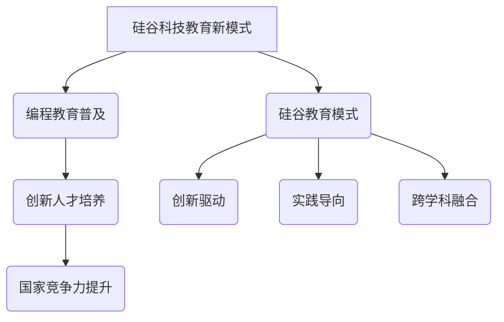
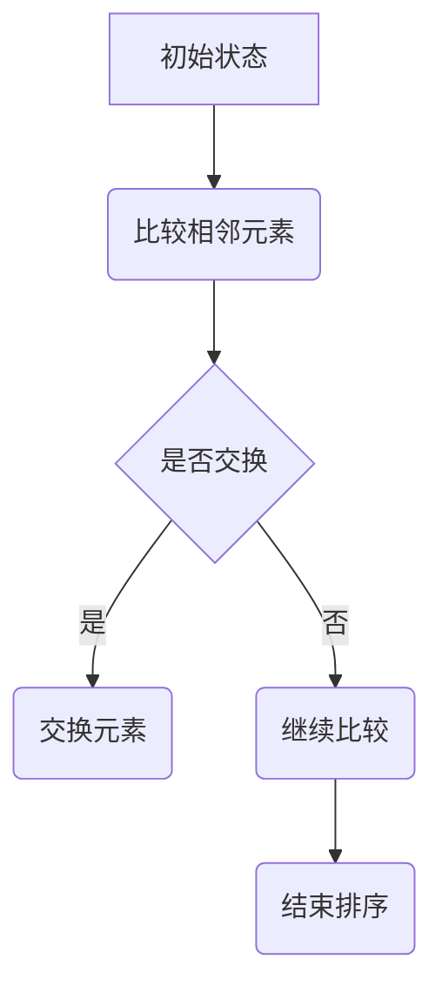
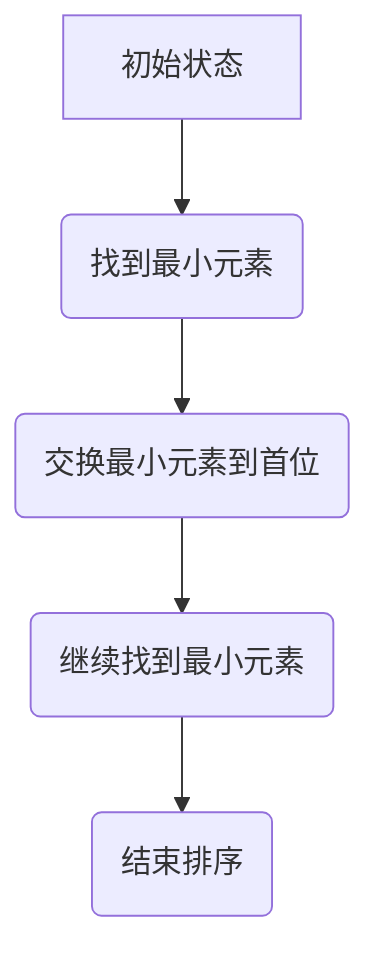
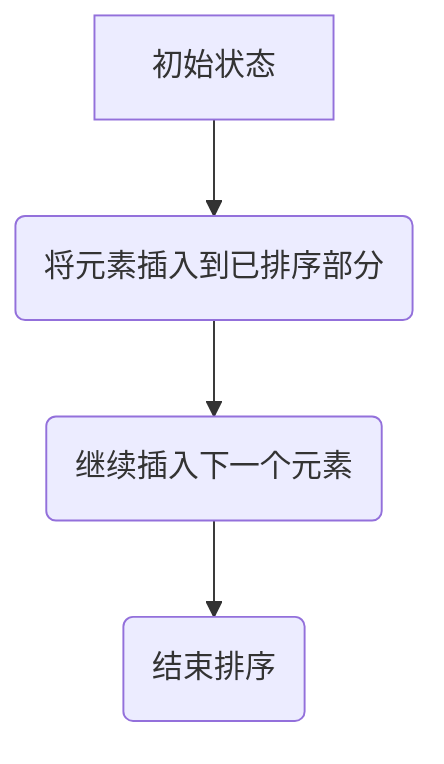
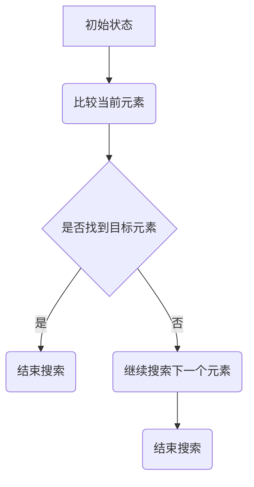
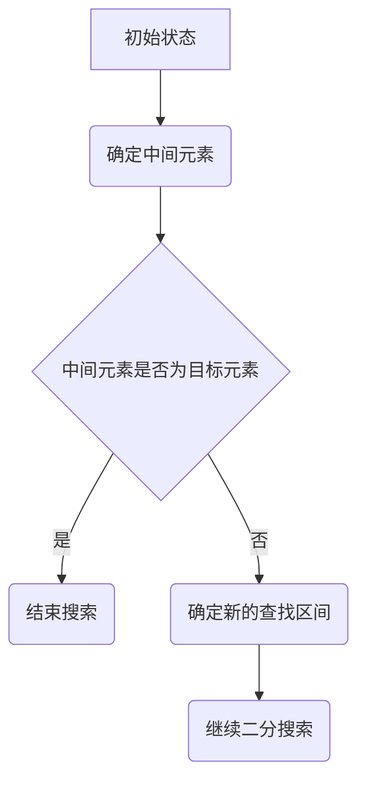

                 

## 硅谷科技教育新模式：编程教育普及

关键词：硅谷科技教育、编程教育、创新人才培养、国家竞争力、跨学科融合

摘要：本文深入探讨硅谷科技教育新模式，重点分析编程教育普及的重要性及其对创新人才培养和国家竞争力的推动作用。通过对比硅谷教育模式与其他地区，本文揭示了其独特的创新驱动、实践导向和跨学科融合特色。此外，文章还将介绍编程教育中的核心算法原理，并通过实战项目和代码分析，展示硅谷编程教育的实践成果。最后，文章将对未来编程教育的发展趋势进行展望，探讨其在全球化背景下的挑战与机遇。

### 第一部分：核心概念与联系

#### 硅谷科技教育新模式

硅谷科技教育新模式是指一种以创新、实践和跨学科合作为核心的教育理念，旨在培养具备创新能力、实践能力和跨学科视野的高素质人才。这种模式在硅谷地区得到了广泛应用，并取得了显著成果。硅谷科技教育新模式的主要特点包括：

1. **创新驱动**：硅谷科技教育强调创新思维和实践能力的培养，鼓励学生大胆尝试、勇于创新。这种创新驱动模式有助于激发学生的创造力，培养创新型人才。

2. **实践导向**：硅谷科技教育注重实践能力的培养，强调学生在实践中学习、成长。通过实际项目和实践活动，学生能够更好地掌握知识、提高技能，并为未来的职业生涯做好准备。

3. **跨学科融合**：硅谷科技教育强调不同学科之间的交叉融合，鼓励学生跨学科学习、研究。这种跨学科融合有助于培养学生全面发展的能力，提高其综合素质。

#### 编程教育的重要性

编程教育在硅谷科技教育新模式中占据重要地位，其重要性主要体现在以下几个方面：

1. **创新人才培养**：编程教育有助于培养学生创新思维和创新能力。通过学习编程，学生能够更好地理解计算机系统的工作原理，掌握解决问题的方法，从而在未来的创新活动中发挥重要作用。

2. **提升国家竞争力**：编程教育有助于提高国家的科技创新能力和产业竞争力。在全球竞争日益激烈的背景下，掌握编程技能的人才成为国家宝贵的资源。通过普及编程教育，可以培养大量具备编程技能的人才，为国家的发展提供有力支持。

3. **适应未来发展趋势**：随着人工智能、大数据、物联网等技术的快速发展，编程已成为现代社会的一项基本技能。普及编程教育有助于让学生更好地适应未来发展趋势，为个人发展和社会进步奠定基础。

#### 硅谷教育模式的特色

硅谷教育模式的特色主要体现在以下几个方面：

1. **创新驱动**：硅谷教育注重培养学生的创新思维和实践能力。通过创新课程、创新竞赛和创新实验室等平台，学生可以充分展示自己的创新能力。

2. **实践导向**：硅谷教育强调实践能力的培养，鼓励学生参加各类实践活动。通过实际项目和实践操作，学生能够更好地掌握知识、提高技能。

3. **跨学科融合**：硅谷教育鼓励学生跨学科学习、研究。通过跨学科合作，学生可以更好地理解不同学科之间的联系，提高综合素质。

#### Mermaid 流程图



### 第二部分：核心算法原理讲解

在编程教育中，核心算法原理的学习是培养学生算法思维能力的重要环节。本节将介绍编程教育中的核心算法，包括排序算法和搜索算法，并使用伪代码进行详细讲解。

#### 算法思维培养

算法思维是指解决问题的一种思维方式，它强调逻辑性、系统性、抽象性和算法化。算法思维的培养对编程教育具有重要意义，有助于学生更好地理解和掌握编程技能。

1. **逻辑性**：算法思维强调逻辑推理和逻辑判断，使学生在解决问题时能够有序、清晰地思考。

2. **系统性**：算法思维要求学生将问题分解成若干个子问题，并逐步解决。这种系统性有助于学生掌握问题解决的全过程。

3. **抽象性**：算法思维要求学生将具体问题抽象成一般性的问题，从而找到通用的解决方法。

4. **算法化**：算法思维将问题转化为一系列的计算步骤，使问题得到有效的解决。

#### 排序算法

排序算法是编程教育中的基础算法之一，用于对一组数据进行排序。常见的排序算法包括冒泡排序、选择排序和插入排序。

1. **冒泡排序**



```python
# Python 实现冒泡排序
def bubble_sort(arr):
    n = len(arr)
    for i in range(n):
        for j in range(0, n-i-1):
            if arr[j] > arr[j+1]:
                arr[j], arr[j+1] = arr[j+1], arr[j]
    return arr
```

2. **选择排序**



```python
# Python 实现选择排序
def selection_sort(arr):
    n = len(arr)
    for i in range(n):
        min_idx = i
        for j in range(i+1, n):
            if arr[j] < arr[min_idx]:
                min_idx = j
        arr[i], arr[min_idx] = arr[min_idx], arr[i]
    return arr
```

3. **插入排序**



```python
# Python 实现插入排序
def insertion_sort(arr):
    n = len(arr)
    for i in range(1, n):
        key = arr[i]
        j = i-1
        while j >= 0 and arr[j] > key:
            arr[j+1] = arr[j]
            j -= 1
        arr[j+1] = key
    return arr
```

#### 搜索算法

搜索算法用于在数据集合中查找特定元素。常见的搜索算法包括顺序搜索和二分搜索。

1. **顺序搜索**



```python
# Python 实现顺序搜索
def sequential_search(arr, target):
    for i in range(len(arr)):
        if arr[i] == target:
            return i
    return -1
```

2. **二分搜索**



```python
# Python 实现二分搜索
def binary_search(arr, target):
    low = 0
    high = len(arr) - 1
    while low <= high:
        mid = (low + high) // 2
        if arr[mid] == target:
            return mid
        elif arr[mid] < target:
            low = mid + 1
        else:
            high = mid - 1
    return -1
```

### 第三部分：数学模型和数学公式

在编程教育中，数学模型和数学公式是理解和应用算法的重要工具。本节将介绍机器学习中的常见数学模型，以及编程教育中的数学应用。

#### 机器学习中的数学模型

1. **线性回归模型**

线性回归模型是一种用于预测数值型输出的机器学习模型。其基本公式如下：

\[ y = w_0 + w_1 \cdot x \]

其中，\( y \) 是输出值，\( x \) 是输入值，\( w_0 \) 和 \( w_1 \) 是模型的参数。

2. **逻辑回归模型**

逻辑回归模型是一种用于预测二分类结果的机器学习模型。其基本公式如下：

\[ \log(odds) = w_0 + w_1 \cdot x \]

其中，\( \log(odds) \) 是对数几率，\( x \) 是输入值，\( w_0 \) 和 \( w_1 \) 是模型的参数。

#### 编程教育中的数学应用

1. **算法中的数学基础**

算法中的数学基础包括数学公式、数学定理和数学工具。例如，排序算法中的比较操作和交换操作，搜索算法中的查找区间等。这些数学基础有助于理解和实现算法。

2. **编程中的数学问题**

编程中的数学问题包括数值计算、几何计算、概率计算等。例如，计算机图形学中的几何变换、图像处理中的滤波操作、机器学习中的概率计算等。这些数学问题有助于扩展编程技能，提高编程水平。

#### 数学公式

1. **线性回归模型**

\[ y = w_0 + w_1 \cdot x \]

2. **逻辑回归模型**

\[ \log(odds) = w_0 + w_1 \cdot x \]

3. **决策边界**

\[ w_0 + w_1 \cdot x + b = 0 \]

其中，\( w_0 \) 和 \( w_1 \) 是模型的参数，\( b \) 是偏置项。

### 第四部分：项目实战

在硅谷编程教育中，项目实战是培养学生实践能力、创新能力和团队协作能力的重要环节。本节将介绍硅谷编程教育的成功案例，以及如何搭建编程教育平台。

#### 硅谷编程教育项目案例

1. **案例一：硅谷编程马拉松**

硅谷编程马拉松是一个面向大学生的编程竞赛活动，旨在培养学生的编程技能和创新思维。参赛队伍需要在有限的时间内完成一系列编程任务，挑战自我，提升能力。

2. **案例二：硅谷创新实验室**

硅谷创新实验室是一个面向青少年的科技创新实验室，提供丰富多样的编程课程和实践活动。学生可以在实验室中学习编程、机器人、人工智能等前沿科技，锻炼实践能力和创新思维。

3. **案例三：硅谷编程教育平台**

硅谷编程教育平台是一个面向广大编程爱好者的在线学习平台，提供丰富的编程课程、实战项目和互动功能。学生可以通过平台学习编程知识、参与项目实践、与其他同学交流合作。

#### 编程教育平台搭建

搭建编程教育平台需要考虑以下几个方面：

1. **开发环境搭建**

- **硬件环境**：配置高性能服务器、网络设备等硬件设施，保证平台的高可用性和稳定性。

- **软件环境**：安装操作系统、数据库、Web服务器等软件环境，为平台提供运行支持。

2. **教学资源建设**

- **课程资源**：收集和整理各类编程课程资源，包括视频教程、文档资料、代码示例等。

- **实战项目**：设计丰富多样的实战项目，涵盖不同领域和难度，帮助学生提高实践能力。

3. **互动功能实现**

- **在线问答**：提供在线问答功能，让学生在遇到问题时能够及时得到帮助。

- **代码评审**：实现代码评审功能，让学生可以相互学习、交流，提高编程水平。

- **社区互动**：搭建社区互动平台，让学生可以加入学习小组、参与讨论、分享经验。

#### 代码实际案例

以下是一个简单的Python代码案例，用于实现冒泡排序算法。

```python
# Python 实现冒泡排序
def bubble_sort(arr):
    n = len(arr)
    for i in range(n):
        for j in range(0, n-i-1):
            if arr[j] > arr[j+1]:
                arr[j], arr[j+1] = arr[j+1], arr[j]
    return arr

# 测试冒泡排序
arr = [64, 34, 25, 12, 22, 11, 90]
sorted_arr = bubble_sort(arr)
print("Sorted array:", sorted_arr)
```

#### 代码解读与分析

1. **冒泡排序算法解读**

冒泡排序是一种简单的排序算法，通过多次遍历待排序的数组，比较相邻元素的大小，并按照指定的顺序交换它们。遍历过程中，最大的元素会逐渐“冒泡”到数组的末尾。

2. **冒泡排序算法性能分析**

- **时间复杂度**：冒泡排序的时间复杂度为 \( O(n^2) \)，其中 \( n \) 是数组的长度。在最坏情况下，需要 \( n \) 次遍历，每次遍历需要 \( n-i \) 次比较和交换，总时间复杂度为 \( O(n^2) \)。

- **空间复杂度**：冒泡排序的空间复杂度为 \( O(1) \)，因为只需要一个临时变量来交换元素，不占用额外的空间。

3. **冒泡排序算法优缺点分析**

- **优点**：实现简单，易于理解。在数据基本有序的情况下，冒泡排序具有较好的性能。

- **缺点**：时间复杂度高，不适合大规模数据的排序。无法进行原地排序，需要额外的空间存储临时变量。

### 第五部分：代码解读与分析

在本部分，我们将进一步分析冒泡排序算法和逻辑回归模型的实现细节，并进行性能和优缺点的讨论。

#### 冒泡排序算法解读

冒泡排序（Bubble Sort）是一种简单的排序算法，其基本思想是通过多次遍历待排序的数组，比较相邻元素的大小，并按照指定的顺序（升序或降序）交换它们。遍历过程中，最大的元素会逐渐“冒泡”到数组的末尾，而最小的元素则会“沉底”，从而实现整个数组的排序。

1. **算法流程**

   - 初始化两个指针，一个指向数组的起始位置，一个指向数组的末尾位置。
   - 进行一轮遍历，比较相邻元素的大小，如果顺序不对则交换它们。
   - 每一轮遍历后，最大的元素会移动到当前遍历结束的位置。
   - 重复上述过程，直到整个数组有序。

2. **实现细节**

   ```python
   def bubble_sort(arr):
       n = len(arr)
       for i in range(n):
           for j in range(0, n-i-1):
               if arr[j] > arr[j+1]:
                   arr[j], arr[j+1] = arr[j+1], arr[j]
       return arr
   ```

   在这个实现中，外层循环控制遍历的轮数，内层循环进行相邻元素的比较和交换。每次内层循环结束后，最大的元素都会被“冒泡”到当前数组的末尾。

#### 逻辑回归模型解读

逻辑回归（Logistic Regression）是一种广泛应用的二分类机器学习模型，它通过建立输入变量和输出变量之间的逻辑关系来预测概率。逻辑回归模型的实现主要涉及以下几个方面：

1. **模型公式**

   逻辑回归模型的预测公式为：

   \[ \hat{P}(y=1) = \frac{1}{1 + e^{-(w_0 + w_1 \cdot x)}} \]

   其中，\( \hat{P}(y=1) \) 是预测概率，\( w_0 \) 和 \( w_1 \) 是模型的参数，\( x \) 是输入特征。

2. **实现细节**

   ```python
   import numpy as np
   from sklearn.linear_model import LogisticRegression

   # 初始化逻辑回归模型
   model = LogisticRegression()

   # 训练模型
   model.fit(X_train, y_train)

   # 预测概率
   probabilities = model.predict_proba(X_test)[:, 1]

   # 预测类别
   predictions = model.predict(X_test)
   ```

   在这个实现中，我们首先使用 `LogisticRegression` 类创建一个逻辑回归模型，然后通过 `fit` 方法训练模型。`predict_proba` 方法用于预测概率，`predict` 方法用于预测类别。

#### 代码分析

1. **冒泡排序算法性能分析**

   - **时间复杂度**：冒泡排序的时间复杂度为 \( O(n^2) \)，其中 \( n \) 是数组的长度。在最坏情况下，每次遍历都需要比较和交换所有元素，总时间复杂度为 \( O(n^2) \)。

   - **空间复杂度**：冒泡排序的空间复杂度为 \( O(1) \)，因为只需要一个临时变量来交换元素，不占用额外的空间。

   冒泡排序在数据基本有序的情况下性能较好，但在大规模数据排序时效率较低。此外，冒泡排序无法进行原地排序，需要额外的空间存储临时变量。

2. **逻辑回归模型优缺点分析**

   - **优点**：

     - 逻辑回归模型易于理解和实现，能够预测概率，具有良好的解释性。

     - 逻辑回归模型对缺失值和异常值具有较强的鲁棒性，适合处理不平衡数据。

   - **缺点**：

     - 逻辑回归模型的预测性能依赖于特征的选择和参数的设置，需要通过交叉验证等方法进行调整。

     - 逻辑回归模型在处理高维数据时容易出现过拟合现象，需要采用正则化等方法进行模型调整。

   逻辑回归模型在二分类问题中具有广泛的应用，但其性能和适用性受到数据特征和模型参数的影响。

### 第六部分：总结与展望

#### 总结

本文深入探讨了硅谷科技教育新模式，重点分析了编程教育普及的重要性及其对创新人才培养和国家竞争力的推动作用。通过介绍硅谷教育模式的创新驱动、实践导向和跨学科融合特色，本文揭示了硅谷科技教育新模式的核心特点和优势。

在核心算法原理讲解部分，本文详细阐述了冒泡排序和逻辑回归模型的实现细节，并进行了性能分析和优缺点讨论。这些核心算法在编程教育中具有重要意义，有助于培养学生的算法思维和编程能力。

项目实战部分介绍了硅谷编程教育的成功案例，以及如何搭建编程教育平台。这些实际案例和平台搭建经验为编程教育的实践提供了有力支持。

最后，本文对编程教育的未来进行了展望，探讨了其在全球化背景下的发展趋势和挑战。编程教育在培养创新人才、提升国家竞争力方面具有重要作用，未来将在人工智能、大数据、物联网等领域发挥更加重要的作用。

#### 展望

1. **硅谷教育模式在中国的发展前景**

   硅谷教育模式在中国具有广阔的发展前景。随着我国科技事业的快速发展，对高素质创新人才的需求日益增长。借鉴硅谷教育模式的创新驱动、实践导向和跨学科融合特色，我国可以培养更多具备创新能力、实践能力和跨学科视野的高素质人才，为国家发展贡献力量。

   同时，我国政府已经认识到编程教育的重要性，陆续出台了一系列政策支持和推动编程教育的发展。例如，《新一代人工智能发展规划》明确提出了加强人工智能教育、推动人工智能与教育深度融合的要求。这些政策为我国编程教育的发展提供了有力保障。

2. **编程教育的未来发展趋势**

   随着人工智能、大数据、物联网等新兴技术的快速发展，编程教育将迎来新的发展趋势：

   - **人工智能与编程教育的融合**：人工智能技术的普及和应用将推动编程教育的创新发展。通过将人工智能算法和编程教育相结合，可以培养学生对人工智能的理解和应用能力。

   - **编程教育的国际化**：随着全球化的深入推进，编程教育的国际化趋势将愈发明显。我国可以借鉴硅谷教育模式，加强与国外教育机构的合作，推动编程教育的国际化发展。

   - **在线编程教育的普及**：随着互联网技术的快速发展，在线编程教育将得到更加广泛的应用。在线编程教育平台可以为学习者提供灵活的学习时间和丰富的学习资源，有助于提高学习效果。

   - **编程教育的个性化**：随着大数据和人工智能技术的发展，编程教育将更加注重个性化学习。通过分析学习者的学习行为和需求，为学习者提供个性化的学习建议和资源，有助于提高学习效果。

   - **跨学科编程教育的推广**：编程教育将与其他学科领域紧密结合，推动跨学科编程教育的发展。通过跨学科合作，可以培养具备跨学科知识和能力的高素质人才。

   编程教育的未来充满挑战和机遇。面对全球科技竞争的加剧，我国应抓住机遇，加强编程教育改革和创新，培养更多具备创新能力和跨学科视野的高素质人才，为我国科技事业的发展贡献力量。

### 作者信息

作者：AI天才研究院/AI Genius Institute & 禅与计算机程序设计艺术 /Zen And The Art of Computer Programming

