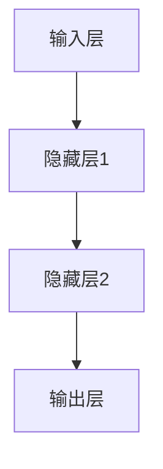

                 

# 神经网络 (Neural Network)

> **关键词**: 人工神经网络、深度学习、激活函数、反向传播、优化方法、图像识别、自然语言处理

> **摘要**: 本文将深入探讨神经网络的基础理论、架构、应用以及优化方法。我们将通过逐步分析和推理，揭示神经网络的原理和实现，展示其在图像识别、自然语言处理等领域的强大应用，并展望其未来的发展趋势。

---

### 《神经网络 (Neural Network)》目录大纲

#### 第一部分: 神经网络基础理论

1. **第1章: 神经网络简介**
   1.1 神经网络的发展历程
   1.2 神经网络的基本概念
   1.3 神经网络的应用领域

2. **第2章: 神经元与人工神经元**
   2.1 神经元的基本结构
   2.2 人工神经元的工作原理
   2.3 人工神经元的数学模型

3. **第3章: 神经网络架构**
   3.1 神经网络的类型
   3.2 前馈神经网络
   3.3 反向传播算法

4. **第4章: 激活函数**
   4.1 激活函数的作用
   4.2 常见的激活函数
   4.3 激活函数的设计原则

5. **第5章: 深度学习基础**
   5.1 深度学习的发展历程
   5.2 深度学习的基本原理
   5.3 深度学习的应用领域

6. **第6章: 神经网络的优化方法**
   6.1 优化问题的基本概念
   6.2 梯度下降算法
   6.3 小批量梯度下降
   6.4 动量法和自适应学习率

7. **第7章: 神经网络的训练技巧**
   7.1 数据预处理
   7.2 过拟合与欠拟合
   7.3 正则化技术
   7.4 批处理与并行计算

#### 第二部分: 神经网络应用实践

8. **第8章: 图像识别**
   8.1 卷积神经网络
   8.2 卷积神经网络的工作原理
   8.3 图像识别实战

9. **第9章: 自然语言处理**
   9.1 循环神经网络
   9.2 长短时记忆网络
   9.3 递归神经网络
   9.4 自然语言处理实战

10. **第10章: 强化学习**
    10.1 强化学习的基本概念
    10.2 Q-学习算法
    10.3 深度Q网络
    10.4 强化学习实战

11. **第11章: 神经网络在计算机视觉中的应用**
    11.1 卷积神经网络在计算机视觉中的应用
    11.2 深度学习在目标检测中的应用
    11.3 深度学习在图像分割中的应用

12. **第12章: 神经网络在其他领域的应用**
    12.1 语音识别
    12.2 股票市场预测
    12.3 健康数据分析

13. **第13章: 神经网络的未来发展趋势**
    13.1 神经网络的发展趋势
    13.2 神经网络在人工智能领域的影响
    13.3 神经网络在未来的应用前景

#### 附录

* **附录A: 神经网络开发工具与资源**
  A.1 主流神经网络框架
  A.2 神经网络学习资源
  A.3 神经网络社区与论坛

---

接下来，我们将按照目录大纲逐步展开对神经网络各个方面的详细探讨。

## 第1章: 神经网络简介

### 1.1 神经网络的发展历程

神经网络的概念起源于1943年，由心理学家McCulloch和数学家Pitts提出，他们首次描述了人工神经元模型。1958年，Rosenblatt提出了感知机（Perceptron）模型，这是神经网络发展史上的一个重要里程碑。然而，由于早期神经网络训练算法的局限性，神经网络的研究在1969年遭遇了“感知机灾难”，导致神经网络的研究进入低谷。

直到1980年代，随着计算机性能的提升和反向传播算法的提出，神经网络研究重新焕发了生机。1990年代，深度学习（Deep Learning）的兴起，特别是Hinton等人的工作，使得神经网络在图像识别、语音识别等领域取得了突破性进展。近年来，随着大数据和云计算的兴起，神经网络的应用范围不断扩大，成为了人工智能领域的重要技术之一。

### 1.2 神经网络的基本概念

神经网络（Neural Network）是一种模仿生物神经系统的计算模型，由大量的节点（或称为神经元）互联构成。每个节点都可以接收输入信号，通过内部计算产生输出信号，并将其传递给其他节点。神经网络的基本组成包括：

- **输入层（Input Layer）**: 接收外部输入数据。
- **隐藏层（Hidden Layers）**: 对输入数据进行处理和变换。
- **输出层（Output Layer）**: 产生最终输出。

神经网络的工作原理是通过学习输入和输出之间的关系，从而对未知数据进行分类或回归。这个过程称为训练（Training），主要包括以下几个步骤：

1. **初始化参数**: 给神经网络中的权重和偏置随机分配初始值。
2. **前向传播（Forward Propagation）**: 将输入数据通过神经网络，计算每个神经元的输出。
3. **计算损失（Compute Loss）**: 将输出与真实值进行比较，计算损失函数的值。
4. **反向传播（Back Propagation）**: 通过反向传播算法更新神经网络的权重和偏置，以减少损失函数的值。
5. **迭代训练（Iterative Training）**: 重复上述步骤，直到达到预定的训练目标或损失函数值足够小。

### 1.3 神经网络的应用领域

神经网络在人工智能领域有着广泛的应用，主要包括以下几个方面：

- **图像识别（Image Recognition）**: 利用神经网络对图像中的物体进行分类和识别，如人脸识别、车辆检测等。
- **自然语言处理（Natural Language Processing, NLP）**: 对自然语言文本进行处理，如情感分析、机器翻译等。
- **语音识别（Speech Recognition）**: 将语音信号转换为文本，如智能语音助手、语音搜索等。
- **强化学习（Reinforcement Learning）**: 通过与环境互动来学习最优策略，如游戏AI、自动驾驶等。
- **金融预测（Financial Forecasting）**: 利用神经网络预测股票价格、市场趋势等。
- **医学诊断（Medical Diagnosis）**: 对医学影像进行分析，辅助医生进行疾病诊断。

神经网络的强大之处在于其能够通过学习从大量数据中提取特征，并自动调整内部参数以实现特定的任务。这使得神经网络在处理复杂数据和分析问题时具有很高的灵活性和适应性。

## 第2章: 神经元与人工神经元

### 2.1 神经元的基本结构

神经元是神经系统的基本单元，负责接收和处理信息。生物神经元的基本结构包括以下几个部分：

1. **树突（Dendrites）**: 树突是神经元的输入部分，负责接收其他神经元传递的信号。
2. **胞体（Soma）**: 胞体是神经元的主体，包含细胞核和细胞质，负责处理接收到的信号。
3. **轴突（Axon）**: 轴突是神经元的输出部分，负责将处理后的信号传递给其他神经元或肌肉细胞。
4. **突触（Synapse）**: 突触是神经元之间的连接点，通过释放神经递质（Neurotransmitter）传递信号。

### 2.2 人工神经元的工作原理

人工神经元是神经网络的基本构建单元，其工作原理基于生物神经元的模型。一个简单的人工神经元可以看作是一个带有权重（weights）的线性组合，经过一个非线性函数（激活函数）的处理。人工神经元的基本结构如下：

1. **输入层（Input Layer）**: 接收外部输入数据。
2. **权重层（Weights Layer）**: 存储输入数据和神经元之间的权重。
3. **偏置层（Bias Layer）**: 存储每个神经元的偏置项。
4. **激活函数层（Activation Function Layer）**: 对加权求和的结果进行非线性变换。

人工神经元的工作原理可以描述为：

1. **前向传播（Forward Propagation）**: 将输入数据乘以相应的权重，加上偏置项，得到每个神经元的净输入。然后，通过激活函数对净输入进行处理，得到每个神经元的输出。

   $$ net\_input = \sum_{i=1}^{n} x\_i * w\_i + b $$
   $$ output = activationFunction(net\_input) $$

2. **反向传播（Back Propagation）**: 根据输出结果和真实值计算损失函数，通过梯度下降算法更新权重和偏置项。

人工神经元与生物神经元的主要区别在于：

- **非线性激活函数**: 人工神经元引入了非线性激活函数，使得神经网络能够处理非线性问题。
- **权重和偏置**: 人工神经元具有可训练的权重和偏置，通过学习调整这些参数，实现特定任务。
- **离散性**: 生物神经元通过电信号进行通信，而人工神经元通过数值计算。

### 2.3 人工神经元的数学模型

人工神经元的数学模型描述了神经元内部的处理过程。一个简单的人工神经元可以表示为以下形式：

$$ net\_input = \sum_{i=1}^{n} x\_i * w\_i + b $$
$$ output = activationFunction(net\_input) $$

其中，\( x_i \) 是第 \( i \) 个输入，\( w_i \) 是第 \( i \) 个输入的权重，\( b \) 是偏置项，\( activationFunction \) 是激活函数。

常见的激活函数包括：

1. **线性激活函数（Linear Activation Function）**:
   $$ output = net\_input $$
   线性激活函数不会引入非线性，通常用于隐藏层。

2. **Sigmoid 激活函数（Sigmoid Activation Function）**:
   $$ output = \frac{1}{1 + e^{-net\_input}} $$
   Sigmoid 激活函数将输出限制在 0 和 1 之间，常用于二分类问题。

3. **ReLU 激活函数（ReLU Activation Function）**:
   $$ output = max(0, net\_input) $$
   ReLU 激活函数在 0 的左侧为 0，在 0 的右侧为线性函数，可以有效提高训练速度。

4. **Tanh 激活函数（Tanh Activation Function）**:
   $$ output = \frac{e^{net\_input} - e^{-net\_input}}{e^{net\_input} + e^{-net\_input}} $$
   Tanh 激活函数将输出限制在 -1 和 1 之间，具有较好的非线性特性。

通过选择合适的激活函数，人工神经元可以实现不同的非线性变换，从而处理复杂问题。

## 第3章: 神经网络架构

### 3.1 神经网络的类型

神经网络根据结构可以分为以下几种类型：

1. **前馈神经网络（Feedforward Neural Network）**:
   前馈神经网络是最基本的神经网络类型，数据从输入层依次通过隐藏层，最终到达输出层。前馈神经网络没有循环，因此不会形成循环依赖。

2. **卷积神经网络（Convolutional Neural Network, CNN）**:
   卷积神经网络是专门用于处理图像数据的神经网络。其主要特点是使用卷积层来提取图像特征，通过逐层传递和融合，实现对图像的复杂表示。

3. **循环神经网络（Recurrent Neural Network, RNN）**:
   循环神经网络具有循环结构，能够处理序列数据。循环神经网络通过隐藏状态保存历史信息，实现对序列数据的建模。

4. **长短期记忆网络（Long Short-Term Memory, LSTM）**:
   长短期记忆网络是循环神经网络的一种变种，能够有效地解决长序列依赖问题。LSTM通过引入记忆单元和门控机制，避免了梯度消失和梯度爆炸问题。

5. **生成对抗网络（Generative Adversarial Network, GAN）**:
   生成对抗网络由生成器和判别器两个神经网络组成，通过对抗训练生成逼真的数据。

6. **自编码器（Autoencoder）**:
   自编码器是一种无监督学习模型，其目的是学习数据的低维表示。自编码器由编码器和解码器组成，通过最小化重构误差来学习数据表示。

### 3.2 前馈神经网络

前馈神经网络是最基本的神经网络类型，其结构简单且易于实现。前馈神经网络包括输入层、隐藏层和输出层，数据从输入层依次通过隐藏层，最终到达输出层。前馈神经网络的每个神经元都只与前一层的神经元相连，没有反向连接。

前馈神经网络的工作原理如下：

1. **前向传播（Forward Propagation）**:
   在前向传播过程中，输入数据从输入层传递到隐藏层，再从隐藏层传递到输出层。每个神经元都会将输入加权求和，然后通过激活函数进行处理。

2. **计算损失（Compute Loss）**:
   前向传播完成后，将输出与真实值进行比较，计算损失函数的值。常见的损失函数包括均方误差（MSE）和交叉熵（Cross Entropy）。

3. **反向传播（Back Propagation）**:
   在反向传播过程中，计算每个神经元的梯度，并通过梯度下降算法更新权重和偏置项。反向传播是神经网络训练的核心步骤，通过不断迭代，使输出误差最小化。

前馈神经网络的结构可以用 Mermaid 流程图表示：



### 3.3 反向传播算法

反向传播算法是神经网络训练过程中的核心步骤，通过计算损失函数的梯度，更新网络的权重和偏置项。反向传播算法可以分为以下几个步骤：

1. **前向传播（Forward Propagation）**:
   将输入数据通过神经网络，计算每个神经元的输出。前向传播过程中，每个神经元都会计算其激活值，并将输出传递给下一层。

2. **计算损失（Compute Loss）**:
   将输出与真实值进行比较，计算损失函数的值。常见的损失函数包括均方误差（MSE）和交叉熵（Cross Entropy）。损失函数用于衡量网络输出与真实值之间的差异。

3. **计算梯度（Compute Gradient）**:
   对于每个神经元，计算损失函数对网络参数的梯度。梯度反映了网络参数对损失函数的影响，用于指导参数的更新。

4. **反向传播（Back Propagation）**:
   将计算得到的梯度反向传播到前一层，更新权重和偏置项。反向传播过程中，每个神经元都会计算其梯度，并将其传递给上一层的神经元。

5. **参数更新（Update Parameters）**:
   根据计算得到的梯度，更新网络的权重和偏置项。常见的更新方法包括梯度下降（Gradient Descent）和小批量梯度下降（Mini-batch Gradient Descent）。

反向传播算法的伪代码如下：

```python
# 初始化参数
weights = []
biases = []

# 前向传播
outputs = forward_propagation(inputs, weights, biases)

# 计算损失
loss = compute_loss(outputs, labels)

# 计算梯度
gradients = backward_propagation(inputs, outputs, labels, weights, biases)

# 更新参数
for i in range(len(weights)):
    weights[i] -= learning_rate * gradients['dW' + str(i)]
for i in range(len(biases)):
    biases[i] -= learning_rate * gradients['dB' + str(i)]

# 迭代训练
for epoch in range(num_epochs):
    for inputs, labels in data:
        # 前向传播
        outputs = forward_propagation(inputs, weights, biases)
        
        # 计算损失
        loss = compute_loss(outputs, labels)
        
        # 计算梯度
        gradients = backward_propagation(inputs, outputs, labels, weights, biases)
        
        # 更新参数
        for i in range(len(weights)):
            weights[i] -= learning_rate * gradients['dW' + str(i)]
        for i in range(len(biases)):
            biases[i] -= learning_rate * gradients['dB' + str(i)]
```

## 第4章: 激活函数

### 4.1 激活函数的作用

激活函数是神经网络中的一个关键组件，其作用是对神经元的输出进行非线性变换。激活函数能够引入非线性特性，使得神经网络能够处理复杂数据和非线性问题。此外，激活函数还有以下作用：

1. **划分输入空间**：激活函数将神经元的输出划分到不同的区域，从而实现对数据的分类。
2. **提高网络容量**：引入非线性特性，使得神经网络能够拟合更复杂的函数。
3. **避免梯度消失和梯度爆炸**：通过激活函数的选择，可以有效缓解深度神经网络中梯度消失和梯度爆炸问题。

### 4.2 常见的激活函数

以下是几种常见的激活函数及其特点：

1. **线性激活函数（Linear Activation Function）**:
   线性激活函数是最简单的激活函数，输出等于输入。线性激活函数不会引入非线性，但可以用于隐藏层。
   $$ output = net\_input $$

2. **Sigmoid 激活函数（Sigmoid Activation Function）**:
   Sigmoid 激活函数将输出限制在 0 和 1 之间，常用于二分类问题。Sigmoid 函数的优点是输出易于解释，缺点是梯度较平滑，可能导致训练不稳定。
   $$ output = \frac{1}{1 + e^{-net\_input}} $$

3. **ReLU 激活函数（ReLU Activation Function）**:
   ReLU 激活函数在 0 的左侧为 0，在 0 的右侧为线性函数。ReLU 函数的优点是计算速度快，梯度不存在于负值区域，可以有效提高训练速度。
   $$ output = max(0, net\_input) $$

4. **Tanh 激活函数（Tanh Activation Function）**:
   Tanh 激活函数将输出限制在 -1 和 1 之间，具有较好的非线性特性。Tanh 函数的优点是输出分布对称，可以避免 Sigmoid 函数的梯度消失问题。
   $$ output = \frac{e^{net\_input} - e^{-net\_input}}{e^{net\_input} + e^{-net\_input}} $$

5. **Leaky ReLU 激活函数（Leaky ReLU Activation Function）**:
   Leaky ReLU 是 ReLU 的改进版本，通过引入一个很小的斜率来避免 ReLU 函数在负值区域的梯度为 0 的问题。Leaky ReLU 函数可以更好地保持神经元的活性。
   $$ output = max(0.01 * net\_input, net\_input) $$

### 4.3 激活函数的设计原则

设计激活函数时需要考虑以下原则：

1. **非线性特性**：激活函数应该具备非线性特性，以引入非线性变换，提高网络容量。
2. **梯度存在**：激活函数的梯度应该存在，以避免梯度消失和梯度爆炸问题。
3. **计算效率**：激活函数的计算应该高效，以加快训练速度。
4. **输出范围**：激活函数的输出范围应该合适，以避免输出过于集中或分散。

通过遵循这些原则，可以设计出有效的激活函数，提高神经网络的性能。

## 第5章: 深度学习基础

### 5.1 深度学习的发展历程

深度学习（Deep Learning）是一种机器学习（Machine Learning）方法，通过构建多层的神经网络，对数据进行复杂的特征提取和学习。深度学习的发展历程可以分为以下几个阶段：

1. **20世纪40年代至60年代**: 神经网络的概念由 McCulloch 和 Pitts 提出并不断发展。1958年，Rosenblatt 提出了感知机（Perceptron）模型，这是神经网络发展史上的一个重要里程碑。

2. **20世纪80年代至90年代**: 由于算法和计算资源的限制，神经网络的研究陷入低谷。直到1986年，Rumelhart、Hinton 和 Williams 提出了反向传播算法，使得多层神经网络的训练成为可能。

3. **2006年**: Hinton 等人提出了深度信念网络（Deep Belief Network, DBN），标志着深度学习研究的复兴。深度学习的概念逐渐被学术界和工业界认可。

4. **2012年**: Hinton 等人提出了深度卷积神经网络（Deep Convolutional Neural Network, CNN）并在 ImageNet 图像识别比赛中取得了突破性成果，深度学习开始广泛应用于图像识别领域。

5. **2012年后**: 深度学习在语音识别、自然语言处理、计算机视觉等领域的应用取得了显著进展，成为人工智能领域的重要技术。

### 5.2 深度学习的基本原理

深度学习的基本原理是通过构建多层神经网络，对数据进行逐层抽象和表示。深度学习模型主要包括以下几个部分：

1. **输入层（Input Layer）**: 接收外部输入数据。
2. **隐藏层（Hidden Layers）**: 对输入数据进行处理和变换，逐层提取特征。
3. **输出层（Output Layer）**: 产生最终输出。

深度学习模型的工作原理如下：

1. **前向传播（Forward Propagation）**: 将输入数据通过神经网络，计算每个隐藏层的输出。前向传播过程中，每个神经元都会将输入加权求和，然后通过激活函数进行处理。
2. **计算损失（Compute Loss）**: 将输出与真实值进行比较，计算损失函数的值。常见的损失函数包括均方误差（MSE）和交叉熵（Cross Entropy）。
3. **反向传播（Back Propagation）**: 通过反向传播算法更新神经网络的权重和偏置项。反向传播过程中，每个神经元都会计算其梯度，并将其传递给上一层的神经元。
4. **迭代训练（Iterative Training）**: 重复上述步骤，直到达到预定的训练目标或损失函数值足够小。

深度学习模型具有以下几个特点：

1. **多层结构**：深度学习模型具有多层隐藏层，能够提取更复杂的特征。
2. **端到端学习**：深度学习模型能够直接从原始数据中学习特征，实现端到端的学习。
3. **自动化特征提取**：深度学习模型通过学习自动提取特征，减少了人工特征工程的工作量。
4. **强大的表达能力**：深度学习模型能够处理复杂数据和非线性问题，具有较强的表达能力。

### 5.3 深度学习的应用领域

深度学习在人工智能领域有着广泛的应用，主要包括以下几个方面：

1. **图像识别（Image Recognition）**: 深度学习在图像识别领域取得了显著进展，如人脸识别、车辆检测、图像分类等。
2. **自然语言处理（Natural Language Processing, NLP）**: 深度学习在自然语言处理领域也有着广泛的应用，如文本分类、机器翻译、情感分析等。
3. **语音识别（Speech Recognition）**: 深度学习在语音识别领域取得了重要突破，如语音识别、语音合成等。
4. **强化学习（Reinforcement Learning）**: 深度学习在强化学习领域也有着广泛的应用，如游戏AI、自动驾驶等。
5. **金融预测（Financial Forecasting）**: 深度学习在金融预测领域可以用于股票市场预测、风险评估等。
6. **医学诊断（Medical Diagnosis）**: 深度学习在医学诊断领域可以用于疾病诊断、影像分析等。

深度学习通过构建多层神经网络，对数据进行复杂的特征提取和学习，已经成为了人工智能领域的重要技术之一。随着深度学习技术的不断发展，其在各个领域的应用也将不断拓展。

## 第6章: 神经网络的优化方法

### 6.1 优化问题的基本概念

在神经网络训练过程中，优化问题是一个核心问题。优化问题可以概括为在参数空间中寻找最优解，使得目标函数达到最小值。神经网络训练的本质就是一个优化问题，目标是最小化网络输出与真实值之间的差异。

优化问题的基本概念包括：

- **目标函数（Objective Function）**：目标函数用于衡量网络的性能，通常是损失函数（Loss Function）。损失函数反映了网络输出与真实值之间的差异。
- **参数（Parameters）**：参数包括神经网络的权重（Weights）和偏置（Biases），用于调整网络结构，实现特定任务。
- **梯度（Gradient）**：梯度是目标函数关于参数的导数，用于指导参数的更新。
- **优化算法（Optimization Algorithm）**：优化算法用于寻找最优解，常见的优化算法包括梯度下降（Gradient Descent）、小批量梯度下降（Mini-batch Gradient Descent）、动量法（Momentum）和自适应学习率（Adaptive Learning Rate）等。

### 6.2 梯度下降算法

梯度下降算法是优化问题中最基本且广泛使用的一种算法。其基本思想是沿着目标函数的梯度方向，逐步更新参数，以减小目标函数的值。

梯度下降算法可以分为以下几个步骤：

1. **初始化参数**：随机初始化网络的权重和偏置。
2. **前向传播**：将输入数据通过神经网络，计算每个神经元的输出。
3. **计算损失**：将输出与真实值进行比较，计算损失函数的值。
4. **计算梯度**：对损失函数关于网络参数求梯度。
5. **参数更新**：根据梯度方向和步长，更新网络参数。
6. **迭代训练**：重复上述步骤，直到达到预定的训练目标或损失函数值足够小。

梯度下降算法的伪代码如下：

```python
# 初始化参数
weights = [random_value() for _ in range(num_params)]
biases = [random_value() for _ in range(num_params)]

# 设置学习率
learning_rate = 0.01

# 迭代训练
for epoch in range(num_epochs):
    for inputs, labels in data:
        # 前向传播
        outputs = forward_propagation(inputs, weights, biases)
        
        # 计算损失
        loss = compute_loss(outputs, labels)
        
        # 计算梯度
        gradients = backward_propagation(inputs, outputs, labels, weights, biases)
        
        # 更新参数
        for i in range(num_params):
            weights[i] -= learning_rate * gradients['dW' + str(i)]
            biases[i] -= learning_rate * gradients['dB' + str(i)]
```

### 6.3 小批量梯度下降

小批量梯度下降（Mini-batch Gradient Descent）是对梯度下降算法的一种改进。其基本思想是将数据集分成多个小批量（Mini-batches），在每个小批量上计算梯度，然后更新参数。这种方法可以提高训练速度和稳定性能。

小批量梯度下降算法可以分为以下几个步骤：

1. **初始化参数**：随机初始化网络的权重和偏置。
2. **划分数据**：将数据集划分成多个小批量。
3. **前向传播**：将输入数据通过神经网络，计算每个神经元的输出。
4. **计算损失**：将输出与真实值进行比较，计算损失函数的值。
5. **计算梯度**：在每个小批量上计算梯度。
6. **参数更新**：根据梯度方向和步长，更新网络参数。
7. **迭代训练**：重复上述步骤，直到达到预定的训练目标或损失函数值足够小。

小批量梯度下降算法的伪代码如下：

```python
# 初始化参数
weights = [random_value() for _ in range(num_params)]
biases = [random_value() for _ in range(num_params)]

# 设置学习率
learning_rate = 0.01

# 划分数据
num_batches = len(data) // batch_size
batches = [data[i:i+batch_size] for i in range(0, len(data), batch_size)]

# 迭代训练
for epoch in range(num_epochs):
    for inputs, labels in batches:
        # 前向传播
        outputs = forward_propagation(inputs, weights, biases)
        
        # 计算损失
        loss = compute_loss(outputs, labels)
        
        # 计算梯度
        gradients = backward_propagation(inputs, outputs, labels, weights, biases)
        
        # 更新参数
        for i in range(num_params):
            weights[i] -= learning_rate * gradients['dW' + str(i)]
            biases[i] -= learning_rate * gradients['dB' + str(i)]
```

### 6.4 动量法和自适应学习率

动量法（Momentum）和自适应学习率（Adaptive Learning Rate）是对梯度下降算法的进一步改进，可以提高训练速度和稳定性。

1. **动量法（Momentum）**：
   动量法的思想是利用历史梯度信息，动态调整学习率，以增加训练过程中的稳定性。动量法的公式如下：

   $$ velocity = \gamma * velocity + gradients * learning\_rate $$
   $$ weights = weights - velocity $$

   其中，\( \gamma \) 是动量系数，通常取值在 0.9 到 0.99 之间。

2. **自适应学习率（Adaptive Learning Rate）**：
   自适应学习率方法通过动态调整学习率，使网络在训练过程中能够适应不同的梯度变化。常见的自适应学习率方法包括学习率衰减（Learning Rate Decay）、Adagrad、RMSprop 和 Adam 等。

   - **学习率衰减（Learning Rate Decay）**：
     学习率衰减是指随着训练的进行，逐渐减小学习率。学习率衰减的公式如下：

     $$ learning\_rate = initial\_learning\_rate * decay $$

     其中，\( initial\_learning\_rate \) 是初始学习率，\( decay \) 是衰减率。

   - **Adagrad**：
     Adagrad 是一种自适应学习率方法，其思想是自适应调整每个参数的学习率，以适应不同的梯度变化。Adagrad 的公式如下：

     $$ dW\_t = \frac{dW_{t-1}}{1 + t * \gamma} $$
     $$ W_t = W_{t-1} - learning\_rate * dW_t $$

     其中，\( \gamma \) 是常数，通常取值在 0.1 到 1 之间。

   - **RMSprop**：
     RMSprop 是 Adagrad 的改进版本，其思想是通过计算梯度平方的平均值来动态调整学习率。RMSprop 的公式如下：

     $$ v_t = \gamma * v_{t-1} + (1 - \gamma) * g_t^2 $$
     $$ dW_t = \frac{dW_{t-1}}{1 + \sqrt{v_t}} $$
     $$ W_t = W_{t-1} - learning\_rate * dW_t $$

     其中，\( \gamma \) 是常数，通常取值在 0.9 到 0.99 之间。

   - **Adam**：
     Adam 是一种结合 Adagrad 和 RMSprop 的自适应学习率方法，其思想是通过计算一阶矩估计和二阶矩估计来动态调整学习率。Adam 的公式如下：

     $$ m_t = \beta_1 * m_{t-1} + (1 - \beta_1) * g_t $$
     $$ v_t = \beta_2 * v_{t-1} + (1 - \beta_2) * g_t^2 $$
     $$ \hat{m}_t = \frac{m_t}{1 - \beta_1^t} $$
     $$ \hat{v}_t = \frac{v_t}{1 - \beta_2^t} $$
     $$ dW_t = \frac{\hat{m}_t}{\sqrt{\hat{v}_t} + \epsilon} $$
     $$ W_t = W_{t-1} - learning\_rate * dW_t $$

     其中，\( \beta_1 \) 和 \( \beta_2 \) 是常数，通常取值在 0.9 到 0.99 之间，\( \epsilon \) 是一个很小的常数，用于避免除以零。

动量法和自适应学习率方法可以通过调整学习率，提高训练过程中的稳定性和速度，从而优化神经网络的性能。

## 第7章: 神经网络的训练技巧

### 7.1 数据预处理

在神经网络训练过程中，数据预处理是一个重要的步骤，它直接影响网络的性能和训练时间。数据预处理包括以下几个步骤：

1. **数据清洗（Data Cleaning）**：删除或处理异常值、噪声数据和不完整数据，以提高数据质量。
2. **归一化（Normalization）**：将数据缩放到相同的范围，如将数据缩放到 [-1, 1] 或 [0, 1]，以消除不同特征之间的量级差异。
3. **标准化（Standardization）**：将数据缩放到均值为 0、标准差为 1 的标准正态分布，以提高网络的泛化能力。
4. **编码（Encoding）**：将类别型数据转换为数值型数据，如使用独热编码（One-Hot Encoding）或标签编码（Label Encoding）。
5. **数据增强（Data Augmentation）**：通过随机变换（如旋转、翻转、裁剪等），生成更多的训练样本，以提高网络的泛化能力。

数据预处理可以减少噪声对网络训练的影响，提高网络的泛化能力，从而提高训练效果。

### 7.2 过拟合与欠拟合

在神经网络训练过程中，过拟合（Overfitting）和欠拟合（Underfitting）是两个常见的问题，需要通过合适的技巧进行解决。

1. **过拟合（Overfitting）**：
   过拟合是指网络在训练集上表现很好，但在测试集上表现较差，即网络对训练数据过于敏感，不能很好地泛化到新数据。过拟合通常发生在网络过于复杂或训练时间过长时。

   **解决方法**：
   - **正则化（Regularization）**：通过添加正则项（如 L1 正则化、L2 正则化）到损失函数中，限制网络参数的规模，从而减小过拟合。
   - **dropout（Dropout）**：在训练过程中，随机丢弃一部分神经元，以减少网络依赖性，提高泛化能力。
   - **交叉验证（Cross Validation）**：使用交叉验证技术，将数据集划分为多个子集，轮流进行训练和验证，以评估网络性能。
   - **提前停止（Early Stopping）**：在验证集上监控损失函数的变化，当损失函数不再降低时，提前停止训练，以避免过拟合。

2. **欠拟合（Underfitting）**：
   欠拟合是指网络在训练集和测试集上都表现较差，即网络没有足够的能力捕捉数据中的复杂特征。

   **解决方法**：
   - **增加网络深度和宽度**：增加隐藏层的数量和神经元数量，以提高网络的容量和表达能力。
   - **减少正则化强度**：适当减小正则化强度，使网络可以学习更多的数据特征。
   - **增加训练数据**：通过数据增强或收集更多训练数据，提高网络的泛化能力。
   - **调整学习率**：尝试调整学习率，以找到合适的训练速度。

通过合适的技巧，可以避免过拟合和欠拟合问题，提高神经网络的性能。

### 7.3 正则化技术

正则化技术是解决过拟合问题的重要方法。正则化通过在损失函数中添加正则项，限制网络参数的规模，从而提高网络的泛化能力。常见的正则化技术包括 L1 正则化、L2 正则化和 dropout。

1. **L1 正则化（L1 Regularization）**：
   L1 正则化通过在损失函数中添加 L1 范数项，限制权重和偏置的绝对值。L1 正则化可以导致稀疏解，即在权重和偏置中引入零值。

   $$ Loss = J(W, b) + \lambda \sum_{i=1}^{n} |W_i| + \lambda \sum_{j=1}^{m} |b_j| $$

   其中，\( \lambda \) 是正则化参数，用于调整正则化强度。

2. **L2 正则化（L2 Regularization）**：
   L2 正则化通过在损失函数中添加 L2 范数项，限制权重和偏置的平方和。L2 正则化可以导致权重和偏置的平滑解。

   $$ Loss = J(W, b) + \lambda \sum_{i=1}^{n} W_i^2 + \lambda \sum_{j=1}^{m} b_j^2 $$

   其中，\( \lambda \) 是正则化参数，用于调整正则化强度。

3. **dropout（Dropout）**：
   dropout 是一种在训练过程中随机丢弃部分神经元的方法，以减少网络依赖性，提高泛化能力。dropout 通过在训练过程中随机丢弃神经元，使网络更加鲁棒。

   $$ dropout\_rate = \frac{number\_of\_dropped\_neurons}{total\_number\_of\_neurons} $$

   其中，\( dropout\_rate \) 是丢弃率，通常取值在 0.2 到 0.5 之间。

通过选择合适的正则化技术，可以有效地解决过拟合问题，提高神经网络的性能。

### 7.4 批处理与并行计算

批处理（Batch Processing）和并行计算（Parallel Computing）是提高神经网络训练效率的重要方法。

1. **批处理（Batch Processing）**：
   批处理是将数据集分成多个批次（Batches），然后对每个批次进行训练。批处理可以减少内存消耗，提高训练速度。批处理分为全批处理（Batch Gradient Descent）和小批量梯度下降（Mini-batch Gradient Descent）。

   - **全批处理（Batch Gradient Descent）**：在全批处理中，每次迭代使用整个数据集计算梯度，更新参数。全批处理可以确保梯度计算的准确，但训练速度较慢。
   - **小批量梯度下降（Mini-batch Gradient Descent）**：在小批量梯度下降中，每次迭代使用一部分数据集（小批量）计算梯度，更新参数。小批量梯度下降可以提高训练速度，但需要权衡训练误差和梯度估计的准确性。

2. **并行计算（Parallel Computing）**：
   并行计算是通过利用多处理器或多台计算机同时执行计算任务，以提高计算效率。并行计算可以分为数据并行（Data Parallelism）和模型并行（Model Parallelism）。

   - **数据并行（Data Parallelism）**：数据并行是指将数据集分成多个子集，每个子集由不同的计算节点处理，然后汇总结果。数据并行可以有效地利用多处理器进行并行计算，但需要解决通信和同步问题。
   - **模型并行（Model Parallelism）**：模型并行是指将神经网络模型分成多个部分，每个部分在不同的计算节点上运行，然后进行数据传递和汇总。模型并行可以有效地利用多台计算机进行并行计算，但需要解决模型拆分和数据传输问题。

通过批处理和并行计算，可以显著提高神经网络训练效率，缩短训练时间。

## 第8章: 图像识别

### 8.1 卷积神经网络

卷积神经网络（Convolutional Neural Network, CNN）是专门用于处理图像数据的一种神经网络结构。CNN 通过卷积层、池化层和全连接层等模块，对图像进行特征提取和分类。CNN 在图像识别、目标检测和图像分割等领域取得了显著成果。

### 8.2 卷积神经网络的工作原理

卷积神经网络的工作原理可以分为以下几个步骤：

1. **输入层（Input Layer）**：
   输入层接收原始图像数据。图像数据通常以二维矩阵的形式表示，每个元素表示图像中的一个像素值。

2. **卷积层（Convolutional Layer）**：
   卷积层是 CNN 的核心模块，通过卷积运算提取图像特征。卷积层由多个卷积核（Filters）组成，每个卷积核可以提取图像中特定区域的特征。

   - **卷积运算**：
     $$ output = \sum_{i=1}^{k} \sum_{j=1}^{k} w_{ij} * f(x_{i, j}) + b $$
     其中，\( w_{ij} \) 是卷积核权重，\( f(x_{i, j}) \) 是输入图像中的像素值，\( b \) 是卷积层偏置。

   - **ReLU 激活函数**：
     通过 ReLU 激活函数对卷积层的输出进行非线性变换，增强网络的表达能力。

3. **池化层（Pooling Layer）**：
   池化层用于减小特征图的尺寸，减少参数数量，提高计算效率。常见的池化方式包括最大池化（Max Pooling）和平均池化（Average Pooling）。

4. **全连接层（Fully Connected Layer）**：
   全连接层将卷积层和池化层提取的特征进行拼接，形成一个一维特征向量，然后通过全连接层进行分类。

5. **输出层（Output Layer）**：
   输出层产生最终的分类结果。对于多分类问题，通常使用 Softmax 函数将输出概率分布。

### 8.3 图像识别实战

以下是一个简单的图像识别项目，使用卷积神经网络对手写数字进行分类。

#### 项目实战：MNIST 数据集分类

MNIST 数据集是手写数字识别的标准数据集，包含 70000 个灰度图像，每个图像包含一个 28x28 的像素矩阵。

#### 步骤 1：导入库和加载数据

首先，我们需要导入所需的库和加载数据。

```python
import numpy as np
import tensorflow as tf
from tensorflow.keras.datasets import mnist
from tensorflow.keras.models import Sequential
from tensorflow.keras.layers import Conv2D, MaxPooling2D, Flatten, Dense

# 加载数据
(x_train, y_train), (x_test, y_test) = mnist.load_data()
```

#### 步骤 2：预处理数据

接下来，我们对数据进行预处理，包括归一化和重塑。

```python
# 归一化
x_train = x_train / 255.0
x_test = x_test / 255.0

# 重塑数据
x_train = np.reshape(x_train, (x_train.shape[0], 28, 28, 1))
x_test = np.reshape(x_test, (x_test.shape[0], 28, 28, 1))
```

#### 步骤 3：构建模型

然后，我们构建一个简单的卷积神经网络模型。

```python
# 构建模型
model = Sequential()

# 添加卷积层
model.add(Conv2D(32, (3, 3), activation='relu', input_shape=(28, 28, 1)))
model.add(MaxPooling2D((2, 2)))

# 添加第二个卷积层
model.add(Conv2D(64, (3, 3), activation='relu'))
model.add(MaxPooling2D((2, 2)))

# 添加全连接层
model.add(Flatten())
model.add(Dense(128, activation='relu'))
model.add(Dense(10, activation='softmax'))
```

#### 步骤 4：编译模型

接下来，我们编译模型，设置优化器和损失函数。

```python
# 编译模型
model.compile(optimizer='adam', loss='sparse_categorical_crossentropy', metrics=['accuracy'])
```

#### 步骤 5：训练模型

然后，我们训练模型，设置训练参数。

```python
# 训练模型
model.fit(x_train, y_train, epochs=5, batch_size=32, validation_data=(x_test, y_test))
```

#### 步骤 6：评估模型

最后，我们评估模型在测试集上的性能。

```python
# 评估模型
test_loss, test_acc = model.evaluate(x_test, y_test)
print('Test accuracy:', test_acc)
```

通过以上步骤，我们可以使用卷积神经网络对手写数字进行分类。实际项目中，可以根据需求调整网络结构、优化超参数，以提高分类性能。

## 第9章: 自然语言处理

### 9.1 循环神经网络

循环神经网络（Recurrent Neural Network, RNN）是一种专门用于处理序列数据的神经网络结构。RNN 通过保存历史信息，实现对序列数据的建模。RNN 在自然语言处理（Natural Language Processing, NLP）领域取得了显著成果，如文本分类、机器翻译和语音识别。

### 9.2 长短时记忆网络

长短时记忆网络（Long Short-Term Memory, LSTM）是 RNN 的一种变种，旨在解决 RNN 中存在的长期依赖问题。LSTM 通过引入记忆单元和门控机制，有效地捕捉长期依赖关系，提高模型的性能。

### 9.3 递归神经网络

递归神经网络（Recurrent Neural Network, RNN）是一种基于递归结构的神经网络，能够处理序列数据。RNN 的每个时间步都依赖于前一个时间步的信息，通过递归连接实现序列建模。

### 9.4 自然语言处理实战

以下是一个简单的自然语言处理项目，使用 RNN 对句子进行情感分类。

#### 项目实战：句子情感分类

句子情感分类是将句子分类为积极、消极或中性类别。以下是一个使用 RNN 实现的简单情感分类项目。

#### 步骤 1：导入库和加载数据

首先，我们需要导入所需的库和加载数据。

```python
import numpy as np
import tensorflow as tf
from tensorflow.keras.datasets import imdb
from tensorflow.keras.models import Sequential
from tensorflow.keras.layers import Embedding, SimpleRNN, Dense

# 加载数据
(x_train, y_train), (x_test, y_test) = imdb.load_data(num_words=10000)
```

#### 步骤 2：预处理数据

接下来，我们对数据进行预处理，包括序列化单词和重塑。

```python
# 序列化单词
x_train = np.array([[word_index[word] for word in sentence] for sentence in x_train])
x_test = np.array([[word_index[word] for word in sentence] for sentence in x_test])

# 重塑数据
max_sequence_length = 100
x_train = np.reshape(x_train, (x_train.shape[0], max_sequence_length, 1))
x_test = np.reshape(x_test, (x_test.shape[0], max_sequence_length, 1))
```

#### 步骤 3：构建模型

然后，我们构建一个简单的 RNN 模型。

```python
# 构建模型
model = Sequential()

# 添加嵌入层
model.add(Embedding(10000, 32))

# 添加 RNN 层
model.add(SimpleRNN(32, return_sequences=True))

# 添加 RNN 层
model.add(SimpleRNN(32))

# 添加全连接层
model.add(Dense(1, activation='sigmoid'))

# 编译模型
model.compile(optimizer='adam', loss='binary_crossentropy', metrics=['accuracy'])
```

#### 步骤 4：训练模型

接下来，我们训练模型，设置训练参数。

```python
# 训练模型
model.fit(x_train, y_train, epochs=5, batch_size=32, validation_data=(x_test, y_test))
```

#### 步骤 5：评估模型

最后，我们评估模型在测试集上的性能。

```python
# 评估模型
test_loss, test_acc = model.evaluate(x_test, y_test)
print('Test accuracy:', test_acc)
```

通过以上步骤，我们可以使用 RNN 对句子进行情感分类。实际项目中，可以根据需求调整网络结构、优化超参数，以提高分类性能。

## 第10章: 强化学习

### 10.1 强化学习的基本概念

强化学习（Reinforcement Learning, RL）是一种机器学习方法，通过智能体（Agent）与环境的互动，学习最优策略（Policy），以最大化累积奖励（Reward）。强化学习主要包含以下几个核心概念：

1. **智能体（Agent）**：执行动作并接收环境反馈的实体。
2. **环境（Environment）**：智能体执行动作的上下文。
3. **状态（State）**：描述环境的状态信息。
4. **动作（Action）**：智能体可以执行的操作。
5. **奖励（Reward）**：对智能体的动作给予的正负反馈。
6. **策略（Policy）**：智能体根据当前状态选择动作的规则。

强化学习的主要目标是学习一个最优策略，使得智能体在长期内获得最大的累积奖励。

### 10.2 Q-学习算法

Q-学习算法是一种基于值函数的强化学习算法，通过学习状态-动作值函数（Q-Function），选择最优动作。Q-学习算法的基本思想是：在给定当前状态 \( s \) 和动作 \( a \) 的情况下，计算当前动作的预期奖励，并更新 Q-值。

Q-学习算法的步骤如下：

1. **初始化 Q-值表**：将 Q-值表初始化为较小的随机值。
2. **选择动作**：在给定状态 \( s \) 下，根据当前策略选择动作 \( a \)。
3. **执行动作**：在环境中执行所选动作 \( a \)，并观察新的状态 \( s' \) 和奖励 \( r \)。
4. **更新 Q-值**：根据新的状态和奖励，更新 Q-值表：
   $$ Q(s, a) \leftarrow Q(s, a) + \alpha [r + \gamma \max_{a'} Q(s', a') - Q(s, a)] $$
   其中，\( \alpha \) 是学习率，\( \gamma \) 是折扣因子。

5. **重复步骤 2-4**，直到达到预定的训练目标或策略收敛。

### 10.3 深度Q网络

深度 Q 网络（Deep Q-Network, DQN）是 Q-学习算法的一种变体，通过引入深度神经网络（DNN）来近似 Q-值函数。DQN 的主要优势是能够处理高维状态空间和动作空间，使其在复杂环境中具有较好的性能。

DQN 的主要步骤如下：

1. **初始化参数**：初始化深度神经网络的权重和偏置，以及经验回放缓冲区（Experience Replay Buffer）。
2. **选择动作**：在给定状态 \( s \) 下，使用epsilon贪婪策略选择动作 \( a \)。
3. **执行动作**：在环境中执行所选动作 \( a \)，并观察新的状态 \( s' \) 和奖励 \( r \)。
4. **更新经验回放缓冲区**：将当前的状态、动作、奖励和新的状态存入经验回放缓冲区。
5. **训练深度神经网络**：从经验回放缓冲区中随机抽取一批样本，训练深度神经网络，更新 Q-值表。
6. **重复步骤 2-5**，直到达到预定的训练目标或策略收敛。

DQN 的训练过程中，使用经验回放缓冲区可以有效避免样本偏差，提高训练稳定性。同时，使用目标 Q-网络（Target Q-Network）可以减小梯度消失和梯度爆炸问题，提高训练效果。

### 10.4 强化学习实战

以下是一个简单的强化学习项目，使用 DQN 算法训练智能体在 Atari 游戏中学习游戏策略。

#### 项目实战：Atari 游戏学习

Atari 游戏学习是一个经典的强化学习项目，使用 DQN 算法训练智能体在多个 Atari 游戏中学习游戏策略。

#### 步骤 1：导入库和加载数据

首先，我们需要导入所需的库和加载数据。

```python
import numpy as np
import tensorflow as tf
from tensorflow.keras.models import Model
from tensorflow.keras.layers import Input, Dense, Flatten, Conv2D, MaxPooling2D, Lambda
from tensorflow.keras.optimizers import Adam
from tensorflow.keras import backend as K
import gym

# 加载 Atari 游戏环境
env = gym.make('Breakout-v0')
```

#### 步骤 2：预处理数据

接下来，我们对游戏数据进行预处理，包括图像缩放、归一化和重塑。

```python
# 图像缩放
def preprocess_image(image):
    return image[35:195]  # 删除游戏屏幕的顶部和底部

# 图像归一化
def normalize_image(image):
    return image / 255.0

# 重塑图像
def reshape_image(image):
    return np.reshape(image, (80, 80, 4))  # 每个时间步使用 4 个连续的图像帧

# 预处理游戏数据
def preprocess_data(image):
    image = preprocess_image(image)
    image = normalize_image(image)
    image = reshape_image(image)
    return image
```

#### 步骤 3：构建模型

然后，我们构建一个简单的 DQN 模型。

```python
# 定义输入层
input_layer = Input(shape=(80, 80, 4))

# 添加卷积层
conv_layer1 = Conv2D(32, (8, 8), strides=(4, 4), activation='relu')(input_layer)
conv_layer2 = Conv2D(64, (4, 4), strides=(2, 2), activation='relu')(conv_layer1)
conv_layer3 = Conv2D(64, (3, 3), activation='relu')(conv_layer2)

# 添加全连接层
flatten_layer = Flatten()(conv_layer3)
dense_layer1 = Dense(512, activation='relu')(flatten_layer)

# 添加输出层
output_layer = Dense(2, activation='softmax')(dense_layer1)

# 构建模型
model = Model(inputs=input_layer, outputs=output_layer)
```

#### 步骤 4：定义损失函数和优化器

接下来，我们定义损失函数和优化器。

```python
# 定义损失函数
def squared_error(y_true, y_pred):
    return K.mean(K.square(y_true - y_pred), axis=-1)

# 定义优化器
optimizer = Adam(learning_rate=0.00025)
model.compile(optimizer=optimizer, loss=squared_error)
```

#### 步骤 5：训练模型

然后，我们训练模型，设置训练参数。

```python
# 定义训练函数
def train(model, env, epochs=10000, epsilon=1.0, epsilon_decay=0.99, epsilon_min=0.1):
    # 初始化经验回放缓冲区
    replay_buffer = []

    # 迭代训练
    for epoch in range(epochs):
        # 初始化游戏环境
        state = env.reset()
        done = False
        total_reward = 0

        # 转换游戏状态
        state = preprocess_data(state)

        # 迭代游戏步数
        while not done:
            # 选择动作
            if np.random.rand() < epsilon:
                action = env.action_space.sample()
            else:
                action = np.argmax(model.predict(state.reshape(-1, 80, 80, 4)))

            # 执行动作
            next_state, reward, done, _ = env.step(action)
            total_reward += reward

            # 转换下一个游戏状态
            next_state = preprocess_data(next_state)

            # 存储经验回放缓冲区
            replay_buffer.append((state, action, reward, next_state, done))

            # 更新状态
            state = next_state

            # 从经验回放缓冲区中随机抽取一批样本
            if len(replay_buffer) > 2000:
                batch = random.sample(replay_buffer, 32)
                states, actions, rewards, next_states, dones = zip(*batch)

                # 计算目标 Q-值
                target_q_values = model.predict(next_states)
                target_q_values = target_q_values.max(axis=1)

                # 更新 Q-值
                q_values = model.predict(states)
                q_values[range(len(q_values)), actions] = (1 - done) * (rewards + epsilon_decay * target_q_values)

                # 训练模型
                model.fit(states, q_values, batch_size=32, verbose=0)

        # 更新 epsilon 值
        epsilon = max(epsilon_min, epsilon * epsilon_decay)

        # 打印训练结果
        print('Epoch:', epoch, 'Total Reward:', total_reward)

    # 保存模型
    model.save('dqn_breakout.h5')

    # 关闭游戏环境
    env.close()
```

#### 步骤 6：评估模型

最后，我们评估模型在测试集上的性能。

```python
# 加载训练好的模型
model = tf.keras.models.load_model('dqn_breakout.h5')

# 初始化游戏环境
env = gym.make('Breakout-v0')

# 评估模型
state = env.reset()
done = False
total_reward = 0

while not done:
    # 生成可视化图像
    env.render()

    # 选择最优动作
    action = np.argmax(model.predict(state.reshape(-1, 80, 80, 4)))

    # 执行动作
    next_state, reward, done, _ = env.step(action)
    total_reward += reward

    # 更新状态
    state = next_state

print('Total Reward:', total_reward)
```

通过以上步骤，我们可以使用 DQN 算法训练智能体在 Atari 游戏中学习游戏策略。实际项目中，可以根据需求调整网络结构、优化超参数，以提高训练性能。

## 第11章: 神经网络在计算机视觉中的应用

### 11.1 卷积神经网络在计算机视觉中的应用

卷积神经网络（Convolutional Neural Network, CNN）在计算机视觉领域取得了显著进展，广泛应用于图像识别、目标检测和图像分割等领域。CNN 通过卷积层、池化层和全连接层等模块，对图像进行特征提取和分类。

### 11.2 深度学习在目标检测中的应用

目标检测是计算机视觉领域的一个重要任务，其目的是在图像中检测和定位多个目标。深度学习在目标检测中的应用主要包括以下几种模型：

1. **R-CNN（Region-based CNN）**：
   R-CNN 是第一个深度学习目标检测模型，通过区域提议网络（Region Proposal Network, RPN）生成候选区域，然后对每个候选区域进行分类和边界框回归。

2. **Fast R-CNN**：
   Fast R-CNN 是 R-CNN 的改进版本，通过共享卷积特征图，提高了检测速度。Fast R-CNN 使用 ROI Pooling 层将特征图上的特征映射到固定的维度。

3. **Faster R-CNN**：
   Faster R-CNN 引入了区域提议网络（RPN），通过锚点生成和边界框回归，实现了更快的检测速度。Faster R-CNN 在 RPN 中使用了 Anchor Box，提高了检测的准确性和鲁棒性。

4. **SSD（Single Shot MultiBox Detector）**：
   SSD 是一个单阶段目标检测模型，直接在特征图上进行边界框回归和分类。SSD 通过在不同尺度的特征图上检测目标，提高了检测的准确性和速度。

5. **YOLO（You Only Look Once）**：
   YOLO 是一个单阶段目标检测模型，通过将特征图划分为多个网格单元，每个网格单元预测多个边界框和类别概率。YOLO 具有较高的检测速度，但可能在准确性和鲁棒性方面有所欠缺。

深度学习在目标检测中的应用，使得目标检测的准确性和速度得到了显著提升，广泛应用于自动驾驶、视频监控、医疗影像等领域。

### 11.3 深度学习在图像分割中的应用

图像分割是将图像分割成多个区域或对象的过程，广泛应用于计算机视觉和图像处理领域。深度学习在图像分割中的应用主要包括以下几种模型：

1. **FCN（Fully Convolutional Network）**：
   FCN 是第一个用于图像分割的深度学习模型，通过将全连接层替换为卷积层，实现了图像到标签的端到端学习。FCN 通过跨尺度特征融合，提高了分割的准确性和鲁棒性。

2. **U-Net**：
   U-Net 是一个基于 FCN 的图像分割模型，其结构类似于一个“U”形，通过逐层上采样和特征融合，实现了高质量的图像分割。U-Net 在医学图像分割等领域取得了显著成果。

3. **Mask R-CNN**：
   Mask R-CNN 是一个基于 Faster R-CNN 的图像分割模型，通过引入掩膜分支（Mask Branch），实现了像素级的分割。Mask R-CNN 在目标检测和图像分割中取得了优异的性能。

深度学习在图像分割中的应用，使得图像分割的准确性和效率得到了显著提升，广泛应用于医学影像、自动驾驶、图像识别等领域。

## 第12章: 神经网络在其他领域的应用

### 12.1 语音识别

语音识别是利用神经网络技术将语音信号转换为文本信息的过程。语音识别在智能语音助手、语音搜索、自动字幕生成等领域有着广泛的应用。

### 12.2 股票市场预测

神经网络在股票市场预测中的应用主要包括时间序列预测、技术指标分析和市场情绪分析等方面。通过构建深度学习模型，对历史股票数据进行训练，可以预测股票价格和交易信号。

### 12.3 健康数据分析

神经网络在健康数据分析中的应用主要包括医学影像诊断、基因表达分析、患者风险评估等方面。通过构建深度学习模型，可以对医学图像进行诊断，对基因数据进行分析，为医疗决策提供支持。

## 第13章: 神经网络的未来发展趋势

### 13.1 神经网络的发展趋势

随着计算能力的提升和大数据的普及，神经网络在人工智能领域的发展趋势主要包括以下几个方面：

1. **模型规模扩大**：随着计算资源和数据资源的增加，深度学习模型规模不断扩大，涌现出越来越多的超大规模模型，如 GPT-3、BERT 等。
2. **算法优化**：针对深度学习模型的训练效率和性能，研究人员不断提出新的优化算法，如 Adam、SGD 等。
3. **多模态学习**：神经网络在处理多模态数据（如图像、文本、语音等）方面取得显著进展，实现了图像与文本的联合建模。
4. **自动化机器学习**：自动化机器学习（AutoML）技术的进步，使得普通用户可以轻松构建和部署神经网络模型。
5. **联邦学习**：联邦学习（Federated Learning）技术允许多个设备共同训练模型，而不需要共享数据，为隐私保护提供了新的解决方案。

### 13.2 神经网络在人工智能领域的影响

神经网络在人工智能领域的影响主要体现在以下几个方面：

1. **推动人工智能应用的发展**：神经网络在图像识别、自然语言处理、语音识别等领域的突破，推动了人工智能应用的快速发展。
2. **改变数据处理方式**：神经网络通过端到端学习，减少了传统机器学习中的特征工程工作，改变了数据处理方式。
3. **提升模型性能**：神经网络通过多层结构，可以提取更复杂的特征，提高了模型性能。
4. **促进跨学科研究**：神经网络技术的发展，促进了计算机科学、生物学、神经科学等领域的跨学科研究。

### 13.3 神经网络在未来的应用前景

神经网络在未来的应用前景非常广阔，包括但不限于以下几个方面：

1. **自动驾驶**：神经网络在自动驾驶领域有着广泛的应用，如车道线检测、交通标志识别、障碍物检测等。
2. **医疗诊断**：神经网络在医学影像诊断、基因表达分析、患者风险评估等方面具有巨大潜力。
3. **金融科技**：神经网络在股票市场预测、风险管理、欺诈检测等领域具有广泛应用。
4. **智能客服**：神经网络在智能语音助手、文本聊天机器人等领域，为用户提供个性化的服务。
5. **智能家居**：神经网络在智能家居系统中，实现家电设备的智能控制，提高生活品质。

随着神经网络技术的不断发展，其在各个领域的应用将不断拓展，为人类带来更多的便利和创新。

## 附录A: 神经网络开发工具与资源

### A.1 主流神经网络框架

1. **TensorFlow**：Google 开发的一款开源神经网络框架，支持 Python、C++ 和 Java等多种编程语言。
2. **PyTorch**：Facebook 开发的一款开源神经网络框架，以其灵活性和动态计算图著称。
3. **Keras**：一个基于 TensorFlow 的开源神经网络框架，提供了简洁的 API 和丰富的预训练模型。
4. **Theano**：一个基于 Python 的开源神经网络框架，提供了高性能的数值计算能力。

### A.2 神经网络学习资源

1. **《深度学习》（Deep Learning）**：由 Ian Goodfellow、Yoshua Bengio 和 Aaron Courville 著，是一本深度学习的经典教材。
2. **《神经网络与深度学习》**：李飞飞等编著，是一本适合初学者的神经网络入门教材。
3. **Udacity**：提供丰富的在线课程，涵盖神经网络、深度学习等主题。
4. **Coursera**：提供由世界顶尖大学和机构开设的在线课程，包括深度学习、计算机视觉等课程。

### A.3 神经网络社区与论坛

1. **Reddit**：有多个与神经网络相关的子版块，如 r/deeplearning、r/machinelearning 等。
2. **Stack Overflow**：一个面向编程问题的问答社区，神经网络相关的问题可以在这里找到答案。
3. **GitHub**：大量的神经网络开源项目和代码，可以在这里学习和借鉴。
4. **ArXiv**：一个预印本论文库，发布了大量与神经网络相关的最新研究成果。

