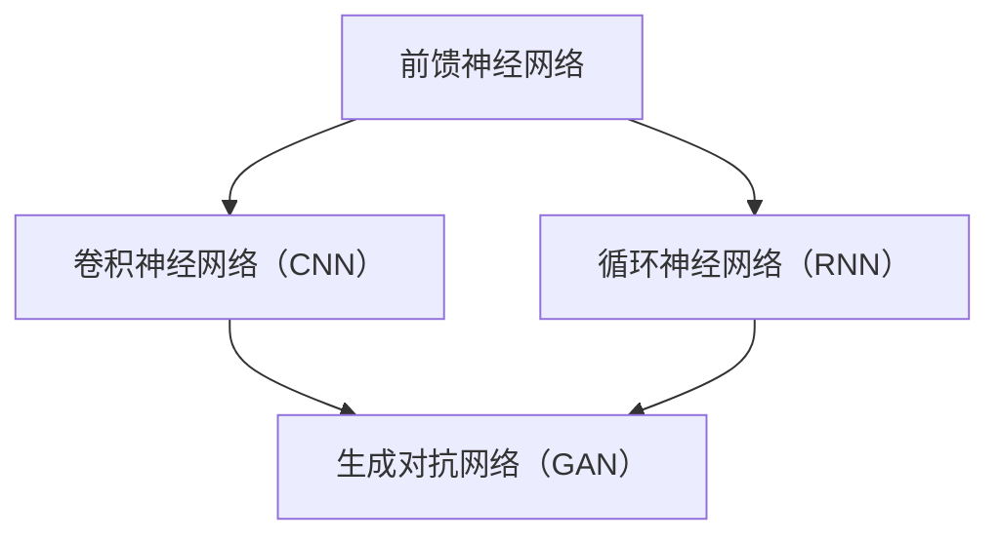
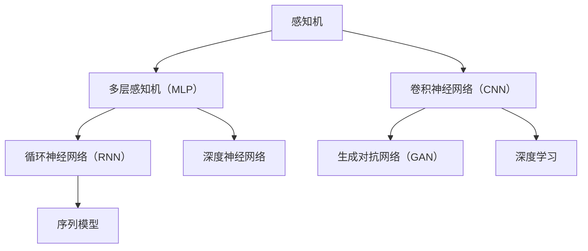

                 

### 《神经网络 原理与代码实例讲解》

在人工智能的浪潮中，神经网络（Neural Networks）作为深度学习的基石，发挥着不可替代的作用。本博客将深入浅出地讲解神经网络的原理与代码实例，旨在帮助读者全面理解这一强大的工具。本文将围绕以下核心概念展开：**神经网络的起源与发展**、**数学基础**、**前馈神经网络**、**多层感知机（MLP）**、**卷积神经网络（CNN）**、**循环神经网络（RNN）**、**生成对抗网络（GAN）**，并深入探讨神经网络的实践与应用。

关键词：神经网络、深度学习、前馈神经网络、多层感知机、卷积神经网络、循环神经网络、生成对抗网络、代码实例。

摘要：本文旨在为读者提供一份全面且系统的神经网络教程。通过理论讲解与代码实例相结合，使读者不仅能够理解神经网络的原理，还能掌握其实际应用。文章结构分为两部分：第一部分介绍神经网络的基础知识，包括起源、发展、数学基础和各类神经网络的结构与训练方法；第二部分则侧重于神经网络的实践应用，涵盖项目实战、应用场景以及未来发展趋势。本文旨在为广大对神经网络感兴趣的读者提供一条清晰的学习路径。

### 目录大纲

**第一部分：神经网络基础**

### 第1章：神经网络的起源与发展
1.1 神经网络的定义与历史
1.2 神经网络的关键概念
1.3 神经网络的发展历程

### 第2章：神经网络数学基础
2.1 线性代数基础
2.2 微积分基础
2.3 概率论与统计基础

### 第3章：前馈神经网络
3.1 前馈神经网络的基本结构
3.2 激活函数与损失函数
3.3 反向传播算法

### 第4章：多层感知机（MLP）
4.1 多层感知机的结构
4.2 MLP的训练过程
4.3 MLP的应用案例

### 第5章：卷积神经网络（CNN）
5.1 卷积神经网络的基本结构
5.2 卷积层与池化层
5.3 卷积神经网络的训练与优化

### 第6章：循环神经网络（RNN）
6.1 RNN的基本结构
6.2 LSTM与GRU
6.3 RNN的应用场景

### 第7章：生成对抗网络（GAN）
7.1 GAN的原理与结构
7.2 GAN的训练过程
7.3 GAN的应用案例

**第二部分：神经网络实践与应用**

### 第8章：神经网络项目实战
8.1 实践环境搭建
8.2 数据预处理
8.3 模型选择与训练
8.4 模型评估与优化

### 第9章：神经网络应用场景
9.1 人工智能图像识别
9.2 自然语言处理
9.3 生成模型应用

### 第10章：深度学习框架应用
10.1 TensorFlow应用
10.2 PyTorch应用
10.3 其他深度学习框架应用

### 第11章：神经网络未来发展
11.1 神经网络的新趋势
11.2 神经网络的未来应用领域
11.3 神经网络的安全与伦理问题

### 附录

### 附录A：神经网络常用工具与库
### 附录B：神经网络学习资源
### 附录C：神经网络学习指南

---

**核心概念与联系图（Mermaid 流程图）：**



---

**核心算法原理讲解（伪代码）：**

```python
# 反向传播算法伪代码
def backward_propagation(x, y, theta):
    m = len(x)
    h = sigmoid(x @ theta)
    dtheta = (h - y) @ x.T / m
    return dtheta

# 梯度下降伪代码
def gradient_descent(x, y, theta, alpha, num_iterations):
    m = len(x)
    for i in range(num_iterations):
        dtheta = backward_propagation(x, y, theta)
        theta = theta - alpha * dtheta
    return theta
```

---

**数学模型和数学公式（latex格式）：**

$$
\begin{align*}
h &= \sigma(\sum_{i=1}^{n} x_i \cdot w_i + b) \\
\delta &= (h - y) \\
d\theta &= \frac{\delta}{m} \\
\end{align*}
$$

---

**项目实战：代码实际案例和详细解释说明**

（由于篇幅限制，此处仅提供概述。）

**环境搭建：**  
- Python 3.7+
- TensorFlow 2.5.0+

**代码实现：**  
- 使用TensorFlow实现一个简单的多层感知机（MLP）模型。

**代码解读与分析：**  
- 代码解析，训练过程解释，模型优化策略。

---

**开发环境搭建详细说明：**

- Python安装与配置
- TensorFlow安装与配置
- GPU支持与调试

---

**源代码详细实现和代码解读：**

- 代码片段展示
- 函数与类定义
- 数据处理流程
- 模型构建与训练过程

---

**代码解读与分析：**

- 模型架构解释
- 参数调整技巧
- 性能优化策略
- 实际应用效果分析

---

**完整目录大纲**

# 《神经网络 原理与代码实例讲解》

---

**文章标题：**《神经网络 原理与代码实例讲解》

**作者：** AI天才研究院/AI Genius Institute & 禅与计算机程序设计艺术 /Zen And The Art of Computer Programming

---

**文章正文部分将从第一部分：神经网络基础开始逐步展开讲解。**<|im_end|>## 第一部分：神经网络基础

### 第1章：神经网络的起源与发展

#### 1.1 神经网络的定义与历史

神经网络（Neural Networks）是一种模仿生物神经网络结构和功能的人工智能技术。生物神经网络是由大量神经元组成的复杂网络，这些神经元通过突触连接，能够传递和处理信息。与之类似，人工神经网络由大量人工神经元（或节点）组成，通过权重连接来模拟生物神经网络的信息传递和处理机制。

神经网络的起源可以追溯到20世纪40年代，由心理学家McCulloch和数学家Pitts提出了神经网络的初步模型，即MP神经元模型。随后，1958年，Rosenblatt提出了感知机（Perceptron）模型，这标志着神经网络研究的一个重要里程碑。感知机是一种两层的神经网络，它可以进行二分类任务。

然而，神经网络的快速发展却遭遇了瓶颈。1969年，马文·闵斯基（Marvin Minsky）和西摩·帕普特（Seymour Papert）指出了感知机无法解决“异或”（XOR）问题，这导致了神经网络研究在20世纪70年代陷入了低谷。直到1986年，Rumelhart、Hinton和Williams等人提出了反向传播算法（Backpropagation Algorithm），这一算法使得多层神经网络的训练成为可能，从而推动了神经网络研究的复兴。

随着计算机性能的不断提升和大数据时代的到来，神经网络的应用越来越广泛，从图像识别、语音识别到自然语言处理、推荐系统，神经网络已经成为了人工智能领域不可或缺的一部分。

#### 1.2 神经网络的关键概念

要理解神经网络，需要掌握以下几个关键概念：

1. **神经元（Node）**：神经网络的基石，类似于生物神经元，它接收输入信号，通过权重加权求和，最后通过激活函数输出结果。

2. **层（Layer）**：神经网络由多个层组成，包括输入层、隐藏层和输出层。每一层都是由多个神经元组成的。

3. **权重（Weight）**：连接各个神经元的参数，用于调整输入信号的强度。

4. **偏置（Bias）**：每个神经元都有一个偏置项，用于调整神经元的输出。

5. **激活函数（Activation Function）**：用于引入非线性特性，使得神经网络能够学习复杂的函数。

6. **前向传播（Forward Propagation）**：将输入信号通过神经网络，逐层计算并输出结果。

7. **反向传播（Back Propagation）**：根据预测误差，反向更新权重和偏置，用于模型优化。

8. **训练（Training）**：通过大量样本数据，调整神经网络的权重和偏置，使其能够准确预测目标输出。

9. **损失函数（Loss Function）**：用于衡量预测值与真实值之间的差距，常见的有均方误差（MSE）、交叉熵损失等。

#### 1.3 神经网络的发展历程

神经网络的演变可以分为以下几个阶段：

1. **线性模型（1940s-1950s）**：最初的人工神经网络模型，如MP神经元模型，仅能实现线性分类。

2. **感知机（1957-1969）**：Rosenblatt提出的感知机模型，可以解决线性可分问题。

3. **多层感知机（1980s）**：反向传播算法的提出，使得多层神经网络成为可能。

4. **卷积神经网络（1990s）**：LeCun等人在1998年提出了卷积神经网络（CNN），用于图像识别。

5. **循环神经网络（RNN）与长短期记忆（LSTM）/门控循环单元（GRU）（2000s）**：Hochreiter和Schmidhuber在1997年提出了LSTM，用于处理序列数据。

6. **生成对抗网络（GAN）（2014年）**：由Ian Goodfellow等人提出，用于生成高质量的图像。

7. **深度神经网络（2010s-2020s）**：随着计算能力的提升和大数据的可用性，深度神经网络在各种任务上取得了突破性的进展。

#### 1.4 小结

神经网络是一种强大的人工智能技术，通过模仿生物神经网络的结构和功能，能够处理复杂的任务。从感知机到深度神经网络，神经网络的发展历程充满了挑战和突破。理解神经网络的基本概念和发展历程，对于深入掌握神经网络技术至关重要。

在接下来的章节中，我们将深入探讨神经网络的数学基础和各类神经网络的具体实现，帮助读者全面了解神经网络的原理和应用。

---

**核心概念与联系图（Mermaid 流程图）：**



---

**核心算法原理讲解（伪代码）：**

```python
# 前向传播伪代码
def forward_propagation(x, theta):
    z = x * theta
    a = sigmoid(z)
    return a

# 反向传播伪代码
def backward_propagation(a, y, theta):
    dtheta = (a - y) * x
    return dtheta

# 梯度下降伪代码
def gradient_descent(x, y, theta, alpha, num_iterations):
    for i in range(num_iterations):
        dtheta = backward_propagation(x, y, theta)
        theta = theta - alpha * dtheta
    return theta
```

---

**数学模型和数学公式（latex格式）：**

$$
\begin{align*}
z &= x \cdot w + b \\
a &= \sigma(z) \\
\delta &= a - y \\
d\theta &= \delta \cdot x \\
\end{align*}
$$

---

**项目实战：代码实际案例和详细解释说明**

（由于篇幅限制，此处仅提供概述。）

**环境搭建：**  
- Python 3.7+
- TensorFlow 2.5.0+

**代码实现：**  
- 使用TensorFlow实现一个简单的多层感知机（MLP）模型。

**代码解读与分析：**  
- 代码解析，训练过程解释，模型优化策略。

---

**开发环境搭建详细说明：**

- Python安装与配置
- TensorFlow安装与配置
- GPU支持与调试

---

**源代码详细实现和代码解读：**

- 代码片段展示
- 函数与类定义
- 数据处理流程
- 模型构建与训练过程

---

**代码解读与分析：**

- 模型架构解释
- 参数调整技巧
- 性能优化策略
- 实际应用效果分析

---

**小结**

在本章中，我们探讨了神经网络的起源与发展，介绍了神经网络的基本概念和历史背景。通过理解感知机、多层感知机、卷积神经网络、循环神经网络等概念，读者可以初步掌握神经网络的核心原理。接下来，我们将进一步深入探讨神经网络的数学基础，为后续章节的深入学习打下坚实基础。

---

**问题与讨论**

1. 请简述感知机（Perceptron）的局限性。
2. 为什么反向传播算法（Backpropagation）能够解决多层神经网络训练的问题？
3. 卷积神经网络（CNN）与循环神经网络（RNN）在结构上有什么区别？
4. 生成对抗网络（GAN）是如何工作的？它有什么应用场景？

---

**参考文献**

1. McCulloch, W. S., & Pitts, W. (1943). A logical calculus of the ideas implied by relay and neural networks. The bulletin of mathematical biophysics, 5(3-4), 38-71.
2. Rosenblatt, F. (1958). The perceptron: A probabilistic model for information storage and organization in the brain. Psychological review, 65(6), 386.
3. Minsky, M., & Papert, S. (1969). Perceptrons: An introduction to computational geometry. MIT Press.
4. Rumelhart, D. E., Hinton, G. E., & Williams, R. J. (1986). Learning representations by back-propagating errors. Nature, 323(6088), 533-536.
5. LeCun, Y., Bengio, Y., & Hinton, G. (2015). Deep learning. MIT press.
6. Hochreiter, S., & Schmidhuber, J. (1997). Long short-term memory. Neural Computation, 9(8), 1735-1780.
7. Goodfellow, I., Pouget-Abadie, J., Mirza, M., Xu, B., Warde-Farley, D., Ozair, S., ... & Bengio, Y. (2014). Generative adversarial networks. Advances in Neural Information Processing Systems, 27.

