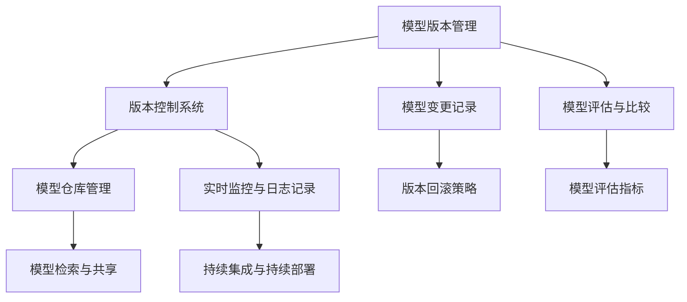

                 

# 《神经网络模型的版本管理策略》

## 关键词

- 神经网络模型
- 版本管理
- 版本控制系统
- 模型评估
- 持续集成
- 持续部署

## 摘要

本文旨在探讨神经网络模型的版本管理策略，包括核心概念、基础知识、流程、工具与平台、实践与案例分析以及发展趋势。通过详细讲解神经网络模型的版本管理核心概念、算法原理、数学模型以及项目实战，读者可以深入理解版本管理的必要性，掌握有效的版本管理方法，提高神经网络模型的开发、部署和维护效率。

## 目录大纲

### 第一部分：引言与核心概念

1. 神经网络模型的版本管理概述
   - 什么是神经网络模型版本管理
   - 版本管理的重要性
   - 版本管理的主要目标

2. 神经网络模型版本管理的挑战
   - 模型复杂性增加
   - 模型迭代频繁
   - 版本追溯难度大
   - 模型部署风险

3. 神经网络模型版本管理的基础知识
   - 神经网络模型的基本结构
   - 版本控制系统的选择
   - 标签和分支的使用

4. 神经网络模型版本管理的流程
   - 版本管理流程概述
   - 模型变更记录
   - 版本回滚策略

5. 神经网络模型版本管理的工具与平台
   - 模型仓库管理
   - 实时监控与日志记录
   - 持续集成与持续部署（CI/CD）

### 第二部分：实践与案例分析

1. 神经网络模型版本管理实践
   - 实践场景与目标
   - 版本管理策略制定
   - 模型评估与比较

2. 案例研究：神经网络模型版本管理的成功实践
   - 案例背景
   - 案例实施过程
   - 案例效果评估

3. 神经网络模型版本管理的发展趋势
   - 神经网络模型的发展趋势
   - 版本管理技术的演进
   - 未来展望

### 第三部分：附录

1. 常用工具和平台介绍
   - Git详解
   - 模型仓库管理工具
   - 持续集成与持续部署工具

2. 神经网络模型版本管理学习资源
   - 书籍推荐
   - 论文推荐
   - 在线课程与教程
   - 社区与论坛

### 神经网络模型版本管理核心概念联系图

**Mermaid 图：**



### 神经网络模型版本管理算法原理讲解

#### 模型评估与比较算法原理

**1. 评估指标：**

- **准确率（Accuracy）：**
  $$
  Accuracy = \frac{正确分类的样本数}{总样本数}
  $$

- **精确率（Precision）：**
  $$
  Precision = \frac{正确分类的正样本数}{正确分类的正样本数 + 错误分类的正样本数}
  $$

- **召回率（Recall）：**
  $$
  Recall = \frac{正确分类的正样本数}{正样本总数}
  $$

- **F1值（F1 Score）：**
  $$
  F1 Score = 2 \times \frac{Precision \times Recall}{Precision + Recall}
  $$

**2. 模型比较方法：**

- **交叉验证（Cross-Validation）：** 通过将数据集划分为多个子集，分别用于训练和验证模型，以评估模型的泛化能力。

- **A/B测试（A/B Testing）：** 在实际环境中，对两个或多个模型进行比较，根据用户行为数据评估模型效果。

### 数学模型和数学公式讲解

#### 模型评估指标计算公式

- **损失函数：**
  $$
  Loss = -\sum_{i=1}^{n} y_i \log(\hat{y}_i)
  $$
  其中，$y_i$ 是真实标签，$\hat{y}_i$ 是模型预测的概率。

- **准确率（Accuracy）：**
  $$
  Accuracy = \frac{\sum_{i=1}^{n} I(y_i = \hat{y}_i)}{n}
  $$
  其中，$I$ 是指示函数，当 $y_i = \hat{y}_i$ 时，$I(y_i = \hat{y}_i) = 1$，否则为 $0$。

- **精确率（Precision）和召回率（Recall）：**
  $$
  Precision = \frac{TP}{TP + FP}
  $$
  $$
  Recall = \frac{TP}{TP + FN}
  $$
  其中，$TP$ 是真正例，$FP$ 是假正例，$FN$ 是假反例。

- **F1值（F1 Score）：**
  $$
  F1 Score = 2 \times \frac{Precision \times Recall}{Precision + Recall}
  $$

### 项目实战

#### 项目背景

某电商平台需要利用神经网络模型预测用户购买行为，以提高营销策略的精准度和销售额。项目团队需要管理多个版本的模型，以便于模型迭代和版本控制。

#### 开发环境搭建

- **硬件环境：** 使用GPU服务器进行模型训练和推理。
- **软件环境：** 安装Python环境，配置TensorFlow和PyTorch框架。

#### 源代码实现

```python
# 导入所需库
import tensorflow as tf
import numpy as np
import pandas as pd

# 加载数据集
data = pd.read_csv('user_behavior_data.csv')

# 数据预处理
# ...

# 构建模型
model = tf.keras.Sequential([
    tf.keras.layers.Dense(128, activation='relu', input_shape=(num_features,)),
    tf.keras.layers.Dropout(0.2),
    tf.keras.layers.Dense(1, activation='sigmoid')
])

# 编译模型
model.compile(optimizer='adam', loss='binary_crossentropy', metrics=['accuracy'])

# 训练模型
model.fit(X_train, y_train, epochs=10, batch_size=32, validation_split=0.2)

# 评估模型
loss, accuracy = model.evaluate(X_test, y_test)
print(f"Test accuracy: {accuracy:.4f}")

# 保存模型
model.save('model_version_1.h5')
```

#### 代码解读与分析

- **数据预处理：** 数据集需要进行特征提取、归一化等预处理操作，以提高模型训练效果。
- **模型构建：** 使用Sequential模型堆叠多层Dense层，实现全连接神经网络。
- **模型编译：** 选择适当的优化器和损失函数，并指定评估指标。
- **模型训练：** 使用fit方法训练模型，设置训练轮次、批量大小和验证比例。
- **模型评估：** 使用evaluate方法评估模型在测试集上的性能。
- **模型保存：** 使用save方法将训练好的模型保存为HDF5文件，便于后续加载和使用。

### 总结

本文详细介绍了神经网络模型的版本管理策略，包括核心概念、基础知识、流程、工具与平台、实践与案例分析以及发展趋势。通过项目实战，读者可以了解如何在实际应用中实施神经网络模型版本管理，并掌握相关技能。附录部分提供了常用的工具和资源，以帮助读者深入学习。

## 作者信息

作者：AI天才研究院/AI Genius Institute & 禅与计算机程序设计艺术 /Zen And The Art of Computer Programming

