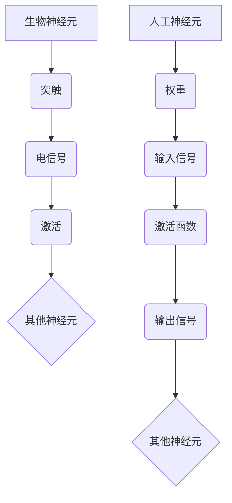
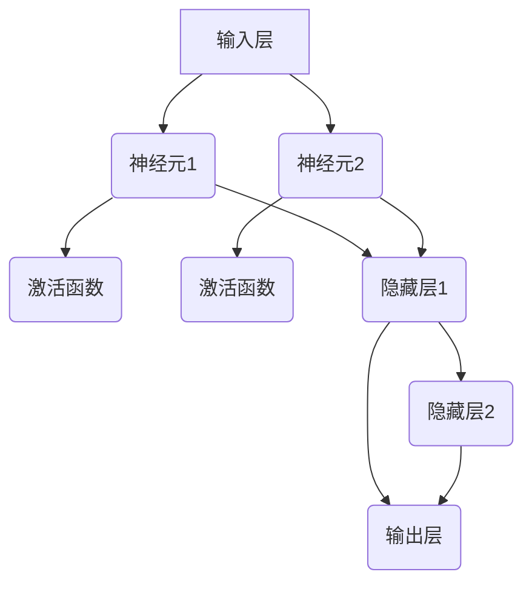
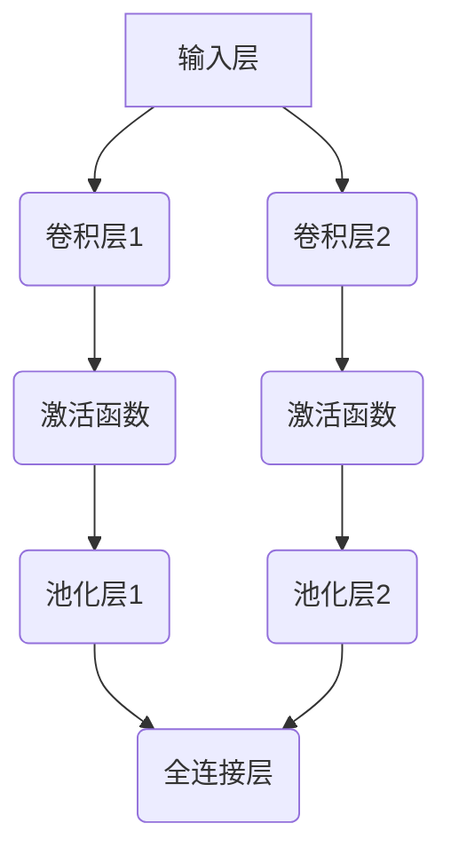
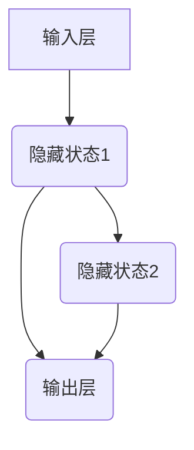
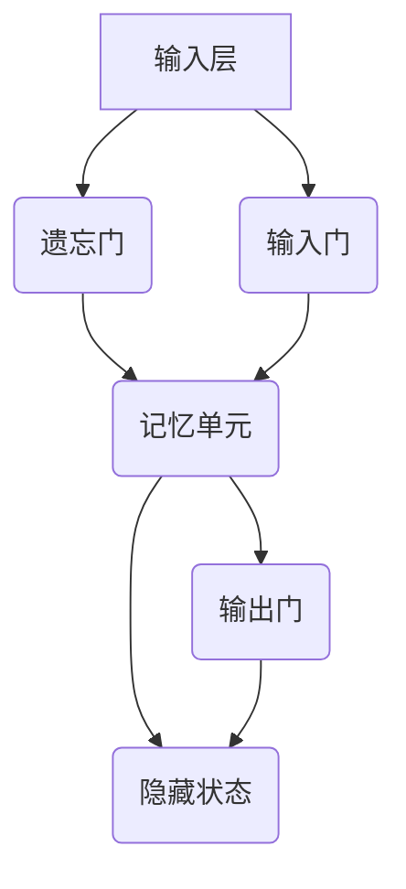
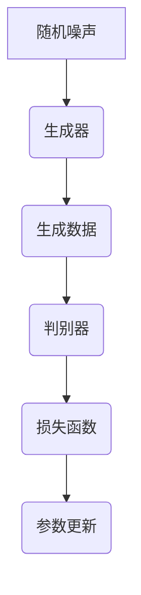
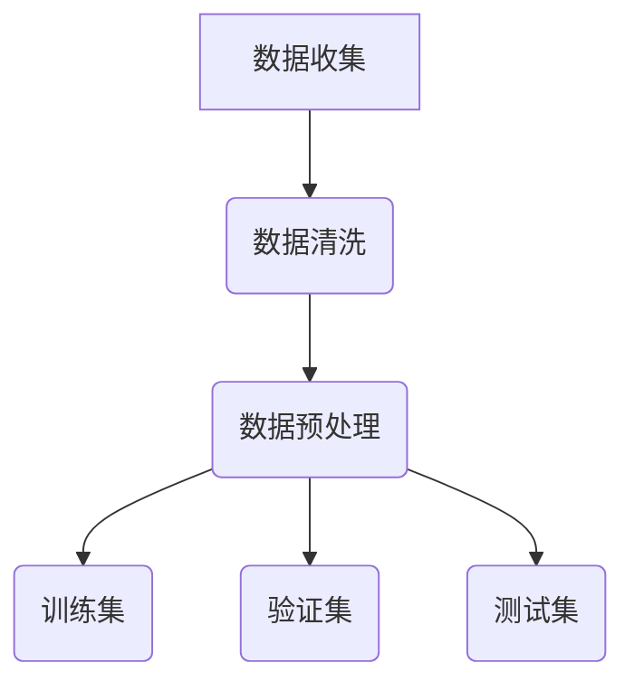
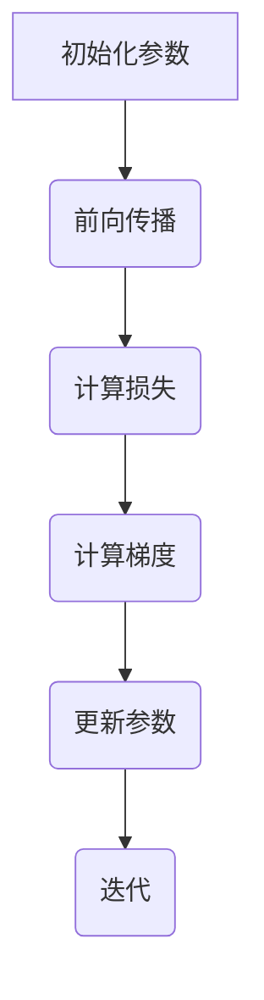
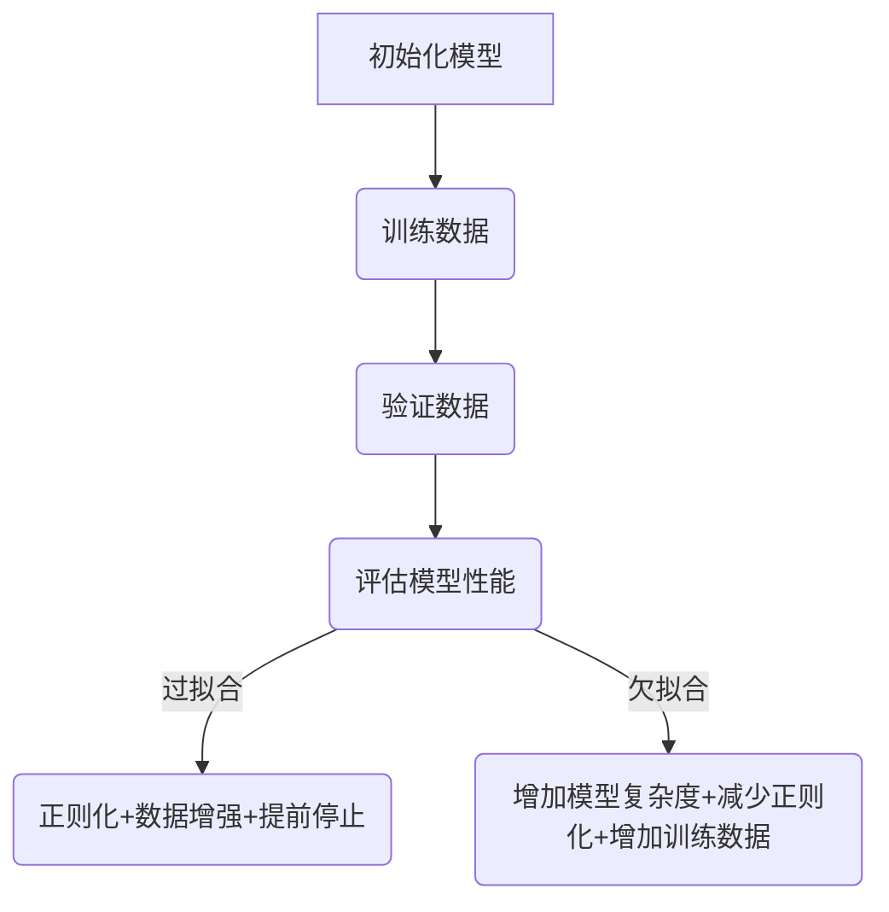

                 

### 文章标题

《神经网络：探索未知的领域》

### 关键词

神经网络、深度学习、人工智能、机器学习、计算模型、算法原理、图像识别、自然语言处理、应用实践、发展趋势、挑战与解决方案。

### 摘要

本文旨在深入探讨神经网络这一人工智能领域的关键技术，从基础理论到实际应用进行全面剖析。我们将首先回顾神经网络的起源与发展，解析其与生物神经系统的关系。接着，我们将详细讨论人工神经网络的基本原理，包括神经元模型、前馈神经网络、激活函数和反向传播算法。随后，文章将介绍常见的神经网络架构，如卷积神经网络（CNN）、循环神经网络（RNN）、长短时记忆网络（LSTM）和生成对抗网络（GAN）。在训练与优化部分，我们将探讨神经网络训练的数据准备、损失函数与优化算法，以及过拟合与欠拟合问题的解决方案。此外，文章还将介绍深度学习框架与工具，如TensorFlow、PyTorch和Keras，以及神经网络的实用技巧。最后，我们将聚焦神经网络在图像识别、自然语言处理和其他领域的应用，分析其发展趋势与面临的挑战。通过本文，读者将全面了解神经网络的技术原理、应用实践和发展前景。

---

### 《神经网络：探索未知的领域》目录大纲

以下是本文的目录大纲，结构清晰、内容丰富，旨在帮助读者系统地掌握神经网络的核心知识。

#### 第一部分：神经网络基础

- **第1章：神经网络的起源与发展**
  - 1.1 神经网络的历史与重要性
  - 1.2 生物神经系统与人工神经网络的关系
  - 1.3 神经网络的基本组成部分

- **第2章：人工神经网络的基本原理**
  - 2.1 神经元模型
  - 2.2 前馈神经网络
  - 2.3 激活函数的选择
  - 2.4 反向传播算法

- **第3章：常见的神经网络架构**
  - 3.1 卷积神经网络（CNN）
  - 3.2 循环神经网络（RNN）
  - 3.3 长短时记忆网络（LSTM）
  - 3.4 生成对抗网络（GAN）

#### 第二部分：神经网络的训练与优化

- **第4章：神经网络的训练过程**
  - 4.1 训练数据准备
  - 4.2 损失函数与优化算法
  - 4.3 过拟合与欠拟合问题

- **第5章：深度学习框架与工具**
  - 5.1 TensorFlow
  - 5.2 PyTorch
  - 5.3 Keras

- **第6章：神经网络的实用技巧**
  - 6.1 神经网络参数调整
  - 6.2 正则化方法
  - 6.3 神经网络优化技巧

#### 第三部分：神经网络的实践与应用

- **第7章：神经网络在图像识别中的应用**
  - 7.1 图像识别的基本原理
  - 7.2 CNN在图像识别中的应用
  - 7.3 实战案例：手写数字识别

- **第8章：神经网络在自然语言处理中的应用**
  - 8.1 自然语言处理的基本原理
  - 8.2 RNN在文本处理中的应用
  - 8.3 LSTM在机器翻译中的应用
  - 8.4 GPT-3模型介绍与应用

- **第9章：神经网络在其他领域的应用**
  - 9.1 无人驾驶技术
  - 9.2 人工智能助手
  - 9.3 金融风险管理

- **第10章：神经网络的发展趋势与挑战**
  - 10.1 神经网络未来的发展方向
  - 10.2 神经网络面临的挑战与解决思路

#### 附录

- **附录A：神经网络相关资源与工具**
  - 10.1 深度学习开源框架
  - 10.2 神经网络常用库与函数
  - 10.3 学习资源与推荐阅读

---

通过本文的目录大纲，读者可以系统地了解神经网络的各个方面，从基础理论到实际应用，从训练技巧到应用案例，为深入探索这一领域奠定坚实的基础。

### 第一部分：神经网络基础

#### 第1章：神经网络的起源与发展

神经网络（Neural Networks）是人工智能领域中的一种基础技术，其灵感来源于生物神经系统的结构和功能。在本章节中，我们将回顾神经网络的发展历程，探讨其历史与重要性，并分析生物神经系统与人工神经网络之间的关系。

#### 1.1 神经网络的历史与重要性

神经网络的历史可以追溯到1940年代，当时心理学家McCulloch和数学家Pitts提出了首个神经网络模型——MPN（McCulloch-Pitts Neuron），该模型模拟了简单生物神经元的逻辑功能。1958年，Frank Rosenblatt发明了感知机（Perceptron），这是第一个能够学习和分类的多层神经网络模型。然而，感知机的局限性很快被揭示，即它无法解决非线性问题。

直到1980年代，反向传播算法（Backpropagation Algorithm）的提出使得多层神经网络的训练成为可能，从而推动了神经网络的研究和应用。随着计算能力的提升和数据量的增加，神经网络逐渐在图像识别、语音识别、自然语言处理等众多领域取得了突破性的进展。近年来，深度学习（Deep Learning）的兴起更是将神经网络推向了人工智能领域的巅峰。

神经网络的重要性体现在其处理复杂问题和自适应能力方面。相比于传统的符号推理方法，神经网络能够自动从大量数据中学习到有用的特征，并且在解决非线性的复杂任务上具有显著的优势。

#### 1.2 生物神经系统与人工神经网络的关系

生物神经系统是神经网络设计的灵感来源。生物神经元是生物体的基本信息处理单元，通过突触连接形成复杂的网络结构。神经元通过接收外部刺激，产生电信号，然后通过突触传递给其他神经元，从而实现信息的传递和处理。

人工神经网络（Artificial Neural Networks,ANNs）则是对生物神经系统的模拟，其基本组成单元是人工神经元（Artificial Neurons），每个神经元通过权重（weights）连接到其他神经元，并接收输入信号。人工神经元的激活函数（activation function）决定了神经元是否会被激活，从而实现信息的传递和处理。

下面是一个简单的生物神经元与人工神经元对比的Mermaid流程图：



从图中可以看到，生物神经元通过突触传递电信号，而人工神经元通过权重和激活函数传递输入信号，二者在结构和功能上有一定的相似性。

此外，人工神经网络的设计还借鉴了生物神经系统的可塑性（plasticity）特性，即神经网络能够通过学习和训练来调整神经元的连接权重，从而适应不同的环境和任务。这种可塑性使得人工神经网络能够处理复杂的任务，并且具有较好的泛化能力。

总的来说，生物神经系统为人工神经网络提供了理论基础和设计灵感，而人工神经网络则在计算机科学和人工智能领域取得了广泛的应用。

#### 1.3 神经网络的基本组成部分

人工神经网络的基本组成部分包括输入层、隐藏层和输出层，每个层由多个神经元组成。神经元是神经网络的基本处理单元，其工作原理可以类比为生物神经元。

- **输入层（Input Layer）**：输入层接收外部输入数据，每个神经元对应数据的一个特征。例如，在图像识别任务中，每个像素点可以看作是一个特征。

- **隐藏层（Hidden Layers）**：隐藏层位于输入层和输出层之间，是神经网络的核心部分。隐藏层中的神经元通过对输入数据进行处理和变换，提取出更高层次的特征。隐藏层的数量和神经元数量可以根据具体任务进行调整。

- **输出层（Output Layer）**：输出层生成最终输出结果，其神经元的数量和类型取决于具体任务的输出类型。例如，在分类任务中，输出层可能包含多个神经元，每个神经元代表一个类别。

神经元的工作原理如下：

1. **加权求和**：每个神经元接收来自前一层神经元的输入信号，并将其加权求和。每个输入信号都乘以相应的权重（weights），然后相加。

2. **激活函数**：加权求和的结果经过激活函数（activation function）的处理，激活函数可以将线性输出转换为非线性输出，从而实现复杂函数的建模。

3. **输出**：激活函数的输出即为神经元的最终输出，可以传递给下一层神经元或者作为最终输出。

以下是一个简单的神经网络架构的Mermaid流程图：



在这个示例中，输入层有2个神经元，隐藏层有2个神经元，输出层有1个神经元。每个神经元通过权重连接到前一层和后一层神经元，激活函数用于非线性变换。

通过对输入数据进行多层处理，神经网络能够提取出更高级别的特征，从而实现复杂的模式识别和分类任务。在接下来的章节中，我们将详细讨论神经网络的基本原理，包括神经元模型、前馈神经网络、激活函数和反向传播算法。

---

在理解了神经网络的起源与发展、生物神经系统与人工神经网络的关系以及神经网络的基本组成部分后，我们接下来将深入探讨人工神经网络的基本原理。这将包括对神经元模型、前馈神经网络、激活函数和反向传播算法的详细分析。

#### 第2章：人工神经网络的基本原理

人工神经网络（Artificial Neural Networks,ANNs）是一种通过模拟生物神经系统的结构和功能来处理数据和信息的计算模型。在这一章节中，我们将详细介绍人工神经网络的基本原理，包括神经元模型、前馈神经网络、激活函数和反向传播算法。

#### 2.1 神经元模型

神经元是人工神经网络的基本组成单元，它类似于生物神经元，但功能有所不同。一个简单的神经元模型通常包括以下几个部分：

1. **输入**：神经元接收来自其他神经元的输入信号，每个输入信号乘以相应的权重（weight）。

2. **权重**：权重决定了输入信号对神经元输出的影响程度。权重可以通过学习过程进行调整。

3. **偏置**（Bias）：偏置是一个常量，它加到输入信号的加权求和上，增加了神经元的灵活性。

4. **激活函数**（Activation Function）：激活函数用于将加权求和的结果转换为输出信号，通常是一个非线性函数。

神经元的工作原理可以概括为以下步骤：

1. **加权求和**：将所有输入信号乘以各自的权重，然后相加，再加上偏置。公式如下：

   \[
   z = \sum_{i=1}^{n} x_i \cdot w_i + b
   \]

   其中，\( x_i \)是输入信号，\( w_i \)是对应的权重，\( b \)是偏置，\( z \)是加权求和的结果。

2. **激活**：将加权求和的结果传递给激活函数，以确定神经元是否被激活。常见的激活函数包括Sigmoid、ReLU、Tanh等。

神经元模型的伪代码如下：

```python
def activation(z):
    # 激活函数
    return sigmoid(z)

def neuron(x, w, b):
    # 加权求和
    z = np.dot(x, w) + b
    # 激活
    output = activation(z)
    return output
```

其中，`sigmoid`函数的定义为：

```python
def sigmoid(z):
    return 1 / (1 + np.exp(-z))
```

#### 2.2 前馈神经网络

前馈神经网络（Feedforward Neural Network）是一种没有循环或循环层的神经网络，数据从前向后传播。前馈神经网络包括输入层、一个或多个隐藏层和一个输出层。

1. **输入层**：接收外部输入数据，每个输入节点对应数据的一个特征。

2. **隐藏层**：隐藏层位于输入层和输出层之间，每个隐藏层中的神经元接收来自前一层神经元的输入，并通过加权求和和激活函数进行处理。

3. **输出层**：输出层生成最终输出，其神经元的数量和类型取决于具体任务的输出类型。

前馈神经网络的工作流程如下：

1. **前向传播**：从输入层开始，将输入数据传递到隐藏层，然后逐层传递到输出层。在每个层中，神经元通过加权求和和激活函数计算输出。

2. **损失计算**：输出层生成预测结果后，将其与实际结果进行比较，计算损失（loss）。

3. **反向传播**：根据损失计算梯度，将梯度反向传播到前面的层，更新每个神经元的权重和偏置。

前馈神经网络的伪代码如下：

```python
# 前向传播
def forwardPropagation(x, weights, biases):
    a = x
    for l in range(L):  # L是层的数量
        z = np.dot(a, weights[l]) + biases[l]
        a = activation(z)
    return a

# 反向传播
def backwardPropagation(a, y, weights, biases, learning_rate):
    dZ = a - y
    for l in reversed(range(L)):
        dW = np.dot(dZ, a.T) * activation_derivative(z)
        db = np.sum(dZ)
        dZ = np.dot(dZ, weights[l].T) * activation_derivative(z)
        weights[l] -= learning_rate * dW
        biases[l] -= learning_rate * db
```

其中，`activation_derivative`函数用于计算激活函数的导数。

#### 2.3 激活函数的选择

激活函数是神经网络中的关键组件，它决定了神经元输出的非线性特性。常见的激活函数包括Sigmoid、ReLU、Tanh等。

1. **Sigmoid函数**：Sigmoid函数是一种S形曲线，将输入映射到(0,1)区间。其导数在接近0和1时较小，因此容易导致梯度消失。

   \[
   \sigma(z) = \frac{1}{1 + e^{-z}}
   \]

   Sigmoid函数的导数为：

   \[
   \sigma'(z) = \sigma(z)(1 - \sigma(z))
   \]

2. **ReLU函数**：ReLU函数（Rectified Linear Unit）是一个简单的线性函数，当输入为负时输出为0，当输入为正时输出等于输入。ReLU函数的导数为1或0，这使得它具有较快的训练速度和更好的数值稳定性。

   \[
   \text{ReLU}(z) = \max(0, z)
   \]

3. **Tanh函数**：Tanh函数（双曲正切函数）是一种将输入映射到(-1,1)区间的S形曲线，其导数在中间部分较大，有利于梯度传播。

   \[
   \tanh(z) = \frac{e^z - e^{-z}}{e^z + e^{-z}}
   \]

   Tanh函数的导数为：

   \[
   \tanh'(z) = 1 - \tanh^2(z)
   \]

选择合适的激活函数对于神经网络的训练和性能至关重要。ReLU函数因其简单性和高效性在深度学习中广泛应用，而Sigmoid和Tanh函数则适用于较小的网络和特定任务。

#### 2.4 反向传播算法

反向传播算法（Backpropagation Algorithm）是神经网络训练的核心算法，它通过反向传播误差梯度来更新网络的权重和偏置，从而优化网络性能。反向传播算法包括以下几个步骤：

1. **前向传播**：将输入数据传递到网络中，计算输出层的结果。

2. **损失函数计算**：计算输出层的结果与实际结果之间的差异，即损失函数的值。

3. **梯度计算**：计算损失函数关于网络参数的梯度。

4. **权重和偏置更新**：根据梯度更新网络的权重和偏置。

反向传播算法的伪代码如下：

```python
# 前向传播
def forwardPropagation(x, weights, biases):
    # ...
    return a

# 梯度计算
def computeGradients(a, y, weights, biases):
    dZ = a - y
    dW = np.dot(a.T, dZ)
    db = np.sum(dZ, axis=0)
    return dW, db

# 权重和偏置更新
def updateParameters(weights, biases, dW, db, learning_rate):
    weights -= learning_rate * dW
    biases -= learning_rate * db
    return weights, biases
```

通过反复迭代反向传播算法，神经网络可以逐渐优化其参数，从而提高预测的准确性。

总的来说，人工神经网络的基本原理包括神经元模型、前馈神经网络、激活函数和反向传播算法。这些原理共同构成了神经网络的核心，使其能够处理复杂的数据和任务。在接下来的章节中，我们将介绍常见的神经网络架构，进一步探讨神经网络的多样性。

---

在了解了人工神经网络的基本原理后，我们将进一步探讨几种常见的神经网络架构，这些架构在解决不同类型的问题上表现出独特的优势。在本章节中，我们将介绍卷积神经网络（CNN）、循环神经网络（RNN）、长短时记忆网络（LSTM）和生成对抗网络（GAN）。

#### 第3章：常见的神经网络架构

##### 3.1 卷积神经网络（CNN）

卷积神经网络（Convolutional Neural Network，CNN）是一种专门用于处理图像数据的神经网络架构。CNN的核心特点是使用卷积层（Convolutional Layer）来提取图像的特征。卷积层通过卷积操作来计算输入图像的特征图（feature map），从而实现图像的特征提取。

1. **卷积层**：卷积层是CNN中最核心的层，它通过滤波器（filter）在输入图像上滑动，计算局部特征的加权和。滤波器的大小和数量决定了卷积层能够提取的特征的复杂度和多样性。

2. **激活函数**：在卷积层之后通常会加上一个激活函数，如ReLU函数，用于引入非线性特性。

3. **池化层**：池化层（Pooling Layer）用于减少特征图的尺寸，从而减少模型的参数数量和计算复杂度。常见的池化方法包括最大池化（Max Pooling）和平均池化（Average Pooling）。

4. **全连接层**：在多个卷积层和池化层之后，通常会加上全连接层（Fully Connected Layer），用于进行分类或回归任务。

CNN的工作流程如下：

- **输入**：输入一张图像。
- **卷积层**：使用滤波器在图像上滑动，计算特征图。
- **激活函数**：对特征图进行非线性变换。
- **池化层**：对特征图进行下采样。
- **全连接层**：将特征图展平为一维向量，然后通过全连接层进行分类或回归。

以下是一个简单的CNN架构的Mermaid流程图：



CNN在图像识别任务中表现出色，广泛应用于人脸识别、物体检测、图像分类等领域。

##### 3.2 循环神经网络（RNN）

循环神经网络（Recurrent Neural Network，RNN）是一种能够处理序列数据的神经网络架构。RNN的核心特点是具有循环结构，即当前时间步的输出会反馈到下一时间步的输入中。这使得RNN能够处理具有时间依赖性的数据。

1. **隐藏状态**：RNN中的隐藏状态（hidden state）是当前时间步的输入和前一时间步的隐藏状态的结合，用于传递信息。

2. **递归连接**：RNN通过递归连接（recurrent connection）将当前时间步的输出与隐藏状态相连，形成一个循环结构。

3. **激活函数**：RNN通常使用非线性激活函数，如ReLU或Tanh函数，以引入非线性特性。

RNN的工作流程如下：

- **输入**：输入一个序列数据。
- **递归连接**：当前时间步的输入与前一时间步的隐藏状态相加，生成新的隐藏状态。
- **激活函数**：对隐藏状态进行非线性变换。
- **输出**：将隐藏状态传递给下一时间步。

以下是一个简单的RNN架构的Mermaid流程图：



RNN在自然语言处理、语音识别和时间序列预测等领域表现出色。

##### 3.3 长短时记忆网络（LSTM）

长短时记忆网络（Long Short-Term Memory，LSTM）是RNN的一种改进模型，旨在解决传统RNN在处理长序列数据时出现的长期依赖问题。LSTM通过引入记忆单元（memory cell）和门控机制（gate），实现了对长期依赖信息的有效保存和传递。

1. **记忆单元**：LSTM中的记忆单元（memory cell）用于存储长期依赖信息。

2. **门控机制**：LSTM包括三个门控单元：遗忘门（forget gate）、输入门（input gate）和输出门（output gate）。这些门控单元控制信息的流入和流出，从而实现了对长期依赖信息的动态控制。

3. **激活函数**：LSTM通常使用非线性激活函数，如Sigmoid和Tanh函数，以引入非线性特性。

LSTM的工作流程如下：

- **输入**：输入一个序列数据。
- **遗忘门**：根据当前输入和前一隐藏状态，计算遗忘门参数，决定哪些信息需要被遗忘。
- **输入门**：根据当前输入和前一隐藏状态，计算输入门参数，决定哪些信息需要被存储在记忆单元中。
- **记忆单元更新**：根据遗忘门和输入门，更新记忆单元的状态。
- **输出门**：根据当前记忆单元状态和前一隐藏状态，计算输出门参数，决定哪些信息需要输出。
- **隐藏状态更新**：根据输出门，更新隐藏状态。

以下是一个简单的LSTM架构的Mermaid流程图：



LSTM在语音识别、机器翻译和文本生成等领域表现出色。

##### 3.4 生成对抗网络（GAN）

生成对抗网络（Generative Adversarial Network，GAN）是一种由生成器（generator）和判别器（discriminator）组成的神经网络架构。生成器旨在生成逼真的数据，而判别器旨在区分真实数据和生成数据。通过两个网络的对抗训练，生成器不断优化其生成能力，从而生成更加真实的数据。

1. **生成器**：生成器通过输入随机噪声，生成类似于真实数据的样本。

2. **判别器**：判别器接收真实数据和生成数据，并尝试判断其来源。

3. **对抗训练**：生成器和判别器通过对抗训练相互提升，生成器试图生成更加逼真的数据，而判别器试图提高其判断能力。

GAN的工作流程如下：

- **生成器**：输入随机噪声，生成数据。
- **判别器**：接收真实数据和生成数据，并对其进行判断。
- **损失函数**：根据判别器的判断结果，计算生成器和判别器的损失函数。
- **参数更新**：根据损失函数，更新生成器和判别器的参数。

以下是一个简单的GAN架构的Mermaid流程图：



GAN在图像生成、图像修复、图像合成等领域表现出色。

通过本章的介绍，我们了解了卷积神经网络（CNN）、循环神经网络（RNN）、长短时记忆网络（LSTM）和生成对抗网络（GAN）的基本原理和架构。这些神经网络架构在处理不同类型的数据和任务上具有各自的优势，是神经网络领域中不可或缺的一部分。在接下来的章节中，我们将进一步探讨神经网络的训练与优化过程。

---

#### 第4章：神经网络的训练过程

神经网络的训练过程是使其能够有效执行特定任务的关键步骤。在本章节中，我们将详细探讨神经网络训练过程中涉及的关键步骤，包括训练数据的准备、损失函数的选择与优化算法，以及如何解决过拟合与欠拟合问题。

##### 4.1 训练数据准备

训练数据准备是神经网络训练过程中的第一步，其质量直接影响到模型的性能。以下是训练数据准备的主要步骤：

1. **数据收集**：首先，需要收集与任务相关的数据。这些数据可以是标注的（labelled），也可以是未标注的（unlabelled）。在标注数据中，每个样本都有一个相应的标签，用于指导模型的学习。

2. **数据清洗**：收集到的数据往往包含噪声和不完整的信息，因此需要进行数据清洗，以去除噪声和缺失值。常见的数据清洗方法包括去除重复数据、填补缺失值、消除异常值等。

3. **数据预处理**：对于不同类型的数据，如文本、图像、音频等，需要进行不同的预处理。例如，对于文本数据，可以采用词袋模型（Bag of Words）或词嵌入（Word Embedding）进行预处理；对于图像数据，可以采用归一化、数据增强等方法。

4. **数据划分**：将数据划分为训练集、验证集和测试集。通常，训练集用于训练模型，验证集用于调整模型参数和验证模型性能，测试集用于最终评估模型性能。一般来说，训练集和验证集的比例可以是8:2或7:3，而测试集的大小取决于数据量。

以下是一个简单的数据划分流程：



##### 4.2 损失函数与优化算法

损失函数（Loss Function）用于衡量模型预测值与真实值之间的差异。选择合适的损失函数对于模型的训练至关重要。以下是几种常见的损失函数：

1. **均方误差（MSE）**：用于回归任务，计算预测值与真实值之间误差的平方和的平均值。

   \[
   \text{MSE} = \frac{1}{n}\sum_{i=1}^{n} (y_i - \hat{y}_i)^2
   \]

2. **交叉熵（Cross Entropy）**：用于分类任务，计算预测概率分布与真实概率分布之间的差异。

   \[
   \text{Cross Entropy} = -\sum_{i=1}^{n} y_i \log(\hat{y}_i)
   \]

3. **对数损失（Log Loss）**：与交叉熵函数等价，常用于分类问题。

   \[
   \text{Log Loss} = -\sum_{i=1}^{n} y_i \log(\hat{y}_i)
   \]

优化算法（Optimization Algorithm）用于调整模型的参数，以最小化损失函数。以下是几种常见的优化算法：

1. **随机梯度下降（SGD）**：每次迭代更新模型参数时使用当前批次的数据梯度。

   \[
   \theta = \theta - \alpha \cdot \nabla_\theta J(\theta)
   \]

   其中，\( \theta \)是模型参数，\( \alpha \)是学习率，\( J(\theta) \)是损失函数。

2. **Adam优化器**：结合了SGD和动量（Momentum）的优点，自适应调整学习率。

   \[
   \theta = \theta - \alpha \cdot \frac{\nabla_\theta J(\theta)}{1 - \beta_1^t (1 - \beta_2^t)^{t/R}}
   \]

   其中，\( \beta_1 \)和\( \beta_2 \)分别是第一和第二矩估计的指数衰减率，\( R \)是迭代次数。

3. **RMSProp优化器**：通过计算梯度平方的平均值来调整学习率。

   \[
   \theta = \theta - \alpha \cdot \frac{\nabla_\theta J(\theta)}{\sqrt{v_\theta + \epsilon}}
   \]

   其中，\( v_\theta \)是梯度平方的平均值，\( \epsilon \)是正则项。

以下是一个简单的优化算法流程：



##### 4.3 过拟合与欠拟合问题

在神经网络训练过程中，可能会出现过拟合（Overfitting）和欠拟合（Underfitting）问题。

1. **过拟合**：模型在训练数据上表现得很好，但在未见过的数据上表现不佳。这是由于模型过于复杂，从训练数据中学习到了噪声和细节，而没有捕捉到数据的整体趋势。解决过拟合问题可以采用以下方法：

   - **正则化**（Regularization）：在损失函数中添加正则项，如L1正则化或L2正则化，以减少模型参数的大小。
   - **数据增强**（Data Augmentation）：通过增加数据的多样性来减少模型的过拟合。
   - **提前停止**（Early Stopping）：在验证集上观察模型性能，当验证集性能不再提高时停止训练。

2. **欠拟合**：模型在训练数据和未见过的数据上表现都不佳。这是由于模型过于简单，无法捕捉到数据的复杂结构。解决欠拟合问题可以采用以下方法：

   - **增加模型复杂度**：增加模型的层数或神经元数量，以提高模型的表达能力。
   - **减少正则化**：减小正则化强度，使模型能够捕捉到更多的特征。
   - **增加训练数据**：增加训练数据量，以提高模型的泛化能力。

以下是一个简单的过拟合与欠拟合问题解决方案流程：



通过本章的介绍，我们了解了神经网络训练过程中的关键步骤，包括训练数据的准备、损失函数的选择与优化算法，以及如何解决过拟合与欠拟合问题。这些步骤和方法对于构建高效、可靠的神经网络模型至关重要。在接下来的章节中，我们将介绍深度学习框架与工具，进一步探讨如何在实际应用中利用神经网络。

---

#### 第5章：深度学习框架与工具

深度学习框架与工具是构建和训练神经网络的核心，为开发者提供了高效、易用的平台。在本章节中，我们将介绍几种常用的深度学习框架与工具，包括TensorFlow、PyTorch和Keras，并探讨它们的基本概念、特点和主要功能。

##### 5.1 TensorFlow

TensorFlow是Google开发的开源深度学习框架，广泛应用于各种机器学习和深度学习任务。TensorFlow具有以下特点：

1. **动态计算图**：TensorFlow使用动态计算图（dynamic computation graph），允许开发者根据需要动态构建和执行计算图。这使得TensorFlow在模型构建和优化方面具有很高的灵活性。

2. **丰富的API**：TensorFlow提供了多个API层次，包括低层的Tensor API、中层的Estimators API和高层的高级API，如Keras API。这些API层次使得开发者可以根据自己的需求选择合适的接口进行模型构建和训练。

3. **分布式训练**：TensorFlow支持分布式训练，允许开发者将模型训练分布在多台机器上，从而提高训练速度和性能。

4. **广泛的生态系统**：TensorFlow拥有丰富的生态系统，包括预训练模型、工具和库，如TensorBoard、TensorFlow Lite、TensorFlow Serving等，这些工具和库为开发者的研究和生产提供了强大的支持。

TensorFlow的基本使用方法如下：

```python
import tensorflow as tf

# 创建计算图
a = tf.constant(5)
b = tf.constant(6)
c = a + b

# 执行计算图
with tf.Session() as sess:
    print(sess.run(c))

# 使用Keras API构建模型
model = tf.keras.Sequential([
    tf.keras.layers.Dense(10, activation='relu', input_shape=(784,)),
    tf.keras.layers.Dense(1, activation='sigmoid')
])

model.compile(optimizer='adam',
              loss='binary_crossentropy',
              metrics=['accuracy'])

model.fit(x_train, y_train, epochs=10)
```

##### 5.2 PyTorch

PyTorch是Facebook开发的开源深度学习框架，以其动态计算图和直观的API而著称。PyTorch具有以下特点：

1. **动态计算图**：PyTorch使用动态计算图，类似于Python的原生计算图，使得开发者可以更加直观地构建和操作计算图。

2. **简洁的API**：PyTorch提供了简洁的API，包括nn.Module、autograd等模块，使得模型构建和训练更加直观和高效。

3. **强大的数据加载库**：PyTorch提供了强大的数据加载库，如torchvision、torchaudio等，为开发者提供了丰富的预训练模型和数据集。

4. **动态图和静态图的结合**：PyTorch允许开发者使用动态图和静态图（static computation graph）结合的方式进行模型构建和训练，提供了灵活的选择。

PyTorch的基本使用方法如下：

```python
import torch
import torch.nn as nn
import torch.optim as optim

# 创建模型
class Model(nn.Module):
    def __init__(self):
        super(Model, self).__init__()
        self.fc1 = nn.Linear(784, 10)
        self.fc2 = nn.Linear(10, 1)

    def forward(self, x):
        x = torch.relu(self.fc1(x))
        x = self.fc2(x)
        return x

model = Model()

# 定义损失函数和优化器
criterion = nn.BCELoss()
optimizer = optim.Adam(model.parameters(), lr=0.001)

# 训练模型
for epoch in range(10):
    optimizer.zero_grad()
    outputs = model(x_train)
    loss = criterion(outputs, y_train)
    loss.backward()
    optimizer.step()
    print(f'Epoch [{epoch+1}/10], Loss: {loss.item()}')
```

##### 5.3 Keras

Keras是Python中一个非常受欢迎的深度学习库，它构建在TensorFlow和Theano之上，提供了简洁的API和易于使用的接口。Keras具有以下特点：

1. **简洁的API**：Keras提供了简洁的API，使得模型构建和训练更加直观和易于操作。Keras支持序列模型（sequential model）和函数式模型（functional model）两种模型构建方式。

2. **模块化组件**：Keras提供了丰富的模块化组件，如层（layers）、模型（models）、损失函数（loss functions）、优化器（optimizers）等，使得开发者可以灵活构建各种复杂的模型。

3. **易于扩展**：Keras的设计使得开发者可以轻松自定义层、模型和优化器，以满足特定的需求。

4. **快速原型开发**：Keras的简洁性和易用性使得开发者可以快速构建和迭代深度学习模型，非常适合原型开发和实验。

Keras的基本使用方法如下：

```python
from tensorflow import keras

# 创建模型
model = keras.Sequential([
    keras.layers.Dense(10, activation='relu', input_shape=(784,)),
    keras.layers.Dense(1, activation='sigmoid')
])

# 编译模型
model.compile(optimizer='adam',
              loss='binary_crossentropy',
              metrics=['accuracy'])

# 训练模型
model.fit(x_train, y_train, epochs=10)
```

通过本章的介绍，我们了解了TensorFlow、PyTorch和Keras这三种常用的深度学习框架与工具的基本概念、特点和主要功能。这些框架和工具为开发者提供了强大的支持，使得构建和训练神经网络变得更加高效和便捷。在接下来的章节中，我们将探讨神经网络的实用技巧，进一步优化神经网络模型的性能。

---

#### 第6章：神经网络的实用技巧

在深度学习实践中，为了提高神经网络模型的性能，我们需要对模型进行参数调整、应用正则化方法和优化技巧。本章将详细讨论这些实用技巧，帮助读者在实际应用中更好地调整和优化神经网络模型。

##### 6.1 神经网络参数调整

参数调整是神经网络训练过程中至关重要的一环。以下是几种常见的参数调整方法：

1. **学习率（Learning Rate）**：学习率决定了模型在每次迭代中参数更新的幅度。选择合适的学习率对于训练过程的收敛速度和最终性能有很大影响。常见的调整方法包括：

   - **固定学习率**：在训练过程中保持学习率不变。
   - **学习率衰减**：在训练过程中逐步减小学习率，以避免模型过早收敛。
   - **自适应学习率**：使用如Adam优化器这样的自适应学习率优化器，自动调整学习率。

2. **批量大小（Batch Size）**：批量大小决定了每次训练迭代中参与计算的数据样本数量。批量大小会影响模型的训练效率和泛化能力。常见的调整方法包括：

   - **小批量训练**：使用较小的批量大小（如32或64），以提高模型的泛化能力。
   - **大批量训练**：使用较大的批量大小（如1024或2048），以提高训练效率。

3. **隐藏层神经元数量**：隐藏层神经元数量的选择会影响模型的复杂度和训练时间。通常，随着神经元数量的增加，模型的复杂度增加，但训练时间也会增加。合理的调整方法包括：

   - **尝试不同的神经元数量**：通过交叉验证等方法，尝试不同的神经元数量，找到最佳的模型性能。

4. **网络深度**：网络深度（即隐藏层的数量）也会影响模型的性能。通常，较深的网络能够捕捉到更多的特征，但训练难度和计算资源需求也会增加。调整方法包括：

   - **逐步增加网络深度**：从简单的网络结构开始，逐步增加隐藏层的数量，观察模型性能的变化。

##### 6.2 正则化方法

正则化方法用于防止模型过拟合，提高模型的泛化能力。以下是几种常见的正则化方法：

1. **L1正则化（L1 Regularization）**：在损失函数中添加\( \lambda \sum_{i} |w_i| \)项，其中\( w_i \)是权重，\( \lambda \)是正则化参数。L1正则化倾向于产生稀疏解，即模型中许多权重会变为0。

2. **L2正则化（L2 Regularization）**：在损失函数中添加\( \lambda \sum_{i} w_i^2 \)项。L2正则化倾向于减小权重的大小，但不会导致权重为0。

3. **Dropout**：在训练过程中随机丢弃部分神经元，从而减少模型对特定训练样本的依赖。Dropout通常在训练过程中使用，但在测试时不会执行。

4. **Early Stopping**：在验证集上监控模型性能，当验证集性能不再提高时停止训练，以避免过拟合。

##### 6.3 神经网络优化技巧

除了参数调整和正则化方法，还有一些优化技巧可以提高神经网络的性能：

1. **数据增强（Data Augmentation）**：通过旋转、缩放、裁剪、翻转等方法增加训练数据的多样性，从而提高模型的泛化能力。

2. **批量归一化（Batch Normalization）**：在每批数据前对数据进行归一化处理，以加速训练过程和提高模型稳定性。

3. **学习率调度（Learning Rate Scheduling）**：在训练过程中动态调整学习率，以适应模型在不同阶段的训练需求。

4. **迁移学习（Transfer Learning）**：使用预训练模型作为基础，通过微调（fine-tuning）适应新的任务，从而提高模型的性能。

5. **并行计算和分布式训练**：利用多GPU或分布式计算资源进行模型训练，以加快训练速度和提高性能。

以下是一个简单的神经网络参数调整和正则化方法的示例：

```python
# 参数调整
learning_rate = 0.001
batch_size = 64
num_epochs = 100

# 模型架构
model = keras.Sequential([
    keras.layers.Dense(128, activation='relu', input_shape=(input_shape)),
    keras.layers.BatchNormalization(),
    keras.layers.Dense(64, activation='relu'),
    keras.layers.Dropout(0.5),
    keras.layers.Dense(num_classes, activation='softmax')
])

# 编译模型
model.compile(optimizer=optimizers.Adam(learning_rate=learning_rate),
              loss='categorical_crossentropy',
              metrics=['accuracy'])

# 训练模型
model.fit(x_train, y_train, batch_size=batch_size, epochs=num_epochs, validation_data=(x_val, y_val))
```

通过本章的介绍，我们了解了神经网络参数调整、正则化方法和优化技巧的基本概念和实际应用。这些技巧在深度学习实践中具有重要意义，能够显著提高模型的性能和泛化能力。在下一章节中，我们将探讨神经网络在图像识别中的应用，进一步展示神经网络在实际任务中的表现。

---

#### 第7章：神经网络在图像识别中的应用

图像识别是计算机视觉领域的一项重要任务，旨在让计算机理解和解析图像内容。神经网络，特别是卷积神经网络（CNN），在图像识别中发挥了重要作用。在本章节中，我们将深入探讨神经网络在图像识别中的应用，包括图像识别的基本原理、CNN在图像识别中的应用，以及一个实际的手写数字识别的实战案例。

##### 7.1 图像识别的基本原理

图像识别的基本原理涉及从图像中提取特征，并通过分类器对特征进行分类。以下是图像识别的基本步骤：

1. **图像预处理**：图像预处理是图像识别的第一步，包括图像尺寸调整、灰度化、二值化、去噪等。预处理旨在提高图像质量，减少噪声，为后续的特征提取和分类做好准备。

2. **特征提取**：特征提取是从图像中提取出具有区分性的特征，如边缘、角点、纹理等。传统的特征提取方法包括SIFT、SURF、HOG等，而现代的神经网络通过卷积层自动提取特征。

3. **分类**：分类是将提取到的特征输入到分类器中，根据特征对图像进行分类。常见的分类器包括支持向量机（SVM）、决策树、随机森林等。

##### 7.2 CNN在图像识别中的应用

卷积神经网络（CNN）是一种专门用于图像识别的神经网络架构，其核心特点是使用卷积层（Convolutional Layer）提取图像特征。CNN在图像识别中的应用主要包括以下几个步骤：

1. **卷积层**：卷积层通过卷积操作提取图像的局部特征。卷积层中的每个滤波器（filter）滑动在图像上，计算局部特征的加权和，并通过激活函数引入非线性特性。

2. **池化层**：池化层（Pooling Layer）用于降低特征图的维度，减少计算复杂度。常见的池化方法包括最大池化（Max Pooling）和平均池化（Average Pooling）。

3. **全连接层**：在多个卷积层和池化层之后，通常会添加全连接层（Fully Connected Layer），用于进行最终的分类。

CNN在图像识别中的工作流程如下：

- **输入**：输入一张图像。
- **卷积层**：通过卷积操作提取图像的局部特征。
- **激活函数**：对卷积层的输出进行非线性变换。
- **池化层**：对特征图进行下采样。
- **全连接层**：将特征图展平为一维向量，通过全连接层进行分类。

以下是一个简单的CNN架构的Mermaid流程图：


CNN在图像识别任务中表现出色，广泛应用于人脸识别、物体检测、图像分类等领域。

##### 7.3 实战案例：手写数字识别

手写数字识别是一个经典的图像识别任务，旨在将手写数字图像分类到0到9的十个数字中。以下是一个手写数字识别的实战案例，包括开发环境搭建、数据集准备、模型构建、训练和测试。

1. **开发环境搭建**：

   - 安装Python（推荐3.8及以上版本）
   - 安装TensorFlow
   - 安装Keras

2. **数据集准备**：

   MNIST数据集是一个常用的手写数字识别数据集，包含60,000个训练图像和10,000个测试图像。数据集已经预处理为28x28的灰度图像，每个像素的取值范围为0到255。

   ```python
   from tensorflow.keras.datasets import mnist
   (x_train, y_train), (x_test, y_test) = mnist.load_data()
   x_train = x_train.reshape(-1, 28, 28, 1).astype('float32') / 255.0
   x_test = x_test.reshape(-1, 28, 28, 1).astype('float32') / 255.0
   y_train = keras.utils.to_categorical(y_train, 10)
   y_test = keras.utils.to_categorical(y_test, 10)
   ```

3. **模型构建**：

   我们将构建一个简单的CNN模型，包括两个卷积层、两个池化层和一个全连接层。

   ```python
   from tensorflow.keras.models import Sequential
   from tensorflow.keras.layers import Conv2D, MaxPooling2D, Flatten, Dense

   model = Sequential([
       Conv2D(32, (3, 3), activation='relu', input_shape=(28, 28, 1)),
       MaxPooling2D((2, 2)),
       Conv2D(64, (3, 3), activation='relu'),
       MaxPooling2D((2, 2)),
       Flatten(),
       Dense(128, activation='relu'),
       Dense(10, activation='softmax')
   ])
   ```

4. **模型训练**：

   编译模型，并使用训练数据训练模型。

   ```python
   model.compile(optimizer='adam',
                 loss='categorical_crossentropy',
                 metrics=['accuracy'])
   model.fit(x_train, y_train, batch_size=128, epochs=10, validation_split=0.1)
   ```

5. **模型测试**：

   使用测试数据评估模型的性能。

   ```python
   model.evaluate(x_test, y_test)
   ```

   运行测试后，我们将得到模型在测试数据上的准确率。例如，如果准确率为98%，则说明模型在手写数字识别任务上表现良好。

以下是一个简单的手写数字识别的代码示例：

```python
import tensorflow as tf
from tensorflow.keras.datasets import mnist
from tensorflow.keras.models import Sequential
from tensorflow.keras.layers import Conv2D, MaxPooling2D, Flatten, Dense

# 加载MNIST数据集
(x_train, y_train), (x_test, y_test) = mnist.load_data()

# 数据预处理
x_train = x_train.reshape(-1, 28, 28, 1).astype('float32') / 255.0
x_test = x_test.reshape(-1, 28, 28, 1).astype('float32') / 255.0
y_train = tf.keras.utils.to_categorical(y_train, 10)
y_test = tf.keras.utils.to_categorical(y_test, 10)

# 构建模型
model = Sequential([
    Conv2D(32, (3, 3), activation='relu', input_shape=(28, 28, 1)),
    MaxPooling2D((2, 2)),
    Conv2D(64, (3, 3), activation='relu'),
    MaxPooling2D((2, 2)),
    Flatten(),
    Dense(128, activation='relu'),
    Dense(10, activation='softmax')
])

# 编译模型
model.compile(optimizer='adam',
              loss='categorical_crossentropy',
              metrics=['accuracy'])

# 训练模型
model.fit(x_train, y_train, batch_size=128, epochs=10, validation_split=0.1)

# 评估模型
model.evaluate(x_test, y_test)
```

通过本章的介绍和实战案例，我们了解了神经网络在图像识别中的应用，包括基本原理、CNN的应用以及实际的手写数字识别案例。这些知识为我们在计算机视觉领域中的实际应用提供了重要的基础。在下一章节中，我们将探讨神经网络在自然语言处理中的应用，进一步展示神经网络的广泛用途。

---

### 第8章：神经网络在自然语言处理中的应用

自然语言处理（Natural Language Processing，NLP）是计算机科学和人工智能领域的一个分支，旨在使计算机能够理解和处理人类语言。神经网络在NLP中发挥了重要作用，特别是在文本分类、序列标注、机器翻译和文本生成等领域。在本章节中，我们将深入探讨神经网络在自然语言处理中的应用，包括基本原理、循环神经网络（RNN）在文本处理中的应用、长短时记忆网络（LSTM）在机器翻译中的应用，以及GPT-3模型介绍与应用。

#### 8.1 自然语言处理的基本原理

自然语言处理的基本原理涉及将自然语言转换为计算机可以理解和处理的形式。以下是自然语言处理的基本步骤：

1. **文本预处理**：文本预处理是NLP的第一步，包括分词（Tokenization）、词性标注（Part-of-Speech Tagging）、词干提取（Stemming）和停用词过滤（Stopword Removal）等。这些步骤旨在将原始文本转换为适合处理的结构化数据。

2. **词嵌入（Word Embedding）**：词嵌入是将单词映射到高维向量空间的过程，用于表示单词的语义信息。常见的词嵌入方法包括Word2Vec、GloVe和BERT等。

3. **序列模型**：序列模型是处理序列数据的神经网络架构，如循环神经网络（RNN）和长短时记忆网络（LSTM）。这些模型能够捕捉序列中的时间依赖关系。

4. **分类和预测**：在NLP任务中，分类和预测是常见的任务，如文本分类、命名实体识别、情感分析等。神经网络通过学习输入和输出之间的映射关系，实现分类和预测。

#### 8.2 RNN在文本处理中的应用

循环神经网络（Recurrent Neural Network，RNN）是一种能够处理序列数据的神经网络架构，其在自然语言处理中具有广泛的应用。RNN通过递归连接将当前时间步的输入与前一时间步的隐藏状态相连接，从而实现序列数据的建模。

1. **基本原理**：

   RNN的核心在于其递归结构，使得每个时间步的输出可以依赖于之前的输入和隐藏状态。RNN的数学表示如下：

   \[
   h_t = \sigma(W_h \cdot [h_{t-1}, x_t] + b_h)
   \]

   其中，\( h_t \)是当前时间步的隐藏状态，\( \sigma \)是激活函数，\( W_h \)是权重矩阵，\( x_t \)是当前时间步的输入，\( b_h \)是偏置项。

2. **应用**：

   - **文本分类**：RNN可以用于文本分类任务，如情感分析、新闻分类等。通过学习文本的序列特征，RNN能够识别文本的情感倾向或类别。

   - **序列标注**：RNN在序列标注任务中也有广泛应用，如命名实体识别、词性标注等。RNN通过输出层生成标签序列，实现对输入序列的标注。

以下是一个简单的RNN模型在文本分类任务中的应用：

```python
from tensorflow.keras.models import Sequential
from tensorflow.keras.layers import Embedding, SimpleRNN, Dense

# 构建模型
model = Sequential([
    Embedding(input_dim=vocab_size, output_dim=embedding_dim, input_length=max_sequence_length),
    SimpleRNN(units=100),
    Dense(units=num_classes, activation='softmax')
])

# 编译模型
model.compile(optimizer='adam', loss='categorical_crossentropy', metrics=['accuracy'])

# 训练模型
model.fit(x_train, y_train, epochs=10, batch_size=32, validation_data=(x_val, y_val))
```

#### 8.3 LSTM在机器翻译中的应用

长短时记忆网络（Long Short-Term Memory，LSTM）是RNN的一种改进模型，旨在解决传统RNN在处理长序列数据时出现的长期依赖问题。LSTM通过引入门控机制，有效地捕捉了长期依赖关系。

1. **基本原理**：

   LSTM的核心是细胞状态（cell state）和三个门控单元：遗忘门（forget gate）、输入门（input gate）和输出门（output gate）。这些门控单元共同作用，使得LSTM能够灵活地控制信息的流动。

   - **遗忘门**：决定哪些信息需要被遗忘。
   - **输入门**：决定哪些新的信息需要被存储。
   - **输出门**：决定哪些信息需要输出。

   LSTM的数学表示如下：

   \[
   i_t = \sigma(W_i \cdot [h_{t-1}, x_t] + b_i)
   \]
   \[
   f_t = \sigma(W_f \cdot [h_{t-1}, x_t] + b_f)
   \]
   \[
   o_t = \sigma(W_o \cdot [h_{t-1}, x_t] + b_o)
   \]
   \[
   g_t = \tanh(W_g \cdot [h_{t-1}, x_t] + b_g)
   \]
   \[
   c_t = f_t \odot c_{t-1} + i_t \odot g_t
   \]
   \[
   h_t = o_t \odot \tanh(c_t)
   \]

   其中，\( i_t \)、\( f_t \)、\( o_t \)分别为输入门、遗忘门和输出门的激活值，\( c_t \)为细胞状态，\( h_t \)为隐藏状态。

2. **应用**：

   - **机器翻译**：LSTM在机器翻译中具有广泛的应用。通过学习源语言和目标语言之间的序列关系，LSTM能够实现高质量的机器翻译。

以下是一个简单的LSTM模型在机器翻译中的应用：

```python
from tensorflow.keras.models import Sequential
from tensorflow.keras.layers import Embedding, LSTM, Dense

# 构建模型
model = Sequential([
    Embedding(input_dim=vocab_size, output_dim=embedding_dim, input_length=max_sequence_length),
    LSTM(units=100, return_sequences=True),
    LSTM(units=100),
    Dense(units=num_classes, activation='softmax')
])

# 编译模型
model.compile(optimizer='adam', loss='categorical_crossentropy', metrics=['accuracy'])

# 训练模型
model.fit(x_train, y_train, epochs=10, batch_size=32, validation_data=(x_val, y_val))
```

#### 8.4 GPT-3模型介绍与应用

GPT-3（Generative Pre-trained Transformer 3）是OpenAI开发的一种基于Transformer架构的预训练语言模型，具有极其强大的语言理解和生成能力。GPT-3模型通过在大规模文本数据集上进行预训练，学习到了丰富的语言知识，从而能够实现高质量的文本生成、问答系统、机器翻译等任务。

1. **基本原理**：

   GPT-3模型基于Transformer架构，使用了多头自注意力机制（Multi-Head Self-Attention）来捕捉序列中的依赖关系。GPT-3模型的主要组成部分包括：

   - **嵌入层（Embedding Layer）**：将输入的单词映射到高维向量空间。
   - **自注意力层（Self-Attention Layer）**：计算输入序列中每个单词的注意力权重，从而捕捉序列中的依赖关系。
   - **前馈网络（Feedforward Network）**：在自注意力层之后，添加前馈网络对隐藏状态进行进一步的加工。
   - **输出层（Output Layer）**：根据隐藏状态生成输出序列。

2. **应用**：

   - **文本生成**：GPT-3模型可以生成高质量的文本，如文章、对话、故事等。通过输入一个主题或关键词，GPT-3能够生成连贯、自然的文本。
   - **问答系统**：GPT-3模型可以用于构建问答系统，通过学习大量问答对，GPT-3能够回答用户提出的问题。
   - **机器翻译**：GPT-3模型在机器翻译任务中也表现出色，能够实现高质量的双语翻译。

以下是一个简单的GPT-3模型在文本生成中的应用：

```python
from transformers import GPT2LMHeadModel, GPT2Tokenizer

# 加载预训练模型
tokenizer = GPT2Tokenizer.from_pretrained('gpt2')
model = GPT2LMHeadModel.from_pretrained('gpt2')

# 文本生成
input_text = "我喜欢的颜色是"
input_ids = tokenizer.encode(input_text, return_tensors='pt')
output = model.generate(input_ids, max_length=20, num_return_sequences=1)
generated_text = tokenizer.decode(output[0], skip_special_tokens=True)

print(generated_text)
```

通过本章的介绍，我们了解了神经网络在自然语言处理中的应用，包括基本原理、RNN在文本处理中的应用、LSTM在机器翻译中的应用，以及GPT-3模型的应用。这些应用展示了神经网络在NLP领域的强大能力和广泛应用前景。在下一章节中，我们将探讨神经网络在其他领域的应用，进一步展示神经网络的广泛用途。

---

### 第9章：神经网络在其他领域的应用

神经网络不仅在图像识别和自然语言处理领域取得了显著成果，还在许多其他领域中发挥了重要作用。在本章节中，我们将探讨神经网络在无人驾驶技术、人工智能助手和金融风险管理等领域的应用，展示神经网络在这些领域的实际案例和潜在价值。

#### 9.1 无人驾驶技术

无人驾驶技术是人工智能领域的一个前沿方向，神经网络在其中扮演了关键角色。无人驾驶系统需要实时处理大量传感器数据，包括摄像头、雷达和激光雷达等，以实现对环境的感知、路径规划和控制。

1. **环境感知**：

   环境感知是无人驾驶系统的核心任务之一，神经网络通过卷积神经网络（CNN）和深度神经网络（DNN）等方法，实现了对图像、视频和雷达数据的处理。例如，CNN可以用于物体检测和识别，将摄像头捕捉到的图像转换为道路标志、行人、车辆等目标的识别结果。

2. **路径规划**：

   路径规划是无人驾驶系统的另一个重要任务，神经网络通过深度强化学习（Deep Reinforcement Learning）和图神经网络（Graph Neural Networks）等方法，实现了复杂环境下的路径规划。例如，深度强化学习可以训练无人驾驶系统在不同道路条件下的最优驾驶策略。

3. **控制策略**：

   控制策略是无人驾驶系统实现自主驾驶的关键，神经网络通过生成对抗网络（GAN）和策略梯度方法（Policy Gradient），实现了对车辆控制系统的优化。例如，GAN可以生成适合特定场景的控制信号，策略梯度方法可以优化无人驾驶系统的控制策略。

以下是一个简单的无人驾驶环境感知和路径规划案例：

```python
import tensorflow as tf
from tensorflow.keras.models import Model
from tensorflow.keras.layers import Input, Conv2D, MaxPooling2D, Flatten, Dense

# 构建环境感知模型
input_image = Input(shape=(224, 224, 3))
x = Conv2D(32, (3, 3), activation='relu')(input_image)
x = MaxPooling2D((2, 2))(x)
x = Conv2D(64, (3, 3), activation='relu')(x)
x = MaxPooling2D((2, 2))(x)
x = Flatten()(x)
x = Dense(64, activation='relu')(x)
output = Dense(10, activation='softmax')(x)

model = Model(inputs=input_image, outputs=output)
model.compile(optimizer='adam', loss='categorical_crossentropy', metrics=['accuracy'])

# 训练模型
model.fit(x_train, y_train, batch_size=32, epochs=10, validation_data=(x_val, y_val))
```

#### 9.2 人工智能助手

人工智能助手是另一个广泛应用神经网络的技术，它们能够通过自然语言处理和机器学习技术，为用户提供智能化、个性化的服务。人工智能助手广泛应用于客服、智能家居、健康助手等领域。

1. **客服机器人**：

   客服机器人通过神经网络进行自然语言理解和生成，实现了自动化客服。客服机器人可以理解用户的询问，并生成相应的回答，从而提高客服效率和用户体验。

2. **智能家居助手**：

   智能家居助手通过神经网络实现智能语音交互和场景识别。例如，用户可以通过语音指令控制家中的灯光、空调等设备，智能家居助手会根据用户的指令和设备的状态，自动调整设备。

3. **健康助手**：

   健康助手通过神经网络分析用户的生活习惯、健康数据等，提供个性化的健康建议。例如，健康助手可以监测用户的运动量、睡眠质量等，并根据分析结果提供健康建议。

以下是一个简单的健康助手案例：

```python
import tensorflow as tf
from tensorflow.keras.models import Model
from tensorflow.keras.layers import Input, LSTM, Dense

# 构建健康助手模型
input_sequence = Input(shape=(timesteps, features))
x = LSTM(units=50, return_sequences=False)(input_sequence)
x = Dense(units=1, activation='sigmoid')(x)

model = Model(inputs=input_sequence, outputs=x)
model.compile(optimizer='adam', loss='binary_crossentropy', metrics=['accuracy'])

# 训练模型
model.fit(x_train, y_train, batch_size=32, epochs=10, validation_data=(x_val, y_val))
```

#### 9.3 金融风险管理

金融风险管理是金融领域的一个重要方向，神经网络通过机器学习和数据挖掘技术，实现了对金融市场风险的有效管理和预测。神经网络在金融风险管理中的应用包括：

1. **股票预测**：

   股票预测是金融风险管理的关键任务之一，神经网络通过分析历史价格、交易量等数据，预测股票价格的未来走势。例如，卷积神经网络（CNN）可以用于提取历史价格数据的时空特征，生成股票价格预测模型。

2. **风险分析**：

   风险分析是金融风险管理的重要组成部分，神经网络通过学习大量金融数据，分析金融市场的风险因素，如宏观经济指标、公司财务状况等。例如，深度神经网络（DNN）可以用于构建风险评级模型，为金融机构提供风险预警。

3. **市场预测**：

   市场预测是金融风险管理的重要任务，神经网络通过分析历史市场数据，预测市场趋势和波动。例如，生成对抗网络（GAN）可以用于生成市场交易数据，为市场预测提供更多的数据支持。

以下是一个简单的股票预测案例：

```python
import tensorflow as tf
from tensorflow.keras.models import Model
from tensorflow.keras.layers import Input, LSTM, Dense

# 构建股票预测模型
input_sequence = Input(shape=(timesteps, features))
x = LSTM(units=50, return_sequences=False)(input_sequence)
x = Dense(units=1, activation='sigmoid')(x)

model = Model(inputs=input_sequence, outputs=x)
model.compile(optimizer='adam', loss='binary_crossentropy', metrics=['accuracy'])

# 训练模型
model.fit(x_train, y_train, batch_size=32, epochs=10, validation_data=(x_val, y_val))
```

通过本章的介绍，我们了解了神经网络在无人驾驶技术、人工智能助手和金融风险管理等领域的应用，展示了神经网络在这些领域的实际案例和潜在价值。这些应用不仅提升了相关领域的效率和准确性，也为未来的发展提供了新的方向。在下一章节中，我们将探讨神经网络的发展趋势与面临的挑战。

---

### 第10章：神经网络的发展趋势与挑战

随着深度学习的迅速发展，神经网络已经成为人工智能领域的重要组成部分。在本章节中，我们将探讨神经网络的发展趋势、面临的挑战以及可能的解决思路。

#### 10.1 神经网络的发展趋势

1. **深度学习的发展**：

   深度学习作为神经网络的重要应用领域，正朝着更深、更复杂模型的方向发展。近年来，随着计算能力的提升和大数据的广泛应用，深度学习模型在图像识别、自然语言处理、语音识别等领域取得了显著的突破。未来，深度学习将继续发展，出现更多高效的模型结构和算法。

2. **模型压缩与优化**：

   为了应对模型在移动设备和边缘计算场景中的应用，模型压缩与优化成为研究热点。通过剪枝（Pruning）、量化（Quantization）、蒸馏（Disteillation）等方法，可以显著减小模型的大小和计算复杂度，同时保持模型的性能。

3. **自适应学习和迁移学习**：

   自适应学习（Adaptive Learning）和迁移学习（Transfer Learning）是神经网络发展的另一个重要方向。自适应学习旨在使模型能够快速适应新的环境和任务，迁移学习则通过将预训练模型应用于新任务，提高模型的泛化能力。

4. **生成模型和强化学习**：

   生成对抗网络（GAN）和强化学习（Reinforcement Learning）是神经网络研究的前沿方向。GAN在图像生成、图像修复、视频合成等领域表现出色，而强化学习在游戏、自动驾驶等领域具有广泛的应用前景。

#### 10.2 神经网络面临的挑战与解决思路

1. **计算资源消耗**：

   神经网络训练和推理过程中对计算资源的需求非常高，特别是在训练大规模模型和进行分布式训练时。为了应对这一问题，研究人员正在探索更高效的模型架构和算法，如神经网络剪枝、量化、模型压缩等。

2. **数据隐私与安全**：

   随着深度学习的广泛应用，数据隐私和安全问题日益突出。在训练过程中，模型可能会接触到敏感数据，如何保护这些数据的安全和隐私成为亟待解决的问题。可能的解决思路包括差分隐私（Differential Privacy）、联邦学习（Federated Learning）和加密计算（Encrypted Computing）等。

3. **可解释性与透明度**：

   神经网络在复杂任务中的表现令人瞩目，但其内部的决策过程往往难以解释。提高神经网络的解释性和透明度对于提升用户信任、推广深度学习技术具有重要意义。目前，研究人员正在探索各种解释性方法，如注意力机制、可视化技术、解释性模型等。

4. **模型可解释性和伦理问题**：

   随着深度学习在关键领域（如医疗、金融等）的应用，模型的可解释性和伦理问题日益突出。如何确保模型在关键任务中的决策过程是公正、透明和符合伦理标准的，是当前研究的一个重要方向。可能的解决思路包括建立统一的伦理标准、设计可解释的模型架构和加强监管等。

5. **计算效率和能耗**：

   随着神经网络模型规模的不断扩大，计算效率和能耗问题成为制约其应用的重要因素。为了应对这一问题，研究人员正在探索各种低功耗、高效的硬件架构，如ASIC、GPU、FPGA等，同时优化算法和模型架构，以减少计算复杂度和能耗。

总的来说，神经网络的发展趋势是朝着更高效、更智能、更安全、更透明和更具解释性的方向前进。尽管面临诸多挑战，但通过持续的研究和技术创新，神经网络将继续在人工智能领域发挥重要作用，为人类带来更多的便利和创新。

---

### 附录A：神经网络相关资源与工具

在神经网络的研究和应用过程中，有许多开源框架、常用库和学习资源可以帮助开发者更好地理解和使用神经网络技术。以下是一些常用的深度学习开源框架、神经网络常用库以及学习资源与推荐阅读。

#### A.1 深度学习开源框架

1. **TensorFlow**：

   TensorFlow是Google开发的开源深度学习框架，具有灵活的计算图和丰富的API，广泛应用于各种深度学习任务。

   - 官网：[TensorFlow官网](https://www.tensorflow.org/)
   - 文档：[TensorFlow文档](https://www.tensorflow.org/api_docs)

2. **PyTorch**：

   PyTorch是Facebook开发的开源深度学习框架，以其动态计算图和简洁的API而受到开发者青睐。

   - 官网：[PyTorch官网](https://pytorch.org/)
   - 文档：[PyTorch文档](https://pytorch.org/docs/stable/index.html)

3. **Keras**：

   Keras是构建在TensorFlow和Theano之上的高级深度学习库，提供了简洁的API，适合快速原型开发。

   - 官网：[Keras官网](https://keras.io/)
   - 文档：[Keras文档](https://keras.io/getting-started/)

4. **MXNet**：

   MXNet是Apache基金会开发的开源深度学习框架，具有高度的可扩展性和灵活性。

   - 官网：[MXNet官网](https://mxnet.incubator.apache.org/)
   - 文档：[MXNet文档](https://mxnet.incubator.apache.org/docs/latest/get-started/get_started.html)

#### A.2 神经网络常用库与函数

1. **NumPy**：

   NumPy是一个强大的Python库，用于处理大型多维数组和高性能科学计算。

   - 官网：[NumPy官网](https://numpy.org/)
   - 文档：[NumPy文档](https://numpy.org/doc/stable/user/index.html)

2. **Pandas**：

   Pandas是一个用于数据清洗、数据分析和数据可视化的Python库。

   - 官网：[Pandas官网](https://pandas.pydata.org/)
   - 文档：[Pandas文档](https://pandas.pydata.org/pandas-docs/stable/user_guide/index.html)

3. **Scikit-learn**：

   Scikit-learn是一个用于机器学习和数据挖掘的Python库，提供了丰富的算法和工具。

   - 官网：[Scikit-learn官网](https://scikit-learn.org/)
   - 文档：[Scikit-learn文档](https://scikit-learn.org/stable/documentation.html)

4. **Matplotlib**：

   Matplotlib是一个用于数据可视化的Python库，提供了丰富的绘图功能。

   - 官网：[Matplotlib官网](https://matplotlib.org/)
   - 文档：[Matplotlib文档](https://matplotlib.org/stable/users/index.html)

5. **Scikit-learn**：

   Scikit-learn是一个用于机器学习和数据挖掘的Python库，提供了丰富的算法和工具。

   - 官网：[Scikit-learn官网](https://scikit-learn.org/)
   - 文档：[Scikit-learn文档](https://scikit-learn.org/stable/documentation.html)

#### A.3 学习资源与推荐阅读

1. **书籍**：

   - 《深度学习》（Deep Learning，Ian Goodfellow、Yoshua Bengio和Aaron Courville著）
   - 《神经网络与深度学习》（《神经网络与深度学习》，邱锡鹏著）
   - 《Python深度学习》（Python Deep Learning，François Chollet著）

2. **在线课程**：

   - 斯坦福大学深度学习课程：[CS231n：Convolutional Neural Networks for Visual Recognition](http://cs231n.stanford.edu/)
   - Coursera的神经网络与深度学习课程：[Neural Networks and Deep Learning](https://www.coursera.org/specializations/neural-networks-deep-learning)

3. **社区与论坛**：

   - GitHub：[GitHub](https://github.com/)，用于获取深度学习和神经网络的代码、教程和资源。
   - Reddit：[r/deeplearning](https://www.reddit.com/r/deeplearning/)，讨论深度学习和神经网络的各种话题。
   - Stack Overflow：[Stack Overflow](https://stackoverflow.com/)，解决深度学习和神经网络开发中的问题。

通过以上资源和工具，开发者可以更好地了解和使用神经网络技术，深入探索这一领域的各个方面。在学习和实践过程中，不断积累经验和知识，将有助于在人工智能领域取得更大的成就。

