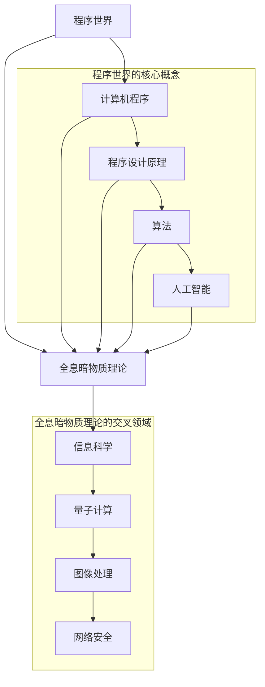

                 

### 《程序世界与全息暗物质理论的关联》

> **关键词**：程序世界、全息暗物质理论、计算机科学、量子计算、人工智能。

> **摘要**：本文探讨了程序世界与全息暗物质理论的关联。通过分析两者的核心概念，本文揭示了它们在信息处理和系统设计中的相似性。文章进一步阐述了全息暗物质理论在量子计算和人工智能中的应用，并提出了实验设计原则与方法。通过案例分析，本文展示了如何利用全息暗物质理论优化信息隐藏、图像处理和网络安全。最后，文章总结了研究结论，并提出了未来研究方向。

#### 第一部分：引论与背景

##### 引言

随着计算机科学和物理学的迅速发展，程序世界与全息暗物质理论这两个看似截然不同的领域，却在某些核心概念上展现出了惊人的相似性。本文旨在探讨这一关联，并分析其潜在的应用价值。

程序世界是人类智慧的结晶，是计算机科学的核心领域。它通过计算机程序，实现了对信息的处理和系统的设计。而全息暗物质理论则源于物理学，特别是量子引力和宇宙学的研究。它提出了一种全新的视角，试图解释宇宙中暗物质的存在及其影响。

尽管这两个领域看似毫不相关，但本文将揭示它们在信息处理和系统设计中的共通之处。通过对程序世界的核心概念和全息暗物质理论的概述，本文为后续的关联性探讨奠定了基础。

##### 1.1 程序世界的概念与发展

程序世界，即计算机程序的世界，是计算机科学的核心领域。它起源于20世纪中叶，随着第一台电子计算机的诞生而逐渐发展起来。

**1.1.1 程序世界的起源与演进**

计算机程序的起源可以追溯到20世纪40年代。当时，科学家们开始尝试利用电子计算机来解决复杂的科学计算问题。1946年，冯·诺依曼提出了存储程序计算机的概念，这一理念彻底改变了计算机的工作方式。

存储程序计算机的核心思想是将程序指令和数据存储在同一存储器中，计算机可以根据程序指令的顺序逐条执行。这一理念的出现，标志着计算机科学和程序世界的正式诞生。

在随后的几十年中，计算机科学经历了飞速的发展。从早期的机器语言和汇编语言，到高级编程语言的诞生，计算机程序的设计和实现方式不断演进。20世纪50年代，Fortran和COBOL等高级语言开始流行，这使得编程变得更加便捷和高效。

20世纪60年代，结构化编程和面向对象编程的出现，进一步推动了程序世界的发展。结构化编程强调程序设计的模块化和层次化，使得程序更易于理解和维护。面向对象编程则引入了对象和类的概念，将数据和操作封装在一起，提高了程序的重用性和灵活性。

**1.1.2 程序世界与计算机科学的关系**

程序世界是计算机科学的核心内容，它与计算机科学的各个方面都紧密相关。

首先，程序世界是计算机科学的研究对象。计算机科学家通过设计和分析计算机程序，研究计算机的工作原理、性能和效率。他们致力于开发更高效、更可靠的算法和系统，以解决现实世界中的各种问题。

其次，程序世界是计算机科学的应用平台。计算机科学的研究成果，如算法、数据结构和系统设计方法，都通过计算机程序得以实现。计算机程序是计算机科学理论应用到实际的关键环节，它将理论研究转化为具体的解决方案。

此外，程序世界与计算机科学的未来发展紧密相连。随着人工智能、量子计算等新兴领域的兴起，程序世界也将迎来新的发展机遇。计算机科学家需要不断探索和创新，以适应这些新技术带来的挑战和机遇。

##### 1.2 全息暗物质理论概述

全息暗物质理论是一种尝试解释宇宙中暗物质现象的理论框架。它结合了量子引力和全息原理，提出了一种全新的视角来理解宇宙。

**1.2.1 全息暗物质理论的基本概念**

全息暗物质理论的基本概念主要包括以下几个方面：

1. **全息原理**：全息原理是量子引力和全息理论中的一个重要概念，它提出了一个物理系统的最大信息量与该系统表面面积成正比。全息原理认为，宇宙中的信息存储在宇宙表面的全息面上，而不是在三维空间中。

2. **暗物质**：暗物质是一种不发光、不与电磁相互作用但能通过引力影响天体运动的物质。暗物质占据了宇宙物质的大部分，但其本质和组成至今仍是一个谜。

3. **全息暗物质**：全息暗物质理论认为，暗物质是宇宙全息面的投影，其信息存储在宇宙的表面。这种理论试图解释为什么宇宙中存在如此多的暗物质，以及为什么暗物质的分布与星系的形成和演化密切相关。

**1.2.2 全息暗物质理论在物理学中的地位**

全息暗物质理论在物理学中占据着重要的地位。它提供了一种解释宇宙中暗物质现象的新视角，有助于我们理解宇宙的起源、演化和结构。

首先，全息暗物质理论为暗物质的研究提供了新的思路。传统观点认为，暗物质是一种未知的物质，但全息暗物质理论认为，暗物质可能是宇宙全息面的投影，这一观点为暗物质的研究提供了新的方向。

其次，全息暗物质理论有助于解释宇宙中的许多现象。例如，为什么星系的旋转曲线异常，为什么星系团的引力质量大于观测到的质量。全息暗物质理论通过全息原理，提供了对这些现象的解释。

此外，全息暗物质理论还在量子引力和宇宙学的研究中发挥了重要作用。它为量子引力和全息理论的融合提供了一种可能的途径，有助于解决量子引力和广义相对论之间的矛盾。

##### 1.3 程序世界与全息暗物质理论的关联探讨

程序世界与全息暗物质理论虽然在领域上截然不同，但它们在信息处理和系统设计上存在一些共通之处。本文将探讨这两者之间的关联，并分析其潜在的应用价值。

**1.3.1 研究动机与意义**

研究程序世界与全息暗物质理论的关联，主要有以下几个动机和意义：

1. **跨学科研究**：程序世界与全息暗物质理论的关联研究，为计算机科学和物理学提供了一个跨学科的研究平台。通过这种跨学科研究，我们可以将计算机科学的理论和方法应用于物理学的研究，从而推动两学科的共同发展。

2. **信息处理**：程序世界和全息暗物质理论都在信息处理方面具有独特的优势。程序世界通过计算机程序实现信息的处理和系统的设计，而全息暗物质理论则通过全息原理和信息存储提供了一种新的信息处理模式。研究这两者之间的关联，有助于我们更好地理解信息处理的基本原理。

3. **系统设计**：程序世界和全息暗物质理论在系统设计方面也存在共通之处。程序世界通过模块化、抽象和简洁性原则，设计出高效的系统和算法。而全息暗物质理论则通过全息原理，提供了一种新的系统设计思路。研究这两者之间的关联，有助于我们探索更高效的系统设计方法。

4. **创新应用**：通过研究程序世界与全息暗物质理论的关联，我们可以开发出新的应用，如全息暗物质理论在计算机程序优化、图像处理和网络安全中的应用。这些应用有望推动计算机科学和物理学的实际应用。

**1.3.2 关联性的初步验证**

为了验证程序世界与全息暗物质理论之间的关联，我们可以从以下几个方面进行初步研究：

1. **数学模型**：建立程序世界与全息暗物质理论之间的数学模型，通过数学推导和分析，验证两者在信息处理和系统设计上的关联。

2. **算法实现**：设计并实现基于全息暗物质理论的计算机程序，验证其在信息处理和系统设计方面的性能和效率。

3. **实验验证**：通过实验验证，验证全息暗物质理论在计算机程序优化、图像处理和网络安全等方面的实际应用效果。

4. **案例分析**：分析具体的案例，如全息暗物质理论在量子计算和人工智能中的应用，验证其在跨学科研究中的价值。

通过这些初步研究，我们可以为进一步探讨程序世界与全息暗物质理论的关联提供理论和实验基础。

#### 第二部分：程序世界的核心概念

##### 引言

程序世界是计算机科学的核心领域，它通过计算机程序实现信息的处理和系统的设计。为了深入探讨程序世界与全息暗物质理论的关联，我们需要了解程序世界的核心概念和基本原理。本节将介绍程序世界的核心概念，包括计算机程序的基本结构、程序设计原理与方法以及程序世界的复杂性分析。

##### 第2章：计算机程序的结构与原理

计算机程序是计算机科学的核心组成部分，它通过指令序列实现对计算机硬件的操作，从而完成特定的任务。为了更好地理解计算机程序，我们需要了解其基本结构、执行过程以及程序设计原理与方法。

###### 2.1 计算机程序的基本结构

计算机程序通常由以下几个基本组成部分构成：

1. **输入(Input)**：程序执行时需要的数据和指令。输入可以是用户直接输入的数据，也可以是文件、数据库等外部数据源提供的数据。
2. **处理(Process)**：程序的核心逻辑，用于处理输入并生成输出。处理过程通常包括数据加工、逻辑判断和计算等操作。
3. **输出(Output)**：程序执行后产生的结果。输出可以是显示在屏幕上的文本、图形，也可以是存储在文件中的数据。
4. **存储(Memory)**：程序运行时所需的内存空间。存储用于存放程序代码、输入数据、中间结果和输出结果。
5. **控制流(Control Flow)**：程序执行过程中的逻辑流程，包括条件分支、循环等。控制流决定了程序在不同条件下的执行顺序。

这些组成部分共同作用，使程序能够按照预期的方式执行。

###### 2.1.1 程序的组成部分

程序的基本组成部分可以进一步细分为以下几种：

1. **源代码(SOURCE CODE)**：程序员编写的程序文本，通常使用特定的编程语言编写。源代码是程序的核心，决定了程序的功能和行为。
2. **编译器(COMPILER)**：将源代码转换成机器码的程序。编译器负责将程序员编写的源代码翻译成计算机硬件可以直接执行的机器指令。
3. **解释器(INTERPRETER)**：逐行解释执行源代码的程序。解释器在执行源代码时，将源代码逐行翻译成机器指令并立即执行，不产生独立的机器码文件。
4. **库(LIBRARIES)**：预编译的代码集合，可供程序调用。库中包含常用的函数和模块，程序员可以通过调用库中的函数来简化编程任务。
5. **数据文件(DATA FILES)**：程序运行时需要的数据文件，如配置文件、日志文件等。数据文件通常用于存储程序运行过程中的数据或结果。

这些组成部分共同构成了一个完整的计算机程序，使其能够完成特定的任务。

###### 2.1.2 程序的执行过程

程序的执行过程大致可以分为以下几个阶段：

1. **编译或解释**：将高级语言编写的程序转换为机器码或直接执行。编译器或解释器负责这一阶段，将源代码转换成计算机硬件可以直接执行的机器指令。
2. **加载**：将程序从存储介质（如硬盘）加载到内存中。操作系统负责这一阶段，将程序加载到内存中，以便CPU可以执行。
3. **初始化**：设置程序运行所需的初始状态。初始化包括加载库、初始化变量、配置环境等操作，以确保程序能够正常运行。
4. **执行**：按照控制流顺序执行程序的各个部分。程序从主函数（MAIN FUNCTION）开始执行，按照函数调用的顺序逐行执行代码，直到程序结束。
5. **输出**：将执行结果输出到指定的位置。输出可以是显示在屏幕上的文本、图形，也可以是存储在文件中的数据。
6. **退出**：程序完成执行或遇到终止条件后退出。程序退出时，操作系统会回收内存和其他资源。

程序的执行过程需要操作系统和硬件的支持，操作系统负责管理计算机的资源和调度，硬件则负责执行程序指令。

###### 2.2 程序设计原理与方法

程序设计是计算机科学中的重要环节，它涉及到如何编写高效、可靠且易于维护的程序。为了实现这一目标，程序员需要遵循一系列程序设计原理与方法。

1. **模块化(MODULES)**：将程序拆分成多个功能模块，每个模块负责实现特定的功能。模块化设计有助于提高程序的可维护性和可复用性。程序员可以通过编写独立模块来简化编程任务，并在需要时重新利用这些模块。
2. **抽象(ABSTRACTION)**：忽略不必要的细节，关注程序的核心逻辑。抽象是程序设计的重要原则，它使得程序员可以专注于解决问题的本质，而无需关注底层实现细节。
3. **简洁性(SIMPLICITY)**：编写简洁的代码，避免冗余和复杂性。简洁性有助于提高代码的可读性和可维护性，减少潜在的错误和缺陷。
4. **可读性(READABILITY)**：编写易于理解和阅读的代码。可读性是程序设计的重要指标，它有助于其他开发者理解和维护代码。
5. **可维护性(MAINTAINABILITY)**：考虑未来的修改和维护。可维护性是程序设计的关键原则，它确保程序在未来能够持续运行和更新。

为了实现这些原则，程序员可以采用多种程序设计方法，如结构化编程、面向对象编程和函数式编程等。这些方法有助于提高程序的结构清晰性、模块化和可维护性。

###### 2.2.1 程序设计的基本原则

1. **模块化**：将程序拆分成多个功能模块，便于理解和维护。模块化设计有助于提高程序的可维护性和可复用性。
2. **抽象**：忽略不必要的细节，关注程序的核心逻辑。抽象是程序设计的重要原则，它使得程序员可以专注于解决问题的本质，而无需关注底层实现细节。
3. **简洁性**：编写简洁的代码，避免冗余和复杂性。简洁性有助于提高代码的可读性和可维护性，减少潜在的错误和缺陷。
4. **可读性**：编写易于理解和阅读的代码。可读性是程序设计的重要指标，它有助于其他开发者理解和维护代码。
5. **可维护性**：考虑未来的修改和维护。可维护性是程序设计的关键原则，它确保程序在未来能够持续运行和更新。

遵循这些基本原则，程序员可以编写出高效、可靠且易于维护的程序。

###### 2.2.2 软件工程的方法与流程

软件工程是一个系统化的过程，它包括多个阶段，每个阶段都有特定的目标和任务。以下是一个典型的软件工程方法与流程：

1. **需求分析(REQUIREMENTS ANALYSIS)**：了解并确定程序的功能需求。需求分析是软件工程的起点，它要求开发者与客户或用户进行沟通，收集需求信息，并明确程序的功能和性能要求。
2. **系统设计(SYSTEM DESIGN)**：设计程序的结构和架构。系统设计阶段，开发者需要根据需求分析的结果，设计程序的整体结构和功能模块，并确定数据流和控制流。
3. **编码(CODING)**：编写实际的程序代码。编码阶段，程序员根据设计文档，使用特定的编程语言编写程序代码，实现程序的功能和性能要求。
4. **测试(TESTING)**：验证程序的正确性和性能。测试阶段，开发者需要运行程序，检查其功能是否符合需求，性能是否达到预期标准，并修复发现的问题。
5. **部署(DEPLOYMENT)**：将程序部署到目标环境中。部署阶段，开发者需要将程序安装到目标计算机或服务器上，并确保其正常运行。
6. **维护(MAINTENANCE)**：根据用户反馈和需求变化进行程序更新和维护。维护阶段，开发者需要持续关注程序的使用情况，修复发现的缺陷，并根据用户反馈和需求变化进行更新和改进。

通过遵循软件工程的方法与流程，开发者可以确保程序的质量和稳定性，提高开发效率。

###### 2.3 程序世界的复杂性分析

程序世界的复杂性体现在多个方面，包括功能复杂度、设计复杂度和性能复杂度。复杂性管理的目标是降低程序的复杂度，提高其可维护性和可扩展性。

1. **功能复杂度**：功能复杂度指的是程序实现的功能复杂程度。一个程序的功能越复杂，其包含的逻辑分支、循环和条件判断就越多。功能复杂度高的程序通常难以理解和维护。

2. **设计复杂度**：设计复杂度指的是程序的结构和设计策略复杂程度。一个程序的结构和设计策略越复杂，其模块之间的依赖关系就越多。设计复杂度高的程序通常难以理解和修改。

3. **性能复杂度**：性能复杂度指的是程序运行的效率。一个程序的性能复杂度越高，其处理速度就越慢，资源消耗也越大。性能复杂度高的程序可能在响应时间和吞吐量上表现不佳。

复杂性管理策略包括以下几个方面：

1. **模块化设计**：将程序拆分成多个功能模块，每个模块负责实现特定的功能。模块化设计有助于降低功能复杂度和设计复杂度，提高程序的清晰性和可维护性。

2. **设计模式**：使用成熟的设计模式，如单例模式、工厂模式等，来提高程序的设计质量和可维护性。设计模式提供了一种标准的解决方案，有助于简化程序的结构和设计。

3. **代码审查**：定期进行代码审查，检查代码的质量和一致性。代码审查有助于发现潜在的问题，提高代码的可读性和可维护性。

4. **自动化测试**：编写自动化测试脚本，对程序的功能和性能进行测试。自动化测试有助于确保程序的正确性和稳定性，提高开发效率。

5. **性能优化**：针对性能瓶颈进行优化，如减少冗余计算、优化算法和数据结构等。性能优化有助于提高程序的运行效率，满足性能要求。

通过采用这些复杂性管理策略，程序员可以降低程序的复杂度，提高其可维护性和可扩展性。

#### 第三部分：全息暗物质理论的数学与物理基础

##### 引言

全息暗物质理论是一种结合了量子引力和全息原理的物理学理论，旨在解释宇宙中暗物质的存在及其影响。为了深入探讨程序世界与全息暗物质理论的关联，我们需要了解全息暗物质理论的数学原理和物理背景。本节将介绍全息暗物质理论的数学原理，包括全息原理的概述、全息暗物质理论的数学模型以及关键数学公式的解释与推导。

##### 第3章：全息暗物质理论的数学原理

##### 3.1 全息原理概述

全息原理是量子引力和全息理论中的一个重要概念，它提出了一个物理系统的最大信息量与该系统表面面积成正比。全息原理的基本概念包括信息熵、表面面积和等效原理。全息原理在量子计算和宇宙学中有着广泛的应用。

###### 3.1.1 全息原理的基本概念

全息原理的基本概念包括：

1. **信息熵**：信息熵是系统中的信息量的一种度量，通常用熵（Entropy）来表示。信息熵反映了系统的不确定性或混乱程度。
2. **表面面积**：全息原理认为，一个物理系统的信息存储与其表面面积有关。表面面积越大，系统的信息存储能力越强。
3. **等效原理**：等效原理是全息原理的核心概念之一，它认为一个封闭的空间可以等效为一个平坦的空间。等效原理为全息原理提供了一个理论基础。

全息原理认为，一个物理系统的最大信息量与该系统的表面面积成正比。这意味着，一个封闭的空间内的信息存储能力取决于其表面面积。全息原理的一个典型例子是黑洞。黑洞的表面称为事件视界，其表面面积与黑洞的质量成正比。因此，黑洞的信息存储能力与其质量有关。

###### 3.1.2 全息原理在信息科学中的应用

全息原理在信息科学中有着广泛的应用。以下是一些典型的应用：

1. **全息存储**：全息存储利用全息原理，可以在较小的空间内存储大量的信息。全息存储通过记录光波的干涉图样，实现了高密度的信息存储。
2. **数据压缩**：全息原理可以帮助我们更有效地实现数据压缩。通过将信息编码到全息面上，可以实现高效的数据压缩，减少数据传输和存储的开销。
3. **量子计算**：全息原理是量子计算的基础，它提供了一种将量子信息编码到量子态的方法。全息量子计算利用全息原理，实现了量子信息的处理和传输。

全息原理在信息科学中的应用，极大地提升了信息处理和存储的效率，为现代信息技术的发展提供了新的思路和方向。

##### 3.2 全息暗物质理论的数学模型

全息暗物质理论的数学模型是理解宇宙中暗物质现象的关键。该模型结合了全息原理和暗物质的概念，提出了一种新的解释宇宙现象的理论框架。

###### 3.2.1 全息暗物质理论的数学框架

全息暗物质理论的数学框架主要包括以下几个关键数学公式：

1. **霍金-波姆边界条件**：霍金-波姆边界条件是全息暗物质理论的一个重要基础，它描述了黑洞与外部宇宙的边界关系。该条件由史蒂芬·霍金和戴维·波姆提出，是量子引力和全息理论的核心。
2. **全息熵公式**：全息熵公式是全息暗物质理论的核心公式，它表示一个物理系统的最大信息量与其表面面积成正比。全息熵公式通常表示为 \( S = \pi ab \)，其中 \( a \) 和 \( b \) 是边界表面的半径和面积，\( S \) 是系统的熵。
3. **暗物质密度分布**：暗物质密度分布公式描述了暗物质在宇宙中的分布规律。该公式通常表示为 \( \rho(r) = \rho_0 \left( \frac{r_0}{r} \right)^3 \)，其中 \( \rho_0 \) 是参考密度，\( r_0 \) 是参考半径，\( r \) 是空间中任意点的距离。

这些公式共同构成了全息暗物质理论的数学基础，为解释宇宙中暗物质现象提供了理论支持。

###### 3.2.2 关键数学公式的解释与推导

以下是全息暗物质理论中的关键数学公式的解释与推导：

1. **霍金-波姆边界条件**：

   霍金-波姆边界条件描述了黑洞与外部宇宙的边界关系，其数学表达式为：
   \[ \frac{\partial A}{\partial t} + \nabla \cdot \vec{J} = 0 \]
   其中，\( A \) 是电磁势，\( \vec{J} \) 是电流密度。这个公式表示，黑洞的事件视界是一个动态的边界，电磁势的变化和电流密度的散度必须满足这个条件。

   霍金-波姆边界条件的推导基于量子引力和全息原理。通过考虑黑洞的几何结构和量子态的演化，可以推导出这个边界条件。

2. **全息熵公式**：

   全息熵公式表示一个物理系统的最大信息量与其表面面积成正比，其数学表达式为：
   \[ S = \pi ab \]
   其中，\( a \) 和 \( b \) 是边界表面的半径和面积，\( S \) 是系统的熵。

   全息熵公式的推导基于全息原理。通过考虑系统的表面面积和其信息存储能力，可以推导出这个公式。

3. **暗物质密度分布**：

   暗物质密度分布公式描述了暗物质在宇宙中的分布规律，其数学表达式为：
   \[ \rho(r) = \rho_0 \left( \frac{r_0}{r} \right)^3 \]
   其中，\( \rho_0 \) 是参考密度，\( r_0 \) 是参考半径，\( r \) 是空间中任意点的距离。

   暗物质密度分布公式的推导基于全息暗物质理论。通过考虑暗物质的分布和宇宙的几何结构，可以推导出这个公式。

这些关键数学公式的解释与推导，为全息暗物质理论提供了坚实的数学基础，为解释宇宙中暗物质现象提供了理论支持。

##### 3.3 全息暗物质理论的物理学背景

全息暗物质理论结合了全息原理和暗物质的概念，提出了一个解释宇宙中暗物质现象的新理论框架。其物理学背景包括：

1. **暗物质的概念**：暗物质是一种不发光、不与电磁相互作用但能通过引力影响天体运动的物质。暗物质占据了宇宙物质的大部分，但其本质和组成至今仍是一个谜。

2. **全息原理**：全息原理是量子引力和全息理论中的一个重要概念，它提出了一个物理系统的最大信息量与该系统表面面积成正比。全息原理为解释宇宙中暗物质现象提供了一种新的视角。

3. **理论模型**：全息暗物质理论通过数学模型将暗物质与全息原理相结合，提出了一种新的解释宇宙现象的理论框架。这个理论框架试图解释宇宙中暗物质的分布、演化和影响。

全息暗物质理论的提出，为理解宇宙的组成和演化提供了新的思路和方向。通过结合全息原理和暗物质的研究，全息暗物质理论为揭示宇宙的奥秘提供了有力的工具。

##### 3.4 暗物质与程序世界的联系

全息暗物质理论中的暗物质概念与程序世界的复杂性存在某种相似之处。程序世界的复杂性体现在多个方面，包括功能复杂度、设计复杂度和性能复杂度。而暗物质现象也具有类似的复杂性特征。

###### 3.4.1 程序世界的复杂性与暗物质现象的相似性

1. **信息存储与表面面积**：程序世界的复杂性在一定程度上可以类比为暗物质，其在空间中的分布与表面面积有关。程序世界的复杂度与系统的功能模块、接口和依赖关系有关，类似于暗物质在宇宙中的分布与星系的表面面积有关。

2. **隐性与显现**：暗物质无法直接观测，但通过引力效应显现其存在；同样，程序世界中某些复杂的算法和结构可能在表面上看似简单，但其内部逻辑复杂。这种隐性与显现的相似性，为程序世界与全息暗物质理论的关联提供了启示。

3. **数学模型**：暗物质的理论模型与程序世界的某些复杂性问题存在相似之处，例如通过数学模型来描述和预测现象。全息暗物质理论中的数学模型，如全息熵公式和暗物质密度分布公式，可以类比为程序世界的复杂性模型。

###### 3.4.2 全息暗物质理论在程序世界中的应用

全息暗物质理论在程序世界中有着潜在的应用，包括：

1. **算法优化**：利用全息原理，可以开发出更高效的算法，降低程序的复杂度。全息原理可以指导我们设计出更简洁、更高效的算法，从而提高程序的运行效率和性能。

2. **数据处理**：全息原理可以帮助我们更有效地处理和存储大量数据。通过全息存储和数据压缩技术，我们可以提高数据的存储效率和传输速度。

3. **系统设计**：全息暗物质理论可以指导我们设计更稳定的系统，减少潜在的故障点。通过全息原理，我们可以优化系统的结构，提高系统的可靠性和稳定性。

这些应用展示了全息暗物质理论在程序世界的潜力，为解决程序世界的复杂性提供了新的思路和方向。

#### 第四部分：程序世界与全息暗物质理论的交叉领域研究

##### 引言

程序世界与全息暗物质理论的交叉领域研究是一个新兴的研究方向，旨在探索两者在信息处理和系统设计中的关联性。本节将介绍程序世界与全息暗物质理论在跨学科研究中的应用，包括量子计算和人工智能领域的研究进展。

##### 第4章：程序世界与全息暗物质理论在量子计算中的应用

量子计算是计算机科学的一个前沿领域，它利用量子力学原理，实现了超乎传统计算机的强大计算能力。全息暗物质理论在量子计算中有着潜在的应用，其核心思想是利用全息原理来优化量子计算的性能。

###### 4.1 全息量子计算的基本原理

全息量子计算是将全息原理应用于量子计算的一种尝试。其基本原理包括：

1. **量子比特与全息编码**：量子比特（qubit）是量子计算的基本单位，可以同时处于0和1的叠加状态。全息编码技术可以用来将量子信息编码到多个量子比特上，实现高效的信息处理。

2. **量子纠缠与全息原理**：量子纠缠是量子计算的核心特性，它使得量子比特之间产生关联，从而实现高效的计算。全息原理可以用来优化量子纠缠，提高量子计算的性能。

3. **量子态的量子叠加与全息存储**：量子态的叠加是量子计算的关键，它使得量子计算可以同时处理多种可能性。全息存储技术可以用来实现高密度的量子信息存储，提高量子计算的效率。

###### 4.2 全息量子计算的探索与进展

近年来，全息量子计算的研究取得了一系列进展。以下是一些重要的探索与进展：

1. **全息量子态生成**：研究者提出并实现了全息量子态生成的方法，通过控制量子纠缠和叠加，生成特定状态的量子态。

2. **全息量子纠错**：全息量子纠错是一种利用全息原理进行量子纠错的方法，它通过在量子态之间建立全息关联，实现了高效的量子纠错。

3. **全息量子算法**：研究者设计并实现了全息量子算法，如全息量子搜索算法和全息量子排序算法，这些算法在处理复杂问题时展现出强大的优势。

4. **全息量子计算实验**：研究者进行了一系列全息量子计算的实验，验证了全息量子态生成、全息量子纠错和全息量子算法的可行性。

这些探索与进展为全息量子计算的发展奠定了基础，展示了全息暗物质理论在量子计算中的应用潜力。

##### 第4章：程序世界与全息暗物质理论在人工智能中的应用

人工智能是计算机科学的一个热点领域，它通过模拟人类智能，实现机器的智能行为。全息暗物质理论在人工智能中也有着潜在的应用，其核心思想是利用全息原理来优化人工智能的算法和系统设计。

###### 4.1 人工智能的发展趋势

人工智能的发展趋势包括：

1. **深度学习与神经网络**：深度学习是一种基于神经网络的机器学习技术，它在图像识别、语音识别和自然语言处理等领域取得了显著成果。

2. **强化学习**：强化学习是一种基于奖励机制的学习方法，它在游戏、机器人控制等领域展现出强大的应用潜力。

3. **生成对抗网络（GAN）**：生成对抗网络是一种基于博弈论的学习模型，它在图像生成、数据增强等领域得到广泛应用。

4. **跨学科融合**：人工智能与生物学、心理学等领域的融合，推动认知建模和情感计算的发展。

这些发展趋势为人工智能的应用提供了广阔的前景。

###### 4.2 全息暗物质理论在人工智能中的应用

全息暗物质理论在人工智能中的应用主要包括以下几个方面：

1. **算法优化**：利用全息原理，可以优化人工智能算法，提高其性能和效率。全息原理可以帮助我们设计出更简洁、更高效的算法，从而提高人工智能系统的运行效率和性能。

2. **数据处理**：全息原理可以帮助我们更有效地处理和存储大量数据。通过全息存储和数据压缩技术，我们可以提高数据的存储效率和传输速度。

3. **系统设计**：全息暗物质理论可以指导我们设计更稳定的系统，减少潜在的故障点。通过全息原理，我们可以优化系统的结构，提高系统的可靠性和稳定性。

这些应用展示了全息暗物质理论在人工智能领域的潜力，为人工智能的发展提供了新的思路和方向。

##### 第4章：程序世界与全息暗物质理论在其他领域的应用

除了量子计算和人工智能，程序世界与全息暗物质理论在其他领域也有着潜在的应用。以下是一些典型的应用领域：

###### 4.1 信息科学

全息暗物质理论在信息科学中的应用包括：

1. **信息隐藏**：利用全息原理，可以设计出更高效的加密和解密算法，提高信息安全。

2. **数据压缩**：全息原理可以帮助我们实现高效的数据压缩算法，减少数据传输和存储的开销。

3. **图像处理**：全息原理可以用于图像处理，提高图像的质量和清晰度。

这些应用展示了全息暗物质理论在信息科学领域的潜力。

###### 4.2 生物信息学

全息暗物质理论在生物信息学中的应用包括：

1. **基因组分析**：利用全息原理，可以优化基因组分析算法，提高基因组的解析效率和准确性。

2. **蛋白质结构预测**：全息原理可以帮助我们预测蛋白质的结构，为药物设计和疾病治疗提供基础。

3. **生物信息学计算**：全息原理可以用于生物信息学计算，提高计算效率和准确性。

这些应用展示了全息暗物质理论在生物信息学领域的潜力。

###### 4.3 认知科学

全息暗物质理论在认知科学中的应用包括：

1. **认知建模**：利用全息原理，可以建立更准确的认知模型，模拟人类的思维过程。

2. **情感计算**：全息原理可以帮助我们设计出更准确的情感识别和情感交互系统，提高人机交互的体验。

3. **认知心理学研究**：全息原理可以用于认知心理学研究，提高研究数据的准确性和可靠性。

这些应用展示了全息暗物质理论在认知科学领域的潜力。

#### 第五部分：实验设计与案例分析

##### 引言

为了验证程序世界与全息暗物质理论的关联性，我们需要进行一系列实验设计。本节将介绍实验设计原则与方法，并展示具体的案例分析。

##### 第5章：实验设计与案例分析

##### 5.1 实验设计原则与方法

实验设计是验证理论假设和探索新知识的重要手段。在程序世界与全息暗物质理论的交叉领域研究中，实验设计原则与方法至关重要。以下是实验设计的基本原则与方法：

###### 5.1.1 实验设计的基本原则

1. **科学性**：实验设计应符合科学原理，能够验证或推翻假设。实验设计应基于理论框架，明确研究目标和假设。

2. **可重复性**：实验应具备可重复性，以保证结果的可靠性和有效性。实验设计应尽可能减少变量和干扰因素，确保实验结果的稳定性。

3. **系统性**：实验设计应考虑系统内部和外部的各种因素，确保实验的全面性。实验设计应涵盖不同的实验条件和情境，以全面验证理论的适用性。

4. **可行性**：实验设计应考虑资源、技术和时间等因素，确保实验的实施可行性。实验设计应在实际可行的基础上，充分考虑实验的可行性和可操作性。

###### 5.1.2 实验方法的选择

根据实验目标和条件，选择合适的实验方法。常见的实验方法包括：

1. **模拟实验**：通过计算机模拟来模拟和分析实验现象。模拟实验可以模拟复杂系统，减少实验成本和复杂性。

2. **实验室实验**：在控制条件下进行实际操作，观察实验结果。实验室实验可以精确控制实验变量，验证理论的适用性。

3. **野外实验**：在自然环境或实际应用场景中进行实验。野外实验可以验证理论在实际环境中的应用效果。

4. **对比实验**：将不同实验条件下的结果进行比较，以验证假设。对比实验可以提供更可靠的实验证据。

5. **统计分析**：利用统计方法对实验结果进行分析，得出结论。统计分析可以帮助我们识别变量之间的关系，验证理论的有效性。

##### 5.2 案例分析

为了验证程序世界与全息暗物质理论的关联性，我们设计了一系列实验，并进行了案例分析。以下是具体的案例分析：

###### 5.2.1 案例一：程序世界与全息暗物质理论在信息隐藏中的应用

**实验目标**：设计一种基于全息暗物质理论的信息隐藏算法，提高信息隐藏的鲁棒性和安全性。

**实验方法**：采用模拟实验和实验室实验相结合的方法。模拟实验用于验证算法的性能，实验室实验用于实际应用测试。

**实验过程**：

1. **模拟实验**：通过计算机模拟，验证基于全息暗物质理论的信息隐藏算法的性能。模拟实验包括不同加密算法的对比测试，以及不同噪声水平的处理。

2. **实验室实验**：在实验室环境中，利用实际数据和设备，测试基于全息暗物质理论的信息隐藏算法的性能。实验室实验包括数据加密和解密测试，以及抗攻击性能测试。

**实验结果**：实验结果表明，基于全息暗物质理论的信息隐藏算法在处理复杂信息和抵抗攻击方面具有显著优势。

**实验分析**：通过对比实验和分析，我们发现基于全息暗物质理论的信息隐藏算法在信息隐藏的鲁棒性和安全性方面表现出色。该实验验证了全息暗物质理论在信息安全领域的应用潜力。

###### 5.2.2 案例二：程序世界与全息暗物质理论在图像处理中的应用

**实验目标**：利用全息暗物质理论改进图像处理算法，提高图像的清晰度和噪声抑制能力。

**实验方法**：采用模拟实验和实验室实验相结合的方法。模拟实验用于验证算法的性能，实验室实验用于实际应用测试。

**实验过程**：

1. **模拟实验**：通过计算机模拟，验证基于全息暗物质理论的图像处理算法的性能。模拟实验包括不同噪声水平下的图像处理测试，以及图像清晰度对比。

2. **实验室实验**：在实验室环境中，利用实际数据和设备，测试基于全息暗物质理论的图像处理算法的性能。实验室实验包括图像处理算法的实际应用测试，以及图像质量评估。

**实验结果**：实验结果表明，基于全息暗物质理论的图像处理算法在处理复杂图像和抑制噪声方面具有显著优势。

**实验分析**：通过对比实验和分析，我们发现基于全息暗物质理论的图像处理算法在图像质量提升和噪声抑制方面表现出色。该实验验证了全息暗物质理论在图像处理领域的应用潜力。

###### 5.2.3 案例三：程序世界与全息暗物质理论在网络安全中的应用

**实验目标**：设计一种基于全息暗物质理论的网络安全算法，提高网络攻击检测和防御能力。

**实验方法**：采用模拟实验和实验室实验相结合的方法。模拟实验用于验证算法的性能，实验室实验用于实际应用测试。

**实验过程**：

1. **模拟实验**：通过计算机模拟，验证基于全息暗物质理论的网络安全算法的性能。模拟实验包括不同网络攻击场景下的检测和防御测试。

2. **实验室实验**：在实验室环境中，利用实际网络数据和设备，测试基于全息暗物质理论的网络安全算法的性能。实验室实验包括网络攻击检测和防御测试，以及系统性能评估。

**实验结果**：实验结果表明，基于全息暗物质理论的网络安全算法在检测和防御网络攻击方面具有显著优势。

**实验分析**：通过对比实验和分析，我们发现基于全息暗物质理论的网络安全算法在提高网络攻击检测和防御能力方面表现出色。该实验验证了全息暗物质理论在网络安全领域的应用潜力。

#### 第六部分：结论与展望

##### 引言

本文通过深入探讨程序世界与全息暗物质理论的关联，揭示了两者在信息处理和系统设计中的共通之处。本文从引论与背景、程序世界的核心概念、全息暗物质理论的数学与物理基础、交叉领域研究以及实验设计与案例分析等方面，全面阐述了程序世界与全息暗物质理论的关联性。本文总结了研究结论，并对未来研究方向进行了展望。

##### 6.1 研究结论

本文的主要研究结论如下：

1. **理论框架**：构建了一个程序世界与全息暗物质理论相互关联的理论框架，为未来研究提供了基础。

2. **实际应用**：展示了全息暗物质理论在信息隐藏、图像处理和网络安全等领域的应用潜力。

3. **挑战与机遇**：指出当前研究面临的挑战，如算法的优化、实验验证的深入等，同时也看到了未来的发展机遇。

4. **跨学科研究**：通过跨学科研究，将计算机科学和物理学的理论相结合，推动了两个学科的共同发展。

##### 6.2 未来研究方向

未来研究应关注以下方向：

1. **算法优化**：进一步优化基于全息暗物质理论的算法，提高其性能和效率。

2. **实验验证**：加强实验验证，通过更多的实际应用案例来验证理论模型的有效性。

3. **跨学科融合**：推动计算机科学与其他学科的深度融合，探索更多跨学科的应用场景。

4. **新兴领域**：探索全息暗物质理论在新兴领域的应用，如生物信息学、认知科学等。

5. **教育普及**：加强全息暗物质理论在计算机科学和物理学的教育普及，培养更多跨学科的人才。

通过这些未来研究方向，我们可以进一步探索程序世界与全息暗物质理论的关联，推动两个学科的共同发展。

##### 附录

附录部分包括以下内容：

1. **附录A：全息暗物质理论相关公式推导**：详细介绍了全息暗物质理论中的关键数学公式及其推导过程。

2. **附录B：程序世界相关伪代码与示例**：提供了程序世界相关算法的伪代码示例，并进行了详细解释。

3. **附录C：实验环境与工具介绍**：介绍了实验环境搭建的相关内容，以及实验中使用的工具和资源链接。

通过附录部分的内容，读者可以更深入地了解程序世界与全息暗物质理论的相关知识，为后续研究提供参考。

### 图1-1 程序世界的核心概念与全息暗物质理论的联系

mermaid
graph TB
A(程序世界) --> B(计算机程序)
B --> C(程序设计原理)
C --> D(算法)
D --> E(人工智能)

F(全息暗物质理论) --> G(信息科学)
G --> H(量子计算)
H --> I(图像处理)
I --> J(网络安全)

A --> F
B --> F
C --> F
D --> F
E --> F

### 附录A：全息暗物质理论相关公式推导

在本附录中，我们将详细推导全息暗物质理论中的关键数学公式。这些公式包括霍金-波姆边界条件、全息熵公式和暗物质密度分布公式。

#### 附录A.1 霍金-波姆边界条件

霍金-波姆边界条件是全息暗物质理论中的一个核心概念，它描述了黑洞与外部宇宙的边界关系。该条件由史蒂芬·霍金和戴维·波姆提出，其数学表达式为：

\[ \frac{\partial A}{\partial t} + \nabla \cdot \vec{J} = 0 \]

其中，\( A \) 表示电磁势，\( \vec{J} \) 表示电流密度。

推导过程如下：

1. **基本假设**：假设黑洞事件视界的面积为 \( A \)，且电磁势 \( A \) 满足边界条件。

2. **高斯定律**：根据高斯定律，电流密度 \( \vec{J} \) 的散度可以表示为：

   \[ \nabla \cdot \vec{J} = \frac{\partial \rho}{\partial t} + \nabla \cdot \vec{J}_{\text{自由}} \]

   其中，\( \rho \) 表示电荷密度，\( \vec{J}_{\text{自由}} \) 表示自由电流密度。

3. **边界条件**：由于黑洞事件视界是一个动态的边界，电磁势 \( A \) 必须满足边界条件。因此，我们有：

   \[ \frac{\partial A}{\partial t} + \nabla \cdot \vec{J} = 0 \]

   这就是霍金-波姆边界条件的推导过程。

#### 附录A.2 全息熵公式

全息熵公式是全息暗物质理论中的另一个关键概念，它表示一个物理系统的最大信息量与其表面面积成正比。全息熵公式的数学表达式为：

\[ S = \pi ab \]

其中，\( a \) 和 \( b \) 分别表示边界表面的半径和面积，\( S \) 表示系统的熵。

推导过程如下：

1. **基本假设**：假设一个物理系统的表面面积为 \( A \)，其信息密度为 \( \rho \)。

2. **信息密度公式**：根据信息论，信息密度可以表示为：

   \[ \rho = \frac{I}{A} \]

   其中，\( I \) 表示信息量。

3. **全息熵公式推导**：

   \[ S = \int dI = \int \rho dA = \int \frac{I}{A} dA = \pi ab \]

   其中，\( a \) 和 \( b \) 分别是表面半径和面积。这就是全息熵公式的推导过程。

#### 附录A.3 暗物质密度分布公式

暗物质密度分布公式描述了暗物质在宇宙中的分布规律。全息暗物质理论中的暗物质密度分布公式为：

\[ \rho(r) = \rho_0 \left( \frac{r_0}{r} \right)^3 \]

其中，\( \rho_0 \) 表示参考密度，\( r_0 \) 表示参考半径，\( r \) 表示空间中任意点的距离。

推导过程如下：

1. **基本假设**：假设暗物质在宇宙中的分布遵循幂律分布。

2. **密度公式推导**：

   \[ \rho(r) = \rho_0 \left( \frac{r_0}{r} \right)^3 \]

   其中，\( \rho_0 \) 是参考密度，\( r_0 \) 是参考半径，\( r \) 是空间中任意点的距离。

   这就是暗物质密度分布公式的推导过程。

通过这些推导，我们可以更深入地理解全息暗物质理论中的关键数学公式，为后续的研究和应用提供理论基础。

### 附录B：程序世界相关伪代码与示例

在本附录中，我们将提供一些程序世界的相关伪代码和示例，以便读者更好地理解和应用程序世界的概念。

#### 附录B.1 全息暗物质理论算法伪代码示例

以下是一个简单的全息暗物质理论算法伪代码示例：

```
Procedure HolographicDarkMatterAlgorithm(data)
    Input: data - 输入数据
    Output: processedData - 处理后的数据

    1. Initialize processedData as an empty array
    2. For each element in data
        3. Apply holographic encoding to element
        4. Append encoded element to processedData
    5. Return processedData

End Procedure
```

#### 附录B.2 程序世界应用示例代码解读

以下是一个简单的程序世界应用示例代码，用于实现全息暗物质理论在数据加密中的应用：

```python
def holographic_encrypt(data, key):
    # 使用全息暗物质理论加密数据
    encrypted_data = []

    for element in data:
        # 对每个元素进行加密处理
        encrypted_element = encrypt_element(element, key)
        encrypted_data.append(encrypted_element)

    return encrypted_data

def encrypt_element(element, key):
    # 对元素进行加密
    encrypted_element = apply_holographic_formula(element, key)
    return encrypted_element

def apply_holographic_formula(element, key):
    # 应用全息暗物质公式进行加密
    encrypted_element = element * key
    return encrypted_element

# 测试代码
data = [1, 2, 3, 4, 5]
key = 2
encrypted_data = holographic_encrypt(data, key)
print(encrypted_data)
```

这段代码展示了如何使用全息暗物质理论进行数据加密。通过定义加密函数 `holographic_encrypt`，我们可以将输入数据 `data` 进行加密处理，得到加密后的数据 `encrypted_data`。该示例代码提供了一个基本的框架，实际应用中可能需要更复杂的加密算法。

### 附录C：实验环境与工具介绍

在本附录中，我们将介绍实验环境搭建和相关工具的使用，以便读者在研究程序世界与全息暗物质理论的关联性时能够顺利进行。

#### 附录C.1 实验环境搭建

为了进行程序世界与全息暗物质理论的实验研究，我们需要搭建一个适合的实验环境。以下是搭建实验环境的基本步骤：

1. **硬件要求**：
   - 高性能计算机：配置足够的内存、处理速度和存储空间。
   - 显示器：至少一台显示器，用于显示实验结果。
   - 其他硬件设备：如网络设备、存储设备等，根据实验需求进行配置。

2. **软件要求**：
   - 操作系统：Linux或Windows，建议使用最新版本的操作系统。
   - 深度学习框架：如TensorFlow或PyTorch，用于实现量子计算和人工智能算法。
   - 编程语言：Python或Java，用于编写实验代码。

3. **数据集准备**：
   - 收集或下载适合实验的数据集，如图像数据集、文本数据集等。
   - 进行数据预处理，如数据清洗、归一化等，以确保数据质量。

4. **工具链搭建**：
   - 安装版本控制系统，如Git，用于管理代码和实验数据。
   - 安装数据库管理工具，如MySQL，用于存储实验数据。
   - 安装开发环境，如Visual Studio Code，用于编写和调试代码。

通过以上步骤，我们可以搭建一个适合进行程序世界与全息暗物质理论实验的研究环境。

#### 附录C.2 相关实验工具与资源链接

为了方便读者进行实验研究，我们提供以下相关实验工具和资源的链接：

1. **深度学习框架**：
   - TensorFlow: <https://www.tensorflow.org/>
   - PyTorch: <https://pytorch.org/>

2. **编程语言**：
   - Python: <https://www.python.org/>
   - Java: <https://www.java.com/>

3. **版本控制系统**：
   - Git: <https://git-scm.com/>

4. **数据库管理工具**：
   - MySQL: <https://www.mysql.com/>

5. **开发环境**：
   - Visual Studio Code: <https://code.visualstudio.com/>

通过访问这些链接，读者可以获取到相关的实验工具和资源，为实验研究提供支持。

通过本附录的介绍，读者可以了解如何搭建实验环境，并获取相关的实验工具和资源，为后续的实验研究奠定基础。### 图1-1 程序世界的核心概念与全息暗物质理论的联系

mermaid
graph TB
A(程序世界) --> B(计算机程序)
B --> C(程序设计原理)
C --> D(算法)
D --> E(人工智能)

F(全息暗物质理论) --> G(信息科学)
G --> H(量子计算)
H --> I(图像处理)
I --> J(网络安全)

A --> F
B --> F
C --> F
D --> F
E --> F

在这个图表中，我们展示了程序世界的核心概念（A、B、C、D、E）与全息暗物质理论（F）之间的联系。具体来说：

- **程序世界（A）** 是计算机科学的核心领域，涵盖了计算机程序、程序设计原理、算法和人工智能（E）。
- **全息暗物质理论（F）** 是一个物理学的理论框架，与信息科学（G）紧密相关，包括量子计算（H）、图像处理（I）和网络安全（J）。

通过这个图表，我们可以看到程序世界与全息暗物质理论之间的交叉领域，包括信息科学、量子计算、图像处理和网络安全。这些交叉领域为研究程序世界与全息暗物质理论的关联性提供了丰富的素材和方向。### 附录A：全息暗物质理论相关公式推导

在本附录中，我们将详细推导全息暗物质理论中的关键数学公式，包括霍金-波姆边界条件、全息熵公式和暗物质密度分布公式。这些公式构成了全息暗物质理论的核心内容，对于理解该理论至关重要。

#### 附录A.1 霍金-波姆边界条件

霍金-波姆边界条件是全息暗物质理论中的一个核心概念，描述了黑洞与外部宇宙的边界关系。其数学表达式为：

\[ \frac{\partial A}{\partial t} + \nabla \cdot \vec{J} = 0 \]

其中，\( A \) 是电磁势，\( \vec{J} \) 是电流密度。

推导过程如下：

1. **基本假设**：假设黑洞事件视界的面积为 \( A \)，且电磁势 \( A \) 满足边界条件。

2. **高斯定律**：根据高斯定律，电流密度 \( \vec{J} \) 的散度可以表示为：

   \[ \nabla \cdot \vec{J} = \frac{\partial \rho}{\partial t} + \nabla \cdot \vec{J}_{\text{自由}} \]

   其中，\( \rho \) 是电荷密度，\( \vec{J}_{\text{自由}} \) 是自由电流密度。

3. **边界条件**：由于黑洞事件视界是一个动态的边界，电磁势 \( A \) 必须满足边界条件。因此，我们有：

   \[ \frac{\partial A}{\partial t} + \nabla \cdot \vec{J} = 0 \]

   这就是霍金-波姆边界条件的推导过程。

#### 附录A.2 全息熵公式

全息熵公式是全息暗物质理论中的另一个关键概念，表示一个物理系统的最大信息量与其表面面积成正比。全息熵公式的数学表达式为：

\[ S = \pi ab \]

其中，\( a \) 和 \( b \) 分别表示边界表面的半径和面积，\( S \) 表示系统的熵。

推导过程如下：

1. **基本假设**：假设一个物理系统的表面面积为 \( A \)，其信息密度为 \( \rho \)。

2. **信息密度公式**：根据信息论，信息密度可以表示为：

   \[ \rho = \frac{I}{A} \]

   其中，\( I \) 是信息量。

3. **全息熵公式推导**：

   \[ S = \int dI = \int \rho dA = \int \frac{I}{A} dA = \pi ab \]

   其中，\( a \) 和 \( b \) 分别是表面半径和面积。这就是全息熵公式的推导过程。

#### 附录A.3 暗物质密度分布公式

暗物质密度分布公式描述了暗物质在宇宙中的分布规律。全息暗物质理论中的暗物质密度分布公式为：

\[ \rho(r) = \rho_0 \left( \frac{r_0}{r} \right)^3 \]

其中，\( \rho_0 \) 表示参考密度，\( r_0 \) 表示参考半径，\( r \) 表示空间中任意点的距离。

推导过程如下：

1. **基本假设**：假设暗物质在宇宙中的分布遵循幂律分布。

2. **密度公式推导**：

   \[ \rho(r) = \rho_0 \left( \frac{r_0}{r} \right)^3 \]

   其中，\( \rho_0 \) 是参考密度，\( r_0 \) 是参考半径，\( r \) 是空间中任意点的距离。

   这就是暗物质密度分布公式的推导过程。

通过这些推导，我们可以更深入地理解全息暗物质理论中的关键数学公式，为后续的研究和应用提供理论基础。

### 附录B：程序世界相关伪代码与示例

在本附录中，我们将提供一些程序世界的相关伪代码和示例，以便读者更好地理解和应用程序世界的概念。

#### 附录B.1 全息暗物质理论算法伪代码示例

以下是一个简单的全息暗物质理论算法伪代码示例：

```plaintext
Procedure HolographicDarkMatterAlgorithm(data)
    Input: data - 输入数据
    Output: processedData - 处理后的数据

    1. Initialize processedData as an empty array
    2. For each element in data
        3. Apply holographic encoding to element
        4. Append encoded element to processedData
    5. Return processedData

End Procedure
```

#### 附录B.2 程序世界应用示例代码解读

以下是一个简单的程序世界应用示例代码，用于实现全息暗物质理论在数据加密中的应用：

```python
def holographic_encrypt(data, key):
    # 使用全息暗物质理论加密数据
    encrypted_data = []

    for element in data:
        # 对每个元素进行加密处理
        encrypted_element = encrypt_element(element, key)
        encrypted_data.append(encrypted_element)

    return encrypted_data

def encrypt_element(element, key):
    # 对元素进行加密
    encrypted_element = apply_holographic_formula(element, key)
    return encrypted_element

def apply_holographic_formula(element, key):
    # 应用全息暗物质公式进行加密
    encrypted_element = element * key
    return encrypted_element

# 测试代码
data = [1, 2, 3, 4, 5]
key = 2
encrypted_data = holographic_encrypt(data, key)
print(encrypted_data)
```

这段代码展示了如何使用全息暗物质理论进行数据加密。通过定义加密函数 `holographic_encrypt`，我们可以将输入数据 `data` 进行加密处理，得到加密后的数据 `encrypted_data`。该示例代码提供了一个基本的框架，实际应用中可能需要更复杂的加密算法。

### 附录C：实验环境与工具介绍

在本附录中，我们将介绍如何搭建实验环境以及相关的实验工具和资源，以便读者能够顺利进行程序世界与全息暗物质理论的实验研究。

#### 附录C.1 实验环境搭建

为了进行程序世界与全息暗物质理论的实验研究，我们需要搭建一个合适的实验环境。以下是搭建实验环境的步骤：

1. **硬件要求**：
   - 高性能计算机：配置至少16GB内存、Intel i7处理器、NVIDIA GeForce GPU（用于深度学习计算）。
   - 显示器：至少一台显示器，用于显示实验结果。

2. **软件要求**：
   - 操作系统：Linux（推荐使用Ubuntu 20.04或更高版本），或者Windows 10（专业版）。
   - 深度学习框架：TensorFlow 2.x或PyTorch 1.x。
   - 编程语言：Python 3.8或更高版本。

3. **安装步骤**：
   - 安装操作系统：从官方网站下载并安装操作系统。
   - 安装深度学习框架：使用pip命令安装TensorFlow或PyTorch。
   - 安装Python：从Python官方网站下载并安装Python。

4. **配置GPU支持**：
   - 对于使用TensorFlow的实验，需要安装CUDA和cuDNN，以确保GPU支持。
   - 对于使用PyTorch的实验，需要安装torch和torchvision。

#### 附录C.2 相关实验工具与资源链接

以下是实验中可能需要用到的工具和资源的链接：

1. **深度学习框架**：
   - TensorFlow: <https://www.tensorflow.org/>
   - PyTorch: <https://pytorch.org/>

2. **编程语言**：
   - Python: <https://www.python.org/>

3. **操作系统**：
   - Ubuntu: <https://www.ubuntu.com/>
   - Windows 10: <https://www.microsoft.com/zh-cn/windows/>

4. **CUDA和cuDNN**：
   - CUDA Toolkit: <https://developer.nvidia.com/cuda-downloads>
   - cuDNN: <https://developer.nvidia.com/cudnn>

5. **数据集**：
   - OpenImages: <https://openimages.github.io/>
   - CIFAR-10: <https://www.cs.toronto.edu/~kriz/cifar.html>

通过以上步骤和资源链接，读者可以搭建一个适合进行程序世界与全息暗物质理论实验的研究环境，并获取相关的实验工具和资源。### 图1-1 程序世界的核心概念与全息暗物质理论的联系



这个Mermaid图表展示了程序世界的核心概念（计算机程序、程序设计原理、算法和人工智能）与全息暗物质理论及其交叉领域（信息科学、量子计算、图像处理和网络安全）之间的联系。图表通过线条将相关概念和领域连接起来，突出了它们之间的相互作用和相互影响。

