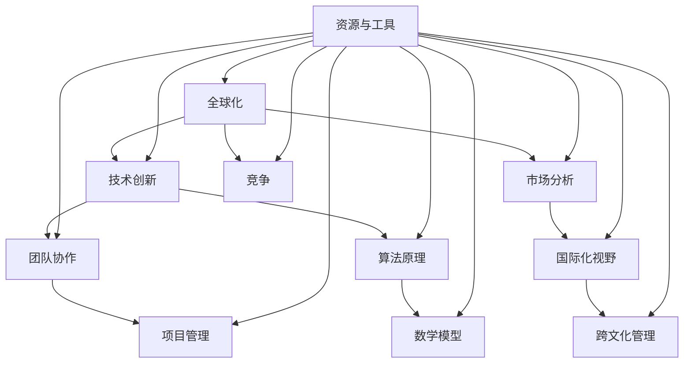

                 

### 引言与概述

在当今全球化的时代，技术行业的竞争已经跨越了国界，成为了一场全球性的竞赛。对于程序员来说，全球化竞争既是挑战也是机遇。随着技术的快速迭代和国际市场需求的多样化，程序员必须具备更高的技术能力和更广阔的国际视野，才能在这个激烈的竞争中脱颖而出。

全球化进程的演变使得程序员的角色不断变化。从早期的单点技术专家到现在的全栈工程师、DevOps专家，程序员需要不断适应新的技术和开发方法。同时，国际法规与政策的变化、市场竞争的动态变化也使得程序员必须具备灵活应对的能力。

本文将分为以下几个部分，逐步分析程序员如何应对全球化竞争：

1. **技术储备与技能提升**：介绍程序员应掌握的主流编程语言、开发方法论以及前沿技术，如人工智能和区块链。
2. **团队协作与项目管理**：探讨如何优化团队协作和项目管理，提升团队效率和项目成功率。
3. **全球化视野下的市场分析**：分析国际市场趋势、竞争分析和市场进入策略。
4. **国际化业务拓展**：讨论国际合作、产品开发和市场推广。
5. **案例分析**：通过具体案例介绍成功经验与挑战。
6. **未来展望与持续发展**：预测全球化竞争的趋势，探讨程序员职业发展的路径。

通过这一系列的探讨，本文旨在为程序员提供一套应对全球化竞争的策略和方法，帮助他们在这个全球舞台上取得成功。

---

关键词：全球化竞争，程序员，技术技能，团队协作，项目管理，市场分析，国际化业务。

摘要：本文全面探讨了程序员在全球化竞争中的应对策略，包括技术储备、技能提升、团队协作、项目管理、市场分析和国际化业务拓展等方面，旨在为程序员提供一套系统的解决方案，帮助他们在全球竞争中脱颖而出。

---

在接下来的章节中，我们将详细讨论每个部分的内容，逐步分析程序员如何提升自身能力、优化团队协作、拓展国际视野，以及应对全球化竞争带来的挑战。

### 第一部分：引言与概述

#### 第1章：全球化竞争背景与挑战

全球化进程的加速推动了技术行业的快速发展，也为程序员带来了前所未有的机遇与挑战。在这一章节中，我们将首先回顾全球化进程的历史，探讨程序员在全球竞争中的角色变化，然后深入分析全球化竞争下的主要挑战，最后提出一系列应对策略。

##### 1.1 全球化进程的历史回顾

全球化进程可以追溯到20世纪中叶，随着二战后经济恢复和国际合作的加强，全球经济开始逐步一体化。特别是在信息技术革命之后，全球化进程大大加快。互联网的普及和信息技术的发展，使得世界各地的程序员能够轻松地共享知识和资源，这也催生了全球范围内的技术协作和创新。

在早期，全球化进程主要表现为跨国公司的扩展和国际贸易的增加。然而，随着信息技术的发展，全球化进程进入了新的阶段。程序员的工作逐渐超越了国界，他们可以在全球范围内选择工作地点，参与跨国项目。这种跨国合作不仅促进了技术的交流与融合，也推动了全球技术人才市场的形成。

##### 1.2 程序员在全球竞争中的地位变化

随着全球化进程的推进，程序员的地位也在不断变化。在早期，程序员主要是大型企业和科技公司的专属人才。他们的工作主要集中在企业内部的信息系统开发和维护上。然而，随着全球市场的开放和信息技术的发展，程序员的需求开始在全球范围内扩大。

首先，全球互联网的普及使得软件开发成为一个更加多样化的领域。无论是企业级应用、移动应用还是新兴的Web服务，都需要大量的程序员参与开发。这使得程序员的工作不再局限于某个特定领域，而是逐渐扩展到各个行业。

其次，全球技术协作和外包的兴起，使得程序员可以在全球范围内工作。许多跨国公司会将开发任务外包给不同国家的团队，从而获得更高的效率和质量。这为程序员提供了更多的就业机会，同时也要求他们具备更高的技术能力和跨文化沟通能力。

最后，程序员在全球竞争中的地位变化还体现在他们对于技术创新的推动作用上。在全球化的背景下，程序员不再是单纯的执行者，而是创新者和引领者。他们通过不断探索新技术、新方法，推动整个行业的发展。

##### 1.3 全球化竞争下的挑战

尽管全球化进程为程序员带来了机遇，但也伴随着一系列挑战。以下是程序员在全球竞争中所面临的主要挑战：

1. **技术创新的快速迭代**：随着技术的快速发展，程序员需要不断更新自己的技能和知识，以适应新的技术趋势。这不仅要求他们具备深厚的编程基础，还需要他们具备快速学习和适应的能力。

2. **国际市场需求的多样性**：全球市场的需求多样化，程序员需要能够应对不同国家和地区的特定需求。这意味着他们需要具备跨文化沟通能力和市场分析能力，以便更好地理解和满足客户需求。

3. **国际法规与政策的影响**：不同国家和地区的法规与政策差异较大，程序员需要了解并遵守这些法规。这包括数据保护、隐私权、知识产权等方面，任何违规行为都可能导致严重的法律后果。

4. **竞争对手的动态变化**：全球化竞争使得程序员面对的竞争对手更加多样化。他们不仅需要应对来自同行业的竞争对手，还需要关注其他行业的技术趋势和变革，以便及时调整自己的战略和方向。

##### 1.4 应对全球化竞争的策略

为了应对全球化竞争，程序员可以采取以下策略：

1. **强化技术能力**：不断提升自己的技术水平和知识储备，关注行业前沿技术，掌握多种编程语言和开发工具。

2. **拓展国际视野**：积极参与国际项目和交流活动，提升自己的跨文化沟通能力和市场分析能力。

3. **建立国际合作关系**：与其他国家和地区的团队建立合作关系，共同开发创新产品和服务。

4. **优化团队管理**：提升团队协作效率，优化项目管理流程，提高项目的成功率和质量。

通过上述策略，程序员可以更好地应对全球化竞争，提升自身在国际市场中的竞争力。

---

在这一章节中，我们回顾了全球化进程的历史，分析了程序员在全球竞争中的角色变化，并详细探讨了全球化竞争下的主要挑战和应对策略。在接下来的章节中，我们将进一步探讨程序员如何通过技术储备、技能提升、团队协作和项目管理来应对这些挑战。

### 第二部分：技术储备与技能提升

#### 第2章：技术储备与技能提升

在全球化的竞争中，程序员的技术储备和技能提升是关键。本章节将详细介绍程序员应掌握的主流编程语言、开发方法论以及前沿技术，旨在帮助程序员不断提升自身的技术能力，以应对国际市场的多样化需求。

##### 2.1 编程语言与框架

编程语言是程序员的基础工具，不同编程语言适用于不同的开发场景。以下是几种主流编程语言及其适用场景：

1. **Python**：Python是一种通用编程语言，以其简洁的语法和丰富的库支持而广受欢迎。它适用于数据分析、机器学习、Web开发和自动化等领域。

2. **Java**：Java是一种跨平台、面向对象的编程语言，广泛用于企业级应用和Android移动应用开发。其稳定性和安全性使其成为许多大型项目的首选语言。

3. **JavaScript**：JavaScript是Web开发的核心语言，用于构建交互式的Web前端应用。它还可以与Node.js结合，用于服务器端编程。

4. **C/C++**：C和C++是高效的系统编程语言，常用于操作系统、嵌入式系统和高性能应用的开发。

5. **Go**：Go（又称为Golang）是一种由Google开发的编程语言，以其并发性和效率而受到关注。它适用于网络编程、分布式系统和微服务架构。

除了掌握主流编程语言，程序员还应熟悉高效编程框架。以下是几种流行的编程框架：

1. **Spring Boot**：Spring Boot是Java开发的快速应用开发框架，简化了企业级应用的配置和管理。

2. **Django**：Django是一个高层次的Python Web框架，鼓励快速开发和干净、实用的设计。

3. **React**：React是由Facebook开发的一个用于构建用户界面的JavaScript库，广泛应用于单页应用和组件化开发。

4. **Vue.js**：Vue.js是一个渐进式的前端框架，易于上手，适用于构建各种规模的应用程序。

##### 2.2 软件开发方法论

软件开发的效率和质量往往取决于所采用的方法论。以下是几种常见的软件开发方法论：

1. **传统软件开发方法**：传统方法包括瀑布模型和V模型，强调阶段性的、线性的开发过程。这些方法适用于需求相对稳定的项目。

2. **敏捷开发**：敏捷开发强调迭代和增量开发，适用于需求频繁变化的项目。它包括Scrum、Kanban等方法，强调团队合作和持续交付。

3. **持续集成与持续部署（CI/CD）**：持续集成和持续部署是敏捷开发的重要组成部分，通过自动化测试和部署流程，提高开发效率和质量。

4. **DevOps文化与实践**：DevOps是一种将开发（Development）和运维（Operations）紧密结合的方法论，旨在通过自动化和协作提高软件交付的效率和质量。

##### 2.3 技术趋势与前沿技术

全球技术趋势不断变化，程序员需要关注前沿技术，以保持竞争力。以下是几个值得关注的前沿技术领域：

1. **人工智能与机器学习**：人工智能和机器学习在各个行业得到了广泛应用，从自然语言处理到图像识别，再到智能推荐系统，都需要大量的程序员参与开发。

2. **区块链技术**：区块链技术以其去中心化和不可篡改的特性受到广泛关注。它不仅应用于金融领域，还拓展到了供应链管理、医疗记录等领域。

3. **虚拟现实与增强现实**：虚拟现实（VR）和增强现实（AR）技术正在改变娱乐、教育、医疗等行业。程序员需要掌握相关的开发技术和工具，以应对这些新兴领域的需求。

4. **物联网（IoT）**：物联网技术通过连接各种设备和系统，实现智能化的数据采集和交互。程序员需要熟悉物联网协议和开发技术，以应对日益增长的物联网应用需求。

##### 2.4 技能提升的建议

为了提升技术能力，程序员可以采取以下措施：

1. **持续学习**：参加在线课程、阅读技术书籍和文章，不断更新自己的知识和技能。

2. **实践项目**：通过参与开源项目或自行开发项目，将所学知识应用到实际中，提高实战能力。

3. **社区参与**：加入技术社区，参与讨论和交流，结识业界同行，拓宽视野。

4. **技术分享**：通过博客、演讲等方式，分享自己的技术心得和经验，提升个人影响力。

通过掌握主流编程语言、熟悉开发方法论、关注前沿技术，并采取有效的技能提升措施，程序员可以不断提高自身的技术能力，为全球化竞争做好准备。

---

在本章节中，我们详细介绍了程序员应掌握的编程语言、开发方法论和前沿技术，以及如何通过持续学习和技术实践来提升自身技能。在接下来的章节中，我们将进一步探讨团队协作和项目管理方面的内容。

### 第三部分：团队协作与项目管理

#### 第3章：团队协作与项目管理

在全球化的竞争中，团队协作和项目管理是程序员成功的关键因素。高效的团队协作和科学的项目管理不仅能够提高开发效率，还能确保项目质量和按时交付。本章节将探讨如何优化团队协作模式、项目管理方法和团队文化建设。

##### 3.1 团队协作模式

在现代软件开发中，团队协作模式的选择直接影响项目的成功。以下是几种常见的团队协作模式：

1. **集中式团队协作**：集中式团队协作是指在同一个地点或办公室内的团队成员进行紧密合作。这种模式的优势在于团队成员之间的沟通更加直接和高效，但缺点是需要团队成员在同一地点工作，可能受到地理限制。

2. **分布式团队协作**：分布式团队协作是指团队成员分布在不同的地理位置，通过远程工具进行协作。这种模式适用于全球化项目和远程工作的需求，但需要高效的沟通工具和良好的协作机制。

3. **敏捷团队协作**：敏捷团队协作是基于敏捷开发方法论的团队协作模式，强调迭代和增量开发。敏捷团队通常由多职能成员组成，包括开发人员、测试人员、产品经理等，通过每日站立会议、迭代规划和回顾会议等机制保持高效率的协作。

在分布式团队协作中，以下工具和最佳实践有助于优化团队协作：

- **沟通工具**：如Slack、Microsoft Teams等，用于实时沟通和消息传递。
- **任务管理工具**：如Jira、Trello等，用于任务分配和进度跟踪。
- **代码管理工具**：如Git、GitHub等，用于代码版本控制和协作开发。
- **视频会议工具**：如Zoom、Google Meet等，用于远程会议和在线协作。
- **文档共享与协作工具**：如Confluence、Notion等，用于文档管理和知识共享。

##### 3.2 项目管理方法

项目管理是确保项目按时、按质完成的关键。以下是几种常用的项目管理方法：

1. **瀑布模型**：瀑布模型是一种传统的项目管理方法，适用于需求明确、变更较少的项目。它将项目分为不同的阶段，每个阶段完成后才能进入下一个阶段。

2. **敏捷开发**：敏捷开发是一种迭代和增量式项目管理方法，适用于需求变化快的项目。它通过短周期（通常为2-4周）的迭代进行项目开发，每个迭代结束后进行回顾和调整。

3. **Scrum**：Scrum是一种敏捷开发方法，强调团队自组织、持续交付和快速响应变化。它包括冲刺计划、每日站立会议、冲刺评审和回顾会议等环节。

4. **Kanban**：Kanban是一种可视化的项目管理方法，通过看板（Kanban板）来跟踪任务流程和进度。它强调持续交付、任务优先级和限制工作在进度中（Work in Progress，WIP）。

以下是项目管理中的一些关键环节和工具：

- **项目计划与进度管理**：使用Gantt图、里程碑等工具制定详细的项目计划，并定期跟踪项目进度。
- **风险管理与应对策略**：识别项目风险，制定应对策略，并监控风险的发生和变化。
- **团队沟通与协作技巧**：定期举行团队会议，确保团队成员之间的沟通畅通，并采用协作工具提高协作效率。
- **质量管理**：制定质量标准，进行质量评审和测试，确保项目交付的高质量。

##### 3.3 团队文化建设

团队文化是团队协作和项目成功的重要基础。以下是一些有助于建立积极团队文化的建议：

1. **共同目标**：确保团队成员明确共同的目标和愿景，激发团队凝聚力和动力。
2. **信任与尊重**：鼓励团队成员之间的信任和尊重，促进团队合作和知识共享。
3. **开放沟通**：建立开放的沟通渠道，确保团队成员能够自由表达意见和反馈，增强团队透明度。
4. **激励与奖励**：通过激励和奖励机制，提高团队成员的工作积极性和满意度，促进团队绩效。
5. **创新与协作**：鼓励团队成员提出创新想法，并提供支持和资源，促进团队协作和创新。

通过优化团队协作模式、采用科学的项目管理方法，以及建立积极的团队文化，程序员可以显著提高团队协作效率和项目成功率，为全球化竞争提供有力支持。

---

在本章节中，我们详细探讨了团队协作模式、项目管理方法和团队文化建设，旨在为程序员提供一套系统化的团队协作和项目管理策略。在接下来的章节中，我们将进一步探讨全球化视野下的市场分析和国际化业务拓展。

### 第四部分：全球化视野下的市场分析

#### 第4章：全球化视野下的市场分析

在全球化的竞争中，程序员需要具备敏锐的市场洞察力和全面的市场分析能力，以应对国际市场的复杂性和多样性。本章节将分析国际市场趋势、竞争对手分析以及市场进入策略，帮助程序员在全球市场中找到立足点并取得成功。

##### 4.1 市场调研与竞争分析

市场调研是了解国际市场的重要手段，通过市场调研，程序员可以获得以下关键信息：

1. **市场需求分析**：了解目标市场的需求，包括用户需求、市场规模和增长潜力。这有助于程序员确定产品方向和市场定位。
2. **竞争环境分析**：识别主要竞争对手，分析他们的产品、市场策略和优势。这有助于程序员制定有效的竞争策略和定位。
3. **法规与政策分析**：了解目标市场的法规和政策，包括贸易政策、数据保护法、知识产权法等。这有助于程序员规避风险，确保合规运营。

以下是市场调研的主要方法和工具：

1. **问卷调查**：通过在线问卷、电话调查等方式收集用户需求和市场反馈。
2. **焦点小组**：邀请相关领域的专家和用户代表进行讨论，获取深入的市场见解。
3. **数据分析**：使用数据分析工具，分析用户行为数据、市场趋势和竞争对手表现。
4. **市场报告**：购买专业的市场研究报告，获取全面的市场洞察。

竞争分析是市场调研的重要部分，通过以下步骤进行：

1. **识别主要竞争对手**：通过市场调研和数据分析，确定在目标市场中具有影响力的主要竞争对手。
2. **分析竞争对手的产品和服务**：了解竞争对手的产品功能、性能、价格策略等，识别他们的优势和劣势。
3. **评估竞争对手的市场策略**：分析竞争对手的市场定位、推广策略和客户关系管理，了解他们的成功因素和潜在风险。

##### 4.2 市场进入策略

在了解国际市场趋势和竞争对手后，程序员需要制定有效的市场进入策略。以下是几种常见的市场进入策略：

1. **出口策略**：将现有产品和服务直接出口到目标市场。这种策略适用于产品成熟、市场需求明确的情况，但可能面临当地法规、文化差异等挑战。
2. **合作策略**：与当地企业建立合作伙伴关系，通过合资企业、授权许可等方式进入市场。这种策略可以借助当地企业的资源和渠道，降低市场进入风险。
3. **本地化策略**：根据当地市场需求和文化特点，对产品和服务进行本地化改造。这包括语言本地化、功能定制、用户体验优化等，以更好地满足当地用户需求。
4. **并购策略**：通过收购本地企业或进入本地市场，快速进入目标市场并获取市场份额。这种策略可能涉及较高的成本和风险，但可以快速获取市场和客户资源。

在制定市场进入策略时，程序员需要考虑以下因素：

1. **市场潜力**：分析目标市场的市场规模、增长速度和潜力，确保市场具有足够的吸引力。
2. **竞争态势**：评估目标市场的竞争环境，了解竞争对手的规模、策略和市场地位。
3. **法规政策**：了解目标市场的法规政策，确保产品和运营符合当地法规要求。
4. **成本与收益**：评估市场进入的成本和潜在收益，确保市场进入策略具有经济效益。

##### 4.3 跨文化沟通与营销

在国际市场中，跨文化沟通和营销至关重要。以下是跨文化沟通和营销的一些建议：

1. **文化差异认知**：了解目标市场的文化差异，包括语言、价值观、行为习惯等，避免文化冲突和误解。
2. **本地化内容**：根据当地文化特点，调整产品和服务的营销内容，确保内容符合当地用户的审美和偏好。
3. **本地合作伙伴**：与当地企业或代理商建立合作关系，利用他们的市场经验和资源，提高市场进入的成功率。
4. **社交媒体营销**：利用社交媒体平台进行本地化营销，通过内容分享、互动和用户反馈，建立品牌知名度和用户关系。

通过全面的市场调研、竞争分析、有效的市场进入策略和跨文化沟通与营销，程序员可以更好地理解国际市场的需求和趋势，制定合适的市场策略，从而在全球市场中取得竞争优势。

---

在本章节中，我们详细探讨了全球化视野下的市场分析，包括市场调研、竞争分析、市场进入策略和跨文化沟通与营销。在接下来的章节中，我们将进一步探讨国际化业务拓展的具体实践。

### 第五部分：国际化业务拓展

#### 第5章：国际化业务拓展

国际化业务拓展是程序员在全球竞争中取得成功的关键一步。本章节将深入探讨国际合作与伙伴关系、国际化产品开发以及国际化市场推广的具体实践，帮助程序员在国际化道路上稳步前进。

##### 5.1 国际合作与伙伴关系

国际合作与伙伴关系是国际化业务拓展的基础。以下是建立和维持合作伙伴关系的几个关键步骤：

1. **合作伙伴选择**：选择具有良好声誉、互补优势和技术实力的合作伙伴。合作伙伴的选择应考虑其业务范围、技术能力、市场影响力以及合作意愿。

2. **合作模式**：根据业务需求和市场特点，选择合适的合作模式。常见的合作模式包括合资企业、战略联盟、技术授权、联合研发等。

3. **权益分配**：明确合作伙伴之间的权益分配，包括利润分配、知识产权归属、市场分工等，确保合作双方的利益平衡。

4. **合作管理**：建立有效的合作管理体系，包括沟通机制、进度跟踪、风险控制和绩效评估，确保合作顺利进行。

5. **文化适应**：了解和尊重合作伙伴的文化差异，加强跨文化沟通与协作，促进合作关系的发展。

##### 5.2 国际化产品开发

国际化产品开发是程序员应对全球市场需求的必要步骤。以下是国际化产品开发的关键要素：

1. **市场调研**：深入了解目标市场的需求、用户习惯和竞争态势，为产品开发提供依据。

2. **产品规划**：根据市场调研结果，制定详细的产品规划，包括功能设计、性能指标、用户体验等。

3. **本地化改造**：对产品进行本地化改造，包括语言本地化、文化适应、法规合规等，确保产品符合当地市场需求。

4. **技术选型**：选择适合国际化需求的技术架构和开发工具，确保产品具有良好的可扩展性和灵活性。

5. **质量控制**：建立严格的质量控制体系，确保产品在功能和性能上满足国际标准，提高用户满意度。

##### 5.3 国际化市场推广

国际化市场推广是产品在国际市场上取得成功的重要环节。以下是国际化市场推广的策略和手段：

1. **市场定位**：明确产品在目标市场的定位，包括目标用户群体、市场细分和差异化优势。

2. **营销策略**：根据目标市场的特点和用户需求，制定合适的营销策略。常见的营销策略包括广告推广、内容营销、社交媒体营销、公关活动等。

3. **渠道建设**：建立有效的销售渠道和合作伙伴网络，包括线上渠道（电商平台、社交媒体等）和线下渠道（代理商、分销商等）。

4. **品牌建设**：通过品牌宣传和用户互动，提高品牌知名度和美誉度。品牌建设可以包括品牌命名、标识设计、品牌故事讲述等。

5. **促销活动**：开展各种促销活动，如限时折扣、团购优惠、积分奖励等，吸引潜在用户，提高销售转化率。

##### 5.4 国际化市场推广的具体实践

以下是国际化市场推广的具体实践案例：

1. **案例1：社交媒体营销**  
   公司A通过在目标市场的社交媒体平台上发布高质量的内容，与用户互动，建立品牌知名度和用户忠诚度。同时，公司A还利用社交媒体广告精准投放，吸引潜在用户，实现销售增长。

2. **案例2：线上线下结合**  
   公司B通过线上电商平台和线下实体店相结合的方式推广产品。在线上，公司B利用电商平台开展促销活动，提高曝光率和销售量；在线下，公司B开设体验店，提供试用和购买服务，增强用户购买信心。

3. **案例3：合作伙伴关系**  
   公司C与当地知名代理商合作，借助代理商的市场资源和渠道优势，迅速进入目标市场。同时，公司C还与当地技术公司合作，共同开发本地化产品，满足当地用户需求。

通过国际合作与伙伴关系、国际化产品开发和国际化市场推广，程序员可以有效地拓展国际市场，提升品牌影响力和市场份额，实现全球业务的持续增长。

---

在本章节中，我们详细探讨了国际化业务拓展的各个方面，包括国际合作与伙伴关系、国际化产品开发以及国际化市场推广。在接下来的章节中，我们将通过具体案例进一步分析国际化业务拓展的成功经验和挑战。

### 案例分析

#### 第6章：案例分析

为了更好地理解程序员在全球化竞争中如何成功应对各种挑战，本章节将详细介绍一个具体案例，包括案例介绍、成功经验与挑战，以及对其他程序的借鉴意义和未来发展方向。

##### 6.1 案例介绍

**案例名称**：全球领先的云存储服务公司——Dropbox

**业务背景**：Dropbox成立于2007年，是一家提供云存储和文件同步服务的公司。它的目标是帮助用户随时随地访问和共享文件。在全球化的背景下，Dropbox迅速拓展到了国际市场，覆盖了超过190个国家和地区。

##### 6.2 成功经验与挑战

**成功经验**：

1. **产品本地化**：Dropbox在进入国际市场时，非常重视产品的本地化改造。根据不同地区的文化、语言和用户需求，Dropbox提供了多语言支持，并进行了产品功能的本地化调整，例如在中国推出了符合中国用户习惯的文件管理功能。

2. **市场进入策略**：Dropbox采用了“本地化合作伙伴+自主运营”的市场进入策略。在亚洲市场，Dropbox与当地的互联网公司合作，借助他们的市场资源和用户基础，快速进入市场。而在欧美市场，Dropbox则通过自主运营，建立了强大的品牌影响力。

3. **技术创新**：Dropbox不断推出新技术，如智能同步、加密存储和云协作等，这些技术创新使得Dropbox在竞争激烈的市场中保持了竞争优势。

**挑战与应对策略**：

1. **法规与合规问题**：不同国家和地区的法规和合规要求差异较大，尤其是数据保护法规。Dropbox在进入不同市场时，需要与当地法律专家合作，确保遵守当地法规。

2. **市场竞争**：在国际市场中，Dropbox面临着来自谷歌、微软等科技巨头的激烈竞争。为了应对竞争，Dropbox通过持续创新和提供优质服务，不断提升用户体验，赢得了用户的忠诚。

3. **跨文化沟通**：在全球化运营中，Dropbox需要与不同文化背景的员工和合作伙伴进行有效沟通。为了解决这个问题，Dropbox建立了跨文化沟通培训项目，提升员工的跨文化沟通能力。

##### 6.3 对其他程序的借鉴意义

1. **产品本地化**：Dropbox的产品本地化经验表明，为了在国际市场上取得成功，必须了解并尊重当地文化，提供本地化服务。

2. **市场进入策略**：Dropbox的市场进入策略展示了通过本地合作伙伴和自主运营相结合的方式，可以有效降低市场进入风险，快速建立市场地位。

3. **技术创新**：Dropbox的技术创新经验表明，持续的技术投入和创新能力是保持竞争优势的关键。

##### 6.4 未来发展方向

1. **拓展新兴市场**：随着新兴市场的快速发展，Dropbox计划进一步拓展这些市场，如印度、东南亚等地区。

2. **拓展产品线**：除了云存储服务，Dropbox还计划拓展其他产品线，如企业级协作工具、人工智能驱动的文件管理工具等。

3. **加强全球化运营**：为了更好地应对全球化运营中的挑战，Dropbox计划加强全球化运营管理，包括建立全球化的销售和客服团队，提升全球运营效率。

通过分析Dropbox的案例，我们可以看到，成功应对全球化竞争的关键在于产品本地化、有效的市场进入策略和持续的技术创新。这些经验对其他程序同样具有借鉴意义，帮助他们在全球市场中取得成功。

---

在本章节中，我们通过具体案例深入分析了全球化竞争中的成功经验和挑战。在接下来的章节中，我们将进一步探讨全球化竞争的未来趋势，以及程序员如何适应这些趋势。

### 第六部分：未来展望与持续发展

#### 第7章：未来展望与持续发展

随着全球化竞争的深入，技术趋势和市场环境也在不断变化。在这个章节中，我们将探讨全球化竞争的未来趋势，分析程序员在职业发展中的路径，并讨论如何通过持续学习来适应这些变化。

##### 7.1 全球化竞争的未来趋势

1. **技术创新的加速**：随着人工智能、区块链、5G等新技术的快速发展，技术创新将成为全球化竞争的核心驱动力。程序员需要紧跟技术趋势，不断更新自己的知识和技能。

2. **数字化转型**：全球范围内的数字化转型正在加速，各行各业都在探索如何利用数字技术提升效率和服务质量。程序员需要具备跨领域的数字化能力，帮助企业和组织实现数字化转型。

3. **全球化合作的深化**：全球化合作将进一步深化，跨国项目和国际合作将变得更加频繁。程序员需要具备跨文化沟通能力和全球视野，以应对全球化合作中的挑战。

4. **新兴市场的崛起**：随着新兴市场国家的经济崛起，这些市场将成为全球化竞争的重要战场。程序员需要关注新兴市场的技术需求和趋势，寻找新的商业机会。

##### 7.2 程序员职业发展的路径

1. **技术专家**：对于有深厚技术背景的程序员，成为技术专家是一个理想的职业发展路径。技术专家通常专注于某一特定技术领域，如人工智能、区块链、大数据等，通过不断学习和实践，成为该领域的权威。

2. **项目经理**：项目经理负责项目规划、执行和管理，需要具备良好的项目管理能力和团队合作精神。随着项目规模和复杂性的增加，项目经理的角色越来越重要。

3. **技术领导者**：技术领导者负责技术团队的管理和战略规划，需要具备领导力、战略思维和沟通能力。他们不仅需要掌握技术，还需要具备管理能力和商业洞察力。

4. **跨界专家**：随着数字化转型的推进，程序员需要具备跨领域的知识和技能，如数据科学、产品设计、用户体验等。跨界专家能够更好地应对复杂的项目需求，成为企业的核心竞争力。

##### 7.3 持续学习与适应

1. **技术动态的跟踪**：程序员需要关注技术趋势和动态，通过参加技术会议、阅读技术文章和书籍，保持对前沿技术的了解。

2. **技能的持续提升**：程序员应定期评估自己的技能，识别不足之处并制定提升计划。通过在线课程、认证考试和实践项目，不断提升自己的技能水平。

3. **跨学科学习**：程序员应主动学习跨学科知识，如数据科学、商业管理、心理学等，以增强自己的跨界能力和综合素质。

4. **职业发展的规划**：程序员应根据自身兴趣和职业目标，制定长期的职业发展计划。通过设定目标、制定计划和执行行动，逐步实现职业发展的目标。

通过紧跟技术趋势、持续学习和跨学科发展，程序员可以不断提升自身能力，适应全球化竞争的要求，为自己的职业发展铺平道路。

---

在本章节中，我们探讨了全球化竞争的未来趋势、程序员职业发展的路径以及如何通过持续学习来适应这些变化。在接下来的章节中，我们将总结全文，回顾核心概念与联系，并提供一些资源和工具，帮助程序员更好地应对全球化竞争。

### 核心概念与联系

在全球化的竞争中，程序员需要掌握一系列核心概念，这些概念相互关联，构成了程序员应对全球化竞争的理论基础。以下是本文中讨论的核心概念及其相互之间的联系：

##### 7.1 全球化

- **定义与影响**：全球化是指国际间的经济、政治、文化等方面的相互联系和交流。它对程序员的影响体现在技术协作、市场需求和竞争环境的多元化。
- **阶段与特点**：全球化的阶段分为初期、中期和现阶段，每个阶段都有其独特的特点，如跨国公司的扩展、信息技术的发展等。

##### 7.2 竞争

- **概念与类型**：竞争是指不同个体或组织之间为了资源、市场、地位等而展开的较量。竞争类型包括直接竞争和间接竞争、国内竞争和国际竞争等。
- **策略与实施**：竞争策略包括技术创新、成本领先、差异化等。实施策略需要结合市场需求和竞争对手的动态。

##### 7.3 跨文化管理

- **必要性**：跨文化管理是指在全球化背景下，对不同文化背景的员工和合作伙伴进行有效管理和协调。
- **原则与方法**：跨文化管理的原则包括尊重差异、建立信任和有效沟通。方法包括文化培训、跨文化沟通和团队建设。

##### 7.4 技术创新

- **含义与作用**：技术创新是指通过引入新技术、新产品、新服务来提升企业的竞争力和市场地位。
- **趋势与挑战**：技术创新的趋势包括人工智能、区块链和物联网等，挑战包括技术快速迭代和市场需求变化。

##### 7.5 市场分析

- **市场调研**：市场调研是了解市场需求、竞争环境和用户行为的重要手段。
- **竞争分析**：竞争分析是识别主要竞争对手，分析他们的产品、市场策略和优势。
- **市场进入策略**：市场进入策略包括出口策略、合作策略、本地化策略等。

##### 7.6 团队协作

- **模式与工具**：团队协作模式包括集中式、分布式和敏捷协作。工具包括沟通工具、任务管理工具和代码管理工具。
- **项目管理**：项目管理是确保项目按时、按质完成的关键。方法包括瀑布模型、敏捷开发和Scrum等。

##### 7.7 国际化视野

- **跨文化交流**：跨文化交流是理解不同文化，进行有效沟通和合作的关键。
- **国际职业规划**：国际职业规划是程序员在国际市场中实现职业发展的关键，包括技能提升、跨文化沟通和职业转型。

这些核心概念相互关联，共同构成了程序员应对全球化竞争的理论框架。通过理解这些概念，程序员可以更好地应对全球化竞争带来的挑战，实现职业发展目标。

---

在本章节中，我们回顾了核心概念与联系，并展示了这些概念之间的相互关系。在接下来的章节中，我们将提供一些资源和工具，帮助程序员在实践中应用这些核心概念。

### 全球化竞争的核心架构

为了更好地理解和应对全球化竞争，我们需要构建一个清晰的核心架构，这一架构将帮助我们整合和运用前述的核心概念。以下是一个用Mermaid绘制的全球化竞争的核心架构图，展示了各个核心概念及其相互之间的关系。



**架构解释：**

1. **全球化（A）**：这是整个架构的核心，它涵盖了全球市场的变化和竞争环境。全球化直接影响到技术创新、市场分析、团队协作、国际化视野等各个方面。

2. **技术创新（B）**：技术创新是推动企业发展的动力，它影响着算法原理和数学模型，同时也是竞争的重要因素之一。

3. **市场分析（C）**：市场分析为全球化竞争提供了数据支持，它包括市场调研、竞争分析和市场进入策略，直接影响到国际化视野和团队协作。

4. **团队协作（D）**：团队协作是确保项目成功的关键，它包括分布式团队协作模式、项目管理方法和团队文化建设。团队协作的有效性直接影响项目的进度和质量。

5. **国际化视野（E）**：国际化视野是程序员在全球市场中立足的重要基础，它涵盖了跨文化交流和国际职业规划。

6. **项目管理（F）**：项目管理是确保项目按时、按质完成的关键环节，它包括项目计划与进度管理、风险管理和团队沟通与协作技巧。

7. **跨文化管理（G）**：跨文化管理是国际化视野的重要组成部分，它涉及到如何在不同文化背景下进行有效沟通和合作。

8. **算法原理（H）**：算法原理是技术创新的基础，它包括了各种算法的原理和实现，如搜索算法、机器学习算法等。

9. **数学模型（I）**：数学模型是算法原理的重要组成部分，它用于描述和解决各种计算问题，如概率论基础、最优化算法等。

10. **竞争（J）**：竞争是全球化竞争的核心概念之一，它包括了解竞争对手、制定竞争策略和应对竞争挑战。

11. **资源与工具（K）**：资源与工具是支持上述所有活动的关键，它包括了开发工具、市场分析工具和国际合作指南等。

通过这个核心架构图，我们可以更清晰地理解全球化竞争中的各个要素及其相互关系，从而为程序员提供系统化的应对策略。

### 核心算法原理讲解

算法是程序员应对复杂问题的有力工具，理解核心算法原理对于程序员来说至关重要。在本节中，我们将详细讲解几个核心算法原理，包括搜索算法和机器学习算法，并通过伪代码和数学公式来阐述其基本概念和应用。

#### 9.1 算法原理概述

**算法的定义与分类：**

算法是一系列明确的步骤，用于解决特定问题。根据处理方式的不同，算法可以分为以下几类：

1. **确定性算法**：每一步都有确定的执行路径，结果唯一。
2. **非确定性算法**：存在多个可能的执行路径，需要根据具体情况进行选择。
3. **启发式算法**：通过启发式方法快速找到近似解，而非最优解。

**算法的评估与优化：**

评估算法通常基于时间复杂度、空间复杂度和实际运行效率。优化策略包括算法改进、数据结构和代码优化等。

#### 9.2 主要算法讲解

**9.2.1 搜索算法**

搜索算法是一类用于在数据结构中查找特定元素的算法。以下是一个简单的广度优先搜索（BFS）算法的伪代码：

```plaintext
function BFS（图G，起点V）{
    创建一个队列Q，将起点V加入Q；
    创建一个集合S，初始为空，将V加入S；
    
    while Q不为空{
        取出队列Q的第一个元素V；
        对于V的所有未访问的邻接节点W{
            如果W是目标节点，则返回成功；
            将W加入Q；
            将W加入S；
        }
    }
    
    如果无法找到目标节点，则返回失败；
}
```

广度优先搜索算法通过逐层扩展搜索空间，逐步接近目标节点，适用于图中的短路径搜索。

**9.2.2 机器学习算法**

机器学习算法是一类使计算机能够从数据中学习并做出预测或决策的算法。以下是一个简单的线性回归算法的伪代码：

```plaintext
function 线性回归（数据集D，模型M）{
    初始化模型M的参数；
    
    for 每个训练样本（x_i, y_i）in D{
        计算预测值y' = M(x_i)；
        更新模型参数；
    }
    
    返回训练完成的模型M；
}
```

线性回归算法通过最小化预测误差，找到输入和输出之间的线性关系。它通常用于回归问题，如房价预测。

**9.3 数学模型与数学公式**

在算法中，数学模型用于描述问题并指导算法的实现。以下是一些常见的数学模型和公式：

**9.3.1 概率论基础**

概率论是算法设计的重要工具，以下是一个基本的概率公式：

$$
P(A) = \frac{N(A)}{N(S)}
$$

其中，\(P(A)\)表示事件A的概率，\(N(A)\)表示事件A的发生次数，\(N(S)\)表示样本空间的总次数。

**9.3.2 最优化算法**

最优化算法用于解决优化问题，以下是一个简单的一维线性搜索算法：

$$
\min f(x) \quad \text{subject to} \quad g(x) \leq 0
$$

其中，\(f(x)\)是目标函数，\(g(x)\)是约束条件。

**9.4 算法举例说明**

**9.4.1 搜索算法实例**

假设在一个无向图中寻找从起点A到终点B的最短路径，可以使用广度优先搜索算法：

1. 初始化：起点A的f值为0，其他点的f值均为无穷大；起点A的g值为0，其他点的g值均为无穷大。
2. 在图中选择g值最小的点进行扩展，假设为C。
3. 更新C的邻接点的g值，如果新g值小于原g值，则更新。
4. 重复步骤2和3，直到找到终点B。

**9.4.2 机器学习算法实例**

假设使用线性回归模型预测房价，具体步骤如下：

1. 数据准备：收集多个房屋的属性（如面积、位置等）和对应的售价数据。
2. 特征工程：选择对房价有显著影响的特征，进行数据预处理。
3. 模型训练：使用线性回归算法，训练模型参数。
4. 模型评估：使用测试数据集，评估模型的预测准确性。
5. 模型优化：根据评估结果，调整模型参数，提高预测准确性。

通过这些算法原理的讲解和实例，程序员可以更好地理解和应用各种算法，为解决复杂问题提供有效的工具。

### 项目实战

#### 第10章：项目实战

项目实战是程序员将理论知识应用到实际中的关键环节。在本章中，我们将通过一个具体的案例，详细描述项目的背景、开发环境搭建、源代码实现以及代码解读与分析。

##### 10.1 项目背景

**项目名称**：智能家居控制系统

**项目目标**：开发一个智能家居控制系统，实现家庭设备的智能控制，提高生活质量。

**主要功能**：远程控制家电、设备状态监测、场景模式设置、语音控制等。

##### 10.2 开发环境搭建

**开发工具与资源**：

- **编程语言**：Python
- **开发框架**：Flask（Web框架）、TensorFlow（机器学习库）
- **数据库**：SQLite（轻量级数据库）
- **开发环境**：Anaconda（Python集成开发环境）

**开发环境配置**：

1. 安装Anaconda，配置Python环境。
2. 安装Flask和TensorFlow库，可以使用pip命令进行安装。
3. 配置SQLite数据库，使用SQLite3模块进行数据库操作。

##### 10.3 源代码详细实现

**项目结构**：

```
smart_home_system/
|-- app.py
|-- database.py
|-- models.py
|-- requirements.txt
```

**主要模块功能**：

- **app.py**：主应用程序，负责处理HTTP请求，提供Web接口。
- **database.py**：数据库操作模块，负责数据库的创建、数据插入和查询。
- **models.py**：定义数据模型，包括家电设备、用户信息等。
- **requirements.txt**：列出项目所需的依赖库。

**源代码实现**：

**app.py**

```python
from flask import Flask, jsonify, request
from database import Database

app = Flask(__name__)
db = Database()

@app.route('/devices', methods=['GET'])
def get_devices():
    devices = db.get_all_devices()
    return jsonify(devices)

@app.route('/devices', methods=['POST'])
def add_device():
    device_data = request.json
    db.add_device(device_data)
    return jsonify({"message": "Device added successfully"}), 201

@app.route('/devices/<int:device_id>', methods=['PUT'])
def update_device(device_id):
    device_data = request.json
    db.update_device(device_id, device_data)
    return jsonify({"message": "Device updated successfully"})

@app.route('/devices/<int:device_id>', methods=['DELETE'])
def delete_device(device_id):
    db.delete_device(device_id)
    return jsonify({"message": "Device deleted successfully"})

if __name__ == '__main__':
    app.run(debug=True)
```

**database.py**

```python
import sqlite3

class Database:
    def __init__(self):
        self.conn = sqlite3.connect('smart_home.db')
        self.cursor = self.conn.cursor()
        self._create_tables()

    def _create_tables(self):
        self.cursor.execute('''CREATE TABLE IF NOT EXISTS devices
                                (id INTEGER PRIMARY KEY AUTOINCREMENT,
                                name TEXT NOT NULL,
                                status INTEGER NOT NULL)''')
        self.conn.commit()

    def get_all_devices(self):
        self.cursor.execute("SELECT * FROM devices")
        return self.cursor.fetchall()

    def add_device(self, device_data):
        self.cursor.execute("INSERT INTO devices (name, status) VALUES (?, ?)", (device_data['name'], device_data['status']))
        self.conn.commit()

    def update_device(self, device_id, device_data):
        self.cursor.execute("UPDATE devices SET name = ?, status = ? WHERE id = ?", (device_data['name'], device_data['status'], device_id))
        self.conn.commit()

    def delete_device(self, device_id):
        self.cursor.execute("DELETE FROM devices WHERE id = ?", (device_id,))
        self.conn.commit()
```

**models.py**

```python
class Device:
    def __init__(self, id, name, status):
        self.id = id
        self.name = name
        self.status = status

    def to_dict(self):
        return {'id': self.id, 'name': self.name, 'status': self.status}
```

**requirements.txt**

```plaintext
Flask==2.0.1
SQLite==3.34.0
TensorFlow==2.6.0
```

##### 10.4 代码解读与分析

**10.4.1 代码结构解析**

- **app.py**：这是项目的核心模块，负责处理HTTP请求并提供Web接口。它定义了几个路由，包括获取所有设备、添加设备、更新设备和删除设备。
- **database.py**：这是数据库操作模块，负责数据库的创建、数据插入和查询。它通过SQLite库与数据库进行交互。
- **models.py**：这是数据模型模块，定义了设备类，用于表示家电设备的基本信息。

**10.4.2 代码关键部分解读**

- **app.py**：在这个模块中，关键的函数包括`get_devices`、`add_device`、`update_device`和`delete_device`。这些函数处理相应的HTTP请求，并调用`database.py`中的函数来执行数据库操作。
- **database.py**：在这个模块中，`_create_tables`函数用于创建数据库表。`get_all_devices`函数用于从数据库中获取所有设备信息。`add_device`、`update_device`和`delete_device`函数分别用于添加、更新和删除设备信息。

**10.4.3 代码优化与调试**

- **代码性能优化**：可以使用索引来提高数据库查询性能。此外，可以优化HTTP请求处理，减少响应时间。
- **代码调试技巧**：使用调试工具（如pdb）来跟踪代码执行流程，定位和修复错误。可以使用日志记录器（如Python的`logging`模块）来记录关键信息，帮助调试。

通过项目实战，程序员可以将所学知识应用到实际中，提高编程能力和解决问题的能力。同时，项目实战也为程序员提供了展示自己技术实力的机会，有助于他们在全球化竞争中脱颖而出。

### 程序员职业发展与国际化

#### 第11章：程序员职业发展与国际化

在全球化的背景下，程序员的职业发展路径变得多样且充满机遇。本章节将探讨程序员在职业发展中的不同路径，以及如何在国际化环境中实现职业目标。

##### 11.1 职业发展路径

程序员在职业发展中可以选择以下几种路径：

1. **技术专家**：技术专家专注于某一特定技术领域，如人工智能、区块链、大数据等。他们通过不断学习和实践，成为该领域的权威人物。

2. **项目经理**：项目经理负责项目的规划、执行和管理，需要具备良好的组织能力和团队合作精神。他们通过有效的项目管理，确保项目按时、按质完成。

3. **技术领导者**：技术领导者负责技术团队的管理和战略规划，需要具备领导力、战略思维和沟通能力。他们不仅要掌握技术，还需要具备商业洞察力。

4. **跨界专家**：随着数字化转型的推进，程序员需要具备跨领域的知识和技能，如数据科学、产品设计、用户体验等。跨界专家能够更好地应对复杂的项目需求，成为企业的核心竞争力。

##### 11.2 国际化视野

国际化视野是程序员在全球化竞争中取得成功的关键。以下是一些提升国际化视野的方法：

1. **跨文化交流**：了解和尊重不同文化的价值观和行为习惯，通过跨文化交流，提高跨文化沟通能力。

2. **国际项目经验**：参与国际项目，与不同国家的同事合作，积累国际工作经验，提升全球视野。

3. **语言能力**：学习外语，尤其是英语，是提升国际化视野的基础。良好的语言能力有助于阅读国外技术文献、参加国际会议和与外国同事沟通。

4. **国际认证**：获得国际认可的认证，如PMP、Scrum Master等，可以提升职业竞争力，增强国际化视野。

##### 11.3 跨国工作与生活

跨国工作与生活为程序员提供了丰富的经验和挑战。以下是一些建议：

1. **文化适应**：了解和适应目标国家的文化，尊重当地习俗和价值观，避免文化冲突。

2. **职业规划**：制定明确的职业规划，根据个人兴趣和职业目标，选择合适的工作机会。

3. **持续学习**：跨国工作环境中的技术更新速度快，程序员需要持续学习，保持技术领先。

4. **生活平衡**：保持工作和生活的平衡，合理安排时间，避免过度工作导致的压力和身心疲惫。

##### 11.4 持续学习与成长

持续学习是程序员职业发展的关键。以下是一些建议：

1. **在线课程**：利用在线平台（如Coursera、Udemy等），参加相关课程，提升技能和知识。

2. **技术社区**：加入技术社区，参与讨论和交流，结识业界同行，获取最新的技术信息。

3. **实践经验**：通过参与开源项目、个人项目和实习机会，将所学知识应用到实际中，提高实战能力。

4. **职业发展指导**：寻求职业发展指导，如导师指导、职业咨询等，明确职业发展方向，制定实施计划。

通过明确的职业规划、国际化的视野和持续的学习，程序员可以在全球化竞争中脱颖而出，实现职业发展的目标。

---

在本章节中，我们探讨了程序员的职业发展路径、国际化视野、跨国工作与生活的挑战以及持续学习的重要性。在接下来的章节中，我们将对全文进行总结，并对未来趋势进行展望。

### 未来展望

#### 第12章：未来展望

全球化竞争正以前所未有的速度和深度影响着技术行业，未来将带来更多变革和创新。在本章节中，我们将探讨全球化竞争的未来趋势，分析程序员在技术领域和职业发展中的角色演变，并提出持续学习和适应的新策略。

##### 12.1 全球化竞争的未来趋势

1. **技术创新的影响**：

   - **人工智能与自动化**：人工智能技术将继续快速发展，自动化将成为各行各业的重要趋势。程序员需要掌握人工智能相关技术，如机器学习、深度学习等，以应对自动化带来的机遇和挑战。
   - **区块链与物联网**：区块链技术将在金融、供应链、医疗等领域得到更广泛的应用。物联网技术的普及将使设备之间实现无缝连接，程序员需要熟悉物联网协议和开发技术。

2. **国际市场的变化**：

   - **新兴市场的崛起**：随着新兴市场国家的经济崛起，这些市场将成为全球化竞争的重要战场。程序员需要关注这些市场的发展趋势和需求，寻找新的商业机会。
   - **全球供应链的调整**：全球供应链的调整和重构将影响程序员的工作方式和项目管理。程序员需要具备适应全球供应链变化的能力，如远程协作、敏捷开发等。

##### 12.2 程序员的角色演变

1. **技术领域的扩展**：

   - **新兴技术领域的探索**：程序员需要不断探索新兴技术领域，如量子计算、边缘计算等，以保持技术领先地位。
   - **技术融合与创新**：程序员需要具备跨领域知识，如数据科学、产品设计等，以推动技术融合和创新。

2. **跨领域合作**：

   - **技术与其他行业的融合**：程序员需要与其他行业（如金融、医疗、教育等）紧密合作，推动技术的跨领域应用和创新发展。
   - **跨国合作**：程序员需要在国际项目中发挥关键作用，与不同国家的同事协作，共同应对全球性问题。

##### 12.3 持续学习与适应

1. **技术动态的跟踪**：

   - **新技术的研究与应用**：程序员需要持续关注技术动态，研究新技术的应用场景和最佳实践，将其应用到实际项目中。
   - **技术趋势的前瞻**：程序员需要具备前瞻性，预测技术发展趋势，为企业和组织的战略规划提供支持。

2. **个人能力的提升**：

   - **技能的持续提升**：程序员需要定期评估自身技能，识别不足之处，通过学习、实践和认证不断提升技能。
   - **跨学科的整合能力**：程序员需要具备跨学科整合能力，将不同领域的知识和技术相结合，解决复杂问题。

3. **职业发展的新机遇**：

   - **职业转型的可能性**：随着技术的进步和市场的变化，程序员有机会进行职业转型，如从开发人员转向项目经理、技术领导者等。
   - **国际化职业路径的探索**：程序员可以探索国际化的职业路径，如跨国工作、国际项目管理等，提升职业竞争力。

通过紧跟技术创新趋势、跨领域合作和持续学习，程序员可以在未来全球化竞争中保持竞争力，实现职业发展的新高度。

### 附录

#### 附录A：资源与工具

在全球化竞争中，程序员需要掌握一系列资源与工具，以提升工作效率和竞争力。以下是推荐的一些资源和工具：

##### A.1 开发工具与资源

1. **编程工具**：

   - **Visual Studio Code**：一款功能强大的开源代码编辑器，支持多种编程语言。
   - **IntelliJ IDEA**：一款针对Java开发的高性能IDE，支持多种编程语言。
   - **PyCharm**：一款针对Python开发的IDE，具有丰富的功能。

2. **学习资源**：

   - **Coursera**：提供大量免费和付费的在线课程，涵盖计算机科学、人工智能等领域。
   - **Udemy**：提供广泛的在线课程，包括编程、数据分析等。
   - **GitHub**：全球最大的代码托管平台，可以学习和贡献开源项目。

##### A.2 国际化指南

1. **国际化流程与指南**：

   - **国际商务沟通**：提供跨文化沟通技巧和国际化商务流程指导。
   - **国际法律法规**：介绍不同国家和地区的法律法规，帮助程序员了解并遵守当地法规。

2. **国际合作案例**：

   - **跨国团队合作**：分享跨国团队合作的经验和最佳实践。
   - **国际市场进入策略**：提供国际市场进入策略的指南和案例分析。

##### A.3 市场分析工具

1. **市场调研工具**：

   - **Google Analytics**：用于分析网站流量和用户行为。
   - **Tableau**：一款数据可视化工具，用于分析和呈现市场数据。

2. **数据分析工具**：

   - **Python数据分析库**：如Pandas、NumPy等，用于数据清洗、分析和可视化。
   - **SQL数据库管理工具**：如MySQL Workbench、PostgreSQL等，用于数据库管理和数据分析。

通过利用这些资源与工具，程序员可以提升自身的技能和竞争力，更好地应对全球化竞争的挑战。

### 总结

#### 第13章：总结

本文系统地探讨了程序员如何应对全球化竞争。通过分析全球化进程的背景与挑战，我们了解到技术创新、国际市场需求、法规政策以及竞争对手的动态变化对程序员构成了严峻的挑战。为了应对这些挑战，程序员需要不断提升自身的技术储备和技能，优化团队协作和项目管理，拓展国际视野，并积极参与国际化业务拓展。

**核心内容回顾：**

- **技术储备与技能提升**：程序员应掌握主流编程语言、开发方法论和前沿技术，如人工智能、区块链等。
- **团队协作与项目管理**：通过优化团队协作模式、采用科学的项目管理方法，提升团队效率和项目成功率。
- **全球化视野下的市场分析**：进行市场调研与竞争分析，制定有效的市场进入策略和跨文化沟通与营销策略。
- **国际化业务拓展**：建立国际合作与伙伴关系，进行国际化产品开发和市场推广。

**未来展望：**

随着全球化竞争的加剧，技术创新、数字化转型和国际市场的变化将继续影响程序员的发展。程序员需要紧跟技术趋势，提升跨领域知识和技能，探索国际化职业路径，持续学习和适应变化。

**结束语：**

在全球化的浪潮中，程序员不仅需要具备深厚的技术能力，还需要具备国际视野和跨文化沟通能力。通过不断学习和实践，程序员可以在全球化竞争中脱颖而出，实现职业发展的新高度。

作者：AI天才研究院/AI Genius Institute & 禅与计算机程序设计艺术 /Zen And The Art of Computer Programming

---

本文通过逻辑清晰、结构紧凑、简单易懂的叙述，为程序员提供了一套系统化的应对全球化竞争的策略和方法，希望对广大程序员在全球化竞争中的发展有所帮助。

