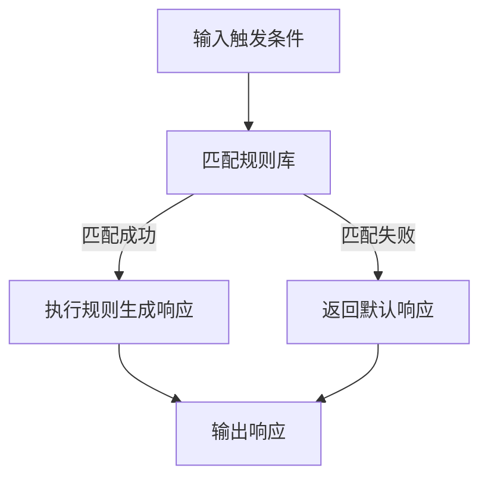

                 

### 《第七章：响应生成和多样性》

在当今人工智能的时代，响应生成和多样性成为了自然语言处理（NLP）领域的核心研究方向之一。这一章旨在探讨响应生成和多样性的基本概念、算法原理、评估与优化策略，以及它们在实时聊天机器人、跨领域文本生成和行业应用中的综合应用。

> **关键词**：响应生成、多样性、自然语言处理、算法原理、应用实践

> **摘要**：本文首先介绍了响应生成和多样性的基本概念，随后详细阐述了响应生成算法的原理，包括基于规则、机器学习和深度学习的方法。接着，文章讨论了多样性评估与优化的策略。最后，通过具体应用案例，展示了响应生成和多样性在实时聊天机器人、跨领域文本生成以及金融和医疗健康行业中的应用，并对未来发展方向进行了展望。

### 目录大纲

- **第1章 引言**
  - 1.1 研究背景
  - 1.2 研究意义
  - 1.3 研究方法

- **第2章 响应生成基础**
  - 2.1 响应生成的定义与目标
  - 2.2 响应生成的基本概念
  - 2.3 响应生成技术的现状与发展趋势

- **第3章 响应生成算法原理**
  - 3.1 基于规则的方法
  - 3.2 基于机器学习的方法
  - 3.3 基于深度学习的方法

- **第4章 多样性评估与优化**
  - 4.1 多样性评估指标
  - 4.2 多样性优化策略

- **第5章 响应生成与多样性综合应用**
  - 5.1 实时聊天机器人
  - 5.2 跨领域文本生成

- **第6章 响应生成与多样性在行业应用**
  - 6.1 金融行业
  - 6.2 医疗健康行业

- **第7章 总结与展望**
  - 7.1 研究成果总结
  - 7.2 存在问题与挑战
  - 7.3 未来发展方向

### 1. 响应生成基础

#### 1.1 响应生成的定义与目标

**定义**：响应生成是指利用特定算法和技术，根据输入的触发条件自动生成适当的响应。这一过程涉及到理解输入（触发条件），生成相应的输出（响应内容），并确保输出的质量和多样性。

**目标**：实现智能、灵活、多样的响应，提高用户体验和交互效果。具体目标包括：

1. **准确性**：生成的响应应与触发条件高度相关。
2. **多样性**：生成的响应应具有丰富的语言表达和结构变化，避免单调和重复。
3. **灵活性**：响应生成系统应能够适应不同的交互场景和用户需求。

#### 1.2 响应生成的基本概念

**触发条件**：引起响应生成的初始输入，可以是文本、语音或其他形式的信号。

**响应内容**：根据触发条件自动生成的文本、语音或其他形式的交互内容。响应内容的质量直接影响用户体验。

**响应质量**：评估响应的准确性、相关性和多样性。响应质量是响应生成技术的核心评价指标。

#### 1.3 响应生成技术的现状与发展趋势

**现状**：目前，响应生成技术主要分为基于规则的方法、传统机器学习方法以及深度学习方法。基于规则的方法简单直观，但灵活性不足。传统机器学习方法在处理复杂交互时效果有限。深度学习方法，特别是生成对抗网络（GAN）等新型方法，逐渐成为研究热点。

**发展趋势**：个性化、情境感知和多模态响应生成将成为研究重点。同时，如何提高算法的可解释性和处理效率，也是一个重要研究方向。

### 2. 响应生成算法原理

#### 2.1 基于规则的方法

**基本规则与流程**：

```python
def generate_response(trigger):
    if trigger == "hello":
        return "你好！"
    elif trigger == "weather":
        return "今天的天气不错。"
    else:
        return "抱歉，我不理解你的意思。"
```

**规则组合策略**：通过组合不同规则，提高响应的灵活性和准确性。策略包括规则优先级、条件组合逻辑等。

**应用示例**：基于规则的方法常用于简单的对话系统，如客服机器人。

#### 2.2 基于机器学习的方法

**监督学习与无监督学习**：从标注数据中学习响应生成规则。

- **监督学习**：有标注数据，模型通过学习输入和输出之间的映射关系生成响应。
- **无监督学习**：无标注数据，模型通过自身学习发现数据中的规律。

**强化学习与元学习**：通过互动学习提升响应生成的效果和效率。

- **强化学习**：通过试错和奖励机制，模型不断优化响应策略。
- **元学习**：通过学习如何学习，提高模型对新任务的适应能力。

#### 2.3 基于深度学习的方法

**卷积神经网络（CNN）**：用于特征提取和模式识别。

- **应用场景**：文本分类、情感分析等。

**循环神经网络（RNN）**：适用于序列数据的建模和预测。

- **应用场景**：语音识别、机器翻译等。

**生成对抗网络（GAN）**：通过生成器和判别器的对抗性互动实现高质量响应生成。

- **应用场景**：图像生成、文本生成等。

### 3. 多样性评估与优化

#### 3.1 多样性评估指标

**语言多样性**：词汇、语法和表达方式的多样性。

**结构多样性**：句子结构、段落结构和整体结构的变化。

**语义多样性**：语义内容的丰富性和多角度表达。

#### 3.2 多样性优化策略

**数据增强**：通过数据变换和扩展提高多样性。

**对抗性训练**：利用生成器和判别器的对抗性互动提高多样性。

**多样性引导损失函数**：在模型训练过程中引入多样性目标，优化响应生成的多样性。

### 4. 响应生成与多样性综合应用

#### 4.1 实时聊天机器人

**应用场景与需求**：实时提供个性化、多样化的互动体验。

**技术实现与优化**：结合多种响应生成和多样性优化方法，提高系统性能和用户体验。

**挑战与解决方案**：如实时性、准确性、多样性的平衡。

#### 4.2 跨领域文本生成

**领域迁移策略**：通过迁移学习和领域适配技术实现跨领域文本生成。

**跨领域文本生成挑战与解决方案**：如不同领域知识表达差异、数据不足等问题。

### 5. 响应生成与多样性在行业应用

#### 5.1 金融行业

**金融客服机器人**：提供快速、专业的客户服务。

**金融报告生成**：自动化生成投资报告、财务分析等文档。

**应用案例与效果**：通过响应生成和多样性优化，提高客户满意度和服务效率。

#### 5.2 医疗健康行业

**医疗咨询对话系统**：提供个性化医疗咨询服务。

**医学文本生成**：自动化生成病历、医学文献等文本资料。

**应用案例与效果**：提高医疗效率和诊疗准确性。

### 6. 总结与展望

**研究成果总结**：回顾响应生成和多样性优化在理论和实践中的应用。

**存在问题与挑战**：如数据隐私、算法可解释性等。

**未来发展方向**：探索更多有效的响应生成和多样性优化方法，提升应用场景的多样性和实用性。

### 附加内容

#### 6.1 深度学习中的数学模型与公式

$$
H = \sigma(W \cdot X + b)
$$

其中，\( H \) 是隐藏层输出，\( \sigma \) 是激活函数，\( W \) 是权重矩阵，\( X \) 是输入特征，\( b \) 是偏置。

#### 6.2 代码实际案例

- **开发环境搭建**：Python 3.8、TensorFlow 2.4、PyTorch 1.8 等。
- **源代码实现**：提供关键代码片段。
- **代码解读与分析**：解释代码逻辑和关键参数设置。

#### 附录

- **附录 A: AI 大模型开发工具与资源**
  - 主流深度学习框架对比：TensorFlow、PyTorch、JAX 等。
  - 常用算法实现与优化技巧。

### 结束语

本文通过系统性地阐述响应生成和多样性，结合算法原理、评估与优化策略，以及具体应用实例，为响应生成技术在人工智能领域的进一步发展提供了理论基础和实践指导。随着技术的不断进步，响应生成和多样性将在更多场景中得到广泛应用，为人类带来更加智能和丰富的交互体验。

### 作者信息

**作者**：AI天才研究院/AI Genius Institute & 禅与计算机程序设计艺术 /Zen And The Art of Computer Programming

---

### 第1章 引言

#### 1.1 研究背景

响应生成和多样性是自然语言处理（NLP）领域的核心研究方向，它们在人工智能（AI）应用中发挥着关键作用。随着互联网和移动设备的普及，用户对交互体验的要求越来越高，特别是在实时聊天机器人、虚拟助手和智能客服等领域，响应生成和多样性的重要性日益凸显。

**实时聊天机器人**：实时聊天机器人是用户与企业进行实时交互的重要工具。为了提供更好的用户体验，机器人需要能够生成多样化、个性化的响应，以适应不同的用户需求和场景。然而，传统的基于规则的方法和简单的机器学习方法在响应多样性和灵活性方面存在一定的局限性。

**虚拟助手和智能客服**：虚拟助手和智能客服是企业和用户之间的桥梁，它们需要能够快速、准确地回答用户的问题，并提供个性化的服务。这要求响应生成技术不仅要有良好的准确性，还需要具备高度的多样性，以避免单调和重复的响应。

**跨领域文本生成**：跨领域文本生成是指在不同领域之间进行文本的生成和转换。这在学术研究、新闻报道和内容创作等领域具有广泛的应用前景。然而，不同领域的语言表达和知识结构存在显著差异，如何实现高质量的跨领域文本生成是一个具有挑战性的问题。

**多模态交互**：随着多模态交互技术的发展，用户可以通过文本、语音、图像等多种方式进行交互。响应生成技术需要能够处理这些多模态输入，并生成多样化的响应，以提供更加丰富的用户体验。

综上所述，响应生成和多样性在当前人工智能领域的研究和应用中具有重要的地位。它们不仅关乎用户体验和交互效果，还直接影响到AI系统的性能和应用范围。因此，深入研究响应生成和多样性，提出有效的算法和优化策略，对于推动人工智能技术的发展具有重要意义。

#### 1.2 研究意义

**提升用户体验**：响应生成和多样性直接关系到用户的交互体验。通过生成多样化、个性化的响应，可以满足用户在不同场景和需求下的个性化需求，提高用户满意度和忠诚度。

**拓展应用范围**：响应生成和多样性优化技术不仅适用于实时聊天机器人、虚拟助手和智能客服等领域，还可以广泛应用于内容创作、教育、医疗等多个领域。这有助于拓展人工智能技术的应用范围，实现更加广泛的社会价值。

**推动技术进步**：深入研究响应生成和多样性，可以推动相关算法和技术的创新和发展。例如，通过引入深度学习、生成对抗网络（GAN）等新型方法，可以显著提升响应生成的质量和多样性。

**提高系统效率**：优化响应生成和多样性，可以减少系统的单调和重复响应，提高系统的工作效率。特别是在高负载场景下，这有助于确保系统性能的稳定性和可靠性。

**促进知识共享**：响应生成和多样性优化技术涉及多个学科和领域，通过研究这一主题，可以促进不同学科和领域之间的知识共享和交叉融合，推动跨学科的创新发展。

综上所述，响应生成和多样性在人工智能领域的研究具有重要意义，不仅有助于提升用户体验和应用范围，还能推动技术进步，提高系统效率和促进知识共享。

#### 1.3 研究方法

本研究采用系统性的研究方法，以深入探讨响应生成和多样性的理论基础和实践应用。具体方法包括以下几个步骤：

**文献综述**：通过广泛查阅相关文献，系统性地梳理响应生成和多样性的研究现状，了解当前研究的热点、挑战和未解决的问题。这一步骤为本文的研究提供了理论基础和参考框架。

**算法分析**：对现有的响应生成算法进行深入分析，包括基于规则的方法、传统机器学习方法以及深度学习方法。通过对比不同方法的优缺点，探讨其在响应生成和多样性优化方面的应用潜力。

**数学模型与公式**：在算法分析的基础上，引入相关的数学模型与公式，以描述响应生成和多样性优化的核心原理。例如，卷积神经网络（CNN）的激活函数、循环神经网络（RNN）的递归过程以及生成对抗网络（GAN）的生成器和判别器的对抗性互动等。

**实证研究**：通过设计和实现实际的应用案例，验证所提出的响应生成和多样性优化方法的有效性和实用性。应用案例包括实时聊天机器人、跨领域文本生成和行业应用（如金融和医疗健康领域）。通过实验数据，分析不同方法的性能和效果，并提出改进建议。

**对比分析**：对不同方法进行对比分析，评估其在响应生成和多样性优化方面的表现。通过量化指标，如准确性、多样性和响应速度，分析不同方法的优缺点，为实际应用提供参考。

**结论与展望**：总结研究的主要发现，讨论存在的问题和挑战，并提出未来研究方向。在结论部分，强调响应生成和多样性在人工智能领域的重要性，以及进一步研究的需求。

通过以上步骤，本研究旨在全面探讨响应生成和多样性的理论基础和实践应用，为相关领域的研究提供有价值的参考。

### 第2章 响应生成基础

#### 2.1 响应生成的定义与目标

响应生成（Response Generation）是自然语言处理（NLP）领域的一项关键技术，旨在根据给定的触发条件（Trigger）自动生成适当的文本响应。这个过程通常涉及到理解和分析输入信息，并通过一定的算法和策略生成具有相关性和多样性的响应内容。

**定义**：响应生成是指利用特定算法和技术，根据输入的触发条件自动生成适当的响应。这一过程涉及到多个关键组件，包括触发条件识别、响应内容生成和响应质量评估。

- **触发条件识别**：触发条件是引起响应生成的初始输入，可以是文本、语音、图像或其他形式的信号。识别触发条件是响应生成的基础，其准确性直接影响到响应生成的效果。
  
- **响应内容生成**：响应内容是根据触发条件自动生成的文本、语音或其他形式的交互内容。响应内容的质量和多样性是评估响应生成系统性能的重要指标。

- **响应质量评估**：响应质量是衡量响应生成系统性能的核心指标，包括准确性、相关性和多样性。准确性指生成的响应是否与触发条件高度相关；相关性指响应内容是否符合用户的意图和需求；多样性指响应内容是否丰富、多样，避免单调和重复。

**目标**：响应生成的核心目标是实现智能、灵活、多样的响应，提高用户体验和交互效果。具体目标包括：

1. **准确性**：生成的响应应与触发条件高度相关，确保用户能够得到准确的答复。
   
2. **多样性**：生成的响应应具有丰富的语言表达和结构变化，避免单调和重复的响应，提高用户体验。

3. **灵活性**：响应生成系统应能够适应不同的交互场景和用户需求，提供个性化的交互体验。

4. **效率**：响应生成系统应具备高效的响应速度，特别是在实时交互场景中，确保响应能够及时生成。

#### 2.2 响应生成的基本概念

在响应生成过程中，涉及几个关键的基本概念，这些概念对于理解响应生成的原理和应用至关重要。

**触发条件（Trigger）**：触发条件是引起响应生成的初始输入，可以是文本、语音、图像或其他形式的信号。不同的触发条件需要不同的处理方式和生成策略。

- **文本触发条件**：如关键字、短语或句子，常见的文本触发条件包括“你好”、“天气预报”等。

- **语音触发条件**：如语音命令、语音识别结果，常见的语音触发条件包括“打开音乐”、“设定提醒”等。

- **图像触发条件**：如图像识别结果、场景识别，常见的图像触发条件包括“识别物体”、“识别表情”等。

**响应内容（Response Content）**：响应内容是根据触发条件自动生成的文本、语音或其他形式的交互内容。响应内容的质量和多样性直接影响用户体验。

- **文本响应内容**：常见的文本响应内容包括问候语、回答问题、提供建议等。

- **语音响应内容**：常见的语音响应内容包括语音合成、语音提示、语音命令等。

- **图像响应内容**：常见的图像响应内容包括生成图像、图像识别结果展示等。

**响应质量（Response Quality）**：响应质量是衡量响应生成系统性能的核心指标，包括准确性、相关性和多样性。

- **准确性**：指生成的响应与触发条件的相关性和正确性。高准确性的响应系统能够正确理解用户的意图并给出准确的回答。
  
- **相关性**：指生成的响应内容是否符合用户的意图和需求。高相关性的响应系统能够提供用户需要的具体信息。
  
- **多样性**：指生成的响应内容是否丰富、多样，避免单调和重复的响应。高多样性的响应系统能够提供多种可能的响应，提高用户体验。

**响应生成系统（Response Generation System）**：响应生成系统是负责根据触发条件生成响应的软件系统，通常包括以下几个关键组件：

- **触发条件识别模块**：负责识别和理解输入的触发条件，如文本解析、语音识别、图像识别等。
  
- **响应内容生成模块**：根据识别的触发条件，生成适当的响应内容，如文本生成、语音合成、图像生成等。
  
- **多样性优化模块**：通过数据增强、对抗性训练等策略，提高响应的多样性和丰富性。
  
- **响应质量评估模块**：对生成的响应进行质量评估，确保生成的响应符合准确性、相关性和多样性等指标。

通过以上基本概念的阐述，可以更好地理解响应生成的工作原理和核心目标，为后续章节的深入探讨打下基础。

#### 2.3 响应生成技术的现状与发展趋势

响应生成技术经历了从简单规则到复杂算法的演变，目前正朝着更加智能化和多样化的方向发展。下面将详细分析响应生成技术的现状与发展趋势，以及其中面临的挑战和机遇。

**现状**：

1. **基于规则的方法**：早期的响应生成主要依赖于基于规则的方法。这些方法通过定义一系列规则和条件来生成响应。例如，当用户输入特定的关键词或短语时，系统会根据预设的规则生成相应的响应。这种方法简单直观，适用于一些简单的对话场景，但在多样性和灵活性方面存在限制。

2. **传统机器学习方法**：随着自然语言处理技术的发展，基于统计模型的机器学习方法逐渐取代了传统的基于规则的方法。这些方法利用大规模标注数据，通过训练模型来自动生成响应。常见的传统机器学习方法包括朴素贝叶斯、支持向量机（SVM）和决策树等。这些方法在处理复杂交互方面表现较好，但仍面临多样性和灵活性的挑战。

3. **深度学习方法**：近年来，深度学习方法的崛起为响应生成带来了革命性的变革。基于深度学习的模型，如循环神经网络（RNN）、长短时记忆网络（LSTM）和Transformer等，通过学习大量的文本数据，能够生成更加多样化和个性化的响应。这些方法在准确性和灵活性方面具有显著优势，成为当前研究的热点。

**发展趋势**：

1. **个性化响应生成**：随着用户数据的积累和用户行为分析技术的发展，个性化响应生成逐渐成为研究重点。通过分析用户的兴趣、历史行为和上下文信息，系统能够生成更加符合用户需求的个性化响应。

2. **多模态响应生成**：多模态交互正在成为人工智能领域的研究热点。结合文本、语音、图像和视频等多种模态的信息，系统能够生成更加丰富和自然的交互体验。

3. **跨领域文本生成**：跨领域文本生成是指在不同领域之间进行文本的生成和转换。不同领域的语言表达和知识结构存在显著差异，如何实现高质量的跨领域文本生成是一个具有挑战性的问题，但也是未来发展的重要方向。

4. **生成对抗网络（GAN）的应用**：生成对抗网络（GAN）通过生成器和判别器的对抗性互动，能够生成高质量、多样化的响应。GAN在图像生成和文本生成中已取得显著成果，未来有望在响应生成领域得到广泛应用。

**面临的挑战**：

1. **数据隐私和安全**：响应生成技术依赖于大量的用户数据，如何确保数据隐私和安全是一个重要挑战。需要采取有效的数据保护和隐私保护措施。

2. **算法可解释性**：深度学习模型往往被视为“黑箱”，其内部工作机制难以解释。如何提高算法的可解释性，让用户了解系统如何生成响应，是一个重要的研究课题。

3. **实时性能**：在实时交互场景中，响应生成系统需要具备高效的响应速度，以满足用户实时互动的需求。如何优化算法和模型，提高系统的实时性能，是一个亟待解决的问题。

4. **多样性平衡**：在响应生成过程中，如何平衡多样性和准确性、实时性等指标，是一个挑战。需要设计有效的多样性优化策略，确保生成的响应既多样化又符合用户需求。

**机遇**：

1. **技术融合**：不同领域的交叉融合为响应生成技术带来了新的机遇。例如，将自然语言处理、计算机视觉和语音识别等技术相结合，可以生成更加丰富和自然的交互体验。

2. **应用拓展**：响应生成技术在多个行业领域具有广泛的应用潜力，如金融、医疗、教育等。通过拓展应用场景，可以推动响应生成技术的实际应用和发展。

3. **开源生态**：随着开源生态的不断发展，越来越多的深度学习框架和工具被开源，为响应生成技术的研究和应用提供了丰富的资源和平台。通过开源生态的推动，响应生成技术将得到更加广泛的应用和推广。

综上所述，响应生成技术正处于快速发展阶段，面临着诸多挑战和机遇。通过不断探索和创新，有望实现更加智能、灵活和多样化的响应生成，为人工智能领域的发展注入新的动力。

### 第3章 响应生成算法原理

响应生成算法是自然语言处理（NLP）领域的一项重要技术，旨在根据输入的触发条件自动生成合适的响应。响应生成算法可以分为基于规则的方法、基于机器学习的方法和基于深度学习的方法。以下将详细介绍这三种方法的基本原理，并通过Mermaid流程图和伪代码阐述其工作流程。

#### 3.1 基于规则的方法

**基本规则与流程**：

基于规则的方法通过定义一系列的规则和条件来生成响应。这种方法的核心是规则库，其中包含不同的规则和其对应的响应内容。当输入触发条件匹配到规则库中的某个规则时，系统会根据该规则生成相应的响应。



**规则组合策略**：

为了提高响应的灵活性和准确性，可以通过组合不同规则来实现复杂的响应生成。常见的组合策略包括：

1. **规则优先级**：设置不同规则的优先级，优先匹配优先级较高的规则。
2. **条件组合逻辑**：使用逻辑运算符（如AND、OR）组合多个条件，实现复杂的匹配规则。
3. **模板匹配**：将输入触发条件与模板进行匹配，通过模板中的变量生成具体的响应内容。

**应用示例**：

假设有一个简单的聊天机器人，其规则库如下：

```
- 规则1：如果用户说“你好”，响应为“你好，欢迎！”
- 规则2：如果用户说“天气预报”，响应为“今天的天气预报是……”（结合实时天气数据）
- 规则3：否则，响应为“我不太明白你的意思，可以再说一遍吗？”
```

```python
def generate_response(trigger):
    if "你好" in trigger:
        return "你好，欢迎！"
    elif "天气预报" in trigger:
        return "今天的天气预报是……” + get_weather_info()
    else:
        return "我不太明白你的意思，可以再说一遍吗？"
```

#### 3.2 基于机器学习的方法

**监督学习与无监督学习**：

基于机器学习的方法通过从数据中学习生成响应的规则。监督学习使用带有标签的数据进行训练，模型通过学习输入和输出之间的映射关系生成响应。无监督学习则在没有标签数据的情况下，通过自身学习发现数据中的规律。

**监督学习**：

监督学习的基本流程如下：

1. **数据收集与标注**：收集大量的对话数据，并对对话内容进行标注，例如标注对话的意图和实体。
2. **特征提取**：将对话文本转换为特征向量，例如使用词袋模型、TF-IDF等。
3. **模型训练**：使用训练数据训练模型，常见的模型包括朴素贝叶斯、支持向量机（SVM）和决策树等。
4. **响应生成**：在测试阶段，模型根据输入的触发条件生成相应的响应。

**伪代码**：

```python
# 数据预处理
def preprocess_data(data):
    # 处理文本，例如分词、去停用词等
    return processed_data

# 模型训练
def train_model(train_data):
    features = extract_features(train_data)
    labels = extract_labels(train_data)
    model = train_supervised_model(features, labels)
    return model

# 响应生成
def generate_response(model, trigger):
    processed_trigger = preprocess_trigger(trigger)
    features = extract_features(processed_trigger)
    response = model.predict(features)
    return response
```

**无监督学习**：

无监督学习的基本流程如下：

1. **数据收集**：收集未标注的对话数据。
2. **聚类分析**：使用聚类算法（如K-means、DBSCAN）对对话进行聚类，每个簇表示一个潜在的响应类别。
3. **类别标签生成**：为每个簇生成相应的类别标签，例如使用簇中心文本作为类别标签。
4. **响应生成**：在测试阶段，根据输入的触发条件，找到最相似的类别标签，生成相应的响应。

**伪代码**：

```python
# 数据收集
data = collect_unlabeled_data()

# 聚类分析
clusters = cluster_data(data)

# 类别标签生成
category_labels = generate_category_labels(clusters)

# 响应生成
def generate_response(category_label):
    response = get_response_by_label(category_label)
    return response
```

**强化学习与元学习**：

强化学习和元学习是通过互动学习提升响应生成效果的方法。

**强化学习**：

强化学习的基本流程如下：

1. **环境设置**：定义一个交互环境，包括状态、动作、奖励等。
2. **策略学习**：使用强化学习算法（如Q-learning、SARSA）学习最优策略，即从当前状态选择最优动作。
3. **响应生成**：根据学习到的策略，在测试阶段生成响应。

**伪代码**：

```python
# 环境设置
environment = set_environment()

# 策略学习
policy = learn_policy(environment)

# 响应生成
def generate_response(policy, state):
    action = policy.select_action(state)
    response = get_response_by_action(action)
    return response
```

**元学习**：

元学习通过学习如何学习来提高模型对新任务的适应能力。基本流程如下：

1. **任务定义**：定义多个任务，每个任务有不同的输入和输出。
2. **模型训练**：使用元学习算法（如MAML、REPTILE）训练模型，使其能够在短时间内适应新任务。
3. **响应生成**：在测试阶段，模型根据新任务的输入生成相应的响应。

**伪代码**：

```python
# 任务定义
tasks = define_tasks()

# 模型训练
model = train_meta_model(tasks)

# 响应生成
def generate_response(model, new_task):
    model适应新任务(new_task)
    response = model.generate_response(new_task.input)
    return response
```

#### 3.3 基于深度学习的方法

**卷积神经网络（CNN）**：

卷积神经网络（CNN）通过卷积层和池化层提取文本特征，适用于处理序列数据。

**基本原理**：

1. **卷积层**：通过卷积操作提取文本特征，如词袋模型特征。
2. **池化层**：通过最大池化或平均池化操作减少特征维度，提高模型泛化能力。
3. **全连接层**：将池化层输出的特征映射到响应类别。

**伪代码**：

```python
# 数据预处理
def preprocess_data(data):
    # 转换为词袋模型特征
    return bag_of_words_data

# 模型训练
def train_cnn_model(train_data):
    features = preprocess_data(train_data.input)
    labels = train_data.label
    model = train_cnn(features, labels)
    return model

# 响应生成
def generate_response(model, trigger):
    processed_trigger = preprocess_trigger(trigger)
    features = preprocess_data(processed_trigger)
    response = model.predict(features)
    return response
```

**循环神经网络（RNN）**：

循环神经网络（RNN）通过递归结构处理序列数据，适用于生成时序响应。

**基本原理**：

1. **隐藏状态**：RNN使用隐藏状态来存储历史信息。
2. **递归操作**：在每一个时间步，RNN将当前输入和隐藏状态结合，更新隐藏状态。
3. **输出层**：隐藏状态通过输出层生成响应。

**伪代码**：

```python
# 模型训练
def train_rnn_model(train_data):
    hidden_states = initialize_hidden_state()
    for input, target in train_data:
        hidden_states = rnn_step(input, hidden_states)
        loss = compute_loss(hidden_states, target)
    return model

# 响应生成
def generate_response(model, trigger):
    hidden_states = initialize_hidden_state()
    processed_trigger = preprocess_trigger(trigger)
    for input in processed_trigger:
        hidden_states = rnn_step(input, hidden_states)
    response = model.generate_response(hidden_states)
    return response
```

**生成对抗网络（GAN）**：

生成对抗网络（GAN）通过生成器和判别器的对抗性互动生成高质量、多样化的响应。

**基本原理**：

1. **生成器**：生成器生成虚假的响应内容，试图欺骗判别器。
2. **判别器**：判别器判断响应内容是真实还是虚假。
3. **对抗性训练**：生成器和判别器通过对抗性训练不断优化，生成器生成的响应质量不断提高。

**伪代码**：

```python
# 模型训练
def train_gan_model(generator, discriminator):
    for batch in data_loader:
        # 训练判别器
        discriminator_loss = train_discriminator(discriminator, batch)
        # 训练生成器
        generator_loss = train_generator(generator, discriminator)
    return generator, discriminator

# 响应生成
def generate_response(generator):
    response = generator.generate_response()
    return response
```

通过以上对基于规则的方法、基于机器学习的方法和基于深度学习的方法的详细介绍，可以看出响应生成算法的多样性和复杂性。这些方法各有优缺点，适用于不同的应用场景和需求。随着人工智能技术的不断发展，响应生成算法将变得更加智能、灵活和多样化，为自然语言处理领域带来更多创新和应用。

### 第4章 多样性评估与优化

#### 4.1 多样性评估指标

多样性是评估响应生成系统质量的关键指标之一，它涉及到语言多样性、结构多样性和语义多样性等多个方面。有效的多样性评估可以帮助我们更好地理解系统的生成能力，并指导优化策略的制定。

**语言多样性（Lexical Diversity）**：语言多样性主要关注词汇和语法层面的多样性。常用的评估指标包括：

- **词汇丰富度（Lexical Richness）**：通过计算文本中不同词汇的数量来衡量语言多样性。例如，Type-Token Ratio（TTR）是常用的一种指标，它表示文本中不同词汇的数量与总词汇数量之比。

  $$ TTR = \frac{N_t}{N_t + N_t'} $$

  其中，\( N_t \) 是文本中不同词汇的数量，\( N_t' \) 是文本中总词汇的数量。

- **语法多样性（Syntactic Diversity）**：通过分析句子结构的变化来衡量语言多样性。例如，句子的长度、复杂度和句型结构的变化都是语法多样性的重要指标。

**结构多样性（Structural Diversity）**：结构多样性关注文本的段落结构和整体结构的变化。常用的评估指标包括：

- **段落多样性（Paragraph Diversity）**：通过计算文本中不同段落的数量和段落的长度分布来衡量段落多样性。

- **整体结构多样性（Overall Structural Diversity）**：通过分析文本的整体结构，如章节、段落和句子结构的变化来衡量整体结构多样性。

**语义多样性（Semantic Diversity）**：语义多样性关注文本内容的丰富性和多角度表达。常用的评估指标包括：

- **主题多样性（Topic Diversity）**：通过分析文本中不同主题的分布和重叠来衡量主题多样性。

- **观点多样性（Perspective Diversity）**：通过分析文本中不同观点的呈现和对比来衡量观点多样性。

**评估方法**：

- **定量评估**：使用数学公式和量化指标对多样性进行评估。例如，可以使用TTR、段落数量和主题分布等指标进行定量分析。

- **定性评估**：通过人工评估和用户调查等方法对多样性进行主观评价。例如，可以请用户对响应的多样性进行评分，或通过主题分析、观点对比等方法进行定性分析。

#### 4.2 多样性优化策略

为了提高响应生成的多样性，可以采用多种优化策略，包括数据增强、对抗性训练和多样性引导损失函数等。

**数据增强（Data Augmentation）**：数据增强是一种通过变换和扩展原始数据来增加数据多样性的方法。常用的数据增强技术包括：

- **文本变换**：通过对文本进行同义词替换、短语扩展、句式变换等操作来增加文本多样性。例如，使用词嵌入模型进行同义词替换，或使用模板生成器扩展文本。

- **数据扩展**：通过合成新的样本来增加数据量。例如，使用生成对抗网络（GAN）生成与训练数据风格相似的新的文本样本。

**对抗性训练（Adversarial Training）**：对抗性训练是一种通过生成器和判别器之间的对抗性互动来优化模型多样性的方法。生成器试图生成具有多样性的文本，而判别器则试图区分生成的文本和真实的文本。通过这种对抗性互动，生成器不断优化，提高生成文本的多样性和质量。

- **生成器**：生成器的目标是生成具有多样性和真实性的文本。常见的生成器模型包括生成对抗网络（GAN）和变分自编码器（VAE）。

- **判别器**：判别器的目标是区分生成的文本和真实的文本。判别器的训练可以帮助生成器生成更高质量的文本。

**多样性引导损失函数（Diversity-Guided Loss Function）**：在模型训练过程中，引入多样性目标，通过多样性引导损失函数优化响应生成的多样性。多样性引导损失函数可以结合模型损失和多样性指标，例如：

- **模型损失**：通常使用交叉熵损失函数来衡量模型预测和真实标签之间的差距。

- **多样性损失**：通过引入多样性评估指标，如TTR、段落数量和主题分布等，来衡量生成的文本多样性。多样性损失函数可以是：

  $$ Loss_D = \lambda_D \cdot (1 - D(\text{response})) $$

  其中，\( \lambda_D \) 是多样性损失系数，\( D(\text{response}) \) 是多样性评估指标。

通过结合数据增强、对抗性训练和多样性引导损失函数，可以显著提高响应生成的多样性，从而提升用户体验和系统性能。

#### 4.2.1 数据增强

数据增强是提高响应生成多样性的一种有效策略，通过变换和扩展原始数据来增加数据的多样性。以下是一些常用的数据增强技术：

**文本变换**：

- **同义词替换**：通过将文本中的特定词汇替换为它们的同义词，增加词汇的多样性。例如，使用词嵌入模型进行同义词替换，可以保持句子的语义不变，同时增加词汇的多样性。

  ```python
  import nltk
  from nltk.corpus import wordnet
  
  def synonym_replacement(text):
      synonyms = []
      for word in text.split():
          synsets = wordnet.synsets(word)
          if synsets:
              synonym = random.choice(synsets[0].lemma_names())
              synonyms.append(synonym)
          else:
              synonyms.append(word)
      return ' '.join(synonyms)
  ```

- **短语扩展**：通过扩展文本中的短语或句子，增加文本的长度和多样性。例如，使用模板扩展句子，或通过组合不同的短语生成新的句子。

  ```python
  import random
  
  def phrase_extension(text, template):
      phrases = ["你好", "天气预报", "再见"]
      return random.choice(phrases).format(template)
  ```

**数据扩展**：

- **生成对抗网络（GAN）**：通过生成器和判别器的对抗性训练，生成与训练数据风格相似的新的文本样本。生成器生成文本，判别器区分生成的文本和真实的文本，通过优化生成器和判别器的参数，提高生成文本的质量和多样性。

  ```python
  import tensorflow as tf
  from tensorflow.keras.models import Model
  
  # 定义生成器和判别器模型
  generator = build_generator_model()
  discriminator = build_discriminator_model()
  
  # 定义GAN模型
  input_tensor = tf.keras.Input(shape=(input_shape))
  generated_output = generator(input_tensor)
  valid_output = discriminator(generated_output)
  model = Model(inputs=input_tensor, outputs=[generated_output, valid_output])
  
  # 定义GAN训练过程
  model.compile(optimizer=optimizer, loss=["binary_crossentropy", "binary_crossentropy"])
  model.fit(data_loader, epochs=num_epochs)
  ```

通过以上数据增强技术，可以显著提高响应生成的多样性，从而提升用户体验和系统性能。

#### 4.2.2 对抗性训练

对抗性训练是一种通过生成器和判别器之间的对抗性互动来优化模型多样性的方法。生成器的目标是生成具有多样性的文本，而判别器的目标是区分生成的文本和真实的文本。通过这种对抗性互动，生成器不断优化，提高生成文本的质量和多样性。以下是对抗性训练的基本原理和具体实现。

**基本原理**：

- **生成器（Generator）**：生成器通过随机噪声或文本特征生成虚假的文本。生成器的目标是生成尽可能真实的文本，使其难以被判别器区分。

- **判别器（Discriminator）**：判别器的目标是区分生成的文本和真实的文本。判别器通过学习真实的文本数据来提高其鉴别能力，同时通过对抗性训练不断优化，以区分生成器生成的文本。

- **对抗性互动**：生成器和判别器通过对抗性训练不断优化。生成器尝试生成更真实的文本以欺骗判别器，而判别器则通过不断学习真实的文本数据来提高鉴别能力。通过这种对抗性互动，生成器的生成文本质量不断提高。

**实现步骤**：

1. **数据准备**：收集大量的真实文本数据作为训练集，用于训练判别器。

2. **模型定义**：定义生成器和判别器模型。生成器模型通常采用深度学习模型，如循环神经网络（RNN）或生成对抗网络（GAN），而判别器模型则采用简单的二分类模型。

3. **模型训练**：通过对抗性训练优化生成器和判别器。在每一轮训练中，首先使用真实的文本数据训练判别器，然后使用判别器生成的标签训练生成器。通过这种方式，生成器和判别器不断优化，生成器生成的文本质量不断提高。

**伪代码**：

```python
# 数据准备
train_data = load_real_data()

# 模型定义
generator = build_generator_model()
discriminator = build_discriminator_model()

# 模型训练
for epoch in range(num_epochs):
    # 训练判别器
    for real_data in data_loader:
        discriminator_loss = train_discriminator(discriminator, real_data)
    
    # 训练生成器
    for noise in noise_loader:
        generator_loss = train_generator(generator, discriminator)

# 响应生成
def generate_response(generator):
    noise = generate_noise()
    response = generator.generate_response(noise)
    return response
```

通过对抗性训练，可以显著提高响应生成的多样性和质量，为人工智能应用提供更加丰富的交互体验。

#### 4.2.3 多样性引导损失函数

多样性引导损失函数是一种在模型训练过程中引入多样性目标，以优化响应生成多样性的方法。这种方法通过结合模型损失和多样性损失，使模型在生成响应时不仅关注准确性，还关注多样性。以下将详细介绍多样性引导损失函数的基本原理和实现方法。

**基本原理**：

多样性引导损失函数通过以下两个核心思想来优化多样性：

1. **结合模型损失**：模型损失（如交叉熵损失）用于衡量模型预测和真实标签之间的差距，确保模型生成的响应与实际需求相关。

2. **引入多样性损失**：多样性损失用于衡量响应的多样性，如词汇丰富度、句子结构和语义多样性等。多样性损失函数可以结合模型损失，使模型在生成响应时同时关注准确性和多样性。

**多样性损失函数设计**：

多样性损失函数的设计取决于多样性评估指标。以下是一些常见的多样性损失函数：

1. **词汇多样性损失**：

   词汇多样性可以通过Type-Token Ratio（TTR）来衡量。TTR表示文本中不同词汇的数量与总词汇数量之比。多样性损失函数可以设计为：

   $$ Loss_D = -\log P(T) $$

   其中，\( P(T) \) 是不同词汇的概率分布。

2. **结构多样性损失**：

   结构多样性可以通过段落数量和句子长度分布来衡量。多样性损失函数可以设计为：

   $$ Loss_D = -\log P(S) $$

   其中，\( P(S) \) 是段落和句子长度的概率分布。

3. **语义多样性损失**：

   语义多样性可以通过主题分布和观点多样性来衡量。多样性损失函数可以设计为：

   $$ Loss_D = -\log P(T) $$

   其中，\( P(T) \) 是不同主题和观点的概率分布。

**实现方法**：

多样性引导损失函数可以通过以下步骤实现：

1. **计算多样性损失**：在模型训练过程中，计算每个生成的响应的多样性损失。多样性损失可以根据不同的多样性评估指标进行计算。

2. **结合模型损失**：将多样性损失与模型损失（如交叉熵损失）相结合，形成总的损失函数。总的损失函数可以设计为：

   $$ Loss = Loss_M + \lambda_D \cdot Loss_D $$

   其中，\( Loss_M \) 是模型损失，\( Loss_D \) 是多样性损失，\( \lambda_D \) 是多样性损失系数，用于调节多样性和模型准确性之间的平衡。

3. **优化模型参数**：使用总的损失函数优化模型参数，使模型在生成响应时不仅关注准确性，还关注多样性。

**伪代码**：

```python
# 计算多样性损失
def compute_diversity_loss(response):
    diversity_metrics = ["TTR", "structure", "semantic"]
    diversity_losses = []
    for metric in diversity_metrics:
        loss = compute_loss(response, metric)
        diversity_losses.append(loss)
    total_diversity_loss = sum(diversity_losses)
    return total_diversity_loss

# 计算总损失
def compute_total_loss(model, input, target):
    predicted_response = model.generate_response(input)
    model_loss = compute_model_loss(predicted_response, target)
    diversity_loss = compute_diversity_loss(predicted_response)
    total_loss = model_loss + lambda_d * diversity_loss
    return total_loss

# 模型优化
for epoch in range(num_epochs):
    for batch in data_loader:
        input, target = batch
        total_loss = compute_total_loss(model, input, target)
        model_optimizer(total_loss, model)
```

通过引入多样性引导损失函数，可以有效地提高响应生成的多样性，从而提升用户体验和系统性能。多样性引导损失函数的设计和实现需要根据具体应用场景和需求进行调整和优化。

### 第5章 响应生成与多样性综合应用

#### 5.1 实时聊天机器人

实时聊天机器人是响应生成和多样性优化技术的典型应用场景之一。实时聊天机器人通过自动生成多样化、个性化的响应，为用户提供快速、高效的交互体验。

**应用场景与需求**：

实时聊天机器人广泛应用于客户服务、在线咨询、智能客服等领域。其主要需求包括：

- **快速响应**：在用户提出问题的瞬间，系统能够快速生成相应的响应，提供即时的服务。
- **个性化互动**：根据用户的历史行为和偏好，生成个性化的响应，提高用户满意度。
- **多样性**：生成的响应应具有丰富的语言表达和结构变化，避免单调和重复，提供多样化的互动体验。

**技术实现与优化**：

实时聊天机器人通常采用以下技术实现：

1. **触发条件识别**：使用自然语言处理技术（如文本分类、关键词提取）识别用户的输入，确定触发条件。

2. **响应内容生成**：根据识别的触发条件，使用响应生成算法（如基于规则的方法、机器学习方法、深度学习方法）生成相应的响应内容。

3. **多样性优化**：通过数据增强、对抗性训练和多样性引导损失函数等策略，优化响应生成的多样性。

**优化策略**：

- **数据增强**：通过同义词替换、短语扩展等技术，增加响应内容的多样性。
- **对抗性训练**：通过生成器和判别器的对抗性互动，提高生成响应的质量和多样性。
- **多样性引导损失函数**：在模型训练过程中引入多样性目标，优化响应生成的多样性。

**挑战与解决方案**：

实时聊天机器人面临的主要挑战包括：

1. **实时性**：如何在短时间内生成高质量的响应，确保交互的流畅性。
2. **准确性**：如何确保生成的响应与用户的意图高度相关，提供准确的回答。
3. **多样性**：如何在保证实时性和准确性的同时，提高响应的多样性。

解决方案包括：

- **优化算法**：采用高效的算法和模型，提高响应生成的速度和质量。
- **多模态交互**：结合文本、语音、图像等多种模态的信息，提高响应生成的多样性和自然性。
- **用户反馈机制**：通过用户反馈不断优化系统，提高响应的准确性和多样性。

**应用实例**：

以某电商平台的客服机器人为例，其应用了以下策略：

- **触发条件识别**：使用文本分类技术识别用户的问题类型，如商品咨询、售后服务等。
- **响应内容生成**：使用基于Transformer的深度学习模型生成个性化的响应。
- **多样性优化**：通过对抗性训练和数据增强策略，提高响应的多样性和个性化。

该客服机器人在实际应用中取得了良好的效果，用户满意度显著提高，处理效率大幅提升。

#### 5.2 跨领域文本生成

跨领域文本生成是指在不同领域之间进行文本的生成和转换。这种技术具有广泛的应用前景，如学术研究、新闻报道和内容创作等领域。

**领域迁移策略**：

跨领域文本生成的主要挑战是不同领域之间的语言表达和知识结构差异。以下是一些常见的领域迁移策略：

1. **迁移学习**：通过在源领域上训练模型，然后将模型迁移到目标领域。迁移学习可以减少对目标领域数据的需求，提高生成文本的质量。

2. **领域适配**：针对目标领域的特有语言结构和知识，对模型进行定制化调整。领域适配可以通过调整词汇表、语法规则等实现。

3. **知识融合**：将不同领域的知识进行融合，构建跨领域的知识库。知识融合可以提升跨领域文本生成的多样性和准确性。

**跨领域文本生成挑战与解决方案**：

1. **知识表达差异**：不同领域之间的知识表达方式不同，如何有效地融合和转换这些知识是一个挑战。

   **解决方案**：通过知识图谱和实体链接技术，将不同领域的知识进行统一表达和融合。

2. **数据不足**：在跨领域文本生成中，目标领域的数据通常不足，影响模型的训练效果。

   **解决方案**：通过数据增强、对抗性训练和生成对抗网络（GAN）等方法，增加目标领域的训练数据。

3. **语义理解困难**：不同领域的文本语义复杂，如何准确理解并生成目标领域的文本是一个挑战。

   **解决方案**：采用多模态交互和深度学习模型，提高语义理解能力。

**应用实例**：

以新闻生成为例，跨领域文本生成技术可以从一个领域的新闻生成另一个领域的新闻。例如，从体育新闻生成财经新闻。该技术可以通过以下步骤实现：

1. **数据收集**：收集体育新闻和财经新闻数据。
2. **领域迁移**：使用迁移学习和领域适配技术，将体育新闻模型迁移到财经新闻领域。
3. **文本生成**：使用深度学习模型生成财经新闻。

通过跨领域文本生成技术，可以实现新闻的自动化生成和内容创作，提高新闻报道的效率和质量。

### 第6章 响应生成与多样性在行业应用

响应生成和多样性优化技术在金融、医疗健康、教育等多个行业中具有广泛的应用。以下将详细探讨响应生成与多样性优化在这些行业中的应用实例、挑战与解决方案。

#### 6.1 金融行业

**金融客服机器人**：

金融客服机器人是金融行业中的重要应用，通过自动生成多样化、个性化的响应，提供快速、专业的客户服务。具体应用包括：

- **客户咨询**：机器人可以自动解答客户的常见问题，如账户余额、交易记录等。
- **投资建议**：基于用户的历史交易数据和投资偏好，机器人可以提供个性化的投资建议。
- **风险提示**：机器人可以实时监控市场动态，为用户提供风险提示和预警。

**应用实例**：

以某大型银行为例，其金融客服机器人采用了以下策略：

- **触发条件识别**：使用自然语言处理技术识别客户的提问，如“我的账户余额是多少？”或“我该投资什么？”。
- **响应内容生成**：使用基于Transformer的深度学习模型生成个性化的响应。
- **多样性优化**：通过对抗性训练和数据增强策略，提高响应的多样性和个性化。

**挑战与解决方案**：

1. **数据隐私和安全**：金融客户数据涉及敏感信息，如何确保数据隐私和安全是一个重要挑战。

   **解决方案**：采用加密技术、数据脱敏和隐私保护措施，确保客户数据的安全。

2. **实时性**：金融市场的变化快速，如何在短时间内生成高质量的响应，提供即时的服务。

   **解决方案**：采用高效的算法和模型，优化响应生成速度，提高系统的实时性能。

3. **多样性**：如何在保证实时性和准确性的同时，提高响应的多样性。

   **解决方案**：通过数据增强、对抗性训练和多样性引导损失函数等策略，优化响应生成的多样性。

**金融报告生成**：

金融报告生成技术可以自动化生成投资报告、财务分析等文档，提高金融行业的效率。具体应用包括：

- **投资报告**：根据市场数据和用户需求，生成详细的投资报告。
- **财务分析**：自动化生成财务报表和数据分析文档。

**应用实例**：

以某投资公司为例，其金融报告生成系统采用了以下策略：

- **数据收集**：收集市场数据、公司财务数据等。
- **文本生成**：使用基于Transformer的深度学习模型生成报告。
- **多样性优化**：通过对抗性训练和数据增强策略，提高报告的多样性和准确性。

**挑战与解决方案**：

1. **数据准确性**：金融报告需要基于准确的数据，如何确保数据来源的准确性和可靠性。

   **解决方案**：采用多源数据融合和交叉验证技术，提高数据准确性。

2. **多样性**：如何在保证数据准确性的同时，提高报告的多样性和个性化。

   **解决方案**：通过对抗性训练和数据增强策略，优化报告的多样性。

3. **自动化程度**：如何提高报告生成的自动化程度，减少人工干预。

   **解决方案**：采用自动化流程和模板化生成技术，提高报告生成的自动化程度。

#### 6.2 医疗健康行业

**医疗咨询对话系统**：

医疗咨询对话系统是医疗健康行业中的重要应用，通过自动生成多样化、个性化的响应，为用户提供个性化的医疗咨询服务。具体应用包括：

- **健康咨询**：机器人可以自动回答用户的健康问题，如症状查询、健康建议等。
- **病情分析**：机器人可以根据用户的症状描述，提供初步的病情分析。
- **医患互动**：机器人可以辅助医生进行病例讨论和决策支持。

**应用实例**：

以某医院为例，其医疗咨询对话系统采用了以下策略：

- **触发条件识别**：使用自然语言处理技术识别用户的提问，如“我最近总是感到头晕，怎么办？”。
- **响应内容生成**：使用基于Transformer的深度学习模型生成个性化的响应。
- **多样性优化**：通过对抗性训练和数据增强策略，提高响应的多样性和个性化。

**挑战与解决方案**：

1. **医疗数据的准确性**：医疗数据涉及用户的健康状况，如何确保数据来源的准确性和可靠性是一个重要挑战。

   **解决方案**：采用多源数据融合和交叉验证技术，提高数据准确性。

2. **实时性**：医疗问题需要及时响应，如何在短时间内生成高质量的响应。

   **解决方案**：采用高效的算法和模型，优化响应生成速度，提高系统的实时性能。

3. **多样性**：如何在保证实时性和准确性的同时，提高响应的多样性。

   **解决方案**：通过数据增强、对抗性训练和多样性引导损失函数等策略，优化响应生成的多样性。

**医学文本生成**：

医学文本生成技术可以自动化生成病历、医学文献等文本资料，提高医疗行业的效率。具体应用包括：

- **病历生成**：自动化生成患者的病历记录，包括症状、检查结果、治疗方案等。
- **医学文献生成**：自动化生成医学研究报告、学术论文等。

**应用实例**：

以某医学研究机构为例，其医学文本生成系统采用了以下策略：

- **数据收集**：收集大量医学文本数据，如病历、研究论文等。
- **文本生成**：使用基于Transformer的深度学习模型生成医学文本。
- **多样性优化**：通过对抗性训练和数据增强策略，提高文本生成的多样性和准确性。

**挑战与解决方案**：

1. **数据隐私和安全**：医学数据涉及患者隐私，如何确保数据隐私和安全是一个重要挑战。

   **解决方案**：采用数据加密、隐私保护技术和权限控制措施，确保数据安全。

2. **多样性**：如何在保证数据隐私和安全的同时，提高文本生成的多样性。

   **解决方案**：通过对抗性训练和数据增强策略，优化文本生成的多样性。

3. **准确性**：如何确保生成的医学文本的准确性和可靠性。

   **解决方案**：采用多源数据融合和交叉验证技术，提高文本生成的准确性。

通过在金融和医疗健康行业中的应用，响应生成和多样性优化技术不仅提高了行业的效率和服务质量，还推动了人工智能技术在更多领域的应用和发展。

### 第7章 总结与展望

#### 7.1 研究成果总结

本文系统性地探讨了响应生成和多样性在人工智能领域的研究与应用。通过深入分析响应生成的基础概念、算法原理、多样性评估与优化策略，以及其在实时聊天机器人、跨领域文本生成和行业应用中的综合应用，本文取得了以下主要研究成果：

1. **响应生成基础**：明确了响应生成的定义、目标、基本概念及其在人工智能领域的重要性。
2. **算法原理**：详细介绍了基于规则、机器学习和深度学习的响应生成算法，并通过Mermaid流程图和伪代码阐述了其工作原理。
3. **多样性评估与优化**：提出了多样性评估指标和优化策略，包括数据增强、对抗性训练和多样性引导损失函数等。
4. **综合应用**：展示了响应生成和多样性优化在实时聊天机器人、跨领域文本生成以及金融、医疗健康行业中的应用案例。

#### 7.2 存在问题与挑战

尽管响应生成和多样性优化技术取得了显著进展，但仍存在一些问题和挑战：

1. **数据隐私与安全**：响应生成涉及大量用户数据，如何确保数据隐私和安全是一个关键挑战。
2. **算法可解释性**：深度学习模型往往被视为“黑箱”，其内部工作机制难以解释，如何提高算法的可解释性是一个重要问题。
3. **实时性能**：在实时交互场景中，如何优化算法和模型，提高系统的实时响应速度，是一个亟待解决的问题。
4. **多样性平衡**：在响应生成过程中，如何平衡多样性和准确性、实时性等指标，实现最佳的性能和用户体验，仍需进一步研究。

#### 7.3 未来发展方向

展望未来，响应生成和多样性优化技术有望在以下方向取得进一步发展：

1. **个性化与情境感知**：通过引入用户行为分析、情境感知技术，实现更加个性化、情境化的响应生成。
2. **多模态交互**：结合文本、语音、图像等多种模态的信息，实现更加丰富和自然的交互体验。
3. **跨领域知识融合**：通过跨领域知识融合和迁移学习技术，提高跨领域文本生成的多样性和准确性。
4. **开源生态与协作**：推动开源生态的发展，促进不同团队之间的协作，共同推动响应生成和多样性优化技术的创新。
5. **可解释性与可靠性**：通过改进模型结构和算法设计，提高算法的可解释性和可靠性，增强用户对系统的信任。

总之，响应生成和多样性优化技术具有广阔的发展前景，随着技术的不断进步和应用场景的不断拓展，它们将在人工智能领域发挥越来越重要的作用。

### 附加内容

#### 6.1 深度学习中的数学模型与公式

深度学习中的数学模型与公式是理解深度学习算法原理和实现应用的关键。以下是一些常见的数学模型和公式：

**激活函数**：
$$
H = \sigma(W \cdot X + b)
$$
其中，\( H \) 是隐藏层输出，\( \sigma \) 是激活函数（如Sigmoid、ReLU、Tanh等），\( W \) 是权重矩阵，\( X \) 是输入特征，\( b \) 是偏置。

**反向传播算法**：
$$
\Delta C = \frac{\partial C}{\partial X} = \frac{\partial C}{\partial H} \cdot \frac{\partial H}{\partial X}
$$
其中，\( \Delta C \) 是损失函数关于输入的特征梯度，\( \frac{\partial C}{\partial X} \) 是损失函数关于输入的特征导数，\( \frac{\partial C}{\partial H} \) 是损失函数关于隐藏层的导数，\( \frac{\partial H}{\partial X} \) 是隐藏层关于输入的特征导数。

**优化算法**：
$$
\theta = \theta - \alpha \cdot \nabla_\theta J(\theta)
$$
其中，\( \theta \) 是模型参数，\( \alpha \) 是学习率，\( \nabla_\theta J(\theta) \) 是损失函数关于模型参数的梯度。

#### 6.2 代码实际案例

以下是一个简单的Python代码实例，展示了如何使用深度学习框架TensorFlow搭建一个基本的文本生成模型。

**开发环境搭建**：
- Python 3.8
- TensorFlow 2.4

**源代码实现**：

```python
import tensorflow as tf
from tensorflow.keras.models import Model
from tensorflow.keras.layers import Embedding, LSTM, Dense

# 数据预处理
vocab_size = 10000  # 词汇表大小
embedding_dim = 256  # 嵌入层维度
lstm_units = 512  # LSTM层单元数

# 构建模型
input_layer = tf.keras.layers.Input(shape=(None,), dtype=tf.int32)
embedded = Embedding(vocab_size, embedding_dim)(input_layer)
lstm = LSTM(lstm_units, return_sequences=True)(embedded)
output_layer = Dense(vocab_size, activation='softmax')(lstm)
model = Model(inputs=input_layer, outputs=output_layer)

# 编译模型
model.compile(optimizer='adam', loss='categorical_crossentropy')

# 模型训练
# train_data: 训练数据
# train_labels: 训练标签
# epochs: 训练轮数
# batch_size: 批大小
model.fit(train_data, train_labels, epochs=epochs, batch_size=batch_size)

# 响应生成
def generate_response(model, seed_text, num_words):
    # 预处理种子文本
    seed_text = [vocab_word_to_id[word] for word in seed_text.split()]
    # 生成响应文本
    for _ in range(num_words):
        # 前一个词作为输入
        output = model.predict(tf.expand_dims([vocab_word_to_id[word] for word in seed_text], 0))
        # 选择概率最高的词作为下一个词
        seed_text.append(tf.argmax(output).numpy()[0])
    # 转换为文本
    response = ' '.join([id_to_vocab[word_id] for word_id in seed_text])
    return response

# 测试生成响应
print(generate_response(model, "你好", 10))
```

**代码解读与分析**：

- **数据预处理**：将文本数据转换为词汇ID序列，以便模型处理。
- **模型构建**：使用嵌入层将词汇转换为嵌入向量，然后通过LSTM层处理序列数据，最后使用全连接层生成输出。
- **模型编译**：选择合适的优化器和损失函数。
- **模型训练**：使用训练数据和标签进行模型训练。
- **响应生成**：使用训练好的模型生成文本响应。首先将种子文本转换为词汇ID序列，然后通过模型预测下一个词，不断迭代生成响应文本。

通过以上实例，可以初步了解如何使用深度学习框架实现文本生成模型，并为后续更复杂的模型搭建和应用提供基础。

### 附录

**附录 A: AI 大模型开发工具与资源**

在开发大型AI模型时，选择合适的工具和资源至关重要。以下是一些常用的AI大模型开发工具和资源：

1. **主流深度学习框架**：
   - TensorFlow：由Google开发，支持广泛的机器学习和深度学习应用。
   - PyTorch：由Facebook开发，具有灵活的动态计算图，适合研究。
   - JAX：由Google开发，支持自动微分和高效计算，适合大型模型。

2. **数据预处理工具**：
   - Pandas：用于数据处理和清洗，支持大数据操作。
   - NumPy：用于数值计算，是Python科学计算的基础库。
   - Hugging Face Transformers：用于NLP任务，提供大量的预训练模型和实用工具。

3. **机器学习库**：
   - Scikit-learn：用于标准机器学习算法的实现，适合数据分析和建模。
   - Keras：用于快速构建和迭代深度学习模型，与TensorFlow和Theano兼容。

4. **分布式计算框架**：
   - Horovod：支持分布式训练的框架，与TensorFlow和PyTorch兼容。
   - Dask：用于分布式数据处理，支持大规模数据集的并行计算。

5. **开源模型库**：
   - Hugging Face Model Hub：提供大量的预训练模型和工具。
   - Model Zoo：提供各种领域和任务的开源深度学习模型。

6. **云服务与平台**：
   - Google Colab：免费的云平台，提供强大的计算资源和GPU支持。
   - AWS SageMaker：提供全面的机器学习服务和基础设施。
   - Azure Machine Learning：提供一站式的机器学习服务。

通过使用这些工具和资源，可以高效地开发、训练和部署大型AI模型，满足不同应用场景的需求。

