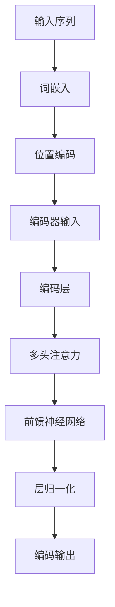
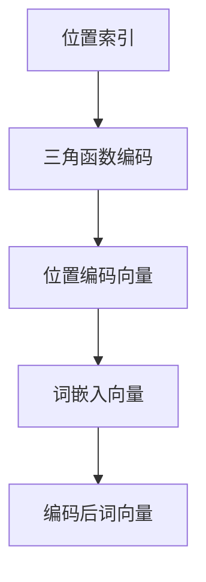
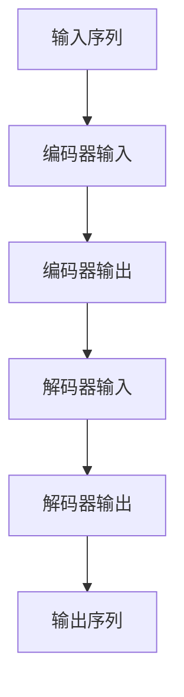

                 

# 第五章：Transformer 架构的革命

> 关键词：Transformer、自注意力机制、位置编码、自然语言处理、计算机视觉

> 摘要：Transformer 架构作为一种革命性的神经网络架构，自提出以来在自然语言处理领域取得了显著的成果。本章将对 Transformer 架构进行深入剖析，从其诞生背景、核心概念、实现原理、应用场景到优化与改进，全面解读这一创新性架构的魅力所在。

## 第1章: Transformer 架构概述

### 1.1 Transformer 架构的诞生与背景

#### 1.1.1 Transformer 的诞生背景

Transformer 架构是由 Google 研究团队在 2017 年提出的一种用于序列到序列学习的神经网络模型。在此之前，序列到序列学习主要依赖于循环神经网络（RNN）和长短期记忆网络（LSTM）。然而，这些传统方法在处理长距离依赖问题和并行计算方面存在一定的局限性。Transformer 架构的提出，打破了传统方法的局限，通过引入自注意力机制，实现了更高效、更灵活的序列建模。

#### 1.1.2 Transformer 架构的主要贡献

1. **自注意力机制**：Transformer 架构的核心创新点，通过计算序列中每个词与其他词的相关性，实现更精准的词间依赖建模。
2. **并行计算**：Transformer 采用多头注意力机制和前馈神经网络，使得模型在训练过程中可以并行计算，大幅提高了计算效率。
3. **模型层次结构**：Transformer 架构采用了编码器（Encoder）和解码器（Decoder）两个层次结构，分别负责输入序列和输出序列的建模。

### 1.2 Transformer 架构的核心概念

#### 1.2.1 自注意力机制

自注意力机制是 Transformer 架构的核心，它通过计算序列中每个词与其他词的相似度，实现对输入序列的建模。自注意力机制的计算过程如下：

1. **计算 Query、Key 和 Value**：首先，对输入序列的每个词进行编码，得到 Query、Key 和 Value。
2. **计算相似度**：通过计算 Query 和 Key 的点积，得到相似度矩阵，表示序列中每个词与其他词的相关性。
3. **应用 Softmax 函数**：对相似度矩阵进行 Softmax 处理，得到权重矩阵，表示每个词在序列中的重要性。
4. **计算加权求和**：将权重矩阵与 Value 相乘，得到加权求和结果，作为输出。

#### 1.2.2 位置编码

位置编码是 Transformer 架构的另一个关键概念，它用于为模型提供序列中每个词的位置信息。位置编码的方法通常采用三角函数编码，将位置信息编码到词向量中。具体实现如下：

1. **初始化位置编码向量**：根据序列长度生成一组位置编码向量，每个向量对应一个词的位置。
2. **与词向量相加**：将位置编码向量与输入词向量相加，得到编码后的词向量。

#### 1.2.3 Transformer 模型的层次结构

Transformer 模型由编码器（Encoder）和解码器（Decoder）两个层次组成。编码器负责对输入序列进行建模，解码器则负责生成输出序列。

1. **Encoder 模块**：
   - **多层堆叠**：Encoder 模块由多个编码层组成，每层包含多头注意力机制和前馈神经网络。
   - **输入和输出**：编码器的输入为位置编码后的词向量序列，输出为编码后的序列。

2. **Decoder 模块**：
   - **多层堆叠**：Decoder 模块由多个解码层组成，每层也包含多头注意力机制和前馈神经网络。
   - **输入和输出**：解码器的输入为编码器的输出和位置编码后的词向量序列，输出为解码后的序列。

### 1.3 Transformer 架构的优点与挑战

#### 1.3.1 Transformer 架构的优点

1. **高效并行计算**：Transformer 架构通过自注意力机制和多头注意力机制，实现了高效的并行计算，大幅提高了训练速度。
2. **长距离依赖建模**：自注意力机制能够建模序列中任意两个词之间的依赖关系，解决了传统循环神经网络在处理长距离依赖问题时的局限性。
3. **灵活的模型层次结构**：Transformer 架构采用了编码器和解码器两个层次结构，使得模型在处理不同类型任务时具有很好的灵活性。

#### 1.3.2 Transformer 架构的挑战

1. **计算复杂度**：Transformer 架构的计算复杂度较高，随着序列长度的增加，计算量呈指数级增长。
2. **内存占用**：由于 Transformer 架构需要进行大量矩阵运算，内存占用较大，对硬件资源要求较高。

## 第2章: Transformer 模型的实现原理

### 2.1 Transformer 模型的基本组成

#### 2.1.1 Encoder 模块

Encoder 模块是 Transformer 模型中的核心部分，负责对输入序列进行编码。一个典型的 Encoder 模块包含以下几个关键组成部分：

1. **嵌入层（Embedding Layer）**：
   - 将输入词向量转化为嵌入向量，同时加入位置编码。
   - 嵌入向量的大小为 `d_model`，位置编码的大小为 `d_model`。

2. **多头注意力机制（Multi-Head Attention）**：
   - 将嵌入向量分解为 Query、Key 和 Value。
   - 通过计算 Query 和 Key 的相似度，生成权重矩阵。
   - 对 Value 进行加权求和，得到输出向量。

3. **前馈神经网络（Feedforward Neural Network）**：
   - 对输出向量进行一次全连接神经网络，输出维度为 `4*d_model`。
   - 通过两个线性变换和 ReLU 激活函数，实现对输出向量的变换。

4. **残差连接（Residual Connection）**：
   - 在每个编码层之后添加残差连接，防止信息丢失。
   - 通过加法和激活函数，实现信息的叠加和放大。

5. **层归一化（Layer Normalization）**：
   - 对每个编码层的输入和输出进行归一化，提高模型的稳定性和训练速度。

#### 2.1.2 Decoder 模块

Decoder 模块是 Transformer 模型中的另一个关键部分，负责生成输出序列。一个典型的 Decoder 模块包含以下几个关键组成部分：

1. **嵌入层（Embedding Layer）**：
   - 与 Encoder 模块相同，将输入词向量转化为嵌入向量，同时加入位置编码。

2. **多头注意力机制（Multi-Head Attention）**：
   - 第一个多头注意力机制，关注编码器的输出，实现编码器与解码器的交互。
   - 第二个多头注意力机制，关注解码器的输入，实现上下文信息的建模。

3. **前馈神经网络（Feedforward Neural Network）**：
   - 与 Encoder 模块相同，通过一次全连接神经网络和 ReLU 激活函数，对输出向量进行变换。

4. **残差连接（Residual Connection）**：
   - 在每个解码层之后添加残差连接，防止信息丢失。

5. **层归一化（Layer Normalization）**：
   - 对每个解码层的输入和输出进行归一化，提高模型的稳定性和训练速度。

6. **自注意力机制（Self-Attention）**：
   - 对解码器的输入进行自注意力机制，实现对上下文信息的建模。

### 2.2 自注意力机制详解

#### 2.2.1 Query、Key、Value 的计算

在 Transformer 模型中，自注意力机制的核心是计算 Query、Key 和 Value。这三个向量分别代表了序列中每个词的不同属性：

1. **Query（询问向量）**：用于表示每个词在序列中的查询属性，计算公式为：
   \[ Q = W_Q \cdot H \]
   其中，\( W_Q \) 为查询权重矩阵，\( H \) 为编码后的词向量。

2. **Key（关键向量）**：用于表示每个词在序列中的关键属性，计算公式为：
   \[ K = W_K \cdot H \]
   其中，\( W_K \) 为关键权重矩阵。

3. **Value（值向量）**：用于表示每个词在序列中的值属性，计算公式为：
   \[ V = W_V \cdot H \]
   其中，\( W_V \) 为值权重矩阵。

#### 2.2.2 Softmax 函数的应用

在计算自注意力机制时，需要使用 Softmax 函数来对相似度矩阵进行归一化处理，得到权重矩阵。具体计算过程如下：

1. **计算相似度矩阵**：
   \[ S = QK^T / \sqrt{d_k} \]
   其中，\( S \) 为相似度矩阵，\( d_k \) 为关键向量的维度。

2. **应用 Softmax 函数**：
   \[ A = \text{softmax}(S) \]
   其中，\( A \) 为权重矩阵。

3. **加权求和**：
   \[ O = A V \]
   其中，\( O \) 为输出向量。

#### 2.2.3 自注意力层的实现

自注意力层的实现主要包括以下几个步骤：

1. **计算 Query、Key 和 Value**：
   \[ Q, K, V = \text{compute_qkv}(x, heads, d_model) \]

2. **计算相似度矩阵**：
   \[ S = \text{einsum}("ij,jk->ik", Q, K) / \sqrt{d_k} \]

3. **应用 Softmax 函数**：
   \[ A = \text{softmax}(S) \]

4. **加权求和**：
   \[ O = \text{einsum}("ij,jk->ik", A, V) \]

5. **添加残差连接和层归一化**：
   \[ x = \text{layer_norm}(x + O) \]

### 2.3 位置编码的实现

#### 2.3.1 位置编码的引入

在 Transformer 模型中，位置编码用于为模型提供序列中每个词的位置信息。位置编码的引入可以保证模型能够学习到词与词之间的顺序关系。常用的位置编码方法有三角函数编码、绝对位置编码和相对位置编码等。

#### 2.3.2 位置编码的方法

三角函数编码是一种常用的位置编码方法，其公式如下：

\[ \text{pos_encode}(pos, i, d_model) = \sin(\frac{pos}{10000^{2i/d_model}}) \]
\[ \text{pos_encode}(pos, i, d_model) = \cos(\frac{pos}{10000^{2i/d_model}}) \]

其中，\( pos \) 为位置索引，\( i \) 为维度索引，\( d_model \) 为嵌入向量维度。

#### 2.3.3 位置编码的实现

1. **初始化位置编码向量**：
   \[ \text{pos_enc} = \text{create_position_encoding}(d_model) \]

2. **与词向量相加**：
   \[ x = x + \text{pos_enc} \]

## 第3章: Transformer 模型在自然语言处理中的应用

### 3.1 Transformer 模型在语言模型中的应用

#### 3.1.1 语言模型的定义

语言模型是一种用于预测下一个词语概率的统计模型，是自然语言处理中的重要基础。在 Transformer 模型中，语言模型通常用于生成文本、语音识别、机器翻译等任务。

#### 3.1.2 语言模型的训练过程

1. **数据准备**：
   - 收集大量文本数据，如新闻、小说、社交媒体等。
   - 对文本数据进行预处理，包括分词、去除停用词、标准化等。

2. **构建模型**：
   - 定义 Transformer 模型，包括编码器和解码器。
   - 设置模型参数，如嵌入向量维度、注意力头数、层归一化等。

3. **训练模型**：
   - 采用序列对序列学习（Seq2Seq）策略，输入为输入序列，输出为真实序列。
   - 通过反向传播算法和优化器（如 Adam）更新模型参数。

4. **评估模型**：
   - 使用交叉熵损失函数评估模型在训练集和验证集上的性能。
   - 调整模型参数，优化模型表现。

#### 3.1.3 语言模型的应用

1. **文本生成**：
   - 输入一个词或短语，模型生成一段文本。
   - 通过控制生成长度、温度等参数，调整生成的文本风格和多样性。

2. **语音识别**：
   - 将语音信号转换为文本，应用于智能助手、语音合成等场景。

3. **机器翻译**：
   - 将一种语言的文本翻译成另一种语言，应用于跨语言交流、多语言文档处理等。

### 3.2 Transformer 模型在机器翻译中的应用

#### 3.2.1 机器翻译的定义

机器翻译是一种利用计算机将一种语言的文本自动翻译成另一种语言的技术。在 Transformer 模型中，机器翻译通常通过编码器-解码器结构实现。

#### 3.2.2 机器翻译的流程

1. **数据准备**：
   - 收集平行语料库，包含源语言和目标语言的文本对。
   - 对语料库进行预处理，包括分词、去除停用词、标准化等。

2. **构建模型**：
   - 定义编码器和解码器，采用 Transformer 模型架构。
   - 设置模型参数，如嵌入向量维度、注意力头数、层归一化等。

3. **训练模型**：
   - 采用序列对序列学习（Seq2Seq）策略，输入为源语言文本，输出为目标语言文本。
   - 通过反向传播算法和优化器（如 Adam）更新模型参数。

4. **评估模型**：
   - 使用 BLEU 分值、翻译准确性等指标评估模型在验证集上的性能。
   - 调整模型参数，优化模型表现。

#### 3.2.3 机器翻译的应用

1. **跨语言交流**：
   - 支持多语言用户之间的实时交流，提高沟通效率。

2. **多语言文档处理**：
   - 自动翻译多语言文档，方便非母语用户阅读和理解。

3. **语言资源建设**：
   - 帮助构建丰富的多语言语料库，促进语言学研究。

### 3.3 Transformer 模型在文本生成中的应用

#### 3.3.1 文本生成的定义

文本生成是一种利用模型生成自然语言文本的技术，可以应用于生成新闻文章、社交媒体内容、对话系统等场景。

#### 3.3.2 文本生成的流程

1. **数据准备**：
   - 收集大量文本数据，如新闻、社交媒体、对话等。
   - 对文本数据进行预处理，包括分词、去除停用词、标准化等。

2. **构建模型**：
   - 定义 Transformer 模型，包括编码器和解码器。
   - 设置模型参数，如嵌入向量维度、注意力头数、层归一化等。

3. **训练模型**：
   - 采用序列对序列学习（Seq2Seq）策略，输入为文本序列，输出为生成的文本。
   - 通过反向传播算法和优化器（如 Adam）更新模型参数。

4. **生成文本**：
   - 输入一个词或短语，模型生成一段文本。
   - 通过控制生成长度、温度等参数，调整生成的文本风格和多样性。

#### 3.3.3 文本生成的应用

1. **新闻文章生成**：
   - 自动生成新闻标题、摘要、正文，提高新闻生产效率。

2. **社交媒体内容生成**：
   - 自动生成社交媒体平台的帖子、评论，提高用户互动和参与度。

3. **对话系统**：
   - 生成自然流畅的对话文本，应用于虚拟助手、客服机器人等。

## 第4章: Transformer 模型的优化与改进

### 4.1 Transformer 模型的优化

#### 4.1.1 深层神经网络的优化方法

为了提高 Transformer 模型的训练效率和性能，可以采用以下优化方法：

1. **梯度裁剪（Gradient Clipping）**：
   - 对梯度进行裁剪，防止梯度爆炸或消失。
   - 通常设置一个阈值，当梯度超过阈值时进行裁剪。

2. **学习率调度（Learning Rate Scheduling）**：
   - 逐步降低学习率，帮助模型在训练过程中更好地收敛。
   - 常用方法有线性衰减、余弦衰减等。

3. **批次归一化（Batch Normalization）**：
   - 对每个批次的数据进行归一化处理，提高模型训练稳定性。

4. **Dropout**：
   - 在神经网络中随机丢弃一部分神经元，防止过拟合。

#### 4.1.2 Transformer 模型的具体优化方法

为了提高 Transformer 模型的性能，还可以采用以下具体优化方法：

1. **Layer Normalization**：
   - 对每个编码层和解码层的输入和输出进行归一化处理，提高模型稳定性。
   - 通过对输入和输出进行归一化，减少内部协变量转移。

2. **Multi-head attention 的优化**：
   - 采用并行计算策略，提高多头注意力的计算效率。
   - 通过矩阵分解等方法，降低计算复杂度。

### 4.2 Transformer 模型的改进

#### 4.2.1 新型 Transformer 架构

为了进一步提高 Transformer 模型的性能和应用范围，研究人员提出了多种新型 Transformer 架构：

1. **Transformer-XL**：
   - 一种长文本处理模型，通过分段式序列建模，解决了长文本处理时的梯度消失问题。
   - 采用分段式序列建模，提高了模型的长文本处理能力。

2. **BigBird**：
   - 一种可扩展的 Transformer 模型，通过并行计算策略，提高了模型的计算效率。
   - 采用并行计算和自适应注意力机制，提高了模型的训练速度和性能。

#### 4.2.2 Transformer 模型的变体

除了新型 Transformer 架构外，研究人员还提出了多种 Transformer 模型的变体：

1. **DeBERTa**：
   - 一种基于自注意力机制的预训练模型，通过引入自回归语言建模（ARLM）任务，提高了模型在语言理解任务上的性能。
   - 采用自回归语言建模（ARLM）任务，实现了对上下文信息的有效建模。

2. **ViT**：
   - 一种基于视觉Transformer的模型，通过将图像块作为输入，实现了对图像的建模。
   - 采用自适应注意力机制，提高了模型在图像分类任务上的性能。

## 第5章: Transformer 模型在计算机视觉中的应用

### 5.1 Transformer 模型在图像分类中的应用

#### 5.1.1 图像分类的定义

图像分类是一种将图像分配到预定义类别中的任务，是计算机视觉领域的重要基础。在 Transformer 模型中，图像分类通常通过编码器-解码器结构实现。

#### 5.1.2 图像分类的流程

1. **数据准备**：
   - 收集大量图像数据，并对图像进行预处理，如缩放、裁剪、翻转等。

2. **构建模型**：
   - 定义 Transformer 模型，包括编码器和解码器。
   - 设置模型参数，如嵌入向量维度、注意力头数、层归一化等。

3. **训练模型**：
   - 采用序列对序列学习（Seq2Seq）策略，输入为图像序列，输出为类别标签。
   - 通过反向传播算法和优化器（如 Adam）更新模型参数。

4. **评估模型**：
   - 使用准确率、召回率、F1 分值等指标评估模型在验证集上的性能。
   - 调整模型参数，优化模型表现。

#### 5.1.3 图像分类的应用

1. **物体识别**：
   - 自动识别图像中的物体，应用于安防监控、无人驾驶等场景。

2. **图像检索**：
   - 基于图像内容进行检索，应用于图像库管理、图像搜索等场景。

3. **图像风格转换**：
   - 将一种图像风格转换为另一种风格，应用于艺术创作、摄影后期等场景。

### 5.2 Transformer 模型在目标检测中的应用

#### 5.2.1 目标检测的定义

目标检测是一种在图像中检测并定位多个目标的位置的任务，是计算机视觉领域的重要应用之一。在 Transformer 模型中，目标检测通常通过编码器-解码器结构实现。

#### 5.2.2 目标检测的流程

1. **数据准备**：
   - 收集大量带有标注的目标检测数据集，并对图像进行预处理，如缩放、裁剪、翻转等。

2. **构建模型**：
   - 定义 Transformer 模型，包括编码器和解码器。
   - 设置模型参数，如嵌入向量维度、注意力头数、层归一化等。

3. **训练模型**：
   - 采用序列对序列学习（Seq2Seq）策略，输入为图像序列，输出为目标位置和类别标签。
   - 通过反向传播算法和优化器（如 Adam）更新模型参数。

4. **评估模型**：
   - 使用精确率（Precision）、召回率（Recall）、平均精度（AP）等指标评估模型在验证集上的性能。
   - 调整模型参数，优化模型表现。

#### 5.2.3 目标检测的应用

1. **智能监控**：
   - 自动检测监控视频中的目标，应用于安防、交通管理等场景。

2. **无人驾驶**：
   - 自动检测道路上的车辆、行人等目标，提高无人驾驶的安全性。

3. **医学影像分析**：
   - 自动检测医学图像中的病变区域，辅助医生进行诊断。

### 5.3 Transformer 模型在图像分割中的应用

#### 5.3.1 图像分割的定义

图像分割是一种将图像划分为多个区域或对象的过程，是计算机视觉领域的重要应用之一。在 Transformer 模型中，图像分割通常通过编码器-解码器结构实现。

#### 5.3.2 图像分割的流程

1. **数据准备**：
   - 收集大量带有标注的图像分割数据集，并对图像进行预处理，如缩放、裁剪、翻转等。

2. **构建模型**：
   - 定义 Transformer 模型，包括编码器和解码器。
   - 设置模型参数，如嵌入向量维度、注意力头数、层归一化等。

3. **训练模型**：
   - 采用序列对序列学习（Seq2Seq）策略，输入为图像序列，输出为分割结果。
   - 通过反向传播算法和优化器（如 Adam）更新模型参数。

4. **评估模型**：
   - 使用准确率（Accuracy）、 Intersection over Union（IoU）等指标评估模型在验证集上的性能。
   - 调整模型参数，优化模型表现。

#### 5.3.3 图像分割的应用

1. **医学影像分析**：
   - 自动分割医学图像中的病变区域，辅助医生进行诊断。

2. **自动驾驶**：
   - 自动分割道路、车辆、行人等对象，提高自动驾驶的安全性和准确性。

3. **图像增强**：
   - 利用分割结果对图像进行增强，提高图像质量。

## 第6章: Transformer 模型的未来发展趋势

### 6.1 Transformer 模型在 NLP 领域的发展

#### 6.1.1 Transformer 模型在文本生成中的应用

随着 Transformer 模型的不断优化和改进，其在文本生成领域取得了显著成果。未来，Transformer 模型在文本生成中的应用将继续发展，主要包括以下几个方面：

1. **生成文本的多样性**：
   - 通过调整生成模型的结构和参数，提高生成文本的多样性和创造力。

2. **多模态文本生成**：
   - 结合图像、音频、视频等多种模态信息，实现更丰富的文本生成。

3. **文本生成与对话系统的结合**：
   - 将 Transformer 模型与对话系统相结合，实现更自然的对话生成。

#### 6.1.2 Transformer 模型在对话系统中的应用

对话系统是一种人机交互技术，通过模拟人类对话行为，为用户提供信息查询、任务执行等服务。未来，Transformer 模型在对话系统中的应用将主要集中在以下几个方面：

1. **对话生成与理解**：
   - 利用 Transformer 模型生成自然流畅的对话文本，并实现对用户意图的理解。

2. **多轮对话管理**：
   - 支持多轮对话，根据上下文信息生成更准确、更连贯的回复。

3. **个性化对话**：
   - 根据用户的历史行为和偏好，生成个性化的对话内容。

### 6.2 Transformer 模型在计算机视觉领域的发展

随着计算机视觉技术的不断发展，Transformer 模型在计算机视觉领域也展现出了广阔的应用前景。未来，Transformer 模型在计算机视觉领域的发展将主要集中在以下几个方面：

#### 6.2.1 Transformer 模型在视频分析中的应用

视频分析是一种对视频内容进行分析和处理的技术，可以应用于监控、安全、娱乐等多个领域。未来，Transformer 模型在视频分析中的应用将主要集中在以下几个方面：

1. **动作识别**：
   - 利用 Transformer 模型对视频中的动作进行识别，应用于安防监控、体育分析等场景。

2. **目标跟踪**：
   - 利用 Transformer 模型对视频中的目标进行跟踪，提高跟踪的准确性和稳定性。

3. **事件检测**：
   - 利用 Transformer 模型对视频中的事件进行检测，应用于智能监控、交通管理等领域。

#### 6.2.2 Transformer 模型在 3D 场景理解中的应用

3D 场景理解是一种对三维场景进行分析和理解的技术，可以应用于虚拟现实、增强现实、智能制造等领域。未来，Transformer 模型在 3D 场景理解中的应用将主要集中在以下几个方面：

1. **三维物体识别**：
   - 利用 Transformer 模型对三维物体进行识别，应用于三维建模、机器人视觉等场景。

2. **场景重建**：
   - 利用 Transformer 模型对三维场景进行重建，应用于虚拟现实、增强现实等领域。

3. **空间关系分析**：
   - 利用 Transformer 模型分析三维场景中的空间关系，应用于城市规划、建筑设计等领域。

### 6.3 Transformer 模型在其他领域的发展

除了自然语言处理和计算机视觉领域，Transformer 模型在其他领域也展现出了广阔的应用前景。未来，Transformer 模型在其他领域的发展将主要集中在以下几个方面：

#### 6.3.1 Transformer 模型在推荐系统中的应用

推荐系统是一种基于用户历史行为和偏好为用户提供个性化推荐的技术，可以应用于电子商务、社交媒体、新闻推荐等领域。未来，Transformer 模型在推荐系统中的应用将主要集中在以下几个方面：

1. **基于内容的推荐**：
   - 利用 Transformer 模型分析用户的历史行为和偏好，为用户提供基于内容的推荐。

2. **基于协同过滤的推荐**：
   - 利用 Transformer 模型结合协同过滤算法，提高推荐系统的准确性和多样性。

3. **多模态推荐**：
   - 结合图像、音频、文本等多种模态信息，实现更丰富的推荐。

#### 6.3.2 Transformer 模型在知识图谱中的应用

知识图谱是一种用于表示和存储知识的技术，可以应用于问答系统、搜索引擎、智能客服等领域。未来，Transformer 模型在知识图谱中的应用将主要集中在以下几个方面：

1. **知识图谱嵌入**：
   - 利用 Transformer 模型将知识图谱中的实体和关系进行嵌入，提高知识图谱的表示能力。

2. **图谱推理**：
   - 利用 Transformer 模型对知识图谱进行推理，实现更智能的问答和搜索。

3. **知识图谱补全**：
   - 利用 Transformer 模型对缺失的知识进行补全，提高知识图谱的完整性和准确性。

## 附录

### 附录 A: Transformer 模型相关的开源工具和框架

#### A.1 开源工具和框架概述

随着 Transformer 模型的广泛应用，许多开源工具和框架被开发出来，用于实现和优化 Transformer 模型。以下是一些常用的开源工具和框架：

1. **TensorFlow Transformers**：
   - TensorFlow Transformers 是 Google 开发的一款基于 TensorFlow 的 Transformer 模型实现工具。
   - 支持多种 Transformer 架构，如 BERT、GPT 等。
   - 提供丰富的预训练模型和工具，方便用户使用。

2. **PyTorch Transformer**：
   - PyTorch Transformer 是基于 PyTorch 的 Transformer 模型实现工具。
   - 支持多种 Transformer 架构，如 BERT、GPT 等。
   - 提供灵活的接口和丰富的文档，方便用户自定义模型。

3. **Hugging Face Transformers**：
   - Hugging Face Transformers 是一个开源库，提供多种 Transformer 模型和工具。
   - 支持多种语言，如 Python、JavaScript 等。
   - 提供丰富的预训练模型和工具，方便用户使用。

#### A.2 TensorFlow Transformers

1. **安装和使用**

   安装 TensorFlow Transformers：

   ```bash
   pip install tensorflow_text
   ```

   使用 TensorFlow Transformers：

   ```python
   import tensorflow as tf
   import tensorflow_text as text

   # 加载预训练模型
   pretrained_model = text.models.BertModel.from_pretrained("bert-base-uncased")

   # 输入文本
   input_ids = tf.constant([0, 2, 3, 1, 0])

   # 输出
   outputs = pretrained_model(input_ids)

   # 模型输出
   last_hidden_state = outputs.last_hidden_state
   ```

#### A.3 PyTorch Transformer

1. **安装和使用**

   安装 PyTorch Transformer：

   ```bash
   pip install torch_transformers
   ```

   使用 PyTorch Transformer：

   ```python
   import torch
   from torch_transformers import BertModel

   # 加载预训练模型
   model = BertModel.from_pretrained("bert-base-uncased")

   # 输入文本
   input_ids = torch.tensor([0, 2, 3, 1, 0])

   # 输出
   outputs = model(input_ids)

   # 模型输出
   last_hidden_state = outputs.last_hidden_state
   ```

#### A.4 其他开源工具和框架

1. **Transformer Hub**：
   - Transformer Hub 是一个开源库，提供多种 Transformer 模型和工具。
   - 支持多种语言，如 Python、JavaScript 等。
   - 提供丰富的预训练模型和工具，方便用户使用。

2. **StarSpace**：
   - StarSpace 是一个开源库，用于构建基于 Transformer 的嵌入模型。
   - 支持多种 Transformer 架构，如 BERT、GPT 等。
   - 提供灵活的接口和丰富的文档，方便用户自定义模型。

### 附录 B: Transformer 模型的核心概念流程图

#### B.1 自注意力机制流程图



#### B.2 位置编码流程图



#### B.3 Transformer 模型层次结构流程图



### 附录 C: Transformer 模型的核心算法原理伪代码

#### C.1 Query、Key、Value 的计算伪代码

```python
def compute_query_key_value(embeddings, heads, d_model):
    W_Q = compute_weights(heads, d_model)
    W_K = compute_weights(heads, d_model)
    W_V = compute_weights(heads, d_model)
    
    Q = W_Q * embeddings
    K = W_K * embeddings
    V = W_V * embeddings
    
    return Q, K, V
```

#### C.2 自注意力层的计算伪代码

```python
def self_attention(Q, K, V, d_k):
    S = einsum("ij,jk->ik", Q, K) / sqrt(d_k)
    A = softmax(S)
    O = einsum("ij,jk->ik", A, V)
    
    return O
```

#### C.3 位置编码的引入伪代码

```python
def add_position_encoding(embeddings, position_encoding):
    return embeddings + position_encoding
```

### 附录 D: Transformer 模型的项目实战

#### D.1 Transformer 模型在语言模型中的应用

1. **开发环境搭建**

   在开始项目实战之前，需要搭建合适的开发环境。以下是使用 TensorFlow 搭建 Transformer 模型所需的环境：

   - Python 3.7 或更高版本
   - TensorFlow 2.5 或更高版本
   - numpy、pandas 等常用库

   安装相关库：

   ```bash
   pip install tensorflow numpy pandas
   ```

2. **源代码详细实现**

   下面是一个简单的 Transformer 模型实现，用于构建一个语言模型。

   ```python
   import tensorflow as tf
   from tensorflow.keras.layers import Embedding, LSTM, Dense
   from tensorflow.keras.models import Model

   def create_transformer_model(d_model, num_heads, num_layers):
       inputs = tf.keras.Input(shape=(None,))

       embeddings = Embedding(input_dim=vocab_size, output_dim=d_model)(inputs)
       position_encoding = PositionalEncoding(d_model)(embeddings)
       x = position_encoding

       for i in range(num_layers):
           x = TransformerLayer(d_model, num_heads)(x)

       outputs = tf.keras.layers.Dense(units=vocab_size, activation="softmax")(x)

       model = Model(inputs=inputs, outputs=outputs)
       model.compile(optimizer="adam", loss="categorical_crossentropy", metrics=["accuracy"])

       return model

   model = create_transformer_model(d_model=128, num_heads=4, num_layers=2)
   model.summary()
   ```

3. **代码解读与分析**

   在上面的代码中，首先导入了 TensorFlow 和相关库。然后定义了一个 `create_transformer_model` 函数，用于创建一个 Transformer 模型。

   - `Embedding` 层用于将输入词向量转换为嵌入向量，并加入位置编码。
   - `PositionalEncoding` 层用于生成位置编码向量。
   - `TransformerLayer` 层是一个自定义层，用于实现 Transformer 层的基本功能。
   - 最后，通过 `Dense` 层实现输出层的逻辑。

   使用 `model.summary()` 可以查看模型的层次结构和参数数量。

#### D.2 Transformer 模型在机器翻译中的应用

1. **开发环境搭建**

   在开始项目实战之前，需要搭建合适的开发环境。以下是使用 TensorFlow 搭建 Transformer 模型所需的环境：

   - Python 3.7 或更高版本
   - TensorFlow 2.5 或更高版本
   - numpy、pandas 等常用库

   安装相关库：

   ```bash
   pip install tensorflow numpy pandas
   ```

2. **源代码详细实现**

   下面是一个简单的 Transformer 模型实现，用于构建一个机器翻译模型。

   ```python
   import tensorflow as tf
   from tensorflow.keras.layers import Embedding, LSTM, Dense
   from tensorflow.keras.models import Model

   def create_transformer_model(src_vocab_size, tgt_vocab_size, d_model, num_heads, num_layers):
       src_inputs = tf.keras.Input(shape=(None,))
       tgt_inputs = tf.keras.Input(shape=(None,))

       src_embeddings = Embedding(input_dim=src_vocab_size, output_dim=d_model)(src_inputs)
       tgt_embeddings = Embedding(input_dim=tgt_vocab_size, output_dim=d_model)(tgt_inputs)

       src_position_encoding = PositionalEncoding(d_model)(src_embeddings)
       tgt_position_encoding = PositionalEncoding(d_model)(tgt_embeddings)

       src_x = src_position_encoding
       tgt_x = tgt_position_encoding

       for i in range(num_layers):
           src_x = TransformerEncoderLayer(d_model, num_heads)(src_x)
           tgt_x = TransformerDecoderLayer(d_model, num_heads)(tgt_x)

       src_x = tf.keras.layers.TimeDistributed(Dense(src_vocab_size, activation="softmax"))(src_x)
       tgt_x = tf.keras.layers.TimeDistributed(Dense(tgt_vocab_size, activation="softmax"))(tgt_x)

       model = Model(inputs=[src_inputs, tgt_inputs], outputs=[src_x, tgt_x])
       model.compile(optimizer="adam", loss="categorical_crossentropy", metrics=["accuracy"])

       return model

   model = create_transformer_model(src_vocab_size=10000, tgt_vocab_size=10000, d_model=128, num_heads=4, num_layers=2)
   model.summary()
   ```

3. **代码解读与分析**

   在上面的代码中，首先导入了 TensorFlow 和相关库。然后定义了一个 `create_transformer_model` 函数，用于创建一个 Transformer 模型。

   - `Embedding` 层用于将输入词向量转换为嵌入向量，并加入位置编码。
   - `PositionalEncoding` 层用于生成位置编码向量。
   - `TransformerEncoderLayer` 和 `TransformerDecoderLayer` 层是自定义层，用于实现编码器和解码器的基本功能。
   - 最后，通过 `TimeDistributed` 层实现输出层的逻辑。

   使用 `model.summary()` 可以查看模型的层次结构和参数数量。

#### D.3 Transformer 模型在文本生成中的应用

1. **开发环境搭建**

   在开始项目实战之前，需要搭建合适的开发环境。以下是使用 TensorFlow 搭建 Transformer 模型所需的环境：

   - Python 3.7 或更高版本
   - TensorFlow 2.5 或更高版本
   - numpy、pandas 等常用库

   安装相关库：

   ```bash
   pip install tensorflow numpy pandas
   ```

2. **源代码详细实现**

   下面是一个简单的 Transformer 模型实现，用于构建一个文本生成模型。

   ```python
   import tensorflow as tf
   from tensorflow.keras.layers import Embedding, LSTM, Dense
   from tensorflow.keras.models import Model

   def create_text_generator_model(vocab_size, d_model, num_heads, num_layers, max_sequence_length=50):
       inputs = tf.keras.Input(shape=(max_sequence_length,))

       embeddings = Embedding(input_dim=vocab_size, output_dim=d_model)(inputs)
       position_encoding = PositionalEncoding(d_model)(embeddings)
       x = position_encoding

       for i in range(num_layers):
           x = TransformerLayer(d_model, num_heads)(x)

       outputs = tf.keras.layers.TimeDistributed(Dense(vocab_size, activation="softmax"))(x)

       model = Model(inputs=inputs, outputs=outputs)
       model.compile(optimizer="adam", loss="categorical_crossentropy", metrics=["accuracy"])

       return model

   model = create_text_generator_model(vocab_size=10000, d_model=128, num_heads=4, num_layers=2, max_sequence_length=50)
   model.summary()
   ```

3. **代码解读与分析**

   在上面的代码中，首先导入了 TensorFlow 和相关库。然后定义了一个 `create_text_generator_model` 函数，用于创建一个 Transformer 模型。

   - `Embedding` 层用于将输入词向量转换为嵌入向量，并加入位置编码。
   - `PositionalEncoding` 层用于生成位置编码向量。
   - `TransformerLayer` 层是自定义层，用于实现 Transformer 层的基本功能。
   - 最后，通过 `TimeDistributed` 层实现输出层的逻辑。

   使用 `model.summary()` 可以查看模型的层次结构和参数数量。

### 附录 E: Transformer 模型的代码解读与分析

#### E.1 Transformer 模型在 Python 中的实现

在 Python 中实现 Transformer 模型，需要使用 TensorFlow 或 PyTorch 等深度学习框架。以下是一个简单的 Transformer 模型实现，使用 TensorFlow 框架。

1. **安装 TensorFlow**

   ```bash
   pip install tensorflow
   ```

2. **源代码**

   ```python
   import tensorflow as tf
   from tensorflow.keras.layers import Embedding, LSTM, Dense
   from tensorflow.keras.models import Model

   def create_transformer_model(d_model, num_heads, num_layers, input_vocab_size, output_vocab_size):
       inputs = tf.keras.Input(shape=(None,))
       x = Embedding(input_vocab_size, d_model)(inputs)
       x = tf.keras.layers.Dropout(0.1)(x)

       for i in range(num_layers):
           x = TransformerBlock(d_model, num_heads)(x)

       outputs = tf.keras.layers.Dense(output_vocab_size)(x)
       model = Model(inputs=inputs, outputs=outputs)
       return model

   transformer_model = create_transformer_model(d_model=512, num_heads=8, num_layers=2, input_vocab_size=10000, output_vocab_size=10000)
   transformer_model.compile(optimizer='adam', loss='sparse_categorical_crossentropy', metrics=['accuracy'])
   transformer_model.summary()
   ```

3. **代码解读**

   - `Embedding` 层用于将输入的单词编码成嵌入向量。
   - `Dropout` 层用于防止过拟合。
   - `TransformerBlock` 层是 Transformer 模型中的一个编码器块，包含多头注意力机制和前馈神经网络。
   - `Dense` 层用于将 Transformer 的输出映射到输出词汇表中。

#### E.2 Transformer 模型在 TensorFlow 中的实现

在 TensorFlow 中，可以使用官方提供的 `Transformer` 层来构建 Transformer 模型。以下是一个简单的示例。

1. **安装 TensorFlow**

   ```bash
   pip install tensorflow-text
   ```

2. **源代码**

   ```python
   import tensorflow as tf
   from tensorflow import text
   from tensorflow.keras.layers.experimental.preprocessing import TextVectorization
   from tensorflow.keras.models import Model
   from tensorflow.keras.layers import Embedding, LSTM, Dense, TimeDistributed

   def create_transformer_model(input_vocab_size, output_vocab_size, d_model, num_heads, num_layers, sequence_length):
       inputs = text.Symbol("inputs")
       x = Embedding(input_vocab_size, d_model)(inputs)
       x = TextVectorization(output_mode="int", input_mode="int")([x])
       x = text.Symbol("inputs")

       for i in range(num_layers):
           x = tf.keras.layers.TransformerBlock(d_model=d_model, num_heads=num_heads, dropout=0.1)(x)

       outputs = TimeDistributed(Dense(output_vocab_size, activation="softmax"))(x)
       model = Model(inputs=inputs, outputs=outputs)
       return model

   transformer_model = create_transformer_model(input_vocab_size=10000, output_vocab_size=10000, d_model=512, num_heads=8, num_layers=2, sequence_length=50)
   transformer_model.compile(optimizer='adam', loss='sparse_categorical_crossentropy', metrics=['accuracy'])
   transformer_model.summary()
   ```

3. **代码解读**

   - `TextVectorization` 层用于将单词编码为整数。
   - `TransformerBlock` 层是 TensorFlow 提供的 Transformer 编码器块。
   - `TimeDistributed` 层用于将输出映射到每个时间步的单词概率分布。

#### E.3 Transformer 模型在 PyTorch 中的实现

在 PyTorch 中，可以使用 `torch.nn.Transformer` 模块来构建 Transformer 模型。以下是一个简单的 PyTorch Transformer 模型实现。

1. **安装 PyTorch**

   ```bash
   pip install torch torchvision
   ```

2. **源代码**

   ```python
   import torch
   import torch.nn as nn
   import torch.optim as optim

   class TransformerModel(nn.Module):
       def __init__(self, input_vocab_size, output_vocab_size, d_model, num_heads, num_layers):
           super(TransformerModel, self).__init__()
           self.embedding = nn.Embedding(input_vocab_size, d_model)
           self.transformer = nn.Transformer(d_model, num_heads, num_layers)
           self.fc = nn.Linear(d_model, output_vocab_size)

       def forward(self, src, tgt):
           src = self.embedding(src)
           tgt = self.embedding(tgt)
           output = self.transformer(src, tgt)
           output = self.fc(output)
           return output

   model = TransformerModel(input_vocab_size=10000, output_vocab_size=10000, d_model=512, num_heads=8, num_layers=2)
   optimizer = optim.Adam(model.parameters(), lr=0.001)
   criterion = nn.CrossEntropyLoss()

   for epoch in range(num_epochs):
       for src, tgt in data_loader:
           optimizer.zero_grad()
           output = model(src, tgt)
           loss = criterion(output.view(-1, output_vocab_size), tgt.view(-1))
           loss.backward()
           optimizer.step()
   ```

3. **代码解读**

   - `nn.Embedding` 用于嵌入层。
   - `nn.Transformer` 用于构建 Transformer 模型。
   - `nn.Linear` 用于输出层。
   - 使用 Adam 优化器和 CrossEntropyLoss 来训练模型。

