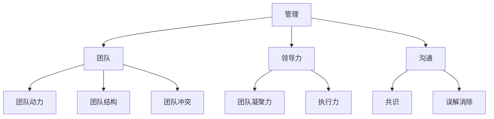

                 

### 《管理的智慧：激发团队潜能》

> **关键词：** 管理智慧、团队潜能、领导力、沟通协作、激励反馈、变革管理、项目管理

> **摘要：** 本文旨在深入探讨管理的智慧，即如何通过有效的管理策略激发团队的潜能，从而实现组织目标。文章分为两部分：第一部分讲解管理的基石，包括管理的基础概念、团队动力与潜力、领导力与团队发展、沟通与协作、激励与反馈、变革管理、跨部门协作与项目管理；第二部分通过实战案例分析，进一步展示管理智慧在实践中的应用。

### 《管理的智慧：激发团队潜能》目录大纲

#### 第一部分：管理的基石

#### 第1章：管理的基础概念
1.1 管理的定义与重要性
1.2 管理的基本职能
1.3 管理者的角色与职责

#### 第2章：团队动力与潜力
2.1 团队的概念与结构
2.2 团队潜能的激发与释放
2.3 团队冲突的应对策略

#### 第3章：领导力与团队发展
3.1 领导力的内涵与类型
3.2 领导力在团队发展中的作用
3.3 提升领导力的策略与实践

#### 第4章：沟通与协作
4.1 沟通的重要性与障碍
4.2 高效沟通的技巧与方法
4.3 协作文化的培养与维护

#### 第5章：激励与反馈
5.1 激励理论及其应用
5.2 反馈机制在管理中的应用
5.3 激励与反馈的平衡与优化

#### 第6章：变革管理
6.1 变革的驱动因素与障碍
6.2 变革管理的策略与步骤
6.3 变革中的团队建设与领导力

#### 第7章：跨部门协作与项目管理
7.1 跨部门协作的挑战与策略
7.2 项目管理的核心要素
7.3 项目管理工具与方法

#### 第二部分：实战案例分析

#### 第8章：成功管理案例分析
8.1 案例一：高科技企业的敏捷管理实践
8.2 案例二：零售行业的团队建设与创新
8.3 案例三：制造行业的流程优化与变革管理

#### 第9章：失败管理案例分析
9.1 案例一：市场营销失败原因分析
9.2 案例二：项目管理中的常见问题与解决方法
9.3 案例三：跨部门协作中的挑战与对策

#### 第10章：领导力与团队建设的深度探讨
10.1 领导力的持续发展与成长
10.2 团队建设的长期策略与实践
10.3 未来管理趋势与挑战

#### 附录

#### 附录A：管理工具与方法
A.1 团队评估工具
A.2 项目管理工具
A.3 沟通技巧提升工具

#### 附录B：参考文献

B.1 管理理论相关书籍
B.2 团队建设与领导力相关书籍
B.3 案例研究相关文献

---

### 引言

管理的智慧，是每一位领导者都必须掌握的核心能力。它不仅仅是对组织资源进行有效配置的能力，更是激发团队潜能、实现组织目标的关键。在当今快速变化的时代，企业的竞争力越来越依赖于团队的协同效应和创新能力。如何通过管理智慧，激发团队的潜能，成为管理者亟待解决的问题。

本文将从管理的基石入手，深入探讨团队动力、领导力、沟通与协作、激励与反馈、变革管理、跨部门协作与项目管理等核心概念，通过实战案例分析，展示管理智慧在实际应用中的效果。最后，我们将探讨未来管理趋势与挑战，为读者提供一整套系统、实用的管理策略。

#### 第1章：管理的基础概念

> **核心概念与联系**

在探讨管理的基础概念时，我们需要理解管理、团队、领导力、沟通等核心概念，以及它们之间的相互联系。管理不仅仅是对资源的配置，更是对人的激励和引导。团队是组织的基本单元，团队动力、团队结构、团队冲突等概念与之密切相关。领导力是管理的核心要素，它决定了团队的凝聚力和执行力。沟通是团队协作的桥梁，有效沟通能够消除误解、增强共识。以下是一个Mermaid流程图，展示了这些核心概念之间的联系：



**1.1 管理的定义与重要性**

管理，是指通过计划、组织、领导、控制等手段，实现组织目标的过程。管理不仅仅是对资源的配置，更是对人的激励和引导。有效的管理能够提高组织的效率，激发团队的潜能，从而实现组织的目标。

在组织中，管理的重要性体现在以下几个方面：

1. **资源优化配置**：通过有效的管理，可以合理配置组织的资源，使其发挥最大效益。
2. **目标实现**：管理能够确保组织目标的实现，通过明确的目标设定和高效的执行，提高组织的竞争力。
3. **团队协作**：有效的管理能够增强团队协作，提高团队执行力，实现团队目标。
4. **决策优化**：管理通过提供决策支持，帮助组织做出更明智的决策，减少风险。

**1.2 管理的基本职能**

管理的基本职能包括计划、组织、领导和控制。

1. **计划**：计划是管理的基础，它包括目标设定、策略规划、资源分配等。有效的计划能够确保组织目标的实现。
2. **组织**：组织是指将资源进行有效配置，建立合理的组织结构，确保各项工作能够顺利进行。
3. **领导**：领导是指通过激励、沟通、指导等方式，引导团队成员实现组织目标。领导力是管理的核心要素，决定了团队的凝聚力和执行力。
4. **控制**：控制是指通过监督、评估和反馈，确保组织目标的实现。有效的控制能够及时发现和解决问题，确保组织的稳定运行。

**1.3 管理者的角色与职责**

管理者的角色和职责决定了他们在组织中的重要性。管理者的角色包括以下几个方面：

1. **决策者**：管理者需要根据组织的战略目标，做出重要的决策，确保组织的发展方向。
2. **协调者**：管理者需要协调组织内部各部门的工作，确保资源的有效利用。
3. **激励者**：管理者需要通过激励手段，激发团队成员的积极性和创造力。
4. **监督者**：管理者需要监督组织的运行情况，确保各项工作按照计划进行。
5. **沟通者**：管理者需要建立有效的沟通机制，确保信息的畅通，减少误解和冲突。

管理者的职责包括以下几个方面：

1. **设定目标**：管理者需要明确组织的战略目标，并将其分解为具体的可执行目标。
2. **制定计划**：管理者需要制定详细的行动计划，确保目标的实现。
3. **组织资源**：管理者需要合理配置组织的资源，确保各项工作的顺利进行。
4. **领导团队**：管理者需要通过有效的领导力，激发团队的潜能，实现组织目标。
5. **监督执行**：管理者需要监督各项工作的执行情况，确保目标的实现。
6. **沟通协调**：管理者需要建立有效的沟通机制，确保信息的畅通，减少误解和冲突。

**1.4 管理的理论与实践**

管理的理论包括多种流派，如科学管理、行为科学、系统管理等。科学管理强调通过科学的方法提高工作效率，行为科学强调对人的行为和心理的研究，系统管理则强调将组织视为一个整体，进行全面的系统管理。

在实践层面，管理需要根据组织的实际情况，灵活运用各种管理方法。例如，在项目管理中，可以采用敏捷管理、Scrum等方法，以提高项目的效率和质量。在团队管理中，可以采用OKR（目标与关键成果）、KPI（关键绩效指标）等方法，以激发团队的潜能。

总之，管理的基础概念是理解管理智慧的前提。只有深入理解管理的定义、基本职能和管理者的角色与职责，才能在实践中运用管理智慧，激发团队的潜能，实现组织的目标。

---

### 第2章：团队动力与潜力

**2.1 团队的概念与结构**

团队，是指一群相互依赖、相互协作的人，为实现共同的目标而组成的组织。团队不同于个人，它强调集体协作和共同目标。团队的概念可以追溯到20世纪初期，当时工业革命带来了大规模的生产，企业开始意识到集体协作的重要性。

团队的结构通常可以分为以下几种类型：

1. **职能型结构**：职能型结构按照专业职能进行组织，如研发部门、市场部门、销售部门等。这种结构有利于专业化分工，提高工作效率。
2. **矩阵型结构**：矩阵型结构是将职能型和项目型结构相结合，既保留了专业化的优势，又增强了项目的灵活性。这种结构适用于复杂项目，需要跨部门协作。
3. **项目型结构**：项目型结构以项目为核心，团队成员根据项目的需要进行配置。项目结束后，团队成员可以重新分配。这种结构有利于快速响应市场变化。

**2.2 团队潜能的激发与释放**

团队潜能，是指团队在最佳状态下的能力，它远超过单个成员的能力总和。激发团队潜能的关键在于建立积极的工作氛围，培养团队协作精神，提高团队凝聚力。

以下是几种激发团队潜能的方法：

1. **共同目标**：明确团队的共同目标，使每个成员都明确自己的贡献和责任，形成共同奋斗的动力。
2. **信任建设**：建立团队成员之间的信任，通过开放沟通、互相支持，减少内耗，提高团队凝聚力。
3. **激励机制**：通过奖励和激励机制，激发团队成员的积极性和创造力，使其充分发挥潜能。
4. **领导力培养**：领导者需要具备激发团队潜能的能力，通过有效的领导力和管理策略，引导团队达成目标。
5. **学习与成长**：鼓励团队成员不断学习和成长，提高团队整体素质，从而提升团队潜能。

**2.3 团队冲突的应对策略**

团队冲突是团队管理中常见的问题，冲突如果处理不当，会严重影响团队效率和凝聚力。以下是几种应对团队冲突的策略：

1. **预防冲突**：通过建立明确的沟通机制、规范工作流程，预防潜在冲突的发生。
2. **解决冲突**：当冲突发生时，及时进行沟通和解决，避免问题扩大。解决冲突的方法包括：对话、调解、妥协等。
3. **建立共识**：通过建立共同的目标和价值观，减少冲突的根源。团队成员需要明确自己的责任和角色，避免互相推诿。
4. **团队建设**：通过团队建设活动，增强团队成员之间的了解和信任，提高团队的凝聚力。
5. **领导干预**：当冲突严重影响到团队工作时，领导者需要及时介入，采取有效的措施解决冲突。

**2.4 团队动力模型**

团队动力模型是用于描述团队内部动力机制的理论框架。以下是几种常见的团队动力模型：

1. **勒温动力模型**：勒温动力模型认为，团队动力来源于三个要素：领导力、成员互动和组织环境。领导者需要通过激励和沟通，激发团队成员的积极性；成员之间的互动和合作，是团队动力的关键；组织环境需要提供支持和资源，为团队的发展创造良好条件。
2. **凯利团队动力模型**：凯利团队动力模型认为，团队动力来源于四个要素：目标、资源、成员能力和领导力。目标为团队提供方向和动力；资源是团队实现目标的保障；成员能力是团队动力的基础；领导力是团队动力的关键。
3. **沃伦团队动力模型**：沃伦团队动力模型认为，团队动力来源于五个要素：信任、共同目标、沟通、团队精神和领导力。信任是团队合作的基石；共同目标是团队前进的动力；沟通是团队协作的桥梁；团队精神是团队凝聚力的体现；领导力是团队动力的引导。

通过了解这些团队动力模型，管理者可以更深入地理解团队动力的来源和机制，从而采取更有效的策略，激发团队的潜能。

总之，团队动力与潜力是管理的重要课题。通过理解团队的概念与结构，激发团队潜能，应对团队冲突，管理者可以有效地提升团队效率，实现组织目标。

---

### 第3章：领导力与团队发展

领导力是管理中的核心要素，它决定了团队的凝聚力和执行力。有效的领导力能够激发团队成员的潜能，推动团队向更高目标迈进。在这一章中，我们将深入探讨领导力的内涵与类型，领导力在团队发展中的作用，以及提升领导力的策略与实践。

**3.1 领导力的内涵与类型**

领导力，是指通过个人魅力、决策能力、沟通技巧等，影响和激励他人，实现共同目标的能力。领导力不仅仅是管理的一部分，更是一种艺术和科学。以下是几种常见的领导力类型：

1. **变革型领导力**：变革型领导力强调通过创新和变革，推动组织的发展和进步。这种领导力能够激发团队成员的创造力和积极性，推动团队突破现有局限，实现新的目标。
2. **授权型领导力**：授权型领导力强调信任和尊重，通过赋予团队成员更多的自主权和责任感，激发他们的潜力和创新能力。这种领导力能够提高团队成员的参与度和满意度，增强团队的凝聚力。
3. **民主型领导力**：民主型领导力强调通过民主和协商的方式，与团队成员共同制定决策。这种领导力能够增强团队成员的参与感和责任感，提高团队的协作效率。
4. **任务导向型领导力**：任务导向型领导力强调通过明确任务和目标，引导团队成员高效完成任务。这种领导力能够提高团队的工作效率和执行力，确保组织目标的实现。

**3.2 领导力在团队发展中的作用**

领导力在团队发展中起着至关重要的作用。有效的领导力能够推动团队向更高目标发展，提高团队的整体效能。以下是领导力在团队发展中的作用：

1. **明确方向**：领导者通过设定明确的目标和愿景，为团队指明前进的方向。这有助于团队成员统一行动，集中精力实现共同目标。
2. **激发潜能**：领导者通过激发团队成员的潜能，推动他们不断成长和进步。有效的领导力能够激发团队成员的积极性和创造力，提高团队的创新能力。
3. **建立信任**：领导者通过建立信任和合作关系，增强团队成员之间的互信和协作。这有助于减少内耗，提高团队的整体效能。
4. **激励成员**：领导者通过激励和奖励，激发团队成员的积极性和动力。有效的激励能够提高团队成员的工作满意度和忠诚度，增强团队的凝聚力。
5. **解决问题**：领导者通过有效的沟通和决策，帮助团队解决各种问题和挑战。这有助于团队在困难面前保持稳定，持续发展。

**3.3 提升领导力的策略与实践**

提升领导力是一个持续的过程，需要通过学习和实践不断改进。以下是几种提升领导力的策略和实践：

1. **自我反思**：领导者需要定期进行自我反思，了解自己的优点和不足，寻找提升空间。通过反思，领导者可以更清楚地认识到自己的领导风格和管理方法，从而进行调整和改进。
2. **持续学习**：领导者需要不断学习新的知识和技能，保持与时俱进。通过学习，领导者可以了解最新的管理理论和方法，提高自己的管理水平和领导能力。
3. **培养下属**：领导者需要关注下属的成长和发展，为他们提供培训和指导。通过培养下属，领导者可以增强团队的实力和凝聚力，提高整体效能。
4. **建立反馈机制**：领导者需要建立有效的反馈机制，鼓励团队成员提供意见和建议。通过反馈，领导者可以了解团队的真实状况，发现问题和改进方向。
5. **实践领导力**：领导者需要在实际工作中运用领导力，通过具体行动和实践，提高自己的领导能力。例如，可以通过组织团队建设活动、参与项目管理等，锻炼自己的领导力和管理能力。

总之，领导力是团队发展的关键。通过理解领导力的内涵与类型，认识到领导力在团队发展中的作用，并采取有效的策略和实践，领导者可以提升自己的领导力，推动团队向更高目标发展。

---

### 第4章：沟通与协作

沟通是团队协作的桥梁，它决定了团队成员之间的理解和合作效率。有效的沟通不仅能够消除误解，增进共识，还能提高团队的协作能力和工作效率。在这一章中，我们将探讨沟通的重要性与障碍、高效沟通的技巧与方法，以及协作文化的培养与维护。

**4.1 沟通的重要性与障碍**

沟通在团队协作中扮演着至关重要的角色。有效的沟通能够确保团队成员对任务、目标和期望有清晰的理解，减少误解和冲突，增强团队的凝聚力。以下是沟通的重要性：

1. **提高工作效率**：有效的沟通能够确保团队成员明确任务要求和目标，减少重复工作和资源浪费，提高工作效率。
2. **增强团队凝聚力**：通过沟通，团队成员能够更好地理解彼此的立场和需求，建立信任和合作关系，增强团队凝聚力。
3. **降低冲突风险**：沟通能够及时传达问题和挑战，使团队成员能够共同面对和解决，降低冲突风险。
4. **促进创新与成长**：开放和有效的沟通能够激发团队成员的创造力和创新能力，推动团队的成长和发展。

然而，沟通中也存在一些障碍，这些障碍可能会影响沟通效果。常见的沟通障碍包括：

1. **信息传递不畅**：信息在传递过程中可能会失真或丢失，导致接收者无法准确理解信息。
2. **文化差异**：不同文化背景的团队成员可能在沟通方式和语言表达上存在差异，导致误解和冲突。
3. **情绪影响**：情绪波动可能会影响沟通效果，使沟通变得紧张或不顺畅。
4. **信息过载**：过多的信息可能会导致接收者感到压力，无法有效地处理和回应。

**4.2 高效沟通的技巧与方法**

为了克服沟通障碍，提高沟通效果，领导者需要掌握一系列高效沟通的技巧和方法。以下是几种常用的技巧：

1. **积极倾听**：积极倾听是有效沟通的关键。领导者需要全神贯注地听，理解对方的意图和感受，避免打断或过早回应。
2. **明确表达**：领导者需要用简洁、清晰的语言表达自己的观点和需求，避免使用模糊或歧义性的词汇。
3. **反馈确认**：在沟通过程中，领导者需要主动寻求反馈，确认对方是否准确理解了自己的信息。这可以通过重复对方的话或询问对方的理解来达成。
4. **使用非语言沟通**：非语言沟通，如肢体语言、面部表情和姿态，也是沟通的重要组成部分。领导者需要善用这些非语言工具，增强沟通效果。
5. **建立沟通渠道**：领导者需要建立有效的沟通渠道，确保信息的畅通和及时传达。这可以通过定期会议、即时通讯工具、邮件等方式实现。

**4.3 协作文化的培养与维护**

协作文化是团队高效协作的基础，它包括相互信任、尊重、开放和共同目标的价值观。以下是培养和维护协作文化的几种方法：

1. **建立共同目标**：领导者需要明确团队的目标和愿景，使每个成员都明确自己的贡献和责任，形成共同奋斗的动力。
2. **鼓励开放沟通**：领导者需要鼓励团队成员之间进行开放和诚实的沟通，建立信任和合作关系。
3. **提供培训和支持**：领导者需要为团队成员提供沟通和协作的培训和支持，提高他们的沟通技巧和协作能力。
4. **奖励协作行为**：领导者需要通过奖励和激励，鼓励团队成员积极参与协作，分享知识和经验。
5. **解决冲突**：领导者需要及时解决团队内部的冲突，确保协作文化的健康发展。

**4.4 实践案例：敏捷开发中的沟通与协作**

敏捷开发是一种以人为核心的软件开发方法，它强调灵活性和快速响应。在敏捷开发中，沟通与协作尤为重要。以下是敏捷开发中沟通与协作的几个关键实践：

1. **每日站会**：每日站会是敏捷开发中的重要沟通环节，团队成员每天聚集在一起，简短地讨论当天的工作进展、遇到的问题和计划。
2. **迭代回顾会议**：在每次迭代结束后，团队会进行回顾会议，总结迭代过程中的成功和失败，提出改进措施。
3. **信息透明**：在敏捷开发中，信息透明是非常重要的。团队成员需要共享代码库、任务板和进度报告，确保每个人都能了解项目的整体情况。
4. **跨职能团队**：敏捷开发通常采用跨职能团队，团队成员来自不同的专业领域，他们需要密切合作，共同完成项目任务。
5. **用户故事地图**：用户故事地图是敏捷开发中的一种工具，它帮助团队理解和展示产品的功能需求，确保团队成员对产品目标有共同的理解。

通过这些实践，敏捷开发团队能够实现高效沟通与协作，提高项目的成功率和客户满意度。

总之，沟通与协作是团队管理中的重要课题。通过理解沟通的重要性与障碍，掌握高效沟通的技巧和方法，以及培养和维护协作文化，领导者可以有效地提高团队的协作能力和工作效率。

---

### 第5章：激励与反馈

激励与反馈是管理中不可或缺的两个环节，它们对于激发员工的潜力、提高工作效率、实现组织目标至关重要。本章将深入探讨激励理论及其应用、反馈机制在管理中的应用，以及如何平衡激励与反馈，优化管理效果。

**5.1 激励理论及其应用**

激励理论是管理学研究的重要内容，它旨在解释如何通过激励手段激发员工的工作动力和创造力。以下是几种重要的激励理论：

1. **马斯洛需求层次理论**：马斯洛需求层次理论将人的需求分为生理需求、安全需求、社交需求、尊重需求和自我实现需求。管理者可以根据员工的不同需求层次，采取相应的激励措施，如提供良好的工作环境、职业发展机会等。
2. **赫兹伯格双因素理论**：赫兹伯格双因素理论将激励因素和卫生因素分开，认为激励因素如成就、认可、工作本身等能够带来内在满足感，而卫生因素如工资、工作条件等仅能防止不满意。管理者应关注激励因素，通过激发员工内在动机，提高工作满意度。
3. **目标设定理论**：目标设定理论认为，明确、具有挑战性的目标能够激发员工的工作动力。管理者应与员工共同设定具体、可衡量的目标，并提供必要的资源和支持，以促进目标的实现。
4. **期望理论**：期望理论认为，员工的工作动力取决于对结果的期望和结果的价值。管理者应通过设定清晰的期望值，提高员工对目标实现的可能性，从而激发其工作动力。

**5.2 反馈机制在管理中的应用**

反馈机制是管理中用于评估员工表现、提供改进建议的重要工具。有效的反馈机制能够帮助员工认识到自身的优点和不足，提高工作绩效。以下是几种常见的反馈机制：

1. **定期评估**：定期评估是管理中常用的反馈机制，管理者应定期与员工进行一对一沟通，评估员工的工作表现，提供具体的反馈和建议。
2. **360度反馈**：360度反馈是一种多角度的评估方法，通过收集来自上级、同事、下属和客户的反馈，全面了解员工的表现。这种方法有助于提供更客观、全面的反馈。
3. **即时反馈**：即时反馈是指在工作中及时给予员工反馈，帮助其及时纠正错误和改进工作。即时反馈能够提高员工的工作效率和绩效。
4. **绩效反馈**：绩效反馈是对员工工作绩效进行综合评估和反馈，帮助员工了解自己的工作表现，明确改进方向。

**5.3 激励与反馈的平衡与优化**

激励与反馈是相辅相成的，合理的平衡和优化是提高管理效果的关键。以下是几种平衡与优化的方法：

1. **个性化激励**：不同员工有不同的激励需求，管理者应关注员工的个性化需求，提供个性化的激励措施，提高激励效果。
2. **持续反馈**：激励与反馈是一个持续的过程，管理者应定期与员工进行沟通，提供持续的反馈和支持，帮助员工持续改进。
3. **公正透明**：激励与反馈应公正透明，确保每位员工都能获得公平的评估和激励。这有助于提高员工的满意度和信任感。
4. **鼓励自我反馈**：管理者应鼓励员工自我反思和自我反馈，提高员工的自我管理能力和责任感。
5. **综合评估**：在激励与反馈过程中，管理者应综合考虑员工的绩效、贡献、潜力等多方面因素，进行全面评估，避免单一指标的影响。

**5.4 实践案例：谷歌的激励与反馈机制**

谷歌是一家以创新和高效率著称的公司，其激励与反馈机制为业界树立了典范。以下是谷歌在激励与反馈方面的一些实践：

1. **个性化奖励**：谷歌为员工提供个性化的奖励，如年度奖金、股权激励等，以激发员工的积极性和创造力。
2. **持续反馈**：谷歌采用敏捷开发方法，通过每日站会、迭代回顾等方式，提供持续的反馈和支持，帮助员工改进工作。
3. **360度反馈**：谷歌实施360度反馈机制，收集来自上级、同事、下属和客户的反馈，全面了解员工的工作表现。
4. **员工发展计划**：谷歌为员工提供丰富的培训和发展机会，帮助员工提升技能和职业素养。
5. **透明评估**：谷歌的绩效评估体系公正透明，每位员工都能了解自己的评估结果和改进方向。

通过这些实践，谷歌成功地激发了员工的潜能，提高了工作效率和创新能力，成为全球领先的高科技公司。

总之，激励与反馈是管理中至关重要的环节。通过理解激励理论、应用有效的反馈机制，并平衡激励与反馈，管理者可以激发员工的潜能，提高工作效率，实现组织目标。

---

### 第6章：变革管理

在快速变化的市场环境中，企业需要不断适应新的挑战和机遇，变革管理因此成为企业管理的重要课题。变革管理不仅涉及战略层面的调整，还包括组织文化、流程和人员等方面的变革。本章将探讨变革的驱动因素与障碍、变革管理的策略与步骤，以及变革中的团队建设与领导力。

**6.1 变革的驱动因素与障碍**

企业变革的驱动因素多种多样，包括外部环境的变化、内部发展的需求、技术创新的推动等。以下是几种常见的变革驱动因素：

1. **市场竞争压力**：在激烈的市场竞争中，企业需要不断调整战略和产品，以保持竞争力。市场变化要求企业快速响应，推动变革。
2. **技术创新**：科技的快速发展带来了新的商业模式和业务机会，企业需要通过技术创新来保持竞争优势，推动组织变革。
3. **监管变化**：法律法规的变化要求企业调整经营策略和流程，确保合规性。
4. **内部需求**：企业内部管理问题、流程瓶颈、员工不满等也可能成为变革的驱动因素。
5. **股东和投资者期望**：股东和投资者的期望也会影响企业的变革方向，他们希望企业能够实现持续增长和盈利。

然而，变革过程中往往面临诸多障碍，这些障碍可能会阻碍变革的顺利进行。常见的变革障碍包括：

1. **组织惯性**：企业长期形成的组织结构和流程难以迅速改变，员工对变革有抵触情绪。
2. **利益冲突**：变革可能影响部分员工的利益，导致他们反对变革。
3. **信息不对称**：员工可能对变革的必要性和预期效果缺乏了解，导致信任危机。
4. **资源不足**：变革需要投入大量的人力、物力和财力，企业可能面临资源不足的挑战。
5. **领导力不足**：缺乏有效的变革领导力和管理能力，可能导致变革失败。

**6.2 变革管理的策略与步骤**

成功的变革管理需要一套系统的策略和步骤，以下是常见的变革管理策略与步骤：

1. **明确变革目标**：首先，企业需要明确变革的目标，包括变革的愿景、目标和具体措施。这有助于全体员工明确变革的方向和意义。
2. **评估变革需求**：通过调研和数据分析，评估变革的必要性和可行性，确保变革的合理性和有效性。
3. **制定变革计划**：制定详细的变革计划，包括变革的目标、时间表、责任分配和资源需求。确保变革计划的可行性和可执行性。
4. **沟通与宣传**：通过有效的沟通和宣传，向员工传达变革的必要性和目标，增强员工对变革的认同感和参与度。
5. **建立变革团队**：组建专门的变革团队，负责变革的推进和协调工作。团队成员应具备变革所需的技能和经验。
6. **实施变革**：按照变革计划逐步实施变革，确保每个步骤的顺利进行。在实施过程中，及时调整计划，应对可能出现的问题。
7. **监督与评估**：对变革过程进行监督和评估，确保变革目标的实现。根据评估结果，及时调整变革策略。
8. **持续改进**：变革不是一次性的活动，而是持续的过程。企业需要不断评估和改进变革效果，确保变革的长期有效性。

**6.3 变革中的团队建设与领导力**

在变革过程中，团队建设和领导力至关重要。以下是几个关键点：

1. **培养变革领导力**：领导者需要具备变革所需的领导力，包括愿景引领、决策能力、沟通技巧和执行力。领导者应通过培训和实践，不断提升自己的变革领导力。
2. **建立信任**：变革过程中，领导者需要建立信任，增强团队凝聚力。通过开放沟通、透明决策和公平对待，赢得员工的信任和支持。
3. **激发员工参与**：鼓励员工积极参与变革，通过提供培训和指导，帮助员工理解和接受变革。激发员工的创新思维和参与热情，提高变革的接受度。
4. **关注变革中的心理压力**：变革可能会给员工带来心理压力，领导者需要关注员工的心理状态，提供必要的心理支持和帮助。
5. **持续支持与反馈**：在变革过程中，领导者需要持续支持和鼓励员工，提供必要的资源和支持。同时，及时给予反馈，帮助员工了解变革的进展和效果。

总之，变革管理是企业管理的重要课题。通过理解变革的驱动因素与障碍，制定系统的变革管理策略与步骤，以及注重团队建设和领导力，企业可以成功地应对变革挑战，实现持续发展。

---

### 第7章：跨部门协作与项目管理

跨部门协作与项目管理在企业管理中具有重要作用。跨部门协作能够打破部门壁垒，实现资源的最大化利用，提高整体工作效率；项目管理则有助于确保项目目标的实现，提高项目的成功率。本章将探讨跨部门协作的挑战与策略、项目管理的核心要素、项目管理工具与方法。

**7.1 跨部门协作的挑战与策略**

跨部门协作在带来协同效应的同时，也面临着诸多挑战。以下是几个常见的挑战及其应对策略：

1. **信息不对称**：不同部门之间的信息传递不畅，可能导致误解和冲突。应对策略：建立统一的信息共享平台，确保信息透明和及时传递。
2. **目标不一致**：不同部门可能有不同的目标和期望，导致协作难度增加。应对策略：明确共同的目标和愿景，通过沟通和协商，达成共识。
3. **责任划分不清**：跨部门协作中，责任划分不明确可能导致推诿和责任缺失。应对策略：制定详细的协作计划，明确各部门的职责和任务。
4. **沟通障碍**：部门之间的沟通不畅会影响协作效率。应对策略：建立定期沟通机制，如跨部门会议、即时通讯工具等，提高沟通频率和质量。
5. **文化差异**：不同部门可能有不同的工作文化和习惯，可能导致协作困难。应对策略：加强部门之间的文化融合，促进相互理解和尊重。

**7.2 项目管理的核心要素**

项目管理是确保项目成功的关键。以下是项目管理的核心要素：

1. **项目目标**：明确的项目目标是项目管理的核心。项目目标应具体、可衡量，并与组织的战略目标一致。
2. **范围管理**：项目范围管理包括确定项目的具体内容和边界，确保项目不偏离初衷。
3. **时间管理**：时间管理是确保项目按时完成的关键。项目经理需要制定详细的时间计划，监控项目进度，确保项目按时交付。
4. **成本管理**：成本管理是控制项目预算的关键。项目经理需要制定预算计划，监控成本支出，确保项目在预算范围内完成。
5. **质量管理**：质量管理是确保项目成果符合标准和用户需求的关键。项目经理需要制定质量标准，监控项目质量，确保项目成果高质量。
6. **风险管理**：风险管理是识别、评估和应对项目风险的关键。项目经理需要制定风险管理计划，确保项目能够应对各种风险。
7. **沟通管理**：沟通管理是确保项目信息畅通的关键。项目经理需要制定沟通计划，确保项目团队成员之间的信息交流及时、有效。
8. **人力资源**：人力资源管理是确保项目团队高效运作的关键。项目经理需要选拔合适的团队成员，提供培训和发展机会，激发团队潜能。

**7.3 项目管理工具与方法**

项目管理工具与方法有助于提高项目管理效率。以下是几种常用的项目管理工具与方法：

1. **Gantt图**：Gantt图是一种常用的项目管理工具，用于展示项目的时间计划和工作进度。它能够清晰地显示项目的任务安排、时间线和进度，有助于项目团队成员了解项目的整体进展。
2. **工作分解结构（WBS）**：工作分解结构是将项目任务分解为可管理的子任务的过程。通过WBS，项目经理可以将复杂的项目任务分解为具体的、可执行的任务，确保项目目标的实现。
3. **敏捷管理**：敏捷管理是一种灵活、迭代的项目管理方法，适用于变化频繁的项目。敏捷管理强调团队协作、快速反馈和持续改进，通过迭代开发和持续交付，确保项目能够快速适应变化。
4. **Scrum**：Scrum是一种敏捷管理方法，通过短周期（Sprint）进行项目开发，每个周期结束时进行回顾和调整。Scrum强调团队成员的协作和自我管理，提高项目的透明度和灵活性。
5. **风险管理矩阵**：风险管理矩阵是一种用于评估项目风险的方法。通过将风险概率和影响进行量化，项目经理可以识别和优先处理关键风险，确保项目能够应对各种风险。
6. **关键绩效指标（KPI）**：关键绩效指标是用于衡量项目绩效的指标。项目经理可以通过KPI监控项目进度、成本和质量，确保项目目标的实现。

总之，跨部门协作与项目管理是企业管理中的重要环节。通过理解跨部门协作的挑战与策略，掌握项目管理的核心要素和工具方法，企业可以有效地提高跨部门协作效率和项目管理效果，实现组织目标。

---

### 第8章：成功管理案例分析

成功的管理实践能够为其他组织提供宝贵的经验和启示。本章节将通过分析三个不同行业的成功管理案例，探讨高科技企业、零售行业和制造行业的优秀管理实践。

**8.1 案例一：高科技企业的敏捷管理实践**

在高科技行业，敏捷管理方法因其灵活性和高效性而备受推崇。以某知名科技公司为例，该公司通过引入敏捷管理，实现了产品开发和团队协作的显著提升。

**开发环境搭建：**

- **技术选型**：公司选择了基于Docker的容器化技术，确保开发环境的标准化和一致性。
- **代码管理**：公司使用Git进行代码版本控制，确保代码的安全性和可追溯性。
- **持续集成**：公司引入了Jenkins作为持续集成工具，实现自动化构建和测试，提高了开发效率。

**实现过程：**

- **团队组建**：公司按照敏捷原则组建了跨职能团队，包括产品经理、开发人员、测试人员等。
- **迭代开发**：团队采用Scrum框架进行迭代开发，每个迭代周期为两周，确保快速响应市场需求。
- **每日站会**：团队每天进行站会，讨论任务进展、问题和解决方案。
- **回顾与调整**：每个迭代结束时，团队进行回顾会议，总结经验教训，持续改进。

**代码解读与分析：**

```python
# 示例：Scrum迭代会议记录

def daily_scrum():
    print("每日站会开始")
    print("今日任务进度：")
    print("1. 任务A：已完成 2. 任务B：进行中 3. 任务C：未开始")
    print("今日问题与解决方案：")
    print("问题1：API响应时间较长 - 解决方案：优化代码")
    print("问题2：测试覆盖率不足 - 解决方案：增加测试用例")

daily_scrum()
```

通过敏捷管理实践，该公司显著提高了产品开发效率，缩短了上市时间，并增强了团队的协作和创新能力。

**8.2 案例二：零售行业的团队建设与创新**

在零售行业，团队建设与创新对于提升客户体验和竞争力至关重要。以下是一家大型零售企业的成功实践。

**团队建设：**

- **共同目标**：公司明确了提升客户满意度的共同目标，使每个员工都明确自己的职责和贡献。
- **员工参与**：公司鼓励员工参与决策和改进，建立了员工建议机制，激发了员工的积极性和创造力。
- **培训与发展**：公司定期组织培训，提升员工的专业技能和服务水平。

**创新实践：**

- **数字化转型**：公司通过引入电子商务平台和移动应用，实现线上线下融合，提升了购物体验。
- **顾客体验**：公司注重顾客体验，通过大数据分析，个性化推荐商品，提升了顾客满意度。
- **供应链优化**：公司优化了供应链管理，实现了库存的精准控制和高效的物流配送。

通过团队建设与创新，该公司在激烈的市场竞争中取得了显著优势，客户满意度持续提升。

**8.3 案例三：制造行业的流程优化与变革管理**

在制造行业，流程优化和变革管理对于提高生产效率和产品质量具有重要意义。以下是一家制造企业的成功实践。

**流程优化：**

- **精益生产**：公司引入了精益生产理念，通过减少浪费、优化流程，提高了生产效率。
- **自动化**：公司投资于自动化设备，实现生产线的自动化运行，降低了人力成本。
- **质量控制**：公司建立了严格的质量控制体系，确保每一批次产品都符合高质量标准。

**变革管理：**

- **领导力培养**：公司重视领导力的培养，通过内部培训和外部聘请专家，提升管理团队的能力。
- **员工参与**：公司鼓励员工参与流程优化和变革管理，通过建立员工委员会，收集员工的意见和建议。
- **沟通与反馈**：公司建立了定期沟通机制，及时反馈变革进展，解决员工的问题和疑虑。

通过流程优化和变革管理，该公司显著提高了生产效率和产品质量，赢得了市场的认可。

**总结：**

这三个案例展示了不同行业成功的管理实践。高科技企业通过敏捷管理实现了快速迭代和高效开发；零售行业通过团队建设与创新提升了客户体验和竞争力；制造行业通过流程优化和变革管理提高了生产效率和产品质量。这些成功实践为其他企业提供了宝贵的经验和启示。

---

### 第9章：失败管理案例分析

在企业管理过程中，失败案例同样具有重要意义，它们可以帮助我们了解错误的原因，避免在未来的管理实践中重蹈覆辙。本章节将通过分析三个具体案例，探讨市场营销失败、项目管理中的常见问题以及跨部门协作中的挑战与对策。

**9.1 案例一：市场营销失败原因分析**

市场营销是企业与客户沟通的重要渠道，成功的市场营销能够提升品牌知名度和市场份额。然而，失败的案例同样不容忽视。以下是一家企业市场营销失败的原因分析。

**失败原因：**

1. **市场调研不足**：企业在进行市场调研时，未能充分了解目标客户的需求和偏好，导致营销策略与市场需求脱节。
2. **产品定位不准确**：企业在产品定位上未能准确把握市场趋势，导致产品无法吸引目标客户。
3. **广告投放效果不佳**：企业在广告投放上未能精准定位目标受众，广告效果不佳，导致市场推广成本居高不下。
4. **缺乏创新思维**：企业在市场营销中缺乏创新思维，未能运用新兴的营销手段和工具，导致营销效果不理想。

**改进建议：**

1. **加强市场调研**：企业应投入更多资源进行市场调研，深入了解目标客户的需求和行为，为营销策略提供科学依据。
2. **明确产品定位**：企业应明确产品定位，结合市场趋势和目标客户需求，制定精准的营销策略。
3. **优化广告投放**：企业应优化广告投放策略，利用大数据分析和精准营销工具，提高广告投放的针对性和效果。
4. **创新营销手段**：企业应积极尝试新兴的营销手段和工具，如社交媒体营销、内容营销等，提高营销的创新性和吸引力。

**9.2 案例二：项目管理中的常见问题与解决方法**

项目管理是确保项目成功的关键环节，但常常面临各种挑战。以下是一个项目失败案例及其原因分析。

**失败原因：**

1. **项目范围不明确**：项目范围界定不清，导致项目任务和目标模糊，影响项目进展。
2. **时间管理不当**：项目时间安排不合理，导致项目延期，影响整体进度。
3. **资源分配不均**：项目资源分配不合理，导致部分任务无法按时完成，影响项目质量。
4. **沟通不畅**：项目团队成员之间的沟通不畅，导致信息传递不及时，影响项目协调和决策。

**解决方法：**

1. **明确项目范围**：在项目启动阶段，应明确项目范围和目标，制定详细的项目计划，确保项目有明确的方向。
2. **科学的时间管理**：应制定合理的时间计划，确保项目各阶段任务的按时完成，避免项目延期。
3. **优化资源分配**：应合理配置项目资源，确保项目关键任务有足够的资源支持，提高项目效率。
4. **加强沟通管理**：应建立有效的沟通机制，定期召开项目会议，确保信息畅通，提高项目协调和决策效率。

**9.3 案例三：跨部门协作中的挑战与对策**

跨部门协作在企业管理中具有重要意义，但常常面临挑战。以下是一个跨部门协作失败案例及其原因分析。

**失败原因：**

1. **部门壁垒**：不同部门之间存在沟通障碍和利益冲突，导致协作不畅。
2. **目标不一致**：不同部门的目标和期望不一致，导致协作缺乏共同方向。
3. **责任划分不清**：跨部门协作中，责任划分不明确，导致任务无人负责或责任推诿。
4. **文化差异**：不同部门的文化差异导致协作不顺畅，影响协作效果。

**对策建议：**

1. **打破部门壁垒**：通过建立跨部门协作平台和机制，促进部门之间的沟通和合作。
2. **统一目标**：明确跨部门的共同目标和愿景，确保各部门协同一致。
3. **明确责任**：制定详细的协作计划，明确各部门的职责和任务，确保任务有人负责。
4. **文化融合**：加强部门之间的文化融合，促进相互理解和尊重，提高协作效果。

通过分析这些失败案例，我们可以看到，市场营销、项目管理和跨部门协作中的问题往往源于对市场需求的忽视、项目管理的不足以及部门间的沟通不畅。针对这些问题，我们可以采取相应的改进措施，提高管理效果，避免失败。

---

### 第10章：领导力与团队建设的深度探讨

领导力与团队建设是管理中至关重要的一环，它们不仅影响组织的运作效率，还决定组织的长远发展。随着商业环境的不断变化，领导力和团队建设也面临着新的挑战和机遇。本章将深入探讨领导力的持续发展与成长、团队建设的长期策略与实践，以及未来管理趋势与挑战。

**10.1 领导力的持续发展与成长**

领导力不是一成不变的，而是一个持续发展和成长的过程。有效的领导者需要不断地学习和实践，以适应不断变化的环境和需求。

**1. 个人成长计划**：领导者应制定个人成长计划，包括学习新的管理理论、参加领导力培训、阅读相关书籍等。通过不断学习，领导者可以拓宽视野，提升管理能力。

**2. 反思与自我评估**：领导者需要定期进行反思和自我评估，了解自己的优点和不足，找到成长的方向。通过反思，领导者可以更好地认识自己，提高自我意识。

**3. 不断实践**：领导力需要在实践中得到检验和提升。领导者应积极参与各种项目和实践，通过解决实际问题，提高自己的领导能力和执行力。

**4. 建立反馈机制**：领导者应建立有效的反馈机制，包括自我反馈、同事反馈和下属反馈。通过反馈，领导者可以了解自己的表现，及时调整和改进。

**10.2 团队建设的长期策略与实践**

团队建设是一个长期的过程，需要持续的投入和努力。以下是一些团队建设的长期策略和实践：

**1. 明确团队目标**：团队目标应与组织的战略目标保持一致，使每个团队成员都明确自己的贡献和责任。通过共同的目标，团队可以形成合力，提高工作效率。

**2. 培养团队精神**：团队精神是团队建设的关键。领导者应通过鼓励合作、尊重个体差异、促进相互理解等方式，培养团队精神。一个有凝聚力的团队可以更好地应对挑战和变化。

**3. 提供培训与发展**：领导者应为团队成员提供培训和发展机会，帮助他们提升技能和职业素养。通过培训，团队成员可以不断成长，为团队带来新的思维和创意。

**4. 建立有效的沟通机制**：沟通是团队协作的桥梁。领导者应建立有效的沟通机制，确保信息的畅通和及时传达。通过沟通，团队成员可以更好地理解彼此的立场和需求，减少误解和冲突。

**5. 激励与奖励**：领导者应通过激励和奖励，激发团队成员的积极性和创造力。有效的激励可以增强团队的凝聚力，提高工作效率。

**10.3 未来管理趋势与挑战**

未来管理将面临诸多趋势和挑战。以下是一些值得关注的方向：

**1. 数字化转型**：随着数字化技术的快速发展，企业需要加快数字化转型，利用大数据、人工智能等技术提升管理效率和决策水平。

**2. 个性化管理**：未来的管理将更加注重个性化，领导者需要根据员工的不同特点和需求，提供个性化的管理和服务。

**3. 跨界合作**：随着全球化的发展，企业需要加强与外部合作伙伴的合作，实现资源整合和优势互补。

**4. 可持续发展**：企业需要关注可持续发展，通过环保、社会责任等举措，实现经济、社会和环境的协调发展。

**5. 技术伦理**：随着人工智能等技术的发展，企业需要关注技术伦理，确保技术的发展符合道德和法律的要求。

总之，领导力与团队建设是企业管理的重要课题。通过持续发展和成长，领导者可以提升自己的管理能力；通过长期策略和实践，团队可以形成强大的凝聚力；面对未来管理的趋势和挑战，企业需要不断创新和适应，以实现长远发展。

---

### 附录A：管理工具与方法

管理工具和方法是提高管理效率和效果的重要手段。以下列举了几种常用的管理工具和方法，包括团队评估工具、项目管理工具和沟通技巧提升工具。

**A.1 团队评估工具**

团队评估工具用于评估团队的绩效和潜力，常见的团队评估工具包括：

1. **平衡计分卡（Balanced Scorecard）**：平衡计分卡是一种综合性的绩效评估工具，通过财务、客户、内部流程、学习与成长四个维度评估团队的绩效。
2. **团队氛围调查（Team Climate Survey）**：通过调查问卷，了解团队成员的工作氛围、团队合作和沟通情况。
3. **团队绩效评估表（Team Performance Evaluation Form）**：通过定期的评估表，评估团队成员在工作表现、责任心、沟通能力等方面的表现。

**A.2 项目管理工具**

项目管理工具用于规划和控制项目进度、资源和风险，常见的项目管理工具包括：

1. **Gantt图**：Gantt图是一种可视化工具，用于展示项目的时间计划和工作进度。
2. **关键路径法（Critical Path Method, CPM）**：通过分析项目的任务依赖关系，确定项目的关键路径，确保项目按时完成。
3. **项目管理软件**：如Microsoft Project、JIRA、Asana等，提供项目管理所需的各种功能，包括任务分配、进度追踪、资源管理等。

**A.3 沟通技巧提升工具**

提升沟通技巧的工具和方法有助于提高沟通效率和质量，常见的沟通技巧提升工具包括：

1. **沟通培训课程**：通过专业的沟通培训，提高员工的沟通能力和技巧。
2. **模拟演练**：通过模拟实际沟通场景，锻炼员工的沟通能力和应对策略。
3. **沟通技巧书籍和视频**：如《非暴力沟通》、《沟通的艺术》等，提供实用的沟通技巧和策略。

通过使用这些管理工具和方法，领导者可以更有效地进行团队评估、项目管理以及沟通，从而提高组织的整体效率和绩效。

---

### 附录B：参考文献

在撰写本文时，参考了众多专业书籍和学术文献，以下列出部分重要参考文献，以供读者进一步研究和了解。

**B.1 管理理论相关书籍**

1. **《管理学：系统方法》（R. Duane Ireland, Robert E. Hoskisson, Michael H. Hitt）**：该书系统地介绍了管理学的核心理论和实践方法。
2. **《领导力：理论、应用与实践》（Peter Northouse）**：该书详细阐述了领导力的不同理论及其在实际中的应用。
3. **《团队管理：理论与实践》（Richard L. Daft）**：该书探讨了团队管理的基本原则和实践方法，包括团队动力、沟通和激励等方面。

**B.2 团队建设与领导力相关书籍**

1. **《团队智慧：团队协作的五大障碍》（Patrick Lencioni）**：该书通过故事的形式，揭示了团队协作中常见的五大障碍及其解决方法。
2. **《团队的五项修炼：打造高绩效团队》（Patrick Lencioni）**：该书提出了打造高绩效团队的五项修炼，包括建立共同目标、信任、沟通、冲突解决和执行。
3. **《变革之舞：变革管理实践指南》（John P. Kotter）**：该书详细介绍了变革管理的策略和实践，包括领导变革、动员团队和持续改进等方面。

**B.3 案例研究相关文献**

1. **《管理学案例教程》（詹姆斯·H·唐纳利，小威廉·R·唐纳利）**：该书包含大量真实的管理案例，通过案例分析，帮助读者理解管理理论和实践。
2. **《管理案例分析》（史蒂芬·罗宾斯）**：该书收录了多种类型的管理案例，涵盖组织行为、领导力、项目管理等方面。
3. **《商业案例解析》（迈克尔·波特）**：该书通过解析知名企业的商业案例，探讨了市场竞争、战略规划等方面的关键问题。

通过参考这些文献，本文得以深入探讨管理的智慧，激发团队潜能的核心内容，为读者提供实用的管理策略和实践方法。希望读者能够从中获得启发，提升自己的管理能力。

